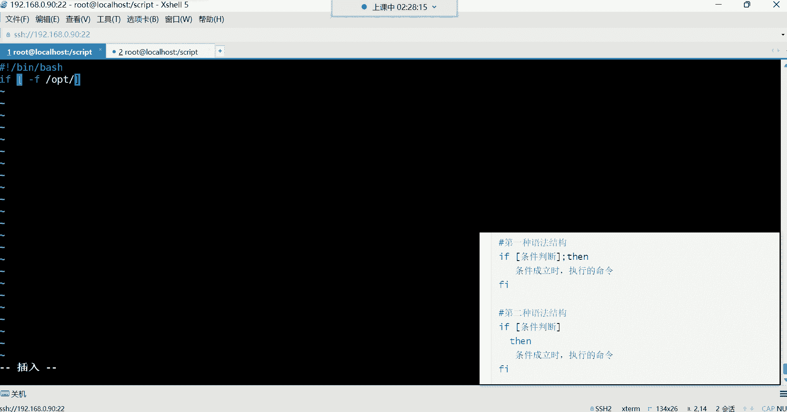
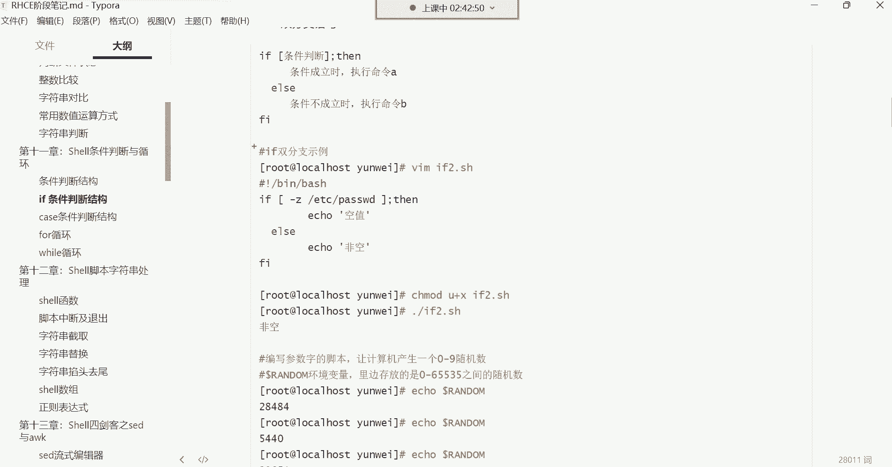
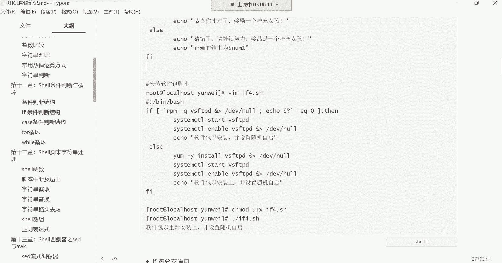

# 零基础入门Linux，红帽认证全套教程！Linux运维工程师的升职加薪宝典！RHCSA+RHCE+中级运维+云计算课程大合集！ - P41：红帽RHCE-6. if判断、if单分支、if双分支、if多分支 - 广厦千万- - BV1ns4y1r7A2

好，接下来呢我们就开始讲这个。讲这个异务判断了。那异务判断跟我们前前边讲的那个这个条件判断，其实他们干的事是一个事儿。当条件满足的时候，他执行什么操作，条件不满足的时候，他又去执行什么样的操作？😊。

那么们来看看if服，那衣服的话呢，它比前面的那个前面这种条件判断啊，什么并且或者它比较简单。哎，它的功能呢就是有限，适合去一些简单的逻辑。你可以用它去什么呢？去实现简单的逻辑哈，如果复杂的逻辑的话呢。

那这个我们就得用这个衣服了。😊，那这个时候我们这个对于这个义务判断的话，来了解它的三种语法。第一种呢。第一种语法结构叫什么呢？叫做if的单分支判断。那单分支它的特点就是只能判断对，不能判断错。

哈哈那这个有点意思是吧，只能判断对，不能判断错。😊，啊，也就是说只能在条件成立的时候，它才能帮你去执行它的语句，能理解吧？如果你的条件失败呢，那就不执行了。好，来看一下它的语法，if单分支的语法哈。

if然后呢这位置是你的条件，你的条件放到中文号里面。因为我们前面学过很多的什么判断文件状态，是不是啊等等等等，什么做数字对比，这些都可以当做if的条件。😊，啊，比如说我看一些这个什么呢？

看一些这个文件啊，比如这个文件如果存在的话，那我做什么事情？如果文件不存在，我做什么事情。😊，这就是你的条件了。然后它的语法后面的这个然啊然，我们来把这语法拿过来哈，来演示一下。😊。

这单分之啊两种语法。

好，然后我们回到我们的那个路径。squi的路径。然后进来之后呢，我们自己编写一个呃，判断啊if1点SH啊，if01点SH。然后在这里边井号叹号杠定下的置。if然后呢空格。

条件判断条件是不是在中括号里面判断呢？啊，一般我们怎么判断呢？比如说杠F判断一个文件啊，哪个文件呢？比如说我要看OPP下边这个文件有没有一个叫什么呢？叫。😊。

我看我第一个是怎么判断的哈。😊，来一个入门级别的。啊，判断这个文件在不在，然后给我输出一，然后给我艾一句话也可以。

FETC下的passWD的文件。我们是不是判断这个文件它的状态呀，这个文件存不存在呀？如果存在的话，是不是条件就成立了呀？成立以后呢啊它的这个语句看哈你可以这样写，后边呢这个然然不就是然后吗？

然后做什么事情，然后就是你要执行的命令了，这里边缩不缩进都可以。为了语法的美观，我们做个缩进，挨一个。😊，挨靠什么呢嗯。存在。存在。然后接下来判断结束了。判断结束的话，就是FI代表语句的结束啊。

if代表语句的开始，然后FI代表语句的结束，然后这里边有我的判断的条件。如果条件成立了，然啊，然就是然后的意思，就这个条件成立了，然后我执行这条命令，然后我的判断就结束了。那这个第二种语法是这样写的。

if。中括号啊，这是你的判断ETC的。pass。WD然后第二种语法你可以怎么写呢？这样把然写到这个位置。好，那你说我写到这位置，前面这个空格干嘛？有有什么意义吗？没有意义，你加不加缩进都行。

但是我们为了语法的美观，一般搞个缩进能理解吧，搞个缩进。😡，然后接下来，然后就开始执行你的操作呗，那就你要执行的命令。Ile。比如说存在。啊，判断结束了。那你们觉得哪个语法？😡。

就是让我们看起来更加的呃觉得更加的舒服一些。他这不是两种语法结构吗？是吧啊第二个吗？你们觉得啊第二个看着舒服点是吧哦。😡，啊，习习惯用这第二种是吧，都行，效果都一样都一样哈。😊，都行。都可以哈。

缩进怎么缩都可以。😊，嗯，还有说第一种是吧？没关系啊，其实最常用的是第一种。😊，知道吧？最长是第一种哈，然后咱们保存退出，然后来看一下执行一下。😊，啊，点杠E01回车。看到了吧？是不是存在呀？

那如果我给它改一下，怎么改呢？😊，我亮。我换一个不存在的文件，你看它还能给你判断吗？比如说ABCD。😊，回车哎，你看。他没执行什么意思呢？就是条件不对。条件不对，他就不执行。所以这种衣if辅单分支。😊。

他只能帮你去干嘛呢？

判断对。不能不断错。那你说这东西哎呦那不行啊，那你光判断对不判断错，那是肯定不行的，是不是啊？嗯，所以有的有的时候你就比如说我我们前面安装软件包的时候，你如我安个包，如果用if的话，是不是？😡。

我先去看一下这包到底在不在是吧，如果在的话，你再给我去安装后边的这个再过直行后边的操作是吧？如果不在的话呢，呃那又该做什么样的操作，那if哎它可以实现就在在条件成立的时候，我做什么操作。

在条件失败的时候，我再做什么样的操作，这个我们得用它的第二种语句叫做双分支。😊，哎，等一下哈，怎么卡了呢？😊。

我跟你们讲哈，现在对于室有脚本来讲，你们学习室有脚本大多数都是去改别人的脚本，没有没没有多少脚本是需要你们自己去写的。为什么呢？因为大多数脚本别人已经都都有现成的了。

你们只需要去根据自己的需求去改吧改不就可以。你就比如说我昨天。😡。

刚写一脚本，我昨天写了哪个脚本呢？就是一个自动发布项目的一个脚本啊，当然这是在后期你们会这个学到的一个内容，那个内容叫什么呢？叫做CACD啊，就叫持续集成与持续交付。啊，这里边。😊。

我昨天写写了一个脚本，这个脚本呢非常的简单啊，这个这个脚本叫jakins deployy点SH。😊。

这个脚本呢。其实后期大多数大家都是去改，都是去改哈。你看这脚本就非常的简单，怎么简单呢？😊，前面应该都能看懂吧，be by是不是？然后接下来呢。😊，这是什么呀？变量。变量名是吧，叫webDR。

那这个变量名里面装的什么呀？哎，装的是路径啊，装是装的是一个路径。那第二个呢是不是也是变量名啊？好，那这个变量名这个变量名里面装的什么呢？哎，也是一个路径，看到了吧？😊，然后。那下边这儿还有一个变量名。

这个变量名中也装的是什么呀？哎，也是啊，这个是一条命令，这个命令是获取什么呢？系统时间的，获取时间以后把时间存起来，存到变量里面了，是吧？然后接下来看命令。😊，开始切换切换到哪里呢？切换到这个。😊。

变量名定义的这个路径下边，是不是你看我说切换到这个。路径下面啊，其实不就是等于说切换到这个路径了吗？是不是啊哎，切换之后干嘛，并且。😊，并且哎只有切换成功之后，我才能执行后面的命令吧。哎，得先进去。

然后再执行打包，看到吗？怕打包干嘛呀？😊，打包哈对文件内容打包点星代表当前路径的所有。啊，把所有内容给它打包，然后打包到哪里呢？打不到一个路径下边，然后打包以后叫什么名字叫web。然后呢，什么呀？哎。

每到 time每到 time是谁呀？是他是不是啊？那它不就是一个时间嘛？这个时间就是获取我当前系统的一个年月日，小时0分钟秒的一个时间。😊，啊，也就是说我这个打包以后的文件名字要附在我当前的系统时间。

😊，然后点t点GZ，这是文件的名字是吧？你看这里面是是不是变量。😊，然后接下来呢负循环啊，这里面有个有负循环，我们没有讲到复循环是吧？负循环，我们后面会讲啊复循环就是开始帮我循环执行这里面的语句。

看到吧？这里面的语句，那SSH去连连哪个机器。😊，这里面哈连哪个机器，然后做什么操作CD，然后切换到路径，然后创建目录看到了吗？这些一系列的东西其实后期就是你改你改别人的东西。

不是说让你上去就噼里啪啦自己敲。你很你学脚本，我跟你讲哈，在你。😊，近几在你对于脚本来讲，近几年你都不会能够写出一个非常鲜入的脚本来，知道吧？

也用啊。不用也用。

就是这种东西你就满满足你的需求就可以。呃。一般室有脚本在哪里找是吧？有资源网站吗？没有资源网站。没有这些网站，但是你自己去网上搜吧，用什么脚本去百度。嗯，去委托书。那没有办法呀，是不是那那有啥办法？啊。

那也有办法，也不是没有。后期呢嗯我也会给你们。嗯，后期我也会给你们发一些脚本，这些脚本都够你们用的了。这这些脚本都是我从网上扒来的啊，但是这个。都是非常实用的，改吧改吧就行。啊。

这里面有109个事有脚本合集看了吧？109个。对，109个的话，你想想，那平时我们说工作中能不能用得到呢？当然能了，你看这里边是吧，都有什么呢？叫Ddos攻击防范的自动屏蔽攻击IP地址，看到了吗？

这里边。你比如说有人攻击你了，有人有人攻击你们公司的网站了，你看上来这脚本是吧，变代名里边是什么呀？不就是时间嘛？是吧？年月日小时分钟表啊，但是他这没有年月日啊，就是小时分钟秒。😊，然后说变量。

变量里面定什么呢？一个文件，哪个文件。😡，access点 log叫访问日志的一个文件。啊，接下来下边这个变列名是吧，这是不是都是变列名啊，然后里边什么取命令结果。😊，是不是你看每刀小括号。

是不是啊一直一直到这儿，是不是要取这个命令结果呀？你看取这条命令的结果存到这个变量里边。😡，是不是而接下来开始做什么呢？哎，开始去循环啊，循环里边会调用一些这个变量啊，做一些事情啊下边。

等等等等这一系列的东西哈，后期你学完以后，你只要能看得懂。😊，就可以了。然后再改，然后去改吧改过别人的脚本，这就算是不错了，你能改明白，对你能改明白就不错了。但是呢没关系，慢慢改呀是吧？

改多了不就会了吗？你刚开始你说好，我改不明白，那后期你改多了，自然而然不就会了吗？😡，是不是啊啊，所以这些东西后期我发给你们，你们参考啊，工作中比如说这个有哪些需要用的啊，到时候可以去参考参考，行吧？

😊，参考参考。看了吗？这里面哈。查看网卡实时流量的这里边叫查看网卡的实时流量。那这脚本我们能不能用呢？我也不知道是不是啊，拿过来我先看一眼。复制。系。复制呢，这怎么不能复制呢？

Ctrorl C。好，然后拿过来。我们搞一下试试哈，叫这个什么呢？这个叫让它叫network吧。😊，nettwork点SH。粘进去。啊，粘进去。然后这里边改一改啊，改什么呢？它过滤网卡流量是不是啊？

你看这里边等于。😊，等于dol一，那这do勒一是不是它得让我们给它输入一个什么呢？一个值啊啊，然后ic口杠E啊，什么 in跟out，这 in就是入out就是出啊。

就是入口跟出口然后where处开始循环循环过滤过滤谁呀？哎过滤这个变量名，是不是啊？那这个变量名里面存的是do一，那这个do勒一。😡，啊，这刀了一。这刀的一我们应该怎么给？是吧。啊，我看怎么给哈。

这兜一他肯定是。😊，过滤这个网卡的入口流量，出口流量啊，我看一下哈。😊，这玩意儿怎么给呢嗯。先执行一下哈。😊，给他个指行权限，加个X。有了执行权限了，我先执行了一个脚本net work。

然后后边跟一个我看看啊那个叫嗯。这个。E副康菲格ENS32。啊，不行，他不是这样用的哈，我看他里面有没有告诉怎么用。

怎么用啊，这玩意儿。

嗯。啊，直接跟名字看一眼哈，直接跟名字。呃，直接跟名字，那就不用敲命令了。嗯，ENS32。回车。啊，可以。你看是不可以用这过滤网卡的入口流量，这是出口流量，我们这有吗？没有啊，入口出口但它是一直循环啊。

它是死循环。他不听。一直一直在帮你过滤，看到一秒钟过滤一次一秒钟过滤一次。然后这样你可以看到我网卡的好in就是入口啊，然后这个out就是出口。看到了吧？这种东西以后比如说我们公司服务器。

我发现啊这流量啊被占满了，是不是？那到时候看一看现在的带宽。😡，啊，到底是达到多少了啊，每秒吗？你看每秒的入口流量能达到多少，每秒的出口流量能达到多少，是不是可以这样看一看呢？😊，啊。

但是我我们现在没有任何的支出哈，所以你看脚本这东西。😊。

你到时候可以干嘛呀？是不是咱们说就是看看别人这个东西他怎么用，是不是啊？😡。

然后自己不就借鉴一下不就完事儿了吗？😡，是是那这种东西你要自己想写出这么一个东西，其实那可能得需要点时间啊，也可以，但是得需要点时间。😡，能理解吗。😊，啊，但是他这个E呃我直接输入网卡名。

那它是我看一下它这里边是怎么获取的AWK。有 true。WK。打印啊，它是直接获取的网卡。

啊，行，简单了解一下哈，就是这种东西你们知道你以为你们学完以后，你们自己可以写脚本了呀啊，那是不可能的知道吧？啊，那是不可能的，就是借鉴别人的，然后拿过来改不改吧。😊。

那你说就像刚刚那脚本拿到别的服务器可以用吗？😡。

嗯。你发现这拿到别的服务器是不是也可以用啊？😡，是不是拿给别人也可以。也可以哈，打击到你了是吧？😊。

不很正常，这东西就是很正常，你只要会改就行，你不需要去自己去写，能理解吧？啊，好，那接下来我们再来说这个。😊，衣服的双分制。if双分支的话，在这个里边它既能判断对，又能判断错。然后它的语法格式。

是这样子的。

我来一个E02哈，E。嗯，VIM衣。02点SH。金。嗯，井号叹号杠并且的bitch，然后接来if条件。我这个条件是什么呢？还是判断那个文件杠F判断哪个文件呢？OPT下边的ABCD点TIT。点TATT好。

然后接下来说我判断这个文件存不存在呀啊，那这个判断以后是不是会有两种结果，第一种就是存在。😊，啊，存在的话呢。存在的话，它就执行这个然后边的语句。那然里边的语句你写什么呀？比如我ecle一个存在。😊。

嗯，存在好，那第二种结果，这文件就是不存在，不存在怎么办呢？啊，不存在我们。这个让它美观一些哈，我们做几个缩进。如果不存在呢，加一个叫Ios。😊，al就是当条件不成立的时候，它会执行al里的命令。

如果条件成立呢，执行然里面的命令。所以你发现ifif单分值的时候，它没有I，所以说就是它只能判断对，不能判断错，只有条件成立的时候。它执行然里边的语句。啊，所以咱这个东西就是条件成立的时候。

它会执行的命令。他是执行咱里边的命令哈。😊，如果这个失败了，那就执行L里边的命令，它是这样子的。所以说我现在再加一个条件。还匙。嗯，I就条件失败怎么办啊条件失败我们。建文件touch可不可以？

在OPT给我建1个ABCD点TATT出来是吧？然后FI结束。这样你看就是。如果这个条件是成立的那就执行这条命令。如果不成立，那就执行这条命令。那你说这命令只能执行一条吗？不是。追完以后哎还可以尽晚写哈。

😊，你自己再加个ic，比如说我再icle一个。文件创建成功。文件。创建。成功。是不可以哪个文件？啊，就是这个AB。ABCD点TT。文件创建成功。然后来看效果哈，全制moode if02。加一个X。好。

然后接下来执行它if02回车。是吧那你看OPD有没有那文件呢？是不ABCD点TIT呀。啊，我们再这样再把这个OP的目录给它清空。OPT下的星，然后接下来再执行这脚本哈，if02。回调。你看那他现在嗯。

嗯，对，现在就是编程啊，现在就是编程。你看他现在就是在干嘛呢？就是在判断呢是吧？判断这个路径下的文件到底在不在呀，是不是？那他判断以后，他发现哎这个路径文件不在呀，不在的话。

这条这条这个然里面的语句是不是就没有执行啊？😊，啊，那没有执行怎么办？没有执行没关系。哎，如果条件失败的时候，哎，你给我执行al里边的语句给我去创建它。那那有了衣服的话。

那它比前面的那个呃简单的条件判断要给力的多上来我先干嘛呀？我先我想安装软件包。如果说有了双分支的话，我想安装软件包的话，那这里边。

哎，这个安装软件包。

那其实就方便的多了。我现在想安包，那我不知道这包在不在是吧？那这时候怎么办？判断一下吧。😊，是不是可以判判断他一下呀？怎么判断呢？RPM杠Q啊，查VSFTPD。查他哎，那你说这样查。

我把命令放到这儿可以吗？😡，我们来看看啊，这里边哎查询列包啊存在啊，如果失败，我们ic一个啊，我们先先先先不做别的事情，我们就先这样。我们就挨le一个。嗯，第一个是存在。

第二个是如果失败的时候就不存在呀啊不存在。不存在。好，保存退出，我看这样可不可以执行哈。😊，诶。你看可以。Okay。是吧。😊，还可以哈，你看他把那个命令也给你执行了一下。😊，把哪个命令呢？

他把衣服判断里的命令也给你执行了一下，看到吗？把这个包给你显示出来了，是不是啊？😊，也就说这里边后边也不是说只能放条件吧啊，也可以放命令。但一般我们放命令也不这么放，怎么放呢？我可以这样玩。

就是哎把命令也放到条件里边。😊，放到条件里哈，那放到条件里边，这东西怎么玩呢？我们做对比。😊，做对比哈，就是这个。我先把这个命令的结果给它引起来。给他引起来。这里面放命令没有任何问题。嗯。引起来。

引起来之后，我这边当然留空格啊，这部分要留空格。我引起来之后，我这样嗯。我判断怎么判断呢？杠这个EQ嗯，EQ是不是等于啊等于什么呢？等于0。等于0。等于零的话是什么意思呢？就是这条命令执行完以后。

如果等于零，是不是就等于查出了这个包它是存在的呀？没错吧，那这时候他是不是这个命令就不会显示出来它的结果了呀？哎，我自己去在内部判断。😊，看效果哈。好，这个时候来执行一下。啊。这是我看一下哈。第二行。

什么意思？呃，这是2PM杠Q啊，取出来的结果。呃。啊，那我不这样玩了哈，我不这样玩。😊，最好的方法怎么玩呢？放变量。嗯。不放变量哈，不那样玩了哈这样。😊，比如说那个什么呢？这个随便啊，就是这个。

I等于啊把命令结果先给它取出来是吧？RPM杠Q是吧？VSFTPD。取出来啊，取出来之后呢，我再这样。用谁呢？用美多I哎美度I杠1Q如果等于0的话，这样是不可以啊？哎，我这里面不直接放命令了。😊。

我把命令结果存到这个变量里边，然后我直接用变量的值。跟他做对比。是不可以？啊，那这个值不对呀，这个值的话，我是不是还得问他一下呀，问他以后才能对呀。😡，对啊，所以这里边。在ic呃，就直接每到问就可以。

哎，到了问。啊，不是啊，这玩意儿。看哈这个上面。这个命令。是这样的，并且这样。然后。没到问号。是这样的哈，哎执行完命令以后，我呢再问一下它的结果。😊，嗯，那么这时候再没到哎。不懂哎。哎，杨。这也不行吗？

这这这这这这这也不让吗？你看这语法多这语法多别人呢，是不是啊？啊，那这样问吧是吧，那就这样问。嗯，那不行，你这问谁呀啊，问I吗？😡，这样逻辑对吗？你们觉得。哈你看他还真行，他说存在。😊，你看了吗？

其实他问的这样，他也是在问谁呢，就问上一条命令。那，但是这样不是很准确。如果你上边你说我们再有一些其他的命令存在怎么办呢？😡，再有其他命令存在，他可不一定是问这条命令了。

有可能是问他的上一条命令是不是啊？所以这样不是很准确哈，不是很准确。😊，呃，最好就是嗯。刀了问，然后这里边我们在想办法让他干嘛呢？让他直接针对美道I去问，是不是啊？😊，啊，针对于美到I问美到I。对。

那行，先不研究他了啊，先不研究他了。先不管他了。这里边你发现一个小小的判断能给你搞蒙喽。很复杂的这里边。好，我们说这个继续说这个双分支哈，哎，这双分支。那你看下面的话呢，这里边是不是它既能判断对。

又能判断错呀？😊。

没错，又能判断对，又能判断错。那接下来我这里边啊，我们现在有个需求，比如说我想编写一个猜数字的脚本。😊，猜数字。什么意思呢？就类似于那种这个。比如说你这个猜讲一样啊，如果猜对了的话啊，我给你干嘛呢？

给你输出一些内容，猜错了，我再给你输出一些内容。那这时候我们怎么办？😊，啊，怎么写这个脚本？那如果你想实现这种猜数字的话，那其实呢啊就是主要是练习一下我们这个if啊，它的一些判断。这时候我们得猜数字。

我得需要一堆数字，是不是啊？哎，我得先干嘛呢？我得先让计算机产生一个随机数。😊。

那随机数的话，比如说我就我把这个数字控制在0到9范围内。0到9的范围内，那这个范围我怎么控制啊，这个范围。而且每次它产生的数据产生的数0到9是随机的吧，你不能控制一个固定的数，是不是啊？哎。

每次随机随机的去。给我输出0到9之间的某一个数字。那这个怎么。来获取这个随机数呢。所以在系统里边它有一个叫做random。啊，有个环境变量ENV。rananddom我们找一找哈。这里面能不能看得到啊？

嗯。过滤一下哈ENV管道给rap。Random。啊，怎么没有呢？那就在DV下边，然后。rananddom啊，那就是它啊它是一个什么呢？它是一个设备文件，这个设备文件它的功能是什么呢？

它的功能是会帮我们输出随机数。啊，这个随机数它有一个变量名，环境变量里边有一个叫做random啊，这里面没有看到啊。啊，没有看到算了吧啊，其实如果这个你想看的话，还有一个命名叫s。

set set是看系统里边这个所有的变量的。这里边能看到那个rundom吗？Random。过滤一下啊过滤一下。Right。Rom。嘿 randomom呢。Rundom。哎，奇了怪了。诶。算了哈。

不找他了。eical美刀。😊，rananddom回车看到了吗？你一输出的话，他干嘛呢？😡，他会帮我们产生一个随机数。你看我每次输出，你发现这数它不固定，看到了吗？有有大有小吧，是不是啊？哎，对它不固定。

那这个数不固定的话，那这时候。😊，就是他最大可以到多少呢？它最大可以到65535。65535哈。那这时候。那数字太大了，你让别人猜，那这别人怎么猜呀，是不是？那简直就是这个6万分之1的概率。

这这几乎不太现实哈。所以这时候我要控制它的范围，把它控制在多少呢？控制在10以内啊，0到9，那怎么样才能控制到10以内呢？😊，哎，我对这个每次产生的随机数干嘛呢？哎取它的余数。是不可以啊？

把他的余数给他取出来。没错，那这时候怎么取鱼啊？就是。我们那个加减乘除理的那个道乐福。是不是啊然后取。百分号取鱼。那这个鱼我对它取鱼。

看看这时候你得指定它每次产生的数。它每次产生的数，然后针对于谁去取呢？哎，十没错哈，针对于十。所以这个后边你要写1。

这时候你在每次获取数的话。看了吗？你看他每次是不是都是随机的呀，但是他这个范围是不是从0到9之间了呀？😊，哎，你说为什么它不超过十0呢？为什么不超过十0呢？因为呀他如果一旦超过十了。😡。

是不是就除开了呀？是不是就变成零了吧，是不是啊？那它取的是除除不尽的余数啊。😡，嗯。是不是啊？所以这里边你要明白一个道理，就是它取出来的这些余数。它永远都是要小于它的这个被除数的。

那它的余数永远小于它的这个被除数。如果等于如果等于这个十的话，是不是就除开了呀？除开的话是不是就应该是零了呀，是不是啊？😡，啊，所以它永远是小于被除数啊，那也不可能大于。😊，好，那接下来。

我们就通过这种方法，是不是就可以取出控制这个随机数的范围了呀？那控制之后呢，那这脚本怎么写？

啊，这里边。

参考一下哈。在那边。这是好久以前写的了。

这个时间不长也容易忘了这种东西。时间不长，我跟你讲脚本这些东西啊。他就像我们平时学习命令，其实是一个道理。命令你时间不时间长不敲，你发现哎呦容易忘是吧？记不起来，脚本也一样，脚本时间长不写。

你也这个逻辑也跟不上那。衣服。03。点儿SH。井号叹号杠并下的bitch。啊，接下来这个思路就是什么呢？第一，用readd杠P。我们这。编写一个让别人猜数的脚本。那这时候这数是不是得让别人猜呀？

那让别人猜的话，这里边你得获取用户在键盘上输入的那个数。所以readd杠P让他自己输。read杠P，你自己输入输入字就行了。然后我告诉你，哎，范围请输入0到9。之间的一个数字。不是。好，接下来。如果。

猜对了。奖励。嗯。奖励什么呢？奖励。哇塞女孩是吧，哇塞女孩儿。是不可以哎，这样别人才有这个才有什么呢？才有这个兴趣去猜，然后number啊数字。让别人他猜完以后，是不是把这个值扔到这里边了呀啊。

他猜什么，这个里边就是什么，接下来判断啊，条件判断，先把语法结构给它写出来。😊，Wfi。那这里边。我们判断什么？我们现在要判断用户的数跟我每次的随机数是不是相等，是不是啊啊，那上边。还得。

再来一个什么呢？变量名是吧？嗯，number一等于等于什么呢？就是命令行里面的这个。随机数，每次我是不是得把这个随机数存起来呀？你看每次它对时取余的数，我存到变量里边。

那接下来我拿这个变量里的数跟用户的这个输入的这个数做对比做判断。那这时候是不是就比较简单了呀。哎，这里边就是刀了。Number。然后再跟谁做对比呢？哎，再杠EQ再跟这个刀了。number一做对比是吧？

如果它俩相等EQ是不是就等于啊？如果相等的话，那干嘛呢？哎，我们就给你eical一个，你猜对了。😊，就恭喜。中奖。恭喜中奖。嗯，然后奖励。哇塞女孩儿。是不是啊一个。作为。嗯。奖励袜滩女孩作为作为一天。

嗯，所以一天的一个。恭喜中奖啊，奖励袜财女孩。一天啊，可以使用一天是吧？啊，好，第第一个哈嗯奖励一半的女孩天使用一天随便哈。😊，外胎女孩一枚啊一枚吧，是不是？好，那他如果没猜对呢？😡，没猜对怎么办呢？

是一这个L。alse对，这这就是说白了这就否则了，是哈？你猜对了。😊，我然后是吧你猜不对，我就否则了是吧，否则我就e一个。嗯。猜错了。猜错了。猜错了，然后这个。哇塞女孩。正在等着你。

正在等着你是不是请继续努力。请继续努力。努力。哎，哒哒当。哒哒哒好说可以，然后要不要告诉他正确结果呢，也可以。下边你再把正确结果告诉人一下，不然人以为你这里边有一些猫腻呢，是吧？啊，e。😊，告诉人一下。

啊，就是本次。本次猜奖。猜奖的。正确结果为。给多少呢？喂。没到。Number1。啊是不是他呀，它产生的数就是正确结果，然后他们两个做个对比，是不是啊？😊，然后。好，保存退出。让我们来看效果哈。😊。

给他一个，我们就不给执行权限了，直接拜扯执行了。if03好，回车这时候现在是不是开始猜了呀啊，0到9之间的数字猜对了就奖励哇塞女孩。接下我现在来一个8回车。😊，猜错了啊，这是与哇塞女孩无缘呢。好。

那再来一遍，再猜猜几猜6回车。啊，又猜错了是吧，看到吗？又猜错了，这又与他无缘是不是啊，这看来今天是雨哇赛女，看来今天是雨哇赛女孩，确实是无缘哈。无哎呦中奖了，看到吧？😊，嗯。

但是这个确实是得需要靠次数才可以了哈啊。😊，这就是呃通过什么呢？通过义务判断，哎，主要就是演示一下他能判断对，也能判断错。是不是挺不错的，判断对又判断错。

然后这里面又掺杂了一些我们前面讲的那个什么呢？这个。一些这个就是条件判断。然后除了条件判断以外呢，又掺杂了一些我们前面讲的这个就是加减乘除取余啊，它们的一个应用啊，都可以放在脚本里面。

所以条件判断是所以说异辅判断它是离不开这个你给定的条件的。然后你给定条件的时候，我们最方便的就是通过变量。😊，能理解吧，哎，把你要这个判断的东西放到变量里边，然后到时候呢通过变量去帮你判断。啊。

所以这个你看我们前面学的那些零0碎碎的，是不是到这里边就感觉哎派上用场了。😊，啊。好，然后这是我们这个参数是吧，这里边哎呦这个删掉吧哈这种东西。😊，一看这与哇塞女孩也是缘分太浅。哼太浅哈。😊，啊。

然后下边哎这个安装软件包啊，我看我上次是怎么写的哈，刚刚没实现啊，这时候你看我就是把命令放到这个放到这个条件判断里了。然后是这样子的哈啊，我啊是这样的啊，icle的一个没道问，看到了吧？😊。

那那其实是可以这样玩的，就是我们像我们前面写了一半是吧，感觉。

这逻辑上有点过不去了。那我们在。回到刚刚的那个E02这个脚本。我们现在比如说我就想去编写一个安装软件包的一个判断脚本。那这时候我这里边是直接把命令写到这个判断里面了。那你我们也可以直接搞一个什么呢？啊。

就搞一个这个。😊，搞一个变量2PM。啊，或者说这个叫叫什么都行哈啊，就RPM吧，等于。😊，这条命令判断这个包在不在。那判断完之后，这结果呢一般不要啊，不然他把结果呃。😊，啊，其实也可以这样，哎。

那就简单了哈。😊，我们可以这样，各位，你看咱们前面这里边写命令了，是不是啊？然后他把命令给我输出出来了，我不要输出是不是啊RPM杠QVSFTPD然后干嘛呀？哎，结果不要，不然他把结果给你输出出来。😊。

那我们不想要那个结果扔掉，扔到低V的黑洞里边，是不是啊啊？扔到黑洞之后呢，你看这里边我用个分号啊，我是用分号隔分号隔开了。😊，嗯。啊，那这样还是相对简单一些吧。然后接着呢就ecle每到问。没到问。

问结果呗啊，那这个也不行，他们是一起的哈，都引到一起，每到问号，然后问我的上条命令，它的执行结果是不是啊啊，那一直到这儿。😊，就是说这条命令，其实我是不是可以放在前面定一定一个变量啊？没错吧。

就是可以给他定一个变量。如果。你觉得这样看起来有些。不美观的话，就这样RPM等于。哎，这样，然后这里边判断的话呢，我们让它变得简洁一些。好，那这时候我在干嘛呢？再判断啊。

如果说这个RPM嗯杠EQ如果等于零的话，然后是不是就这个存在或者说不存在。这样是不是就可以了呀？没错吧，哎，这样就可以了。然后哎看一下效果哈，执行if02。😊，回车哎，你看是不是可以，那我现在。😊。

把包给它卸掉杠EVSFTVD我再执行啊，回车哎不存在。是不是啊？嗯。嗯，这个括号。

呃，括号是做条件判断的。咱们前面学了这么多判断，你看什么字符串判断是吧，是不是全都在这个中文号里边执行的呀，你不带中括号。😊，他就是所有的判断都得放到中文号里边。

但是你这里边中号里边你的判断放什么，那是不是我们最终就看自己的情况了呀？那这里边我是不是可以用变量啊，没错吧，其实也可以直接去引用命令。但是呢引用命令不美观啊，所以还不如像这样。

像我们这样哈像我们这样直接干嘛呢？哎，直接去。😊，通过编列名在这里边看起来更加清晰一些。判断。那这时候我判断之后，那那存在不存在，那不行，干嘛呀？哎，我们要实现一个就是给我安包，没错吧，如果存在的话。

是不是就不选完了？如果不存在呢？不存在的话。那下边。我们。来开始哈安装软件包。Ile一个。告诉他哎，正在安装软件包VSFTPD软件。那接下来我们是不是就在这儿用亚姆杠外ins安装VSFTVD是不是啊啊。

安装完以后，那接下来呢再把服务起来是sstemstar VSFTVD然后再给它设置成随据字写。那这里边我可以这样。并且。是不是可以这样，那这命令是不是可以放到一起了呀？😊，是吧安包并且起服。并且。

是服11日起。没错吧嗯。就这样。然后再并且看服务状态。然后FI结束。来拍结束。那这些结果我是不是可以不要啊？😡，是不是啊？啊，但留着吧，看一看是不是看看结果。来啊，执行一下E-02。回车哎，不存在是吧？

不存在就正在安装啊，接来开始给我安。😊，按完以后，你看起伏是不是啊，这服都起来了是吧？看状态ok。😊，嗯。嗯。啊，这就是这个我们说的这个。判断啊判断就是你看我这里边。如果说。第一步其实存在的话。

我这里边是什么呢？直接起服务了啊，如果第一步判断成功了，就是这包存在的话，是直接起服务，设置服务随机自起。然后这些结果呢就不要。然后最后我们艾le一个叫软件包已安装，并设置随机自起，这种也可以。

只不过这种是更加人性化一些。你看哈，如果我们是这样的话，如果这包存在的话，但是呢它可能没有起伏务，是不是啊？哎，我们可以在在这里边啊执行一些啊就是。😊，他这个存在的一些相关命令，他存在以后。

我希望干嘛呢？我把这个命令拿过来哎，启动他的服务。并是随之起。这样是不可以？啊，但是这个结果我都不要啊。😡，每次执行完命令之后啊，什么启动服务，启动服务一般没有返回啊，设儿服务随自己。

一般它会有一些返回值啊，那要不要呢？不要扔掉。扔到第一V的黑洞里，然后接下来啊再看状态，那就别看状态了。是不是啊？就别按状态了。就直接下边再告诉别人，挨口一个嗯这个。软件包啊，就服务已启动啊。

VSFTPD服务已启动。然后下边那如果不存在呢，是吧？不存在就告诉别人正在安装软件。是吧然后下边就开始安呗，安的话，这结果要不要呢？这结果也不要太多了，是吧直接。扔走。扔到DV下的黑洞里边。

然后再去给我起伏务，设置服务随机自起。那看状态状态也不看。最后呢。在告诉别人。嗯，这个。服务已启动。是否可以？为了美观，我们可以干嘛呢？哎，可以让它缩进对齐。是不是啊这样就可以了哈OK然后保存退出。😊。

我们现在给那包卸掉RPM杠E。VSFTPD。好，然后开始执行脚本。E02走你他正在安装是吧？那这个过程是不是没有什么输出啊，这里面有个呃。有一个输出输出我们可以也不要它。哪个呢？就是随机自起。

这个随机自起有个出出。也不要DV的黑洞。是不是啊，然后杠一卸掉。啊，就是再执行。好，那正在安包。啊，是不是你看正在安装，然后服务已启动，这样就可以。嗯。啊，可以套衣服。嗯，给他一波。

然后对中括号就是判断的。衣服可以哈。好。衣服里边套衣服，但是你刚开始的时候，你你逻辑是乱的，你可能不是很好理解，能理解吧。😡，说如果有报错也没提示，如果有报错，他也不提示了。这种的话。

我们把所有的输出是不是都扔了呀？😊，那有报错，他也不提示了。那没关系，你最后如果你担心的话，你可以干嘛呀？咱们看个状态是不是并且。😊，看看状态。挨过以后。那你说我艾le以后，这里边。

我是不是就可以在干嘛呀？再去这个。System。star，然后看一个状态。这样是不可以就放心了嘛？是。好，这样。这样也可以。看状态是吧。啊，但是他已经启动了哈。😊，这是第一个衣服里的语句，我们卸掉。

这样。是吧。这样就没有问题。看个状态，哎，看running了。好，可以了，就这样。

啊，这是一幅双分支，双分支就是既能判断对，又能判断错。好。那接下来还有什么呢？还有一个叫多分支。这是双分值，是不是啊？然后。我们可以自己去玩一玩，编写一个猜参数的。然后呢，如果是这个练习的话呢。

可以自己去想想啊，如果安装软件包，我们这种东西嗯你看可以怎么玩，结合变量，再结合判断，是不是？你看我说最常用的是不是就这个美道问号啊，哎，然后还有这些。😊，做数字判断的这些是必较常用的。啊。

今天就这样吧，把多分支讲完呢，把多分支讲完的，然后这个多分支的话呢。😊，嗯，我们来说一说啊，它呢就是有点复杂了。你看哈他是就是可能说我有很多个条件，我这个条件非常多。😊，嗯。

就是不是说在对的时候给我执行什么操作，或者在错的时候执行什么操作，可能说我有很多个条件。第一个条件错了。好，那你没给我执行，那我还有第二个条件。😡，第二个条件，如果错了。那我还有第三个条件可不可以呢？

可以。可以哈。就是感觉结果挺好的是吧？对，这里边来看看。😊，啊，来看一下哈，就是我可以放很多条件。第一个条件如果成立了好，我就执行第一个条件里的语句。😊，能理解吧？好。

然后那如果第一个条件人家就没成立呢，失败了呢？😊，哎，没关系，这有个叫Lif啊，I if就是可以继续再加条件啊，再来一个条件2。😊，如果条件二成立呢，就我执行条件二里的这个语句。好。

那如果条件二也没有成立呢，也失败了。那怎么办呢？你可以继续无限下去啊，继续条件3。😊，看了吗？然后条件4条件5。无陷下去。那如果以上所有条件都没有成立呢，如果条件都失败了，最后al，这就是否则了。

就是否则了哈，否则就。😊，最后执行这个操作。你看它这里边if条件判断是不是啊？判断成功了，然就是然后。所以它这里边怎么理解呢？你看。😊，如果条件成立了，然后我就执行这个里的语句。那如果失败了呢。

啊对I if。二一不是什么意思啊？如果翻译过来，是不是就是这个。那个叫。嗯。如果呀。是不是如果呀嗯。你看。如果条件二成立了，然后执行这个操作。如果条件三成立了，执行条件三的指令。嗯。这不是否则吗？

这这是否则吧。然后否如果条件都不成立，否则啊给我执行这个里的命令。

那这里边下边呢我这里边还有一个编写成绩的一个脚本，这个会用到这个多 if付。这个多 if的话，在这里边如果写的话，你比如说我们编写一个判断成绩的脚本。

那这种东西虽然说我们不这种东西这活虽然说不是我们干的哈，但是用sha也可以实现shall0。

04点SH。井号叹号杠变下的外置。那在这里边，如果说猜成绩的话。对，底下不走了哈。哎，我想完这个脚本，你们就明你就明白他这个多衣服它的一个逻辑了啊，看哈。瑞了杠P。干嘛呢？哎，让别人输数啊是吧。

输说自己的成绩啊嗯请。输入自己的成绩。进行查询。这时候搞个变量是吧？number，然后接下来呢。开始判断。这时候怎么判断呢？哎，这时候我们就是。😊，如果用户的那个输入的数，这个。如果杠EQ啊。

这时候不不能杠EQ了哈，这时候就得这个。😊，哎呀，这是记忆啊。啊，大于等于啊，那么就G大于等于90。然后。就icical啊，你的成绩非常优秀。成绩非常的优秀啊，那这么优秀的孩子，我们奖励嗯一个。嗯。

一个哇塞女孩是吧，哎，哇塞女孩。行哈。嗯啊，奖了一个旺彩女孩。那。😊，那如果这个人他的成绩。没有达到90分呢，你看我这是记忆啊，是大于等于。就是你看他的成绩是大于90分也可以，或者说等于90分也可以。

但是这个人他成绩没有达到90分，比如80分怎么办呢？😡，那如果80分呢。😡，那是不是这个条件就失败了呀？😡，他不会挨这个命令了吧。是不是啊？那接下来哎多条件的时候啊。ELif叫Lif。

我们再给你来个条件。那这个条件就是如果说他的成绩。如果说大于等于多少呢？80。哎，那你看这样能跟80匹配了吧，你看大于等于就是80也行，大于80也行，但是它没到90。😡，没有到90啊，那这时候哎然后。

我Iical嗯，你的成绩比较优秀，对你的成绩。比较。优秀。嗯，但是没有哇塞女孩。但是哎离。你。离是哇塞女孩的奖励仅差一步。警差一步。好。有点伤心了是吧？

然后那接下来那如果这个人他确实是连80分也没有达到怎么办呢？那是不是这个条件也失败了呀？😊，那这个语句是不是也不执行啊？好，那。还有一幅再来一个条件。那如果这人比如我考了70多分呢，好，那。

如果他的成绩。他说的成绩是。大于等于70分的啊，也包含70是不是啊啊，那然后。我叫icical。嗯，你的成绩比较什么比较一般。成绩。比较一般啊。还需还需努力。还需努力。这离。哇塞女孩儿。还差很远。

还差很远的距离。然后接下来。那如果这个人他考了连70分都没有呢。啊，考60分。好Number。如果大于等于60。那这时候是不是60分勉强及格啊？是不是啊哎这叫勉强及格。勉强及格。这就。勉强及格。好。

那没那60分都没有呢，连及格都没及格的。好，那最后。😡，50多分、40多分、30多分、20多分都归类到哪里呢？啊，最后。L这里边，但这里边我们一般干嘛呢？哎，做两个缩进哈。😊，L。这里边就没有条件了。

L4就没有条件了，直接I口是吧？对你收拾一下。回家种地去吧。啊。都没及格，还在城里混啥呀？是不是？城里这套路这么深。不太适合你FI结束。好，那现在。来哈执行一下。开始。E-04。

回车请输入自己的成绩查询是吧？我输入多少呢？比如我现在输入，你看现在问题来了。😊，我这个脚本里面我这么多条件，它是不是得从第一个条件开始帮我去判断呢？第一个条件是不是啊，然后第二个条件帮我去判断。

那如果说。😊，我输入的条件是80的话，是不是第一个不满足啊，没错吧，然后第二个满足了它执行第二里的语句，没错吧，那下边还执行吗？下边这两个还执行吗？😡，不他不执行了。他不会执行了哈。看一下哈。我输80。

我输85回撤。你看是不是不执行了呀？😡，它这里边就是谁成立，我就执行谁里边的语句，接下来就完事儿了。😡，就下面就不会再去看了。😡，理害吧啊，他下面就不会再去看了。啊，他是这个道理，他不是说哎呦。

那这个如果执行完以后，那下面还执行吗？下下面他不执行。😡，嗯，他不执行哈。对，那这时候你看我再执行。😊，好，有时候70回撤。那70的话是不是就跟这个条件匹配了呀？哎，没错，跟这条件匹配。

因为前边不匹配呀，是吧？跟他匹配了，就执行它这里面的语句。别的就不管了。那你说我这个输入77可以吗？我输入77。😡，那77是不是也跟这个条件匹配啊，为什么呢？因为它是大于等于啊。😊，你77是大于70。

没错吧，那是不满足。😡，啊，也就是说只要是在70到79这个范围内，我这个条件是都成立的，因为大于等于啊。😡，啊，所以你看这样范围控制的还是比较什么呢？呃比较合理的那如果说我就我的这人的成绩。

比如我就50分。回车。啊，这50分怎么有问题呢？我看一眼哈。😊，呃。L4。没问题啊，icical。wifi。嗯，没有问题啊，这吧。为什么会报一个呃什么第九行？我再试一下哈。40。嘿，他他也执行了。

然后他报个错是吧？😊，哪里有问题吗？你们看到是哪里有问题了吗？😊，没有问题啊，这边。啊。哦，这儿哈这儿是吧。😊，这儿这这儿是不是啊？对，这没空格，你看到了吗？哎，对，这样就好了哈。

我说这这简直是考验我们的这个眼力，是不是啊？所以有的时候你你你们有的时候也也会出现这种情况，什么情况呢？就是哎呦自己写完脚本，发现没啥毛病啊，但是就是有一个报错。哎，就找啊，各种找啊。

看不出来哪里有问题啊。😊，能理吧啊，自己写的时候嗯。😊，自己写的时候，写着写着，你就这个会有一些小问题，然后自己排错的时候自己找不到啊，这我们所说自己看自己的问题，永远发现不了啊，得让别人看。😊。

哎，这是一幅多分支。啊，多分制。然后这里边嗯。多分支的话就是可以结合多个条件，这个跟前面就都一样了。嗯，然后。😊，呃，行，我们今天就讲那么多吧，行吧，讲那么多。因为今天的内容确实有些杂。

然后你们下去好好去嗯，来说说哪些事需要你们其实。😊，我们学到衣服衣服判断的时候，你应该就知道我们前边哪些东西是比较常用的了，是不是啊？😊，那比如这种。这种东西是不比较常用了？

但这里边常的其实也就是什么呢？这个EQ。😊，啊，但这里面其实写脚本的时候可能说都能用得到。都能用得到哈。然后做成对比这种东西呢呃后边也会用。😊，数值运算这种东西用的比较少，主要就是什么呢？哎。

主要就是这种用的比较多一些。这种中括号在if附里边，就是所有的条件都在中括号里面做判断。看到吧？不管是判断文件的状态，还是做比较，做比较也都是在中文号里面。然后每一份分都要空格，每一部分哈都要有空格。

甭管是做判断还是做对比。都是用这个什么呢？用中括号。如果你中括号里面是有变量的话，变量名前面不要加了，不要忘了加美刀啊，所以这里边就是中括号是最常用的。

然后剩下就是所有的判断跟对比都在中括号里面进行就行了。每一部分有空格，然后呢有变量名加美刀就可以了。啊，你把这个给他记住就行了。因为我们学的这个东西太多了，看到了吧？啊，但是甭管怎么样，你们别乱。

它的格式你知道。😊，到时候通过中括号来实现就可以了。而这个如果我们做运算的话，那没有办法。那这里边。这个也比较常用这个也比较常用。这个呢大家下去多多练一下啊，判断判断这个呢一般啊也还行也还行。

但用的不是很多。啊，下面就是条件判断这几个这几个都是比较常用的。😊，衣服也比较常用。好，这是我们简单梳理一下。行，那看看还有什么问题吗？然后。😊，没有问题，我们今天就给大家讲到这儿吧，行吧。😊。

没有问题，给我刷个6上来。