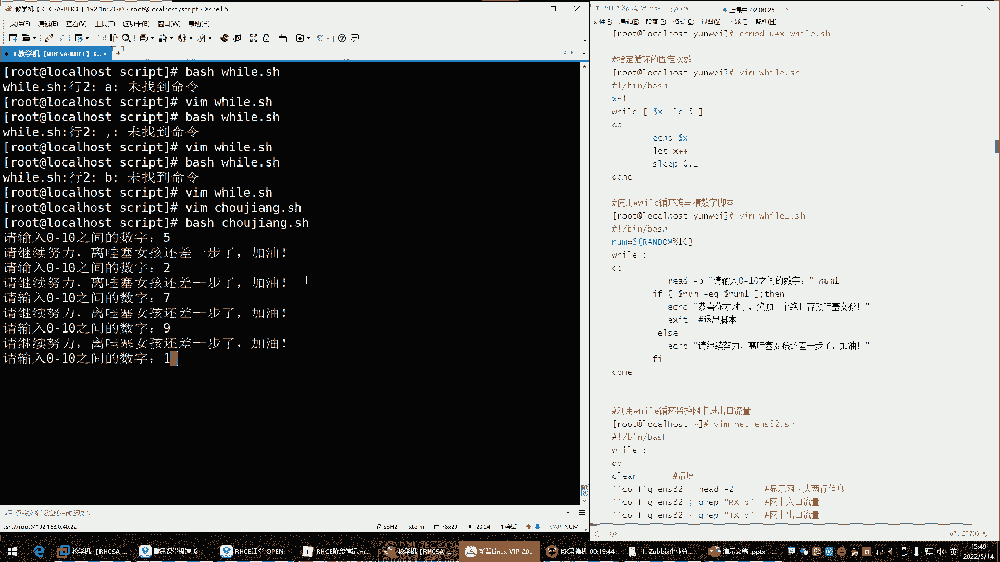
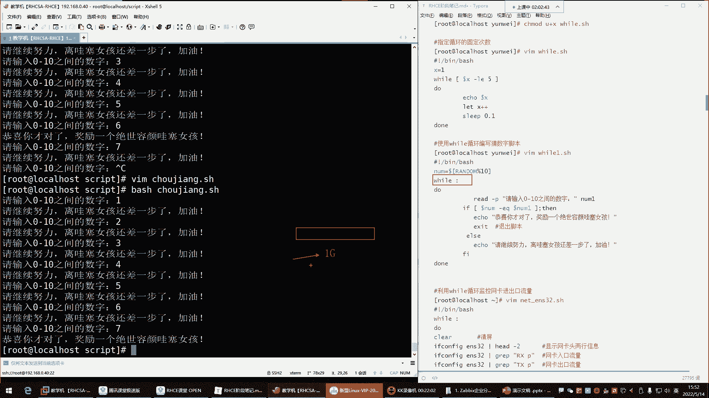

# 零基础入门Linux，红帽认证全套教程！Linux运维工程师的升职加薪宝典！RHCSA+RHCE+中级运维+云计算课程大合集！ - P44：红帽RHCE-9.while循环 - 广厦千万- - BV1ns4y1r7A2

好，都回来了是吧？回来的话，我们继续哈，这个休息时间还是挺。😊，挺人性化的是吧？不是人性化啊，这得注意点错别字。😊，我们在同一课堂啊，我们总总说这种这个叫比较裸露的词汇，这有被容易被同一课堂检测出来哈。

😊。

啊，都回来了是吧？回来给我刷个一来，我们正式开始了哈，十0分钟应该休息的都差不多了吧。O那继续来开始折磨自己。😊，那接下来呢我们就这个。😊，来说说下面那个will will这个呢叫做死循环。

它跟我们前面学习那个复循环呢，哎，他们干的事儿都一样的啊，这像就像我们前面所说的，你看看这个if啊if判断跟那个case语句，他们干的事是一样的，是不是啊啊，只不过呢就是这个case语句啊。

它没有if功能强大。那下边这个复循环跟这个will循环，它们干的事儿也是一个事儿，只不过这个will循环，它呢跟复循环应用场景不一样？😊，就是对于这个will循环来讲。😊，他呢是只要条件成立。

我就重复给你执行去啊，就去帮你执行这个命令。而前边的那个负循环，我们为什么会称之为它叫死循环？因为它。怎么说呢？就像那个拼命令一样，拼那条命令啊，它一旦拼上某一个主机啊，就是要么就是把那个主机拼死。

要么呢啊就是自己把自己拼死，总之它停不下来。能理解吧，啊，那种也就是死循环了啊，拼其实就是死循环。你要是不手动改变它，那我告诉你哈。😡，它是那个什么呢？呃，它这个是根本是不会停下来的啊。

一直给你拼这个机器。😊，那负循环不一样，负循环你发现哎我们给他一个数，比如说254，那他给你干嘛呢？给你执行254次，是不是你给他一万次，他就给你执行一万次，但是它有个头儿。它有个头哈，它不是没头。

而这个呢只要你的条件成立的话，它真的是没头。我来给大家演示一下这玩意哈，我们来编写一个。😊，嗯，will点儿SH。好，然后那这玩意儿它怎么用的呢？嗯，还在医院跟不上了是吧？没事，可以看看录屏哈，相信。

😊。

啊，那接下来我们来看这死循环啊，这个终端用不到了啊用不到了。😊。

呃，Q有杠P选项吗？有有哈有杠P选项。

杠批是指定PID。😡，杠批哈。可以哈。然后接下来呢我们来看看这玩意儿怎么玩，它的语法格式这样子的，语法结构will，然后呢，后边你给他一个条件啊。接下来呢条件成立了，它就给你执行do跟当里的语句。😊。

能列了吧，fo呢是这样子的，你看哎fo，然后给个变列名。是吧啊，然后呢in后面给值，比如一。啊然然后接来呢度给你执行do跟当理的语句。也就是说只要是这个变量里面，只要是这个变量里面有值。

那它就给你执行你的语句。而这个呢是只要条件成立，也就是说它的循环是来自于条件，它的循环来自于什么呢？来自于具体的值。能理解吧啊，他们这个获取的就是我你想让我帮你执行命令，哎。

我的获就是我的条件是不一样的。我需要一个条件判断。我需要是具体的变量的名字啊，或者说具体的值都行。但这这位置都是变量名，没有没有人会放值啊，都是变量名，值是在后边。那在这个里边我们来看一下这玩意儿。

先写个语法哈。😊，vi什么条件呢？😡，比如说啊一等于一吗？条件。啊，度。当里面的语句。Eical， hellello。意思。5。嗯嗯。我们。5。是这样写的吧。美女美女是巫吗？😡，应该是这样写的吧。

看一眼哈。美女那个词儿咋拼的呀？

啊。美女。啊。这是美女吗？

是吗。

我记得这美女这词儿不是这样拼的呀。美女。baby唉，这个可以是吧？

😀Yeah。对呀，我记得是乌曼是吧？那咱啊对污曼是女人，那咱别女人了，baby是不是啊？哎，babyeel，你好，宝贝，不说。😊，へへ。哈，保存退出哈。😊，然后接下来呢来看一下哈。😊。

回车。😊，你看他现他现在干嘛呢？他现在就是在给你在一直挨cle呢，在挨clehello hello宝贝。😊，那你看他没头啊，你看他停不下来，他一直在一直在干嘛呢在帮你执行你的这里的语句呢，为什么呀？

因为你给的条件，它一直是成立的，什么条件呢？就是。😊，一等于一嘛，那这个条件成立吗？这个条件一直都成立，一永远都等于一是不是啊？所以只要条件成立，它就一直跟你循环。你发现这玩意儿你ctrl C啊。

可以呃可以结束掉哈OK。😊。

那这玩意儿是不是就给我的感觉，就是他干嘛用呢，是不是？😊，它这个东西呢一般应用场景不一样。啊，但是应用的比较少一些哈，有什么说什么死循环一般应用的是比较少，但是呢也。😊，也不敢说不用。

只不过呢没有负循环应应用的场景比较多一些。嗯，他这边怎怎么玩啊，你说我能不能让它像负循负循环一样指定它的循环次数啊。😡，也行也可以哈。那在这里边你想让他指定次数，你在下边。😊。

你比如说我能不能让他指定直行5次也行。那这时候你上面就不能这样玩了。😡，🎼井号叹号杠并下的bitch，你来个，比如说来个number数字等于几呢？哎，等于一啊，先定一个数字。定好数字之后。

我现在呢干嘛呢？哎这样去对数字做什么呢？做比较是每刀 number。如果说杠EQ等于多少呢嗯。等于一。那条件就成立了，是不是啊填成立给ecle，然后来。😊，试验一下哈，拜吃。回车。哎，好像不太对劲儿。

你发现啊它怎么还是什么一直循环下去啊，你看它很快的没了上去了，看到了吗？一直在循环。你看这位置速度很快是吧？这频率。😊，非常快。是吧这频率看到吗？我一滑就没了，一滑就顶上去了。😊，好，cl C结束掉哈。

为什么会这样子呢？因为我们这样改的跟没改一样，其实。😊，你看我虽然说定一个变量了，是不是啊变量名里的值是一，那我拿变量跟一做对比，那一等于一吗？😊，啊。它一等于一啊，是不是它没变化呀。

那你怎么样才能这个就是让它指定固定的循环次数呢？这时候你唯的方法就是你让那个一啊。😊，你把这个数字给它改一改。你比如说我让他我想让他循环5次，那你这样。😡，你就是每次啊你得让它变列名不一样啊。

首先你跟谁做对比呢？你跟五做对比R，然后输入五替换啊，把一替换成5哎，一等于5的时候。😊，来看一下效果哈。😊，回车哎，没执行啊。他没执行，看再来一遍哈，回车。😊，哎，未执行是吧，为什么呀？

为什么没执行呢？因为上来条件失败了。😊，为什么失败呢？因为你这个变量里的值是一啊，一等于5吗？😡，一不等于5是不是？😡，一是不等于5的那上来条件不就是条件不就失败了吗？😡，所以怎么办？哎，你这样。

你说一小于等于5的时候，哎，你换成一个什么呢？哎，换成LELE是不是小于等于的意思啊？那这里边你想一如果小于等于5，注意啊，是小于等于那一如果说这个里的值是一的时候，它是不是小于5，条件成立吗？

成立是不是啊？哎，那如果这个里的值它是哎那来保存退出看一下哈，条件成立了哈。😊，回车。哎，这不对呀，这怎么又一直在输出，是不是？😡，一一直在输出哈那这个为什么它也不停下来呢？😊，这玩意儿啊。你看。

我们现在说一小于等于5吗？是小于等于5啊。😡，但是我不想让它一直循环，我就想让它循环5次。那这时候关键你这一它没变呢，是不是它它一直是一，它没变化。😡，那你说它一直小于等于5。

那是不是就一直给你输出这里的命令啊，它没变化呀。😡，你得让他变。😡，哎。等他。不小于等于5的时候，那条件就失败了，是不是那就不执行了呗。😡，所以这时候这个E一啊它得变一变。

你让你想让它执行具体的这个什么呢？具体的这个次数的话，你下边还得来什么呢？哎，对它的值给它加一个。😊，这样叫let什么呢？let美刀。啊，其实这个。嗯，这个不不这个不用美刀啊，你如果直接往编量里面复制。

不用指不用指定美刀，什么呢？叫number干嘛呀？佳佳。啊，或者number。等于啊自身加1。number等于自身加一啊，其实就是加加就行了，不用加一。加加就是对自身加一。就像这语法一样，看到吗？

就是对自身加衣。那它的完整语法是不是就是。X。X等于X加1。不就对自己进行加一吗？😡，啊，那这里边我们给它简写了，就是number加加。那它如果是完整语法。

就是number等于number加1对自己加一。啊，那我们用简写也行。那这位置简写的话，你注意哈，那第一次循环这里的值是几啊？😊，是一一跟谁对去做对比，一跟五做对比，一小于等于5吗？条件成立吗？😡。

条件成立是吧，一是小于等于5。好，调件成立给我挨ical。啊，你好宝贝。那接下来呢那我这里面还有一条命令啊，哎，我light number加加，也就是说哎我还要对我的这个变量里的值啊加个一。😊，好。

那加个一以后，那它这里边哎下次再循环的时候，这里面是几啊，下次再循环的时候，这里面就不是一了，是不是啊？因为它对自身加一了，那就一加一变成几了，变成二了。😊，看到了吗？哎，那二小于等于5吗？小于等于5。

条件成立，条件成立再给执行是吧？那他又加一了，又对自己加一了。好，那这时候这里的值就不是二了，是几啊，是3。😊，十三了哈啊，那三小于等于5吗？😊，条件成立是吧，条件成立又执行啊，又对自己加一。

那接下来哎那这里的值又不是三了，又是写又四了。😊，啊，这时它这里面就变成四了啊，那四小于等于5嘛？😊，小于等于5啊，小于5不等于5，但条件也成立。那是不是又开始执行命令啊，又对自己加一好，那加完以后。

它这里边又不是四了，是几啊？哎，是五了是吧？好，那五小于等于5吗？五不小于5，但是它等于5，那条件也成立是吧？条件成立是不是又执行命令啊，又对自己加一，那加一以后它这里的值变成几了呀，变成6。😊，哎。

那六小于等于5吗？它也不小于5，它也不等于5，条件失败了。条件失败。好，不好意思，命令不执行了。😊，哎，那这个它会执行几次呢？执行5次。看到吗？12345。是吧。爱Q5次宝贝。是吧。

如果你想让它你想控制它的循环次数，我们也可以啊，我们也可以干嘛呢？哎，我们也可以去。通过什么呢？哎，通过这种方法啊去控制。但是如果你真的是需要指定它的询环次数，那咱们还不如用复循环了，是不是啊？

但是你知道可以通过这种方法去控制它。好。那接下来呢了解了复循这个vi循环，它的一些这个基本的一个套路了，以及它的应它的一些具体的特性，它就是死循环啊，条件成立我就给你执行条件失败，我就不执行啊。

它不是说这个你给我一个值日，我去帮你执行，不是我就看条件。😊，能理解了吧，就看条件。那你说这个东西，那看条件的话。怎么玩啊啊，下边。使用will循环编写一个猜数的脚本。这个前面写过是吧？

但是我这里面没有了啊，写一个什么呢？啊就是。比如说抽奖点SH。可以吧，抽奖拼音哈抽奖，然后在里边。But。上来呢我们也是哈如果自己手写的话。上来我们得需要什么呢？需要控制它的这个什么随机数啊。

number等于。我要取随技数了，每刀中文号random。ranunddom里的值，我要对谁对十进行取余，把它的猜的数控制在10以内。然后接下来我要循环了。好，循环唉，那这冒号是什么呀？哎，这冒号是吧？

这冒号是什么呀？在里面你看这个冒号是吧？这很奇怪是吧？哎，来看一下啊，先先对这个文件先保存一下，我们干嘛呢？哎来那个W循环那个脚本里面。😊，看看这冒号。冒号干嘛用的呢？我们先把这条件给它删掉删掉。

然后换个冒号，变量不用了。😊，我不要变亮了。咱们就看看。然后这个加加也不要了，因为没有变量了，他也没有必要去对那个变量加一删掉DD。好，我就看vi冒号，然后呢，do跟 down里边是ic命令保存。

是啊就他回撤。哎，你看它也一直在icical是吧，你看一直在输出看到了吗？速度也很快是吧？好。结束掉，我们再来编辑这个脚本。哎，will我把这个冒号换成什么呢？RRT换成A保存。然后我再执行这个脚本。

哎，这不行呃。看一下啊，它这玩意儿。换个逗号呢保存。哎，也不行。嗯。啊，再换一个哈换一个什么呢？换一个。😊，换一个币。啊，也不行。那冒号是啥呀？😡，啊，旧帽膜可以是吧？我告诉你。

这冒号是死循环里面的一个固定的特殊符号，干嘛用的呢？就是。它可以让你无限的循环里面的命令。你不需要去搞什么条件判断了啊，什么一等于一嘛？不需要。😡，你如果真的想实现这种死循环。

一直帮你去重复执行这些操作的话。而且也没有一个头的话，你就冒号就可以表示死循环就可以了。能列吧。啊，这是它的固定语法。所以我们如果再希望写一个死循环的话，我们抽奖的那个脚本。

这里边就一直是死循环无限循环下去。无限循环死循环。那接下来度，然后荡。里边是命令。啊，做个缩进。两个素心。啊，这不行，这做缩进的话，唯有循环语法不美观了，就这样吧，多根到底的是语句。好。

那下边我们这个怎么玩儿啊，这玩意儿。循环是吧，我们现在上面定好了，定好了变量了。那接来我想。😊，去什么呢？实现参数。为什么要猜数？因为我前面写的那个脚本只能猜一次，你还记得吧？前面猜数那脚本只能猜一次。

我现在想让他多猜几次，一直猜下去，那我就可以用死循环让它一直猜。好，那这时候。😊，read的。不写了，直接直接粘进来。😊，看一下啊。看效果唉。不是。来拿过来来看一下啊，说一下re的杠P。

让用户呢输入数字是吧？好，那我们这个啊用户的这个number。跟什么呢？跟我们的那个变量做对比啊，那我们的这个变量改成大写的number啊。

如果说用户他输入的值跟我们的这个随机数里面产生的值如果是相等的话。是不是条件成立了呀？😡，没错吧，条件成立艾命令。😊，啊，但是这里边。不能退出脚本啊。有问题。啊，那这时候如果失败呢。

如果说他输的数没猜对是吧？那条件失败是吧？条件失败就否则给我艾这个。啊，猜对就讲你一个绝世容颜哇赛女孩，失败了，那就离哇塞女孩还差一点点是吧？保存退出，接下来来执行抽奖脚本规车。好，数字5。

没猜对，哎，你看没猜对，继续猜是吧，再来一个二回车，哎，还没猜对。哎，有有意思了是吧？七还不行9。😊。

1234567哎，对了，对了，那六的时候对了是吧？猜对了啊，恭喜你猜对了。原来哇塞女孩是在六这个随机数里面啊，哇塞女孩是6啊，她的编号是6啊，猜对了但是猜对了，她有问题，什么问题呢？😊。

你发现这怎么没结束啊，是不是怎么还让我继续输入数字啊？😡。

因为它是死循环的，因为它是未有循环的啊，你用冒号表示的它停不下来，它会一直帮你直引里面的语句的。😡。

他会一直执行，它不停。停不下来。

那听不下来怎么办呢？但人家猜对了，你不能让人继续猜呀，是不是？😡。

ctrl C接束掉。所以这个时候看脚本如果人家一旦猜对了，就是这个条件成立了，他直接完这个语句，我们要干嘛呢？让脚本退出，在这儿加条命令叫。

EXIT。叫退出摇本。啊，这个的话呢我们。加个注释叫退出脚本，后面会讲哈。啊，这时候咱们再猜。

好，一从一开始来，234567哎，7，这次是7啊，袜塞女孩在随机数7里边。

那你看我猜对了，他叫什么说恭喜你猜对了。然后呢，哎这时候就符合逻辑了，退出了，是不是？

哎，没错，是 down。这样子的哈。

那那个我们后面会讲哈那个X那脚本的退出。所以现在你先知道。

需要用我们需要用的这种死循环脚本。

需要用得到。这个死循环的话呢，一般就是哎就是我希望什么呢？条件成立的时候，你帮我执行这个操作。那只要这个条件一直不成立，它不执行，是不是啊？😡。

啊，执行以后呢啊你给我再给我退出啊，脚本不要再一直使用完了，这样也可以。比如说在备份领域啊，备份的时候，我干嘛呢？我一直在判断一个文件的大小，我通过使用完，一直判断一个文件大小。好，那我判断这文件。

比如说这文件它的大小到达一个G的时候，你去给我执行一个备份操作。那执行完以后。😊。

你给我退出，不要。

啊，这种可以哈。😊。

嗯可以，然后下面这个使循环也可以去写一个什么呢？就是监控网卡流量的一个。

用死U环监控网卡流量。这个的话呢来演示一下嗯，netENS32点IC。其实这个呢我们嗯。你们先看一下这个脚本哈。😊，先看一下，然后呢，我把录屏停一下，我要上个厕所。

我感觉我这个要闹肚子。

