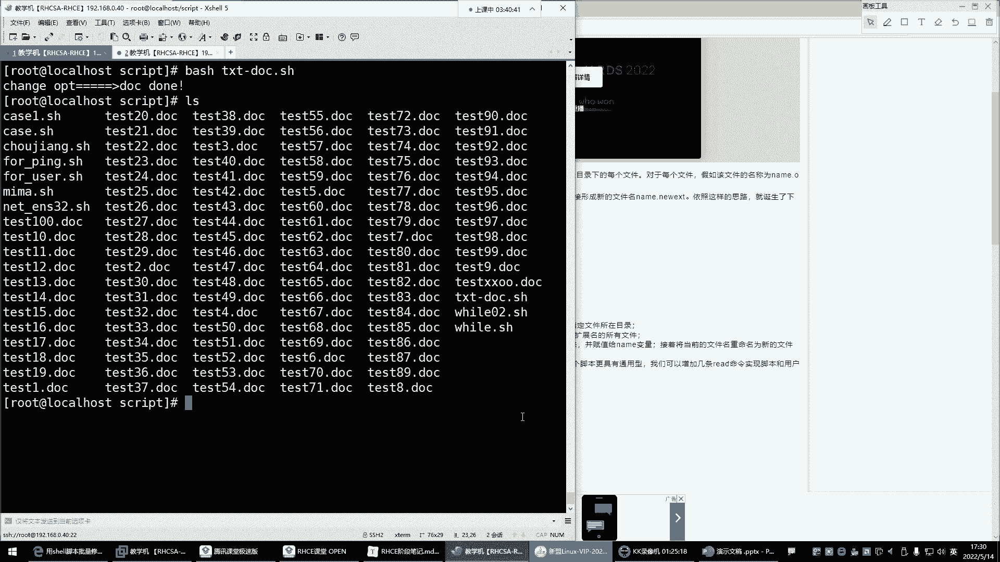
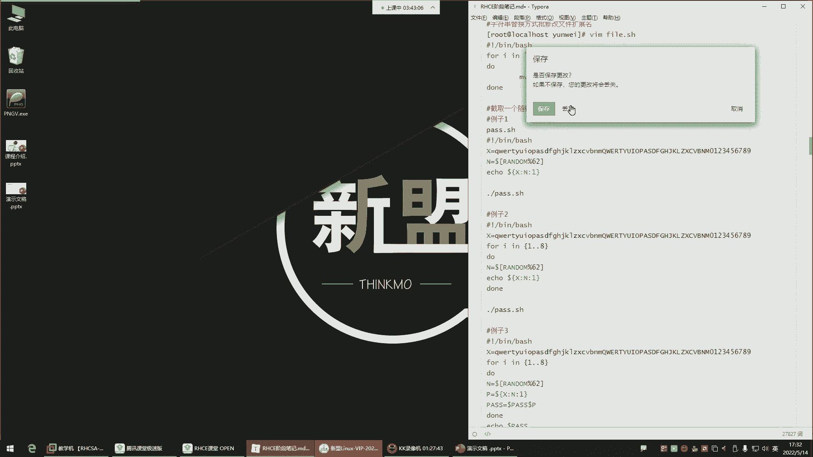

# 零基础入门Linux，红帽认证全套教程！Linux运维工程师的升职加薪宝典！RHCSA+RHCE+中级运维+云计算课程大合集！ - P46：红帽RHCE-11.shell函数、脚本中断及退出、字符串处理 - 广厦千万- - BV1ns4y1r7A2

是谁会用呢？搞数据分析的，他们会用这玩意儿啊，截取过滤截取过滤。啊，他们会搞这个东西哈，可以你知道一下啊，我想截后四位起始位从哪开始起呢？后四位，我想截，我想截5678。

那你得数数啊啊从零开始那01234。😊，567起始位置是从七开始截四位，从七开始截4位，34回车5678。看到了吗？就截取。那这玩你想咋结，你想怎么接就怎么接。😡，也不一定非得是截这种数字截。

一些这个什么就是。截取一些这个。文件的内容也都可以解。文件的内容哈。这部打火机。这玩意儿不用记，你了解一下就行。你知道sll里面有这个功能。你想想sll是一门脚本语言。😡，是不一它是一门计算机里的。😡。

编程语言。它是支持所有的编程原理的功能的，就像什么复循环异务判断case语句will有循环。数组函数变量都支持。所以这些大家用不到，你简单知道知道一下就行，能理解吧，知道一下就行。

你知道怎么知道有这个功能就行哈。但是这里边哎有的时候比如说需要你截取一个随机的8I密码。😊，饿了是吗？啊，那我们来演示一下，这玩意儿可以可以这样帮你截取个密码，我们来说一说这玩意儿演示的时候怎么玩哈。

比密码密码点SH。😊，井号叹号杠变下的外设。其实这个东西我跟你讲，如果你们工作中有这种需求，哎呀，就这玩意儿。😡，都不需要去自己写。比如说你们工作中需要你啊，我们每我们这个什么呢？

啊需要去随机分配一些密码的话。这个可以实现，我们先执行一下，看效果就行了啊。bitch脚北名回车几位。12345678啊，回车随机拔位，每次都是随机拔位是吧？🎼没有任何的没有任何的规律所言吧，是吧？

你看每次都没有任何规律是吧？那这种东西百度一搜一大堆。😊。

嗯，就是。🎼shall脚本生成随机。8位密码。有需求的时候看一下，搜一搜，这里面不需要自己写。你很多东西哎呀，有的时候啊。😡。

很多东西它不是说靠你一个人，你这个也得会，那个也得会的，能理解吧？😡，看一看哈，他这玩意儿唉发现跟我那个套路是一样的呢。😊，这人是不是抄袭我的呀？😡，啊，你看一样的哈，随机八Y密码怎么玩呢？

这里边首先我想截取随机的八Y密码，那这里边首先随机就不能有规律。所以说那随机里边肯定是有ABCD是不是啊？那些英文字母还有数字，所以这里边把这个你键盘的62位。😊，不是啊，是你的这个26个英文字母。

26个英文字母。😊，前面是小写前面是小写哈，后边呢是大写。😊，都给它定到这个变量里面，然后后面还有0到9的阿拉伯数字，这总共是62位，62位哈，那没有任何规律写写进以后存到这个里边。

接下来呢负循环循环几次循环8次，循环8次的时候，那是不是每次循环执行度根当里的语句啊？好，那接下来你这里的语句就是第一我要干嘛呢？从这62位随机数里边，我要去干嘛呢？去对它取余为什么取余啊。

你不取余的话，random里边每次的数太大了，所以要对62取余。好，那我对62取以后，我这个数存到这个变量里边存到这个里边以后，那这个变量里边每次取的值都是小于62的，知道吧？好。

那我为什么每次要取小于62的值呢？因为我要把这个值。😊，给他。看下面这变量哈，下面这个变量，这里边有一个number。😊，啊，这number里边还有一个变量，XX就是它。也就是说。

每次我要把这个number里边取出来那个随机的值，它肯定是小于62位的啊，然后干嘛呢？截取。这不是截取的语法吗？X变量名是吧？截取。从哪儿结呀？哎，从这62位里边的那个随机数去绝去去结。能理解了吧？

因为你看这个里面是不是总共是6是62位啊？62位的话，你每次产生随机数，我对62取余它的数肯定是小于62的。所以就是说把这个数控制到了62以内。那这个62就是给我的这个一堆的什么呢？

一堆的这个密码去准备的。然后接下来对我这62取余。X是5的变量，你看那这个语法里面就是是不是它的语法就是取截取的时候变量名。😊，然后呢，起始位置起始位置我也不知道，因为它是随机的嘛。

所以就是从这里边取出来多少，随机就是多少，截几位截一位，每次截一位，截完一位以后干嘛呢？哎，我再搞一个变量，那这个变量里边是什么呢？就是每次它截取出来的密码是存到这个里边了，是不是啊？

那接下来每到pass跟每到探就是我每次截取出来的数，它这里面不是只能存一个嘛，那不行，干嘛呢？哎，我给它拼一下，每次。😡，截取出来的数，我再去存到这个pass变量里面。然后最后呢每次再用pas变量。

再结合这个t里的那个最后组成8位，把总共8密码给我挨出来。嗯。这我也饿了我也有点饿了哈，但这个思路。😊，可能就不太好理解了，但是你也不需要理解，你不需要理解哈，你如果没有那个能力。😡，你就去网上找。

有这种需求。我们说就现在这个运维的行业里边，哎呦哪有需其实很少会有一些需要你自己能够什么呢？能够写的脚本了。因为大多数别人已经。😡，用过了，别人已经已经写过了，所以你用的时候，你去网上搜一搜就行。

就这玩意儿拿过来可以直接用。😡。

看看。那比如说我把我的那个给你们删掉哈，把里面内容删删掉。😊，🎼一样的，其实滴滴滴滴滴滴滴滴。弟弟。粘进去。什么这玩意儿呢？删掉，还原文，估计是抄袭我的，保存退出。然后执行。🎼回头那是不是是不是一样啊？

是不是啊？就这玩意儿啊就这玩意儿哈。所以说哎呀有的时候用到的时候就去网上找一找。😡，网上找一找，比你自己在那儿抠着半天，还憋不出来个屁要强多了，是吧？你自己写写不出来，你还总跟自己较劲。

你这就没有必要是吧？而且。😡，也没有那个必要，说白了，多麻烦呢，你一个人能你一个人的能力它终究是有限的啊，你不可能说哎我这个领域也擅长，那个领域我也擅长，是不是？所以有的时候你在你不擅长的领域。

你去用用别人的东西，它也不丢人。😡，对你不用为难自己。因为你想有的人人家天生思维逻辑就清晰，人家就这个底子也好。所以说人家擅长的东西，人家拿到网上让你用，你就用现成的不就行了嘛？是不是你非得说不行。

我就要自己写，写不出来，我这就不行。😡，没有必要，都啥年代了，是不是啊？那阿里巴巴的那阿里巴巴的CTO啊，那叫首席技术专家，人家的很多的东西也都是用别人现成的是吧？那包括阿里巴巴的淘宝网站平台。

不也是基于别人的去什么呢？去改吧改吧吗？他也不是自己开发的，是不是啊？你去看阿里巴巴，那阿里巴巴呃，那个叫天真。😡。

天人。天诊是什么？呢？来看一下天诊是。

嗯。对，忘了自己以前抄作业的时候了，是吧？你看天然是阿里基于大名鼎鼎的Nex修改的HTTV服务器。这句话就是说他也是在人家的基础上改不改吧，他也不是自己开发的能力吧，人家为什么呢？

因为你想这种东西有能力的人，人家写出来了，你改不改不不就行了嘛？非得不行，我就要自己开发一个比他牛逼的软件。😊。

你这不就近吗？是不是啊你那跟自己过不去啊，你这是。😡，没有那必要吗？啊，你是背抄那个是吧？没关系啊，我们说我们这个生活在这个社会当中是吧？我们本来就是一个团体，是不是啊？哎，每个人的能力呢都有限，是吧？

你在你的领域，你有你擅长的这个你你有你擅长的本事，别人在别人的领域，他有他擅长的本事，你们之间相互借鉴，咱又不是说以这个自己狗屁不是一事无成，是不是啊？那如果真是这样，你说那我还会抄呢。

是不是我也会抄啊，是不是啊？这不也挺这也是一这也是一种本事啊，你抄出来它能够实现功能了，这也是不是什么丢人的事儿。😊。

所以说没有必要很多东西要纠结。哎呀，不行，我必须自己写。😊，没有必要哈嗯。😊，对呀。😀。😊，嗯ん。😀へ。所以你像什么字符串替换啊，字符串掐头去尾啊，其实我觉得这些东西最终都是为了什么呢？啊。

想让大家了解一下，就是啊这个东西可以实现帮你截取一个随机密码啊，字符串替换可以帮你后期实现一个什么功能，可以帮你实现。就是这种比如说这个把这个批量替换一替换一些文件的扩展名。😊，啊，其实这种。哎呀。

很多东西呢就是。你可以感兴趣，你可以自己去了解了解。可以自己了自己了解了解哈。😊，但是其实我觉得大多数嗯是很多东西你们是这个不需要去什么呢？去自己，我必须得给他记住啊，我必须要熟悉它的语法。

这个那个的哈，没有那个必要了，现在没有必要。😊，都饿了是吧？啊，关键是得知道抄是吧？对你得知道抄这个很重要哈。就是咱们说这个你不会写行，你不会写，你得会抄。😡，へへ。😊，这个是一种本事哈。

抄这个东西的话呢嗯。😊，你得去搜一般你需要什么功能，一般你去网上搜就行了。😡。

是不是啊？你想你比如说啊我要这个什么呢？啊，你比如说你如果说你不会写一个测试主机连通性的脚本啊，你自己搜测试。主机。联通性的哎，反正我也不知道怎么写是吧，看看别人有没有写好的。哎。

告诉你拼命令测试主机之间的网络联通性点进去。😡，啊，看看别人怎么写的。好，那它在里边看一眼哈，不行，这不是脚本哈，它这不是脚本。还是里边。是频域名的是吧？哎。じ。循环。测试主机联动性。

你看嗅脚本测试某个网段。看一眼哈，这边唉你看。😊，他怎么写的？😡，我们甭管怎么样，拿过来先跑一遍，看行不行，是不是？

管他三7二一呢，先跑它一遍，把我们那个will点SH删掉。粘上去是吧，管它行不行呢？保存退出，然后。拜事。执行。啊，有点错是吧？有点错哈。😊，那还得杀杀进城。看看哪里不行，哎，哪里不行，你再改。唉。

这上来先跑一遍，不行。好，不行再改。😊，那大体先简单看一眼，别上去就确实确实是像我这样，直接就直接就执行哈。先看一看，你得跟你的环境符合才行。我们刚刚有点这个什么呢？啊有点草率了哈，刚刚确实有点草率了。

😊，先把镜头杀掉啊啊。😊，PS tray。然后呃管道给。🎼杠AP杠AP管道。可以吧。过滤谁呢？过滤拼。啊，这个进程先给它干掉。九か九。结束掉。啊，没有那个进程。放屁。撇子吹。看一眼啊，这不还执行着呢吗？

是不是啊？脚本。PS tree APgra。哎，怎么没有怎么没有过滤出那个脚本的那个命令呢？那这样吧哈。😊，Q二杠九。拼看一眼。还没杀死。哎，那脚本命令没没有过滤出来，你们看到了吗？😡。

那个脚本叫vivo。啊，是过滤 batch尺看一眼哈，哎，这儿呢看到了吧？你过滤不出来，你执行的时候时候执行的 batchch命令啊，在这呢 batchch杀他沙它哈。😊，沙糖你别杀上面这个bech啊。

你这一杀，你退出终端了，知道吧？你别杀错了，我们是这是我们的什么呢？这个登录系统的拜事环境。我们在这个登录系统的环境里面，又通过bach运行了这个什么呢？运行了这个脚本，你把这一杀你退出去了，直接。😊。

啊。Q杠9。哎，你得有方法，看到吧？你看我很很多东西，你看我记不住是吧？我记不住，但是我可以有方法杀掉他。😡，这边杀死了是不是啊杀死之后，我们再看看哪里有问题，哪里的问题呢？😊，啊。

它是只拼这1个IP了，艾括这1个IP地址。啊，是么192。168。4点啊，网段不对。啊，有点草率了，是不是啊？你看咱们是零网段，它是私网段，这不搞笑的吗？是不是哎零点美德I，然后这这确实应该看一看哈。

我们有点鲁莽了哈，有点鲁莽。哎，零点美德I。然后接下来。😊，这时候就没有问题了啊，这杠1Q这个杠有问题是这个杠看到了吗？对。这。我觉得你看他这杠什么情况啊，故意的，这人是故意的。

看到吗？这人挺坏呀。那前面的杠跟那个杠是完全不一样的。😡，所以。😊，有的时候还得懂点儿，你要不懂，你还不知道呢，看不出来他故意的。😊。

看到了吧？所以。😀呵。😊，对他就是故意的哈，他这杠。😊，他怎么打出来的呢？哎，这样看到吗？哎。😊，就是这样哈就是这样的，你看到了吗？😊，一个中文的，然后你再这样他给你删了一个，这你真是真狗是吧？

你要看不出来，不仔细看还不行呢。😊，对，这时候再执行回车。😊，哎，可以了，你看1234这样可以是吧？你说这人是吧有点意思啊，啊，再给他杀掉哈，杀掉是不是可以啊，你看这拿过来不就用了吗？

你说还需要你自己写吗？很多时候你自己写，你发现哎呀一堆报错。😊，我们说就是哎。很多时候呢我们都是相互借鉴啊，我们不能说抄袭，我叫借鉴。😊，杀掉哈Q-9。把这个杀掉。因为你像你的能力终究是摆在那儿的。

是不是啊？哎，所以说有的时候。😡，这个行业里边抄袭是一种什么呢？哎，能够提升你最快的一个捷径。不需要你，但是你说那我难道我自己啥都不需要掌握我就需要抄吗？不是你得抄，你得能抄明白。😡，就像我们刚刚一样。

刚刚咱自己是不是能够看出来哪里是问题啊？😡。

是不是啊啊，你像你就跟他一样啊吧，他里面给你动点小手脚，是不是啊？哎，你能够看得出来就行。😊，所以我们学的那些基本的东西，就是为了让大家能够什么呢？以后在抄的时候。哎，你你能抄明白喽。

你别到时候你说你抄都抄不明白，这有点过分了哈，吧？😊，对呀。😊，😀呵。😊，啊，这就可以了。对，哎，就是学完脚本。😊。

哎，不是说让你直接噼里啪啦自己就能够呃自己写一个呃相应的脚本出来了。😊，不现实。不现实啊。好。哎呀，有点饿了是吧？我也有点饿了。😊，啊，这些的话呢简单演示演示行吧，我们不行，我们还得演示演示。

因为这个东西的话呢，你看我们前面讲的字符串的截取是吧？格式就是每刀大括号，然后呢变列名起始为止加长度。😊，然后这个东西呢，我们在截的时候啊，就是。你截什么都行，截主要还是以变量里的值为主去截取的嗯。对。

超的超好人的哈，然后下边字符车替换也演示一下字符车替换这里边啊它的语法格式是这样子的。😊，美的也是美道单括号，但里面呢是用这个斜线来表示的。哎，这贴换我们在VM里边也有替换，我不知道大家还记不记得哈。

比如我现在写个文件啊，不用写文件，哪个文件呢啊就是拿这个。😊，这个。will点SH来给大家说说我们VM里面是不是有替换呢？比如我现在想把这个文件里的所有的192。168。0给它替换一下，怎么替换呢？好。

英文的冒号下边啊，百分号S代表替换是吧？然后替换符你用什么都行，井号也行，斜线也行，无所谓。这时候我们用斜线我替换什么呢？先写旧内容，192。168。0放到这儿啊，这分割符替换分割符再写新内容。

我给192。168。0替换成点4。😊，啊，然后这时候替换符结束了哈，那我想全文替换就小写的G回车直接是不是所有的192。168。0就变成点4了。没错吧啊，这种是VM里的替换。😊，好。

那我们再来说说这个呃变量，我想对变量里的值做替换也可以。啊，我们就拿了一个什么呢？刚刚我们自己定的那个边量来说，ele眉刀。😊，我现在想把这个文件里的这个中间四位1234给它替换成什么呢？四个星哎。

星星星星可不可以，不让你看中间四位可以，那这玩意就是icical，然后每刀大括号。😊，变列名不变哈，都是先写变列名。然后斜线代表替换符替换什么？那我要替换这里边的，你能直接写1234吗？不行。😡。

你要数注意啊，它替换的时候。是你要数它的位置的起始位置。从哪开始起始啊，这是你看呃我看一下，从第几个呢？123。啊，不是可以这样玩哈，我们来试试啊，1234替换成多少呢？星星星星。😊。

这个星星星星演示一下哈，还可以。可以哈啊，这个不需要去数它的这个什么起始位置。其实我觉得这比较合理，你要数起始位置，这可能就有点复杂了。这样。嗯，就已经很不错了哈。对，你看这时候是吧。

我们就把这个字符串里的指定的1234。😊，哎，你看它跟VM其实是一样的，就你想替换，你指定你要替换的旧内容，再写新内容就行了，是不是啊啊，我想那。😡，你想替换，你就这样玩啊，但是它这里面哈。

实质是没有改变的啊没有改变。你再替换。1234替换成。叉叉我。是不是就变成叉O了呀？就这意思。啊，这是替换。啊，他在替换的时候，这斜线不一样啊，如果你是一根斜线。😡，如果你是一根形项。

是只替换第一个匹配的结果。什么意思呢？我们就拿这个三来说。这里边有几个三呢？有一个3，两个3。是吧。我现在想把这个呃。数字里的所有的三啊都给它替换。那第一步你这样替换不行的icical每刀大括号。

你比如说编站名。凤，然后斜线三替换成几呢？星回车，你发现只有第一个三变了是吧？如果你想替换全部两根斜线。推车这样就可以了，就多加一根斜线。所以这样的话呢就要替换全部，这里面是多了一根斜线。嗯。啊。

然这是替换掐到去尾。敲到去尾的话呢，这个我们一般也用也几乎用不到，但是简单了解一下它的语法吧，行吧嗯。这玩意儿就是。你比如说我掐头跟去尾的话啊，我们就还拿刚刚那个变啊，还拿刚刚的那个变量来演示。

看行行不行哈。我现在想这个什么叫掐头去尾，先给大家说一下掐头ic。😊，米刀。啊，比如说我想把这138给它掐掉，这儿从左往右叫掐头啊，我想把678给它掐掉，从右往左叫去尾。啊，这就是掐头去尾。

你想扇哪一部分往扇头部跟尾部啊，这叫掐头，这叫区尾。那这时候来看一下掐头啊，掐头就是从左往右。啊，然后这个变格式。icical每刀大括号里面变了名儿。缝，然后。注意啊，井号井号它代表的是。从左往右掐啊。

百分号是从右往左掐，所以这里面的符号不太一样，这就是编程，说白了这就是编程嗯。可以只替换第二个三也行。前面的那个来看啊凤，现在我要掐了，掐谁啊？枪。嗯。恰恰恰。🎼从左往右嗯，我看一下这是怎么掐的呀啊。

掐1381掐138，然后回车。哎，不是嗯，138呢还在是吧？变了名儿。啊，128吗？138回车。138没了吧，38啊38没了，看到吧？对，三跟8没了，是不是？😡，不是138没了，真没了哈。

12345678是不是啊？前面138没了，掐没了哈。😊，有点棒，看的不是很清楚哈。138。😊，那这玩意儿它你看他是给你掐了，是不是啊？😡，嗯。这就叫掐头这叫掐头，然后它还分为什么最短跟最长。

那这里边主要有个这个星号给大家说一下这星号回车。看不出来呀。那还是这样吧，X等于。嗯。等于什么呢？等于。Gパ。Root。Root。🎼从ETCpasWD里面过滤过滤win。呃，这怎么两个用户呢？哦。

这里面都包含root了，那不行，是以root开头的。🎼icical美刀X啊，来就拿这个就拿这个root的这个基本信息来卡，这样应该能显示出来。现在掐icical每刀大括号。啊。

当然这一部分不是什么重要内容哈，不是什么重要内容。😊，然后X是变了名，然后井号代表从左往右掐掐谁掐root回车，那root掐没了是吧？你看左边是不是。没掐之前有root吧，掐完以后说没了。好。

那接下来那如果加兴是什么意思呢？😊，推车好像没什么太大变化呀啊，这星。🎼嗯，这个星这个星啊，我们换一个换零掐那个零。掐零不加行之前，回车零呢怎么没掐掉啊，你看掐零是吧，零没掐掉，为什么呢？

因为零没有在开头。😊，开头是root，所以说你不加星。😡，他不会认为什么呢？啊不会认为这个你掐的是中间这部分的这个零。🎼它永远都是从左往右给你匹配，第一个知道吧？第一个给你掐。

所以你加星以后就代表啊前面任意所有遇到零再给我掐。是不是就少一个0？这个位置是吧是这零没了，剩剩剩这个零了啊，所以星容代表哎我这个零前边任意所有都掐掉啊，啊遇到零。😊，才是我要掐的一部分掐头啊。

这只是那你说为什么第二个零没掐呢？因为这个只是最短匹配，叫最短的删除。你如果两个井号就是最长匹配，所以这时候你再来一个再来一个井。再来个井哈，就是只要有零，我就给你掐。你看两个零都没了，是不是啊？

原先还有一个0，这时候两个零都没了。那我如果换成什么呢？换成root的话，你应该就有感触了。😊，啊我只掐，如果说我只掐一个root。啊，不行。🎼啊，回车啊，可以啊，那这样是遇到root就掐了。

那第一个root没了是吧？那后边还有两个root呢，还在呀。好，加星不是再加个井。😊，最长匹配。最常匹配，你看那最后一个root也没了，就是这样子的，能列吧。好，那这是第一个哈，然后嗯。🎼迷了是吧。

迷了很正常哈，这是从左向右啊，叫做掐头去尾就掉过来了。😊，修尾换符号。变的名不变，区尾是百分号。百分号这星要要放哪呢？要放到百分号的这个什么呢？要放到你的关键词的尾部。比如我现在要掐谁，要掐root。

回车root怎么没掐呢？啊，是因为你没有加星，比如说哎。😊，从右往左遇到第一个root，你就给我从这儿往这儿掐掉，这叫去尾。你不加星的话，root在这儿，那前边它无法匹配，它因为它永远只匹配开头的加星。

好，这样就可以了。是不把root从这开始掐没了，是不是啊？那还剩里边这部分。里边这部分哈okK然后那如果说我想掐到。😊，这个所有的入头都掐没了。那我们用零来演示，如果都加没就没了，知道吧？我们用0。啊。

0，然后。回车，那这还有一个零说不行，只要有零都掐掉，再来一个百分号啊，这叫最长匹配的去尾啊，俩零都没了是不是啊啊，只要是有零都给我掐掉。遇到零就给掐。这趣伪。那这玩意儿后期可以这样玩。

把文件的扩展名进行批量修改。我们现在这里边我建了。太子的。一点点儿。100。点TATT100个文件。好，这100文件我想干嘛呢？我想把它的文件名。😊，嗯。啊，这现在不跟你演示了吗？

比如说现在有这种需求啊，让你把文件名给我替换掉啊，但是文件名有点多，那怎么办？你可以用它写个小脚本啊，比如说这个什么呢？TAT替换成什么呢？DOC的。😊，点IH。井号叹号杠变下的掰扯。

这玩意儿就比较简单了。呃，你看怎么实现的呢？用负循环。负循环。父外印。然后干嘛呢？你怎么样才能够获取到这些文件呢？你说得看它呀，是不是啊哎，就看它来看谁，你要怎么替换。

现在这文件是点TATT结尾的那你就看点TATT但是看多少啊叫星点TATT。😊，看哪个路径指定一下也行。哪个路径呢？就是我当前的根新的。死qui的这个路径下的星点TIT哎，这样的话。

你看我这个命令里的值是什么呢？😡，是不是新点贴IT啊？那我这里面总共有100个点TIT文件，它是不是就看100次啊，那他是不是就是会帮你循环1次0是吧？看一次循环一次嘛，看一次循环一次啊，循环100次。

那循环以后do当。😊，接下来改名啊，改谁改美刀I。改成什么？😡，这个你要用什么呢？你要替换方法最简单。😡，替换方法最简单，这个有点不太好理解。这个区尾不太好理解哈，区尾的话呢就是干嘛呀？

对这个变量名里的什么呢？你看首先我要改这个改这个变量名，这个变量名不就是什么呢？不就是我看的所有的那些文件嘛，是不是啊？然后我要改它把它改成什么，给它改成。😊，这里边这是变列名，对变列名的那什么呢？

那个结尾给它掐掉，掐掉以后换成TATT那我这里边是掉过来了。这样我第一种方法就是我把这文件。现在给他做什么呢？做去尾啊，那把这个所有的。点TATT的文件。然后我用去尾的方法把它的尾巴去掉。

它的尾巴是TIT是吧？替换以后换成什么呢？换成。DOC。说你MV，你要把这文件改成什么？😡，你后边跟上就可以了呀。啊，全都变成DOC了。😊，好了吗？是不是？好，我要再给他改回来。😊。

再给它改回成TATT。好，那我还不用这种方法了呢，这种方法太什么呢？哎，不好用，用什么呢？替换替换最简单啊。😊，把这个文件。它是看了吧？我对这个文件做替换是吧？替换什么？把它TIT替换成DUC。

是不是旧内容啊，当然反了哈，为什么反了呢？因为你现在文件名已经叫DOC了，是不是啊？那你现在要替换的是什么呀，是不是？😊，🎼把DOC替换成。贴梯啊，是不是你要看星点DOC了。

因为你的文文件名现在变成DOC了啊，把搜到DOC干嘛呢？😊，我用替换的方法。哎，这个这里面是我要改的文件名，是不是啊改成什么？好，前边不变，前边叫什么，那还叫什么？

就是把这个文件里面只要是有DOC的都给它替换成TATT。好，又回了。😀看活啊。😊，这就是这就是。这玩意儿你发现哎，很多东西你。😊，结合起来。你就知道他可以干嘛用了。嗯。对。

只要是叫只要是叫这个名字都替换。你比如说我现在。😡，这个跟你们。看啊。🎼这玩意儿替换的话就非常的。🎼TST丢C我现在想替换什么呢？我现在想替换每个文件里的那个什么呢啊，我就想替换文件名里面包含。

比如说88的。😊，给它替换成叉叉OO。那这时候是不是他又回到TATT了呀？好，回车batter回车哎。啊，88的。啊，什么。什么同一个文件是吧？啊，一般没有那么玩儿了的手谓了。没有人玩的啊。

因为他后面还有名字呢，他828后面有名字。它不是它不是光叫88哈。😡，这有点逻辑不对了哈，不应该这样玩哈不应该这样玩。不应该这样。逻辑不对。嗯，好，你就知道这玩意儿可以实现这个功能。

嗯て。但是如果你遇到这种需求了，好有你们公司让你批量修改文件扩展名。好。😡，shale脚本。批量修改文件。换两名儿。用设有脚本批量修改文件扩展名。好，来看一下。哎，看到了吗？哎，他是改的是什么呢？

什么图片是吧？GPG。😊，这种类型的图片。然后接下来呢复循环。😊，啊，当然咱们好像没有GPG的这些图片是吧？然后它这里边看一下哈啊GPG的图片。😊，GPGGPG，然后路径啊路径就是。

你看它这是因为环境变量是PWD当前路径，改的是改的是当前路径，然后负循环文件文件在哪？文件在LS看当前路径是不是啊DRRDR不就是说你的它不是定义当前路径嘛？然后gra过滤过滤什么呀？哎过滤这个变量。

这个变量里存的是什么呢？哎大写的GPG啊，就是说过滤所有的GPG。😊，这个文件过了以后呢，name等于name又又搞了一个变量是吧？变量LS看文件，然后做排序。

它是排序cut给文件排序排序以后MV改名啊，把这个文件的名字看到吗？也是通过这种什么呢？啊，它是name也是哈啊它这个每到name点儿。😊，啊，它是通过变列名。通过变列名哈替换成什么呢？

替换成这个小写的GBG了啊，他就是说你看改这个文件名，那这个文件名它是通过变量定义的呀。好，那哪个哪个变量呢？上面这个变量这个变量就是看的所有的上面的那个谁呢？那个。😊，对这个文件做了一个排训。啊。

大写的GPG做了排序了。然后接下来他对这个编量里的所有的大写的GPG给它改成什么呢？改成。😊，这个编量里的名字，那就是小写的GPG。啊，循环结束告诉你GPG已经替换成GPG。啊。

cut排序cut是排序哈，这你可以可以百度看一看。😊，cut命令做个排序，你不用排也行。这命令这个位这个位置有点多余了。😡，有点多余了哈。有点多余了，不用排序。

只要是这个文件名叫GBG的这有点脱裤子放屁了，就多此一举排排什么序啊啊，叫这名字就都替换呗啊，他还来来个排序，这有点花里胡哨了哈，没有必要。😊。

就像我们刚刚一样，你刚刚你替换文件扩展名，你要排序吗？啊。😡，是不是啊需要排序吗？😡，只要叫这个扩展名字，我都给你替换掉不就行了吗？是不是还排成序啊？😡。

这排序不就有点多此一举了吗？は。😊。

咱们看看啊能不能引用一下。我们是现在文件名叫TIT。😊，TATT替换成OPT。好，路径当前路径PWD。然后文件名DRR。哎，排毛序域啊，它这里边。多此一举吧，睡一下。执行的。

现在是把TIT替换成OPT哈来。😊，走你。😡，啊，但Ile错了是吧，替换成吗？😊，啊，跳成OPT了是吧？啊，我们是写的OPT吗？看一眼哈，我记着不是OPT呀。😊，🎼啊，是OPT呀啊是OPT那不行。

把OPT。🎼OPT替换成DOC是吧？eicalele谁呀？OPT是吧？OPT替换成DOC。是不是啊来执行一下。好，总结。是吧OPDDOC会车听换了。是不是你那你说这玩意儿你还要去现学一学，哎呦。

我怎么截取吗？😡。

是不是啊，你看。就很多种方法都可以实现这个功能，很多种方法哈。所以这玩意儿我们说什么能力是最强大的呀，你们现在能感受得到吗？😊。

是你写脚本的能力最强大吗？不是，是你改别人的写好的东西。😡，最强大别人写好了，你拿过来是不是啊？我这叫前人种树，后人乘凉。哎，你用的时候哎那以后有这种需求了，好改是不是对，看懂就行了，看懂知道怎么改。

这是脚本的精髓所在。😊。

还什么自己写脚本，噼里啪啦的啊，头发都头发都头发都掉了，你也写不出一个向上脚本来。😡，就改啊改变的这就是我们所说的脚本。😊，자。你看我现在就是把我这个把我写就是很多时候我也不写，我也去找别人的。😊。

对你的自己突着，你写不出来太傻了。那你想想，那里边的逻辑多了去了。哎呦那别人有现成的，你为啥不用啊，是不是你这不是跟自己较劲的吗？完全没有必要吗？是不是啊哎，会改是一种能力？😡。

你看我把我的这个学习方法都教给你们了。那你们你想想是不是？😡。

对于脚本这个方面，你也知道就得哎这个东西啊，你就是哎你学的不是自己怎么去写，你学的是哎你看懂这个语法，你知道怎么去改就可以。实在看不懂的命令，百度搜一下，你说哎呀它里面用cut了，cut干嘛用的呀？好。

cut。

是吧然后cut。你得加个命令哈，cut命令。😊，哎，你看看他 in什么。😊，当然啊它它里面什么可以功能非常强大，是不是啊啊，它主要是可以排序的。😊，这里面啊可以排序。这里面有很多的cut它。啊。

每行从开头算起，看到吧？数字啊，1到几几几这种哈排序的。

到时候看不懂的那百度一下不很正常吗，是不是？😊，啊，这么说叫精髓精髓所在。是什么呀？

是不是？嘿。😊，就排序。行了，录屏呢给大家停掉了哈。😊，这样这点精髓可别外传呢，我告诉你们哈。😊。

这精髓别外传，这把录屏停掉吧。