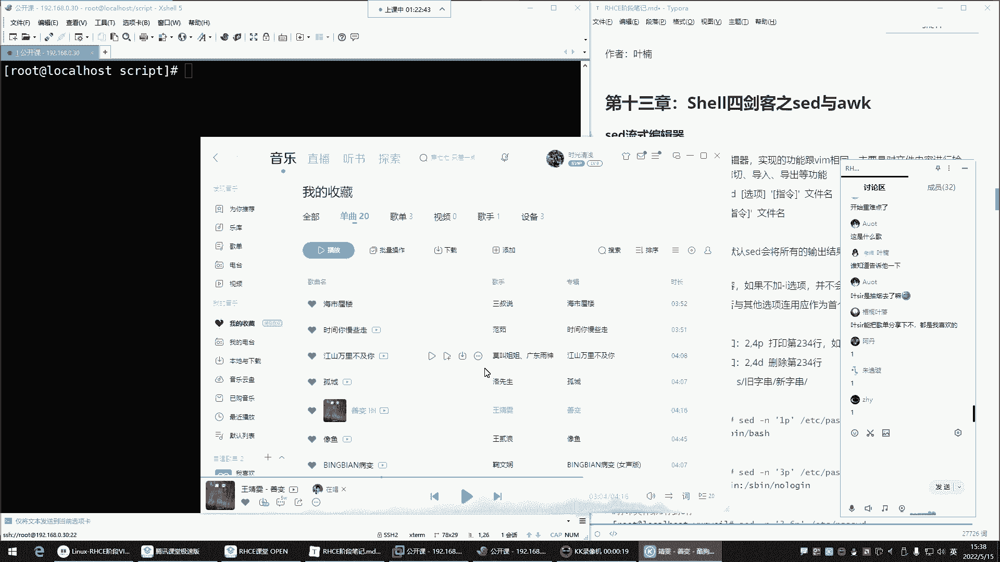

# 零基础入门Linux，红帽认证全套教程！Linux运维工程师的升职加薪宝典！RHCSA+RHCE+中级运维+云计算课程大合集！ - P48：红帽RHCE-13.Shell四剑客之Sed编辑器 - 广厦千万- - BV1ns4y1r7A2

喂喂喂，都回来了是吧？好，这个这歌这歌挺好听是吧？也比较喜欢嗯，分享一下，这也不能分享，这也不在课程范围内啊。这个歌单是吧？😊。

觉得。

这玩意咋分享啊，是吧，截图吧。😊，截图。我这里的歌。

哎呀，都是一些老歌这。

80后。80后喜欢听的哈这个。好，继续了哈。😊，接下来呢来看看这个sha4件课里的C的跟AWK啊，这玩意儿它我们会用得到啊，但是用的多不多呢？也还行。😊，先来看C的C的呢专业名词叫流式编辑器。

那这个通俗点来讲就是。VM。的一个另外一种实现方式。为什么呢？因为呀VIM我们在改文件的时候，VIM我们前面讲过，不能放到脚本里面是吧？VM是交互的。你VM打开任何一个文件，我要改的话，你想想那。😊。

是不是脚本没有办法去帮你去这个对VM做后续的操作了呀，它脚本就能帮你把文件打开。是不是脚本就能帮你把文件打开。然后呢，那别的功能那得靠你自己手动了。😊，但有的时候呢哎我要改文件，但是我不想去这个什么呢？

不想手动改，也这个也想通过脚本来实现。那C的是一个非交互式的一个。😊，VM。啊，就是文本编辑器。所以它主要对文件内容进行。增长改啥，那VM不就是增长改啥的吗？是不是啊啊。

所以C的它就是跟VM的功能是一样的，只不过它是非交互的。好，那这玩意儿命令格式呢也比较这个。也比较多，主要是它的用法呢比较多，花里胡哨的。第一种，前置未定管道给C的，然后这是第一种哈。第二种C的。

你直接对文件去处理就行了。那我们呢一会儿再说入这两种格式，先说这条命令。C的后边的选项啊，选项的话呢有杠N，就是这个。杠N的话呢，我们一会儿用的时候再说杠I杠R这些选项。那动作指令什么打印删除替换。好。

来演示一下。怎么用？C了。我现在。想去。查看一个文件VM可以打开一个文件，C的也可以打开一个文件。那它打开的话呢，不是在一个交互式的界面，是直接给你显示的命令行了。所以C的我现在啊想看这个文件。😊。

那你就跟上。ETC的passWD哎，C的。啊，加N啊。哎，不是嗯，看C的。不是平民幕生输出啊嗯。嗯。谁。来看一下啊。うん。P。🎼it就是有点陌生了哈，好久不用了。sit杠安打印ETC下的passWD。

😊，Hey？我记得他可以用，不是这样，也可以用啊。非得这样吗？加个P。🎼嗯，这这这就是嗯。

开了哈。录屏开了哈嗯。

🎼啊，对对对对对哈，不是加N哈。对，这哎，我记着我记得这玩意不用加P是可以直接用的。😊，但你看你要不加P，他就报你语法错。那就必须得加个P回车就可以了，但P不一定引不一定非得引起来啊。这P是干嘛用的呢？

P就是给你打印的。给你打印默认情况下，你就C的P。😡，P就是print。print打印的意思回车，但是你输入print不行，他不认识，你就得P，这样就可以了。那是不是跟VM一样啊。

就直接把这文件给你打开了，看到了吧？😊，但是这个文件里面怎么这么多内容啊，你发现重复了是不是啊重复了哈，你看。😊，每一行都给你重复输出了，是不是啊什么？nobody是吧，输出两行。

我我我们一般不用我们一般是不这样打印的，一般怎么打印的？哎，指定打印的行，它这玩意就比较智能，怎么智能呢？你在批的时候看哎，你加个一1P。😊，哎，不对劲儿，哎，你看这一批是啥意思呢？😊，啊，再来个三P。

三批回车，这三批也不行是吧？这玩意儿怎么都把这文件给你输出出来了呢？😊，好，他这玩意儿是这样子的。啊，要加个N。杠N3P。这样就可以了，这样打印的是这个文件的第三行。我想打印文件的。😊，第六行。

那就6批。这就是文件的第六行。看到了吗？是不是这玩意是不是比较给力啊，你给给另一个数，他就给你打印。😊，所以说这批是打印指定的行。那如果你不加皮回车。那这时候就打印所有，但是你不加N，它有个毛病。

不加N的话，你看它内容给你重复打印了。看到吗？是不是重是不是重复了呀啊，所以这个N。一定要加。叫做屏蔽的屏蔽你的默认输出。默认C的会将所有的输出结果输出到屏幕，杠N是只把C的处理的行输出到屏幕。

你不加杠N，你发现它给你打印的也都是很多重复的。所以这个N是精髓所在打印的时候。这叫加N。加N的话，它才会给你输出你。想打印的那行，如果你不加N，你比如说你不加N，你EP。回车好，文件的所有。是吧哎。

那你加N。🎼回车你发现就只打印了。文件的第一行。看到了吧？哎，这个就是我们所说的。N可以帮你屏蔽那些你。不想看的那些输出哎，只把什么呢？只把我想看的那个给我输出到屏幕。我想看谁呀？

我想看第一行就只给我打印第一行是这样子的。OK那下边我们再来看。这个这P都没什么问题吧啊，那下面我们再来看这个P还可以怎么用呢？哎，加逗号2逗号4P。へへ。2、逗号4P。🎼逗号哈4P啊。

2到4个人来推车。这是啥意思呢？😊，这个就是2逗号4，就是打几行啊。嗯。234是不是啊？这是文件里的2。😊，34。嗯，就是。打印234行，我想打印这个文件的6到10行，那叫6。逗号10。那总共几行啊？

五行。啊，6七890。🎼hello啊，在这儿哎678910。五盒。这就是。打印啊，用逗号可以帮您。打印一个连续的行。然后那如果我不想连续呢，我就想看就想看第六行跟第十行啊，不是6到10，那这时候就。

看啊英文的冒号。🎼啊，不是啊，不是英的冒号啊。对，不是英文冒号，这冒号不行，是分号。分号是啥呀？就是他们之间没有任何的关系。😊，但是这为什么说还报错了呢？说什么遗漏的命令。😡，是吧。他要。粘起来。哎。

啊，没有加个P，我看不演哈。😊，不隐，这儿少个P哈，因为他们没什么关系，所以它无法识别你到底要干嘛？你看这六冒号十就答案第六行跟第十行，那为啥卡在这儿了呢？🎼啊，这样可以，所以一般我们要给它引起来。

不隐的话。他。🎼有的时候就有问题，所以C的你在用的时候，你就注意我前面给你们演示了那么多，没有引是吧？那尽量都引起来，不引就是有问题。🎼所以你们就在用的时候就以就需要就要习惯使用引号。打印多少行。

给它引起来就行了。你不仅有些特殊符号被系统会识别为是一些特殊功能的符号。而且对于C的来讲，它也无法识别。好，这是。这个是第六行。🎼这呢是第十行。🎼能列吧，总共两行啊，因为这个分号前面讲了是吧。

它们之间没有任何关系，就比如说我想建个文件，hello点TIT分号，我想安个包亚某杠外ins套前面命令跟后面命令没有任何关系。嗯ん。嗯。对，这里这里打印的意思是输出到屏幕，没错。并不是真的用打印机打印。

没错，你的理解是对的哈，它不是用打印机给你打印，不是给你这个不是给你直接打印一张纸出来，不是哈。😊，就是给你输出到屏幕啊，就是我们如果说打印的话，大家无法理解就输出。是不是？哎。

你你们到时候自己改一改是吧？你们手里不也有笔记吗？哎，叫输出啊，咱们。但是呢。连官方是这样解释的，就输出。输出哈。这样能理解了。好，那下边。我们再来看。是不是想打印几行就输入数字就可以了呀？好。

接下来我们再演示什么呢？再演示这个删除。删除。我想3。那我们拿这个文件来演示哈删这个文件现在多少行呢？这个文件现在。😊，我们看一下。WC同计一下。🎼等L然后统计po似WD21号。好。

那我现在用C的要删这文件C的。杠D注意啊，这时候不是输出了，是删除了啊，删第几行单眼双眼都行哈。删第几行呢删文件的。第六行。上第六行。那。🎼这个是N。屏蔽慢输出。啊后6D。变成那个文件名回。诶。😊。

怎么没有输出呢？😡，是吧没有输出。😡，为什么没有输出呢？😡，因为。他给你删了。😡，你删了的话，他怎么给你输出啊？😡，是不是啊他你看不到哈，删了以后你是看不到的。

然后那你说那他真的那我自己再勾略一下不就行了吗？是吧？WC杠L。😊，回车哎，不对呀，还是二十1行。为啥呢？没删，不是是注意哈，我们这个删除跟替换的操作。它不是真的生效了，是怎么样呢？

是你得用杠I这个选项。I是直接修改文件的内容，否则在命令行里面这种完全是啥呢？就是演练啊，这叫演练。如果真涉及到实操的话，这个选项不能用杠N。你评估评评估评蔽不认输出没啥意义。😡，没有意义哈。

因为它不是真的对文件做修改。所以杠I。6D推车。6D就是删除第六行啊，这个时候我们再WC杠L原先是多少行，21行是不是哎变成二0行了？你再删。删5D删除第五行回车，当然我们就瞎删哈，加瞎删。

管它第一行呢，我就想看真的删除了吗？哎，变成十九行了，是不是啊？😊，所以。你发现这玩意儿是不是就是VM啊？如果你用VM删怎么删VM打开文件是不是打开文件我要删第一行呃，删除第五行12345DD。😊。

然后再保存退出麻不麻烦？🎼是不是麻烦，那用C的呢哎C的杠I删除第几行，第五行5D。🎼然后文件名归车没了WC杠L统计一下，没了，是不是啊？你看这干的事儿不就是VM的事儿吗？

只不过他呀在命令行里面直接不用进到文件里面，直接命令行里面就给你操作了。😊，你说要删第几行，你吱声啊，他就直接干嘛呢给你删了。😡，比较给力是吧？然后大家在删之前，比如说我想删这个文件的第五行。

尽量先干嘛呢？先C的。杠N屏蔽面输出，先看一看第五行是不是你想删的那个。给我看第五行啊，这个确实是我想删的。那这个时候。🎼你在干嘛呢？哎，在直接改原文件，你别上去就删。🎼5D回车。哎。

那这样的话呢是非常的精准啊，我一看啊，这确实我想删的内容，那这时候呢再直接改一文件，前面先看一看，下边再去删。能理解吧。好，然后那我们这种命令是不是就是直接用C的对文件去操作的呀？命令格式2是吧？

C的选项指令选项我们用哪些选项呢？有杠N最常用的平面面式输出啊，主要就是只把C的处理的给我显示出来。然后杠I杠A这个选项是直接对原文件做修改。如果不加杠I选项并不会真正对文件的内容造成实质的改变。

然后那杠L呢使用扩展正则啊，这个很好用啊。很好用哈，这牌。然后就这两个是最常用的。啊，那都指令指令的话对，前面是选项是放在sit后面的。你到底是输出，还是直接针对原文件操作，最最常用的选项。

那指令这里边哎。有打印，有删除，有替换。那我们一般就是如果你想。查看文件内容的话，就用P这干嘛呢？哎，他就你用杠N把默认输出给它屏蔽掉，然后只打印你想查看的那个行。

然后D就是删除删除就没有必要加这个杠N了，为什么呢？删除的话是要直接对于文件改的。因为你删的话，你是看不到的。😡，他直接就给你删了，也不给你显示。所以你在删的时候，就用前面那种给你们演示的时候。

你发现你就是删你加杠N没意义。😊，🎼C的你杠N屏蔽没认输出是屏蔽了。然后你比如说我5D。删第五行回撤，那默认输出屏蔽以后删了，它也不给你显示。😡，所以这个就没有意义了，你想删的话，还是前面那种干嘛呀？

先。打印啊，就是我们杠恩杠N先打印。打印第五行，看是不是王想删的，然后再什么呢？哎再杠I。🎼山5帝别错。能理解吧，所以你看这里面这杠N主要是不是就是你在打印的时候是最常用的呀？

那把你把它的那些默认的输出，我不想看的输出给我屏蔽掉。那如果我想对文件的内容。去做一些实质的修改呢？那是不是就是杠I再结合下面的指令，什么D跟删除或者替换呢？那我们用C的无非不就是对文件内容做修改的嘛。

要么就删，要么就改是吧？要么就替换啊，但是主要还是替换为主，你改就是替换删替换也可以实现是不是啊啊，所以这玩意儿。🎼他跟他俩结合着用嗯，往文件里面添加东西。添加东西icical。啊，I口增加。😀呵呵。

😊，是不是？😊，我往文件里面增加一行啊，ecle ABCD到这个文件是不是追加进去？😊，🎼是不是开的。😊，这不就是ABCD吗？😡，是不是啊？好。那接下来。我们。🎼这些都演示了是吧。

N跟IN跟P连用I跟D跟S连用。那D呢我也演示了，这都比较简单了，主要就是哎C的，比如我想删个连续的杠I啊，删就。那这时候先打印一下啊，我也不确定是吧，先打印一下，我想删的是。5。逗号。七啊。

第五到第七行先给我打印一下。回车看看这三行567是不是我想删的。好，是那在干嘛呢？C的。换成I，直接对文件修改。那这时候就不要批了吧，是吧，就D了是吧，删。没错，这就删了。哎，来这位置有没有问题嗯。

这个选项跟指令没问题，没有问题的，给我刷个一。很好看。比较给力是吧？比较给力哈，这玩意儿基本上就是直接不用进到文件里面啊，就改它。😊，啊，那接在来我们来说说替换。😊，替换嗯，对，咱们说替换怎么玩。

那VM替换怎么怎么替的呀，打开文件是吧？😊，英文代号来到底线命令格式，然后摆分号是不是替换替换符。旧内容，比如我想把ABCD替换成叉叉OO是吧？灰车哎，没有加S哈，没有加S。😊，🎼百分号S回车。

你看是不是变成叉XO了呀？那C的怎么替换呢？哎，类似。😊，C的。现在。你替换的时候可以先干嘛呢看一看杠N。哎，先看看它是否是你想替换的那个。嗯，有种感觉是吧？啊，C的杠N，然后呢要替换了。

那替换里边也是S来表示替换，也是斜线作为替换符。然后我想把文件里的什么呢？叉叉OO。😊，替换成哈哈。😊，好，哪个文件，这个文件推车。哎。怎么。没有打印是吧，这哈。😊，回车你看是不是把叉叉替换成哈哈了。

😊，🎼是不是啊变成哈哈了吧？好，那一看可以替换成功。但是这时候原文件我们是用P打印的，是不是不是修改呀？那接下来哎再去对它做修改C的杠I。😊，🎼然后我们再对文件内容做真正的替换了S哎，什么呢？

把叉叉OO替换成哈哈。那这时候还是批了吗？不能是批了吧。😡，因为前面你已经指定替换了，是不是啊？然后哎跟文件名就行了，回车看文件。😊，变成哈哈了。看了吧？😊，是不是？😊，嗯，变成哈哈了。😊，好。

这就是哎你在替换的时候，你可以先确认一遍。🎼就像我们前面在删除的时候，先给它打印一下，看看这到底是不是我想删的。你在替换的时候，你也先打印一下，看看是否是你想替换的。哎，你看这玩意儿是不是很。

但是你不需要进到文件里面呢，那VM你想想你我们还得跑到文件里面去，麻不麻烦，非常麻烦吧。😡，啊，非常麻烦。像我们前面写的创建优户那脚本，每次都得跑到文件里面去改它的名字是吧？那以后有C的。

是不是你直接指定C的。😊，我把文件里的。直接是吧。🎼杠I比如说如果文件里面我需要把哪些内容给它替换掉。是不是就S去匹配呀，在这儿S匹配。啊，比如说我想把变量名里的那个小方替换成。小泽。🎼好。

然后跟上那个脚本啊，U色点SH。那是不是直接就把变量面的小芳替换成小泽了呀，你都不需要跑到文件里面去了。😊，没错吧。好，我想把这文件里的root替换。🎼Jroot替换来看一下。我先干嘛呢？先看一看。

杠恩。杠恩。咱们先看一看啊，我要把那文件里的root替换一下。把root替换成谁呢？哎，替换成addmi。回车。没有打印没有打印哈，回车。😊，啊，那你看是不是把root直接替换成at的面了啊，没错吧。

哎。😡，那好像有点不太对劲儿。哪里不对劲呢？就是这后边的怎么没替换呢？是吧我想实现一个叫全文替换。😡，只要是root的都替换。😡，好，那这时候。加个G。G代表全文VM里边是不是也是G代表全文呢？

🎼这叫全文替换。你看那就是告诉你了啊，我帮你把这个。这一行给你替换了，哎，你看看是不是我们想替换的。你一看啊是确实是啊，我要把s rootot替换成altamin。那这是不是就相当于改了呀？😡。

是不是啊你替换不就是修改吗？😡，好，那这时候你再这样。杠癌。更爱。🎼真正去修改原文件S替换。那修改的时候还打印吗？不用打印了吧，前面不已经打印了吗？是不是啊也看了效果了，哎，回车。

那这时候就变成addmin了。看到吗？是不是就停完车把它命来。好。这个替换。🎼有嗯有有没有问题嗯，没有问题的，给我刷个一。是不是比较好的理解，这玩意儿就你VM怎么替换的？就它类似。就类似哈。替换。啊。

那我们再往文件里面再增加一行增加一行哈。嗯。我们再把这个。我们怎么演示呢？嗯，再把这个。再给它增加到文件里面去。🎼打开这文件哈，打开这文件。🎼在在俩在这儿插入一行插入一行。好。🎼然后略微改一改。

给它改成。没事随便给哈，随便改。那我刚刚添加的是谁呀？😡，是这个是吧。是它好，那我现在过滤这个demo。Gra。これ？🎼这个demo啊用为C的也一样C的。然后刚摁。他支持正则，这样支持正则哈。

先匹配一下正则给我匹配一下。匹配。如果哪一行包含demo的，给我打印。🎼回车。你看这玩意儿，哎，你可以不通过这个指定行，你可以用正则正则一定要放到这个什么呢？这个。😊，斜线里边否则无法识别。

🎼你不能这样啊，不能直接demoP看到吗？不行。你放到这个里边就是代表。我你去给我过滤。这个包含demon的，然后我打印。哎，可以根据指定的字符串或者说关键词儿去打印。也可以直接指定行数去打印。

但有的时候我们会有一些需求，哎，我就想从文件里面去干嘛呢？哎去做一些查找。啊，对呀，这个两根斜线就代表是。正则了。两根斜线哈表示正则了，就那边。😊，利用正则表达式可以去什么呢？去做匹配了。

但是正则表达式要在两根斜线里边，也它这里边也可以加一些符号。就是你想去过滤的话，你可以加正则表达式，但是一定要放到这个两根斜线里面。😊，哎，这样它就识别了啊，原来是用正则表达式的方式去过滤，是这样。好。

那。接下来。我们过滤出来了是吧，那现在两行都一样，我想替换的是谁呢？哎，是他。但是现在他把这两行啊。都给我匹配出来了。😡，是吧那我怎么替换呢？我想把所有的demo替换成别的是吧？那这两行怎么替换呢？

这时候就得这样搜索。哎，这样搜索。搜索出来了，然后干嘛呢？S替换。先搜索。啊，后者是这样啊，我看看。这样是不是搜索出来了呀，然后S替换。😊，听这什么呢？那你这样两行是不是都替换了呀？😡。

那你可以区分一下。区分一下。🎼啊，这个哈我我看一看。呃。🎼看看这玩意儿应该这时候应该怎么实现这功能呢？🎼嗯，如果是这样的话，我们可以看一下它得多少行啊，看一下行号。我们看这个行号怎么来实现哈。😊，这个。

这个。等于号。我们先把这个命令还是这样拿过来。🎼正则。正则。然后干嘛呢？这个位置放个等于号。うん。这样可以吗？不行。嗯。そ。嗯，那就等一会，我看看怎么放哈。🎼嗯，这样这样放也不行啊，他这玩意儿。这样放。

啊，这也不行。诶。哼这个。这样的啊看看管道一下，管道给。管道给谁呢？这时候。哎，有没有什么方法把这个行号给它写示出来呀？啊。有吗？啊，如果你不加P的话，它是这样。用等于号可以啊，那这样看的话。

可能说看的不是很精准。哎，你看有人说了，是不是？😊，拜指结尾是不是啊？啊，那我们试一试哈试一试。🎼他这种方法啊他这种方法他说哎哎试一试这个可以吗？是吧？哎，咱们试一试。C的杠A啊吧，正则表达式。

但是引起来。引起来哈。いじ。但是先干嘛呢？先杠N一下。输出一下。🎼看他这种语法分析分析。唉，可以。你看他这个可以，是不是啊？这种方法就先过滤败齿结尾的，然后。如果你替换的话，我们在这儿就加个G。

全文替换。然后这个位置我觉得可以的话。🎼我在干嘛呢？我在杠I是不是啊？哎，他这种方法也行也可以是吧？那如果你觉得其实有很多种方式，下面这种我先给它过滤出多少行也行。

第七行是不是啊你看这个跟这个这是在第七行，那C的杠N，然后。他这玩意儿可以。嗯。前面指定行号是指定行号。指定号号。指定行号呢，这儿。直接指定行号在这儿。第几行第七行，然后。我对第七行做替换S替换。

把第七行的这个demo。替换成。叉叉都。然后打印一下。也行。是吧看到吗？替换了吧，然后全文替换。哎，也行，哎，然后或者说就像他刚刚那种，哎咱们不指定行数，我先匹配一下正则表达式，匹配demo。

匹配完了之后，ST one。全问替换。🎼啊，但是要加个bitch结尾哈，不是要匹配bitch结尾的bitch结尾。哎，办事些为的。好，然后替换，你看这玩意儿。这里是不是？😊。

这个同一种就是你想实现同一个功能那方法。可以有很多种。哎，就是这姿势有很多种。啊，就看你喜欢用什么样的姿势啊，但是姿势要正确，不正确。那最终不行。😀呵呵へ。😊，哎，干啥事儿滋势得对，是吧？😊，好，这是。

替换啊，结合正则表达式啊，前面也可以指定行行数。这个位置哎，有没有问题啊，这个位置都没问题吧。呵。と。啊，没有问题。然后这里边有很多的例子，大家可以下去练一练。好吧。可以练一练，因为就这玩意儿。

我这里面的例子还是蛮全的啊，你们如果自己没有思路，就看我的这个笔记。🎼笔记里面怎么敲的啊，你就先给它过一遍。过一遍哈。嗯，C的这个位置。有没有问题没有问题吧。🎼啊，那剩下前置命令管道给C的啊。

这个呢一般就是用的比较少一些，还是这种直接C的处理文件用的比较多一些。那前面前面管道的话呃，你这个就是你给什么命令，你需要用C的帮你处理一下也可以。也可以。我看我这里边。没有掩神。但是用的比较少的话。

那种方法主要还是直接用C的，直接C的，没有没有什么演示。因为用的不多用的不多。你像管道这东西，管道这些东西啥啥都能传递，是不是啥都能传递。所以有的说候别人有需要的话啊。

比如说我需要这个对我的前面的命令的结果交给sta再去处理一遍也行。也行，你比如说哎我先这个先gra啊，过滤一下文件，过滤谁呢？过滤root啊，或者说admin。过滤从文间里面过滤了是吧？

过滤出来之后干嘛呢？管道给C的？C的给我替换一下。替换。替换什么呢？啊就是。想想怎么处理就看情况啊，后者直接给我删掉啊。如果说是what的min的C的杠I。然后。直接。果山。嗯，对，山就直接。D啊。

我看这样行不行哈，C的杠ID回车啊，没有输入没有输入文件。不行，这样玩不行这样玩儿不行哈。这种这种比较少，还更麻烦了，你还不如用C的，我直接去匹配了，是不是啊干嘛还用grape呀，是，没有这样玩的哈。

一般这种用的太少了哈，主要就大家聊一下就行啊，这种命令格式有。😊，这是C的。然后你看我这里面是不是有很多例子啊啊，大家可以去练练练练哈哎做比如说将文件里的所有数字都给它替换了，怎么表达所有数字啊。

0到9啊，将文件里的所有的英文字母给我替换了，怎么表达所有的英文字母啊，A到Z。😊，小写的A到大写的Z就是。小写字母也包含了大写字母也包含了啊，全文替换。🎼这里面下去练一练哈，这里面C的。😊。

这种这种练习的还是什么呢？还是非常能够开发你们对于sd的一些这个就是比如说它的各种花里胡哨的玩法。啊，前面没有来听。你都听好几遍了。好，然后接下来AWK。AWK是干嘛的呢？AWK是一门编程语言，哎。

这边编程语言啊不是很不是很这个什么呢啊，不是用来去写程序的。😊，🎼你像什么C啊，shall啊，ser这些变成语言AWK也是。AWK也是一门语言。那我们用AWK这边语言干嘛呢？哎，做数据过滤。哎。

实现一些grape无法完成的功能。啊，我们就是用AWK做数据过滤。啊，这个AWK为什么叫AWK这个名字很奇怪，是不是啊？因为它是由三个人开发出来的这个语言，这三个人的名字首字母AWK。啊，所以。

进门变成语言，就是AWK。😀へへ。啊，你不用认识的话，你知道一下就行。为什么叫AWK。😡，然后这个东西呢，它就是干的是gra的事儿。基于模式去匹配检查输入的文本，足行处理并输出获取指定数据。

说白了就是数据过滤的。主要就是我们学的就是数据数据过律。然后它过滤跟gra区别在于哪里呢？grarab，我想过滤go me。是吧。😊，那AWK也可以AWK过滤whatmin。但是AWK啊语法有些复杂。

语法有些复杂啊，你看一下。grab比较简单，是不是啊啊？AWK呢它的语法。😊，它也啊AWK可以结合前置命定用的比较多一些，C的用的不多。然后它这个看啊AWK有选项，然后条件指令条件指令。简单的演示就是。

AWK你在过滤的时候。它是这样的。要通过指令指定。Pnt。P른。打印。啊。打印谁？🎼你可以像s一样匹配打印我min。给个文件。看到了吗？是不是效果是一样的呀？哎，也是放到两根斜线里面。去。

指定你要打印的内容。如果你。不指定的话，它是回车所有。把所有内容给你打印出来了。看到了吧。所以。你想过滤的话，就是要匹配。好み。是亮样子。那我们经过这一条命令的演示，来说说它的语法。AWK。说命令本身。

然后。这个呃。我想去从文件里面过滤的话啊，最常用的就是两根斜线里边去放你想过滤的关键词儿。然后。选项没有用，是不是啊啊，选项是指定分割符的。那这个分格符就是你想对于这个文件的内容的每一行之间。

以什么作为风格才给你打印。如果默认不指定的话，它是以空格作为风割。如果不指定风格符，默认以空格或t键作为它的分格符，分隔每一列。注意它主要是能够支持叫列输出。一会儿给大家演示。啊。

所以杠F呢你可以自己手动指定每一列之间的分割符是什么？然后条件条件是什么呢？条件就是这个就是我的条件。我要过滤我的病，这是我的条件。指令。指令。这里边最长的指令就是printnt。是打印。

因为它本身不就是做数据过滤嘛，是不是啊？那你如果不加print可以吗？我就直接过滤。😡，回车也可以。🎼哎，这有点那意思了，是吧？哎，gra我 me。是吧AWK。わみ。不行，为啥呢？嘿，你配。

🎼这样他不然他不认识。看了吗？不加引号也行，哎，但是一定要干嘛呢？哎，放到斜线里边他就知道了啊。原来你讲示过虑的是这个呀这个关键词。😊，有点没意思了是吧？😊，哎，用起来跟grape一样，你发现。一样啊。

那接下来呢。你说我如果说用它跟grara一样，我还不如用grarab了。😡，我用它干嘛呀？它比gra还更复杂一些呢？所以我们用AWK不是想实现grape的相同功能，那就没有意义了。

我们用它是实现grape无法实现的功能。graap无法实现的功能是什么呢？就是我想看这个文件里的具体的。某一列，比如说第一列用户名跟最后一列用户的解释器，中间呢我不关心，我就想看这两列可以不？哎。

它就可以grab就不可以AWK可以。所以AWK它给力就给力在它可以帮你打印某一列。那这玩意儿怎么指定列呢？😡，啊，AWK的内置变量。😊，刀了一就代表第一列，刀了二就代表第二列。以此类推。

刀了100就代表100列。那这个时候我们在用它的时候，刚好我就可以指定。😊，当了一。当了一，但是。这样的话它不识别，为什么呢？因为这个文件。这一行里边。好像。没有它识别的分割符。

默认它是以空格跟t键作为分割符的那这一行里边有空格吗？没有有t键吗？没有，是不是？那怎么办呢？哎，杠F指定它的分割符。AWK选项最常用的杠F指定分割符。那分割符是什么？严格的冒号回车。哎。

这怎么没识别呢？啊，杠F。指定分个服。嗯。以冒号这分割符打印。第一列。的命第一例。跟这没啥关系。以冒画式风格啊，指定风格服务。然后。你看它这样不行，为什么呢？😡，哎。这样不行哈。这样它无法识别了。

发括号。放到pro那里边。一亏车语法错，为啥这时候得引起来了哈。😊，在这儿。回车唉，这样可以。是不是啊？🎼这样可以。嗯。对。前面我看啊。前面这个哈哈叉叉OO对，这个就是把第呃对。

把第一行替换成叉叉OO没错。嗯啊你看他这不是是不是复制我笔记里的呀？😡，嗯，附制我笔记里的是吧？对，在这里边啊，TT。它这里面。来看一下哈，我们直接把它这个拿过来。推车啊，他这是啥呢？就是。就是用那个。

嗯。就是用AWK杠F指定了一个分割符，是不是冒号作为每一列的分割符啊，那这时候哎beg哎比根是什么呢？beg在AWK里边代表。它的完整的命令格式。在这儿。🎼비간ピピ哎。嗯， you跟。

这呢哈比根它的命令格式里面包含比根。比은。是读取文件内容之前执行的指令，指令执行一次行前处理。就是说他在。对这个文件打印的时候输出的时候，它先执行比根里的这个指令。他的指令你看了吗？干嘛呀？

就是随便挨了一个啊，或者说随便打印了一个，打印什么呢？就这个用户名。😊，跟显热器。で。T就是中间这部分。裤格。就一个t键，这个T就是就是它的那个t键，知道吧？你摁一下听不见。

其实在这里面是左斜线T来表示的。它几个t键呢，两个t键这个它是输入了两个t键。这样呢看起来会更加规整一些。你不加推不荐。😡，他这玩意儿就是这样，你不加T键。回车吧看到吗？贴上了，对不是？能理解吧？

所以他是加那个T不键。😊，用户名儿。但是听不见，你得左些线告诉他。左线。🎼两个T就两个t键，三个T就三个t键，这样就可以了啊。它下边搜到打印也都是加了两个t键，看到吗？这样会更加的规整一些。😊。

添加规整一些，但这个t键你发现它叫因为这个名字有点长，中间t键有点啥了吗？有点那个。不是很规整了。所以上来先输出一个啊，就是用户名跟解释器。接下来呢再print。不能打印打印谁呀？

打印第一列是不是啊每到一第一列不就用户名吗？那个那个文件里面你分分号作为分割符的话，那第一列就是用户名。然后打印用户名之后再干嘛啊，再来两个t键，一个t键，两个t键。😊，然后再打印第几列，第七列。

第七列不就是用户的解释器吗？哎，那呃这位置。能看懂吗？嗯，有问题吗？没嗯，能看懂的给我刷个一上来。你看我们这一的拆解是吧？拆解以后是不是明白它这语法了呀？看看不懂的刷个2，看懂的刷一，看不懂的刷2。呵。

😊，是。😊，家人呢啊。怎么让他们对齐，那没办法，那名字有长有短，那没你这名字有长有短啊，那没有办法呀。😡，😀呵。有的名字比较长啊。好，这个哈。啊，那他又他又来了一个是吧，他又来了一个。😀呵呵。😊。

看一下哈。😊，这个告诉你啊，一共21个用户啊，这玩意儿这玩意儿是怎么输出的呢？😊，这玩意儿叫end的，唉，它这里边。又多了一个end啊，前面没有这个end是不是？那end的是啥呀？😊，😀哎，这案呢。😊。

这他差点发我们给他拆解是吧？😊，这个end在这个里边是读取文件内容结束以后执行，但也是只执行一次。也就是说它前边你看这个只输出一次。这个beg叫前置命令，哎，在这里的命令，print只输出一次啊。

就告诉你哎，我输出一个用户名跟解释器啊，那中间这个print是会干嘛呢？读取文件的过程中执行中间的这个大括号里的指令。啊，那这个指令呢是足行执行的，什么意思呢？就是他读一次这个。

他对文件里的所每一行都要去打把大。都要去打印都要去打印，打印什么呢？打印这个文件的每一行的第一列。每行的第一列，然后呢。注意啊，这个是足行执行，每一行都打印第一列。啊。

直到把这个文件的所有内容给你打印出来。啊，那这就是足行执行的。这些内容看到吗？租行执行。啊，前面这个就是。好。Beg只执行一次啊，输出一个用户名跟解释器。啊，这里的指令是对文件的每一行都要去输出。

然后那摁的这里的指令干嘛的呢？哎，读取文件内容结束以后，也就是说呀哎它。中间的大括号里的指令，把文件的内容都读完了啊，都处理完了，最后呢再执行end里的指令，end不就结尾了吗？是不是啊结尾了。😡。

接下来呢他也给你执行一次end德里的指令，但也是只执行一次。哎，开头执行一次。结尾执行一次，那结尾执行干嘛呀？哎，他来一个又是自己输出了一个什么呢？叫做一共NR个用户。那NR在这里边干嘛用的啊。

NR在前边。

叫做文件当前的行号。嗯，这玩意儿叫当前的行号。你用AWKAWK。然后。你去print的时候。printnt然后这样哈。NR。回车。这叫什么呀？这叫行号。这文件里面总共多少行，多少行啊，十四行。

那你如果再来1个NF。换个NF。回车。这是什么呀？这叫裂。😡，这文件多少列呀？每一行就一列，为啥呢？因为我们没有指定分割符啊吧，如果你指定啊一。😊，分号作为分格，回车每行有7列。看到吗？7列。

所以他那个语法是啥呢？就是。最后给我printnt一下这个文件里边总共有多少行。然后呢，我统计一下有多少行不就有多少个用户嘛，是不是啊？然后下边就是哎一共21个用户。嗯。可以按R可以为一可以指定。N尔。

是。一回车哎。呃，当前行号嗯。用用波浪号啊匹配一下。啊，语法错了，他告诉你语法错。哎，那这样一。哎，那招怎么用来着？21。那不行不行哈，哎，可以指定。😊，我给忘了。我也忘了哈。啊，负一那不行哈那不行。

😡，🎼都不行。OK这就是它的那个语法。是不是啊？所以AWK你发现哎它这里边啊。😊，就是这里边常用的就这些。都给大家讲了，哪些呢嗯就是。有一个选项啊，杠F是指定分割符的，然后它的内置变量。啊。

print打印，因为它本来就不就它本身不就做数据过滤嘛，哎，就是为了打印啊，所以print最常用杠F在打印的时候指定一下，以什么作为风格，我要看第几列，哎，当乐符就是代表列数。

那NR代表当前文件里的行号NF文件的每一行的列数。😊，然后接下来我们来看看这里面的一些例子。就是。是这个。看一下哈，那如果我们写一个像差那样的，你看。我们自己写的话，这里边。我还是结合了一些正则表达式。

在这个里面哈结合了正则表达式，我给大家演练一遍啊，AWK。😊，啊。等会儿。🎼这个AWKAWK杠F。然后。🎼这时候我们如果想做一些过滤的话，啊，就正则匹配啊，比如说以root开头的。啊。

没有root了atd me。我的命开的时候子。这里面来个间减号。把它 make开头的，然后。如果满足条件给我去打印它。printnt打印。打印它的。这个第几列呀？哎，打印它的第一列。然后道口隔开。

指定多个列数。加第七列。对，这个文件。好，那这时候是不是就是用户名跟解释器啊？那这时候。

