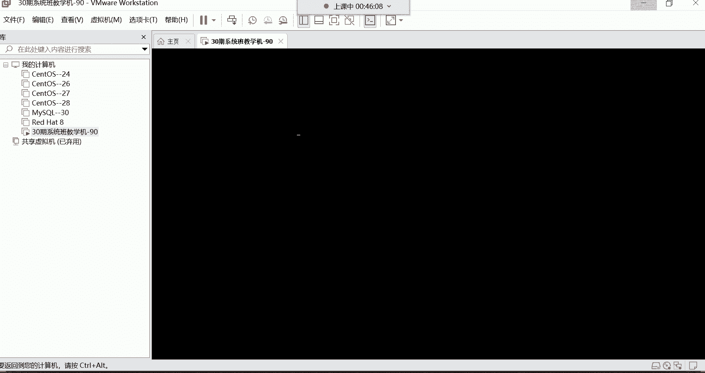
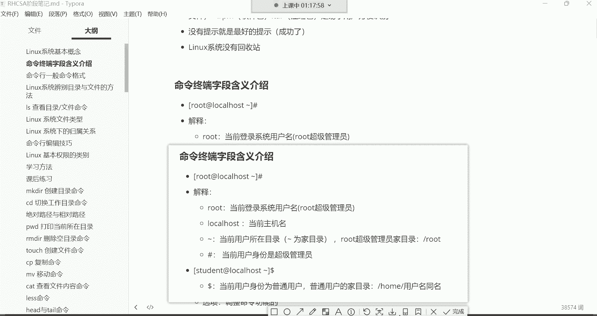

# 零基础入门Linux，红帽认证全套教程！Linux运维工程师的升职加薪宝典！RHCSA+RHCE+中级运维+云计算课程大合集！ - P4：红帽RHCSA-4.Linux系统基本概念、命令终端字段含义介绍、命令行格式介绍 - 广厦千万- - BV1ns4y1r7A2

呃，能听到我这边声音的讨论区刷个一上来开始我们今天下午的课程。好，OK是吧？好，都没有问题。那我们就开始讲课了哈。😊，呃，我看到有很多同学是新进班的是吧？好。😊。

那在这里面呢还是啊欢迎你们这些这个新进班的同学哈，然后也都是从这个公开课，然后这个进的班是吧？然后也都知道我是谁，我呢也不给你们做这个啰嗦的自我介绍了哈。我相信我相信我们都已经很熟悉了，是吧？

有的同学已经甚至听了好几十节公开课，然后才进的这个系统班里面。好，那我们就继续按照我们上周的课程进度给大家讲解。然后你们这些新进班的同学哈，可能说嗯没有一些这个。😊，什么学习资料之类的是吧。

还有这个系统的安装工具之类的。这个我再给大家说一下啊，就是咱们所有的学习中能够用到的，比如说工具箱啊、软件包啊。

呃。我都给你们发到这个群公告里边了啊，在群公告里面有1个VIP大礼包啊，我这个虚拟机装上了，用不上，用自己的s度可以可以哈，可以可以呃，我们用sts7哈，不用8，因为8的话呢已经过期了。

你学的话呢也没有用。好，然后在这里面你们看到了吗？这有一个什么呀？这儿有一个我给你们。😊，VIP大礼包嗯，在这儿哈就在第一个哈在第一个公告，在第一个公告里边，这有1个VIP大礼包，这里面有什么呢？

这里面有我们学习这个linux系统的时候，我们会用到的一些，比如说这个虚拟机软件系统的镜像，还有这个系统的安装的教程等等等，都在这里边。然后在这个大礼包里边哈，我给大家重新更新一下哈。

为什么要重新更新一下呢？因为有些东西，其实我觉得就没有放没有必要放在这个大礼包里边。😊，呃，蛇口。circle什么呀？啊，4颗药个是吧啊，四颗药个没有哈，4颗药个在这儿呢在这儿呢。

你们如果说也需要的话呢，没关系哈，到时候来私聊我，我私发给你好吧，因为毕竟这个软件有的人能够用得上，有的人用不上。😊，啊，但没关系啊，我也上传上去吧啊，我相信大家今后也肯定能用得到是吧？嗯，安傅可以吗？

嗯N。😊，Unlist。这个我没有听说过你这个东西啊，这里边有个VIP大礼包看到了吗？这里边有这个你看系统的一些，就是你看这个正好是我们这个本期3期我讲过的呃Vvo威尔如何安装sintoOS系统是吧？

还有虚拟机的网络配置远程连接，然后这里面还附带一个什么呢？stoOS7的一个系统镜像。呃，但是呢有很多同学可能说是为了考认证，考认证的话呢，它会用到什么呀？呃，红帽的八系统。那没关系啊。

对于红帽的八系统呢，咱们也有。😊，但是呢你别去学习那个stoOS8哈，因为sinto8现在已经不维护了，所以你学的话呢，也没有那个必要啊。你们到时候如果真的是想练习的话呢，你们可以练习那个reo8啊。

我给你们找一找re8呃，系统班学习工具啊，这里边有一个s呃红看。😊，看这儿有一个叫红帽的reo吧，我把这个呢也给你们拿到这个哪儿呢？拿到这个我们的VIP大礼包里边，好吧。好，拿过来了。

看啊这里边有一个红帽的re8，然后呢，还有一个这个我们在这个我不放这啊，就放这儿吧哈，这个放到这儿了哈，放到这儿。然后大家在安装系统的时候安装什么呢？呃，还是正常安装我们在教学当中用到的那个系统哈。

就是。😊，这个stoOS7哈，然后这个位置我给大家说清楚了是吧？然后下边虚拟机软件啊，虚拟机的激活码，远程连接工具都在这里面放着呢。然后还有什么呢？还有这个像今后你们能够用得到。

你看这里面我包括python入门到实战的这个内容我都给你们放到这个上面。这个这个虽然说不是我们的哈，但是呢。😊，是我逃过来的，看到了吗？啊，这以前有有一个叫图灵程序的啊，从那儿给你们淘过来的。

然后这是一本书啊，这本书的话呢是而且是1个PDF版。这种PDF版对于你们来讲，它的好处是什么呢？就是你可以放到手机里边。😊，啊，你可以放到手机里边，没事的时候呢，闲着无聊，可以看一看啊。

如果后期你打算想往这个python方向去学习学习，入门入门是不是啊啊，然后可以去看一看。还有像这个还有一个我给大家说一下哈，我们一会儿在讲课用到的这个笔记。😊，我呢也给你们导成1个PDF版。

这个导成PDF版以后呢，那有好处就是你也可以放到手机里边的。因为我们这里边有这个什么呢？像你看比如说命令的这都是基础的命令学习。所以这些东西都需要你去背啊，去记它，所以你肯定一次性记不住啊，是不是？

那没事的时候呢啊有了PDF有了这个PDF版以后，放到手机里边，就跟看那个电子书一样，是不是啊啊，可以自己去阅读，自己去复习，O吧？啊，到时候我再给你们导哈，我们在课后呢，我再给你们导。😊，好。

然后剩下呢还有这里边有一个叫鸟哥的私房菜啊，这个鸟哥私房菜对于大家来讲呢，就是一个基础的啊，就是怎么说呢？哎，你们没事的时候可以看一看，因为它这个呃里边讲的内容，有的已经在企业当中淘汰了啊。

所以说呢哎如果你想了解了解啊，就是这个像早期啊，大家在学习这门这个斯相关运维技术的时候啊，都需要涉及到哪些技能啊，你们也没事可以看一看，好吧，反正没有坏处，毕竟嘛我们说这个知识嘛，是不是啊啊。

他肯定是呃你怎么学都没事啊，只要是你愿意学。😊，嗯，知识不嫌多，嫉多不压身是吧？OK然后其他的话呢也就没什么了啊，这里面还有一个就是华为的网络课程，这个没有网络基础的。

到时候自己去他们看前十集哈那我们这个在课程。😊，嗯，在这个。前十集。当然这种是没有一点呃就是一点网络基础都没有的啊，这里面看录播综合文件，看什么，看12345678910，看前十节课就可以了啊。

主要是了解一些什么呢？就是我们这个网络相关的一些呃概念啊，以及这种知识，比如说什么IP地址OSI的网络模型等等等等哈啊，传输协议，这些你得了解O吧。然后到时候大家有时间再去看一看。行了呃。

这就是VIP大礼包啊，其实也没有什么是不是啊？呃，但是呢不能说没有什么，是现在啊你们用不到，等后期呢你们才能用得到啊，内容还是非常非常宝贵的。😊。

好了。😊，因为你想想很多东西都是需要经过什么呢？经过这个海淘啊，才能给他收集过来。然后呢，而你们呢也不知道去哪儿去淘，也没有这个渠道，是不是啊？所以到时候我是淘过来，就给你们啊，就直接发给你们了。好。

那接下来呢咱们就正式开始我们课程哈，我们这个课程该讲这个命令的学习了，先把这个我们上节课安装好的这个系统啊给它安装上。😊。

嗯。我们那个机器是这个机器啊，37的那这个呢如果说我们这个虚拟机啊，你不想要了右机。点击一下哈，点击完了以后呢，右击这儿有个管理啊，管理以后呢，这里面有叫从磁盘中删除。

这就是把这个虚拟机给它从你的电脑当中给它删掉了。看到了吗？就是你不想要的话，直接给它删掉OK。😊，好，那接下来呢我们把这个机器啊开机，我们上次系统也安装好了，然后呢。

也能够远程的登录了，那点击进去回车啊，开机。

然后。我们打开叉c，我们要远程去连接它。

然后连上去哈，我们是IP是多少来了，啊，忘了。

90是吧，你看这看看嗯能看到是吧，你看90，那接下来呢咱们就直接连90。

OK。还没开机呢。开机这么慢呢。

啊，已经开机了。连到这个90。OK然后输入账号，root回车密码。我们上次设置的密码是一是吧？好，那密码一回车OK连上了。好，那连连上来以后呢，我要上来，我就先来给大家讲一个什么呀？

这个命令行的编辑技巧里面有一个叫做cttrorl L。

啊，在哪呢？在这哈controrl L或者说clear。😊。

啊，就把这个我们先给他讲一下，因为什么呢？因为我们通过这种远程工具连上来以后，你们有没有发现我们当前这个就是命令提示服是吧？这个它现在是属于一个什么状态呢？那好像有点偏下偏下哈，而且上面这些东西呢。

其实对于我们来讲没什么意义没什么意义哈。那怎么办呢？😊。

我要给它清平，怎么清呢？看cttrorl加L。先按住ctrl键，然后再摁L，注意啊，不是说摁加号，是摁住cttrorl的时候再摁个L。好，你看这个屏幕就变得干净了是吧？那还有一个是通过命令去进行。

叫clear。clear的话呢也一样，你比如说我。嗯，你看我这样啪啪啪啪是吧？我现在想清屏，那我想清屏的话呢，我输入。😊，Clre回车好，那也可以清屏。反正呢你觉得哪个用起来比较习惯，你就用哪个啊。

反正都是功能都一样。清屏哈，注意哈，这个记住哈，清屏以后呢，我在比如说你们看我的屏幕特别乱的时候，我就会这样哎就清屏了，就cttrol加L就清屏了哈，因为特别乱的时候，你们也不好看。

因为这终端一直在最下边是不是啊？所以咱们就controrl L好，清屏O。😊。

啊，这我们就是用到哪儿呢？咱们讲到哪儿。然后接下来呢给大家我们上节课这些基本概念讲了吗？😊，没有讲吧，上节课就是把这个系统给它安装好了是吧？然后像基本概念，还有像这个命令行的终端。

嗯。我们呢并没有给大家解释啊，那接下来呢咱们解着解释哈。首先呢对于这个入门的必备概念。😊。

我们先说说。这个系统呢是一个多用户的系统。那多用户是什么意思呢？就允许同时有很多个用户登录系统来使用系统里的资源啊，这个你你登不上去，我看一下哈啊，192。168。122。1。

那你的IP地址可能发生变化了。课后再课后再说哈。😊，然后呢。我们来看哈多用户的系统，这个怎么去理解，就是在这同一个系统里边是允许有很多个用户去登录的。注意啊，是很多个用户登录这同一台机器啊。

这叫多用户的系统。你像早期那linux这个系统啊，那以前在这个。

企业里边那都是一台服务器，然后呢有什么呀？啊，有不同的这个接口，每个接口呢可以让用户去插一个键盘啊，就那种USB的键盘接口哈哎每个接口可以让用户插一个键盘，这是早期的计算机了哈。然后呢。😊。

插键盘干嘛呀？插键盘就是可以让不同的用户登录这一台机器啊，每个人呢啊去使用自己的账号登录这个机器。然后呢对于这个系统做一些操作啊，这是最早期的时候了。好。那这就代表说是一个多用户的系统。

那允许有多少个用户呢？允许有在这个系统里面是允许有65535个用户的啊，这个你们了解一下就行哈啊，允许有这么多个用户存在，但是我们不可能去建这么多账号的。😊。

没有那个需求哈没有那个需求。好，然后我们再来说第二个叫多任务的系统，允许同时执行多个任务。这个怎么去理解呢？多任务。拿windows来说吧啊，就像我们平时在windows这个系统里面干嘛呀？我一边听歌。

一边看电影，一边比如说这个娱乐啊，什么这个打游戏之类的哈，聊天等等等等等等啊。那同时呢执行了很多个程序。这就所谓的多任务啊，是呃不是一个端口，一个用户啊，是一个接口啊，一个用户。

好，那多呃多任务的话呢，就是在这一个系统当中同时执行多个程序啊，后期我们在学习这个系统的时候，在企业里边都是干嘛呀？都是可以跑网站，跑数据库，跑监控啊。

在这一台机器里面同时去运行这多个程序也是没有任何问题的啊，这叫做多任务的系统然后严格区分大小写，这个严格区分大小写比较好理解。就是我们在这个系统里面，比如说我们建了一个文件。

建了一个小写的A，我再建一个文件，大写的A。好，那这就是两个文件看到了吗？啊，一个小写的A，一个大写的A啊，严格区分大小写，以及我们后期学习命令的时候，也是哈小写的就是小写的大写的就是大写的。

你看到了吗？啊，这小写跟大写它不一样是吧？你敲大写的时候，它就提示了说未找到命令啊，要严格区分大小写。也就是说我们在学习命令的时候，我在笔记里面给你们记录的是小写的，那你就得去小写去干嘛呀去执行的。

你不能通过大写去执行啊，严格区分大小写。然后像我们后期学习的命令命令里的选项命令当中的参数，还有。😊。

在这个系统当中的文件目录都是严格区分大小写的。我一会儿再给大家详细讲讲什么叫目录。好吧。好，然后下面这个概念叫一切接文件。这个怎么去解释一切接文件呢？这个概念哈就是硬件设备呢？硬件设备，你像内存条。

还有这个CPU，还有网卡、显卡、鼠标、键盘、硬盘、风扇等等等等，是我们计算机里的一堆硬件是吧？啊一堆硬件。那这一堆硬件呢，它们也都是以文件的形式存在于这个系统当中的，以文件的形式存在。

也也就是说后期比如说我想看我系统里边的内存信息的时候，你就得看内存的相关文件。我想看我的CPU信息，我就得看CPU相关的文件。想看我的网卡信息，就得看网卡的相关的文件，所以这就叫做一切接文件。好。

那下边这个概念，不管是文件还是目录，都是以倒挂的树形结构，存在于系统的根目录下边。然后呢，根目录又有人称之为是linux系统的一个起点。我们先说说这个右斜线啊，为什么要叫做根目录，正常来讲啊。

你说大树它是怎么长，大树是根在下边，然后呢往上长是吧？而这个系统的结构呢是这个样子的，看到了吗？是根儿在上边，然后呢，下边呢是它一个一个的小分叉，然后每个小分叉呢就是一个什么呀？目录啊。

这个目录就是windows里的文件夹，我们稍后再说好吧，然后呢。在这个系统里面，所有的数据都存在于这个根目录的下边，就像大树的根一样啊，如果你把根拔了，那是不是连根带叶的就全都没了呀，是不是？

所以说这个系统也一样，如果你有一天把这个根目录给删了。那你系统里的所有数据也全都跟着它就一起走了。好，这就是跟目录的概念。所以呢我们以后呃在学习了一个系统，比如我用任何一个账号登录系统的话。

我都会进到这个系统当中的。跟目录下边的某一个目录里面去。啊，这样我们管理这个系统啊，你得需要进到某一个目录里面才能去管理它。没错吧啊，所以说我们首次登录系统，就会进入到跟目录下边的某一个目录。😊，啊。

哪一个呢？我们一会儿再说OK这是根目录的这个概念。其实这就是这个系统的一个大体的结构，就像一个大数的分叉一样，跟在上边，然后呢，下边一个一个的目录啊，我们就称之为叫子目录。好。

然后我们再来看这个下面这个概念。对于这个linux系统而言，目录跟文件没有扩展名一说啊，我们先说什么叫扩展名哈，在windows里面呢扩展名的话。

你看我新建一个文件的话呢，这个文件呢。它有一个点TXT作为结尾是吧？那这个点TST作为结尾，其实就是这个文件的扩展名。这个扩展名是用来标记什么呢？标记它的类型的，你看你点进去看到了吗？有个类型。

看到下面是不是有个类型，类型是什么呢？哎，这个类型是文本文档。没错吧，然后你再把鼠标放到这儿，你看它的类型是什么呀？哎，它的类型是PDF叫PDF哈，OK然后你像这些。😊，啊，这些的话你可能看不出来是吧。

看不出来它的类型，因为它是你看叫快捷方式。看到了吗？百度网盘的快捷方式。OK那像这些都是windows去认识这个文件的一个什么呢？一个唯一的一种方式吧。你比如说我在建这个文件的时候。

并不是说是windows这个系统，它帮我把这个文件给创建出来的。不是哈，而是什么呢？而是windows调用这个记事本。记事本帮我把这个文件给它创建出来了。那以后我再想打开这个文件，我一双击。好。

那windows呢它一看啊这个文件啊是点TXT作为结尾的那这时候呢windows就会调用这个记事本这个程序。

帮我去打开这个文件。能列吧。那他windows怎么知道会调用记事本呢？是因为他看到了这个文件的扩展名是TAT结尾的。所以他就知道啊TATT结尾的是记事本创建的文件，我用记事本再去打开它。

那如果我现在把这个文件的扩展名给你们一删的话。

看哈。删除掉啊，然后你看系统就直接问我了，说如果你要改变文件的扩展名，可能会导致文件不可用，确定要更改吗？我选择是的话，那你看这个文件。我在双击。你发现windows就不认识了。

windows为什么不认识这个文件了呢？因为它没有看到这个文件的扩展名，所以windows不知道用哪个程序去打开它。所以这时候它让我们自己说你要如何打开这个文件。那就是我们得自己选择了。看到了？

就如果这候我自己手动选择记事本，那我就用记事本去打开它。啊，是这么回事，所以说你看windows是不是严格区分扩展名啊？如果这个文件没有扩展名的话，那你说对于windows来讲，是不是就无法去识别它呀？

你就用不了这个文件，说白了。O。好，但是对于这个linux斯这个系统而言呢，这句话我相信大家现在应应该能够理解了是吧？没有扩展名一说就是它这个文件有没有扩展名，linux啊都能识别它啊，都能识别它。

所以今后呢大家在学习这个系统的时候，不要去纠结。因为我们在学习这个系统的时候，我给你们打开一个目录哈啊，那这时候你们看就是这些呢文件的话，你发现它后面都没有这个扩展名。没错吧，你看像这种文件。

你看它后面有扩展名吗？没有。😊。

都没有扩展名，是吧？我跟你讲，如果这些文件拿到windows里面，windows是不认识它的，是不认识啊。因为他没有看到他的扩展名啊，他就不认识啊，不知道用哪个程序去打开的，能理解了吧。😊。

但是有的时候我们又能够看到这个系统当中，还有一些文件是以这种什么点c复结尾的。没错吧啊，还有一些什么点CFG结尾的，还有像。

后期随着不断的学习，我们还会学习一种点SH结尾的文件。还有呢这种呃这个点com复结尾的点log结尾的点RPM结尾的点他结尾的那这些文件。为什么会有这些扩展名呢？注意啊。

这些扩展名是给我们用户自己去识别的。就是我们在学习这个系统的时候，系统。对于这个文件来讲，有没有扩展名，他认识他啊，他认识这个文件可以正常去调用它。但是我们有的时候在系统当中，如果说发现这个文件。

就是比如说它这个压缩包，那这个压缩包的话呢，如果它没有一个什么这种剑明之意的名字去告诉你说我是一个压缩包的话，你根本就没有办法去辨别这到底是不是压缩包。😡。

能列吧，它不像windowswindows什么呀？windows里边你说你建一个压缩包。😡。

您比如说我要对它进行一个压缩右击。那windows的特点就是给你来一个小图标是不是啊？你一看这小图标，你就知道了啊，这是一个压缩包啊，点z结尾的是不是啊压缩文件。但是你看我们学习这个系统。

你发现没有那个图标，没错么，都是文件，这里面都是文件哈，没有所谓的那个图标，让你去用鼠标去双击，或者说给你来一个小图标，让你一看就知道它是一个什么类型的文件。没有。😊。

呃，所以说哎我们后期在学习的时候，看到系统有些文件带扩展名的话，你像点SH的就是设有脚本点com复结尾的就是服务的配置文件。

点log结尾的呢就是这种呃相关的日志文件点RPM结尾的就是软件包t结尾的就是压缩包等等等等。随着不断的学习呢，我们还会接触到很多的扩展名。那还有最典型的应该大家都知道了什么点MP4的是不是啊？这什么呀？

视频是吧点MP3的音频点GPG的，或者说点PNG的这些都是图片。还有这种点GIF的动图之类的是吧？点TIT的普通的文件等等等等吧。嗯，你想想这些东西啊，在windows里边呃，它就是区分这个文件类型的。

哎，还有这种点PP的啊，点PY的啊python的脚本，还有这种点C的C语言的文件，点GSP的java的文件等等等等哈，这就非常的多了O。啊，后后期得是在不断的学习的时候呢，我们会接触到这些哈。

我会再告诉你们啊，这个比如什么点PP结尾的点PY结尾的点GSP结尾的分别代表是什么类型的文件啊，现在你先知道一下，这所有的扩展名都是方便我们用户去识别这个文件的类型的。OK好。

还有这个下面这个特点叫没有提示就是最好的提示，这句话是什么意思呢？就是我们在学习这个系统的时候啊，我们一般。😊。

90%都是通过命令去管理这个系统。那你比如说我在这个系统里面，我建了个文件叫hello点儿TIT啊，那这个文件有没有创建成功呢？首先它不像windows似的啊，你创建一个文件，它给你生成一个这种小图标。

让你一看啊，这是一个文件是吧？啊，首先呢没有图标哈，没有图标。😊。

那这文件，而且创建成功以后，他也不告诉你这个文件创建成功，他不会告诉你的，没有一些返回的信息。😡，那没有返回信息，你说我们怎么辨别这个文件到底有没有创现成功啊？一般就命令啊，大多数命令有一个特点。

这个系统什么特点呢？就是它没有提示。😡。

你命令执行以后，它没有提示，但是呢没有提示，通常就是最好的提示。什么最好的提示呢？就是你的命令呢执行成功了。能理解吧？啊，所以说这个呢你们以后在学习的时候，你执行一条命令。

你发现哎命令执行完以后没有任何的反馈信息，哎，大多数都是成功了。如果是报错的话，他就直接告诉你了。嗯，好。😊，OK然后下面那个概念lin4系统没有回收站呃，没有回收站，这个概念就变得非常重要了。

呃，为什么非常重要呢？在windows里边，比如说我们对一些文件啊不小心删除了。比如说这两个我右击不小心给它删除了，但是呢我又后悔了。

啊，这两个文件呢可能说对于我来讲呢，还呃还挺重要的。

那怎么办呢？回收站里边是不是可以给它恢复回来呀？没错吧，从回收站里面呢，你可以还原。😊，这其实就是一个什么呢？给你准备的一个后悔药。但是你别太大的文件哈，你说好几个G的文件，那回收站也装不下。

但是你像一个文件来讲，嗯比如说这个几甚至是几兆的文件，它都能够放到回收站里面，看到了吗？你看这些都是我曾经删过的。哎呦，那你说这这这这这这我删除了这么多的东西。😊，那。如果我后悔了。

我是不都可以从我的回收站里面去把这个东西给它干嘛呀，给它还原呢，是吧？右击还原，你看又回来了。

没事吧，这不就回收站吗，给你一个后腿腰。但是我告诉你哈，这个lins这个系统压根儿它就没有这个回收战一说。比如说我不小心在这个系统里边啊，我把这个文件给删了啊，把A啊，还有A。

还有hello点TIT不小心给删了。

啊，没了吧，你看原先还能看到这两个文件加这个文件是吧？但是现在你看不到了，只有这一个文件了，被我给删了，删了以后，我后悔了。😊，啊，这个文件我可能说我还能用得到，这里面还有一些数据是我所需要的，怎么办？

😡，没了。就是没有。所以你像我们呃以前在企业里面做一些删除的时候，都非常的小心谨慎。啊，因为真的是没有办法恢复。如果能够轻松恢复的话，这个行业里面也不会就是有一个非常调侃的话。什么话呢？叫山库跑路。

知道什么叫商库跑路吗？😊，Mhh。😊，头段时间那个。没看那个京东发布了一个新闻吗？什么新闻呢？就是京东的一个程序员。呃，是这个。把这个什么呢？把项目的一些这个数据给删了，然后跑路了，跑路以后呢。

被京东给起诉了，然后抓回来了，抓回来以后赔了好几万块钱，然后拘留10个月。而，且这就属于山库跑路，为什么呢？因为这个删了以后，这个数据恢复不回来，能理解吧，对公司来讲是一笔非常大的损失。😊，啊。

所以说像这个系统它就没有回收站啊，没有回收站啊。OK行了那。😊。

这些概念都是大家在入门的时候，你需要掌握的一些基本概念。当然我这说是在入门的时候，你得了解这个系统的特点。咱们既然是学习这个系统，那最起码入门的时候，这个系统它的风格它的特点是什么。

这个我们得知道是不是啊？你不能说上去，咱们就来吧，学命令吧啊，这不行哈这不行啊，理论呢虽然说啊没有实操过瘾，但是呢它却非常的重要。好，那下边呢咱们就来给大家讲讲这个命令终端字段含义的介绍。

命令终端，什么叫命令终端？啊，我告诉你，这个就叫做命令的终端啊，就是我们现在所看到的这个左侧这个哈，我们我刚刚一直在这敲命令的这个地方。

就叫做命令终端。嗯。留后门是吗？呵呵。这个命令终端哈是让我们去敲命令的地方。然后我现在我再给大家补充一个概念，什么概念呢？就是对于这个linux这个系统而言，鼠标呢几乎没什么太大的用处。如果。

我要是不给你们教学的话，我在管理这个系统的时候，其实我几乎用不到鼠标。真的我所有的操作都是通过什么呀？通过键盘去敲命令去管理这个系统。而鼠标真就是一个摆设而已。它不像windows。

那windows没有鼠标的话，你发现那windows系统就是一个摆设是吧？因为你用什么得鼠标点点点呢，而这个系统呢啊几乎用不到这个鼠标。好，那接下来呢咱们说说这个命令终端字段的含义介绍啊。

接下来呢我们说一下说现在这个中括号注意哈，没有什么实际的作用，它就是为了美观而已啊没有什么任何的实际作用哈。但是在这个中括号里边。😊，从左往右说，左侧这个ROOT这是root是吧？这root是什么呢？

就是我们当前登录系统的用户名。你用谁登录的这位置就是显示谁的名字。那我们。上节课安装好系统的时候，我们是不是还创建了一个账号啊？我们再用注意啊，我们现在再用另外一个账号登录这个系统输入IP回车。

那个账号的名字，如果我没记错，我们创建的时候应该是叫test。是吧对太子，然后确定密码。确定。啊，cttrol L controltrl L清屏O啊，看到了吗？

我们现在是不是登录到这个使用test的这个账号，也成功登录系统了呀？哎，两个账号都在登录同一台机器。好，那这时候呢你们再看左边这个终端啊，我们这个左边是左边这个叫命令终端啊，右边这个呢也叫命令终端。

所以说呢啊都是让你敲命令的一个地方叫命令终端。那你看啊这个我们这个终端显示的是root，这个终端呢显示的是test。😊，没错吧，那也就是说你当前用谁登录的，它就显示谁的名字。

所以这就叫当前登录的系统用户名。O。那root是谁呢？root呢，我们前面简单给大家介绍过，是系统里的超级管理员。呃，超级管理员特点是什么呀？就是系统里边权限最大的一个账号。那他的权限大到什么地步呢？

其实就是只有超级管理员才能够去做那个什么操作呢？叫。商库跑路的操作。哈哈你们后后边也会这个或者说你们。😊，嗯，已经对这个这个。斯啊，比如说自己已经这个了解了一段时间了。

那这时候呢你可能会经常看别人说一条命令叫RM杠RF啊，斜线星啊，这条命令呢也只有root超级管理员才可以使用这条命令。这条命令是干什么用的呢？就是山库跑路的命令，能列解吧。

这条命令是直接能够把整个系统给删掉的，系统都没了啊，就把根都给删了，所以这就是叫超级管理员，系是系统里面权限最大的一个账号。😡，嗯。好。那。呃，对，跟下面所有目录哈呃山库跑路什么后果啊。

山库跑路什么后果，就是别千万别被抓到哈，千万千万别被抓到呃，不被抓到呢，你可以一直跑。但一旦被抓到的话，那你可能你的后果就非常严重啊，从入门到入狱。😊，啊，这就有些得不偿失是吧？😊，啊，然后普通用户呢。

那注意啊，只要是不叫root的这个账号它不叫root的。这些呢你都可以把它统称为叫什么叫普通用户。呃，普通用户的特点就是权限比较小一些。你想想超级管理员嘛，系统里面权限最大的一个账号。

普通用户呢肯定是没有超级管理员的权限大啊，所以它的特点就是权限不同。好，这是普通用户。然后接下呢我们再来说这个艾服。艾服的话呢，这是一个分隔服，它分隔的什么呢？分隔的这个。

当前的用户名跟当前的主机的名字。那后边这个local host。就是你当前这个机器的名字啊，在这儿local host的叫当前主机名。那这个主机名的话呢，我们后期是可以改的哈。因为后期咱们。😊，呃。

在随着不断的学习。你比如说我们用到很多机器的话，一般呢比如我非常多的机器，我需要去对它进行一个管理啊，那这个时候呢你想想我们一般怎么去一眼就知道这个机器是提供什么业务的呀。

或者这个机器里面跑的是哪些业务啊啊，一般取一个建名之翼的名字。比如说这个机器呢，我是用来运行网站的这个机器呢，我是用来运行数据库的，那么一般就取个建名之翼的名字啊，跟网站相关的名字。

或者跟数据库相关的名字。如果我们刚安装完系统的话，那默认的名字就叫做local host啊，代表是本地主机的意思，能列吧啊，本地主机。好，那我们再来说这个波浪线啊，这个波浪线是什么意思呢？

波浪线叫当前用户的所在目录啊，这个所在目录这个波浪线代表是加目录。注意啊，波浪线代表是加，也就是说只有这个用户在自己加的时候，这个位置采用波浪号来表示。那我们先说什么叫做加目录吧。

这个家目录啊就是像我们每个人的自己的家一样啊，是你自己私有的，别人不能随便进出的一个地方，别人也不能随便跑到你的家里面去拿你们家的东西，是不是啊？这不就是家嘛？那。你想想这个系统当中啊。

你看我们会创建不同的账号是吧？那这个系统啊，它也这个风格啊就有点类似于我们的生活当中，就是一样啊，系统当中的这个账号也都有一个自己的家，只不过这个加呢是以一个文件夹的形式存在的。啊。

但是这文件夹我们叫目录啊，不同的系统名字不太一样，我们叫目录。啊，其实这个目录就是windows里的文件夹，用来存储数据的。只所以说呢每个账号在这个系统当中都会有一个属于自己的。目录啊，这个我们就叫做。

用户的加目录。然后他在自己加的时候呢，他嗯对于自己加目录的东西是都属于他自己私有的，别人也不能随便跑到他的加目录里面，比如说我去创建文件呢，删除文件呢，这些都是不允许的，能列吧。比如说现在有两个目录啊。

其实这不就是两个文件夹嘛，是吧？比如左边这个是谁呢？左边这个是张三的。嗯，右边呢这个是李四的。OK那。张三呢啊他不能跑到李四的家里边去，比如说我创建个文件，或者说删除个文件，这是不行的。

而李四也不能跑到张三的家里边去创建文件，或者说删除文件，修改文件，这些都不允许。因为是他自己私有的哈一个场所，这就叫做加目路。然后通常用户在自己家的时候，拨浪号啊就代表在家里边随便浪啊。

因为你就是在家里面权限最大嘛。OK然后你看test也一样，它的这个位置是不是也是波浪号来表示啊？那其实也就是说明这个用户他。首次登录系统的时候，就在自己的家里面。啊，首次登录系统都会进到自己的加目录。

那后期如果说他想切换目录的话，比如说我要进到OPT目录，你看那这个位置就是显示OPT的名字，知道吧？我们稍后会给大家介绍这个各种目录结构的话，你先不用管。包括命令，你现在也不要纠结，我们后面都会学啊。

我只是为了给你们演示一下。😊，好，那现在你看它进到了这个OPT目录，它这位置是就不是用拨浪号来表示了吧。那如果他再进到别的目录呢，那你看这位置是吧？我进到ETC，那这位置就显示ETC那如果回家的话呢。

那就是波浪号了。哎啊所以这位置表什么呀，是不是就是。😊，当前用户的所在目录，如果是拨浪号才是自己的家。啊，如果不是不浪号呢，就是当前所在的目录的名字。OK然后我们再来说这个超级管理员，他的加目录在哪儿？

啊，我在这里面呢给大家是画的这个目录结构啊还是非常非常重要的啊。那首先超级管理员的家是在根目录下边有一个同名的目录。看超级管理员叫root，是不是啊？😡，那root在这个系统当中也有一个自己的加目录。

那也叫root，注意这个目录的名字跟用户名同名。跟用户名同名哈。OK然后这就是超级管理员的家，在这我写了啊，root超级管理员的加目录就是跟下的root。好，那普通用户也有自己的家。

你比如说这个testtest它是作为一个系统当中的普通账号，那普通账号它也在自己家里边的时候，那他的家在哪儿啊？

普通用户的加目录在根下的home下边。

跟用户名同名。那也就是说在这个位置在这个图里边看在根下面有非常多的什么呢？我们叫子目录啊，一个一个小分叉，每个分叉就是一个目录。那其中有一个目录就叫做home目录。然后呢。

在home目录下边就是那些普通用户的是大多数普通用户的加目录都在这儿。那。在这个下边就还有一个叫做test。这儿还有一个目录的名叫做test。那这个test这个目录就是作为谁呢？

就是作为系统当中的这个啊test账号，它的加。

啊，稍后我们学习命令的时候，我会带领大家看啊，会带着你们看哈ok。😊。

你先知道一下，就是它大体的结构，反正呢所有的数据都在根目录下面存着呢。你甭管是超级管理员的加目录还是普通用户的加目录啊，都在根目录里边。OK。好，那接下来呢我们再来啊给大家讲最后一个。

结尾啊，你们可以看到哈，在结尾的时候，这个root作为系统里的超级管理员，它的命令提示符的结尾是井号结尾是吧？啊，那这井号就代表当前的身份是超级管理员的身份。那我们再看右边这个ts呢。

它作为一个普通的账号，你看它的结尾服务可不是井号，是什么呀？是刀的符啊，每刀。而这个美刀的话呢，就代表当前用户的身份是普通用户。所以以上你看这一个命令终端啊，我给你们解释起来。

你发现哎呦这里边还确实是有非常多的含义在里边的，是不是啊？因此可以table补全吗？可以补全哈。OK行了，那了解了命令终端自动的含义解释了。那下边呢。😊，看哈再总结一下当前登录的用户名，当前主机名。

当前用户所在的目录的名字，当前用户的身份井号是超级管理员。然后每刀呢啊刀乐符代表是普通用户，普通用户的权限呢，就是非常的小。超级管理员的权限呢就是非常的大。OK好，那了解了这个命令提示符了。

接下来咱们开始学习命令。

那学习命令的话呢，我们先给大家讲讲命令行的一般格式。

命令行的一般格式。然后呢，在讲格式的时候呢，我们要拿一条命令来给大家做演示。

嗯，行，就这样吧哈。这样我是为了让你们能够看得更加清晰一些。OK好，咱们先来看命令行的一般格式啊，什么意思呢？就是我想敲命令了，那这个命令怎么敲？因为这个命令不是说你想怎么敲就怎么敲的。

这个是有一个什么呢？具体的格式的。你比如说我这样敲。没有问题，是不是啊啊，那我再什么呢？我再这样敲可以吗？你看不行，是不是啊？😊，那接下来呢咱们说说命令行一般格式。首先呢是这个命令字。

这个命令字代表什么意思呢？代表是命令的本身。那命令是什么呀？命令就是帮我们实现功能的这个指令。你比如说我想建个文件，我想。拷贝个文件。那这个时候我想给文件改个名儿，那这些都得通过命令来实现啊。

比如说往我要往这个系统里面安装一些软件包。啊，都得通过命令来实现。所以什么叫命令啊？命令就是帮我们实现功能的指令。那在这个系统当中命令有多少条呢？这个没有人详细的计算过，因为命令太多了。啊。

粗略的统计过啊，就是在很多年以前哈，粗略的统计过啊，大约是3000多条吧，3000多条命令。那呃可能很多人一听哈，那这么多命令怎么学呀，是不是？😊，没关系啊，呃，大家现在是属于一个入门阶段。

所以入门阶段呢就学入门阶段应该掌握的命令就可以。啊，别晕啊，因为很多的时候呢，这个命令啊都是在不同的阶段拥有不同的场景嘛。所以你在入门阶段，咱们就掌握一些入门的时候啊，我们应该学习的命令就行了。

所以大家不要担心入门的时候呢，几十条。这几十条命令啊，你一天记一条。😡，我相信啊这个一个月下来，你也把这些命令都给他记住了哎，不用你多记一天就记一条就行。所以长此以往下来呢。

这个命令自然而然就都给他记住了。用多了，其实你形成这个记入记忆的话呢啊自然而然也记住了。啊，这是命令。然后我们再来说这个选项。选项的话呢是什么呢？这个选项是用来调整命令的功能的啊，我们先说LS这条命令。

它帮我们实现的功能用于查看目录下的内容及目录和文件的详细属性。好，这条命令啊来看前边这个功能哈，嗯用于查看目录下的内容。好，那接下来我敲一个LS的话，注意哈，你看哈这个命令我敲LS我一回车它就执行了。

注意啊，我想你看我敲完S，我想让这条命令去执行的话，我拍个回车它就执行了。😡，好，执行了以后，他帮我干什么事情了呢？叫用于查看目录下的内容了。

其实这波操作有点像windows里的哪个操作呢？就是我双击打开了一个文件夹。看我现在呢在这给你们新建一个文件夹OK那我在windows里面，我想看这个文件夹里的数据，我双击打开，没错吧啊，打开了文件夹。

啊，但是呢在linux里面咱们说它鼠标就是个摆设呀，没有地方让你去双击。那我现在我想在windows里面，我想打开一个文件夹，怎么打开呀？LS干的事儿就是。😊，我刚刚的那个对文件夹的双击。的那个事儿。

能列吧。所以由此可见，阿拉S这条命令的重要性。😊，就类似于windows里的双击的重要性了。可能说我们平时感觉不到，哎，这windows里的双击有那么重要吗？😡，我cas你，如果对于windows系统。

你不能双击的话，你发现。

你这个系统好像没有太大的功能，为什么呀？你比如说我想用浏览器访问一个网站，你发现哎，这鼠标不能双击了，没有双击功能了，我怎么运行它呀，是不是啊？

哎你发现这双击非常的重要所以说LS就类似于windows里的那个双击哎，帮你去查看一个目录下的内容啊，那我一敲它就打开了目录，但是打开哪个目录了呢？这时候我们感觉哎打开哪个目录了呢？😊。

啊，这个主要看什么呢？主要看你当前在哪儿。看你当前在哪儿哈，如果你当前在自己的家里边，我一敲L，那它打开的就是我。😊，嘉母录。下的内容能列了吧。啊，是这么回事。

那你看LS不就是帮我们实现功能的这个指令了吗？OK那接下来我们说这选项是什么意思啊？这选项调整命令的功能的是吧，怎么调整？啊，怎么调整呢？比如说我现在我想看这个文件的详细信息。注意哈。

我想看文件的详细属性信息了。什么叫详细属性啊？那在windows里边，我们说详细属性。比如说啊我们建一个文件哈，现在。

新建一个。啊，就拿他来说吧，右击啊，我要看他的详细属性。O那这个就是它的一个详细属性，有哪些详细属性呢？啊，在这里面呢我们来看一眼。

有哪些呢？嗯。能看清是吧？首先呢它的类型啊类型是一个什么呢？啊PPT的类型。然后呢，打开方式啊，用这个什么呢？呃用这个程序去打开的。然后在我电脑的。哪个位置啊，在我的桌面，然后这个文件的大小是多大的。

占用我的磁盘空间是多少，没错吧，什么时候创建的，什么时候被修改过，什么时候被访问过，以及在安全里边，你还可以看到什么呀？这个文件属于哪一个组属于哪一个用户啊，这带两个小人的，就代表是组啊。

就这个文件属于这个组然后呢，这一个小人的就代表是一个用户啊，那这个文件是属于哪一个用户的，什么意思呢？其实这个就跟我们后边后边会学习一一个叫做归属关系。啊，就一样了，就是所有者跟所属组。

所有者是什么意思？就这这个文件的拥有者是谁？啊，那这个呢其实就是它的所属组了，就是这个文件属于哪一个组能列吧？好。😡，那你看那对于这个你比如说啊这个所有者，它的权限是一个什么样的权限，看到了吗？

以及这个组对于这个文件是一个什么样的权限，这都是它的什么呀？叫详细的属性。

哼这都是详细属性，可能大家平时也没有太关注，是不是啊？😊，啊，这都是都叫做详细的属性。好，那现在。

啊，现在。我们来说一说。那现在我要干嘛呀？我要看这个文件的详细属性。我怎么看呢？那阿拉斯也可以帮我们去看一个文件的详细属性。那这个时候注意哈，什么叫做选项？选项就是调整这个命令的功能的。怎么调整呢？啊。

这时候这一个命令啊，不是说只能帮你完成一种功能。有的命令啊它功能非常强大，哎，可以帮你实现不同的功能。但是呢。我想实现不同的功能的话，我怎么办呢？这时候你就不能光使用命令本身了。

就不能光使用命令本身了哈啊就得加它的选项。你比如说啊其中有一个杠L这个选项，这个选项的功能是什么呢？你看叫以长格式的形式显示目录下的内容及详细属性。这时候你先甭管什么长长格式。

它就是显示目录下内容的详细属性的，你就直接LS。😊，注意哈，这时候你刚开始在入门的时候，注意啊，如果命令后边我们加这个选项的话，那你命令跟选项之间这个位置要保留什么呢？要至少保留一个空格作为分割符。

看到了吗？这个位置我是敲了一个空格了。那你如果敲两个空格可以吗？可以仨个空格呢也行，但是至少要保留一个空格，然后再加一个选项杠L啊杠L主要是显示目录下的内容的详细属性。这时候我再回车。啊。

这时候我再回车，你们再看哈跟前边我只执行L这条命令。他显示出来的信息啊不太一样了。怎么不太一样呢？你看名字呢还是这个名字。啊，文件名呢没变。好，但是呢你发现我加了杠L这个选项之后呢。

这左边呢就有一堆什么呢？信息这个信息就是这个文件的详细属性信息。看到了吗？这详细属性我们稍后再解读它好吧，那接下来我们再来说什么叫选项啊，你们现在能够感受到选项了吗？调整命令的功能的啊，就是所谓的选项。

但这个选项呢又分为短选项跟这个长选项啊，我们先说这个短选项，我刚刚使用的这个杠L啊，它就是短选项。短选项的特点就是前面一个小横杠。一个小横杠。后边呢单个字符。单个字符哈，那长选项特点是什么呢？

这个长选项它的特点通常是前边两个小横杠，后边跟一个单词儿。能列吧哎，对，前面两个小横杠。啊，所以这种属候叫长选项。好，那短选项呢可以合并到一起去使用，什么意思呢？啊合并到一起去使用。

就是有的时候啊你看啊我们想实现的功能比较多一些。啊，比如说我们有了杠L以后，可以显示这个文件的详细信息了，是吧？但是呢这个详细信息对于我来讲。感觉还不是什么呢？还不是我所理想的这个详应信息。

怎么不是理想的呢？我先给你们简单介绍一下啊，你看这个还是那个文件名字是吧？😊，没变，然后你看这儿叫3月6号16点24分，这个属于什么呢？这属于这个文件的修改时间啊，这个文件就是在这个时间被修改过。

被修改过啊，所以呢啊这个叫最后一次的修改时间。好，那左边这个是什么呀？左边这个是文件的大小。这个大小。那你说这个1516这个大小我们怎么去理解呀？注意哈字节。😡，自己儿。

或者说字符就15161516个字符。那什么叫字符啊？😡，我前面在讲选项的时候，我就跟你们讲什么叫单个字符是吧？呃，L是一个字符，A是个字符啊，这些都属于字符哈。😊，嗯，制服。那这里面有1000个字符。

但是对于我们来讲，我们可不太习惯啊说啊通过字符去判断文件的大小很少吧。我们习惯用什么呀？比如说这个文件多少K，这个文件多少兆，这个文件多少G是不是啊K兆G的方式去。😡，比喻这个文件的大小。

那如果我们遇到一个大文件的话，比如说这文件特别特别大。😡，你说我们怎么可能去通过自己去判断这个文件大小啊，我给你们找一个文件啊，L杠L我后面再跟上一个文件名哈。😊，你看来看这个文件，这个文件大小多大呢？

这个文件多少个字节而，你们自己数一数吧，个1百千万10万67万个字符。已经非常大了吧，这问件。咱们这个系统里面已经非常大了啊，67万个字符。懵逼了。那换算成这个比如说我们比较容易理解的这些单位。

什么K呀，照啊G啊，那这到底怎么去换算呢？你得这样换算啊，就是1024个字节等于1K，然后呢，1024K。就是1024K等于1兆，然后呢，1024兆等于一个G。啊，然后是1024个G呢，等于啊一个T。

然后1024个T等于。1PB然1024PB等于。1亿笔啊，你自己算吧。你自己去算吧。哪个大肯定意币大呀，意币大呀。😊，但是这67万个字节他到底是。呃，多少K啊或者多少兆啊。是吧。你讲这1000多个T。

😡，1000多个G才等于1个T。就等于说现在人买硬盘，你发现啊，我要一个T的硬盘，我要两个T的硬盘。😊，是吧对于我们来讲都已经感觉很大了，是几个T几个T去衡量。😊，你像我。现在的硬盘确实已经很大了。

你像我们早期。嗯。我当年接触计算机的时候，那时候你知道吗？那个计算机。他不是用硬盘去什么呢？去存储数据，叫什么叫软盘。那时候的软盘就几兆啊，什么2。2兆的软盘。你看现在的计算机。

我们个人家用电脑动不动就几个T了。是吧。但是。对于这个。对这这这个这个。不太不太不太好换算是吧？嗯，那怎么办呢？所以这时候咱们说这选项啊就得合并使用了，怎么合并呢？看哈这时候。

这个杠L不是可以显示它的详细属性吗，是不是啊？主要是显显示这个详细属性。那接下来呢有还有一个选项，这杠H什么意思呢？叫人性化的显示目录下的内容大小。我先说说什么叫人性化。😡，嗯。

所谓的人性化就是我们人类容易理解的这种方式，叫人性化的方式。我跟你讲这个系统啊这个系统这个很多的专业词汇对于我们来讲都是很不友好的。很不友好哈。所以说这个人性化就是对哎我们能够看得懂的这种方式。

那杠H可以帮你实现。那这时候LS杠什么呢？LH这种就属于什么呢？叫做短选项合并使用了。哎，我想调整不同的功能，或者我想实现更多的更强大的功能。那多个选项合并到一起。每个选项呢给你。干嘛呢？调整一个功能。

每个选项调整一个功能啊，最终满足你的需求跟上。这个文件名。看那这时候你再看它大小的时候，哎，655。是不是655K了吧，现在就是。没错啊，就是650K。那这样我们再看的话。你是不是就非常清晰了呀？

没错吧，你自己判断呗，那咱咱们说这个是1024K等于一兆，那这个文件还没有达到一兆呢，是不是嗯？😊，对，好。行了，那这就是我们所说的选项啊，短选项合并使用了，是不是啊？好，那接下来。呃。

如果你还有别的需求呢，当然啊我们一会儿在学习这个选项的时候，我们再继续去讲解其他的选项。OK吧。因为这条命令呢也是我们要什么呢？主要是先给大家讲讲这个命令格式，让大家了解一下这个系统啊，这命令。

不是说你想怎么敲就怎么敲的那接下来我们再来给大家讲讲这个长选项是不能合并到为企业使用的。就是你看这种怎么合并呢？合并的话就是。😊，我前边是用一个小横杠，然后接了两个短选项，这叫合并。如果你不合并的话啊。

我们按上键可以把刚刚执行过的命令再给它翻回来哈，按键盘的上键翻回来了。然后你就说你按你键盘的左右键呢，可以移动你的光标，然我把光标移动到哪呢？移动到这个H这个位置拍个什么呢？空格键。

这时候我再在前面补一个小杠。😊，这种是属于没有合并使用，注意哈。这种就是没有合并到一起。所以什么叫不能合并呢？哎，这种就属于不能合并。哎，长选项，你比如我现在有两个长选项，哪两个长选项呢？

比如一个杠杠helper，还有一个什么？还有一个杠杠wa。啊，你先甭管这两个长选项干嘛用的这都是它的长选项O但是长选项你就不能像短选项一样。你说我前面就用两个小横杠，然后给它贴到一起，可以吗？

这样就不行。😊，能列吧，你看他说无法识别的选项。他认为这是一个选项，但是你又没有一个选项叫这个名字。😡，能理解吧，所以就没有识别。但是如果你这样呢，我们再给它翻上来啊，再给它翻上来。你这样哎。

我们空格这样不合并使用，你发现哎就没有出现那个报错。😊。

是不是啊并没有出现报错吧，你看哎他确实是发挥了它的功能了。是不是哎两个选项的功能呢哎都帮我们什么呢？实现了。所以说长选项是不能合并到一起去使用的。OK你啊，你们先甭管那两个选项干什么用的。

我们后边会会给会会呃会给你们去讲。😊，很多东西呢就是你们现现在可能会带着很多的疑问啊，就是我在给你们演示一些实验的时候，你们会有各种各样的疑问哈。但是你们这些疑问呢也可以理解啊。

但是你们可以先把这些疑问呢，先什么呢？先不要急啊，不要急，我们随着不断的学习，都能给你们把这个疑问一一的给你们干嘛呢？给你们啊解开啊，因为很多东西呢都是需要在后边啊才会干嘛呢？

把我们今天所遗留的一些问题呢啊，在在将来某一个阶段给你讲的清清楚楚，明明白白的啊。😊，好了，那这就是选项啊，短选项跟长选项。现在知道这个为为什么要合并啊，以及哪些东西不能合并了是吧？

还有选项是干什么用的了。那接下来再来说这个参数，参数是干什么用的呢？参数就是命令的执行对象。😊，那刚刚我们执行了哪个命令呢？往上翻一翻这个命令。这个命令你看LS是我们的命令，那杠LH呢是命令的选项。

然后后边这个是什么呀？这是一个路径下的一个文件啊，这个文件名叫sice。也先甭管这个文件是干什么用的。😡，那这个文件就是我这个命令的参数，就是说。我这条命令的执行对象可以是文件，可以是目录。

也可以是程序的。什么叫程序呢？啊，就程序文件。好，那你看现在。对命令选项以及参数啊，是不是？就全都说清楚了呀，什么叫命令，什么叫选项？什么叫参数？啊，就解释清楚。那下边还有一个什么比较偏细节的地方哈。

这个偏细节的地方。你看这个中括号这个中括号呢，可能你们在看我这个命令格式的时候，你们可能会有这种疑惑。你说选项为什么要放到中括号里边呢？😊，没错吧，还有这个参数为什么也要放到这个中括号里面呢？为什么呢？

那是因为呀。如果放到中号里边。就是代表他是可选的。什么叫可选的呀？😡，可选的就是可以选也可以不选。你就我们我们就拿这个选项来说。😡，这个命令呢有的时候我不想干嘛呢？不想调整它的功能。

你比如说对于LS来讲，我就想单纯的看我当前目录下的内容。😡，是不是啊？你看啊我就想看我当前目录下的内容，那这时候。我就不需要加选项。😡，没错吧。就是这个选项里你看情况啊，你想需要的时候，你再去加。

不需要的时候你也可以不加。😡，我就用命令本身的功能。能列吧，所以这叫可选的啊，你可以选也可以不选。好，那这个。参数也一样，那你看这个参数呢，我也是放到这个中括号里边，是不是？

那也说候对于参数来讲也是可选的。啊，你也可以加参数，也可以不加参数。你就比如说我这条命令，看我这样是不是单独执行啊，没错吧，那我在干嘛？比如说我在后边跟个参数跟个OPT跟下的OPT那你发现。😊。

我跟OPT我打开的就是OPT目录呗。啊，打开的就是OPT目录。如果不加这个OPT呢，那我打开的就是我当前的所在目录呗。所以你看这参数是不是也可以加也可以不加呀。所以放到中框里面呢。

代表是可选的那三个点是什么意思呢？这还有三个点儿，你看我在选项后边啊，又给你们啊放了三个点儿，这三个点代表的含义就是可以同时有多个选项或参数。啊，这又不太好理解了，其实这也很好理解，前面都用过。

我给你们往上翻一翻哈，哪条命令呢？这个。这个。你看这条命令呢比较典型，怎么典型呢？这条命令就是我用了两个选项。两个选项就代表。多个了。啊，多个一个以上都属于多个。所以说呢有的命令你在用选项的时候。

你是可以根据你不同的需求去干嘛呀去。使用多个选项的。OK那参数的话呢也一样啊，你根据你不同的需求，你也可以干嘛呀？指定不同的参数。比如我现在还要看别的文件，那你后边再跟上一个。😊，可以不可以啊。

你看那这就同时干嘛呀，针对两个参数去执行了。哎，一条命令针对两个参数。所以说这三个点叫可以同时有多个。啊，同时有多个看到了吗？啊，这点儿跟点儿的含义。好，这就是。我们一个命令行的一般格式讲清楚了吧。

第一次接触林斯迷迷糊糊的说吧，没关系哈没关系。呃，谁还没有个第一次啊，是不是？第一次不都是这样子吗？稀里糊涂就过去了，是吧？哼也没啥感觉，反正稀里糊涂的。😊，好。行好，那这个接下来呢我们歇会儿吧，好吧。

歇会儿。😊。

歇会儿呢我们再来给大家讲讲这个LS这条命令。OK吧。啊，现在听着迷迷糊糊不影响吧，不影响哈。很多东西呢就是你第一次接触的时候啊，就确实是很多东西不太理解。😊，但是呢你得随着不断的学习呢。

就是你会发现哎呀这个前面的这东西呢瞬间就豁然开朗啊。不知不觉这么说。行，歇会儿哈歇会儿，我们把录屏停一下。

