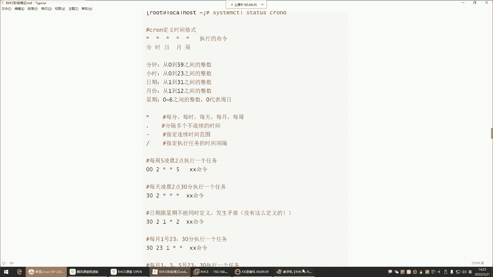

# 零基础入门Linux，红帽认证全套教程！Linux运维工程师的升职加薪宝典！RHCSA+RHCE+中级运维+云计算课程大合集！ - P50：红帽RHCE-15. cron计划任务、SELinux内核安全机制 - 广厦千万- - BV1ns4y1r7A2

喂喂喂，好，正式开始哈正式开始。可以了。

呃，来看看今天给大家讲解的课程内容。我们上一课呢是把我们的这个室有脚本给大家讲完了。讲完以后，室有脚本的话呢，我们的课程结束了。但是今后大家在工作中也会经常会接触到这些室有脚本。稍后的话呢。

我也会给大家发一些，就是对于大家在工作中或者是在学习中有帮助的一些脚本放到我们的这个网盘里边。这个脚本的话呢，也是。

这个。在啊就在这儿哈，到时候呢我会把这里边一些常用的脚本在上面哈，这里边呢是有一些100多个脚本，然后下面还有100多个脚本。这那个脚本呢，这是100多个，还有100多个。😊，109这儿哈这个。

室有脚本100例109个室有脚本集合。这个的话呢到时候我会发给大家。到时候呢你们在今后的学习中可以去参考去修改OK吧。

好，然后那今我们今天的内容呢是给大家讲什么呢？我们今天给大家讲这个计划任务，那计划任务。😊，对于我们的工作中是必须会用到的一个技能。那什么叫计划任务呢？来看一下。

计划任务呢corrunrun它是一个什么呢？是一个应用。这个应用呢可以帮我们实现叫做周期性的计划任务。好，那这个东西可以干嘛呢？周期性的计划任务用来定期执行某些程序。然后目前最主要的用途是定期备份。

也就是说啊这个计划任务，它我们通俗点来讲，就像一个闹钟一样。这个闹钟你看比如说你早晨你起不来啊，你们公司早上那个8点上班，你早上起不来，你定的闹钟定到几点呢，哎定到6点定个闹钟。然后呢，是不是到了6点。

这闹钟就开始教你了呀？没错，这个计划任务呢，它就是一个什么呢计算机里面的一个闹钟。那这个闹钟它就可以帮我们在固定的时间，当然这个时间是你去定你定好以后，他就帮你执行某些操作。

这个操作就是我们所说的那些命令啊，你比如说我们在做数据备份，一般呢在企业里边对服务器做备份呢？一般什么时候备呢？就是。服务器不忙的时候，那服务器不忙一般就是在凌晨大家都睡觉了，没有人访问这服务器了。

然后呢，那这个服务器这个今天产生的一些重要的数据，我们要给它备份。对，那这个时候我们用这个计划任务，注意哈，它就可以帮我们去定时去执行一些脚本啊，我们前面写的脚本，然后呢结合计划任务。

就可以实现工作的自动化。这个就是非常不错的一个功能。或者说它能够让我们运维的工作变得幸福那么一点点啊，当然只是幸福一点点哈，不是完全的非常幸福。😊。

OK那接下来呢咱们就来说说计划任务软件包名叫craon AE。然后呢，craon tables是给我们提供命令的一个程序。那我们先连到我们今天的机器。

机器的IP地址好。放大点啊，这字体太小了。这字体也不大。好，来看一下啊，你看看这包有没有RPM杠Q。Crowown。IE啊是IE还是I呦，我这包一般都有哈IE。哎看了吗？这包存在chon tables。

看到吗？这两个包是不需要安装的，是你在安装系统的时候，你不管是最小化安装系统还是安装了一个在图形界面的它呀。都会自动安装在你的系统里边了。所以这包呢是系统自带的了。那包系统自带它的服务名叫做croon。

后边加个DD，就是叫demo守护进程的意思。那你这个也不用去理会，你就知道它的服务名叫Con D，你在起服务的时候，你得去通过这个服务名去启动它。但是这个服务一般也不用你去手动启，因为它已经启动了。

我们来看一下syst starts。

Crown table D。看到吗？它现在是一个什么状态呢？是一个running的状态，就是已经是一个运行的状态了。好，那是不是它是运行的话，我们都没有动过呀。

我们可没有动过它啊啊就是它默认就随机自启了，默认系统自带这个软件包，然后呢默认随机自启。好，那接下来我们就直接去使用它就行了。那使用的它有一个日志文件，在va log有个Con。😊。

S log，然后。这是它的日志文件，你看一下文件里边，这个文件里边记录的是什么呢？就是如果说他帮你执行了某些操作的话，他会记录这个时间。比如说我们后期写一个计划任务，让他在凌晨3点帮我们去执行一个操作。

那他会给你记录。在凌晨3点的时候，他这个操作有没有帮你去执行。然后呢，这个操作到底是执行成功了还是执行失败了，他都给你记录啊，这是计划任务。那接下来看哈。😊。

对于计划任务来讲，什么最重要呢？就是时间的定义。最重要。我跟你讲哈，别的东西。😊，像什么这个软件包什么的，你都可以不用记，包括服务名什么的，你都不用记。因为它默认随机自起了。😊，就是时间怎么定义。

这是个问题啊，为啥会有两个软件包？这个是提供命令的tables给你提供它的管理命令。这个是提供什么呢？提供这个计划任务的一个叫主包啊。就是今后我们会经常遇到这种情况，就是一个一个应用程序有很多个包。

很多个包，每个包呢给你提提供不同的功能。好，那接下来我们就来说说这个时间格式啊。那我们先说怎么去写。写的话呢，我们的对于这个计划任务的命令看到吗？就是敲llcro table。然后呢。

这个所有的管理命令都是由那个包提供的，然后cowntable用于管理计划任务的，你得按包才能有这个命令，当是那个你也不用管，知道吧？他已经给你安上了，你就直接敲命令就行了。

那cowntable杠E杠E的话呢，是编写计划任务的意思。然后杠U可以指定以哪一个用户的身份去编写。因为要在这个一台服务器里边，可不是说只有一个root用户可以去写这种计划任务。

普通的用户也可以去编写它的计划任务。好，那这个时候我们如果在写计划任务的时候，默认情况下，这个杠U其实是不需要不需要指的，为什么呢？你比如说我现在用root，我去写一个计划任务。

crowntable，然后杠E回车。那现在就等于我们打开了一个文件，是在这个路径下的这个文件看到了吗？那现在我要如果要写这个计划任务，我并没有指定哪个用户名是吧？没有指定哪个用户名。

就以当前用户的身份去编写这个计划任务，能理解吧？啊，就是你用谁登录的那这个计划任务就属于谁？

如果我后期用张三登录的系统，我用张三敲这条命令，那这个计划任务就是张三的。啊，每个人都可以写自己的计划任务，因为每个人的工作不一样嘛。好，那这个时候我们说这个时间格式的定义。那时间格式定义呢。

我们为了更加清晰一些，这样这样看OK吧，那在。😊。

这个。好，我们这样看。哎，跑哪儿去了呢？这样应该能看清吗？嗯。能看清吗？你们okK吗？这样ok的话，给我刷个一哈。如果这样不行，我们还恢复到刚刚的状态哈，无所谓哈这个。😊，这样看这样看可以吗？啊。

可以是吧？好，OK那咱们说说它的时间格式的定义，你看一下是这样子的。就是你想让他去在什么时间段帮你去执行这个操作那。看看分。他是五个星。五个星代表什么呢？代表分时日月周。好，那这个分时日月周不行。

我觉得这样不舒服。这样看起来不舒服哈。好，那这五个星它如果是代表分时日月周的话，那我们来说一说这个分时日月周。

啊，首先为什么用星号来表示这个星啊，它默认代表是啊第一个星代表是分钟，第二个星代表是小时，第三个代表是日期。然后第四个代表是月份，第五个代表是星期几。那这个时候看哈星呢？它指的是每天每食啊是每分每时。

每天每月每周星代表是所有的意思啊。那这个时候我们如果想去定义一个时间，比如说我需要在凌晨的几点呢？啊，这是每每周五的凌晨两点执行一个任务。这个任务比如说我们去自己写一个什么呢？写一个备份脚本行吧？

我们先去编写一个备份脚本。

这个应该比较简单吧，备份的脚本。呃，备份脚本的话，我们。放在哪儿呢？mDR真相pri的。进来之后，我们我们先说说备份脚本对杠叉F对Y下的。啊，让它叫什么呢？

叫log点儿ta点儿GZ对系统的va下的log下的。什么呢？那些所有文件做备份。这条面的格式，那前面这个不对是吧，应该什么呢？应该是Z是吧？ZCZF对啊。

Z是以这种GZIP的格式Gzip去压缩它C是不是创建打包的包名啊，F。😊，也是F值指定名字，C是我要创建打包。然后接下来对va的log的所有的文件去打包啊，打包到哪儿就打包到你可以。指定打包到根下的。

啊，或者打入到TMP下边。然后叫这个名字。把这个路径下的所有文件打包到TMP，然后呢叫这个名字。我们先来执行一遍好，执行以后看看TMP有没有叫log点他点之类的。有是不是啊？好。

那接下来但是我们每次这样打包是不行的，为什么呢？这样打包的话，你看啊比如说你今天执行了一个打包操作，好，明天又执行了一个打包操作，但是你这文件名，是不是今天叫这个名字，明天还叫这个名字啊，那怎么办呢？

你看人家。😊，这都带什么呀？这都带日期看到了吗？这都带日期哈，所以我们做备份的时候，你也要加日期。那怎么加日期呢？dta命令可以获取日期。😊，然后date加号百分号大F是不是年月日啊？哎。

那如果说你备份的时间比较频繁的话，年月日还不行，你还要干嘛呢？你还要去指定呃小时。小时，然后如果说这个你可能说备份的频率比小时还频繁，你还要再指定那些分钟，当是这里面可以加一些什么呢？加一些分割符啊。

分钟。小时，然后杠分钟，分钟就是百分号S。看这样才可以哈，你看就是到时候呢标记一下我这个文件是什么时间备份的。😊，小时分钟能理解吧OK。所以这个呢你如果备份的时候，你一定要附带时间。

那这个时间你要明白什么呢？就是你是要把这个时间给它放到这个备份的文件名上面的。所以这个时候我们前面学过一条学过一个特殊符号，谁呢？反撇是不是啊反撇，反撇是可以你这样。反撇的话呢是可以取这个命令的结果的。

好，那这个取完结果以后，我再这样。哎，套杠。ZCFZCF打包打包到TMP下边，让它叫log点他点GZ啊，那这个时候再附带什么呢？附带我的系统时间。加个下线。我看看他这个你看是不是前面是名字，后边下划线。

然后是时间。那我们也一样，前面是压缩包的名字，然后呢，后边是具体打包的时间，那对谁打包。好。对。呃。对rap下的log下的所有回车，我们阿拉斯看TLP回车。哎，这个文件呢？ZCF。

ta杠ZFTMP叫log点ta点儿GZ。附带时间。Data。玩上去了，lock过去了。所有。没毛病啊。TMP。文件呢啊这儿呢这儿呢是吧？看到了吗？但是。有点问题哈有点问题，为什么呢？后缀名不太对。😊。

后缀名不太对，嗯，点踏点GZ。嗯，那就这样log，然后下划线。或者说前面是时间。前面是时间。后边。🎼前面是时间一般会有点问题。我试一下哈。放到TLP前面是时间，然后。叫。当。下划线log个点儿他点GZ。

推车看看。TMP啊也行。什么时间备份的是吧，这是几点呢？这是。😊，5月52152114点14分。14点。114点414分。14点。对，这是错了哈不是啊，这是成秒了哈。对M哈啊对M回车L看TTMP哎。

这样才可以哈。我说怎么怪怪的呢？啊，这是前面是年月日是吧？小时分钟啊，备份文件名这样是不是可以啊？😊，哎，没错，那如果你们的备份频率真的是。这个比分钟还要什么呢？呃，就是分钟都无法满足了，频率太太快了。

备份的频率。那这时候就得用秒来什么呢？用秒来去这个加加上这个秒哈，在名字上面。好，那接下来我们对于这条命令来讲，是不是放到脚本里就可以了呀？啊，然后VIM让它叫什么呢？让它叫。Bike。点儿IH。嗯。

叫log，然后。back点SHback备份的意思。还没有YM1安装一个。啊，让他先安着吧哈，我们这边说来，比如我现在就让你执行。😊，这样得指定节示器哈，哎bit车指定谁呢那个。

脚本是qui下的那个叫log。然后back点SH，这是不是一个备份脚本？哎，你看我们脚本有了，这个就是一个备份脚本，对我的日志做备份的那接下来时间我希望在什么呢？在每周五的凌晨3点做备份。

那这个时间怎么写？注意分时日月周。😊，这几个哈你要记得住，这是代表是分钟、小时、日期、月份、周几好，那我要在每周五，那我这位置应该是什么呀？周五我是不是得先把这个星期几的位置给它改成五啊？

改成五是不是就是等会儿啊，太多了哈太多了。被个。星。那这个位置我是不是用R替换一下R，然后再输入5。那我这个位置是不是给它改成5了呀？那改成五了之后，那这就是代表星期五的意思。

他这个时间你要注意哈，分钟是从0到59之间的整数，你别整到60去，没有60，然后小时也一样，0到23之间的整数，你别整成24下，然后下边日期也一样，1到3111个月没有32天，所以你别你别写写超了。

写超了，他不认识月份也一样，1到12月，你别搞个13月去，星期几0到60到6之间，这零就代表是星期日，剩下就123456啊，那这时候我要在星期五去给我执行这个备份脚本。好，包安好了，接下来来写脚本。

让它叫log，然后back点SH是吧。😊。

指定井号叹号杠并下的bit往里一粘，这是我的备份命令。好，给个执行权限，趁之mo加个X。给了张权限来执行一下bitch。呃，加上这个脚本。我们先直行一遍试试哈。辉超。😊。

看TLP回车是不是我们刚刚执行的14点35分，现在好一模一样哈。那脚本是不是可以正常执行呢？那接下来计划任务，你就让他在什么什么时候帮你执行呢？哎，让他在。😊，凌晨3点周每周五的凌晨3点。

那周五我现在就用五来表示了。那那周五的凌晨3点怎么代表凌晨3点呢？啊，继续数分十哎小时是吧，凌晨3点嘛，那就把这个星用R替换成几啊。三这三就是三点啊，那每周五的看哈每周五的凌晨三点给我执行这个脚本。

哎这个。就这么简单。就这么简单哈就可以了。😊，就定义好了。那我们来想象一下。这个真的这么简单，就定义好了一个计划任务吗？那你们有没有你们有没有觉得如果我这样定义的话。

他会在0他会在周五的凌晨3点给我执行吗？会吗？😡，M。啊，我告诉你，他会他会执行哈，但是。😊，对，这样写行吗？你们也有一些一丝丝的疑惑，是不是啊啊？哎，那这时候注意前面这个星。几乎。

是你在定义任何一个计划任务，我们都要去指定的这叫什么呢？分钟，这叫分钟，这个分钟是从0到59之间的一个整数。好，那这时候我们来思考一下分钟这位置从0到59之间的一个整数是吧？

那我现在我是定义了每星期五的凌晨3点去给我执行这个命令，那是他会在周五的凌晨3点去给我执行这条命令了，那没确实没有毛病，但是你要想象一下，那凌晨3点的时候，它这个一个小时是由60分钟组成的，是不是啊？

那你们有没有想过，那凌晨3点。他是给你执行这个脚本了，那3。01呢？3。3。01的时候。他要看前面这个分钟，这个分钟是星，就代表是0到59，每分钟都去执行。

那也就是说这个脚本它在凌晨3点整整给你执行了多少次呢？60次，从3点整一直到什么呢？到3点59分，每分钟都给你执行。所以这个位置一般我们要什么呢？要给它写成00。或者一个菱也形，两个菱也形。哎，就00。

这样才叫真正的每周五的。三点整的时候。能理解吧，嗯，这玩意儿没有秒啊没有秒。没有没有。啊，这就是我们所说的这个前面这个你一定要注意，你甭管是写什么样的计划任务，这个位置我们一般都要加。都要指定。好。

那我要说我要在三点半呢，我现在不是凌不是凌晨3点整的，我要在三点半。😡，那如果三点半，你这位置就不能是00了，是吧？哎，就30。这30就是哎每周五的3点30分给我执行这脚本。

那他是不是就只会在三点半的时候执行一次啊？

对，如果用星，你想那星的话，它就是它可是代表每分钟啊，每分钟哈，所以这个时候是不能用星来表示的O。😊，那现在了解它的套路了吧，哎，你发现哎多多少少明白了，哎，基本上分钟这个位置。

我们任何一条计划任务都要去明确指定在多少分钟。你就是在这个整点的时候，我们也要用00来表示，能理解吧，你不指定，那这从0到59之间，我跟你讲他给你执行60次。也没有这么干的。O好，那下边。😊。

那如果让你在每天凌晨2点30分执行一个任务，那跟前面就非常类似了。然后下边。这个位置日期跟跟星期一般不同时定义，容易发生矛盾啊。就比如说像我这里边我这里面定义的哈呃每周二的。😊，凌晨两点半看到吗？还有。

每天的每天每天的凌晨两点半，那这个一般就我们会觉得我们下面再写一个哈，再写一个。

这个计划任务一个文件里面可以写好多哈，分时日月周。😊，然后后边是命令叉叉叉叉命令哈。那接下来。😊，我如果这样定义，比如说就这样，每周五的凌晨。嗯，三点半。然后后边再来个一是什么意思呢？

这个一。啊。这个一是代表。天这个天是每月的一号，如果我这这个位置我写成了这个一的话，那就是每月的一号。每月的一号哈。那每月的一号这个时候你想想他在帮你执行的时候，他怎么去看呢？

因为有的时候我们可能会想哎，这每周五的凌晨3点半去执行。

是不是啊？好，那如果他每次都是周五的凌晨3点没帮你执行，但是到这个月的一号的时候。那这个月这个月的1号有可能不是星期五，是不是？😡，有可能不是星期五，或者说这个月的一号有可能是星期五。😡，哎。

所以这个时候你发现这日期这位置一般跟星期啊不同时出现。不会同时出现哈，能理解吧。你如果同时出现他们两个容易发生矛盾，发生矛盾，你的这条计划任务就不执行了。😡，所以有的时候你可能会发现，哎我写了计划任务。

我也是定义了，你可能觉得啊我定义的非常的人性化。什么呢？每周五的凌晨3点半给我执行一次，每个月的一号的凌晨3点半再给我征行一次。但有有可能这个位置它就不执行。😊，所以一般这个我们不同时定义不同时定义哈。

如果我一旦定了星期几，那这位置日期那。天数呢就不定义了。能理解吧。那如果你一旦定天数了，你比如说我希望在什么呢？每月的一号。凌晨3点半给我执行。那你说那我星期日如果用星来表示，那他会。从周一到周日。

每天都去执行吗？不是。他就不会了。在这里边啊，它的规律我告诉你。😡，你看月份这个位置，我们一般呢不动。月份不动，但是我们一般调整谁呢？要么就是调整星期几，要么就调整这个天数。😡，我一旦定了天数了。

在这儿，你看月份是代表每个月每个月哈，是不是啊？好，那这个时候我如果一旦定了天数了，每月的一号凌晨3点半给我执行这个叉叉叉这个脚本。好，那星期几就不生效。😊，不生效哈，它不是说我这个星期几用星来表示了。

那这个时候每周从周一到周日他都去给你执行。不是，因为你定义了日期了，星期这就不执行了。能理解吧啊，所以说一旦所以一般我们一旦定了星期了，日期这就不定义了啊，比如每周二到凌晨3点半。

那星那日期这你想想他会我用即便用星表示，他会每天都去在凌晨3点半帮你执行吗？不会，为什么呢？因为我定义了，哎，每月的。😡，是是不是，是每周的周二。每周到周二去过执行，所以这个就失效了。

他们两个是这样玩的。是这样子的哈，所以这个大家搞清楚，一般星期跟日期不同时定义容易发生冲突，能理解吧？所以这位置大家注意一下就行，其他的话呢就没啥了，剩下。😊。

啊，我们在定义的时候，这里边还可以通过一些什么。逗号啊，还有小横杠啊啊，做一些比较这个额外的一些操作。比如说逗号多个可以分隔多个不连续的时间。比如说我怎么分隔呢？我现在希望在每周的135去给我执行这个。

执行这个。脚本注意，我现在不是每周五了，是135，每周的135。那这时候就一逗号3逗号5。哎，这时候他就是每周的周一给你执行一次。周三再执行一次，周五再执行一次能理解吧？那如果你说我不想定义星期几了。

那我用星期这位，星期这位置我用星表示，那我在日期这哎，每月的几号呢？每月的一号。3号、5号、7号、9号、10号以此类推。能理解吧。但是一般呢还是星期这个位置用的比较多一些。还是给大家说清楚哈。

因为星期几比较简单呢，是不是啊我一旦定了。好，每周的135给我执行这个备份脚本。那日期这你就不用管了，你不用管了，他就在每周1三5都给你去执行这个命令，是不是比较简单，比较好理解了吧，这位置。😊，うん。

啊，这逗号可以做一些什么呢？做一些这个不连续的不连续的。

时间定义。那横杠呢是连续的时间范围的那这个你比如说呃如果是连续的话，比如说我从周一到周五，那就1-5。

1-5就是周一到周五每天。到凌晨3点半都去给我去执行这个脚本。那这个是不是也比这个天数这位置。比较什么呢？比较这个让我们更加的好理解一些呀。只因为你看他一个月4周是吧？每周周一到周五。

他比你指定具体的天数还有什么呢？还要方便一些。这时候就更好理解了呀。😡，啊，那你说我希望每天都喂份，每天都喂份，那就。😡，0-6。026周一到周六。不是周一，是周日到周六全都没份。

所以一般星期用的比较多一些。啊，剩下就是小1分钟，大家注意一下就行了。那月份分10日，月月份需要搞吗？月份不需要搞。月份一般不需要去动的哈。好，这是。

横杠啊，这根斜线。可以指定执行任务的时间间隔。你比如说有的时候你需要备份的时候，哎，这个频率可能比呃这个。

节奏可能比较频繁一些。那这时候一般频繁在哪里呢？比如我希望每隔两个小时注意哈是。就是周一到周六，每隔两个小时，你去给我备份一次。那这个位置。看看行。这儿。00每隔两个小时那就。这样形容斜杠2。嗯。

这个星斜杠二就是每隔两个小时去给我执行这个后边的备份命令，那还是周一到周六。那具体几点这个。就没有什么具体几点了，就是这一天。😡，从什么呢？从早上到晚上24小时，每个两个小时都给我执行一次，能理解吧？

每个每隔两个小时，但这两个小时这位置，这个分钟不能用星表是吧，是不是啊，也是00，每隔两个小时整的时候。

给我去执行后面这脚本。但这个一般用的比较少一些，比较少哈。星杠2。每两个小时执行。没量就是，但这位置注意00哈00。

给你。那我要是每隔两分钟呢啊每隔2分钟那就。在分钟这。杠2。分钟-2就是每隔2分钟。周一到周六每个2分钟，那这每个两分钟是不是这一天下来这一个小时里边是不是一个小时60分钟。好，那每个两分钟只行一次。

😊，就是直行34。一个小时里面给你直行34。正常来讲，一一个小时不是给你执行60次吗？我希望一个小时给我执行30次，哎，那就每隔2分钟执行一次。哎，那这辈子大家能听懂吗？我问一下你们哈，能不能听懂啊。

听懂的给我刷个一，听不懂的刷个2。😊，这计划任务一般分钟是肯定会干嘛呢？要指定的，然后小时也是要指定的，具体凌晨3点或者凌晨3点半或者凌晨2点整。那周几比如说就每周几呢呃一般。是周日的时候。

一般周日哈零代表周日，哎，周日的凌晨2点一般人比较少，因为第二天都上班。第二天都赶着周一上班，所以周日呢一般人呢他一般不会玩太晚。所以周日的凌晨2点给我执行备份脚本。

是这样子的，所以这个计划任务就给大家说清楚了。OK好，那说清楚之后，我们验证一下它真的执行吗？我们可以这样，我们自己刚刚啊我们的那个备份脚本是吧，咱们这样我每隔一分钟让它给我执行一次。😊。

这个位置我也用星来表示，那如果全都是星，那这位置小时也也是星，我只定一分钟。我如果只定一分钟的话，哎，每隔一分钟给我执行一次。其实你如果不写的话，它是不是也是每隔一分钟啊？啊，其实效果一样。备份的时候。

哎，这一般看你们公司吧。看你们公司哈。周日晚上也不忙，周日的晚上也不忙。😡，呃，看你们公司是是干什么业务的这玩意的。然后呢，这时候我就给大家演示一下斜杠一。😊，斜杠一每一分钟给我执行司这个脚本。

我们看看它会不会给我执行哈，保存退出。保存退出以后，它提示了。啊，什么安装curontable。安装了吗？安装了哈，然后咱们说几条它的命令。😊，crowntable回车。没有效果是吧？那杠H获个帮助。

它里边命令也也它的命令也比较少。你看这里边没有几条命令，然后它的命令的话呢。杠E就是我要什么呢？嗯idit。叫做编辑某个用户的任务。杠L列出用户的任务，看到吗？列出某个用户的任务，那这时候你就。

crowntable杠L灰车。现在就是列出所有的任务。那这时候我们是不是有一个任务啊，那这个任务它会在一分钟。执行一次，那我们得等一等啊，没关系，等一等。然后其他命令的话呢，就没有什么太多可介绍的了。

删除啊，这有个杠R叫delete，叫删除某个用户的任务。那这个的话呢，一般删的话。

就是这样删的话。杠R是清除计划任务啊，指定指定用户名的话就指定清除某一个用户。但是这个的话，我们我们一般你去一般我们不管别人的计划任务哈。但如果想删的话，其实啊最简单的方法是什么呢？就是你。😊。

它就是一个文件，那个文件就是生成在它的。你当前的TOP目录了，看到吗？😡，那个。啊，计划任务文件呢啊完了他提示了，他说你这vas泡 mail rootot中有一个新邮件，我估计啊我看它执行了吗哈。

十4啊执行了，你看这不是14点50嘛，是不是啊？😊，14点50分的时候，他给我执行了一次，但我估计一会儿又要给我执行了。但现在有个邮件mailile看一眼，没有命令，y杠外instmail。回车啊。

包不对，要么。privad搜索一下mail有是不是啊前面讲过嗯。前面讲过，比如说我在敲一条命令的时候，系统说未找到命令，我们可以干嘛呢？

我们可以去先搜索一下privades跟上你要执行的那个命令去搜索能搜到有有但是有一些部分命令他也搜不到。这具体这种诡异的事情，我们也说不清。就比如说刚刚的那条命令，他就说没有找到。

吧那叫ym searchSEARCH searchse谁呢？searchmail。😊，嗯。ylist，然后se没有。醋误的匹配色。啊。是。对，se一下search mail啊。这怎么。啊。

使用suchal好，sal它提示了，你看到吗？他说呃你可以使用seuchal试试回车。那这也太多了，这包啊。😡，😀呵呵。😊，这太多了哈，管道给grape mail。完了，这也撕撕不到啊。呃。

亚么 searcherSEARCH search杠杠help看或获个帮助可以吗？seer。选项杠T忽略完全缓存运行。配置文件路径命令最长等待时间错误出出回答问题。请一个。更新。嗯，请指定名称。奢侈。嗯。

야么。priva杠杠泡泡。在亚某指定某一个文件夹保存的软件包。选项命令，你看亚木，然后呢加一些选项加命令，这里边你看列出。列出列表。有点尴尬了哈，y么。呃。priV第四，我觉得这个是。没有没有算了。

不收了。要么方外。Ins到。

叫啥名啊，我也不知道，我死。百度吧，有事问百度吧，我去问问一下。对这个。这个mail有命令。未找到。没找到。让我们安装这个叫mail X是吧？但是它搜搜不到，加个X，没事。

有了，然后m会车，这里边是有一些什么呢？有一些这个。一有一些邮件看啊，这是你的邮件来了几封了，六封了，你输入一就看第一封邮件回车。这这封邮件他告诉我了什么呢？什么。😡，这个主机。

然后它的一个时间做了什么事情啊，他说他呃退信回复地址。嗯，等等等等。嗯，干了什么事情？そう？算了。X斯特。在这里边哈是Q退出Q，然后X。Q是退出你的查看的邮件的那个什么呢那个列表，然后X是退出。

那接下来我们就看TMP就行了，有没有成功TMP回撤成了吗？各位。是不是有这么多的。😡，压这个什么呢？这个压缩文这个压缩包了呀，是不是啊？那14点56分的这些是不是他通过计划任务去给你执行的这些操作呀。

他是帮我执行那脚本了，那脚本是一个备份的脚本，那这位置就可以了。能够看到这个是不是计划任务现在在自动给你执行啊，我们不是手动执行的，能理解吧？这位置，所以你看时间的定义是不是是最重要的呀？😡。

啊，但是脚本也很重要是吧？你写不出来脚本，或者说你没有脚本，那你光会定义时间也没用。但是脚本是不是也比较简单呢？你看像我刚刚写的脚本就非常简单，不就一做备份的嘛？备就说白了不就给他们打个压缩包嘛。

是不是啊？😡。

O这是。计划任务啊，计划任务这边的大家有没有什么问题啊，没有问题的，给我刷个一。我们呢这个计划任务。😊。

就是比较简单哈，这玩意儿就是你知道怎么去写备份就行了啊，也可以直接跟命令，但是跟命令有时候会执行失败。😊，跟命令啊一般有时候不靠谱，一般都是把命令放到脚本里边。O。

然后那清除计划任务，就是你想给它清除，你就这样。😡，crowntable杠R杠R是清除所有了。但是有的时候呢你这一个计划任务里边可能说有很多个什么呢？有就是有很多条命令。😡，那一般我们不这样玩。

我们怎么玩呢？哎杠E编进去，然后呢滴D删就行了，这不就是一文件吗？看到了吗？这就是一文件哈，到时候你直接在里面就是一个VM在里面删就行了。滴D删了能理解吧？然后正常WQ保存就行了。😊。

所以这个东西呢删的话一般不这样删，不杠2哈，杠2是清除所有了。OK啊，注释也行。对，如果你比如说我不想删掉，注释也可以，注释它也不执行。然后下边呢再给大家说一个SElinux叫系统内核安全机制。

这个呢没有太多可讲的，简单带领大家了解一下什么叫SElinux这个内核安全机制啊，它呢。你如果去百度搜的话，他说是美国这个。

NI啊NSA什么叫国家安全局主导开发的一套增强linux斯系统安全机制的一个访问控制体系。那这个东西我们通俗点来说，它是什么呢？哎，这个东西是增强。你看说注意是对廉斯系统安全的强制访问控制体系。

叫做访问控制。访问控制谁才能够起到访问控制的作用呢？防火墙，所以说SC links它叫内核防火墙。除以内核有自己的防火墙，系统有系统的防火墙，所以说它不一样。那这个内核防火墙是增强内核的一些访问控制的。

能理解吧？啊，那这个时候所以对这个内核防火墙，我们一般不去研究它。因为一旦涉及到内核的相关的技术点。😊，一般呢你是根本就研究不了的。因为这个SElin，你如果你去看的话，一本书那里面的东西多了去了。啊。

所以这个东西呢大家只要简单了解一下就行。你看它是集成到了lininux42。6以上的内核里面，都有针对什么用户进程目录文件提供了一些预设的保护策略，那是不是就是防火墙啊？那这个东西一般在企业里边。

我给大家说说，一般都是给它关掉。为什么关掉呢？因为这个东西如果你不关，你得去修改它的一些规则。就像平时的防火墙规则一样，你得去改规则。这个规则我们称之为叫开关，那个开关，那可真是不好改。但是你不改的话。

注意你比如说我往系统里边，这是我一台lininux服务器，我安装一个软件包，不好意思。哎，这个一些这个。怎么说呢？来路不明的软件包，有的时候就是一些这个。正规的。那些软件包官方的软件包。

你安装在系统里边，你在启动服务的时候，那这个SElin它都去控制你。不让你起服务，起来以后也不让用户访问，能理解吧？你得去改它的开关。所以这个东西一般在企业里边就给它干嘛的给它关掉。

啊企业服务器不齐这玩意儿，不然他管的东西太多，能理解吧？好。所以我们对SElin呢，我们了解的是什么呢？它的运行模式，它有三种运行模式。这个三种运行模式我们主要就是在学习怎么去给它关掉。

第一种呢叫强制运行模式啊，这是它的单词啊叫eforcing。然后。第二种呢叫permissive，叫宽松模式。那这种的话呢应该比较好理解宽松模式。就像我们防火墙一样，你把防火墙是处于一个什么样的状态呢？

叫做放行的状态啊，允许任何访问就属于宽松了。啊，这是我的一台防火墙，防火墙里面我我配套规则，什么规则呢？叫允许任何访问，这时候非常宽松啊。OK那这个宽松模式就相于就相相当于防火墙里边的那个什么呢？

叫做允许任何访问一样。好，然后那强制模式呢，这个eossingeossing就是类似于。它是一个开启状态，而且是针对什么用户进程目录都提供了一些预设的保护策略了。好，那还有一个dable金融模式。

就是给它彻底关掉一样。那我们在企业里边都会让它处于一个什么呢？这样的模式叫金融模式。好，那我们现在得先学着怎么查看，想查看它的运行模式，用get enforcing啊。

Enforcing。这个读起来有点相似是吧？来get查看。infor啊infor。这读音读音有点绕舌哈来这个哈这是什么模式呢？😊，就是这个。

看看叫强制模式，现在是强制模式info。

好，那强制模式我想更改它的模式，怎么改叫set。set in。然后下边你要改它的模式，你得记得住它的这个三个模式的单词。

能理解吧，那记不住怎么办呢？记不住也没关系，其实也很少去记它。它有一个文件，你记文件也行。这个文件。记一个文件总比记三个单词强是吧？那这个文件在ETC有个叫SElinux下面有个叫config文件。

这个是它的配置文件。

啊，我记不住单词儿，你可以每次用的时候这样。K看ETCIE links。不是哈，是SElin confi文件t键补齐就行哈。回车这个它文件里边已经告诉你了，你看哈。😊。

什么这个文件控制系统上的SElin的状态。哎，那怎么控制呢？他告诉你。它的格式是这样子的，SCSElinux后边是调整它的状态的，可以取这三个值的之一，哪三个值？就这下面这三个值，这三个值第一个。

告诉你了，这是一个安全策略。第二个。呃，什么打印警告，而不是强制执行。其实说白了就是类似于宽松状态了，这个呢是彻底禁用了。啊，没有加载它的策略就彻底禁用掉。所以这个文件里面你可以看这三个单词。

我现在干嘛呢？想调整它的模式，set in force。in force，然后给它改成什么状态呢？啊，比如说给它改成叫permissive。😊，这个叫做呃一个宽松的状态。好，回车好，那改完以后。

我再get in force。看。回车现在变成是 permissive了，宽松状态了。好，那我能不能set？info给它改成dzeable的状态呢这个。叫做禁用状态呢，来试试回车。哎，他说了他说什么呢？

他说啊这条命令看到了吗？这条命令叫做临时关闭的命令，叫临时关闭。临时关闭哈。好，那临时关闭可以支持什么呢？支持inforcing。跟这个就是你可以给它改成什么呢？叫做启用的状态，跟宽松的状态。

但是你想给它改成dable禁用的状态不行。那也说在这里边，其实我们在设置它的模式的时候，他也说了，你或者用一跟零来表示就行了。一是谁，一就是它。他是什么状态呢？

强制强制状态就是属于这个我们所说的前面给大家介绍的强制模式下，他什么都管，能理解吧？宽松模式下就是什么都不管了。

所以这里边你看一是强制零是宽松。所以我们一般设置的时候不记这个单词，不记这单词，只记什么呢？只记零跟一就行。你就知道一是强制模式，零是宽松模式。所以一般我们是这样玩的那set。

inforcing，然后零回车零就等于给它改成宽松模式了。但是注意dable的状态是命令行，我们无法去直接给它改成这个dable状态的。因为这条命令叫临时命令。临时命令就是临时修改它的运行模式。

给它改成宽松模式。那临时命令你这个机器下次关机又重启的时候，那这个模式又恢复到了它的那个什么呢？就是默认的运行模式，默认的是强制模式，什么都管啊，那这个强制模式到时候你还得去临时手动去执行这条命令。

能理解吧？但是在命令好像无法执行彻底禁用。而彻底禁用的话，就是你下次关机再开机的话，它也不会干嘛呢？它也不会变成强制模式，就直接给它关掉了。那怎么样才能让它变成强制模式呢？

改它的文件ETCSElinux confi文件，哎，得打开文件了，在文件里边看到吗？SElin等号后边，它不是告诉你了吗？你可以任选其中一个，这里边任选其中一个模式啊，可以取这三个值的之一。哪个呢？

我给它改成dable彻底经用的状态。然后接下来注意光标定位到这个inforcing这位置，大写的C删掉粘贴dzeable了，别把等号删掉哈。好，然后下边这个。它也有一些解释。

这里边啊它也有三种什么target mini啊，然后等等等等，噼里吧的哈，这个一般。啊，什么进程保护看到？它的一些保护策略，这里边这是它的一些保护策略，什么修改策略，只选定进程受到的保护。

这三种也不用动，你只要给它关掉就行了，关掉它就什么都不管，然后保存退出，保存退出以后。注意这一步得需要精力重启。你改完文件以后，重启的话，它才能生效。但是这一步有必要重启吗？一般呢没有必要重启，为啥呢？

你可以在命令行里边临时给它改成宽松状态，就是permiss5宽松状态，它就不会去管理你这个系统的一些什么呢什么文件呢进程之类的，它就不管了。然后呢，那这个临时是不是你机器关机，下次重启。

它又恢复到这个强制模式了呀？那这条命令是不是就失效了呀？没关系，下次重启，由于我们改了它的配置文件了，那配置文件改完以后，它就永久生效了。配置文件我们改的是dze的状态。那下次再开机放心。

它直接变成dzeable，彻底关闭了。😊，啊，所以这个位置就不用去管它了，嗯，不用管了哈，O。😊，能力了吧啊啊，还在医院，只能后面听啊，那就听录屏吧哈，这都在医院了，是不是在医院的话。

我们还是注意身体嗯。😊，好。你们应该向这个。小王同学学习哈，人家是什么情况呢？就是这个。熬夜学习敲命令，敲的这个肠胃炎了啊，然后这个去医院了，然后去医院呢也不忘了这个什么呢？来学习啊，所以呢这个。对。

我们要什么呢？我们也要去我们也要去这个向他学习啊。

对，就像我今天给大家发的那句话一样，哎，这句话。我觉得是非常的好哈。哪句话呢？就这个。😊，叫做一寸光阴，一寸金时间啊，其实还后面还有一句话叫寸金难买，寸光阴，所以时间呢是非常宝贵的但也是无情的。

为什么呢？因为人生在世，说白了你活到100岁，那才3万多天，你这3万多天，你再要去掉什么呢？去掉你前20多年的年少无知，再去掉你60岁以后的那些心有余而力不足。好，那你这一辈子你活100岁。

你也就有40年能够让你什么呢？折腾的时间，那你这40年啊，你这40年你再刨掉什么呢？刨掉你一天工作8小时，你一天是工作8小时，那你这8小时以外的那个16个小时，你想想你是干嘛呢？你是在你是在睡觉在玩。

是不是？所以你想想你的。努力的时间。你这一辈子能有多久啊，其实没多久。😡，没多久。所以我们说这个天才它是1%的灵感加99%的汗水换来的啊，那我们不是什么天才，我们连那1%的灵感都没有，那怎么办？

我们就得付出那百分百的汗水。啊，这样才可以。对，所以你想想对于我们来讲，你这40年的时间里边，40年你换算成天的话。😊，就一万多天，你40年你换算成天就等于1万多天，知道吧？

这一万多天在去掉每天的8个小时的工作时间，你的业余时间其实一辈子下来就几千个小时，这几千个小时是非常宝贵的。😀呵哈。😊，是不是？😊，所以我们哎每一刻我们都要珍惜好，利用好啊，别荒废自己的年轻的宝贵时间。

包括我现在跟你们说的几句话，我都已经觉得有点浪费我的宝贵时间了。我们要学习啊。

那些人。我们不能说一些没有用的废话，是不是？对，已经荒废太多了。那接下来呢我们还是应该休息一下吧。啊，虽然说是时间是宝贵的，但是呢我们也需要休息，是不是啊？我们休息5分钟，晚期都是休息10分钟。

那这次我们休息5分钟，大家赶紧处理处理自己的这个那些事情啊。😊。

