# 零基础入门Linux，红帽认证全套教程！Linux运维工程师的升职加薪宝典！RHCSA+RHCE+中级运维+云计算课程大合集！ - P51：红帽RHCE-16.常见协议及端口介绍、firewalld防火墙 - 广厦千万- - BV1ns4y1r7A2

喂喂喂喂喂喂，好，OK。那接下来呢咱们。再给大家讲讲在互联网当中常见的协议和登口号。这个呢是一些概念性的东西。我们由于啊我们是在跟计算机打交道。

在跟网络打交道那她不像我们平时在生活中跟我们的社会上的人在打交道，他不一样。我们呢生活在这个社会当中，我们每天要遵守这个社会当中的什么呢？那些哎呀啰里八嗦的规则，什么你出去这个骑个自行车。

可能说你都得要遵守交通规则，不然这交警他也抓你是吧？然后呢你呢干什么事情啊，都得要遵纪守法啊，你不可能说看见那种长得漂亮的女孩子，你就上去撩人家裙子摸人家屁股，这种你就属于叫违法乱纪耍流氓。

这种是不行的。哎呀，所以说生活中呢，我们是被各种人干的规则，所什么呢哎所约束着啊，这样也可以理解是吧？没有规则不乱了套了吗？那网络当中它不叫规则，它叫什么呢？它叫协议。在互联网当中，一个网络社会当中。

它叫协议。那这个协议它最终干嘛用的呢？注意就是规定在这个庞大的网络当中数据的传输的。好，你想想数据，比如说你去访问一个淘宝，你打开你的浏览器，你去访问淘宝的时候，那这个时候你跟淘宝之间是注意啊。

看淘宝给你返回的这个页面，就是把它的数据传给你了，能理解吧？那这个时候你们之间的数据传输，是基于什么的呢？就是基于我们所说的叫做网络协议啊。

那这个协议在我们这个互联网当中常见的比较典型的像网站里边就是你访问网站的时候，它走的，要么就是HTTP协议，要么就是HTTPS这种协议啊，就是网站之间的协议。你看淘宝你发现我刚刚输入的是域名。

但是呢这位置它给我补了一个什么呢？叫HTTPS冒号两个斜杠。那这个就是告诉我们淘宝跟我就是我们两个之间的数据传输走的是这个HTTPS协议。啊，经过这个协议进行所有的数据传输。好，那这个时候我们就得说说。

那HTTP呢，它跟HTTPSS这两个之间，一个叫超文本传输协议，超文本就超越文本了。像什么阿克斯玛都可以帮你传输。然后那这个啊但然这个你不用去管哈。因为这种东西它里边怎么实现的，你是看不到的。

你就知道它基于什么样的协议去传输数据，最终它都要以什么呢？一个我们能够看得懂的方式来展示给我们能理了吧。好，那这个时候。这个协议就是用于数据传输的那HTTP它呢。叫明文协议。

然后这个安全的超文本传输协议HTTPS它是一个什么呢？叫做加密协议。加密协议这个呢其实不适合放在今天讲，但是呢我们也得讲啊，这两个之间它关系在哪里呢？啊，他们两个之间呢就是说一个是明文。

一个是加密之间段关系。明文啊，对。铭文的话就是如果说我们假设淘宝淘宝它如果不是用的是HTTPS这个协议的话，它用的是HTTP协议。那我访问淘宝，我跟淘宝之间所有的数据传输。如果说下边有一个人在干嘛呢？

在抓取我的数据包。啊，抓取我跟淘宝之间的数据传输的那个包，注意这个铭文协议啊是能够被别人给分析出来的。这个抓包的这个人，他能够分析的出来我跟淘宝的所有的数据传输都传输了哪些数据，能理解吧？对。呃。

所以说很多的网站一般用什么呢？叫HTTPSHTTPS这个后边它多了一个S是什么呢？就是那个SSL。这个SSL我们是。简称叫HTTPS然后它是可以实现什么呢？实现一个数据的加密传输的。好。

如果淘宝它这个网站用的是HTTPS这个协议加密协议。好，那我跟淘宝之间的所有传输是有那种加密算法的这种加密算法。注意。是只有你们两个之间才能什么呢？才能破解。那如果有人他抓取你的数据包。

那这个时候他想分析你的数据包，我告诉你，他打不开这个包，即便打开了也是乱码，乱码，这个乱码就像你看什么呢？你看一个那个二进制文件一样。比如说我看一个k并一下的。😡。

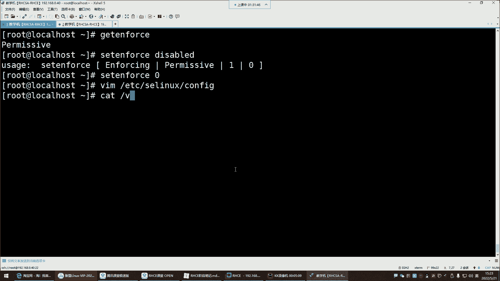

一个二进制文件，比如L啊，就这样看到吗？这叫乱码，所以说它是没有办法分析你的包的。能理解我说意思吧？啊，那如果他走的是明文协议。好，你一访问淘宝，你一输入用户名密码，人家一抓包，他就知道你淘宝的账户了。

😡。

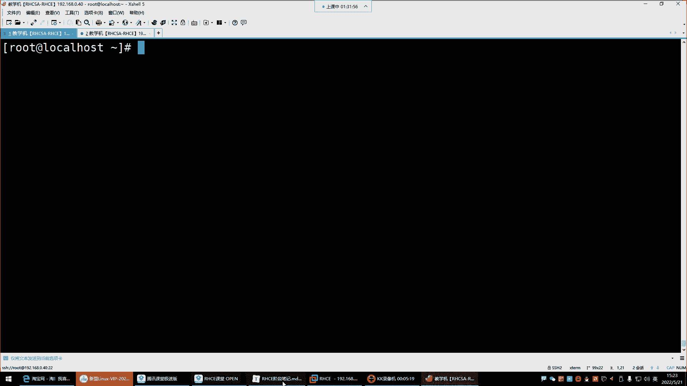

知道吧？所以一般呢你发现大多数的网站都是HTTPS为了安全起见啊，这种是应用于什么呢？叫网站。是网站这个领域的数据传输，他们走的协议。那HTTP呢，它端口是80HTPS8端口443。

这个东西就是在企业当中，你要明白一台服务器。

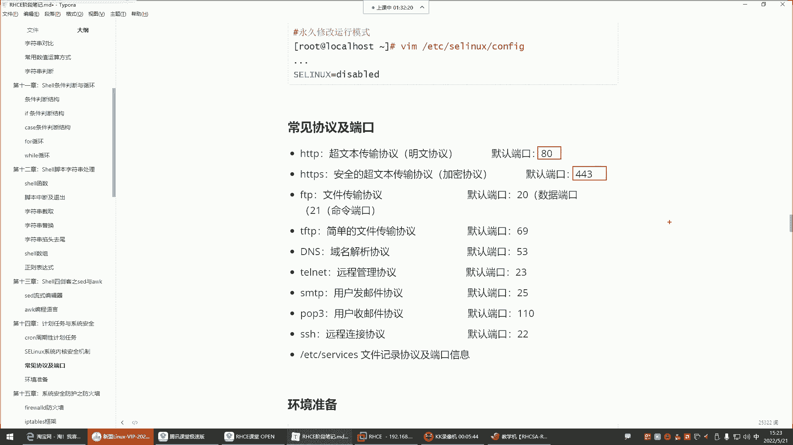

企业里面的服务器啊，它可不是说只有一个应用程序。这个应用程序就是我们所说的软件在一台服务器里边，对于企业来讲。

企业里边这是一台服务器。好，那它的这台服务器，它里边有可能装了很多个软件啊，我们简称叫应用。他这台服务器。比如说我部署了什么呢？我部署了一个网站。网站。这字儿也太大了。啊，一个网站，那还有什么呢？

比如说还有一个其他的服务。叫做什么呢？叫做。那个FTP啊FTP就类似于百度网盘一样FTP好，我有两个应用程序在运行着。那这个时候我这两个应用啊都可以让用户去访问。好，那让用户访问的话。

那一个用户来了之后，他访问这台服务器。比如说好，我想访问谁呢？我想访问你这个服务器的这个谁呢？网站。好，那他首先得先连到这个服务器。注意他得先连到这台服务器哈。好，那他连到这个服务器以后。

那一般在建立链接的时候，它跟这台机器建立链接的时候，一般走的是TCP跟UDP的协议。啊，UDP这种协议。叫建立链接跟服务器去建立链接。通过什么呢？通过IP啊去找到这台服务器，然后跟它建立链接。

建立链接以后，那一旦链接成功了，那用户他说我想访问的是你这个服务器里的这个网站。那怎么办呢？好，那服务器怎么知道他想访问网站呢？是因为在他的这个数据包里边注意是会有一个什么呢？会有一个那个。编号的编号。

比如说跟1个80。好，那这个时候这个服务器就知道啊，你想访问我的这个服务器的这个80编号的这个应用程序。所以这个我们就叫端口。这个端口是注意。某些应用是或者说某些协议他。默认的端口。

我的网站走的是HT如果我的网站走的是HTTP协议，那我的默认端口就是80。如果我的网站走的是HTTPS协议，那我的端口就是443。所以一般是默认端口哈哈如果他说好，我想访问你这个网站。

但是一般这个端口不由用户决定，能理解吧？不由用户决定。因为用户访问这个网站的时候，我们可从来没有输入过什么端口，你访问淘宝，你输入端口吗？没有，是不是啊？你看我访问淘宝的时候，我没有输入端口吧。

那这个端口一般不是你输入，而什么呢？而是服务器。你访问淘宝的时候，你通过域名访问它这个域名里面会有很多个操作的，域名就直接把你的请求转给谁啊？转给这个服务器的他那个端口了哎，443知道吧？

这个过程不用你管。甚至连前面的HTTPS你都不用输，你就只需输入淘宝域名就行了。这些东西前面这个东西浏览器是帮你补全了，后面这东西服务器知道啊，你通过域名访问，我就给你干嘛呢？

就给你用我服务器里的443端口去接收你的请求。所以它是这样子的，所以这些端口对于来讲，对于我们来讲，你就知道它是一个什么呢？是某些协议的默认的一个入口，端口就是入口啊，我这个应用我走的是HTTP协议。

如果是HTTP协议。好，那我这个协议或者说我这个应用，你想通过这个协议访问我，你得通过这个协议的入口才能访问到我。所以他们之间是这个关系。所以用户他是怎么回事呢？他就是啊。基于这个端口啊。

我们叫端口就可以访问到这个服务器的这个网站了。啊，那我现在用户说我不想访网站，我想访FTP那FTP的端口哎，21。21。就可以让你访问到我的FTP服务。所以这一个服务器有很多应用的时候。

那这个时候哎不同的端口来区别不同的应用。你想访问哪个应用，那由不同的端口进去就可以了啊，这玩意就像一个小区一样，一个小区你像这么大一个小区，你进到这个小区以后。那这个小区里边。

那可或者说你进到一个大商场，你进到这个大商场的时候，那这商场给你提供的有卖家电的，有卖儿童玩具的是吧？有卖衣服的，你想想那这么大一个商场，你一从从你一进来，就像我们用户访问一台服务器一样。

这个服务器里边是提供很多个什么呢？很多个业务的那这个时候你想访问什么业务，你是不是得找对应的那个门店才行啊。那就像我们访问服务器的时候，哎，你想访问谁？那你就得找对应的应用一样。

那每个应用在或者说每个店铺在商场里面是不是都有一个自己的门牌号啊？比如我这个门牌号是11好，那应用在服务器里边也有自己的一个门牌号啊，它走什么协议，它就是什么门牌号。比如我这个应用走的是HTTP。

我的门牌号就是80。哎，能理解了吗？各位知道什么叫蹬口的吗？现在。😡，这端口。就是应用的一个什么一个入口。啊，但是它是一个数字哈。好，那下边这些。😊，你们要自己去背，因为这些的话呢没有为什么。

就是哪个协议对应的什么端口。😡，拍个照片截个图，然后放到手机的屏保里边。没事的时候，一打开手机，你可以看一看。记不住看一看记不住看一看。HTTP默认的是80端口，然后HTTPS是443FTP2021。

那FTP这个东西类似于网盘。网盘哈给别人共享数据的。我们稍后会给大家讲FTP然后下边TFTPFTP叫文件传输协议啊，其实就是给你共享文件的那文件就多了去了什么那种点MP4的点MP3的。

点儿GPG的点儿点儿拼NG的。这些都是文件。所以说那这个FTP这个协议是在企业内部自己搭建一个文件共享服务器，去给别人共享文件用的，就类似于内部的网盘。然后TFTP叫简单的文件传输协议。

这两个之间的区别就是。TFTP是干嘛呢？走的是TCP协议，需要建立三次握手。而TFTP。TFTP它走的是UDP协议。他不需要建力握手。😡，直接就跟他建立链接，然后把文件。传给他就可以了。

所以这是他们的区别。这种比较简单。下边DS域名解析的协议，端口53啊，我告诉你在这里面大家需要记哪些？记这两个就行了。记这两个就可以了哈，下边什么的几乎已经很少用了。FTP的话也很少用了。

主要就是TFTP这些。😊，跟你的没啥关系。还有一个这个。😡，把这三个记下来就行了，其他的作为了解，什么tnet远程管理协议端口23tnet以前干的事儿是是是现在的SSH他干的事儿。就是我们通过这种终端。

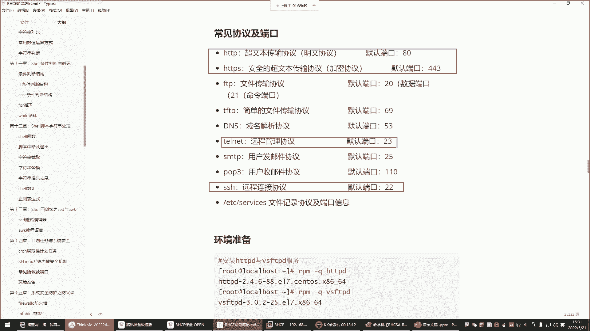

想连接服务器SSH那以前用tnet。好。以前是用tnet访问哈，但是tnet它不安全，所以现在已经没人用了。所以在这里边了解一下就行。我们现在用的是什么呢？

就是HTTBHTTS还有SSHSSH它的端口号，就是一台服务器。我们之所以能够用这种远程的连接工具SSH去连接它，是因为啊我们。😊。

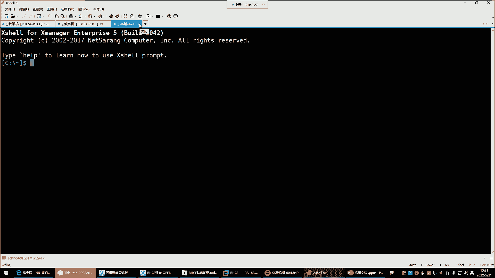

对于服务器来讲，它有一个什么呢？叫SSHD的这么一个应用。然后这个应用的话呢，它起的一个端口是22。然后我们就是连到这个22的端口，才能连到这个服务器上去管理它。程序啊配对配置文件自定义端口也可以。

但是。客户访问的话，客户得去怎么呢？手动指定端口。啊，所以这里边第三个我是不是就给大家说清楚了。还有一个文件，如果这些端口跟协议你记不明白ETC的service这个文件打开看一眼。

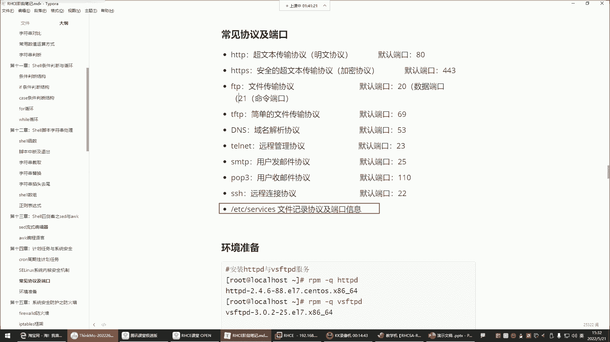

VMETC的s。这个文件里边。看到了吗？哪些服务？你看哈上边这位置s name，这叫服务的名字，服务名称port。叫端口看端口到端口的协议。看到了吗？也就是说这个端口啊，它是从一开始一直到多少呢？

一直到65535这么大这个范围内，然后这个文件就记录了在这个网络当中哪些协议占用的哪些端口，这里边从一开始看到了吗？1579，你就往往下翻。包括我让你们记的那个，你往下翻80看到了吗？

80这个端口是谁的HTTP的，看到了吗？啊，还有还有这个。80看到了吗？HTTP的，然后那这个HTTP既可以。走TCP又可以走UDP。好，然后下边。是建立链接的时候，可以通过TCP跟UDP建立链接。

什么泡泡2泡泡3看到吗？这里边。然后什么SNMP这些端口都可以从文件里面去看。443，我给你们找那个443443。你看这443是谁？44443是不是HTTPS啊，没错吧。记不住就看那个文件。

但是看的话有点费劲，grab过滤过滤。80从这个文件里面，但是这个不行，包含80太多了哈，这过滤也不精准。😊。

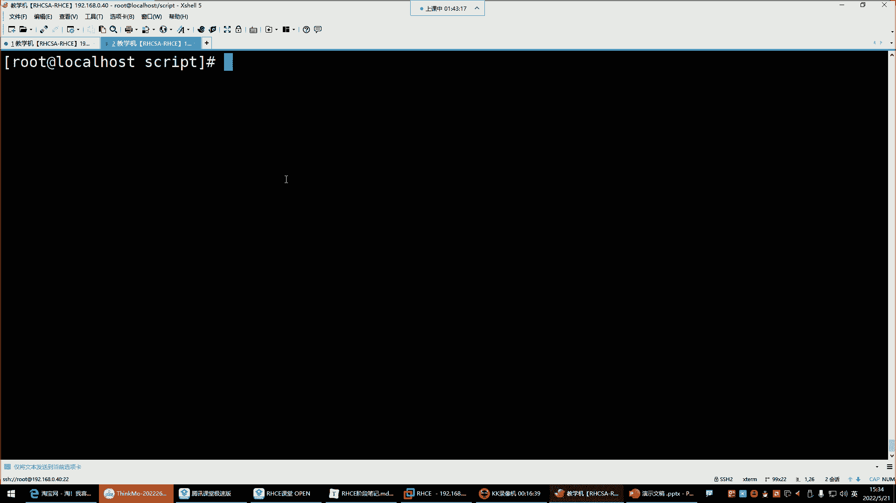

你就知道那文件是存放一些协议跟端口的协名称以及对应的端口都在这文件里面放着呢。好，然，下边来我们开始讲什么呢？讲防火墙，讲防火墙之前把这两包安上，安谁呢？就安装HTTBD就行了。安装HTTPD哈。嗯。

安装HTTPD。我们接下来要讲防火墙啊，然后讲防火墙的话呢，我们现在需要什么呢？需要一些应用来给大家演示这个防火墙。😊。

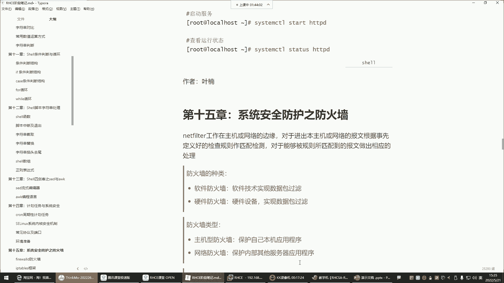

现在用不了两个终端了，一个终端就行。y杠外inst HTTPD。这前面是不是安过了呀？如果没有完，那你们按一下哈，就这样。好，安装好以后把它扶务起来。服务名叫HDDBD。这个玩意儿干嘛的呢？

这玩意儿是后边你们在学三阶段的时候会给大家讲。啊，只会简单介绍啊，就是一个搭建网站的一个软件，起来以后看状态。是他的是。running的状态。好，running状态了。那接下来我注意它给你提供一个端口。

哪个端口呢？

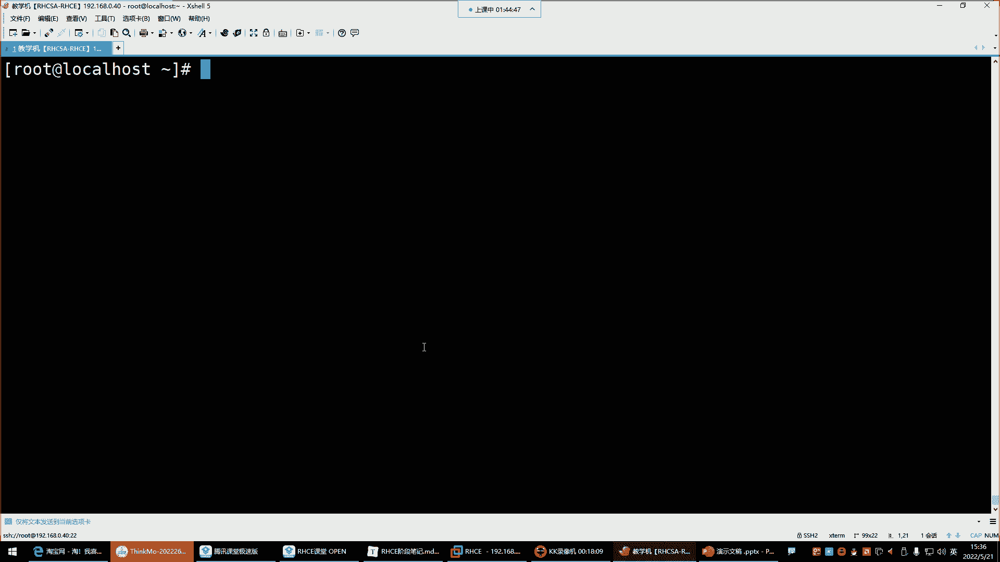

呃，这个HTTBD默认走的就是HTTP协议搭建网站的，然后它的端口就是80。好，那这个。你先不用去管这些。😡。

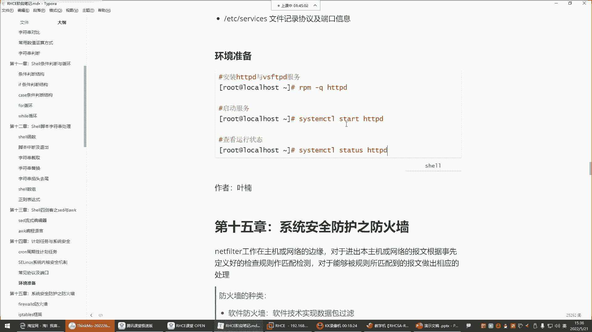

那有一条命令可以直接看叫SSSS这条命令。我前面给大家呃我记得我前面给大家讲过这条命令，它呢有很多选项，什么杠NTLP这是比较常用的这里边呢它有一些帮助可以看一眼。嗯，SS你看它的选项非常多。

是不是啊这里边什么嗯N。N是不要解析服务名什么算了吧。这个我记得我前面笔记里面给大家介绍过，但是没有在这个笔记是HCSA的笔记里面介绍过啊，就是主要是看服务的走的协议跟端口。

对它是阿帕奇哈SS杠NTLP啊T就是看它走的协议啊TCP协议，这个P就是看这个呃这个应用这样的端口L就是以这种长格式给我列出来。😊。

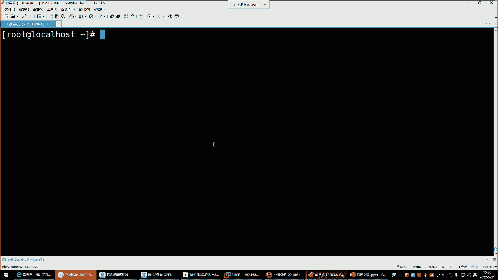

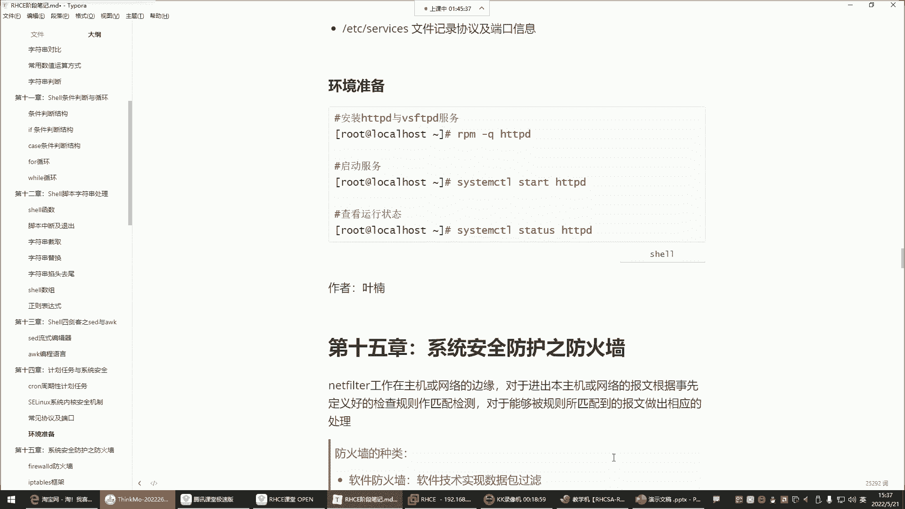

N就是再加上它的具体的名字，就管道给gra谁呢？HTTPD回车啊，我现在过滤HTTPD这个应用程序，它的进程的信息的时候，他就告诉你了，listen监听端口80，看到吗？就是它监听的端口是80。

那有了80以后，注意你不用管默认端口是80。那接下来访问它在这边用浏览器打开。

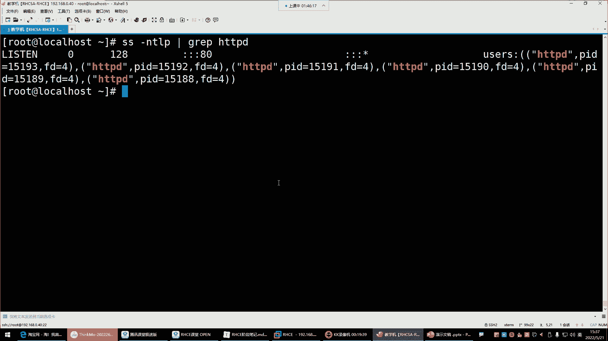

打开哈访问我那个机器的IP就行了。1。2。168点0点多少呢？我那个机器是40，然后回车。😊，中间件就是软件，中间件就是软件，没啥，就是软件中间件儿。中间件就是软件。嗯。啊，它可以它可以干嘛呢？

它可以为某一个应用程序提供一些额外的功能。我们叫中间件。啊，那这时候你发现防防半天怎么一直转圈圈呢？没有防上哈，为什么呢？是因为我们当前这个机器开着防火墙的。😊。

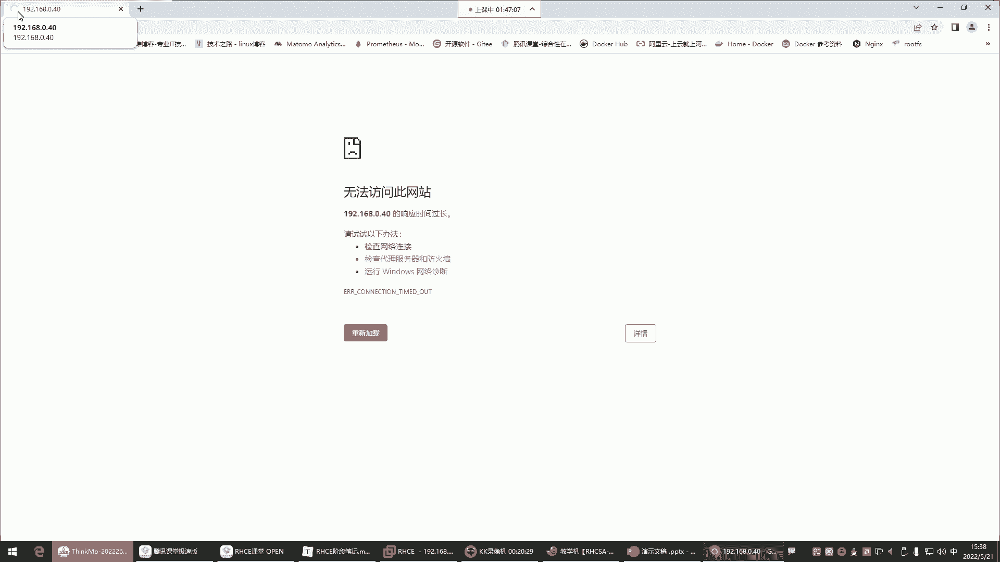

开着防火墙的哈，不是什么高级东西，就是软件哈。😡，啊，那接下来我来给大家先把防火墙停掉systemtop。

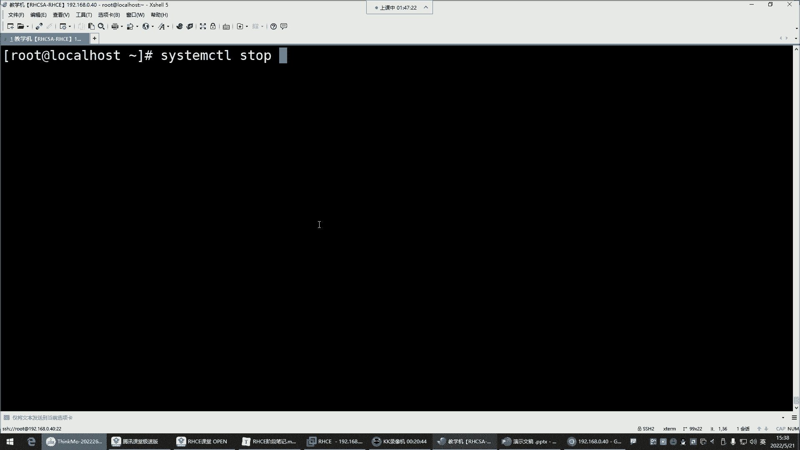

菲尔沃回车，我把防火箱停掉，大家看直接看到页面了。这个页面就是我刚刚安装的那个HTTBD给我提供的这个页面。就这个页面哈。好，那对于这个页面，我们现在不用去管它乱八七糟的。搭建网站的嘛。

你往里面拖一个东西，那别人就可以访问了。😡，好，那现在这个这个页面的话呢，我们可以这个先说一说为什么刚刚不能访问呢？因为刚刚有防火墙。

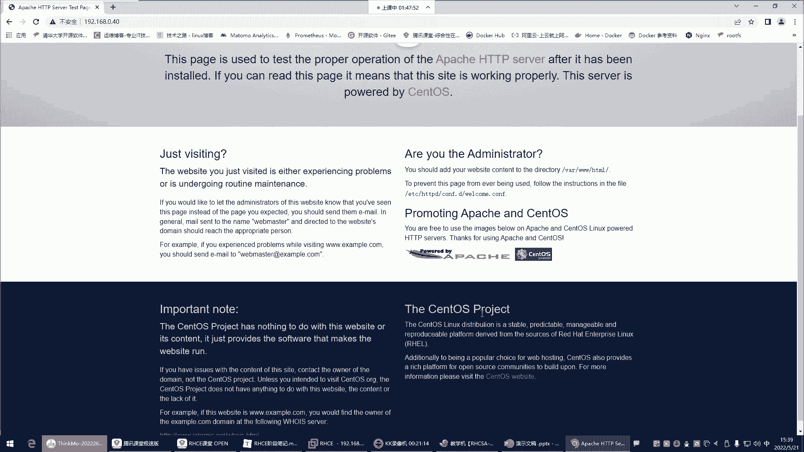

有防火墙，我们刚刚安装这个HTTD就是为了给大家讲接下来的防火墙。那防火墙的话呢，看哈什么叫防火墙？防火墙。😊，工作在主机或网络的边缘，对于进出本主机或网络的豹纹，根据事先定好的检查规则做匹配检测。

对于能够被规则所匹配到的豹纹做相应的处理这句话。我给大家详细的解释一下防火墙这东西。

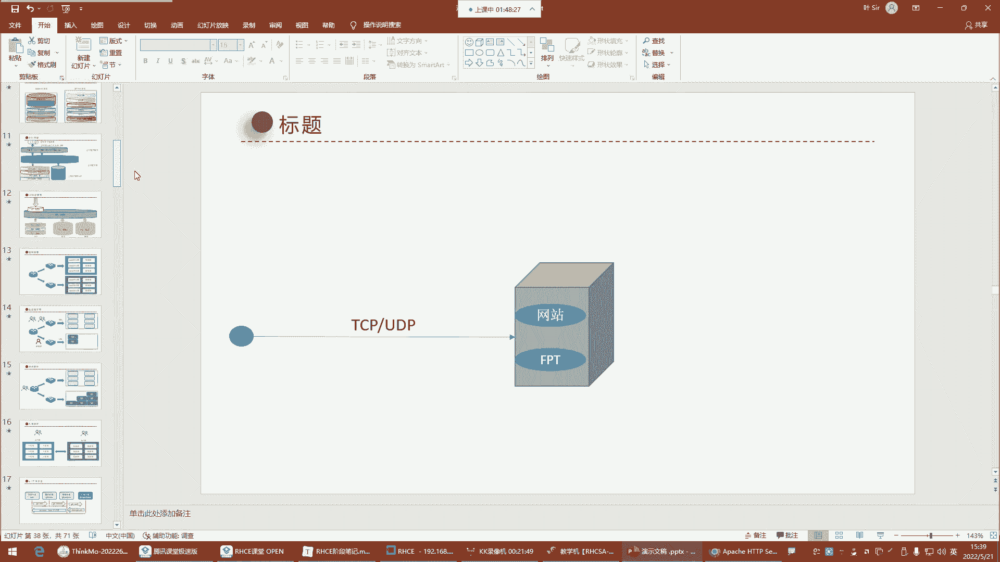

呃，我这有张图来哈，防火墙。

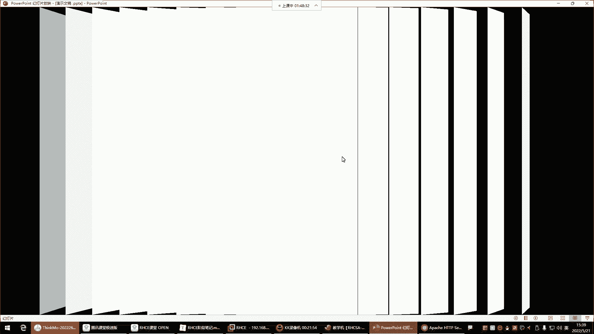

防火墙概念。来先把这句话再读一遍，工作在主机或网络的边缘。我现在有一台计算机，我这台计算机我安装了一个网站。这是我的服务器啊安装了一个网站。好，那这个网站最终是不是得让用户访问呢？啊，用户访问你的网站。

那接下来我们说什么叫主机或网络的边缘？这个主机或网络的边缘到底是哪里？这个就像什么呢？就像你进地铁站一样，你进地铁站地铁地铁站的边缘是哪里呀？地铁站的边缘就是安检。安检那个位置。

安检得检测你有没有一些危险物品。如果没有危险物品，对人家才给你放进去，那叫边缘。所以说防火墙它呢就是在主机或网络的边缘。那主机或网络的边缘就是在你防火墙设备的外网网卡的前边，在这儿干嘛呢？

去对用户的数据做过滤的。嗯。知道吧？这就是叫边缘，别人想访问我这个服务器里边的这个网站应用。那你要明白我这个服务器里边的这个网站，不是说谁访问都能访问的。所以我得过滤数据包，万一这个人他攻击呢？

是不是啊啊，所以这就是在边缘去对数据做过滤。所以这句话现在能理解了吧。那它对于进出本主机或网络的报文，根据事先定好的检查规则做匹配检测。那这个不就是。说白了我防火墙里边不就是得配规则吗？是不是啊啊。

当是一会儿哈我们再说。😊，这个我防火墙里面其实就是配规则的。搞了一堆规则，一堆规则。第一条规则。第二条规则是吧，要么就是你看第一条规则，允许所有客户端访问本机的网站应用。第二条规则。

拒绝所有客户端访问本机的网站应用。那这时候。防火墙，我配了规则了，你访问我，我得按照规则去过滤你这个数据包，知道吧？那一旦用户他的访问他的这个数据包被我的规则所匹配到了，那怎么办？按照规则处理。嗯。

按照规则处理哈。所以这就是防火墙，就是做数据过滤的。但是防火墙它的种类又分为什么呢？叫做软件防火墙跟硬件防火墙。那软件防火墙是通过软件技术实现数据包过滤。什么意思呢？就是我们要安装软件包。

然后软件包给你提供诸多的命令，然后你通过命令去配规则。这种叫软件防火墙。那硬件防火墙呢，你不用去安什么包了，你们公司花钱买一个硬件设备，你像像什么身线服那种厂商专门搞安全的，他们家就卖防火墙设备。

那个一台防火墙设备的话呢，百80万的，然后你们公司也不差钱，就买一台防火墙设备。然后这防火墙你不用去敲命令，那玩意儿就是有有点像云主机的安全组一样。云主机的安全组，哎，鼠标点点点配规则，能理解吧？

所以他给你提供一个页面，那个页面，你用鼠标点点点，哎，就可以配规则了。嗯。好，然后。呃，接下来这个叫防火墙的种类哈，分为软件跟硬件。那我们学的话以软件为主哈。硬件的话呢，那有有的公司他不舍得花钱呢。

他不舍得花钱，你想想那你还没有办法去鼠标点点点的，为了省钱，那只能什么呢？只能是哎我们安装一个软件，软件一般不花钱呢，免费的，你就配规则就可以了。嗯。😊，然后接下来。

防火墙的类型分为主机防火墙跟网络防火墙。好，那这时候主机防火墙保护自己本机的应用。这一般小企业小企业就是。他们家呢就一台服务器。一台服务器的话呢，也没有多少用户去访问。然后在一台服务器里边安装个网站。

配个数据库，用户访问网站数据存到数据库里边。好，那这一台服务器对外接收请求的话，那一般情况下，这个时候你要对这个服务器配规则。所以就像我这个里边。啊，就就就像我这个图里面主机防火墙。

就是我这服务器就一台，然后呢接收用户访问。那用户访问我的网站，我得通过防火墙去什么呢？去过滤他的数据包，这种叫主机防火墙。一般小企业这样干那。如果是这个那些大企业呢，大企业他得用这种网络防火墙了。

网络防火墙是什么意思呢？就是说我企业内部有一个集群。啊，所有的网站都运行在我的集群服务器里边，一群机器。那我这一群机器干嘛呢？我不是每个机器都配防火墙，而是什么呢？

而是我单独准备一台服务器去安装一个防火墙的工具。然后呢，我就单独让这台服务器去接收用户的请求，用户的请求，经由这个服务器去做数据过滤。然后如果说这个数据过滤，没有任何问题。

再通过你们企业的一些什么交换机，再把流量再给他转给你们的内部的网站服务器。是这样子的。所以这种的话呢，是大企业都是专门去买那种硬件防火墙设备，大企业百80万的，人家不差那钱。

直接干嘛自己买个硬件防火墙设备，然后点点点配规则就行了。小企业嗯小企业就。一般就不要什么呢？就不要抠门，太也没钱，关键是啊主要是没主要是没钱，所以一般就。没有什么集群也就一两台服务器。好。

这就是我们所说的这个什么呢？我们所说的这个。防火墙。好，那这个防火墙我们现在。下面还有一些概念哈，这个概念先给大家说清楚哪个概念呢？就是。我们学习的是软件型的防火墙。

那软件防火墙在stoS7里边默认使用的防火墙管理工具叫做fa沃。然后在s6里边默认使用的防火墙管理工具叫IP table。那对于。注意哈，我们我们现在学的是s7这个系统是不是啊？

那默认的防火墙管理工具叫fa沃，这是一个防火墙的管理工具。但是真正实现防火墙功能的是叫net filter是ux系统内核自带的一个模块，这个模块翻译过来叫网络过滤器，通过这个模块实现数据过滤的。

但是这个模块在内核里边内核我们人无法直接跟它打交道，所以就可以通过这个沃这个管理工具去操控这个内核去配规则那下边s6里边默认使用的防火墙管理工具叫IP tables那这两款工具一般的话呢我们还是比较喜欢用ip table因为都是从6过来的啊。

感觉ip沃要好用一些啊，只不过那些官方官方说啊我这个在各个方面比优秀了啊，建议大家使用就像我们现在用win10。然后呢，微软又升级到win11了，微软说啊我的win11系统从效率上已经什么呢？

已经这个比win10提升了多少多少多少。但是当我们升级到win11以后，发现这他妈的都是bug也不好用，是不是？所以说基于我们用户使用的角度来讲，我们是不参考官方的。啊，我们什么呢？

我们啊考试不得用八吗？考试没有防火墙体。考试没有考试，没有防火墙的题。好，然后我们呢也给大家讲。也给大家讲哈。fa沃先给大家讲fa沃再给大家讲IP tables啊，但是我得给你们说一下。

在企业里面IP tables用的比fa沃要多，能理解吧？嗯，好，那接下来我们说这个fa沃这防火墙，fa沃防火墙，它的管理工具叫fa沃杠CMD这是它的命令哈，它的命令。然后这个防火墙呢。

它的这个名字叫fa沃。😊，我们一会儿说一说这玩意儿他们之间的关系啊哈，然后这个管理工具的话呢，你在使用的时候使用的时候。

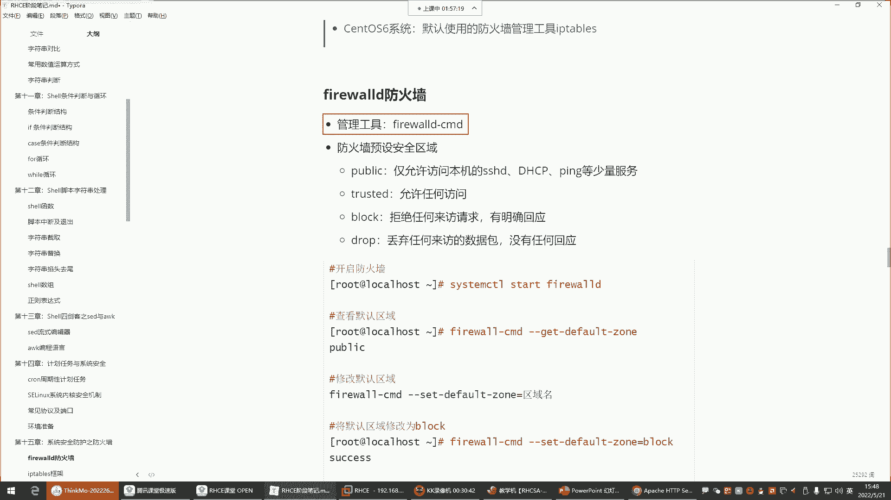

叫。F我。杠CMD我刚刚注意我是把这个防火墙给它停掉了是吧？我是把这个fa沃这个防火墙给它停掉了，然后我得先给它开起来，不然这工具啊没啥用。给他死他了起来。star开启哈。好，那开启了之后。

我现在配规则了，用fa word杠CMD可以t不见哈。CMD那这个是针对于这个规则配置的一个命令，而前边你想停止或者说开启它的。😊，服务名叫fiar world，这是它的服务的管理工具。

这是他们之间的关系。好，那接下来。

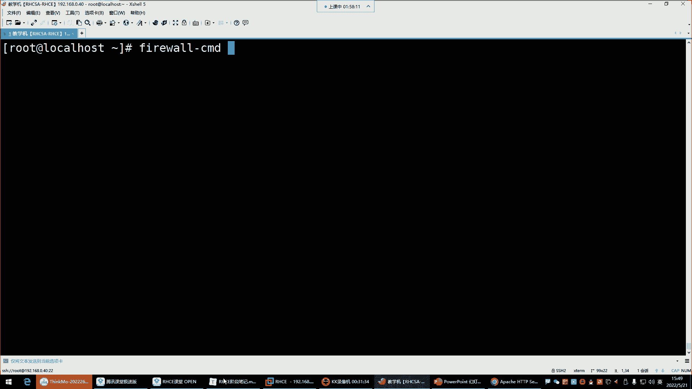

啊，它有几个区域。在这个f world防火墙里边。它呢这是一个大的防火墙体系，它里面有非常多的区域。好，那不同的区域实现的功能是不一样的那我们说说这几个区域啊，先说第一个叫public区域。

仅允许访问本机的SSHD等等等等。我现在先看一下这个区域里面都有什么东西，好吧，怎么看呢？啊，先看哈。这样查看区域fa world杠CD啊，杠杠get杠defa杠纵啊，这命令太长了是吧？

记不住杠杠hel。

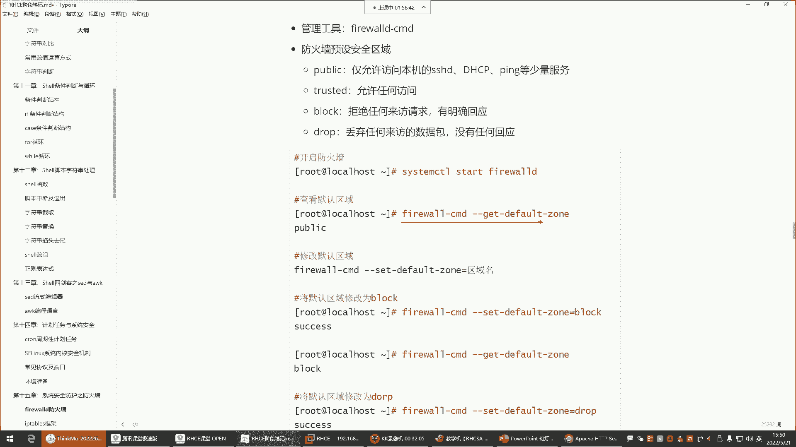

harp的时候看看。这也非常多呀。啊，杠杠ge他。

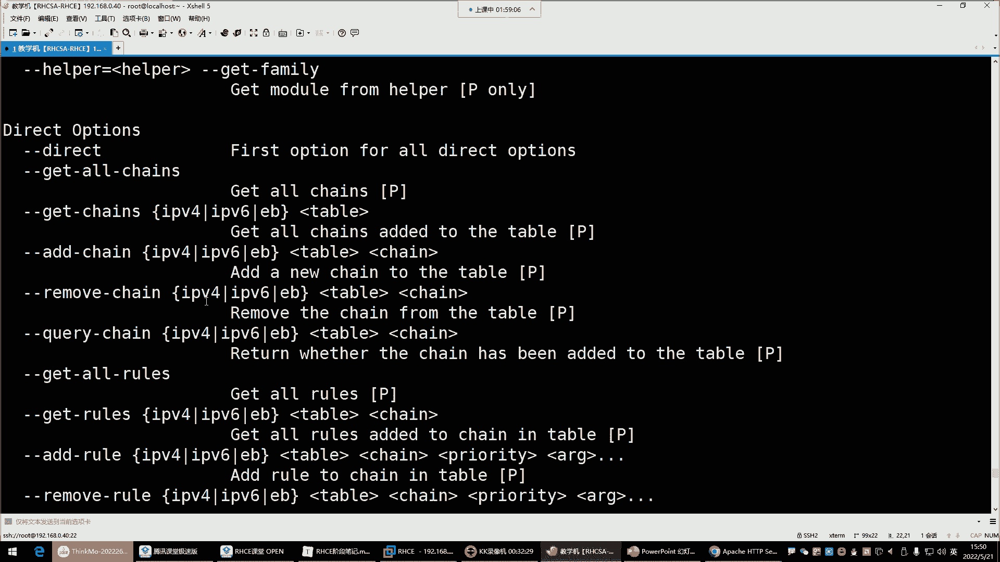

这太多了，这帮助我的天哪。我的天哪。我的天哪，我后悔了，我这敲了一个帮助，我敲了一个帮助，这这帮助也太多了。算了哈，对，还不不帮了。这样哈fa沃杠7D杠杠什么呢？😊。

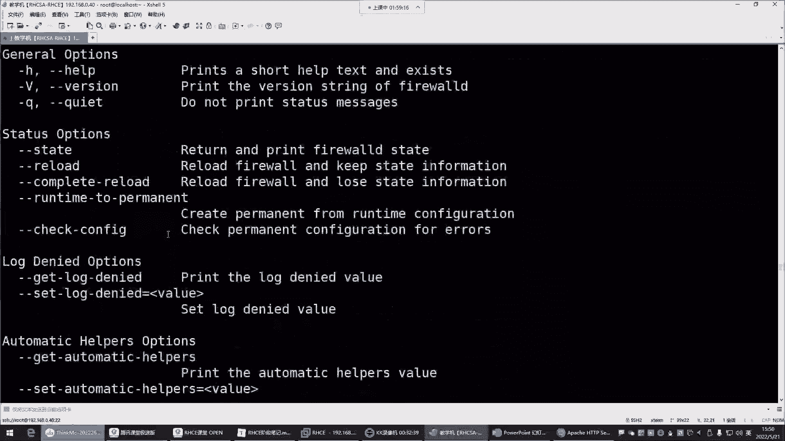

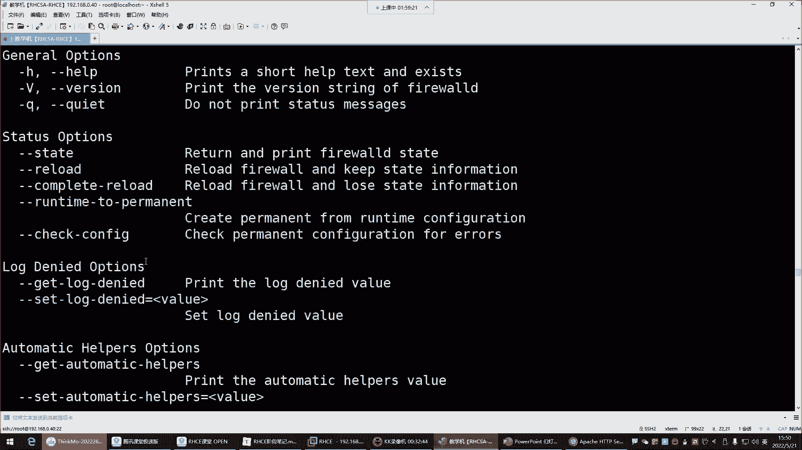

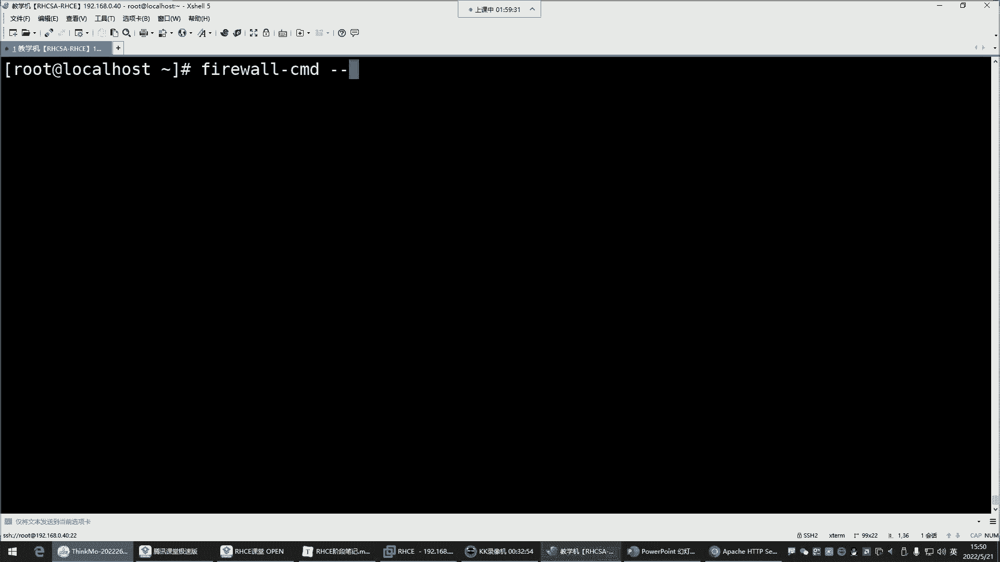

ge叫查看default叫默认纵教区域。所以这三个放在一起就是查看默认区域。那这个命令我们得什么呢？我们不能盲敲了哈，盲敲，有的时候也记不住命令这种东西啊时间长不敲都忘。

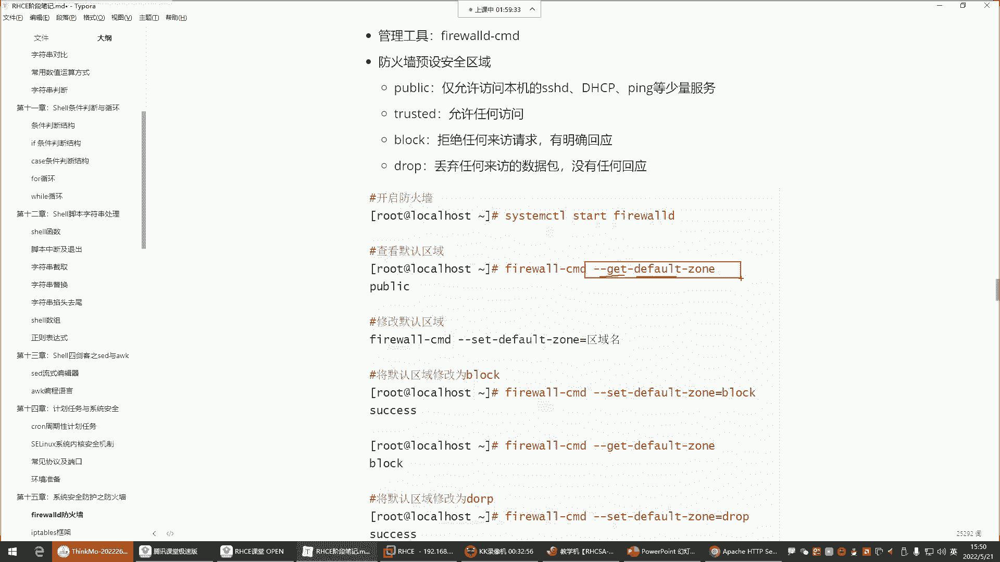

包括我也我也一样，我时间长不敲，我也忘。所以有的时候这种东西还得参考笔记哈，参考笔记笔记这种东西。我们说有的时候就是你好记性不如烂笔头，你再好的记性，你真的是你时间长不用，它就是忘。😊，啊。

来敲这条命令杠杠。get查看杠。Defoult。defo，然后。杠。送回车这条命令是查看当前的防火墙的默认区域。那它这几个区域，也就是说当前用的是这个public作为它的一个叫做什么呢？叫做默认的区域。

那在这个区域里边注意，那也就时说我当前的防火墙的状态是什么呢？当前我的防火墙它看它采用的默认区域是这个public。好，那这个区域就是仅允许访问本机的什么ISSHDRCP是分配IP地址的。

然后拼等少量的服务。所以说如果我防火墙现在是开启状态，你访问HTTBD。

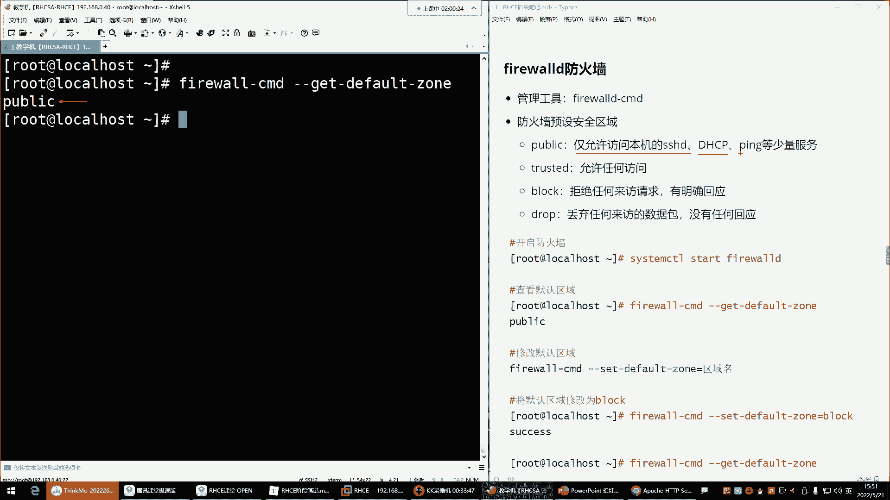

这个外部服务的话。它是防问不到的。你看浏览器一直在转圈啊。为什么反不到呢？因为防火墙压根儿也没有允许。😡。

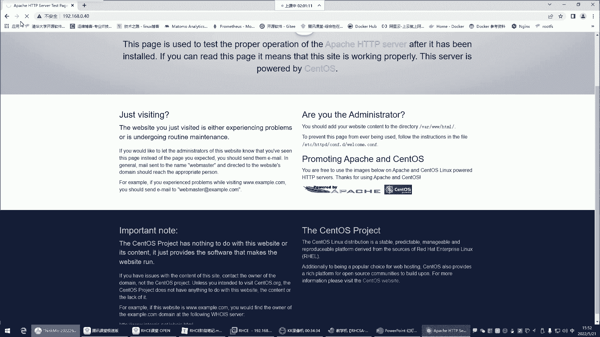

你访问我的那个，他是走的是基于HTTP哈。😊，所以我没有放行HTTPTHTTP所以它防不了。那这时候我们就要干嘛呢？我们就。

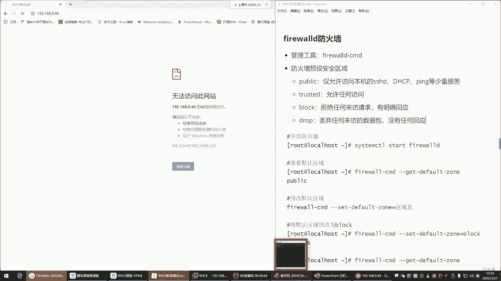

一会儿啊一会儿要改规则，没关系。我现在先知道怎么查看这种默认区域，就是杠杠ge杠de杠纵。然后下边如果看啊我想希望大家访问的话，我可以把它我可以干嘛呢？可以对我的区域做一个修改。

我让我的区域变成叫trarus it，允许任何访问。那现在怎么修改呢？也是这条命令翻过来。然后这时候把get给它换成set。set default区域等于谁呢？trust it。回车。

然后再看区域变成trus it了是吧？那一旦变成trus it，现在你再刷新好，可以访问了，为什么呢？因为我现在的防火墙，我开启的默认的区域是trus it，trus it叫允许任何访问。

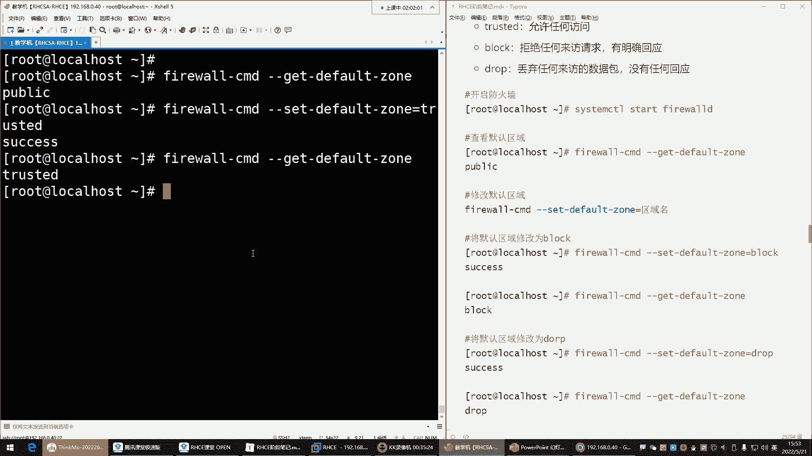

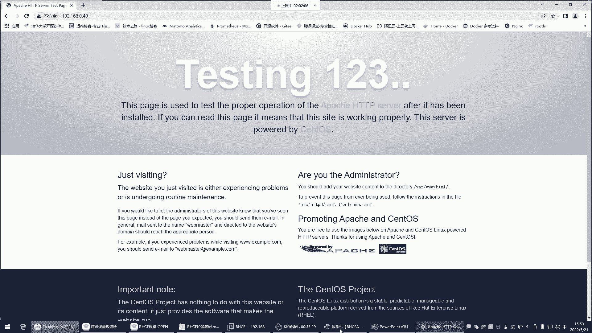

好。对，然后这是trus it哈允许任何访问。现在知道怎么去改它的默认区域了吗？啊，set是设置的意思，get是查看的意思，后边默认区域都一样，你改区域名就行了。

OK然后那我们再看看其他区域blockblock叫拒绝任何来访请求，有明确回应。好，没关系，来改改成。赛ta等于。叫block。BLOCK回车。好，那block的话呢。

现在他告诉你s size成功了是吧？再看一下。😊，get一下哈，get好，那当前变成block了。block你现在如果再刷新我们这个页面，它又开始转圈了，看到吗？为什么呢？

因为我当前的防火墙的默认区域变成block了，那block这个区域的特点就是拒绝任何来访请求，谁访问都拒绝，知道吧？😊。

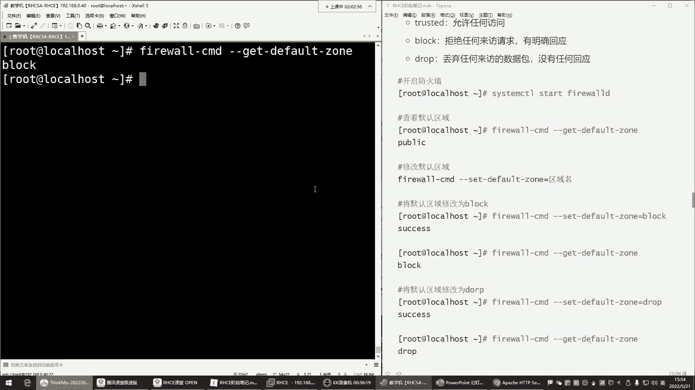

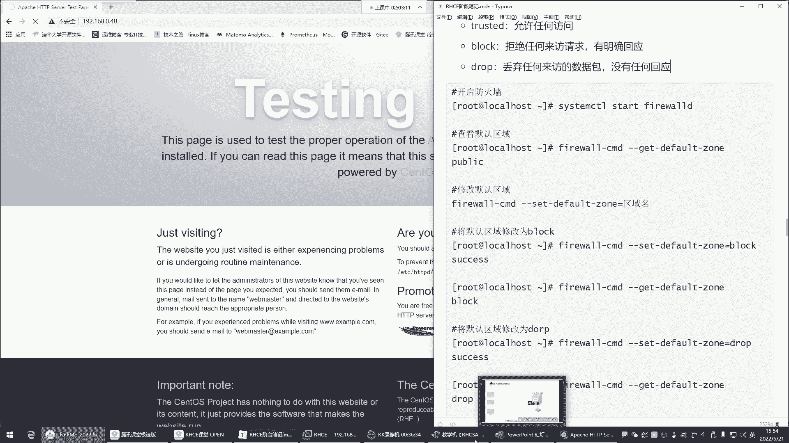

谁访问都剧君？

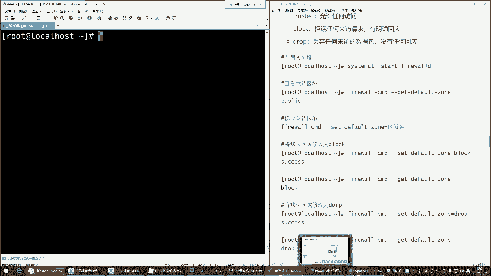

所以现在你发现我的浏览器。又转圈了。嗯，卡了吗？我看一眼哈。没有卡呀。

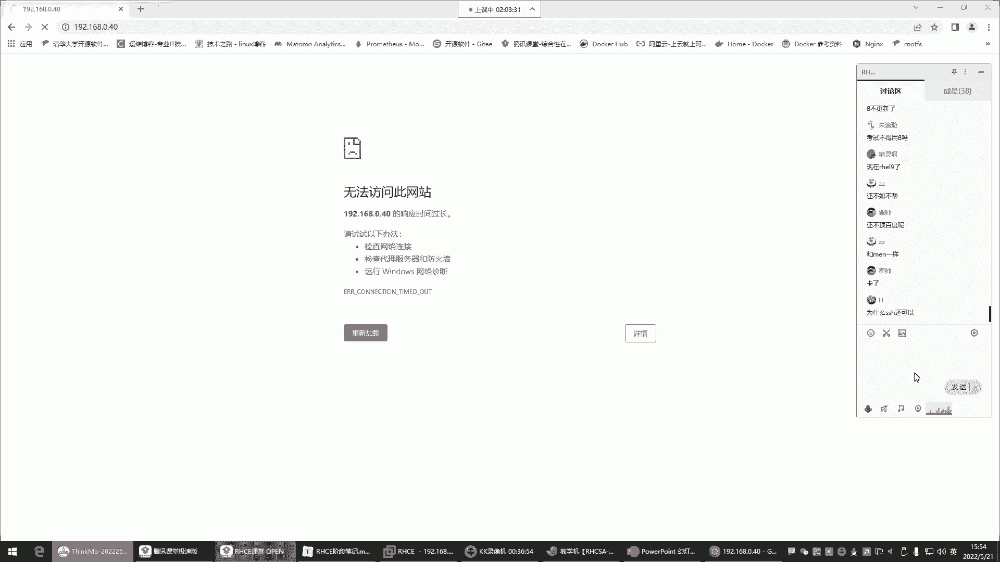

为什么SSH还可以是吧？为什么SSH还可以拒绝任何来访请求有明确回应。嗯，那他这个区域里边我们看一看为什么SSH可以哈这样。呃，我想看区里的规则这样。这条命令哈来。F沃。杠。杠3MD。

然后指定区域哪个区域呢？我当前的区域等于block变lowOCK，然后杠杠list，然后杠2回车。嗯。这里边是是。嗯，这个区域有点问题，这个区域有点问题哈。对他拒绝任何应该我们再开一个机器。

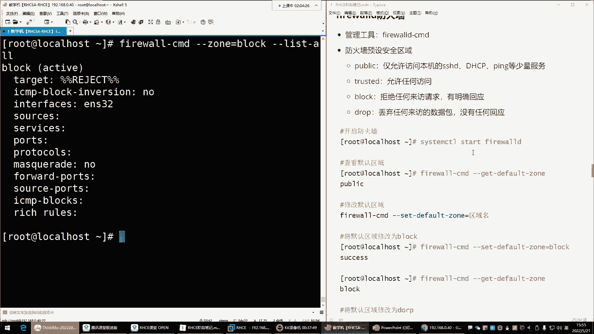

再搞一个谁呢？这个随便搞一个机器哈，就这个测试机。

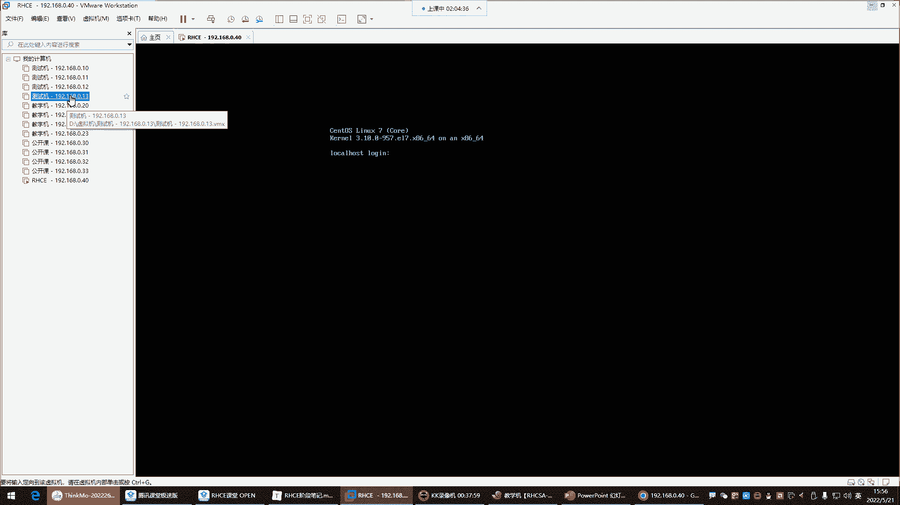

我给他恢复个快照，我看能不能拼哈，得测试一下。😊。

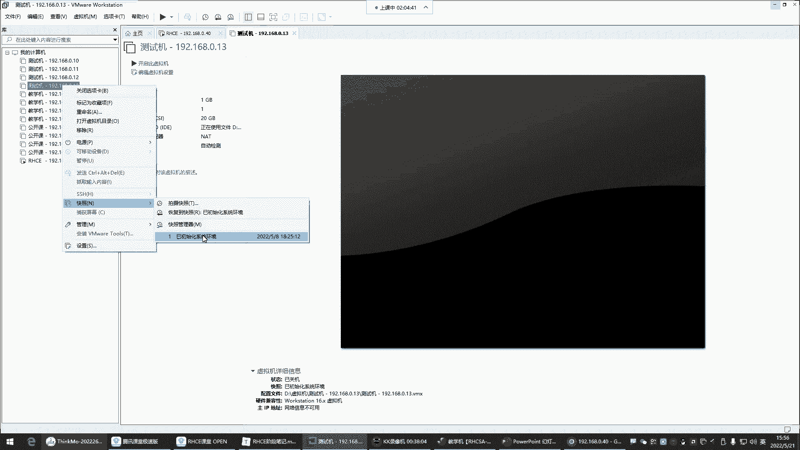

这个菲尔沃有有的时候。让你研究起来，真的是摸不着头脑的。好。那再说说别的区域，这个区域叫丢弃任何来访的数据包，没有任何回应啊。这时候我现在是无法访问是吧？这样的话还点看不出来。再开另外一个是多少呢？

测试机。13。在测试机里边，我先拼拼那个IP地址，192。168。0点。40。回托。啊，这时候看拼都拼不了了，但是SSH怎么没断呢？我也纳纳闷了呢，他说目标端口。😊，目标主机叫目标主机被强制禁止。

看到吗？是不是就告诉你。不允许访问了呀。那这个机器我先退出，我看还能登录吗？那有可能是。😡，不不不哈，不我退出，我再登录，我觉得有有有可能不行了。😡，上不去了上不去了哈。😊，上不去了哈。

就是你当时的状态他没给你断。现在就已经连不上去了哈，所以原因现在找出来了，什么原因呢？😊，对，原因就是你得退出以后再登录就上不去了。上不去了哈。对。😊，断开就不行了。

所以这个时候你看这个区域的特点是什么？是不是你任何的访问都拒绝呀。好，那下边那这时候怎么办呢？这时候我们得通过这个位置登录去改规则了。😊。

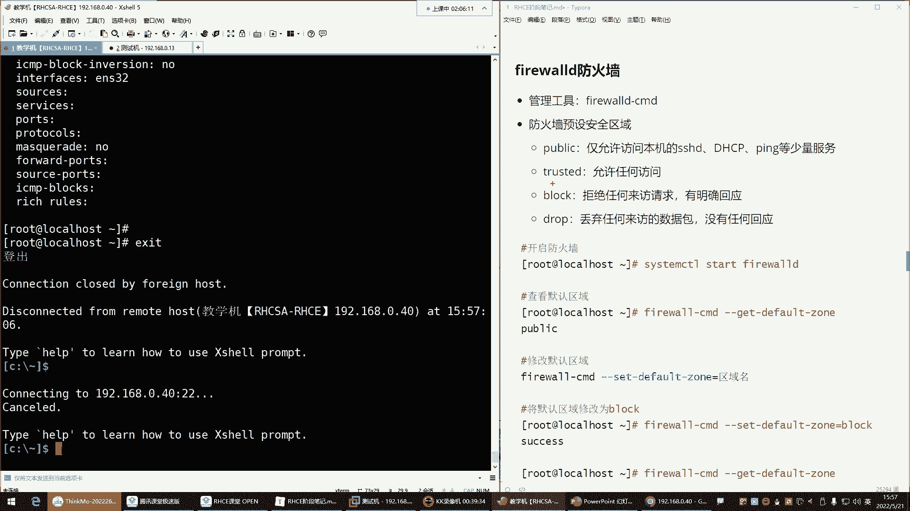

root一，所以这时候你就得fa word。杠C。杠CMD，然后杠杠这时候。来看看哈，那这个规则我们先先干嘛呢先。😊，啊，先设置吧哈设置设置成set杠。Default杠。重等于谁呢？joDROP回车。

好，事儿成功了，set一下。杠CMD然后杠杠。Get杠。defaultdefault杠送看末认区域变成job了。job的话呢，我们可以访问吗？来连一下，再连一下job重新连接。

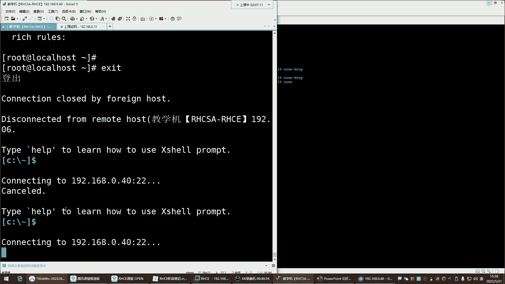

也不行。罩吧好像也仿不了呢，是不是？那我们这边拼一下，我防火墙现在改成罩布了，这边拼。😊。

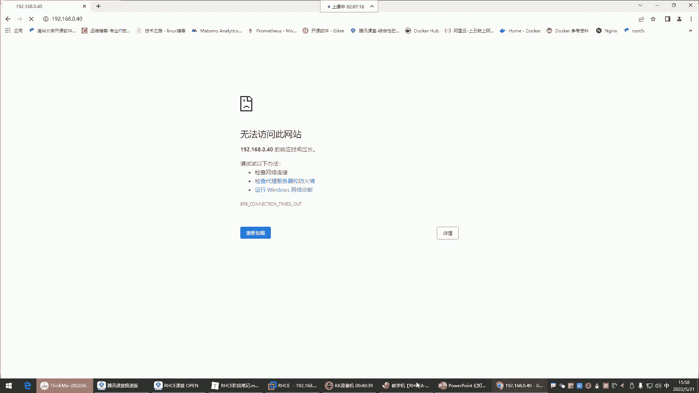

委托。看效果哈。这个位置你发现。它一直没动，我一直在拼这个机器是吧，但是它没动，为什么呢？它跟前面不一样，前面他告诉你了，说目标主机强被强制禁止，是白就是拒绝访问了目标主机。

但是这个位置为什么没有任何提示呢？因为它的特点就是。😡，这两个区域首先呢都是拒绝，注意哈都是拒绝。你看block是拒绝任何来访请求，那jo吧也是。🎼我们说叫拒绝任何来访的请求。来来访的来访请求。

但是他是没有任何回应的。他没有人回应。因为他把把他把那包给丢弃了。丢弃了。

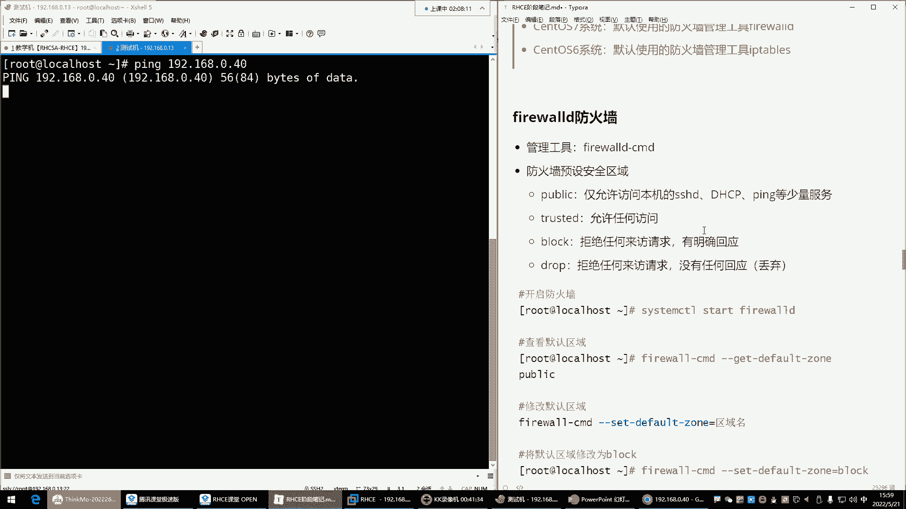

这个主机拼他一个包，他接收到这个包了，但是呢他把这包给扔了，不会给他回应，能理解吧？这是他们之间的区别。

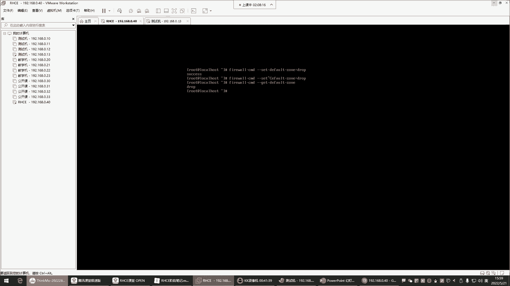

那你说这个一般。怎么用啊？这玩意儿就是你想拒绝一个人。😡，但是什么样的拒绝呢？😡，就只要你想聚一个人，一般别来block了，干嘛呢？给他照个掉。一般对于攻击者来讲，一般对于攻击者，如果他想攻击你。

你不能给他改成拒绝，为什么呢？因为拒绝的话，我们再设置一下，给他设置回设置回去，在这儿设置成。

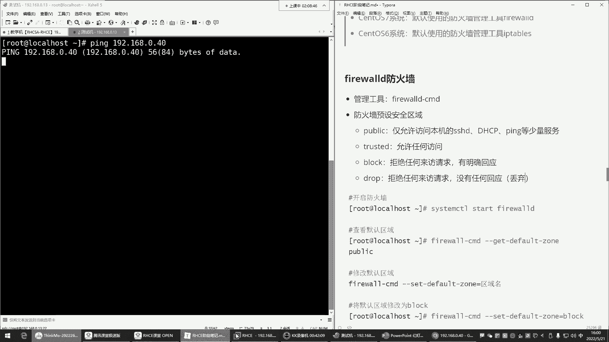

block bLOCK回车，我一旦给它改成这样的话，这边再拼，你看是不是变成这样子了呀？那我告诉你。嗯。对。

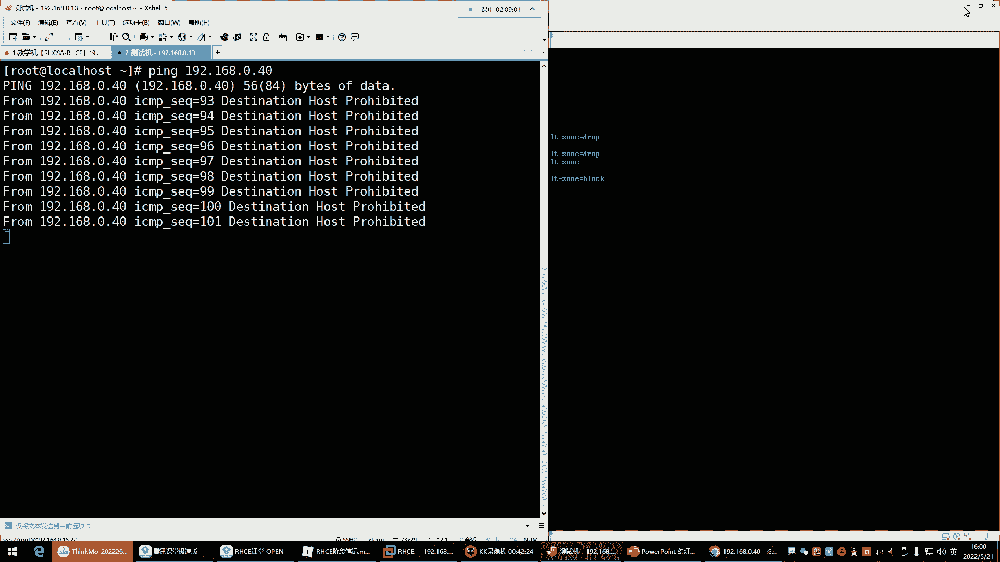

看哈在这里边你发现别人拼我是候也是不是也能拼通啊，看他从这个192。18。0。40这个机器得到了什么呢？得到了回应说目标主机被禁止是吧？其实就是。拒绝访问了，但是你要搞清楚，如果别人想用流量攻击你。

那你他拼你，你是不是也给他你也得给人家有一个明确回应啊，告诉他明确拒绝。所以你是有流量支出的。😡，一般你如果真想拒绝一个人，一般啊你连流量支出都不需要有我就拒绝他了。所以来一个包，我就给他丢掉。

来一个包丢掉，这种这是他们之间的区别啊。一般对于攻击者来讲，就是丢弃就行了啊，不拒绝。对于正常的用户来讲。我们可以明确拒绝他啊，他就知道是什么意思了。

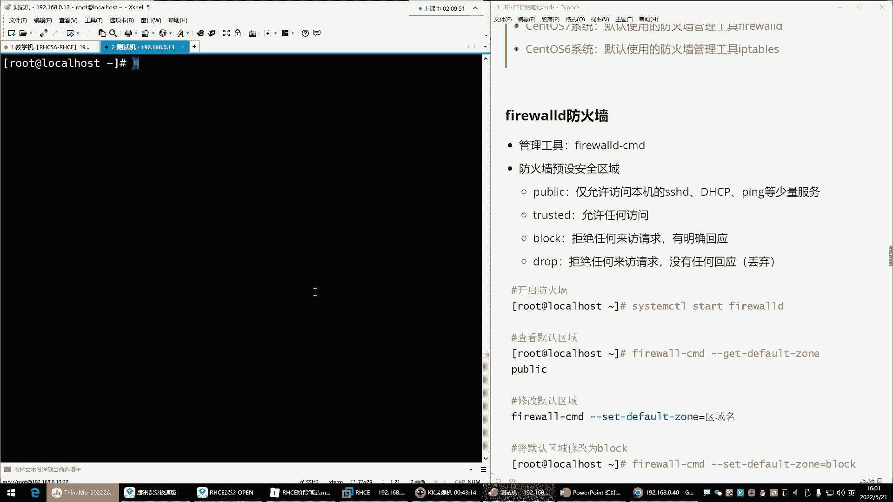

好，那。

🎼这是他们两个的区别。那我们呢这边再给它重新设置回来哈，设置什么呢？呃设置成。😊。

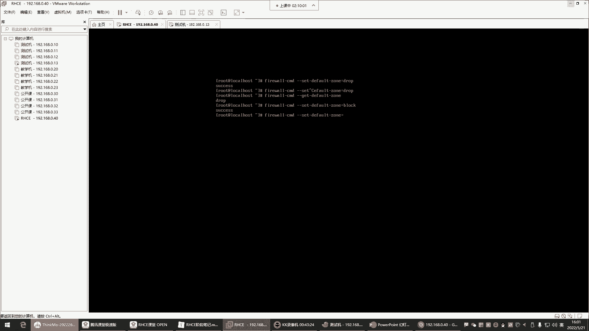

设置成。

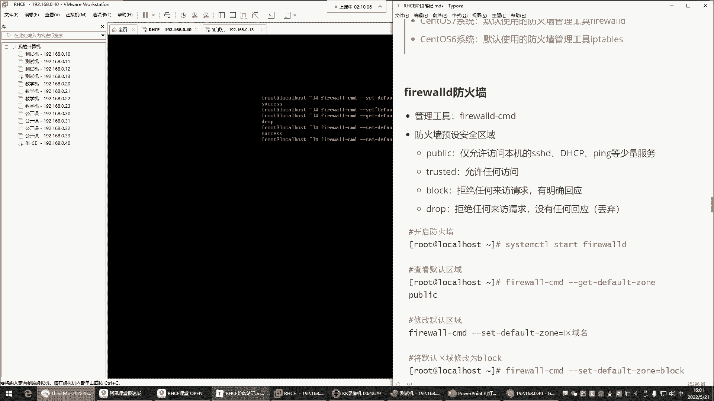

啊，public。lic好，然后这时候再连接一下哈，再连接一下。😊，哎，这边连接哈连接一下哈。文件重新链接。好O。成新链接了。然后接下来。😊。

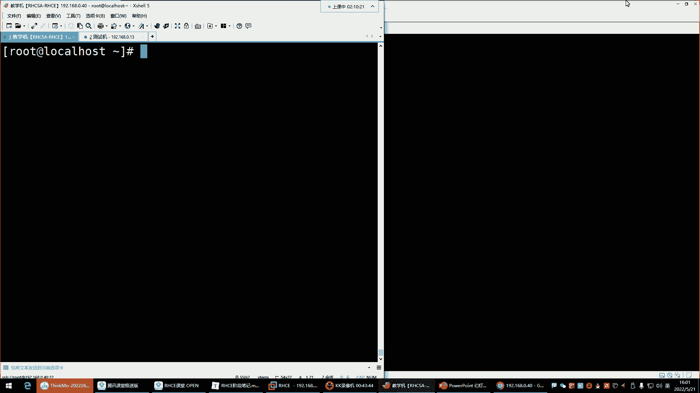

那这是防火墙这几个区域，现在感现在感受到了吧？就是如果是public，这里边呢是允许你有少量的服务去访问我。那这时候我们可以看这每个区域的一些规则啊，它每个区域里面都有一些规则哈，这个时候我们就fe沃。

😊，杠CMD然后杠杠区域还是杠纵等于哪个区域呢？看。看block。好，那我敲错了，是杠杠。啊，不是没有加选项杠杠list。杠澳。哎，那个是吧。两个横杠这位置哈，他说了，你看你这个杠纵等于public。

看到吗？有问题。什么无法识别的参数，他说你这参数不对，少一个杠好，回车这样就可以了。那现在我们来看这个区域，这个区域这是区域的名称叫public。好，那这个区域是什么状态呢？active叫活跃的状态。

看到了吧？活跃的。然后它这里边啊什么这个目标啊，针对于的目标啊，default。😊，默认。😡，这些的话呢你不用去管看什么呢？看这个service服务这位置。服务这位置告诉你。

我现在这个public这个区域允许哪些服务访问。因为这个区域注意这个区域是一个允许的区域，它不像下面这两个是拒绝的区域。前面这两个都是允许区域，只不过这个区域默认只允许少量的服务访问。

而这个呢是允许所有啊，那这个区域，你想看哪些少量服务可以访问，就在这看这个区域看s服务就可以了。SSH服务可以访问DCP可以访问。那还有拼也可以访问。看到了吗？就是看这个区域的一些规则。

然后这个区域的interface，它的网卡。是ES32用的网卡啊，然后那我再看trus it，trus it这时候。呃，奥。往回退退，看窗子这的。呃，是。回车，那在tra这里边。

你发现这怎么什么都没有呢，是吧？😊，这个叫。re许所有啊，那re许所有看看。这就是接受的意思。我的target。t给呢就要默认的规则。注意我这个区的默认规则就是accept，就是允许。

前面public呢public的区域的默认规则啊，就是默认这些可以访问。那么。啊，那这时候的话在这个里边就是他没有任他规则就都放行，谁访问我都放行啊那。这个block如果你防火墙。

你的区域直接改成block了。好，那一旦变成这个区域，我就直接拒绝了。能理解了吧？BLOCK这里边什么都没有，什么都没有。没关系，你改成这个区域，我就拒绝，全都拒绝。你改成这个区域，我就全都丢弃。

它是这样子。😡，可以让两个区域允许远远程登录啊。可以让两个区域允许领。不是防火墙，只会工只会在一个区域里面去工作，知道吧？你的默认区域只能选一个哈。啊，这是费沃。那对于费沃来讲。

我们一般呢呃你想设的规则也行啊。你比如说我要为public添加一个什么HTTP的规则。这样的话呢怎么填呢？我们现在的默认区域是。被告。我看梦区域哈，杠杠get杠defa。杠粽。

我们现在默认区是public，允许少量访问。那我现在给它添加个规则，给他添加规则往哪添呢？就往它的s那添加。😊，前面44号。😊，掉了的是吗？

service呢这儿往service serviceice这位置是代表什么呢？代表服务的意思啊，代表服务其实就是协议，它里面是指定的是协议哈协议。😊，那这个时候你就怎么填呢？

faair world杠7D然后。给哪个区域呢？指定杠杠zo等于public。这个区域，然后我要给它添加规则。好，那添加规则ADDADD是添加规则。杠杠ADD杠。

service service代表的是服务的意思，哪个服务啊，HTTP。但是其实指的是协议，注意啊，你添加服务他不认识。😡，你得添加协议。啊，那这里面我要给他添加1个HTTP协议回车。😊。

那这时候我们再看。faair world杠CD，然后杠杠。啊，杠杠纵等于。Public。然后杠杠。立死他更好。Oh。回车，你看这里边是不是在s4这个位置是不是多了一个什么HTTP啊？😊，好。

那他这叫服务，其实我们往里面添加的是协议哈啊，只不过。😊，只要是。有服务走这个协议，我都什么呢？都允许访问。所以这里边它叫服务，其实它指的就是只要是有任何的服务，是走HTTP协议都可以都可以。

但是我们在往里面添加的时候，你不能添加那个服务名，是添加协议的名字。那这时候。

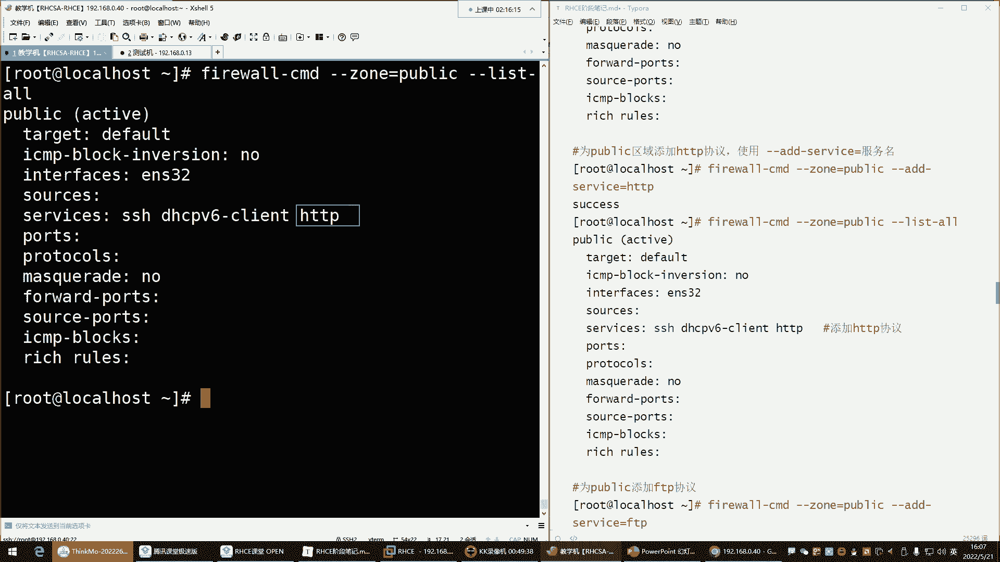

刷新就可以了，看到吗？这时就可以了哈。因为允期访问了呀，那你如我再给他添加一个什么HTTPSS之类的都可以。😊。

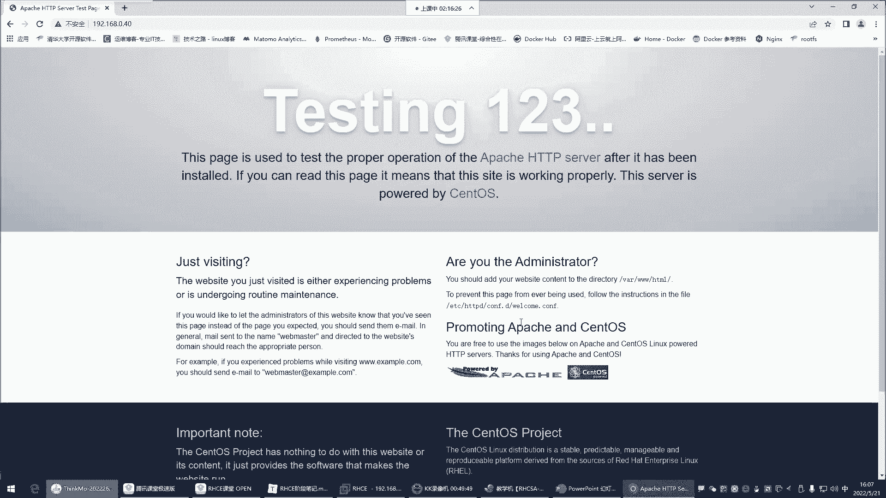

再加一个加1个HTTPS回车，这时候你再看回车，这里面又多了1个HTTPS看到了吧？啊，那如果说你的这个服务器里面的网站是加密的那HTTPS你也可以访问。如果要同时添加多条协议。啊。我看看啊。FTP。

到时割开行不行啊？😡，豆少割开。我记得我好像这么干过。我是怎么干的呢？FDP。嗯，多条协议怎么添加的了？嗯。FTP还有什么呢？比如说再来一个啊呃再来1个DNS。啊，不行啊，DS可以吗？嗯。

TFTP吧TFTPTFTP。这样好像不行，你看他不行哈。他不行，它不支持哈不支持，只能一个一个添加。不行，添加不了哈，一个一个添加。啊，但是这个用用的不是很多哈，用的不是很多，然后想删除怎么删呢？

这样杠杠蕊木杠ss。在这扫死。如果你想删的话，就把ADD换成木。杠杠。REMOVE蕊木杠杠蕊木杠ss。啊，删谁删HTTPS规车。杠杠粽。删除规则。屏目杠。笑死。fa沃杠CMD杠杠纵。Public杠杠。

REMOVErem杠s。嗯。嗯。哎。呃。什么情况呢？HTTP。好。啊，少了个E是吧，敲错了是吧？没有啊，有E哈Ss吗？😊，没错哈。어。哎，删除删除。啊。这个不是哈。

service哈service服务加服务名HTTPHTTPS好，我说的呢。不是source了，对，service service哈。对，杠上CMD这时候你在干嘛呢？在看的时候。😊，杠杠。

纵等于public玩fin命令嘛哈，这看是不是没了呀？对，就是你删谁，你要看对应前面的名字，删服务就跟service，但是没有那S哈，没有S，你要删地址source代表是原IP这是原IP想删端口，哎。

指定port端口，它里边。永远都是没有S，注意它是指指令，它这里边是是有个S，但是你在用的时候是没有S的，能理解吧？O。呃，然后下面。我们再来。说说对这个vi尔沃的防火墙呢，对大家掌握来讲。嗯。

对于这个菲尔沃防火墙，你们掌握的话呢，不用掌握太多，因为它用的属实是不少啊，不是属实是不多。所以下边呢还有一些操作呢，你们可以自己去看一看这里边哈，但是这个呢也呃也没也没去什么呢？

也没去准备太多fa word技术点。因为fare world对于我们这个平时工作中用的少，我们工作中主要用什么呢？IPtablesIP tables是我们工作中。你需要掌握到一个防火墙的内容。

所以这个呢是我们要学习的重点哈。fear what简单了解了解就行。😊，我都不用他。好，这是IP tables。然后我们呢休息一下，一会儿回来给大家讲讲IP tables。

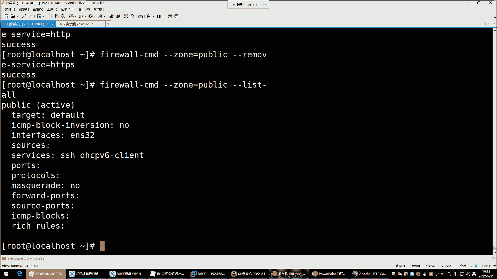

这玩意儿。这玩意用的比较多哈。VIP tables。对，休息一会儿休息一会儿哈，大家养嗯养养养精神。😊。

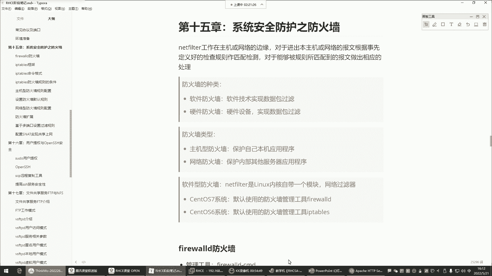