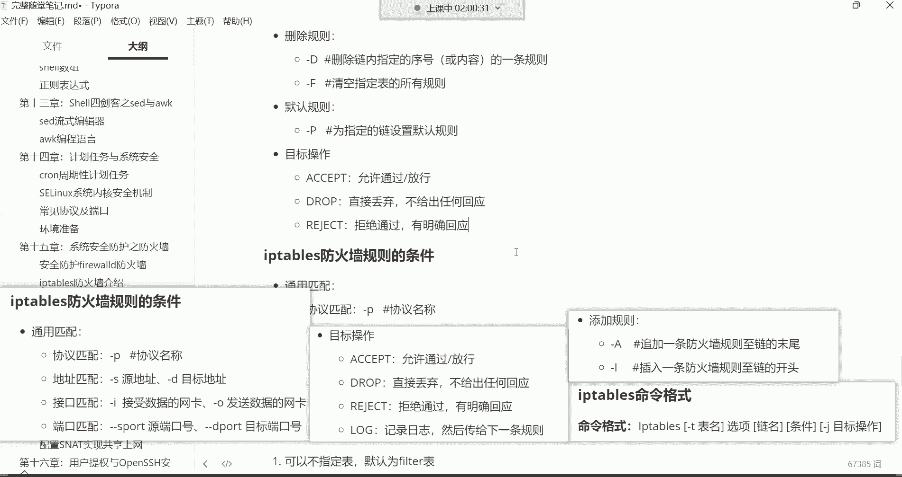
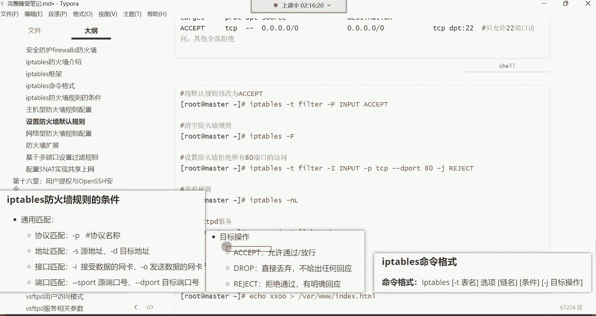

# 零基础入门Linux，红帽认证全套教程！Linux运维工程师的升职加薪宝典！RHCSA+RHCE+中级运维+云计算课程大合集！ - P53：红帽RHCE-18.系统安全防护之iptables防火墙 - 广厦千万- - BV1ns4y1r7A2

好，都回来了吗？来回来的话给我刷波一哈，然后我们继续。😊，听这首歌是吗？呃。换电脑应该买个什么配置的哈，配置的话如果不打游戏的话，其实笔记本也打不了游戏。😊，配置的话就内存的话更呃大一点哈。

内存的话达到这个16个G就可以了。这就能够满足我们平时的一个学习需求了哈。然后别买联想的是吧？为什么不买联想的？我相信你们应该心里都清楚是吧？联想这个被这个谁呢？被那那那那那个我们都说的叫教父是不是啊？

对，被那个教父。😊，已经搞的哎对，所以说现在对狗都不买联想，所以。别的什么小米呀是吧，什么华为都可以哈都可以，然后内存大点就行了哈。😊，16个G的8G够不够？8G不够啊。你到后期现在很多电脑都是一体的。

你拆不开，你往里面增加内存，你增不进去，你怎么办呢？😡，后期就麻烦事儿哈对。就内存搞16G以上的就可以了。CPU的话呢现在都不会太差，但是别买，我跟你讲哈，就是别买那个华硕的哈，华硕的那个。😊，啊。

不是。呃，是华硕还是好像是华硕的哈，华硕的那个显卡现在有个毛病，就是蓝屏。嗯，华硕那个东西哈没事就蓝屏。所以别买那个华硕的哈，小米就挺不错的。嗯，你的鼻子对哈。😊，嗯。你像我这个小米的是吧。

叫readme book的就挺不错的哈。😊，好了好，我们继续开始哈，然后开始学习这个IP table了哈。😊，对这个IP tables的话呢，我们先来了解一下啊。其实对于防火墙啊。

我现在还有一个概念忘了给大家说了啊，防火墙有一个非常重要的概念啊，这个这个概念放在这说，还是一会儿说呢，一会儿再说吧，好吧，一会儿说哈，咱们开始学习它的命令。😊。

命令格式呢先拿过来。😊，好，这是命令格式。

OK然后接下来呢我们就来说一说我们对于IP tapes下边哈，先给我们先安装一个服务哈，在这儿。😊，先安装一个服务ym杠外instIP tables杠serv，这是它的一个服务。

呀，但是安装IPtables之前注意哈。😊，先把fawork给它关掉，因为他们两个都是控制一个内核的，所以啊一个内核模块的，所以这个别同时起啊，同时起冲突了。systemstop。费尔沃，然后呢。

再给它设置成随机不自起。😊，戴耳的不行吗？是吧你买个华为的不行吗？是吧？我们提倡爱国是吧？那戴尔的它戴尔的它也不是中国的呀。😊。

好好，那。😊，接下来呢开始安装哈，就是用木给它安装上去。

y杠Yins套呃IPtables杠。是律是。或者说你你买你买你买一个什么呢？买一个小米的也行。像我的这种，你看我电脑就是小米的，我觉得还挺不错的，各个方面呢都还行。😡，安装好了哈，安装好了以后呢。

我们直接把这个服务起来。😊，Start IP。Tables。好，起来了。然后。

起来以后呢，咱们就开始学习它的命令哈。然后在这个命令里边呢，咱们得主要是给大家讲讲这个选项哈。😊，呃，IP table。我们先来给大家讲讲呃，查看规则的一些选项。

就是我们呢可以直接这样去敲命令哈，直接敲这个IP。tables，然后呢杠N杠N这个选项是查看IPtables所有的规则，然后呢，它是与一个杠N连用的N是什么呢？

N是以数字的形式显示规则里的什么IP啊端口啊。你看如果我们不加的话，我这样直接敲哈，直接杠L回车，你看这样敲的话呢，你发现其实这位置代表是IP地址，这位置呢也是IP地址。

这个呢是原IP啊s原IP这个位置呢是deestation，这是目标IP。但是你看啊这都是英文的，是不是啊啊，英文的。所以说呢你一般呢在看规则的时候，咱们再加一个加一个N看N哈。😊。

所以说这两个选项呢通常都是连用的哈，两个选项是连用的。我这里面也写了连用。然后回车哎，回车以后发现它怎么报了一个错呀，是不是啊？好，没关系哈，这个错是因为这个选项有一个顺序要求。

这个选项N要放到左边L放右边，哎，这样就可以了啊，这样的话呢，你看它就什么呢？以这种数字的形式显示地址IP地址端口信息了。O了吧，啊，这是看规则。然后你再看规则的时候，我们还可以再加一个下边这个选项。

查看规则时显示规则的行号。😊，那这时候后边再补个选项。好，那这时候我再执行一遍哈，你看我们现在在看规则的时候，就是有了一些行号了哈，看到吗？这是什么呢？规则的行号。好，那这时候呢我们再来给大家说一说。

😊，我们现在说的是什么呢？我我我们现在要给大家说的是就是那个。我们现在通过IP tables这个me令看的是哪一个表的规则。看的是哪个表呢？注意哈呃这个表的话呢，有一个默认的表，看哈这里边。😊。

我们在执行一些操作的时候，我们是可以不指定表的那默认用的是这个felt表。那你看我们在查看的时候，在这位置，我并没有指定要看哪个表，是不是啊？那默认看的就是那个faelt表。

那后期你说我想看别的表怎么办呢？那这时候呢怎么指定表明呢？杠T注意哈，杠T是用来指定这个表明的啊，所以我们现在就这样哈，我们想看别的表，那前面IP tips杠T指定我们现在看哪个表呢？比如NAT表。😊。

然后回车，那现在显示的是NAT表里面的规则。啊，你说我想看那个mango表。好，那现在显示的就是mango表里的规则。在着呢哈。这个命令mango表里的规则。那你说我现在想看那个肉肉表。

那你就把这个mango换成那个肉。然后肉表。啊，这是看哪一个表，你可以通过杠T去指定表明，后期配规则也一样。你比如我们配规则的时候，我想给哪个表配规则也是通过杠T指定这个表名的。如果你不指哪个表啊。

不止就是那个faelt表。啊，你不管是配规则还是看规则，还或者说后期删规则，你如果都不止的话，就是针对failt那个数据过滤表。啊，去执行的操作能理解了是吧？OK。啊吧，那接下来呢我们知道怎么看了是吧？

然后接下来我们就再讲讲什么呢，再讲讲怎么去配置这个规则。

那配规则的话呢。看哈，我们现在来第一个需求。😊，我们先做主机型的防火墙哈，主机型防火墙还是老规矩，干嘛呢？保护我们自己本机里的。😊，程序。咱们保护自己本机哈。那主机型防火墙我们用哪个链了。

是不是input链啊？没错吧，这个限制这个数据包能不能入站的ok。那后期做网络型防火墙，我们再用这个for word转发链。好，然后接下来呢咱们就来说一说我我我们现在有个需求，什么需求呢？😊。

啊，先放到这儿哈。命令格式，然后这些规则我一会儿给你们解读哈，我们先配个规则，配完规则呢，你就知道这个规则怎么解读了。我现在想拒绝ICMP访问这个ICLP是什么呀？ICLP就是拼啊。

这个机器比如说它拼我拼192点。😊。

168点0。2啊80。好，现在你看这个拼走的就是这个ICLP这个协议哈。好，然后可以看到这个能能够拼通是吧？有来来有来来回回的数据包OK拼通了。那现在我不希望别人拼我，那怎么办呢？这时候咱们就配规则。

那这个规则怎么配？😊。

好，这里边在配置规则的时候，上边。

添加规则。用这两个选项。

然后呢。那这里边还有一些目标操作。O。然后呢，还有我们在学习防火墙的时候，最重要的一点叫什么呢？就是这个。

防火墙的规则条件。

O。

哇，刚刚好是吧，你们看这这牌子是不是刚刚好。😊，好了，那接下来呢咱们现在我不想让别人拼，我这个规则应该怎么配呢？首先。😊，IP tables，然后呢。我们是不是得指定表啊，往哪个表里面配规则，哪个表啊。

是不是那个fiel数据过滤表啊啊，因为那个呃入站列是在那个表里面嘛，所以这时候我们杠T指定。f特表。其实你布置也行，你不止默认就是feel表。

所以这如果你就是往那个fiel表里面配 with就不需要指了哈。所以这是咱们直接IPt，然后呢，后面干嘛呀，把这个选项给它省掉以后，咱们直接跟后边这个啊选项链名。😊，那。

这个时候我们得说一说哈这个选项就是。😊，在这儿添加规则的选项。那添下规则有两个选项，第一个是杠大A，第二个呢是杠大I这两个选项。这杠大A跟杠大A啊就是有一些区别。你看大A是追加一条防火箱规则这链的末尾。

而杠大I呢是插入一条防火向规则这链的开头，你说这有什么区别吗？😊，追加跟这个插入文酱有区别。看哈。现在呀我们往这个那个。fi表里边啊这是input链哈，这是input链，下面是forward链。

我们要往这个input链里面配个规则，是不是啊？那这时候。😊，你在选用选项的时候，你就得指到底是把这个规则放到input链里边的第一条，还是放到最后一条。如果你想给它放到第一条，你就用杠大I。

这就这就叫做插入，知道吧？那插入一条规则到料的开头，就把这个规则呢放到哪儿，放到第一条了，放到这儿。放到第一条，这target下边就是规则。那如果你用的是杠大A呢，那这个规则就跑到最后了啊。

跑到这个链的最后一条，你说这到底有什么关系吗？😊，当然有关系了啊，防火墙有个特点。

这个特点叫。啊，方火箱特性叫从上到下匹配及停止。从上到下匹配及停止是什么意思呢？我跟你们讲哈。比如说现在这个客户端，他想干嘛呢？他想访问我这个防火墙设备上面的这个网站这个服务。那这时候我防火墙里面。

咱们在input链我配了两条规则。第一条规则第一条规则哈叫拒绝所有客户端访问我本机的网站。😊，第一条是拒绝。第二条呢允许所有客户端访问本地的网站两条规则。那这时候你们觉得这个客户端他能访问进来吗？啊。

兄弟们来觉得可以的。😊，刷个一，觉得你说不行的。😡，双2。不行，是不是？哎。不行。被拒绝掉了，是不是？好，那我再把这个规则呢，我给你们调个个儿。我给你们调个个儿哈嗯。😊，我给他放到第一条给他放到第二条。

现在啊咱们说第一条规则。我第一条规则是允许好吧，我的第二条规则呢。😡，可解绝。哈哈哈哈哈。😊，看看我现在第一条规则是允许，第二条规则是拒绝了。那你们说他能防得到吗？你说觉得可以的来刷一，觉得不行的刷2。

😊，啊，可以是吧。嗯。Hao。嗯。你们这理解还还算是蛮清晰的哈，确实哈确实可以访问进来哈，这就叫做什么呢？从上到下匹配即停止了。什么意思呢？比如说这人就要访问网站，那你看我配的规则里面。

第一条就是允许是吧？那是不是这个人一来他这个包就跟我的第一条规则匹配上了呀，一匹配上，咱就按第一条规则去处理了。那第二条规则拒绝还看吗？不看了，你下边再有100条规则，他也不会再看了，为什么呢？

匹配上了就停了。😊，对，匹配就停止。你下面再有什么规则，我都不管了，就按照这个规则去处理了。所以说这防火墙咱们在配规则的时候，是不是你这规则到底是放在第一条还是放在最后一条，这就变得尤为重要了呀？

没错吧，比如说我现在不想让别人拼我，你把这规则放到最后一条了。但是呢你发现这前面有一条规则叫傲傲叫所所有的意思。😊。

允许所有访问，那你这规则配了不就白配了吗？😡，没错吧。是不是为什么呢？因为它在后边它不生效啊，轮轮不到它，这数据包就进来了，能理解吧？所以这时候呢我们如果想配规则啊。

你就得知道这规则到底到底是放在第一条还是放到后边是吧？那现在呢咱们这个规则就得配到第一条啊，杠大I插入一条放火箱规则到链的开头啊，所以这时候咱们就IPtables杠什么呢？杠大I是不是？然后呢。

后边要指定什么，要指定链二名啊，选项是杠大I，后边呢跟上列二名，链二名的input。😊，入站链儿。那接下来我们要指定的这个条件了哈，列二名也指完了，该指条件了。

那IP tables这个防火墙规则的条件可以用什么呢？协议。😊，作为我们防火墙的条件，也可以用IP地址作为防火墙的条件，也可以用网卡去作我们防火墙条件，也可以通过端口作为防火墙的条件。

那我们现在就是不想让别人拼，我，我们可以用什么呢？用协议。用协议哈。就是别人拼我，他走的是ICLP协议。那我说把这协议拒绝。😡，哎，别人是不是就不能拼我了呀？啊一看哎有人通过ICLP协议访问你。哎。

那正好我拒绝ICLP那是不是这个规则不就被我拒绝了嘛？所以这时候咱们杠P指定ICMP协议。然后后边呢条件指完以后呢，杠J指定目标操作。这个操作的话呢，杠J在这儿呢。

目标操作里面有accept叫允许放行jo叫丢弃。😊，reject叫拒绝，那log叫记录日志传给线条，这个几乎用不到哈。所以这个呢你有没有必要去研究它了？嗯，像这个log的话呢，我你想想这种东西。😊。

几乎是。用不到的，所以这给它删掉哈。好了。那接下来我们这个。

目标操作这三个是不是非常的眼熟啊？

没错吧。那，其中呢。

最起码你现在知道丢弃跟明确拒绝他们具体的一个区别了，那这是不是就好配了呀？那我我们就直接配个拒绝，拒绝通过吧，有明确回应。那杠这就。reject。配好了哈。😊，配好以后呢，这规则我们再看一下IIP。

tables杠NL啊，再加个行号吧。好，那现在看哈在input链里边，我们这个规则就在第一条呢，就这个就是我们刚刚配的这个规则。看到吗？这个规则。咱们怎么解读呢？首先哈这个target这一列。😊。

代表是。你的目标操作。然后呢，在这个port这个位置代表的是你这个防火墙的条件，就它条件。然后这个s这个位置代表的是什么呢？代表的是原IP。然后这个dation代表是目标IP。

所以这是我们在解读的时候就是。看哈我们这个规则就是。😊，4个0代表是所有的原IP那就所有的原IP如果通过ICLP协议访问我本机的所有地址的时候，我就reject干嘛呀拒绝掉。好道吧。

所以这个在解读的时候叫A，然后呢啊。IRP对条件2。然后。3。然后4。4就是所有的VIP通过ICLP访问本机所有网卡的时候，我就给你拒绝掉。那你看第一条拒绝第一条规则不就拒绝了吗？那这时候你再访问拼。

你看什么说目标端口不可达。是不是？那这是不是就是一个明确回应了，告诉你。😡，啊，我的端口。你反不来啊反问不来哈。那。是不是这个规则就生效了呀啊，那下面咱们再来说一说嗯这些规则有人问了，说老师。

那你下面这规则我们应该怎么解读啊？😊，那就比较好解读了。第一条规则你知道怎么解读了？那第二条规则所有的云IP然后呢。哦代表所有的意思。访问所有，而且是我的所有地址，访问我的所有IP所有服务。

我都给你什么呢？叫acceptaccept是什么意思？accept在这里面叫允许放行的意思。😊，那第二条规则其实就是。等于这个防火墙放行所有数据包。房问什么都放行。能列了吧。好。那第三条规则呢。

第三条规则你现在应该也知道怎也应该知道怎么解读了吧。所有的UIP通过ICLP协议就是那个拼。干嘛呢？访问我所有地址的时候。我就accept允许放行。所以你看我们这个规则，如果你配后边。

那是不是这个规则就白配了。因为前面你看这是放行所有，这是专门针对于ICLP协议的放行的那你看是不是这个包一来一看拼我好放行。那你如果我们这个规则放到后边是不是就白配了呀，是不是？你看根本就轮不到它。😡。

然后下边这也是看所有的原IP，然后呢。访问所有，并且是所有地址的时候，那么呢放行accept放行放行都是放行哈。然后下面是针对于TCP协议的放行。然后最后一条规则。😊。

这你看啊reject out拒绝所有。拒绝所有哈，这个拒绝所有的话，你发现它不会生效的，为什么呢？因为我的第二条正常来讲，你看我这个规则就是放行所有来什么我都放行，那这规则还能轮到他吗？轮不到了吧。

是不是就轮不到了哈？😊，那我们这个规则就生效了哈，配好了OK那。😊。

我们现在就这个防火墙里边是不是就实现了这个ICLP的一个拒绝访问了呀，没错吧。那下边咱们添加规则说清楚了。那接下来我们。这个目标操作呢。这些呢也说清楚了，是不是啊？那接下来咱们再来说删除规则。

删除规则我们用的这个。是他。

删除哈选项是。定。

删除未则。啊，那现在我们想删除什么呢？嗯。对哈。对呀，你配规则你得你知道怎么配，那如果让你清空呢，是不是啊啊，删的话呢，我们有两个选项，一个是杠大D，一个是杠大F杠大D呢是删除链内指定序号的一条规则。

杠大F是清空所有规则。那你比如说现在。

我想让你把这个第几条规则呢？把第三条规则给我删掉。好，那这时候就比较容易了哈，看这样IP。tablebos那么杠大D。然后后边指定input链。然后呢，跟什么呢？跟你这个规则的。序号就可以了哈。

那这个序号呢是几啊？在我这里面是三是不是啊？你看第三条规则就是允许ICLP访问嘛，那这时候咱就直接删回车。😊，这时候呢我们再看规则哈。😊，好，这是你看是不是少了一条规则呀？那现在的第三条规则。😊。

就变成accept，叫允许所有了，是不是啊，这是删除指定一条规则。你比如我现在想把这个规则给它删掉，这个TCP的给它删掉。😊，那这时候它在第四条是不是，在编号是4，那这时候你就可以这样。拿过来。4。而。

这时候再看规则。好，你看第四条就没了是吧？你说我现在再想删，我想把第几条规则删掉呢，我想把第三条规则啊，或者第四条规则给它删掉，再删。第四拿过来。😊，回车，那这后再看规则。好，是吧还剩三条了。

那你说我想删除所有规则怎么办呢？删除所有规则，杠大F叫清空指定表的所有规则。那这时候指定表是哪个表啊？😡，这时候就直接这样IPtables直接杠大F。如果直接杠大F，它清空的是。默认的表felt表。

回车，那这是再什么呢？再把命令拿过来查看回车。那你看我们这个faelt表input链里边就没有规则了吧，是吧forward链也没有规则了吧。啊，因为这是清空这个表的所有规则了，杠大F。

那后进轴往清空别的表呢，想清空别的表，你前面加加加表明杠T，比如我想清空NE的表的所有规则回车我想清空mango表所有规则。😊，好，我想清空那个任务表。都可以哈，所以这就看你自己。

这是清空好了，那清空我们说完以后呢，这时候。我们再为ft表添加规则，允许任何人使用TCP协议访问嗯。这个UDP我觉得这种东西就完全没有完全没有必要哈。一般TCPUAP。这属于脱裤子放屁，多此一举。

接下来呢我们要什么呢？说一说对于防火墙来讲，我们这个。有一些这个。

默认的规则给大家讲讲哈。你看我们现在这个IP tape这个防火墙，我们是不是现在已经没有规则了呀？看那个哪儿呢？😊，我们看这个。杠NL看这个fel表哈，你看这个链儿里边是不是都没有规则了呀？

那如果没有规则的话，现在。😊。

你看我们这个防火墙里边有一个网站，是不是有一个网站服务。那现在我问你们。😊，那没有规则，我们到底能不能访问进去呢？如果没有规则的话。因为规则都被我们给清空了呀。😡，是不是啊？所以防火墙啊还有一个什么呢？

还有一个概念啊，在这再来给大家讲讲。😊，这儿。如果没有找到匹配的条件，注意哈，没有找到匹配的条件执行防火墙默认规则。也就是说防火墙它那个链儿里边有一个默认的规则。

啊，叫默认规则。默认规则在在哪儿呢？你看这哈可以压满安装哈。😊，你看input链，它的默认规则就是这个policy，policy后边就是默认规则，叫accept。ac是什么呀？允许放行吧。是不是？嗯。

安装是这样安的IP tips杠外inIIP。tables杠serv。啊，安装它的服务哈，sice啊，你别。H。能理解吧。嗯。好了，那。你看现在我们这个input链入站链哈，它的这个默认规则是允许放行。

然后。

你们看哈。你的仓库你的仓库哈，这个谷歌哈，你的仓库没有软件包。可能说你的挂载点掉了，所以看看你的仓库，好吧。不是不能安装哈。

然后呢，下边这个forword转发链呢也一样，是不是啊？你看它的默认规则是什么呀？accept允许放行，然后这也一样，output出站量默认都是允许放行的意思啊，默认规则嘛，这就是防火墙的默认规则。

那你说现在我们把所有规则清空了。你去访问的话，你刷新你发现。😊。

那没有发现哈没有什么呢？没有规则跟这个数据包匹配，那咱就按默认规则去处理呗。那默认规则我就允许放行呗，是不是放行所有。所以对IPts来讲，它的默认规则就是放行所有。😊。

能列吧。那倒不行啊，那有的时候我们有需求啊，你说我想什么呢？我想那个。😡，设置一些规则，那这时候怎么办呢？或者说我要改改默认规则可以吗？默认规则也能改，但是很少去改它。😊。

如果你想改这种东西怎么改呢？看哈这样哈。😊，但是你在改默认规则的时候，注意，你先允许我们的22号端口访问。这时候。为什么呀啊，一会儿跟你们说哈啊，把这条命令拿过来。😊。

这条命令呢我们一会儿再解读它啊，因为现在呢还并不是解读它的时候。这时候呢你说我想改防火墙的默认规则。😊。

IP table。然后。有个杠大P的选项，在这呢哈。

杠大批。

啊杠大P这个选项。是用来设置默认规则的。然后呢，在这儿我们就直接。

啊，前面我这个笔记里面有哈。😊，看到了吗？这边是默认规则这个选项杠大P未指定的链设置默认规则，主要是未指定的链儿哈。所以这个时候我们就来到这儿哈。😊。

就是IPtables，然后呢杠大批指定input链默认规则为什么呢？那默认规则呢，默它现在是accept允许，是不是？你比如说我现在我想把我的默认规则改成什么呢？改成拒绝，可以吗？看一下哈。😊。

re债给他。嗯。他让我们获取帮助信息。后友帮助。我告诉你就是不让改哈，不让改。那你说。😡，我们换一个换成jo。哎，这个就可以。哎，这个时候我们再看。你看那默认规则就变成jo了，是不是啊？

那为什么这个拒绝就不行呢？默认规则它就是不让设置层拒绝，这也没有为什么。😡，就没有为什么哈，因为刚刚我也给你们试验了，是不是？😊，就不让你设置。好，那讲清楚这个以后呢，怎么设置默认规则啊。

这种需求你说为什么我前面要做做一个操作，这个操作要放行了我的22号端口呢？

这有1个22号嗯，这deport那一会儿我们讲哈，这叫什么呢？这叫目标端口。😊，然后呢，accept放行了我们的22号端口。22号端口是我们SSH远程连接的一个端口号。

如果说我们把我们的这个默认规则直接改成这个丢弃了，那注意哈，那我们的这个机器就是什么呢？所有的所有的跟客户端之间的远程链接全都断开了。能理解吧？包括我的这个远程终端，它也会也会断开的哈。

所以呢我是直接先放行了22号端口，就是我要保证我的远程终端不断。然后呢，我再去把我的默认规则给它改成jo。😊。

那以后。除了我的这个SSH可以什么呢？可以连接我这台机器以外。别的全都。

按照这个默认规则去处理了。你看现在如果我再刷新的话。

看到了吗？就看不到页面了哈，为什么呢？因为。你想想我现在我的默认规则是变成直接就丢弃了啊，丢弃了。那来一个包丢一个包呗，是不是来一个包丢一个包。那你想想，那只要有人防我这个包，我就直接给他扔掉。

只要有人防我这个包，我就给他扔掉。因为什么？因为默认规则是不是我别的规则没有啊，我就针对1个22的访问允许别的都不允许了，是不是啊？😡，那别的不全都按照默认规则去处理了吗？

所以现在我的访问可定是连不上去哈，连不上去啊，这是改默认规则。如果你的机器，你说我确定是真的是不想被别人访问了，而且我的所有服务都不想让别人访问。😊。

那你就可以把你的默认规则给它改成这个什么呢jo改成jo哈。😊，那默认改了清空会改回来吗？默认改了清空会不会哈，对得你自己手动去改，你得自己改哈。比如说哎呀我现在这个需要把我的默认规则改它改成什么呢？

允许放行，那你就再重新再改回来就可以了。😊。

把这个命令翻回来。accept给他改成。好，然后这样你再看。好，那这是我们这个默认规则就又变成什么呢？accept了，那就是允许放行了。那一旦允许放行，那这时候你再访问。啊，你。

刷新这又能够看到页面了，能列了吧。啊，这如何去修改它的默认规则？那默认规则讲清楚以后呢，下边啊我们来搞一个实验哈。😊，设置防火墙拒绝搜有的80访问。什么意思呢？就是我们现在这个网站注意哈。

我们现在这个网站我想什么呢？不想让用户访问了。😊。

但是我这个机器里的其他的服务，我照常让别人访问。只有网站不想让别人访问，这后怎么办呢？那这时候我们就可以针对这个网站去配这个规则IP。Tbo。好，那这时候呢。我们就。直接配规则哈。

杠I往input料里面配。那现在我们要实现一个主机防火墙呗，是不是所有规则都是在input料里面配的哈，这是主机防火墙。那现在我们这个往input料里面配一个规则，这个规则就是。😊，拒绝访问网站。

那这个规则应该怎么配呢？往这个链里面，这个规则应该条件应该怎么指？现在。

所以这时候你得了解我们前面给大家讲解的什么呢？就是。😊，常见的协议及端口。啊，网站的话呢，一般要么就是HTTP，要么就是HTTPS是吧？对应的端口呢，要么就80，要么就是443。

所以这时候呢我们可以根据什么呢？可以根据。端口去做一个匹配。这根根根据这个端口做匹配哈。那这时候呢，那你说你根据端口的话，你还得指定协议，因为你还得指定这个端口用的用的是哪个协议，能理解吧？

所以这时候我们可以这样哈，这规则先用杠P去指定协议。😊。

来到这儿杠P什么协议呢？什么行，你可以直接指定。😡。

TCP协议。注意哈，这TCP啊是客户端跟服务端建立链接，他走的协议。就是你客户端如果想跟我这个设备，跟我这台服务器这个链接，那底层一般都是TCP。或者是什么呢？UDP。能理解了吧。哎。

所以这时候你可以直接用UD用TCP用TCP的话呢，然后你再咱们再跟上什么呢？再跟上端口去做一个匹配。就是如果有人通过TCP协议跟我建立链接，并且想要访问我这个机器的哪些端口的时候。😊。

哎，我在做什么操作？那这时候端口的话，你看杠杠Sport叫源端口，然后杠杠Dport呢叫目标端口啊，那么到底是源还是目标，你们觉得哎到底是这个。S还是这个D。我们现在通过端口做我们的防火箱条件哈。😊。

那这时候D是吧，哎，没错，杠杠低port。低epport指定目标端口罩的80。

看到吗？因为我们那个就这个网站服务哈，它默认走的是80端口。😊，你为前面给大家讲了嘛，是吧？咱们这个网站一般没有做加密的话，就是HTTP然后呢对应的端口就是80。HTTP是数据传输的哈，数据传输的。

但是建立链接的是TCP所以这时候咱们就。😊，直接指定。啊，不需要哈不需要HTTP因为HTTP是决定数据传输走的协议。但是你要跟我进来链接啊，一般都是TCP3次握手，知道吧？啊，就是干嘛呢？

我咱就直接指定你通过TCP连接我的时候。😡，我就干嘛呢？那，而且是连接我的某些端口的时候，我就直接对你做什么操作了，就不用什么HTDP了哈。😊，因为HDP这种它是决定这个文件怎么传输的是吧？

它是一个传输协议，它不是链接的协议。😡，所以一般对于这个防火墙。我们这个IP tape的话，你直接用TCP去指定。协议TCP剩下的就看端口了。

所以这个时候咱们就直接指定。如果你通过TCP跟我建立链接，并且访问我的目标80的时候，我在干嘛呀？杠J给你。拒绝。reject。啊，那这时再看规则。啊，这时你看我们的第一条规则，什么呢？所有的原IP啊。

通过TCP协议。访问我的所有地址的时候，我就给你。relect拒绝掉。好，到这个时候咱们。

再访问网站刷新。看我这时候浏览器是不是又开始转圈了啊，又返问不了了。好。

O。那你说访问别的呢，那拼啥的可以正常哈，你拼它，你看咱这边拼它。😊，这拼啥都是可以正常通的哈，就访问网站是不行的。

能理吧啊，所以咱们这规则就是针对于。我这个服务器里的某一个服务区配的规则，哪个服务啊？不就是那个网站吗？是不是啊设置网站。加端口有啥用？你不加端口，那所有TCP就全都拒绝了。😡，注意哈。

你你想想别人跟你建立链接，都是通过TCP去访问你的。😡，都是通过TCP去给你建立的链接哈。如果你咱们直接。😊。

你如果直接。咱们说这个我针对TCP，然后呢啊我就给你拒绝。你想想你SSH也是通过TCP去连接它的22号端口的。哼那你把TCP1拒绝，是不是所有的所有的外部连接也断了呀？😡，没错吧，所以你干嘛呢？

咱们一般得指定端口哈，你不指定端口。😊，默认就所有。你指定端口，哎，咱们就知他就知道了啊，是针对于什么呢？80网站的。规则这样就可以了。好，了下边呢我们这个需求的话呢，现在也实现了。

是不是啊咱们就针对于我的这个80端口去设儿了一个拒绝啊，然后现在用户访问根本就反问不到了，连接超时了，是不是啊？O。😊。

然后。那看下边哈。这一步我们都已经做过了哈。然后呢。我们现在。再来给大家说一下哈，这个位置呢在清空规则。青春规则。我们再来给大家说一下，其实这种需求还是蛮少见的啊。

除非说你真的是就是不想让所有人访问了啊，你可以通过这种方法把所有的用户都给他拒绝掉。但是呢如果你拒绝所有的话，你想咱们公司网站，是不是正常我们得需要让别人去访问。没错吧，不然你想你们公司哪有业务啊。

但有的时候呢，如果我们遇到一些什么呢？比如说这些这个。攻击者啊就是没事呢，往你的网站里面发送大量的数据请求的这种人。我们是需要什么呢？去只拒绝某1个IP的啊，就像前面讲fa word的时候。

你比如说我们就觉得这个客户端啊，他没事呢，总往我的这个。

网站里边发送大量的数据请求，一天发送好几万个，那这人肯定有问题，是不是？我就要通过IPts把他给拒绝掉的话，IPt也可以实现这个功能，叫单独拒绝某个IP。

单独拒绝某一个IP。嗯，这个我先直接我给你们敲吧哈，比如我现在就想拒绝那个192。168。0。24，那这时候。😊。

我们先把规则清哈。不是拒绝所有的哈，是拒绝某一个人。那这时候在IIP tables，然后呢。杠I inputput量。然后杠P指定TCP协议。如果有人通过TCP协议访问我的80。deport是不是80。

然后呢，我杠G拒绝。没错吧，但是如果这样一配的话，是不是就拒绝所有了呀，是不是所有人是不是都拒绝了呀？😡，但是我现在希望只拒绝。这个IP192。168。0。24这个IP这怎么办？只拒绝他哈。

那这个时候我们要条件里面要加一个什么呢？这个叫地址匹配，叫IP地址匹配。这个地址匹配里面呢有个杠S。原地址杠D的目标地址。那现在我想拒绝它，那他到底是圆还是目标。所以这时候它到底是S。还是D。嗯。嗯。

是S还是D？啊。😮，蒙了吧。挺懵了是吧？它是S哈，它是原它是原AP。原地址。他不啊。你才是他的目标。注意哈，你是他的目标哈，他访问你，你是他的目标。😡，所以它不就变成语了吗？是不是？😡。

所以我们这个规则在配的时候，你想拒绝别人，别人是圆，因为你是他的目标嘛。能理解是吧？所以这时候。这个IP。你就得指定一下，用在前面上直接在这儿。杠S指定1922点168。0。24哎，这个。

IP地址的人通过TCP协议访问我的80的时候，我就给你拒绝掉。哎，这规则拼好以后，根号。那现在我这个input链里面这个规则是不是就是。这个IP地址通过TCP协议访问我所有地址的时候。

我就给它reject拒绝掉吧。好，那接下来我们就再测试一下，你看我的windows电脑，也就是说现在哈在里边我我的电脑是windows啊，我如果用浏览器去访问的话，访问这个机器里的网站。

那现在能访得到吗？😊。

来看一下效果哈，刷新。能防得到是不是？对，不加杠坯，就拒绝所有了，就奥的意思啊。你不加杠坯，就是奥。😡，那你看现在我的windows电脑。😡，在这儿哈，我的windows是不是可以正常访问呢？😊，好。

那接下来看看这个机器。因为咱们是针对于这个IP地址配的规则嘛，是吧？只拒绝这个IP那它能访问吗？我们在这用什么呢？咱们直接用。😊。

Q这个命令航的浏览器啊，直接输入192。168。0。80回车。拒绝链接。看到了吗？哎，你就说别人访问都能访问，但唯独他访问就不行，这不就针对于他我们设置的一个规则嘛，规则就是。只拒绝这个IP。

哎，这种需求是不是就比较常见了呀？😡，哎，你这个人是没事，你觉得他这个有一些恶意的行为，我就单独给他拒绝掉。但是你想别人呢，别人咱们正常让他访问呗，都不影响。这是我们这个规则的配置。好了，那后期的话。

比如说你们你你比如说我想针对于某个网段的话呢，可以这样设置防火墙，拒绝某个网段，这比较简单，你只需要在IP后间，哦再把名字翻过来。比如说我们换个网段哈，换一这个网段的比那1。0斜杠24，什么意思呢？

就是说我现在这个规则是针对于这个192。168。1。0整个网段的IP。😊。

整个网墩儿。什么1。1，还有呢1。2。

哈哈。一直到1。254哈，就1。1，然后呢1。2然后1。3以此类推哈，一直到1。254。访问我全都拒绝。访问我的80我全都拒绝了。好，这是针对于某个网站，说再看规则呢，就是这样子了，看到没？

有个斜杠24。Yeah。行二4就是掩马的意思啊。😊，点01。00就代表整个网兜。好，那么这个规则就偏好了，这是针对于某个网站的。

好了，那以上就是主机型的防火墙的一个配置。是不是比较简单呢？比较简单哈。那下边的网络型防火墙呢，就是咱们不保护自己本机了，干嘛呢？咱们搞网络型防火墙，我要保护我企业内部的其他的服务器，那这样怎么办呢？

😡，那这时候我们就来做做这个网络性放火墙，好吧。那前期的环境准备的话呢，这儿有一个主机规划哈。😊，那主机规划的话呢，我们要准备三台机器，三个机器了哈。这时候呢你看主机的名字。😊，看一下啊。嗯，三台机器。

再搞两台吧哈。等一下哈。嗯。主机名字啊，一个叫clant28。那我们这个主机名改改这个机器。

啊，cle兰24。然，再开个。嗯，再开个机器。

26。网络防火墙还是有点没懂，因为我还没有讲网络，我还没有讲网络防火墙的哈。😊，恢复一个环境哈。

然后先把名给它改掉吧。然后这个防火墙设备呢，我们给它改个名。😊，能讲完哈。这点东西还讲不完，让他叫IP tables，然后退出再重新登录一下。啊，这个机器呢我们先给它关机。

关机干嘛呢？给他添加块网卡哈，因为咱们做网络型防火墙，你必须得有一个外网网卡，还要有一个内网网卡。😊，所以在这个位置呢，咱们就。再添加一块网卡，让这个防火墙设备有2块网卡哈，这样才行。

外网网卡接受外部请求，内网网卡呢跟我们企业内部服务器去通信的去转发的啊。我们再给他添加一块网卡。然后这里边呢直接就选择嗯。网络适配器点一下哈。啊，什么叫网络防火墙还没懂是吧？

就是保护你企业内部其他机器的。网络防网络防火墙你不懂的话，你就把它理解成是一个什么呢？就是转发数据包的吧啊，做一个路由转发的，把它理解成是一台路由器。网络防火墙其实就是一台路由器。😡。

然后选择添加网络示备器啊，添加。然后选择什么呢？选择网络适配器完成。现在是不是又多了一块网卡呀，然后确定。OK然后呢我们再开机。呃。Y吧26，那咱们这个就得这样了哈。clant24是吧，然后。IP地址。

24。啊，这时候Y26。啊，我看这个机嗯没错哈，那这个26就不用改了哈。😊。

这个机器的IP就是26。

让我再连上去。0。26。网络方火墙概念没懂是吗？那概念啊就是转发请求的。😡，哈没有什么。有那么难理解吗？嗯。改个名。让它叫web26，web26是什么呀？网站哈网站。好，这时候呢我们退出再重新登录一下。

让这个名字生效。好。O。

嘿，这机器还没开机呢。

三剑课讲过了吗？讲过讲过了啊。讲过了。哦，然后我我要给这个机搭个仓库哈，一会儿要安个包。嗯嗯。完他有仓库吗？没有仓库。啊，这个机把方强停掉哈。把菲尔沃停掉。给他是。然后搭建一个样么仓库。

我们的班花好好几天没来课了吧。啊。是不是好久没有来了吧。今儿也没来。Very人没来。确实。好，再把SE吝给它停掉啊。关掉。好了，那当然了，我们这课堂藏龙卧虎啊。呵呵。😊。

你别看我们这个二这个才30来个人，我跟你讲那。一个个的。都什么各怀绝技是吧？😊。

三个机器啊，主机名字是不是规划好了呀？好，规划好了。😊，然后这个规划好以后呢。把这条命令直线变啊，开启路由转发功能。这个呢在哪个机器执行呢？在。防火墙设备。IPt上面开启录由转发。一会儿为什么要开启。

我再给你讲讲哈。😊，把这个命令拿过来执行一遍哈，这路由转发就是改了一个内核里的参数。😊。

注意哈。像icical echo一个参数叫net IPV4点IP forward。等于一给它追加到ETCs controltl点com这个文件里面去。然后呢，在sixCTL杠P加载一下。加载以后的话呢。

你看一下这个文件看。ETC。Conttrol。点儿康复。是不是加载成功了吧，加载成功以后，我们这个什么呢？叫。

路由转发功能就开启了，然后你再看一下这个文件，看这个。PROC下边是不是等于一好，等于一我们那个。

路由转发就开启了，你说为什么要开启路由转发呢？啊，当然路由转发是lininux里边的内核的一个11一个功能哈，就主要是帮我们去转发数据包的。因为咱们是做网络防火墙，你像网络防火墙。😊。

他是接收数据包以后，他要把就跟一台路由器一样，你们知道吗？路由器的功能是不是就接收请求转发请求啊？😡，哎，接受请求转发请求。所以我们这个网络型防火墙，你就把它列成现在这个设备就是一台路由器了。哎。

这个路这个他们去接受请求，但接受以后呢，干嘛呀？他得把请求转到我企业内部的服务器去。所以你要开启它的转发功能，这样才行。😊，不然他没有办法帮你转发。

Iical。Yi。啊，可以也行哈也行。😊。

然后接下来呢，咱们就按照这个规划呢，把这个。

IP地址配一配哈。IP地址配备。那这个IP的话呢。是这样子，我们那个。可兰他24。网卡名字ENS32是吧，IP地址192。1681。2。哎，等一会儿，那我们先批先配这个IPtables。呃。

把这个IP table先给它搞定哈，它现在是2块网卡吧，看一下啊IPAS。😊，一个是ENS32，是不是啊？一个是ENS34，但是ENS34没有IP地址，是我们刚刚新添加的网卡。所以呢我们干嘛呢？

拿这个ENS34这块网卡充当我的外网IP。

让他。Donang。外网的这块网卡去接收请求。然后呢，我们为了模拟这个实验的真实性，把这个外网的IP给它改成什么呢？改成跟我的内网IP别在同一个网段。那它在一网段。

一般你像你的公网IP肯定不会跟你的内部IP在同一个网段嘛，是不是啊？哎，然后这是我们的内部IP是零网段的。然后这个零网段呢是跟我们企业的内部服务器啊，外826网站服务器他们又在同一个网段，看到吧？

都在零都在这个零网段哈。因为这个意思就是说我们的。😊，内部的这个网卡地址。是192点168点0。20。0。80哈，咱们这是0。80。所以我们这个。IP地址还得搞一搞。是。不是60了，这个是80哈。O。

