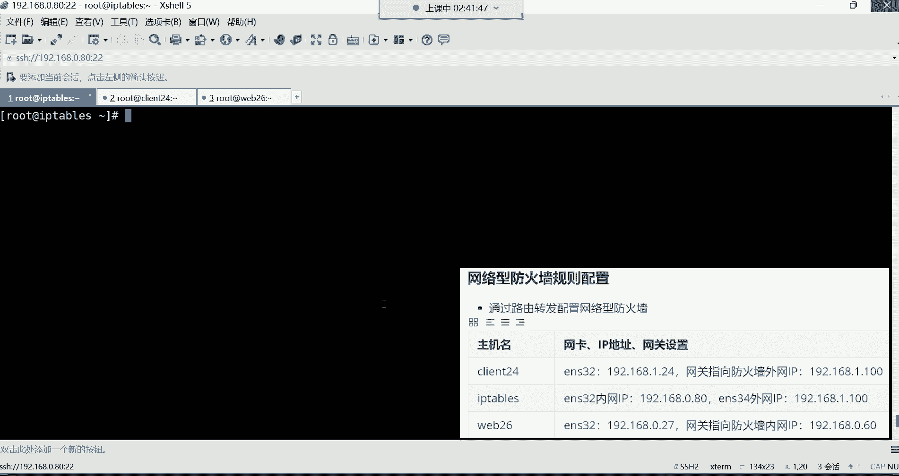
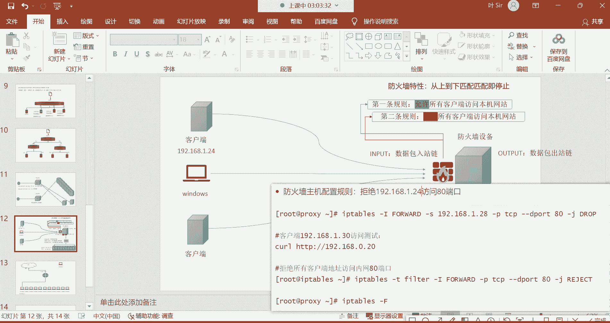

# 零基础入门Linux，红帽认证全套教程！Linux运维工程师的升职加薪宝典！RHCSA+RHCE+中级运维+云计算课程大合集！ - P54：红帽RHCE-19.系统安全防护之iptables防火墙 - 广厦千万- - BV1ns4y1r7A2

这是0。80，这是内部的哈。哎，内部的。就放这吧哈。放当是内。把这几个呢往下挪一弄。我靠，蒋个他妈防火墙，这个主要是这个环境的准备啊特别的麻烦。这个外网网卡呢，咱么让它是一网段的？1点多少呢？

随便哈100。对只要是一个不存在的IP地址就可以。外网卡外网网卡接收用户请求。我说挪一挪。好。然后那先把这个外网网卡的IP地址给它配出来吧，是不是啊？然后呢。

在这儿。

怎么配IP呢？嗯最简单的方法哈。😊。

最简单的方法有一条命令啊，前面没有讲过，叫NMTY叫修改网卡IP地址的。它这个交互式的修改哈啊，为什么要用用为什么要用这个命令修改呢？你说。😊。

那么前边那个学过的命令去改它配置文件不就行了吗？ETC。This is confi night work。杠4qui，我跟你讲啊，我们刚刚添加的那块网卡。没有配置文件。没有网卡配置文件的。

你看这里面只有1个ENS326号网卡的配置文件，而那个ENS34呢没有。但是没有配置文件，你这网卡配完以后，这IP地址是临时的。😡。

能理解吧？所以说咱们用这条命令呢可以干嘛呢？可以。😊，直接呀配完IP以后呢，它给我们生成一个配置文件啊，NMTY所以这点直接敲哈NMTY。😊。

回车，你看这玩意就比较有意思，是不是啊？什么呢？是一个交互式的哈，先选什么呢？先选这个。😊，编辑链接。啊，回车。然后。为啥没有配置文件哈？嗯，因为它不会自动给你生成配置文件的，得需要你自己去干嘛呢？

自己去，要不你就拷贝那个ES32网卡的配置文件去改一改也行，改改不改吧也行。但是没有必要哈，就直接用这种方法非常快啊啊有线链接注意啊，我们添加完以后，你看那个网卡名字叫有线链接一。

所以呢你要选择在有线链接一的位置回车。接下来呢名字要改成ENS334，要跟我们那个网卡名要保持一致。设备呢是它的一个什么呢一个那个麦克地址，这不用改哈。然后下边选择。😊，一直往下这个按你的键盘下降。

一直往下滑，然后IPV4的配置。😊，不要自动的哈，我们要回车。😊，选择什么呢？手动配个IP，然后回车好了，手动然后右边显示回车显示什么呢？就是我要给他配个IP了，然后下边往往下选择添加个IP地址。

然后地址的话呢，选择添加回车地址多少呢？192。168。1。100。😊，啊，1点10哈，那这个地址的话呢，有网关吗？不需要网关。😊，注意，他不需要网关哈。为什么不需要网关呢？因为外网网卡。😡，正常来讲。

万网网卡是不需要网关的。😡，能理解吧？那那咱互联网当中是有他自己的路由的，所以这边你不用管。嗯。看到吗？外网网卡哈，这位置。😊，所以直接往下滑滑滑滑。一直往下滑哈。😊，一直划到最后先确定OK。看了吧？

ENS34，然后再往右边滑，然后下下下返回回车OK然后再下下下下下右确定。

好了，IP配好了。IP配好以后呢。😊。

来看哈IPAS。这个等会儿我们这个重启一下网络哈。Let work。IPIS。这个网卡就出来了，看到了吗？ENS34这块网卡192。168。1。100这个IP地址，然后我们再干嘛呢？

再看ETC six configurefinwork杠的路径。那这时候就多出了1个ENS34这块网卡的配置文件了呀。啊那以后这个IP就。也有配置文件了，就永久生效了哈。OK嗯，怎么有的图形界面？😊，嗯。

那条命令那条那条命令的程序就带一个小交互式的图形。啊，所以这个才就有那个图形了哈。😊，对，这条命令哈。

那配好之后呢。下边我们第二台机器网站服务器。呃，网站服务器的话呢，我们是这样子的啊。😊，外b20。6。

网关指向谁呢？他好，Y826。呃，这个机器呢我们要。把它的网关指向这个外网网。卡的IP地址。这个等会儿等等会不不这哈这个。😊，防火墙的内网网卡IP哈，不要指外网网卡IP啊。呃，为什么要指定它的这个。

80呢？因为他们在同一个网段嘛。

能列吧，他们在同一个网段哈。ETC configurefi。netightwork刚quipped。ifCFGES32网关直接指向192。168点。0。80。保存推出。重信网络。路易斯达哈。好了呃。

指完以后呢。😊。

然后。我看一下哈。Y826。0。26网关指向防火墙的内网IP0。80。啊，那在这个图里边。我们这个。192。168点0。26。然后。他的网关。网关。192。168。0。80。本金。Y826。Okay。

然后这个客户端就那个cllan哈客户端。啊，他的网关指向谁了呢？指向了一个防火墙的内网网卡，是不是为什么呢？因为他们得在同一个网段啊，你像这内部网卡跟你的内部服务器是不是都在同一个网段啊啊。

所以说你直接把你的网关指向他防火墙设备就可以了。到时候他们俩直接不就通信了嘛，是因为咱们没有路由器哈，咱们没有这个路由器，所以咱们只是模拟一下哈啊，所以就直接让他们俩能够直接通信就可以。😊。

在同一个网络。好然，下边这个客户端，客户端的话呢，咱们IP也得改。Yeah。客户端给它改成多少呢？11点24IP地址换成11。24。

只要是把这个IP地址呢给它改成不要跟谁呢？不要跟你的这个内部的服务器在同一个网段就可以了。要让你这个要让这个客户端IP直接能够跟什么呢？跟这个外部的网络能够通信。

所以呢咱们模拟直接让这个IP跟外部网络直接通信。然后呢，那你像这个外部的客户端，是不是就直接他的请求到达了外网网卡呀，是不是？😊，啊，到达外网网卡以后呢，然后再通过防火墙的内网网卡0。

80把请求转给谁呀，转给你企业内部的这个0。26，这不就是一个什么呢哎。外部网络访问你防火墙设备的外网网卡，然后呢，请求通过内网网卡转到你企业内部的服务器。OK然后接接下来呢我们就。😊，来开始。配置哈。

兰4IP地址ETCC4finet work杠的 ifFES32打开以后呢，IP地址直接改成多少呢？1。24，把这个零直接给它换成一。那网关呢是不是也得改呀？改成多少呢？网网关改成。11点100。

不然他们两个没有办法通信哈，所以网关只要防火墙的外网IP啊，我们就是模拟一下他们2个IP地址，可以直接什么呢？直接通信哈，在同一个网络。😊，好，保存这种重启网络。这一重启网络肯定就断了哈。😊。

O。那这块重启网络我这边就断了哈，然后这边我可以从这儿直接通过图形界面连进去。

图形界面登录。这是第几节课了，这这个哎呦这都第。第十六节了吧。如果我没记错哈。这是上一个班哈，这是上一个班。啊，刚入学的是吧？嗯，刚入学的呃先不用急着跟今天这个课啊，因为今天这个课你现在跟不上。

等这个这个班结束以后呢，跟下一个班哈，下一个班新班从零开始讲15是吗？我也忘了我也忘了到底是15还是16了。

王建哈王建先不用急哈。😊，你们这边你听你听不懂。开终端。还有多少节课呀？呃，把我们这个把我们这个笔记里的这些东西讲完以后就完事了哈。具体几节课我也我也不是很确定，总之得讲完。😊，这边看IP哈。

你看他的IP是是多少啊，是不是192。168。1。24啊，没错吧，那这时候IP规划好了以后呢，我们现在在这个图里边。

就是这就是这个样子哈就是这样子，就是客户端，是不是啊跟我们这个防火箱的外部网络，他们是可以通信的。

客户端哈。然后呢，客户端呢，它的请求啊是由外网接收。接受以后呢，那。页面在哪放着呢？页面啊是在这个哈我们的内部网站服务器里面放着呢。然后呢，到时候我们要通过防火墙的forword链，叫数据转发链。

把这个请求从外部网络，然后呢再转到内部网络，再通过内部网络转到我的内部服务器去，是这么回事哈，能理解吧？😊。

呃，怎么临时修改IP地址，用if康fi就可以了哈。百度一下if康fi后边GI直接跟上网卡名IP就可以改。😊，好，那现在因为没有人没有谁会去临时改IP的，除非他妈的这个。😡。

糊弄人啊就会临时给IP。好，接下来呢咱们就开始去做这个实验吧。我们要在这个。要在这个机器去安装一个外b服务哈，第二台服务器。

这个机器啊用y杠外in套安装1个HTTPD。然后这个防火墙那个HTVD就不用了关掉哈。😊，因为防火墙咱们是只接受请求了，所以把HCDPD停掉。Yeah。OK然后安装好以后呢，直接呢改它的页面哈。

通过ic命令ic1个web26。

Y边6跟主席名同名。好吧。

在这哈跟主机名同名。

把这个Y86给它。重定向到va下的3W的HTM下边，然后放到index点Ht mail文件里面去。好，看这个文件OK那现在呢这个Y826啊，这个网站，也就说我们起的内部的这个网站服务器。

现在我们也部署好了啊，网站也起来了。那接下来呢我看它的防火墙哈。😊。

他就不开防火墙了哈，因为内部服务器嘛都不开防火墙，因为你已经外部有防火墙了。😊。

好，接下来这个就完事了。那现在第三台客户端。呃。嗯。IP修改为一点。24。网关第二款网卡01。1版。O。访问测试，现在我们要访问测试了哈，访问谁呢？我们现在这个客户端。😊，这个客户端他要访问谁呀？

要访问。192。168。0。26回车。等会儿啊。没有反过去呢。看我的规划是不是哪块儿。配的不对呀。外边的网关指将网关指向。

0。80。啊，这是0。26。0。80。

没有问题。我看他的IP啊。

嗯，拒绝连接。哦。啊，把规则清空一下哈。你看这个由于我们是前面这个重启了机器，所以你看这里面有好有很多的规则，看到了吧？有很多规则清空一下。

这都给他清空啊，清空以后这边再访问。再试试哈。

嗯。我要看他的IP地址啊，我我我觉得他的IP有点问题。不han。

我看下IP哈，我看下这个IP地址。这个环境准备的IP是最容易。蒙的。1。24。网关1点10。嗯，没问题。我先拼一下啊，等一下哈。😊，不就是因为它不在同一个网段哈，我们现在要的效果就是这效果。你看。😊。

他跟他不在同一个网段，但是我就想去直接访问。他。

好哈，这样直接发问的哈。😊，菲尔沃是不是开着呢，等会儿啊。我看一下啊。都是允许的。嗯，那就没问题了。

能行哈能行。192。168。0。26啊，能拼通，你们看到吗？是能拼通的哈，虽然说不在同一个网段，但是它它是它是能通的哈，能通的。

哼能通是不是就能访问呢？😊。

所以这时候。访问哈。能通了。

啊，哎。这个26这个机器有点问题呀。

嗯。

我捋一捋哈，让让我捋一捋哈，我看看这个1点1百。然后。新192的168点1点24。好，能拼通OK然后拼192。168。0。26啊，也能拼通OK然后外86拼192点168。0点。21点24啊，也能拼通啊。

但是网站现在不能访问是吧？

嗯。等一下啊。能通啊，他们能通哈，注意哈。

能通，然后对网站不能访问。外b26。

哎，这这让我有些。哼让我有些这个。😊。

这网站难道没起吗？是我是我是不是没起服务啊啊。😡，说媒企服务啊。

看一下啊，哎呦你看。嗯这他妈没起服务啊，那起来就能防得到，是不是啊你说咱们说这个妈的大风大浪都折腾过来了，在小阴沟里翻船了，是吧？😊，是不是不是看到了。哎，这效果你看哈，我们现在访的是谁呢？在这图里边。

我们一个客户端，这个地址是一这个网络地址的。但是呢它跟这个你的网站服务器正常来讲，它都不在同一个网络。没错吧，没在没在同一个网络吧，但是你们想一想没在同一个网络。你说这怎这请求怎么进去的呢？😊，嗯。

这请求就是。转进去了。转发进去了。啊，转发进去了，谁转发的呢？防火墙转发进去？其实我这个请求是先由防火墙的这个外网网卡接收的。接收以后呢，然后呢，这个请求是由外网网卡转给了内网网卡。

然后把请求转给了我的内部服务器。所以我就能够直接能够从这儿直接访问他看到它的页面。啊，但是在企业里面呢这一步得需要通过域名访问哈。😊，通过域名的话，这种东西经过域名解析，你就不用管了。嗯。确实没配啥。

为啥还能转发，我们还没配啥吗？我我我们配了好多，我们开启了在防火墙设备，开启了路由转发功能。然后呢呃啊其实你要这么说也对，确实没配啥哈，确实没配啥。

就开启一个路由转发然后剩下呢把IP地址呢做了一个规划啊，那在企业里面其实还是怎么说呢？很省事哈。在企业里面这个外网卡这种东西你不你不需要去准备客户端了。😊，嗯，你只要配的防火墙设备就可以了。

开启一个螺转发就可以了。嗯，那这个我们现在要什么呢？我们要配规则哈，我们这个实验做完以后，咱们要配规则，防火墙主机要限制它请求了。现在。

我现在要配规则哈，怎么配呢？你看现在我要实现的一个效果就是。😊，我要拒绝那个客户端访问我的网站。嗯，我要拒绝客户端，也就是说正常来讲，它是可以访问到我的网站的，是吧？我现在要在防火墙主机配规则。

拒绝他，我就不给他转发请求了。啊，那这个时候。😡，看哈怎么配？

放在这儿。这时候这规则注意要配在哪要配在哪个链，forword的链里边了。所以这时候就IP啊，别配错哈，在这儿。给他这个机器。IP tables，然后呢直接杠大I后边。for卧的链儿。配合规则规则呢。

如果我们只想拒绝某1个IP的话，就直接杠S指定原IP192。168。0。24。啊，sorry哈，1。24。啊，这个I这个IP地址，如果他通过PCP协议。访问我的目标80的时候，杠杠低port。

访问80的时候干嘛呢？我就杠这给你。拒绝掉。好了，配好了，然后看规则哈。😊，那你看现在在这个forword链里边，这条规则是不是我们就针对于这个IP地址，谁呀？就那个客户端哈。然后呢他访问我。😊。

所有网卡的时候。这时候呢，而且是通过TCP协议访问的话，那咱们就给他拒绝掉。主要是针对于80的哈，所有地址的80的时候，咱就给你拒绝。那这时候如果他再访问的话，咱看效果哈。😊。

看效果。回撤拒绝连接，看是不是哎，这规则你发现我们在哪配的呀？在防火墙主机，防火墙设备咱们配了一条规则，而且是在哪个链儿否卧的转发链。😊，是不是我们把这个规则是不配到这个forword的转发链里面了呀。

那所以这个效果就是当这个客户端它的请求想访问我这个网站的时候，这时候我防火墙先接入请求。但是呢我防火墙一看，哎这个数据包。😊，访问我的这个内部的80干嘛呢？这是不是就匹配上了呀。

匹配上以后我就给你什么呢？拒绝掉。😡，这叫什么防火墙？网络型防火墙，保护我企业内部服务器的。那你看他的请求是不是就访问不到我企业内部的网站了呀？😡，没错吧啊，适合集群环境。O。啊，这就是。啊。

就是把一台服务器。对对对哈，就是把这一台服务器当成了一个路由器来用了。😊，对呀，他就是用来实现转发的这否则，你看它不就是数据包转发的链嘛，是不是前面给你们讲过哈，数据包转发链。😊。

说白了你这个请求来了以后，咱在否的那里面是不是有一条规则，规则是什么呀？😡，拒绝拒绝访问80，那我就不给你转发了呗，是吧？也就说。😡，你请求到达我未网网卡的时候，这直接就拦截了。我不给你往内转发。

不往内转发，你这请求就进不去。😡，是不是啊？所以你看那到时我们在这看到效果就是拒绝链接了。是是放不进去了。这不叫网络防火墙吗，是不是？那下边的话呢，我们还可以等会儿啊，我看哈。😊，嗯。

这是拒绝所有扣端啊，这就别所有了哈就别所有了哈。一般这种需求用不到哈，我们一般都是拒绝某一个人哈，很少拒绝所有。如果你想拒绝所有的话也行。😊，就这些不用指定IP呗，是不是你如果不指定IP的话。

那不就代表所有了吗？😡，啊，所以这个的话呢几乎用不到哈，知道一下就行。然后下面还有一些防火墙扩展给大家讲讲。那防火墙扩展的话就是讲的它的一些模块哈。在这里边呢，对于模块来讲呢。

呃就是第一个呃叫做什么模块呢？就是m克地址的模块。😊，麦克地址的模块，我们为什么要讲这种麦克地址的模块呢？就是可以通过IP地址去单独拒绝这个客户端。你看我们假设这个客户端。😊，现在呢我们配个规则。

不让他访问，是不是？啊，对，for卧的那就是路由。就是转发吧。对，就是路由功能。😡，呃，你看这个客户端哈，它现在通过这个IP的话呢，可以被我给拒绝掉了是吧？那如果他换个IP怎么办呢？

换个IP看我们干嘛呢？把IP地址改一改。😊，ETC configurefinetwork杠qui ifCFGES32，咱们把它IP给它改成1点。多少呢？随便换1个1点25，这个IP没有用哈。

1点25保存退出。重启网络。啊，瑞死他。Nework。重启了。看IP哈。你看我们当前的IP是不是变成192。168点11点25了呀？没错吧，那他现在换个IP能访问吗？哎，你发现换个IP能访问了。

又能看到页面了。😊，那也时候如果客户端哎，你说你把我以前的IP地址给我拒了，我换个IP地址呢。😡，换个IP地址。啊，换个IP地址，原形的IP那是不是就不会被我的这个防火枪规则所匹配呀？没错啊。

因为我们这个规则是就是针针对于那个原先那个24IP的，但是人家换IP了，换IP你发现没有匹配到怎么办？按默认规则处理了吧，放行了，是不是？那怎么办呢？哎。

所以有的时候啊你可以通过I麦克地址哈通过麦克地址去限制对方的访问麦克地址，说白了是针对什么针对网卡的。😊。

注意啊，麦克地址是针对于网卡的。你想对呀，物理地址嘛，一你一个网卡上面你的IP再怎么改，你的物理地址不会变吧，是不是？所以你IP怎么改无所谓。我针对于是你的物理地址一限制。😡，你怎么换也没用，是不是啊？

但是问题来了，我怎么才能获取到他的m克地址啊？😊，啊，其实也能改是吧啊，确实能改哈。😊，那咱们说一说我怎么我怎么能获取到他m克地址。所以这时候有一个工具哈，就是这个叫N map。😊，嗯。

安装N麦可扫描对方的IP的麦克地址。

所以这时候。咱们在防火墙设备哈，ym杠外因此它N map。啊，对，除非你再买块网卡。😊，安装好了以后呢。那咱们就开始扫描，那就怎么扫描呢？就摁m。😊，跟上192。168点1点多少呢？

25扫描这个IP地址。好，扫描出来了吧，可以扫描哪些东西呢？啊，我们主要是看这一行就可以了。m克啊m克 addressdress麦地址，这是他的m克地址。😊，看到吗？好，扫描的。还可以扫描到这个机器。

它开启了哪些端口，看到吗？22号端口，然后SSH的22端口。然后接下来当还有这个host的is up，就那个主机当前的状态是up的状态，看到了吗？然后还有它的IP地址，是不是啊？

那先来我们主要就是说这个麦克地址哈，有了麦克地址了。😊，对。不IP地址扫描哈。不开放火墙，你也能扫。能扫哈。那接下来呢我们就怎么限制呢？哎，这就。😊。

来说一说哈这条命令有些长哈啊，我就直接给你们复制过来啊，这这种命令你们也不可能去背它，为什么呢？因为这种东西。😊。

太长了哈太长了，这命令没有人去背它哈。然后你只需要干嘛呢？只需要把这个麦克地址换一下就行了。把这个麦克地址拿过来。😊，然后把这里的麦克地址换掉。换成这个。然后咱们说一说哈。😊，这条命令的格式呃。

首先呢我们是针对于这个forward料配的规则，是不是啊？然后指定。😊，TCP协议，然后端口是80的。但是呢注意哈。我们这时候要用杠M杠M呢是调用IP tape的模块，哪个模块呢？mike模块啊。

这个模块你可以通过杠杠m克 source指定原m克 source不是原的意思吗？啊，原m地址是这个地址的。

干嘛呢？我就给你拒绝掉哎，回车。那这个时候。他即便再怎么换IP访问都没用了。能理解吧，他现在再怎么换。都不行了哈，为什么物理地址？😊。

咱们现在针对的是物理地址。你看吧，现在m克地址是这个地址的，我就给你reject拒绝掉。所以现在我管你的IP是多少呢？是吧？只要这个物理地址跟我匹配上了。好，那你就甭想访问我。

所以这种是不是可以达到一个真正的把这个客户端给它拒掉了呀？没错吧。好。行了，那。😊，然后。这是防火墙的一个扩展哈。然后下边呢还有这个。😊，叫做基于多端口的设置。嗯，SNAT共享上网讲完吧哈。😊。

我们把这IPT讲完，那个基于多端口的设置过滤规则，什么意思呢？就是比如说我这个一个服务器，哎呀，我有很多个端口。😊，啊，或者说我我针对的是什么呢？不一定非得是网站了哈。这时候。😊，啊。

我我有一部分是网站，有一部分是别的服务，哪个服务呢？比如说我的其他的什么数据库啊等等等哈。😊，就假设哈。数据库。OK。OK这是数据库。对齐哈，然后这图我到时候今天课后呢，我给你们发到这个网盘上面哈。

然后你们这个实验环境如果不明白，到时候按照这个图去配哈。😊，可以哈可以扫描哈，扫描。😊，好，那下边呢我们那个来说一说哈，比如说我现在你看这个集群里边啊又有网站，又有数据库，还有什么呢？

还有这个FTP服FTP是做这个文件共享的哈。😊，FTP啊，就类似于百度网盘的FTP服务。那你看那现在我想干嘛呢？我想就是。同时啊。拒绝客户端不能访问我的这些服务怎么办呢？所以说你可以叫基于多端口去匹配。

这东西怎么玩呢？看一下哈。😊，拿过来哈。这也也是调用防火墙的那个扩展模块哈，把这命令拿过来，我不敲了，这命太长哈，你们什么时候用，你知道改哪儿就可以了，知道吧？改哪个地方你就知道就可以。😊。

我觉得我的我的电脑现在特别的卡。

来看一下哈。啊，是这样子的啊，你看我们现在呢是比如针对于这个客户端啊，我们配的一个转发链，是不是啊？然后指定如果这些人呢通过TCP协议。😊，防问什么呢？看啊杠M。调用模块了。

哪个模块呢叫mtyport这个模块。😊，这个myport你可以干嘛呢？同时指定多个端口。😡，比如杠杠低炮的指定，这是目标端口吧。目标目标端口你可以指定很多个啊，比如说2021。

那是我的FTP服务80是我的网站服务，43呃，是我的这个什么呢？是我的加密网站服务。你再来一个，比如逗号隔开什么3306看306啊，针对于这些服务，比如说我到底是允许还是拒绝。😊，啊。

如果你说accept就是允许啊，如果你说我不希望别人可以访问，那你就。拒体拒绝呗，是不是？看你自己呗操作。能理解吧啊，这辈子能理解我说意思吧，所以你需要。😡，改的地方。就是这儿端口。

在企业里边你需要比如说我针对这些端口做什么操作是吧？端口就是看你自己了，是不是，然后剩下操作就看情况呗，能力是吧？那多端口看一下。那你看现在是不是我这一条命令？拒绝了哪些端口呢？

2021网站的80加密网站443，还有3306。对，看需求哈。对，可有可无啊，这种东西可有可无。

OK然后还有可以根据IP地址的范围。IP范围哎呦这IP范围怎么玩的呢？来看一下哈。😊，这都都属于扩一些扩展功能。你看啊这时候比如说我想单独拒绝某一个。

什么呢？范围内的IP地址，比如说看哈192。168点1点20一直多少呢？一直到1点30。这10个IP地址注意哈，连续的10个IP我都然给它拒绝掉。那这时候怎么办呢？这时候你要叫IPrange这个模块啊。

杠杠SRRC叫原。原IP啊就是就原范围哈原范围原范围是多少呢？192。168。1。201直到30，这10个IP地址我就给你拒绝掉。你再看。那是不是这个范围就是这个范围的IP以后再访问。

是不是都按照规则去处理了呀？没错吧。啊，所以后边是什么？后边都是防火墙的一些扩展。😊，能力吧，都是它的一些扩展哈。

好了呃，所以后期有这种需求就看呗，是不是啊？就这些扩展就可有可无了哈，看需求了哈啊但是你知道它知道这些功能哈OK然后下面还有一个共享上网的功能，这个共享上网呢，就是我们前面给大家讲了。

就是在企业里面如果有一个需求，什么需求呢？哎，我你企业的内部的这些机器。如果想访问外部的网络，比如想访问百度啊，去什么呢？去刷一些什么视频啊，去网上冲冲浪。但是呢这些这些客户端的机器，你想想。😊。

他们都是私有地址是吧？插上你们公司的网线以后，都是你们公司的私有地址。那私有地址没有办法直接访问百度，那怎么办呢？哎，我跟你讲，我们这个防火墙设备可以帮你干嘛呢？完成这个功能。

让这些私有地址转换成一个防火墙上的那个公有地址去访问互联网。😊，就比如一个。😡，叫做SNAT吗？啊，原地址转换，谁是原？现在你想访问外网。外部网络是你的目标，你就是圆了是吧？

所以他把我们的原地址转换成什么呢？哎，转换成这个地址。啊，对，这时候其实这活就是晚工干的，晚工干的嘛，没错哈。😊，但是呢我们对防火枪也能实现这个功能是吧？咱们如果需要的话呢，啊我们来做个实验哈。

也是把这个规划搞一搞哈呃内部主机。😊，内部主机外。咱们现在外部主机是外部26，那防火墙设备叫IP table。然后内部主机叫什么呢？叫。clant24。1点20。哎呦IP是25了吧啊，25哈。

25、我们改IP了。对吧嗯那这个机器就不用管了吧，内部主机就它呗。😡。

是不是？

就他哈。登录一下。他的IP是不是就是这个。你看是不是就是这个1点25啊，那他的IP不用动了，在这。不用动了哈，1点25。然后那对于IPT防火墙呢，这个呢我们。IP的话呢是80。好，80。

那这个IP呢也不用动，只不过现在呢我们换了一个角色，什么角色呢？咱们把这个ENS32这个网卡充当了外网网外网的网卡了。然后那个ENS34呢，这个E网段的IP充当什么呢？我的内部的。网络了，为什么呢？

是吧？这个机器作为我的内部主机。就他。就它哈我们的内部主机IP地址。😊，多少呢？是1点25。1点25号。就是候它变成内部网络了主机名。clant25。然后呢，他想访问外网，他想访问外网怎么办呢？这时候。

拿过来哈。我们。给它转换成IP table。的那个零网段的地址。0点多少呢？80。去访问外部的网络。所以在这做1个SNET。I这是外部网络哈。😊，外网。一址。就。放到这儿吧哈，行，就放这儿吧。OK吧。

放这儿。😊，好，然后那他内部地址。IPT不的。内网地址我们给他改成多少呢？哎，一这个网段少的。10是不是你看一这个网段的跟咱们的那个内部服务器在同一个网段，是不是？那他们是不是可以相互通信呢？😊。

没什么问题吧。但是呢你想。他想访问外网，那外网的话呢，得需要这个外网的地址。所以这时候呢咱们就干嘛呢？让这个地址直接转换成这个外部的地址去访问外网，这不就调个个嘛？其实说白了是不是啊？

所以这个网卡就给他调了一个角色哈。1点1000。80啊，这是外部主机。嗯，外部26。网关啊网关是。0点。80。网关就是外网网卡的网关哈0。80。保存一下。好了，那其实呢。😊，现在不需要做任何的配置哈。

因为这个IP地址我们不用动哈，所以只是换个角色而已。现在就是。😊。

它变成内部机器了。然后呢，它变成外部的机器了。Y86现在我们想。我先把规则清掉哈，把IPT规则都给它清掉。😊，呃。

好，听功以后呢，咱们说这个规则怎么配哈？😊，这个时候我们要这个把这个规则配在NAT那个表里面，注意啊，配在NAT表里边，实现1。2。18。1点。20。啊，那是二十几了，二十4哈啊25啊转换成0。80。

0。80。这命令格式拿过来给你们解读一下。2。呃，1。0。这个网段的。80。法庭。

好，明令拿过来解读一下啊。

好，来看一下啊。现在呢我们配置的这个表，现在是NET表了，杠T指定NET表了。然后这时候规则。配在NET的哪个链啊？啊，叫原地址转换。那个链儿啊，pos的rooting那个链哈就是这个。

路由后规则的那个链儿，路由后的链哈。在NAT里边。有一个pose的routing，是不是啊呃，poserooting在这儿呢。就是用于处理即将离开本机的数据包，这不就路由后嘛？是不是啊然后呢。

路路由后呢，他把我们的地址给它转换了一下，叫做SNAT啊，那这个时候我们就说一下这个命令格式，在这个里边。

首先呢先用杠S指定我们要转换的地址是哪个地址，那这就是私有地址了哈。然后我们指定的这接是整个网段了。比方说哎如果我们有这种需求啊，我企业内部的这些机器都需要转换，那咱们就直接干嘛呢？😊。

搞成一个网段啊，一整个网段的地址。如果他们想访问外网的话，咱们呢啊而且是通过TCP协议去访问的话，那我就杠G叫SNET给你做一个什么呢？叫做原地址转换，就把这个原地址。转换成什么呀？啊。

你看杠杠to south。转换成这个192。18。0。80这个地址，这就做了一个转换。那该说是把我们的企业内部的这个地直接转换成这个0。80这个外网地址去访问百度去。这个命令解读清楚了吧。

所以这时候拿过来。

走你配好了。IPT。这时候杠T指定NAT这个表好。呃，NA。posro在这哈看到了吗？在这里边你看看这是不是有个SNAT啊，你看SNAT就是192。18。1。0整个网段，他们通过TCP协议干嘛呢？😊。

访问目标任何地址的时候，我给你突转换成我的这个0。80这个地址。那这时候我们怎么测试啊？

正好。呃，我们要用那个clant那个机器啊，内部的机器。呃，那是他妈的这个地址怎么这么乱呢？这是25返问网站哈。😊，比说现在。他去访问谁呢？访问。192。168。0。26。回车。可以看到这个26的页面。

是不是？但你想想他跟那个26在一个网段吗？嗯。这是1点25那个呢。😡，是。192点168。0。26。他们在一个网段吗？不在同一个网段吧。😡，所以谁去访问的呢？最终。他去访问的这个地址是去访问的。

你说我怎么知道啊，看一下日志哈，这里边。😊，呃，动态查看阿帕奇的访问日志，在mararch的logHTTBD下边有个access点log。

所以我们这个Y826。看一下有哪些人访问过我。直接tell哈。杠F啊，你就直接看吧哈，我们直接看它。呃，Y下的3Y下的log。然后HTTPD下边。AS logo。谁访问过我呢？0。80访问过我。哎。

你看这地址有点意思吧，0。80在什么时间是不是啊？然后呢，get请求通过HTTP1。1的这个版本访问过我，是不是啊，而且还访问成功了，200状态码，这东西后后期都都会讲到哈，你们先不用管。

你就知道这个地址访问过这个机器。😊。

这个地址防护这个机器啊，那就说。但是我们是。用防火枪设备直接去访问的吗？不是吧，我们是用我企业内部的这个机器。😡，是不是哎这些机器去访问的那个0。26。

但是最终我我们看到的那个我们在这个26那个机器里面看到那个访问日志是哪个IP啊，这个IP。这不就是直接做了一个原地址的转换吗？是不是把这个地址转换成这IP，然后呢去访问外部网络。是这么回事哈。嗯。

像一个代理吗？类似吧类似吧，反正就是转反正就是转发请求的。好了，最后补充一下所有IP tipss的规则都是临时的哈。如果要永久保存规则，执行下面命令sIPts杠C5。😊。

在这哈。IIP tables。然后。啊，sorry哈s。IPT不4。C5好了。规则保存到哪里了呢？保存到这个路径下的这个文件里面去了。所以以后你想改规则。打开这个录径下的这个文件。好。

这就是我们IP table里面的规则，看man购表的规则，man购表里面的几个链看到了吗？这些链哈这是它的链儿。😊，但是没有规则哈，只有这个pos的入ing，这里面有有一个哈，下面NAT表NAT表里边。

😊，这这几个链啊吧哪个链里面有规则看到了吗？pos入程这个链有规则，然后下边faelt表，felt表里面没有规则。没了，后期想删，直接从文件里面删就可以了。😊，能理解吧。或者说你直接把这文件给它干掉。

😡，注意哈。对。啊，这命令也是永也是永久保存的吗？呃，ETCC嗯。不是不是哈，你那条。我我没用过那条命令啊，我不是很确定哈。😊，所以以后如果你说哎呀我这些这个规则，我就不希望永久保存了。

把这文件直接干掉就可以了。把这文件一删就可以了哈。😊，2M杠2F。13。啊，规则一清空。那，杠TNAT清空啊，全部清空。清空。清空好了，那这个。又没了又恢复到了我们最初的状态，是吧是？好了哈。

以上就是IP tables防火墙啊，然后你看我们这安全防护防火墙里面讲的东西还是蛮多的，是不是？😊。

后期呢多多去敲哈，多多练这些命令的话呢，不需要大家一次性都能记得住啊。因为这种东西我告诉你啊，就是哎呀。😊，呃，什么时候用的话，那什么时候翻翻笔记吧，谁可能都能记得住我。我时间长不用，我也忘。嗯。发好。

我到时候上传网到把这个笔记上传到网盘里边哈。😊，嗯，0。26。上传到网盘哈，然后这个root web26对。感觉这么乱。IP tables主机名上。好了，看有什么问题吗？防火墙讲完了。

然后有什么问题可以发出来啊。😊，给你们。留几分钟时间。没有没有问题的话，我们休息一会儿。あですば。26。休息啊休息休息。没下课呢哈哎呦。5点多了。5点多了。哎呦。那不行就下课吧哈。

我们今儿可能也讲不了太多了，我看。等会儿哈，我看一下哈，你别着急哈。😊，我这我得把这个笔记给你们。归弄一下哈。嗯。不想客吗？5点半了，是不是到点了是吧？客服的。😊，呵。等会儿。那个。

如果我们这周课结不了的话，我会在。那个什么时候呢？我会在差不多周二的晚上吧哈，然后给大家加一节课。😊，然后尽量不影响下一个班的开班啊啊，因为剩下这些内容的话呢，其实呃讲起来也就快了哈，讲起来也就快了。

😊，看情况啊看情况。不是今晚哈礼是礼拜二哈，下周二下周二啊，不是今晚。😊，老板。不是今天晚上，所以你们别怕。啊。

H ha。😊。

行，今天就到这儿吧，我把录屏听一下哈。

