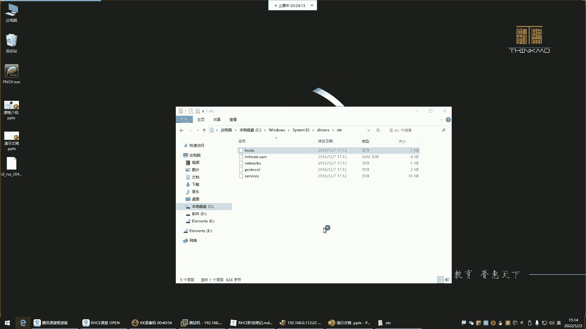

# 零基础入门Linux，红帽认证全套教程！Linux运维工程师的升职加薪宝典！RHCSA+RHCE+中级运维+云计算课程大合集！ - P55：红帽RHCE-20.用户提权与OpenSSH安全 - 广厦千万- - BV1ns4y1r7A2

喂喂喂喂喂好OK。那我们就开始哈开始继续。那前面呢是实现了什么呢？实现了这个相同系统之间的一个me钥认证。注意啊，这种是linux与linux之间的这种密钥认证方式。

那接下来呢接下来我们要实现windows与linux之间的一种认证方式。那这种的话怎么认证啊？

我们平时用windows跟这个linux之间，如果你想认证啊，得通过叉这种工具来实现。

插票这个工具啊，它本身呢你看在工具里面工具，然后有很多功能是吧？什么发送发送件书到所有规划，然后这玩意儿怎么玩的呢？就是。你看你点这个点一下，你发现他这有提示说什么发送键盘输入所有回话。

那也就说我再把这终端给大家展示一下啊，叫水平排列。那现在我清个屏，你们注意看我清屏了。哎，你发现这个是我在我的上面这个终端清的屏，他们是两台机器哈。😊，我敲到L，你发现哎，下边也同步看到了吗？也同步了。

这是什么意思呢？就是这种啊叫做你在任何一个终端去敲命令，其他终端啊也都同步啊，这种是一个终端可以对很多个终端去执行命令啊。但这种事呃前提是你的所有操作得需要是在这些主机同时执行。

就是这些主机执行相同命令的时候，哎，你才可以这样玩。这个知道一下啊工具再取消掉哈。然后这个呢不是我们今天主要讲的哈，再给它合并一下，合并所有选项。😊，我们主要讲什么？我们主要讲这里面有个叫做。呃。

用户密钥管理者啊，还有下边什么新建用户密钥生成向导之类的。我我们注意啊，在这里边有一个主机密钥管理者，在这里面可以看到我们当前这个主机有哪些密钥看到？这是我曾经生成的啊，当然这些密钥是跟谁的呢？

这密钥就是跟我这个经常连接的这些机器的密钥，看到吗？就是首次连接的时候，它会有一个认证，你们还记不记得？就是我们先安装好一个机器，首册连接，它有一个那种认证啊，那个认认证就是给你保留下来了啊。

你曾经连过哪些机器啊啊，这是还有什么呢？还有这个下边什么用户密钥管理者，这里边就是如果你跟哪个机器啊，建立过这种密钥认证。那这个时候他会给你保存下来。但他俩不一样哈，这个王理准，你比如说我把哪个删了呢？

我把这个122给他删除，删除了吧，删除以后。我现在呢退出，我再连接这个机器。112号回车，你看他出什么提示呢？他说这个。就出这个提示了哈，什么未知的主机密钥，就是他们俩之间是由于第一次建立链接。

所以说他们之间也有一种这种密钥认证的方式。他问你接受此主机的密钥吗？😊，如果你说接受并保存，他就给你保存起来了。如果一次性接受，它就不保存。如果你经常连这个机器，它每次都会有这个提示，能理解吧啊。

一次性接受就每次都有这个提示。所以说呢你就直接接受保存，保存到哪儿了，就保存到刚刚这个工具里面了啊，所以这时候。嗯，你输入root密码。啊，就可以了。然后他就把那个。刚刚我们的那个密钥放到这里边了。

给你保存下来了。啊，当然这个保怎么没有看到呢？112是吧，这呢哈这112。那。下边这个叫新建用户密钥生城向导，这是什么意思呢？这个我们点击以后看一下哈，就是它就像我们前面在这个主机里面敲的那个命令一样。

敲到哪个命令呢？敲的这个命令SSH杠K帧1样。

生成一个什么喵盾。只不过是插色帮你生成一个妙队。

然后这个妙度的话呢，他也是告诉你了，我的妙钥类型是RS的类型，这是妙钥的算法。然后妙的长度2048位，2000多位的一个妙。其实我们刚刚的也是2000多位，都是2048。然后你点下一步。

这时候呢是2048位，看到吗？正在帮你生成的，然后告诉你公钥队已经生成了，注意也是公钥队已经生成了。然后请单击下一步输入用户密码，下一步。然后这是你的什么呢？你的私要文件。私钥文件。

他问你要不要给这个加个密输入密码吗？不用密码就是空的。下一步。密码是空，那是没错，仍要继续。刚刚是私钥没有设入密码，接来这是公钥公钥的格式谁给你生成的呢？open SSH给你生成的也是一样。

这个公钥要保留下来。保留下来哈。你可以给它保存为文件，放到你的桌面。保留下来。啊，然后接着呢，这儿复制一下，右击复制。为什么要复制呢？你不在这复制也行，你从你的保存的文件里面复制也行。

然后他给你生成了哈，生成以后。😊，注意这个公钥文件要放在哪儿呢？你想跟谁建立免密连接，你就放到哪个主机的公钥文件里边。你比如我想跟这个机器去免密连接。S杠A。VIM。点SH下的公钥文件。IDRSE点。

看到吗？我想跟这个机器建立。免密链接。好，O。进入输入模式，粘贴进去，注意哈，把把我们刚刚那个公钥粘贴到这个对方的公钥文件里面，然后保存退出。保存退出以后以后，我再想连接这个机器看哈。SSH192。

168。0。40回车。用户名root确定密码。对意，现在密码用谁呀？public。这是我的私钥，看到吗？你的私要有密码吗？没有密码啊，确定。啊，这个。啊。确定确定确定。帕布lic克。啊，public。

Pa布licical。哈布勒克在哪儿啊？文件。桌面。public打开。确定。哎。这是我的私钥。这个文件名不太对劲啊。他这个他这个文件的名字不应该叫这个名字。他应该叫这个名字。点SH应该应该叫这个名字哈。

呃，叫这个名字，那怎么办呢？

嗯。改个名儿别改了。改个名也行。那就改个名吧。嗯。或者说咱们再去建一个文件，建一个叫这个名字的文件，然后把它的公钥给它粘进来。VM。在这个路径。路径哈。建一个叫这个名字的文件。建完以后。

把这个公钥给他粘贴进去。刚刚那个公钥在我的桌面。

啊，这是我的私要文件哈。😊。

IDRSRC点pub公钥。不是这个了。嗯。这这公钥一般得保存好啊，你再往回找，你发现。还挺麻烦的。保存好哈。杠A点SADIAC点P。V按M。这个。滴滴删掉保持。好。那这时候再试一试啊。Root。好。

选择public。确定哈。看了。就是这样搞的，怎么搞啊，就是。

这是你的私钥。这是你的私钥哈，私钥是你是你要保留好的。保留好以后，然后呢，他不是给你生成一个，还有一个公钥吗？公钥在这里边用户密钥管理者。

ID2C。看到时候从从这里边找你的公钥就行，把这个公钥复制到哪儿呢？复制到对方的主机的那个，他得必须要叫那个名字。能理解吧，你看他这名字就是认识叫这样名字的这种认证文件。然后你如果没有的话，建一个。

然后把内容给他粘进去就行了。粘进去以后以后再想连这个机器就直接什么呢？直接是不是通过那种密钥文件去连接呀？哎，这位置看懂了吗？这是windows之间哈，windows之间。

这种啊。嗯。什么意思？客户机可以拼通防火墙的内外网卡。内网卡拼不通外网服务器。扣机可以拼通方向的，内内外都可以拼通是吧？内外都可以。品种。罗转发没开。路由转发哈。你的。那可能请求没给你转进去。

看流转发好，这是open SSH就是我们刚刚给大家演示的，就是什么呢？就是这种密钥认证的登录方式，怎么通过密钥去。跟对方建立这种。这种连接好。然后这个open SH啊，它呢还有一个小功能叫SCP。

SCP跟CP1样。CP是什么呢？CP是拷贝文件。把ETC的pasWD拷贝到OPP。啊，那SZB呢也是拷贝文件。他是拷贝给谁呢？看他是叫远程拷贝。他不是本机拷贝了，这种拷贝是在本机之间。

是在你的同一台机器里边。可以进行相互拷贝。而SCB呢是实现不同机器之间的拷贝。比如说我这个机器有一个文件，我想拷贝给这个主机。

那怎么拷虑呀？就得用SCP。SCP指定文件好，我把ETC下载，或者说啊我建一个文件，随便搞个文件哈。😊，touch一个hello。Hello。点TATT我现在想把这个文件给它拷拷贝到SCP。

拷贝root下的hello点TT以root的身份拷贝给谁？192。168。0。112。拷贝到它的哪个路径呢？这个必须要指注意在这位置看啊，我要说把这个文件就直接拷贝给这个主机的话，来回车。啊。

好像没有什么提示是吧？哎，你看怎么没有这文件呢？那拷贝到哪了呢？跟不录。好像也没有是吧。看看。这样的拷贝他没成功。他虽然说没有提示，但是他没成。为什么没成呢？因为你没有指定。

要把那文件拷别到对方的哪个位置，所以英文的冒号非常重要。在指定考贝root目录。他现在入他现在的root目录，你看有那个文件吗？没有吧，这时候你指定root目录回车。哎，如果成了他会有这个提示的百分本。

所以这时候你再看的话。在他的家目中就多了一个hello点铁体了。能理了？但为什么我们拷贝直接这么顺利就拷过去了呢？因为我们做了免密了。免密的话就没有输入密码。如果没有做免密，还得输入对方的密码。

这种叫远程拷贝。那还可以远程拉取。远程拉取，我现在是把我本机的文件拷贝给他了。那我能不能把他的机器里的文件给他拉到我的本机呢？也行。还是SCP。拉到本机的哪个位置置定OPT。

不规一定看。格式。啊，这拉取远程主机这个格式。

🎼开始SCP连谁连以root身份连这个机器，192。168。注意啊，现在远程拉取的话，就是先别指定你本地的那个路径。先指定我要连谁。啊，你要拷贝的话是先指定本地的文件，然后拷贝到这个机器的哪个位置。

OP这个root目录拉取呢就是哎我先连到这个机器指定拉取那个文件，然后再指定拉取到我本地的哪个位置。先指定拉取这个机器的哪个文件，1。2等于68。0。112。

冒号拉取它ETC下的FSTB文件到我本地的OPT。回车拉过来了，看OPT。是不是？拉取过了，这叫远程拉取。所以远程拉取就是你先连上去，然后再指定拉取它的哪个文件，然后再到我的本地的哪个位置。

远程拷贝呢是先指定我要把本地的文件哎拷贝给这个主机的。哪个位置哪个路径，它是这样的。

这要远程拷贝远程拉去。啊，这是一个比较实用的小功能哈，做远程拷贝的。然后下边呢这个提高SSH服务的安全。ISSH这个服务，那怎么提提高它的安全呢？啊，在这里面呢没有什么需要我们改的。

就是需要大家了解一下它的配置文件。前面那个open SSH。他有自己的主配置文件。它的主片文件是在ETC下边。有一个SH的目录。

ETC。SSH目录这目录里边你发现有非常多的文件。看到了吗？但是都是这种什么，都是这种带什么IC的。算法的文件。他之所以能够帮你生成那种认证，都是基于这里的文件给你生成的。

所以这个别动哈别动它的主配文件就是这个SSHD下划线康复。这是它的主片文件，所以打开这个路径的ISSH。D点com，但不是点哈下划线。靠。啊，这个文件的话呢。有哪些东西是？对于我们来讲需要知道的呢。

第一就是它的端口SSH的端口看到吗？默认22在这边。这里边。默认的port端口。

然后我这我记我那边写的哈。如果说你们公司里边说让你改SSC的端口，怎么改，就把这个22改掉就行了，但一般也不用去改它。

然后这个。IP地址。看电。嗯，IP地址。安妮代表所有就所有的IP地址。

记我这里边我写了一写。唉。

拿过来哈找一找。这配置文件一般没有人去记它。

这里边。其实对于这个配文件呢，如果大家后期你们公司里面需要你去对SSH呢做一些这个啊这个一些防控的话，你可以去网上搜一搜搜什么呢搜。

SSHD。康复。配置文件详解。好多人就愿意去翻译这种配置文件，给你翻译的非常的什么呢？非常的清晰。

还没有。啊，在公司当中，由于一些服务器的权限需要进行严格的管控，常常会涉及到关于登录呀、密钥呀一些管理配置。因此，详细了解SSH的配置文件，一些配置项就显得非常重要啊，它的默认的配置文件从这个位置。啊。

可以看啊，配置文件由指令值组成这里边。好了吗？这里面看看他说的对不对啊。

没毛病没毛病哈。没有。IP地址啊列出IP地址。

什么意思呢？指定SSH监听的网络地址，默认监听所有地址，可以使用下面的格式。这里边所以说我们这个你看它监听的地址4个0就代表所有。那上面呢什么意思呢？看不懂是吧？

嗯，上边。好像没写是吧？都差不多。

就是所有地址安你就代表所有。

然后包括那对于我们来讲，我们今天给大家介绍哪些呢？就是对于你们来讲，你们现在这些现在没有必要去深入研究它。你就知道在这个里边呢，很多东西呢是到时候公司用的时候找配文件详解，人家让你怎么改。

你就怎么改就行。😊。

你比如说他说咱们公司啊这服务器啊，为了安全起见，咱们别让root登录了。那怎么办呢？你就去找一找。怎么禁止入册登录？当然我这里边给大家。这个什么呢给你们写了哈。😊，因为和配置太多。

没有必要挨个去去什么呢？去这个了解。然后笔记里面呢，比如说你说公司说不让引root用户登录了，那这个如果你说你看笔记你也记不住，因为看笔记你还得翻笔记是不是啊？一般干嘛呢？就快速搜索。

快速搜索。这个配置文件叫禁止root登录。直接来搜哎，这个文件如何禁止注册登录？这个写的不规整啊。好。这里边他告诉你，第一步打开这个配准文件是吧？找到portt，把22注释改成22，再加上一行啊。

这是改端口，看到吗？这是改端口哈。就是如果说这个东西人家让你改端口，你就把按照他这种方法去改，然后。充启以后，你的端口就变成这个端口了。如果有防火墙，像防火墙里边开放这个端口，别人就可以连接了。啊。

下边禁止入册登录。禁止root登录。这种赶哪。嗯嗯嗯。嗯，你改了默认的端口之后，我们还要进入它登录，这样保险一些。那这时候你看他他改的成哪儿呢？添加了一个用户设了密码了，然后这又你看你们看哈。

他禁止入它登录以后，注意位置啊，他你看他这是禁止入册登录，他禁止ro册登录，他为什么要添加了一个用户呢？再给他设置密码呢，是因为root不能登录，你得让那些普通用户可以登录，知道吧？

普通用户如果你不给他授权的话，那root也不能登录了，普通用户就没权限，你这服务器就没法管理了。所以下边他是先建了个账号啊，建了账号以后呢，再给这个账号啊提了一些权。他改了这个文件，给他提全了。

提什么全呢？嗯。给他提了一个。这个。什么权限啊？啊，所有啊让他具备一个root一样的权限啊。看到了吧？他你看他这么玩的。就是说呀他不让root登录，但是呢他又新建了一个账号，为什么？

因为root呢大家都知道是系统默认的超级管理员。那别人想获得你这个服务器想破解你，他一般都是用root去破解root的密码能理解吧？对，所以呢他直接干嘛呢？他直接就是把root给他干嘛呢？

不让root登录。然后呢，我再换了一个账号，这个账号呢，我给他开放所有权限啊，以后呢用这个账号去管理这个系统那别人也不知道是不是？那这个是你自己建的，你自己建的叫什么名字。

只有你自己知道啊root呢是任何的linux服务器都有这么一个账号，但是我给他禁掉啊，怕别人暴力破解，所以这样你看他是这样玩的是吧？哎，把root呢不让登录。那怎么进呢？就改这个文件改这个文件改哪啊。

找到这个啊root log in。😊，复制。

我们也搜索一下。搜索。嗯，这个。这儿呢多少行呢？大约在38行啊，38行怎么做呢？他说他说啊这妹是y是吧？你把这个改成no。

就可以了。把这个的注释删掉哈，改成no。No。然后呢，退出。退出现在你登录的时候没事，这个你现在可以正常的去管理。好，但是。退出以后，我们再开一个终端，你再登录SH192。168。0。40。

这时候你再用root登录看看。有点慢哈有点慢。啊，密码一确定。

哎，我是不是没有加载P文件呢？

啊，对，没有重启哈，重启服务哈，我我说总感觉慢了一步呢，重启一下。😊，嗯。重启一下。瑞taSHD。重启的话呢，这个终端没掉哈，因为你是一直连着的。但是在如果你一旦退出再连看哈。😊，输入root确定密码。

确定上不去了，看到吧，上上不去了哈。是不是啊你看我输入密码了，确定上不去了。是不是这就是以后入它不能登了。那root不能登，那一般企业里边呢就像他那个一样，干嘛呀，建个账号。

建一个其他账号。建个其他账号以后，他们用其他账号去去登录服务器去管理。这样也可以也可以哈，反正就是方法比较多嗯。人家如果让你说咱们不允许入，咱们是不允许入他登录系统了，那你知道怎么去。

么怎么去配，就方法很重要，能理解吧？这方法很重要，它就禁止ro它远程登录了，看到吗？哎，这样就登录不上去了。是不是？还有不允许空密码登录。那这个呢默认也不用改，默认它就是不允许空密码登录。

来看看在这边。🎼当然咱们我我是给你们演示了一下，咱们别禁止入册登录哈。ETCSHD。S4HD。🎼咱们别禁止root哈，我们把这个还是改回去哈，yes改成yes。那还有一就是不允许账号使用空密码。

在这儿呢。这好。哎，不是那个下边空密码pas word。这非常长哈，就实这个你不用改。这呢哈这个。看一下。叫做禁止空密码，看到了吧？禁止空密码登录。禁止密码认证。他这里面这一行哈就是。

上面那行哈他们俩不一样哈。就是不允许空密码登录。下面是允许使用密码登录，注意哈，就是有的企业他不让你输入密码登录，你就比如说。如果企业说哈，我们为了提高服务器安全，咱们呢？

大家都使用密钥去连接的连接咱们的服务器啊，别使用什么呢？别使用密码了，那怎么办？这位置要改成no。默认情况下，这个位置是什么呢？叫做这个禁止密码认证吗？是不是这个哈house world是哈。

翻译的有点问题。叫禁止隧道没密码，在这里改变动。哎，这句话是不是已经很通俗了呀？这个号。他俩是一样的，这个是注释了。这是注释了哈，但是对一模一样的哈。😊，就是说他告诉你了。你如果要禁用这种铭文密码的话。

你就把这里改为no就行了。那就把y改为no。好，改为no以后。保存退出。重启服务。好，重启服务这边。root是可以登录的，因为我们改了可以让他登录了是吧？让他登录没关系，他输入用户名，输入密码。哎。

你看没有密码的配置了。嗯。是吧就他想输入密码，不好意思，我这压根就没有密码，我就压根就没给你提供这种密码登录的方式。你得通过密钥去登录。你有密钥，你就能登录上来，没有必要，你登录不上来。😡，看到了吧？

那这也是一种提高服务器安全的一种方法。啊，主要是对于登录的安全啊，哎你把它给它弄成no就行了。咱们再给他换回去吧。然后这个空密码。空密码的话呢，这个一般也是哈用户不让他使用空密码登录。不要使用空密码哈。

默认也是不允许空密码登录，这个就不用改了。如果你把这改成y，那那些没有密码的账号都可以登录了。所以这个就不动，主要我们。我们主要提保证谁的安全呢，就是保证root在其类域一般就是不让root。去连接。

然后呢，也不让使用密码去连接保障服务安全。所以这个大家知道怎么玩就行。还有一些这个就是你不允许哪些账号登录，也可以定义他的名单，怎么定义呢？嗯，这个哈这。这个allow useless这里边。呃。

U44在哪儿呢？LU44好像没有这里边。没有，这里面没有那配置哈，我搜一下哈。

呃，这是你得收你得自己往里面收写。

啊，没有没有呢，就自己往里面手写。hello uses写谁呢？比如说test。写个test啊，写个test是什么意思呢？嗯，叫定义账号的白名单。白名单是什么叫白名单？就是可以登录的，叫白名单啊。

它可以从哪登录啊？如果你只写用户名，就是他从哪都能登录。他用什么IP都可以连接服务器。如果你想指定固定IP。就是好啊，你可以使用这个账号，但是你这个账号必须得什么呢？在一个固定的地址连接我。

我才允许那就用户名艾他比说你啊，必须得在我们公司内部环境的网络192。168。0点。0。啊，斜杠24必须得在这个网络才可以连接我。哎，那就是他只有在这个网网段的时候，才可以连接我们这台服务器。能连吧？

那如果你说他从哪都能连啊，那就直接用户名。Not about2。重新加载一下，然后这边我们再退出。啊，但太斯的好像。泰好像没有没好像没有认证吧。啊，重启服务了哈，那太多可以连了。他是。确定。好，密码一。

是不是他现在可以正常登录啊？OK好，那现在你看啊，我再把这文件改一改。😊，改成什么呢？改成抵奈。注意哈改成底。

被个。

底那叫黑名字。如果我这个变成dey，后边ts保存退出。啊，再重启一下服务。那太索呢他退出。退出哈，他再登录。太回车密码回车。哎，你看他输入密码了看到吗？回车他上不去。哼是吧你看回车。😊，为什么呢？

因为这叫黑名单。黑名单哈就是我们这台服务器，你不希望谁登录，你可以定义他的白名单，也可以定的定义它的黑名单，能列吧。😊，啊，这他现在不能登录了哈。但如果我们把配文件给他改了。

给他换成允许。他就可以登录。

可以登录啊，但是一般我们设什么呀？就是我们如果设的话，咱们是不是一般就设置黑名单呢？一般就是黑名单。所以说我不希望直接登录，就给他加到黑名单里面就行了。😊，但如果你希望都能登录，那就压根就就别定义了。

是不是？😡，嗯。那你黑名单里面如果设root，那root就真的不能登录了。好，所以这个知道一下哈，保存退出。所以在这里面这些是比较常用的。就是我想禁止哪些人不能登录，哎，给他放到黑名单里边。

然后呃如果你们公司里边真的是说咱们不允许root远程连接了，那就把root进掉啊，改成no就行了，改成no，然后也是啊。这个允不允许用密码登录，那就看情况看情况哈。

以上就是对SSH的一些安全性的一些内容啊，比较常用的啊，我跟你们说的这些都是比较常用的。然后再给大家去说一个文件，后期会用得到哪个文件呢？

就是这个。ETC有一个post文件。这个文件干嘛用的呢？这个文件大家看一下它的格式哈，前面是IP地址，后面是主机名，看了吗？后边是主机名。好，那我们再开终端。那前面是IP地址，后面是主机名。

那这个主机名对应了好几个是吧，local host什么loc hostloc domain等等等等等等，是不是？那你现在拿任何一个主机名都可以干嘛，都可以去解析到这个IP地址上面去。

所以在这儿你比如说我拼拼这个主机名回车。通了。拼谁了，拼这个IP去了。看了吗？好，我拼3W点儿百度点儿com。好，骗谁去了？啊，我是通过百度的域名。能够什么呢？能够解析到对应的IP地址。能列吧。

这是他的名字，这是百度的域名啊，但是他做了别名了。通过名字解析到对应的IP。所以说呢我们给大家所说的这个。ETC的host文件就是一个IP地址跟主机名之间相互解析的一个文件。在这里边我们另起一行啊。

当然下边另起一行哈，另起一行。比如我想跟这个之间跟这个主机之间通过名字去进行相互的访问，可不可以呢？可以，你就把它的IP。168点0。112。主机名Y8杠11。

前前面是他的IP后面是他的主机名保存退出以后，我再想连这个机器，我们之间也做了免密的，我叫Y8杠11推车。手册链接是吗？哎，我们之前做过免密啊。可能密钥被我们给删了是吧？好，现在是可以的。给他哈好了吗？

我想拼这个主机，拼主机名推车。这叫相互解析，这是它的原理就是DNS的原理。DNS就是把IP解析到对应的名字。而我们这本地解析呢就是也是IP解析到对应的名称。这是一个解析哈那这个呢后边也会经常用的。

所以大家知道一下，有这个功能在本地，你别到时候后边学后边阶段的时候，老师说啊，我们改我们做一个本地解析吧。然后你说啊前面我我我我们怎么没有学过这个本这个什么呢？这个本地解析呢？😊。

你别出现这种幻觉哈。好。那。他的格式。对，这个文件的格式。格式是IP，然后呢再加上对应的主机名。不一定是主机名，什么名都行。名称不一定是主机名哈，这个名你瞎写都行，写什么，到时候你就去什么呢？

去指定名称，到时候他给你解析到对应的IP去。他这个相互解析。相互解析啊。好。嗯。写这个网站的域名解析是不是在这里做？对，就在这里做。但是我们你在这写不行，你在这写。

你瞎写的名字，浏览器不认识网站解析网站的域名啊，人家是花钱注册的。

我们呢只能是如果自己测试哎，在我的本机里边，我想自己测试，那可以。你比如说我们这个机器，咱们是不是？这个。搭建了1个HTTBD呀。他的事。然后。那个。HTTPD。然后我们可以自己访问，自己访问自己啊。

访问自己。2。168。0。40。是不是可以看到呵呵哒啊。那这时候这个机器他访问我。如果我们在同一个这个什么呢？在同一个网络之间。他访问我192。168。0。40也可以。

但是他如果想通过名字访问我可不可以呢？通过名字比较简单是吧？啊，也行。也行。那这个机器做个解析就行了。就是你看他想访问这个地址，那他想简单点，那他在他的本机做个解析ETC的host。

他把他想访问的那个IP写进去，192。168。0。40，这是他想访问的，解析成谁呢？都行，随便写3W。保存退出，那以后他带向访问这个机器。3W。也一样。看到吗？不是S那个SSH。

它不是记录你的执行操作的。啊，SSH是不记录用户的操作的。SSH只记录用户的登录，注意哈。用户的操作是由那个谁记录的呢？是由那个速度去记录的。而SSH它可不具备那个功能哈，所以你别搞混了。好。

那这是相同系统之间的解析。注意哈，这叫相同系统之间的解析。就是linux与linux之间的解析。那windows我通过浏览器访问的时候，它管用吗？你windows访问。

一嗯，访问3W。好用吗？不好用。是吧那浏览器它只认识花钱的域名。你输入一个什么那些什么京东点com，人家是花钱注册了。可以，但是我们3W他不认识。王里亚吧。那不让怎么办呢？啊。

到时候你得改windows的那个本地解析文件哈。windows有一个本地解析文件。😊。

在windows。C盘。windows文件夹。有1个C怎么32？C system。32。里面有一个。device啊这个哈device。有个ETC，有1个host，看到这个东西了吗？嗯。

打开用这个note pad打开确定。

哎，看了吗？格式是不是一样？你发现这怎么跟我们刚刚那个一模一样啊？没错，它也是windows的本地解析。然后你在里面写192点，就是当168。点0。40后边对应的是3W，可不可以？也可以，你这样保存。

保存so。啊，你这样保存以后。你再去访问的时候，那windows它首先会看自己的这个文件。windows它在给你解析域名的时候，浏览器首先要看本地文件，所以这时候输3W。就可以了。啊。他W不了。回说。

这怎么没有解析呢？3W点儿。叉叉叉叉点com。0192。18。0。40文键保存。没啥毛病啊。3W点儿叉叉叉叉。Com on。诶。啊，可以了哈可以了。太简单了，浏浏你太简单，浏览器不认识。嗯。看了吗？

这可以了哈，是不是瞎写的，这是我们自己瞎写的域名。😊，瞎写的哈，但是你瞎写的，你写什么无所谓，最终。你写的这个东西，只要是他的IP地址能够什么呢？能够被别人访问。没关系，这个位置瞎写。

最终他给你解析的是这个地址。知道吧。嗯。瞎写哈别瞎写这玩意。显得我们好像没有文化一样，总是叉叉叉叉是吧？不是叉叉叉叉，就是叉叉O，第一天显得我们特别的特别的啥的特别的流氓啊。😊，保存。啊，已经保存了。

这windows哈windows的解析。那路路径记着了吗？你们电脑也是那个路径，哪个路径啊？

winindows。windows文件夹哈。C母32。路径都一样哈。Why。ETC就这个路径。这这路径哈，你们也一样。都是这路径哈。

win这是windows的本题解析文件。这是。连宁市。🎼本地解析。本地。就洗文净。这个呢是。不是啊。叫。本地解析文件本地解些文件，这是re的。连女是系统的。这是。windows系统的。格式。IP。名称。

好。这是我们讲的这个一个提高SSH的一些安全嗯。然后呢，我们稍作的休息一下。休息休息哈。休息休息。录屏停掉。

