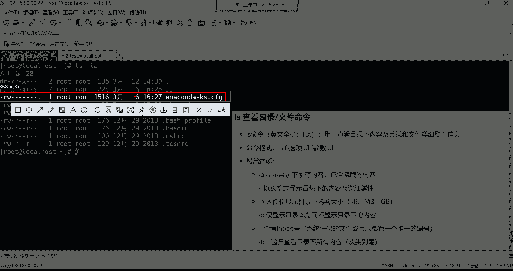
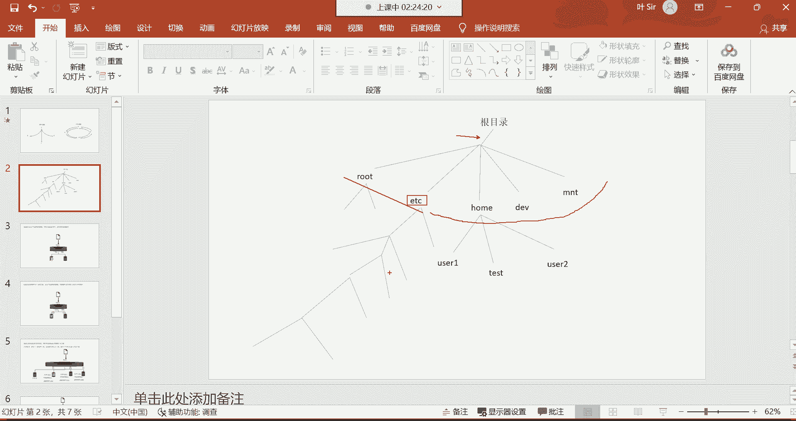
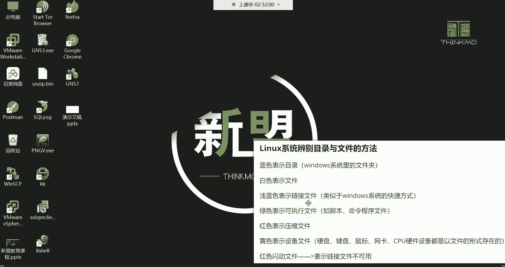

# 零基础入门Linux，红帽认证全套教程！Linux运维工程师的升职加薪宝典！RHCSA+RHCE+中级运维+云计算课程大合集！ - P5：红帽RHCSA-5.Linux文件类型介绍、归属关系介绍、基本权限类别介绍 - 广厦千万- - BV1ns4y1r7A2

喂喂喂，hello hello，大家都回来了吗？回来的话我们继续哈。然后回来的话给我刷波6上来，我们。😊，继续。好。行，那咱们继续讲解这个L这条命令哈，那已经前面了解了命令格式了。

那接下来呢咱们再来重新的再来一遍。😊。

讲过的话呢，我们就简单过一下哈那。😊，LS这条命令用于查看目录下的内容以及目录跟文件的详细属性是吧？那这条命令呢，你看它的命令格式就是我们前面给讲解的是吧？呃，选项跟参数啊，但是选项呢是可以同时有多个。

然后呢参数呢也是可以同时有多个，没错吧，但是呢你也可以加选项也可以不加选项，这条命令就非常的灵活。你这么去理解吧，这条命令非常的灵活哈，然后常用的选项第一个杠A是显示目录下所有的内容。

那首先呢如果这条命令你直接敲的话，它就是显示目录下的所有内容。但是它杠A啊发挥的是后边的这个功能叫包含隐藏的内容。哎，这时候拉S杠A。😊，回车。这时候你再看哈好像多出了很多个文件了。

我们在没有加杠一的时候，只能看到这么一个文件，是不是啊？但是加了杠一这个选项之后呢，你就发现了哎，这个除了这个文件以外，又多出来了什么呢？啊，后边的这些是以点儿开头的文件了。

有没有看到你看这些文件的名字前面都多了一个点儿，是不是啊？你看都有一个点，这点是什么意思呢？这个点就是隐藏的啊，隐藏的文件，这也是这个lin这个系统的它的一个特点吧啊，特色隐藏的文件前面都带一个点儿。

那后期如果我们也想创建隐藏文件的话，那我们也可以在这个文件名字前面呢加个点，到时候呢这个文件就被自动的隐藏起来了。那你说我为什么要用这种隐藏的功能啊？😊，这个隐藏功能我们平时很少用，是系统啊。

它能够用得到。因为这些隐藏的文件是干什么用的呢？就是。没有必要放到明面上。😡，然后呢，还不能。😡，还不能什么呢？缺少的一些像用户登录系统的时候哎，所必须用到的相关的文件啊。

所以就是他觉得这文件呢哎不需要你做任何的改动，那就没有必要放到明面上了，那怎么办呢？隐藏起来吧啊，但是呢还不能没有啊，其实这就给隐藏起来了，能列吧啊，但是我们没有必要。

我们是压根没有必要去对他们做任何的修改的哈。你知道一下怎么查看隐藏的内容就OK了。好。这是被隐藏起来了啊，然后windows里边也有隐藏的功能。对于windows来讲。

你看看windows隐藏的功能在哪儿呢？你看windows，比如说我要看我的C盘，我C盘里面我想看有哪些隐藏的文件，这时候呢查看，然后呢显示这里边隐藏的项目。

哎，这时候你发现啊我这个在我的C盘哈。😊，好像多出来了很多的文件啊，还有文件夹啊，你就看这个学习资料吧，这学习资料我再点查看。显示我把这个隐藏的项目给它取消掉。哎，你看这个学习资料没了。看到吗？是不是？

哼学习资料没了吧，然后我再查看显示然后隐藏的项目。😊，哎，你看这学习资料又出来了，这学习资料里面是什么，什么都没有空的啊，空的哈。😊，嗯，那就证明这个学习资料是被我隐藏起来了。没错吧，你看它的属性啊。

右击属性。看到了吧？这属性里面有一个隐藏的属性，所以说呢。它是一个隐被我隐藏起来了，隐藏的功能。哼对我这是win11系统哈，win11。😊，那windows里这个隐藏功能，其实对于我们那用户系统嘛是吧？

你想比如说有一些见不得人的一些什么视频图片之类的是吧？那你需要在夜深人静的时候，你需要自己看的。这些啊视频跟这个图片之类的这些东西的时候，呃，你可以给它隐藏起来，是不是啊？呃，不希望被别人发现。

那这windows不就有这个很好的功能成全你吗？没错吧啊。嗯，对啊，我就给他删掉了哈删掉了。😊，OK很多同学发现这个功能就如同发现了宝藏一样，是不是？说哇塞，那突然间又学会了一个技能。😊。

没错吧，啊行知道一下就行哈。这隐藏。那在这个linux里面呢，我们怎么看呢？就是杠A啊，那下边我们再来说这个杠L啊，杠L这个选项。😊。

杠L这个选项的话呢，前面给大家讲过是吧，以长格式形式显示目录下的内容及详细属性。呃，这样哈我们4杠L啊，然后再补个A。这样的话呢，你看它在显示的时候呢，就是把每个文件的详细属性啊就都给我们列出来了。

然后这个详细属性呢，我们在有一个阶段会专门去讲解它。但在这个位置呢，我们也是简单给大家介绍一下，就是对于一个文件的详细属性啊，都有哪些详细属性，我们就拿这个文件来说吧，好吧。😊，啊。

我们只是这个口述一下哈啊简单给大家先认识一下这个详细属性，就拿这个文件来说。😊。

他的详细属性。给他截过来。

那它的这个详细属性里边有权限，有归属关系，有文件的大小。首先呢我们先说这个文件。他的这个嫌疑属听里边都有什么呢？我们从左往右给大家讲，好吧，然后参考这个笔记。

这个文件的响应响应属性从左往右最左侧这个小横杠。看哈这个小横杠代表是叫文件的类型，这有个小横杠看到了吗？就这个小横杠哈。这叫文件的类型。那这个类型的话呢，如果是横杠开头的，就代表这真的是一个文件啊。

就普通的文件。就像windows里的那个点TATT结尾那个普通文件一样，OK代表它的类型是文件类型。因为这个文件有很多种类型啊，是不是啊？那文件的话呢，点TIT的就是普通的文件嘛，那点MP4的呢。😊。

这也是文件。那它是什么类型的文件呢？视频文件是不是啊？那点MP3的呢，这也是文件。那它的类型是什么类型的呢？😡，哎，音频音频类型的是不是啊？你那点GPG这也是文件，点PN机也是也是文件。

只不过就类型不一样而已，能列吧？哎，它的类型是图片类型的，是不是啊？okK所以说我们都叫文件，只不过这文件又分为很多种类型，那就跟你比就就跟我们平时开车一样，是吧？那你这这玩意它都叫车。

那拖拉机、自行车是不是？小汽车唉。😡，火车嗯是不是啊类型不一样，但是它统称都叫车嘛。所以说哎这个文件也一样啊，它有很多种类型，什么压缩包文件啊等等等等哈。😊。

OK然后那这个小横杠就代表这就是一个普通的文件。那在lin里面的这个文件类型啊有。😊，D开头的，如果说它的开头是以D开头代表是目录，那什么叫目录呢？😡。

我们现在可能看不到啊，可以看到这儿有一个点跟点点是吧？你看他们前面就是开头，就是D开头的，没错吧，那我们不要看这个啊，我们干嘛呢？我们L杠LA。😊，看这个啊，看跟目录啊，一会儿我们再说这个根目录哈。

现在你看哈。😊，我们可以看到，你比如说像这个bo啊这个boot，你看它的最左侧是什么呀？是以D开头，这些都是以D开头的是吧？哎，那以D开头的就代表它的类型是目录啊，这个目录就是windows里的文件夹。

就是叫法不太一样。O那还有一种类型叫L啊，这个L是链接文件，这个链接文件啊，我们稍后再讲啊，稍后给你们讲这个什么呢？我们去辨别目录与文件方法的时候，再给你讲讲什么叫链接O吧，其实就是快捷方式啊。

就是快捷方式，windows里的快捷方式然后呢，他们的开头就是以这种L开头看到吗？这个L开头是吧？好，下面这两个是不是以都是以L开头的呀？O这都是。😊。

链接文件。

那还有下边不常见的像什么跨设备文件啊，跨设备就是跨不同的分区的文件哈。跨不同的分区，比如说我的这个就像windows里边，你的C盘跟你的E盘一样。比如说嗯我的这个文件。

C盘的文件干嘛呀？啊，我给它链接到我的E盘去了，那这是什么呀？跨设。跨设备了啊，这属于跨分区啊跨分区。

好，然后呢我们再继续说这种像什么字符设备，管道设备套节字这些东西呢，你先对它有个大体的概念啊，现在用不到，包括这什么跨设备文件，现在我们也都用不到啊。你先知道一下它的类型非常多啊。

以后你再看到这种类型的时候，你像这种什么这个嗯。😊，其实最常见的还是前三个吧，嗯只能说最最常见的哈就是前三个。而像下面这几个呢，其实都不是很常见。😊，OK啊，这是代表它的类型。那说完类型以后呢。

我们再来说这个什么RW，这是干什么用的呀啊，这个呢叫权限。所以这时候呢啊我们还要给大家涉及到什么呢？就lins系统的一个基本的权限。这个权限分为哪些权限呢？啊，这个现在也是有个大致的概念哈。

我们在后期有专门的权限管理的讲解。😊，在哪儿呢？在这个位置。在这哈这是权限权限权限找找哈啊，在这儿呢。在这哈有专门的权限管理的课程，到时候呢我们再去详细讲解这个RW杠杠杠杠杠啊，这分别代表什么意思啊。

那这些呢就是属于权限。这个权限的话呢。那我这里面也是给大家写了哈，权限分为什么呢？分为三种啊，这儿叫R是读取W呢是写入X呢是执行横杠代表是没有权限。啊，我先来说这个读取是什么意思？

读取读取其实呃很好理解，就是你能不能查看这个文件里的内容。那这个W写入的话呢，是什么意思呢？就是你能不能对这个文件的内容进行一些，比如说啊增删改啊，这不都属于写的操作吗？OK那你看这个文件呢。

你看它就有R跟W这种权限，是不是啊啊，那就是能读能写那还有一个权限叫X啊，这是一个执行的权限，这个执行权限是干什么用的呢？就是你能不能运行这个文件。一般什么文件需要运行啊，像什么脚本程序文件啊。

才需要你运行。而普通的文件的话呢，是不需要你去运行它的。好，这是权限啊，我们先了解先有个大概印象，我们后期会呃怎么说呢？会详细去讲解它的OK然后但是这个权限呢，我们又会涉及到一个什么呢？叫做归属关系。

嗯，在这儿啊有一个叫归属关系。在lins在这个linux系统下面，文件它给用户分成了三类啊，这三类就是我们所说的叫做归属关系。那第一类呢叫做所有者。所有者就是文件或目录的拥有者。

你比如说我们在这个系统里边，我们用root这个账号，我们建了一个文件。那这个文件通常谁创建的，谁就是文件的拥有者，很好理解吧。比如说你去花钱是吧，你买个东西。😡，那这个东西你花钱买的那你就是他的拥有者。

没错吧，你搞个对象是不是？那你就是这个。😡，呃，这个女孩子的拥有者，你想干嘛就干嘛，没错，是不是啊？那拥有者的权限通常是最大的。你。该亲就亲，该抱就报是吧，该搂就搂，该那啥就那啥啊就拥有者嘛啊权限最大。

那第二类呢叫所鼠组。所属组的话呢，一般啊这个系统有个特点，什么特点呢？就是你看root是一个用户。😊，啊，是一个账号是吧？那系统呢对于系呃这个lin斯这个系统呢，对于这个每一个账号呢都会给他在干嘛呀？

哎在。创建一个同名的组，也叫root。注意哈，哎这个叫用户名，这叫组名啊，只不过呢。这叫用户的初始组。初始组就是这个用户与生俱来的这个组啊，系统自动分配的。不是我们自己创建的。

那这个啊对所属组就是初始组，也有人管它叫基本组，也有人管叫所属组，也有人管他叫初始组。那一般的话呢就是你看root，比如说创建了一个文件，这个文件呢叫hello。那首先那谁创建的就属于谁？没错吧。

是他的所有者。那这个文件默认情况下也会属于什么呢？属于这个账号的初始组。哎，这个就是文件的所属组啊，就是属于哪一个组，通常呢到时候这个所有组有什么用啊，你可以往组里面添加用户这组嘛。

是不是组里面添加成员，比如说后期你系统里面还有很多的账号，比如说t的账号，好，我把t的账号添加到我这个组里边，那以后t的这个账号就可以干嘛呀？哎就可以继承这个组的权限了。

那这个组对这个文件的权限是什么权限？那test的这个账号就拥有相同的权限。啊，这是一个所属组啊，它的一个作用。那通常所属组的权限会比所有者呢略微小一些啊，其实也很好理解嘛，毕竟你不能有所有者的权限大。

OK那第三类呢叫做其他人。这个其他人呢很好理解，既不是文件目录的拥有者，然后呢，也不属于文件或目录组内的成员。那这个呢我们就称之为其他用户啊，就跟文件没有任何关系的。那叫其他用户。OK你怎么去理解呢？

啊，就是比如说啊。你花钱买了一个物件儿。那你花钱买的，你就是这个物件的拥有者是吧？那这个组是什么意思呢？啊，你别的啊你可以觉得哎呀这个呃我有很很多的朋友是吧，也喜欢这个东西啊，那那干嘛呀？哎。

大家可以相互去交流啊，去探讨啊，那干嘛，你给他们哎就是哎你给他组织到一起是吧？组织到一起呢，那这些人啊就都在同一个组里面。😊，啊，也可以干嘛呢？也可以对这个物件具备一些啊略微小的权限。

比如说可以去看一看呢，是不是啊摸一摸呀，但是他想拿走是不行的，是吧？因为他不是拥有者嘛，那什么叫其他人呢？其他人就是。😊，哎，他也不认识他也不认识你他也不认识你身边的什么朋友啊，什么七大姑八大姨的。

跟你没有任何关系。那。😡，这个就称之为叫其他人了。呵呵其实就这意思。😊，这个意思。所有者搜楼组跟其他人。O。好，然后这是简单的介绍一下哈。毕竟我们在前面基础阶段呢，对于一个文件的详细信息呢。

我们也是要说一说好，那现在我们就得再来给大家讲讲这个权限的类别里边，刚哈它这个权限怎么看呢？😊，是总共有9个字符，然后这9个字符的话呢，它是每三个字符为一组。怎么区分呢？是这样子的。啊，三个字符为一组。

是。这三个字符。好，这是一组，然后再来。啊，这又是三个字符。看到了吗？然后右边。那最后这红红框里面又是三个字符，看到了吧？然后每三个字符是一组，这一组什么意思呢？就是。

看看我们前面说所有者所入组其他人是不是啊？我记最左侧的这个三个字符代表是所有者的权限。啊，这个所有者。用U来表示啊，这个你先不用管优不U的，我们后期再讲。就是所有者对这个文件的权限。能读能写。

而后中间这三个字符呢代表谁呢？代表所属组。啊，所属祖其实就是group的意思。啊，左说组有入横杠是什么意思是吧？横杠就没有权限。你没有权限。然后最右侧这三个字符呢是谁的权限呢？是其他人的权限。

其他人用O来表示，就是as的意思啊，叫其他人。好，那你说那我怎么看这个文件的所有者搜有组啊，其他人呢？啊，在这儿看哈这个点的话呢，这个你先不用去管它，这是证明这个文件是受系统内核防火墙保护的一个文件。

然后右边这个一是什么意思呢？依就代表这个文件的引用次数啊，这个引用次数至今为止没有人能够给给一个最准确的解释啊，对于我们来讲也不是什么重要的信息，你知道一下就好。

然后我们说说那这个文件的拥有者到底是谁啊，拥有者。在这儿呢root啊root。注意哈，作为文件的拥有者，然后他的权限在哪儿啊？他的权限在这儿。啊，最左侧这三个字符就是所有者的权限。那所有者是什么权限呢？

所有者是。读取跟写入的权限RW。但是你看啊那这个W的右侧是个小横杠是吧？那小横杠代表是没有权限。那没有什么权限呢？没有权限，就要看这个小横杠在哪个权限位。正常来讲。

权限的顺序是比如说如果所有者对这个文件拥有一个读写执行的权限，那它的顺序永远都是RWX。那如果所属组对这个文件也是拥有一个读写执行的权限，那它的顺序也是RWX。那其他人呢也是同样的道理，这叫权限的顺序。

就是说R永远在最左侧W永远在中间X永远在。最右侧。那这个时候如果这个小横杠啊，它。你们看到的这个权限是这样的一个效果，就是啊RW横杠的这种效果的话。那首先你看啊。

是不是小横杠它占的这个权限位是谁的权限位呢？应该是这个X的权限位。没错吧，那就证明。root啊，作为这个文件的拥有者，它没有什么权限呢？没有这个X权限。小横杠在哪个权限位就证明它没有哪个权限。好。

那这时候我们再来看所属组呢，那所属组是中间这三个权限位。那你发现是三个小横杠，是不是啊？那三个小横杠。哼那所舍组三个小王就就都就证明他什么权限都没有。那其他人也一样了，你看其他人这个位置。啊。

现在是也是。三个小广告是吧，那就证明其他人对这个文件也是没有任何的权限，能列吧。啊，那以上就是我们怎么去啊说这个文件的所有者搜索组其他人他们的权限怎么去看。就这样看每三个字段为一组，总共有9个字段。

然后所有者的权限。最左侧。所有组的选项的中间这三个字段，那其他人呢就跟这文件没有任何关系的那都被归类到其他人了，是最右侧这三个字符啊，代表其他人的选项。好，那这个呢我们就前面就讲过了文件的大小。啊。

这是代表文件的大小哈。然后。默认是以字节为单位。然后后面那个是文件的最后一次的修改时间。啊，修改时间。然后我这个笔记里边呢，在权限类别里面都给大家写了，但是我是拿哪个文件来给大家举个例子呢？啊。

也是系统里面的有一个文件。然后你看这个就是前面文件的详细属性，是不是啊？然后然后这个详细属性里边呢，那最左侧也是从左往右解释的哈，中文解释小横杠代表是文件的类型，然后呢，剩下RW杠R杠杠R杠杠啊。

就代表。😊，嗯，就是分别是所有者的权限，所属组的权限，还有其他人的权限。OK然后UGO啊用字母UGO来表示。然后那分别R代表什么权限？W代表什么权限？X代表什么权限？这里面写的也很清楚。

然后下边这个包括这个一是什么意思啊，这个代表是文件的引用次数，然后只针对于什么硬链接的文件才有效，这些东西呢，大家先不要去管它啊，因为这个至今为止没有一个很好的解释啊。

然后剩下呢就是这个rootroot对应的解释就在这呢，就是文件的所有者。然后呢，另外这个root就是对应的是这个root叫文件的所属组。然后这个呢数字代表是文件的大小，默认以字节为单位的显示。

然后后边这个时间叫做文件最近一次的修改时间，其实最近不就是最后的意思吗？然后文件的名字叫什么看到了吗？这里面写的也很详细，你发现跟这个文件是一模一样的哈，就是在这个系统当中就很有规律。

所有的文件你想看它的详细属性都是这样解读的。😊，包括目录也一样，都是这种解读方法。

OK好，那解读了它的这个详细属性之后呢，然后我们也了解了，大概了解一下什么叫归属关系，什么叫权限了，是不是啊啊，那对于LS这条命令啊，你看我们牵扯出来的还没完事呢。😊。

什么呢？就是这个。在。在这儿啊叫辨别目录与文件的方法。什么意思呢？就是我们在使用LS这条命的时候，比如说我想看什么呢，我想看我系统当中的其他目录。其他目录。我们刚刚用L，我们只是打开了自己的家目录。

那我现在比如说我想看看根目录下边都有哪些数据，怎么看呢？在这儿。

LS空格直接跟上跟目录回车。注意哈，就是命令不加选项，直接跟参数的话，也要保留空格哈，你就记住。命令行的顺序命令永远在最左侧。然后呢，命令如果需要跟选项。那中间保留一个空格，命令如果需要跟参数啊。

也要保留一个空格。啊，作为一个分隔，这没有为什么分隔服。

好，然后我们现在打开的是哪个目录呢？其实就是在这个图里边呢，就是这个根目录。我现在看的是根目录下边都有哪些数据？好，但是它是一层一层的，是不是啊？你看那我们现在只是打开了根目录下边的这一层，注意啊。

是这一层目录这一层。啊，只是看到根目录下边的一层。但是呢你比如说那在根目录下边，你看比如ETC目录的话呢，那如果到时候你还想看ETC，那可能是在ETC目录下面又有又有很多的什么呢？什么叫子目录。

到时候你再继续去打开EDC就可以了。好，我们先来看这个什么呢？这个根目录下边的这一层都有哪些数据。那这些分别代表什么意思呢？其实这也是很多小白在刚开始接触这个系统的时候，他容易什么呢？容易蒙的地方。

怎么蒙的？就是英文。完全看不懂，完全不理解现在所看到的这个到底是干什么用的啊，以及这为什么要叫这个名字都感觉很奇葩，是不是啊？为什么都是这个英文的？不像windows一样，中文的不好吗？是不是啊啊。

会有众多的疑问啊，这就是这个系统的特点，没有办法改变不了啊，你改变不了社会，你就要去适应社会啊，这系统也一样是吧？你没有办法自己去开发一套系统，你就去适应它，你就去学习它就好了。

那我们现在看到的这些东西到底是什么呀？

啊，接下来呢就就会扯出来一个叫做什么呢？叫做辨别目录与文件的方法。

就是我们现在看到这个东西到底是文件还是文件夹？

那怎么看呢？啊，接下来呢我就是来带领大家了解一下，在lin下边。众多的文件的类型，我们怎么去通过颜色去辨别？第一，蓝色。蓝色表示的是目录，这个目录就是windows里的文件夹，大家也不要蒙圈。

那文件夹这东西不就是存储数据用的吗？是吧？你说我建了一个文件夹，比如说我想存储一些嗯一些不能被别人所这个看到的一些什么电影啊，图片呢，那是不是就直接往文件夹里面存呢。

或者说我在文件夹里面再去存储一些什么普通的文件啊等等等等的。这不就是文件夹干的事吗？存储数据用的O只不过呢我们现在学习的不是windows系统。我们现在学习的是这个linux这个系统。

而这个linux这个系统呢，它就不叫文件夹。啊，就是名字不一样，它叫什么？它叫目录，但是它的本质是一样的，能理解吧？啊，都是帮你存储数据的，你知道一下就好。O。好了，这是蓝色表示的是目录。

以后我也不会再去管它叫文件夹了啊，你们以后也不要管它叫文件夹，它就叫目录。OK好，这是蓝色。那白色白色表示的是文件。那在根目录下面，你发现没有白色是吧？没关系啊，文件多了去了。

你比如说我想打开ETC这个目录，那这时候你这样啊L空格根下的ETC。啊，目录可不止这么多哈，你看我现在给你打开是根目录下边的谁呢？ETC这个目录。所以这时候你再打开的时候就得指定了啊。

我要看根下边的ETC，所以说哎，你看左边是根目录。然后呢，ETC在根目录下边，这时候呢就得根下的ETC它现在给你打开的就是ETC这个目录。那你看在ETC这个目录下边又有非常多的什么呀啊。

白色的代表是文件，蓝色代表的是目录，所以说这个系统的结构就是像大树的分叉一样，看到吗？我们刚刚打开了ETC，你看ETC下边又有非常多的什么呀，我们叫啊小小的分叉，那每个分叉都是一个目录。😊。

或者是文件。能理了吧。那如果说我再打开，比如说MNT目录DV目录，那其实每个目录里面呢还有很多的数据呢。因为大数嘛是吧？你看大数的分差，你怎么可能数数得过来呢？所以这个系统的结构也是非常庞大的。

有拥有非常多的目录，以及每个目录下边它还有可能存放非常多的什么呢？我们叫子目录呢。

好，那在这个ETC目录下边，你看到了吗？我们现在看到的这个白色的，只要是白色的，都是什么呀？都是文件。颜色在哪里配置是吧？呃，这个系统自带颜色显示。自带颜色显示哈啊能变更不不能变更啊，变更不了。好。

那这个时候呢你看哈白色现在你知道了，蓝色也知道了是吧？但是还有像这种浅蓝色的，你们有没有发现？😊，这种浅蓝色的表示是什么呀？浅蓝色的。这种浅蓝色的。它叫链接文件。

这个链接文件类似于windows里的那个叫快捷方式。可能说很多同学啊不知道什么叫链接是吧，第一次听啊。😡。

这种东西就不是人话链接。

那我们给大家讲讲windows的快捷方式吧，然后让你们更好的理解什么叫链接文件。呃，这个windows里边呢，你看哈快捷方式，你们现在看到我的这个电脑桌面上面的什么这个各种图标啊。

火狐浏览器的这个图标上面有个小箭头啊，谷歌浏览器上面有个小箭头，没错啊，百度网盘等等等等，是不是都看到一个小箭头啊，这个小箭头就证明它是一个快捷方式。那你说快捷方式干什么用的呀？😡，快捷方式。

我一双击他。我一双击它，我就可以使用这个火狐浏览器了。

那没有快捷方式呢，没有快捷方式。

你得找到它所对应的那个程序文件，啊右击打开文件所在位置。

啊，那这时候呢。你看啊这个快捷方式，它所对应的真正的应用程序文件在这儿呢。看了吗？在这呢点ESE结尾的windows系统里的程序文件。那这时候。

我可以直接双击这个ESE的这个文件啊，执行这个文件。其实你发现效果也一样啊，我也可以使用这个火狐浏览器，没错吧，但是呢。

不太方便，怎么不太方便呢？就是如果没有这个图标的话，没有这个快捷方式的话，我每次想使用火狐浏览器，我是不是得跑到我这个windows电脑的。这么深的一个文件夹里边，然后呢我还得去翻一翻。

从上往上往下翻一翻啊，我的火狐浏览器在哪儿是不是啊啊在这儿呢好一双击我就可以使用它了，麻不麻烦呢？非常的麻烦吧。所以有了快捷方式以后呢，你还需要去找它的这个程序文件吗？不需要双击图标就可以了是吧？

这个图标的话呢，它最终会帮你自动。😊，去找到这个程序文件。所以什么叫快捷方式啊，是方便快捷的让你。找到这个程序文件去执行它。

这不就叫做快捷方式吗？所以。

linux系统里面也有这个功能，只不过它名字。不叫快捷方式，它叫什么呀？它叫链接文件。知道了吧？哎，就你发现其实它的本质是这样子的，换汤不换药能理解吧？😡，哎，真正帮你实现功能呢，其实就是这个意思。

但是就是叫法不一样。😡，这就因为它不同的系统嘛啊系统类型不一样。😡，所以说它叫法也不太一样。OK啊，你知道一下，所以以后呢就不要再什么呢？再问别人啊，什么叫链接文件呢？

如果你自己不理解这种win这个链接文件的含义的话，你就想想windows里面的快捷方式是干什么用的。😊。

你就知道什么叫链接文件了，你你也就知道他。😡，存在的意义是什么了？知道吧？

O。啊，这是浅蓝色。那还有一种叫做绿色啊，绿色表示可执行的文件。那可执行的文件。啊，就刚刚我们说啊看到的那个程序文件右击打开文件所在位置。

你看在windows里面呢，我们如果没有没有这种快捷方式，我也得去双击执行这个程序文件。

是不是啊这就一个应用程序文件嘛，一双击，然后呢浏览器我就可以使用了啊，是这么回事。

但是呢在lininux里边，它压根儿没有这个图标，对没有这种图标，而且它也不能让你双击，能理解吧？没有鼠标让你双击的。所以呢一般。

你怎么知道或者你怎么辨别这个文件，我能够去执行它给我带来功能啊，就看颜色。😡，啊，绿色就证明这个文件是能够给你带来功能的，不是一个普通的文件。知道吧？那这像这种在哪儿呢？啊，cttrol L。清屏啊。

打开根目录，打开根目录，你看这里边有个bin啊，这个bin你看是个浅蓝色的链接文件是吧？但是我告诉你它是一个目录的链接，注意哈，是目录的链接。😊，那这时候呢我们打开的目录嘛都可以打开。

我要打开跟下的哪个呢？并这个目录。😊，好，回车这里边你可以看到是不是有非常多的绿色的呀？我跟你讲这些绿色的就是什么呢？呃，当然大多数都是这个命令的程序。什么叫命令的程序啊？

就是我们在这个系统当中敲的命令大部分都在这个目录下边，而且呢都是绿色的，能够给你带来功能的，命令不就是给你带来功能的吗？是不是啊？你得执行它呀。OK所以一般呢啊那命令也是以文件的形式存在的。

所以呢啊是以绿色的颜色表示啊，可可以给你带来功能的O这是绿色。那还有一个颜色是红色压缩文件。这个红色的话呢，我们现在看不到啊，这里边因为我们系统里面没有压缩包。没有哈，那没有压缩包。

我们搞一个压缩包吧哈呃咱们。😊，我建一个什么呢？建一个新建一个。我新建一个文件，然后呢我给它压缩一下。压缩。好，那在windows里面我们可以看到你看压缩以后就变成这个样子了，是吧？好，那。😊。

这个你一眼就知道它是一个压缩包。但是如果我把这个文件给你传到。

linux这个系统里面以后，我们看看它是一个什么样子哈。当然这样传是传不进去的，因为是跨操作系统了。

那怎么传呢？啊，可以用这个东西叫winSCP。

打开这个VSCP以后啊。它可以实现把windows里的文件传到linux系统里边。然后在这个里边呢哈输入主机名。192。168。0。90啊，这是我们当前这个主机。啊，主题名字，然后呢。

下边的用户名用谁去干嘛呢？连接，用root连接root的密码一。然后登录一下。OK你看现在去连接主机是吧？首次连接呢需要一个什么密钥哈，没关系，选择是就行了。😊。

OK连上去了，连上去以后呢，左边就是我们的windows系统里的一些数据了，右边就是linux系统里面的数据了。我现在想把这个我桌面上边的这个压缩包，我直接给它拽进去就可以了。注意啊。

直接拽到这个什么呢？linux系统的root目录看现在就在root目录呢，是不是啊O。那这时候呢关掉。

好，断开链接。这winSCP可以从哪下载呢？软件商店。啊，软件商店就可以下哈。😊，可以实跨系统之间的一个数据传输。好，那接下来呢我们看看。

在L推车。因为那个文件是传到了我们那个家里边了，所以呢你直接LS就是看的是加目录。那你看这个文件在我们这个系统当中是有那个图标吗？有那个像一个压缩包一样那种图标吗？你发现它没有。啊。

但是它颜色是什么颜色？红色。所以以后你在这个系统当中一看这个文件的颜色是红色的，就是一个压缩文件。压缩文件被压缩过的。那哪些文件属于被压缩的呢？多了去了。MP4这种视频文件就是被压缩过的。MP3。

这种音音乐文件也是被压缩过的。或者说这种点踏结尾的压缩包。还有点RPM结尾的软件包，这都是压缩类型。嗯，不看。这呃这个颜色是看扩展名的吗哈嗯不看扩展名。😊，不看外名哈。OK。好。

这是红色啊表示的压缩文件。然后。我们再来说啊再来说这个黄色，黄色表示设备文件，这设备文件比较好理解了。硬盘、鼠标、键盘、网卡、CPU显卡这些都是硬件设备是吧？啊，都是以文件的形式存在的。在哪个目录呢？

有1个DEV你看在根下面有1个DEV看到了吗？我们LS空格打开根下的DEV回车。你看这里边你发现有很多的什么呢？叫黄色的。黄色的是吧？不是很正经的一个颜色。啊黄色。设备文件。

那你说那这个每每个文件分别代表是什么呀？到呃到底是哪个是硬盘，哪个是鼠标，哪个是键盘呢，哪是网卡呀，哪是CPU啊，这先甭管的啊。我们后面有一个单独阶段会给大家介绍这个文件的。😊，O。你先知道一下啊。

这黄色，那还有很多同学说，那老师这怎么还有个粉色，这粉色。粉色一般图片你传进来就是个粉色。图片哈如果你要给它传进来，它就是一个粉色。但是呢我们可以LS杠L是吧，我们看看DV下的log。

这个你看但是它的类型可不是图片。S开头的。

啊，S开头的，我们前面再给大家讲这个文件类型的时候。系统文件类型S代表是套接字文件。那什么叫套接字文件，你现在也不用管它。

但最起码你现在知道它的类型是什么类型了，是不是？如果你实在不理解也没关系。

我这里边给你你看啊，这里边有很多的文件类型，到时候你比如说我们想看看黄色的那LS杠L看谁呢？比如我看DV下的什么呢？我要看这个SDAS下的SDA回车。

你看B以B开头的。

叫什么呀？叫跨设备文件。其实就是硬件设备文件。叫硬件设备文件。

黄色的硬件吗？硬件设备。都是什么呢？B开头的。O。好，这是说清楚了这个黄色是吧，黄色，然后。我们再来给大家讲讲这个红色闪动的文件。呃，这个红色闪动的一般就是叫链接文件不可用。

就这种浅蓝色的叫链接文件是吧？那如果链接文件有问题呢，它就会变成什么呢？闪动的。但是这个你得看到的详细信息。比如我现在我建个文件。建了一个hello文件，然后呢我给他创建个链接。

这命令大家先不用去纠结哈，我们现在还没到这个学习这些命令的时候，所以你先知道一下，我给你们演示一下。😊，L杠L看OPT目录。看到这个文件了吗？红色闪动的。这就证明说它是本身它是一个链接。

链接文件的特点是有个小箭头。左边是链接文件，右边小箭头指向的是什么呀？就是它的那个。原文件。

就等于说啊左边这个文件就是我们所说的这个桌面的图标，然后右边箭头右边那个对应的就是这个图标背后真正的那个什么呢？实现功能的那个文件。你看我们右击打开文件所在位置。

看这个就是这个这个就是它的快捷方式的语言文件，知道吧？

啊，这是这个快捷方式，是不是？那在这里面我们看到的这个你看这小箭头左边就是这个什么呢？这个链接文件，就那个快捷方式，右边这个就是它所对应的真正的那个什么呢？原文件。但是你一看原文件一直在闪闪闪。

就证明什么呢？就证明有问题了。你这个链接文件不能用。是有问题的。啊，那以上就是我们可以通过这些颜色去干嘛呢？去辨别系统当中的这种文件的类型。啊，通过颜色辨别。然后你看我们在讲这个颜色辨别的时候。

我我也是哈呃其实也是给你们演示了很多。就是我们想查看系统某个目录的时候，你比如我想看这个DV下边的这个log。首先它是一个文件是吧，我怎么看呢？哎，你看咱们说L杠L查看它的详细属性了呀。那详细属性里边。

你可以看到啊它具体的详细信息，那这时候你就得这样看是吧？哎指定这首先这个文件在哪儿，你得知道啊，在哪儿，是不是在DEV这个目录下边呢？哎，它这个目录关系就是一层一层的哎，你得先干嘛。

你得先指定这个目录是在根下的DEV下边。😊。

啊，左边这个这个这根斜线就是根目录啊，然后指定根下的DV。好，那你如果说我想看DEV下边的，比如说这个log这个文件的话，那这时候注意哈，这个文件是不是在DEV的目录下边的？那这个时候这根斜线是什么呀？

这根斜线叫做路径分隔符。就指定我要看的是DEV这个路径下边的。某个文件，那这是怎么分割呢？怎么怎么让系统知道你要看的是这个DV目录下边的呢？哎，这根斜线就是路径之间的分割符。啊。通过斜线来表示。

那如果你像我前边，你看我并没有加这个什么呢？这个斜线，后边这个log并没有加它的话，我如果直接这样敲的话，是不是直接把整个DEV目录打开了呀？打开了整个目录，但是我就想看这个目录下面的某一个文件。

那你就得具体的指定啊这个目录下边的具体的文件的名字。那你看这就。很好理解了。比如说我后期我还想看我我我们先干嘛呢，我们先打开这个ETC这个目录LSLS跟下的ETC。那你看我想看ETC纤维。

比如说哪个文件呢，我想看。😊，啊，我想看看哪个文件呢，那那那个这个吧啊叫passWD的文件。那我怎么看呢？那首首先这个文件是在ETC目录是不是哎，而ETC目录呢，它也在跟目录下边。

他们之间是一层一层关系。你看你先看跟目录是不是有个ETC。在这儿呢哎，然后呢，这时候我再打开跟下的ETC哎，那他就只给你打开ETC目录。😊，回车好，那我想看ETC下边的这个passWD。

那这时候你就得具体指定了。哎哎，我们先清屏哈，这时候命令翻过来指定哎，路径分割符分割一下，我要看ETC下边的。😊，passWT但这时候呢我想看它的详细属性，补个杠L空格。

那就只把你想看的这个文件的详疑属性给你列出来了。啊，他是这样子的。啊，是这样子，看到了吧。所以以后你想用LS，比如我想看这个系统当中的某一个目录，或者说某一个目录下边的某一个呃文件的详细信息之类的。

你是不是了解了这个他们之间的关系以后就可以了。哎，就一层一层的去打开目录就可以了。想看具体的文件信息，就指定具体的文件的名字，但不要忘了前面这个路径分割服啊，不能少。

好。呃。我们讲到哪了？还是LS这条命令是吧？你发现这LS这条命令我们牵扯出了哪些东西啊？😊，文件的类型。嗯，归属关系。还有这个一些基本权限啊以及文件的详细属性。还有前边怎么去辨别目录与文件。

通过颜色去辨别是吧？你发现这1个L命令它真的是。呃，光LS这条命令讲的话呢，扯出的东西就非常多了啊，都是你在入门的时候，你需要知道的一些必备的一些什么的概念。好。

那下面我们再来说LS其他的选项啊到现在为止，这几个选项还没说完呢。

我们再来说哪个选项呢？嗯啊现在没现在没搞懂没关系哈，你可以下去多听两遍，而且现在也并不是真正去讲这个权限跟属性的。你现在搞不懂也没关系，你可以把这个疑问呢先给它留下来。😊，好，那下面我们再来说这个。嗯。

杠H这个选项。呃，杠H这个选项讲过了是吧，就是人性化的显示目录下的内容大小。那这个呢前面就是比如说你看看这个文件的时候，以字己以这种字节为单位来显示大小啊，这个文件还不是很典型啊。

L杠LETC下边有个s瑞。VICES这个文件的大小你看好几十万个字节，这时候呢不是很人性化。没错吧，咱们就这样LS是吧，短选项合并了杠LH。😊，H就是给我以K兆G的方式显示它的大小，然后再跟上什么呢？

跟上那个文件的名字，哎，回车。没错吧，那这时候呢就是以K招记的方式给我显示。但是刚刚你们有没有发现一个小细节？这个文件名字怎么自己突然间就。冒出来了呢。你看看我现在LS杠LH。空格。诶。嗯。

你看哎怎么突然间冒怎么就突然间冒出来了呢？哎，看到了吗？😮，呵呵这不是T不见哈，这可不是T不见。😊，这可不是听不见哈。😊，看看哎。怎么出来的呢？看到了吗？怎么出来的呢？

😀呵呵。😊，啊，你看这里面啊有一个什么呢？叫命令行的编辑技巧。其中这个里边有一个快捷操作。叫什么？叫ESC。跟点儿。结合着使用是将上一条命令的参数。变成当前命令的执行对象。啊，这句话再读一遍。

将上一条命令的参数。

变成当前命令的执行对象。我的上一条命令的参数是谁呀？是这个路径下的这个文件，没错吧。那这我上一条命令的参数。OK啊，是这个文件。那我下边我还想针对于这个文件做一些具体的其他的操作的话。

你比如我这样LS啊杠L。H。那这时候呢我还需要调用这个文件，那怎么办呢？那这个时候空格隔开。哎，注意哈，摁住ESC的时候，再摁一下点儿。哎，好了吗？你发现。就直接干嘛呀。

直接把你曾经就你上一条命令干嘛呀，就执行的这个对象直接就拿过来了，干嘛呀变成我当前这个命令的什么呢？这个执行对象了，这叫什么呀？😡，这叫懒人操作啊，在我们这个行业里面，这叫懒人行为。什么叫懒人行为呢？

就是我他妈的不我想省事儿一点，我想方便一点，这不就懒人行为嘛，是不是？😡，所以这样就可以了哈。所以这个就是我后期也会经常去使用这些快捷操作的。

所以呢你们也干嘛也养成这种习惯。啊，就是养成习惯以后呢，你会发现它会提升你的工作的或者说学习的一个什么一个具体的效率，而且准确度也非常高。准确度非常高。你想你如果上边你你的这条命令啊。

针对这个参数执行成功了，你下边在调用的时候，是不是原封不动拿过来了呀？😡。

是不是原封不动拿过来，比你手敲它的准确率要高的多吧，你手敲还有可能敲错呢，是不是？😡，啊，懒人行为哈哈。O。好，那这就是杠H这个选项啊，杠H呢就是以这种K兆记的方式来显示了这个文件或目录的大小了。OK。

嗯，效率行为好，那下面还有一个选项叫杠D啊，仅显示目录本身，而不显示目录下的内容啊，这个杠D选项是针对于目录的。针对目录哈什么意思呢？比如现在我想干嘛？我想LS杠LH我想看ETC这个目录这个目录啊。

我想看看它本身的一些详细属性。😊，啊，不需要加H啊，就看到的详细属性回车。但是你发现它不太一样，它怎么回事呢？它是亮子的，你看它是把这个ETC这个目录下边注意哈。

是ETC这个目录的下边。哎，每一个子目录，包括它的呃子文件，他们的详细属性给我显示出来了。但是我想看的是谁呀？是ETC目录本身。我想看的是这个目录本身就。它的本身的详细属性。

而我不想看的是它下边的这些什么呢啊一些子文件或者子目录的详细信息，这怎么办呢？那这时候杠D这个选项就是只针对于目录去用的。

所以这时候我们可以怎么玩呢？LS空格杠D，然后呢把ETC给它调过来。那这时候看杠D就是仅显示目录本身，而不显示目录下的内容了。哎，ESC加点儿，把这ETC目录啊给它调取过来回车。看到了吗？

是不是就把ETC目录本身显示出来了呀，而目录里的内容呢并没有给你显示吧。😡，这不就是调用目录本身吗，但是你又感觉很奇怪，怎么奇怪呢？😡，哎，我调用它的本身，我想看它的详细属性是吧？

所以这时候你就得干嘛呀啊，再结合杠L，把它的详细属性给你列出来。那你看这个短选项就必须得合并到一起去用了。所以LS干嘛呀？杠LD空格。在ES加点把ETC目录。等会儿啊ESC加点啊。

把ES目录给他们给它调取过来。呃，ctrorl L清个屏回车。这时候呢他就干嘛了？他就把这个目录的本身的详细属性给我们列出来了。看到了吧？啊而并不是这个目录下边的。数据的详细属性，所以是杠D这个选项。

Okay。好，然后后期你想看哪个目录，你比如说我想看那根目录，你比如说我想看看不同的目录的详细属性，那LS是吧？杠LD空格。那我再给大家强调一下，这个选项没有左右的顺序要求。比如说我把D放左边。

L放右边可以吗？可以。看跟下的，比如说看这个病它本身的详细属性回州。看到了吗？这个bin是个目录，然后呢。但是它是一个什么呢？是一个链接过的目录。

所以它的属性是L开头的L开头代表是链接而真正对应的那个原目录是在系统的这个位置UerB下边。OK然后我还想看别的那你就L拉L拉杠LD比如我想看根下的不同目录回车。啊，那是显示不同目录的详细属性了。

而且是它的本身的详细属性，看到了吗？啊。啊，就呃这个D这个选项呢，到时候你们可以自己多练一练哈，每个选项都可以自己多练一练。对于LS自评命令随便玩。在这个系统里边，你想看什么，随便练，为什么呀？😊。

这种查看的命令。不会对我们这个系统造成任何的什么呢？任何的威胁，它又不它又不像是什么删除。又不像是什么修改，所以说这条明令随便玩。😡，敲错也没关系。只要是你能够想象得到的，你都可以用它去什么呢去做练习。

OK然后再来这个杠I这个选项叫查看I note号。这个Io号是干什么用的呢？你看系统任何的文件或目录都有一个唯一的编号。这个编号我们称之为叫i note号。嗯。我们这样吧哈来先演示一下LS空格杠I回车。

你看它现在显示的就是我们当前的加目录下边的数据是吧？然后呢。他把我加目录下边的每个文件前边。都给我们显示出了一串数字。你看看是不是你看这一串数字吧啊，在这呢一串数字。这也一样，一串数字。

然后我们说一说这个数字，就是就是这个文件在我系统当中的一个唯一的编号，这个编号就有点像我们人的身份证号一样。身份证号，你看咱们说人嘛。呃，可能说有很多人同名啊，比如说你叫张三。

那可能说也有人也有很多人叫张三这个名字啊，李四也一样啊，都有很多人叫李四，老王也一样是吧，同名了。但是你说同名归同名，那怎么辨别这个每个人的身份他是不同的呀，或者怎么去区分他们的唯一性啊？😡。

那看身份证号。没错吧。所以说这个系统里的文件也一样，每个文件哎。他的唯一的身份的标识就是。叫i know的号。idod号啊，系统任何文件目录都有一个唯一的编号啊，就是这个idod。那对于我们来讲呢。

我们很少会通过这个iO号去记一个文件的。这就像我们平常生活中，你你会去通过每个人的身份证号去记住这个人吗？不可能的。是不是你都得通过什么呢？通过对方的名字去记他，谁会去记他的身份证号啊？啊。

所以对于我们来讲没没有什么太大的作用，是系统啊它在调用某些文件的时候啊，会通过这什么呢？通过这个id的号去调用它。好，那下面我们再来说这个这个选项用的不多哈，你们了解就行不多。

然后这个杠A这个选项用的也不多，常用的。😊，下面这三个是最常用的对ISS进行命令，而且是我们在初级入门阶段最常用的三个选项，你一定要把这三个选项给它用熟掉的。别的选项你可以先作为了解啊。

不是必须要掌握的。OK然后荡大R这个选项叫递归查看目录下所有内容。我们先说递归这个词儿啊，对于很多人来讲呢有些不太理解。递归递归就是啊横涛，后面我给你们补了一个。解释啊非常通俗的解释叫从头到尾。

什么意思呢？比如说呀我现在想干嘛呀？对于这个ETC目录来讲，你说在ETC下边有非常多的子目录，是不是啊？然后可能说在每个子目录下边又有很多的什么叫子子目录。结构非常的复杂啊，层级结构也非常的深。

但是我想干嘛？我想把整个ETC目录都给我什么呢？都给我。😡，从头到尾给我查一个遍啊，给我显示出来，那怎么办呢？😡，这不就等于从头到尾嘛，是不是啊任何一个目录都不要给我放过。😡，我要查看一个遍儿。

那这时候就要递归啊，就从头到尾一直看到这个ETC下面最后一个目录。也给我显示出来。这样才可以。所以杠大R呢他干的事儿就是这个什么呢？递规查看的事儿。

那现在你看我们L杠大R指定。你看如果不加杠大R，我指定ETC好，你们看看。我们往上翻啊，按键盘的滚轮往上滚滚哈。你看这是我刚刚执行的命令，是不是啊？😊，然后呢，这下边呢是ETC目录里的内容。

但是我跟你讲。他现在给我打开的是ETC这一层目录下面的内容。在ETC这一层目录下边啊，可以看到有很多的子目录是不是啊？蓝色的是子目录。但是你有没有想象过，那在这个子目录里边有没有可能存在。

有没有还可能存在什么呢？子子目录或者说在他的子子目录里面有没有可能还存在什么子子子子子目录啊，有吗？有可能，所以这时候你全都给我打开，那就L。😡，在这哈。S杠大R指定ETC，然后回车啊。

这时候你再往上翻吧，你已经你已经翻不到头了。因为ETC目录的这个层级结构非常的深。很好。非常深，再往上翻。啊，你看我右边这个滚轮这个位置，我已经翻不上去了。看到了？翻不上去了，因为ETC目录内容非常多。

那包括每个子目录，它都给你列出来了，所以这就叫做递归的意思啊，叫递归。那这种地位就不适合去看什么呢？不适合去看层级结构太复杂的目录啊，只适合看一些层级结构比较简单的啊。比如说啊有有一个目录啊。

咱们就拿这个home目录来说，哎，home目录的层级结构不是很复杂。这时候呢哎你可以看一看啊，把整整个目录都给我打开。那这时候就LS杠大R看根下的home目录。

那这个时候呢，他就把home目录从头到尾呢给你打开了，看这是home目录是吧？根下的home最左侧那根斜线那表是根啊，根下的home在home里边呢有个test目录，是不是啊？然后呢。

你看下面那个层级结构，就是根下的home下的test目录也给你列出来了。😊，那，这不就是把整个后门目录都给你什么呢？从头到尾给你翻了个遍吗？但是它层级结构呢就是。比较什么比较简单。

所以说呢我们看起来也比较清晰一些。啊可以用杠大R去看一看。啊，这是LS这条命令的。刚开始大家在入门的时候，我们需要掌握的一些什么呢？一些。

选项。呃，大家需要必须要掌握的是这三个选项，是最常用的选项。而我并没有给你们框起来的呢，大家就是你知道一下它有这个功能。阿拉斯这个命令具备这个功能。啊，作为了解就行。因为对于LS这wining。

它的功能非常强大，而且它的选项常用的选项也不止这几个。好几十个选项。主要是一条LS命令，拥有好几十个选项。那这好几十个选项，如果你一股脑的都去学一个遍儿的话，你发现。其实你根本就记不住的。

而且大多数选项是你用不到的选项。😡，能列吧。那所以。刚刚卡了一下是吧？所以呢大家在这个入门阶段，你掌握就掌握一些什么呢？就掌握一些这个。我们必须啊或者说这个经常用到的选项就可以了啊，就这仨。

O吧把这仨玩明白了。😡，你就可以了就可以了啊。能够满足我们这个基础阶段的一些什么呢？一些需求。然后后期呢随着不断的学习啊，如果真的是遇到一些这个特殊的场景了，咱们再去讲阿拉斯命令啊，怎么去怎么说呢？啊。

或者说相关的选项啊，那时候再去学用到哪儿讲到哪。好，L命令。那你看我们的一股脑一直讲到哪儿了，一直。几乎啊这儿都完事了，是不是？然后命令行编辑技巧的话呢，咱们稍后再讲好吧，稍后再讲，然后呢休息一下吧。

一个小时了是吧，休息一下。