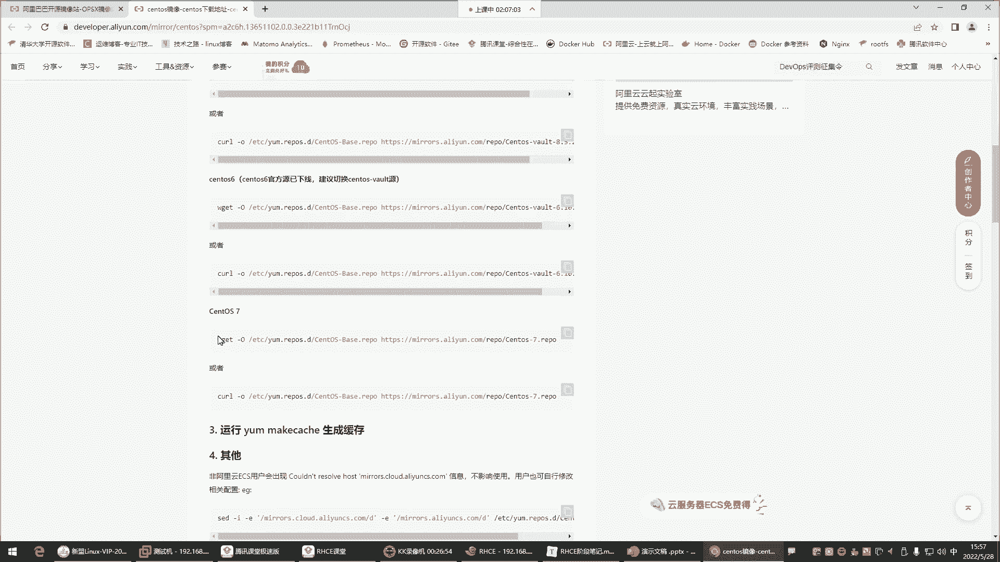
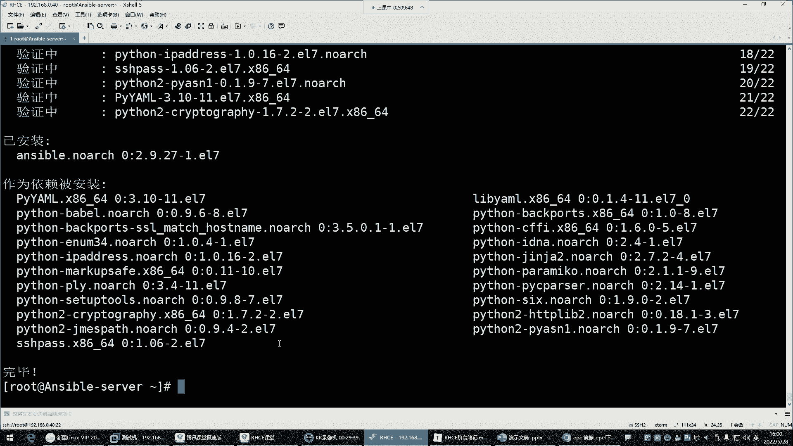
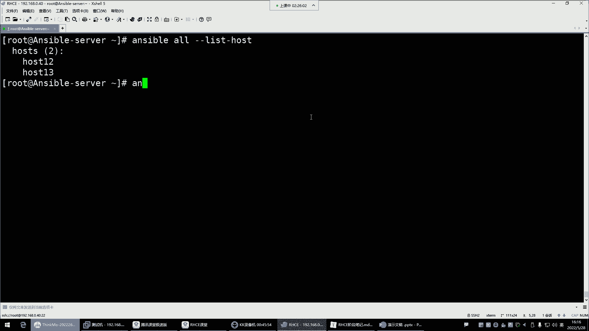

# 零基础入门Linux，红帽认证全套教程！Linux运维工程师的升职加薪宝典！RHCSA+RHCE+中级运维+云计算课程大合集！ - P60：红帽RHCE-25.Ansible批量运维工具介绍及安装 - 广厦千万- - BV1ns4y1r7A2

好，录屏也okK。那接下呢我们就讲这个安斯波，安斯波是个啥呢？😊，An滋ible。是2013年推出的一款IT自动化dops软件。这个dops呢后期呢会给大家去详细的去讲解什么叫dops。它是一个什么呢？

符合自动化思想的。注意哈，叫符合自动化思想的这么一款软件。基于python语言开发出来的这个后期呢dops也是大家在今后的学习过程中，这个里边有非常多的自动化工具，是我们在第四阶段的时候就开始学习了。

能够让我们的工作变得幸福啊，这是这个dops。😊，然后那安思伯呢也是在这个dop里边。一个非常出色的一个什么呢？叫做批量的管理工具。注意哈，安berg是批量管理工具，现在是属于红帽公司redhead。

因为它被这个red redhead给收购了。那对安斯伯来讲，它是一个批量的管理工具。我先给你讲讲这个批量管理工具，它应用场景在哪儿？OK吧。比如说呀现在企业里边呢是有非常多的服务器，让你去维护它啊。

那那么多的服务器大家来思考一下，就是我现在有这么一群服务器去管理。😊，去管理哈，就比如说就刚刚。我要对他们做一些备份。😡，啊，或者说我要给这机器安装个包。😡，那这么一群机器，我怎么去同时去批量管理啊？

大家有没有想过呀？😡，同时管理哈，我可不是说一台一台的去连接。😊，然后一台一台去去对他们进行。比如说配置啊、管理啊，不是。我想实现批量的管理，因为你一台一台去连接，在企业里边一个运维负责个几百台服务器。

这很正常。啊，写个脚本发给这些服务器，那你一台那你也是一台一台去发，你写个脚本，你传给这些服务器，也是一台一台去传。😡，那你也也不行，跟不上现在的效率了。那怎么办呢？啊，批量管理工具。

就可以帮你很好的解决这个问题。所以现在企业里面叫批量运维，批量运维就通过这些。诸多的工具帮你实现。安斯不就是其中一个。安斯贝的话呢看看。😊，它目前来讲是应用或者说占有率最多的这么一款软件。

那我们先给大家说说，就是除了安思er以外，咱们这行业里边还有哪些批量的管理软件呢？像chef。😊，还有pt，这些也都是批量的管理工具。我们都可以基于这些工具去对这些服务器做批量的维护。好。

那有了这些批量管理工具，我比如说我想同时看这些服务器的一个资源利用率，看什么呢？我看它的内存，我只需要在我的管理主机敲一个什么呢？free。杠H。这个命令，那所有的节点的内存信息全都反馈给我，给力不？

我想给这一群服务器安个包，我只需要在我的管理主机敲个亚杠外in。啊，后边包名所有的节点把这个包全都自动安装上。是不是非常给力啊？啊，这就是批量国类工具。我想给这主机拷贝个文件过去。我敲一个拷贝的命令。

一个文件同时拷贝到上百台服务器，给力不给力。这就是批量管理工具啊，但是呢ppet跟chi。😊，这种工具呢现在在行业里面已经淘汰了。为什么淘汰呢？是因为他们不好用。😡，然后基于ruby语言写的也比较冷门。

所以这个这两款工具呢，现在你就不需要去了解它了，你就知道它是一个管理工具就行了，而且是一个批量的管理工具。现在咱旗业里边已经淘汰了哈。😊，所以没有必要去对它深入有任何的了解。好。

那下边呢我们给大家说说安erer跟st suck这两款管理工具。我们先给大家说这个s suck。st suck跟安berg它们之间的差异在哪里呢？因为s suck它是CS架构。

sal saga可以简成叫salt。SALT叫st。st呢是CS架构，这个CS架构我给大家说一下啊，就是叫服务端跟客户端的一个架构。😊，就如果说我这个节点是用st来搭建的一个。管理服务器。色的。

那这个管理服务器想要对这些机器进行管理的话，注意我得在这个机器安装st的管理软件。能列解吧。架构具体是什么？呃，架构的话，你可以把它理解成这个结构，是一个结构哈，就是在公司里边。😊。

我们呢有一款产品想让用户访问，就比如说淘宝。淘宝他想让用户访问，你要知道一个淘宝的电商平台，它的。整体我们称之叫架构。它的那个架构里边要有什么呢？要有网站服务器，要有数据库服务器，要有负载均衡服务器。

还有一些其他类型的服务器，缓存服务器等等等等。诸多的什么呢？诸多的服务器，或者说诸多的服务组成了一个完整的淘宝网站。能理吧啊，所以什么叫架构呢？其实就是一个结构啊，在这个结构里边有很多个很多很多个服。

有提供网站访问的，有提供数据库、数据存储的，它是这样子的。这叫架购。那现在在我的企业里边，我想用这个st。😡，去管理这机器的话，你这个管理节点安装管理节点的软件包，被管理节点还得安装什么呢？

被管理节点的软件包。😡，就这种CS架构。就是你服务端，我们称为就是管理节点。😡，安保。可能说比较省事儿，就一台机器嘛，我就找一台机器当我的管理节点就行了。这节点就是机器的意思哈。😊。

而这些被管理的节点呢，那它的数量太多了呀，我每个机器都得安装软件包，是不是啊？你有500台机器，这500台机器都得安装。😡，软件包。那个软件包是能够让st能够连接到这个机器的那个软件包。

所以这叫CS架构，我们称之叫客户端。软件。而这个呢叫服务端的软件。所以这种的话，你要搞清楚它的前期的环境部署是非常麻烦的。工作量比较大。好，所以这是softs它的一些特点。

对前期的环境部署啊比较麻烦一些。而安塞ible就不一样。安ible。轻量级的批量管理工具。这个轻量机体现在哪里呢？我如果用anible去关理那机器。我告诉你安塞伯。😡，它的特点就走SSH。

我找一台机器安装好安。那anible。就可以干嘛呢？通过SS4H这个协议。注意。它通过SSH协议是连去连接每个机器。就像我们平时用叉el连接我们这个虚拟机一样，走SSH协议。

那只要是这个机器开启SSH安数就能连它。

能理解吧，就等于说只要我这个虚拟机一开机，咱们叉ll用SSH是不是直接连呢？😡，为什么能直接连呢？😡，因为我这个虚拟机里面默认就有SSH那个服务。

默认是不是随机自起？😡，所以对安斯伯来讲，它比较清亮，清量体现在你只需要去。干嘛呢？前期的环境准备的时候，只需要去部署一个管理主机就行了。而这些你要管理的主机呢？😡，他们默认都有SSH，你就不用管了。

比较省事了。😡，啊，这就是安滋味，那是不是？对我们的工作来讲就比较幸福了。😊，啊，部署一个节点就行了。啊，所以说现在安的占有率呢是要远远超过s3呢。这是以上常见的管理工具的一个介绍。大家有一个概念啊。

好，那接下来。对于安斯来讲呢，它的特点呢。其实我觉得这个我们简单了解一下就行哈。对于这种批量的管理工具，我们主要还是重于实操。理论的话呢，简单说一说就行。

aner呢它是python语言写的那python语言里面呢会有分流的模块，其中有一个叫primi的模块，就是实现SSH协议的连接的。通过prim能够基于SSH协议连接那些主机，这个你了解一下就行。

没有什么需要你背的。所以默认只要背过类节点开启SSH服务，IS就可以去管理它比较省事。所以，使用anserl不需要在客户端主机安装那个叫Aent agentent就是什么呢？叫客户端程序。

这客户端主机我们也称之为叫被管理主机。A阵呢就是客户端的程序。这个程序是让管理主机能够连上它的那个程序。好。安斯宝模块化车解，并且模块丰富。呃，这个什么叫模块给大家说说。模块就是帮你实现功能的。

这个比如说我想用安给我的这些主机去安个包。那这时候呢他给你提供一个专门的压模模块。这个压模模块它就是用于。专门帮你去安装软件包的这么一个功能模块。

所以你就直接调用这个yer模块去给这些被管理主机安包就行了。好，那我现在还想干嘛呢？我现在还想给这个主机拷贝个文件过去。那他给你提供专门的拷贝文件的模块。靠背模块。你到时候就调用拷贝文块去做文件的拷贝。

好，我想给我想对这些主机执行一些系统的管理命令，比如看看内存啥的，用这个模块。设用模块帮你执行系统里的常用的管理命令。所以什么叫模块呢？这就叫模块，就是安ible的一条一条的命令。

只不过在拍摄里面叫模块，在渣里面叫类。在秀里面就命令。叫法不一样。好。那接下来呢我们对于模块来讲呢，安ible呢提供非常多的模块让我们去使用，而且它还允许你自定义。什么叫自定义呢？

自定义就是允许你自己开发。你觉得你有些需求，安ible本身自带的模块，它并没有给你提供自己开发就行了。而这个自定义模块可以用任何语言去写，也包括设有源。😊，好，这是模块啊。

到时候我们主要学的就是安斯布的模块。🎼就像我们学习的系统命令一样，我们学这个系统。我们就要学就就是要学习它的命令，没有命令，这系统你管理不了安斯宝也一样。我们学安思宝学的是啥呀？😊，它的模块没有模块。

我们啥也干不了。好，那安erible呢还有一些其他的额外的功能。安ible基于PY ya某这个模块，这个PY ya木也是python语言里边的一个功能模块。这个模块能够让安ible支持playbook。

什么叫playbook呢？叫剧本。这个剧本干嘛用的呢？可以通过playbook完成一些复杂的重复的工作。这剧本我告诉你就是。😡，我们在设园里面叫什么呀？😡，我们在设有员里面叫脚本。

那个叉叉叉点SH的那个脚本。安什宝。里边人家不叫脚本，安斯不里边叫什么呢？😡，安是不叫剧本？知道吧那个剧本是基于压门的语法去写的。也是把安的模块往文件里面去堆积就行了。就是你想用an执行什么操作？

比如我想用安s去这个安装一些软件包啊，部署些系统环境啊。好，你把你的模把你把它的模块按照顺序就。往这个文件里面写就可以了。然后到时候呢，你执行这个文件。😡，从上到下帮你去执行这个文件里的模块。

最终帮你实现这个功能。所以什么叫做模块啊？不是什么叫普利 book克呀？就是安斯布的脚本。😡，编好理解了吧，现在。好。那接下来呢也是完成一些重复的复杂工作，跟脚本的功能是一样的。

只不过这playbook基于的是压么的语法。压么语法的话呢，我们在这个阶段不讲，为什么呢？这阶段讲也没有用。这个阶段讲安主要是为了什么呢？主要就是为了。😡，有些人呢考试。有些同学考试考试的话呢。

在红帽班考试里边是有安ible的考试题的，所以给大家融入了一些an部的内容。给大家讲讲安ible的基础的使用。到时候你在考试的时候，不至于说对anible你感觉非常的陌生，能理解吧。所以这个阶段不细讲。

后面再给大家细讲。所以这个阶段对安思来讲，大家就熟悉它的使用就可以了。啊。那接下呢对于它的这个图标的话呢，我们可以去它的官网看一眼，这是它的官方网站。

好，这就是安伯的图标。呃，查看cookie首选项算了吧。我们在百分之二使用cookie了，同意。

O好，接着呢说一说哈红现在是属于红帽公司了，然后安斯宝呃，这里边的话呢，我们可以翻一下。

然后它这里边嗯。什么自自动化平台是任何人都可以使用的IT自动化技术。anerible自动化平台过去几年不断发展，提供强大的自动化的解决方案，看到了吗？哎，这个等等等等，什么工作原理，自动化你的用力。😊。

这里边哈安的工作原理，这里面开始使用啊，这里面可以看到的文档，学到更多，开始使用。😊。

嗯，下边那么客户成功的案例可以看一看。客户成功案例这里面看看有有哪些企业用它的东西成功了呢？

嗯。这些企业我们也没见过呀。非常多的企业看了吗。对。后面还有讲的看一下吧，随便看一看啊他们家的这种成功的案例。算了，别研究了哈，这种东西。😊，哎，语言有中文的吗？简体中文哇，那太好了。成功案例。

这里面都有中文文档了，看到吗？中文文档，那你看起来。😡，那可以说是。非常的给力了，是不是产品。😊，然后。现在其实啊。其实我跟你们讲啊，现在大多数的这个开源软件现在都给我们提供中文文档了。

所以大家今后的软件学习遇到一些新的基础真的就不难了。因为有中文的文档，我们说曾经啊你去阅读官方文档，那真的是没有中文的。对于那个英文不好的同学来讲，那简直就是我们说就如同读天书一样。😊，看不懂。

而现在你看大多数的软件给你来一个这么清晰明了的中文，那你还有什么看不懂的呢？是不是啊就像你看书一样呗啊，看看那个红红帽安ible自动化平台。😡，这它的产品哈想实现什么自动化网是应用自动化还是网络自动化？

😊，你的安装升级点一下。哎，这个文档为什么没有中文的呢？刚夸他一下。我刚夸完他。😀呵。😊，这这个页面就没有中文的了哈，那确实没有办法了，算了吧。嗯，我们就这个哼。行了，那咱就来说说实验环境吧哈。

我们今天的实验环境三台机器。😊，来给大家演示这个安s的用法。三台机器的话呢，这个主机名跟角色我都已经给大家分配好了。主机名呢选择一台机器当安sip server的管理主机。那谁呢？我们就拿这个机器。

当安斯的管理主机，然后。看看。把名字改改。后词的 name幕很臭。赛塔杠。posts name来个大写的名字。anerer杠ser加个选项杠杠。STTA回车。好，回车为什么要加这个选项呢？好，退出。😊。

重新连接一下，因为这个选项它可以让你的主机名支持大写，看到了吗？这个选项啊这个选项我们前面没有讲，是不是啊？哎给大家补充一下这个杠杠。

加这个选项就行了。啊，t it。

OK然后那另外还有两台机器，一个是hos的13。

这个主机名呃，hosse0102。行，那就后ho13吧。然后还有一台机器再连一下。

这个这个机器呢也是我刚刚准备好的。改个名就行了。让它叫host的12。退出。重新连接。ho12hos13，我要去用它管理这两台机器。注意我们说那管理两台机器。

大家以后到企业里面管理一个几十台的话，其实这个方法都是一样的。都一样哈。所以接下来呢我们就来开始说说环境准备，防火墙啥的呢，给它停掉，这个在企业里面就是给它停掉，这不用太不用再介绍了哈。

然后下边管理节点修改ETC的host文件，实现一个本地解析，这一步就变得尤为重要。😊，我们是十几了，十2跟13。13。

看看。注意我们接下来的所有操作都在安斯贝管理节点去做这两台机器。退出只要开机就可以了，能能明白吗？只要开机就行。我们现在就是演示批量运维。😡。

我就在安伯一个管理节点去对这一群机器操作，我都不需要去看他们的终端，也不需要去登录上去，知道吧？所以你看我们是不是就退出了，这所有操作都在安思ible主机操作。所以接下来。

第一步，打开本地的ETC的host文件，本地解析文件在文件里面增加什么呢？对方的你要管理的那个主机的IP主机名，192。168。0。12，它的主机名是host12。第二台192。168。0。

13host13。保存退出。拼一下host12。这叫本地解析什么呢？在本地，我可以通过名称干嘛呢？去访问这个地址。这叫本地解析IP跟主机名容的解析。跟DS的这种本质是一样的，再拼host的13也是通的。

看到了吗？通过主机名解析到了对方的IP。好，那接下来解析以后呢。

我们为什么要解析？后面再说啊，第二步呢做SSH的密认证。为什么要做SSH的密有认证？那现在呢可以讲就是安思波他管理这一群机器的时候，它是不是走的是SSH协议啊？那他光走SSH协议可以吗？

就假设我现在开个终端，我可以通过SSH协议连接到某个机器，192的168。0点这个。

12、我是不是可以连呢？😡，那你看他跟我要啥呀？😡，他是不是跟我要用户名啊，跟密码啊。😡，那我如果说光走SSH能够连这个机器，我不知道这个机器的用户名跟密码是不是也不行啊。😡。

所以也对安斯伯尔来讲也一样，我们用安思伯尔。

连接这些机器管理它的时候，我们它是走SSHH协议，让你能能够连接它。但是他得跟你要这个机器的用户跟密码才行，能理解吧？你没有用户密码，他也没有办法真正的对他去执行命令啊。😡，所以的话呢你提前做好免密。

安斯伯呢就不需要去连接每个机器的时候，再去输入这个机器的密码了。默认它以root的身份去连接。😡。

能列吧，所以就直接给他做好免密就行了。你想跟谁去实现一个什么呢？就是这种这个。你想去管理谁，你就跟谁做免密啊，那我们现在SSHhos的13的时候，是不是？Yes。我们前面做过密有认证吧，我再推出哈。

因为我前面在讲那个ithink的时候，我们做过SSH host13，是不是直接免密登录上来了？host13。😊，然后你看我现在SSH这个机器的时候，是不是也可以通过名字去SS去连接了呀？为什么呢？

因为我通过主机名，它能够自动给我解析到它的IP上面去。它的IP哈。😊，那现在我S34H谁呢？😊，后s的12的时候。首次连接输yes是不是他们两个之间没有实现一个密钥认证啊，所以我得干嘛呢？

我得把密钥再给拷贝到这个机器上面。SSH杠。co贝杠ID。以root的身份。拷贝给谁呢？host12以后，我对这个机器的所有操作都可以通过主机名去实现了。方便，这叫解析本地解析。好，回车输入它的维码。

一回车okK了。那接着在SSHhos12的时候，好免密了，看到吗？退出。美明了哈，那接来呢我们就。😊，可以干嘛了呢？我们接着就可以这个。继续往下走了，免密登录。这里面我用负循环做的负I印。

就是再跟上主机名。

然后呢，再执行密钥的远程拷贝。那对于你们来讲。机器多的话，可以通过负循环写个脚本。看到吗？也可以啊。所以我们这里面的。是12跟13。主机名是谁呢？🎼host12跟host13。

你们下去以后试试这个副循环怎么拷贝。在命令行里面哈，在命令行里面敲一个命令复循环。😊，然后去验证SSH的验证。host他12。host13。啊，那接下来我们就可以安装an这个包了。anan的包在哪儿呢？

an的包在。Epo源里边啊，我给大家说说啊，安思伯需要易po源。这个易po源的话呢，我们用阿里的易po源。这个易po源，我前面在给大家讲软件管理的时候，说过。

易po源里面放的一些额外的软件包扩展的是在哪儿呢？是在这个阿里的b源里边是没有的。😊，所以说呢你想安装安erible，就得提前配个Epro元去。那我们本地有一坡圆吗？好像没有。我们本地。没有的话。

那我们去阿里巴巴阿里巴巴开源软件仓库。这个地址是不是你们也有啊，然后前面笔记里面的哈。😊，接下来呢点s托S，这是基础的软件仓库。易po源是扩展的软件仓库。我们先配个基础的，为什么基础的也要用呢？

因为基础的需要一些依赖在基础的仓库里面，所以把这命令拿过来。

直接在这拷贝就行了，点这就拷贝了，拿到系统里面执行一下，没有W get按一个。然后再执行0边镜。啊，下载下来了，已经告诉你保存到你本地的这个路径了，然后叫这个名字。

那下边再来，这是贝斯源基础的软件仓库。那易破源呢点易剖源E剖源里边找到real7，然后呢，我们是干嘛呢？复制re7的这个仓库地址来这儿再执行一遍好，也保存到这个路径了。那现在。

系统的epo源跟贝s源都有了之后呢，我们在y杠外inser。安ible回车。好。开始安装了哈。我们今天的课讲完以后啊。你们下次的课知道上课时间吗？你们下次就不是周六日了。😡，你们以后的课就是变成。

你们以后就变成135的晚上了。😡，从第三阶段开始啊，变成135到晚上上课了。晚上7点半，到时候呢你去这个。等到时候老师会在群里面通知你们的。通知你们具体的上课时间，上课链接。

然后上课老师到时候他会告诉你们。嗯。但是你们得做好准备，是什么准备呢？就是。不是哪个老师讲的都像我一样的通俗易懂，知道吧？所以你们得做好这种什么呢？这种听不懂的准备。

安装好了哈。😊，安装好了之后呢。接下来我们就。来哈。敲一下这个命令叫查看安斯布的版本。

下调命令哈。安思ible，然后杠杠。versionson回车。我们当前安装的是2。9。27的版本，这版本也挺新了哈。😊，也也非常新了。听不懂咋办呢？听不懂就自己去网上多查查资料。😡，呵呵。😊。

听不懂不有的时候你听不懂的话，不是说多听的事儿。😡，你就得自己去网上去搜一搜了。😡，知道吧？好。然，接下来呢我们看哈看到版本了是吧？看到版本，它除了版本还有什么真，你看下面还有一些信息。

那这些信息是什么呢？😊，哎，这些信息啊，你看啊它。告诉你有一个叫confi file。这个confi file是什么？是它的主配置文件。😊，这是它的主配文件啊，在这儿。然后还有什么。

还有它的叫做confiremodel，它的模块在哪儿呢？告诉你模块的搜索路径是在你的root目录，有个叫点an plugin models。这么一个目录，L点儿。有没有一个ansible？是吧。

L点安ible有太不录。太放不录，没了是吧？当是现在还没有呢哈现在还没有。😊，那这是它的搜索路径。然后但是除了搜索路径以后，还有user shareible。好多搜索路径哈。

你看还有它的这个py调用python的路径，它得调用python去执行它的模块。因为它的模块都是pyython写出来的。啊，优色并下派安塞，这是它的一个程序。程序的路径就跟你提供那个anerer命令的。

我每次敲到安er命令。就在这个路径。啊，还有我们当前的python脚本是2。7。5的版本。没了。O。你看他这里的路径，什么模块搜索路径，它第一呢是注意它这里面有顺序。他首先是从你的加目录去搜索。

看看这个路径有没有模块，没有怎么办呢？没有就来到这个路径去搜了。这个路径就肯定有模块了。哎啊这是。看到吗？这儿哈这里面有非常多的模块儿。但是你不用去管哈，这些东西你了一下就行。那对于我们来讲呢。

现在安色本安装好了之后干嘛呀？😊，系统自带的哈2。7的非常经典的版本。s托S7的python就是默认2。7的。😊。

好，那接下来。咱们说说安思的配置文件，刚刚也给大家介绍了，还有一个文件叫清单文件。这个清单文件干嘛的呢？😡，来说说安伯有一个文件。他的这个文件是什么文件呢？叫做定义被管理主机的。定义。

被管理主机的一个文件。这个文件我们称之叫清单文件。有一个文件。这是一个文件哈。好。那这个文件里面就是你比如说。😡，我想干嘛呢？我想管理这个机器，它的IP地址是多少呢？192点168点0点多少呢？12。

那这是我要管理那个机器的IP。那这个IP地址你是你是知道我要管理他没错，那我问你安思不是知道吗？😡，啊，我要管理这个机器IP是192。168。0。12。那安斯伯知道这个机器的地址是谁吗？他不知道。

他肯定不知道，那你怎么才能让他知道呢？就是你把你要管理的机器的那个IP地址给它写到这个文件里面就行了，知道吧？你写到文件以后，安是不去读这个文件。😊，他一读这个文件，他就知道啊。

原来我应该去连接这个IP去。是这样子的。哎呀。好，那如果我还要管理另外一个机器。比如说我还要管理192。168。0。13。这个机器。那你也一样，你把这个IP纸也给它写到它的这个文件里面就可以了。

让安思宝他就自己。😡，他就你每次执行命令的时候，安斯伯呢他自己就去读这个文件了，他自己去读这个文件。他读这个文件，他看这文件里的IP地址，然后就连接这个IP就行了。

那他只有知道这个机器的IP才能够知道啊，原来我应该去连这个机器啊，连它啊，对他去执行这些模块。😊，知道吧？所以这个定义被管理主机的文件，我们就称之为什么呢？叫做清单儿。就就像一个列清单列表一样。

是不是这个清单里面不就是你要管理谁，你给我按照顺序往下写，我就读就可以了。要清单文件哈。😡，好，那现在知道这个清单了吧，是不是很重要啊，没有清单文件安不知到连谁。😊。

好，所以接下来呢清单文件我们现在在哪儿呢？😊，啊，清单文件呢是载，也是那个路径ETCan下边。啊，但是我们先看看这个目录都有什么哈。😊，S，你发现就俩文件，一个是安ible点CFG，一个是hos的字。

还有一个叫rose。这个rose是什么呢？再给大家补充一个安思ible，还有一个功能。

Ansible。还可以通过。叫rose。

这个rose。

啊，LLES哈。这个rose呢叫做。角色。啊。这个角色他。干嘛呢？它比play雷book还强大。比playbook它更加的。强大。适合去什么呢？叫做。部署那些。非常复杂的。完じ夫。例如。我去。

搭建一个这个open star平台。我们三个。云平台。可以通过这个角色来实现，但是强大的东西往往肯定是难度系数也高。所以大家先知道一下就行啊，这rose叫角色。好。

所以你现在看到这个目录是安斯伯给你提供一个定义角色的一个目录。

然后这里面是它的主片文件，这是它的清单文件。那对于主配文件打开看看。主配文件多少行呢？好到最后490行往上翻。全都是注释，看到吗？井号开头的全都是注释。都是注释的话呢，就是说都是无效的。😡。

那他真的是无效吗？不是。😡，默认的。默认的配置。你看啊有一些这种default，这种叫叫默认的意思。所以这儿呢他告诉你。哎，一些基本的默认值。从这嘛从这个在default。这一部分。

就是它的一些基本的默认值了，看到了吗？你别看是注释的哈，但是默认的值。😡。

你到时候可以改，从这往下全都是默认的。

改什么呢？啊，现在先不说改什么哈啊，但是呢有一个要给大家讲一下哪个呢？你看啊在这儿有一个叫remon。😊。

这呢叫remond port。这个remond port就是远程端口的意思。这个远程端口等于22，这个22是谁的端口啊，是不是？SSH的端口啊。所以说安宝默认是连接那些被管理主机的22号端口。

这是我要管理的机器。它基于SSH连接SSH是不是起端口啊，用22端口就让你连接我呀，所以它默认就是通过22端口去连接它。那如果SSH端口改了呢，比如果改成。我改成这个端口了呢，2222呢。

好，那你就得干嘛呢？把配置文件的端口给它改成2222，知道吧？还有默认an速度user是以root的身份去连接那些主机。因为只有root权限最大，所以很多功能呢只有root才可以用。

所以默认就以root的身份去连接它们，能理解吧？所以在这里边。😊。

一是安斯用root的身份连接他们，二就是连接它的SSH的2号端口。需要改吗？如果你的环境SSH的端口，你没有发生过修改的话，你就不用动它。

啊，还有一个inventory， inventoryventory就是清单的意思。它也告诉你了，我默认的清单文件在EEETC answer下面有个叫host。看了吗？

所以这个你在主配置文件也可以获取到它的信息。包括一些模块的所在位置。好好，他也会在你家里面会生成一些临时的目录，存储一些临时的文件。啊，这是它的插件的所在位置。啊，这些都不用管哈不用管。

我们主要就是找它的清单文件。😊，好，清单文件是不是知道了？在它的这个配置文件的同一个目录里面有个host的字啊，打开这个清单文件。😊，host好，清单文件内容就比较少了，多少行呢？44行。总共44行。

我现在跑到最后了。好，那这四4行的文件呢我们。看看。说说怎么定义啊，我们不是说了吗？这个清单文件就是让你定义被管理主机的清单啊。😡。

那怎么定义呢？就这样定义把IP写进去就可以了。非常简单。写IP哈，那我现在。就直接把你要管理的机器的IP写进去就可以了。

我们要管理的机器，那这个这文件里面难道就没有一些其他的含义吗？😡，啊，也有你看啊这里边。他这很多注释啊，就是给你一些提示。比如说像这个。他说可以输入主界名或IP地址。就是说你想定义那些被过滤主机的话。

你可以用对方的名字或者说对方的IP都行。

那你如果想要对方的名字的话，那前提是你得做这一步，叫实现一个本地解析。这样我们才能通过名字解析到对方的IP去是吧？所以那我们前面做的这一步就是为了你在定义这些被窝联主机的时候，你是可以直接干嘛呢？

通过名字去定义的。

好，那怎么定义呢？哎，他告诉你了，这有个例子，看到吗？EXEX就是example的意思。examp就是例子的意思。那第一个例子，他说你就直接把主机的名名称或IP就这样写就行了。看到了吗？

它这个就是主机名。😊，下面就是直接主机的IP都行。做解析。如果你做了解析，就通过名字定义。如果没做解析，直接通过IP都可以。那我们来试试。第一种方法。🎼咱们用host12跟host13。

这是我要管理的两台机器保存退出。好，那定好了，就这么简单哈，这定清单哈，你一个往哪写都行。对配置文件来讲，你说哎呀，那我这个位置我必须得写在这个例子一的或者这IP下边吗，不是你往哪写都行。😊。

这个文件都是注释，你觉得哪哪哪个部位比较舒服，你就往哪个部位写，能理解吧？写哪就行啊，写到最下面也可以。😡，我们就给大家演示一下怎么定义。😡，保存退出。然后呢，我们接来说说怎么用哈。

安ible不是命令吗？😊，是吧是好，你想获取他的命令帮助，刚刚hel回车。这是获取命令帮助了那这个命令的帮助。😊，有点多了哈，这字体有点大了，主要是。20。啊，这也不行。22吧号就就这样吧哈。

就这样刚个号吧。我们现在获取的这个命令帮助，你可以看到它这个命令非常多。包括前面啊从这开始，安berg可以使用的选项看到吗？什么杠H看版本，杠杠wa看版本杠V也看版本的啊，下边非常多的选项是吧？😊，啊。

下边还是做的选项，具体这时候他就告诉你了，我支持的这些选项是可以帮你实现什么功能的。小编非常多哈。啊，看到吗？什么se tax check是检测语法的。啊，干个or去看版本的。嗯，然后。

当然啊我们一般就是用什么呢？一般就是它这个有有你们你们发现了吗？有的时候它这个有什么呢？有短选项，又有长选项，能尽量用短选项的，就用短选项，别用长选项哈，不好记。😊，非常多。啊。

所以说呢这个就大体了解一下就行。因为你们。也不知道怎么用。所以接下来呢我们给大家说一个选项，anible叫杠杠list杠 host这个选项干嘛的呢？这非常的见定之意。

list是不是列出hos是不是主机叫列出主机。推车。鲍雨法错了，为什么呢？😡，为什么报一下速呢？因为列出哪个主机啊。😡，你得告诉他，在aner后边加个奥，列出所有主机回车al代表所有。这样的话呢。

他就去读那个清单文件。然后列出轻的文件里面，你定义的那些主机看了？ho就是主机几台呢？二就是两台。就是在那个清单文件里面，总共就是两台主机。然后呢，具体的信息就是你定义的时候，你写的那个主机名。

看到了吧？那我现在是不是列出这个清单文件里的这两台机器了呀？列出来以后，我现在是不是要去管理它呀？那接下来来看啊怎么管理。😊。

安思宝。命令格式呢是这样子的。う。嗯。命令格式在这儿。来看一眼。

安思博。可以跟祖名。哎，这组是什么呢？我们并没有说是吧？好，那先不用去管它。😡，啊，也可以跟具体的主机名，那你要管理谁，我要管理hos的12跟hos13啊。host12。那还有host13呢。

逗号host13是吧？哎，那这就两台机器是吧？那如果我在企业里边，我的机器比我多怎么办呢？我有个100台。

我需要用安思伯往那100台机器去拷贝一个文件过去。

那我走了，我在命令行里面写一直hos14，hos15。是吗？hosster16一直到hos100吗？这好像有点什么呢？这好像有点low了。是不是啊？所以这种定义方式有问题。我给你们演示。

就是这种定义方式有问题。所以再打开那个文件，ETC的安思ible下的。厚实不是打开以后。这种定义方式只适合。干嘛呢？叫管理单台主机。那单台主机我还要用安erer干嘛呀，就不用安s了哈。😡。

所以这种定义方式。很少用。所以他又给你列举了第二个例子，EX2。他说你可以这样，他这个属于web server的组的主机集合。哎，那也就是说它支持组的方式定义怎么定义呢？你看例子。上面是一个组名。

放到中文号里边，名字叫web service，这名字随便取叫什么都行。然后下边呢就是你要管理的机器放到组里边就行了。像他这种方式定义看哈。我们写个组名外网SRVS。接下来我想管理的机器都写到组里边。

我要管理的机器是host12，host13，我要管理的是这两台。好，那定好了之后，我以后想管理这机器怎么怎么管理呢？安。😊，在命令格式里边是不是有个组名啊？哎，这个组名就比较给力了。

你写组名web service。然后再指定你执行的具体操作。就行了。那我一调用这个组名的话。就等同于这个组下边的所有主机。我这个组下边比如说我有多少台机器呢？我有100台机器。

一个组里面定了100台机器。那我告诉你。那你没关系，你只需要输入一个组名，自动帮你去干嘛，去调用组下面的100台机器。是不是比你像前面这种输入100个主机名要要给力的多呀。😡，输入主机名。

输入10分钟是吧，别的不用干了。所以分组定义哈分组。那这个组的方式。分批管理多个组呢。好，可以。比如说我还有一批机器是数据库，那下边看他又给你举个例子，他说这个组啊，你不是说只能定义一个。

你如果还有一群其他的机器的话呢，哎你也可以继续定义，看到吧？不是说只能定义一个哈，下面还可以继续定义的。😊，那就把你的数据库再放到一个组里面，叫DB service名字人都给你写好了。

那你就按照他这种方式自己写。哎，我有一个叫DD。叫DBSRVS。但这里面名字。随便取，你让它叫叉叉O也行，知吧？只要你知道这个组里的机器是干嘛用的就行。但是我们这太没文化了哈，BBSRVS。

然后组内的主机就写就行了，一个一个写写写上去。能理了吧？那以后我想管理我的数据库，就是调用这个组名。我想管理我的web服务器，网站服务器就调用上面这个组名就可以了。😊，是不是非常给力。啊。

把这两个删掉哈，我们没有数据库服务器。保存的住，那它能识别吗？😡，🎼安思宝这时候你指定具体的组名就行了。webSRVS杠杠list杠postt回车。看到吗？有说我现在是只看这个组内的主机了。看到了吧？

几台两台。是不是也可以。那还有一种方式。你看它上面又给你什么呢？他又给你一个建议。😡，什么建议呢？但是如果你有多个主机，他们遵循你可以指定的模式的话，你就可以这样玩了。😡，啊，怎么能凑到一块儿。

他说怎么能凑在一块儿呢？😮，这样可以凑到一块儿。怎么凑的呢？你的名字如果有规律，你看他这名字是3W01。点儿。一个三点看不。第二台呢是3W02点儿。一个三步点看过第三台呢是3W03点儿。

一个三步点com以此类推，一直到多少呢？一直到063W。06。第二。这个三波点com，比就说它是有6台机器的，知道吧？那它有6台机器，它怎么样才能什么呢？哎，就是比较方便的去定义呢？它这样玩了。

用中括号。匹配了一下。它有6台机器，你看名字是不是非常有规律啊，都是3W开头的结尾呢都是这种点里个三不点com结尾的那他就这样玩了。😊，就这样了，哎，3W。然后呢，中括号。中号。001啊。

但是其实它的主主机名是我少写了一个零哈，是001，一直到006001冒号006。点儿。一个在摩点看过。那是不是一行就定了6台呀？那如果你有100台呢，你有100台，是不是这一行可以定100个主机啊？

只要有只要他们有规律，是不就可以了呀？那我们也可以这样玩。哎，我定义分组的时候，我就直接干嘛呢？我机器有点多了，我不想一个一个写了，host中括号。😡，11、冒号12。保存退出。😊，列出一下。列出一下。

看能不能识别会车。哎，一样。看到了吧？一样。是不非常的给力啊？啊，这是定义分组。是不是怎么定义都行了，现在我们各种方法，各种姿势都给你们演示了吧。所以这分组到此为止就结束了啊。😊。

那接着看始学习模块了，学习模块休息一下吧，我们休息一下，再回过头来学习它的模块吧。好吧，大家缓解一下脑恢复一下脑细胞吧。😊。

休息会儿。喂喂喂好。