# 零基础入门Linux，红帽认证全套教程！Linux运维工程师的升职加薪宝典！RHCSA+RHCE+中级运维+云计算课程大合集！ - P61：红帽RHCE-26.Ansible模块使用 - 广厦千万- - BV1ns4y1r7A2

喂喂喂，好，我们说一下啊，我看你们是。自动化没怎么听懂是吧？其实啊。😡，呃，这样哈你们别把它理解成是自动化了，你就把它理解成是一个批量的运维工具就行了。就是一个批量的管理工具，批量的什么呢？😡。

运维管理工具。哎。这样能不能听懂了？如果我们换个词汇，大家能不能理解了？它就是一个运维工具，能够让你实现对服务器的一个批量管理。😊，哎，这现在有没有问题？没有问题的给刷个一。唉，这个应该好理解了吧。对。

别别去理解的太复杂，什么这个自动化之类的，是吧？😊，所以呢就这样的话呢，就让我们能够对它有一个更清晰的认知。行，那接下呢咱们就定义好主机列表了。😊，我们也是这个怎么定义的呢？是不是很多种方法呀？😊。

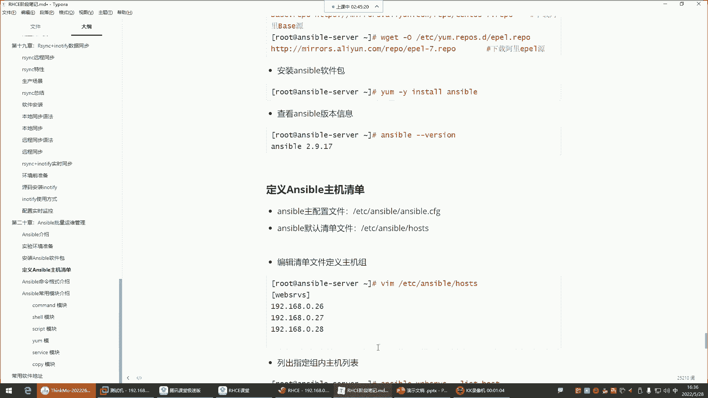

那这多种方法的话，ETC安ible。hot的4。我们各种姿势都定义了，这种姿势是最终比较给力的是吧，这种。

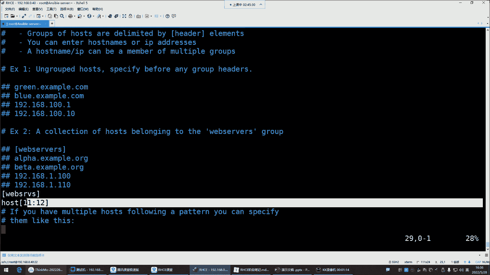

哎，放到这儿。前面省略。然后列出。组内主机列表。O。那这是第一种这这个是不是方式一啊？哎。定义主机方式一。方十一是。什么呢？就是比较保守的方式哈这样。后色的11，然后呢。houset的12。第二种呢是。

定义主机方式2，但是一般呢嗯看情况看情况。看情况定义。都行。那接下来呢咱们就开始来学习它的模块了哈，来学习模块的第一个命令叫ansible do。那ans do这个命令呢干嘛的呢？叫模块文档命令。

什么叫模块文档？ansible都是模块化设计，本身功能比较弱，都是通过模块来实现诸多的功能，所以它的模块非常重要。😊，那模块的话，我们可以先这样，通过这个an do用杠L选项列出所有的模块。

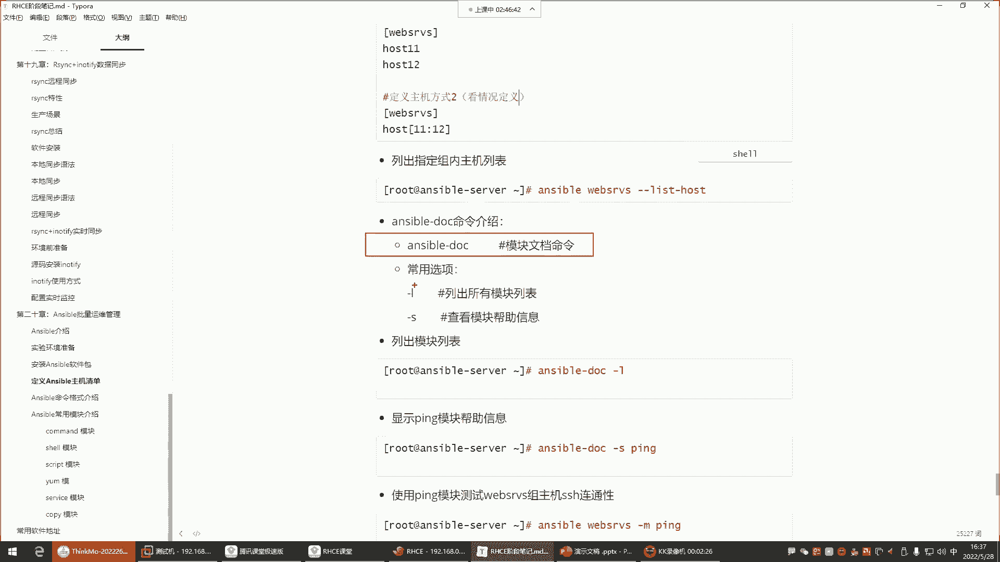

来看哈。anible杠dock，然后你可以杠个 help，简单后个帮助。然后它这里面呢，我看看啊。请参阅什么手册啊，这个不是。看看前面的介绍，前面呢也没有什么介绍，在这里边并没有介绍。嗯。

没有介绍算了吧，没有介绍的话呢，我们就不管它了哈。然后他有两个选项，一个是杠L，一个是杠S。😊，第一个杠L叫什么列出什么available plugins，什么列出插件是吧？不是就列出它的模块。然后呢。

就这样你就an do。干嘛呢？先杠L回车。你看这就是它的模块了。它的模块在左边是它的模块名字，右边是具体模块的描述信息。那这模块多少个呀？我们先Q退出自己。过滤一下管道给WC统计一下。3387个。

3000多个模块，那这个对于我们来讲可以说是非常的多了。你就把它理解成是系统里的3000多条命令吧。什么ISCD这些命令拷贝MV3000多个。哼那这时候应该慌了吧，为什么慌呢？这么多模块怎么学呀。

是不是啊？你看看这么多模块，这怎么学往下翻吧。3000多个。😀呵呵。😊，那我告诉大家啊，我告诉你们这么多的模块的话呢，我们常用的其实不可能都用得到。😡，这个安塞波啊，它这个功能非常之强大。

对各种云平台也提供了专门的模块。对于各种各样的应用也提供了专门的模块。比如说如果你是搞数据库的，我们右斜线下面搜索一个。比如你是搞数据库的，卖Cl的，搜麦C狗回车。😊，你看。看那个模块。

他说这是获取什么埃er尔麦斯克防火墙规则的。什么叫i座麦co呢？I座是微软的那个云平台。然后呢，这个微软的云平台上面有mysql数据库啊，所以说这个模块是针对于微软的那个云平台的mysql去干嘛呢？

去针对于防火墙的一些配置的模块。那你用你能用得到吗？是不是你用不到对，跟命令一样，咱就记常用的。你看看我们在学习这个linux系统的时候，大家。😊，我们学的什么LSCDK是吧，常用的这些命令。

那这个系统也3000多条常用命令呢，你能都去学一学吗？不可能吧，就学常用的。能够我们就学这些能够让我们及时变现的。什么叫及时变现呢？😡，就是希望以后到企业里面能用得着的。😡，未来的再牛逼的在眼前用不上。

那都没用，是不是啊啊，就眼前能够让我们变现的这就是好的东西。😡，好，那下面所以说对于这个模块呢，大家就别从这看了，因为你从这看也没啥用。😊，哼。大多数模块是跟你无关的，知道吧？好。

进来呢就退出Q就行了哈。常用的模块给大家讲几个能够满足我们的工作需求就行了。😊。

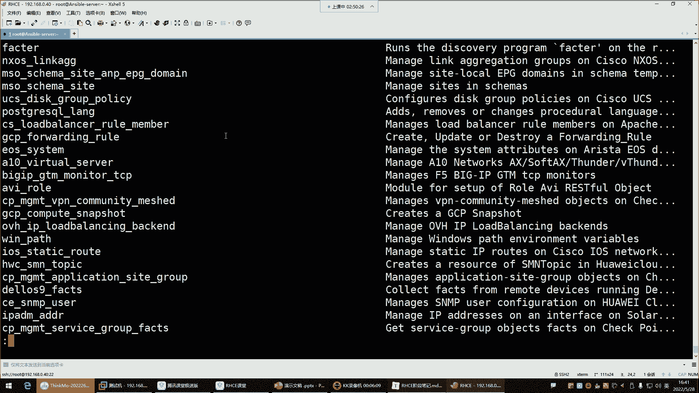

只讲一部分，现在现在先讲一部分啊，然后还有一个杠S叫查看模块的帮助信息。这个杠S的话呢，我们就是有比如说我现在知道有一个模块叫P模块。😊，这个P模块呢你可以看看这个P模块具体是干嘛用的。

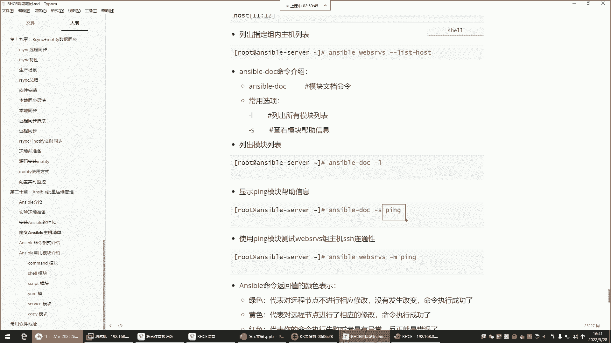

那这时候。你就安 do杠S跟上拼回车。他就告诉你了，你看啊。😡，他这有一些描述。他说尝试连接到主机，验证一个可用的python，并在成功时返回嘭。那他是不是告诉你这个P模块的功能了呀？

他告诉你说这个模块可以去，说白了就是测试主机之间的连通性。测试什么呢？就测试远程主机的python环境。如果远程主机有pyython环境，他就给你反回一个嘭，能理了吧。呃，对，这是跟其他机器去测试的。

这个哈。所以我们现在。对于安的模块学习的话呢，杠S是可以让你获取到模块的具体帮助。那你看我现在知道这个模块了是吧？那下边这是模块名字，那这个data是什么呢？这个data是叫模块的参数。😊。

这个模块的参数大家这么去理解。😊，模块就是aner的命令。知道吧？参数就是模块的选项，就像我们学习系统命令一样，LS是命令。你光敲RS功能有限。🎼但是阿莱4你想让它变得更加强大，我可以加选项，是不是？

安斯尔也一样，安思伯尔给你提供的模块，你就把它看成是一个一个的命令。😡，安这个参数就是命令的一个一个的选项，专门调整模块的功能的，就这么去理解就行了。知道吧？但是有但是有的模块是不需要去使用这些参数的。

为什么呢？就像我们在执行有些某些命令的时候，也不需要加参加选项一样。😡，知道吧？就比如像CD，我就想切换个路径，我需要加毛选项吗？😡，是不是啊？所以说这有些模块是不需要选项的，但是人给你提供了。

那你说CD没选项吗？CD有你看看。😊，CD，你刚刚耗数的时候。人你以为人家没有选项吗？有是不是只不过没有必要而已。😡，嗯。走。

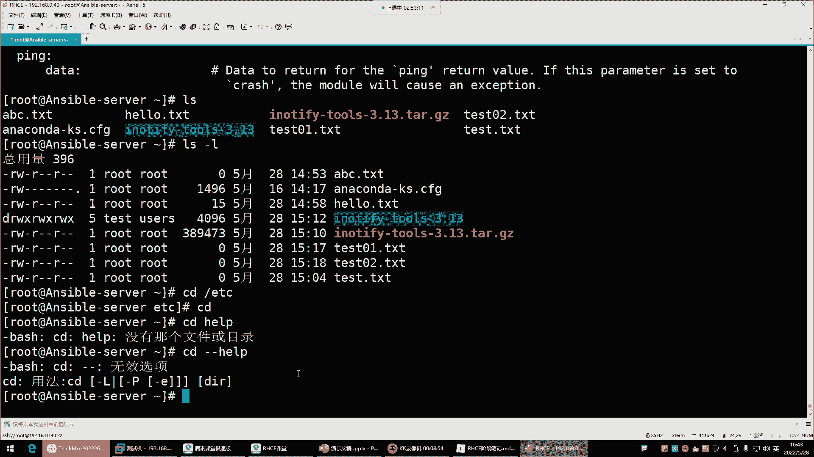

好，另一台地址。呃。咱们前面不是定义了清单了吗？不是在清单文件里面指定的那个主机信息吗？在清单文件里面定义哈，然后到时候安自动去读这个清单文件。😊，路径下这个清单文件读完以后呢，它就能够什么呢？

我们就通过组名去。对这个组内的主机去做操作了哈。

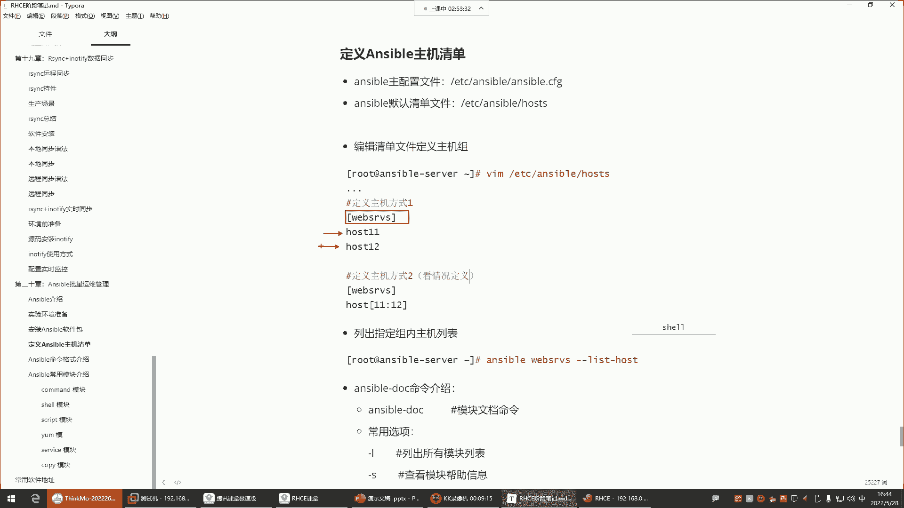

好，接下来。我现在知道有一个拼模块了，拼模块怎么用呢？😊，安思伯。然后。先指定组名，就你得告诉对哪个组去操作SRVS这个组一定是你在清单文件里面定义的那个组。好，然后接下来。你想调用模块，注意啊。

我要对这个组去执行操作，是不是得通过模通过模块啊？😡。

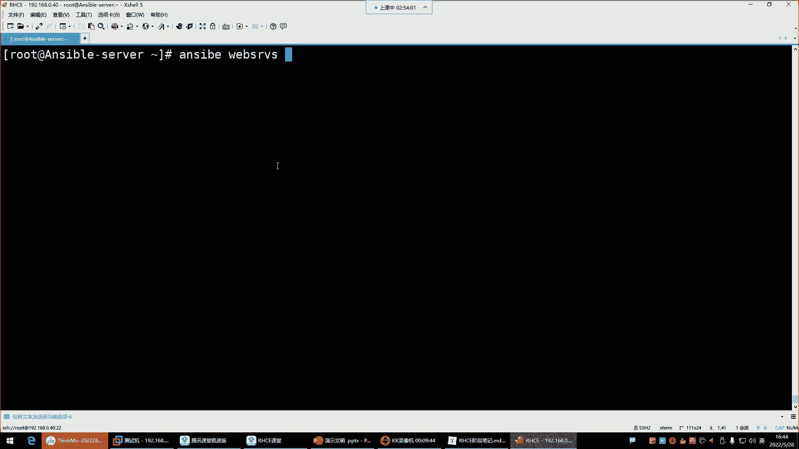

咱们调用模块呢？杠M。杠M跟上模块名就调用模块了。

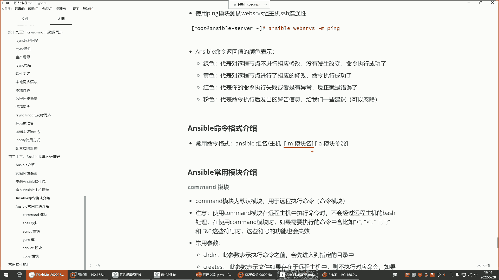

杠M就是model的意思。就是model的意思。但是就直接杠M就行了。杠M调P模块。好。骗谁呀？这个批模块跟谁测试啊？😡，是跟这个组测试。哎，他就去拼这个组的所有主机。好，回车。回说。好。

有一个主机没拼通，看看。有一个厚色的11。他说什么了呢？f失败了。😡，看看啊，他说通过SSH连接主机失败。SSH。hoss的11。后子11呢。啊，厚子12啊啊12那我们定错了哈，ETC。😊，安厚实的是。

那是不是就是12到13呢？😡，12到13。再拼一下。好，可以了。看哈。看见颜色了吗？红色就报错，绿色就成功。绿色这是一一种比较幸福的颜色，就成功了，告诉你。好。

所以说有有有的时候我们的这个生活跟这跟这个技术领域的都得需要这种绿色啊，它会让我让它会让我们变得更加幸福一些。那接下来呢我们来看看它这个返回的信息。就是我们每次通过安思韦尔对这个主机操作的时候。

他为了明显的告诉你他的执行成功还是失败了，他会有一些什么呢？哎他会有一些。😊，返回信息。比如说hose12看到吗？后s12是谁呀？是不是这个组内的主机，后s13是不是也是这组内的主机啊？😊，啊啊。

后边告诉你s个 sizeize，s size是不是成功的意思啊？😊，哎，也就说安斯伯这条命令执行成功了。拼这两拼这个组内的主机。这个主机的环境是可用的。都有拍送环境。然后呢，他告诉你。

他调用了an的什么呢？那个python解释器，这个路径下是python解释器哈。因为这个模块都用pyython写出来的，得通过python解释器去干嘛它执行这个模块。

所以这是他执行模块的python路径。😊，好，那这些信息呢都不是什么重要的那。😊，主要就看后面就行了。这位置死了再次告诉你成功就行了。😡，能列吧，别的信息没什么太多可讲的。

其实这些信息也没有什么太多可讲的，干嘛呢？看颜色。😡。

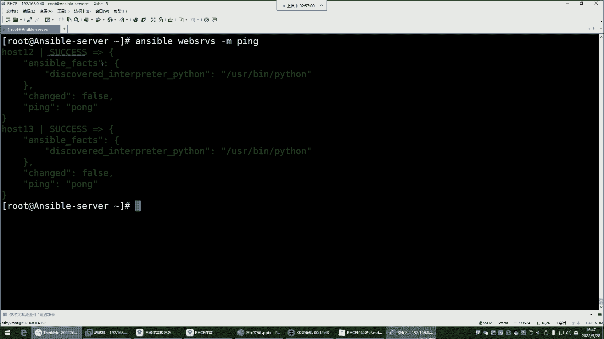

注意安色的命令返回值的颜色是可以清楚的告诉你这个命令的成功与失败的。就像刚刚咱们这些见红的，这见红的话。

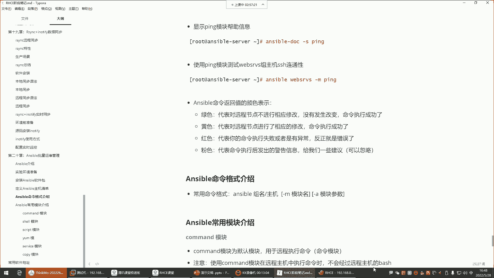

用后脚跟想，你都知道他可能是失败了。是不是啊啊，所以说非常的见明之意，红色代表你的命运执行失败，或者有异常，反正就错误了。

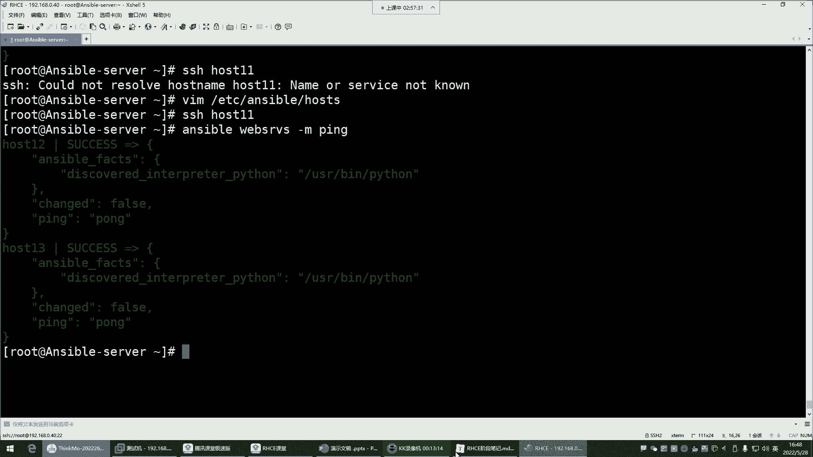

绿色呢代表对远程节点不进行相应修改。没有发生改变，命令执行成功了，这句话无法理解是吧？

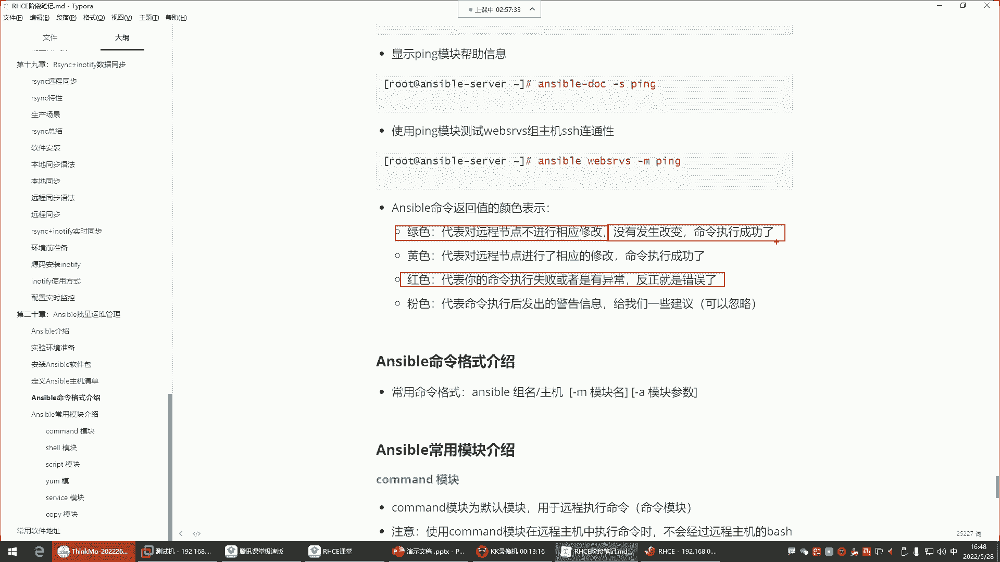

我再给你们来一波操作。我换个模块哈，调用一个是哪个模块呢？设个模块。😊，杠A指定模块参数。

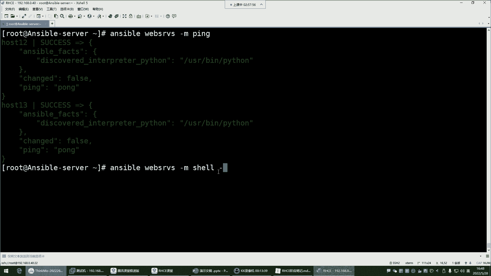

所有模块我要执行一些命令，我得通过杠一来指定。杠A。指定模块参数。那如果如当然我们一会儿再说这个具体的模块哈。对。😊。

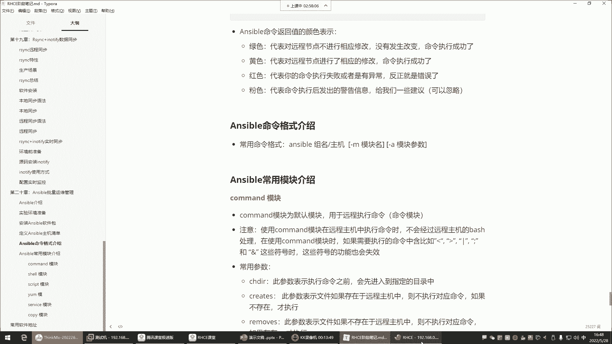

接下来我们看我杠A指定我具体的模块的操作了。

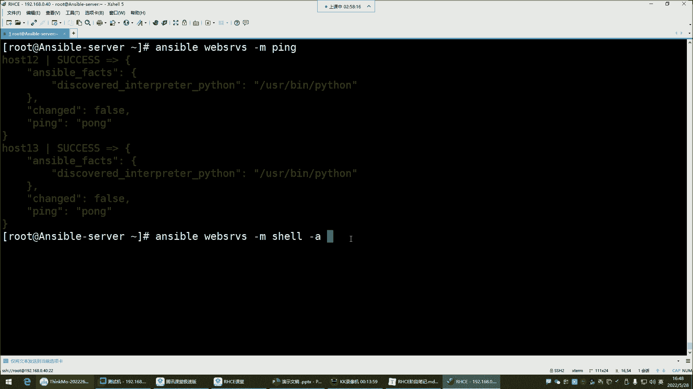

那这个操作啊，其实准确来说，杠A是。叫指定具体的操作。嗯，模块参数也可以叫嗯具体的操作。

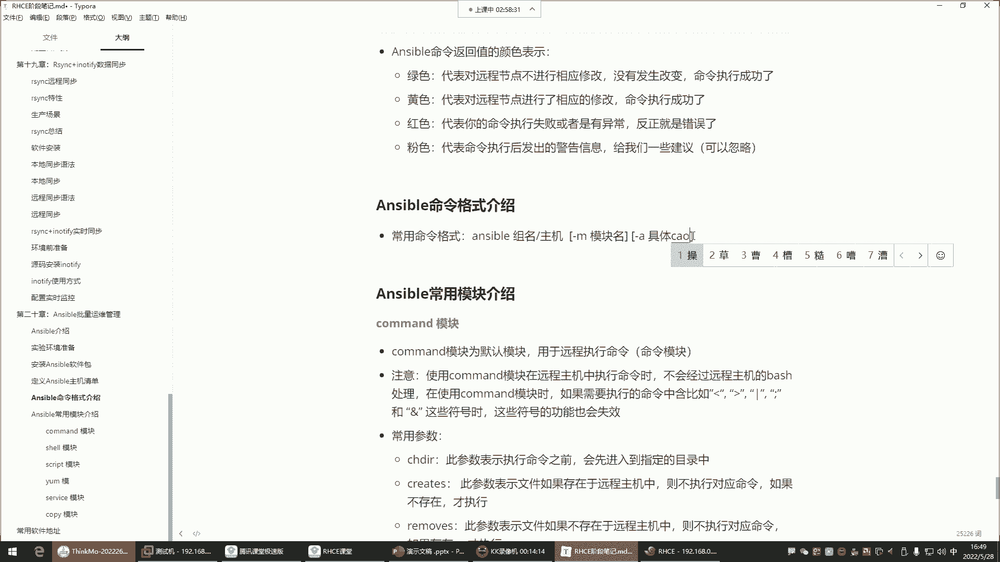

那接下来杠A。看哈用引号引起来你的操作，你的操作要放到引号里面，不然它有语法错误。比如说我现在干嘛呢？我先touch。😡，touch一个文件在哪呢？在远程主机的OPT目录建1个hello点TATT。

我这条命令注意啊，我的这条命令是不是对这个组去执行啊？😡，调用的是另外一个模块，这个模块一会儿再讲杠A是指定具体模块的操作。那在这里边我干嘛了呀？touch。😊，系统的命令创建文件的。创建什么文件呢？

在OPT建个hello点TIT。别hello了，换个文件啊，或者说我直接。删除。2M杠2F清空OPT的目录。回车。来看。看看。这条命令啊有两种颜色返回。两个颜色哈。第一个颜色呢是一个警告，看了吗？

有一个警告，警告什么呢？😡，他说让你考虑使用这样的方式。的文件模块，而不是直接运行RM。好，有时候他不建议你直接去执行这样的命令。它有单独的这种什么呢？哎，这种方式可以帮你去做一些删除的操作。啊。

但这种警告。就像现在警告年轻人一样，少熬夜，别打游戏，多学习一样。知道吧？你完全可可以给它忽略掉。那下边看黄色。黄色。就是什么呢？首先呢你看后面叫称着。😡，趁着就改变了是吧？哎。

你看这个绿色是死 size成功了。😊，看到了吗？那你发现这个黄色跟绿色之间。

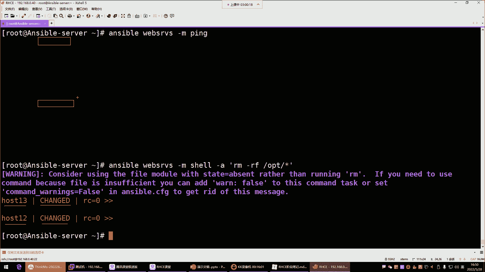

他们两个的意义是什么呢？就是都是代表你的命令是成功了。绿色。把这个掉个个就行了，命运执行成功了。代表命令执行成功了。代表命令执行成功了。好，但是它的区别是什么呢？看区别是绿色，对远程节点不进行。啊。

就对员人件也不会造成改变。不贵。造成改变。对远程节点。造成了改变。这样的话就比较好理解了。首先呢粉色是你命令执行以后发出的警告，给我们一些建议，你可以忽略。哎，这个。而这个黄色呢是都是命令执行成功了。

跟绿色这两种颜色啊，你只要看到甭管是绿色还是黄色，你的命令都是执行成功了。但是这个绿色说对远程节点不造成改变，这个就像我干嘛呢？我拼。

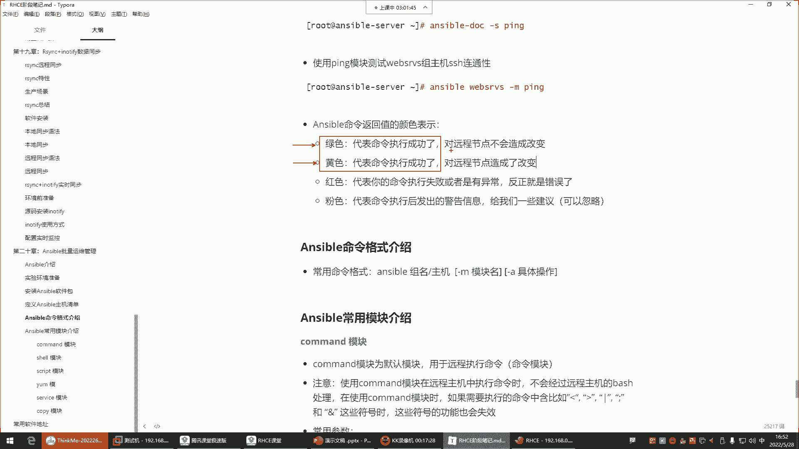

host的1二1样。我拼他。那我拼这个主机，这个主机会发生一些变化吗？😡，嗯。😊，呵。😊，呵呵。😊，ううん。会吗？不会。😀嗯。😊，对我会看他说的这个只看。不做。是不是啊成功了就绿。对。

连看再做完事儿了就黄，摸都没摸。😊，连碰都没碰就红了，是吧？😊，这个哈就是说你就拼这个主机，这个主机是不会有任何的改变的。而我为什么这个命令它是黄色的呢？因为我这个命令是他妈的删了他文件了。

你看我直接把远程主机OPT目录。😊，下的所有东西给他删了。😡，那你想想那远程主机这两台机器的OPD目录，那文件。突然间就没了，是不是完整性就发生变化了呀？😡，啊，这就是我们所说的什么呢？就造成改变了。

能理解吧？所以我们以后对于安斯伯来讲，哎，这几个颜色是不是都给大家试了呀？😊，红色一看报错，绿色一看成功是吧？粉色一看警告。😡，就警告年轻人，别找对象是吧？应该多学习。😡，就警告你。😡。

是不是但你也没听啊，是不是啊，黄色也是成功了，所以就通过颜色判断就行。安思伯是哈通过颜色判断是不是比看那些结果要强了。😊。

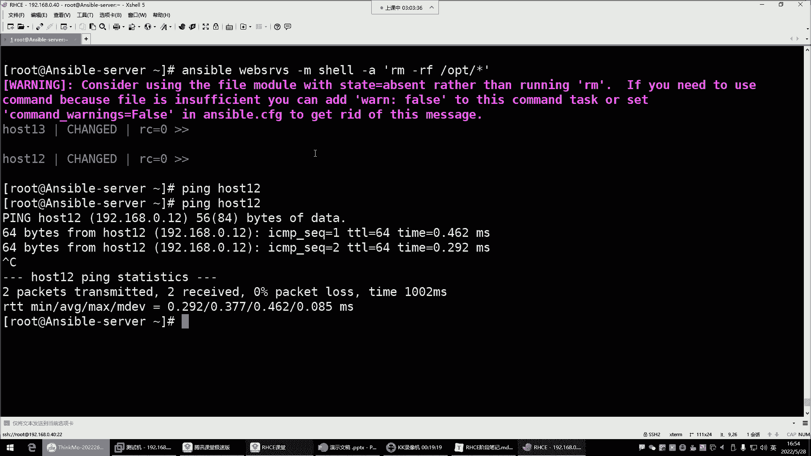

现在就分手啊。😊，可以哈，我们支持你。😊，我们永远都是你背后的这个。这个什么呢？叫精神支柱。好了，那命令的返回值给大家说清楚了，接下来来给大家讲第一个模块。可만的。com曼的是安斯的默认模块。

这个模块是用于远程执行命令的。好，这个模块。

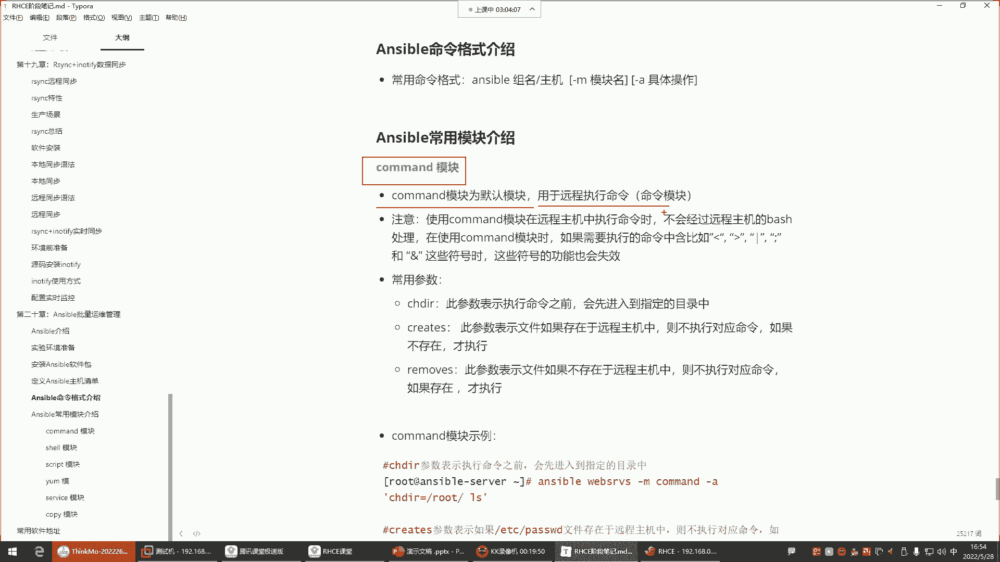

呃。怎么说呢？Anible杠道ck。然后杠S1下。com on等一下回车。看吧，磨块的介绍。告诉你在目标上执行命令。😡，也就说我想执行一些普通的命令，用这个模块就可以了。😡。

那这个模块的支持的参数都有哪些呢？其实就像它的选项一样，它有非常多的选项。那这么多的选项。😊，我们对命令模块来讲，其实大多数用不到。用不到哈。我假设啊来给你们演示演示，比如比较典型的这种模块。

什么趁着DR。😡，趁着DR，他说在运行该命令之前，请切换到该目录啊，这是他给他解释是吧？那就是说我如果想用参数的话，就这样ansible看看指定组名webservice杠M调用开模块。😊，它是默认模块。

那如果是默认模块，你可以不用指。直接杠A就行了。杠A指定我执行的具体操作就行了。啊，我的操作里边会调用一个参数，叫称值DR啊，参数后边用等于号来指定具体你参数的值。好，那我的参数的参数的值是OPT目录。

好，接下来L莱。推车。大家看一下就知道了。这个称着电R是什么意思呢？就是我现在想执行一条LS命令。😡，我的LS是对谁执行的呢？你的称着DR切换到哪个目录，我就在哪个目录敲个LS。😡。

所以他现在给我列出来的是LS的目录，什么都没有空的。为什么前面被我给删了是吧？那你看我再看看效果，我切换什么呢？root。😊，你看。就是这个参数是干嘛的呢？就是帮助我们切换到某一个目录。

再去执行具体命令的。这叫趁着电R。那现在看的就是rootom目录下的一些文件了，看到了吗？两个文件。😡，OK这是远程主机的信息是吧？所以这参数有必要吗？😡，你们可能觉得。有必要。

那我告诉你这有点脱裤子放屁了，这接阿莱斯 root它不好吗？😡，这接L这些子儿LSOPD不好吗？😊，是不是啊？这不好吗？有必要非得去记一个参数嘛，是不是？😊。

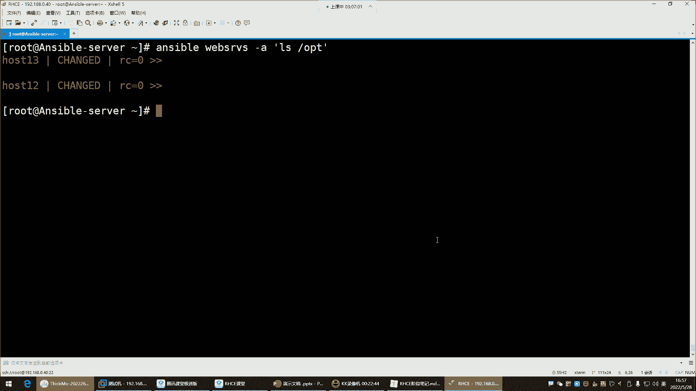

还有一些其他的参数，什么可瑞斯。此参数表示，文件如果存在于远程主机，则不执行应命令。如果不存在才执行。还有那个。

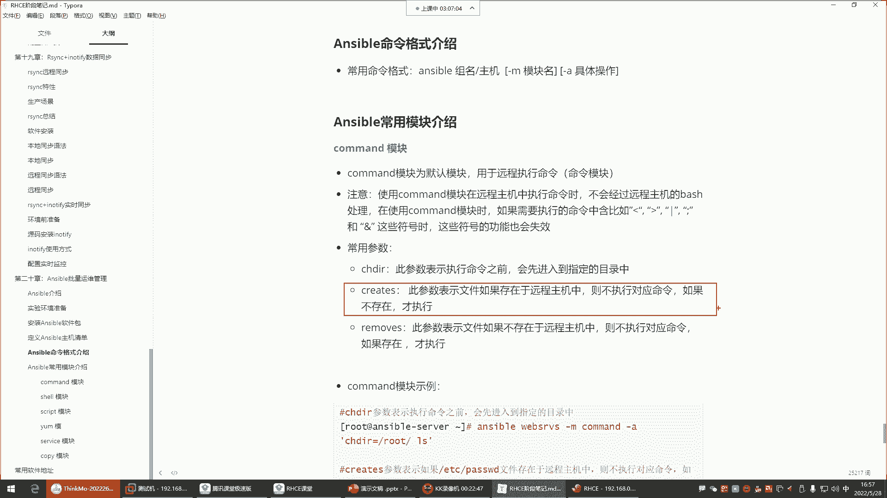

你看哈。克瑞德斯。这呢啊克瑞塔斯。啊，什么文件名从2。0开始啊，如果它已经存在了这一步不会运行。其实解释的也比较清楚哈。😊，他说如果他已经存在了这一步，不会执行。什么意思呢？我想建文件。😡，嗯。

它是它类似于一个判断。anible指定组名web service。杠A已定具体的操作了哈。😊，克瑞特斯。等于指定个文件。什么文件呢？比如说。😡，指定1个OPT下的hello点儿贴T。后背命令touch。

OPT下的hello点儿TT。来看。我的这个操作是什么呢？就是我用cate这个参数指定了一个值。这个值是OPT下的一个文件。那这个可瑞他会帮我去干嘛呢？去看这个路径有没有这个文件。

如果这个路径有这个文件，后边的命令就不执行了。因为他说了，如果存在则什么呢？是不是啊？这不就一个异服判断吗？😡，衣服判断。嗯。啊，如果它已经存在了，这一步就不会运行了，能理解吧？所以我们看看回车。哎。

执行成功了。看了吗？它又它又给我提示了是吧？他说你可以这样star等于touch。st等于touch，就是你还得用它的参数在这儿。再加个参数叫。🎼star等于touch OPT下的hello点TATT。

ABC点贴梯吧。ABCC点TATT。ABC点TT。这啊。怎么还是出现这个警告了呢？😡，看一下啊。我都已经按照他的这个方法做了呀。那他建议你这样去。执行，这不是告诉你了吗？建议你ta。🎼等于touch。

然后跟上后边的路径跟文件去创建，不是直接是用touch，然后他也给你报错了，给你警告了，警告就警告吧，我我我们也不管它。好，那我们看看。拉斯远程的OPD。是不是两个文件都出来了？😡，都出来了吧。好。

那如果都出来以后，你现在再执行命令。回托。哎，变绿了。哎，变绿了哈。😊，它为什么变绿了呢？😡，嗯。为什么呢？他告诉你，他跳过了，你看这哈。😡，他说他跳过了。😡，跳过了。看到吧？他说因为因为什么呢？

他说因为OPT有这个ABC点TATT，所以他退出了。😊，啊，目标存在看到吗？目标存在。所以他跳过了，所以你说这玩意儿是不是一个义步判断呢，判断这个路径有没有这个文件。如果有呢，那后面命令就。😡。

直接什么呢？直接就跳过不执行了。只有没有的时候，他才去执行后面的命令。因为我们第一遍的时候是不是没有这文件，第一遍执行成功了，第二遍呢就失败了。是吧。没事儿，不用去理会他啊，警告警告你理会他干嘛呀？😡。

我告诉你，你别搞对象，你听吗？😡，你好好学习是吧？😊，是。你听吗？你也不听啊是吧，不得警告吗？😊。

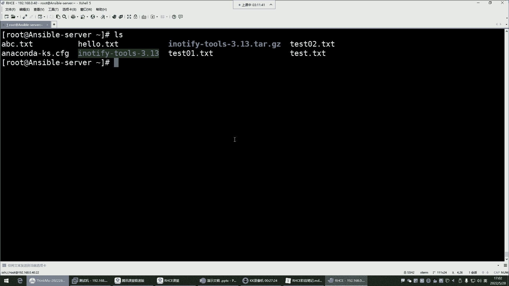

好，接下来呢我。给大家演示了两个参数了是吧？第三个remo。这个参数的话呢，其实也是一个义务判断。

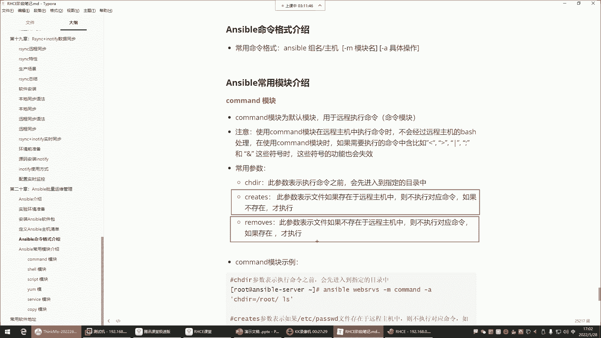

啊。这儿呢remove。也是一个判断。看到什么呢？如果它已经存在了。这一步将运行哎。他俩恰巧相反了。看到了吗？前面是存在了不执行。😡，这个事儿如果存在则跳过。这个呢如果存在则执行。

你发现他俩对着干是不是？哎，那这个呢是什么意思呢？就是你在做一些，比如说我现在这个路径已已经有文件了，是不是啊咱远程主机的OPT目录。😊，啊，那现在我想把这把这个文件给它移走。😡，给它移动走。

那这时候啊就可以用那个rem。面令拿过来哈。把这个cris换成re木。如果远程的OPD目录有ABC的TT，那就别touch了，touch不就重了吗？干嘛呀？就。移动。MV移动到哪儿呢？root目录。

移动谁呀？移动OPT下的ABC点TATT倒入目录。能理解吧，先看这文件在不在，是不是啊？那如果在呢，在，他就执行呗，执行谁呀，执行后面命令MV移动OP的ABC点TT到root回车。😊，哎，执行失败了。

不是执行成功了是吧？😊，嗯。只要成功了，那你看看。好莱斯OPT。好，ABC点贴T没了。是不是啊哎，他就是给你做个判断。那如果你再把这个命令再翻过来执行一遍呢？😊，他又说了。看到吗？又给你跳过了是吧。

跳过了，因为什么呢？因为在这个路径这个文件它没有找到不存在。😡，不存在就跳过了，所以这玩意儿不是不是一个义服判断呢？😡，没错哈。

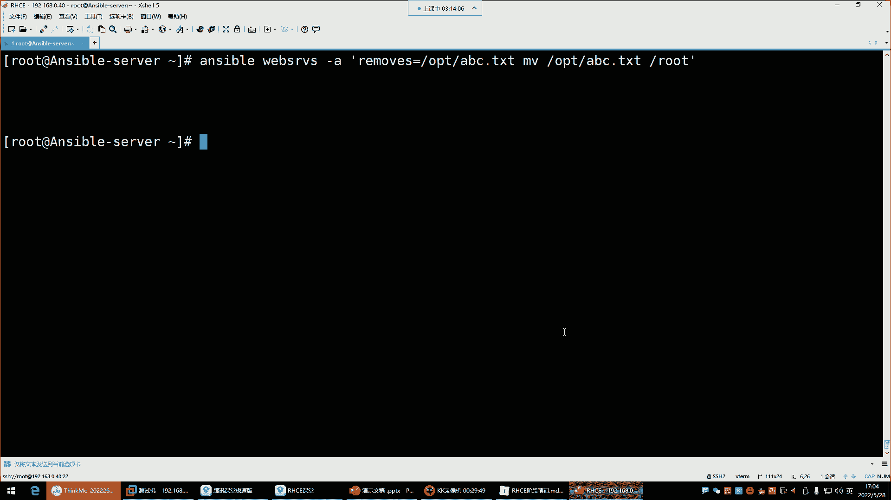

但是用得上吗？用不上，我只是大体给你们演示一下。😡。

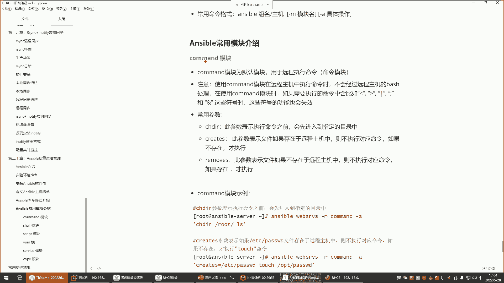

给你们演示一下，就像我前面给你们所说的，有些模块，那就像系统的那些PWDCD这些命令是一个道理，你会用到它的选项吗？是不是啊用不到？就用模块本身，所以这个也一样，我们用也是用它的本身。

你比如说我现在对它做一些操作，那命令模块。😊，penible外 service。看它的内存frreee杠H。因为正常职业命令不就行了吗？他既然是叫命令模块，你想想那几乎所有的门令都能把你执行。😡。

这不是远程主机的它的内存吗？总内存。一使用内存。剩余内存。是不是啊下面也一样。好，然后看它的磁盘。阿拉士。block回车。两台主机的磁盘。这个主机的。是吧。磁盘的大小。磁盘的类型。

是吧看每个分区的空间利用率SD1SD2，我想看看。DF杠H。是不是？SSDAE这个分区。SDR那分区。这儿呢哈。这呢。没有第二哈。你看每个分区的一个空间利用率是吧，总容量比使用的还可以使用的百分比。

看到吗？这些怎么不绿哈？😊。

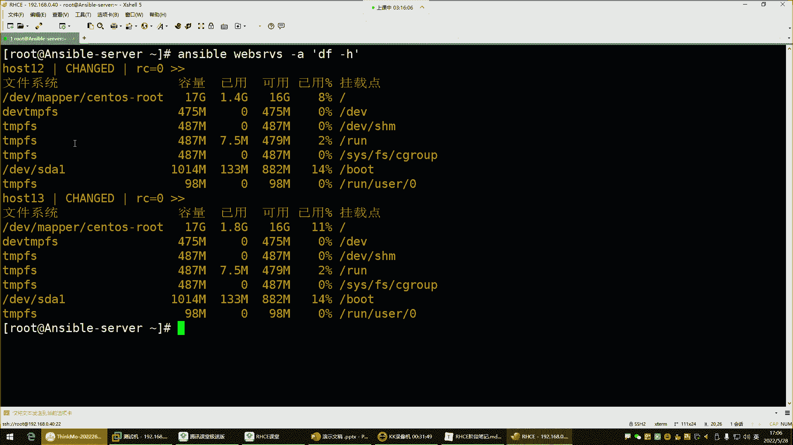

哎。这问题问的好哈。😊，它咋不绿呢？

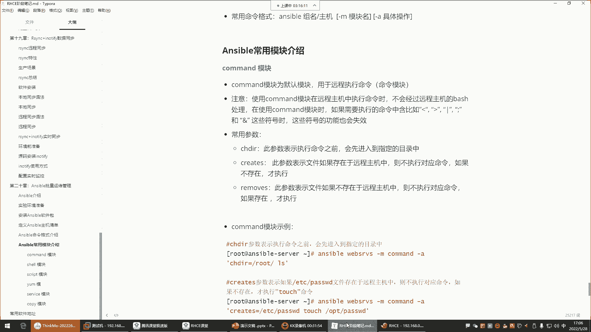

是不是？😊，就是他为为什么他不绿呢？😡，正常来讲，你说我也就是看看，那也不会对它造成一些改变呢。😡，是不是啊？为什么不绿呢？😊，好。啊，给你们。演示个细节哈，阿拉了。😊，hello点贴梯。你看这个时间。

你看这个文件，现在的时间是14点58分吧，是吧？看看。hello，点铁梯回车。再看文件。哎。他这时间怎么没有变化呢？14点58分。不是哈，14点58分。这文件怎么一点变化没有呢？😡，看看啊泰坦。

泰的01。一点铁梯。回车。这有问题啊。啊，这看时间没有变化，但是改的话它就发生变化了，但目录的时间会发生变化，注意哈。😊，不。如果说我们做一些操作的话，目录会会发生变化的。

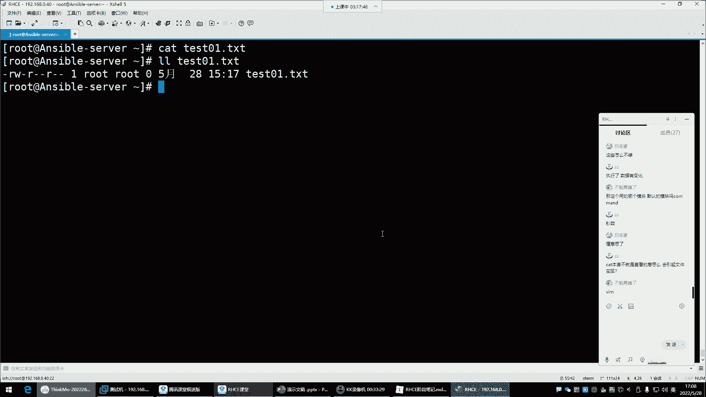

为什么呢？就是。我们拿windows来给你们举个例子啊，linux看不出来，你建议文件夹右击属性。呃。见文件呢。属性。看看其实他是有这个时间的。他有这个时间哈。只不过这个时间并没有给你显示。😡。

所以你看不出来，你看啊我们对于windows来讲，这文件有什么叫创建时间。😡，有修改时间。有访问时间。但是在linux里边，它是不是创建时间没有给你显示，访问时间没有给你显示啊，但你以为它没有吗？

它真有，只不过它就在那没有给你显示。😡，啊，他只给你显示修改时间了，就你这文件你什么时候改过，他给你。😡，放到这个文件的详细信息里面了。但是其实你每次看文件的话，它这属也会有变化的，知道吧？

属性也会发生变化的。😡。

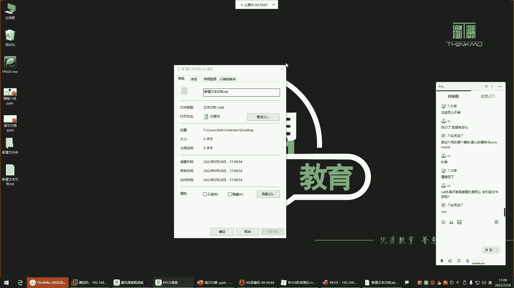

所以它为什么是黄色的呢？就是因为它真的是发生变化了。😊，能列吧。这位置啊就是有点太细节了哈，这抠的太细了，这有点你们这有点为难我了哈这个哈。😊，那接下来我们这个再继续哈。😊。

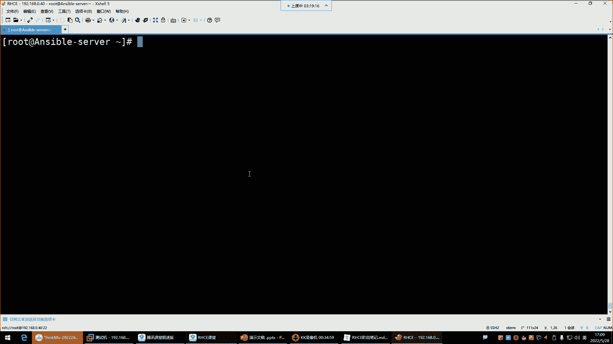

嗯。那这些参数是不是没有必要去用它呀？

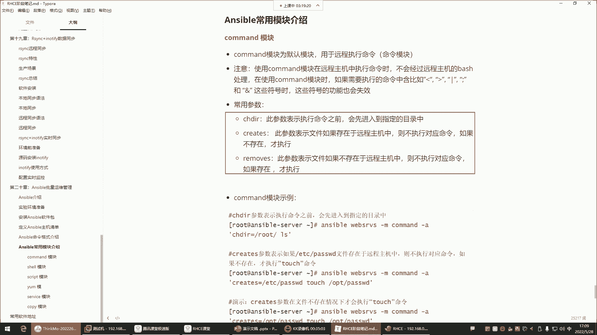

所以这就我们所说的什么呢？就直接用命令本身就行了。anible web service哎，就直接调用。我想看什么呢？我想看CPU负载up time。看到吧。啊，CPU的负载量每台机器的。

但是这不能执行VM哈，我跟你们讲。😡，不能VM哈，你说我VM一个文件行吗？VM。😡，root下的那个hello点TIT可以吗？中意。你如果这样的话，你就卡在这儿了。😡。

然后你说那那难难道他是让往往里往我里面写写让我们往文件里面写内容吗？不是。😡，你在这儿你是对远程乳机操作不了的。😡，但是当你连到远程主机的时候呢。😡，我们看一眼去啊。我们干嘛呢？PSAUX过滤一下进程。

过滤谁呢？VM。你看在这个主机，它真的是有1个VM在打开这个hello点TIT文件呢。看到了吗？对它不能交互的哈，但是它确实是真的是调用你这个主机的VM了，帮你打开这文件了。😊，那你怎么编辑啊，是不是？

😡，你在这儿是编辑不了的哈，所以这种交互的命令。😊，就不能用了，包括设置密码什么的都不行啊。就你就像我们前面所说，交互设命令，安本没有办法你去去执行，知道吧？😡，Ctrl C。退出了。啊，退出了哈。

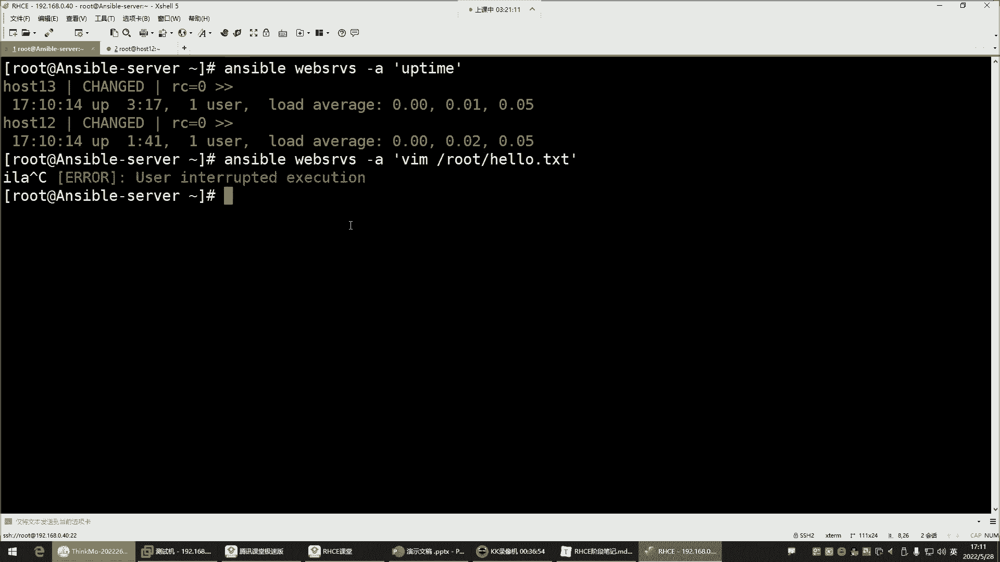

O。嗯。对，不能交互哈。行了，这是可慢的命令，是不是就是执行想执行什么命令就可以了呀？然后这命令有一些小缺点。小缺点是什么？就是在使用comman的模块，在远程主机中执行命令的时候。

不会经过远程主机的bach处理。它是SSH连上去就执行操作了。那你SSH连上去操作，那像有些特殊符号它用不了。

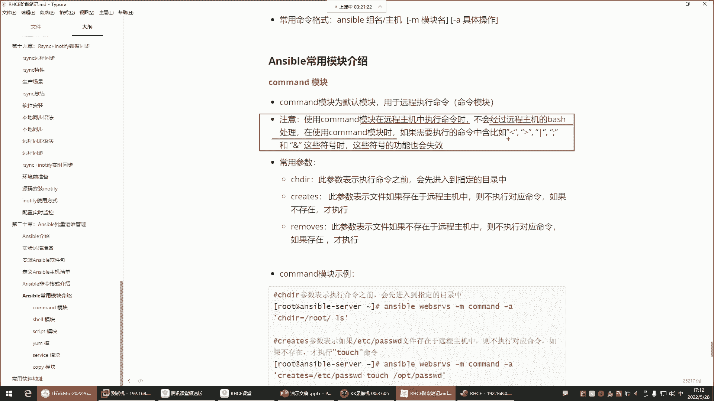

这 two符号啊它都不行，比如说比较典型的，我想看看文件的内容。看什么呢？我想看内存f杠H，当我要把内存给它保存起来，保存到OPT下边放放在什么呢？放在。fr瑞点贴T。啊。

你看他把这个信息给我返回回来了，是吧？😊，那反馈过来的话，那它真的是执行成功了吗？😡，这个有frre点TIT的文件吗？没有。没有free点铁梯啊，这叫hello点铁梯。我们前面是干嘛呢？

给它保存到free点铁梯了，是吧？这文件没有。没有。你比如说我再结合一些比如说我再结合一些管道。😡，加个管道。结合管道过滤MEM。没用失效了。这个哈。管道c。回车。是不是失效了呀？😡，啊。

spa是不是也给你显示出来了呀，我就想过滤这个MEM。😡，失效了。失效了哈。😊，嗯，还还有一些特殊符都不行啊。😊，拉4OPT下的星。看到吗？是不是报错了吧。为啥呢？

因为这个模块它无法它根本就无法去解析这些特殊符号到底是什么意思。因为这些特殊符号怎么来的呢？这特殊符号是拜时代的。😡，但是能解释。以白吃。hap的时候。我说你。你这个慢拜车的时候，你看到的帮助的时候。

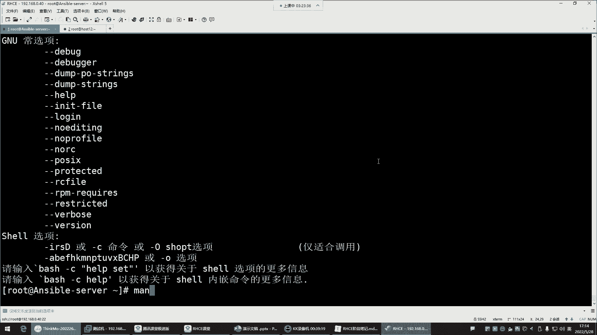

这里边。

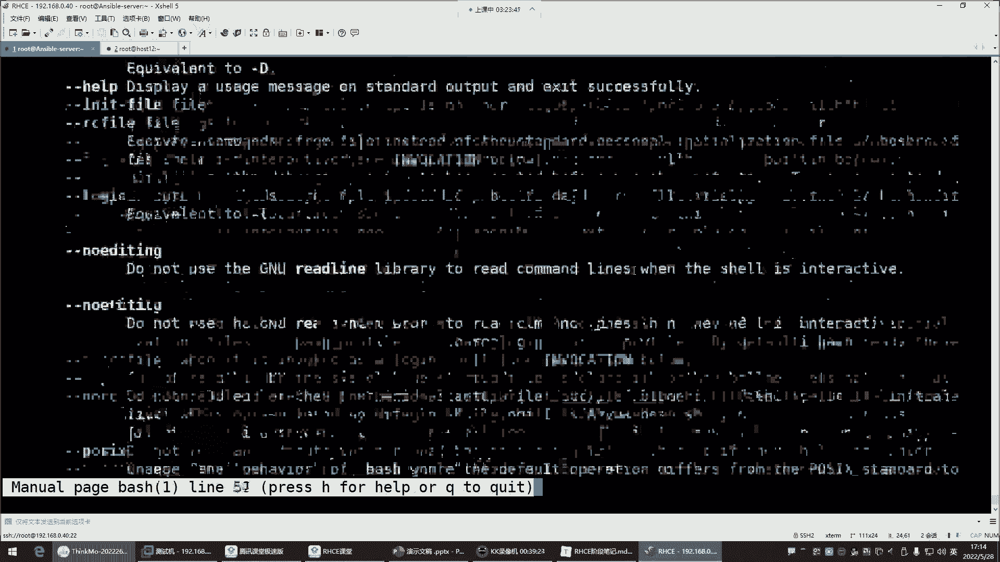

你看这儿，那拜纸天生就具备这些特殊牌的支持。包括T见。看到了吗？看到吗？这头符号。嗯。哎，所以说这些你看到了吗？我们现在对于可慢的模块，大家了解一下就行。接下来要学学谁呢？

设有模块设有模块也是远程执行命令的。😊。

跟comman的呀是类似的，但是有区别，区别在于设有模块是通过becher去解释命令。那better我们现在所有的命令不是通都不都通过be解释吗？什么LSK之类的，是吧？😡。

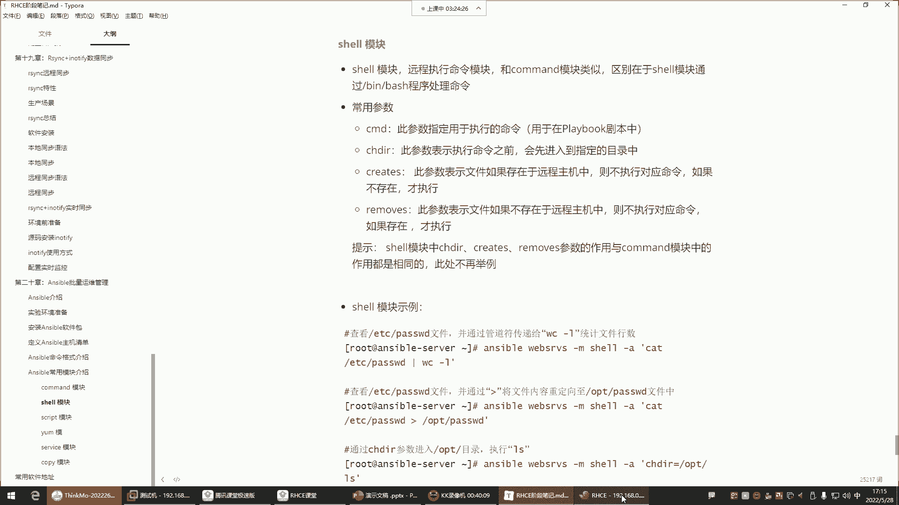

什么阿莱斯星不都是拜事给你解释的吗？所以说呢拜事来讲就是。对于我们来说哈。就是一个。福音福音。大多数的命令by这个shall都能都能帮你实现。😡。

他支持的参数也都是可慢的那些差不多的参数，它都支持。都支持啊啊，所以说这些s中的那些参数作用与command中的作用是相同的。咱就不再举例了。那接下来怎么用也都是一样。

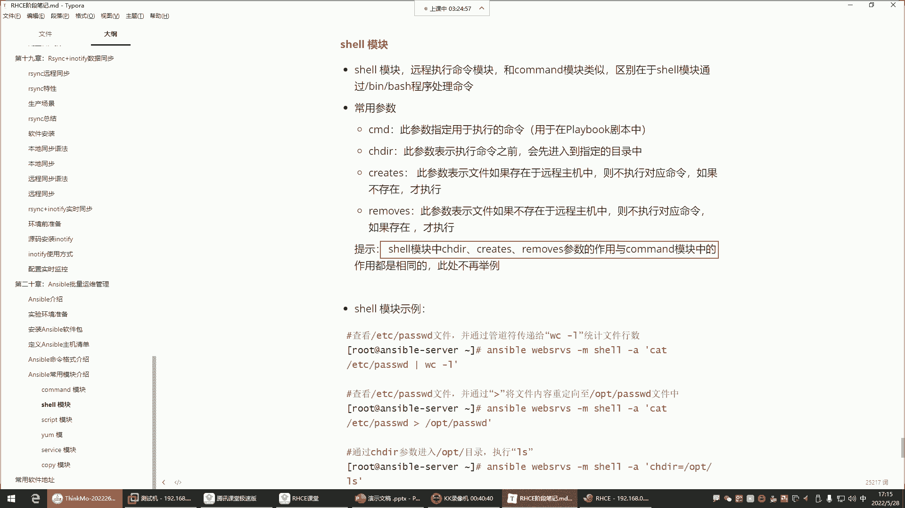

只不过就换个模块而已。我现在想换shift模块，你得用杠M调用了哈，不然它默认是command能列吧？我现在杠M指定我调用shift模块杠ALSOPD星。😊，你看可不可以？是不可以啊？

但是你用command就不行了。还有前面的那个，比如说福瑞杠H。给他。把这个结果写入到OPT下放到什么呢？福瑞。点儿贴梯。你看这个结果没有输出到我们的屏幕吧。😡，那你看那个文件就知道了。泰坦。

你看这文件里面是不是给你保留了这些信息了呀？好。管道服。反道福。换管道服。加grabMEM。是不是只显示MEM的行啊，别的时候没有显示啊。哎，所以说这个功能就都一样了，只不过特殊符号的话。

就得用shall了。如果你说我执行这个命令里面没有什么特殊符号，那没啥区别。😊。

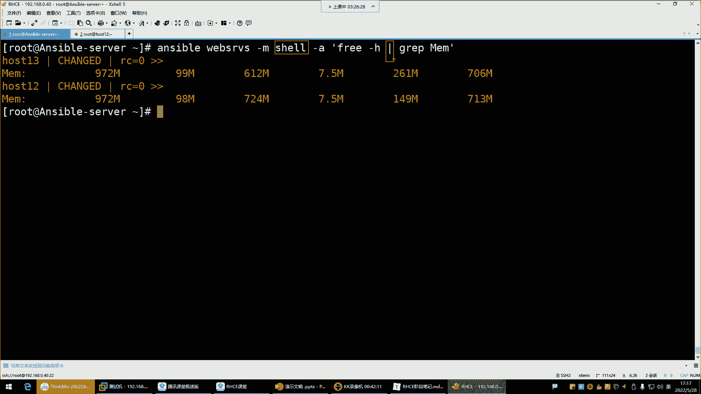

没有什么区别哈。所以这些大家搞清楚，那这是设有模块，这就没有什么太没有什么太多可讲的了吧，安包可不可以啊？

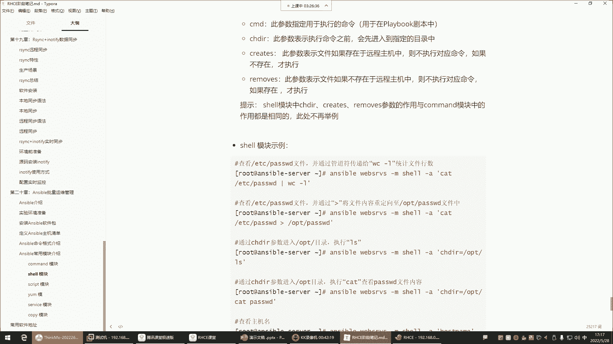

安个包。一号目杠外int。安装1个VSFTPD。安装完毕了吧。卡住了啊。不支持哈嗯他不支持VM哈。😡，这是hos的13，现在安包的。这后子十2说没有样元呢。啊，正在运行着呢。啊，有样么安装好了。

应该是安装好了哈，两台机器都安装好了，看到了吗？你看信息host的13。😊，是不是已安装完成啊？😡，然后holds12下边。是不是也已安装完成啊，安包。想卸载。前面修的命令。

直接用RPM杠EVSFTPD。谢了想查询。🎼杠QVVSFTVD。没有，他说你未安装，是不是啊？啊，没安装，就他没找到，他报错了。嗯。呃，我这儿。对，没错哈。不我现在所有操作并没有是对我的安主机操作。😡。

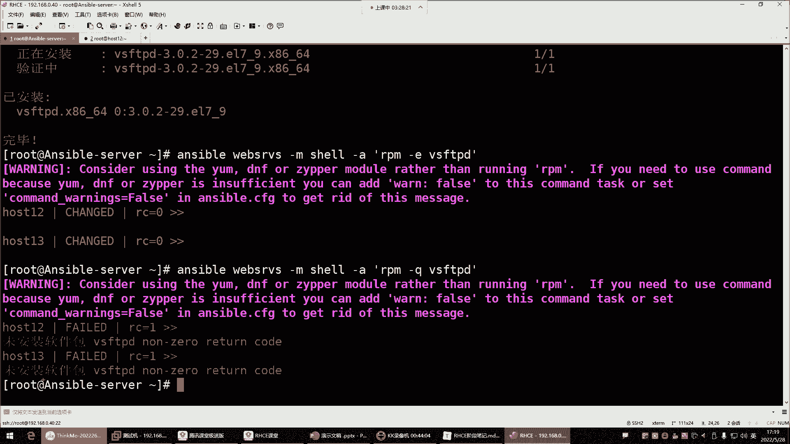

注意啊，我现在所有操作是不是都在安上面去执行的命令啊？😊，但是这个命令可不是对我本机去执行的，本机不安装哈，是给这两台机器在安装的，知道吧？不是给本机哈，这个别搞混了。

现在所有的操作都是对远程主机去去去去执行的。本机没有安装包哈，本机啥也没干，本机就执行命令就行了。😡，啊，然后这是设影模块也说清楚了是吧？那squi模块哎，说完设影模块，我再给大家对比一个这个压模模块。

😊，为什么会会什么呢？先给讲亚目呢？因为亚目模块就是专门用于在主机中去安装软件包的。所以我们前面在安包的时候，你发现他给你个警告。😡。

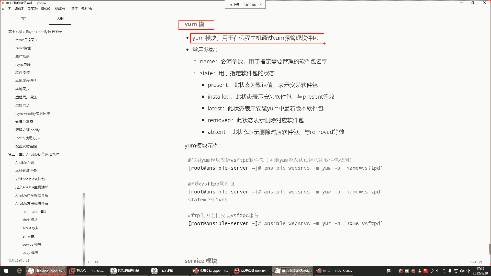

他这警告。你安包的时候，他也有，他说你应该什么呢？😡，又是这警告。他说你应该考虑使用压模模块，而不是直接运行压模命令。能列吧。它有专门的压木模块。啊，如果你需要使用命令，因为样目是不足的。

你可以添加什么啊什么任务之类的哈。😊，好，那。没关系，安上就行了。😡，安正型哈。那接下来我说说亚模模块。

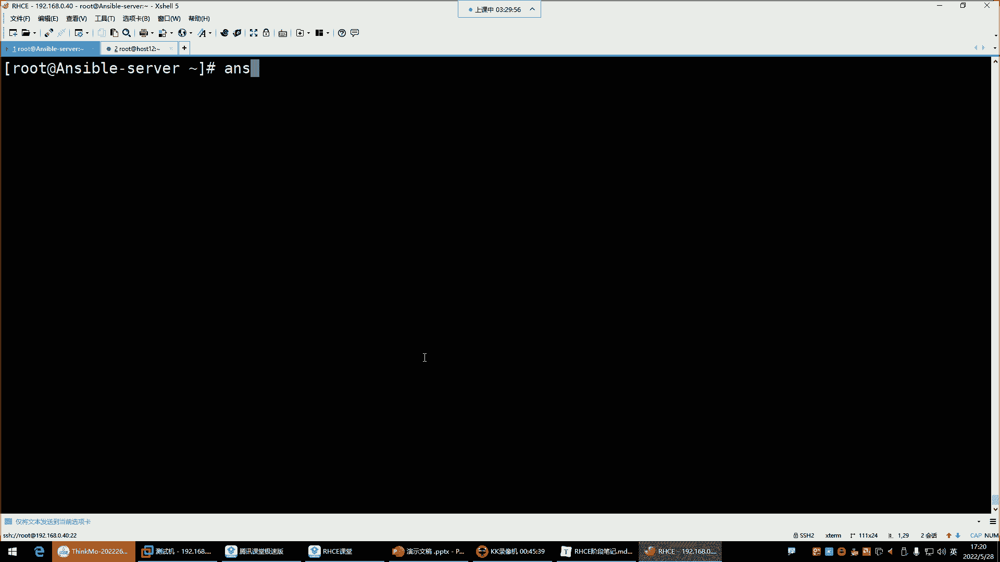

压模块呢怎么用呢？样么模块这些参数我来给你们说说哈。😊。

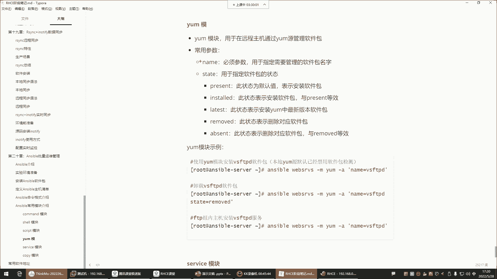

怎么用？第一呢就是安包嘛，不就是命令翻出来换个模块换成。亚么模块杠A模块的参数。🎼比如说我的对模块的调用的具体的操作。

第一呢，y目里面有一个name是必须的参数，因为指定你要管理的包名，这个玩意儿就是你安装什么包，你得name等于指定VSFTPD这是我安装的包。

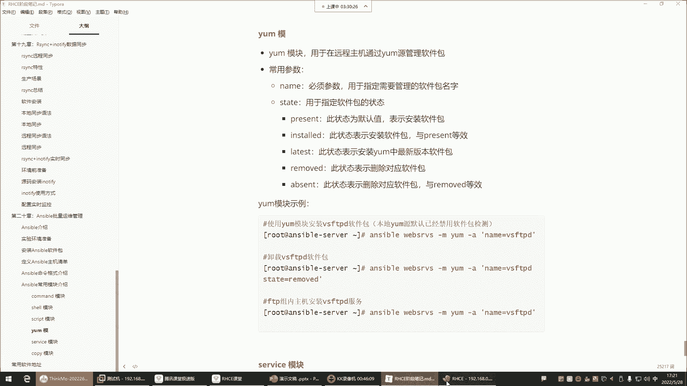

好，那接下来你再指定对这个包到底是安装啊还是卸载呀？哎，它有具体的参数。比如说像这个第一个默认的参数。😊。

就是表示安装软件包。那下面这个参数inst也是干嘛呢表示安装软件包，跟上面那个默认的参数等效。那你说这个有必要记吗？如果你想安装。这两个都不用记，为什么呢？😡。

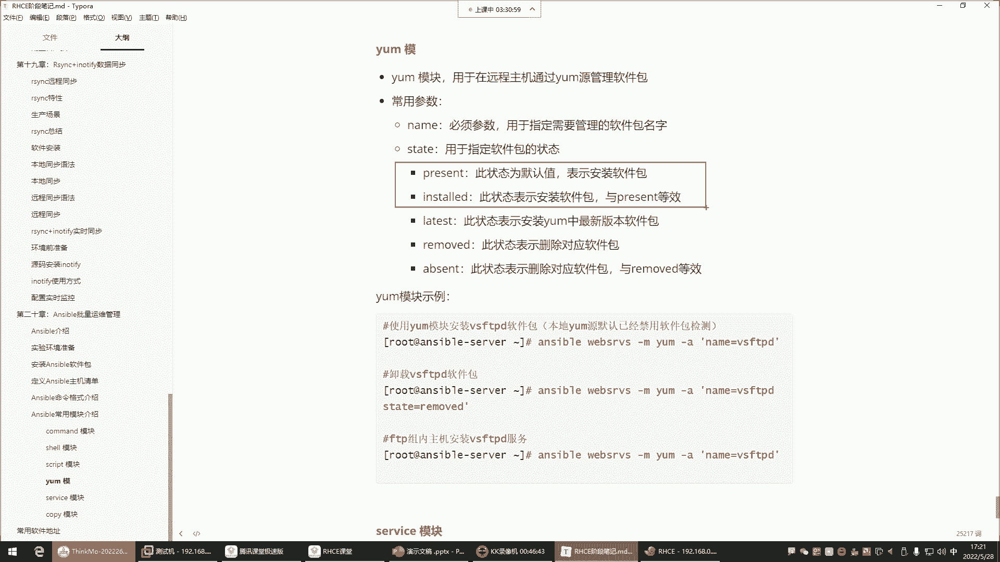

你就直接回车就行了，它name等于VSFTPD它就知道它自动把你安了。因为默认参数不就安装吗？是吧？你指定个名，你用这个name指定个名，它默认就是给你安装了。所以这时候你看它就给你安了。😡。

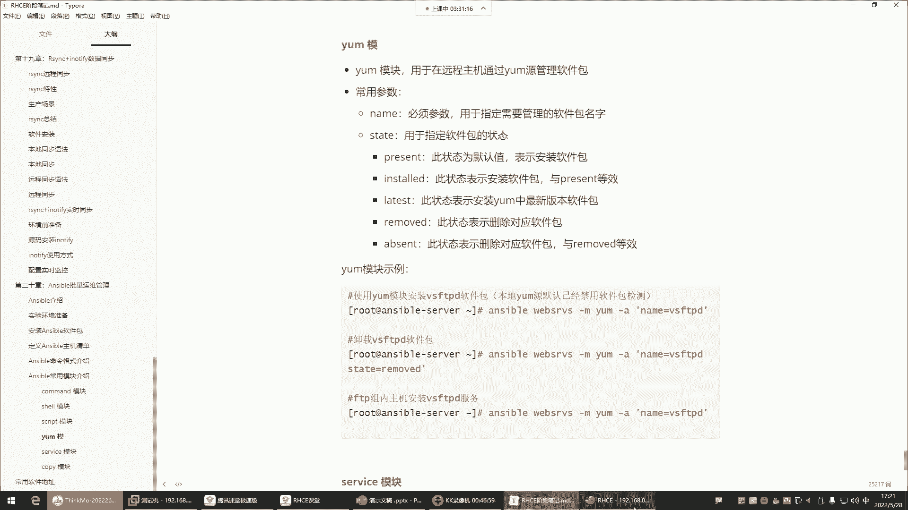

只不过他这样安的话，信息就有点让我们看不懂了哈，摸不着头脑了。😊，安装成功了吗？成功了，黄色的，你看颜色就知道了。就不用看那些反回的信息了，肯定安装成功了。啊，杠QVSFTPD。唉，这怎么报这么多错呀？

😡，啊。😮，啊，不是亚某模块干的事儿，是不是？😊，是不是成了，是不是有？好，所以你看这麻不麻烦，我问你们。😡，麻不麻烦？那想卸载怎么办？指定报名先内吗。😡，好，指定包名叫VSFTPD我想卸载了那。😊。

STTEstar等于。

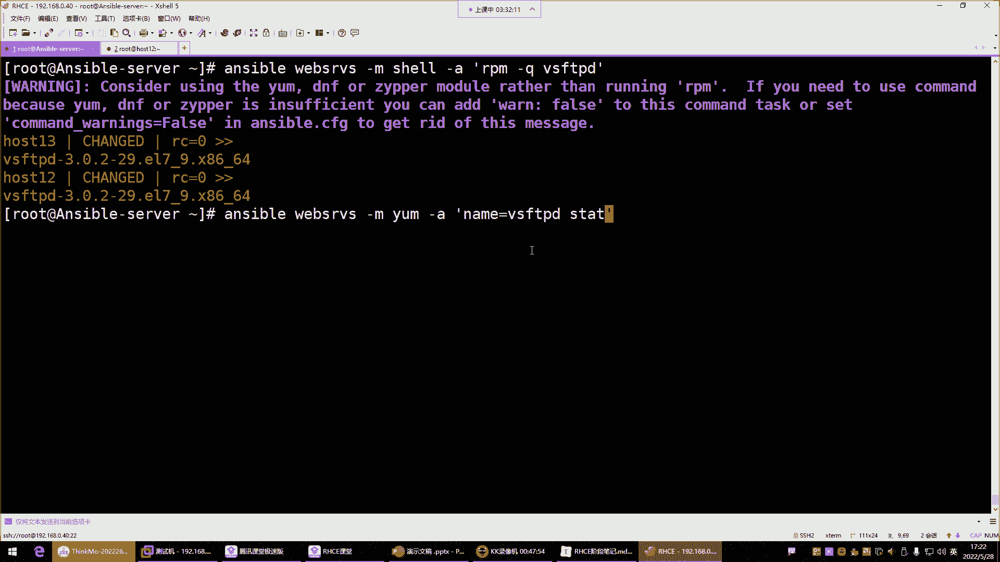

卸载的操作。卸载叫remo。也可以用这个。这两个呢都表示卸载。表示删除。与上面那个蕊木是一样的，哎，这时候指定。

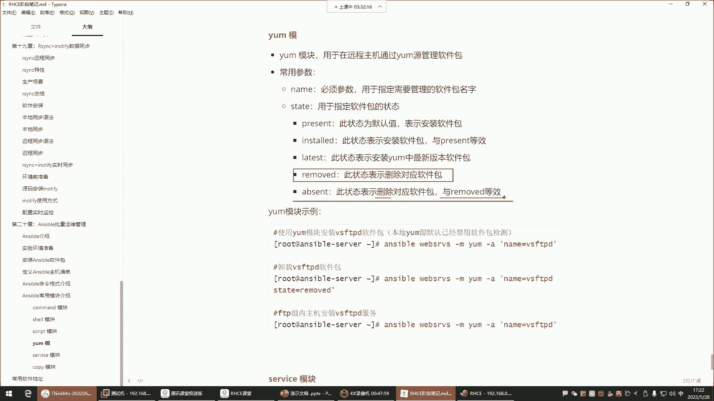

蕊木回车这卸奶。好了。那你们发现麻烦吗？😡。

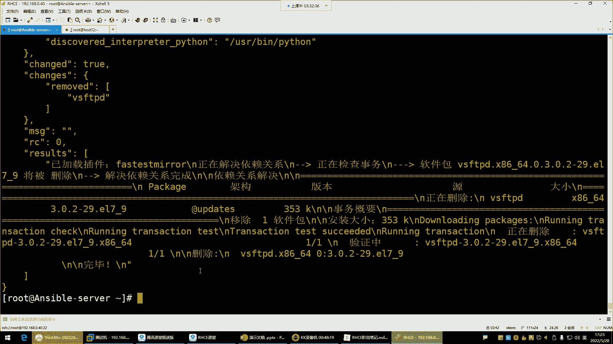

麻不麻烦麻烦吧。是不是还得去单独记记亚么模块的具体的参数啊？是不是啊呵呵？😊。

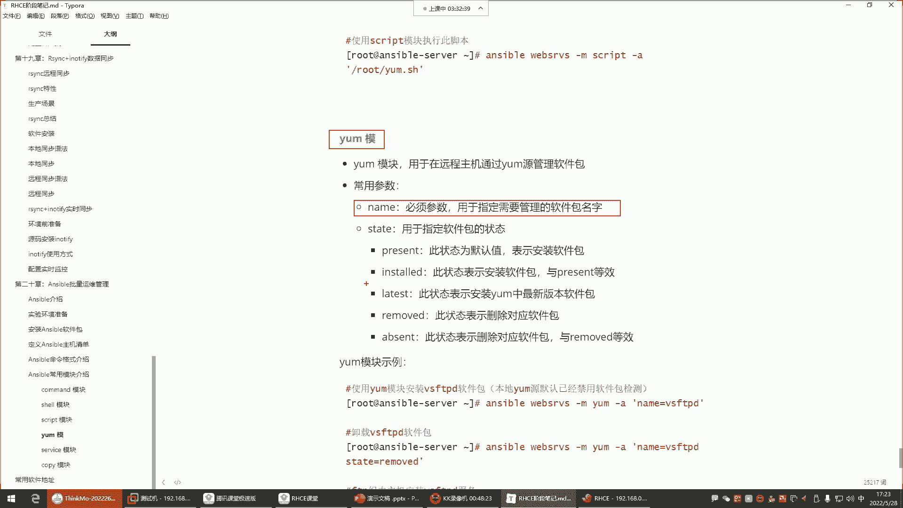

那你知道我们要社是不是非常简单直接呀？😡，哎，这个你怎么记记怎么记得住是吗？就是啊这这怎么记得住啊，所以这玩意儿你说是不是就完全可以给它作为了解内容就行了呀，没有必要掌握它是不是啊？😊。

唉，没有必要掌握了哈，所以大家这个作为了解哈。😊，性模块能干的事儿，尽量就用它干了。😊，实在不能干呢，比如像。😡，像这种事情scriptpped那是有就。无法代替了哈squi这个东西非常给力。

直营脚本的。😊，这个模块它的难点不在于模块的用法。

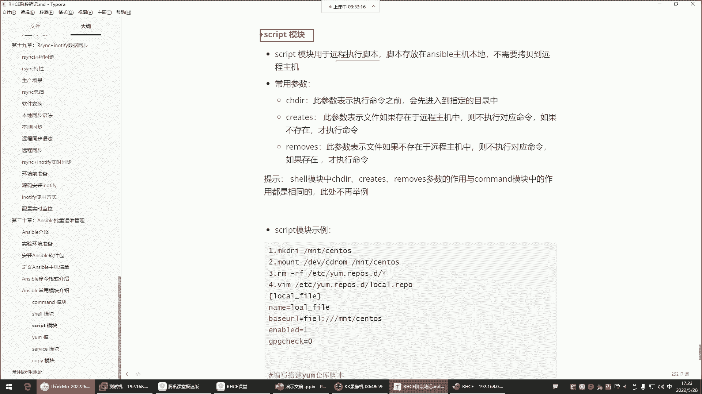

它的难点，比如说你有一脚本。比如说啊我们随便搞一脚本啊，叫这个VMhello点SH。挨口一个。Hello。Word。保存退住。好，我现在有一脚本。这脚板甭管干嘛的那接下来呢？😡。

比如说这脚本是对远程主机做一些P做做一些这个环境初始化的。好，那这个脚本有了以后。安森ible。主名儿。杠M调用。squiip的模块杠A。干嘛呢？指定root下的hello点儿SH回车回车啊。

未找到命令。IBLE推车。执行了吗？执行了。看到。🤧嗯。默认不卸载依赖，现在不卸载依赖了哈。😊，依依赖不会被卸载。你用哪个方式卸载都不卸载依赖了。然后现在来看看哈，就是。😊，他帮你执行脚本了，看到了吗？

😡，那你说这个模块。😡，他有什么难度系数吗？没有难的在哪儿呢？难的在脚本。就是你要干嘛？你得先有个脚本，有了脚本，你调用它就行了。这脚本是放在哪的呢？脚本是放在安ipible的主机的，写一脚本。

或者直接上上传一脚本放这个什么呢？放到安ible主机安ipible直接执行了一个脚本。这个脚本对谁呢？对远程主机生效。

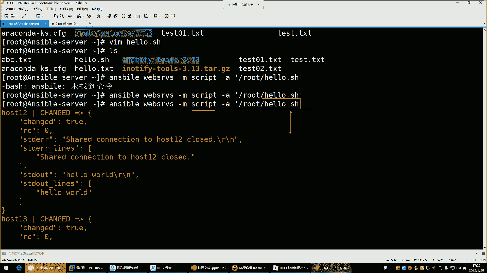

也就是说脚本就一份，不用拷贝到每个主机去，就在我本地执行脚本，然后这脚本就直接对远程主机生效了，是不是给力？😡，哎，对，脚本不用传到每个机器哈，不用拷贝过去，直接就在本地就一个一执行。好。

那其他主机就全都什么呢？全都生效。😊，不用写拜事了。那拜事我不是说了吗？默认它不就调用半事解释器吗？😊，😀。😊，へ。😊，😀呵呵。😊，嗯。🤧好嗯。这个能理解了吧，所以难点不在于模块吧。

这模块是不是啊sscriptippped的，我们前面建了多少次目录了，每次我说咱们写脚本建个目录吧，跟一下建一个sscriptippped。😊，是不是啊这名字应该都记住了。啊，这是squi的模块。

就专门用直行脚板的。然后他也都支持这参数，我们也不再啰嗦了哈。😊，所以这个模块就没有什么太多可讲的，就是脚本。你比如说你自己去写一个搭建亚麻仓库的脚本，你让他把你执行就行了。脚本有了以后。

就让他帮你执行就完事了，也没有什么能没有，主要就是你有脚本就行，不用给执行权限。😡，好。亚模块也完事了是吧？service模块也是作为一个了解的，给大家说说service也是一个了解的内容哈，为什么呢？

service是用于管理远程主机服务的，启动服务，关闭服务，看服务状态。😊，嗯。那这个。跟亚模一样。这个service的功能我们用shall也可以来实现。比如说在sice里边你想去干嘛呢？你想启动服务。

你来看一下这大家看一下就行了哈这样。😊，看下就行了，就是。你那得先干嘛呢？用杠A指定你对哪个服务去启动star等于star，后面加个D，这叫此状态用于启动服务的。

那也就是说明明看看我就想把那个VSFDBD那个扶务起来。😊。

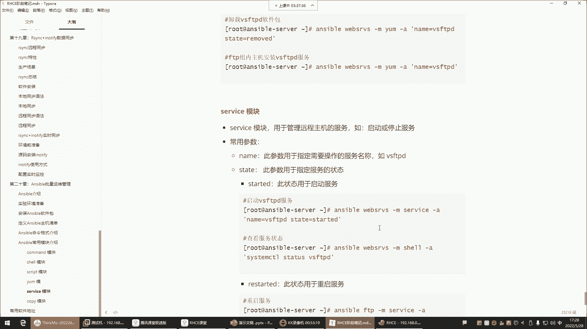

我用shall模块看哈，我用shall模块，我就直接怎么玩了呢？我们前面学过的系统命令system。😊，star特。然后VSFTBD。这嗯是包上给卸了呀。按一下吧哈按一下。杠外inst VSFTVD。

好，接下来。再把刚刚刚命拿过来，我想起福回车。起来了吧，是不是起来了？😊，嗯，起来了。好，再给它关掉stop。好，服务关了。那如果换成service呢，就这样。sice，然后杠A。

这里边就是首先得指定哪个服务，哎，name等于服务名，然后。star等于什么状态呢？启动服务。star ED。推车。模块错了是吧，s瑞斯飞车灰车。好了。起来了。起来了哈，还给你返回好多信息哈，在里边。

😊，看到吗？啊，我想关闭服务，那叫。Stop。STOPED回车。服务关了。

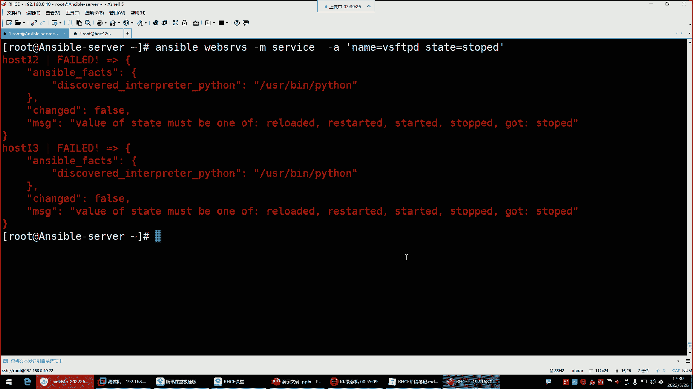

关了哈。应该是。

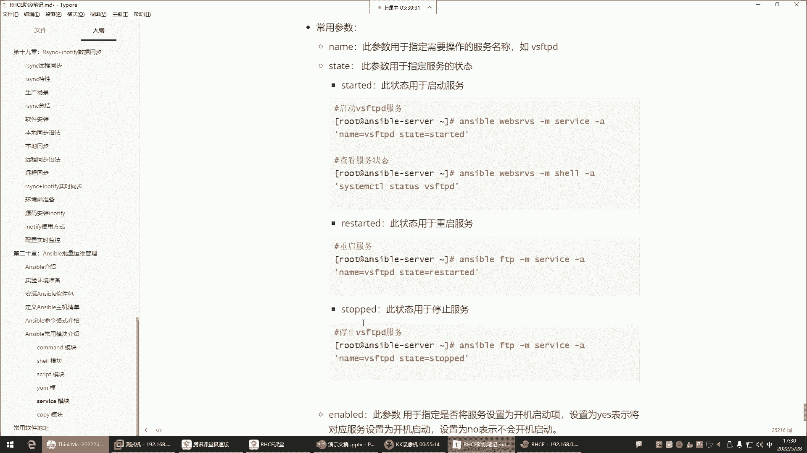

啊，少一个P少一个P。STOPPED看到吗？😊，不这啊这样把服务关掉啊，那你说我们。😊，て。对呀，那你说我们对于这个模块来讲，是不是就感觉它有点啥呢？没有是用好用了呀。

我想起伏我们我们前面最熟悉的是不是啊systemstar。😊，是不是啊服务名。这多好用啊。

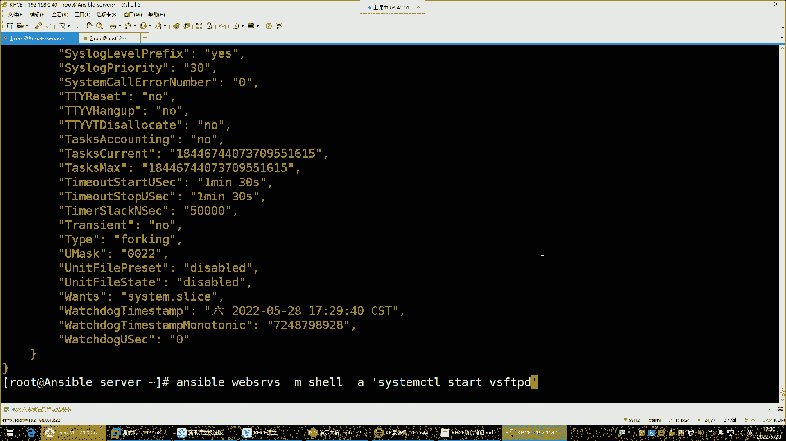

是不是？所以这玩意儿是不是也就了解一下就行了呀？😡，这俩模块了解一下就行了哈，这个模块也用也用不到。😊，设模块最常用。拷背模块呢也也常用，所以拷背模块。是这样子的。对。这个squi是很屌的这模块哈。😊。

效模块也非常屌。啊。靠背模块。他呢用于将文件复制到原生主机。那这个。一般的话呢，比如说我想实现一个批量拷贝。呃，批量拷贝的话呢，靠背模块非常的给力，就是看哈。😊。

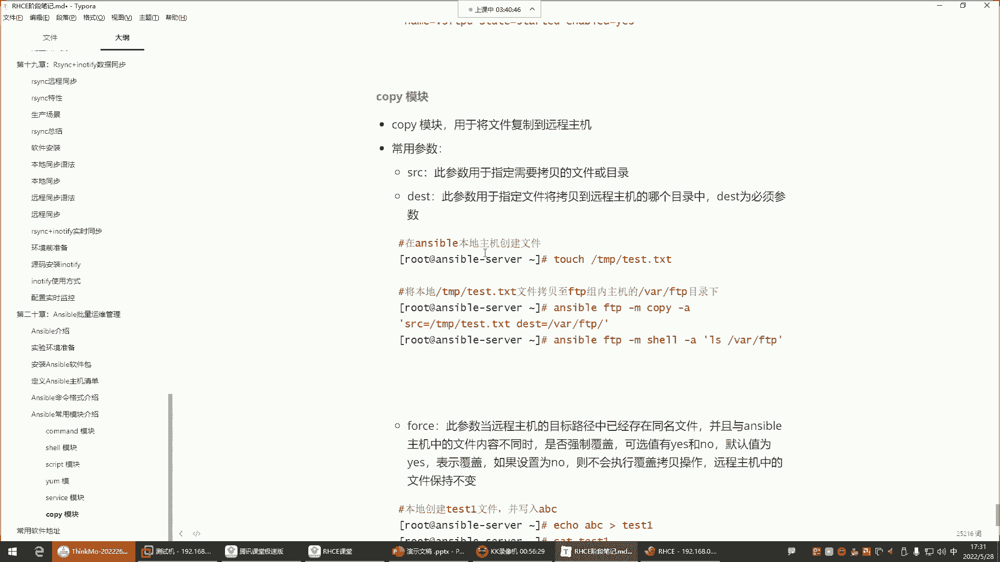

我现在。嗯，就比如说我想把这个压缩包。拷贝到其他的主机。那。啊，我们试这个烤烤压缩包吗？别考压缩包了，烤这个hello点TT吧。因为我们稍后要对这个文件做修改，所以考这压缩包，你你改不了它。好。

那接下来呢咱们就这个拿这个文件来说吧。😊，这个文件我想给它拷贝到远程路机。😊，がエも。co背模块。杠A指定。在这里边。看SRC。叫它的全名叫ss圆的意思。什么叫原呢？就是你的要拷贝的那个文件是谁？

叫原文件SRRC等于root下的谁呢？hello点TATT这是我要拷贝的文件。这叫原文件。好，拷贝到哪里？dest啊全名叫d nation，叫目标的意思。目考到目标的哪个目录呢？好，它的MT目录。回头。

失败了哈。😊，啊，他说模块拷背。在配置的模块的路径找不到靠背模块。CPOY敲错了是吧？COPY。回说。嗯，好，拷贝过去了。卡不过去了哈。😊，告诉你目标看到吗？目标是MT的hello点TT。好。

那接下来看一眼。用射模块看一眼就知道了。看MT。不ス。有吗？有。是不是有过去了。没错，这就是远程拷贝。哎，我想拷虑什么文件。

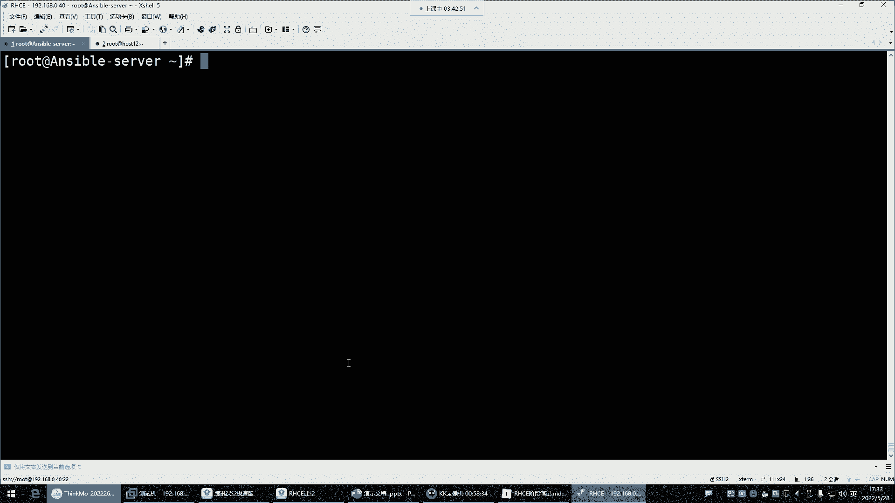

我我想拷贝什么文件，这文件我就直接一条命令，直接对远程主机直接就批量拷贝了。😡，嗯，对，就设有模块cover背模块。

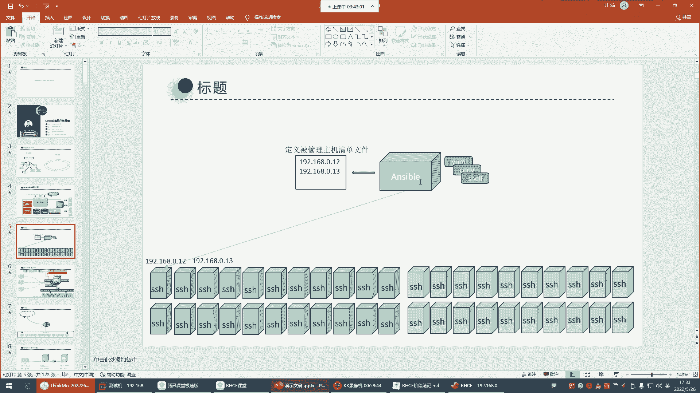

非常给力。我要给他们我要给每台主机下发一些什么文文件。😡，或者说压缩包软件包就直接拷贝过去。😡，能理吧，因我现在把那个压缩包给它拷过去。😡，那个包名。叫这这么长的一个名字是吧，考过去。😡。

root下的这个压缩包拷贝到远生主义的OPD。OPT。烤过去了吗？过去。嗯。对，就把主机的文件拷贝到那些被过离的主机。看那些背关联主机OPT幕。OPD。是不是压缩包过去了？那。😡。

以后这两台主机想安这个包，是不是直接就安了呀，是不是啊？😡，是不给力？非常给力哈。

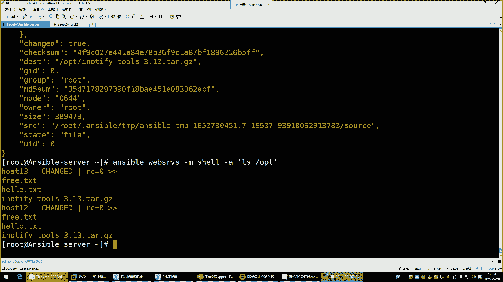

呵。😊，然后copy模块下面还有一些参数，大家下去可以自己去干嘛呢？😊，练练一练练一练哈，这些参数的话呢是也是做一些判断的。大家下去可以去尝试尝试这些哈。然后还有一些常用的软件包的地址。😊。

在这里边到时候呢什么时候需要的话，翻翻这个笔记。看看如果真的是有你需要的地址，就直接从这找了。ok吧。这这里面地址非常多，看到吗？啊，几乎是涵盖了我们平时学习或者说工作的常用的地址了。行了。

那我们这个还有安斯伯的学习文档，安恩伯的学习文档这个里面写的比较全。😊，啊，大家呢到时候后期如果说想去深入学习安思宝，你想怎么说呢？就是有时间的话。你可以自己去看看那个文档，这哥们儿写的还挺详细的哈。

😊，好，那我们的第二阶段呢，今天就是最后一节课了啊，然后大家如果说你前两个阶段第一阶段第二阶段，你说老师啊，我这个学的没学太明白，我想再跟一轮，可以，大家就去进新班，可以再跟着复习一遍，可以吧？啊。

但是就是怎么说呢？就是。😊，可以用摄模块拷贝，不行，摄模块没有没有办法帮你远程拷贝哈。远程拷贝都是SCP。你看什么时候。他。给你远程拷贝个文件呢。行，然后你们如果觉得前两个阶段。嗯，明天开始。

明天就是你们明天开始就第三阶段了哈。😊。

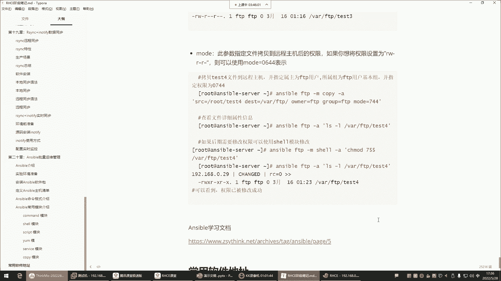

对，明天开始第三阶段。