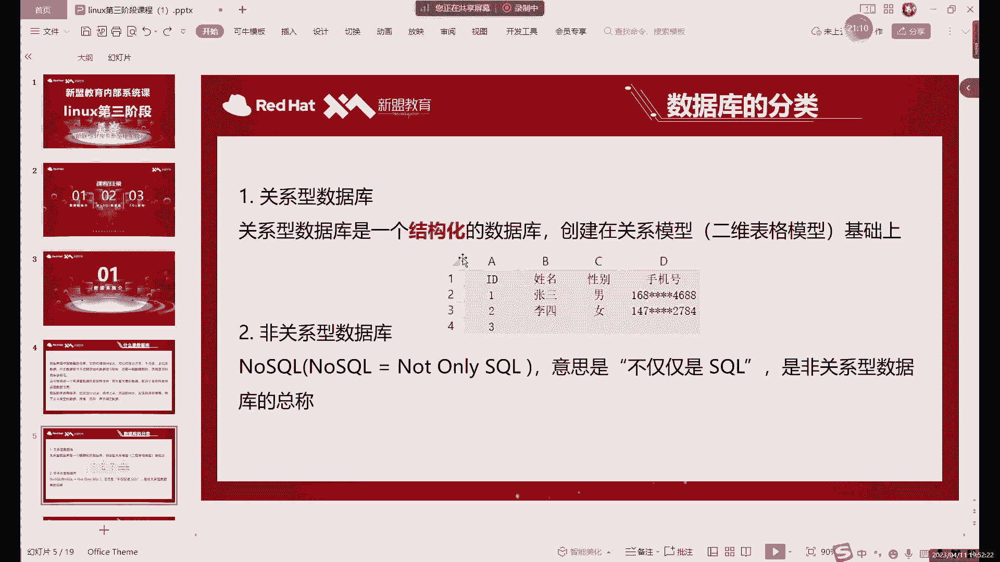
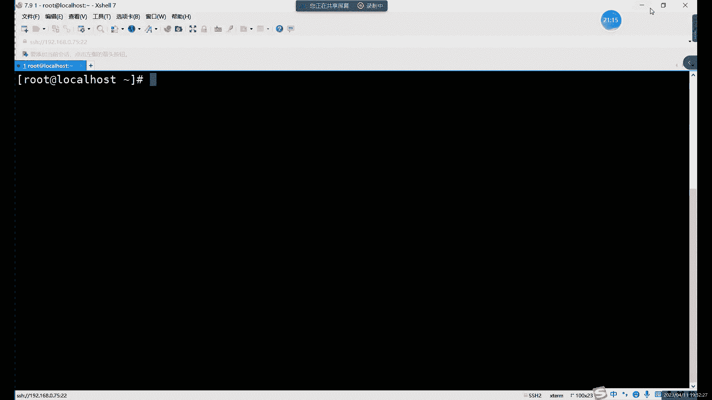
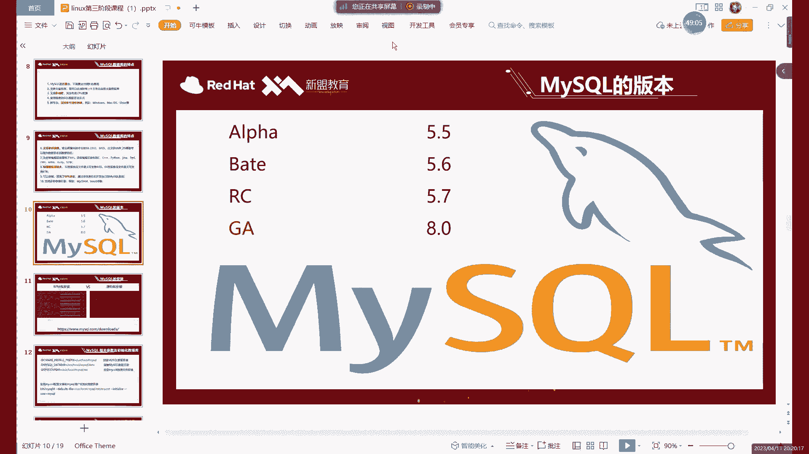
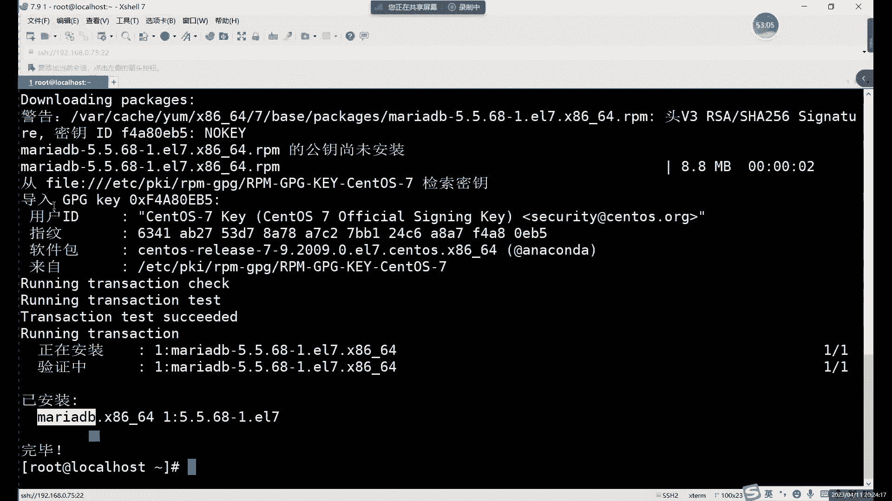
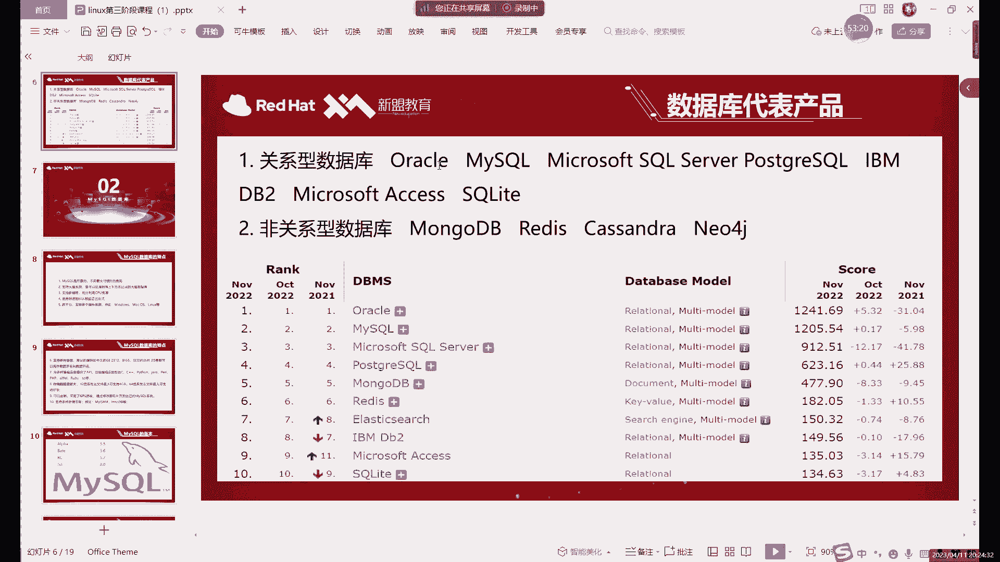

# 零基础入门Linux，红帽认证全套教程！Linux运维工程师的升职加薪宝典！RHCSA+RHCE+中级运维+云计算课程大合集！ - P62：中级运维-1.MySQL介绍及安装-上 - 广厦千万- - BV1ns4y1r7A2

好，今天的话是我们临的第三阶段的课。好吧，大家。😊，应该是上周的对吧？刚学完这个。CE过来的。啊，后边的话。其实不管哪个阶段啊，其实后边大家都有都有可能遇到我啊，都有可能是我在。啊，我现在的话主要是。

啊，先简单做个自我介绍，对吧？大家有可能啊有同学可能还不认识我啊，我是新韩老师啊。后边的话其实从第一阶段到第六阶段的话，这6个阶段的课呢都有可能是我带。现在的话我们是第三阶段。啊。

大家平时在平时在学习或者说生活当中遇到什么问题的话，可以直接在群里面问啊，我有时间的话，肯定会第一时间给大家看的。啊，不过晚上的话，这个时间段就算了啊，因为晚上我们现天都有课啊，每天都有课。

然后呢课上的话，其实大家啊有什么不懂的就可以直接问。啊，但我一般只回答什么，我只回答和本这个相关的问题。如果是没有关系的，没有关的问题的话，其实大家可以下课。下课私聊，或者说是在群里面问都行啊，都可以。

好，我们今天的话是linux的第三阶段的第一节课。嗯，第三阶段的话就从第三阶开始就已经不能算是基础阶段了。啊，我们已经开始要学习一些什么呢，学习一些具体的服务。啊，第三阶段其实包括主要是包括两部分。啊。

前半部分是什么呢？啊？前半部分是我们这个数据库。啊，数据库相关的。当然我们讲数据库呢主要还是讲myciq啊。第二部分的话就是。网站的架构。包括什么包括indice啊。

主要内容就是indice以及围绕indice展开的LMP啊啊网站平台的一个架构，以及我们的一个高可用的集群，对吧？负载均衡的集群等等等等啊，我们主要这些的话就是这是我们第三阶段的主要内容。

那今天的第一节课的话，咱啊。先来介绍先来介绍数据库啊，先来介绍数据库。大家在之前应该都听过数据库，对吧？啊，这肯定都听过啊，就是常说的这个山库跑路，那指的就是数据库，对吧？主要指的就是数据库了。然后呢。

这里的话首先啊当然呢我肯定不建议大家去删库啊啊，这个肯定不建议大家去删库。因为毕竟怎么说呢，虽然说。现在的话其实也不至于跑路吧，因为什么？因为现在其实作为一个如果一个企业里面有数据库的话。啊。

那肯定是做了什么？做了一个很完善的一个备份的啊，所以说你就是删库了。在这个操作呢，它其实并不致命啊，但是也千万不要去做啊。因为如果说你删了库啊，它可能恢复数据库呢需要很长的时间。啊。

这个这个其实就不太好。哎，所以说呢啊三扣这个操作大家知道就行啊，不要千万不要去尝试啊，这个其实。🤧嗯。怎么说这个是一个底线啊，绝对不能去尝试。然后呢，接下来的话我们首先来介绍什么呢？

我们首先来介绍数据库，对吧？啊，再来看一下数据库。数据库哎。从他名字上来看，他说他就是个存放数据的仓库，对吧？这定义很简单。他就是用来发数据的。啊，当然它的存储空间是很大的啊。

一个数据库的话可以存百万强千万强的数据啊，甚至说啊在理论上呢啊其实是没有什么太大的限制的。啊啊当然呢啊它其实受限于什么呢？还是受限于这个啊你磁盘大小啊，你磁盘一共也就那么大，你肯定不能存放的数据。

肯定不能超过磁盘大小。啊，理论上呢，如果磁盘无限大呢，哎就可以什么就可以这是增加数据。当然呢，我们这个数据库呢，它并不是把数据随意的放在那里。啊，如果说你把比如说拿拿一些图片啊，拿一些文档啊，对吧？

拿一些这一些数据之类的。直接堆放在某个地方，哎，直接放在磁盘里边，对吧，这是不是存放数据呢？其实也算存放数据，对吧？就比如说。😡，对吧我们打开一个我们的文件啊管理文件的这个。文件管理器吧啊，打开之后呢。

我们可以看到。比如说我们打开一个文件，里面就会有什么有很多的这些目录也好，对吧？啊，还有一些什么，还有一些文件，这些目录文件呢。它其实也是直接存放在我们磁盘里面的啊，它就是直接存放在磁盘里面。

但是这个肯定不能叫数据库。啊，或者说呢啊再换一种说法，其实在数据库就是在数据库诞生之前啊，就是他最初的时候有计算机的时候，其实当时呢数据库它并没有直接就是。数据库没有立刻产生啊，一开始是没有数据库的。

一开始我们存数据怎么存的啊，就是这样存放到文件系统里边啊，简单说就是直接放在磁盘里。😡，就是像我们。哎，大家可所看到的这些。啊，就是放在这个磁盘里面的。但是呢这样放有个什么问题呢？哎，其实这样存放的话。

其实。数据肯定不会丢，对吧？啊，也能找到。只不过呢其实你找起数据来说呢，就没有那么的容易吧啊没有那么容易。就比如说你看啊如果说你像想在这个。我们的私法里边哎去搜个什么呢？哎，去搜个，比如说。啊。

这个插价。啊，这个这个软件啊，大家经常有同学以跟我要，对吧？因为这个啊有的可能因为s特尔咱们是破解版嘛啊，破解版他是。他这个可能。不一定所有系统都兼容啊，我当然我这里有很多个版本的插掉啊。

那家如果说有什么啊需求可以直接有什么，如果说插掉不能用的话，可以这里有很多版本，大家都可以去试一下。你看比如说搜个插校，对吧？哎，就是一个。😊，咱目的就是想收到他这个软件嘛，对吧？

但是呢家可以看到左边这个进度条啊很慢。😊，为什么这么慢呢？就是因为其实我们搜索之后呢，它其实呢就是在系统里边啊，当然这个其实不能在系统，它只是在单个的磁盘的分区里边去找哎，包含叉el的这个文件。

当然这里大部分它都含是什么，都是这个压缩包，对吧？啊，叉el的压缩包。😊，哎有这种情况下呢。我们可以看到这个查到速度很慢，哎，我们全部查出来之后，大概花了将近都快一分钟时间了。对吧这个效率就很低。啊。

这个就是为什么数据库它诞生的原因。就是如果你直接用文件系统去存放一些数据的话。它有一个很大的弊端。就是查找起来呢非常的缓慢。因为文件系统找数据，它怎么找呢？啊，当然你如果知道这个数据具体在哪个目录下。

这个倒无所谓。那你直接一级一级的。😡，双击打开啊，查找就行了。那如果你不知道情况下，直接用这里的查找。😡，会速度会非常慢，因为它是相当于是把我们每一个磁盘当中的文件都看一下。满足不满足我们查询的条件啊。

他再把我们这个列出来啊，就是把我们的数据列出来。那这个就是。在数据库之前。啊，我们存放一些东西。就很麻烦。那有了数据库之后呢。啊，数据库的优势呢就是在这里。Oh。就是在大量的数据情况下，啊。

在你有数据库里面有大量的数据情况下呢，查询我们的这个。一些数据或者说是搜索啊删除，哎，简称呢管理数据。哎，总之就是管理数据。在管理数据上的话就非常的方便。啊，因为查询一个数据的话。

其实数据库速度非常快啊，这个的话具体到后边的话，我们啊装好之后呢，我们可以。我们可以就可以看出效果啊，这个不用着急。率有多快呢？啊，在数据量不是特别大的情况下呢，比像我们装好一个数据库之后呢嗯。😊。

它其实本身库里边就自带了很多的数据。啊，查到这些数据的情况下，一般就是0。01秒，甚至连0。01秒都不到。啊，也就什么概念呢？也就是大概10毫秒甚至不到10毫秒的这个速度啊，查询速率呢是非常快的。啊。

这个的话就是数据库的一个优势。因为它呢它的存放数据啊，它有一定的规则。啊，他有一定的规则。这个规则的话，具体就是我们后边的一些啊一些这个具体的一些语句啊，circle语句啊。啊，我们的一些字段呢。

创建数据库的一些方式啊啊，这些的话我们后边就会继续讲啊，大家就先首先先知道啊，数据库呢它存放数据呢它不是随意存放啊，有一定的规则。所以说呢在查询数据上呢，它的效率就远远高于什么呢？高于我们这个。

文件系统，因为文件系统里面我放东西其实是没有任何规则的啊，没有任何规则限制。而数据库不一样啊，相当于我们是啊数据库有很多的条条框框。😊，啊，你有很多规则限制。哎，就比如说你不能哎不能把一个数据放在这里。

或者说呢比如说嗯我们创建一个。类似于什么呢？啊？比如说我们直接切到下A页啊，我们来看下这个类似于这个的表格。比如说呢我们可来看第一列。第一列的话啊，我们这是个ID，对吧？这个是我的表头嘛，对吧？

第一行的表头。第一列这里是ID比如他能插入的数据只有什么呢？哎，只能插入ID就1234往下排。哎，也就是他这里能不能插入汉字呢啊，或者能不能插入直些字符呢？😊。

我们这里数据库这里啊满搜度这里我们就可以设置规则啊，我们就可以不允许他什么呢？不允许他插入数字啊，不是不允许他插入这个啊汉字啊、英文字母啊，哎就只允许插入插入数字。

那么这一列呢就所有的数据呢它只有数字了。😊，啊，这个就是一个规则。啊，或者说限制。啊，这个的话就是什么？这个就是。数据库里面它是有一定规则啊，它并不是呢并不是这种随意存放数据。啊，并不是随意投放出。

那数据库的话其实。目前来看啊，就是目前市面上就是其实是总的分类的话，是能分成两种的。啊，它并不是说所有数据库都一样啊，所有种类的所有牌子的数据库呢啊它的存放啊或者说处理数据啊，或者存放数据都一样。

这个不是啊，并不是这样的。我们这个其实数据库也和我们的系统一样，对吧？你系统有linux windows，对吧？m克那数据库呢自然也有什么？也有不同的种类。比如说什么呢？比如说这个哎这里的两种的话。

这个定义可能看起来不是特别好理解，对吧？这定义看起来不是特别好理解，就是关型和非关系型。关系型什么意思呢？😡，哎，关键性的话就是一个结构化的数据库。那结构是什么意思呢？就是我们是刚才所看到的这个表格啊。

有类似用我们就是就这个就是我们excel的一个表格嘛。大家可以按照这个去看啊，按照这个去理解什么意思呢？就是我们这个关键数据库的话，基本上都是什么？都是在二维表格的模型上基础上去创建的。什么意思呢？啊？

就是类似于我们的excel。二维的话就是行和列。啊，由行列和列组成一个表格。那每一行的话，其实就是我刚才说的要表头，对吧？那在我们的数据库里边，我们一般叫什么？一般叫字段。而每一行的数据哎。

从第二行开始。下面每一行的数据我们叫什么呢？我们叫我们就叫数据啊，就下下面每一行的这个哎，比如说123，它是数据，对吧？张三李四它也算数据。也就是由黄河列组成的，共同组成了我们这个什么呢啊。

共同组成我们这个表格。结构化的话其实就主要是什么呢？就是每行每列呢。😡，哎，都有固定的什么固定的格式。就比如说第一行呢，我们就在数据库里边，我们第一行这里就可以规定什么呢？啊。

规定这一行只能插入只能插入数字，这一行呢只能插入。哎，我们的姓名啊就姓名这个数就是应该叫字符啊，或者说就理解成汉字，英文字母都可以。啊，那第三行性别，那我们也可以规定，哎，我们只能插入一个啊。

或者说呢就只能插入男或者说女，能不能有第三种呢？啊，当然可以的啊，只要你规则里边啊能写啊，规则里边允许他写第三种啊，那就是可以的。啊，当然这里的话其实。一般情况下呢，我们这里性别这里的话就是两种嘛啊。

第三种的话就确实有点过分啊。然后呢，后边手机号的话。手机号一般我们都不都是11位嘛，对吧？11位。那如果说你超过11位的可以吗？啊，我们可以限制一个范围，不能不让它超过11位啊。

可以限制一个不让它超过11位的范围。那这些的话其实就是一个结构化的啊，它不仅有结构啊，更重要的是有什么呢？更重要的是有规则。啊，这就是一个关系数据库。由行和列组成的。啊，有行空列组。啊。

那有同学可能有疑问，就是如果说啊那不可能我们这一个数据库里面就一个表格，对吧？啊？那当然是啊，我们这个一个数据库里面我们是可以创建很多个表格的。啊，很多个表格。那每一个表格之间呢啊它可能有不同的字段啊。

哎有不同的这个数据啊。不同的表格之间呢，其实也是可以有联系的。哎，就比如说。我们这个数据库呢是存放我们唉同学信息的一个数据库，里面包括有什么有这个信息表，哎，有这些。我们的这个信息表有成绩的表格啊。

有基本信息表，有成绩表格。对吧啊有这什么啊，比如说如果还有什么。员工信息表的话，还可以有什么？还有可以有这个工资表啊，对吧？出勤率啊啊出勤率表格，这些表格之间呢其实都可以是吗？啊，都是。可以选择啊。

让它联系在一起。哎，什么意思呢？这里这个关型的话，其实除了这个二维表格以外呢，还有一个就是多个表格之间呢啊可以有联系。😊，哎，就比如说。员工信息表吧，员工信息表这里我们有可以有一个基本信息表啊。

还可以有什么呢？还可以有一个，比如说。啊，可以给大家稍微画一下，比如说员工信息表对吧？第一个表格呢是员工信息。啊。第二个表格是什么？第二表格我们可以写这个。嗯。肯定要新制啊薪制的表格。

那这两个表格之间呢啊他可以有联系吗？那那肯定有联系啊，为什么呢？因为它至少这里边会有什么呢？会有员工的姓名，对吧？每个表格里边啊，不管说他后边内容具体是什么，肯定都要有什么，有员工的姓名。😊，啊。

或者说什么或者说可能会有这个员工的什么这个ID或者说工号。好。啊，大家的话现在啊稍微稍微等等几分钟啊，这这边机架有点有点问题啊，大家可以稍等一下啊稍等一下。啊，大家可以先。

看一下我们这个网盘里面给大家发的这个。笔记什么的啊，大家可以先看一下啊，大家稍等一下稍等。好，我们继续开始啊，继续讲讲刚才内容。刚才那个基建那边出了点问题啊。那我就帮忙看了一下。

刚才高子直接呃把我揪出去。🤧啊嗯。好，我们继续来说啊啊，我们刚才说到呢，说到这个啊就是我们的关键数据库嘛。啊，关于数据库的话，这个。这里这里的话其实。嗯，我这里直接说的话，其实大家看的其实不明显啊。

或者说体会的其实并不是特别的这个。

没有那么直观啊，看起来没有那么直观。其实呢我们数据库。

尤其像my circle。啊，myode在存储上的话，它其实就是怎么存数据的？我们可以直接哦直接来看后面这一页吧啊，在一个数据库当中呢啊就在我们一个买测ical数据库当中，它其实就是由一个。

首先我们可以先创建一一整个库。啊，添装一整个库。第一库里边呢我们可以创建很多个表格。但是这些表格里面，我们就可以直接去插入什么插入数据。那这个是存放我们这个就mycyclql里面存放数据的这种方式啊。

也是关心数据库啊，就是mysq它就是一个典型的关型数据库啊。那我们的关联数据库的话，其实。承报梳理的方式呢其实就这样啊就这样的。然后这里的话是命令，我们后面会讲啊，这些大家不用着急。整体上来说呢。

就是一个库里边有很多个表啊，每个表之间呢每个表里面有很多个数据。那这些数据呢。啊，这可以是没有联系的，但也可以有关系啊。就比如说我刚才像我刚才举那个例子啊，员工信息表。我们库里边全入员工的信息。

每个表格里边啊至少有哪一个是相同的呢？就是员工信息或者员工的名字，或者说员员工的这个ID。那这些肯定是一样的啊，因为你需要啊，就比如说你这个。还是刚才那个图那里啊啊，像我们这个。对吧比如说第一个啊。

你是员工信息。啊，这些可能是一些什么？比如说啊入职的日期呀啊员工的一些基本信息呀、年龄啊等等等等，对吧？第二还可以写什么？就是啊一些出勤率呀。谢谢。😊，啊，包括还有什么有一些可以写什么，可以写薪资。

那这些表格里面肯定唯一的联系就是什么呢？啊，不能说唯一联系肯定要有联系的是什么？是我们的。员工的名字或者说是员工的工号，对吧？那这些的话其实就是什么呢？就是我们这个。多个表格之间啊的一个联系啊。

就可以通过某一个字段或者说某一列啊，就比如我们是通过姓名这一列啊，来把每一个表格联系在一起的。然后这个方便于什么呢？方便于其实分开存储数据的话，其实就比较好整理一些啊，比或者说比较好这个修改一些。

然后呢，你在查询的时候啊，比如说查询某些数据的时候，比如说你在啊员工信息这里。哎，看到了一个员工信息，然后呢，想在这个员工信息这里呢去找到一个。啊，找到一个什么呢？找到一个。我们想要找呃就查他哎。

就是可以或者说可以通过出勤率啊，看一下和他的一个工资啊，来看一下之间的关系。我们可以将多个表格联合在一起进行查询。啊，这个表可以联合在一起参询。当然这个已经是后边内容。啊。

大家就提前先知道一下这个关键数据库的话，哎主要的一个作用。包括它的一个特点啊，就是它是有多个表格构成的。每个表格之间呢都有一定规则，一定的联系。而非关系数据库呢。啊，就是非嘛，就是和它是相当于相反的。

当然呢也不是说。他完全没有规则，而是什么呢？😡，更多的它的存放数据的方式呢是什么？就是一一个电池段的形式存储。哎，就比如说它里边就比如说很多这里这个关于非关系数据库呢啊。

一个典型的例子就是我们第三阶段的课程里边啊，我们是讲两个数据库，主要是my circlecle。其次还有一个就是非关系数据库的readis。啊，re的话，这个数据库呢。😡，他是怎么存出去的呢？😡。

它就是我们这里写的这个。啊，它的名字我们后边会讲到readdis啊，redis这个数据库呢，它是怎么存数据呢？它就是类似于我们上面这这个等于二这里写的。什么意思呢？哎，就是比如说A等于。三。😊。

这个数据库的特点是什么？它里面没有。表格。啊，这个数据库的话就准确的来说，它其实没有什么表格，主要是什么？它里面就是A等于3啊，还可以有什么呢？啊，B等于4。啊。

就比如说啊再来一个C等于什么什么什么什么。也就他在这里边的话，它不是用表格来存数据的啊，它是以主要是以电池队的形式存储。他没有那么多的规则。😡，啊，没有那么多限制啊，就存数据上存数据上的话相对自由一些。

更多的用在哪呢？更多用在缓存的领域。啊，缓存大家应该都应该能理解，对吧？缓存的话和我们这个数据库的存储呢其实是有点区别的。啊，同样都作为数据库。我们的关键数据库的话，这边更多的用在哪呢？用于。

存数据啊存在硬盘里边，而非关系数据库呢啊很多都是在哪呢？很多都是跑在内存里边的。😡，啊，跑在内存里边，我们当做什么呢？啊，当做一个缓存来用。啊，我们不是说哎把数据存在哪，而是什么呢？

而是帮助啊我们的关键数据库呢更好的去处理数据。啊，这个是非关系数据库。这个的话我们后边还会具体去讲啊，非关系数据库的话，后面也有具体的内容啊。我们接在今天的主要内容的话还是关系数据库。啊。

不理解也没有关系啊，这个我们后来还会详细去介绍啊，非关于数据库这里这样的一个特点。关于数据库的话，这个大家一定要先理解一下啊，先理解这关于数据库的一个。结构。😊，对吧首先我们是由什么由库和表组成的啊。

一个库里面有很多个表，那个表里有很多数据。那这个。关于数据库这里的概念的话，大家应该都理解了。理解的话给老师扣个一啊。啊，没有理解的话，可以啊可以提出来啊，刚才讲的就是中间突然中断一下啊。

确实确实也这个是啊那边计价确实出了点问题啊。啊，如果没有什么问题的话，我们就接下来继续往下说啊，继续往下说啊，有的话就可以及时问啊，这个不不用害羞啊，有的话可以及时问。我一开始讲的不能不能太快啊。啊。

非惯系型的话，这个其实它里边东西很多啊，这个我们在后边还会讲。微关性的话其实有很多种啊，我刚才只说的，其实介绍的只是其中一种。啊，这节课主要我们还是讲什么，主要还是讲关系数据库。非关性的话。

你就暂时先简单的怎么理解呢？关形的话，我刚才说了它有结构对吧？有很多规则。那非关型呢它最大的和关型最大的区别是在哪呢？啊，就是在它没有那么多固定的结构啊，不需要固定存储在表格里边。啊。

以及什么以及没有太多的这些。啊，比如说你必须得存数字，或者说必须得存存这个字母啊、汉字啊什么的，没有这些这么多的要求，也就是非关形那边的话更自由一些。啊，就存数据的话，自由度更高一些啊。

这个是关系型和非关心的主要区别，好吧。具体的机具体的话，非冠性这边因为其实还有好好几种。还有一种分类。这个的话我们在后边讲完数据库啊，讲完关系性的mysqcle之后呢。

我们在后边会讲具体去讲readis啊，到时候会更具体去介绍好吧，那这个的话就是我们的数据库的分类。那我们今天的话主要内容的话先讲什么，先讲关系性的。那也就是my circlecle。外性的数据库的话。

😡，种类有很多啊种类有很多，更常最常用的几个的话有oracle，对吧？mycircle啊，这两的话是其实一家公司的啊，现在他俩其实算一家公司。一个是主要一个是付费版的，一个是免费版的。

两个呢啊现在市面上都都很常用啊都很常用。呃，中小型的公司啊，就比如说小公司。啊，几十个人的对吧？一两百人的公司的话，更多的会用在哪。他一般都会用用用数据库的话，肯定就是买sql。而这些大型的公司啊。

上千人的公司啊，或者说什么呢？就是不差钱的，像银行啊、政府机关oracle是一定会用的。啊，是一定会用这个orac口。哎，总之的话，它俩个性能呢差异不是特别大。啊，总之，性能差异不是特别大啊。

在处理数据能力上呢啊在存储数据能力上的话都差不太多。所以说呢哎如果说嗯。可能公司规模小一点的话，肯定还是选择免费的用啊。公司稍微大一点的话，会选择oracle。因为oracle呢你既然花钱了。

其实付费和就是付费版，就是其实可以说成企业版或者社区版。对吧你付费的话，其实哎我们这个你就会有什么有专属的客服啊，对吧？啊，有专属客服可以可以帮你去处理一些问题啊。啊，包括这些啊相当于是有了售后。

还有售后支持。而买色狗这边的话，因为我们是免费的，所以说你出了什么问题就只能自己解决。啊，这个是个主要的一个。主要的一个区别吧啊主要一个区别点。然后的话还有一些常用的，比如说windows系统的对吧？

一般是装什么呢？windows系统一般就装这scle server。啊，一般就是linkux系统的话，更多是装的是oracle my circle这两种。啊。包括这里的这个这里其实常用的几个。

大家可以看到这个排名啊，但是这个排名我已经截图是我截的是去年的。啊，去年年底的一个截图。这个的话是大家可以看，就是oraclemy circlecle这两个就明显啊，用的比较多。

当然呢还包括相面的这些啊my circleclecicle server啊，program circle。然后呢，下面这些的话其实。大家可以看到排名的话。

其实大部分都什么都是关系的啊relational这个就是关系数据库的意思。啊，当然呢非关型的话也有，对吧？就像这个猫goDB啊，readdis。他俩的话就是什么？就是非关系数据库里面比较常用的。啊。

其实大部分这个排行榜上都是什么？都是这个关键性数据库。嗯，然后这里的话其实关键日库里边呢。总体上来说呢，原理上差不多啊原理上基本上差不多，区别是在哪？区别在些就不同的数据库的。

它命令确实肯定是不一样的啊，也就是说其实大家学这个数据库的话。嗯，主要说其实你主要是学。my circlecle和oracle这两种。啊，其他的数据库呢啊因因为用的是实没有这两种更多，是吧？

用的没有这两种多，呃，原理上差不多。啊，你可以先学这个常用的啊，不管说呃其实不管是在运维行业吧，其实就是最好。最好先学什么呢啊，先学常用的。那些不常用呢，如果说哎临时要用的话，它其实就是什么？

就是命令上的区别啊，你只只要知道。我们只要你熟悉某一个数据库的使用，如果说换其他数据库的话，那它顶多就是换一下命。在思维逻辑上呢，在。我们的这个原理上其实是没什么太大区别的。No。然后呢。

我们接下来来看一下什么呢？啊，接下来就具体来看一下这个my circlecle啊，接下来就我们的主要内容还是讲mycicle啊，主要讲mycicle。啊，那个首先。linux大部分软件都有特点啊。

绝大多数软件都是开源的。而且呢我们呃当然买这个，他也倒是也有一个也有什么呢？它也有一个。企业版啊，当然呢正常我们用的话一般都是用什么，都是用这个社区版的啊，买这狗社区版啊，开源，而且免费。这持大型系统。

这个其实就是从大家从排名上其实就能看出来，对吧？你排的都排前第一第二了。啊，那在这个处理数据能力上呢，肯定是非常强的啊。支多线程的话，这个其实就是啊你如果说你不支持多线程。

你CPU啊相当于可能就会另浪费很多的CPU资源。大家都知道CPU的话，对吧？你1个CPU里面可能有很多个核，对吧？啊，也可以有很多线程。啊，有多有很多一个这个逻辑处理器，对吧？放在我们这个。

windows电脑里边对吧？那其实就可以说什么都可以就可以说是这个。啊，有内核对吧？有很多个内核，有很多网逻辑处理器。这里支持多线程的话，就是相当于是可以同时利用哎，多个CPU啊，同时去工作。啊。

同这工作。然后呢，circle语言啊，我们的。这这个circle啊。😡，最后语言呢，它其实也。可以算是一算是一个什么，算是一种。编程语言啊。

当然呢我们并不需要用这搜cle语言去写数据库啊或者编数库什么的啊，我们是用搜cle语言去做什么呢？啊，去管理数据库。啊，管理数据库的这个命名呢就叫ciircle语言啊，我们接下来第三阶段前半啊前半个。

大部分学的命令都是什么呢？啊，就是这个servical语言。啊，就是和我们之前啊前两个阶段学的那些linux系统里面的命令就不太一样的啊，大家这个。就稍微得啊就是不能说按照那个之前的写法去写啊。

要我们现在要学的什么？学的是circle语言。这个语言的话就是。先给大家看几个啊看几个，就是类似于这几个。啊，三会员的话其实嗯。命令的话其实不是特别多啊，命令不是特别多。创建数据库啊。

create啊英文翻译它是创建的意思啊，这是一个创建数据库啊，创建表格的一个命密。然后呢，像这些啊insert。也就是插入的意思对吧？插入的意思，插入往哪插呢？啊，我们要往数据库里面去插入。因为什么？

因为我们创建好数据库啊，创建好表格之后呢，它里面是空的。买空的你没有数据怎么行，对吧？那我们需要什么？需要给他插入数据。啊，你色的就是插入的意思。啊，插入的意思。啊。

这个也子这个是比较常用的一个啊很常用。对吧你每天。啊，不管说是。这个插数数语当然其实。他其实就是对于我们表格的一个更新。类似于什么呢？就是你在excel表格里边，对吧？你写数据对吧？啊，写数据的时候。

那其实就是什么？就是放在我们的mysecle里边，它就是一个插入的操作。😊，啊，他就相当于插入。啊，好吧，这个的话就是。哎，常用的几个折扣语言。说白了。😡，啊，说好听点，他叫语言。

他其实是它其实就是命运。啊，就是我们买啊就是这个。嗯，这里的话我们mycicle使用标准的circle语言啊，就是大部分的这个什么呢。嗯。其他的可能啊会有一些差别吧，和买s其实最像的一个。是哪个呢？

是ciqcle server啊，sqcle server这里一个语言和mysl其实是非常像的。也就是其实你学完myciqcle之后呢啊sqcle server命令基本上没什么问题。😊，啊。

以及什么以及这个。还有一个myscle的一个。可以说是买scle的一个分支了啊，或者说买scle的一个孩子啊，买scle他儿子买2DB啊，数据库的数据命令也是一样的。比如说学买scle的话。

至少你可以基本上就相当于是学了三个数据库了啊，基本上就因为命令的话基本上差不多。跨平台的话。这个其实很正常啊，一个。大众化的一个软件啊，或者说是不能说大众化吧，就是。国际化软件对吧？

你windowsmlinux肯定都得支持啊，都要支持。然后呢下边的话这个就是哎这是多种语言。啊，这个是需要注意的，这个这里一定要强调，大家一定要记好啊，就是多种语言。这里呢我们后边会涉及到一些啊。

比如说你如果说大家。安装数据库之后。啊，如果说在安装数据库之后。出现了什么呢？出现了一些乱码的问题。😡，就比如说啊比如说我们写中文。这个乱码的话，大家可能在之前前两阶段另用系统里面可能也遇到过啊。

可能也遇到过，就是可能会遇到一些这个中文乱码的问题。啊，在数据库里边怎么去解决呢？啊，因为我们买sqcle它是支持多种语言的。😡，啊，这是多种语言的。一般情况下我们会用什么呢？

都会用一个叫UTF8的一种字符编码。啊，UTF8的支付编码。尽量大部分表格都用这种啊，它会支持世界上的绝大多数语言啊，它就不会去乱码了啊，因为默认的满搜go里边，它是拉丁文的啊，拉丁文的编码啊。

拉丁文那个编码的话，中文它就会乱码啊，中文会乱码的。啊，所以说呢如果说大家后边啊遇到了断网的问题呢。记得改什么呢？改编码就行了。啊，就是改编吗。这个我后边也会强调一下啊，后边具体安装好之后呢。

我也会强调一下这个编码问题。支持多种语言，但是呢并不是说你装好之后它就支持。啊，这个。尤其是不同的安装方式啊，不同的安装方式它可能装出来编码是不一样的。啊，也就道知使语语言呢它就不一样。

然后呢啊当然这个啊各种编程语言呢，其实都是mycigo这里都是支持的啊，就是其实circle语言，它也算是一种编程语言啊，它也同相当于同时支持了其他的不同的编程语言。当然这里大家了解一下就可以啊。

因为咱们也主要不是学这个编程的啊，主要也不是学编程的。然后呢，存储数据量这里呢其实就。现在的话基本上都是用64位系统的，因为你32位系统，大家可以看到这个支持的这个容量就不是很大了啊，4个GB啊。

虽然说是文件支持4个GB，但其实它这个其实也也是有一些限制的啊。你看64位系统的话，这个支持量率非常大。啊。是这个几千倍了都已经。然后呢。因为是开源的，所以说呢啊。有能力的公司啊是可以的嘛？

可以进行二次开发的。但一般情况下呢，用买sgo的公司呢。嗯，怎么说呢？如果说只数据库只使用mysrcle的话，那说明这个工资。但的规模不是特别大啊，肯定不是特别大。一般情况下呢。

也呃就是大家这个了解一下就行啊，就因为其实只要是开源的一些软件，开源的系统啊都可以自己去修改。啊，当然只要是当然这个必须要懂是吧？主要还是要懂这个C语言，对吧？C语言的话，因为是我们。

主要是用来写系统的。啊嗯。包括C语言啊的边就是。像我们mysqcle的话，也是主要是C语言写的啊，mysqcle主要我们也是C语言写的。你想要去二次开发myciql的话。

必须要主要是要懂这个C语言才行啊。嗯，如果是windows上系统的话啊，对我们刚才说了一个。windows和mac以及linux对吧？我们买scle是支持什么呢？还支持多个系统，对吧？支持多个系统。嗯。

可以说是如果是一个版本的买sqcle的话，在不同的系统上命基本上没什么区别。啊，因为它其实并不是说什么呢？它并不是说不同的软件啊。😡，啊，它其实并不是它只是系统不一样啊。

你看像windows里面其实也可以什么装好之后呢，你也可以通过什么？通过CMD。对吧咱们windows也有命令行呀。😡，啊，你可以通过CND区进行一些操作。啊，或者说是通过一些远程软件去管理的话。

其实circle语言的话基本上是一一致的。买cycllo语言是一样的。所以说呢你管理买cycl的命令它也是不会变的啊。不。Okay。然后呢，最后一个是存储引擎啊，存储引擎的话。

这个是相当于是呃myciql的一个大脑一个核心啊，就类似于myCql的CPU啊，你可以理解成mys的CPU这个的话我们现在采用的是这种啊，这个呢我们后边会具体去介绍啊，我们后边。

有一节课会具体介绍存储引擎。啊，这个存储引擎就是我们买速度的大脑啊买速度的大脑。然后我们这里是介绍了很多买兜的一些概念啊。这些的话其实大家了解就可以啊，只需要了解可以。这些没必要记。

因为这些的话其实嗯如果你记了的话，也不能说没用吧。它其实对于你学买scle，它其实没有太多实际上实际意义上的作用。啊，你但是但是这个至少要了解啊，了解一下就可以。那我们接下来的话就继续来看一下什么呢？

看一下我们数据库这里的一个。关于myscle的一个问题啊，就是买s的一版本问题。啊，现在的话马思购其实嗯。正在什么呢？正在生命周期的版本呢，是这两个啊5。7和8。0。之前的两个呢。

其实啊生品周息已经结束了，但是并不代表他们不用。好吧啊，就是生命周期结束，它也不是不用了。因为你像sdowss系统的话，比是说你sd6现在有用的吗？其实还还是有公司在用的，只不过是比较少了。啊。

像这个数据库的话，5。55。6呢啊现在马思官方已经不维护了。但是呢哎可能。年头比较早的公司啊，可能你数据库装了这个系统之后呢，没有做升级的话，正常用的话，其实也是没问题的啊。虽然说官方不支持了。

但是并不是说这个呃这个版本就不能用了。好吧，5。55。6其实还是可以用的。但基本上市面上更多的什么呢？其实现在目前市场占比最高的还是5。7啊，8。0呢现在已经陆陆续续已经有很多公司在用了。

但是呢用的数量肯定是没有5。7更多。啊，对5点7更常用一些。那8。0现在也也已经有了。命令上怎么说呢？命令上确实是有点区别的啊，不同版本之间命令上稍微有点区别。但是呢它是一个软件。啊，面上区别的话。

你就可以类比于什么呢？你就可以类比于这个三7和三个8的区别，是吧？它有有改变，它改的不多，就大部分命运基本上不会太多不变化啊。然后的话前面这几个版本是什么呢？啊？前面这几个的话是这个。

这个版本其实大家了解就可以啊，主要的话。我们看的什么？我们主要谈是看这个版本号。一般情况下我们看版本都看版本号。然后呢，前面这几个版本的话是什么呢？就是测试版。啊，前面几个就是运作测试的版本。

然后这A的话是什么呢？这A就是。主要的稳定版。啊，可能在其他软件上，可能大家有可能会见过这一样。不过一般把这些写在这个版本的这个写在这个软件包的名字上的话很少。啊，很少，那这是有的有几个软件。

然后系统的话，会把这些写在这个版本号里面。啊，写这A的就代表什么？它是正式版啊，这些是正式版，上面的话就是。😡，统一你都看成怎么看，多看成测试版就行了啊，因为他们其实都不能算都不能算是正式上线的啊。

你可以列解成内测。对吧啊，第一次内测第二次内测，第三次内测。啊，可以这么理解啊，这些的话就正式版。认识吧。但是一般情况下呢，我们在买scle的这个软件里边呢，它我们其实看不到。看不到这个版本号，我看啊。

然后的话这个买s的包的话，我已经放在什么，放在这个网盘里了。啊，就比如说这个就是我们买所的一个包，它里面并没有什么，并没有这A对吧？啊，它就这个主要就是我们的物件7点，对吧？后边就小版本号。小版本的话。

买所跟的还是很勤的，它基本上。😊，半个月1个月肯定会更新一次。啊，但是只要是5。7的话，后边小版本是什么，其实无所谓啊，最新的话其实已经不是37了。37的话是去年的啊，37是去年的。然后的话当然呢5。

7整个的安装方法或者或者说命令什么的都是一样的啊都是一样的。😊，然后这里还有这个RPM包啊，RPM包的名字的话。RPM包的名字的话会长一点啊，它这里是community server。

comit什么意思？就社区版啊，社区版也就是免费版的意思。然后呢，它这里还有系统啊，EL7的话就是我们的s度7啊，还有红帽7都能用啊都能用。然后这两我包的话已经是放在这我们这个网盘里面啊。

已经放在网盘里面，是在群公告里啊，群公告里。看下胸猫的个网还能不能正常打开，应该是啊，应该是。大家如果说想跟着一起装的话，可以点进来下载一下这个元宝包，好吧，下载一下包不大啊，包不大。就50兆而已。

高横角啊很讲。然后呢，下载安装的步骤的话，我已经提前把笔记发上去了，因为命令比较多也。啊，命令比较多啊，就在第一公告里边展开展开就行。我看一下展开。上课链接啊资料这。啊，没问题，是这个没问题，是这个。

啊，大家把这个。可以提前下载一下啊，笔记的话，我也后边也会发在里面，录屏也会发在里面。😊，啊，笔记其实已经提前上传了啊，这个的话就是这节课的这这几个笔记啊，因为我今然阶段笔记的话。

我是之前写在什么写在onenot里边的，所以说导出的话，我只是导出onenot和PDF这两种格式的啊。😊，然后的话你接下来来看一下这个具体的安装步骤。安装这个服务软件，大家应该在前两阶段学过，对吧？

应该是学过的啊，不管说你是用亚么安装啊啊，对吧？还是用RPM包去安装，大家肯定都多少装过一些软件，对吧？就比如说啊net tools啊，对吧？这些这个因为有很多命令，他们认没有，对吧？像这个YM命令啊。

都是需要什么，都需要这个亚么安装的对吧？这些大家应该都安装过一些，所以说呢啊这个。

安装方式的话，首先我们其实linux系统里啊不能说linux啊，不是linux，是s。呃，不能说linux，因为不同的系统啊，它这个。安装这个方式不一样，源码包其实都有，就是所有另用系统都可以原版安装。

但是不同的另用系统的话，它的包的叫法不一样。啊，我们sow里面是叫什么？sd里面叫RPM。😡，啊。登录系统里面，我们这个软件包啊就是。已经编译好的软件包，它一般就是以RPM后缀结尾的。样么安装呢对吧？

大家用的应该很方便。大家应该之前用过不少样么安装的是吧？😡，啊，用样码安装的。它其实本质上装的也是什么呢？也是RTM啊。啊。就是为什么我这里没有写样M呢？就是因为亚M安装和RPM装它本质一样。啊。

它本质上是一样的。也就是说。你只需要什么呢？哎，这只需要。😡，会这个RPM安装就行了。因为样码安装呢，其实不需要你去操作，对吧？样码安装都不用你操作呀。样板安装你直接样板安装杠Yins就可以了。

但是呢有一个问题是什么呢？大家注意啊，就是并不是所有软件都是可以都是用样么，都是能用样子装的。这个是需要注意的点啊，大家不要说你你遇到一个软件想装就加钢完硬s就装上了。那肯定不能啊肯定不能够啊。

因为什么呢？因为你不管说用的是本地亚务仓库也好啊，还是用的是一些网络样务源也好。啊，包肯定不全啊，包肯定是不全的。因为你本地就是几个G的资源而已，对吧？你那个镜像就几个G。如果是小一点的镜像的话。

就是基本版的镜像的话，其实里边都没有多少命令。啊，就是样么安装呢，其实啊总体上来说呢，其实算说好用吧。但是你得有包才能用，还就是你得提前有样RPM包，那用样板安装，那确实没有问题，对吧？那非常方便啊。

非常方便。但是没有的包没有的情况下呢。一盘安装按一安装就会报错啊，一安装就释就会报错。就比如说我给大家演示一个吧。就比如说我如果说我们想要安装一个什么呢？想安装一个my circlel，对吧？😡。

如果你大家都都在刷写了好几个。有同学期都在说y么是吧？如果我想要我安装买兜后行不行呢？哎，不是ym杠Yinst。买收。大家可以看一下，哎，他这里正常走着对吧？正常走着。

亚我刚刚in呃验文刚刚inst到my circlecle。然后呢，哎大家也看到。它是正在下载对吧？是正在下载啊，也正在安装啊，其实这个样目的话，其实可以它其实可以做到同时下载并且安装的。

因为你如果你用的是网络样务源的话，其实这样很方便啊，这样是很方便的。但是大家可以看啊，你看它这里就是加载一下什么，加载一下我们的业务员。加载之后呢，你看最后下载的包。😊，对吧它结果是M2DB。

它呢是内置在我们啊不能说内置，就是我们机箱里面有。啊，这个版本很旧哈，还是5。5的。这个是我们本地经本地经验仓库里边啊，就有的这个数据库。他是买这go吗？你也不能说他不是他的命令呢。

和买这go是一模一样的。但这呢他其实并不算买这go。😡，啊，我刚才说了这个之前。

对我之前说了一关于就是myicaloracle这里的问题，对吧？myicaloracle是一家公司的。但是啊其实买头是是后来被ororacle这边给收购了。啊，被家二口给收够了。

收购之前呢，当然它。