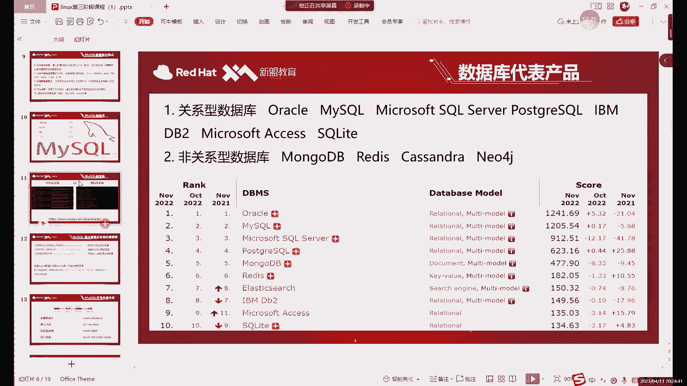
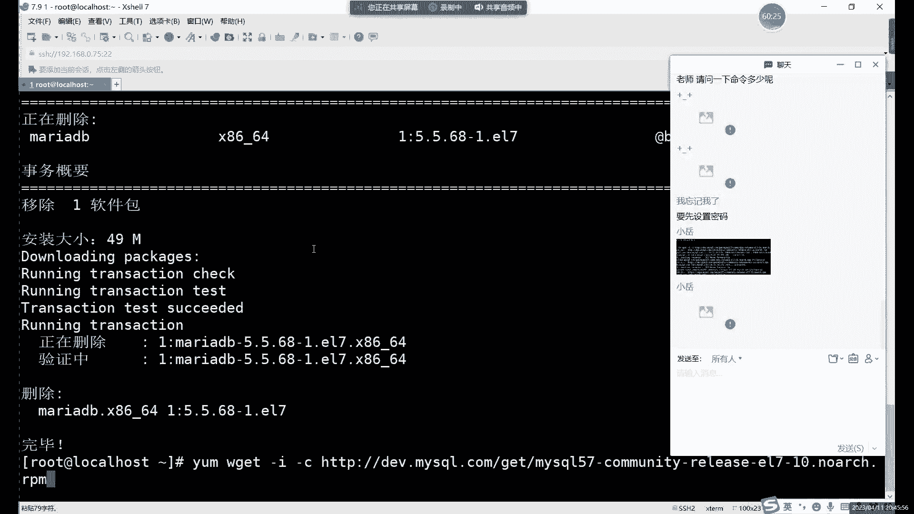
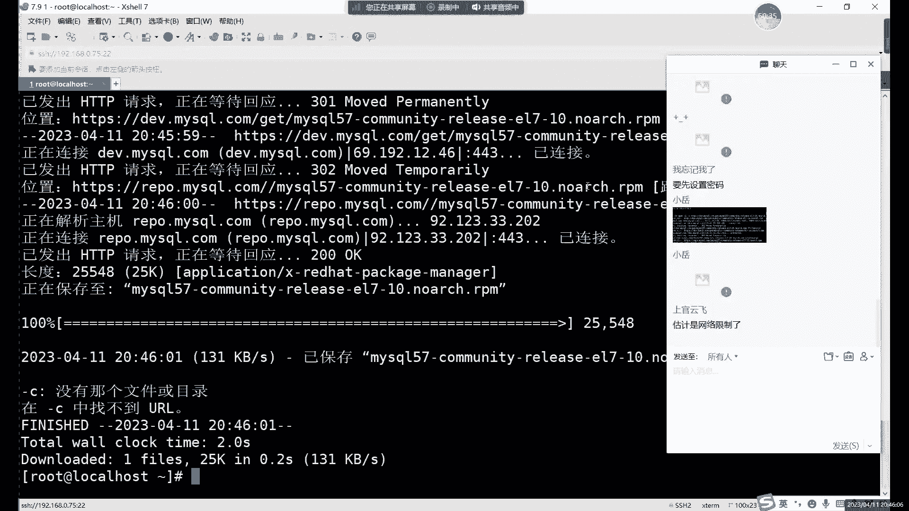
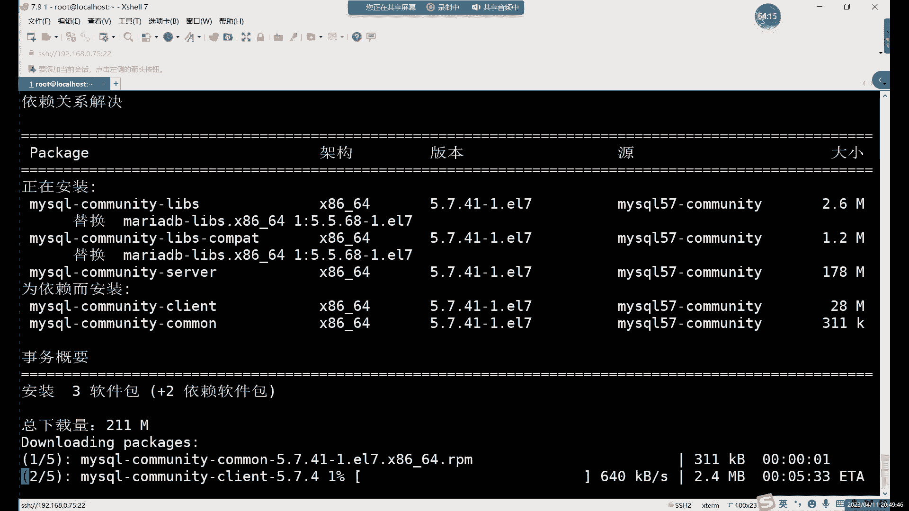
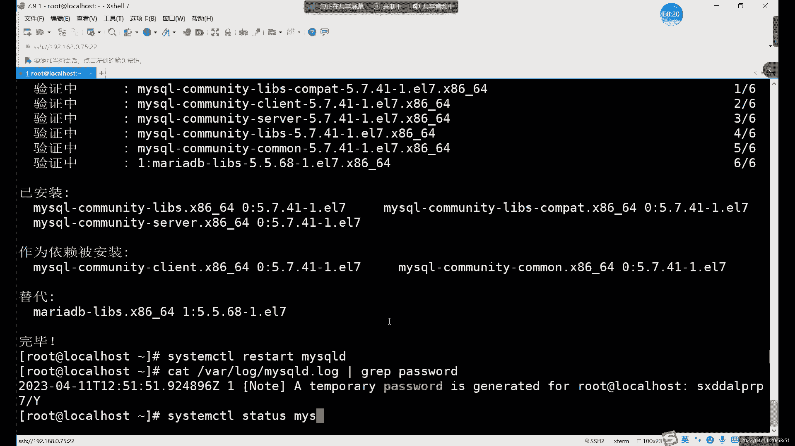
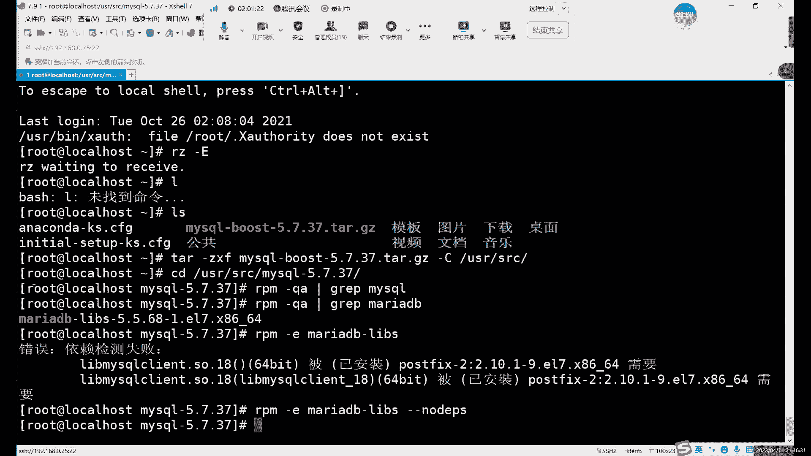
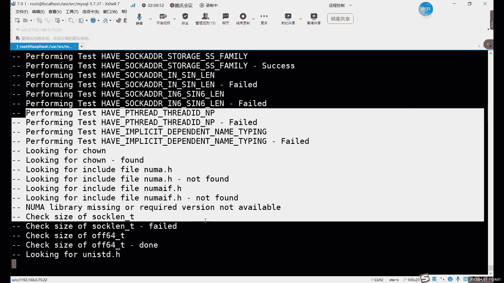
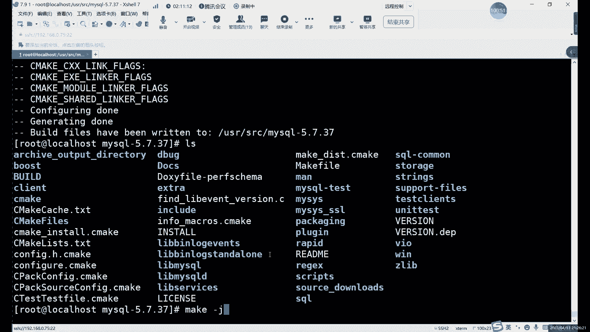
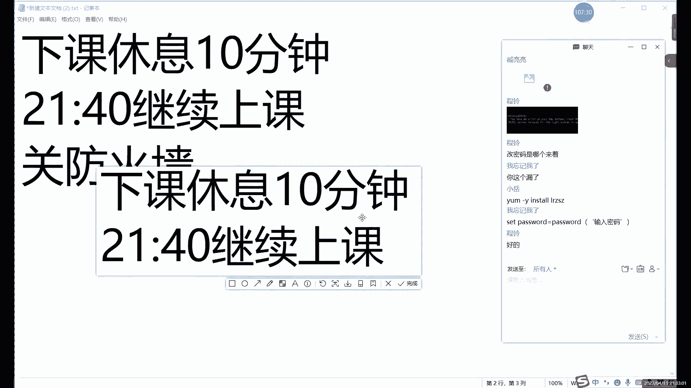

# 零基础入门Linux，红帽认证全套教程！Linux运维工程师的升职加薪宝典！RHCSA+RHCE+中级运维+云计算课程大合集！ - P63：中级运维-2.MySQL介绍及安-中 - 广厦千万- - BV1ns4y1r7A2

其实他俩是两家公司的那收购的收购之后呢，买sgo的创始人呢，他又重新的什么，又重新开发了一个基于买scle的代码，又重新开发了一个买DB。

啊。也就是说它其实里面命令是一样的，我是，但是呢它是两个数据库。而且呢大家注意啊，后边的话可能大家会遇到一些偶尔会遇到一些这个买自的安装的报错。罪魁或者是谁呢？罪魁或者就是他。为什么这么说呢？

因为他俩呢。在文件上是有在文件上或者说是简单的来说，就是这两软件是冲突的。啊。这俩软件有冲突啊。然要么刚Y removemo啊，或者就多打了inst。啊，我这里还得还得再卸载一下，因为什么？

因为这个它和马思路有冲突，所以说呢不能一起装啊不能一起装。也就是我们本地量仓库里面其实也没有。啊，那我们常用的一些网络样本源里面有吗？就比如说什么呢？😡，哎，比如说这个。阿里云啊或者说是清华大学的云啊。

嗯，就是还有一些网易的。这些这个云这应叫云。不能说语音吧。进像站啊，我怎么说说说起云来了，进像站啊不是云啊。阿里的定像站啊，清华大学的定像站呢。他们里面其实也没有。啊，就是其实很多软件的话。

这些语里面都没有，也就用样么安装的。其实可以，但是呢。你需要什么额外的去下载一些这个比如说我们如果要想装myciqcle的话，你就必须要去下载什么呢？下载mycircle的源。

啊，现在买车的价不员。具体步骤的话啊，笔记里边是有的。

但系哪个嚟的？啊。具体步骤的话，笔记里边有。啊，就是这个大家可以打开这个，一会儿大家安装的时候，可以直接去这里面去复制啊。因为很多命令很长，而且不用没必要去记啊，没必要去记。

比如说我们来看一下什么呢？

嗯，来看一个。项目员啊。这里的话这个样目源。如果说大家想亚马种买sql的话，需要下载去买sqgo的官网上去下载这个。亚母原啊基码都有样方出现3载样母样母源。因安装方式准确的说的话是三种。啊，13种。

RPM安装对吧？样码安装以及什么以及源码安装。我们其实这里主要用什么？其实用原码安装更多一些。

啊，因为一个软件的话，其实怎么说呢？

大家前面应该也是也听过这个对吧？啊，原码安装和RPM安装。RPM它其实已经是编译好的啊，你拿来的话就可以直接安装，非常方便。但是它里边有一些东西吧。它的东西它里面的一些设置啊是固定的哎。

就是你不管是谁安装，它装出来的效果都一样。那相当于一个定制的啊，不能说定制吧，就是嗯一个。软件就是。就类似于什么呢？类似于我们正常在windows里面装装一些软件，对吧？你谁装都一样，对吧？

装出来都是一样的。而原宝宝安装这边呢。它速度是稍稍速度会稍微慢一些。但他的特点呢是什么？他特点就是。能自定义装。哎，自定义安装。也就是里边哎涉及到一些什么，涉及到一些安装路径啊。啊，安装的这个目录啊。

文文件啊，或者说具体安装的功能啊，开启哪些功能等等等等。这些的话其实就是源码安装可以去设置的啊，其实相当于我们可以自定义设置。而RPM包这边就不行。RPM包这边啊，你安装的目录永远是固定的。啊。

你数据目录也好啊，日志目录啊。就是所有我们的这个软件就完全是一个。固定的一个状态。然后这个的话就是两个安装方式的一个区别啊，样么安装和2RPM安装是一样的啊，它俩是一样的，特点是一样的。

因为为其实包就是完全一致的。啊，保养是完全一致。啊，我们样完中的路径的话就是这个。啊，对你发这个路径没问题。对，是这个。然后大家可以现在把这个什么可以把这些嗯软件包啊下载一下啊。

我们一会儿可以一起来装啊，一起来装一下。啊，可以给大家几分钟时间下载一下。啊，我可以先。下课休息一会儿是吧，下课休息一会儿，大家可以先提前下载啊，提前下载。😊。

好，我们接下来的话继续啊来说一下这个买速的安装啊。首先我们先强调一下这个样板安装啊，因为大家我看刚才下课的时候已经有同学在尝试，对吧？有样板安装。样板安装的话，其实主要注意的一点就是什么呢？啊。

第一个Wge命令。它又是裂开的啊，Wge命令的话，这小方说没有你需要用亚M杠弯一丝道安装一下。当然前提是你这个样防护先弄好啊，样防护先弄好。这个样仓库的话，就已经是它是前两届的那种啊。

我这里不肯定不会再家大家继续弄啊，没弄好的话，大家下去。把这个什么啊把样仓库部署好，然后用WG去。下载啊。到浏览下载。首先我们第一个。这里又是什么报错呢？这报错确实有点千奇百怪。

我觉你这个连的网连网上好像还像是有点问。比如说我这里给大家先先给演示一下这个命令啊，我们就先用样板安装一下啊，用样本来显示一下。这我这里一直在列。

不应该是网不好。

对吧。安装到最后呢。他会什么呢？他会下载下来这么一个。

包啊带下来这么一个包看一下啊。对大家首先啊就是。你看成没成功的话，就是你到时盖的资金网之后呢，你看一下本地啊，就是看一下当前目录有没有这么1个RPM包。啊，有没有安全包啊，网盘里的这个。

网盘里的这个。买次我安装的这个PDF或者说onenot格式的啊，我只我只里只能看两种格式的。嗯。

然后网盘的话就是在群公告里面啊，在群公告里。嗯。我们现在不是36期群嘛啊，36期群，我们现在电商阶段在36期群里看啊啊，376期群里上啊，36期群提。然后的话你安装好有这个包之后呢，你再样么安装啊。

确定这个保包下载好之后，然后我们直行下一步就是什么样么安装这一步它安装的是什么呢？

它这个包啊其实它很小，我看一下看一个大小啊。大小它只有25K。啊，就是它其实它并不是一个软件包，它只是一个什么呢？它只是一个啊为我们编辑什么呢？编辑我们的这个样仓库的一个软件啊，编辑样仓库的一个小软件。

我们样么安装它的话。啊，y么杠Yinstore安装这个my circlercle。嗯，马斯克57。啊，安装它的话。他其实就是把什么呢，给我们安装了一个。网那就是样目源。

比如说我们打开这个一器之架的yM点IPO点D这么一个目录，我们可以看到什么呢？看到myCqcle杠community的样目源有了它哎，我们就可以安装什么呢？有它我们就可以安装myCcle了。

啊，对，有了这个包的话就可以安装啊，用yM去装。啊，这步就没问题了。装好之后的话，你要看一下什么，看一下这个ETC的M点REP点对公录里边哎有没有什么呢？有没有这个两个文件有这俩文件了。哎，那好。

我们就可以什么呢？可以安装什么呢？安装这个这个就是我们的my杠杠 server了这个软件。但是安装前呢，最好先下载一下什么呢？下载一下我们的密钥。

啊，呃，这里是这里写了这里是2022啊，为什么2022呢？因为这个版本它是看啊这个版本是2022版，所以说它这个密钥。

就这个软件它是2022版。所以他这个密钥也我们下载202的。嗯。你要希望十。

然后呢，下载好密钥之后呢，我们就可以样么安装什么，样么安装mysrcle啊就可以。

马思傅讲肯问题。嗯。

啊 sorry。啊，这个就是软件包的一个名字。

安装话这里其实它包括什么呢？包括。几个不同的软件包啊几个不同的软件包。这个几个其实是前面几个其实算什么？它是算依赖关系啊，就是我们主这主要的这个server这里的依赖关系。Oh。然而这个依赖关系呢。

它其实并不是什么，并不是。

这几个的话其实我们在RPM自己RPM手动装的时候呢，也可以去下载这些呃软件包。啊，现在这个版本应该是5。7。41版的。现在已经跟到5。7。41了。

啊，RPM杠。这个RPM命令呢没有反应是正常啊没有反应是正常。啊，你系个。好，安装好之后呢，就可以启动了。啊，安装好就可以启动。然后呢，软件的名字叫什么呢？啊，虽然说我们是叫mycircle啊。

但是它因为是什么？它是RPM安装的RPM安装的所有的mysqcle它名字都一样，就是mysrcleD。啊，他就多个地。怎么说呢？他这个地吧。呃，我看起来就不是不是很顺眼。啊，但是呢他没办法。

RPM安装样码安装，我们没办法去改变它的一个软件名字啊，这个我们没办法改变，因为它这个是。相当于是编译好了之后。哎，或者说你可以怎么理解，就是它已经装好了，我们只是把这个RPM，就是他把把这个装好的。

我们移到了我们本地这里。啊，然后然后把这些目录啊文件什么都创建一下，然后就安装就是安装这么一个买色格地。

安装好之后的话。我们可以用。重启一下了来？重启一下这个或者开启都可以啊，重启开启都行。啊，开启我们买 circle。埋咗。开几号之后的话，我们需要看怎么看密码。因为为了安全性考虑，在5。7版本之后。啊。

这5。6之前其实没有的，5。6之前是没密码的啊，myscle可以直接进入，它一个密码都没有。5。7之后呢，他说是为了安全性考虑，但其实也怎么说呢？也没有什没有多安全，也没有什么多安全。

就是它设置了一个原始密码。啊，但是这有原始密码。这个原始密码呢是在哪个位置呢？😡。

如果你是RPM安装，或者说是亚么安装的。它位置统一都在。VR下的log目录下哎有这么一个日志啊，VR目录大家都知道对吧？VR下的log下呢都是存放什么呢？都是存放日志的地方。😡，哎，我们怎么日识的地方。

那这个my circle的日志的话就叫mycycl，然后点log啊，就这么一个文件，我的密码是存到在这个文件里边的。所以说呢我们看一下这个文件就行了。啊，然后看一下，用gra过滤一下密码就可以。哎。

比如说我们可以直接直接这样执行啊。

T。VR下的log目录下。文件名字呢就是买scle的log啊，点lo。过滤一下我们的密码选项。啊。就相当于是把密养内行过滤出来了。密码在哪面啊？在结尾啊，密码是结尾。然后呢，大家这个密码肯定是不一样的。

但是密码是完全随机的。所以说大家在复制的时候呀，需要注意一下，就是不要复制少符号了，就是冒号后边的全部都要复制。它因为里面可能会带一些符号什么的，也需要一起带上。因为它这个少一个都进不去啊。

少些都进不去。然后呢，我们买circle。😊，买头杠U。啊，买t进入现在的话，买特其实已经是启动了啊，这个reor没有报错的话，我们就已经成功启动了。可以用dater命令看一下啊。

对吧就是running就行啊，不管是什么服务。只要大家能看到running running就行，颜色什么的不重要啊，可能有一些服务后边有一些啊有些这个fe呀什么的，这些其实不影响。哎。

只要你前面是个running啊，running状态就可以。😊，这个是看一个服务，如果启动的话，主要是看中。

XT我装你这两个。然后的话我们这里。启动之后呢，就可以进入数据库啊，进数据库的话用mysql命令。

啊，这时候呢这个命令就需要记了啊，前面那些安装的啊，它无非就是一些亚马RPM什么的。😡，对吧那个命令呢不用记全，在下边这个命令呢啊就是我们啊选买scle第一个要记的命令。啊，这里划重点啊。

myscle杠U。Root。🎼啊，当然这里有没有空格都可以啊，可以有空格，可没有空格，这个都行啊。然后杠P杠一root就是userus的意思。哎，就是用户。因为现在我们装好之后呢。

它其实只是默认是什么呢？它默认给我们的ro用户创建了个密码。大家注意看一下上面这个。上面这个是我们的日志。😡，啊，日志。日志这里呢。😡，我们写到的是root。啊，logo host的一个密码。

也就是我们只能用什么呢？就默认装好之后呢，只能用root用户去登录。😡，啊，你其他用户登不上去啊，你们没有密码的。😡，杠Uro杠P杠P上放记住密码的password。对吧我刚才不是刚说过嘛。

grade呃gra password哎住杠P呢通过密码去进入，然后把大家把这个复制一下。复制之后呢，你不要直接复制在这个后边，为什么呢？因为可能会有一些符号。啊，可能会有一些符号，有符号的话。

这里它就会报错。😡，啊，有的话这里就会报错，所以一定要注意啊一定要注意。嗯，一般情况下呢建议大家什么呢？建议大家就买solo杠Uroot杠P。直接回撤。

然后呢，输入这个密码。大家不用输入，你复制就行啊，复制就行。😡，哎，大家可以看到这里的话，其实。😊，直接在后面加杠P的话，这里是需要人的，需要把它这个连起来的。

嗯。我们买搜狗。杠Uroot杠P啊，加这个密码。啊，这样也行，这样的话一般我说你可以用，我一般就是习惯是连起来写啊连起来写。

啊，这样就进来了。当然如果说你这里会有如果有一些特殊符号的话，呃，就是你可以怎么写呢？就是买se杠一root。啊，这个制线的话已经进入到我们数据库当中了啊，这个数据库的版本退出的话是exit退出就行。

然后建议大家进来的时候，就是买so杠Uroot杠P这样进入。

回车的时候呢，你把这个密码呢。复制在这里就行。因为有可能有大家这个随机密码里面会有一些特殊符号，有特殊符号的话，就自己会报错啊。啊，这里就我们就不继续说其他命令了啊，大家先记住第一个命令，对吧？

买这万Uroot当P后面加密码。啊，这密码密码比较复杂情况下呢。如果有一些特殊符号的话，你就这样进就行，不要把密码直接输在后边，输在后边它不会生效啊，不会生效。那这个的话就是什么？

这个就是我们第一个样目安装，就是很简单。主要是你得联网啊，样板到万音斯啊这个报错的话，虽然说你没有截图到。你联网了没？全是报错的话呢，大概率有可能是没有联网。啊，大概率是没有联网联网。

那那你把这个截图你再发一遍。哎，这个都。网络没什么问题，但每次大家发这个图片，他第一次这种很基本上接收不到。还是看上面的。一大半图片都我都看不到。

呃，有点有点问题。哦。这个告错它是依赖关系的问题。依赖关系的问题。118是吧，是不是用的是。我已经感觉到您用的是不是s路呃，s8或者说是800万的系统。因为我看到这个118了啊。有是希望。

问的齐不应该呀嗯。YFTPD。你这里报错都是什么？都是其他服务的一些报错啊，都是其他服务的一些报错。其他服务的报错的话。今天只有系统啊，系统没问题。你之前做过什么操作嘛？我感觉就是你之前。

估信你恢复一个什么，恢复一个装好这个系统之后，你恢复一个最原始的快照吧。这些的话他报的都什么，都是其他服务的一些问题。就是和相当于是和其他服务冲突了。啊，现在是和其他客户冲突了，就会报了这么多错。Oh。

你可以恢复快照重新做一下啊，不行的话，下课给你看一下，下课给你看。

啊，能进去的话，说明就安装好了，就安装好了。Oh。彭林，你这里的报错的话，其实就是他和其他服务冲通的。冲通的话，最好还是你恢复一下拍照，啊恢复个原始拍照肯定是没什么问题的。

好，我们就接下来继续啊接下来继续啊，继续说下一种方法。啊，当然。可以先改个密码，对吧？你大家如果说嫌密码太复杂了，对吧？改的密码确实是有必要的。啊，你可以直接看什么呢？直接看这个。

他敢他修改密码这个笔记啊，查看查看密码这个笔记。文档里有啊主文档里有定到这个呃系统里边之后呢，其实你什么操作都不能做。

啊，这个是什么？这个是mysq的一个限制，就是你必须要先改密码，你想干其他的，他不让你干啊，只能先改密码。mysqcle7里边啊5。7里边。最简单的血管面的方法。啊，当然修改面呢不止一种方法。

就最简单的一种就是。pas索尔等于pas索尔就行。嗯。啊，等于发多少就可以了。然后呢，它这里的报错是什么呢？就是报错密码太简单了啊，密码太简单了，这个是RPM安装的一个限制吧啊RP安装的一个限制。

它要至少8位的数字啊，不是8位的密码，有数字有字母，有大写写大小写字母啊，对，有数字有符号，大小写字母4种，而且要8位啊，这个是它的一个陷制。啊，这也是怎么说这个线制当然可以调啊，具体调整的话。

大家可以看一下这个。

笔记里边。这里我们可以修改密码策略啊，这里我就不改了，大家这个可以了解一下。因为密码策略的话默认的话，确实这个也比较合理，对吧？这这里能设置一个相对于复杂一些的密码，那保证一个安全性的啊。

你可以修改密码策略啊。

嗯你是你如果要想让地方简单一点，你可以直接自理直接改的啊。但是我为什么这里不改呢？因为我一般也不会用什么，我一般也不会用这个RPM安装的。更多的大家还是推荐大家更多的去装的装这个样板安装。好吧。

但是呢因为这个RPM当中呢里面有很多东西吧，嗯很麻烦，密码是其一，其实还有什么呢？还有一些这个。中文中文乱码的问题，其实RPM包装里面他们没有都没有解决，为什么呢？

因为它这个相当于是官方出的一个软件包啊。这个的话你你可以理解成是一官方处的软件包。这个软件包的话。他其实并不是哎呀。因为它里面是默认用的什么？默认用的是拉丁文，它用的不是中文啊。

他肯定不可能给你用中文的，因为它这个是官方嘛，知道吗？都有他它国外的东西。所以说呢哎如果说我们要去安装的一个比较合适的版本的话，或者说合适的系统的话，最好是什么？最好是用这个RP源码安装的。诶一晚就。

原版安装的话。特点是什么呢？啊，它速度会稍微慢一些。但是呢我们可以怎么我们可以在安装的过程中呢，设置一些路径啊，设置一些目录。然后呢啊可以在。除了路径啊、目录之外呢，还可以设置一些哎比如说语言。啊。

我们就可以让它支持中文。因为你现在直接安装这个马啊，现在我们刚才用亚马安装这个mysql，它有个什么问题呢？有很大问题就是它默认是不支持中文的啊。

你修改起来也还是得用还得用这个还是要去修改一些配置文件什么的，其实很麻烦。啊，我们干脆就是什么？就是用源码安装，我们可以一次把这个设置啊都设置好。设置好之后呢，后边就唉不管是干什么，其实都比较方便。

啊然后源码安装的话，首先包的话是哪一个呢？包的话，当然大家也可以去。呃，去买所官网上也可以下载。但是呢我是提前已经下载好，大家直接在哪，直接在这个网盘里下载就行，就是这个原码包。还说这个文件夹里面。

有RPM包和元宝宝两种。因为你两个安装其实就不需要提前下载，你它就相当于是正直接联网下载。然后呢，RPM和原版安装呢都可以什么？都可以是啊在没有网的情况下是可以安装的啊，不需要网络就可以装。

你亚房状他必须得有我啊必须得有。然后呢，这里的话呢可以下载一下这个原码包啊，原码包。

原网报的安装的话，应该大家之前。之前前两阶段应该是有一节课是讲这个原网安安装的。啊，但是呢不同的软件啊，原为我们安装的方式呢它不是一，但都不一样。啊，他不一样的。你睇家哋自己听啊，自己听。

主要的步骤的话。😡。

或者说是原码安装的一个特点呢，我们就可以指定什么？指定一些安装的目录啊，指定一些数据目录啊。以及配置文件啊。啊，等等这些目录啊，都可以去指定。这是更加。自自由一些啊，或者说就相当于是自定义安装。啊。

你可以理解成这个。RPM包安装就是默认安装。😡，RO的么原网宝安装呢就是什么呢？哎，就是这个自定义安装。这个是最哎最直接的这种理解方式啊。然后接下来的话我们来看一下，我们先把这个包整进来啊。😊。

我把这个包整掉。诶，我的包去哪了。

哎，可接把包复制进去。或者说你也可以用Wg命令直接去在这里下载也行啊。然后这里的话我们就可以看一下，我们拖件那个包的话，名字啊，就是我们买dogo啊版本的话，这个其实和我们刚才装那个不太一样。啊。

当然呢我们装之前呢最好还是先什么的啊，y么杠弯remove。删除一些什么呢？删除一下买cyclcle。杠 community。啊， sorry。这个整体的包的话。嗯。咱如果跟着做的话。

其实怎说你可以删一下啊，用BM刚Y remoteM删一下，或者说呢最直接的方式呢，我一般选择什么呢？我一般选择恢度快手。

你恢不快照怎么说呢？比较快捷一点啊，因为卸载的话，你要卸载还好几个包啊，也比较麻烦，可以直恢快照。

啊，快照拍的多还是有好处的。就是你想要去哪个环境呢，你直接恢复就行啊，我这里就不删除了，删除的话。

你花点时间，不如直接恢快照，这样更快一点啊，这样更快一点。然后我们接来的话继续我们接下来看什么？就来看这种样码，不是RPM不是哼源码安装的方式是吧，原码安装。

我们这就不用删了，用连接一下。

然后的话我们这里。哎，退出退出。EXIT你打错了。EIXT啊。

EXI。然后的话这里我们接下来就来看一下这个啊，我们再把包脱一下，看家恢不会拍照了啊。

原宝宝安装的话，首先一般原宝宝都是以TR点GZ结尾的。这个相当于是压缩包。啊，压缩包。然后的话我们安装这个压缩包呢。怎么装呢？首先先解压啊，TR结尾的，它肯定是什么？

肯定用TR命压缩的那我们就用这个命令去解压，对吧？这个解压命令不用我多说了，对吧？解压X。😊，啊，X解下就行。内的话就是基对格式。然后的话我们把后边这个my circlecle啊。

把这个my这个包呢解压一下。解压的路径呢。随意啊，你写在哪都可以。啊，如果说默认这样直接执行的话，相当于把这个包呢夹压到了我们的当前目录，也就是录屏目录下，没问题啊。但我一般情况下。

我安卓软件习惯了很多年了，这么多年了都养成习惯啊，一般是装在什么呢？装在user目录里面。啊，源码包应般放在哪？应般放在S2C目录下。大家这个目录呢是可以随意去指定的啊，这个没有固定的规规范啊规则。

因为这个元宝宝讲究的一个讲究的就是什么？讲究的就是自定义自由。啊，所以说呢这个。以想要安装到哪都可以。啊，只要命令只要这个目录有就行啊，只要目录有就行。解压好之后呢，我可以来看一下啊。

我们是解压到user的目录下来啊，就到这个目录下了。所以说呢你们切换过去就可以看一下。切换到my circle的5。7。37，这个是什么呢？这个是我们刚才解压出来的包啊，它解压出来的目录就叫这个名字啊。

我可以切换过去。元宝宝安装呢。主要的步骤是什么呢？啊，主要的步骤就是一个。编译我们这个元宝宝。因为元宝宝它还相当于什么呢？相当于还是。原有的编程语言。啊，就比如说它原有是什么？原有是C语言啊。

my思是C语言写的。我们这个包里面的内容呢其实全部都是非语言组成的。然后呢。我们如果说想要安装这个R的话，我们需要什么？我们需要把C语言呢啊给它变成什么？变成二进制的语言。二进制是什么？

1啊0101是吧，这就叫二进制。没问题，对吧？这个应该大家能理解。二进制的它才是我们的计算机能够识别的东西。啊，二进制的它才才是我们最段机能够识别的语言。RPM包它其实已经编译好的二进制的包。

所以说呢安装起来很快。😡，但是呢你什么都不能改啊，比如说目录什么的，全部都固定的。因为它已经编译好了，或者说已经翻译好。啊，或者已经翻译好。那我们这个二进，那就是我们的原码包啊。原网宝它是什么包呢？

它其实是一个原有的编程语言。我们需要把它呢，就比如说我们需要把这个C语言呢哎给它变成什么？变成0101的这些。啊，这就是我们编译的一个作用。所以说呢我们接下来的话步骤就是什么就是编译。

而编译这里呢，我们需要用到命一呢。啊，用的就是这个。原码安装啊编译。用的就是s命。啊，或者说是make都行。啊，编译的命令准确的说是make啊make。

就是原宝安装的话都是make以及make install store这两个命令啊这两个命令。然后sem的话，这个是什么呢？它这个是预编译的意思，或者说呢你可以连成设置。啊，这一步的话就是设计。

设置一下我们安装哪些功能，或者说是什么呢？哎，或者说是安装。启用哪些功能？这里的话啊或者说是修改一些目录。就这么几种。当然呢，执行这个设置之前呢啊就开始把它理解成设置啊，设置我们的这个。

安装选项这这一步的话，你就可以理成什么呢？可以理解成在安装一个windows软件的时候，对吧？我们都会怎么都可以自定义去选择一些目录啊，对吧？啊，或者说是开启一些功能啊。😊。

是否把它加入到这个桌面换，就是是否给它创建桌面快捷快捷方式啊，是不是加在我们的这个菜单里边。加这个菜单里面啊。这些。

这就是自定义的安装啊，这里的话就类似于我们在windows里面装软件的时候，一些自定义的设计。啊，当然当然我们这里是以什么？以命令的形式显示的。😡，然后的话在设置之前的话，我们刚才已经剪好了，对吧？

解好了，并且呢到了这个目录下啊，但是呢还有一步的话我们还没有做，是什么呢？就是哎处理一下这个文IDB这个问题。啊，当然了，其实刚才我们已经其实已经安装过一次mycycll了啊，同学我们也恢复快照。

对吧我刚才恢复快到了，所以说呢大家一定要就是每次安装买scle之前呢，先检查一下。😊，买尔DB的这个文件是否存在？什么意思呢？😡，他俩是呃忘记保存快是？没关系啊，如果说没有快乐的话，刚才你样m安装好了。

你就是用ym杠Yremo把那个买s狗全卸载掉。啊，谢得掉。然后这里的话这个RPM安装一定要注意一下啊，比如说我们来看一下RPM杠QA杠QA查看什么呢？就查看一下。

现在。啊，不是查看mysql就查看啊，当然你也可以看一下mysqcle。但然我现在也没有装啊，如果大家用亚码安装的话，可以先卸载一下，你把查看出来的myscle包呢都卸载掉。😊，然后呢。

再看一下这个V2DB这个数据库呢买s的一个myscle他儿子，对吧？你可以这么理解，mys他儿子，但是呢。他呢。😡，怎么说呢？和他父亲之间有一些矛盾。啊，和他父亲之间有一些矛盾。具体矛盾是什么呢？啊。

就是这个文件的啊其实具体的这个头其实就是个文件的矛盾。myscle的话，它也有这个什么，也有这个les的文件。啊，这个文件的话，myscle和MDB呢相当于是冲突的。啊，父子之间的矛盾。

有时候他其实就是一个小事儿。啊，所以说不能一起装。我没办法，这个是他真不能一起装。所以说呢你如果说安装了，已经之前装过没尔DB的话，先卸载掉啊，先卸载掉。主要是卸载这个文件啊。

我们主要是卸载这个文件RPM杠。😊，E啊刚一卸载文件。系 a r d b d b。放 lives。啊。进载到这个文件。如果说不加后边这个呢，他会怎么他说他是会报什么？他会报依赖关系的问题。

所以说呢如果说只只想单独卸载这个文件的话，需要加上杠杠啊，on the piece。这个的话就是忽略依赖关系卸载。啊，会员医赖关系下载。

然后就我们这里直接卸载就行了。2PM杠1记得掉。调个掉呢啊那我们这个。相当于把儿子呢从我们系统里面卸载掉了。那现在呢安装满Circle呢就没什么问题。啊，现在就可以去安装。但是安装之前的话。

我们需要先下载一些什么呢？下载一些命令。

当然这些的话，有可能你系统里面你有了，那这里的话写的比较全一些啊。如果说大家是最想化安装的话。这些的话尽量去多安装一下。啊，有些命令它可能没有，最好安装的话，这里也会少很多命名啊。因为我们后面会用到。

比如说像这个Cmake设置，对吧？make编译这些的话，最好安装的话，它可能都没有。啊，这些命令的话不用记啊不用记。然后包括这个GZZ2CCCC加加的环境，这个其实就是我们这个C语言的一个环境。

这个的话不需要去记，就是你不同因为不同的这个软件啊，它装的这些命令呀、环境啊都不一样。

这个没必要去记，就是不同软件，你只要知道我们这个总体上的一个安装的流程就可以了。啊，甚至啊换个版本什么的。就比如说。你5。6啊5。7安装方法一样嘛？它这实都有有点区别啊。

就不同的版本之间呢就稍微有点区别的安装方法。

这里的话我们要嗯要么刚完inst安装一些这些软件，哎呀，或者说命令啊，它里面有的是命令，有的是环境啊，都有都有。

呃，网盘里有你打开那个文件之后呢，你往下滑一滑，它有很多页儿。啊，我这个。

分很多页儿的。然后呢，这个文件就是这个元养包呢也是在网盘里面的目录我分了好几个目录，因为它文件比较多啊。然后这里的话就已经装好那些环境啊，命令什么的。装好之后，下一步呢就可以开始什么开始设置了。

啊，设置这里大家注意啊，强调一下，这是一整条命令。啊，它是一整条命令，什么意思呢？这一整条命令呢。大家不用记啊，直接复制就行了啊，我给大家简单说一下啊，简单说一下它的一个含义。一整条啊一整条。

不要分不要复制就分开，他这里我是写不下，就是它自动换行了，自动换行了。这个杠其实刚在这边这个位置。然后这里的话就s命就是设置。你可以离人设。然后后边呢。install prefi就安装目录。啊。

这个可以随意指定。因为我们是资金安装。这个这一步就相当于是什么呢？相当于。你windows里边自定义安装位置那一步。啊，就是这里。你可以自己去设计。然后呢，下一步呢。

数据目录啊data there数据目录。啊，对吧这个这个就是买2DB和买so的一个冲突嘛。我卸载之后就正常了，是吧啊？咱一定要注意啊，这俩软件它不能共存啊，H。然后呢，这里这个下一步呢就是数据目录。

就是user下路下的data。啊，因为这个目录的话，其实mysse里面它其实有很多个目录啊啊myse里面有很多个目录。然后这个目录之后呢，这个数据目录，然后下面是什么？下面是配置文件的目录。啊。

就是我们这个服务的配置文件。啊，配制文件的一个地方。然后下边的这几个的话是开启什么呢？开启我们的。存储引擎对吧？我们刚才在介绍买solo的时候提到过这个存储引擎，这个是inowDB的。啊。

这是my sound这个存储引擎的话，我们后面会进行介绍。这里的话我们就是开启啊，就是允许或者说是让我们的这个系统啊，或者说mysqcle开启这两种引擎，后面能用啊，开引擎它不能用啊。

然后下一边的话大家注意啊，但是这些目录呢。对，这些目录是需要提前去创建的啊，当然现在不着急啊，现在是不着急的。啊，现在不着急。这个我们一会儿再创建也行啊，这个目录是不着急的。

这里的话相当于也就是自定义的一些目录。啊，自定目录的话，你让马fo克把这些数据放在这些目录里边，你肯定是要创建的对吧？你肯定是要创建这些目录的。然后下面的话就是语言了啊，准确的说的话，它其实叫字负集。

啊，这两个完整的话，两个加起来的话，就是什么UTF8的。UDF8字不集的话，其实在哪呢？在这个插票里边，其大家记得插票里边也是有的。

工具里边的选项。还不是这的。编辑里的。文件的绘画属性吧。

如果说有同学插校里边出现乱码问题呢，它是什么问题呢？它就是这个自符集的问。键盘啊终端在这儿。Yeah。这就是。编码。😡，这有很多编码，对吧？UTF8的话是支持什么？支持世界上绝大多数语言的。

所一般情况下，变码我们都选这个。

啊，都像这个。我们在myse里也是一样的啊，就是叉cel里边用一样的编码，这样的话你中文它就不会乱码了呗，对吧？就UTF8这个编码。然后后边的话。包括什么还有一些这个端口号啊。对吧还有一些这个。

其他的一些目录啊，这些的话大家这些的不用记啊，大家就看一下就行。因为你不同的。那不同的版本它装的其实都不一样。啊，包括最后一个呢是bost啊，bost的话这个这个名字是什么？这个名字是在我们的这个。

mycycll这里边的它呢是我们的一个库文件啊，是对就相当于是对我们mysl的一个补充。啊，它里边会放很多这个。哎，补充的一些文件啊，软件什么的。这个就相当于指定一下我们这个boss。啊好。

然后这个的话就是整个一个设置的命令啊设置的命密。但是呢倒也不用说啊，每次是都要设置这么多啊，最基本的你要设置一些什么呢？像这个。目录啊什么的，这些最好都加上。啊，像后边那一些的话。

其实啊其实可以可以不用加的可以不用加了。当然你如果你是复制的话，其实你全前复制上了也没什么问题，对吧？也没什么问。

直接复制过来就行了。大家注意一条命令啊，中间可不要断，断了的话就。断的话会出问题的，断的话就相当于他就会报错了啊，命令就断开，好吧。

temic编译啊，或者说是设置啊，这个种确是设置。然后设置的话，大家可以看啊。

他这里是什么呢？😡，looking for什么意思？寻找。

他这个设置这一步的话，他第一次要第一要寻找什么，寻找我们一些需要的文件。

以及检查对吧？check检查，检查我们的一些依赖关系啊，检查一些文件。

啊，给一些文件。寻找检查的一个作用。boss的话是和我们在我们原宝包里边就一起装的啊，一起装的boss库。啊一起装的。

然后呢，这里的话啊最后如果说没有出现一些er啊，fe的这些报错啊，它就说明什么设置成功了。😡，哎，设试成功了。然后呢，我们会在什么呢？会在user这个当前模录下呢生成一个什么呢？生成一个文件啊。

它比如构建了一个文件，对吧？哪个文件呢？它的名字叫make file。啊，在这。它构建出这么一个mac file。用 make file的话，它是一个的。啊，它是一个。编译的用的文件。是让谁用的呢？哎。

就是让我们这个。

mate命令用的。make命令时候BR插值编译。😡，但是编译前呢，我们肯定先要告诉什们，告诉我们的系统。😡，啊，编译的具体的这个。目标或者说是编译的目的是什么？😡，啊。

所以说呢我们这里设置的话会设置写写完之后，呢会生成一个文件，然后呢提供给我们的。make编列make命令去完成编译。Oh。然后编译这一步的话。这一步呢稍微有点慢啊，这一步的稍声稍微有点慢。

大家可以用什么呢？可以，如果说大家如果有多个CPU的话，可以用ma杠z命令，同时多线程同时编译，对吧？这里就体现出来多线程的问题了，对吧？吧？这个我们是支持多线程的，当然编译命令也是支持多线程。

如果说你一个线程去编译的话。它的速度呢会稍微一点慢。哎，速度会稍微有一些慢。如果你说你想要加快速度的话，就make杠G后面加上你CPU。

这里最不要太高啊，就是你CPU有几个，你就可以写几个，比如make杠G。啊，加CPU的这个数量。然后的话这里的话我们就可以什么呢？没这后边加上。

如果你这个的话大家可以看一下你这个虚拟机的具体的CPU有多少个啊。

啊，如果说只有一个的话，那。但主要看的是什么？看的不是说笔记本的CPU你看的是虚拟机的CPU啊。😡，但是你虚拟机里边设置了几个。和啊准确说，这里不能说是CPU的数量，也就说是核数。啊。

就是你CPU乘以每个里面核数的总合数。合数总数的话，一般情况下啊。就可以用来什么呢啊，用来当做这个。人人叫。可以利用的可以用这个现成的数量。

啊，比如说我这里是4嘛，我就可以变断这4。哎，就看你虚拟机有多少个。笔记本的话。

笔记本你任务管理器可以看吗？对吧那管理器一般一般虚拟机的设置的合数的话，不要超过你的逻辑处理器的数量就行。啊，不要超过你逻辑数理器的数量。超过这个数量的话。你电脑就会很卡，看看脑就会很卡。倒也不致命。

就是说特别卡。

啊不要超过这数量。然后的话这里如果说大家只有一个盒的话，那就mate命令直接执行。那就只执行那个命积就行了。如果有的话，有多个盒的话，就可以放这。啊，然后还要注意一下这个对编译这一步的话确实有点卡。

VA这步的话主要注意什么呢？你的内存呢不能太小。😡，Oh。你一个1个G的CPU的话，那就是不是1个CPU，那就一G内存，那没什么问题。如果说你用了多个什么的？如果说你用了多个。多个CPU同时编译的话。

内存的话一定要稍微高一些啊稍微深一点，你不深的话，它会报错。啊，你们CPU用多了，内存它会跑满啊，它内存低的话容易跑满。啊，所以说这个东西怎么说呢？CPU和内存要匹配啊。

你能确保CPU内存不要差太多就行。

这步我就开始执行了开始执行。啊，现在的话大概需要几分钟的时间啊，给大家看一下。看一下问题，发了好多啊。啊，如果说你直接往我们的插el里面拖一些文件的时候，他如果说报了什么，报了找不到命令的错的话。

他就是你没有安装那个还是最小化安装，没有装这个LRZSZ。啊，这个命令。这个命令有什么用呢？这个命令就是用来我们呃windows和。linkux之间传文件的。啊。然后呢，传传文件的话，你看啊。

RZ呢是windows网linux传。SZ呢是linux网windows。

Yes。然下载一下这个下载一下这个命令，也是用yM装就行啊，就用样M安装这个命令就可以。这个不是版本的问题，它这个只是少个命令能。反正就是少这个版本。的命令他和不是找这个命令和版本无关啊。

他不是啥寿资的。😡，啊，他不是叉时候，存在。😡，它其实是linkux的命密，它不是插项的命密。叉FTP我我这里都没有装它LTB，我这里装装叉IP都都报错。所以说我一般就用这个习惯用linkux的命。

其实和叉FTB是一样的。只不过我这里没装叉FTD，我就装，我就是用liux里面这个RLRZSZ如果装你叉FTD的话。嗯，你就可以直用柴油机也传也行，也可以啊。没什么区别，它就是两个不同的这个。

长文件的一个软件都可以啊都可以，有一个就行啊有一个就行。然后大家这个这一步的话，如果说。哎呦。哎，没又裂。嗯，这一步的话，大家如果说只有1个CPU内存不多的话，你就make命令稍微等一下啊。

这至少得等个十几分钟。如果有多个CPU的话，这里还是比较快的啊，速度还是比较快的。啊，趁等这个时间的话，大家可以。啊，下课休息几分钟啊，对吧休息几分钟。😊，啊，set命令的话是set password。

啊，你看笔记啊，笔记已经先发给大家。啊，这节课用到的命令呢，我一般会提前把。因为计算阶段的话，我们陌生命力很多哈。😊，这样就行。嗯，对，就是这8座。等于或者说什么呢？或者说你可以把这个加个引号。

就是你可以直接把这个命加个引号也行。啊，两种方法。这种意思是什么呢？它是一个函数啊。啊，我们这里说一下这个paor呢，它是一个加密函数。

你可以如果不说不写这个paword的话啊，那你这个密密码这里得加引号就可以啊，加个引号就。这个函数的作用呢就是给我们的密码加密。两面。两种都行啊，都可以，最好是建议加密。

为了安全性考虑是要最好是加上这个part数的函数。啊，如果说嗯练习的环境倒无所谓了啊。练习的环境很正常的话，你可以直接pasword加上引号密码。这里它报错的原因是啥？就是因为你这个字符它没加引号啊。

这里加个引号，其实其实也行。系，可以。然后呢，这里的话我们可以等几分钟啊，大家可以一起装一下，有什么报错可以发出来啊，直接发在这个功能区里边啊，我们给下个休息几分钟。好哇。

刚刚没看这似呢，大概才编译了10分钟啊，十几分钟。直差不多完事儿完事之后呢。啊，就能装什么呢？就可以继续。安装了那个这一步呢，它只编译。哎，将我们文件里的这些。编程语言呢编译成什么？编译成一些二进制的。

0101的数字。然后呢，我们最下一步是什么？就是make in。inst对吧？这个命令是安装的意思对吧？这个命令是安装的意思。所以说make installt呢它加起来就是什么呢？啊，编译之后呢。

我们把编译好的东西呢安装一下。安装一下。安装呢其实这一步这步时间很短啊，这步不需要太多时间的。安装的这一步的话，基本上就是把这些命令啊复制一下。哎，或者说呢把这些目录啊。把编译好的东西呢。

复制到他该去的地方啊，这个这个步骤很很快啊快。

然后这里的话就是安装安装中对吧？安装中把每一个文件啊，大家可以看到这里user假如下的my circleql，对吧？就是我们刚才指定的目录呀，对吧？就是我们在设置的时候指定的那个目录啊。

设置的时候指定的目录。我后这里等它安装好，安装好之后呢，我们下一步呢就可以什么最就可以进行最后一步的设置啊，配置一下我们的一些。信息。这里的话首先呢我们。一般情况下装一个软件呢，装好这个软件之后呢。

一般都会创建一个，就是给这个软件呢创建一个专属的用户。啊，这个的话其实。就是目的是什么呢？啊，目的就是不需要让 root体用户直接去操作啊，也可以不让ro体用户直接操作啊，你可以创建一些专属的啊。

就管理这个程序的，或者管理这个软件的一个。用户我们这里创建一个就叫他买 circlego吧。一般情况下我们都是软件叫啥，我们就创建一个用户，他叫啥。这样的话你好好看一点，好认一点嘛。

对吧我们可以创建一个买搜的用户。然后呢，我们创建一下目录，这几个目录的话就是我们刚才在设置里面指定的那几个。因为现在的话目前我们只有一个目录是user加my circle其他的目录呢我们暂时还没有啊。

编译好编译的话，它不不给我们创建目录啊，目录的话我们自己去创建，创建一个data的数据目录ETC的话是配置文件啊，就是我们软件的一些设置啊，设置的一些文件设置的一些功能什么的啊，就在这个配置文件里边。

😊，然后下一个的话就是TMP。啊，TMP是什么呢？啊？TMP就是临时文件啊，存放一些临时文件的。比如说晋程号啊，晋程ID什么。啊，然后呢，第四个logs就是日志。就是存放一些日志信息啊，存放日志信息。

然后呢，最后一步这个。分配一个属主属鼠，这个不用多解释，对吧？这个已经是老命令了啊，大家应该很熟悉了。然后呢，接下来的话我们就是编辑一下配置文件了。嗯，因为默认的话，它其实也有配置文件啊。

mys默认呢在系统里面是有一个配置文件的。但致呢它这个配置文件里边指定的一些信息啊。或者说数据啊其实是非常少的啊，或者设置的内容很少啊，这个就是能体现出我们这个原码安装的一个啊优势。我们可以什么呢？

我们在最初安装的时候，就可以完全自意的去写这个配置文件啊。大家配置文件怎么写呢？这个大家不用记啊，大家只知道只要知道这个配置文件里面的每一部分呢是什么意思就。啊，这配置文件呢。不这个不用去记啊。

大家只要知道每个里面后面什么意思，我这里的话基本上都给大家标注了一下。呃，前边的话这里内容很多啊内容很多。后边的话其实我们很多都会用到啊，我们先看一下我们最基本的设置啊，最基本设置。

cick呢我这里的话就客户端设计啊客户端的一个连接设计part的就是3306端口啊，3306端口啊，就是我们的my circlecle的默认端口就是3306。啊，买45帽那口乘3。6米。然后呢。

包括这个啊当然这里端口我们会写两次啊，2个3306啊，2个3306。服务端你客户端连接也是啊，服务端用的话，它也是3606端口啊，这个不没有冲突啊，就只是一个设置客户端，一个设置服务端而已。啊。

一个它是客户端，一个是服务端。而scket文件的话，这个是用来什么？用来哎我们的服务之间的一个通信，以及什么？以及哎不同主机上的啊服务的一个通信。这个就是这个scket文件的一个作用。啊。

它其实就是一个连接者啊，用来连接不同的服务之间啊，因为不同的服务的话，因为你通信的话，其实啊不同的服务，你端口号又不一样，对吧？啊，那你通信怎么办呢？啊，我们只需要通过进用这么一个文件来进通信。啊。

通过这个文件。它呢是放在我们TMP临时临时目录里边的啊，临时目录里边的。然后下边的这些的话就是我们刚才设置里边指定的啊，我们配置文件里也要写一下啊，安装的目录。数据目录啊。

刚才那个连接的啊套节字文件的路径。TID是什么呢？就是我们的。进程ID啊就是我们这个数据库的进程ID。进程号。因为作为一个服务来说呢，就所有的服务呢，它都想要运行呢，都必须要有一个什么，有一个进程。

对吧？都要在系统里面开启一个进程。那这个PID呢就是进程的ID。😊，然后这里的话就很重要啊，这个非常重要。再强调一下啊，这个可不能随便改啊，改了之后呢，你中文就会乱码了。啊。

UTL8呢就是字符集啊字符集。😡，他支持。英文啊、中文啊啊日文、俄文这些都支持。所以说呢正常一般数据库我们都会用这种都不行。这样有什么好处呢？就是你数据库里边不管插入哪种语言，哎，都可以识别。😡，啊。

当然存储数据的话，其实你如果字符机不对的话，其实存数据可以。但是呢你看数据的话，它就会乱嘛。所以说呢字布机作用呢其实就是。能让不同的语言，哎，就各种不同语言呢，我们都可以去识别的啊。

那输数据不能自动识别。

