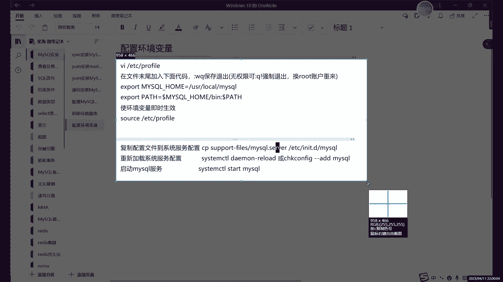
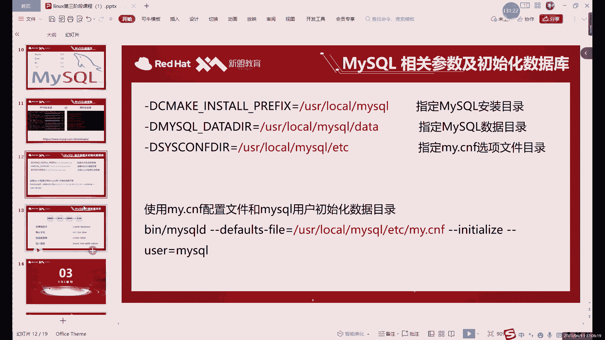

# 零基础入门Linux，红帽认证全套教程！Linux运维工程师的升职加薪宝典！RHCSA+RHCE+中级运维+云计算课程大合集！ - P64：中级运维-3.MySQL介绍及安装下 - 广厦千万- - BV1ns4y1r7A2

能够给我们显示啊，不至于乱码。然后呢啊下面这个就个存储引擎了啊存储引擎的话就是我们嗯买cyclgo的一个核心啊大脑。这个我们后面会进行介绍。大家就先知道我们目前啊目前5。

7里边啊就主要就是用这个indodB的数据库啊，或者不是就是这个存储引擎啊，印doDB的存储，也相当于是。如果说更换了这个成熟以擎的话，相当于什么呢？相当于给我买车后换了个系统。啊。

它其实就是类似于CPU系统嘛，这么一关就是这么一个位置。换了这个程入隐情况，它就相当于是把我们这个啊数据库的工作模式啊啊数据库的特性啊啊相当于更换了一。然后呢，user呢就是买circle。啊。

右侧就是mysrcle。买在过这里的话。就是我们刚才创建的那个啊，就是我们刚才创建的。😡，哪儿啊在这对吧？就我们创建这个数据，那就是。这个叫。刚才是不是哎。这耳机感觉右边的耳机是不是有点问题？

这样的话是不是声音就有点小。我可能是耳机坏了。还是换了一个耳机啊。这是不是有耳机有点问题。然后的话我们接下来看一下下边设置的话，很多啊，包括一些连接设置啊，内存设置呀。从中引擎的设置啊。

以及日志的配置啊。复制的选项啊，这些的话，我们后边用到的时候就具体再说啊。我们今天的话就暂时先看这么一个啊，就是基本的设置。啊，大家可以把这个直接复制到呢，复制到这个。复制到这个配置文件里边。

当然呢复制前呢强调一下啊，嗯my就是这个onenot可以直接复制PDF的话，它因为转化格式之后呢，它那个。他会强制换行。那比如说这里。嗯，我找一下。啊，就类似于这里。

因为你看我这里这个one out它有点问题，不是说有点问题，就是它这里太长了，拐下来了，对吧？这里其实我是一行。😊，哎，这里是一行。然后呢，你如果说你用PDF去复制的话。他会直接怎么呢？他会直接。

把这个作为开头，就是把中文作为开头了。这样的话配置文件会报错的。大家注意这一点啊，强调一下强调一下。因为之前。P代这是格式怎么说呢？转换格式的问题很大。然后呢，接下来的话我们就具体来配置这一部分内容。

对吧？包括什么呢？包括这个。创建目用创建用户啊，创建目录啊以及什么以及用这些配置文件的问题。

啊，我们这这个的话基本上就是什么呢？就是一些基本设置。啊，基本设置。首先呢先创建用户啊，group创建啊group AD创建一个mysql的。大家先分后创建一个组，然后呢再创建一个用户。

然后这里的话我们把这个。创建我们的这个mycyclQ用户的话，创建好之后呢，相当于是我们最后因为要这里要给一个数组和数组。所以说呢我们的用户和组这里都要创建，对吧？我们这里都要创建。然后呢。

我们切换到右侧角路线的myciql，也就是我们的安装路径下。啊，这是我们的安装路径。安装路径里面我们会创建什么呢？呃创建很多个这个。

目录就是我们刚才指定的那些数据目录啊，对吧？配置文件目录。啊，包括这些临时目录等等等等啊。user选下的my circlercle啊这条目录。包括什么呢？TMP临时文件的目录。ETC啊配置文件的目录。

那个。😡，日志文件的目录创建好这些之后呢，我们直接把权限呢。给到买这购用户和买这个组。这样的话我们相当于什么呢？就相当于可以用这个买这购用户啊，以及买这个主来管理我们的。买这个。啊。然后呢。

我们接下来最后一步呢就是编辑一下什么呢？编辑一下我们的配置文件啊。因为这里我们是刚创建的用户，所以说呢它里面配置文件也是空的啊，配置文件也是空的。配置文件这个东西呢，怎么说呢？大家直接复制就行啊。

当然呢。你像手打练练练练打字速度的话，我也不反对啊，意义不大啊，意义是真么不大。然后编辑这个文件呢呃打开它这个时候就是空的。因为我是我们是刚创建的嘛，刚创建的目录。但是系统里面它就默认有一个。

但是里面设置太少了，我们就不用了。系统里面默认那个是ETC驾的卖点3M目录。你进来之后呢，你直接插入复制就行。需要检查的是什么？就是这一部分啊，大家如果是弯道的格式复制进来，没什么问题啊。

大家可以看到我这里上下键。换行的话会跳过中间的中文字对吧？会跳过中间的汉字，为什么呢？因为它这里是相当于是一行，这两个是一行啊，这两个是一行。那如果你是PDF复制过来的话，它这里就会给你换行。

你就得把可么把这一行注释掉啊，或者删掉也行。😊，啊，你为了方便看的话，就好是复释掉吧。因为你后面如果说想你配置文件看一下这具体是哪个配置什么的，解释什么呢？就最好不要删掉，删掉的话你。啊，少很多信息啊。

包括这几行，对吧？你看这几行，你中文开头的你就。😊，啊，one not就不用检查了啊，PDF的话，你复制过来呢，把这些注释一下啊，把这些注释一下，上面其实没什么，主要是下面有一些这个注释写的比较长啊啊。

就写的比较长。

好，这里的话我们保存退出啊，就可以什么呢啊，保存退出就可以。啊，初始化开启了啊，初始化是什么意思呢？初始化其实就是。😡，我们刚才不是创建几个目录嘛，对吧？数据目录啊，ETC就是配置文件啊。

临时文件啊日志啊，这里面它其实都没有东西，对吧？这是我们刚刚创建的。那初始化的作用呢其实很简单，就是什么呢？就是通过通过我们刚才的配置文件给我们这些目录里面呢去导入数据。啊。

就把我们安装好的数据呢导入这一个目录里边，我们才能正常使用啊，我们就能正常用。所以说呢。初始化的命令呢就是。说始话大家注意啊。😡，目录啊一定一定得在这个目录下啊，如果说你想要用这个命令的话。

这是我们笔记里面这个命令。

笔记里这个命令的话，它是什么？他是用我这里用的是这个。

相对路径写的其实角度路径的话，准确的来说的话，这里应该是什么呢？前面需要加上user下的。local下边的。My circle。要这么写。啊，这样写。这个是完整的命令。

当然你如果我们现在已经在这个目录下的话，就可以直接从冰目录冰这个里开始写。然后后边呢我们写什么，写一下这个默认文件的位置。默认文件的位置的话就写的这种，写的就是我们要根据就初始化的命令呢。

是根据这个文件呢去给我们的进行目录里边啊去导数据的。然后呢，后边呢INIT呢就是初始化。然后呢，用户的话就是我们刚才设置的用户啊刚才设置的用户。啊，直接执行这个面就可以。这命例呢你正常。配置文件呃。

怎么说呢？就是跟配置文件其没什么关系啊，一般情况下不会报错啊，这个命你不会报错。但是呢初始化呢，你只能什么呢？😡，呃，只能用一次。想要再次初始化的话，你比如说你想要换一个目录什么的，想要再次初始化呢。

就要把之前几个目录里面的东西全删掉啊。自己目录里面东西要删掉，才能才重新数理化。这个是强调的一个点，好吧。然后初始化之后呢，其实就可以。啊，可以启动我们的是mysql啊可以启动mysql。但是呢。

启动买co狗这里有个什么问题呢？啊，启中的话你可以直接用这个买所有这里的冰木露啊，冰木放的就是命嘛，对吧？啊，冰木里放的就是命。那这个命令呢有个什么问题呢？就是。

对我这里就就就要说这个问题，加入这个资金contrl命令。啊，加入方法的话，这这其只是其中一种方法啊，这里这个只是其中一种。就是把我们这个治理这命令直接拷贝到ETCI的II里边啊，就就相当于是加入了啊。

很方便。原码安装的一些命令啊，或者说是。哎，就是只要不是通过RPM或者说亚么安装的。都是不能直接用这个。system control命进行管理的啊，只要管理的话，就必须得什么呢？必须把这个加进去。

一般情况下，很多服务里面都自带一些文件。我们这个文件是在哪呢？是在user下，我看user下的。logo下边。嗯。还以启动也可以加啊可以启动也可以加。😊，嗯，这里的话主要是我们先把它加入到哪儿。

先加入到这个系统。

啊，现在调入系统服务里边。

啊，添加到系统部。也就是CT不好做。啊。那，上面这个是什么？下面这个是环境变量啊，也可以加入到环境变量。环境变量的话，这个其实就是声明一下我们这个。这个拉到最底下。啊，证明一下我们这个EXport。

myscle的一个安装路径啊，以及myscle命令的一个路径。啊，相当于就在系统里面声明一下。啊，user下的logo下边的。我们的my circlecle。以及什么呢？上面那个是安装路径。

下面这个是命令路径。啊，下面一个命人入径。my circle杠 home。B目录下的。啊，这里的话就可以写写全一点的话，就是写。这里可以不用变量，当是呢如果说你省列的话，就可以写上变量，可以写成变量。

啊，这个就是声明一下什么呢？这里就是声明一下我们这个买搜的一个。

主路径以及我们命令路径。啊，就是告诉相当于说这步就是告诉系统，我们的买到后在哪儿？😡，哎，告诉我买这个在哪。然后呢啊重新加载这两个都是都怎么说呢？嗯，这个是重新加载，哎，这个是添加进去。

两个的作用是一样的啊。重新加载的话，这里相当于就什么呢？重新加载这里的话就可以怎么，就相当于是。嗯，让它自动识别一下，这相当于我们手动让它添加。哎，手动添加。环境变量的话，你加上环境变量之后呢。

我说哪有我打错了，打了个加exit，我重新连一下。

打错命令呢。

我给打断了。对吧嗯这里的话还没有启动啊。加环境电量的话，我们就可以怎。它其实类似于加强那面相类似于这个。软链接。啊。因为有很多你看其实安装好一个命，安装一个软件之后呢，你如果说不做软件啊。

或者说不做环境变量的话，你不能直接的执行这些命令。哎，你比如说买色个命令，我们如果不加的话，它能直接执行过它不能，因为他找不到买色命令在哪。啊，第二环境变量其实作用的话。

其实就是让我们能找到这个买伏命令具体的位置。啊，这里加环境变量的作用。然后下边这一步的话就是我们把这个。啊，我们切换一项目啊user下logo下的my circler。

我们把这个sport file里边的这个mys点serv这个文件是干什么的？这个文件就是一个启动文件啊，启动一个脚本。我们拷贝到ETCR的NIT点D里边啊，就相当于是加入到我们的系统服务里边了。

这个这里可以改名字啊，你想就想叫他买sD也行，对吧？我不想让他叫买sD，我就想叫myciqcle。😡，啊，然后这里的话我们重新加载一下啊，重新加载配置。啊，或者说是你添加也行，这两个命令选一个就可以。

选一个就可以，然后你可以用CC team control你。买十个。啊，我们就会开启启动啊，或者restar start都行啊，都可以。没有报错的话银常。如果报错的话。😡，错在哪呢？啊，只错在一个地方。

就是配置文件。如果你是PDM复制的话，这里这部分确实容易报错。这个也这个只能怪什么，只能怪PDM。😡，只能怪PF怪PF的识别的它不太智能。会把这个啊两行其实是一行内容，它会它会当做两行来处理啊。

就会导致这个什么呢？因会导致这个问题。啊，就会导致这个问题。还可以什么呢？就是怎么说呢？其实你报错一次，你就知道了。你如果不报错的话，你其实有可能不知道我说的具体是什么。😡，就是重启开启这一步。

如果报错的话。配置文件啊配置文件。回去改配置那就行。你配置文件我们加的东西其实有点多啊，加的多的话，它出现换行的问题，换行确实容易出现问题。然后这里的话。我们这个。这就已相当于已经启动了啊已经启动了啊。

黑字体也可以黑字也可以。嗯。对吧这抗这个这扛这个加上来个R啊，A一字体。啊，这个的话嗯启动之后我们看一下状态吧。

主要状态正常啊，我们就可以进入了。但是呢这里有一个问题啊。源码安装和刚才我们的样码安装呢，它路径不一样。不仅仅是我们的安装路径。啊，包括一些这些日志路径啊，其实全不一样全部都不一样。因为什么？

因为我们的源网上都是自定义的。😡，你想在哪都可以，你哪怕你改一个，比如说你想要在安装在入程路下行不行呢？没问题。😡，可以。😊，啊，音乐是自定义的，就是说安装在目录通知下就行。啊，嗯。

他一般不建议安装在入程目录。

啊，正常我们装在这个user目录里面啊，或者说ETC目录下。对吧这些目录呢是比较啊常见的一些。软件安装的位置。然后接下来呢查看修改密码的话，这个我们需要给大家强调一下啊，强调一下。

啊，强调一下嗯。刚才我们数据库已经装好了，但是使用使用数据库之前呢，我们需要做什么呢？我们需要把这个密码弄出来，对吧？RPM的y的都一样啊，那它俩是一样的，因为都是PM包，所以说都是VR下的log下的。

买4个点log固定。啊，绝对固定。圆盘中就不一定，这个是根据什么呢？这是根据我们自定义的路径去看的对吧？像我刚才自定义的路径是这个啊，如果说大家想改是可以改的。啊，是可以改。

就是user加的路线的my circlecle logs叫er log。嗯，后边这个是固定的。后面这部分啊，它是log目录里面，log目录里面的alt就是固定，前面的话都是自定义的。前面可以任意啊。

当然这个其实也不能说完全固定吧，它也可以在配置文件里改啊，它也可以在配置文件里改。所以说呢总体上来说呢，就是原码安装呢。嗯，哪儿都是自定义的。就是从头到尾觉得很自由。啊，可以自动自己去设定。然后呢。

买克刚有入的刚拼命嘛，这个刚这刚才已经用过了。这个pa多这里呢，它是个函数啊它是个函数。不是说一定要用它，就尽量是用啊尽量用这个password。

好，我们现在来看一下密码吧，看一下这个原码安装的密码，它的位置呢就是在user下logo下的，我打全一点吧。user加logo下的my circle里边的logs目录里的er log。

好。然后呢，这里的这个倒不用过滤，为它里面没什么信息啊，因为还没有启啊，刚刚启动还没有其他的一些信息。所以说呢它也不用过滤啊，不用过滤。啊，这个就是我密码，你看它不一样。啊，你每次它就是完全随机的。

大家的密码都不一样啊。😊，买头杠Uroot杠P这么进就行了。啊，因为这里打不打空格呢，你随意都行随以。

啊，进来之后呢，第件事也是什么呢？也是改密码。啊。莫尔这里呢还是that pass的，我们还是用加密函数啊，为了什么呢？主要还是为了安全性考虑。对吧安全性考虑，所以用加减函数。啊。他没报错。啊。

他没报错。为什么没报错呢？因为原版安装它默认没有什么没有这个子达度要求。这也是这是一个区别点啊，原码安装呢。我没有那个要求啊，没有设置那个要求的话，这里的话我们就可以设置密码为一。哎。

不是每次都进来要修M密码。上次不是样板安装吗？这个我们现在是原码安装的。原版安装的就是安装的第一次需要修改密R，以后就不要不用了，对吧？你比如说这次A的退出之后呢。你再进去。对吧就不用改密码。

就可以直接执行命令。啊，就可以直接直接命令啊，编译安装的时候，最后再强调一点就是make啊make命令啊。那个杠Z呢你不能随便写呀，就是你虚拟地有几个，你写几个，你虚拟地呢你有你有神儿，你有事的。😡。

啊，你12个。有12个CPU也可以设置，但是你12CPU的话，内存的话你大你它大一点。怎么也得五六个G啊，七八个G的内存怎么的。啊，最近2G内存，你这不开玩笑吗？12GC12个CPU对意2G内存。

你觉得这这对等吗？对吧你CPU运行起来，你内存根本空间都不够，对吧？所以你1212个CPU2G内存。太夸张了，就这头重脚轻那就属于是。普通聊。嗯，大家为了防止报错make mini比说绝对不会报错的。

因为它只用1个CPU速度是慢一点，但是呢它占用的东西占用的空间或者占用的内存不是很多，它就不会报错。你如果是m杠值特别高的情况下呢，那就属于是内存直接bos了，内存boss。啊，报错是内存的报错。啊。

这个CPU内存我说的是虚拟机啊，不是说物理机啊，虚拟机的。现在的话我们就已经进入到我买ciqcle里边了，对吧？啊，今天第一天我们也不会讲太多命令的，对吧？我让大家记住命令。首先第一个mycicle。

杠U root这个记住了，对吧？第二个，我们的。改密码的命令这个也要记住set password。啊，这又是个命令。接下来我再讲几个简单命令啊再讲几个简单命令，我们的一个啊基本的操作的命令。

990m杠G如果说你999的话。哪来那么多CPU跟线上。Okay。这么多线啊，对，有一个问题就是啊买这个命行里面是没有股权的。啊，买这个命然后里面没有股权。正好练命呢呗，对吧？

大家不能说一直依赖这个股权。啊，这个买scle这个命令行里面，它是不支持股权的啊，当然如果你用一些其他远程软件的话，应该是有的啊。所是有程软件有补权。买这个本地他没有补权利。对吧你练习阶段你要什么股权。

对吧？你就。老老实实打呗啊，你多打才能记住啊，就是前期你不要用那些补全的东西。然后的话我们接下来看一下什么呢？来看一下这个基础的一些命令。我们不是说太不说太多。首先呢第一个。进入数据库对吧？

我们以前已经进来了，进来之后呢。我们可以看一下数据库当中的一些信息。啊，看一下数据库当中的一些信息。包括什么信息呢？😡，我们有一些这个。my circlercle对吧？mycirl数据库的。点击查看。

我们这里。用的是什么？第一个命令的话是受啊受命令。展示查看的意思。他能看什么呢？DY就看一些我们的数据库当中信息，包括我们这里边数据库里边有哪几个库，对吧？有哪几个表。首先第一个数据库这几个单词。

这这些命密的话，提一前记得记住啊，一不是很难，对吧？这叫b有数据库的意思啊，是这条b呢就是查看数据库的意思。嗯嗯。大看路こ。这个什么意思？就是查看我们当前系统里面哎有哪些数据库。啊，这个财料数据库。

然后呢，是还能看什么呢？还能看表格。啊，说tables。啊，这个命令是看表格的。当然了，表格的话，我刚才说了，对吧？我们最开始说这个。

存储的数存储数据的流程。这里我们也说过。首先我们创建好数据库之后呢，我们是要说是要先说什么？先什么先创建数据表，对吧？创建数据表是在哪？是在某一个数据库当中的。也就是我们这里其实。如果说你要查看表的话。

我们一定要在哪呢？一定要在某个数据库当中。啊，就是在某术过程当中，就比如说我们这里是有几个呢？对吧有这么几个四个吧，对吧？四个数据库。这几个数据库呢。啊，是默认的，有系统你装好之后呢，就自带的。

然后比如说如果说你要想看表格的话，直接设t行不行呢？嗯他会报错，他会报一个什么错，他会报n这边 base，哎，就是没有数据库可以去查询。😡，然后再强调一点，就刚才没有说，一直没有说，就是封号的问题啊。

就是数据库里边呢。所有的命令就加上工号执行就行啊。所有命令加上工号执行。然后的话这里呢。比如说我们现在随便切换一个啊，我们切换一个叫这叫my circlecle吧，是吧？这个名字。

怎么说呢这个数据库一看就不一般，对吧？它能和我们的这个软件的名字一样，那说明这个数据库呢很牛逼，对吧？很牛逼，它数据库有啥用呢？我们先切换过来啊，use myfi。

然后这里报了一个什么daabb change呢，就是数据库改变了。现在我们就已经切换数据库成功了。然后这个时候呢，我们用什么呢？用show tables就可以看。😊，就table怎么可以看的话。

就是哎这些密表格很多啊表格很多啊，里边最重要的是我们经常改的是哪个，经常改的是user啊，user什么意思？用户。😊，啊，也是mysq数据库里面，它存放的主要就是mysl的用户密码权限的一些信息。哎。

就是在我们的myscle库里边。啊，当然还包括一些这个。服务器的就是我们这个买s的一些配置信息，也是在这个库里边啊也是在这个库里边。然后呢，这个就是show tables和show database。

这两个就是查看的命令。然后show命令你直接能看到很多啊，剩下的话其实我们后边具体讲某某某一些功能的时候，我们还会用到s命令啊。总之大家记住show命令呢，它就是查看的功能。查看啊查看信息。

表信息啊、固子信息啊，包括后边我们涉及到非常多的一些功能的话，可以查看这些功能类信息。啊，这个就是受命人的作用。然后刚才其实我执行了一个什么命令，刚才我执行us命令，对吧？切换数据库的啊。

刚才没有没有什么没怎么说啊，us命令就是切换数据库的命令。因为我们这里边就是每个就是mysq里面它有很多个库嘛，默认就有4个，你后边再做练习的时候，我们是需要什么？我们需要创建第五个数据库。

为什么要再创建一个呢？啊，系统的默认设库的话，不要随意改动啊，因为里边存放都是我们的一些系统的啊数据库里面一些用户啊，用户密码权限啊，就是关于我们买sql的一些设置啊，基本设置。

所以说呢系统里边的这个库的，不要随便更改？😊，啊，不要随意更改。user库里边就是user表里边的话，这个里边。怎么说呢？寿命令他不能看。啊，你想干寿命令他不能看的。啊，说明他其实不能看。啊。

他也不能看，那怎么办呢？😊，这里的话如果说你想看某个表格里边的话，寿命令它只能是看一些信息的。看数据的话是寿命令它不能看说命它不能看数据。那看数据怎么办呢？select不知道大家应该听说过这个命名。

对吧？增山改查就是我们数据库的基本操作。增山改查里面的查。在啊这个我们后边会具体有一整节课，有一晚上我们都会讲这个秘密啊，不用着急啊啊，我们就先可以看一下这个表格。Slack。加上这个user表啊。

大家注意也一定要加上工号，你不加上工号的话，它就相当于什么？比如说我这里不加工号，你执行。😡，他他也不是说他不到货，他就是不执行。然后你在下边再加上这个封号就行。😡，啊，大家这个空号就可以啊。

这个命令就是查询某个表格的信息啊，就查询表格某个表格的上中的数据。这个我们后边会具体讲啊，大家先知道就行了。slaag命就是查询的表格表格当中的数据啊，它和兽不一样，兽我们是查看的，我们查看一些。啊。

基本的数据那就是啊基本的信息库啊表呀之类的。这个我们看的什么？这个我们看的是这个。user表格当中的数据啊，它很乱啊很乱。怎么说呢？为什么这么乱呢？其实也不是不是怪数据的问题啊，是怪我这个屏幕太小。😡。

啊，这个是函是外屏幕太小，或者字体稍微有点大，因为它这个列非常多，所以说会报这样的错啊，不是他没报错。😊，怎么时候报错了，他就是怎么？他就是列太多了，他一一个屏幕显示不出来，就是堆积在一起。

看起来不是很好看。所以一般情况下呢，我们都会是都会使。就如果说碰到一些比较宽的表格，我们怎么去查看呢？你就杠。是。大这的话就是什么意思？它是我们不正常不是一行一行的显示吗？对吧我们这里的话就可以。

只有把某一行内容呢单独拿出来。哎这样就整齐一点了，对吧？稍微整齐一点。这里的话就是这个user表格里面存放的就是用户的。密码啊、权限啊这些东西。哪个是密码呢？这个就是密码，为什么这么长呢？

就是因为我们用什么呢？用paword的加密了。如果你没有加密的话，这里它就是会把你密码直接写在这里。😡，啊，如果说没有加运同学的话，完才我看到有有应该有几个同学执行的时候没有加pasword的函数。

对吧？那就会直接把密码写在这里。这样的话怎么说呢？多少不太安全。但是其实你练习到无所谓了啊，这密码。啊，以及一些权限信息，这些就是权限。我们后面会具体会说啊，都是一些命令啊都是些命令。

我们今天第一课不会讲太多，我们就先大家先了解一下这个。先学几个基础命令，好吧。命令说完了对吧？右命令切换数据库说完了，接下来我们就创建一下吧。因为我们后边呢后期呃学习命令的话，我们刚才也说了。

要需要在哪呢？需要在单独的就是在其他的数据库里面去做。

所以说这里就我们就开始什么呢？正式的去开始学一些circle语言了啊circle语言。首先呢第一种我们先主要看什么create创建。因为我们现在什么都没有，就因为现在是相当于是除了数据库。

除了系统的默认数据库以外呢，我们现在其实一无所有。对吧从来没有。那怎么办呢？就只能是我们自己去创建，用什么用create命令。对吧创建的英文单词嘛。创建库就用dtab。

就可以。哎，就比如说呢大家可以现在啊现在现在我们不是有售DATABSES嘛？4个库啊，我们今天先创建自己属于自己的数据库啊，用自己名字创建嘛啊可以用自己名字创建create databaseb。😊，啊。

就是创建数据库，后边加上名字啊，这个命令用法很简单，就是quereate在位置前面固定，后边加名字就行。当然名字不能重复不能重复。啊，你可以想上自己的名字，对吧？啊，我们创建一下属于自己的数据库。

后面加上工号。嗯，买色购里边执行命令的话，怎么说呢？有返回结果就是正常的，对吧？有一些命令的话，它不会返回一些。具体结果就比如说你创建数据库呢，它没有什么结果，他只是告诉你什么，你创建成功了。😡，啊。

OK的就创建成功了啊，看到这里也没有啊，这个是什么东西？这个就是我们的时间。😊，啊，我们执行一命呢其实非常快。啊非常坏。这里的话0。00秒0。01秒都不到，也就相当于是110不到10毫秒的时间吧。

就可以执行命令，对吧？你看这里我们直接查询的命令。对吧查询了这么多信息，它还是不到0。01秒啊，也就是我们这个买C的速度，怎么说呢？虽然说我们现在数据量不是很大。

但是现在其实我们已经有了很多系系统默认的库了啊，系统默认数据其实已经有不少了。看这个速度对吧？这不比这个。我们直接用磁盘存数据来的快，对吧？这个其实怎么说呢？这个就是数据库的一个优势啊。

我们最开始上课的时候说到。数据库连接的软件其实有很多。啊，数据库连接软件有很多。其实每一款数据库其实都可以用什的？基本上你市面上啊就比较。字面上用的比较多的，就正式。这个怎么说呢？但是。也不能说上架吧。

这个应该叫。啊，市面上用的比较多的数据库呢，其实都可以用远远程软件直接连的啊，都可以连连上之后呢啊都能操作啊都可以操作。但是我们这里主要讲什么？我们主要讲这些啊买 so的一些基础命令。

你如果说用那些哎图形化界面代替的话，那其实怎么说呢？它里边就相当于会省略很多命啊，省略很多命。就很多操作的它就不是什么，就不是命令来操作。那，不是另外操作。学完这些基础命令之后呢。

直接如果是直接去用这些软件，其实非常简。啊，就非常简单，因为这个比较命令熟悉的话，用一些软件其实就非常轻松啊非常轻松。啊，这常管理数据库的话，其实。一般情况下就是我们装好这个myscle之后啊。

装好买secle之后的，你可以直直接在那。嗯，最好是你管理的话，可以是为了效率更高的话，肯定还是用一个远程远程的软件更好一些啊，远程软件更好一些它能简化一部分命啊，简化一部分操作啊，简化一部分操作。

那效率稍微高一些啊效率高一些。然后这里的话，我们接下来具体来看一下，我们现在已经创建好了，对吧？创建好了查看我们就可以用什么，直接用s database来查看。对吧我们这里又多了一个什么，多了一个库。

哪多里库就是我们属于自己的库。我们接下来呢哎就可以在这个库里面进行操作。啊，在这个库里进行操作。然后的话我们接下来哎执行了这个设 database base之后，我们接下来看一下那这个是创建什么？

这个是创建库。创建好库之后呢，我们就可以在库里边去具体创建一些表格。比如说我们这里use切换一下数据库啊，我们直接写上我们这个数据库的名字啊，就可以切换。切换完成之后呢，我们就可以直接什么呢再创建。

啊。这次创建的话，我们这次创建什么创建表格？拿上你表格。然创建表格的话，这里其实我们只是今天先简单创建一个小的表格吧，因为。表格的话，想要创建呢，它并不是说像库一样，随随便便就一条命就完事了啊。

创建库其实很简单，就是create data加上什么，加上表格，啊，不是加上库的名字。而什么呢？而数据创建表这里你大家可以看到，我在创建表这里前面又加了一个加了一个选项，什么叫确认字段。嗯。

确认为什么这个是确认字段的啊，或者字段是什么意思？字段就是我们刚才。😡，excel里面那个表头。对吧表头就叫字段啊，我们在买数据库里边，我们叫什么？我们叫字段。那确认字段呢其实就是点就是。

说白了就是什么？就是。确定一下啊，你这数据库里边有哪些什么呢？有哪些列？有哪几例？就边你这个表格是干什么用的？你比如说你存放一些基本信息的话啊，员工基本信息你可以创建一些，比如说ID。

对吧姓名啊、性别、年龄。对吧等等的呢。这些呢其实都是要怎么多调字段。而在创建表格之前呢，我们需要怎么创建一下这个不是说创建字段嘛，创建表格之前呢，需要先想好像想要要什么字段。

名字就比如说我们create table。啊，create table这里的话，我们可以创建一个。对还是用自己名字啊还是用自己名字craittable啊，星海对吧？就是创建一个叫星海的表格。😊。

那这样直接创建行不行呢？对吧？你看格式和创建数据库一样。阶基金可以吗？他不行。还有什么报错呢？😡，数据库的话，它其实可以是一个空壳子。啊，他可以是个空壳子，但表格不行啊，但表格不行，在这个。

我们的数据库里边呢。我刚才也其实前面也提到了，我们要有什么要有规则，或者说什么，或者说要有限制。😡，什么意思？如果说你只是创建了一个表格进去的话，你后边再插入数据，那相当于什么没有什么没有任何限制。

对吧？你如果是空表格的话，你就是想插入想插入什么都可以插入，这就相当于是违背了我们这个关键数据库的一个特点。啊。所以说怎么解决这个问题呢？就是。😡，他这里就是不让你插入呃，不让你创建一空表格啊。

想要创建表格呢至少有一列。至少有一列。嗯。那这一列的话必须得是什么呢？就是create。tableable加上什么？加上这个表格的名称，然后括号里边具体写什么呢？啊，写这个列的名字。

就比如说哎我们其实上面这个就可以看出一个简单的表格。当然它其实并不是表格，它只是显示出来这么一个信息而已啊。这个它只是显示出来这么一部分信息，它不算表格，好吧，它不算表格。

在这个我们可以参考它的一个结构，对吧？这个是相当于什么这个相当于表头。他就可以近似的看他怎么看他字段。哎，他是可以近似看察字段的。然后呢，我们如果要想要创建一个表格的话，那我们至少得有这么一个结构。

对吧？有表头，然后呢有一个限制条件。啊，有个限制条件。这里的话我们可以直接creit table后边加上什么，加上比如说。我们就随便写一个剪一个简单的ID对吧？工号啊、学号啊，另外这个ID号。然后呢。

后边呢我们需要限制一个条件啊，这个条件的话我们下一课会具体去讲啊，这节课的话大家先了解一下。啊，整数。啊，这个叫这个东西它叫准度。啊，INT。什么意思呢？就是我们限制这个这一列呢，只能填整数。啊。

这个就是一个规则。啊，这就是所谓的我们刚才说到的。关系数据库当中的一些规则，这就是一个最简单的规则，就是只能限制这一列呢只能写整数。啊，那这样可以了吗？这样其实就可以了。

就是这这里的话我们就创建了一个最小的表格。啊，非常小的流就只有一列。啊，你一定能不能算表格呢，他也能算能算表格啊。我们再创建就行了啊，这里包OK了。啊，刷业表格呢稍微花了一点时间，用了0。01秒啊。

这个稍微花了一点时间。哎，创建好之后呢，我们来看一下。刚才我们是用sla，我看一下。啊，没有用slaag啊，我用过一次，对吧slaag的来查看。啊，打开新化就代表所有内容啊。

from后边呢加上表格的名称。啊，这就是查看这个表格里面的一个详细信息。当然现在的话，你查看的话其实没什么用，为什么呢？因为我们表格里面没有什么数据啊，它只是空的啊empty空的表格。co表格上。

那我们刚才创建的东西在哪呢？啊，我们得用其他的命令，就比如说DESC。这个命令呢是可以用来查看什么查看我们表格的结构的。啊，就比如我们DIC后面加上表格名称。啊，就可以看到什么呢？看到我们这表格的结构。

我们只有一列这列呢叫ID啊，限制条件的话就是刚才的整数啊，整数11倍整数啊，默认是11位整数。😊，然后后边这些的话都是一些这个限制条件。啊，我们下一课会具体去讲。啊，限制条件。这大家可以先先看一啊。

先看一，这这里就不说了啊，说了大家可能又。嗯，不太明白啊不太明白。啊，这就是一列啊这是一列。那创建好这个表格之后呢，我能不能给它里面插点数据呢？啊，我们今天就讲这么几个命令啊。

我们讲最后一个啊插入数据insert。

啊，还有是银事的。iner插入的意思命命令完整的是insert into two啊，就是往里边插入，往哪插入呢？目标是谁呢？目标是我们的表格。😡，啊，就直接去向表格当中插入信息，这也准确的说是插入数据。

me格式就是insert into加上表格名称，再加上values，value这个就是值的意思，或者说叫数据的意思。

啊，我们正常插入，就是在马克度里面插入数据，就是insert。Me too。values加什么呢？加上值。啊，当是中间的话还有表格名称，比如说啊们写一下他们的表格。值子里边我们加什么，就括号里面写什么。

就写我们想要插入的东西。ID码啊我们只能写什么？我们这里有限制，只能是整数啊，IT度整数的限制，所以我们这里只能写数字。而且只能写整书。比如说我们插入一。哎，这里就OK了。查入之后呢，我们能不能查看呢？

现在就可以了。有数据了，对吧？我们这个表格就有数据了。啊，这个就是最简单的这个。我们今天说到的几个创建，对吧？创建表格。create啊插入数据呢，用什么？用insert into。啊。

加values这这三个你可以一起就是就需要一起记。因为这三个是固定的用法，insert into values。中间加上表格的名称，后边加数据。资料给的查询呢就是用来查看我们表格当中的数理的啊。

这里你可以多插几个啊，这里的话它是相当于它是往下排的，因为它是一列啊，它是一列，它不可能是它不可能横着走，它是往下走啊，往下走。比会我们再查一个。啊，他了三次对吧？他就有3个一。

let sing from对吧？它有3个一。啊，这个的话就是什么？这个就是。插入命令。I40透。DNC的话就是什么？就是这个。来看我们表格的一个结构。哎，说白了就是查看什么查看一下这个表头啊。

它有什么限制。啊，就是查看表格的表头的限制啊，就是ID这里。ID我们有什么限制，其实后面都还没有，就是后面是默认的。我们前面就加了这么1个INT，哎，就是整数的意思啊，整数的一个限制。

如果说后边哎我们这后边这些限制啊规则啊。啊，准确或者说叫约束什么的这些的话我们下节课就会具体去讲啊。我们关于数据库里面的这些规则呢，其实还是很多的啊，还有很多规则的。这些规则的目的是什么呢？其实就是。

啊，让我们在创建这些数据库的时候呢，不是说啊随意的去创建啊，就是插入数据的时候，不要那么随意啊。如果你随便插数据的话，你这个比如说你这一列里边有小数，有整数，对吧？你查询起来，它就其实就很麻烦。啊。

查询会降低我们的查询效率。为什么说数据库呢？啊它这个管理数据啊，查询数据能力就比较好，比较快呢？就是因为啊和什么有关系呢？就和我们一些。规则限制有关。啊，你现制这些规则，那这一列呢它就只有一类型的东西。

哎，只有一类的东西查起来就非常方便。啊，方便。然后这些的话就是几个命令。大家今天天命令不多，大家这今天主要目的是先把这个满收装好啊，用原网用原版装吧。因为你用RPM用样子装的话，有很多设置呢。

而且后面还能改很多设计，很麻烦啊，不如一次性用原版装好就行。

然后这里的话这几个命令的话，大家其实啊把这个命令都记都记一下，再去练一下啊。我去练一练。然后下一个开始的话，我们就具体讲什么？具体讲我们的circle语句啊，circle语句。嗯，讲几种不同的社会语句。

以及什么呢？以及一些。规则啊规则。或者说叫数据类型啊等等等。这个是我们下节课的内容啊，下节课内容。对，这最开始的话，其实你学术以后你先学命啊，你不要管什么学习软程软件没什么用。啊，你学会命令。

你用什么软件其实都一样。啊，你不会灭的情况下呢，你用软件，其实你点哪个什么功能，其实都不一定不一定弄弄明白啊。就是只要你把这个命令学好了，就是那些软件其实就随便搞啊，那些就随便搞。没。今天的话。

大家下去把这个买错装一下啊，安装一下，有种报错可以直接发出来了。其实报错的话，上次课上我微已经集解释了很多啊，已经解释了几个报错。嗯，基本上呢报错呢。主要就是其实主要就是两部分吧。

一是命令呢复制的有问题。二呢其实就是啊一些样子仓库如果没做好的话，也是会出问题的。因为我们这里用了很多样板安装啊，虽然说我们用原原版安装的这个买思路，但是其实中间呢还是用了几步样子的对吧？

样板安装的依赖关系啊，这些问题。好，我们今天的话内容就这么多啊，大家。再去把这些啊把数据库装一下啊，我们最后再。刷播一我们就今天就到这里啊，刷播一我今天就到这里啊，最后放首歌，我们今天就。

今天就结束了啊，今天结束。关系数据库对关系据库呢就是最流行的数据库呀。啊，流不流行呢？其实很简单，你就看一下官方里给的一些排名就行。对吧？我刚才最开始这里。对吧这个排名呢就是官方啊，不能说官方排名吧。

这个就是数据库领域的一个权威的排名。对吧你看前十名呢有8个啊或者7个，前十0名有7个关全优一库。剩下的三种啊。剩下的两个是非关型的，一个呢是我们后边也会讲到的ELK一个数据库。从这一目了然，对吧？

基本上怎么说呢？关键数据库还是占统治地位的，就是在数据库里非关键型。当然也有用啊，但是就是用的使用量呢远远是远远低于这个。悲观还是远是己一惯系性为。好吧，那我们今天的话就到这里啊，最后放首歌。

我们今天就下课了啊，开课了。大家后面有什么问题都可以直接私聊，或者说群里面问都行啊，都可以。

