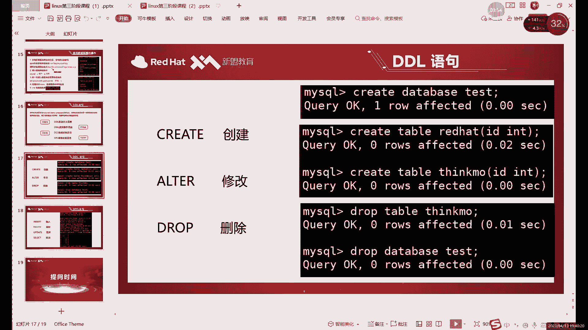

# 零基础入门Linux，红帽认证全套教程！Linux运维工程师的升职加薪宝典！RHCSA+RHCE+中级运维+云计算课程大合集！ - P65：中级运维-4.SQL语句，数据类型，约束 - 广厦千万- - BV1ns4y1r7A2

好，我们这节课呢继续讲my circle啊，讲mys的内容。

那首先。上节课我们最后讲到哪？最后讲到这个。进到数据库当中修改密码的问题，对吧？啊，群群里小月是吧？修改密码的话，这个你看你是用的是哪种方式安装的啊，你用PM安装的话，你在这个文件里去找密码啊。

原码安装，你去这个文件里去找啊，文件是不一样的。啊嗯。然后呢，你进入之前呢，你首先先启动，启动之后才能进入啊。如果说。啊，连接报什么，比如说报一些这个。连接不到啊啊，涉及到那个买s点s文件啊。

这种一般就是没启动。啊，或者说什么，或者说还有可能是什么，就是MDB杠les那个文件没有删除啊，这个其实是一个很容易犯的错，就是那个merDB啊merDB如果说不完全卸载的话。是否影响到买特的启动的啊。

会影响到买特的启动啊，连接啊这些。所以一定要注意啊，一定要先把梅尔DB卸掉。哎，卸掉之后呢，我们再。去安再去安装这个mys，或者再去启动mys好吧，那现在的话我们。目前啊就是数据库的话，已经装好了。

对吧？我们先进到数据库里面。啊，我们这一课主要就是讲什么，主要就是讲。我们买se购里面的那一些简单命令啊，以及它的一些数据类型的约束这些。首先我先看一下，目前的话，原来是恢复了一快到啊。

数据库还没有创建啊，这个不用着急啊不着急。首先我们先回到这里啊，我们先来看一下我们circle语句的主要类型。

一般就是分为4种。这种的话，它的功能啊，或者说它管理的方式。啊，都是有点区别的。就比如说第一个。哎，简单的说呢。他其实就是管理四种不同的东西，有什么有表格，有数据、权限和事物这四种啊管理这四个方面呢。

其实就用了四种不同的思irQ语句。😡，那第一种其实我们前面已经稍微讲了一点啊，就是管理表格的。或者说除了表格以外呢，还有什么？还有其实还有数据库。哎，主要的话更多的是用在管理表格上。因为数据库的话。

你最多也也就也就创建几个吧，对吧？你一个马sgo里面也就最多也就创建几个数据库。😡，主要的数据存放呢还是在哪呢？还是在。在我们这个表格里，对吧？所以说一般情况下呢，第一种一般是叫它管理表格啊。

其实说数据库表格其实它相当于是一起管的啊，用一种类型的命令是。同时管两个东西嘛。当然呢，对于数据库操作，其实我们是非常少的。😡，一般只有什么，只有创建和删除，没有其他的。啊。

一般我们很少修改数据库的名字啊，数据库名字就是不能随便改的。一般情况下呢，我们的第一种啊，我们就先来说第一种吧啊管理表格的。😡。

管理表格的话，其实就是什么创建修改删除。😡，对吧就是就三个命密。第一种类型的折扣语句，它就三个命密。😡，啊，或者说三种用法。可以管理表格，也可以管理库国库。我刚才说了，很少动啊，我们一般很少动。

你创建好之后呢，我们剩余的操作呢其实都是在哪，都是在我们这个数据库当中的对表格的操作。我们很少说对数据库直接进行呃，来回一直改数据库，这这不会啊，不会这这样做。啊，对数据库来说。

一般就是创建和删除这两个。然后表格上的话，其实是aler命用的比较多，就修改上。啊，第三个英文单词的就是翻译过来就是这三个意思。然后呢，我们来看一下。啊，首先啊我这里是恢复了一个比较纯净的拍照啊。

就是连数据库还没有创建啊，数据库还没有创建。所以说我们就先来创建一下啊，create命令呢就是第一种啊DDL的ciirrcle语句里面的第一种。😊。

系。

叫什么呢？我们的名字叫。数据定义语言，也就是定义。什么呢？就其实准确来说，其实定义什么呢？定义我们存放数据的一个。表格。哎，就是我们的数据呢如何存放。由我们这个DDL语言说了算。

其实主要就是什么呢？主要就是create和aler命令。你创建一个什么样的表格，或者说修改了什么样的字段。😡，修改之后呢，我们里边的数据就能必须要按照我的规则来存放。😡，如果违反规则呢，那插入的话。

我们一般会审，一般会一般会报错啊，就是你插入失败了。😡，哎，如果说你不不符合我们这个表格的规则啊，最后你就会插入失败。啊，这个就是属于定义原的理，当是删除这个。啊，删除这个怎么说呢？啊，删了之就没了啊。

删了就没了。所以说。😊，我们对于数据定义就是创建和修改啊这两个。

删除的话，大家知道知道就行了。创建的话啊DATABSE对吧？首先我们先创建一个我们自己啊自己的数据库。系统里面呢我们一般不随意做修改，一般我们最多改一改，也就是改这个库。改这个库里边的用户表啊。

因为用户表的话，如果我们创建用户啊，或者修改密码啊，修改权限这些的话，还是会用到这这个库的。其他账目库呢我们不会主动去修改啊，我们不主动去修改。创建好这个数据库之后呢，我们切换进去啊。

你得先进到这个数据库里边。因为我们现在呢其实是是什么？其实现在我们相当于处于哎就比如说你这个mysqcle啊，我们用myscle命令呢进入到了我们这个my circleqcle整个库房里边啊。

你可以看成一个仓库。仓库里面有很多个哎分开的几个小的库房。😊，如果说想在里边去具体创建创建数据，啊，插入数据，你必须得具体的进入到每一个库房里边，对吧？你不能说站在站在什么，站在我们这个库房的大门口。

对吧？你看着这几个数据库。你想插入数据，你如果说不指定某一个数据库的话啊，它是它就会报错啊，很简单，它就会报错，所以说呢啊我们必须要什么？必须要先切换到某一个库里边，比如说我们进我们自己的库里。😡。

进去之后呢，我们就可以对里面进行操作了。依然我们还是先用creit命令，先创建一个什么呢？创建一个表格。对吧啊create这里我们就是创建表格的创建表格的一个作用。创建表格的话，cra table啊。

固定用法。然后后边加上表格的名称。然后这里需要注意的是什么？我们上节课其实也创建了一个非常简单的表格，对吧？啊，就是用了1个ID啊，用的ID创建一个非常简单的表格。那如果说想要创建多列的情况下呢。😊。

怎么办呢？啊？你看我们这个表格，如果把它看成一个表格的话，它其实就是只有dabbase这一列，对吧？啊，只有dabbase这一列啊，就比如说我们想要把这个真正做成一个表格的话，那怎么办呢？啊。

就除了ID以外，我们想把这个写成这个一个真正的一列呢，我们就可以继续在逗号后边啊create的用法呢，其实就是创建就是创建库这里没有后边后边什么作用跟啊，一也而且也没有其他用法。😡，创建表格这也不一样。

因为我们表格呢它有列。啊，还有很多列。那这些列呢我们就需要什么呢？哎，就需要手动在后面添加。那在添加的时候呢，我们就需要用什么呢？就用这个。比如说呢我如果说想把我们。

买搜go里面的哎所有的库的信息做一个表格，哎，做个表格出来行行呢也可以啊，你就在后边逗号后边加什么，先写的是表头或者说是字段的名字。啊，你可以只是先写表格表头或者字段的名字，然后空格后面写什么？

后面写它的一个限制条件啊，它的一个限制条件。对吧啊，他这里我们是什么？这里都是一些字母，对吧？字母。那字母的话。啊，你不能用整数了啊，NT我们之前介绍过对吧？上节课介绍过是它是整数。

里边他其实只能插入12345。啊，所以说呢第二个。我们这一列呢它就不能用整数了。得用什么呢？得用字符。啊，字符里面最简单的一个呢就是CAR。啊，它这个字符的话，我们数据类型的话，我们后面会继体去讲啊。

大家就先记住它是什么，它是代表字符的啊，或者说是VRRCR都可以啊，两种都行。😊，然后呢，哎我们这里括号里边写什么呢？啊？括号里边这里是需要这里需要写一下，为什么呢？算了，我们还是用VVRRCR吧。

这样的话其实两个其实都可以啊都可以有什么区别呢？就是一个它会确定长度，一个是。相当于比较自由一些啊，更自由一些。因为这里的话它比较长，我们现在数一下一共几倍啊。56789101112。

131415、16、1718，我们这里至少得写个18倍，为什么要这样写呢？这个就是规则。啊，这是柜则。十八在这里的意思是什么呢？它不是代表18个字节啊，或者说1818B18比特呀啊不是这些。

它代表的是18个长度。啊，我们这个数据库里边啊，你插入字符类型的东西的话，我们是要数长度的。我们不是说数这个哎，就比如说18个汉字，18个英文是一样的嘛。其实在数据库里面在规则这里是一样的。

就是你这个十八呢，它既可以是18个字英文字母，也可以是18个汉字。我们考虑的不是大小，哎，就不是说占比特啊，占多少比特，对吧？而是考虑的是。它的长度有多长？啊，所以说这个这个报号里面写的是长度。啊。

长度。如果说你这个插入的数据呢超出了长度，那会发生什么呢？啊，他就会报错。啊，因为这个是我们是绝对一个硬限制啊，就是限制这一这一列呢只能写18位的数据啊，超过我们就不允许他加入了。这个的话就是一个什么？

这个就是一个。跨建数据库的时候，我们指定了一些东西。当然后边的话还会指定一些约束类型啊，后边一些特殊的规则啊，这个其实这个其其实只是普通规则啊，你看比如说INT啊，CHAR啊，这些只是普通规则啊。

限制你是个数字啊，还是个字母呀，对吧？但是后面我们还其实还有日期啊啊限制这些的。😡，后面的话我们还会讲到这个不同的约束类型啊，那就是一个特殊的规则啊。那我们后面再具体去讲。

我们一开始先简单的先创建一个表格啊，创建表格的命令话，create table。啊，加上我们表格名称，后边加字段名字呃及自然数量。啊，数量的话这个。用如果是多个的话，用倒数隔开。啊。

你们之前是创建了一个嘛，对吧？现在这些我们是如果说比如说你还想再来一遍呢。也行，是吧？这但是这个数据库你再来一列。我们叫什么呢？用ID对吧？第一个，然后dter base。然后呢，第二个数据库。啊。

不是第三列吧。第三列的话我们叫一个。嗯。是否为系统库吧啊是否为系统库？啊，上面三个的话它是系统库，对吧？那，我们自己创建的这个呢啊是我们就是非系统库好，我们就这样随便写一个啊，随便写一个。啊。

比如说这个的话，我们可以写一个。三位就行了，对吧？我们就是事后不是嘛啊事或不是yes我 no啊，我们就限制个三位。那这样的话我们就相当于创建了一个简单的表格，给他创建了表格呢。

给我们的系统里边的数据库啊，就是mysl里面的数据库呢啊它的一个信息，我们创建了一个简单的表格。我们这里的话就可以什么可以回头创建啊。大家注意后边加引号啊， circlercle语句的话。

我们都要加引号的啊。唯一个比较特殊的是use啊use其实可以不用加是为了大家这个好记一些啊，或者说为大家养成习惯嘛，就是use命令也加上这个空号。use命令是买l里面比较特殊的一个，它是不用加空号的啊。

可以不加空号。😊，啊。然后的话我们这里。可以检查一下，对吧？啊，三部分三个不同的这个字段啊，就三个不同的列。现在的呢它相当于是一列，对吧？我们这个命表格创建出来什么？是三列。啊。

我们创建出来是一个三列的表格。啊，然后他这里报错，我们可以看一下。看一下哪有问题啊，create table。加上表格名字。哎，他的报错是在。从这段贝这离开始。dater base啊，这 a r。

这位置是我们这个。看一下，这都是baseDATABSEVRRCHAR。g table加上我们表格名称，我们加上后边一个字段，两个字段。三个字段。这里我看一下。

不是哪里少了点东西。gre table加上表格名称，对吧？我们正常创建字段的时候，用逗号格开就可以。这里我是哪个符号打成中文啊，或者说是大家注意啊。

这里的话符号之类的这这些东西也需要打成都要打成英文的great DRCREAP。

表格的后边呢，我们括号里边加上。IDN。一个字段dterb。空母格加上我们的18位的VRRCAR加上stem。我来看一下这儿哪有问题。还是个逗号。啊，这个是中文的话，这个是是英文的话，没问题。

这个是中文逗啊。And要 create table。

read table加上表格名称。加上这一段的话。第ing四水 r。括号里边加上这个数字。这里的话报错嗯。报速确实有点奇怪，sisting然INT database。Thank you。

我们切换到这个户里边之后，我们创建这么一个表格。我们现在应该是受。

这个现在库里边应该是没有表格的啊，目前没有表格创建表格的query table加上一个名称。IDNT database。V2HAR。就在贝这个位置。对。

Beter base， V R H AR。整甜。字段名字的话，这里我们改了一下，其实也没什么影响。他报的措施在这个附近。这里括号是没问题的。你看这个是这个括号，然后CHR括号是在这里。

然后下面这个括号呢是我们整个表格的括号，也就符号这里也没什么问题。这个报头其实有点奇怪啊。eaterbs同复了。

我们就先点亮的，我们就DB吧，AGDB。哦，dtab是数据库，对吧？好，数据库名字的话，这个确实。啊，dtab data base的问题啊，dab是我们数据库，数据库这个的话。😊。

其实这个大部分字段其实都是没问题的。你看偶尔像有一些这个。那系统里边它有一些内容的话，它是不允许我们作为这个字段啊，不允许我们作为字段。然后括号里边的话，这个就是长度啊。

DSC我们看一下我们创建的这个表格啊。还是这个名字的问题啊，名字的话其实和系统里边的数据库的名字。如果你是一样的话，它就就个是它就会报错了。然后括号里边的话这个就是长度啊，就是。可以填几位的。

就比如说你是如果是字符的话，就是18位的字符。如果是数字的话，就11位的数字。啊，这个的话就是。啊，就比如说呢为什么这里我们写这么长呢？其实就是因为我们这个数据库的，它名字确实比较长，对吧？啊。

这里的话有69。111213。啊，这是几位来着？369。10111213141516171818位正好对吧？它因为有18位，所以说我们这里如果说想把这个数据插正常插入的话，必须要什么呢？必须要让它。

能够插入18位的这个长度啊，这个就是限制长度。然后下面的这个CAR的话，它是什么？它是这个。也是一个长度啊，为什么这个其实这么短呢？啊，就因为这个我们的数据其实没必要太长啊。

就比如说呢啊现在的话其实我们就已经创建好了，创建好了这么三个。😊，啊，有三列的一个数表格啊，用为是create命。啊，一般情况下的话，这些。你字段的话它一般函是会有限制。啊，像这个daabb的话。

我之前其实一直都确实没用过啊。dabb这个的话因为是和数据，相当于是和谁呢？😊，和我们的这个。数据库当中啊一定有的命令。有冲突，所以说它这里不让我们设置这个daat base啊。

我们所以我们就简写DB吧啊DB。整数的话默认是11位的啊，是我们是没有指定啊，这里方可以指定啊，这里可以指定整数的话，默认它是指是11位啊，11位。但是呢其实整数因为什么我一直没有说这个整数呢？

我一直在强调这个字符这里啊，你是18位，就最多只能18位，是三位呢，只能是三位啊，就是因为。字字符不对，这个应该要整数啊，整数这里其实没有限制没有限制。他这个限制的其实没有意义啊。

就是你这里写多少都无所谓。你想怎么插怎么插就行。啊，讲述这里呢它只是一个题型作用吧，它没有限制啊，但是字符这个是绝对的限制，你就不允许超出这个范围啊，字符是可以超出这个范围。

当然了那个呃不是字符这个整数啊，整数是可以超出括号里面的范围啊嗯。然后呢我们接下来继续来看一下什么呢啊，来看一下这个。下面的啊修改命令的话，这个其实包括很多内容啊，修改内容的话包括很多。

主要是我们修改内容的话，其实都还没有讲alt命令修改的是什么呢？我们先提前说一下啊，它修改的是我们表格的格式。

啊，他就爱是表格的格式。具体包括什么呢？啊，从头到尾其实都能改。比如说名字能不能改呢，可以改alter命呢是可以改什么呢？可以不改表格的名字。可以改什么？可以改这个字段的名字，也可以改这个整数啊。

这个叫字符这些类型，甚至也可以改后边的这四种啊，这四种的话就是我们没有讲的特殊的约束啊，我们在后边一会儿会讲啊，是就这节课会讲。这些约束的话啊，这些约束呢，怎么说就是特殊的规则。😊，啊。

就是在这些规则以外呢，我们的对于数据的一个限制啊，对于数据的一个限制。也就是aler mini呢就是可以改整个表格里面的所有内容。啊，就他可以从头改到尾。啊，可以从头改到尾。然后这里的话。

我们可以啊用这个aler命令呢啊，我们当然现在。我们先简单改一个，比如说我们可以改一个什么呢？我们改一个。表格的名字吧啊，我们先改一个表格的名字。啊，后边的其他的内容的话，我们在讲完这个这些约束之后呢。

我们再去具体去演示啊。因为这里的话如果说啊没讲的话，直接演示，其实大家不太明白其中的意思啊，就是说我们先改什么，我们只能先改一个表格名字吧。表格名字改起来的话其实比较。啊，方便一些。

啊，改表个名字的话，用的是什么呢？啊，用的是我们aler命令里面的这个。rename啊aler里面有aler命令里面有很多子命令啊，我们这里的话，其他前面几个的话因为还没有讲，所以说我们先改一个什么呢？

先改一个啊rename重新啊就更改表格的名称。啊，更改表格的名称，但具体怎么改呢啊，就是aler加上这个表格啊，table。旧表格名称，然后rename to新表格名。啊。

这个就是ultmin的第一种啊，这一种比较简单的用法。我们先说一下。

首先呢aler加上table加上什么旧表格名称。比如说我们先填进表格名称，然后呢rename。wo改成什么呢？哎，比如随便改一个其就行。啊，随便改一个。哎，这样的话就表格就改掉了。

现在的话我们用s tablework指能来查看。哎，我名字也变了，就是XH。啊，这个句话就是什么呢？这个就是aler命的一个作用。它的作用是修改。从头到尾都可以修改，只不过我们表格里面具体的内容的话。

我们还没有说。所以说我们这个在具体讲完之后呢，我们再来具体的说一些arer面的其他用法啊。现在的话我们先介绍一个什么，就是rename。哎，准确的说的话是人那么处。然后命令的话其实准备人对不出。

就是改名字。啊，这个可以随意改啊，表格名字可以随意改的啊，只不过你只不过你改了改了之后呢。啊，你得注意你后边去查看表格的话，或者修改表格的话，你就得换名字了啊，就换了一个名字嘛。

相当于是这个是可以随便改的，随便改。然后像那些modify啊，che体的这些命令，主要是用来修改这个里边的内容啊。我们讲完这个里面的东西之后再做啊，这个不用着急啊不要着急。然后呢，照文命令呢。

对吧这个就。我就不演示了，照面就不演示，大家自己想想看的话就看一，就是想用的话用一下，就jo table，或者说是什么呢？或者说是这个。嗯，还有一种的话就是jog不它的位。啊，这个就是商库。

当然这个的话是删除一个数据库啊，删除一个数据库。啊，drop table或者说job database。看出单个的表格或删除单个的数据库。啊，删大家注意啊，就像三库的话，准确的删数据库呢。

其实它既不是RM命令，它也不是delete命令啊，它其实是job命令。😡，啊，就真正的商库命令，其实这个才叫真正的商库的命令。啊，虽然说RM杠F一直说删库跑路什么的，但其实并不是啊。

那个它只是删除我们整个系统上的文件。当然了，我们的数据库呢也是属于系统上的文件的。但是如果说只仅仅只说一个删数据库的话啊，准确的命令是job data jobb啊，job命令job data。啊。

这个才是真正的删库命令，商库命令。好吧，这个我们就不演示了，大家可以自己去尝试一下啊。你删了之后，你再创建回来。因为我们接下来命令的话，还要在这个数据库里边以及在这个表格里面去做啊，我这里就不删了。

好吧。😊，因为不太提倡这种做法啊不太提倡这种做法，所以说我这就不演示了啊不演示了。然后呢，我们接下来呢继续来看啊下边的第二种。第一种命令的话，其实就三个。

创建删除和修改对吧？就是三个，而且只能是针对于什么？只的针对于表格的数据定义，它定义的是表格啊，数据定义定义是表格。那我们接下来看第二种DML的数据操作。注意操作这个呢哎就具体的去去管理什么。

就是具体的管理数管理数据啊管理数据。啊，不是管理数据啊。关理数据的话。😡，那就是所谓的什么呢？大家应该都听过增山改长。第二种的话就是我们所谓的增删改善数据操作语言。哎。

就是在你创建好表格之后呢啊在表格里边啊去做这些插入啊、删除啊、更新啊、查询啊这四种操作。啊，这个也是这次的加伙呢，也是我们circle语句里面最常用的。啊，这社会语例面最常用的。

首先呢啊inser是这里呢。就是插入我们上一课以演示过，对吧？上一课就演示过这个inser。啊，就是往我们数据库里面去插入内容。啊，delete自然就删除啊，大家注意我们的delete命令呢。

或者在数据库里边的delete命令呢，它它只是用来删什么，只是用来删数据的啊，它不能用来删库，删库是jo命令，好吧啊，delete命令只是用来删数据。而且是删单个表格当中属于，它甚至不能删多个表格啊。

删表格的话也是用do。也就所以说delete呢在。最后语句里面它其实功能是比比较弱一点，它只能是删表格中的数据。然后呢up就是更新啊，和或者说呢你可以可以称作修改。它呢其实和aler命令是一个意思。

是吧？都是修改的意思。只不过呢aler改的是什么呢？它改的是表格啊，数据库啊。😊，啊，主要改的是表格的格式。那up date命令呢呢更新或者说修改是什么？修改的表格当中的数据，就修改的是具体的数据。

那sag这个不用多说了，对吧查询。查询啊，这个其实是社括语句里面最复杂的一个啊，搜有语音人最复杂的一个啊，没有之一啊，其他的其实都都不能跟他比啊，它是所有搜会语句人最复杂的一个。啊。

那首先呢我们先来介绍一下你呢，先来介绍这个。

insert啊insert是上一课，我们只是稍微演示了一下，只插过一个数据而已。当然insert它还有用法，不止之前。首先呢inser into对吧？这个格式还记得吗？啊。

然后inser into向哪插入呢？像我们创建的表格啊，就插入X现在改成XH了，是吧？嗯，有点短，这打起来也方便啊。values。你色0 two values。不是像我像我们这个表格当中插入数据啊。

具体的数据是什么呢？我们表格一共是三部分，大家注意啊，就是在插入数据的时候，你一定要跟看表格啊，看表格里的规则。一定要注意这个规则问题啊。如果说你违反了规则，那你的数据呢？不能说数据吧。

就是插入的过程呢，就直接会报错。所以说首先的话我们先来啊看一下，一共是三个数据，对吧？正常一般啊，你如果说想要插入三个数据的话，其实就是什么？就是在括号里面。分别写上什么？分别写上三个数据的一个。

比如说第一个。一会我们就写个一啊，第二个呢这个什么呢？DB呢就是我们数据库的名字嘛。我们看一下数据库名字，我们就按顺序来吧啊，information。😊，这数据库的名字。然后呢，第三个是什么呢？

第三个是。是否为系统库啊，那我们就yes。啊，或者说什么呢哎，不要验。yes感觉是啊是。啊，是不是系统库呢？我们说嗯应该说是系统或者说。嗯。啊，我们限制是因为是限制三位，所以你不能写太长。

英文字母的话也只能写三个啊，数字的话也只能写，不是暗字的话也只能写三个，那就写是吧。啊，是不是系统库呢？是系统库啊，这样做的话就可以啊，注意的话呢，符号的话都要用什么都要用英文的啊。

你不要说数据里面如果有中文，一定要记得及时切换啊，及时切换。那这个命令的话，其实就是什么？就是像我们这个像在现在当前这个表格里边。😊，插入三个命啊，或者是插入三个数据吧啊，用一个命令去插入三个数据。

那这三个数据呢分别就是插入到了对应的列里面ID这一列DB这一列和sftim。啊，这一列里面。然后这里的话我们回车执行啊，OK就没有报错的话，就是正常的啊正常。然后我们可以用来查看啊。

查看呢当然就用的是什么呢？

用着用slack啊slash查询。我们上一课说了s命你对吧？s的话它是用来展示什么？展示一些。数据库。表格以及后边呢我们会讲很多额外的一些用法啊，这些的一些信息啊，查看信息的。他不是用来看数据。啊。

准确的说，它并不是直接来看我们表格当中的数据。想看数据的话，用的就是我们在强改查里的查啊s。

对吧我们来看一下的话，首先啊sg我们具体用法，我们先不着急讲啊，sag新就是代表什么呢？啊？我们现在星号的话就通配图的意思，对吧？这个之前大家在前两阶段应该也遇到过，对吧？你用f去查询的时候。

比如说你看你用f命令啊，比如说你要查一些这个。😊，还迁以某个。啊，以某个字母开头的或者以某个字母结尾的些命的时候，对吧？你可以用什么呢？可以用星号，对吧？作为通位符。

去代替啊代替怎么代替很多位的这个数据。当然呢在slaag这里的话，信号代表什么？代表就是所有所有什么呢？所有数据的意思啊，这里信号代表所有数据的意思。它不并不是代表数量啊，或者一个两个什么。

它只是代它不代表所有的数据。side型 from后面加上什么，具体加表格的名称就行了。然后就这个是最简单的一个side例句啊，这是最简单的side依句。数据库是一定要有的去注意这个四莱命令。

然后前面的话。具体查询的内容。最简单的就是用信号，用信号呢就是看一个完整的数据库。啊，看一个完整的数据库啊，现在啊不是数据库吧，应该是应该叫表格啊，看一个完整的数据。啊，一个表当钟完整的数据。

你看啊三个表头一个啊，然后每一个里边都有一一行什么一行数据。那这个就是iner的命密。啊，这是银色的一种用法。然后呢，我们接下来呢啊iner的话它不仅仅是这样，它这样的话是可以插入的啊，或者说是什么呢？

就是如果说你数据量啊，就是你如果说有好几个好几列的，或者说好几行吧，这定要好几行的数据，好几行的数据想要去插入的话。😊，啊，可以怎么插入呢？两种方法吧，一种呢就是你复制就是这个。

可以复制很多个insert命令出来，然后呢改一下后边的内容啊，这是一种方法。但如果说想浓缩一下的话，怎么办呢？啊，你可以把多个。数据库啊，或者说这个多个数据吧，多行数据。分别写在这里。比如说我们写个2。

第二个数据或者什myserv吧，我记得是啊myserv。第三个呢啊依然是是。对吧这是一个数据。那如果说想要再来个数据呢啊，当然前面这个我们就删了嘛，因为因为已经有了，已经有，我们就不插入了。2逗号。

买首歌。然后呢，第三个的话，我们用什么呢？哎，我们用这个三逗号。第三个是。啊， promisem。Dmer。我顺便的话就把这几个都都插进去吧啊，是不插进。这是两个对吧？第3个。自逗号。

真天对话。

然后这哦this他这个他们不是全写。啊，这里的话怎么说呢？没讨论命令。如果说你删了的话。它其实和命令行里面是一样的，如果没保存的话，它就没了啊，没保存它就没了。😊，My circle。2。

刚才我不小心摁一个上下键啊。单道侠。依然是4。最后一个的话就1234逗号2。X s。啊，这样的话就是同时插入多行。啊就要这样写，就是每一个结束之后呢，用逗号隔开，然后里边自己加括号啊，直接括号就行了。

好，大家注意一下，就是我这里边怎么没有加引号呢，对吧？你自要注意到234，我没有加引号。为什么不加引号呢？啊，当然这个就是因为这个原因，在插入数据的时候，字符呢需要加引号。数值的话，整数也好。

或者其他的数据也好啊，只要是你是数字。啊，就不用加引号啊，可以不加，当然加上也不错啊，加上也不错。加上它也不会插入冒号啊，就不会插入引号一的，它只会插入一。啊，他有个插入一。

哎正它也会自它这个是会自动识别的，啊，就加VI引号都可以不影响。你就为了如果说哎一个数据里边它有有这个数值，有字符的话，你插入起来。如果说怕类型弄错了，你可以什么你可以直接的。

全部用引号也可以啊全部用引号就可以。然后这里的话就是三行，对吧？已经插入了三行。23行呢我们再来查看，这变成1234。啊，1234。啊，这个就是什么？这个就是。Okay。insert这个用法。

插入单行数据或者说呢同时插入多行都可以啊都可以。因色的其实还有一个用法啊，这只是什么？这只是插入全部的数据，对吧？不知道大家有没有想过就是。比如说我这里如果说只一共是三列，对吧？那我能不能只插入两列。

或者说只插入一列呢？😡，也是可以的，这个是这个也是允许的啊，这个是允许。就比如说你最后一页列不想写行不行呢？可以啊可以不写。那怎么办呢？啊，能不能直接写上in色的in values，然后S5逗号XH哦。

不星海对吧？嗯，五星海对吧？这个是数据。行不行呢啊，那不行。啊，为什么不行呢？因为数据库呢它并不知道你这两个数据到底是给谁他的，因为我们一共是三个数据，对吧？Insert into。啊。

像我们的哎不对啊，对，是这个表格。如果说你这样写啊，五逗号。这样的话两个数据。但是呢我们这个表格有三列。哎，也就是我们的这个。应该叫。表格上他并不知道你这个具体想要插入到哪。就是你们指定的不明确吧。

这个错的话其实就是指定不明确。啊，他就不能匹配，他就无法匹配数值。啊，一共三列，你给我两个数据，让你让我怎么插嘛，对吧？就他没有那么聪明啊没有那么聪明，我们得告诉他我们插入的是谁。😡，啊。

就把列的名字写在这里就行。哎，就是在表格的后边呢，加上这个括号，括号里写上具体的对应的什么？对应的这个列。就可以。这样的话就是插入一部分数据的一个做法。啊，就比如说你这个不想插入，或者说确实没有数据啊。

没有数据的时候呢，你可以不插啊，不插的话就。正常这样执行。啊，它又显示了一个空值，空值什么意思呢？就NUM1指的是空值啊，它并不是一个值啊，它并不是一个数据，它代表的是我们这个是没有插入过数据的啊。

没有插入过数据，所以它就标了一个空。啊，就代表什么代表没有数据的意思啊，这个nown的话就代表没有数据。😡，好吧，这是没有数据的意。那如果说想要继续继续修改的话啊，当然后面也可以继续去改啊，继续修改。

这里的话就是inser的插入一部分数据啊，就比如说嗯如果说有一部分有一列的数据呢，没有，或者说是。啊，有问题啊，我暂时不插入。我们只插入两个啊三页只插入两个数据呢。

就是在我们的表格后边呢加上具体要插入的内容。就可以了。啊，这个的话就是什么？这个就是我们。insert啊这个用法啊，你上明了insert用法就这么多了啊，没有了啊，就这么就这么两三个啊。

就是它其实就是一个插入的一个作用。所以说用法呢不是很多啊，用法不是很多。

然后呢，我们接下来继续看。下一个。😡，单幅的话，这个嗯怎么说呢？给大家演示一下吧啊演示一下。因为这个删除呢它不致命啊，没有那么致命那不像刚才的jo job。我刚才你如果说你执行一次jo的话。

你还得再create再重新创建，对吧？有点浪费时间。那这个delete倒没什么事，它只能删什么，它只能删数据。😡，怎么删呢啊，用db命令，然后呢from from就是你删哪个表格当中的属。

把这钉字放就可以了。

