# 零基础入门Linux，红帽认证全套教程！Linux运维工程师的升职加薪宝典！RHCSA+RHCE+中级运维+云计算课程大合集！ - P67：中级运维-6.SQL语句，数据类型，约束 - 广厦千万- - BV1ns4y1r7A2

Ohello。这里边如果插入的话，像。我后边多写几个123456。1234567。123456。数一下1234567，这是几位了？啊，这是6位对吧？6位。还不能说齐。啊，6位7位。啊。

自来星bro我们可以来看一下test4。对吧大家可以看到哎，我这里有点问题，哎，有有问题。我刚才上面插入了，其实根本就没有看到规则，我是没有看规则，我就随便写上这个。😡。

但是呢的结果有点和我们插入不太一样。对吧第一次操作A到无所谓了，1。23我们是遵循了它的规。一共三位小数点两位，对吧？正常。那第二个就不一样了。第二个我们是5和05和0什么意思呢？就是整数可以有5位。

但小数是零位，对吧？我们差入的1。23，它就只剩一了。那后再看后面两个，哎，我又插入了又多插入了几位。你看我当时数了一下数字啊，12345对吧？我数了一下数字。啊，首先数字默认是什么？默认是6。啊。

就是fruot这个默认它是啊默认总长是6位，就包括前面加上这个数字，一共是6位。所以说大家看到它是相当于是到这个是做了个四舍五入，然后把7放到这儿就变成了1。23457。啊，就是你后边不管有多少位浓。

都会相当于是做了一个四舍五入啊，这个就是它这个限制的方法啊。限制的范围呢主要看括号一点啊主要看括号的一。默认没有的话，它这值就是只限制这个X16。啊，默认没有的话，它里会限制S6。

比如说呢我们再换一个吧。12点。我们再换一个换一个插入方法。啊，就如果说你只写flo。啊，它就不设不限制后边的小数位了，它只限制总长，就是6位。啊，三只线制总长6位。啊，所以说这里的话就是什么呢？

这里就是我们的这个。小数点里面的注意事项啊，就主要它是它的括号里面限制的是显示的东西，它这个倒不会报错。哎，比较像什么呢？也比较像这个整数嘛，整数的话，你INT里边，你后边不管是写多少，你随便插无所谓。

啊，当然小数呢也是随便插无所谓，但是小数呢因为它要遵循自己的一个范围，它会给你插入之后的数据呢做一个四舍五入。啊，当然他不会报错，他只是做做一个四舍五入啊，这个就是什么？这就是小数的一个用法。啊。

小数和整数呢哎其实就区别于谁呢？区别于我们后边要讲这个字符。字符有有什么特点呢？就是我刚才说了，它有一定限制。硬限。你。硬线啊这个硬线。就是你写多少就是多少。而小数和整数的话，其实就没有太多的限制了。

就你想怎么差怎么差，我都不报错。只要你不要不要触及我的底线，我就不报错。😡，他的底线是谁呢？😡，怎么说呢？小数这边呢其实嗯。小数这边可以说是没什么底线啊可以说没什么底线。它的小数这边它不能说底线嘛。

它其实就是一个限制的一个宽度，它只限制宽度，而整数它有底线，底线就是它的自己的底次方几次方这个底线啊，所以说呢小数整数的话，你插入相对来说宽松一些宽松一些。而我们一会儿要说的这个字符呢。

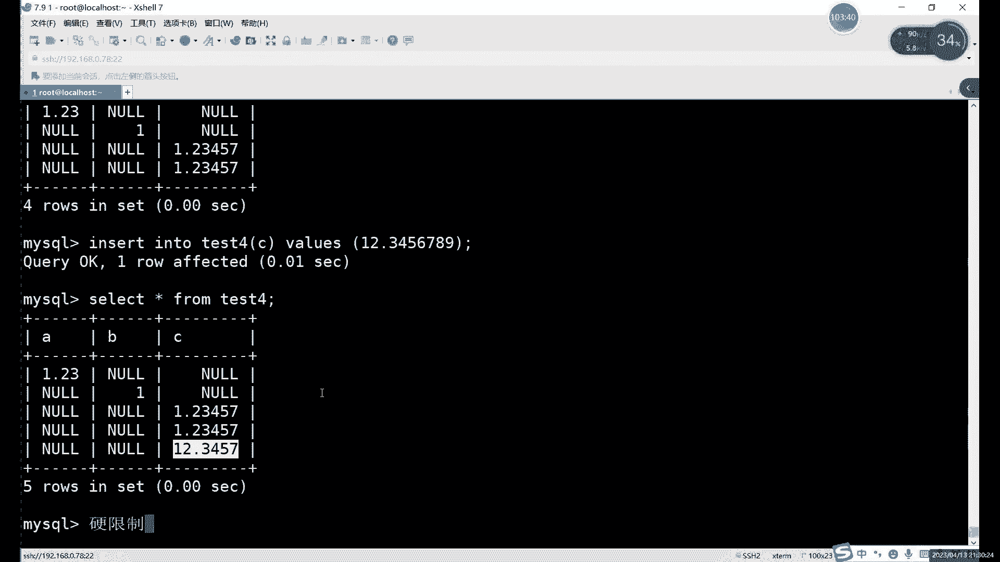

还需要考虑的东西比较多了啊需要考虑的东西就比较多。啊，主要的话其实我们就不用最多是中间这两个啊，中间两个用的更多问题。

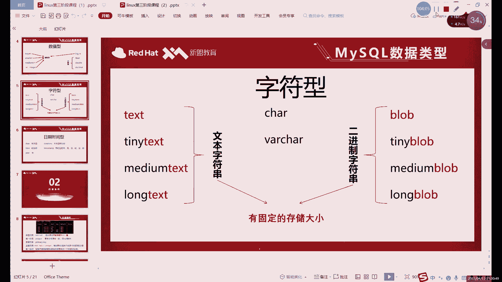

好，我们接下来的话就继续的来说这个字符型。字符形的话，它的区别是什么呢？啊，或者它的一个特点。就是我刚才说的硬件制啊是其一。其二的话就是我们首先来看一下这个PPT里边啊，我们是分三种类型的。

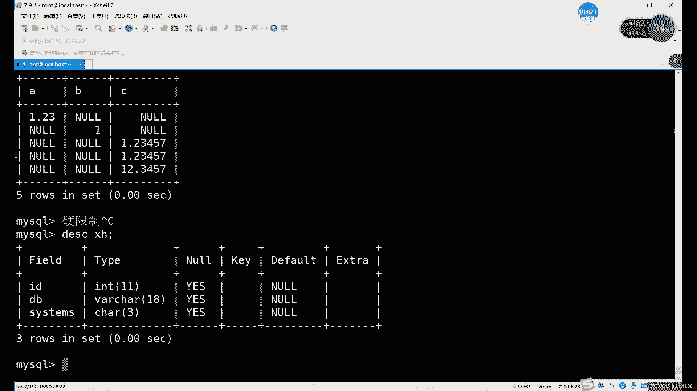

啊，我们分三种类型。CHAR和VRHAR。这两种的话。比较常用一些。哎，或者说呢。这两个呢他的这个。这比较典型的字符串啊，比较典型的两个字符串。那首先呢第一个。这是AR类型的话。

它是比较固定长度组合串啊，但是它的长度呢不是很长。只有255。什么意思呢？它就只能哎不是说长度吧，不能说长度，就准确来说叫字节啊，它的字节数呢只能容纳255字己。对吧其实对于这个数据来说呢。

如果说你做一些哎短一点的数据的话，那比如说姓名啊，对吧？啊，或者说这个姓名啊、籍贯啊，基本信息啊，其实倒也够用，255字己勉强够用啊。但是如果说哎出现一些比较长需要记录一些比较长的数据的话啊。

我会用下面这个VR的。VR的话是一个较可变长度的子物串，它的最大长度是65000，就是65535。啊，65535个字节啊，这个还是比较大的。然后稍微大一些。哎，但是这两个呢。啊，它有什么区别呢？啊。

或者说它的一个特点是什么呢？就是。第一。😊。

绝对的要遵循什么呢？遵循括号里面的内容。对吧这个其实我们之前已演示过了，如果说超过的话啊，它就会报错。对吧就比如说你insert into。将这个XH表里边插入。像我们就往这个sintte里面插入。

因为它这个比较短一些，对吧？我们往sstte这一个这一列去插入数据。比如说插入几呢啊是几无所谓。数字也行，字母其实也可以。只要怎么只要模拟一下超过4位啊，不是超过3位啊，我们就模拟一个超过3位。

他就会报错。他说怎么他说数据太长了，对于我们这一行来说。😡，啊，也就是sentim是这里一个啊。这次题目们这个字段我们允许的只有什么只是三位。你超出了三位。还有什么呢？我们就会报错。那这个就是什么？

这个就是。印件者。啊，就是绝对的要服从我这个括号里面的这个。设置的值。哎，是几就是几，你不能超过。对吧这个和他自身本来本身的这个容量大小无关啊，就是一个限制。这个是CAR和VRCHAR啊。

两个呢它的容量更大。所以说呢哎如果说哎考虑到这个容量问题的话，你可以直接用这个VRCAR来算啊，VRCAR来用。然后这两个呢，哪个更好一些呢？其实我更推荐这个后置啊。嗯虽然说这个它字母短一些，对吧？

打起来快一些，但是呢。容纳的这个长度啊，或者说容纳的这个容量小呢只是一个缺点。那一个缺点是什么呢？就比如说。啊，这个是它的存储问题啊，这个是它的存储问题。它我们每一个字段呢它肯定要存储数据，对吧？

存储数据。那我们如果说啊作为数字的话，上面的数字的话，其实就是你如果是是一1。23呢，我们就记录1。23。如果是1。2，如果是这个的话，就记住这个是什么就记录什么。但是呢这俩个就不一样。

因为它俩是包括有这个范围的啊，有范围在。就比如说你CHAR。我们是个三，对吧？这个美版的人给大家看效果啊，只是告诉大家这一个概念，就是CHAR的话，它这里如果是三的话，我们如果只插入一个一行不行啊？

当然不会报错。但是呢我们SELECT当然sla其实也看不出来。啊 at。对吧他是个一。它存储的时候会怎么存？它不是存一啊，大家注意就是字符型呢，它存储呢。或者说不能说字符形。

就是CHAR和V就只是CHAR啊，只是它这个这一个数据类型的一个单独的特点。就是如果说我们只插入一。那他记录的数据是什么呢？是一空格空格。啊，他一定要填够三个才行。

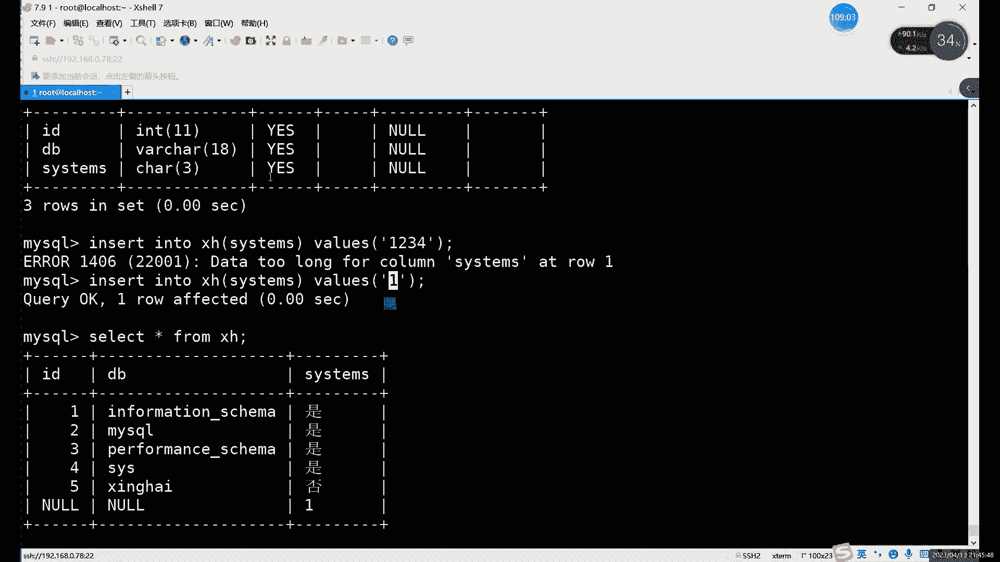

啊，这个就叫什么？这个就是它为什么叫固定子步串。😡，啊，它的定义是什么？它定义是固定子物权。固定长度的文本足以上。也是不管说你有几个数字。或者有几个字符。括号里边比如写3。你永远是三个字字符。

不够的用空格补齐，所以说呢它呢会浪费一点点。浪费的不足，但是会浪费一部分这个空间，对吧？因为空格的它也是一个它也会占用呀，也会占用我们的空间呀。空格算什么呢？空格其实也算一个子。

或者说你可以说空格是一个符号也可以。总之呢它会占用一个占用一个位置。而VR的话就是不定长度的。不定长度指的是什么意思呢？如果说。不够的话。超出的话大家都会报数啊，超出都会报数，不够的话。

它会额外占用什么呢？额外占用1到2个字节去记录什么呢？记录世界的实际长度。啊，直际长度什么意思呢？就是比如说他这里如果是个十，只占用了5位。那他一般就是什么呢？是一般就会。记录5位的数据。

然后第六位呢再记录一下，相当于把后边就截断了啊，就不再记录了。也相当于这里呢它呢如果说不够这括号里面的内容的话，它浪费的空间呢它只浪费一点点啊它只会浪费一点点。而它呢。少多少个就用多少个空格补齐。啊。

可以理解成自适应长度吧，这个就是自适应的。这个的话就永远是你不够就用空格补齐，少多少空格，不少多少个字符呢，就用多少个空格去补。就是它这个能稍微稍微浪费一点资源啊，稍微浪费一点空间。

就是说更建议大家用这个啊，更建议大家用这个。当然如果说你能确保这一列。的值就绝对都是一样的。就比如说性别。能确定吗？应该能确定嘛，对吧？性别应该是能确定的对吧？性别比如说一位吧。就是C是ARE。

这样的话其实没什么问题，对吧？这些R1就每一个数据呢都是。不是男的，就是女的。😡，这样的话就能确保什么呢？这样的话就能保证这个占用的数据啊或者占用的空间是最小化的。啊，这样的空间是最小。哎。

这就是这个CR。如果说不能确定长度的话，那你就用这个。如果说你这一列数据的话，你也不知道多长，那就用VRCC啊VR的吧，这个VR这个能更节省一些空间。啊，你相当于自询长度。好吧。然后呢。

还有两种类型的话，就是。两种啊，它分别叫什么呢？啊，它分别叫这个。文本和二进制就是文本字符串里面放什么呢？就是放一些大量的。字符。😊，这两个它的它是有有范围的，而且范围呢不是很大，对吧？

你即使说255字节就很小嘛，对吧？25字节非常小。😡，这个的话6万字节呢。其实也不是很难。对吧6万之金也不大。所以说呢一般情况下，如果说存储一些大的文本文件的话啊，文本字符的话用这些。啊，用这些。

他们也是二的8次方啊，16次方呀，这么去算的。啊，具体来看的话就是。最小的就28次方，它相当于谁？它和CAR是一样的。啊，他和CR的字节是不是一样的？然后呢，tex这里呢16次方，24次方，32次方。

啊讲啲嚟越得。啊，他们能存的比较多一些。然后呢，text这里是什么？text这里是谁和谁一样的？和VR是一样的。而这个呢。是。He。而这两最后这两个的话会有更大一些吧，更大一些。你这个算吧。

就前面应该数值这里应该算过吧。啊，这两个嘛就是800万。800万和。而且这里其实不是800啊。800万加800万。因为什么呢？因为我们这里这个呢。他没有什么，他没有范围。啊，字符它不包括正负啊。

再家注意这字符的话，它没有正负。所以说呢它这里其实就是刚才800万加800万，应该是100。啊，这个都会1600万就很长了。然后最后这个浪的话就是221亿加21亿，大概42个亿啊，就非常大。

也是如果是大文本的话，就用这些小一些文本的话，就尽量用CAR和VR为什么呢？你看这两个它的点是一样的。刚才说了这就CHR的话，它上限是255。然后呢，VRCHR上限是65535。

就它对应它它对应它也就是小于只要小于650065535的啊，你就用这个它就行啊，就是非常好用啊，这个非常好用，除非大于它了，你再去考虑下面这几个。这个是文本字不算。

当然呢数据呢对吧啊作为我们这个第三件影义的数据，你的文本只是一部分，对吧？字符只是一部分，对吧？你文本包括什么？包括这些各种语言的，你看英文啊，英文肯定更多一些嘛。除以英文的话。

你肯定如果说哎一些信息信息的一些数据的话，肯定要包括这个数字啊，中文啊对吧？或者其他的一些语言。啊，这些的话通用统一动用文本。统一都有的，还有一种数据是什么数据呢？就是二进制的数据。

二进制大家应该都理理解，对吧？0101嘛，0101就叫二进制的。二进制的数据呢也要也是要存的呀。你不能说二进制数据，你就是当做当做一个什么当做数数字，直接去当做数值型存可以吗？这不行，为什么呢？

数值型的话我们是什么？我们是十进制啊。数值型我们都是十统一是十进制的算法，而二进制字符串呢，那它只有0101，最以终呢它不能和数值放在一起去存，它只能是在新开一个字符串，它叫二进制字符串。

二音这不知道字符串新的特点是什么呢？😡，啊，总之呢范围啊和这边是一样的。两边范围是一模一样，就是一个对一个啊一个对一个。啊，就是从28次方、16次方、32次方开始，啊不2432。啊。

都是也都是也是以这边是以。啊，这边这个范围都两边是对应的，但是不一样的什么，左边是字符，右边什么？右边是这个二进制数字。2年数字哎，1个0101。嗯。这就是两种不同的这个什么呢？不能自服。啊。

当然中间还有一种看中间还有两个。你系嗯。啊，这个的话就是字符型的。字符型的关键是在哪呢？有个问题啊，就是再强调一下，字符形要加引号啊。数值可以不加，似乎一定要加。啊，一定要加。然后呢。

再看一下第三种日期时间性。日期时间型什么意思呢？它其实也是类似于数值型的，只不过呢它是有特殊的格式，它是加上了特殊格式的数值。哎，比如说年月日1分秒，对吧？你说他是数字吗？是数字，但是他。

是正循十进制吗？它不是十进制啊，咱们这个有好多个进制，你十分秒是六0进制对吧？明月日是。那进制都不确定，对吧？日到月是多少，有30进制、31、28、29。282933例14种。啊，到越到年都是一样的。

十二位度十二星十二星制的。啊，这里的话这个怎么说呢？其实你为日日期这边不能按净制来算，不能按净制来算。然后呢，棉这里也是单独的有字有这个。数据类型。当然还有这个dta time和time day。

一般比较常用的是这个。啊，那他们比较这个就是这个年月日时的鸟就比较全了啊，再严谨一点的话，就带个时区嘛，带个时区啊，time在在。呃，这两这几种的话，其实呃我们挑哪个呢？我们挑这个吧。你挑这个来演示吧。

因为这个是吧你预既包括了年日，又包括了13秒。这时去呢我们一般。都不一定带啊不一定带。当然如果带上的话，其实也就是也就是加个时区而已啊，加个时序而已。比如说呢我们来看一下日期时间型这边呢。

格式呢好多种好多好多种。啊，好多种大家可以去了解一下啊，可以去了解一下。但是笔记的话，后面会发给大家。你看啊，就比如说我们可以看一下年这里的我们演示的话，我们就用这个。da time去演示啊。

然后呢这个格式的话，我们可以简单看一下。那比如说这些。因为这个日期它比较特殊，它既可以以数值形表示，又可以以字符形表示，什么意思呢？你可以加引号，它是算字符，不加引号呢，那就算什么？啊，这就算这个。

述值啊数字述值。然后呢，这里呢。嗯，到目前的话，因为其实呢从我们这个系统诞生，其实是。1970年嘛1970年。1970年这里呢。我们这里有有简写嘛，因为有简写，0到99，但是0到99的话。

它并不是说00年到2099年，它代表的是什么呢？从70到99代表一段。然后呢，从00到69，也就是我们这个来表述只能表示到2069年啊，只能表示到2069年。所以说如果说你要超过2069年的话。

你就得写全一些了。啊，最多的话是190162155。啊，需要注意这个。然后下面的话就是时间time啊，对time这边就是指了鸟嘛，日期就是年月日。格式的话一般就是22到3种啊，最多是4种啊。

这边是三种格式。包括这个时区也是一样的，时区它就无非就是多加一个什么？多加一个你的时区的这个代号。1加S70代号然，我们这里主要看一下这个日期吧。约期余时间beta time。face time的话。

这个呢也是三种表示方式啊，三种表示方式我们可以来看先来看一下。

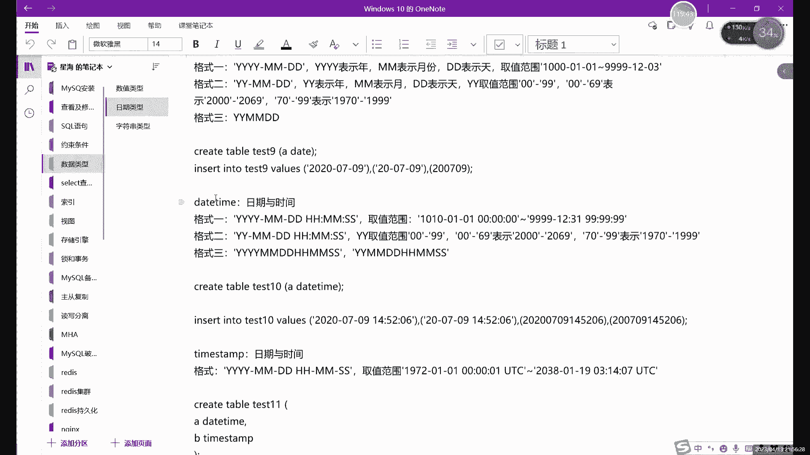

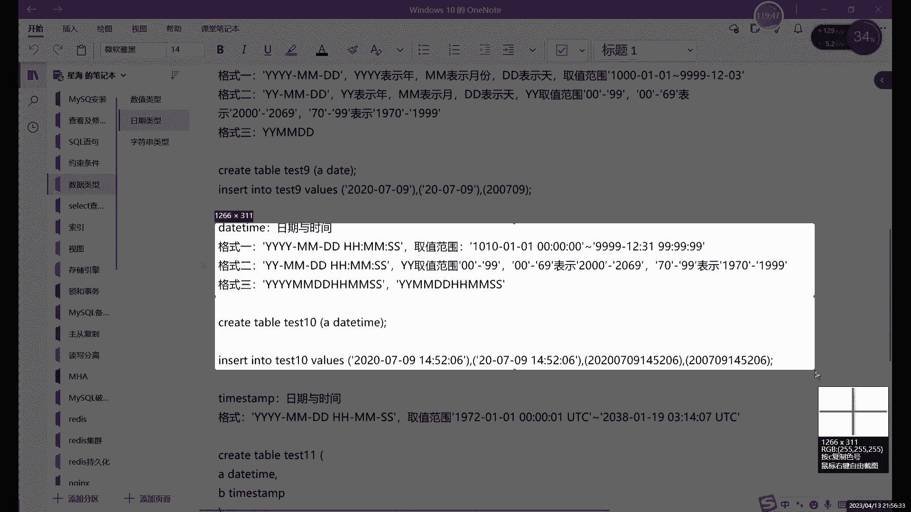

好，我们来看一下这个日期时间。首先呢我们先创建一个表格呢，叫它什么呢？ZREATE。希步。这叫它d time吧。啊，你很多可以练习的时候，可以把名字就记成你这个啊具体练习内容的一个表格的名字啊。

这样练起来好认一些。day time，然后呢。日期啊日期的话就。出生日期吧。过生也行，对吧？生日或者生日都行。生日，然后呢后边写什么呢？date time。我们这个d time这几个范围。

它没有这个括号，就括号里面不需要写范围，因为什么呢？因为它相当于是它这个范围已经是默认的。啊，就是你怎么写。再怎么写，你也不能写出是吧。太离谱了对吧？一般我们就是四位嘛，年头年头就4位，月是两位。

日也是两位，对吧？这都是固定的位数。所以说呢这个也不会超出，只要你不超出这个范围就行啊，就是按照正常你平时。他这个也相当于什么呢？相当于是按照正常的一个逻辑来看。你看啊它这里的范围是多少呢？就是这个。

但这个99其实不太合理。99之行可不太合理。那99你说呢？哪来的9999点对吧啊，没有这么多啊，没有这么多货。所以一般情况下呢我们。我们就先写一个先创建表格吧，然后我们插入数据啊。

或者我们先来看一下DSC它是长什么样啊，day time。啊，它的类型就是de time，它没有括号，大家看到没有？他说我没有范围，就是日期这个东西呢，它不规定范围，就是在本国里面，它不规定具体的这个。

取值范围是哪些啊，但是我插入的时候呢，你是要遵循这个。正正常的一个逻辑啊，birthday啊就是是day time。啊，因为只有一个字段，我们就不用写那个本了，就直接写什么呢？直接写这个年月日。

比如说呢我们就写现在的时间。我们写个时间，哎，比如说。2等于。我们先用第一种啊引号就大概就是。这也不能说大概字符，这其实也和字符不一样。大家可以看到我们里面其里有很多符号，对吧？有很多符号。

所以说呢也不能说字符吧。这日日期时间形呢是一个比较特殊的。😊，有特殊的一个字符，对他没有说多么。没有说特别正规的一个。表示的方式吧，就总之就是你按照什么，按照正那常时间来写就行，对吧？

比如说呢我们可以写一个。这些的话年月日写完了，对吧？那就是1分秒。只这这里用冒号隔开就可以啊，用冒号隔开就可以。秒数的话59了。啊，可以。然后看一眼，刚好59。然后呢，我们再来下一个，这是一种写法。

对吧？还能怎么写呢？因为是10多秒，刚才其实我们是正规的一个写法。啊，如果说换成什么呢？换成这个。哎，比如说。取一报。啊，就写一半，明日写一半，那就是怎么写呢？就是。把Y的取值先减少。啊，把外区连成这。

咱们就不要了。啊，先在不要了。啊，这样的话相当于这个其实怎么说呢？只是去了一部分。还是大概还是作为一些字符来看啊还是作为字符来看，就是加引号，谁就可以算字符，不加引号就算数值啊，这样这样理解就可以。

然后还有一种写法的话就比较自由一些。或者说是不能说自己个吧，就是。比较随意比较随意，有多随意呢？你不仔细看，甚至有可能看不出来是多少。😡，对吧你能看出这日息是多少吗？其实不太好看。网页盯着看。啊。

剩下的这种其实没什么太大区别了。我这里写出来给大家看看效果。你直接来看sla，不要看那个字幕了。这个怎么说呢？几种插入方式呢都一个意思啊一个意思。DIM time。不管你怎么插入。

它都会显示出来是一样的。因为什么？因为我们叫day time字符啊，这个叫字数据类型啊，daytime数据类型。有如这个数候类型呢，它没有什么限制范围啊，也没有什么特殊的规定。

但是它的显示出来东西呢是完全一致的啊，一模一样的，是吧？你看起来怎么乱是看起来怎么乱，杂出来都一样。所以说呢你插入数据的插入这个日期时间型的时候呢，就是。这种看起来肯定第一种肯定看起来最好看，对吧？

这种是最好看的。然后后边的话就怎么说呢？第二种也还好，就少了1个20嘛，然后后边的话就完全堆在一块儿。啊，就这一块呢，但是呢它不影响最终它的一个识别啊，就对time这系统呢都可以识别到。啊。

都可以给你展示出来数据啊，这也是怎么说比较智能一点吧。然后呢，这里的话我们来看一下这个。slalect啊，这里的话就是我们da time这个数据类啊，日期时间相下几种的话，一个道理都是几种不同的格式啊。

它们有不同的几种格式。

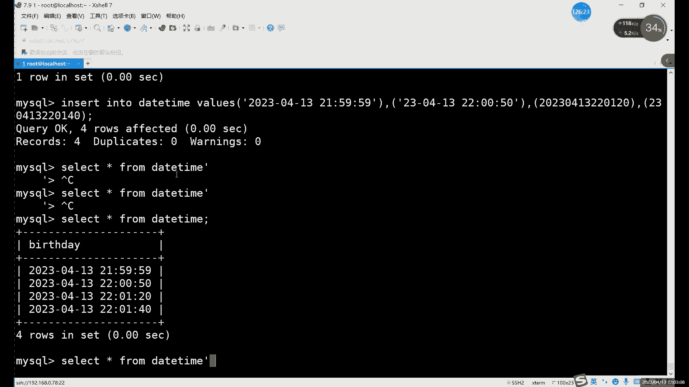

这个的话就是我们买搜cle里面常用的什么常用的数据类型。啊瞓到翻你。

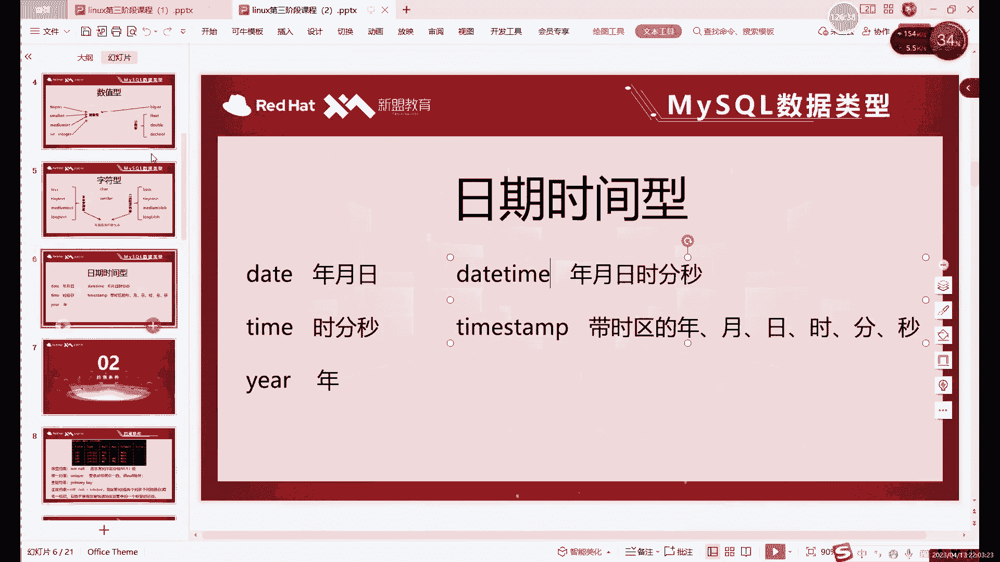

那说数据类型的话，其实我们已经把DSC这里这部分。啊。这一部分终于说完了，对吧？这个名字的没什么好处的，对吧？就起个名字而已。啊，这名字type这里这部分呢就是什么呢？啊，type这里的话。

其实就是你看我们讲了什么，讲了整数小数字符。啊，字符这里主要是文本字符和二进制。然后呢，第三种呢就是日期时间型啊，三种不同的数据类型。

也就是type这里的这里type这里主要注意的就是与前面的数据类型和后边括号中这个范围。啊，注意一下这个就可以了。这个就是前面这部分。啊，前面这步。然后呢，我们接下来看什么呢？接下来看一些这个。约束。

对。啊，接下来看下约束，因为时间不是特别够啊，这我们可以继续走啊，继续往下走。约束是什么意思？就是我们后边这几个。特殊规则。前面这个类型它只是一个普通规则吧啊，它只能说是普通规则。然后后边约束的话。

这里其实不是4种啊，不是4种。我们。满打满算一共是6种。啊，16种。呃，这里是一种。然后这里有两种。哎，不对。啊，这里是一种，这里有3种。然后这个分别是一种，就1311，一共是6种。6种约束类。啊。

我们一个一个来看不着急啊，我们一个一来看它具体约束什么呢？这个就是很重要。这个约束其实非常重要。为什么说它重要呢？啊，就是还是提起我们前面我们讲delete的时候，对吧？有的同学说到了。

如果说哎看到的如果数据很多，对吧？很多这个可能也会出现很多这个相同的数据，那delete删的时候是不是就很不方便？对，确实。😊，但是不太方便。

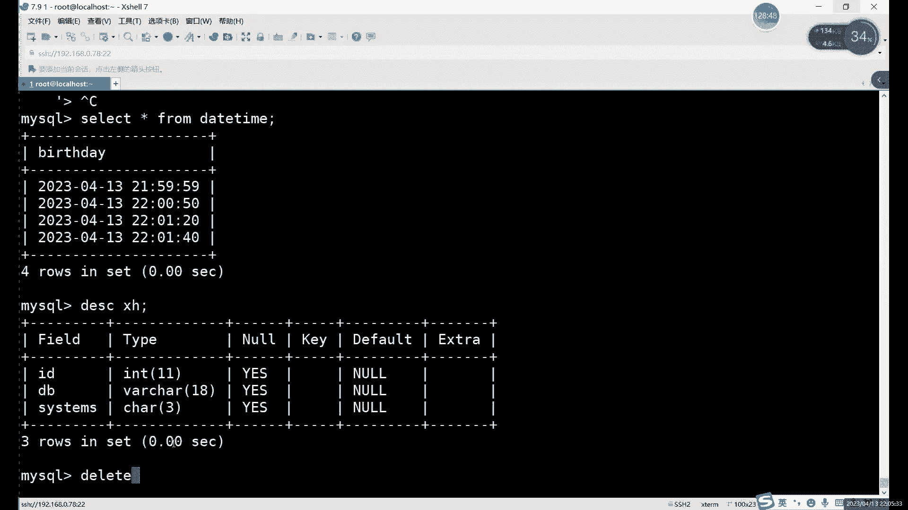

那为了防止这种事情的发生呢，我们就需要去让约束去限制。第二个是什么呢？第。😊，我们先来介绍一下前两个约束。啊，不是先来一个来说吧，就一个第一个非空约束。指某列不能存储，那值也就是空指。什么意思呢？

控值是什么？我们前面插入哪位的时候看得到过控值呢，就是在插入。

那个哪个表格来着？SELECT。正盒装。啊，是这个表格。对吧一开始这里我们是控制，然后后来的话我们又插入一下，前面又变成空值了。对吧空值什么意思？就是没有这个数据。😡。

但是呢这一列里面它肯定是有个数有个数据有，但是其他列呢可能会有一部分数据没有。那这种情况呢。可能会对查询的不会查询造成一些敏感。啊，公制。空值的数据的话，其实怎么说呢？一呢有可能是什么？

有可能在插入的时候遗漏了。啊，遗漏的一部分数据。这样的话你在后期啊数据维护啊，或者查询数据的时候，其实都会。比如说你查询一个东西的时候，哎，突然发现一查哎它是空的，为什么呢？他可能就是当时查的时候呢？

啊当时插入数据的时候呢，你没有插入进去，就造成了空值。那这种空值呢其实这种控制很不好啊，这种空制很不好。尤其是在你后边做查询啊、修改啊删除的时候呢。

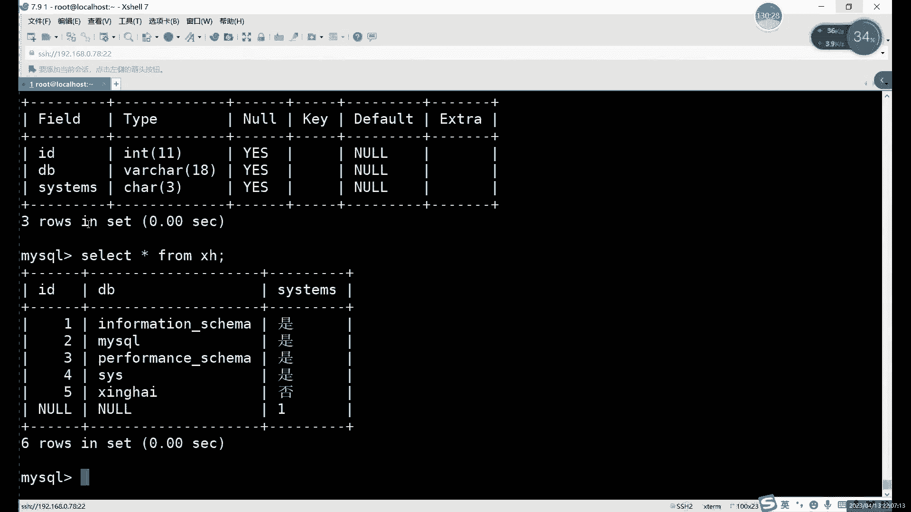

对吧影响很大。所以说呢。怎么才能避免这种啊忘记插入啊，或者说是。啊，故意插故意忘记啊，故意忘记插肯定不至于。一般情况下就是可能是大E的啊，可能是大E了，没有插进去。

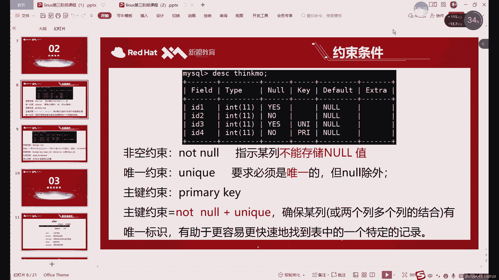

没有差问题的话，它就变成空的。他这个空值呢。怎么才能避免这种充值的产生呢？就是我们可以通过第一种非空约数来限制。什么意思呢？现在啊。那这一部分呢我们是写的是yes对吧。Yes。😊。

Yeses的意思就是我可以为空。默认是没有非公约数的，那怎么添加呢？😡，Yeah。Great table。我们就要飞空。啊，就要黑空。这样的话我们早起表格来说好比比较好找，对吧？黑空，然后呢。

括号里边写什么？I d。MT啊IDMT然后。嗯，飞空123。你那个。别人写在这儿啊，我们就用一个就行。我们就演示非空接入，好吧，IDINTnot now。这就就是非空约束约束写在哪个地方呢？

就是写在我们创建表格的时候。如果说你有多列。啊，多列比如IDNT一列对吧？nameHAR一列。比如说我们就按就按两列先来说，看两列。因tu的话都是写在这个。数据类型的后边啊，这个写数据类型后边之后呢。

再用多少隔开。啊。就直接跟在数据类型的后面就行。啊，就相当于跟这个顺序也是一样的，就IDING然后成到。然后边再有其他的约束呢，咱再说。啊，我们先加一个什么，先加一个ndown飞空的约束。那加了之后呢。

有个什么效果呢？啊，首先DSC它看起来就不一样。首先呢你看结构啊，它长得就不一样。啊，叫飞空对吧？一个是no一个yes，比是这一列呢它能空，但这个列它不能空。

比如说我们insert into我们来用插入数据来验证一下这个非空约数的一个效果。好吧，inser into哎我们在插的时候。表格啊，我们目标是飞空，然后呢，value。括号里面写什么呢？括号里面写。

我们先验证哪个呢？我们先来写ID。我们一个一趟啊一个一趟，不着急啊不着急。二。😊，哎，我们看的是哪个这个ID。嗯。你这的 into。哦。写错位置了。这个位。啊，插进去了。再听 from。你供。一闹对吧？

第二空了。也就是只要它是yes，你只要看它这个DSC里面，它显示的是yes，就是么你可以不插入数据啊，可以不插。但如果说我们想name里面插入东西。😡，啊，这个是字符，对吧？字符的话，我们得用引号。啊。

以位是。一为那我们就张。🎼It。然后呢，哎这里呢他报了个错。他报错的原因呢，就是因为这个非控子约束啊非控子约束。但是他的报道错的信息的话，你翻译过来的话，他其实他并没有说被风约说，他只是说的什么就是。

ID呢没有默认值。啊，这个其实涉及到我们后边另一个约束了。什么意思呢？大家看啊默认值默认是谁，看这是后边这个约数，默认它是空的。什么意思呢？就是如果说我们是允许为空，它其实就是什么呢？

就是默认值这里的问题。对你不插入数据默认就行。😡，默认有人到。准不插时你默认就声道。😡，然后呢，可以为空，那我们就可以把闹钱的。那如果说我们不允许为空，不插入数据默认只是闹，但我不允许是闹。😡。

就报错了。啊，也思是说他所以说他就得报错叫没有默认值，因为默认值默认。它是个号，它不算值，它只是哎让我们认为它是一个空的。啊，风。这个就是什么？这个就是哎非空约素的作用。就是你想要。你想漏你都不能漏。

对吧你漏都漏不掉，他说呢就是啊你不想给他擦除就行不行那不行。你不你不插入，你不给我插入，我就报错。😡，啊，这就是not now啊非空约束的一个作用，就能保证这一列的一定是有数据的啊。

没有数据呢就发警告啊，不给我数据，我就警告。啊点个。啊，但当然这里应该不能说警告，你这I报错了。😡，啊，我就直接报错。啊，很强对吧？啊，他会报错，你不给我数据，我我就生气了啊，我生气。这个就是非公约墅。

然后呢，接下来我们看什么呢？接下来我们看这个第二种啊唯一性约束。唯一进约录的话，我们这里。他的作用。啊，或者他目的就是要求B值者唯一的啊公值除外。啊，控制除外，我们先不谈控值。唯一。就是不能重复的意思。

对吧？就是数据不能重复。这个就是很好的解决了什么？很好的解决的。如果说你第一次删除的时候，对吧？你如果怕。有重复的数据，对吧？那肯定删起来确实有点问题啊，delete。那，如果说哎我们是通过什么。

我们用。有唯一性约束的这一列去删的话，用这一列作为条件去删，那就不用担心这个问题。啊，那就绝对是没问题。这个的话就是什么？这个就是。啊，这就是这个微棋术的作用。就能确保什么。

比如说我现在啊现在这个是个非空约束，对吧？非空约数我正常插工西的时候，然后我们重新创建一个表格吧，create table。😡，唯一啊，要唯一。I d i n。Unic扣。然后第二个的话还是name吧。

就简单点啊。我我多闲点多选点。不然的话都不能打字了，HHR。MT那边无所谓。啊，反正我们一般到不了上线啊，所以这样的话，你就得自好写一个范围，不然你不写的话，它默认是一啊，大家你只能写一个字母，很难受。

😊，所以说呢我们先啊先放这么一个，你看我unic放在哪，我还是放在ID这里。啊，为什么放在ID这里了？ID的话，这个东西你可以就类比于什么？就是可以当成这个学号啊。工号啊、身份证号啊这种类型。啊。

他就可以是唯一的那姓名呢你可以唯一吗？那肯定不行啊，姓名这个绝对不可能唯一的，对吧？你这个。可能哎即使你的名字再特殊，可能写可能。最近没有和你同名的，但是过一段时间说明就有跟你和你同名的出身了，对吧？

这个就是什么？这个就是唯一性名字不适合做唯一的啊，名字不适合做唯一。所以说呢我们用ID这里。ID这里的话，比如说我们我们先来看一下效果啊，DSC。唯一性为。啊，唯一契约这里我们看到一个什么问题呢？哎。

你看n这里我们还是yes啊，注意啊，我们n没有变，还是yes。也就是说，唯一契约束是可以为控。可以有一，但是呢哎我们这个K这里多了个东西，unual啊unual对un。

unicode的缩写啊unode的缩写啊，UNI。比就代表我们ID一定要为E。你转你色0度。唯一values。我往里面插入一个，比如说哎像什么呢？像这个。1231。逗号。一张三行不行呢？换英文的嗯。

可以，对吧？没问题。我再来一个2。可以吧？也没问题。我们来看一下s from唯一。哎，我插入了两次一个张三的话，我们一直在插入啊，因为什么？因为我没有唯一性A，对吧？第二个没有微信，但如果说你再插一次。

再猜一个二张程或者都报错，他就报错了。为什么他就说哎二呢？2、这个呢它这里因为有什么有一个唯一学约素。啊，一只ID呢它有个K。啊，它这个K的话叫什么？它叫唯一性啊，有违反的什么？违反了这个2。

你就相当于说他意思是二，他意思是二呢这个值重复了。对吧二这个值重复了，那你那就报错了呗啊，唯一性嘛啊唯一性这边是肯定不能啊，不能这个违反的啊如果说我们换一种像。你这里插入name吧。

插入30个name一样都是张三。我们再来看一下效果。Now。😡，三个公里。哎，现在的啊那肯定有朋友疑问了，这不不是说唯一嘛，对吧？那这空值了都是一样的三个空值了，那这有什么唯一性的？

当然这个唯一呢啊它不限制谁呢？它不限制no，因为not呢，它在根本上它根本就不是一个值。

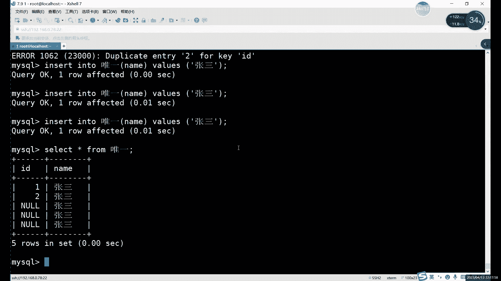

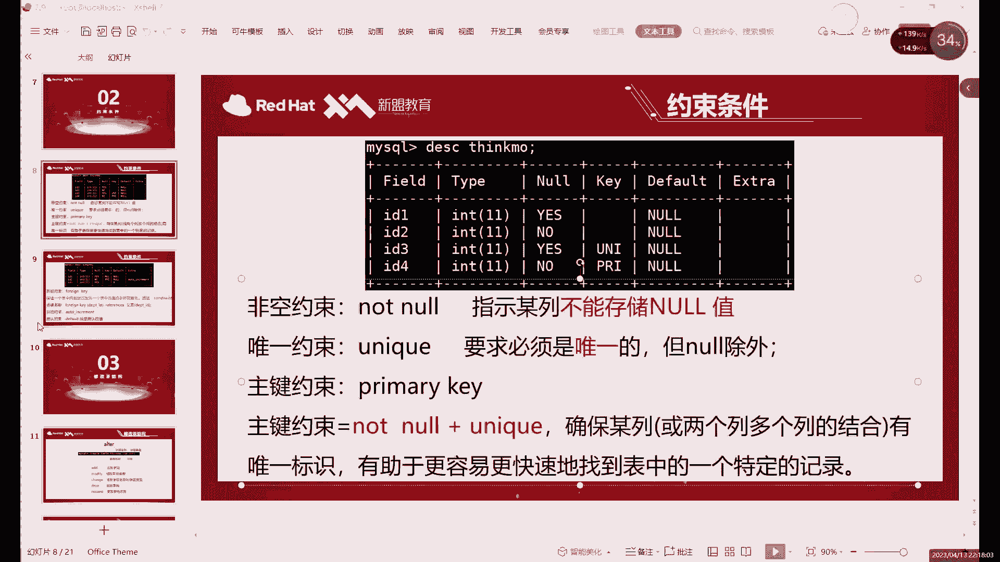

它不是这个数据，它只是什么什么意思？它其实只是。这一行因为没有，就这一个这一格里边不用说这一行吧，这一格里边没有数据，它只是用那来代替啊，用空值来代替。我告诉你这里没有值，它并不是说什么呢？并不是说。

什么都没有，对吧？命文书什么都没有。啊，所以说这个东西呢就是。啊，这个的话就是我们的这个唯一性因素的特点啊，那样的话它不会限制啊，因为空值的话，它不能空值它不能限制唯一，因为它。我说他其实都找不到值啊。

这里他基本找不到值，所以没没无从限制。所以说我们唯一性限制的是什么呢？限制的就是。有的数据啊一定要唯一。哎，所以说这里的话就暴露出什么，暴露出唯一性约唯一性约束的一个缺点，就是那空值它无法约束。

那怎么办呢？R为。飞空加。唯信等于。主件。啊，就是非公价唯一性的店。什么意思呢？就是一个不行的，你们两个一起来干行吗？可以。这个约束呢它俩加起来就生成了一个新的约束啊，叫主件约束。

主件约束的特点就是这一列的数据呢非空且唯一。就是既有飞空的特点，又有唯一性的特点。就是你既不能重复，又不能写控制，这样的话就能保证什么保证我们一定有一列，就是有主件这一列呢。所有数据都不一样。

而且没有空制，这样的话，你低一的导起来，是不是就一点问题没有，对吧？这肯定就没有什么问题。因为。😡，都是唯一的，而且是飞空的。每一个数据对应的这个比如说用ID吧，ID我们用主件，每一个后面的数据。

不管是谁想找谁，用ID都能找到。那想删谁呢，用ID也都能删更新也当然也一样，对吧？因为这个更新啊删除啊都是需要用V二限制条件的。你只要有这么一个独一无二的存在啊，那你这个条件随便写。啊。

包括后边我们会讲的sides查询，对吧？你有了这个条件，你查询不也随便查吗？对吧这个就是什么？这个就是。主建元素的一个优势。啊，年入的优是。比如说啊直直接来袭。table步。主件。

比如说我们这里写个什么，写个。用ID吧。啊，你大家可以随便写这个字段的话，你随便写名字啊。而且字段名字也可以随便改。对我们前面已经改过了啊，用out名是可以随便改这些字段的名字的。所以说我们关键在哪。

关键其实都不在名字上，关键在哪，关键在。😊，后面能约束上嘛。啊。Primary。这个就是主建的那个约束的名字啊，primary。哎，就主要的啊组件。然后后边的话内幕啊就这个就不用。M冇 n t。

还不准那么内部CR。咱们就写个那 no。对创建之后呢，DESC我们来看一下组件。看到没有啊。两个呢都是no对吧？因为一个是主件的，也就是主件，它其实肯定是有这个脑通al的特点，对吧？我们都是no的。

然后呢，另一个就是当然这里它不不能写unicol了啊，unicq的话还是唯一性，就是说他这里就写了什么，写了这个primary。然是包括唯一性的。所是说其其实你这里写哪个都行啊。

但是他这个默认写的是主件啊，因为主件呢怎么说呢？它更大一些，是吧？它比唯一性更大。对吧。はい。好，这个的话就是什么？这个就是我们这个。组件啊组件约束。验证一下，其实是这个就怎么说呢，他就是两种特点都有。

就比如说呢我们插入一个iner into。你这 into像。就不写括号了，不要Y60吧。一逗号。啊，后边也有个飞空，所以说后边我们肯定得要写这个。数据对吧？吧一张单再来一次就报错了，对吧？他报的什么？

这次又报错又不一样。😡，他又报了个primary啊，primary就是主键的报错。啊，一报这个错你心里能知道，对吧？你才有的这个。一这里呢它有个主键啊它有个主键。啊，他报酬和微信还不一样啊。

他报酬和微信竟然有点不一样。😊，然后呢，非公的话当然也一样啊。空的报错我们可以来看一下interlin库组件。name。嗯。啊，明。他也是但当然这个和飞控是一样的，没有默认值。啊。

那个唯一信那边报数不太一样。unic扣那边的话就是这种报酬啊长得稍微有点区别。可以理解成什么？也可以理解成这个unic呢，它只是一个普通的键啊，普通的key。然后呢。

主键这边呢已经升级升级成primary了啊，primary级别的。就是它这里有个独特的名字啊，独有的名字。这边的话我们是以这个字段的名字为为键的名字。😊，啊，这个的话就是什么？

这就是我们这个主件这里啊主件的特点。

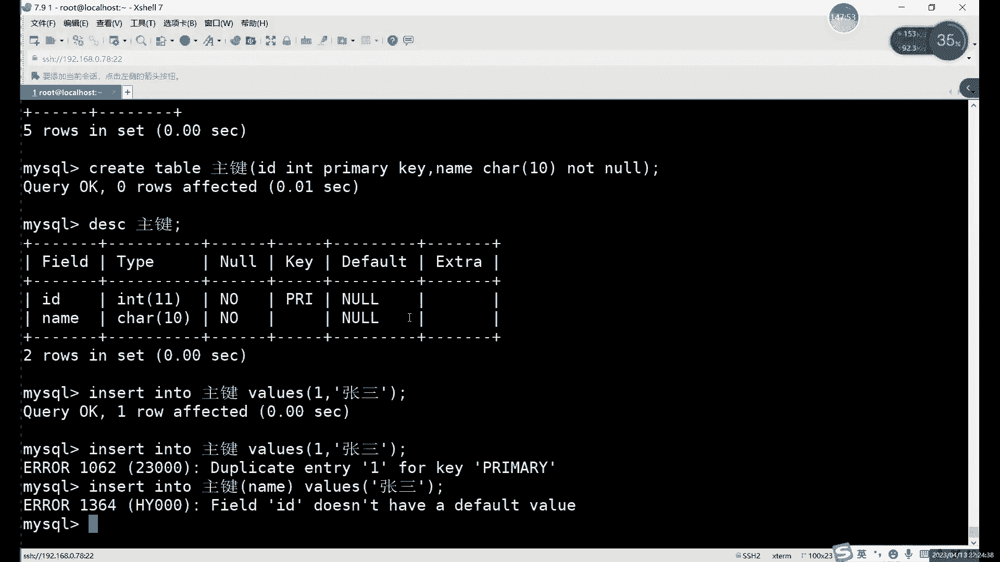

约束条件这里呢。除了这个nton no啊也以及就是飞空啊、唯一啊、组件这三个以外呢，还有什么呢？还有这个还有3个还有3个，一共6个吗？刚才不是说？啊，这个位置一个这个位置K置里有3个呢，K置里有3个。

啊，除了主件以外呢，还有一个还有一个外键。外电的作用呢。外线有什么用呢？它其实是什么？它其实就是保证什么保证一个表中的数据呢啊匹配另一个表中的这个值啊，也相当于是一个同步作用。啊。

就外径的作用就是同步数据，同步谁呢？同步它组件的数据。所以说呢外键和主键呢它不在一个表当中啊，大家注意啊，就是不是说啊一个表里边互相同步。啊，那没什么意义啊，那就相当于是同一个同样的两列了吧，对吧？

所以说呢外件和组件呢这里是什么呢？这里相当于是两个表中的不同数。什么意思呢？外键这里呢。首先我们先要创建组件啊，先要有主件啊，有了主件之后呢，我们再来创建外间。而外间的使用呢。

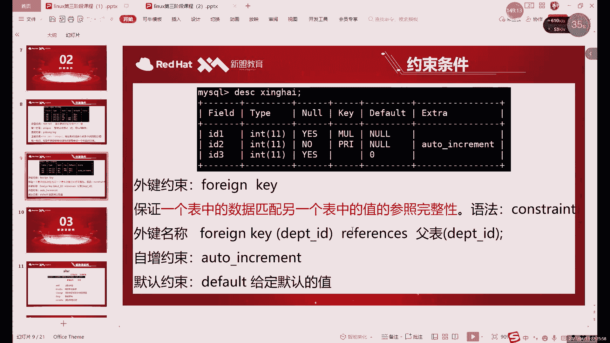

外界的这个命令呢啊就相对来说比较长一些啊，相对来说比较长一些。啊，很长对吧？很长啊，总体上来说呢，其实就是一个。外键啊外键的关键词加上什么？加上这个。表格名称。啊咱这不能说表个名称吧。

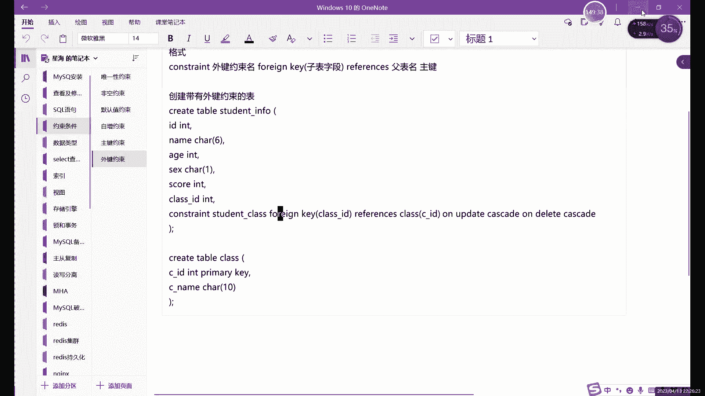

先写什么先写外界名称啊，不知道表格名称，表格的话就是我们本地的表格。啊，分类表格对确实时间时间不太够啊，我们可先介绍一啊，先简单介绍一下这个关键约束以及自增默认啊，我们可以下节课再说啊。

就这个默认这个约束条件还是很重要的啊。因为每一个不同的表格啊字段啊，其实都是需要什么，你都是需要这个。有不同的这个情况啊有不同的这个不能说情况嘛，就是不同的场景啊，只用不同场景。外件的话。

它是相当于一个数据同步的作用，类似于什么呢？它类似于那些软链接，对吧？软链接大家应该都知道。它在我们这个linux里面，它就作为一个相当于是同步数据嘛啊软链接可以同步数据。当然硬链接也是对吧？

软链接硬链接它就相当于是一个软硬链接的一个特性。同步数据。啊，就是从我们的组件的表里边去同步到我们同呃外件的表里。啊，这个具体的话，我们这节课会具体做一下啊，这一课时间可能不太够了啊。

一会儿的话我还要去还要去给弄弄一下那个服务器服务器。然后呢，下边这两个自增和默认的话。啊，自增和默认的话也是两个，就是后边这俩默认和自增。啊，默认其实刚才我们已经提到了，对吧报错里面他报的就是默认。啊。

自增的话就是最后一个。啊，外电呢其实就相当于是。你可以列成副表啊，就是这两个表它一定是有关系的，就是有外外件和主件的表呢，它两个是一定那个字段的，一定是。一样的。啊，就里面的值啊不能说值吧。

就是里面的数据呢肯定是一样。啊，如果一个修改呢，另一个也会跟着改。当然呢是主键改呃，就是外件跟着改啊，大家注意啊，就是我们这个。主键外键是单向的，就是主键改外键跟着改。哎，主键删除呢，外键跟着删除。

但是呢外件是不能改的，就一旦设置了外键，外件就不能动了，那一列的数据就不能动了。啊，这个就是外件的一个作用吧。同步数据，而且相当于是把自己给锁死。啊，还是一个说子。

就是一切的跟着我们的主表啊一切跟着主表一起走一起走啊，它就相当于已经失去控制权，就是完全把控制权交给了我们的主件那里，主件怎么变呢？那么我们外界跟着怎么变，就是一个同步数据的作用。啊月同步处理做。

就比如说你按照这ID来说，对吧？因为外键是一定要绑定主件的，或者绑定主件。所以说呢啊比如说我们的ID是主件，对吧？ID是主件，我们可以用这个外键绑定主件之后呢。绑定什么绑定我们其他表的一些数据。绑定到。

比如说。绑定一个其他主其他表里面的一个一列ID2，对吧？然后呢，只要是主件那边跟着走啊，跟着变，那外件这边的数据也就一起更新，相当于是同步更新数据啊，就相当于如果是你不设置这个主件外件的话。

更新数据倒也可以，对吧？但是你更新的多少容易改错。你有了这个主件和外件的话，你只需要改一个表啊，同样另一个表就一起跟着改。这样的话。提能提升提高一些效率，而且呢不容易出错啊，除非你是改主主表的时候改错。

那没办法，那就一起错了。那相当于是要错一次，要要错一起错，速度确实是快了一啊，效率肯定是提高了。啊，你缺点就可能要一起一错又一起错了。而且呢。呃，副表就我们的外件表就没有自主的修改权啊，没有自主修改权。

就只能是完全按照组组件来。怎么说呢？有好处也有坏处。啊，好处主要就是数据同步，比较方便，坏处就是呃外外件这个表呢。当然只有外间那一列啊，不是说整个表就废了啊，只有那一列它就不能动啊，其实那一列不能。😡。

然后后边的自增和约默认的话也是也是非常好用的两个啊也是非常好用的两个。啊，默认的话就是我们刚才看到这个n这里啊，默认都是n。但是我们可以自己去修改，以及一个自增啊，自增什么意思呢？自动增长。

解释就是自动增长，就数字的自动增长啊，字符不行啊，它只能是数字自自动增长。啊，就这种这种。好吧，今天的话那我们就先到这里。然后呢，明天的话呃不是。周六啊周六晚上呢我们继续。啊，周六晚上我们继续来做这个。

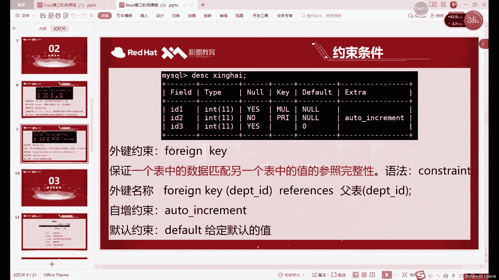

剩下的几个约束条件。