# 零基础入门Linux，红帽认证全套教程！Linux运维工程师的升职加薪宝典！RHCSA+RHCE+中级运维+云计算课程大合集！ - P68：中级运维-7.约束，ALTER命令，索引，SELECT查询 - 广厦千万- - BV1ns4y1r7A2

我们今天呢继续来讲这个约束条件，约束条件。首先呢上节课我们讲到哪？上节课我们讲到了这个非空约束，唯一性约束、主件约束，对吧？啊，讲了这三个。第三个的话就是前面这几个对吧？n这个位置呢是什么呢？

是黑空的对吧？no就是飞空。yes呢？就是没有设置飞空约束的意思啊，然后呢，第二个位置K这里的话能写什么？能写唯一型约束啊，unic呃unic就是唯一型约束。主件的话就是primary。当然还有第三种。

配置位置还有第三种，那就是我们接下来要说的什么呢啊外键。外件它有什么用呢？啊，它其实它的作用呢。我们同学课以简单介绍了一下，对吧？啊，我们回顾一下外件的话，它主要就是用作一个什么做什么做数据同步的。

就两个表格之间啊，两个不同的表格之间是可以做数据同步。就比如说如果说两个表格里面有一列数据呢，哎它这一列数据呢是完全一样的。啊，一样的这个含义。就比如说。哎，可能是什么呢？可能都是一个ID哎。

都是1个ID号啊，或者说都是什么，都是姓名。啊，碰到这种情况呢，哎，我们就可以什么，我们就可以做这个两个表格之间呢，更准确的来说是两个表格当中的分别抽一列出来。大家注意啊，就是我们这个。外界约束啊。

我们只是做一列，对吧？这个和我们前面讲的也一样。我们每次设置约束的时候都是一列一列设置，对吧？😡，啊，就是一列一列来的啊，它并不是整个表格。哎，我们这个约束类型哎就是在我们买思格当中的约束。😊。

它并不是什么，它并不是说哎整个表格哎一设置约束，整个表格就被约束了，或者被限制了。并不是我们的所有约束都是一列一列去设置。就比如说呃如果说我们想设置主键和外键的话，我们也是什么？我们是也是将其中的一列。

哎，联系在一块儿。绑定在一起。主键更改数据，外件也就跟着一起改，哎，就相当于一个数据同步，类似于什么呢？类似于这个。准确点说应该叫。类似于软链接吧啊，和软链接当然不太一样，只是类似啊类似软链接。哎。

就是主键那边一改，外件也就跟着改。主键一删掉呢啊外键也就跟着删掉了。啊，这个也其其实是比较类似的啊比较类似。但是呢有一个限制就是什么？就是外键这里不能主动更改啊，就是如果说一旦设计了主件外键。😡。

就比如说你这一列呢哎绑定另一个表格当中一列。那么他就不能什么，他就不能自己擅自修改啊，可以添加数据，但是不能再修改，也不能删除，那只能添加。😡，啊，这是一个外件的一个限制。就一旦添加的话。

就相当于是哎你就必须要和你的主件。啊，保持同步啊，你和你的主表呢表示同步，保持同步啊。然后呢啊当然后面两个，我们后面再说，我们先来说这个外件好吧，先来说外件外件的一个格式呢比较长啊。

也相对于其他的这个约束来说呢稍微长一些。啊，这个需要稍微记一下啊稍微记一下。外线这里的话就是什么呢？就是。创建好一个一列之后呢。这个外件呢它创建的时候比较特殊，啊，它和前面几个不太一样。

前面的话我们是加在哪儿，是直接直接加在这个数据类型的后面，对吧？我们字段数据类型加约束，我们前面三个都是对吧？然后呢，外件的话就不太一样了。比如说我们这里来哎直接来。

拿一个外件来举个例子。主件的话我们已经创建好了啊，组件已经创建好。外键呢一定是什么？一定是连接了一个主键。所以说呢。你们这里是。你IP是哪个？啊，0点78G。

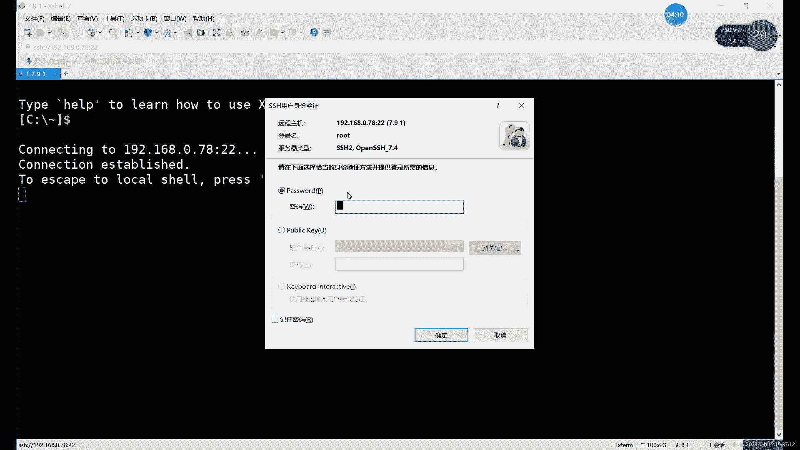

啊，主件我们已经有了对吧？主件已经有了。就是那个叫主建的表格，就是那个叫主建的表格，就是我们的主件。做ts对吧？我们已经有主件了。主建这个表格的话，我们可以来看一下它目前的一个。形式啊目前长什么样？

组建。首先这里的话我们是用了两有两列对吧？有两列，一列是ID一列是nameID这一列呢我们设置成什么呢？设置成主件了，对吧？那我们做外件的话，就是基于哪个呢？基于它来做。基于这个主件来做，哎。

就是把这个表呢哎当成我们的这个主表了。然后呢，外建的话，当然我们现在还没有创建啊，没有创建啊，我们就创建一个吧啊，创建一个。gat table。KBLE。创建一个外键，我们就叫外键嘛。啊，叫外件的表格。

然后表格当中呢。现场还是去写你的这个ID也好啊，对吧？name也好啊，这些东西可以。正常写啊正常写。对吧还可以写其他的一些像年龄呀，对吧？性别呀，你别是学什么都可以。这个表格的话，自己随意创建就行啊。

随意创建。就比如我们创建那么一个表格。对吧其他约束我们都是加在哪。就比如说IDNT后边我们会加一些什么，会加这种像primary呀，not no呀，对吧？

un啊这些约束可以直接加在后边外件的话稍微特殊一点。它这个呢我们一般加在哪，一般加在最后。哎，就是你所有字段都写完之后呢，我们再加外件。😊，哎，再去加外界，那这个外界。就比如说这个。

这里我们可以直接在就是写完所有的列之后呢，在最后写上我们的就开始创建外件啊，这个的话相当于创建外件的步骤。啊，constrain，然后呢后边加上我们的。先给外界起个名字。啊，首先我们是先写外界的名字啊。

格式的话呢我们可以给大家看一下。

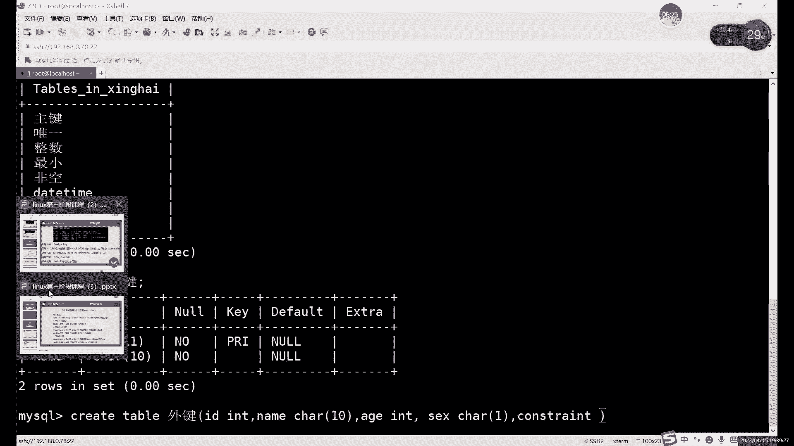

格式的话就是这个。啊。

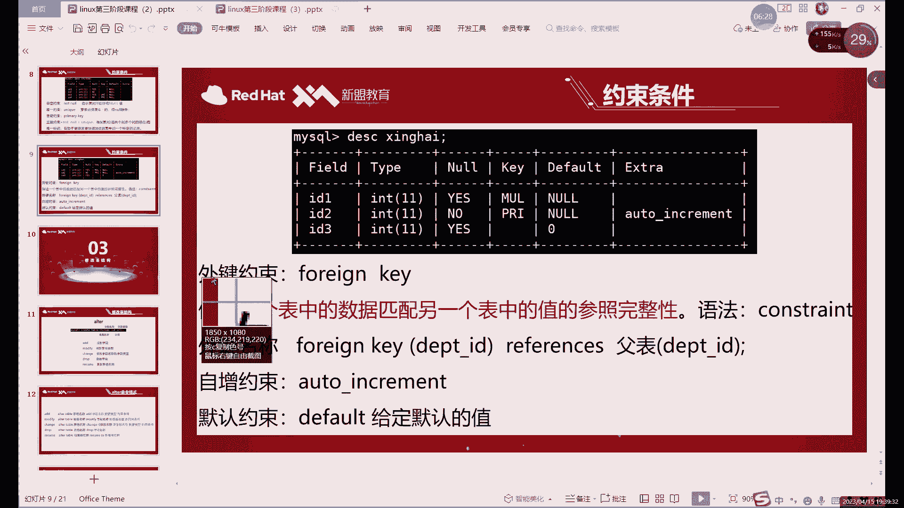

这就是外间约束。这个格式首先呢先写什么，先写外界名称，这个名字的话，你随意随随随意定就行啊，这个名字没有什么特殊规范。啊，一般情况下呢，你可以写一下这个外键的作用啊，它是干什么的？

或者说它具体连接的是哪两个表格，对吧？我们这里其实就是连接的主件和外键。嗯，就比如说当然呢我们这个这一列啊，或者说这个外件呢，它的作用是连接哪个呢？比如说因为组件的话，我们的ID这个。

所以说能我们也不能连name。啊，这个外键的话只能连主键啊，就是其他的这个其他的链呢它不能用。不能用啊，就只能用只能连接。是主建的这一列。嗯。然后呢，这里呢我们就是一个。比如说我们随便起个名字吧，这叫。

😊，ID2个ID嘛，对吧？2个ID的一个组件和外件的关系。啊，唯一加飞空的话，对吧？我们这里是个飞空，唯一加飞空它是主键，不是外线，是主键。主键是为一家背控，外键的话。外键它里面的数据其实是根据谁变的。

是跟着主件走。哎，设置好主件之后，其实跟着主键走。然后我们这里创建的话，你看啊就是conscript，然后加上外界名称。然后后边加上什么呢？就是外界的名字啊，boin king啊。

这句话就是外界的名字啊嗯。然后的话后边加上什么呢？就是我们外建的这个字段。你想给哪个键字段添加外键呢，就需要在这里写。😡，比如说我们这里是。你看上面我们用ID这一列的话。

那我们相当于下边最好也绑定什么呢？主件外接你绑定的时候一定要是什么呢？一定要保证你这里边的数据啊是同一类型的啊，不是说数据一定要相同，而是你数据要同一类型的东西。哎，就比如说如果你一个组件是。

你的主键是ID对吧？你的外键是name这行行，那不行，为什么呢？一个是数字，一个是字符。😡，啊，你在什么呢？你在这个。这相当于是增该叫。你在这个数据类型上其实不一样。啊，那你能跟着那个表一起更新吗？

肯定不行，对吧？因为字符和数值这两种是不同的什么？不同的数据类型。啊，你如果插入这个插入数据的时候，它就会报错啊。你如果像字符里面直接插入数据的话，是会报错的。

所以说呢我们外件和主键之间啊一定要注意什么呢？一定要注意这个字段的数据类型必须要一致啊，数据类型一定要一样。这个类型就是这一位就是type这里一定要一样啊，不一样肯定是不行的。好吧。

一定要注意这个就是主键和外键之间呢。主键和外件之间呢一定要注意这个就是类型的一致性啊一致性，这是一个提间的限制条件啊限制条件。然后呢，接下来的话这个I就是这个外键这里呢，我们是限限制哪个呢？

我们就写这个ID吧啊，就写这个ID括号里面写什么括号里面写这个外件的一个字段。😊，把写外形的字段，然后呢后边写上这个这个也是固定的。啊。最后跟什么呢？最后跟上我们的副表。哎，最后跟副表。

副表的话我们是怎么呢？不表的话就是这个。我们名字叫什么？我们名名字叫主件，对吧？这就是副表的名字。然后主件的括号后面的话我们加什么呢？啊，后边加上这个。关联的主件的这个ID啊关联的主件的这个字段啊。

当然我们字段的名字是一样，所以说相当于什么呢？就是这个命令总体上来说呢。😊，需要改的地方就是主件和外间这里啊主件和外间这里后边呢是主件。所在的表格啊，当然不是说写主件啊，我们因为表格的名字就是要主件。

后边呢写是写的是主建这个表格的一个名称，加上这个主件的字段。前面写什么？前面写外件这个字段啊，前面写外件的字段，然后外件的这个表格名称就不用写了。因为我们本身这个表格呢，它就是我们当前的。

我们因为我们的外件就是创建在当前表格的。所以说呢本表的这个。名字不用写啊，只需要在里面需要注意一下这个主件的表格名称，加上主件的哎，需要指定的主件的一个字段。就可以了。

这个是需要就是创建外件的时候需要注意的。哎，创建外件的时候需要注意的。然后呢，这里的话我们这个。这个就是正常的创建这个外件的一个步骤。当然主件和外键呢。我刚才也说了啊。组建创建之后呢。

主件一旦更新这个数据，有外件就要跟着改。啊，但是呢跟着改的话也需要写什么呢？还要需要再写两个。限制的条件。比如说什么呀？就是这个。在需要还需要在后面继续加啊on update。嗯。

capcade这个什么意思呢？这就是。同步更新的意思。啊，同步更新。当然呢，还有一个什么，还有个删除。哎，这两个的这两句话的作用是什么？就是同步更新和同步删除。哎，就是主件如果说更新了数据。

外键呢跟着一起改。删除的数据呢，外界也跟着一起删。当然呢，我们这个组件和外件之间呢，如果说主件创建数据。外件会创建吗？这个不会这个不会。😡，啊，这个呢因为我们这个组件外件的话。

就只是更新数据以及删除数据的时候可以同步啊。创建数据的话，这个是组件和外件是需要它是单独创建的啊，创建式数据之间是没有关系的啊，就是主件能限制外件的结构层呢更新啊以及删除。啊。

限制更性删除就是这个on update和on delete。啊，这个的话就是。创建正常创建一个外件的一个语句，对吧？比较确实比较长，比前面的这些约束确实很比较长一点。因为前面约束的话。

它无非就是一个是not now，对吧？unic加上primary啊，这个的话就稍微长一些，从这儿到这儿对吧？这么长，这个就需要记一下啊，需要记一下啊，你得多敲几遍了啊，前面的话。

需要注意的就是这个外线的字段。啊，这一段的话是外界的名字啊，这个是可以随随便起的啊，外界名字可以随便起。然后呢，字段这里呢。就是Y先写外键字段，然后呢再写主键字段，也先写外键再建主件。然后呢。

写都写完之后呢，最后还要加一个什么加一个同步更新和同步删除。啊，如果不加的话。我股加其实没有什么意义啊，没有不加的话呢，你这个外件组件之间的话就没办法跟进数据，没法跟新数据的话，其实你做外件没有意义。

所以说呢正常的话这个就是我们正常创建一个什么呢？创建一个。外件的一个语句啊比较长啊，确实比较长。你可来执行一下啊执行一下。还有一个特殊点，其实就是刚才也说了，对吧？外建创建的时候，就是所有字段写完之后。

你再写这个语句啊，你不要插在插在中间其实不太好啊，它的空间不好。然后这里我们创建好之后呢，我们可以来看一下这个新的这个表格啊，它叫什么，它叫外件。😊，啊，他叫外界。外件这个表格呢。

这里的话啊用么用英文的封号，用英文的封号。其他的其实都一样，对吧？其他都一样，主要是什么？主要看这第一第一行对吧？第一行这里呢K这里又不一样了，对吧？MULMUL的话，它这个值代表什么呢？

你暂时把它理解成外电，好吧，暂时理解成外电。你看其实前面这个。唯一信是叫什么？唯一信是unic对吧？UNI然后组件的话是PRI对吧？primary的缩写。然后这当然这个的话。

当然我们现在的话我们也知道对吧？它是个外键啊吧，这一列里面我插进了外键。当然呢它其实它的含义不仅仅是外键啊，外键只是它其实它的一部分含义。啊另一步的话我们后边会介绍啊，后面还会介绍。啊，首先呢看到这个。

如果你这里插入了外键，这里只要显示了MEL说明这个外键至少插入成功了。啊，就要插入成功了。所以说呢这里的话这个就是什么？这个就是外件的一个啊创建。然后验证的话。

其实你就什么就是在两个表之间修改一下数据啊，在两个表之间修改一数据。比如说呢我看一下主件现在有没有数据了，现在应该还没有没有数据。likeing from福建。嗯。啊，有一个外界没有。啊。

外界还没数据啊，不着急，我们可以先在哪儿可以先在insert。我们先往外界里面插一点数据啊。不然的话，没办法验证这个更新删除什么，对吧？我们在这里我们比如说我们写一个。啊，这外件还比较多一点。啊。

不过没关系，ID。name。啊，包括年龄。还有一个性别啊，这里的话是两种有数值，有字符哈。如果懒得区分，那就全加引号啊，懒得区分就全加引号。这里的话因为我们就写了一个是吧嗯。啊，就用英文吧啊。

用英文也行，对吧？这样这样的话我们就里插入看。还有数据统一这里。我们第一个是INTCHARINTCHAR。Y领没有写。插入之后的话呢，正常我们就可以看到什么可以看到数据。就是正常插入的话。

就主件和外间之间是没有关系啊。啊，就是我们主件和外件的话，它限制的不是说写入数据，写入数据都可以自己自由随意写入。我们这个主件和外件主要限制的是什么呢？主要限制的是这个ID。啊，主现在是个ID。

啊的一个更新和删除。因为我们主件外建的话，只是针对于什么？只是针对于这2个ID做的。啊，这个表格里面主那个这个ID话，它是什么？它是主键。第二个表格呢，它是什么？它是外键，也就指它是外主件和外件的关系。

其实就是主键这边更新删除，外键就跟着一起动。😡，就比如说呢我们来更新一下啊，更新一个数据。啊，不对，我们更新哪个表格的，更新主件表格当中。好吧，根据主建表的能用数据。阿倍的主件，然后后边加上什么呢？嗯。

ID对吧？我们就更新ID。就把ID改改成2，对我们就稍微改一下ID。啊，改完AD之后呢，我们可以先对吧？主件的话。对吧ID等于一变成A等于2了。那外界呢。外电外外件而且也就跟他一起改了。啊。

快钱要跟你一起噶。这个就是什么？这个就是这个。外加组建的一个。更新的一个就是组件跟着跟组件更新的话啊，外界就跟着一起更新了啊，这就相当于是数据同步。当然这里现在数据还比较少。

如果说数据比较多的情况下的话，整个ID这一列啊，主要只要是组件这边一改啊，那外件就跟着一起动啊，外界就跟着一起改啊，这个就是组件就是外件的作用啊，主要就是做什么做数据同步的啊，做数据同步的。😊，组件。

嗯，这里山的话其实。删的话也一起删了，对吧？大家可以看到删的话也一起删了，因为只有一行数据啊，我们就直接dele的form组件了，对吧？相当于把这个组件一删，哎，这边也是整个没有。啊。

但插入数据这个不影响啊，插入数据我们可以来看一下insert。into组件。关了。比如说还是一吧，一逗号。对吧插入数据的话不影响啊，主键这边就能插入了。哎哎你又删了，我们再插一次。

主键这边插入了外件没有，对吧？外件没有，我们看一下主件吧。哎，组件有啊，也就是插入数据的话，这个是不影响的啊。主件外件之间做的数据同步呢，它只做什么？只做更新和删除的数据同步。啊。

外件不能更新数据啊外件不能更新数据。这个是主件和外件的一个关系嘛。主件外件的话。当然了它单数据或者跟新数据，它是看的是什么？看它看的是ID一样不一样。什么意思呢？就是那如果说主件I8主键这里的话。

添加ID是一，外键的ID是2。如果ID不一样的话，你修改，那是不会变的啊，那肯定是不会变的。😡，这个是看什么呢？这主要是看两个数据之间的一个同步嘛啊两个数据间同步。刚才我们其实插入数据比较少啊。

插入数据比较少。主件和外件之间呢，其实就是就是你就就理解成什么，就理解成这个。软链接啊，就唯一不同的就是。软链接这里的话，软链接的一个文件的话，里面你怎么修改肯定都会跟着一起走啊。

只不过呢外件和组件的一个区别呢，就是和外和软链接的区别就是主件呢只有更新和删除的时候呢，才会影响到外件啊，其他的时候不会啊。然后外件的话一旦设置的话，外件就不能再改数据了啊，它只能插入数据啊。

它只能插入数据。Okay。对吧所以哇你问了好多啊，问了好多。啊，外件的话外键是不能更新的，一定要记住，就是直接不用记。你随便更新一下，你就知道了，它就会报错啊，他会直接会报错。然后呢，插入数据的时候呢。

哎只有两个数据，就主件和外件当中啊，数据相同的，它会它都有影响。如果说你两个表格里面数据都完全不一样，那会影响吗？它不会影响。啊，它不会影响，有两个表格是主件和外件之间呢。

它并不是说数据得一定要保持一致啊，不是的，因为什么？因为插入数据我们之间是不影响的。啊，超售数据不影响，只有什么？只有在更新的时候。啊，就是在更新组件的时候，外键才会跟着一起更新，对吧？然后呢。

这个啊还有什么问题？唯一加非空啊，唯一加非空就是主件。啊，直接创建组件和设置对。飞空加V一是一样的啊非空加V一是一样。没有区别的话没有区别。这个非公价个一就是就是两加起来，它就是变，好吧。

主键影响的是外线，对吧？你怎么删外线，其实不不影响啊，怎么删外键，它不会影响主键的。🤧啊嗯。主键的话，它始终是一个独立的表啊，它和外件没有任么联系啊，是外键啊，你可以这么理解。

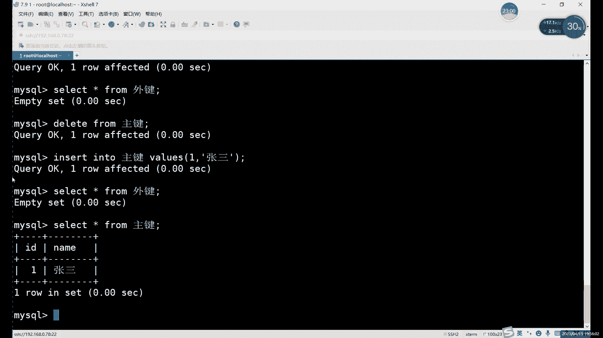

我们主件的话主建的表的话，它是一个独立的表。而外键如果说创建之后呢，它相当于是它自己。啊，它就类似于什么？类似于这个附表啊，它就是组建的一个主建那个表的副表。啊，也就是你外件怎么变。

它不会影响到主件的啊，它不会影响到主件。啊，这个就是组件和外件之间的区别。哎，主件的话，你相当于是它就是一个完全独立的一个东西。即使设计了外键啊，它外键跟主件一点关系都没有啊，大家就记住。

就是外键和主键一点关系都没有啊，永远都是主键变，外键变，外键跟着变，外件是永远不会影响到主键的，好吧。😡，因记住这个就行。然后这里的话我们可以来接下来继续看一下这个。自增约束啊，大家看下一个约束了。

你创建不了表。创建不了表的话，肯定是什么？肯定是你创建表格的时候格式有啊，虽然说我看不到，但应该是你格式出问题。应该是格式出问题。啊，你看一下哪儿的语法有错，他报错在哪呢？

你就看一下附近哪少了什么符号啊，对吧？用了什么中文的符号啊什么。你不行，把把报错截把报错直接复制出来也行。截图怎么说呢？腾讯会议以为还是问题还是很大。我们这里现在都用的都是文讯会议VIP的这个号。

然后可VIP的号啊，没有切换库呀。对吧n with就是没有前换互嘛。大家注意在创建表或者对表进行操作的时候，你定要在某一个数据库当中。啊。就比如说你想你你就得切换到你自己的那个数据库里面，对吧？

你之前不是咱们不是创建了数据库嘛，对吧？统一都创建了自己的数据库啊，你切换到自己数据库里面再去创建表，好吧。然后呢，我们接下来继续。哎，继续这个自增约束。自增约束的话，它是最后一个啊。

默认约束是这一个啊，只是先先先先说啥都行啊，都一样。😊，没什么太大区别。自动月数呢它是一个自动增长的意思。那自动增长它涨的是什么？😡，他只能找数字，他就可以强调了。

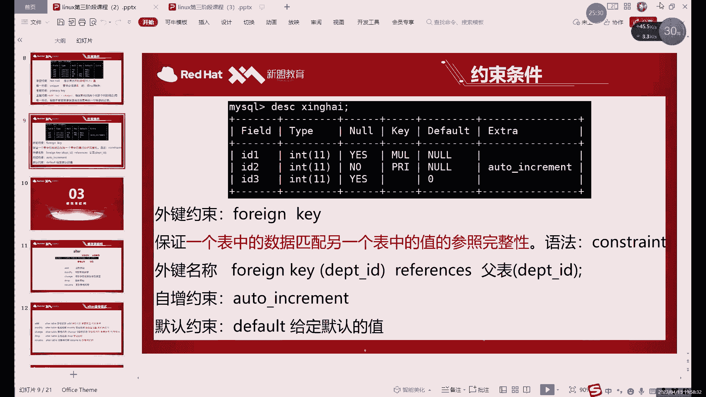

啊，如果你是自符的话。对吧比如说你的CHAR的。😡，或者是VR的那种，对吧？这些字符的话，它不能增长，对吧？你比如说你原来是ABC对吧？能不能它自动增长DEF呢？它不行啊，因为自动增长的话。

这个AUTO对吧？AUTO自动增长的。啊，equment它只能长长什么呢？它只能只。你今天这个平翘小一点不分，它只能增长。数字啊数字。就比如说呢。😡，我们看一下。当然这里没有嗯。我们直接来吧。

直接给大家演示吧。啊，自动增增长数字是什么什么概念啊？也得就是嗯你比如说刚之前我们不是一直是ID嘛，对吧？ID这种列。😡，啊，这种列的话才能设置什么呢？设置这种自动增长来这种约束这个约束的话。

它其实呢这种规则它比较特殊，为什么比较特殊呢？就是在我们一旦执行之后。哎，或者说是设置好之后呢，以后就不用再也不用咱们管啊，哎，就基本上不需要我们去管。😡，啊，它就会自动自动运行啊自动运行。

这个自动增长还是比较好用的。什么意思呢？比如说你像现在我们ID是一，对吧？正常情况下，我们一般ID都是按按着往下排，对不对？😡，对你不管说你这个ID是学号也好啊，对吧？学号你也可以跟着往下排，对吧？

按照顺序排对吧？或者说是你的工号啊。对吧这些东西都可以一个一往下排下去，对吧？都能排下去。那这种ID的话，其实就如果说你的列里边有这种形式啊，或者说这种属性的这种列。啊，这种ID号的列。

我们就可以什么呢？其实就可以完全不用人为的去管。啊，不需要我们自己去管。可以设置一个什么？就设置一个自动约束。就在每次我们插入数据的时候呢，它会自动增长一个。就比如说我们第一次插入数据，它是一。

第二次插入动，它就变成2了。第三次呢就是345就往下排了，这里就是自动约束的作用啊，具体的话我们还得什么呢？其实还得来演示一下，自己看看效果。好吧，那自增的意思就是我们我们插入数据。

它那边自动给我们填写，相当于是。😊，自动填充对吧？这个自动增长的话，其实就它有自动填充的作用啊，自动填充的作用。好，我们这里就直接insert into。你字0土，我们看一下。哎不是你的一可以啥。

我们因为表格哈，我们创建个表格吧，先。😊，there e a t 啊 create table。我们表个名字就要自证吧啊就要自证。比如说呢我们把这个create table自增这里。写一个什么呢？

我们就ID吧，就用ID啊，因为一般情况下呢，它能自动增长的，按照顺序走的它就只有ID这种列，其他的话基本上很少啊很少会有其他的列用到自动啊。自动页数的话，一般就是ID这种列。对吧，比如说呢我们写一个。

IDity。哎，我可以哎，对，打的还挺快啊。😊，如果这样创建行不行呢啊，如果说我们只创建一列啊，不行，不能只创建一列。啊，大家注意啊，你如果说想那个什么不能只创建一列哈啊，你预习了预习了它也不对呀。😊。

啊，我们不能只上面一例，还得再加啊，还得加。😊，name对吧name。为什么不能只剩下一列呢？因为它自能约束吧。你如果只是创建一列的话。😡，怎么说呢？他没法没办法自动填充，什么意思呢？就是。😡。

比如说像这个表格。啊，我们是在插入名字的时候，比如插入张三，他会给你填个一对吧？插入里四呢，他会给你填个2，这个叫自动自动增长。嗯，或者说这个就是这个。准确的说是这个叫。

自动填充的意思啊自动填充的作用对吧？啊，所以说一不能有不能只有一列哈，不能只有一列。那这样行不行呢？啊，这样的话其实啊两列行不行呢？就两列至少还够。但是呢啊你这样创建表格的话，像INTIDINT。😊。

啊，他会报错。为什么会报错呢？😡，因为啊它这里报了什么，你可以翻译一下就错啊，就是我们什么呢？这个自增约束这一列呢必须要有什么？必须要有一个。其他的约束来帮忙。啊，这准确的说的话，叫什么叫K。

这是哪一列呢？对于。啊，就是意思是必须要有硬K。什么意思呢？啊？其实K的话这里的话我们就是两个哪两个呢？唯一性的约束和主件约束。为什么需要这两个呢？大家可以。😡，思考一下啊，为什么我们自动约束。

我们自动填充，为什么需要这个唯一性啊，或者说主件呢？其实很简单，因为你如果说没有主件，就是你如果说这一列呢可以重复，对吧？那你就没办法就一个一个往下走了，对吧？只有在这一列呢一定要有唯一性。

或者说有个主件的时候。比如说呢我们就写主件吧。啊，必须要有主件或者说唯一约束的时候。你的数字它不会重复，对吧？数字都不会重复的话，就只能就是它就只能往下排了。1234那填充，对吧？

所以说呢这里的话一定要加什么？一定要加一个约束。啊，唯一性和主件质量都可以啊，质量都是可以的。你不用担心是否飞空啊，为什么这里这个主件和唯性都能用呢？就是它和飞空没什么关系啊，就跟now没有什么关系。

为什么呢？因为它会自动填充，它就是它怎么都不会是空着的。啊，就是你怎么填怎么写都不会空。所以说呢这个非空约数是无所谓的，所以说呢也能写unic，也能写主件primmatic都可以啊都可以。

我们这样先创建。对吧DSC呢我们来看一下这个自针。打什么样啊。啊，他就会在这个扩展这里呢写上一个aler increment哎，这个自增约束。然后呢，它前面还有他前面还有什么，还有这个主件。

当然你写这个unicode也行啊，写unic扣也可以。有创建的时候，创建unic也是可以的。啊，允许。然后呢，你怎么去添加呢？就很简单，就是insert in的时候。像自登这个表格里。怎么加呢？

我们就执行那个就行，哎，就不用管ID了。😡，啊，有了自动页束呢，我们就插入数据就会等如说能节省。节省一列的内容，就是有一列的话，我们就永远就不用管。比如说Iname对吧？name对是。带引号啊带引号。

哎，差不多张三，然后呢，我们可以来看一下。啊，slect in from什么呢？就等。主它是一张单。对了再插入一个张三行不行呢啊，再插入几个也行。因为呢张三这一列的话，没有什没有这个。😡。

这个叫什么没有这个唯一区约束，所以说插几个都可以。但是呢前面就不一样。就你不管你后边插的是什么，它不会影响到前面的这个自灯，就是123就永远一直往下一直加下去了。哎，这个就是什么？这个就是。

自增的一个特点。啊，或者自动约素的一个作用吧。就是只要你这一列设置了自动约束，你后边的话就插入任何数据就不用管它了。诶就不用不用管了。你后边你不管插要是什么。😡，啊，后边内容就不重要了。

只要你插入了数据，他在会会在第一类里面给你补上什么呢？会给我们补上这个自灯。啊，自的东西。默认的话都是从一开始的啊，默认从一开始增长一个啊，当然这个增长量啊，或者说呢默认的这个值是可以改的对吧？

就比如说这里的话，默认它就是123的往4往上加。啊，6X往下加。如果说呢你如果想改的话，就可以改。啊，我设置这个的话，其实。啊，其实没什么意义啊其实没什么意义，因为什么呢？😊，自动增长。

如果说你把一改成2，对吧？它就是2468这么涨，对吧？一般2468这么涨的也比较少，基本上ID的话基本上就是123456112561234567。啊，这个可以改，怎么改呢？啊，大家知道就行。

一般很少改啊。就是改什么？就是改这个。这个我们先看一下啊，先看一下啊，就outer inement有这么一个。有这么两个吧，总先来说叫两个。啊，它这里不止一个选项，它这里是两个选项。

然后两个呢就是自动增长。啊，这一个。初始值啊，这个of that是初始值啊，就是从一开始的。然后呢，上面这个是每次自动增增长的数字。就是这里协议的话就每次增长1。啊，你如果说想要改的话。

就是改这两个东西。啊，下面这个是初始值啊下面是初始值哎，比如初始值的话，你就用set命令就可以设置。啊，直接直接set。它等于多少就行了，这个也一样。你s这个值，就是每次如果改成二的话。

它就相当于就是它就1357都没这么去写了。啊，这两个的话准确来说呢。呃，改的比较少，因为自增的话，一般情况下呢都是1234567嘛，这样增长肯定是最最合理的对吧？你跳着走。

一般很少见啊一般很少有这种情况出现。然后这个的话就是这个自能约束啊，自能约束这里的一个特点。

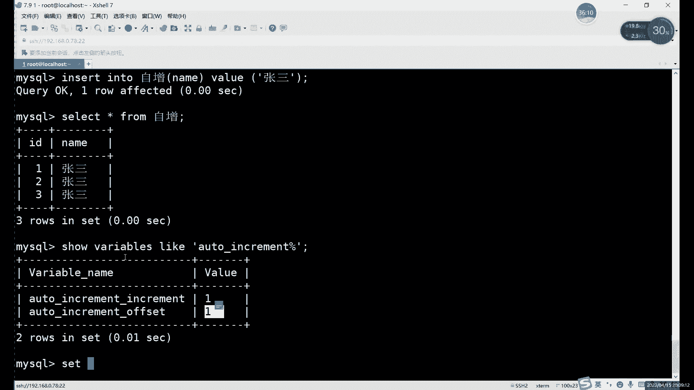

啊，就是第就是我们1231234第四个这里啊，第四里的自尊。自动约束说完的话，我们下一个是什么？下一个是默认约束哎，默认约束默认约束这里的话，这个之前其实我们。

稍微提到过一点，对吧？你看默认那里它写的是一个n空值啊，大家可看这个图片一表格，怎么那这里写了个空值。为什么它是空值呢？😡，啊，就这他们因为这相当于什么？这个就相当于一个默认的。就如果你不填的话，对吧？

我们之前都遇到过几次了，对吧？我们就是用iner插入的时候，如果说我们只插入一部分数据的话，那其他数据它会默认显示一个n空制。啊，控制的话其实不算什么数据啊，控制其实不算什么数据啊。

它就是默认填的了一个。因为它存它存储的时候啊，你存一列它我们存储就是一列一列去。啊，你中间不能有空，所以说它这得相当于是暂时用什么，暂时用no来补上了。啊先那这用那来补上。所以说呢这个默认呢就所有的列。

它默认都有一个默认值就是n。啊，但是呢如果说我们想要调用这个默认约束的话，肯定要改默认值。啊，改这默认值改默认值的话。😡，啊，就每一列每一列它都有默认值啊，就是你每一列其实都可以设置默认的。啊。

一旦设置了默认的话，它会有个什么效果呢？它会有个自增一样的效果。就是在你不填的时候。😡，啊，在不写那一列值的时候，会进应自动填充。啊这个deport和就是和我们自动约束和默认约束，这两个约束的话。

就是相当于它俩其实都是自动填充的作用啊，都是自动填充的作用。四张这边是相当于它是按照顺序12345动走。而默认呢它是什么？它就是一个值啊，默认它永远都是一个值。怎么设置呢？啊。

就是在添加我们在添加字段的时候。哎，我们在添加字段的时候。那添字段的时候呢，我们可以直接用set命令啊，同样的这里其实我们也是set命令，对吧？也是set命令。😊，比如说呢之前对吧在的这个初始值是吧？

如果说。相当于零的话。对吧我们可以来看一下，对吧？嗯，为什么它系统这里设置的什么呢？我看一下这个。对吧他有效果吗？他没效果。那改个二行不行呢？啊，改2它就变了。什么意思呢？就是不支持零啊。

默认是不支持零的，就是基本上大部分数据库啊，它的自动约束的数始值它都不能设置成0啊，它都不能设置成0，默认值都是一，这最低呢只能是一。啊，这里指的是一。啊，所以说的话我们这个需要注意啊。

这个也是需要注意一点。不过一般的话不会改，一般都是不会改这22。5。对吧他默认最低是一。A。然后呢。接下来的话我们说一下这个智能啊，不是不是是默认啊，默认它也是s命令。对吧也是用他需要用到他的命令。啊。

在的话其实就是设置的意思。啊，在min里面s我们一般都是设置的意思，就是尤其像马ell里面，它有很多这些规则呀，有一些默认的规则，就像这个这个它其实就算是一个规则。啊，设置规则的时候呢。

包括不知道还记不记得我们设置密码的时候也用的是这个命，对吧？te password。😡，也是用设置，就是修改我们mysrcle里边那些默认设置的时候。都用什么？都用。那个。再重一就行。

就修改我们买车当中的设置。I就 reset me。然后在命令这里呢，比如说我们在一个。这是一个什么呢？这的一个。默认值啊，当案设置默认值的时候呢，我们还是创建一个表格吧啊创建个表格吧。😡，还妹啊。

I d and。这里的话我们写一个什么么？写一个比较适合默认值的是什么列呢？一般就是这种力。情况比较少。啊，情况比较少的情况，什么意思呢？咱应该认得这个单词吧，sex这个单词。啊。我设置什么列？

我设置了一个叫性别的列。ID这种列或者name这种列能不能设置默认值呢？没有，我刚才忘记。忘记设置了哈。啊，这里我们就先不用修改的命令。基0里面还没有这些讲，我们就直接再重新创建一下啊。还没有创建。

反正直接回车了啊，这个呢里边的话就比较适合你看ID的话内容。默认值合适吗？其实不合适，为什么呢？ID一直在变，那你即使不设置自动约束，对吧？ID你即使不设置自动约束，那么肯定1234567，对吧？啊。

或者说你从从哪开始都行。啊内幕这里呢。还有名字对吧？名字哪有默认字说，对吧？哪有默认的这个问题。所以说呢这个。这些都不合适，那什么最合适呢？性别是其中一个。比较合适这个。默认约束。而这个默认约束呢嗯。

一般情况下啊，这个默认约数。最好就设置一个啊这一列里边出现频率最高的一个。啊，就这一列里边哪个数据出现频率最高呢？啊，就比如说这得看什么情况啊，性别这里对你看情况设置。啊，看情况设计。比如说嗯。

如果这个表格我们是怎么呢？我们是。哎，咱们的学员信息表。哎，这样的话好好好说一点啊。如果是咱们这个学员信息表的话，在这里这个性别这里好设置一下默认值啊，还是好设置默认值的。就比如说我们直接写什么呢？

Deport。啊，这设置一个默认值。嗯，比如说。我们这里可以设置一个。这引号不太对。啊，没问题。默认值。哎，比如说我们是学员信息表啊，就当然是咱们机构的学员信息表，是吧？男男男同学应该更多一点，对吧？

男是应该更多一点。那这个的话就是什么？这个就是默认。啊，设置一个默认值啊，当然这里倒不用s，不不需要，直接用写散。如果是设置一个默认值。这个默认值呢。那设置有什么作用呢？我们可以直接执行吧，直接执行。

直接看一下，看一下这个DIC大家就知道什么意思了。DIC。默认。对吧这下就很明显了嘛。默认值的作用呢，其实就是反道给改了。这里如果什么都不写的话，就是你正常设置一个字段，什么都不写。

它会给我默认补一个not是默认值。😡，有控制。那如果说你写改了的话，这就它有值了呗啊，有值了。有觉得自然在插入数据的时候就很方便。你色0库。我们呢啊，我们想默认这个插入点数据。比如说IDname。

或者我们先只插入个ID就看看效果啊，就看还有个ID吧先。就比如我们插入一啊，没问题，他没有过错。然后呢，我们来看一下lelashing from默认。啊，这就是默设置默认值的一个作用。啊。

是的默认制的作。ID。是一对吧？我们插只插入一，然后呢，name这里我没有写是吧，他们本然是空了。😡，第3个性别，我们写了个男，他就补了个男。啊，也是自动填充，就和相当和自动一样，它作用都是自动填充。

就是你不写的话，默认都是呢。啊，而且呢他这也不用写，跟这个飞空是不是飞空形式无关。哎，是不是非空其实无关，因为什么？因为有了默认值之后呢。你就是你不写的话，他就默认是这个。😡，啊。飞空设置的是什么？

飞空针对的是它。他就叫空。啊，他就是空。所以说呢。这什呢？背空其实就是哎。默认值如果是空的情况下呢，不插入数据，它就会爆错啊。如果默认值它是其他的，你换了默认值了，其实飞飞空的其实就不重要啊。

飞空其实就不重要。啊，这个的话就是什么？这个就是。我们这个。默认元素的作用。当然呢啊你正常我们正常插入的话，肯定如果是ID name啊，这边就写ID name，对吧？value的话。呢度下。

张三对把这张这样写。啊，如果说。对吧我们这里默认是的。😡，吧默认他又是男的。但是呢肯定有例外啊，我知道肯定有例外。如果是想要把性别化成你怎么办呢？很简单。对下表格插入的时候呢，你们写全就行。

对吧这算就行。呃这个啊我看啊。嗯腰的吧，对。啊他就正常。哎，就是什么？就是默认约束呢？它是在你不写的情况下默认填充的。如果说你要写啊，不管说你写的是什么。😡，你这里写南行不行行也行。啊，显然也可以。

不写也行，不写的话就是不写的话就按按默认值走。写了的话就优先什么呢？优先。😡，你写的纸。哎，所以说默认值它并不是说你设置之后它也不变了啊，只是在你不写的时候，它永远是固定的那个。哎，不写的话。

就是默认都是男啊，你写了的话就写什么是什么。😡，对吧反那如果说你写一个。不写男不写女行不行了也行。对吧那那就属于什么？那就第三种了呗，对吧？那是属于第三种。也可以。🤧啊。这个是默认值的一个作用啊。

它并不是说你设置这后台图不能变。😡，啊，一定要注意啊，就设默认值它只是什么？只是在只是提供一个自动填充的一个作用，而不是设之后就一成不变。哎，这个就是这个默认值的作用。或者说可以叫默认约束啊。

叫他默认约束吧。

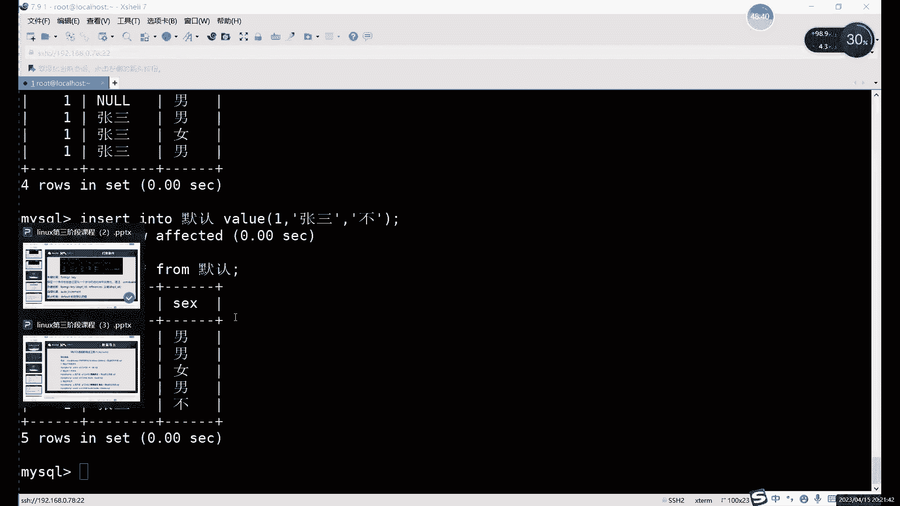

总之它两个都是什么？都是自动填充哎，就是自动填充的意思。它俩都是自动填充空数据。不一样的是自增这边填的是什么呢？填的是数字，而且是自动增长的。默认这边的话就数字啊、字符啊什么都能加，但是呢它不会变，啊。

这是参与一成不变的一个它是固定的一个东西。啊，固定的一个数据。啊，这是它俩的区别啊，相同点的都是这种填充的作用。那不同的就是填充的对象不一样。啊，这个的话就是我们的一共6个约束啊。

6个约数这6个约数的话。你后呢灵活使用。因为什么？因为它们的一每个的功能不一样啊，那么功能其实就不一样。所以说呢你在设置字段的时候呢，有有设置约束的时候，一定要看，就根据字段的一个需求来。

因为你一旦设置了约束啊，你如果说不允，如果违背这个约束的话，你插额数据是会报错的。哎，所以说呢一定要确保什么确保你的约束呢合理。就比如说。内幕字段能不能设置唯一性？就是姓名这个姓名这一点能不能设置为一。

能不能设主键呢？啊不能。是吧这一列肯定是不能设置这个唯一性的对吧？有很多列都是不能设置这个唯一性组变的。对吧只有什么？只有是。哎，只有那些百分百确定肯定不会重复的东西了，才能试的这两种。要不然的话。

你如果说你换个姓名，对吧？这是个唯一约组件，你想插出去都插不进去，对吧？碰到一个同名的对吧？同名同姓的名字都插不进去，对吧？那你这个就是。肯定是不合理的对吧？肯定是不合理的。所以说呢一定要注意。

尤其像这个唯一组件是最需要注意的。啊，飞空其实这个所有字段呢都可以设置飞空。啊，所有字段都可以实为空，但唯一和主件的话就。我说了。有一修个主件这边一定要注意啊，不能随便写啊，唯一个主件可不能随便设计。

啊，像外线的话，外线这个其实它它都不属于我们呃它都它这个其实已经不属于一个表格了，它这相当于是两个表格。一旦设置外件的话，它已就涉及到了两个表格。啊，这个外线这里设置的话。

唯一需要注意的就是啊主件和外件的数据类型一定要一致就行了啊，就是说注意这个。其他的没有什么太多限制，然后自动月默认的话。默认呢就是设置一些。比如说某个值比较固定的情况啊。

某个值比较固定的情况下可以设置默认自增的话就是什么？自增就是。哎，自增其实最条件最苛刻的一个，它比唯一性和它比唯一系约束和组件约束还要条件更苛刻。因为你唯一性组件的话，它只是不重复嘛。啊。

自增的话不仅不重复，而且还要按顺序走。而且还是必须得是数字啊，而且默认还是从一开始的。所以说这个自增的受受众对象啊，就设置自增的对象呢，就只有一列就是ID类型的啊ID号类型的这种。编号吧啊编号。

这个话就是几种约束条件啊几种约束条件啊，我么说完这个约束条件呢，对吧？上节课我们也说了什么，也讲了这个上节课我们主要讲的是这个。注意类型对吧？包括前几个约束。这节课我们把这三个约束又说完之后呢。

我们就能说什么呢？哎，就终于到了我们这个aler面。啊，终于把这个奥特命补上了。第out命令不是我们这个。第一节课对吧？第一节课我们在。这个部分啊没有说的。

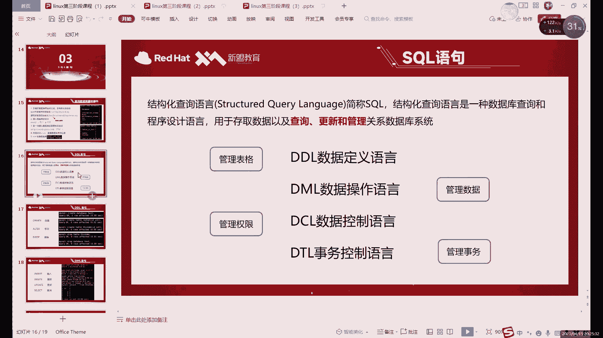

就是我们的DDL数据定义语言这里。创建修改我们都说了呃，创建删除都说了。aler命令呢，你们之前就只是改了一个什么，只是改了一个表格的名字。啊，儿童我们还没讲。al头我们就是改了一个表格的名字呀。

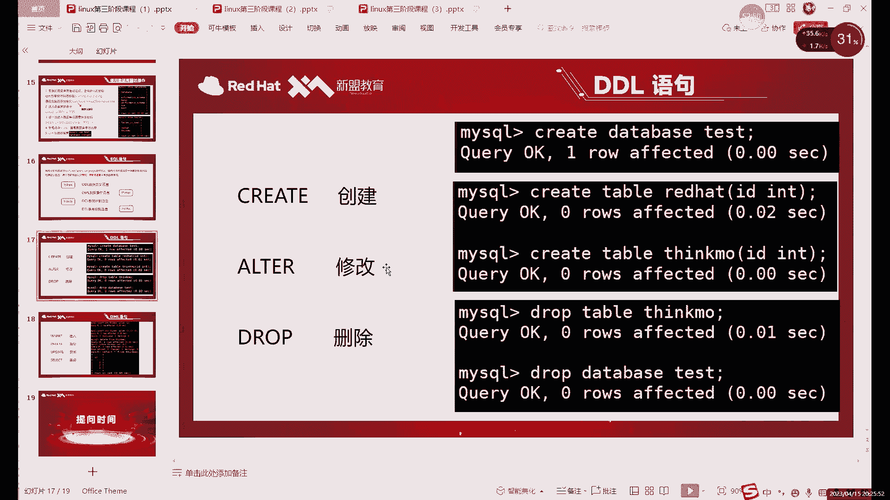

对吧。其他的秘密还没讲。你是已经预习了吧啊已经预习了吧。啊，2乘0我们就只讲了什么，只讲那个rename。前底个都还没说。为什么我这我为什么刚才一直演示我们这个。

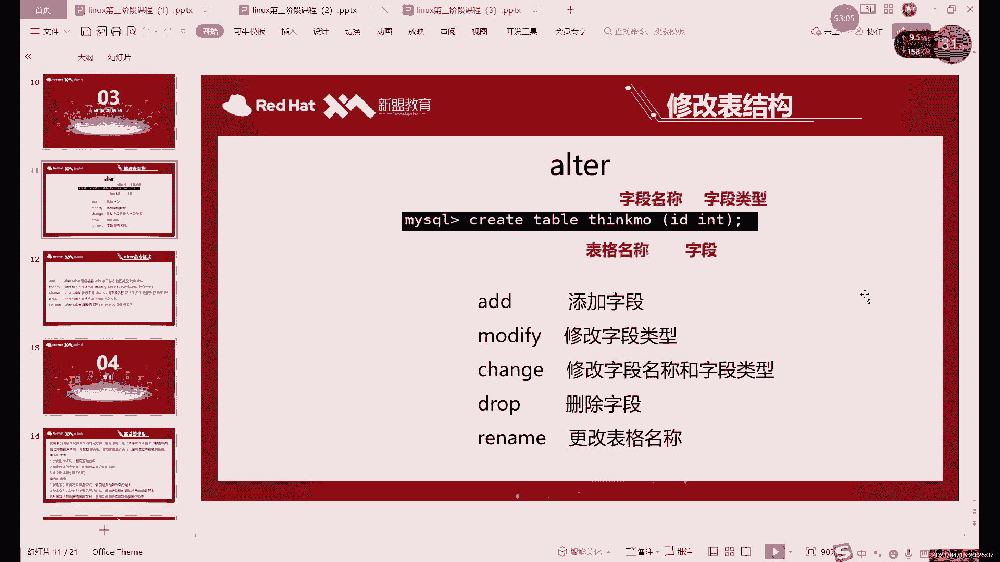

演示这些默认啊，默认和或者说自增的话，我都是一直在什么，一直在一直在重新创建表格。啊，为什么他一直在创建表因就是因为修改没有讲，所以说才一直创建。

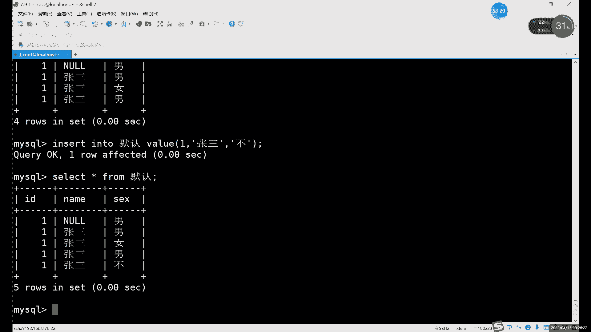

啊，aler命令呢就是我们修改什么呢？修改表格的一个命令。有修改表结构。那库能不能修改呢也行，但是呢aler呢只能改一个库的名字。啊，只能改一库子名字。但是呢。不名字呢不建议改。啊，不建议改。

为什么用改括名字非常麻烦？啊，你不要以为说alerte base。哎，什么什么改一下名字就行了，那不一样啊，不是说因为库和。

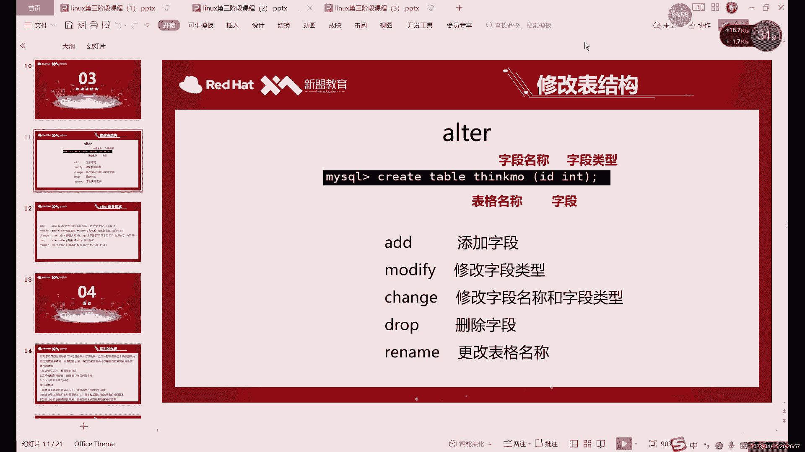