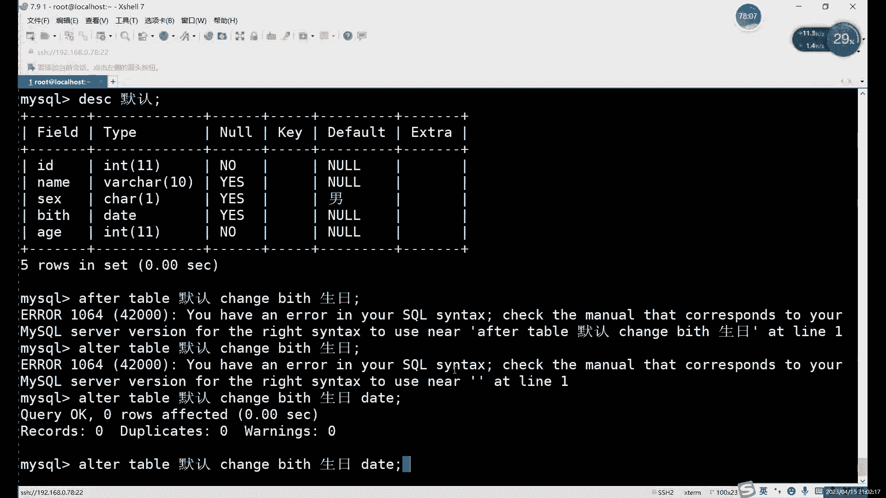
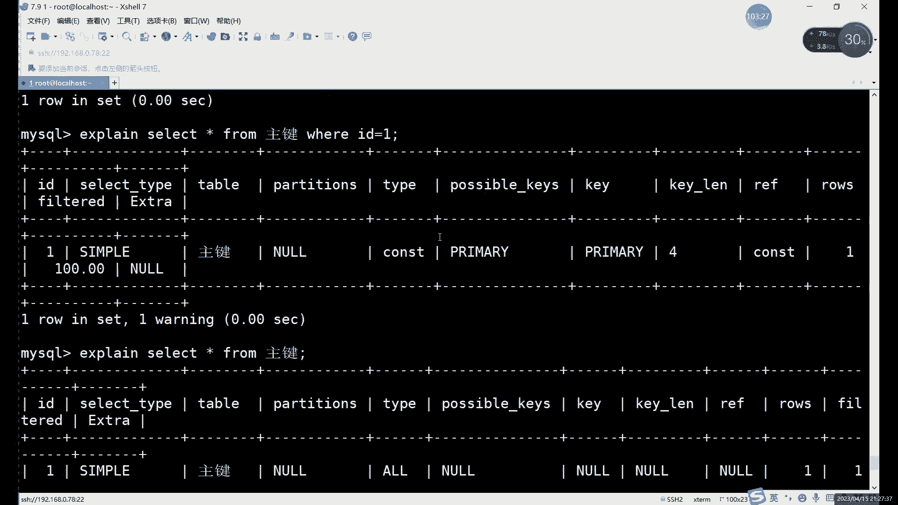

# 零基础入门Linux，红帽认证全套教程！Linux运维工程师的升职加薪宝典！RHCSA+RHCE+中级运维+云计算课程大合集！ - P69：中级运维-8.约束，ALTER命令，索引，SELECT查询 - 广厦千万- - BV1ns4y1r7A2

表示不一样的，表明这之前我们是给大改已经改过了，对吧？内容我是改过的。改表名字的话，其实很简单，就是把。也name不to，哎，改个名字就行了。那不行行那酷不行。为什么？因为扩涉及到的东西太多了。

每一个表格呢，它的名字它的完整名字其实都是什么呢？都是。

库点表。就比如说我之前不是在当前当前我们是在哪，是在这个数据库，对吧？沿海对吧，这个数据库里。如果说在在这个在这个数据库想要看其他数据库的一些表格，可供以啊是可以的对吧？我们最开始是看过一个什么呢？

看过一个叫嗯my circlel的表格啊myrl库，然后里面有user表，对吧？这种我们用户的权限表没毛病，对吧？那这个表。有个什么问题呢啊。他的问题就是。我们每次要看的时候呢，一定要加上什么呢？

这个是库名字，点后边是表名字，也就是跨表查看，就是跨库查看的时候呢，可以看，都必须要加上这个完整的名字。那这个呢其实才是我们这个表格的一个完整名字。也就是每个表格呢它完整名字都是库点表啊，库。

固的话基本上都是固定的对吧？固点表。也就是如果说你想改库子名字的话。你库是改了。但是你那些表都没了。啊，你一旦改过的名字，表的名字就全都没有。就是说库名库的话。怎么说呢？总体上来说呢，不建议大家改啊。

不建议改名字。啊，库名字不建议改。因为这个改起来特别麻烦。你想要改一个库的名字，你意味着你要把所有表格的名字都改了。而且这个就不是什么呢？而且这个也不是那么不是那么简单啊，不是那么简单。改名字。对。

改目录名字可以。但是你改了目录名字。表格里面的名字他改不了。啊就我年你紧啦。所以说aler命令呢，我们一般啊这里也就强调一下啊，不要用aler命令改的改数据库的。

我们只用来改什么？我们只用来改。表格的名字，而且用而且是aler，加上什么，加上rename to啊，这个组合来看啊，这个组合来改。然后呢，除了rename以外呢，其他的修改文们表结构的话。

包括什种包括添加修改和删除。啊，他这个命令的话就是。aler对于表修改的话，其实它并不是说直接用aler来改，而是呢在后边还需要加上其他的一些辅助的一些选项。啊，这几个的话。

这5个都可以理解成aler的一个选项。啊，alt的选项。aler table加上我们的。表名称。后边就可以具体的去改这些内容。啊，能改的是包括什么呢？其实我们创建的表的每一部分都能改。

就比如说看下DE看个DSA命令啊。啊，就这个。我们创建表的时候包括什么？包括字段的名字、字段数据类型、字段的约束。对吧包括这三部分。这三部分的话其实都是什么？都是属于表结构，对吧？

就是默认这个表的表结构out面能改的是什么呢？就是。这些内容他都能改。也就是我们如果说你第一次创建表格的时候呢，创建了一个这这么一个表格，对吧？哎，你创建好之后呢，哎发现这个表格有哪一些地方不太完善。

哎，就比如说呢哎如果说你这个字符限制的宽度太小了，想要改一改行不行呢？可以用什么，用outterine应改。哎，约束设置的不合适了，能不能改呢？也可以用outter应改。😊，想改个名字行不行呢？啊。

想改个字段的名字啊啊，就是改一列的名字，不是说改这个表格名字，是改这些名字行不行？也可以改，还是aler命。哎，总之，alt命的修改呢就是针对于我们整个表格。

啊，在那里整个表格。啊，如果用法的话，就是这几个。啊，这个里就是它的一个具体用法。啊，包括这个添加啊、修改呀，删除这这四种啊，改名字的话，这个rename是改表格名字啊，不是说改字段名字啊。

不是改字段名字。改字段名字是哪个呢？是change这个啊，这是改字段名字。啊，这个就是alom面的一个。一个选项啊一个选项。

啊，如果说大家出现这个RPM安装啊，当然这个仅限于RPM的样码安装，肯定没，不是不是。嗯，样板安装或2RPM安装都会出现这个问题啊。嗯，原码安装无所谓啊。

原码安装我们在默认配置文件里面已已经是设置好了啊，已经设置好了。啊，如果你是样码安装或二RP样码安装的。这乱码问题呢，其实最好其实解决方案很多。首先呢其实我们可以看一个。看一个什么吧，我们看一个。

我们创建表格创建默认吧啊。默认这个表格。啊，cit table默认我们创建有个瘦的话就是查看这我们之前说过了，就是用来查看各种各种各种各种信息的，什么信息都能看，对吧？

比如说我们创建表格信息能不能看也可以开。所我们可以看到这里边有一个什么有个叫deport叉赛UTF8的。啊，这么一个表格。这个名这个表格是什么意思？就比如说它这里这就是默认的什么默认字不及啊。

甚至是UTF8UTF8这的往就不会乱乱码。如果你乱码的话，你这样一看的话，你这里这里一定写的是什么？一定写的是拉丁文的。啊，一定写的是拉丁文的。所以说呢。这里的话。你可以在创建表格的时候改一下啊。

创建表格的时候改一下，或者说什么呢？创建数据库的时候也可以。嗯，就这几个。大家看啊，这个我上面这个是创建表格的这个命令啊，它里边有一个什么，这些都是默认的啊，这些都是默认的啊，就是你在创建表的时候。

它如果什么都不写的话，就默认按照这个写。然后呢，创建库也一样，什么都不写的话，也会加入UT啊，就就也会加字不及。😊，你可以在创建数据库的时候呢，就在后边加上这一段啊，创建表的时候呢也可以加上这一段。

这就这就不会乱了啊。这一段你创建的时候，如果说你需要用到多种字普集的话。😊，这也没必要啊，可以这样设计。啊，不改配置文件的话，可以这样设置。因为你改配置文件打完之后还得重启数据库，对吧？重启数据库。

然后已经创建了也没法变了。啊，已经创建好的数据，就是已经创建好的这些表格呢，它不会变，原来是什么就是什么。啊，就是方法很多啊，你可以随便挑一种。在配置文件里去改的话就是。嗯。哪一个呢是啊啊。这一个吗？

对吧这个的话也就是我们设置这个默认字符集的地方。对吧这个如果你是原码或RPM安装的。也可以修改配文件啊也可以。包包很多哈包了很多。主要它其实就是个自符极的问题啊，自符集的问。好，我们接下来继续啊继续。

aler命令对吧？我们刚才说的aler命令。aler命令的话，首先呢。我们先回到库里遍。过里边现在的默认的这个表格还挺多的啊，默认还表格还很多，你随便改啊，你想改哪个改哪个啊，想改改哪个改哪个。

当然我们这里这里平一般改什么，一般改的是。不是一般改什么，就是。我们不改数据啊，after命令它修改，它修改的辐射数据，它是什么呢？啊，它修改的是表格结构，对吧？啊，包括这一部分这一部分这一部分。

表格的这个名称啊，字段名称啊、字段类型啊、约束啊，整个字段呀都可以改。

怎么改呢？啊，就用outer命令。aler加上什么呢？加上具体的这个表格的名字。啊，加上具体表格的名字。然后后边继续写什么呢？后边继续写这个。al加上什么呢？加上这个表格名称。

然后再继续写什么写我们需要的。啊，不能说需要吧，就是嗯。需要用的功能吧，因为什么呢？因为这个aler这里呢挺多的。还有好多种。比如说添加ADD对吧？修改呢modifychange。单除呢是job。

还有什么呢？还有这个。还有个叫什么来着？rename啊rename。啊，人们大是远兔。啊，一共这么多个。Yeah。B。这些的话都是什么都是用来啊，就是都是相当于都是我们aler的这个选项啊，都是选项。

比如说首先呢我们先用一下这个添加吧，添加的话就添加一整个字段啊啊，添加一整个字段。那其实就是什么？就是添加一列。那就创建好表格之后呢，哎我们想要再增加一些其他的数据，行不行呢？可以，对吧？

那就是添加一列。添加这一列的话，你看啊ID name。那就有可以加个年龄，对吧？想加什么都可以啊，添加后边直接写这个字段的一个名称，然后呢，后边直接跟什么跟数据类型。啊，收集类型必必须的啊。

就是type这一列就是大家可以看，其实就是按照这DESC你跟着写就行。啊，添加。哎，每年领对吧？年后边可以用INT对吧？INT没有什么，不用写什么范围啊，什么整数没有什么范围。啊，不是说没有范围。

就是长度啊，长整数其实不限制长度。所以说呢平时我这个写IT的时候，我括号里面什么都不行，对吧？我最多也就是在CHAR啊，叉的时候或者V叉的时候会写一下这种宽度。啊，你的这个。整数的话就不需要写宽度了。

没必要，直也没什么意义。添加一个年龄对吧？比如说添加一年龄，然后后边如果说要写这个。约束的话，其实嗯怎么说呢？你要找约束的话，你就在得从我们之前讲过的六个里面去找合适的。对吧自得默认行不行呢？

那没什么用。对吧外件行不行呢？你现在没有黏黏的主件，所以说加外件也没有什么意义。那主件可以吗？或者唯一性可以吗？他其实也不对。哎，就放到这里，年龄只能加一个约数，对吧？年龄其实我们这里只能加一个月数。

是什么？就是非空的大家想加什么，想加其他的其实都不能加，因为。加上一来没什么用，二来可能会限制我们，可能还会影响到我们的数据的修改插入什么的。所以一定要这个。设置约束的时候一定要注意啊。

就是一定要设置这个适合我们这一列的约束。啊，你就要去想你设置这个约束有没有用啊，没用，那么就不设置了呗啊，没用就不要设置。啊，只设置有用的，就像这个飞空，对吧？飞空年龄肯定是不能为空的，对不对啊。

你什么呢年龄，你即使是刚出生，对吧？那你年龄其实也有的写，对吧？几个小时几天吧，这些都能写啊，你不能是。有了个空的那。那可能就是已经走了，对吧？已经走了，那写空的。那这个确实没没没毛病啊没毛病啊。

其他正常情况下的话，正常我们年龄都肯定不能为空嘛啊不能为空。啊，这样的话就这个就是添加啊添加字段。当然添加的话就至少是这两个啊，就是约束可以不写，就是你实在是想不到写什么约束好，你可以不写约束啊。

后边也可以去修改啊，并不是说你加完一次以后就固定了啊，约束什么的呀，约束什么的，这就是数据类型什么都可以改的，都可以改。这个只是我们的添加命令啊，就是添加命令。对我们就加了这么一行。那我们是个飞空的。

啊，如果说想修改呢。哎，就用的是切管是有两个。

al的修改选项有两个，一个叫modify，一个是change。modip change这里的话，哎，它这里是什么呢？这两个有什么区别？都是修改，对吧？一个是修改什么，一个是修改字段类型。

另一个是修改什么，另一个是修改字段名称和字段类型。😊，你是什么意思呢？其实嗯总体上来说呢，它的功能。呃，它的功能比它其实少一点啊，它其实比它功能就少一个，就是少改名字啊。

就是modified不能改个名字。然后趁里的话可以改名字哈，可以改名字。所以说这种情况下呢，一般情况就是你改名字的话，你就用chan，不改的话，用蒙 to by。啊，这两个你用下，因钱都可以啊。

哪个都可以。具体用法的话其实就是。后边呢比如mod地，后面加什么加字段名字，然后呢。新的改数据类型也行啊啊，改约束条件也可以。如果是chan的话，这里是就不太一样了。因为涉及到改名字的话。

你要先写什么呢？先写旧的字段名字，然后呢再写新的字段名字。啊，因为你涉及到这个改名字吧。啊，因为改名字的话，就先写旧的，再写新的，写完之后呢，再去写这个数据类型预始条件。甚至可以改约储条件和数据类型。

也可以改啊，就是你这里的话也可以是。所以数据数据类型也可以修改，当然也可以不改啊，这个是这个随意啊，这随意。总体来说，这两个命令的话就是修改已存在的字段的一个具体的属性。啊，修改字段一个具体属性。

比如说呢如果说想改一个什么呢？啊，比如说刚才其实我们那表格里边，前面那一列都是什么，其实都用的是默认的对吧？什么字段都没有加啊，我们就可以什么，我们就可以写这个，比如说。第一列。

如果说想改一个想加个约束。对吧ID里如果说我们想加页缩呢，可以加一个什么？可以加一个主件。对吧那就是在什么呢？那就是在修改类型的时候呢，就是加上这个。数据类型这里呢可以换成什么呢？可以换成数据线。

可以波动。啊，就是我们修改的话，总之话这个修改其实很灵活，就是我们ZM其实非常灵活。什么意思？就总体上来说呢？可以只改一个，也可以改两个，也可以改三个，也就是具体要改什么，就是看情况啊，具体看情况。

🤧嗯。然后呢，这里的话我们先看看一下modify称值，先看mod啊，字段类型他们都能改。就唯一不同的话就涉及到一个名字的问题。

比如说第一列ID，如果我们想改的话，就是aler table前面还是一样的啊，默认。然后呢。快啲。我啲翻系 d 啊。对就修改，然后后边加什么后面C写字段名字。其实和这个添加一样。对吧看起来其实和天一样。

只不过它添加的话，一定要它添加是新的字段。啊，现在是新的资道。然后这里的话看啊嗯。修改这个。添加一个什么呢？添加一个。INT就不改了吧。ID的话INT这个没必要改。现在的话我默认是什么，默认就是主件吧。

改个主件。还没有组建对我们的表格里面。primary对吧？这样就行了。就相当于什么？就是不管你原来有没有你加上就完事儿，对吧？你IDINT这里什么都没有，对吧？我们写个就可以。

然这样的话就是修改一个字段的一个名字。看啊 primary k。啊。还不能改。为什么不能改primK呢？其实还是有点问题。我们这个表格有点问题啊，表格有点问题，我们就不用primK了。

为什么不能写primK呢？哎呀，对，unic也不能写。只能写什么只能写什么no为什么呢？因为我们以表格里有数据啊，表格里有数据。嗯，大家注意这个。修改字段类型的时候呢，如果说你看我们这里有数据。

而且数据。全是一全是一。有这个字段的话，你如果说里边已经有重复数据，你不能写主件，也不能写这个唯一性约束啊，这个的话就是修改的时候需要注意的。就是你已有数据的话，需要需要尊重你的已有数据啊。

你不能说我要设置一个唯一啊，但是呢你原有数据都是都是重复的啊，那这个这就有点过分了。这块这就有点过分。啊，这个是修改。啊，当然都才添加的话，其实啊正常的话，我们一般添加就是直接添加到最后了，对吧？

默认添加到最后了。那如果说你想要让这个表格，就是想要让这个。添加到前面怎么办呢？哎，或者添加到这个哎，就比如说我想要中间插个队。你看ID name性性别姓名对吧？不对。就叫性别和年龄。

我想比如说想要写一个。赶写个生日对吧？Outder table。默认。ADD对吧？添加到添加一个，比如说生日吧。真日的话就。反正就日期吧，因为日期时间性比较好一点。数值数据数值和数字都不好，就用da。

datime其实没必要。就d吧，因为。re time时间。对吧你日期出生日期。你怎么可能你只知道你准确出来信息呢？这个不太现实啊，这个不太现，就这就对的啊，就对。啊，添加这么一个。然后呢。

我们可以添加在哪呢？A f a。FTER。现加在萨。啊。这样的话就是么充针插队啊，我们是允许插队的，就是正常添加的话就添加到最后了。如果想插队的话，添加到指定位置呢哎，用什么用这个这个准确来说应该叫。

介词对吧？你英文里的这个介词啊。after是什么意思呢？😡，after在什么之之后的意思呢，对吧？所以说呢这个如果说我们刚才参加的birth对吧？生日。添加生日的话，这个就是。啊。

当然这里其实是两个啊两个两个单词，有after呢，自然也就有什么就有befor。啊，有after也有beforeafter的话就是你添加到某个字段之后，我们刚才写的是after sex，对吧？

那添加到之前的话，就是啊比如说你想要添加到第一个行不行呢？那个是before什么？比ID。😊，啊，这个就是添到指定位置。他不能说写这个某一列的某一列的这个列，没有这个列的列数这这么一说，它就是什么？

就是用be after来锁定一个位置。用一个就行了，因为它这个是相当于是嗯在哪呢？在哪个之后的话，就是跟着它后边在哪个之前呢，就是跟着它放在它前边。所以说如果说。哎。

出现了一些像这个比如说你想让这个某一列放在中间的话，那是你用be方 after都行啊，你就随便吧啊用哪个都可以。啊，就注意这个就行啊，注意这个就行。

Beforere after before的话也一样啊，就一个一个是在之前，一个是在之后的意思。好吧，那这个就是添加的时候啊，需要添加的时候，如果说你想要指定列的话，befo after对吧？

然后接下来的话，我们来看下一个change的话这个。change这个这个其实怎么说呢？这是ANDE啊。改变。改变的话，我看A在。如果要改名字的话，就是什么就是。这单词应该没问题吧。不是对。哎。

其实无所谓啊，这个单词只是写个错单词都没事啊，这里简美一列的名字，你写不行。你中文都可以。对吧写中文都可。对吧改个名字的话，这样改就行了。啊，这样改就可以。然后后边呢。哎我看名字，我们写的是date。

对吧？啊，写的是d。啊，如果只只改名字，这样行不行呢？啊，我们这样的话对吧？你现在只是改名字，但是呢它报错了。对吧他报错。哎哦 after alter啊ALTER。aler但是aler他也要也报错。

为什么aler也报错呢？啊，因为我们后边没有加什么呢？没有加这个。😡，具体的约束以及什么呢？以及这个。数据类型。就是我们正常这个change命令呢，它不是说你改个名字就行了。你后边如果说只改名字的话。

相当于这个字段在它的理点上来说呢，因为chan它才能既改名字，又改什么，又改这个数据类型，又改约束。它的功能比较多。所以说呢你这里得得写全。啊，你就不能说只改个名字就完了，对吧？只改个名字的话。

他你后边数类型都不要了，那你相当于是。这个表格不没有数据，就是这一列没有数据类型的，那肯定不行啊，所以说呢这里他就会报错。正常的话，后边我们当然也可以在加约束啊，也可以在加约束。

当然就没什么date没什么好大的约束啊。

对吧它就变成生日了啊，一要注意啊，就是趁着改的时候呢，不能只改名字啊，不能只改名字。后边的这个。

打出嚟。后边的这个约束类型和数据类型，你如果要改的话，也行，可以跟着一起改。不改的话，就你要把默认的原来的抄下来。哎，就把原来默认的抄下来就行。啊，这个是需要注意的。然后后面的job就删除啊。

就是删除我们表格的一个名称。没是标问题，删除我们这个字段。😡，啊，他说字段。就是密码哪一个字段不想要了，你就照我个删就行。😡，啊，用法的话和前面一样啊，大家可以可以尝试一下。

rename的话就是改什么改表格名称。这个之前我们改过了，对吧？用的是rename two。啊，就改表格名字的话呢，就写个名字就行了。后边不用后边不用加具体的字段啊，直写表格名字就可以。😊。

啊，包括jo也一样，你删除的话，只写名字就行。比如说你我们把这个。把H删了吧，对吧？有生日了，要H干什么呢？对吧？aler。希部。冇人。go加什么呢？加上AZ。啊，很方便，删的话真的是痛快。

删除命令永远是最方便，不是最方便啊，最痛快的命令啊，就是不需要加一些额外的东西嘛啊不需要加些额外的东西。这个的话就是我们的aler修改命。

修改总体上来说呢。就是改一下表格的格式。啊，改格式的话一般其实就是哎主要一般就是改约束吧，改改约束，改改数据类型名字其实很少动嘛，设置好之后，一般就很少动。一般就是可能是哎你比如说。某一列的数据。

他可能一开始呢限制个宽度为十就可以了。哎，但是后来发现可能会有一些1112宽度的一些数据想插入，它就报错了啊，那你可以适当的调整一些宽度，对吧？调整数据类型的里的一个宽度。啊，以及约束的话。哎。

可能一开始还正常啊，一开始还。怎么说就是那个。一些有唯一性的呀，对吧？有一些需要设置唯一性的，一开始忘记设置的话，也可以用这alom命去改。哎，总之的话其实就是修改作用，就是改一下这个约束类型啊啊。

约束条件啊、数据类型这些东西。啊，又就是out面的一个主要功能啊主要作用。当然还包括两改名字啊，改名字，改名字这个其实就已经是次要的东西啊，主要还是什么？主要还是这个。数据类型有约束条件。

这个就是aler命。用法的话就是这5个选项。啊，5选项。5选项怎么说呢？就前四个用法都是一样，对吧？当然其实第五也差不多，就是第五个是改表格名称的，就rename to成微特殊一点啊，多了个tto。啊。

这个的话就是aler命令的一个用法。啊，接下来的话我们就。再来介绍一个买搜里面一个比较重要的内容。我们前面是讲了个约束，对吧？约束它是用来限制什么呢？限制我们表格当中的数据。是否能够插入啊，对吧？

让不让它重复呀。以及限制先默认的默认填充的数据，对吧？那这个是约束条件的一个约束，应该叫。约束的作用。啊，默认约束的对。这几个默这不是默认约束吧，就是这几个约束的作用。那有约束，那自然呢其实。

其实下面的跟约束呢主要是和约束有点关系啊，就下面介绍的内容啊和约束是有一点关系的，一什呢？它叫索引。啊，所以的话和约有一部分约束是有关系的。这个其实就提到什么呢？就提到我们。

最开始最开始介绍买scle数据库啊，或者说介绍数据库的时候，就不仅仅是myciqcle了。就是我们在介绍数据库的时候呢，就提到了这个东西。😊，他叫什么？他叫索引。然后当时我们没有具体说索引，对吧？

我们当时说的是它查询速度很快。啊就数据库的查询某些数据啊，查询文件啊，它数据很呃速度很快，为什么速度很快呢？啊，就是因为它的这个索引。那索引是什么玩意儿呢？啊，索引的话这个其实。

所以这个单词index啊，所以单词叫index。就类似于什么呢？类似于我们的目录。对吧你正常你在平时嗯，当然现在其实很少。十几年前吧，大概十几年前的时候，对吧？手机还没有那么普遍的时候。啊。

而且尤其是如果说大家还在上，如果1年前，如果说大家还在上学的话。字典这个东西大应该用的很多，对吧？啊，字典这个东西。我们平时找的时候。如果是一个不认识的汉字。你找起来一般速度会比较慢一些，对吧？啊。

速度会慢一些。为什么会慢一些呢？因为我们需要花时间去找什么呢？去找它的目录所在的位置。啊，当然呢你找到位置之后呢，哎就是在你的目录里边，一旦找到了这个东西啊，找到这个汉字的话。

那你翻着翻字连起来翻译就比较快了，对吧？如果说你不找不找目录，而是一页一页的去翻这个。字点的话是不是数据很慢？对吧那这个的过程其实就是什么？就是我们的文件系统之前我之前我们不是演示过嘛，对吧？

文件系统里面你用这个搜索功能搜东西的时候，它其实就类似于什么呢？它其实就是类似于我们翻字典，你一页一页去翻。对吧那如果说有了目录。当然放在数据库里面，我们其实用的什么？用的叫索引啊，就类似于目录的东西。

有了目录之后呢，我们通过目录去找。对吧效率速度不是是不是就会很高啊，速度就会很快。因为这个就是为什么啊这个数据库速度快的原因。啊，数据库比这个索引速度快的原因啊，不是不是索引。

就是数据库比这个文件系统对吧？比文件系统这个速度快的一个原因就是索引。索引的话，它是一种特殊的目录。啊，他。你可以理解成目录，但是它和目录是有一点区别的。啊，和梦水有点区别的。但如果说哎。

我说的如果说后边说的大家不太好理解的话，其实你就把它看成目录就行。啊，你就叫他，你就可以调他目录。索引的一个特点的话，其实就是什么？就是加快查询速度啊，提高我们查询的效率。总体上来说呢。

其实不管说你用什么，你用这些insert命令也好啊，用up的命令也好。啊，尤其用这upatedelete命令啊。这些查询啊，这些更改的命令啊修更改修改的命令。这些命令呢其实都是会用到什么。

都会都都是会用到查询这一步的。对吧就是我们所谓的sck。假钱。😊，然后到了查询这一步。啊，你不管说你删除也好啊，更新也好啊，对吧？都用到查询，那用到了查询，那自然。正常的话。

我们一般去在数据库里面查整数据的话，如果说没有索引的话啊，也并不是说所有情况下都有索引。再注意下就不是所有情况都有所有。所以这个东西它是怎么来的呢？或者说他是。怎么出现了呢？啊，或者他怎么设置呢？

其实我们前面已经用过索引啊，只是没跟大家说。正常的话其实。一个普通的表格啊，但是我们用索引肯定就是在表格里面用啊，跟数据库没啥关系，就是在表格里边用这个索引啊，或者用这个目录。其实呢是在什么时候用过呢？

是在。变束条件时候就用过。哪个位数条件呢？啊就是这个。唯性约素这里有主件约素，这里也有。外间约水也有。

当然我们没有具体去查询。我们只是设置了这几个约束，对吧？查询的时候呢，其实就会用到索引。具体是哪一部分，就是那个where。之前我们update。😡，delete的时候用过这个where，对吧？

light时其实也用过ve。对吧就这三个命令。插入无所谓啊，插入其实一点插入它不需要用到索引。因为插入的话，它是插入到输就是整个表格的最后啊，插入插入表格表格的最后，所以说它和索引无关啊。正常的话。

我们就是什么dd的upate和slect都会用到什么，都会用到查询，对吧？查询里面有一个条件。

他叫威尔。但这个威尔呢。它是限制条件对吧？那限制条件的时候呢，我们在查找的时候呢，就会用到什么？会用到这个索引。啊，只要用到索引呢的话，它其实就速度会很快。啊速度很快。当然了。

如果说你没直接不加威尔的话，其实也无所谓啊，它就是显示了什么，显示了所有的数据了啊，显示了所有数据了，就只要用到了威尔。😡，而且呢同时呢还要有什么？还要有这个。唯一性约束主件约束和外件约束这三种。

有了这三个家伙呢啊你在用V的时候呢，就相当于是自带索引。啊，也就是说呢，索引呢并不是说并不是数据库自带的，而是什么呢？而是我们自己去创建的。啊，其实我们前面已经创建过索引，只不过没有跟大家说而已。

因为这个索引的概念的话，它和约束其实是两两种概念吧，两种概念。约束的话，它是作用是限制我们的数据，而索引呢是用来提高我们查询速度的。哎，提高查询数字。就比如说我们这里的这个。整体上来说呢。

这个索引这个目录啊，它长什么样，它是长这个样子。啊，他是长这个样子。它其实和什么呢？它和这个我们正常用字典里面的索引一样嘛，其实呃和字典里目录一样嘛，其实差不太多。对吧他也是什么？他也是。

我们这个其实就是么这个就是。就是你说的这个数。啊，逼顺。正常的查询啊，如果说没有查询的话，它就是便利啊，就是一个一去找啊，就是一个一去找。如果有了什么，有了索引之后呢，买scle里面的索引类型是哪个呢？

啊？所有类型就是这个。

啊，就是这个。你先给大先给大家看一下吧。买特里面的索有类型就是这个如果要查看索引的话，就是s indexex。啊，说index就可以。其实我们之前已经创建过索以。尤其是哪些呢？

尤其是这几个表里边都有所引。我们看主件表。啊，所以类型的话就是笔税啊，就没错，就是B数。啊。主建表格里面，其实我已经创建过索引了，只不过是啊所有名字的话，当然也是primary K。

为什么说之前之前我们没有用过创建索引命令，为什么还有呢？啊，这个就是索引和约束。这里有交集，有什么交集？就是唯一性约束，唯一性。应该叫唯一性约束和主件约束以及外间约束。它创建的时候呢，会同时创建索引。

啊，是其实是一个东西，就是你创建的时候呢，你创建这几个约束的时候，自然也会创建你的索引。创建索引的时候呢，自然也有约束。因为我刚才说了这个约束和索引呢它。是两种概念它是两种概念。

约束的话只是限制限制数据，限制数据用的，而索引呢是用来查询数据用的，所以说它俩并不冲突啊，所以说创建这个组件啊唯一性和通索引的时候呢。它有一创建约束。啊，当然普通索引这里不一定啊。

普通索引这里如果你是外件索引的话，那如果是外件约束的话，当然会有约束啊。呃，总确的说应该是创建外界约束的时候，会创建这么一个普通索引。啊，对于我看给大家看一下图片吧。在这里啊一个普通的索引呢。

它的K这里写的是MUL是吧？这个就是为什么我刚才不知道大家还记不记得这个我讲外件的时候。我给大家看的时候，K这他也写的M。比如外间约束的话，在创建的时候会自动加一个普通的索引。啊。

当然呢普通的索引它并不是并不一定是外键约束啊啊，它并不一定是外件约束。啊，总之呢前三种嘛，其实我们前面已经见过了，这吧MUL。UNIunic以及什么以及primary。他们三个呢，它既有约束的功能呢。

又有索引的功能。你说什么意思呢？就是。😡，主件约束它自带索引啊，唯性约束也是自带索引的。包括外形运素也是在索引。啊，就这个意思就是所引它约束它不冲突，它不是一个类型，它本来就不是一个类型的东西。

但是呢有几个特殊的约束啊，就是这个主件啊，外件和唯一性约束，他们这三个约束比较特殊。啊，他们在创建的时候呢，会自带这个会自带这个普通的会自带一个索引。啊，所以呢作用呢其实就是目录啊，就是我们这棵树。

这个数的话就就是我们的这个索引的这个形状啊，所引就长这样。那如果是其他的一些普通的这个。字段啊或者说没有这些索引的字段的话，它查询速率会比较低啊，它传查询速率就会比较低。所以说呢这个约束啊。

不管是约束也好啊，索引也好啊。主要就是说约束吧啊，大家这个在创建表格的时候呢，一定要。就是根据什么呢？根据这个。表格的特点啊，或者说并根根据这个尤其是根据字段的特点吧，尽量去多去创建什么。

多去创建这个唯一性约束。啊，当然也当然了怎么说呢？也不可不可能特别多，因为什么呢？啊，一呢就是什么？一呢就是所引呢不能太多。啊，东西不能太多，主要我们是针对于什么？主要还是最好是针对于关键的部分。

就比如说这个主件索引。也就其实也就可以可以叫他组件约束。啊，主件约束的话。当然一个表格当中刚才说了，只能有一个，对吧？只能有一个。所以说这个主线索引你选择的时候呢，就需要注意。啊。

或者主要约束选择的时候要注意啊，就哪一列呢？我们用来查询做的最频繁。啊，就哪一页的查询最频繁呢？就给它做为索引。啊，查询不平凡的列呢其实可以不需要做索引。因为索引的话它能加快行业速度，但是呢索引多了。

它也会占用很多空间。啊，它也会占占用很多的空间。所以索引这个东西呢，它并不是说多用多用肯定就好啊，不是这样的，就是其它主要作用就是查询，就是提高查询速度，但是不能太多。所以最好的方式就是什么就是。

哪一列经常用于查询？啊，去用哪一个地方。就比如说我们正常查询的时候呢，用的是什么命令？就slack，对吧？用sck命令去查询你slaide form加上表格名称啊，就比如说我们还是不成个默认表格吧。

你这么去查的话，这样会用到这个索引嘛？它就是它其实不会用到。啊，他是并不会利用到我们的所以。啊，性能最优的是哪个呢？性能最好的是主件。啊，唯一也唯一也没有什要。哎，主件的话是性能最好的。因为什么？

因为它不仅唯一，而且还有个飞空，对吧？它是两个嘛，唯一且飞空嘛。这里的话这个比如我们在正常看的话，其实这样执行命令的话，它其实用不到所引。啊，这样的话前面用不到所引嗯。因为这种的话。

其实嗯我们这要看的话。对吧我们这个命令是干什么用的？他就是查看我们这个默认表格的所有内容。需要索引吗？他就实不需要索引。为什么？因为我们这个表格内容整个它就是一个整体。对吧他就是一个整体。

那么正正常看嗯就就错了，标符号啊。对吧这个其实用不到索引啊怎么看能不能用到索引呢？我们有个命令啊就是。就是查看我们这个查询的一个。信息吧啊，查个查询信息的命密。你就比如说你在查询的时候。啊，这样看啊。

这常呢这样子我们看一个表格，对吧？如果说你想看看这个表这个命用不用到索影怎么看呢？就是前面加一个X plan。X链的话，还不是X。就不能证么明。EXP哦对，我这写错了。

或者说我们怎么念的不对X plan就这个。这据方来查看。是否用到索引，没有时字体还是有点大。我不要紧啊不要紧。我们看哪个呢？看type这一个啊，就Xplan后边加上我们这个查询的语句。

后边然我们里面会有一个type这一列。type是什么呢？type就是查询的类型。啊，type查询类型。它类型这里是个奥，对吧？奥它代表什么呢？😡，二他代表的是这个何勇。啊，二代表就是所有。

所有的意思其实就是什么？就是没用什么没用这个。叫什么？没用这个索引啊，没用索引。这种的话其实。它效率是最低的啊效率是最低的。只要他不用投影的效率比较低。但是呢我们其实这个还好啊还好。

就是因为表格也比较小啊，不太影响。正常的话，如果说啊你想要什么，你想要这个。如果表格的数量很大的情况下呢，如果你这里type是一个二的话。他查询他查询起来速度就会非常慢。啊。

正常的话我们看一个能用到索引的方法吧，怎么能用索引呢？就是在查询的时候用where尔就行。威尔的话是我们查询条件，对吧？我们之前说过啊，只要你用到了威尔，那他在查询的时候呢，就会去找什么。

会找我们的索引。😡，啊，或让我们索引去帮忙去查询啊查找。那这个威尔的话。比如说我们这里外个什么呢？嗯。我们哪一个是有建？有点不太巧，默认这个表格不太好。为我么呢默认这表格理上来说，ID等于1吧。

对吧还就等于1。这个就是命令就是用来查询什么呢？用来查询ID等于一的。这个。这一列啊采用I等于一一的这个数据啊，不能说这一列，你查询等于ID等于一的行。当然这样查出来的话，其实和之之前没有什么区别啊。

为什么没区别呢？因为这个。这样查出来的话，其实。对吧所有都是一。当们加上威尔之后，为什么这里还是奥呢？就因为我们没有什么没有缩引啊，因为这个哦我突然发现这个。😡，默认这个表格啊，我们这里是没有索引的。

所以它长什么样呢？它其实你就可以在哪在K这里看的。啊，在K这里是可以可以看到你是否为索引的。配置里的MUL。UNI啊PRI这几种。对吧我们之前是讲它是约束，对吧？有主件约束，外间约束和唯型约束。

它还有一个作用，就是只要你在K这里，你要只要你的约束呢是在K这里的，和他们三个约束没关系啊，他们三个约束没有所引的，大家注意就defat。自尊和。飞空他俩他们是没有所影的这K这三个约束。他们可以有。

他们是默认是在索引。那我们这里的话我可换一个表格吧，换一个表格。到主建吧，主建这个肯定是没问题的。主件表格里的这个I等于一等我们这么查。打路他。啊，有数据有数据可以，你加上加上S那。有定。哎。

他这次就变，哎，不一样。那这个时候呢，这个CONST这个呢就它认为代表的是什么呢？啊，它代表的就是我们这个。它其实可以说整数吧啊它可以说是整数，这个其实是最快的一个索引。啊，常数对呃不是不反不是整数啊。

常数对，是常数。常数这里这个的话就是什么？这个就是代表是什么呢？这个代表就是索引啊，如果不加这个呢啊，不加这个V尔的话，其实我们再看一看一个效果，就是如果不加V尔的话，就直接看这个组件表格是不行呢？

对吧？我们这个表格里面有有一个组件。但是呢你果说不加威尔的话。😡，我们这有哪几个来着啊，name和ID对吧？nameID你看我们两个啊，这次的话，第一次我们是用V尔ID去查的啊，它是有索引的。

它是用到了索引。而我们第二次如果说把V尔ID去了，就直接看这表格上，它就没有。啊，也就是什么呢？就是什么时候能用到索引呢？就是你在查询的时候，是否涉及到了这个有索引的这一列。啊。

只要是有所ing的这一列的话，只要你在查的时候，有所ing的这一列呢，就可以什么呢？他就会用到索引。当然如果说你换其他列，比如说你威尔。name等于什么呢？那个有什么来着啊，张单对吧？这样我们来看一下。

大家可以看到name等于装家这里没有。你看那部的该这里是没有的。为什么没有呢？因为张三这列呢，它是一个它里面没有什么约束。啊，也没有什么这个。这个荣耀下来应该叫。所以。嗯，没有那几个特殊的约束。

也自然就没有所以。那这种情况下的话。我们在查询的时候就不会用到什么呢？就不会用到投引啊，它这个速度就会慢一些。当然我们当然我们这里是感觉不到的，因为它本来也就只有一点数据而已。啊，本来就只有一行数据。

所以我们现在当然是感觉不到，但是呢。这个其实是非常怎么说呢？这个。

在你的这个数据量或者表格比较大的情况下的话。

如果说没有索引的话，它弹旋起来呢会确实会浪费一点时间啊，稍微浪费一点时间。

所以说呢就是这个索引呢。一呢就是每个表格至少都要创建一个索引，对吧？哪个。哪一列作为索引最好呢？就是。或者说哪一列作为主件最好吧，因为你创建组件的时候，就自自动就给你带了个合影啊，有主件就自动带索影。

所以说哪一个作为主件最好呢？就是你去找什么呢？找能唯一的。啊，能唯一的就行。飞不飞空其实无所谓啊，就是飞空的话，它相当于就强制飞空了嘛啊，这个一定要找一个，就是这一列一定是唯一的啊，姓名这些都不要想。

对吧？年龄这些。因为很多数据里边呢它都会有可能会有重复，对吧？很多数据都有可能会重复，那什么不重什么不重复呢？IDID号编号这种东西呢肯定是不会重复的。所以说呢这种东西其实是最好的作为主件的东西。啊。

做好作为主件。Okay。啊，这个的话就是这个索引的啊查询的时候，怎么能看到它用是否用到索引呢？就是X then这个命令这个命令。也需要大家需要记一下。

因为这个的话就是啊你如果说想要看一下你的索引有没有生效的话，你用这个给你看一下out的话。啊，也不能说完全没有生效。就是啊，就是是人。😡，不的生命称叫二是永远是查询效率最低的啊，它的查询效率是最低的。

因为二这里的话就相当于是用了什么呢？啊，其实从我们查询命令上面来看就能看出来，对吧？第一次2的话，我们是什么？就是直接看整个表格上面有啊，这个倒还好，没有什么太大影响。但第二次呢。

这个如果说你用内部去查看的话。哎，如果用那个去找办。内幕这里的话就其实相当于什么呢？就是。没有我没有设置索引，也没有设置约束啊，它就得相当于是没有自带任何东西啊，没有带任何约束，所以说查起来就比较慢。

二的话其实就是一般显示出二的话，它都是扫描什么，扫描整个表。嗯，二的话一般就是扫描整表。这小表无所谓，但是大表的话，其实这个这种肯定是最不好的啊，这种肯定最不好。然后ZNST的话，这是什么？它是。

主件和唯一性啊主件和唯一性呢会如果是通过主件索引和唯一性索引的话，它会查出来这种。啊，会查出来这种。啊，就是我们刚才看到的那个啊，就主件或者唯一性索引的时候，就会出现这种。通过这种查询的。

它是速度是最快的。啊，做的是这块。

然后的话创建索引的话，命令呢其实我们一会儿来说一下啊，一会儿来说一下这些命令。这些命令的话，其实用到什么用create或者说用outer命令都行。

quiate foraler就可以create就是创建索引的意思嘛。aler的话就是修改表结构了。al修改了结构啊，create就是创建一个索引出来，就这两种用法啊，删除的话还是job，这个没什么区别。

查看呢查看用数。啊，因为它其实不属于数据，其实在数据库里面其不属于数据的东西呢。查看就用数那视数据呢用什么？用slag啊，你就记住这两个查看命令就行了，就是就用用在不同的场景上面。啊。

like用来查数据的这用来查这个除了数据以外，其他东西。啊，一些设置啊啊，包括这个索引，索引也是用我们用兽来看。这边的话我们来具体先来看一下。创建一个普通索引吧，我们先来创建普通索引。

因为这个普通索引的话，它没有任何什么，它没有任何约束。啊，大家注意啊，就是普通索引呢，我们是没有任活约束的。如果说。啊，你想要让一列。如果说有新，比如说有一列吧。

有一列数据呢啊它虽然说哎不太适合设置一些这个唯一性唯一性的约束啊，也不适合设置主键约束。那这种情况下呢，我们还是需要经常用的用到它来进行查询。那这种情况下的话，还是要给他个索引的是吧不能设置约束。

但是要有索引。你怎么办呢？那就是设置一个普通元素啊，不是普通索引啊。普通索引普通索引就是用在哪，就是用在这个啊就不适合设置约束的情况下。但是呢还是要有索引啊，因为它要经常用来查询的话，需要有需要有索引。

有索引的话，那就需要什么呢？需要这个。只能用普通说。啊，普动索引呢创建。首先第一种的话就是create index。哎，创建一个索引就在哪呢？在某个表格当中。然后后面加上什么，后边。

