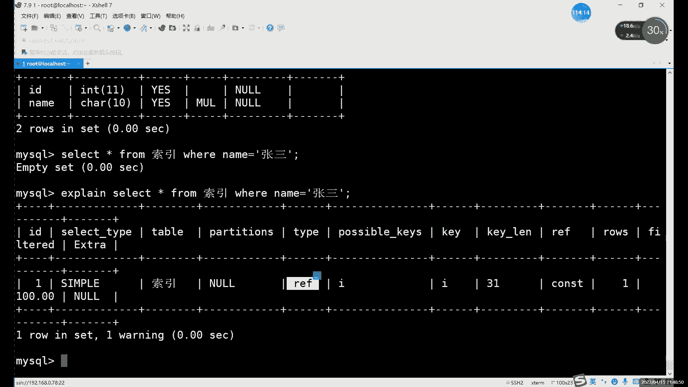
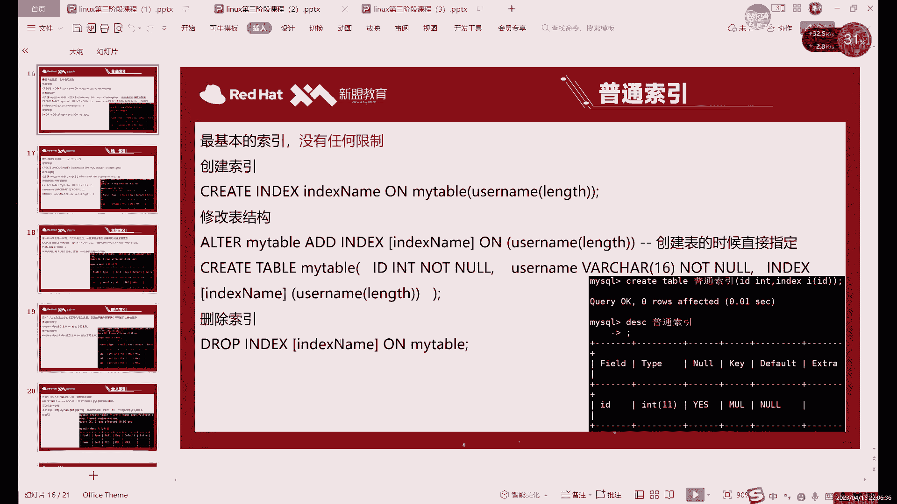
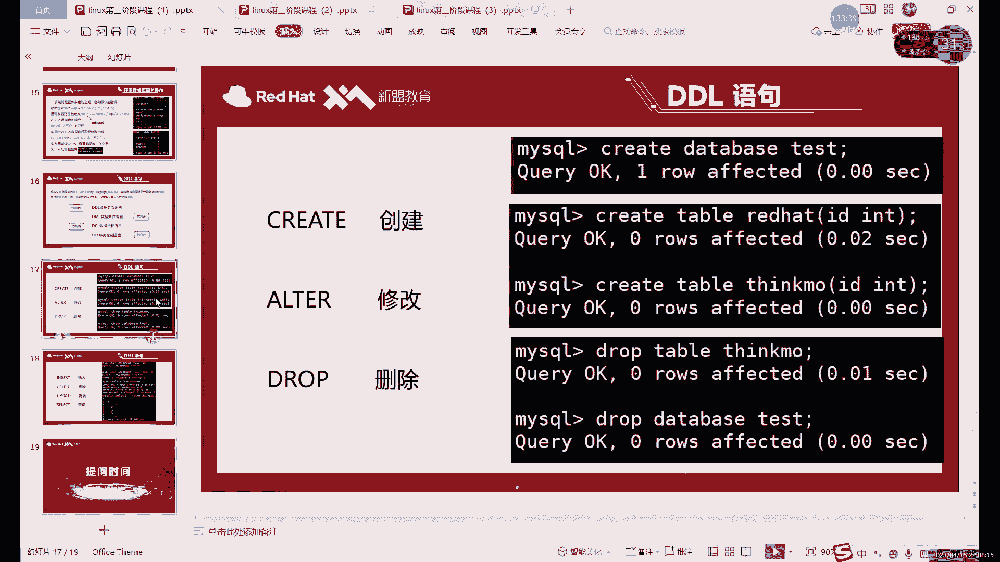
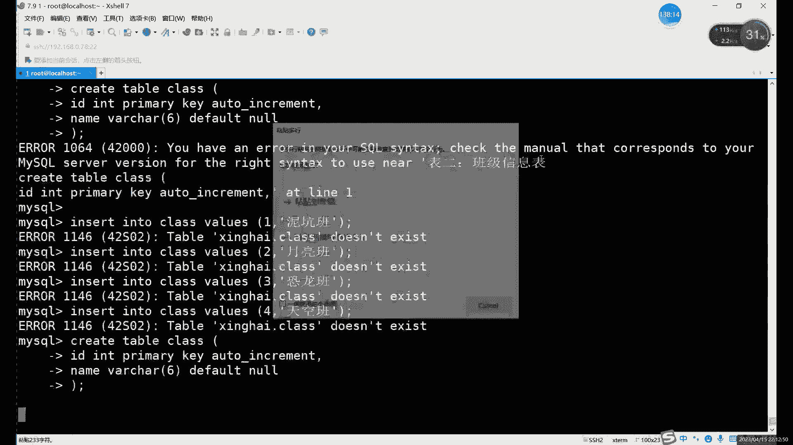

# 零基础入门Linux，红帽认证全套教程！Linux运维工程师的升职加薪宝典！RHCSA+RHCE+中级运维+云计算课程大合集！ - P70：中级运维-9.约束，ALTER命令，索引，SELECT查询 - 广厦千万- - BV1ns4y1r7A2

加上这个。加上我们具体的这个字段。啊，这是一种。还有一种是什么？就是在创建。呃，修改表结构的时候修改所以。就是aler table的时候啊aler table的时候添加一个索引进去。加索引化。

这个是怎么添加？就是ADD索引的名字啊ADD indexex，然后索引名称，然后2添加给谁添加给某一个字段啊，因为我们的索引的话也针对于字段的，这就是二某一个字段就行。当然还有第三种啊。

create创建的时候，它还是create meaning。但是不一样的是什么？就是它这种是创建。表格的时候。添加索引。啊，这三种都可以啊三种都可以。没什么区别啊，就创建出来东西没有区别，你想创建哪个。

你随意啊，想用哪种方法都可以啊，都可以。比如说我这里。啊，还是创建一个新的表格吧啊，quere table。呃，所以。让我们创建一个索引的这个表格。好吧，索引表格看现索引表格。然后里面我们先写什么。

先写一些字段就行了。就是比如说我们随意啊再选1个IDNNT啊。内幕。你器眼。对吧我们就拿name来看。为什么拿内们来看？因为内幕呢它不适合设置约束。那最多它只能有个非控约数。

但是非控约数呢它没有索引的功能。有索引功能的约束呢就是K啊，就是K那里有东西，那才有什么，那才算是有约束。所以要不有这个索引。所以说呢这个name呢，它它能设置的约束里面是不包括索引的。

所以说这种情况下呢，我们是可以在什么呢？哎，可以给它来个普通索引。就比如说。我们可以设置一个索引在哪呢？就是索引在如果说创建表格时候设置的话，就是写完以后类似于什么？它类似于那个外件。

外件也是我们写完之后再写，对吧？这里也一样。就是写完这个所有字段之后呢，后边逗号跟上。所以。就可以。泽眼的话，这里我们可以起名字啊，可以给泽眼起个名字。哎，你比如说。随便你叫啥都行啊，叫啥其实都可以。

对吧？你就简单的写一个就行。啊，后边里面加什么，里面加内。name什么？name就是我们这个。这个拿出这个字段的名称啊，就是你要设置的字段的名称，就是把我们这个name字段呢设置成索引啊。

index indexex就是索引的意思啊，这个的话就创建索引。啊，就是类似于那个外键，就是把这个创业索引的部分呢加在后边。啊，那就就现在的话我们就相相当于创建了什么创建一个普通索引啊，在普通索引里面。

如果你创建之后呢，想要看一下表格的话。啊，就是一个什么，就是个MUL。啊，它既不是它不是他这个当然不是外接啊，它这个不是外间，它这个时候就是一个普通索引。那这个普动索引的时候，如果说我们要用它的话。

比如说我们怎么来用呢？就是比如说slect。然后 from。呃，表格叫什么来着？索引，对吧？这样查看当然也没有，对吧？就是你不加V尔上限制条件，你肯定是不用索引的。所以说我们就得加个内部吧。

诶 name。那你现在没有，对吧？那你没有些人不要紧啊不要紧。嗯。啊，那个没有也行，我们也有什么呢？也有所引。啊，有所以。这个缩引是什么？这个缩引呢一般就代表是普通缩引。啊，冇可以。嗯。

因为我们这个索引相当于它没有主件，它不是主件索引，它也不是唯信索引。啊，就是REF这个代表就是这个普通索影。啊，佢同回。哎，就总之这里就是只要不是什么呢？只要不是off。啊，只要不知谁都是可以。

二的话它就是一般就是查询整个表格，扫描整个表啊。二的话就是扫描整个表。只要不是啊，他其实就用到了索引啊，就是不同类型的索引吧，不同类型的索引肯定肯定这个效率肯定是有区别的。你就像这个。

主件和唯一性索引肯定的效率是更高的。为什么呢？因为他们的字段是唯一的啊，不是数数据是唯一的，就是字段里面数据是唯一的，所以说参们效率高。那普通索引的话，没办法，因为你没有这个约束，你不能设置这个约束。

你数据有重复的，你就不能设置唯一性约束，那怎么办呢？那就只能用普通索引。那普通索引的效率呢也会稍微低一些，因为。有涉及到这个重复的数据啊，效率会低一些，效速度会慢一点。但是呢肯定要比不用索引好，对吧？

肯定要比不用目录好嘛，对吧？你就想吧你如果没有录入目录。Yeah。怎么说呢？就是即使你是再薄的一本书，没有目录，你找东西肯定也不是很方便，对吧？找东西肯定也不是很方便。那这个的话就是什么？

这个就是我们这个索引啊索引普通索引。创建这个主件索引和唯一性索引呢。

大家想记也可以，不想记也无所谓，为什么呢？因为我刚才说了，主件所引唯一索引跟主件约束维型约束是一样的。你创建索引相当于创建了约束，创建约束也相当于创建了索引。因为他们就是怎么说呢？就是这个组件啊。自带。

约束和索引这两个功能唯一性也是一样的。啊，就是我们这个Kprimary K和unicalK这两个K呢都是自带了什么？自带了索引功能的。自带了索引和约束两种功能。所以说的话创建的话也很简单。

大家可以看一下就行了。因为创建约束的时候就自带了，所以说不需要我们单独去创建啊，不用单独创建的，就是这两个东也可以不用记，主要记的是什么，主要记是创建普通索引的。因为普通索引的话。

约束是约束是创建不出来的，就是普通索引啊，就是没有约束的情况下呢，想要索引的，就得用这个，所以说主要是记这个普通索引就行了。😊，微信索引呢。就是什么？就是把刚才刚才我们不是什么。

就是这个创建的时候是用什么用index对吧？index，然后加上index名字就可以了。唯一性索引的话就是什么？就是。Unicical。啊，加上unicq。对吧这个和这个和我们那个约束会也一样嘛。

那是一样。啊，就是unicical index。这是我们的唯一性索引啊，主件索引呢啊直接就primary K就行了啊，甚至都不用写，甚至它就和主件约束完全一模一样。啊，所以说这个的话就。

唯一性和主件就不用记了啊，因为创建约束的时候就自带。啊，这两个就不用说了。然后呢，接下来的话还有两个。

但还有一个先说这个吧，就是全文索引。全文索引的话，这种的话它比较特殊啊，它是用在哪呢？它是用在这个。字符类型的。字符类型里面才能用字这个权用索引。他有这个CAR对吧？然后还有ts。

tex这个我们就就开始说了，就是一些存放我们这个比较长的一些。字符的时候会用，因为CHAR和VRCHAR的话，这两个虽然说很好用，但是呢他们的线上限比较低。只有256和6065535啊。

因为250就是2的8次方，2的16次方。啊。就是它俩个范围比较小，范围大一点的话，就得用到texax啊，taxtex的话tex啊，tex这个的话也就是用来存放我们一些字符啊。字符类型的这个数据。

才能用到这个全威索引。因为你文本它就相当于是很多大量的文本嘛啊针对文本进行这个查询啊，分词这种的话。这种索引呢它用的是什么？它是。比较特殊，它必须要用到这个MSM的存储引擎。啊，因为我默认用引擎。

它不是这个我默认用引擎是哪个呢？默认用的以前是这个啊，so create。嗯，table索引给家看一下，默认引擎是这个。以及呢我们还没有讲。大家先知道一下啊，先了解一下。这个是存储引擎啊。

都能引擎运动DB。然后呢，这个这种引擎呢话，它不支持什么呢？

这种型它不支持这个全文索引。哎，也是不支持这种特殊的引擎啊，它叫哦so text啊，它是专门用来查什么的这种引这种这个索引是用来查这个大量的文本啊大量文本。这个的话就非常就类似于什么呢。

就跟字典就更类似更像。为什么呢？因为字典我们里面就查字的嘛，它这个也是查字的。啊，就是这个for去也是产品。那其他引其他的这个索引的话，字符也行，对吧？数字也行。啊，像这种的话就只是用来查什么。

只是用来查这个文本内容啊，查文本内容。然后这里的话这个联合还有一种的话是联合索引吧。这权程索引创建也是一样的啊，就是protex。但是我这里得给大家演示一下啊，这里得演示一下。因为什么？

因为这个涉及到这个不同的存储引擎啊啊不同的存储引擎怎么创建呢？😊。

我刚才也说了，就是我们在创建表，平时在创建表格的时候，对吧？我们都是默认去。我们创建完一个表格之后就结束了，对吧？啊，一般就结束了。但是呢这次的话我们创建一个特殊的索引。如果要出现这个全文索引的话。

首先先写字段，这个没问题啊。这里的话我主要写就写一个。文章吧啊word文档吧啊，当时word文档t。啊，就是这种数据类型，tax数据类型。创建好之后呢，加全文索引啊，got。

后边加上这个forex的一个名字啊，就比如说。就叫word的吧啊就叫word的吧，然后里面加上具体字段。EXE啊不要显缩。这个话就是创建权的索引。它其实就是每个索引的名字，其实就是就创建名字里不一样。

其他的都一样啊。然后呢，当然这个全部层也还有一个特殊的点，为什么要只答案拿出来来说呢？就是因为需要还要加一个东西啊。啊，当然呢这个加不加也你想加也可以加。

这个你复制过来也加在这里，但是你不写的话，它默认就是这个，所以说呢也不用写，因为它不是不都写到默认字符集嘛。😡，这两个的话默认都是这样写的。如果说想要改的话，你就写在后边，他就不会按照你的默认的走了。

它就也就类似于一个默认的约束啊，默认约束每个表格都是讲这样的。但是如果想改的话，你就写到后边。哎，接到后面。就写在括号的外面啊，写在括号外面。这里作用的话我们就是更换一个什么更换一个增数引擎。啊。

因为英doDB这种默认存储引擎的话，不支持这个活态。这个话就是创建这个权文索引的一个方法。嗯。tex不存在在表格里面。哦，叫味儿啊叫味儿。啊，这个字段的话叫word的。这个数据类型的t，对里写错了。

是word word。好，创建好之后。D s c。条文索引啊也是MUL。他这里没有一个他没有特殊的标志啊，有MEL到大家看到以后呢。怎么说呢？你不能下定论，你只能确定它有索引，但是是普通的呀。

还是是这个外键呀，还是这个。protex呀不确定啊，怎么办呢？啊，你可以s什么呢？s index就可以。啊，收银net用来查询什么呢？是用来查询哎索引信息的，这个里面会具体去写啊，它是什。好吧。

然后呢，我们还有一种索引的话，就刚才也刚才给大家看了一下，对吧？没有说呢，联合索引。你。聊的作用是什么意思？就是。这个联合索引呢，它是有什么作用？啊，就是用来什么？就是将多列就两个以上的列。哎。

创建为所引。啊，就比如说正常的话，我们创建一个索引的话，就是什么的index，然后后面加索引名字或者对吧？或者说呢unicol加后面加名字。甚里可以写什么呢？这写可以写primary复件加名字。啊。

也可以写prim后员名字。因为这个pri话相当于什么？相当于主件嘛。因为这个联合索引的话，它其实不限制你的索影类型啊，比如说你联合就普通索引的话，可以随设这个联合的。唯一性索也可以说。那主件这里的话啊。

我之前说过，对吧？主件呢每个表格当中只能有一个。哎，每个表物灯只能有一个轴件。但是呢。只细的说只能有一个主件，但是呢并没有说你这个组件是什么。😡，对吧也可以是联合组件，或者说叫联合组件。哎。

我不想加索引啊，就联合组建吧。啊，就说这个联合组件什么意思？就是可以有两列呢同时作为主件。把方作为东间。这样的话呢。你可能这常一列的话，它不能确保完全的什么呢？完全的这个。唯一性对吧？有可能有的列呢。

有的列经常用于查询，但是呢它没有唯一性。它的数据没有唯一性，但是他经常用来查啊。当然了创建一个普通索引是一种方法。但是普通索引我刚才说了，它的效率不是很高，它没有哪个高，它没有主件高。

那想要他变成组件呢，又不能让他变成又不能又不行，因为什么？因为他又没有唯一性。这个怎么怎么办呢？就可以用这个。联合组件或者联合索引来解决。常说强调就是联合主件索引，就是把两个链呢作为主件。啊。

你把两个列同时作为组件，因为有一个列呢，它可能是有一些重复数据。但是因为要用来查，你又不得不给他来一个主机，哎，不来不得不来一个索引。为了提高最快的就把效率提高最高，那只能用主件的。

所以说在这里就就会用到什么联合主件索引啊，或者联合索引。因为联合索引的话，可以用主件的，可以用唯一性的，可以用普通的字形。就在创建的时候呢，在我们括号里边加上什么呢？加上这个。多个。

比如说呢我们怎么创建呢？比如说这样。

嗯。Greattable。联合。IDINT。嗯，那个。就比如说这个这种情况。ID可不可以作为主件呢，可以，对吧？这个很正常，但内部能不能作为主件呢，这就不一定了，对吧？因为很容易有重名的。

所以说这种情况下呢，如果说想要这两个都做索引，哎，都有索引，而且呢都用最都用效率最高的那个索引。这怎么办呢？啊，你可以在这里加上这个。加上这个K啊，可以加上这个K。啊，当然你加K的话，这里。

配的话其实就是那个这个嘛，这个就是pay。这里的话你可以用什么？可以用唯一性的啊，可以用主件的，可以用普通的都行。啊，都可以。嗯，这个的话其实我们里边加个什么？比如ID啊，里边要加这两个名字啊。

ID和那。啊，艾D和哪个都要去创建。啊，这个创建。然后创建出来呢，我们来看一下DIC。联合。啊，这里的话就有个MUL了。哎，当然这种的话其实嗯。他这个如果是有联合这个组件的话。啊或者连合索引的话。

它只会在第一个里面去显示索引。所以说呢这种index就是DSC这个命令的话，他看这东西已经怎么说呢已经不太全了。啊，这种情况下的话，最好的话还是看什么呢？🎼用s indexd这个来看啊。

s index来看那s indexex这里就能看到什么有两个。那叫有两个。索引而且呢他默认用哪个名字呢？他默认用了这个我们第一个字段的名字，因为我没有起名字啊，就是索引这里呢可以起名字，也可以不起名字。

就是在这里呢可以加名字，也可以不加名字都行啊。都可以。你这里加上名字的话，它它是变了啊，是K name这里就变了。如果不加的话，它默认按照第一个啊，它是默认按照你字段的名字给你起所有名字。

所以说呢有名字不加也行啊，有名字不加也可以。啊，这种话就是我们这个。联合索引啊联合索引。其实就是括号里面写多个就行。啊黑人啦。里边唯一性怎么创建的，就创建唯一的。唯一联合所以。唯一的联合吧。啊。

唯一的联合。Unic克。哎，逗号行，哎不行，这样的话。我们再重新创建一下啊，create table。喂联合。ID。安静。name。Unicical。然这里可以加名字，比如说。啊，你随便写一个吧啊。

随便写一个名字都行。嗯。看一下unicical case。

我这创建的话，我看一下啊，unic这里的话，unicunic。

unicical index。Unicical in in。嗯。哦，我们这个名字看啊这个名字这里的话。系咁。还有点问题。🎼我，就常这样放吧，哎，这个的话还是有点那什么啊，当然这里的话还是用这个。

这个相当于这次创建出来就是么就是一个。嗯。BESC。文艺联合。嗯。啊一你好。这里的话大家可以看到我们上边和它们的区别是什么？就是nunic。普通的那个呢，它是什么？它是一个。嗯。一对对吧？

一的话就是它不是唯一的。啊，一的话这里是nun，它就不为一不为一一的话就肯定嘛啊就是不为一的意思。普通索引这也是零的话，代表什么？代表我们是唯一的啊，也就是这个的话其实就是一个唯一的DNC。么唯一联合。

啊，它就是什么？它这个其实往这里其实看不出来啊，这里看不出来你还是得看什么，还得得到这个index这里去看。所以说呢如果说你是要看一些索引信息的话，DSC的话基本上已经帮不了你什么了。

基本上它帮不了你什么，只能是什么你用这个so indexdex命令去看。啊，这个看的比较准确一些啊，这个看的东西比较准确。啊，这就是唯一联合的。当然你像创建组件也是一样的啊，创建组件也可以。

呃范决怎么创建呢？DRIM ARY primary。组建啊没这么创建。我们来看一下这个。逐渐联合啊，这件的话比较特殊，它这个倒是给你显示出来了。对吧这就是多个主件。多个主件的话，你不能是单独创建啊。

而不能单独创建。你要怎么创建呢？就按这种创建。😡，按照这种地方建就是联合组建。当然这里也包括索引啊，主件的话也就包括索引。啊，你正常创建一个组件的话，你可以去跟在这个字符后边，还就字刻跟在这个。呃。

字段后边。但是呢你如果说想要多个时间的话，你还是得逗号后边你跟着primeK，然后加上这个。哎你也好，啊你也好。再加字段的名字，这个话就是创建联合的组件。

总之呢，这几种创建方式的话主要还是记哪个呢？普通索影怎么创建，对吧？其实是创建方法一样，就是换一下什么呢？

换一下自己的关键字。对吧unicode的话就是唯一的priary K就是组件。普通的话就是普通的这一个K啊，或者是index啊。啊，就这些。因为我们修改一直，所以修改哪部分呢？说改是这里。这是K对。啊。

你不管你说你是唯一的，还是普通的，还是这个这个主件啊，其实一直都改的是这。我一直都做SK。啊，当然更具体的一点的话还是用这个收 index indexex去查看，其实最好。因为它能看出个比较详细的信息。

好吧，这个就是我们的索影。啊，所以。有这个索引之后呢，你去查看这些表格也好啊。当然直接看表格，它是不会用索引的。因为也没有必要，他会展示将它展示整个表格了。如果是看某一某一行啊或者某几行的数据的话。

用where命令啊，记着用wherere命令。啊，不用we尔命令的话，它不会限制条件啊，不会限制条件的话，自然也就用不到这个索引吧啊，也用不到索引啊，用到这个威尔命令之后呢。就可以了吗？

而且你为尔后边啊限制条件呢一定要包含什么，包含这个组件啊，唯一性的呀，普通的索引啊啊这些索引哎，包含这些索引信息的时候呢，他才会用到这个索引去查询。所以说呢这个查询呢查询命令的这个使用其实也是有讲究的。

啊，那具体怎么说这个查询呢，其实。

就是我们的下一个内容啊，这些怎么说呢？就是它下一个内容。

就是我们语句对吧？最开始我们一开始的DDL语句。

管理表格的数据定义点，其实我们都已经说完了，对吧？alt刚刚说过那三个其实都已经说完了。啊，primaryK不需要加，因为primaryK它是比较特殊的一个。K相当它是主键，它比较特殊。

它不用加那个indexice，也不用加K。那其实indexK是差不多一个意思的，就是只要有了K的话，就不用加index。啊。就是K和index，其实在这里我们基本上代表一样的意思，就是所引。然后呢。

这三个已经说完了，对吧？然后呢，第二种这个DML语句就是数据操作语言，就是操作数据的登山改都说完了。在查询呢其实我们只是查了，就是每次都是查一个表格，对吧？

我们每次用的话就是leting from某个表。

啊，某个表，就是我们接下来的话。主要内容的话就是这个side语句啊，因为side句。啊，这个导入导出工具的话，我们就后边说吧。因为导入导出工具其实这个。它其实就是类似于备份啊，它其实就是备份啊。

我们这个就是在备份的时候，我们继续去讲这个吧。你们接下来就直接来说什么呢？就直接来说这个。

查询。啊，再也啥询。当然呢一时半会肯定说不完，我们就1。1点来吧啊1。1点来。

在查询的时候，其实我们在后边其实可以什么就是会具体的用到这种这个索引。当然呢，我们其实当然还是那句话，我们的表格比较小啊我们的表格比较小。

正常的情况下呢，其实呃是否用到了索引呢，你就通过那个explain命令去查看就行了啊，那个面就能看出来我们到底用了什么索引啊，或者用的具体是哪种索引啊，用没用啊，对吧？最好的最快的肯定就是组件唯一性的。

然后普通的索引的话速度会稍慢一些，但是。哎，就相当于是。啊，一个好的字典和一个坏的字典吧，但字典也没什么好坏吧，就是一个好的目录。因为有唯一性，所以说它查找起来更方便，没有唯性的话。

它查出就查就比较慢啊。这里的话我们可以这个这个数据导入导出的话，我们后边具体备份的时候再讲啊，具体备份的时候再讲。然后呢，管理表记录的话就是我们inser命。

insert增删改啊insert增删改这三个家伙呢。前面我们已经基本上都说过了，对吧？我们接下来的话就是最重要的查了。啊，管理表记录的话其实就是什么？就是我们的数据操作语言。

就是增删改里面的增删改查里面的前三个啊，命令的话用法就是在这里。

啊，很简单，对吧？就是这么几个，对吧？这这一个命令呢占了这么多。然后剩下的呢。都是啥，对吧？查这里当然我PPT里面已经也为有感觉PPT放这些也不太合适啊，因为面令又多。东西又太多了啊。

我后边我直接直接就是在在笔记里面跟他说吧，因为这里flg这的东西很多很多啊。然后首先的话我们要说查的话，我先创建一个几个简单的表格吧。因为之前我们实验那些表格太简单了，没什么意义啊，太简单了。对吧啊。

来我这里把这个直接给它复制出来也行。先创建这么。两个表格吧。应该能复制吧能复制吧。对上下两表格，我们方便后面去查找，好吧，哎，大家直接复制粘贴就可以。别会粘先到这个数据库里面就可以用啊，直接就可以用。

这里的话我用的这个inser的方式是什么呢？就是一个insert一个一行用一个inser，为什么这么写呢？这种写法的话其实更方便于排除。就是你。

如果说出现报错的话，如果说一用一条语言提。

啊，控制多了。我说命令这里报错了，多复制了一点啊。

嗯。好，大家插入这两个表格之后呢，用先用sag来看一下吧。嗯。喺。side信号from。stuuddents对吧？就是这个表格。然后另一个class呢是。嗯。Cl。嗯。嗯。哦，A哦。

A在这个位置plus啊这两个表格。这个就是最简单的一个se发询。之前我们一直用的是这个，对吧？用的是这个。前面也说过了这个form这里呢。啊，包我们这里就是表格的名称。这个不用多说，对吧？

你查一个表格就写一个，查两个表格就写两个。啊，这样的就行。当然我们先说写一个的啊先说写一个的情况。然后呢，s类前面就是查询具体具体要看的内容，那只能看一些什么呢？就是星号代表什么，代表这些的所有。

分开写的话就是写ID啊、name啊，class IDD啊。性别呀、成绩呀写这些。啊，就比如说你想slash一个只看ID和姓名，是吧？只看ID和姓名，那就是ID逗号类。哎，怎么去写。前面这些其实能啊就是。

就要看内容其实很少啊，就ID。name。嗯。呃，ID name。查下有出问题。敲中文敲不上去了。拉个 i d 。逗号name。From。丢览这个表格。这样看的话，就只看什么，只看IDname这两列。

也就是这里的话写字段的名称啊，一般是写字段名称更多一些。当然后边还有特殊情况啊，我们后边再后边再说啊，一般的话就正常查看就是一个字段或者用信号，信号代表所有看整个表格。啊，当然信号也并不是在看这表格吧。

信号跟里面来说是看所有字段啊。信号指的是看所有字段。在这种情况下的话，肯定是所有表格没问题。但是呢我们这个side语这里主要讲的啊，哪部分内容呢？是他们之后的内容。哎，就是在这个语句之后呢。

之后呢就是这个where。啊，就是个威儿。啊，今天时间也不多了，但是我们稍微说一点啊稍微说一点威尔的后边我们加的是什么呢？加的是这个。自己还用新吧啊，自代新students。

然后where后面加的就是具体的条件。这个之前我们在update和deleate的时候稍微用过，对吧？就是看某些条件的时候。你，就比如说看一下这个。这里我们有班级，对吧？有班级啊、性别啊。

成绩啊这些东西。比如说我们看一个什么class IDD等于一的同学。对吧感觉一万同学。两位对吧？这就是什么？这就是这个查询按查查询条件来算。但这个用到索影了吗啊，他应该是没用到索影。

因为class IDD这个。它里边没有什么，它里边应该是没有这个约束的啊，没有约束的话，一般我们也不也一般也就没有索引。所以说呢用where去查查的话，这个其实我们用不到索引啊用不到索引。

这个就是最简单的一个什么sag语句的一个结构啊，就是slaag加上我们想看的字段，说我们加上想看的表格，后边where呢加上我们想看的条件。😊，这三部分字段表格和条件。

条件呢这里其实能讲的就很多啊能讲到很多，具体有哪些呢？很多很多很多。我这里的话就把这个什么呢？直接用笔记来看吧，因为PPT里面放的实在放不下，因为太多了啊，PT里面实在放不下，你直接用表格来看。

啊，最基本的查询就不说了，对吧？最基本上就不用多说了。条件查询的话用的就是什么呢？就是select。前面这部分无所谓啊，就是威尔在条件语句了啊，威尔在调形语句常用的条查询条件的话非常多啊。

我们一个来介绍首先呢比较弧比较符前面用过了什么，用过等于号，对吧？😊，当然我们这里就不仅仅是等于号。啊，不仅等于号，还有什么？还包括大于号，大于等于啊，小于等于。你还要不等。哎，不能。当然等于这里的话。

首先呢除了这个。

除此以外呢，当然了字符也可以用，对吧？就比如说呢你想要看名字。啊，或者说想要看这个性别，这个可以性别的话，这个也是个字符。比如说性别是M的同学。啊，嗯。啊，也就是女同学这里话就是女同学啊。

这里的话就是什么就是。字符的话需要注意的就是威尔后边等于2，后边不能说威尔后面就等于后边的话，字符呢用引号啊。数字数值的话，这个其实怎么说呢？数值是一贯来说比较自由啊，数值的话引号也行，不加引号也可以。

就主要注意的是字符呢，一定要加上引号。没有引号时话，这里这个字符它就会报错啊，比如说呢我们来演看一下，看看报错吧，能报错它长什么样。😊，嗯。啊。如果说我们写了就是字符里边。

就是如果说本来这一列是字符数据也插入都是字符嘛，对吧？数据它插入都是字符。如果说你查询的时候呢，用这个slide信号 from，然后看tudent where。😊，加上这个后边的这个条件里边。

如果你写的不是个字符的话，其实你不加引号的话，他就默认为什么，默认为你输入的不是字符他就会报错啊，他就会说什么呢啊，找不到这一律。啊，不是找不啊，对，找不到这个数据吧，只更准定说就是找不到这个数据。

就是你不加引号的情况下呢，是找不到的。😡，哎，找不到这个数据的。啊，这个的话就是什么？这个就是。啊，字符这边的特殊需要加引号。啊，交给你好。

好，接下来的话，这个大于号包括大于号小于号的话，这个其实是什么呢？这些的话。是用在哪呢？是用在这个数数值上的。

啊，更准就是整数小数都可以用。就比如微我们这里呢把这个s SEELECT啊，slect新 from。当然了，这个比较的话其实更好的是呢？你看plus IDDID这些都可以比。其实只要是数字就能比。嗯。

然后呢score这里的话。成绩的话其实是最好的比较嘛，对吧？成绩这个比较其实比较好。就比如说呢我们来查一个什么呢？我们看一下这个表格当中。我们看以成绩来过滤一下吧啊，来看一下这个成绩比较好的同学。啊。

或者说看见成绩比较差的同学吧啊st。然后威尔后边加上什么？威尔后边加上这个成绩，然后呢。比如说成绩比较差的，你比如说小于吧，小于80吧，小于80其实就哎有点危险，对吧？有点危险。

就能找啊inselect。加上这个where尔小于号，就是查出来程序小于80的同学。啊。正常的话，这个小于大于号肯定都是用在数字上的对吧？用在数字上的，包括这个小于等于也行啊，小于等于的话。

这里又多了一位啊，多了一位，对吧？又多了一个配齐啊，这个的话就是什么就是。😊，比较符号。就是比较范围。当然除了这个。大于号对吧？小于号大于号小于号等于号。第三个以外，我刚才还说还有个什么。

还有一个大于等。大于等于对，不是不是大于于，就是大于小于。

哎，其实也就是不等。啊，为什么叫它大于小于？就是它这个符号的话，两种写法。😡，啊，当然是可就是大于号、小于号和什么和。

感叹号。感叹号的话就代表我们这里是不等于的意思。就比如说呢如果说查询程序等于80的对吧，就一位嘛，那不等于的呢。😡，就是剩下的所有，也就感叹号等于就是代表是不等于。或者说呢还有一种写法就是。🎼啊。

但是大于号小于号这个得是什么？得是小于号和间歇小于号。再写大于号。啊，这两个的话就是这个不行啊，大于小于这个不行，那固定用法是小于大于啊，小于大于这个。然后呢，和这个感叹号一样，对吧。

感叹号其实就是取反的意思，感叹号等于就是不等于的意思。然后小于大于的话，就是既小于又大于的，肯定是不存在的啊不存在的。啊，这种话其实也就是。定义成什么？定义成不等于了。啊，这个的话就是我们这个。

比较符号。

啊，我们的问置条件语句里面呢是比较。😡，当然了，如果说FI如肯定有疑问，就是字符能不能比较呢？就是字符除了等于号，能不能用大于号小于号呢？对吧？比如说能不能就是啊以这个英文字母呢ABCD这么排呢。

其实其实不能。😡，对吧因为他其实他就不能。

但是呢它有一个其实这里面其实我感觉做的一丢点问题的地方是什么？就是马这个里面一个不太好的地方，就是比如说呢你看等于配齐啊。如果说朋同学等于佩以骑，就这个佩奇，对吧？内容啊内容等。对吧能查出来对吧？啊。

不等于呢就是其他所有同学没毛病，对吧？然后呢，如果说。如果说这里换个大一块行不行呢？他也不会报错。啊，他也不会报错。如果是小于号呢。他也有。啊，他也有。你说他是按英文字母排的吗？他也不是。😡。

看你说他是按你们这么排的，他其实不是按你们这么排的。因为你看啊这个P对吧？就是P。然后这边是Q。D啊这边有个D。嗱哦。跳q q。OPQ嘛是吧？P在前，Q在后。对吧你小于这肯定就不对了，对吧？

就是这个的话就是那们字符的话，它不能用来排序，就是大于小于的话不能用。他能查出来也是能查出来，但是呢它没有什么规律啊，它其实没有什么规律。啊，所以说呢正常的话字符就不要用什么不要用大于号小于号了。

它就最多就是用什么用等于号或者说什么呢？等于号或者说不等于啊不等于就是取版的意思。感叹号的话，在这个符号这里的话就代表的是取版啊，感叹号取版。

哎，这就是一个什么？这就是一个哎最简单的一个查询条件。就是涉及到数值的时候用的更多一些，就是大于号小于号了。如果是一些字符的话，就只能用一些等于号啊，就要注意注意这个就行。好。

接下的话再来看下一个的指定范围，对吧？这个是等于号的，按照等于号来算。如果说碰到一些想要限制一些啊大于某个成绩，小于某个成绩的时候，怎么办呢？当然这里呢只限制只限制只涉及到这个数值啊，还是数值。

就比如说按成绩来看，你看成绩的话，至常我们刚才比的是一个大于小于80的同学，对吧？那如果说我们想要看这个大于60，小于80的这一段，哎，就是你及格了，但是成绩也不太好。想要开这么一段的话。

就可以用什么呢？你大于号等于号的话，就直接只用单个的肯定是不行的那只能用什么？就是这种范围，就指定范围。指定范围的话就是不end就是在什么什么之间的意思。啊，这个是在英文里边。

语法就是beten and在什么时候之间。然后中间的话把数字放在这个位置和这个位置。就是放在这个between后边和and后边，什么意思？就是在75到83之间。

啊，这三75到83之间嘛啊如果说我们想要查看的话，比如说啊我们想看个60到80的。同学爱的成绩。威尔60到80啊，还是成绩啊。已退。And。把成绩的话写在中间。🎼60到80的成度。那这个是60到80。

那他这个代表的是什么？就是他这个有没有就是他俩之间有没有就是包含这个。60和80呢啊这个其实。它俩是不好含的，因为这里已经有了对吧？它也相当于什么？就是大于等于60，小于等于80。啊。

不是大于6就小于吧？这是等于它中间有等于号。啊，中间是有等于号的。你你看6十80取进来。啊，那取反的话当然也是有的啊，刚才的取反是什么呢？刚才我们那个问就是就是等于号。啊，等于的取版是用的感叹号，对吧？

这个范围的区版的话，它是用note。啊，取版的话就反正就是否定的意思嘛，反的号是一个否定，对吧？你看像这个note，它其实也是个否定句。

那其实取版的话就是在我们的正常的这个语句前面加上这个取版的东西就行了。就是not。那这里直径就是什么呢？就是小于60和大于80的。大家看到就60和8是没有进来，对吧？还没有进来，为什么呢？

因为这个68是其实就在这里，它是大于等于60和小于等于80，那取反是什么呢？取反就是小于60和大于80。对吧这个就是be案的这个范围。就是从哪到哪啊，双就是两边是有什么？双两边是有等于号的。

就大于等于某个数值和小于等于某个数值。同样的还是什么呢？还是这个不要用在字符上，不要用在字符上。比是可以比的，但是没有意义。然后n的这个就是徐反啊，就是。在这个范围之外的东西。😡，就小于60到于80倍。

啊，就是相当于在这个范围之外。啊，这个同就是什么呢？这个就是。啊，这个的话就是我们这个。我们的这个叫。范围啊固定范围。

当然我们这里条件的话很多啊，调件很多，我们只能是一个一个讲啊一个一个讲。然后呢，除了刚才我们是讲的时候，我刚才讲了一个比较符，对吧？比较苦。然后呢，又说了这个范围啊，范围between and。

这些的话其实都什么？都是用在这个威尔后边呢。我们现在主要讲，其实就是为后面的条件怎么写。啊，写条件方案法其实有很多是你根据不同的字段啊，其实都是有都可以写不同的这个限制条件，对吧？

就比如说大家嗯你看刚才其实两个主要还是针对于数值更多一点。😊。

但字符的话，其实它比较起来确实没有数值那么方便，对吧？所以更多的字符的话，它更多就是等号用的更多。哎，等于或者不等于的。对吧范围之里其实都都不能用了，就根就根本就不能用这个范围。

因为你不管说你是汉字也好啊，还是英文字母也好，是吧，你没办法比大小，因为它这个大小概念其实。😡，数值字符话肯定是没有大小概念对吧？啊，这个的话就是我们这个威尔后边引记的一些用法啊，用法很多。

大家下去呢可以在。对。预习预习啊。把前面的命令打好之后呢，可以提前预习一下。

啊，今天的话这个正好我们笔记的话是整个发给大家嘛，那么发给大家的话，大家可以把下面的一些看一下，很多啊很多。就除了这个等大于号等于号以外呢，还有范围呀。😊，集合啊模糊查询啊是否为空值多重的条件啊。

排序啊、分页、分组函数。等等等等。而且这个是这个是什么？这个只是一个表的查询啊。一个表查询一个表装完之后呢，我们还有多个表查询。😡，看看通过表的产询。如这个的话大家。😊，我可以可以先自己看一看啊。

预习一下。啊，我们这节课的话就不不讲太多了啊不讲太多了。😊，这里的话总体上来说呢，威尔后边的用法是一大部分啊，就最主要的内容最主要内容。当然前面我们还还会就sg这部分的话还是有内容的。

就除了字段名和信号以外的话。先剧透一下，对吧？下面还有什么函数，函数也是用在这部分啊，也可以用在前面这部分。就是计算啊，应该计算。这个函数它不是什么复杂的函数啊，这个函数指的是什么呢？

指的是我们类似于我们excel表格里面那种函数。哎就是计算函数。啊，所以总之大家下去把这些面也可以都看一看啊，这些例子呀，包括。那你先把这个这个表格复制进去啊，先把这两个表格复制进去再去查询啊。

完的话没有对象查也没没意义啊，没意思，对吧？然后下面的话，我们下面下节课的话，我们就继续讲这个s语句，好吧，继续讲s语句。

