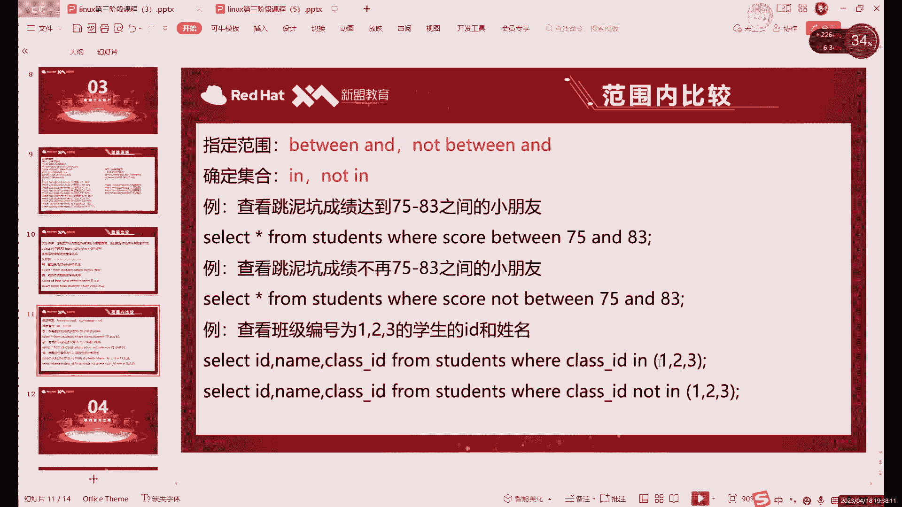

# 零基础入门Linux，红帽认证全套教程！Linux运维工程师的升职加薪宝典！RHCSA+RHCE+中级运维+云计算课程大合集！ - P71：中级运维-10.SELECT单表查询，嵌套查询 - 广厦千万- - BV1ns4y1r7A2

好，我们节课的话就继续讲这个slaag的查询啊，slaag查询。上节课的话，最后我们讲到了这个比较符。对吧比较幅这个位置。这个的话主要是比较什么比较数值，对吧？比较数值字符呢。

我们主要用等于号和不等于号就行了，其他的用的少啊，字符主要是等于号。就是指定某一个。某一列啊是某一个值的时候啊，这样去限制条件啊，这样会用到字符，其他的其他的符号的话更多的是用数字啊。

也就是我们的整数小数什么的。然后下一个的话，我们讲了bet的指定范围啊，这个范围也一样。它呢其实实质上呢就是大于等于某一个值，小于等于某一个值。这个就是betweend的一用法。然后呢，下面这个。啊。

下面这个课没有说，对吧？上节课我们最后就说到了这个叫范围，对吧？指定范围，那它范围比较类似的一个呢，就是我们今天啊第一个要说的，它是叫集合。那这个集合是什么意思呢？啊，它的范围有什么区别呢？😡，啊。

范围的话它是什么？它主要比较比较一个数值。哎，比如说大于等于某个数值啊，小于等于某个数值。那结合的话。集合这里的话，它其实是是什么呢？就是包括某些值。啊，包括某些纸。那什么具体什么叫集合呢？其实就。

简单来说，其实就是一组数据。那集合简单来说就是一组数据。

就比如说。

啊，我这里先开一下，连一下这个虚拟机啊，连一下虚拟机。0点78啊0点78的IP。

是。正常的一个集合的话，其实就是什么呢？就是你看我们的范围的话，其实比如说你从60到80对吧？那集合能不能表示60到80呢，其实也可以那具体怎么表示呢？它其实就是60，然后6162、63一直写到80。

那这种的话就叫什么？这种就叫集合。啊，这个就是集合和范围的一个区别。范围的话，它相当于是你们只需要写一个头和尾。哎，他就能把我们这个整个的所有的内容都包括进来。就比如说啊我们先进入到这个数据库里边啊。

我们来看一下这个集合和范围的一个区别。我们切换到我们自己的库当中。啊，看一下。这两个表格应该还在，应该没有删啊啊，students和class啊，主要就还是用students更多一些。sdents的话。

我们首先来看什么呢？如果是结合的话，SELECT啊，我们先来看一下我目前的所有数据。对吧啊，我们有这么多数据，啊，我们就还是拿成绩来说啊，还是拿成绩来做。啊，就拿成绩来个这个来对比。因为字符的话。

它不能用什么，它不能用那个范围。哎，就是bet end的这个用法的话，字符它不能用。所以说呢我们就拿直接拿数值来对比一下字符和就是范围和结合。好吧，你看betwe end的话。

其实就是我们之前限制一个范围，不是上节课是用的是60到80的成绩，对吧？60到80的同学的成绩。那他那他会给我们提取出来的，其实就是什么？就80对吧？6075哎，正好就这三个，其实。对吧，正好就这三个。

哎，这个就是60到80。我们只需要写一个什么呢？只需要写一个。我们lect吧，我们写一下吧。That are也ing from students。where尔啊，我们限制条件。先写什么？

先写我们字段的名字，然后呢。写我们的这个关键词。between什么什么and对吧？这里的这个范围的话，我们就60到80吧。如果是60到80的话，大家可以看到啊，正好就其实就正好是123对吧？

正好123啊，这种话是范围，你只要写头和尾啊，它相当于是大于等于60，小于等于80。那集合。就是将这些全部都列出来。什么意思呢？哎，如果说我们想要看到这个。这种就是想要看到这种结果啊，用范围的话。

这种很方便，对吧？60到80。那如果用集合怎么写呢？再lecting from distance啊，我们这次用集合，我们还是显示出第三个结果。啊，就用什么就用in啊，in具体怎么用呢？啊。

集合的话就是用in对啊，这个是范围比to end的关键词。in的话就是集合。那集合具体怎么用？

它呢其实就是包括什么？包括一组东西，一组一组数字。这一组的话包括什么呢？包括这个。

哎，就比如说这里的话这里举例的话，用123举例啊。如果说啊我们想要看到什么，看到这个结果，我们用结合等句写呢，那就这这样至少要写成什么，至少要写成。然啊我们60。75。80哎，就写成这样。啊。

这样结果还是一样的对吧？还是一样的那如果再写的多一点呢。啊，再写个90，哎，他就能把我们是90同学给加进来，也就是什么？也就是集合的话。它和范围呢啊它其实不太一样。

范围的话其实就是这一段范围内的所有都拿出来。而集合就是什么？就是在只有在这个括号里边的啊，集合呢我们用应，然后加上一个括号来表示，只有在括号里边呢，我们才会什么呢？啊，才会去查找，就比如说呢我们找60。

对吧？哎，找个7580什么的，找90的话，我们就额外又加进来两位90的同学。啊，这个就是集合和范围的区别。啊，这个范围区别。这里的话我们是用什么用数值来对比啊，或者说用整数来对比吧啊，用的是整数来对比。

对不对啊，但其实呢应的话，它不仅仅能用于整数。还能用于什么呢？还能用于字符。你看be的这里因为有大于等于小于等于的原因，所以说字符呢不能用。哎，那如果说我们想要哎批量的获取一些信息的话。

那这个如果不能用范围，那其实确实就很不方便，对吧？但是还好哎，我们还有一种用法就是叫这个集合啊，这个集合呢就是主要是用来帮助我帮助我们的字符。😊，啊，有多个想要获取多个字符的信息。哎。

就比如说想要这里的话，我们就是这个表格，我们就想要获取什么，可以获取多个同学的信息，对吧？哎，多个同学的信息。😊，我们就怎么写呢？我们就换成什么？对对？就可以换成什么换成内幕。啊，name硬。

然后括号里边加上具体的一个集合。就比如说呢我们想要看。前三名同学的一个成绩啊，用name怎么看呢？啊，或用name加集合怎么看呢？我们就可以怎么怎么写呢？select。哎，总之。

集合的话其实就是将我们括号里边的所有的数据。啊，全部都查询一遍啊，这个就是集合的用法啊，比如说如果换成name的话，那我们就只能写什么，只能写名字了，对吧？只能写名字了。哎。

比如说呢我们随便把前三位同学的名字写在这里啊，但不过大家要注意啊，一定要用什么用这个英文啊，用英文。好，这个的话就是什么？就是前三位同学的成绩，对吧？也是一样的对吧？这个就是么，这个就是结合的用法。

和be end呢类似对吧？都是选于相当于选一个范围。但是呢集合的话，它是更具体的数具体的值集合这里是具体的值，而范围呢它是一个相当于是嗯。一块啊一片纸啊一片对吧？就比如说这三个值是不是60到80里边呢。

它是60到80啊，但是呢它这个其实啊就和我们这个范围呢相当于是。嗯，两种方式，这个主要就是用来补补足什么呢？补足我们的字符啊，就是因为字符没办法用范围，所以说呢你如你如不如果不给字符加一个哎。

同时查询多个。哎，从中时查询多个条件的一种用法的话，其实哎字符这里面查询就会比较困难。啊，这个查距就比较困难。用这个也可以啊，就用就是硬的话，字符所有的所有的字段都可以用啊，就不像betwend啊。

以及我们之前讲那大于号小于号字符它不能用，对吧？如果说换成性别的话，也可以，吧如果我们性别这里是只有两种嘛，对吧？只有两种。哎，就比如说我们可以怎么写呢？😊，如果说我们想要看一下。

Likelalectist新 from students。哎，这里的话我们用什么用字符也行，是吧你长用ID也可以，对吧？用class IDD也可以，用性别也行啊。查询的话，这个其实我们方法很多。

对吧比如说in in什么呢？in，比如我们加F吧啊。我们这里因为是字符啊，所以说加上引号。啊，这就是什么？这个是。F是。女同学的一个这个信息，对吧？女同学的信息。啊，可以用这个。

如果说你如果说F和M这两个都写上的话，那其实就是什么就是整个表格的啊，因为我们只有两种性别嘛，对吧？这里的话用性别。这里如果说你只有一个值的话啊，集合的话，一般就是什么？一般就是多个值哎。

多个值的时候用。当然一个值也行，对吧？就这现在我们不就是一个值嘛，对吧？一般情况下一个值的时候呢，我们更多的还是用等于号。啊，还是等于号。用等于段其实更好一些啊，用等于号更好。因为你用等于号。

其实少打一点啊，少打几个的，少打几个符号嘛，对吧？啊，一般一个一个值的话，你就用等于号。啊，两个值三个值的时候呢，值比较多的情况下呢，我们就换什么换结合。集合的话就相当于是同时什么呢？同时写了几个等于。

比如说它其实拆分开来来看的话，就是name等于配析，name等于调制name等于粗期。哎，就是这么三个，对吧？它其实就是什么？就是它和等级是一样的。只过呢它我们的这个字符啊，它不能指定范围。

就不能指定范围的话，我们就只能是就只能用集合去同时指定多个不同的值。啊，这个就和等于号是一个道理。应这里的话其实就等于号。啊，你这里就是等于号。主要需要注意的就是注意一下字符的问题啊。

你看大家如果是数值的话，我们是可以可以不用加的，就是多个直间可以直接用什么，直接写就行了。哎，数值不用加引号。如果你是字符的话，就加记，一定要记得加引号，不加的话。比如说我们可以给大家演示一个附加。

你看比如说F如果不加的话，我们就这样写。啊，它就是什么？它就是无法识别这个值啊，也就是其实呢我们这个表格里面根本就没有F这个值，而是真正它存储是以什么方式存储，它就是用引号F再加引号这样去存的。

所以说我们查询的时候也得这么去查，就所有的字符的话，它存储都是用什么，都是都需要都需要加引号。哎，哪怕你是什么呢？😡，双引号也行啊，双引号单引号其实啊在数据库里面没么没什么区别的，没什么区别。

你单双都可以，对吧？你单的话方便一点嘛，单不用用不用按shift，对吧？你是双引号还得按shift。所一般情况下，我习惯用单引号啊，这个单双都可以，无所谓的，这个是没有限制的。哎，这个的话就是什么？

这个就是集合硬。那反过来啊，就是我们威尔这边后边的用法的话，基本上都有都有取反的功能，哎，基本上都有取反的功能。就比如说。notote音。对吧not inF是什么意思呢？那其实就是inM的意思，对吧？

因为我们只有两种嘛，那如果说你有多种情况的话，其实就是哎不属于这个F的，就是性别不是女生的哎，同学，那就是M，对吧？对着区吧。notote的话就是不属于这个。啊，这个举版的话方式其实有很多种啊。

就是在这个威尔语句里面。取版的方式有很多种，就是每一个方式它用的可能都不一样。哎，所以说这个的话需要注意一下啊，需要注意一下。就比如说我们的b to end用的是什么呢？啊，b to end其实。

我们也可以用什么？之前。我们看一下be end这里啊。外星 from where啊这一个。对吧也可以用note啊，比 end这里也可以用note啊，以及in这两个用note都可以。哎，就是不属于什么。

不在哪个范围内，或者说不在我们集合当中的对吧？这个not in就不在不属于我们这个集合的对吧？比如说这个名字这里对吧？用我可找一下名字那条啊，在这条对吧？😡，不属于啊就是nototeing。

就是我们不属于这几个呃，就是名字，不是这几位同学的。哎的一个详细信息。啊，那就是加上note那就是不属于这个集合当中的，我们就显示出来啊，这个就是徐板的一个作用啊，虚板的作用。我们来看一下。

啊，接下来的话我们其实。范围话我们说了这么多，对吧？我们接下来看什么？接下来看这个。PPT因为内容比较多，PPT里面就。不太好放，放的其实也不好看。所以说呢我们就直接看笔记吧啊，直接看笔记。

我找一下slaack在这儿啊，sack在这儿。首先的话我们的比较符我们看过了，对吧？刚才又说了一下这个。集合和范围。啊，取反的话都是n，大家可以看一下，取反的话都是n，好吧，呃，等比较符这里取反呢。

它是用什么用感叹号啊，基版上用感叹号。哎，不过一般就是其实就是等于和不等于感叹号嘛。然后接下来的话，我们一起来看这个蘑菇查询啊，蘑菇查询。蘑菇查询的话，这里呢。总体上来说嗯。类似于什么呢？😡。

类似于我们在哎你平时在我们的命令行里边查询一些这个哎，在文件里面查询一些值的时候。就比如说gra命令就是GREP对吧？g命令大家应该还。记得吧啊，这个命令的话，我们可以过滤什么呢？

啊，这IP对我们就可以过滤文件当中的一些信息。😊，啊，你只需要写什么？只需要写一部分。啊，就是你如果说不确定你这个数据啊，你这个字符具体是哪，具体是什么的时候可以我们呢可以用一些通配符。啊。

可以去用通位图去代表。就比如说呢我们在数据库里边啊，我们就直接来说数据库里边的话，我们是用哪两种分位图呢？

百分化和。下划线这两种。啊，就是like meaning令的话是百分号下划线这两种重配。什么意思呢？其实就是一个代表什么？一个代表任意，一个代表一个。下划线呢我们就是代表一个对吧？

相当于这里的话相当于给我们留了一个空格。所以说呢啊下划线就是代表一个百分号的话。哎，这里就不确定有多少个了。😡，没有行不行呢？没有也可以。😡，哎，或者说什么呢？可以是没有。😡，可以是一个可以是两个。

也就是百分号这里就是不限量。哎，就是不限量，那下划线呢就是只限一位哎，只限一位。这就类似于什么呢？哎，这就类似于。嗯。嗯，去这个相当于是下划线，这里，就是买一送一，对吧？是买一送一。

百分号这里呢啊更像什么呢？更像这个。有一些。有些饭店对吧？主食的话是不限量的对吧？有些就主食不限量啊，像这其实类似这个啊，这里的话就是百分号的话，其实就。就是不确定的时候，一般怎么用。

就是不确定有多少位，不确定有几个的时候用百问号。如果你确定了有一个啊，就只有一个。

对吧就比如说。我们看名字，这里的话我们能用这个版本号查询的模糊查询的话，其实就是名字吧，其他的没什么能查的啊。名字这里的话，那比如说丹尼对吧？丹尼这里的话。你知道它前第一个字是单，然后呢，第二个字忘了。

但是你能确定它只有一个字的话，你就可以用这个下划线。但你如果忘了的话，就比如说。你看啊这里有佩德罗，对吧？佩德罗这里的话我们有三个字。😊，哎，如果说你忘了后边到底有几个字的话，你可以用配。

然后呢百分号这么去写。啊，都可以啊，这两种方式的话就是其实百分号用的更多啊，百分号用的更多一些。嗯，就比如说我们直接来演示一下啊，直接来演示一下，来看一下效果啊。啊，如果说啊我们用的是什么？

当然关键字的话是什么呢？关键字是like啊，朋友说啊不要这个要一定要先写like啊，再写这个啊百分号或者说下划线啊，你不写like肯定不行。like的话就相当于是代替了谁呢？

代替了那些in啊be的等于号的位置。😊。

因为它这里就不是等于了，对吧？我们叫什么？我们叫模糊查询。模糊查询呢它不叫等于啊，它只是相当于是项嘛，对吧？like我们的应文翻译过来就是项的意思。啊，那个就是像。像什么什么对吧？长得像这个配。

然后什么什么什么，对吧我们就可以来看一下，就比如说呢我们来看。

That星 from。啊，我们还是查询我找哪个名字啊。如果你想要看这个杠在中间的话，我们得找三个字的啊，找三个字儿或者四个字的，那就佩德罗吧。啊，我们来看一下这个。

Selecting from students。where我们怎么限制呢？啊，用name like。然后引号这里中间我们怎么写呢？嗯，我可以看先写一个配置，然后呢再写一个下划线，再写一个。骡子对吧？

第二节。符号记得用如果说经常要打只又打要打汉字的话，记得切换啊，切换输入吧啊，记得切换输入吧。没问题对吧没问题，因为它这个什么就下划线，它就有一个字。😡，哎。

只只要是我们表格里边有这个配什么什么螺按这个同学，它就能显示。那中间如果换成百分号行不行呢？其实呢也可以。为什么呢？我就刚才说了百分号呢，它代表0个。0其实它的准确来说应该叫零到正无穷大哎，也是零。

加上所有的正数都可以。啊，因为这里没有没有负数之说啊，因为我们这个这个不能说负数，这个没有负数数，就是零和所有的正数都可以。啊嗯。所以说呢这个哎如果说你确定中间有一个字的话，那你就用什么？就用这个。

就比如说如果说我们用上面这个，如果说你不写螺的话，这样我们能显示什么呢？哎，我们就是配齐了，哎，就另一个名字了，为什么呢？因为什么？因为我们的这个下划线它代表一个字符。😊，那你这个配多螺肯定显示不出来。

那如果说换成什么呢？换成百分号的话。😡，来它就能显示两个同学。也就是这个其实就什么？就是。下划线和百分号的区别，大家就这个应也能分清楚，对吧？下划线就是一个啊就是一个固定的一个。然后呢。

百块号呢就是零个或者是多个。然后比如说我们再给大家演示一个，比如说我们直接写上这个。写一个完整的名字，哎，不是这个旗。哪个起来的啊这个旗。如果这样写，然后我们加一个下划线行不行呢？😡，啊。

大家可以看一下这个行不行。如果说我们已经写了一个完整名字了，再加下划线呢，哎它就当然在我们这个表格里边呢，它是没有的。😡，哎，在我们这个表格里面，它没有，因为没有这个佩齐，然后后边含有字，它就是空值啊。

当然它不会报错，就slag的命令呢，只要语法正确，是永远不会报错的。这个大家放心啊，就是。这个只要是嗯语法正确是不会报错的。他只有说有结果和没结果一说啊，因为我们这个表格里面就不存在哎。

就没name幕这里的，没有这个值。但是呢如果说换成百2行不行呢？百2就可以。为什么百放合一？就是百分号刚才说了，0到0和所有的正据。啊，就是你如果说在不确定时候，在查找一些值的时候呢，蘑菇查询的话。

尽量还是用百分号更多一些。因为百分号的话，它其实已经已经包括什么，包括下划线了。只过百万块可以可能查出来的东西内容比较多一些了啊，没有那个下划性那么准确啊，因为因为它其实相当于是你多少个啊。

中间有多少个字，省略多少个字都可以显示。啊，什么多少字都写都可以显示。啊，这个是。叫什么？这个叫。字符啊，这个是我们用用字符演示，对吧？我们还没有演示数值对吧？我们可以演示一下数值。

就比如说我们用哪个吧，用这个成绩吧，成绩这边是两位数嘛，哪两位数往好看一点，那面ID都是一位数。哎，比如说我们来看一下s新 from成绩。啊，三角星 from season，然后威尔成绩。嗯。

成绩like对吧？我们用like。比如说我们这里写了什么呢？啊，80。把文。但这里如果你写下划线哎，或者说是这个。没什么太大区别啊，因为这个。只有两位嘛，对吧？只有两位。

所以说你这里写加划键或者说写这个百公号都行啊，写百号下划线都可以，这个没有太大区别啊没什么太大区别。然后L这里的话，大家注意啊啊，我们这里给大家演示了一个什么啊where尔。成绩，然后呢。

like我们写了一什么，写了个发，然后呢下划线。这个有什么问题呢？啊，他又会报错啊，他说找不到怎找不到8下完钱这一行。😡，为什么呢？因为我们这个下拉线啊，或者说是这个百分号。这。

如果说们换版分号也是一样的。哎，不管是下划线也好啊，百分号也好，其实它都是什么呢？它是类似于字符的对吧？它应该参与它这个符号吧，对吧？我们整数这里只包括什么，只包括这个123456789。没了。

就这一个对吧？组成的一些数字嘛，用呃就0到9吧，0到910个数字组成的嘛。所以说呢其他的符号呢，它也算字符like这里它因为比较特殊。我们如果要想进行模菇查询的话，他肯定要加这个下划线啊。

或者说百分号的对吧？那加这个的话自然。😊，就需要什么呢？哎，就需要这个。人家叫叫什么来着？加上这个的话，就相当于它就变成字符了啊，如果你不加引号啊，它就会报错啊，这个需要注意一下。

就是用某查询去查一些数字的时候，查数值的时候也要加引号啊。因为你加上之后，它你其实就不属于一个纯粹的数字了，啊，你就不相当于啊。😊，又没有那么纯粹啊，没有那么干净了，对吧？然后呢。

如果说当然我们这里之前一直演示的在后边，对吧？前面也可以，这个的话其实没有什么限制，就是百分号这个东西呢。因为果写在前面呢。也可以，对吧？只不过我们还没有这个以8结尾的数字啊，我们换一个零吧，对？

就整数8060910的同学啊，好像还有个0，大家看到到零也一样，对吧？零的话，你前面有根号相当于没有了嘛，对吧？这里相当于没有了，剩下的几个的话，就是8699，对吧？如果这里换成下划线呢也一样。啊。

那就没有这个零了呗，对吧？因为零的话前面相当于没有东西。这个的话。嗯。这个话就相当于什么？这相当于这个。前面也行啊，后面也可以啊，百木号也可以啊，下划线也行，都行，都可以。随意用。

因为他其他这个是不会报错的啊，这些命令它不会报错，只要语法正确的就行。这个查询命令呢。哎，它不像什么，它不像那些。哎，插入啊，删除啊更新那样限制那么多，只要是没有语法错误呢。

哎就所有的查询命令都是可以正常运行的。啊，所有都是可以正常用。啊，就是无非就是。如果说你查询条件太过苛刻，或者说呢你查询这个东西表里没有，那它就返回什么把回一个空值啊，返回一个MT空的就行了啊。

空着就完事了。正常情况下呢，如果说只有的话，我们肯定是会返回一些信息的对吧？这个就是模糊查询like，当然它也有什么，它当然也有取返，我们这里基本上就是。

一个正常的用法加一个什么，加一个取反的用法，上面也是嘛，对吧？in not in啊，be not belike也一样。

那这个就不用多演示了吧啊，我们直接。Not。那么这里它显示了来就就显示了什么呢？就相当于是还要取版的意思嘛，就是我们这一列就乘绩这一列呢，包括零的。有这么多有4个，对吧？那不包括0的呢就是剩下的6个。

哎，这就是取版的一个作用。就是把相反的值啊，不能说相反的值，就是把这个。嗯，不属于这个其实就是把这一列里面所有数据呢分成两部分嘛。like是一部分，not like是一部分。

它这样加起来呢就是我们成绩的所有啊，就是我们的所有成绩啊，这是取版啊取版。

然后这个的话就是模糊查询啊，就两个符号，模糊查询进两个符号。当然呢千万不要把like忘了啊，你不能说你直接写个name幕，然后写个啊内幕，然后写个字符摆冒号，这样不行啊，这样不行，要一定要加like啊。

like的话是我们模糊查询的一个关键词。哎。当然这个是一种用法。我们之前其实也用过一次like，不知道大家还记不记得。哎，就是这里翻一下上面的笔记啊，就是查看什么，查看密码策略的时候。

那我们也用过一次like，当时是怎么用的呢？用的是寿命令啊，也就是like这个模糊查询呢，它不不仅仅能用到sck里边啊，寿命令也可以用。因为s它和like slack一样，都是查询的意思，对吧？

都是查询的意思。只不过呢sck查数据，而s呢是查看我们系统当中的一些设置。😊，而so啊so加上什么？这个是查查询的什么？查询的它是策略啊，查询我们系统当中策略like。啊，like就是项目对吧？

百分号pasword的百分2什么意思呢？就是包含百分号的所有内容。前面也可以有对吧？后边也可以有，大家看到pasword我们是在中间的这个位置，前面有内容，后边有内容啊，都可以显示出来，对吧？

这个之前我们其实已经用过一次这个like啊，用过一次like就设命令的话，也可以用like，就用来查询一些啊系统当的一些设置。啊，有可能你比如说这个确实挺长的对吧？你设置一个密码策略的长度，对吧？

这么长，没必要记啊，你直接用什么like模糊查询password就完事了。😊，哎，这个就模查询的用法，就是遇到一些长的数据啊，或者说长的一些这个。啊，其实这里其实就相当于是一些长的数据啊。

遇到一些长的数据，没必要去啊记住它啊，没必要知道它具体是什么，你就知道它的一部分，你就可以用mo现上查出来。那就魔法星的主要作用。哎，我们接下来继续往下看了啊啊，模拟查询like。

接下来呢就是空值的问题啊，空值的问题。空值的话在这个。数据里面它就是比较特殊的一个对吧？之前我们也说过了，你在不插入数据的时候呢，默认为什么，默认就为空。啊，默认就为空。空值的话，其实。怎么说呢？

其实有点。占用什么占用还占用空间，对吧？你还不如。正常的去，而且呢如果说你插入到空值的话，可能是什么呢？啊，如果插入空值，可能这一个值哎，这一行的话，哎，可能信息就无效了。啊，可能性就无效了啊。

它不一定无效吧。就比如说嗯我们看一下我们这个表格里边吧，你看我们这个表格里边。

每一个值都是有的对吧？哪怕是什么？哪怕是你没考试。哎，他有一个零分对吧？啊，他有是有一个零分啊，他有可能准备考试或者什么或者说。哎，就没考试吧，作弊不好啊，作弊不好，我们不说作弊，我们就没没考试。

没考试，它有一个零分，对吧？留个零分。哎，他也不会哎，他也如果你写空值的话。我们在查询的时候。哎，如果说我们想查一个，比如说啊零分的同学有哪有哪些？如果说你这里不写换成了空值，那其实就查不到了。

因为零和空是不一样的。零是一个数据，空的话指的是没有。没有呢，它是这里用什么用n来填充一下啊，相当于说用n来填充一下我们这部分。所以说呢我们这个控值其实。在我们这个数据库里面其实是不太好。

那有控值其实不好。所以说呢我们怎么去找到快速找到控值以及。系。怎么去删除也好啊，再去更新也好，更新一些数据啊，插入一些数据也好，这个就是后话啊，我们首先要什么，首先要找到控制啊，首先要找到控制。

那找控值的话，我们这里可以看一下。空值的判断呢其实就是什么呢？就是通过E闹。这里的话我们用不用等于号啊，因为它其实不能算是一个值，所以说我们不用等于号，而是我们用了E。啊。

一直当然也是是和等于号是一个作用是一样的啊，只不过我们不是一个值，我们就哎不写等于号了。用这个命令的话，我们就可以查看我么查看我们表格当中的哪个字段是空的。哎，有没有空字段哎，这些内容。

就比如说嗯我们来看一个。

我们当然现在表格里没有空制，对吧？我们可以插入一个吧哎，插入一个。3后 students。ID name。pas i d。M们插入4个对吧？插入4个值的话，我们会留出一个来，对吧？会留出一个来。

就是一个是空值嘛。Y这里的话，后边我们写。123456789111啊，都排到11了。11，然后呢继续写这个嗯。plus IDD12345。重谍。字符。啊，注意留意一下符号的问题。一定要全部都是英文的啊。

啊，正常插入。哎，就是说又新新创建了一个班级，对吧？啊，这个班级还没有参加考试啊，里边也只有一位新加入的同学。哎，那我们看出来这个效果呢就是什么？它这里就会出现一个空值。感觉最后成绩这里的话。

我们会出现一个空值。啊。DNC。DSC嗯 students。啊，是自增的约束啊，之前之前没注意啊，自增约束的话，这ID都不用插啊，只需要插入内容就行。啊。然后呢，我们可以看一下。

这里的话我们是有多了一个空值，对吧？多了一个空值。那怎么去查询呢？我们先来有查有空值就能查了，对吧？其实其实直接查也能查，哎，这只不过什么？就是如果你直接执行这个命令行行的也可以，对吧？

就比如说你执行where score is now就是成绩是否为空，可以查，但是呢我们这个表格里没有空值啊，所以看看效果的话，我们还是添加一个，先添加一个啊。

哎，就比如说我们可以直接slaack新 from，我们加什么呢？加上。SCORE is not。你你这是我们的成绩为空的同学啊成绩为空的同学。啊的一个详细信息就列出来了，对吧？这个就是什么？

这个就是查询是否为空的。不为空的，也就是正常的数据呢，就是我们原来那个表格啊，原来那表格啊，这个note的话，它不加在is前面啊，这个就是这个其实就是个英语的语法啊，is not就表示否定嘛啊。

它不不能这个是不能加在这个nn是不能加在is前面的所以就就是啊inn啊。

然后这里的话我们可以就其实空值的话就这么多，没了啊，空值其实就这么多。因为这个空值判断的话，其实就是用来检查一下我们这一列呢啊，有没有出现没有插入啊或者漏插入的一些问题。哎，如果有的话，就可以什么。

就可以用更新的命令啊，用update命令直接去更新啊啊，用up命upupate命令直接去更新就可以了。啊，这个的话就是什么？这个就是我们的哎判氮就快，这是相当于是一判断的作用啊判断的作用。啊。

in闹是空的，然后in闹话就是吹空的。啊，有空值和没有空值的意思。那这个就是空值的判断。这里区范其实还是note，对吧？还是note，如果这个note呢就不太一样了。

前面的note它就加在他们关键词的前面，对吧？in也是not in，对吧？not like这个的话就是not，因为有意的有意的存在啊，所以说要加在E的后边。

然后接下来的话我们来看怎么来看一下这个多重条件的问题。哎，多重条件。多重条件是什么意思呢？啊，我们前面是讲过什么？我们前面讲过这个。我们前面前面讲了这个集合范围，对吧？我们前面讲了一个能查询多个条件的。

有集合范围。比同要按的也好啊，硬也好。对吧这两个都能查询一就是一片啊一部分数据。硬的话就是查询结合里面的几个。而betnd就是查询几到几，对吧？几到几，那这个也是他们是可以查询多个数值的啊。

多可以查询多个值。这个没有问题对吧？没有问题。那我们这里这个多重条件查询是什么意思呢？对吧？有必要吗？对吧？你之前不是都能查多个条件了吗？之前的多个条件大家注意啊，我们都是什么？

不知道大家发现没有我们都是只用一个字段。就是你不T不T案也好，对吧？我们是数值的成绩字段。印啊用成绩啊、name呀，对吧？这些。它也是一个字段，就是你这两个命令它都是一次查询的，只有一个字段的。

只能通过一个字段去查询。而我们的多重条件查询，它指的是什么呢？😡，可以是一个字段吗？其实也可以啊，多重查多重查询这里的话也可以是相同的一个字段啊，一个字段查多次是没问题的。但是更多的啊。

更多的我们这里一般用什么？一般用。不同的字段。比如说什么意思呢？😡，哎，就比如说我想要看一些什么呢？哎，看一下这个。啊，班级是一般的。嗯，然后呢班级是一般的，成绩大于多少多少的。

对吧比如说成一般里边成绩及格的同学。哎，或者说一般你们成绩大于80的同学，对吧？这种说法的话，就实我们就知道这里就有多少个条件，这是两个条件嘛，对吧？一个是班级，一个是成绩啊，如果说想这么去获取的话。

其实就是两个条件的对吧？两个条件。啊如果这两个条件的话，你正常的用我们之前所讲的这些其实都做不到，对吧？你比如说你看比如说我们想班级是一般的，成绩大于80的，用什么呢？用等于号和什么。

用等于号大于号就可以做到，对吧？但是呢。你这两个怎么写呢？对吧？一个是name，一个是什么，一个是思报尔成绩。对吧它俩是不同的字段，你就不能写在一起。所以说怎么办呢？那就是我们下面的这个多重才能查询。

两个方式。两种方式，一种是n，一种叫傲。啊，一种叫and一种啊，不是一种叫and，一种叫奥啊。note那个not不着急，notote还是取版例子啊，n还是取版。我们就先说ant out的问题啊。

如果说像我刚才说的哎，就是一般里边成绩哎大于什么？大于80的同学成的一个信息。你想看的话，用哪个呢？哎还呢？😡，啊，那就是肯定什么？就是因为我们刚才说的是一般并且什么呢？

一般并且成绩大于80的and它的名字其它的译文翻译过来就是合并且的意思嘛，对吧？and就是合并且的意思。所以说这里这个如果说想要看啊，这这里这个例子也一样，对吧？啊，查看二班的对吧？分数高于90的同学。

你看他怎么写呢？首先先写班级的等于2了对吧？然后呢，成绩要大于90，然后中间用什么连呢？用and连起来。就是什么？就是我们想要看的这个呢？就是相当于告诉我们的数据库。我想要看这个数据。

一定要同时满足什么呢？同时，满足这个班级和成绩这两个条件。我们就用什么用and。那二呢。它不是相反啊，大家注意啊，就是按头它并不是相反的意思啊。😡，反之啊二呢它的范围其实更大。

那就二能获取到的数据更多啊，为什么这么说呢？取板是note，它跟or无关啊。al的话。它是叫什么？它叫并且按的是合并且的意思，对吧？of是或者的意思或者。如果说我们把这个中间这个ID换成了。

就是and换成2，然后有什么会有什么就是。会发生什么情况呢？对吧？他的这个数据会变多。什么意思呢？就是al的话就是或者的意思。如果说你的al的前有一个数据，啊，就al的前面有一个条件。

R的后面有一个条件，哎，中间al连起来。那威尔他查询的是什么呢？啊，就side威尔查询的就是。😡，ID等于2的或者乘绩大于90的。也就是说，只要你的ID等于2，你就能被我们显示出来。😡，哎。

只要你的成绩大于90，就也能被显示出来。啊，所以说为什么我说or的范围要比end更大？end的话相当于是取了什么？取了这两个的一个交集。啊，不知道大家能不能明白这意思。

就是and取相当于取前后条件的交集。而al呢取前后条件的一个并。

啊，就是交交集病急的问题嘛。哎，就比如说我们来直接来演示一下fl的新 from students。where啊成绩。啊，我们先选ID也行啊，class IDD。就是成绩是一般的。对吧并捷。并且什么呢？

呃，啊，不先写I不是pl classLAF。并且成绩。比是大于等于80吧。哎，大于等于80同率，对吧？and呢它显示出的是什么？就是。我刚才说了它叫什么，它叫相当于交集啊，你就既要ID大于等于一。

又要乘绩大于80，对吧？这两天它都满足了。如果完成二呢，它相当于取了这个并级啊，就交集并级不好理解，那你就看效果就行了。对吧东西很多，为什么反回这么多消息呢？首先第一，我们这个。查询出的结果呢。

它首先满足什么呢？有几个是满足我们的ID等于一的对吧？😡，这两个满足I就等于一了。但是呢他这里又不满足在80，那无所谓。啊，就只要满足一个就可以。那大大于等于80的是哪些呢？

就下面这些大家看到都是大于等于80的。大家知道他们的ID这边呢其实都是么都都不是一。哎，所以说什么呢？就是你看这边其实12456。我们这里有8个同学都满足条满足这个条件。比为他这里呢。

你看我们这里第一个都是一样的对吧？相当于说这个二呢，为什么我说二的范围其实更大呢？就相当于是只要满足一个条件就行了。有前后只要满足一个条件。而end的话相当于要满足两个条件。

那就是相当于我们从这里呢去找一下什么，找一下，就同时满足这两个呢那只有一位了啊，也是alt范围肯定一般是要比这个end要大的。啊，只是一般啊，有时候特殊情况呢，可能他们两的值是一样的。

啊就按的和2可能返回的值一样。那吧这些是这是就是少数情况。一般情况下呢，还是二的值会更多一些，二返回的值更多。这个就是什么？这个就是我们的。and和二的一个多重条件的查询。

那如果说我想再大家第三个条件行不行呢？其实也可以。啊，再加第三个也没问题。可以继续往下加，只不过呢如果你条件加的越多。😡，会出什么问题呢？啊，它不会报错，你返回的肯定是空值啊，比如说你这里写10个条件。

那基本上不可能很少。比如说你的表格写10个限制条件，基本上也不会能基本上获取不到数据。所以一般这里的肯定不会数量不会太多的啊，数量不会太多的，两三个就已经够了啊，两三个就足够了啊，再多其实就有点过分啊。

再多其实有点过分，那就条件太多了。😊，啊，陈多的话，一来其实影响查询。二来呢可能查了半天又没有。对吧很有可能就你查了半天又没有。哎，所以说呢这个。多种条件查询呢？一般正两三个就可以。两三就可以。

当然这个是什么？这条这个我们演示的是不同的条件，对吧？我刚才说了，其实相同同间也可以。主要是什么呢？比如说。classus IDD等于1。然后class IDD等于多少呢？等于2。这样行不行呢？

我看R还ID啊。等于2，这也可以对吧？也可以啊，那给我换成end的行不行呢？啊，按着就不行了。啊，当然这个是报数，and它就没有，为什么没有呢？啊，因为同一个条件，它不可能又等于一又等于2，对吧？啊。

这个就是。啊，一般情况下这样用的也比较少啊，就是同样条件的话，一般情况下我们用集合啊范围什么都可以。啊，当然你用and其实也没问题啊，用and也没问题。只不过呢就相当于是。这个的话相当于什么呢？

这其实其实可以换成class IDD硬E2。或者说是between and12W betweenen1 and2对吧？效果都一样。

哎，就是你同样的一个。