# 零基础入门Linux，红帽认证全套教程！Linux运维工程师的升职加薪宝典！RHCSA+RHCE+中级运维+云计算课程大合集！ - P72：中级运维-11.SELECT单表查询，嵌套查询 - 广厦千万- - BV1ns4y1r7A2

查询的一个目就是同样的，你要就是比如说嗯就是查一班二班同学的一个信息，对吧？同样的一个问题，它查询方式其实非常多，对吧？你应也可以B同院的也可以。啊，用like提名的like也可以。啊，用二也行，对吧？

按的不可以啊，按的不行，二也可以，对吧？等于号啊等于号2。这些话其实都可以。哎，就是总之一个问题的话，大家不要说啊就你想的时候呢。只想一种解决方法啊，像在这个数据库啊，尤其是s云这里呢。

其实解决方法非常多啊，只要你只要你感想啊，它其实都能写啊，只要你感想，其实都能写出来。这个就是什么？这个就是我们这个。and和or的一个多重条件查询啊，三个也行啊，三个也行。咱就你想试的话可以试一下。

三个怎么说呢？你三个，如果说你三个是用二来写的话。但是条件会越来越多。如果三个用and写的话，它肯定会越来越少。所以这两套相当于相反嘛啊相当于相反的。因为你二的话，你就又加一个条件的话。

就又不能又有很多又有一批满足条件的，就能加进来了。但是呢你相当于end的话，你再加了一个条件，能满足这个条件的人就会越来越少。就这两个的话。😊，他们得到的值并不是相反的，但俩啊它俩含义确实是不一样啊。

确实含义就比就是反着来的。只问它俩得到的值呢啊永远是什么呢？永远是这个R呃R一定肯定会包括and的一个值的啊，R肯定会包括and。这就是什么？这就是我们的。

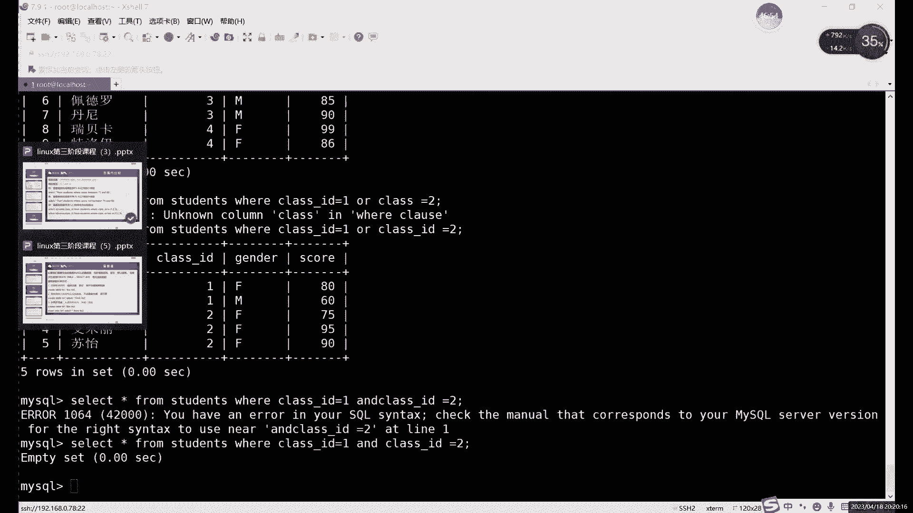

多重条件查询。notote啊还是not取反，哎，这个取反就是反过来算。哎，就是人家写完什么呢？写完这个比叫。总确来说，这个叫要写完我们的。条件之后。啊，写完我们条件之后呢。在条件的前面呢去加。啊。

在前面条件去按照。not能不能和按照一起用，其实也可以啊，不过呢大家用的时候就比较需要注意啊，需要注意啊，你这个。因为end和二那边有已经有一个什么有一个啊需要思考的对吧？就是你是并且还是或者呀，对吧？

你再加一个虚版啊，你如果弄不清楚的话，其实也比较麻烦，所以说一定要弄搞清楚啊，一定要搞清楚这个and和R。理解按然号的一个区别啊。note学板的话就是在已经哎相当于note取板是什么意思？

就是你把当前的这个执行一遍。啊，node取版呢就是不要这些了，我们要剩下的。啊，还有生产的。即使加上按2，它只是更长了一些啊，原原则上是一样的啊，原则上它的意思意义是一样的。好吧。

那后接下来的话我们继续往下看啊，note取版。M的学板就主要注意。除了那个isisn之外，是加is not啊，is not not啊，剩下的话就是在我们的关键词前面加上notote啊，不是not。

不是啊，就是not，就关键词前面加notote。然后呢，我们接下来看什么呢？接下来看这个。啊，这里的话对基本的威尔后边最基本的一些比较的话，我们就已经说完了啊，最基本的一些比较的方式，我的是获取数据啊。

查询的一些方式我已经OK了，对吧？啊，已经说完了，这些的话其实嗯怎么说呢？呃它不难，就是用法有好好几个不同的用法啊，你在具体查询的时候用哪个呢？它不固定啊，大家注意。

它并不知说某种用法一定用在哪种场景下，这个不固定，这个其实就是完全看你的当时哎你的一个需求。啊，或者说你的问题啊问题是什么？需求是什么？这里的话我们这个。就是用这威尔后边这个条件查询的话啊。

主要内容其实就这么多啊，主要内容就这么多。接下来我们看什么呢？啊，接下来看一个叫。接下来我们其实看的是排序呀、封组啊这些。啊，排序分组的内容。排分阻来这边其实就稍微与内容。啊，比前面的稍微难一点啊。

嗯也也就是难了一点。H分组的话，我们不用we尔。哎，不用威尔，或者说也不能说不用威尔吧，就是呃跟威尔呢没有太大关系，就是排氯根组呢和威尔无关。但是能不能用威尔兼持条件呢，其实也可以。

就是你如果只写一个分组啊或者排序什么的，其实不用不到威尔啊，用不到威尔。但是如果说我们想要怎么想要获取到数据之后就是。获取到一个数据之后呢，再对数据进行一个排序。那最好就是谁先先用什么呢？

先用where尔呢去过滤一些条件。过滤好之后呢，剩下的东西哎就过滤剩下来的。哎，我们可以去做什么呢？啊，就可以做这排序啊、分组啊这些操作。啊，我们可以来看一下。首先的话我们就先不用where啊。

我们先不用，我们先只只说这个排序的问题。排序的话在my circlel里边我们用什么用这个alder by。看就是这个。奥德曼啊排序。排序什么意思？他其实就是。数值。啊，函是数值。这个没有什么办法。

述职的话。因为这个数据库里面其实很多就是其实所有的这个用法的话，对于数值来说都可以啊，但对付字符的话没有那么友好，因为有一部分呢确实字符不能用。就比如说比较大小呀，对吧？然后这里的排序呀。

其实都是一个道理，对吧？你大小都不能比较，那这排序其实也是一样的。啊，排序也是一样的。然后这里的话我们可以来看一下。select啊加上字段，这个还是一样的对吧？我们可以用新直接写信号啊。

非常写具体字段话，可以直接写所有的信息啊。信号这里我们代表就是所有信息。然后后边的话我们用什么？后边用这个under by。😊，outderY在哪个位置呢？它在表明的后边，其实严格意义上来说呢。

这里呢哎就是表明之后呢，也不是说直接加alder by，而是什么呢？而是查询结束之后呢，加outder by。😡，要比如我们这里其实是什么？就是一个一个生成的语句之后。想要排序的。才能排排。哎。

就是它相当于是整能个加在我们的这个表格后边。这里的话我们可以也可以加什么？也可以加威尔。哎，就写完威尔之后呢，再去排序呢也行。😊，哎，也可以。这里的话我们就先来排一个。

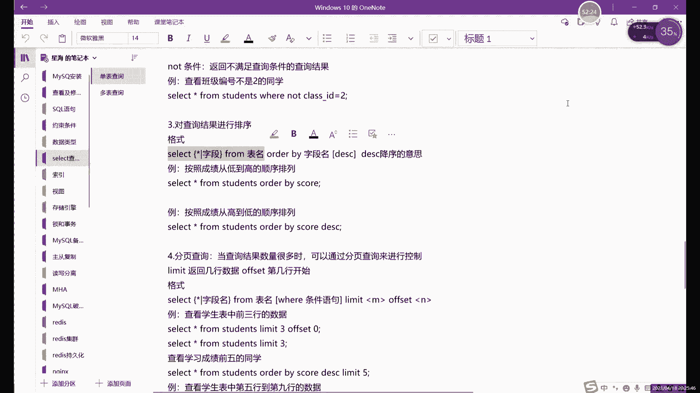

其实我们排的话只能排数值，对吧？我们这里也就三个值。首先的话我们先来排一下成绩吧，因为成绩其实是排序的话，其实是最有意义的对吧？一般排序我们也是以成绩为主嘛，对吧？成绩的排序肯定是最多的。

所以我们就先来看成绩啊。😊，再新pro加什么呢？加上这个students。然后呢，O by。然后后边加什么？后边其实有两种写法，out by呢。😡。

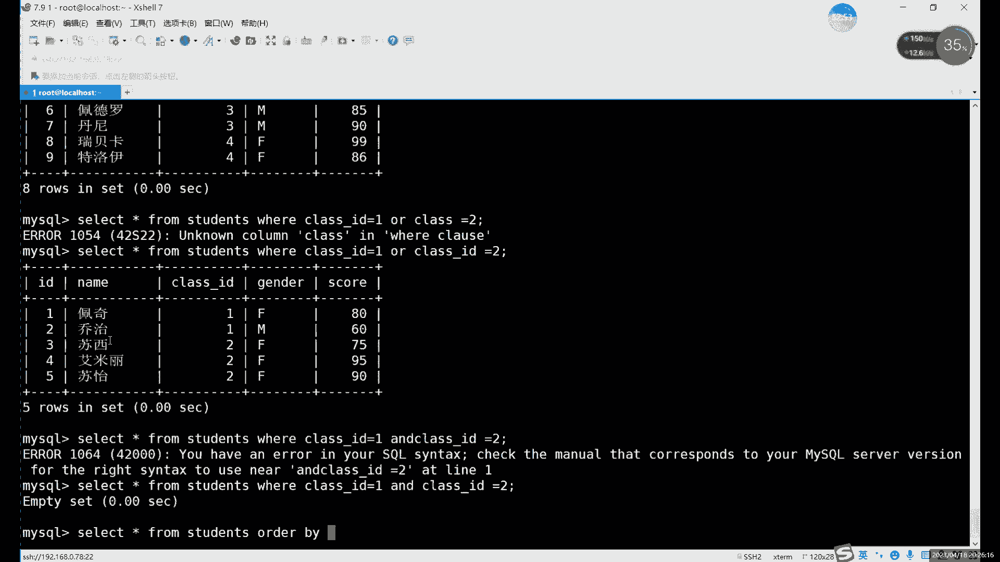

它是一种，还有一种呢叫什么other DSC。

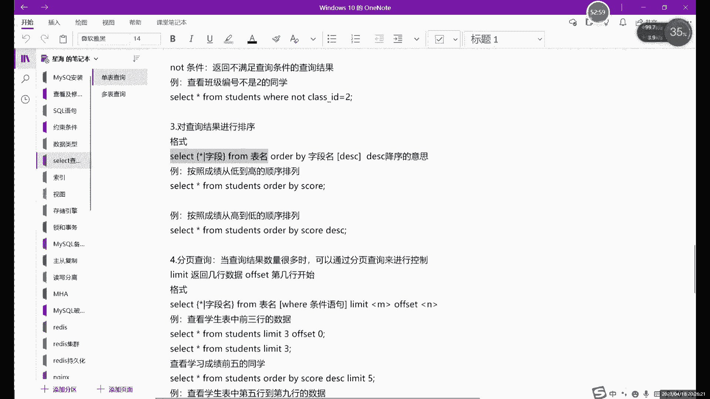

DSC的话，它是个什么呢？😡，不是我们哎这个我们之前不是用DSC去查看这个表格的信息嘛，对吧？就你创建表的时候怎么创建的啊，用这个under by，不是不是out，是用这个。诶。用我们这个这个叫。

R德麦查询。啊我在想说什么来着？发短片呢发短片。这里的话我们这个。啊，对，DSC对吧？DSC我们之前是用来查看这个表格的结构，对吧？查看表格的结构。现在这个DIA它用法不一样啊，它用法是不一样的。

我们先来看一下就知道为DSC是是什么效果了。首先呢啊它会先写示空值啊，先写示空值，然后呢，06075从小往大排，这叫什么？这叫心升序。😊，那这叫生序排序。降序排序是么怎么写呢？就是加上DIC。

BC就降蓄，降蓄的意思就是从大到小不啊，从大到小就叫降蓄。升序的话就是从小到大。啊DIC的话就是从对吧？从99开始啊，一直排到最后。那的话空值，所以说我们把它排到最后。啊，它不是说比零小。

而是它不算值啊，它不算一个值。哎，所以说这里的话我们就是什么呢？这个就是排序的一个用法。对，这是不是很简单，吧排序。当然这里的话没有加什么没有加这个限制条件，当然你想加也可以。就比如说呢。

你想要看一下这个一班的同学的成绩，排个序，当然你就可以先什么呢？可以在威尔这里啊限制一个什么呢？限制一个班级对吧？限制一个班级之后呢，我们再用这个alder by去排序。

那这样的话就相当于显示说的是什么呢？显示说的是这个。一般的一个同学的成绩的一个排名，对吧？哎，我们这里的话嗯就是先是。这也就是我们整体一个排名啊，就整体所有同学的排名。

比如说我们先就是写一下这个where尔吧，刚才说了一下，我们就写出来吧。我说其实不太好，哎，不太没那么好，一看就吧没那么好看，玩察where加上这个class ID。因为什么？因为你如果排序的话。

你这个内容不能太多啊，不能太多，不能太少啊，主要是你不能说只有一行，只有一行的没排没得排了，对吧？没得排，我们看啊所有的。二。1234哎，怎么就这一个呢？1222334442和4东西多一点，对吧？

我们查看二吧。plID等于2。Otherder by。嗯。Where。啊，没有加成绩啊。哎，这里还相当于什么？就是单独把一个班级同学拉出来。啊，来做一个排序，当然这里是什么呢？这里是一个。

因为other by的话，它是申序排序嘛，换成降序的。一般情况下我们还是以降序为主。因为降序的话。从高高从高到低肯定是我们更常看的嘛，对吧？尤其是成绩，哎，959075，对吧？这个就是什么？

这个就是otherder by啊的一个分组哎，不是分组，这个是排序啊，排序从高到低也可以从低到也行，这个要看你具体用哪个啊，具体用哪个。比如这里的话我们就是一个什么就是一个。DSA啊第二次看的话。

DSA的是降许，从高到低的。第一次的话是没有啊没有没有情况下的话就是。诶。从低到高啊，就升序排序。哎，这个的话就是什么？这个就是我们这个。排序的方法啊排序的方法。排面其实还是很实用的，还是很实用。

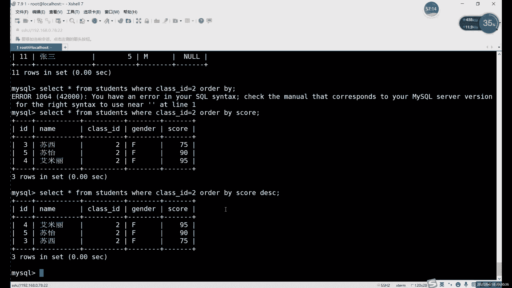

好，我们这里的话啊已经说了好几个了，对吧？说了很多了啊，我们说了这个。集包括集合呀、模菇查询呀。空值判断呀啊条件呀，多个条件查询呀、取仿呀，包括这个排序啊，大家可以先消化消化啊。

因为我们这个今天内容确实是主要围绕slaag的展开的啊，内容很多啊，小的用法这个点很多啊，大家可以就直接看着笔记跟着跟着做啊，跟着理解。笔记的话，其实我看之前上节课的上节课的录屏旁边是有放的啊。

上节课是已经笔记已经传上去了。啊后大家可以打开网上看一下。因为内容比较多啊，所以大家一定得跟跟上啊跟上。有哪个不理解可以直接问啊。有哪个理解不理解，可以直接问。好，我们可以先下课休息几分钟啊。

大家可以先交化消化啊消化一下。

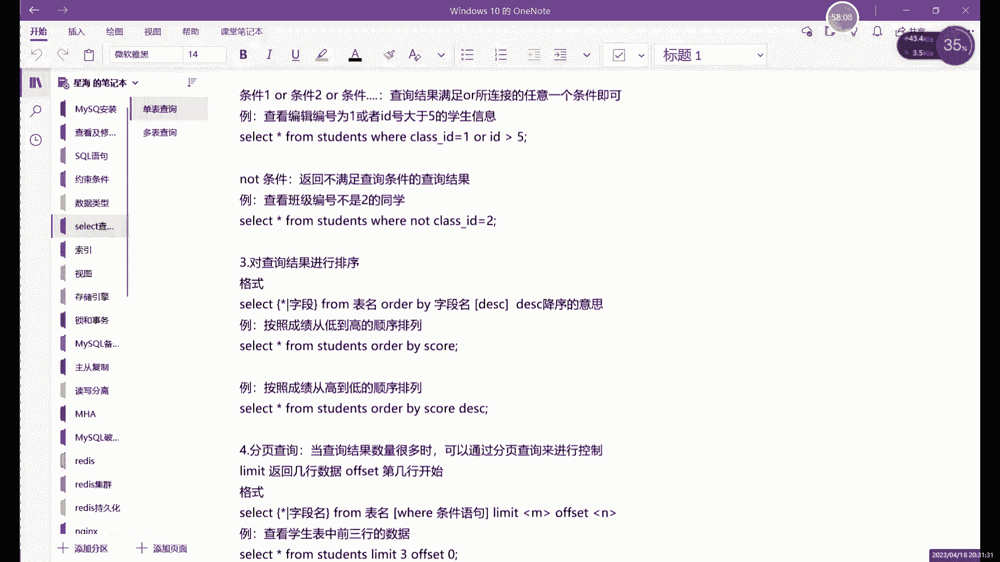

好，我们继续往下看啊，继续往下看排序说完了，对吧？我们接下来啊来说一个。分组。或者叫分页啊，不要分组吧，就要分页分页查询。为什么要现在要说这个封叶查询呢？因为。大家可以看啊。

就是我们在分就是在排序之后呢，就是他对原有的这个数据之后排序之后，不管说你正着排也好，还是倒着排也好，这个应这个应该是啊alder byDSC对吧？降序排序，这个其实算是正着排，对吧？就从大到小嘛。

这样这样还好看一点，然后上面这个从小到大对吧？两种方式。那这两种方式呢啊你不管是从小到大排，还是从大到小排。结果它不变对吧？结果是不变的那这样排呃，除了就是好看以外，还有什么用呢？啊。

我们还可以提取一些哎特定的一些数据。什么意思呢？啊，我们接下来就来看一下这个分页查询。分页查询呢，哪怕并不是说把我们数据分成一页两页的意思啊。它准确来说呢，它就是这个head和 tell。

这两个大家这两个命令应该还记得对吧？第一阶段啊吧，第一阶段都讲过。这两命令。他俩呢大家应该还没忘记他们的一个作用，对吧？查看。查看文件的内容。或者更准确来说呢，他们就不仅仅能看文件啊。

他们除了文件以外呢，他也他们也能看一些啊就是或一些命令获取到的一些结果啊，也可以用这两个命令去查看，对吧？就比如说黑istory对吧？黑想看最后几行的命令，想看最后几个密史命的话。

可以黑ory加上t杠几啊就能看。就比如说我们现在啊啊就是我们这个排序这里啊，比如说这样。就是我们现在排序得出来这么一个结果，对吧？95、9075。如果如果想看一下二班的第一名是谁。对吧我就得看这个对吧？

就看第一个。啊这个查询的话，我们就是排序排了一个第一名出来。但是呢如果说只想看这一位同学的话，那怎么办呢？啊，就可以用到分页查询了，也就是类似于head和tail。啊类似 had the tail。

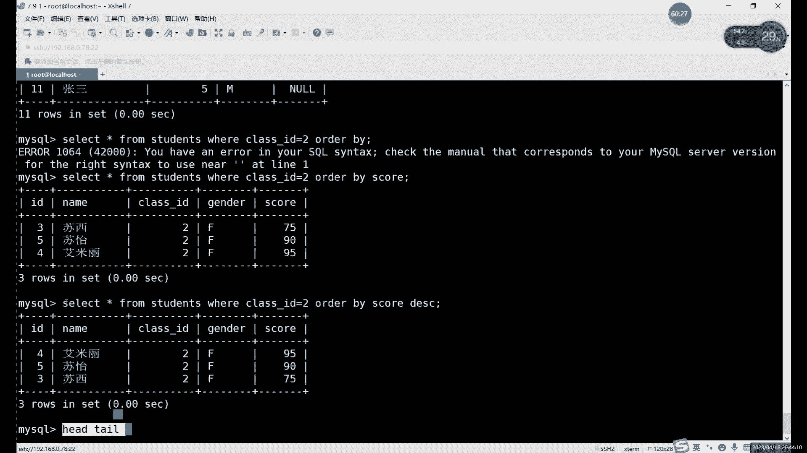

用法上的话其实是。可以说用法上是一样的。哎，不过呢我们这个呢啊它不叫ha tell啊，它叫limit和 offset。

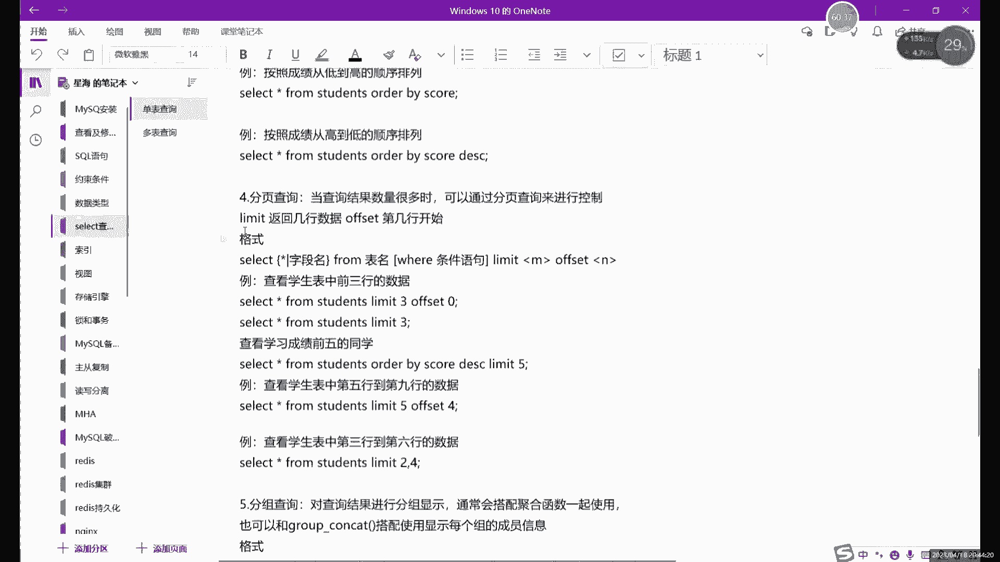

啊，作用是类似于ha tell啊作用类似ha tell，也就是取一部分内容嘛，截取一部分内容去显示。

放到我们这里来看的话，它其实就是什么呢？😡，我们可以来看一下。首先呢哎我们刚才排了三位同学出来，我想看第一名怎么办呢？他其实就是看第一行的内容，对吧？看第一行的内容。这的话它其实就是什么呢？就是。

资料查询之后，哎，得出的数据，然后后边加什么呢？后面加上limit和off这两个组合。limit了它就类似于谁呢？😡，其实limit和它其实它不能算什么，就是和ha tell就不一样。

ha tell它是两个完全相反的一用处，对吧？在我们的这个分页查询里面啊，它其实就是什么呢？它其实换了一种说法，或者说换一种方式limit就是从。返回几行数据的意思啊，limit就是返回几行数据。

就是看几行数据啊，我们就只从上往下看。😡，啊，从上往下看，大家注意啊，我们这个是从上往下看啊，在长远有遍我们这个虽然说和hahead tail是类似的，但其实呢真正呢其实用的是headd命啊，不用太。

用的是headd命。这是它的t命令就不一样。limit话就是返回几行数据，默认的话。

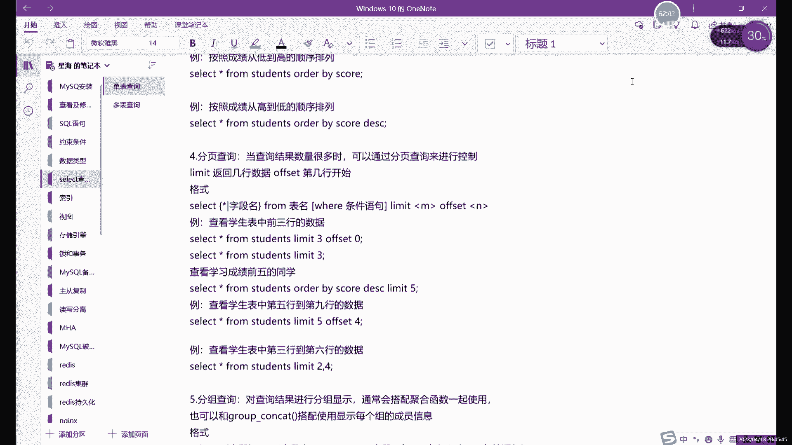

就比如说我们想要看一下我们班级里边不是班级嘛，就是我们这个。学生啊学员信息表里边排名前三的同学的成绩怎么看呢？我们就直接来查询一下吧。我们这个首先查询的话用到的是什么呢？用到的是alder by对吧？

用成绩去查询DIC的话降序查询对吧？99到n。这么多对吧？如果说我想要看前三名呢，那我们就是这三个执行，就是执行之后呢，继续加什么呢？继续加limit。我想看前三名那就是显示三行，对吧？显示三行。啊。

 limitit3。啊，它就显示出了前三名同学的成经。对吧它就相当于什么？它这个就是和ha命令用法一样。单独一种情况下呢，就和hat是一样的。就从第一行开始显示什么呢？显示我们的这个内容。啊。

从第一行开始呢，显示显示多少航呢，lim三的值就是显示三行啊，显示三行内容。😊，啊，如果说想想想显示五行的前5名同学，对吧？你就换数字就可以。对吧前五位。啊，这个就是什么？这个就是我们的。排序啊。

不是不排序就分页。这个翻页呢。啊，他相当于就是截取一部分。哎，更准确来说，应该就截取一部分数据。呃，一截取一部分已经查询好的数据。更准确来说，哎，就是截一部分已经查好的。

他们也不会对结果发生太大的改变啊，他只是把一部分结果拿出来，让我们更方便去查看，还更方便去查看。不我们其实这里数据还少，如果数据比较多，对吧？有几行几十行数据的情况下呢。我们查询一下排了一个序，对吧？

排了一个序的话，其实。我们你看到上面就看不到下面了，对吧？看到下面就看不到上面了，所以这个不太不是很方便。那这个limit呢其实就是用用来干什么？用来就是在我们啊排序之后啊，limit的用法的话。

更多就是它和排序一起用。啊，就是我们这个分页呢能不能单独用呢？也可以单独用啊，就单独用的话意义不太大。啊，就比如说呢哎如果说我们直接把这个表格分一页行不行呢？就比如说。

Sing from students。能不能最小声页呢？比如limit3。它也可以分，它就是它是按什么分呢？它是按ID来分呢，相当于是啊前三个IDD显示出来对吧？有意义呢，其实意义不是特别大啊。

意气不是特别大，但是可以用啊也可以用。更多的话我们排序啊，就是我们的分页呢更多就会要要和排序一起用。因为你排完序之后呢。😊，想要更准确的看出一部分内容的话啊，就可以用这个limit啊就限制。哎。

你我们看几个。啊，数字是几个就看几个啊，这个的话就是什么？这个就是我们的limit这里的用法。

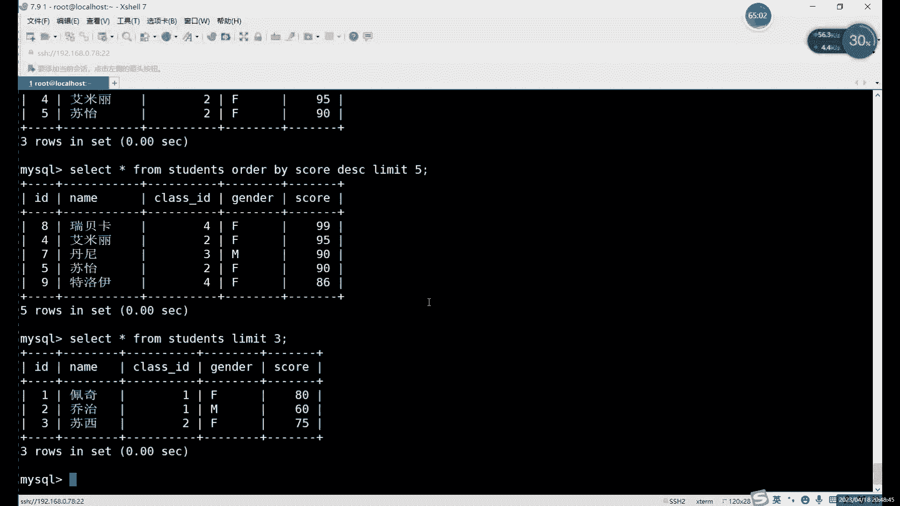

那我刚才说了，我们这两，其实我们这分页的完整用法是limit加上什么，加上outset。啊，刚才没有说opset对吧？😡，单独的一个命域呢，它类似于had。那如果加上obet呢。

它其实就是had加上tail啊，当然了，这个opset它不是tail的意思，它不是tail的意思。它的t用法可不一样啊，我们这里的话就是从上往下开。大家注意，我们这个风卷查询永远是从上往下看。啊。

没有从下往上看之数啊。一定要注意这个就是永远是从从上往下。然后接下来的话我们来看一下这个从上往下看。咱么看下面的内容啊，就我们就需要利用到这个opite。就比如说我能不能看倒数第一名的成绩呢，其实可以。

啊，我们可以看倒数第一名的成绩。只不呢哎看到数第一名的话，还是用厘米的。啊，我们如果你是只想看一个的话，就是。

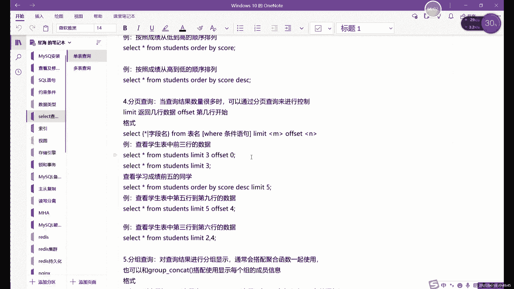

呢面题一。😊，比如说我们跟这里可以大家演示一下，先演示一下这个倒数第一名怎么看啊，比如说先写第一名第一。然后呢，再写offset。奥赛的几呢哎这个的话具体要数数数这个数量，什么意思呢？

因为这个嗯我们这个复页查询的话，它永远是从上往下走。

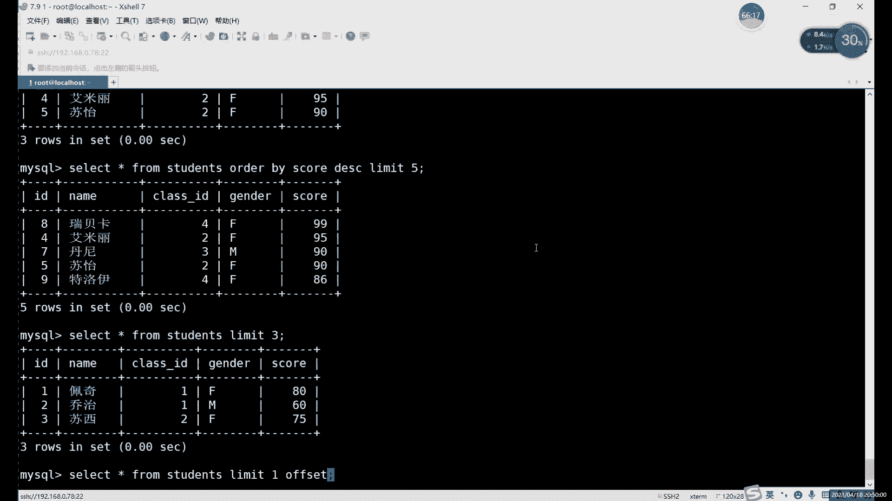

所以说呢你得如果说想要看看下边的东西的话，就需要数一下啊，数一下有几有几个。啊，你比如说我们这个成绩的话，一共其实是。哎，其实可以说是10个，因为我们后边不是又插了第11个问题。

第1第11个是空值不算嘛。控制不算的话，我们就10个场绩，对吧？就10个场绩。如果这是我们想看第1名，也就是倒数第一名的时候呢，那怎么看呢？啊，很简单的就是看一下这个。从第几行开始看。因为默认的。

limiter它是从第一行开始。

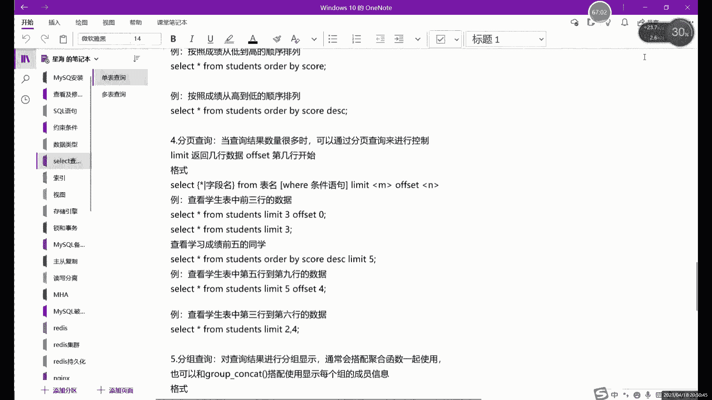

那如果说啊加上offite之后呢，offite可以帮助我们设置一下，从第行开始。我们这里就写一个。9吧。啊，第九行开始对吧？其实不是第九行，大家注意啊，我们可以看到我们的ID呢还不说ID就是我们这零。

成绩是零的这种们排子是第10位，对吧？排第十0位，也就是第十行。那这里的话我们是offsite9啊，大家注意啊，一定是offsite9。因为什么呢？因为我们的零呢。第一位是谁呢？第一位是0。啊。

就第一行的话，我们是用零来代表的。就比如说我们来看一下。我们换成零给大家看一下，应为是0。啊，就是第一位同学啊，当然这里我们没有排序啊，还没有排序。我们这里只是通过只是看一下这个，你就不行排一下吧啊。

排一下。二der by limit1。对吧，99分。那，limit倒数第一名的话啊，当然还是这个。刚好啊他的这个信息的话就是第10位的。所以说呢从第九第十行开始看的话，倒倒数第一个行法啊。

也就是什么意思？就是。😡，正常的一个limit一，什么都不加的话，它就从第行开始看。想要从第后边的就是从第二行开始，或者从第三行开始的话，就需要加这个offet。啊。

你看你如果其实它我们这个lining的话，它不能倒处倒着看啊，是不能倒着看的。它最多就是什么呢？它最多就是从上往下看。啊，就是从倒数第第几行开始再看这个才行。他不用说从倒数第一到数第二这么来看。

没有这个说法啊，这是从上往下的啊，这个大家一定要理解啊，就是哦limit命令的话就是从上往下固定从上往下啊，它没有从下往上的用法。然后还再一个需要注意的就是第一行是0啊，就在op这里的话。

第一行永远是0。然后第二行是123都往下排啊，都往下排。这就是分页查询的一个用法啊分页查询的用法。然后这里的话我们可以看一下。啊，当然这个确实它确实是它一个缺点啊，确实是它一个缺点。嗯。

如果说你想从中间看的话，也可以。啊，从中间去截取的话也是行，也可以的，就是还是用outside啊还是用outsideoutside的话，其实就是从中间截取啊，从中间截取。比如说呢我们可以来看一下这个。

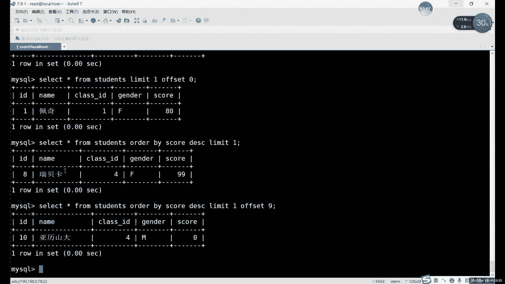

从这边截的话，这个就要看你到底想看第几行到第几行了啊，第几行到第几行。比如说呢我们这里来看个例子吧啊，如果说我们想要看从第五行到第九行的数据。首先第一。你要知道你要看几行。啊。从比如说从第五行到第几行。

这个举第五到第九就举例子吧啊，第五行到第九行是几行呢？56789对吧？五行。对不知道就数一下啊，不知道就数一下。5行内容我们limit就是5，对吧？那如果说从第五行开始看呢，那我们该写几呢？

那就只能写什么？减写4，大家一定要记得减个一啊，一定要减一下一。你从第几行开始呢，一定要是opite的减减一啊，减个一再写啊，减个一再写。啊，这个就是什么呢？这个就是哎我们这个如果你想从中间去截取。

从中间去看的话，那就这样去看。啊，对呀，你看。对吧再换一个，比如说你从第三行到第六行，一共几行呢？一共是四行。对吧从D墙开始呢，从二开始。然后呢，这种写法的话是简写就是省略ofet省略upet怎么写呢？

就是先写这个offset值再写limit的值。啊，这是一个特殊的用法啊，稍微特殊点用法，顺序需要换一下。哎，就是先写谁呢？先写这个opset。😊，啊，简写的话就先写op再写limit。😊，啊。

就是这么一个区别啊，这个一定要需要一定要注意啊。这两个limit outside和这个里直接写limit。加逗号呢是不一样的，它们的值的话是相反的啊，千万不要搞混了。啊，不要看到24的话，就是我看两行。

从第五行开始啊，这可不是啊，这不是这个一定这个是。反过来看啊，你要记得反过来看。啊，所以说我们接来可以对吧，比如说。如果说我想看什么呢？啊，我想看一个从。第六行到第十行的数据我该怎么看？啊。

大家可以可以发出来。我如果想看从第六行到第十行的数据，我应该用什么命令？啊，用limit of再准备去写。啊，大家可以想一下啊，因为这个的话一定要有分页查询的话，你得。多写几个对吧？多写几个，多写几遍。

你才你才能记住啊，才知道这个用法。啊，大家可以想一下，哎，咱从第六行到第十行需要需要怎么写。啊，需要怎么写？啊，可以给大家几秒钟思考时间啊，想一下从第六行到第十行怎么写。啊。第六行到第三行一共是几行呢？

678910对吧？还是十还是5行。对吧所以limit呢就是5，对吧？outset呢。6减一是5。啊，所以他还是5。所以说这种情况下的话，你是可以两种写法，就limit5op5。

或者说是limit5逗少5。啊，因为前面两后边两个都一样，所以说你先写哪个。所以你分这种情况下，你分不清，其实也无所谓了啊，这个这个其实。这体育没没弄好啊，这两个都一样。啊，两个都一样。哎。

所以说这个的话一定要注意啊。😊，啊，一定要注意。有没有upset一个区别啊？没有upset的话，就前面这个是。从第几行开始，后边这个是看几行，有out的情况下，就是前面是第几行啊，前面是看几行。

后边是从第几行开始啊，一定要注意这个。这个很重要很重要。也有个这因为这个的话其实涉及到什么？涉及到你这个分页。就比如说呢一般它不一定会有这个upset，但是呢libit肯定会有，对吧？

limit可能会有。当然只有利运的话，其实还好说。啊，好分一点，对吧？有利用的话，就比如说你看几行就就是几，对吧？看几行就是几前三名呢就是就写个三，对吧？后三名呢。后三名的话也是写的三啊。

如果后三名的话需要什么呢？啊，需要看一下这个，因为这个其实就是这个其实就是唯一的分页查询的唯一缺点吧。嗯，遇的缺点。其他地方的话其实还好啊。就是唯一的缺点就是我们得看一下这个行数啊，看一下行数。

然后数一下到底就是算一下啊，不能说数一下，数一下，感觉有点太算一下啊，算一下我们这个到底该从几行开始啊。然后的话这里这个比如说我再再演示一个啊，你可以演示一个的从第几行到底行看嘛。

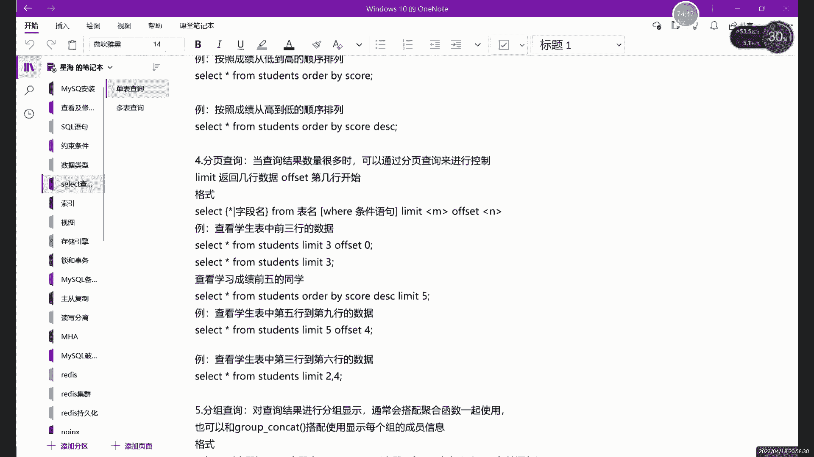

啊，就是第几名到第几名。啊，我们这就不排名了，不排名的话，这个其实不明显，我们就直接用这个列表来看。因为列表里面有ID嘛，那ID可以帮我们去检查一下。就比如说呢。我随便写一个对吧？随便写1个223。

这个代表什么？啊，厘米2off3代表什么？第几行到第几行？对吧首先呢我们先来看，一定要先看offet啊，大家注意一定要先看offset。outside3代表从第四行开始，对吧？limit呢代表两行。

那这个的意思其实就什么呢？第四行和第五行。对吧。😊，第三第五行就ID这4和5啊，这样话我们可以方便检查一下。啊发给他一下。啊，这个就是什么？这个就是我们。分页查询。啊，就显示多少行。

用什么主要就是limit啊limit。Oet呢它不一定一定不一定每次都用，但是limit一定都会会有。然后呢，哎如果说我们行数比较多，就你不能数的情况，当然我们现在肯定知道我们一共一共多少行，对吧？

所以说从后往前数，其实也没什么太大影响。那如果说哎我们不知道有多少行的情况下呢，在这这次这下该怎么办呢？啊，当然我们还是也是有办法的啊，什么办法呢？😡。

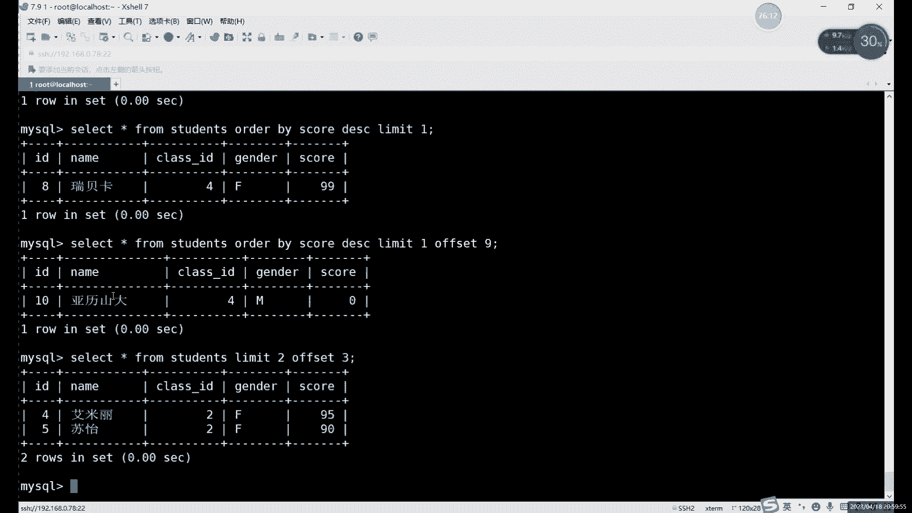

我们现在需要借用一个东西。哎，借用一个叫函数的东西。啊，接下来我们这个分页查询说完之后呢，我们接下来就是分组查询啊，分组查询的话，我们也里面啊也会有个函涉及到这个函数的问题。你们就先说一个函数，对吧？

就方便我们这里这个这个就是为了我们现在的这个分页查询服务的啊，我们先说第一个函数技术函数。😊，基数函数这个大家应该还好理解，对吧？就是数一下一共有多少位啊，不是要数多少位，就是有数一下有多少个数据啊。

基数的意思就是数多少个数据的意思。😊，对吧那如果说现在呢我们有一个表格，我们想要看从哎可要看倒数前三呃，不是不是倒数后三啊，不对，不应按倒数后三，也就是倒数前三嘛，应该这么说。

倒数前三呢前三名同学的一个成绩，对吧？如果说我们想看的话。需要怎么看呢？啊，前三名同学。啊，不是后三名啊，后三名后三名的话，我刚才说了必须要必须要什么呢？哎，必须要这个。知道行数对吧？知道行数的话。

这个这个怎么去判断呢？或者说怎么去。计算呢这个就需要什么呢？就需要我们这个。这个叫。啊技术函数。因为什么？因为如果列数太多，我们这个列数少，对吧？而且我们有ID有ID情况下的话，其实我们是可以看什么呢？

可以看有多少行的。啊，如果说碰到一些你过滤好之后。ID已经不全了，对吧？哎，碰到一些比如说过滤好之后呢，ID已经不全了的情况，而且也不太好数啊，行数比较多不好数情况下。这下的话我们就需要用到什么呢？

需要用到这个函数来帮忙了。他这个函数的怎么用呢？啊，这个其实我之前啊稍微透露过一点。Select。from where对吧？这是至少是三部分，我们组成语句的一个三部分，对吧？

slaag啊 form后面就加是表格啊，这个只有一种用法，没有其他特殊的。然后呢，威尔后边加条件。那这个函数创造条件呢？他其实不算条件。😡，大家注意啊，就是我们这函数呢函数它。

它其实并不算是一个呃实际的一个条件啊。而是一个什么呢？而是一个计算结果。😡，啊，函数头其实我们在这里的话，其实是一个什么？其实是一个计算结果。什么意思呢？😡，比如说我们先来看一下。来看一下这边。嗯。

我们接来看一个函数，函数这里其实。啊，这里已经我其实已经把这个我们命令的一个常用的一个。几部分写出来了，已经写出来了。因为函数是结果，所以说呢要写在哪个部分呢？要写在sla。啊，这个其实之前也说过一点。

啊，思这里的话，除了我们写星号，写字段以外。😡，啊，一个一个第三啊第三个写的，第三长写的就是什么？就是我们的。这个应该叫函数。啊，函数。那函数子有什么用呢？或者说是函数它怎么显示呢？😡，啊，怎么计算呢？

啊，这些的话。😡，首先我们先来看什么？先来看一个Ct技术的。就比如说我们直接来演示吧，其实这个函数很简单啊。

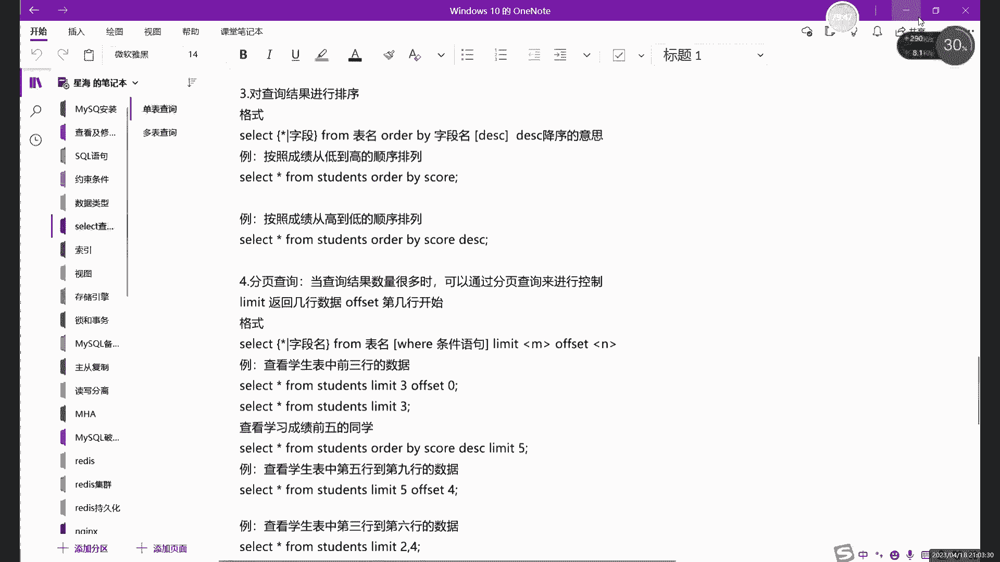

SELECTs court。呃，比如我们记哪个呢？我看一下记哪个嗯。

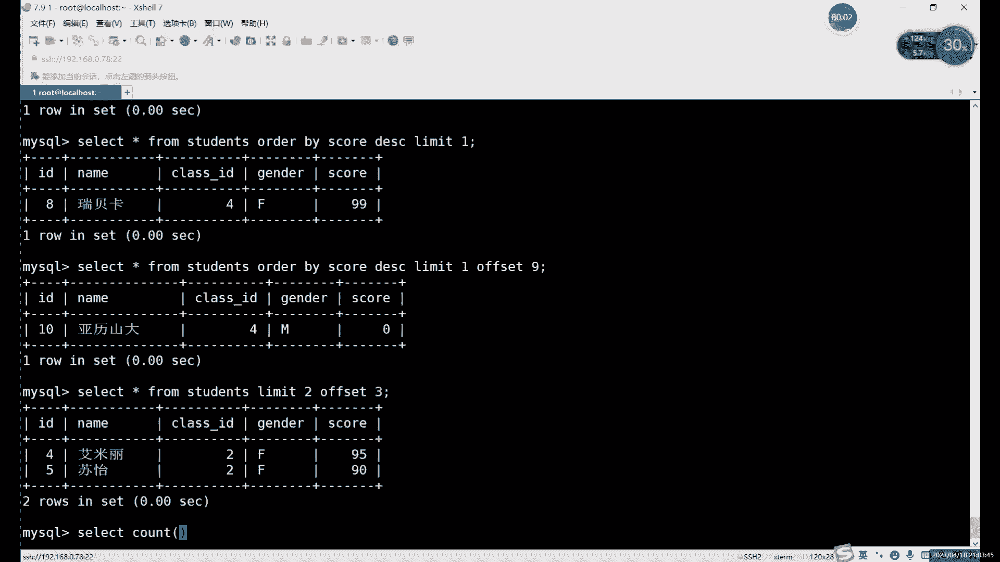

嗯。其实如果是只数一下数据的话，其实这哪个也行啊，这两个都效果一样。啊，有区别不大。

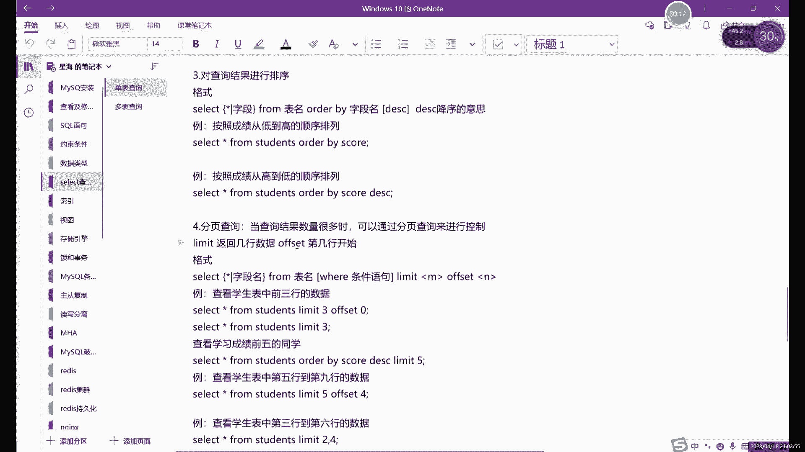

嗯，我们就记个ID吧。from。😡，嗯，这个叫。Students。Where。这样的话更准确一点嘛啊这样更准确一点。就是什么呢？就是我们的有成绩的同学有多少位，对吧？

我这个这个语句的意思就是有成绩同学有多少位。后边是什么呢？后边是iddonnot now对吧？就是飞空的同学啊，成绩飞空的一共多少个同学，我们数ID其实数哪个都可以啊，数哪个都可以。只要他没有空值的话。

数哪个都可以。因为我们呢为什么要数ID呢？因为其其实ID是绝对不会空的啊，这个是放心。大家其他的。字段都有可能空，但ID呢一定不会空，为什么呢？因为我们的ID呢是自增约束。啊，我们的ID是自增约束。

所以说呢这个绝对不会空。所以说一般情况下的话，你就是选什么呢？选这个自增约束，对吧？非空约束。主件约束这几种啊去计算一些数值啊，去计算一下我们的数据有多少行。因为你如果说你选其他的。

哪怕你选一有唯一性约束的，它有可能为空呢，它有可能为空。那一旦它空了，那会造成什么结果呢？啊，它就少了一行，那就相当于给你少计算了一行对吧？也许就是那一那一格那那一小格啊。

就是说那一小这一小格里边没有什么呢。没有数据，没有一一格没有数据的话，它会影响到你这个整体的一个判断，它就整体少了一行。一扫了一行的话，如果说你后边用limit去限制，对吧？排序的时候排序也好啊。

限制也好啊，它那个结果就不一样了。啊，结果就。不是你想的那样，所以说呢一定要注意啊。一定要注意这个。计数的时候呢，选用什么呢？选用这种唯一就是不是选用飞空的主件的自增约束这三这几种啊。嗯。

然后或者说有默认约束也行啊，默认约束的话也不会被空啊啊，默认约束数也好啊，默认约束也不会被空。这里的话就是什么？这个就是我们的。cd啊函数的用法。当然这只是其中一个函数啊。

后边呢另外几个其实也不着那个不着急啊。我们先说这个技数的话，我们现在知道了这个数量了，对吧？啊，有ca我们可以知道数量，知道数量之后呢。我们其实用到用这个limit呀，用op其就方便一些，对吧？

比如说现在我们知道有十行，有十行的话，倒数十0名怎么表示呢？看看第一行对吧？然后就limit是一，倒数第一怎么看呢？就limit是一。然后呢，upside写几呢，10减1就可以，对吧？就是9。

就我们这边的limit19，或者说就是limit9到1也行。啊，这个就是。对吧limit如果说你没办法确定什么确定总行数的情况下呢。同上如果说从开始为数的话，到这个就不用管行数了啊。

从开始数其实就不用管行数了。如果你是从后往前走的话啊，一定要什么？一定要先统计下行数，用什么命令，用cutt命令。而且呢你一定要注意啊，就是。你就是我看一下啊。

那比如说我们是用这个outder by score来排序，对吧？你就是什么？你就是把这一个。😡，的星号换成什么呢？换成Ct去排去数一下，一共有几个，然后呢，你正常在查的时候再换回星号。为什么这样呢？

因为你如果说你换了后边的条件的话，可能一定一定不能换后边条件就数的时候呢，就是把星号换一下就可以了。后边可不要动，因为你后边一旦动了，它可能就什它这行数不一样了。V尔条件如果说变了的话。

那V尔就是我们的行数有可能会发生变化。行数一旦变了，那我们这个就不能什么了。也相当于是。啊，你这个这边数的数的是九行，对吧？那边数的八行。对吧那那你这个limit其实判断还是有问题，对吧？

limit还是容易出错，所以说候一定要注意这个cutt用法啊，选什么呢？首先选这种非空约数。第二呢就是用的时候，你比如说给某一个limit，对吧？给某一要用limit的这个语句来算的话。

就一定要保持原样，对吧？只是把信号换成Ct这样去计算，好吧，这个就是什么？这个就是我们的。接数函数配合我们的limit的这一个使用啊，配合分页查询的使用。

啊，分样查询的话，其实就是我们取一部分数据的一个作用啊，就取一部分数据。然后接下来的话，我们来来看一下什么呢？排序排完了，对吧？分就是分页我也能分，对吧？能看前几名、前几名、后几名的倒数几名的。然后呢。

最后我们来看什么？最后来看分组。啊，前边的讲的那两个就是分页和排序。又有一个。特点就是什么呢？就是。更多的用在哪，用在数值方面的整数方面的对吧？那分就是我们字符其实也用起来不太好用。

所以我们接下来的话这个就还是得考虑到字符的感受。所以说我们接下来呢这个肯定是需要让字符也能参与进来的啊，让字符也一起参与进来的。什么意思？还有一个就是分组。专组查询。分组查询它有什么作用呢？

或者它的一个主要目的是什么呢？其实就是什么？就是把一组数据拿出来进行对比。那，这一组数据呢话一定是要有什么？一定要有共同之处，什么意思呢？就比如说。我们这个表格里面能分组的是什么呢？沉绩能分组吗？

其实它不能分组。啊，成绩这个其实。但也不是说不能就是分出来的话，也没什么太大效果。啊，我们一般这个表格就是我们现在这个表格用什么分组比较好呢？

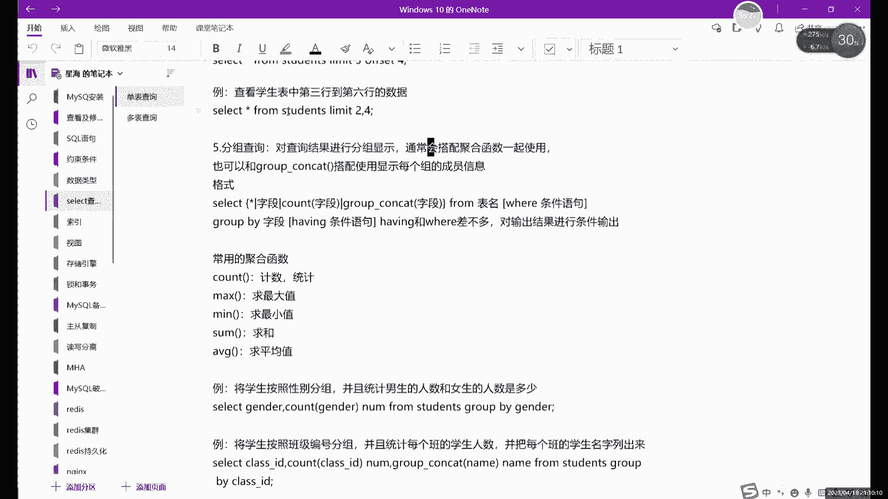

啊。classID。性别。对吧就是有一些数据呢，它有一些共同，哎，就是数据相同。啊，有些行的数据相同，那这些相同有相同数据行的这些数据呢，也都可以作为一组去比较统计。啊。或者计算都可以。

就比如说我们看一下这个。成绩的话，其实如果说量就是我们的这个数据量比较大的话，成绩它可能也会出现很多重复的那这个时候再分其实也也不迟。对？我们这个其实因为每一个层绩基本上就一个最多两个人。

所以呢就成绩分组不太合适。啊，真的回头成绩分组不合适。所以说我们这个表格的话，我们就以这个class IDD就班级名称和谁呢？和我们的性别来分组。啊，这两个其实分组意义啊或者分组作用更大一点啊。

分组的作用更大一些。比如说我们这里可以看一下什么呢？啊，看一下这个。比如我们的分组呢，这里。首先呢我们先用什么？先用这个class IDD分个组备啊，先用class IDD分个组。分组的话。

首先我们的用法呢是group by啊，group by的话就是分组的关键词。

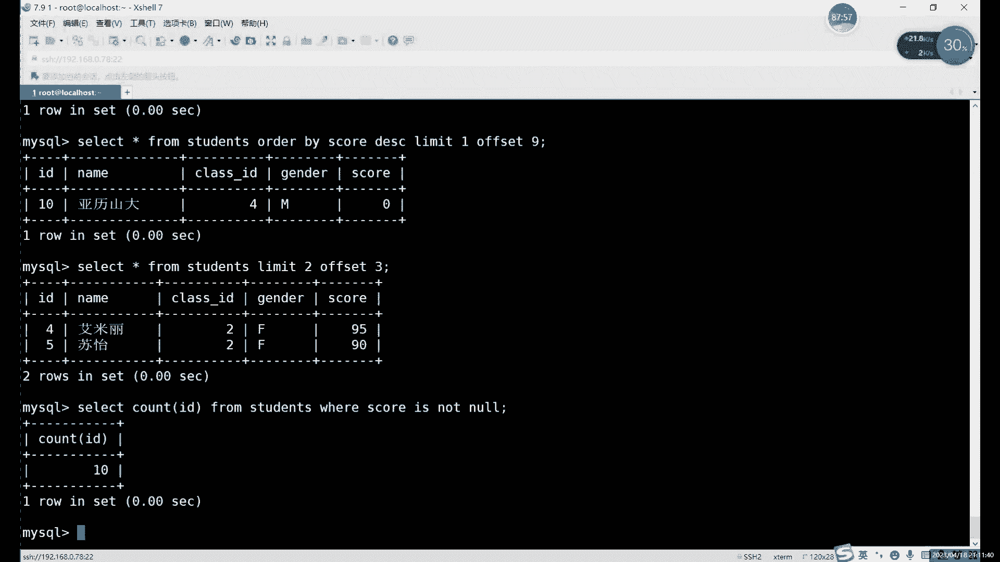

啊，根组的关键词。group up。分组查询的话，我们后边加的是什么呢？后边加的是我们这个组的一个字段。啊有分组字段。然后写完分组字段之后呢啊我们就这个其实分组查询呢，这里比较特殊一点啊。

但然这里我们还是不写where，因为写了where的话，我们数据就太少了啊，本身我们数据不多，我们就不用where再去限制了。好吧，我们就不用这里的话暂时不用where，我们就直接用什么。

直接用g by。但是用where的话，where写在哪呢？还写在这个from后边from后边，然后where，然后g by的话是最在最后啊，g back是在最后。😊，然后呢。

这里的话我们可以看一下什么呢？看一下这个。具体分额怎么来分呢？啊，就是首先呢按照这个性别分组之后。查询数据。或者说处理数据的话，我们用什么呢？会用到这些函数。就比如说怎么用呢？😡，可以进行技术。啊。

可以进行技术。然后下面几个呢。怎么说呢？呃，对字符来说还是不是不太公平，为什么呢？就是下面几个最大值最小值求和平均值。还是什么呢？还是数值。啊，还是数据，就是对于字符来说呢。

其实用过数据里边很多东西有很多用法，字符它不能参与啊，有一部分他就不能参与。我们字符能参与的就是这个技术。啊，就比如说我们这里是性别，对吧？性别我们技术怎么记术。

就比如说哎数一下每个性别有多少位同学可以用技术嘛？可以对吧？就用的是技术。啊，求最大值最小值这个怎么办呢？啊，这个我们后边可以在那个。啊，可以在那边成绩分组的时候也可以用啊，成绩分组。但成绩分组的话。

其实因为我们成绩的这个整体的量比较小，分组出来啊，其实效果不太好。啊，当然这个函数呢啊大家注意，也就函数呢，它并不是说。只能。和分组一起用啊，不是这样，就是。分组的话一般会加上函数来使用啊。

但是函数也可以单独自己用啊。对吧比如我们刚才那个数数数嘛，数一下这个这个表格有多少列啊，不是有多少行，是吧？为了方便limit运行使用，对吧？我们也可以单独用啊，不一定是要加分组。我们这里分组的话。

因为如果你是字符的分组，那就只能用一个技术了啊，剩下的四个是不能用的。你只有什么呢？只有这个。数值的分组呢才能才能用到这个最大值最小值的问题。啊。而且呢其实数值分组最大值最小值其实也不对。有人说不对的。

因为按要数字分组，它是如果说按成绩分组的话，它是相同乘绩的为一组，那最大值一样对吧？最小值一样，平值平均值一样啊，它只能最多也只能算一个求和。啊，汉有桥河。啊，这个就是什么？这就是这个函数的用法。

函数的话。大家可以单独先用一下，哎，不着急和其他的一起绑定使用啊，不着急和其他一起用，就先用什么呢？大家可以先用一下这个。这个叫叫什么？先用一下这个单独的函数。可以算一些东西。

对吧比如说呢我们就先用一些单个函数吧，我们先不着急和分组一起来啊，号我们才用过了，对吧？我可以来看一下剩下这几个。😊。

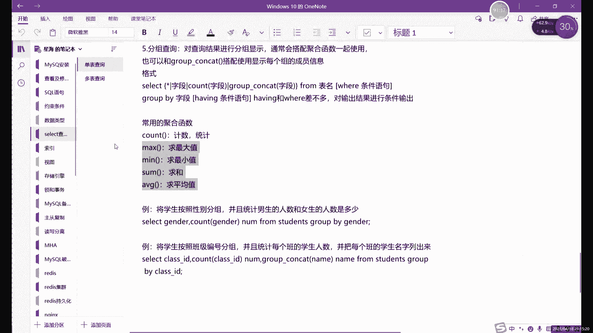

最大值最小值。怎么查呢？最大值max对吧？对大值成绩。这个什么意思呢？就是。students表格里面成绩最大的1个99分，对吧？这就是什么？这就是。单独使用的方法对吧？很简单嘛，最小值也一样。

就是不需我们去算，而是这就类似于我们excel表格里边那些求最大最小值求和啊，平行值那个FX那个函数是一样的，一例子。不需要我们自己去计算，而是就是我们操作，就是我们来操作，就是让他算什么。

他就他就给我们算什么。啊。也相当于一个计算器的作用啊，这是求最大值最小值，对吧？这个很简单，我们来看一个什么呢？cutt这个技术我们就不看了，我们来看一个。嗯嗯。

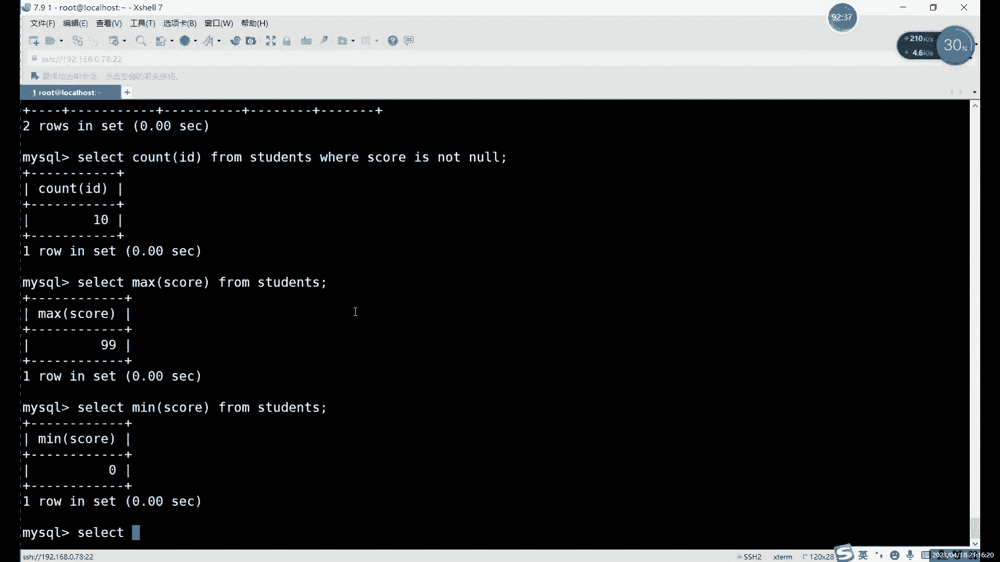

求和平均值这两个其实差不多啊，求和平均值这两个差不多。因为。

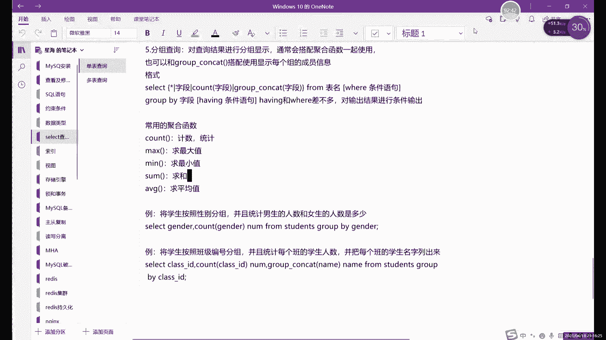

三。是。成绩的平均值呢不是成绩的总和的话。算法总和其实你除个十啊，它不就是平均值嘛，对吧？平均值。760分。对吧那算平均值怎么算呢？啊，还是SORE啊。换成什么？换成那个。田建值。Okay。对吧。

76分。啊，他肯定是不会出1亿的，因为它有一个是没有数据的，没有数据的话，它其实s的总数是其实就是10个，而不是11个啊，就是10个。10个的话除以10对吧？那就是76啊。

它这里会自动给我们保留几位小数。啊，这个的话就是什么？这个就是我们这个。这叫。函数的用法。函数自己单独用的话，其实就计算一些什么呢？下边四个函数一般就是用来计算我们的数值的。哎，算一下最大值最小值啊。

我们的平均值啊、总和等等这些作用。那cd函数的话，这个除了和数字一起用以外，它还可以重新字符。啊，准确的说的话，它其实就是统计有它统计一下行数。啊，统计些函数，或者说有多少个值。都可以。然后呢。

我们接下来看一下，怎么看一下这个。

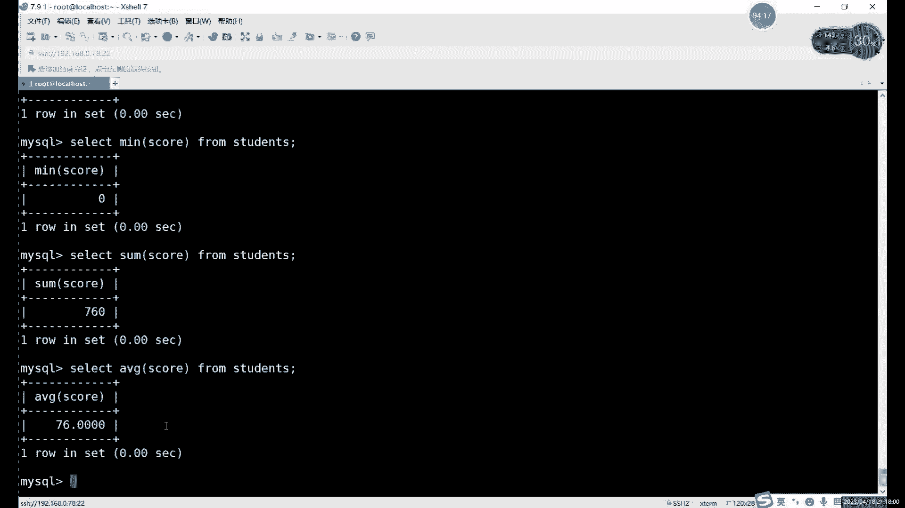

函数这个几用法件还有很简单的啊，关键在于什么？关键就在于函数和。我们的分组一起用啊，当然准确来说的话，其实就是cardd和函数一起用，是吧？跟跟其他下面四个没啥事，有没他们四个的。

没他斯么没他斯就是没有下面这四个函数的事啊，就只是单纯的cut，就是一个cutult，其他的话。也不是说不能用吧，就是用出来没什么意义。啊，可以用是可以用的，就是用出来没什么意义而已。好，我们可可以来。

比如说来看看一下这个。Thank you。嗯，比如说这里我们写个什么呢？写一个。就来统计一下男生女生的人数吧啊，就按这个统计一下男生女生人数。这个怎么统计呢？😡，啊，其实很简单啊，我们。首先先分组。

对吧先分组。g by加上呃性别分一个组，分好组之后呢。它其实就相当于是把我们的数据库，不是把我们这个表格里面的数据呢分成了两部分。啊，为什么是两部分呢？因为性别是两个呀啊，你总不能想是三部分吧，对吧？

你总不能想三部分吧。啊，如果说这个。那前面分成两部分之后呢，我们前面是什么呢？具体要看的话，因为这个的话相当于只是分了组，分了组，其实我们什么都看不到。之前我们能看到很多数据。

就是因为我们一直用的是side新号，对吧？那现在呢肯定是不能用的，不能用信号的对吧？如果说用信号的话，比如说我们给大家看一下。

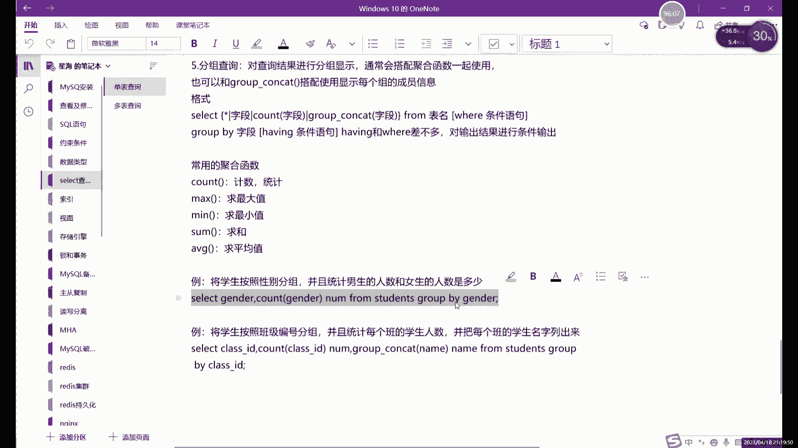

嗯。from对吧？sag的新 from这样行不行呢？其实怎么说呢？s新 from加上sdents是正常。我们看一下这个表格，对吧？如果果我 by分个组呢。啊，它分组的话，这个就是分组的命令没有错啊。

错的是哪呢？做的是分完组之后呢。你没有什么呢？没有继没有后续。😡，哎，就是你这写了个分组啊，系统知道你要分组了，但是你具体要分组干什么呢？哎，你不告诉我我怎么给你执行嘛，对吧？所以他这也会报错啊。

也就是直接分组之后呢，你不能看啊就是。😡，什么意思就是分完组之后呢，他不会说直接把脱组结果给你。而是而是你需要具体的去告诉他我想要看什么东西。啊，想要看什么东西。啊。系。那怎么看呢？

就是把前面信号给换掉。换一些具体的东西过来。啊，欢迎季静论过来。啊，如果哎。一般的话，我们这里换用什么用card函数。因为呢其他几个没什么意义吧，对吧？比如说你总和对吧？你总和的话。其实下面这个函数呢。

其实就是一般不和分组一块用，更多的是什么？更多的是用在这些像。嗯，比如说这个哎就比如说你说的这个每个班级的总分，对吧？你这样的话是查看我们整个表格的，你后边的话可以去限制条件，对吧？

where你限制1个ID。对吧ID比如说ID等于一的话，就是把ID等于一的同学的成绩拿出来看。🤧呵。拉出来求个和，或者求个平均值什么都可以。啊，这里的话就是粘合去使用。因为这个大家注意啊，就是函数的话。

大家可以看到我们是加在哪个部分呢？我们是加在这个sag后边，就是我们这个是一个结果，函数的话都是一个计算结果。真正的要看的东西呢是后边的东西。大家注意啊。

就是我们是我们后面from where这些东西有真正能决定我们结果的其实是from where。啊，因为你前面的话它永远是固定的，对吧？它前面东西是固定的，它只是算个平均值，你给他什么，他就算什么。

这里我们给的是整个表格，对吧？上有几个函数我们都是给了整个表格的数。😡，如果你想要看的看一下特殊的某一个。比如某个班级都最大值啊，某个班级最小值，对吧？男生里面的男生的总和呀，女生的一个平均值呀。

这个的话我们都是需要用威尔去限制条件的。啊，用威尔这线的条件，好吧。然后我们接下来看我们接下来看这个。这一部分啊就是我们的信号呢怎么换？首先呢我们先来写一个什么呢？先来写一个性别。

先来一个写这个写性别是什么意思？😡，因为我们是以性别分组，对吧？以性别分组。如果说你想看一些具体的值的话，比如说想看一下性别的人数有多少啊，对吧？想看一下性别呢，具体有谁呀？不是不是不是不是性别值有谁。

就是男生有哪些啊，女生有哪些？对吧这个才是什么？这个才是具值的值，对不对？你如果是星号的话，信号它这里其实就已经不代表什么了，也代表不了就代表不代表不了什么具体东西了。因为它已经不是我们原来的表格了。

😡，啊，大家注意我们它就现在就相当于是已经不是原来原有表格了。而是什么呢？而是。单独的。一个重新。划分过的一个东西。然后比如说这里直接写一个区别行行呢，就可以。F说什么？F和M。

当然这里的其实哎感觉没什么用，对吧？这个的你唯一的作用其实就是用性别分组来看一下你有几个性别。对吧啊，或者说你换成什么，换成这个classID也行。CLASS pass杠ID。对吧这样也行。

123455个班级，对吧？5个半斤。呃，总体上来说呢。啊，如果说你只写一个我们的字段名字的话，其实意义不大。啊，所以说一般情况下我们还会用这个cot是吧？可以和cot一起用。cot什么呢？技术。

查询的多个字段之间呢，用逗号隔开啊，就即使它不是字段，也要用不逗号隔开啊。哎，这样技术不就出来了啊，女生有6位，男生是5V。啊，这就是一个简单的技术。啊，简单的技术。当然呢技术这里的话。

大家可以看到这个上面这个其实不太好看，对吧？它直接把函数给写出来，可以换成什么呢？可以换成这个其他的。别名啊，可以起个别名啊，就比如说叫number对吧？数量。哎，这样的话这个就是什么？这个就是。

我们的分组和函数一起用。啊，分组函数一起使用，当然这是一种用法。难的这是运种风法？如果说我们这里其实就只能看数量。如果说想看一下具体男生有男生有谁，女生有谁，这个该怎么办呢？这个就又又有一个特殊的用法。

就是查看具体组成员的信息的话，用什么呢？用这个。

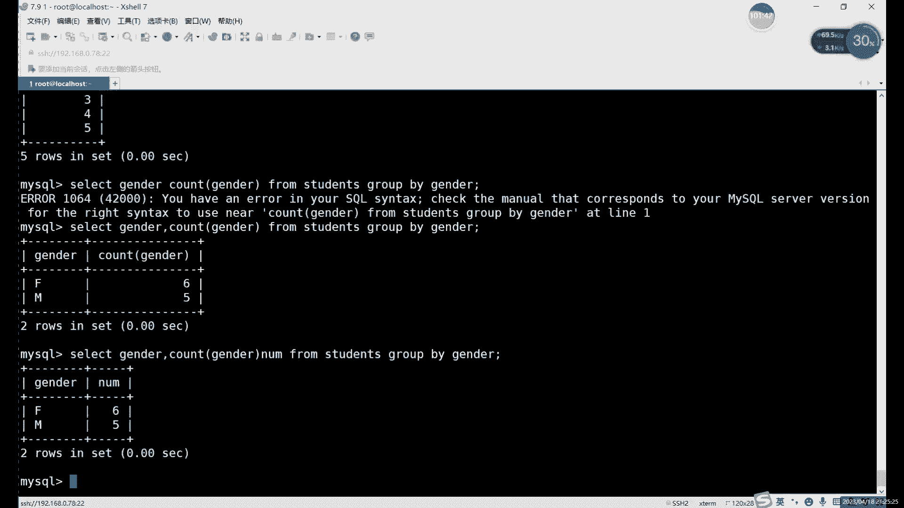

group contact。group刚开这里的话就看的是什么呢？看的是我们这一组里边的一个具体的一个。一个这明叫数据的一个具体的一个数据。啊，这个组里面具体的一个数据。比如说如果说我们用什么呢？😡。

嗯，我们看一下。我们就以这个为例，对吧？呃，这里分组的话，我们这里分组其实就两种分组。一种的话就是以班级ID分组，对吧？一种是以性别分组都行啊，大家随意。这里分组的话，我们可以怎么看呢？啊。

这个首先我们先来看一下，对吧我们的字段分组这个字段，然后呢。技术的这个函数你可以有，也可以没有。还有个什么呢？还可以有这个group context。它的作用呢就是用来查看什么呢？查看我们当前这个分组。

你的每一个组成员的一个信息。那具体是什么信息呢？😡，这里由谁定呢？由括号里面那个值来定。里面的值是什么？那我们就看什么信息。比如说我们这里能看什么呢？能看ID能看内幕，对吧？也能看这些成绩什么的是吧？

你是以班级和性别分组，那你就不要看班级和性别了，对吧？就看除了这这几个以外的其他的一些信息。啊，查干什么都可以。啊后后边的话也可以起一个别名啊，就是我们自己函数啊。

或者说这个这种分组的一些特殊用法还都可以加什么，都可以加别名的。就不是说因为它。毕竟不加点音的话，就默认显示自己的名字。它就相当于把这个函数给显示出来。表这样的话不太美观，看起来。

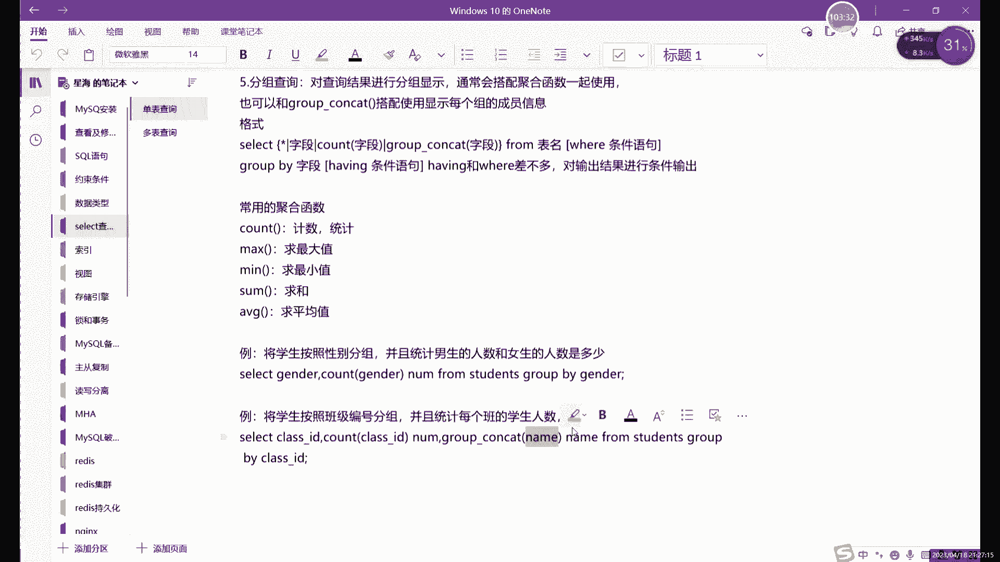

所以这里的话，我们一般是什么？一般就是。比如说我们想就就我们就用性别分组吧，哎，先不用班级了，班级想分的话，大家可以可以分，这个都行啊，我们先用。性别吧，然后这里的话我们再加一个group。大家注意。

我们现在添加的都在哪，都是在slaag的后边。哎，sag后面，这也就是slaack，基本上已经是slaag的全部用法了啊。星号字段名称，函数分组的一个特殊的用法。比如说我们这里可以写name，哎。

这个是什么作用呢？就是用来看。这样不太美观，对吧？我换一个。那就那吧。啊，性别数量、名名字啊名字。啊，就相当于是把我们这个分组的一个结果，它真的显这个这样才能把我们真正的分组结果呢显示出来。对吧。

首先前面是两个分组，对吧？以性别分出的两个不同的。首先技数，然后呢显示具体的详细信息。啊，这就是分组的一个作用啊分组的用法。然后呢，这里呢我们还可以看什么呢？除了名名称以外呢，还可以看。ID也可以啊。

我们这里可以随便换啊。没有。I啲。😊，对吧这里显示的就是什么？就是每一个同学的1个ID嘛，它的上面也是对应的，对吧？和上面name是对应的，它这个顺序不会变的。对吧还可以看什么呢？还可以看成绩。

SCORE。对吧这个就是什么？这就是分组的作用。啊，分组查询，并且分组查询之后，哎，我们查看具体的每一组里面的信息该怎么看呢？就是group content。当然如果大家想看这个卡达音章也一样。啊。

是把你后边这个。这个叫。叫什么来着？性别啊换成看莱。佢话仔啲。嗯。看一下啊class。ID然后col class ID number。G contact name。

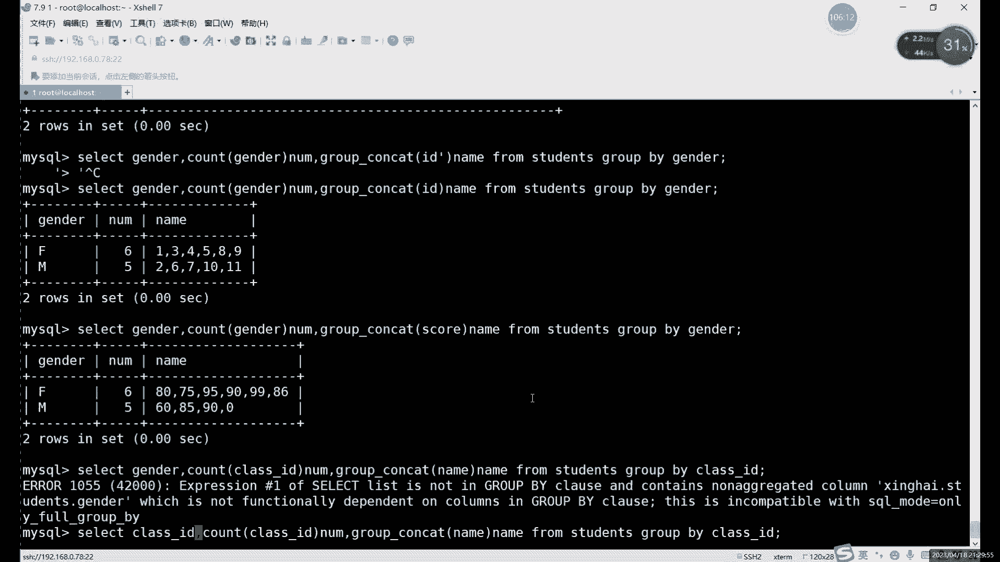

namee from student school by class ID D啊，可以。这里的话就是什么？就是我们的啊用开SID分组。啊，首先呢是5个组，对吧？5个class IDD12345。

然后呢哎5个分别的技术。然后最后是什么？最后是这个。每一个班级里边的一个同学的名字，对吧？这个就是什么？这个就是我们的。分组的用法啊，g by分组。好吧，这就是分组。嗯，总体上来说呢。

分组的话其实其实它也不是很难，因为分组也不需要我们去分啊，这个就是我们写完之后呢啊他去自己去分。分完之后呢，我们需要只需要去注意一下这个前面我们需要看的一些东西。字段对吧？函数加上这个具体的某一些值啊。

这些我们都可以自行去修改啊，自行去修改。这几个的话都是就是我们的在查询里面测试用法。啊，威尔之后加的这些排序分页分组加这个函数。它当函数的话是在slide部分去写的。好吧，在是下个部分去写。哎。

这个的话就是我们的。分组查询啊，这个就是分组查询。总体上来说呢，在单表查询方面的话，我们基本上说的差不多了啊，命令基本上差说的差不多了。总体上来说的话，其实就是这个格式啊，大家可以先看一下这个格式。

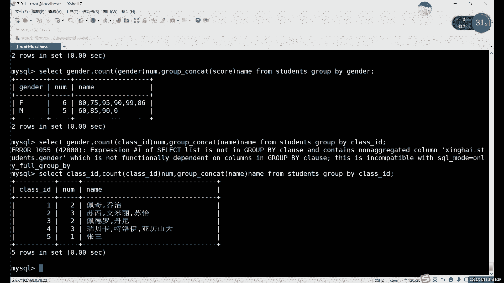

啊，可以先看一下这个格式。我们第二个查询呢在单表上啊，我们先还没有多表还没有讲啊，多表还没有讲过啊，就我们先暂时呢先只做一张表的，就是在同一张表里面去查询数据的话，我们现在目前是分为哎这么几部分。

首先啊。slaack里边的命令关键词的话，首先第一个是sck，第二个是from，对吧？第三个是where。啊，就三这三个。首先呢里边我们必须的呢其实只有side form。

其他的所有的都都可以什么都其实都可以省略。哎都可以不要。啊，但是为了更多的功能的话，其实啊你加上你多加一个g by，对吧？多加一个where，那其实就是多一重限制，多了一个不同的功能而已。

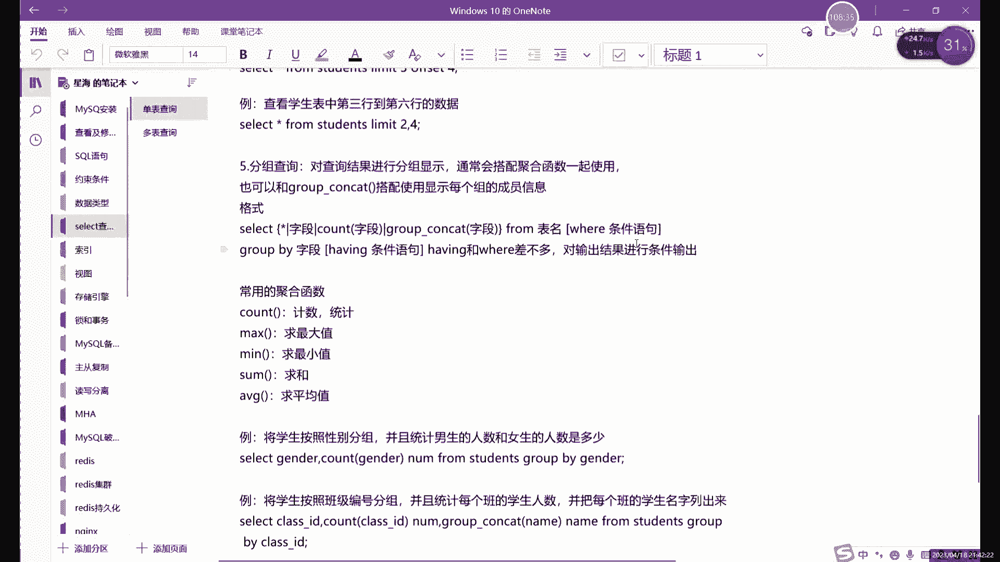

那首先的话，s部分的话。