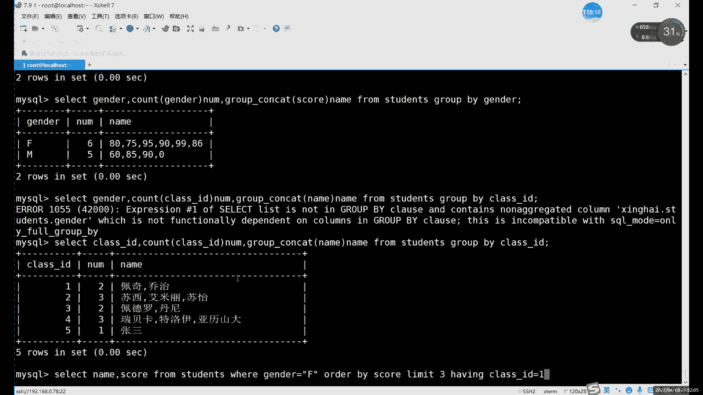
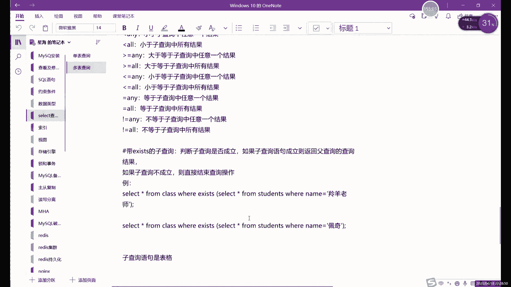

# 零基础入门Linux，红帽认证全套教程！Linux运维工程师的升职加薪宝典！RHCSA+RHCE+中级运维+云计算课程大合集！ - P73：中级运维-12.SELECT单表查询，嵌套查询 - 广厦千万- - BV1ns4y1r7A2

目前讲过的四种写法，对吧？星号代表所有信息，就是不管说你后边查询出来的是什么内容，我就显示所有的信息，所有内容。啊，这是一种。第二个就是特殊就是单独的字段，或者说是一部分字段。因为所有信息的话。

它是相当于将我们查询出来的过滤出来整个表格的信息全部显示了。每个表格可能有都都会有很多列。如果说你只想是如果说百合比较大的情况下的话，只想获得哎，只想要这关键的列的话，关键的信息列。

那你这里就具体写字段的名字，多个字段呢用逗号隔开哎，多个字段用逗号隔开啊，包括后边的这个函数和group contact也是一样的，都用逗号隔开。首先靠字段这里的话啊，这个就是我们的技术的函数。

他如果要用的话，必须要和什么呢？哎，必须要和我们的这个。那当然也不是说必须了，一般都会和分组一起用。啊，当然也可以他自己用啊，对吧？最开始我们其实演示过了。COU啊COUT啊COUNTco技术函数。啊。

可以自己单独使用，对吧？比如说我们计算一下我们这里获得的数据一共多少列啊，用cos就可以。然后呢，group group contact这个就绝对要和分组一起用了。

因为它就是显示分组里边的具体的每一个组的一个详细信息啊，得用group呃group contact。就是分组之后想要看组里边的信息的话，就用这个。啊，就目前我们只讲过4个，对吧？就这4个有s字里可以写。

😊，drum呢就是表明没了。他最关键。也最简单。啊，因为你side这里就是form这里的话，其实就确定我们查询的是哪个表格。我们现在是单表查询，所以说只写一个就行了。

后边如果说涉及到了多表查询的情况下呢，那from这里怎么写呢？也是写多个表格名字，然后用什么隔开呢？用逗号隔开和前面的字段的话也一样啊，就用逗号隔开就行了。哎，这不暂时目前还用不到，对吧？

还没有讲到这个多表查询。然后下一部分呢是where尔条件语句。这一部分呢它也不是必须的啊，他也不是说必须的。加上的话只只是给我们的查询呢限制一些范围，限制一些条件。哎，这个的话就是什么？

这个就是威尔的条件语句。然后下一个呢是group by。go back的话是分组的意思，对吧？啊，分组。当然这里呢和分组类似的还有哪两个哪还还有哪几个呢？就是order吧。啊。

bue by order by，还有什么，还有limit。这些。啊，都是加在哪儿呢？加在威尔的后边啊，大家注意就是分组也好，排序也好，这个分页也好，都要排在哪。

都要分析在我们的where尔的条件语句之后，就是整体限制好条件。得出了结果之后呢，再用这个g by啊，然后排序啊这些去再次进行处理。啊，进行二次处理吧，可以理解成前面的话是其实算一部分。

到威尔这里算一部分啊，这是一个正常的普通的一个语句。执行好之后呢，如果说想要给它排序啊、分组啊进行二次处理的话，因为这些的话其实不会对数据的本身造成任何影响，它只是改变我们的显示的形式。啊。

我们的分组也好，分一二也好，排序也好，都是改变一下的显示形式，它不会改变数据本身。就是说前面的话，这个这个是我们产生数据的一个。第一段啊这第一句这里就是第一行吧。第一行这里我们是先得出一部分数据。

然后呢用葫芦by呀这些呢去进行二次处理。那天二次处理。然后呢，还有一个我还没有讲，对吧？having。heling的话也是什么？也它也是条件语句。类似于谁呢？类似于威尔。用法和VR差不多的。

只不过呢他俩是怎么呢？他俩个位置不一样，大家可以看到它两个位置不一样。啊，从位置上的话，其实就能区分出它俩的一个区别啊，区分出它俩的一个区别。首先呢第一。威尔这里呢我们刚才说了。整体第一句执行好之后呢。

再用group by进行分组，对吧？我们这里用group by了啊，就用group来代代替那两个了啊代替那两个。啊，当然了，其实呃g by其实和or by其实是相当于是一类型的啊。

limit那个它其实也不算limit，你可以理解成这个呃limit分页，可以理解成这个排序的一个。排序里面的一个用法啊，排序里面一个用法。然后这里的话。分好组织后。对吧我们查询好之后。

然后分组分组之后呢，然后就查询出一个结果，对吧？查询出的这个结果呢。如果没有having的话，它就已经是最终结果，对吧？那如果说有了having那having的作用是什么呢？

就是在我们前边所有内容查询完成之后，再次进行限制。啊，就二次的限制，就第一次限制在哪？第一次限制范围的话，限制我们的数据范围是在where尔这里，它是在group分组之前，或者说是在排序之前进行限制的。

那排序或者说分组之后。如果还要限制一些条件的话。威尔就不能再限制了，因为威尔已经用过了。😡，而且vi尔它是在中间部分嘛，想要最后再限制一次的话，怎么办呢？就是只能用什么？只能用having语句。

having的话就是相当于是在哎就是在growby处理好内容之后。或者说是分页处理好之后。再用having进行一个什么呢？再用having进行一个二次的去限制。就比如说如果说我们按照分组来说。

我们分了5个组，呃用班级分组吧，用班级分组，我们一共分多个组多少个组呢？用分5个组，对吧？按照我们这个表格来说，问题是分5个组，分出5个组之后呢，我们得出这么一个。啊，不管说你是。五组同学的成绩也好啊。

五组同学的这个。名字也好呀，都可以。分好之后呢，一共是五行对吧？那五行数据呢还可以在限制啊，应用怎么限制用having。对吧就比如说五行数据出来了，我们再限制一次。我只要钱我只要这个。前三个班级的成绩。

行不行呢？也可以，对吧？只要前三个班级的成绩啊，后边两个就不要了啊，我只要前三个，那还可以用h限制。啊，用还有引句限制。啊，这个就是什么？这个就是haaving的用法。它呢具体的一些条件的话。

它和威尔是差不多的。不一样的地方就是它就是在它的一个生效的位置，或者说在使用的位置。啊。威尔呢相当于是在分组之前啊，在分叶分组这些操作之前进行的。然后还有你在之后啊，这个就是我们slect。

单表查询的一个详细就是所有内容，对吧？我们可以最后再演示一个啊，最后再演示一个单表查询这边的。首先第一啊我们就用还是用分组，用分组还是用分叶。其实都可以啊，刚才是分组，你不行，再换个分页吧啊。

用分页的查询。分页查询嗯，分页查询的话，其实用不到用不到函数的啊，就用不到函数了。

我们可以来先来一个分页的查询，对吧？select星号对吧？我们不用星号了，信号感觉。我用几个字段吧。namee。成绩。就那么成绩吧啊，然后呢。姓名啊成绩。from students啊tudents表格。

后边威尔限制条件。限制什么条件呢？嗯。限制ID的话就有点太少了。性别的话还好，对吧？性别有56个。主要是我们这条件也太少，没有什么可以限制的。就问性别吧。性别对吧？现在这个条件。然后呢。再来一个。排序。

和翻页。奥der by。4。对吧用排用程序进行分组，然后呢，我们再可以分页查询。Lit。前三名吧啊我们来看看前三名。对吧这个的话就是什么？就是我们用了一个。side这里我们用两个字段from表格。

where呢我们先限制你先限制性别，然后呢用成绩分组，然后显示前三名。对吧我后面还不能在还不能在家呢？可以在家hy。啊，还 v i m g啊。建筑术前载名之后呢。看123。

然后再限制1个class IDD。看一下是哪个班级的。因为这里限制条件太多了，我们也没什么好改，没有什么能限制了。其实我看看这样有没有结果哈。

没有。limit等于3order by limit。Havingaving这里。

那报错在还有呢。这里哦对，没有成绩啊。没有成绩，没有成绩的话，我们得加一下什么呢？加一下这个name class ID我们加一个字段嘛。不然没有成绩的话，having不能再限制having限制的是谁呢？

就是我们现在不是得出这么一个结果了，对吧？我们用分页得出这么三个结果。那这三个结果呢。having要去查的话，它只能在name和sco这两个字段里面有限制。我们卡宅由于这里没有，所以说它就不能限制了啊。

就不能限制。所以说这这里会报错啊。嗯加个class IDD然后逗号，然后最后再加。Havingy。还有一套用法和和威尔一样啊。但是呢hy能一般的话，其实having虽然说用法也很多。

但是呢一般很少能用到，为什么呢？因为。前面已经限制了很多个条件了，对吧？由于我们这个表格也不是很大，你看前面已经限制了这么多条件。啊，你最后再用海aving的话，它其实能改能限制东西其实已经非常少了。

这里的话呢我们可以来看一下，还有ID等于一吧。应该有一般的吧。h有class IDD。嗯。

大西D等于1。

最后这里的话，我们加having的话其实。加了这么多，我看一下啊。还有你的条件依据。这里经常加heling的话，其实看一下啊。啊，现在目前是s，加上名字。

成绩限制、性别。排序。分组。最后限制1个class IDD。这个后边我们如果说要再加这个having的话。但日 class喺呢度。字段倒是有啊，字段已经有了。嗯，看一下400个新号400个内。嗯。

现在是用了这么多限制的话，看DESC哦。对，还有一个需要注意的点啊，刚才没有强调。

就是这个having的话，一般是用在哪？一般是用在有聚合函数的时候啊，它再去对结果进行限制啊，它还还是和威尔有点区别，区别。就在这儿where尔的话，它对对象没有什么没有什么太大没有要求啊。

having的话它需要什么？它是对在聚合函数的后边进行限制。

啊，就有聚合函数，后边再进行限制。看我们这里能不能再加一个函数进来？嗯，看一下。那其实已经很长了，对吧？limit3DSC再加这位置，在这个在这个位置啊。对吧这个是前三名，刚才是倒数三名。嗯梁生年。

加函数的话，拉ID。明。这里基本上我们把基本上把所过的用法基本都加在一块儿，叠在一块了。我看一下，如果这样分组的话。那现在是分组院开SID分组的话。用卡 IDD分组。我们最后能得出来的结果是。

这里肯定不能用不还是不能用成积分子。分纯积分子的话，其实就把和其实还是他们三个数据。用叉塞一分组。统计一下class IDD以及class IDD里边的。Proof刚 cat。

name class  i啲。这里我们前面就把name幕给去掉，内部就去掉。嗯。DLUP。gobye。proby的分子。那如果是以classID分组的话。嗯。这里的话不能再加这么多了，再加这么多的话。

它这个功能用法上的话，其实是有点丰突了。啊，我们就先目前先这样啊，先先就写到这儿啊，先写到这儿。前三名的成绩对吧？前三名成绩。在家不能往后加一了，不能往后再加了。如果说要用那个heling的话。

我这里换一个吧啊，这个的话我们就先写到写写这么多。我还是换成怎么换成这个g by分子的啊，用分组的这个的话。后边加having比较好一点，就比如说select。信号from啊slect。分组的话。

我们用 plusID分组吧。plus IDD分组。然后呢。分组之后显示每一组的。名字吧。显示每一组的名字，然后呢from从students表格里看。Where尔。限制一下这个性别吧。然后呢，g by啊。

不用alder by，那们g by。g by用卡载D分组。分好组之后呢。这里就啊这里我们不用limit，当然分组之后也可以用limit，但这没什么意义。B by class ID。我们来看一下。

目前是啊124，为什么没有三和5呢？因为三和5里边可能没有女生啊，没有女生。所以说的话这里就是。目前是这样一个数据。然后呢，在这个后边呢，就可以加加加什么，加上我们还。如果说你只想看什么呢？只想看一下。

class I。等于几呢？想想看2。啊，这之前成二班级对吧？之前是四的话，变成四班级。也就是hy的话，其实就是在。不by后边。还有你这里需要注意，就是它是一般会用在聚合函数的后边。去进行一个再次限制。

啊，你前面一定要有聚合函数，我们后面才能用才能用这个还有啊就是再次限制。啊，这个就是海有你的用法。然后限制的话，其实你其他的一些的话其实也可以用。只不过我们这里的因为数据实在是太少了。啊。

数据已经没有了，所以说呢没有再再限制其他的一个必要。啊，这里就是我们这个海aving。那像刚才我们说的那个能不能继续往下走，就是。到这里对吧？

我们刚才是用了个otherder back排序和limit的一个分页，能不能继续往下再执行呢？也可以。但是一个语句的话其实已经不够了，一个语句已经不够了。啊，如果说想要再继续写的话。啊。

也是可以的啊也是可以的。啊，比如说再往下写的话，它的其实我们的这个语句句就叫什么呢？就叫嵌套语句。啊，不知道能听说过没有？就嵌套语句，就是一个语句的话，如果说啊它能够实现的这个功能已经到极限了啊。

如果说英语剧已经到极限了。我们就可以用什么呢？可以用嵌套语句啊，把两个语句拼接在一起用。啊，把两个语句拼接在一起，什么意思呢？我们可以看啊。目前我们是写了这么多了，对吧？写了这么多了。

然后这个这种基础上我们已经不能再什么呢。Yeah。这种情况下，因为我们已经显示出这么多内容，它已经是一个成熟的表格了。我们如果说在在在它的基础上再进行分组的话，它会对我们前面这个字段会有影响。

所以说我们这里就不会就不能再进行分了啊，就不能再进行分组了。带分的话，它前因为前面我们这些资段也都没了。所以说呢我们正常情况下呢，如果说你想哎再再继续做的话，再继续往下搜索的话，是吧？

因为我现在其实还可以继续往下走，对吧？那怎么办呢？就可以用这个嵌套场。

嵌套查询的话，在我们这个。我这里写在这个这个是写在多边查询证儿呢，在多边查询证。啊，欠到查询的话是什么意思呢？他其实就是用两种。啊我写在哪啊嗯。现造场询的话。

其实就是两个slash语句啊拼在一起啊拼在一起用。当然我这现在这个例子里边，这个其实还是比较简单的啊，还是相还比较简单的。我们直接来看什么直接来看我们现在这个线道。😊，啊。

比如说我们先看一下先简单看一下这些例子。对吧如果说想要查询成绩，跟丹尼佩奇瑞啊瑞贝卡一样的哎学生的一个名字和分数。那这种情况下呢，我们就可以用这个嵌套的。我们可以先查询出来这三个同学的成绩，然后呢。

再用什么，再用再来一个side语句呢，把这个查询，把这个第一个查询语句的一个结果作为第二次查询的一个条件，对吧？这个这句话是不是很熟悉，管道服务那边，对吧？我们命令行里面管道服也就也就是这个用法。

也是这么描述的啊，我们这里也是一样的，就是将一个side语句的一个查询结果作为第二个查询语句的一个条件。啊，将一个结果作为第二个的条件来进行使用。这里的话我们可以看一下啊。sack加上我们的这个。

首先这里的话就是先搜这里的话，它结果是什么呢？它的结果就是三个成绩，然后呢，把这三个成绩呢放在我们这里去继续继续去执行啊，这样就是嵌套语义的用法啊，嵌套语义的用法。那像我们当前这个情况怎么办呢？

我们现在的结果是谁呢？现在结果是他。

它是一个什么？它是一个表格，对吧？它其实还算一个表格嘛，对吧？它虽然说这个表格我们其实是不存在的，但是呢对吧你看起来是三行三列嘛，刚好是三行三列，其实看起来是个表格。那是个表格的话其实也可以用用于什么？

用于签到查询。听到查询的话，其实主要就是两种类型。一种的话就是将。嵌套语句的结果作为就是将一个语句的结果作为第二个语句的条件，这是一种。对吧就是放在威尔那个部分。

第二种呢就是将一次执行的结果作为第二次执行的一个。表格。啊，什么意思？就是from这里呢？😡，除了写只写表格的名字以外呢，还可以写什么？还可以写一个嵌套语句进来。什么意思呢？

如果说我们想要对这个这个现在这个语句继续再继续写，想要给它分个组，想再继续过滤一下。啊，因为我们这现在不能直接加having啊啊不能直接having分组的话，因为前面这个字段也比较多啊。

分组其实也不太好分。责人呢最好的方式是什么呢？

是把这一个我们先复制下来，好吧，先复制下来。

哎复制就了，然后呢，他现在是哪个表格呢？它现在其实代表这个表格对吧？代表这个表格。那我现在怎么能把这个表格利用起来呢？😡，我先给他加个括号。啊，先给们加括号。哎，不对，先给他加个括号啊。嗯。哎，不对。

啊，是这个是吧？先给它加上一个括号，把它当成一个表格。当成表格的，它要写在哪，它就写在from后边，对吧？那就是在from后边没毛病。然后呢，现在我们再来进行一再进行一个字查询啊。

我们现在把它当做表格是吧，它就是一个表格。就是3乘3那个表格。啊，现在如果说我们想要再进行一次分组的查询。怎么办？就select。我们用class3D存吧。用快ID分组。然后显示卡ID里面的具体的一个。

组类成员的名称，group杠conca。里面加上class IDD。看机逗号group contact，然后看ID。然后from我们这个表格。这个表格叫什么呢？😡，我们这个要一定要起个名字。

大家注意在签到查询的时候呢，如果说将一个。表格作为一个啊将一个查询结果，作为第二次查询查询的一个表格的话，需要给他起一个名字啊，它不能没有名字啊。这个名字当然只是临时的啊，只是一个临时名字。

相当于类似于可以稍微给它起个别名啊。简单来说你就写随便写就行。这个名字没有什么特殊含义。你每次你都写A行不行啊？也行，因为它是临时的，你用完一次它就没了。所以说你每次写A都也可以啊，每次写A都可以。

然后呢，哎然后现在的话我们先写完之后呢。继续写什么呢？继续写就写gve by吧啊，不要where where我已经没什么好好过滤的，直接gve by。下细啲。对吧这个就是。嗯。哦。

class IDD是吧？怎么感觉有点不对劲，我换成内幕。对吧就是。把我们上面那个结果又过滤了一次。过滤是这么两个。同学的名字对吧？然后再加什么呢？还可以再加having。啊。

我这已经是能把我们能加的基本上都加进来了。啊，基本上把我们之前讲过的主要内容，关键内容啊，基本上都加在我们这个语句里的。这已经没什么好嫌制，咱们就没什么信息了。基本上咱信息那么大一个表格。

现在我们过滤的已经只剩下一个1个克ID和两个名字了。啊，也总体上来说的话，确实比较长，对吧？一大家一次肯定记不住，这个肯定记不住，我也很理解啊，我也理解。大家可以看一下我们这个。

这个隐居整体的一个组成部分。啊，哪里有不理解的可以直接说啊，哪里有不理解可以直接说，其实也很长，对吧？主要关键我刚才刚才又加了一个什么，又加了一个嵌套语句的概念，对吧？嵌套语句呢。怎么说呢？

总体上来说呢，千套语句就是。将两个slash语句呢一起来用。啊，有时候呢一个语句确实很难解决问题啊，有时候复杂的一些查询的话，一个语句其实很难查出结果。啊，如果说一个语句查不出结果的话，那我们就用什么？

现在就用两个呗。两个物型可以用3个。啊，最多也就三个了，是不过三嘛，你再多的话就太太过分了。其实他这可以确实可以无限嵌套的。但是呢你嵌到多了，那就没意思了，对吧？你欠套多就没意思了。

所以说呢一般其实两个区域已经差不多了啊，尽量不要太多了，就是两个语句，三个。三个就到头了，再多就太过分了啊，就是我们这个嵌套语句呢，总体上来说呢就是。两种用法。对我现在展示的是其中一种。

就是将我们的这个side语句呢加在pro后边。另一种的话就是将slash句加在哪，加在这个where里边。或者加在having里边行不行？也行啊，也可以加在having里边。也就是我们的这个嵌套语句呢。

两种用法，一种的话就是让谁来限制呢？让不是说谁被限制，就是写带from当做一个表格来用。第二种的话就当做条件来用，写在where的限制条件里，或者说h的限制条件里，就是我们的嵌套语句的用法。总体上来说。

天岛雨句的话其实就是。就像我们刚才对吧，你后边我们。排序之后啊，再去分组也好啊，再去这个开aving也好，都会报错啊，那没办法，我们就再来一次吧啊，因为一个语句已经到极限了。

我们就再重新相当于重新创建了个语句。哎，我们就一个次执行到头了，它已经强形成一个表格了，我就可以将它作为一个表格继续的执行。地域限制。啊，直到我们拿到想要的结果。这个结果其实是什么呢？这个结果是。啊。

这个题应该怎么说来着？我看我从从答案我说一下题目啊，从答案回头一下题目。女生里边。好，女生成绩前三名的同学里。然后是班级啊，我们用班级分了个组，其实这个班级分组没什么事，其实只是强行分组啊，强行分组。

啊，就是女生里边成绩前三名的同学。并且。啊，并且这个。这个应该叫什么？应该叫并且。是。二班的同学的一个。班级以及。名称啊，万级姓名啊，总体上来说就是。啊，就是你的这个语句太长，你题都不好圆啊。

都圆不回去了，有点。啊，总体上来说呢，就是一些大家如果说遇到一些这个比较复杂的一些语句的话，就复杂一些问题。你先什么呢？你就先思考。啊，一语句能写到什么程度？如果说一个语句能写完了，就用引语句写就行了。

如果说英语句写有难度。那就先写一个先写一半。然后再用线套呢补另外一把。

对吧就比如说。我们直接来说我们嵌套语句了啊，就接着说嵌套语句了啊，嵌套语句的话，我们还是在一个表格里说。因为多表查询好没有讲啊，多表查询还没有讲，这个话我估计要放在下一节课了。

我们现在的话说了一下我们的嵌套查询。欠套查询呢。我们这里是什么？我们这里是。刚才我们演示那个嵌套呢，是把什么呢？是把。只查允句一句当做一个表格了，对吧？当做一个表格来看。还有一种的话就是就是我们这种。

笔记里面写的这个。加上什么呢？将一个查询块。嵌套在另一个查询块的VR语句当中，或者说having语句当中。或者是什么pro表格当中。这一个查询就叫签收查询。其实就分为两种。

一种的话就是where和 havingaving的条件语句。一种的话就是from表格里面。啊，我们刚才演示的其实就是第二种。这种嵌套的话需要给欠到表格加上别名，别名无所谓，因为它是临时的。

所以一般我写A啊一般我写A。然后前面的这两个呢，就是啊没有说，对吧？前面两个是加上在威尔和heaving里面。就比如说我们拿一个来举例子吧啊，我们嵌套的话啊也有很多几种不同的子查询的类型，对吧？

首先可以用硬来查询。用硬来比较。首先第一个。刚才其实也简单看了一下，对吧？就是查询和某几个同学成绩一样的同学的一个分数。啊，就比如说和A同学成绩一样的同学的一个名字和分数。

这样首先呢它题目里面并没有告诉我们这个分数是多少，对吧？题目没有告诉分数是多少的话，我们肯定是没办法直接得出这个分数的对吧？那这种情况下的话。你一个语句其实是一次性得不到结果的。啊，这种情况下。

一个语肯定是得不到结果，因为什么呢？因为如果说想要得到零多的分数的话，首先你得知道分数是什么，对吧？现在的话我们分数是未知性。是未知的。我们已知的只有什么？已知的只有学生的名字，我们得通过什么？

首先先通过学生的名字呢去查询我们的成绩啊，用到的就是一个wherere的条件语句。对我们先来看一下这个，就比如说和这三位同学一样的学生的名字和分数，怎么去找呢？先用威尔呢。然后判断不是不是判断。

是限制一下啊，这三个同学的名字对吧？啊，一共得出三个名字来这三个名字呢，它其实分别就对应了着对应了三个成绩。那这三个成绩呢啊能用and吗？它不能用end。大家注意啊，这里就不能用and，就只能用out。

因为三个成绩它不一样的。啊，即使有一样的话，那另外一个不一样，它也就没了。还不是说不就是它只有什么，只有三个，必须相。如果想用按的话，只有三个都一样的，它这按才能生效，不然的话它相当于没有。啊。

有没有设空值。所以说呢这里的话我们只能用二得出三个成绩。得出三个成绩的话，最后呢，我们sack大家注意，这里slash一定只能写一个。成绩啊一定只能写一个sre，为什么呢？为什么这里只能写一个呢？

其实原因很简单，就是如果说你想要作为一个条件来说的话，那你就只能有单独的值几个值，而不能而不能说啊，你如果说有姓名，有成绩行不行呢，那不行，为什么呢？姓名加成绩又有字符又有数字啊，那就不能作为什么呢？

它不能作为一个普通的条件了。它是什么？它就是一个小的表格。如果是一个小度表格的话，那又要又回到我们上刚才演示的那种嘛，就是上我们家表格的对吧？如果说你想要把这个。一次查询的结果作为第二次查询条件的话。

这里我们只能写一个字段。大家一定要注意，这里就s只能写一个字段。那这一个字段得出的结果就是什么？就是几个成绩啊，几十分呢我们也不知道。😡，啊，我们现在也不知道他一共几十分啊，都具体是多少分。

但是呢我们这三个成绩呢都放在哪呢？放在我们的印的集合当中了。啊，这里因为你有多个，所以说肯定不能用等于号。啊，尤其是成绩。而且你不知道你这个成绩的范围，所以说呢不这样的也不行。

对吧而且呢所以说呢这里就我们只能用只能用这。然后用硬来判，就是将这三个沉淀呢加入到一个集合当中。然后呢，外边这个语句呢啊就通过这个集合呢去查找。满足这个集合当中学生的一个成绩啊，成绩满足了。

那我们就显示出来。啊，那我们可以具体来演示一下。

就比如说啊我们来看一下。

这里我们哪三位同学，但是你佩齐re，对吧？select信号 from。首先呢这个嵌套查询大家写的时候啊，大家注意啊。我教大家怎么写啊，嵌套查询呢。😡，你不要说从头往后写啊，你可能一下可能脑子转不过来。

你怎么写呢？你先写第二个语句，就先写那个条件的语句。就比如说先写那个成绩的SORE。对吧写成绩的查出来之后呢啊在这成绩基础上呢再去。写这个什么写这个。这个叫。过滤这个名字和。成绩的嘛，对吧？

我先把成绩拿出来。😡，怎么拿呢？就name等于。佩齐对吧？一个。2。两个。然后第3个2。

那个什什么来着？

啊，丹尼。对吧这个就是什么？这个就先我们先把成绩查出来，查出成绩之后呢，我们把这个用括再括起来。括号括起来之后呢，哎中文吧。快快来之后呢，它就是一个什么？它就是一个条件了，它就是一个集合了，对吧？啊。

集合的话呢，我们就可以倒着写嘛，对吧？SCOORE。😊，这个的话就是一个条件了啊，就是一个完整的条件。包括这几个成绩的一个同学。的一个成绩的集合就在这里。然后呢，where去限制条件，对吧？

前面的pro呢加上什么？加上这个继体函是表格名称啊。还是表格名称。对吧前面最后呢就是slect，我们具体要显示的内容。可以直接slashing from啊。哎，这里的话我们写了几个。嗯哦，我们最后这里。

我们是没有单尼这个同学，应该是。啊，我们这个表有点好像没有担心这个同学哈。啊，没有。没有话那就不用管了，对吧？那这个就是查询一下什么的。😡，这里的话如果说你换成end，这里的话其实你一点东西都没了。

因为什么？因为甚至我们这里还有一个什么有一个没有成绩的。啊，没有成绩的，不是说就是不在我们表格当中的。所以最后最后查出来的啊，因为没有相同的成绩嘛。我看一下这里有咱们哪一个成绩是一样的啊。8090哎。

90的这个是一样的。哦，但是你写错了。哎，这下就多了。对吧。佩奇和这个瑞贝卡这里的话，他俩他俩的这个成绩呢是独一无二的对吧？但是呢丹尼这里的话有一个哎苏怡的话，他也是这个成绩。对，也是这个成绩。

所以这个的话就能查出来什么，就是和这三位同学同学成绩相同的同学的一个成绩。对吧有点绕口，但是呢啊这个的话这个确实是一个语句，它查不出来的。啊这种情况下，我们就用两个语句。

啊，两个语句。然后下边的话，我们查询什么查询成绩和丹尼佩奇啊。月个卡不一样的学生的一个名字和分数啊，完全不一样的。

不一样的话，就是什么？就是用notote对吧？用notote。就是这个嵌套查询的话，其实除了。我们用了两个语句之外呢，其他的用法呢和我们之前讲的那些语句呢用法其实是完全一样的。啊，他们就是其实是。

在这个普通基础上呢，就是把一个语句相当于是变成两个语句启用。啊，让你一起用。这个的话就是什么？这个就是我们的这个。签到查询啊，用硬。用硬象上去，这些行业里面其实并不是所有的条件都能用啊，因为什么呢？

因为我们这里呢就比如说你的蘑糊查询能用，它不能用，因为我们这里这根本就不是一个什么呢？它就不是一个像我们之前一样的一些值了它其实是一个语句的一个结果啊，因为它是一个语句的结果。所以说呢啊我们能用的。

其实就包括应，还有什么呢？

B也不能用了，因为B它因为需要两两个结果，所以说我们这里就是硬，还有什么呢？还有这个。比较符号。还有any哦。这几个。N和R这里的话，唉它和N和R呢就有怎么说呢？嗯。🤧嗯。其实呢有点区别啊。

你可以说有点区别，但其实呢是一个道理啊，这里的I和R呢和我们的and二是一个一个道理上一个道理。就比如说我们来看一下这里。啊，最后来看一下这部分。啊，这个是我们签到查询的这个。艾米和奥两个特殊的用法。

也是在比较的时候。在比较的时候。当子查询结果有多个的时候，你就可以用an和二进行比较。对吧刚才我们是等于号嘛，对吧？硬是相当于等于号。啊，如果说不想让它等于，而是需要去比较大小的时候呢。

比如大于啊大于I。角一2角1IE呢其实就是两种用法。哎，就是几种不同的用法。那首先我们先来看第一个啊，我们这里其实演示其实不重要，大家只要理解这部分其实就好。因为这个的话其实就是。大于所有的。啊。

你从字面上意义理解，大于所有的。什么意思呢？就是大于最大的。啊，我们这几个城这里的这个这些值的话，其实也是什么？也是数值，也是数字。所以说大于最大的啊就大于所有呢，其实就是大于最大的意思。

那大于这个any呢，any是任意的意思，对吧？就任意一个结果都行。他的意思就是大于大于an的，就大于任何的那其实就大于最小的。那就是大圆理的意思。那反过来说呢，大家可以思考一下小于2。

小于二呢其实就什么？就小于我们子查询当中的所有结果。那就小于谁呢？小于最小。那小于艾妮呢？啊，小鸭，你就是小于最大。啊，这就是anR，它和and和R呢。其实挺像的大家可以思考一下，其实挺像它的按钮啊。

and二的话，它是在查询条件里面进行一个限制嘛？啊，在调件条件里面进行一个限制，这个这个大于安妮啊，大于奥呀，这几个是什么？这几个它是在。它其实也是查询结果，哎，不一样的就是什么呢？

就是啊这个二呢就是大于，就是不管是大于还是小于，就是需要。既要大于大于的话是大于所有。那就大于最大的小于呢就是小于最小的啊，这就是2an的话，其实就和它就相反。大于I呢就是大于最小的。小月你呢？哎。

就是小于最大啊，就是反过来就行。啊，这个只要你知道一个，另一个你反过来说就行啊，反过来说就行。当然还有一种的话就是带axces的一个子查询，这个是判断语句。啊。

这个是嵌套语句里面的一种特殊的叫判断的语句。啊，判断语句判断语句的话呢两个语句呢没有任没有这个绝对联系。啊，就判断语句这里其实两个语句没有绝对的联系啊，可以说是啊可以有联系，当然也可以没有。什么意思呢？

就是判断语句的话，就是括号里边的。子的查询语句如果成立的话，或者说有结果。就是这个的话就是它其实是判断一个返回结果是否为空啊，这X判断的内容就是返回结果是否为空。如果返回结果为空。

那我们的这个查询的话就不执行。如果返回结果有内容，那我们就执行。哎，这个就是什么？这个就是。exces判断语句啊，这里我们可以给大家演示一下这个吧，演示一下这个。啊，上面的N2的话。

其实和and2一个倒理。我们这个先就先来说一下这个acces啊。

首先的话。判断的是谁呢？判断是括号里边的。就比如说select星号from。第个人。Where。诶，class i d。你六。😊，这个语句他有没有呢？不是这个语音它有没有结果呢？它其实没有。为什么呢？

因为没有六班，对吧？你们现在没有六班，它就是返回一个空值啊，它不会报错，在这返回空值。那这act的作用就是判断它是否为空，哎，就少了一个字母。啊，判断的是否为空。

比如说哎如果说我们后边呢它是什么呀？它没有。

啊，他前面就不会执行啊，前面写什么呢？😡，🎼其实写什么都无所谓。因为前面这个语句呢。前面这个语句呢不重要。啊，前面这个就不重。介下啊嗯。s新 from pass axis and。

然后sla新 form studentswhere。他到时在sl。

哎，少了一个什么来着？

哦，对，这个都这个在威尔这里啊。因为它是相当于一个什么呢？嗯，它相当于一个现实条件嘛。这个限制条件它比较特殊一点啊，就Xces它的限制条件，它是属于一个判断的限制条件。

就是你如果说我们后面的结果呢是成立的。他就执行前面的语句，如果不成立呢，他就不执行。哎，这里怎么还有问题呀？来星号studentswhere plusAD等于6。单词错了。啊，X值。

然后呢，这里就显示什么？它就显示一个空值啊，这里显示一个空值，就是判断一下后边的是否正确。他其实是判断后边是否为空，它为空的话，那我们就不执行了，它就是空了。那如果它是正常的话。

也比如说我们换成一个什么，换成一个五，对吧？五，我们是有的对吧？虽然说呢只有一条信息，但是呢它有。

对吧他有他有的话就指定前面的，就是后边和前面的语句呢，它没有必然的联系。就只用来只是用来判断的。还是用来判断的。啊，这里的话就是你前面啊前面这个其实就是啊用来看一下它是否生效。啊。

你是否有有这个具体的值啊，有具体的值。啊，这个的话就是什么？这个就是。我们这个。现套查询的用法。线查询的话主要还是。注意什么呢？哎，注意一下，我们第一次讲那个签量查询就是。

from表格这里这种嵌套的话，需要给嵌套的这个里面的子的查询语句呢，加一个表格的别名啊，其后边前面的两种其实还好，因为前面两种的话，其实就是两个语句套在一起了。啊，第二语句的话，它是第一语句的一个条件。

对吧？一般就是in呀硬就是等于嘛，然后是比较括号大于号小于号。然后呢，如果比较只有多个的话，用按。啊，你最后一个判断的acs。啊，是表格的那个我们前面其实就已试过了，对吧？是表格那个的话其实主要注意。

记得要加别名啊，记得加别名。以及什么？以及你执行的时候，其实可以先执行一下那个表格，看一下表格现在目前长什么样子。知道那个表格长什么样子之后呢，继续再对这个表格进行二次的一个限制。

二次的一个啊排序也好啊，你再想分组也好都可以。啊，这个的话就是我们的一个嵌套。嗯，总之呢其实这个签到查询的话，其实有时候用的材料还挺多的。因为一些就比如说像这些内容。对吧你看到这个题呢，其实你。嗯。

怎么说呢？因为你没有什么呢？因为你没有分数嘛，没有分数的话，你就肯定是不能直接写这个对吧？肯定不能写这个的。就只能不能是直接写in后面加一分数，对吧你因为你不知道嘛，不知道情况下的话，就只能是什么。

只能是先查一下啊，先把这个结果呢放到这里，对吧？哎，后边呢也是一样的。对吧比如说查成绩高于这三个同学的成绩的名字，对吧？这三个层同学的成绩又不知道，那怎么办呢？那是先在查一下这三个同学的成绩。

然后呢再去比较。这里比较的时候呢，多个比较呢用。啊，或者说an你这个的话就需要看怎么看你具体的一个使用的场景，对吧？具体的几种不同的这个你就可以看这个。啊，如果说能分清楚话就还好啊，如果分清楚。

你可以看一下这个。啊，看一下这个，你记的话，就只记时代分不清楚，只记一个二就行了。安是相反的啊，你就永远知道安行二是相反的，它的一个查询结果。啊，这个话就是我们这个。嵌套查询啊，然后下节课的话。

我们继续把最后啊我们查询的话，现在就最后剩下一小部分，哪一部分呢就是多表查询，对吧？我们现在之前对吧？这节课一直讲的是什么？一表是单表啊，不管是前面这些各种用法也好啊，还是后边我们讲这个特殊的嵌套查询。

它其实都算是单表查询，对吧？你哪怕你是这个嵌套，对吧？嵌套这里，其实你也算什么，它其实归根到底还是一个表。😊，软天呢，它其实这还是一个表。那我们接下来的话就下节课的话，我们讲一下这个。

多表条形啊多表条形。都表查询的话呢，顾名思义其实就是什么就是同时呢对多张表进行查询。啊，这个大家可以有时间可以预习一下啊，对多少码进行查同时进行查询。这种查询的话。啊，就是一般就是有一有两个啊。

它有联系的表，它里面有两有两部分不同的数据。你想要同时去看这些数据的话啊，同时看这些数据，同时去对比这些数据，那就只能用到这个多角查询了。因为你一个表的话，它每办将两个表的数据联系在一起。啊。

所以说这个的话就是我们的哎多标查询。啊，拜拜下。好，下一课的话，我们先来讲多少查询。这今天的话我们大家下去把这些全。

