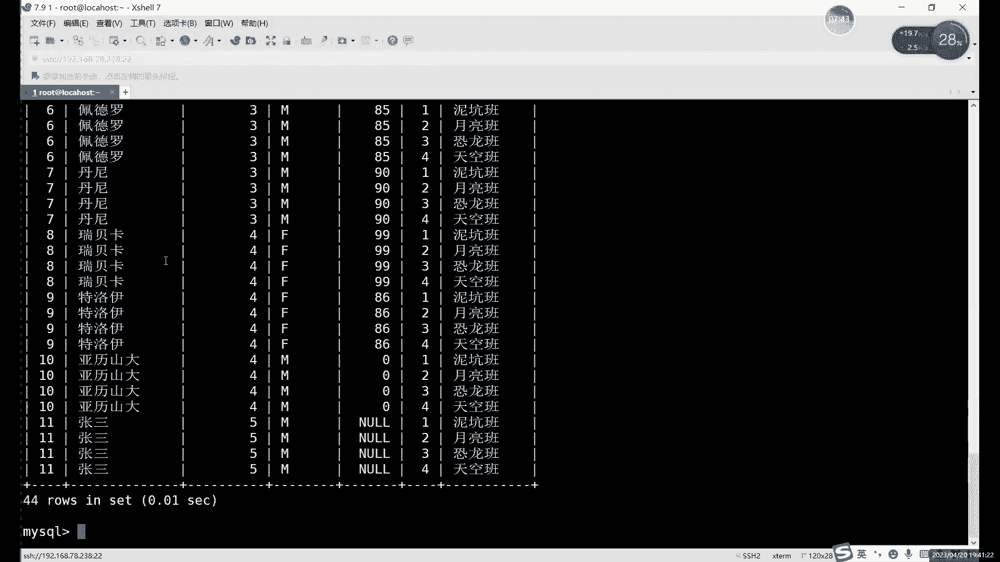
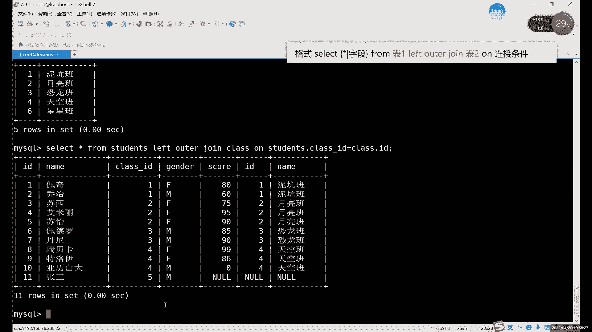
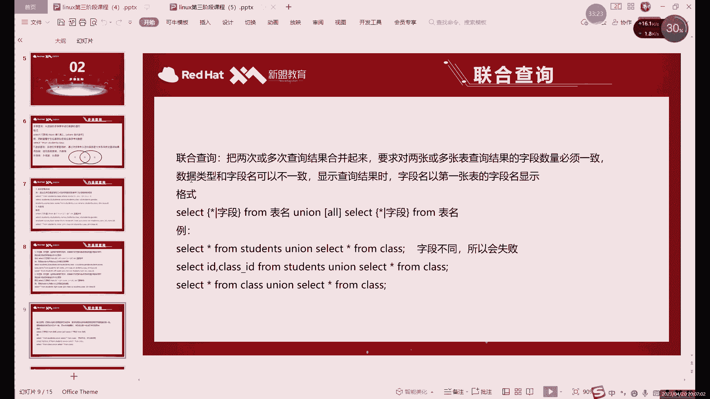
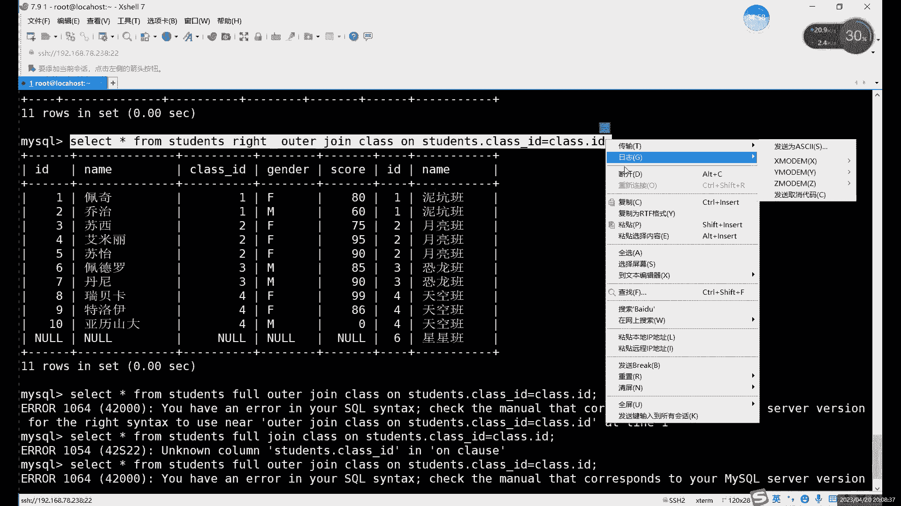

# 零基础入门Linux，红帽认证全套教程！Linux运维工程师的升职加薪宝典！RHCSA+RHCE+中级运维+云计算课程大合集！ - P74：中级运维-13.SELECT多表查询，复制表，破解密码，授权访问，存储引擎 - 广厦千万- - BV1ns4y1r7A2

好，我们今天呢继续来讲这个查询啊，自来的查询。

上节课的最后呢，我们讲的是什么？讲的是嵌套查询这个。😡，签到查询这里的话，其实主要需要注意的就是签到查询的两种方式。一种呢是作为什么？一种是作为这个。子的查询语句呢在哪儿呢？在相当于是在。

原主要的查询语句的这个wherere条件语句里面啊，就是子查询语句呢在where尔条件语句里，一种的话就是什么？一种的话就是将我们这个查询的一个结果作为什么作为第二次查询的一个表格来算啊。

就是两种情况啊，一种呢就在相当于一种是把side语句呢放在了就是把slide的子查询语句放在了where部分，一种呢是放在pro部分啊，就是两种。啊，唯一区区别的话就是from部分的话，记得加个别名。

其他的话用法是和我们不正常的一个s句是一样的。好吧，那我们接下来的话来介绍什么呢？来介绍一下这个多边查询的问题。啊，都在法庭。多表查询啊，给自就是多少表嘛啊，多少表一起查啊。首先的话我们先来看怎么啊。

先来看。用两张表为例。哎，我们先来讲这个怎么进行多点查询。那首先的话多表查询的话。其实哎如果说直接用slack语句啊，有什么特殊情况，或者什么特殊的这个语法都不用的话，能不能查呢？其实也可以。

就比如说呢我们还是用sence和 class这两个表。

哎，什么叫只用side语句呢？其实就是什么呢？就是。😡。

只写什么呢？😡，只写我们的这个两个表格这个名字。

其他的我们什么什么条件都不加。比如说我们正常的话，slaide信号from。😡，么看我们的学生表。是这样的对吧？看那个班级表的话。😡，Cl。class of应该是这个单词，哎，不对。看哪个单词啊啊。

class。啊是CLAI。啊，是这个表对吧？两个表。啊，如果说把它俩加在一起，对吧？之前的话我们说过s的这个语句呢，第一部分的话是写结果，对吧？写查询结果，我们还是星号，对吧？我们还用星号。

后边的话pro这里加的就是表格名称，之前我们都是一个表格，对吧？从来就没有改过字边，对吧？就最多的话在嵌套语句那里把那个嵌套的语句放在这儿。😊，那也其实只是一个表格，对吧？我们用嵌到语句的时候。

其实from这里也是一个表格而已。那如果说想要查询多个表的情况下的话，首先肯定要把多个表格放在这里。就比如说呢先把这两个表的名字写在上来，写上来sance和什么呢？和class。哎，怕。两个表格对吧？

这样的话就是什么这样情况就是首先多少查询肯定要有两个表格的名字。然后后面的where呢我们可以先不加，对吧？之前我们正常查询对吧？你sla的新 from加上class也好，对吧？加上这个sdent也好。

都能查询出我们整个表格的一个结果。是不是？哎，所以说呢我们接下来来看一下，这样查能不能查出一个结果。😊，哎，首先我们就直接执行。哎，没问题，对吧？能有结果。😡，这个结果呢。😡，可以看一下。数量特别多。

哎，为什么数量特别多呢？😡，那首先。对吧佩奇。4次，你看每个名字都出现了4次。为什么每一次都出现了4次呢？啊，其实原因很简单，就是我们这种查询方式啊，它本身就是相当于是一个错误的语法啊。

但是不影响我们正常的显示。😡，正常的话，我们这个表格是十一列，对吧？十一行啊，这个表格是四行。将两个表格的所有情况呢都结合起来，那就是什么？那就是40。44行对吧？就是每一个情况，你看排到11。

每个人都有4次，相当于将每一个班级和他这个本身的信息，哎，就是班级信息和我们的学生信息呢，每一次都做这个排列组合，相当于是。对吧11乘4那不就是44嘛，所以说它就变成了44行数据。

这样的话肯定是怎么说呢？这这44行里边肯定有11行是正确的。但是呢剩下的33行都是错误的数据。😡，哎，都是没无意义的数据。所以说呢正常的我们多表查询呢。

肯定不能说哎你直接slashide新from我们加两个表格就完事了，对吧？那其实我们就不用讲了，对吧？多表查询的话，我们是有特殊的语法的。就是一旦说你from后边加的表格呢是两个或两个以上的时候。😡。

就不能用正常的这个slide语的语法了啊，会我们接下来的话就来具体讲一下这个do瓣查询的一个语法怎么用，是吧？你看这里虽然说它能显示一些数据，但是明显就什么明显就特别乱。哎。

他相当于把所有的组合排列组合都给我写了一次。啊，相当于用穷举的方法啊，把所有的这个。

组合都写了一次。那我们接下来的话就来具体看一下。你的多点查询呢怎么用？首先呢这样查询肯定是不对的。虽然说有数据，但是呢这个数据呢不合理。而且呢很浪费这个。浪费我们这个相当于是其实也降降低了。

不用说降低吧。就是它查询速度会有点慢，为什么呢？当然这个速度慢它就不是用来查询的，而且用来将给我们做排列组合，对吧？做了44个不同的排列组合，其实根本就没有这么多数据。😊，啊，反倒查数据越查越多。

那肯定不对，对吧？啊，所以说在多边查询里边，我们其实用到的查询方式呢，其实叫连接查询。

连接查询连接的是什么呢？我们就是连接两个表的，两个表格当中的一个相同术语。就是把两个表格当中的相同数据连在一起。哎，这样的话就可以什么呢？可以帮我们过滤一些无用的无意义的数据。

就比如说我们可以看到我们刚才过滤出这些啊，我们找一个class ID吧，class ID等于一对吧？首先第一个佩齐佩奇class IDD是一，所以说它对应的就是第一个班级。

这个是没问题的那下边三个的话其实都是什么？都是它列举出来。234它都分别列举一次。也就是正确的数据只有这一个，那我们怎么怎么将这正确的数据过滤出来呢啊，我们可以看到啊有两个数据是相同的。😊。

在我们这个表格当中，哪两个呢？是class IDD和ID。都是一啊，但不要看前面这前面这个是呃学生的ID这两个都是什么？都是班级的ID。哎，这个相同指的是什么？我这里说的其实并不是指数据相同，而是什么。

而是什么，而是指数据的这个类型相同。😡，它表达就是同一类的东西。这样的话用这种。这个应该要用这种数据啊，两种这两列相同的数据啊，他们虽然说的名字不一样，但是他们表达的意思是一样的，都是用都是班级ID。

对吧你看像这个虽然说它长得也一样，对吧？都是一，但是呢它是一个学生的ID。所以说呢我们需要的是什么？需要的是这2个ID。😡，通过这2个ID来过滤我们的一个正确的数据。哎，将我们正确数据整个过滤出来。

所以说呢连接查询呢就是连接它俩，就是把这2个ID呢连接在一起，就是我们的。students里的class IDD和class表格里的的ID这两个字段连在一起，这两个只要一匹配。哎。

它就能过滤一些无用数据，什么意思呢？就比如说我们这里是一，对吧？和我们的这个表格里面呢匹配的话，一等于一。所以说呢我们就使用这条数据。那后边的234不等于一就全部删掉了。啊。

他说自动删掉这后边这三后边这三个数据会直接删掉啊，就相当于给我们过滤了很多无用信息。就比如说我们可以直接啊来执行一下。啊，那连接查询怎么怎么用呢？那首先呢我们先来看什么呢？😡。

我们先不看这个图啊。我们先来用一下最简单的一个连接查询的方式。两种方式啊，就是我们正常两个表格查询的话，有两种方式。哪两种呢？我们的这个。一种呢是在wherere的条件语句里面，后边去限制。

一种呢还是在from里面限制。两个呢效果是一样的啊，所以写哪都可以啊，写在哪里都可以啊。

威尔的话，这里就更偏向于条件的语句嘛，条件语句。而这个from后边的话，就其实就是将两个表格呢啊联系在一起。其实是一样的。啊，他们的效果一样，只不过不一样的是就是写法不一样啊。

就是这两个效果其实都是相同的。

啊，效果都是相同的。就比如说呢我们来看一下。首先的话，我们这两个表格的这个名称不用编，对吧？后边我们可以直加尔。我们这个限制条件呢它比较特殊。哎，这次我们写的限制条件跟我们前面写的都不一样。

之前我等于号的话。😡，有时候是什么？有时候写字符对吧？某一个值等于某就是某一个字段呢，等于某一个值。有时候是字符，有时候是数字整数啊什么的。😡，对吧这次的话我们是什么呢？没有数没有数据。

没有数值也没有字符。我们用的什么？就是将两个字段相等。😡，这个含义就是把它俩联系在一起。查找什么呢？😡，更或者说换一种说法就是查找这两个值，这两列里边值相同的一个数据。哎，就是什么呢？

就是这个意思其实很简单，就是。😊，class IDD里边等于一的对吧？我们这个class点ID等于一的，我们就显示出来，有classus IDD相同的显示出来，不同的就果果留掉，对吧？

正常的话我们没有这个where语句的话，我们是这样的对吧？😡，那这个位尔语句的话，其实就是一等于一，那就显示对吧？一等不等于2，那就不显示。所以说呢第二个，比如说瞧这这里你看第二个的话就是二啊。

还是一对吧？一等于一，那就显示这个还是显示这个。下面的话比如说啊有有其他数据啊。

比如换第三位同学，他的单题是2，所以说它显示的是第二这一列啊，这一行。啊，这个的威尔条件限制也就就是让它俩里边数据相同的数据相同的显示出来。哎，这是一种方式。原理其实不一样，但是结果一样啊。

这两种语句的话原理不一样，但是结果是相同的。大家可以看啊，我们就直接过滤出来了。那们一看到我们只过滤出什么，只过滤了10R信息。哎，直播6月10号信息。

但是我们class IDD这里呢不是不是class IDD就s表格里面，其实是我们后面又添加了一个张三，对吧？它为什么没有呢？😊，我们看一下他的ID是谁呢？他的ID是5。😡，他的I例15。

pa表格里面是1234，没有啊没有怎么办呢？就他就找不到，相当于是找不到class IDD和class点ID相同的字段，找不到呢，自然就不会显示了。哎，不是说是这个数据没有，我们是因为这个什么。

它是个条件威尔条件语句。😡，它只过滤我们这个需要的条件，它这个条件不满足，那我们自然就不需要它了，那也就不显示这个数据。对吧这个就是什么？这个就是我们的连接查询的用法。

其实主要呢就是用一个we尔的条件啊，用威尔的条件来限制我们的这个获取的数据，这是一种。第二种写法呢，也是结果是一样的啊结果是一样。只不过呢它这个就是呃怎么算呢？这个是比较专业的。

上边那个呢其实就是用了个贝尔条件语句。下面这个是专业的什么呢？专业的多表查询的用法。比如说。比如说我们这里写什么啊，pro后边我们继续写什么，继续写表格名字。表一表二呢？😡，就是你前面写的表。

它就叫表一，后面写的表表就叫表2。呃，总体上来说呢，其实嗯。Okay。这个表一表2其实在这里呢没有什么太大含义啊，但是我后边的话，这个表一表二还是很有用的。所以说这里的话就先写哪个都可以啊。

先写哪个这些都可以。因为这两这个连这种查询方式呢，我们这里其实。😊，呃，谁前谁后无所谓啊，谁前随后无所谓。啊，inter join加上什么呢？加上我们的表二，表二是谁？表二是class。对吧。

两个表连接在一起。到现在其实我们还是在from后边啊，还是在from语句里。我们写的其实就是将这两个表呢联系在一块。😡，通过哪个条件呢？通过class IDD这个。通过class IDD这个条件。

当然呢你不能直接写classs IDD，因为什么因为是两个表格。两个表格的话，class IDD它也是不一样的，是吧？它是两个不一样的字名字叫名字叫法不一样。所说我们还是得写上表格名字。

有 class大啲。等于。其实看起来差不多，对吧？一个是用where去连接查询的条件。where尔的话相当于是用s语句去限制条件。这个R的话是我们这个多表查询的特殊的用法啊，它这里头其实都没加什么的。

都没有用where。第二个语句根本就没有用where尔啊，我们限制这个用连就是用的是R来连接。作用是一样的啊作用是一样的，就是换了一种用法。啊，作用是一样的。比如说呢我们可以来看一下这个。

这里的话正常的2个class点ID啊class点ID大家可以看，其实这两个结果呢。哎，这两个结果其实是一样的对吧？😡，呃，只不过呢它俩只是用法不一样啊，where尔的话它是通过什么？它是通过一个限制条。

通过一个条件来限制啊，通过这2个ID的条件相同来限制。这个的话其实也类似，只不过呢其实就是用法不一样啊，它没有用where的条件，而是直接在bro后边加上了我们这种啊都有它生特殊用法。啊，对特殊用法。

啊，对，大表查小表小表查代表查询速度肯定是呃肯定是会不一样的啊肯定是会不一样的。大表还现小表，其实一般情况下的话，速度会稍微快一些啊，速度肯定会稍微快一些。其实就主要是因为。如果前面这个大表的话。

其实我们正常。正常的话其实就是什么？就是将什么将我们的这个传输结果传给客度客户端的时候呢，其实一般查询结果会比较通常比较小，所以说传输的数据的量也比较少。啊，所以说呢大表查小表其实一般会快一些。

啊这个其实和索引的这个也有一点关系啊，和索引其实也有关系。一般情况下呢，其实小表的这个索引呢，其实查找的这个效率肯定是更高的对吧？你数表比较小索引其实就数据越少，索引肯定是越快的对吧？索引是。

就查找速度肯定是越快的。然后如果你是大小表查大表的话，其实我们一般就会通过一些，因为扫大表里面数据很多吧啊大表里面数据。数据量是比较大的。所以说查询速度肯定会比较慢啊，查询速度肯定会比较慢。

声音有点卡吗？还是。画面不是画画面没有动啊，声音是不是有点卡，刚才应该这里还好，我这倒是没有看到声音有点卡是吗？我再换个耳机。现在怎么样？感觉这两个耳机。那有一天可能有一天是左边耳机好用。

有一天是右边耳机好用。现在我又换到左边的耳机。现在这个声音怎么样？应该还可以吧。啊。就一般情况下的话，有最好的。最好大表放在前面啊大表放在前面。大小其实就是看什么，就看数据量啊，这主要看一下数据量。

声音有时候破音是吗？破音是不是有有时候声音稍微有点亮。Okay。就是查询的时候，就是我们多表查询的时候，你把大的表放在前面啊，通过通过大的去查小的，因为小的数据量比较少啊，小的数据量比较少。好查一点啊。

如果说您是从小的去查大的话。相当于是你这个要把大表里面的数据全部要过一遍的话，数据量越大，肯定数据越慢啊，数据量越大，肯定速度越慢。这个的话这种查询呢。我们主要就是通过什么呢？这两种都是什么？

都是我们的连接条件。就是通过我们这两个ID呢，就相同的数据就全部过滤出来啊，就过滤相同的数据。所以说呢啊这种连接查询的话，它的名字叫什么呢？

一般就是可以叫，其实叫法很多啊，你就。其实理解了它的这个命令的作用就行了。叫法的话其实无所谓，对吧？内链这。啊，和自然研件查询两种呢就是用法不一样，它实际的一个结果是一样的。

就是我们刚才查的是哪一部分呢？啊，刚才查的是这部分。然后这部分的内连接查询呢。其实就是什么？就是查询一些我们的这个两个表格当中的相同的数据。为什么这么说呢？其实是你看我们前面在左边这个表格。

就比如说。我们总员这个表格是一共有11行数据，对吧？但是我们的连接查询呢只能查出十0行，就是因为第十一行的数据呢，我们第一个表格里面有对吧？这个class IDD里有第二个ID里面没有。

这种情况下的话就会出现什么问题呢？😡，对吧就是我们的这常认源查询。第一个表格里面有5，但是第二个表格格没有的话。他也没有办法匹配我们的条件，对吧？没办法匹配条件的话，它就会什么？他就会直接。😡。

也就不显示。也就是我们的11那个ID。就是张三的嘛，张三同学他是在左边的。啊，因为他的数据的话和我们右边是不一样的。就是张丹同学其实在左边，我们刚才的这个这两种，其实他查的都是哪部分内容呢？

都是中间这部分内容。哎，中间这部分内容。所以说呢这里的话。第一种查询的话，其实就是查询什么的啊。我刚才讲的第一种查询，其实就是。查询两个表格当中。啊，就支付针对于某一个字段啊，某一个针对于这个字段。

我们当前这两个表格当中相符的内容。啊，就数据相同的内容，就是我们能。内连接查询。当然呢与它相对的啊，我们左边是有一部分内容，对吧？右边也有一部分内容啊，这两部分内容。如果说通过我们这种查询方式。

它如果显示不出来的话，其实我们的数据也也可以说是不完整，对吧？但如果说想要显示左边啊或者说右边内容的话，怎么办呢？就是用我们的其他的连种其他的连接方式。啊，就换一下我们这种命令啊，就得换命令。啊。

接下来说的说啊，我们说这个左连接和右连接。哎，就是左边这部分，右边这部分。现在的话其实我们张三其实就相当于在左边了，因为右边呢没有11这一个不是没有11，没有5这1个ID对吧？啊，包括右边的话。

就是我们在再插入好插入插入一条内容吧。

比如在这个class表格里我们再插一下啊，方便演示啊iner音库。看啊123。字5。6对吧？按个6吧。6的话随便写一个。啊，再查一行那个。再看一行内容吧，现在第三个表格里面它是有什的。

不是第不是第三个第2表格里。side星from啊，加上什么，加上class。对吧啊，我们现在是12346，左边这个表格呢是12345。对吧两个表格其实都已经有着不同的消息啊，不同的信息了啊，不同信息了。

不同的信息的话，我们是可以通过什么？就是通过单独的左连接或者右连接能够显示啊，通过左连接连接显示左右其实是怎么区分呢？这是通过表一表二来区分的。我刚才不是说了嘛？就是刚才的其实你左边写哪个。

其实结果都一样，对吧啊，先写哪个，其实结果都一样。

但是左右呢就不一样，左右它通过什么去区分，就是通过表一和表二去区分。😡，啊，连接方式的话，其实我们这个是现在是说了三种，对吧？现在说了三种，其实呢完整的话一共有123。4567一共有7种。这几连接方式。

我们一共有7种啊，不着急，我们一个一个说。啊，现在我们也只是说了三种而已。啊，一共有7种方式。Okay。其实就是谁是在前边，谁就是左边。这个其实就是谁在左边，谁在谁是表一啊，谁就是左，谁是表二。

谁就是右啊，就是这么区分的。所以说呢如果说你用了左连接或右连接的话，这个表一表二的顺序其实就有。哎，就需要什么呢？就需要考虑一下。当然呢，如果说你两个表很明显的有大小之分的话。

其实就是把大表尽源放左边啊。如果说差不多的情况下呢哎其实。哪个放前面都可以啊，主要就是放前面的就是代表的是左，那吧？表二就是右那左连接查询的内容是什么呢？他查询的是我们左边独有的内容和相同的内容。啊。

就左边独有的和相同的这一部分，什么意思？就是我们的。他其实就是什么？就是换一种说法就是。表一全部的内容。啊，有于全部内容。加上什么？加上表2。加上和表二相同的一部分内容啊，这个就是什么？这个就是左连接。

啊，就是以以我们的表一为主。那右连接的话就是以表二为主。

啊，就是以表2为主。这个的话比如说我们直接给大家演示一下啊，给先演示一下。比如说我们现在还是用tudents做表一啊，student class做表2，我们的顺序就不变了啊，顺序就不变了。然后呢。

我们接下来看什么呢？接下来看一下左和右啊，它的一个区别啊，它左它的一个区别。首先命令的话其实。😊。

它就是单词换了一个单词，其他的是一样的啊，就left和right的一个区别。lob这里的话就是就是我们英文组嘛，对吧？😡。

right话就是因为右。这的首先我们先啊还是用什么，还是用students作为什么，作为表一。啊，还是将student students作为表一。比如说我们这里表一写的话，我看students写在哪呢？

STUDNTS论。然后呢，left这个啊左的吧左连接查询。2后边跟的条件呢还是一样的啊，2后边跟的条件还是一样的。加载机等于。大型的ID。啊，左链接查询。大家可以看啊。

就是这里的话上边的第十上边十0条的话和我们前面的那个内链接是一样的。

啊，也就这个左连接的话，其实就是包括了什么？包括了内连接。除了内接内连接的数据以外呢，还有哪一部分呢？就是我们表一的内容。

表约剩下的所有内容呢没有和我们的表上匹配的东西，就显示在这个下面。啊，这里边比如说这里只实一条数据没有匹配。如果是10条数据没有匹配的话，也会也会都写在下面啊，都写在下面。然后呢。

如果说因为它没有和这个匹配，对吧？没有和表二匹配。所以说呢后边表二的内容的话，我们用空值去填充啊，用空值去填空。啊，这个左右其实都一样，那右的话。对吧反过来。就是以谁呢？以我们的part表为主。

以class表为主显示出来内容的话就是。

这边还是十0条都有，对吧？因为那连接都是有的啊，1234都有。然后呢，5的话我们电压表没有，它有几，它有个6，我们刚才添加了一个6，对吧？添加一个6。

但它就会显示他六这个班级啊，我们可以来演示一下啊。左右的话其实就是什么呢？就是把这个。两边换了一下。啊，主要就是把两边换了一下。或者说其实你甚至不换左右都行。

你把这个class和sdents的一个位置换一下，它也是效果也是一样的啊。我们这里就换成换这个单词吧，我们把这个left换成right。啊，不换两个表位置吧。

我们还是尽量指因为这两个表我们还是有一点区别的，对吧？有点区别的。嗯。这里的话我们换成right之后呢，我们直接执行。大家可以看到前面就全员成空了空值了，对吧？从这个ID一直到成绩，一直是空的。

到哪个开始它有了呢？它就到ID这里。哎，这个就是什么？这个就是右啊，右连接查询就是包括了我们内连接查询和什么和我们第二个表二的剩下的所有内容。啊，这样同同样也是一样的。如果说你有七班八班也会列在下面啊。

前边的话肯定都是空值，因为。这个字表格里没有这个六班的同学，对吧？没有6个6班。哎，这个就是左连接和右连接的区别。

左右的话，其实你就可以看成你就看成这个椭，就看这个椭圆就行，对吧？左链D球连接，其实看那个椭圆内连接是中间这部分做的话其实准确来说是这个椭圆。然后右边的话是这个左。啊。

它不是说左连接就是表就全是表一的数据，而是表一加上相同的数据，右连接就是表二加上相同的数据。哎，这个就是左右连接的一个区别。啊，以及他两的话其实都是个都是包括这个内查询的一些数据的啊。

都里面都是包括着的。然后呢，我们接下来来看怎么呢看一个。这个是什么？这个是我们的一左一右对吧？加上内连接。下面的话我们还有还有几种吗？还有几种。比如说我们接下来看这个12。左右啊。啊。

但是这个是联合查询啊，我们就先不说联合查询，我们先说这个。嗯，全链接查询吧啊全连接查询。什么叫权链日查询呢？啊，就是什么？就是。两个椭圆一起返回。啊，不知道咱们能不能连这个，就全连接的话。

就是返回全部的意思嘛。但是呢返回全部的话，它也不是说直接把两个椭样的数据全怼对在一块儿，而是什么呢？而是。中间的正常显示对吧？内连接我们还是包括还是包括内连接的，有包括相同数据。

不同数据呢就是左边和右边这两部分，对吧？这两部分的话，我们也一块去显示。啊，一块就显示。哎，就比如说我们可以看一下。

这里的话还是换单词就行，嗯，不换位置啊，换单词不换位置。Okay。换一个货这里。全连接嘛就是报所有的，相当于是所有嘛。哎，不对，换错位置了。就前面这个。不，然后呢out。啊，全链接查询的话。

这里我们就是什相当于什么包括。两两个表格当中相同的内容和不同的内容，就所有的东西都放在一块了，就是能匹配的尽量都匹配，不能匹配的，我们分开显示啊，不能匹配的，我们分开显示。

所以说这里显示出来最终结果的话，其实就是什么？就是帮把我们上面那个左连接和右连接加在一块儿。那于把左连接和右连接加在一块去显示。啊，这样一块就显示。比说我们这里直接执行啊直接执行来for out。

俾你看。4。OUTR。哎呀，outer joy students。B。the先 from。保错是在aler那里。tus点fassID。表格名字我没问题，他这里报了一个不知道的啊嗯。

sdents点class IDD。等于class ID。嗯，看一下select新 from students第一个表，对吧？我们过。对啊。查看表是正常的。

刚才我们不也用的是students点2class IDD吗？表示在的，不意思啊。不知道导好。哦，哦退过啊。啊， studentsdents加class一等于class。他报的措施在aler这里。嗯。

我要企牙啊。my circlercle的全外链接。看一下啊，这个aler foraler全连接的话。嗯，正常这里。内连接我们取两张表的交集嘛，对吧？取两张表的交集，左外连接取的是。A表和交集。

左连接右连接。哦，对。这个马特不不支持这个命令，他买特不是不支持这个全按链，他支持了，他只是。全链接它是支持，但是它不支持这个命令啊，不支持这个命令。对是一个钮，就是我们下面这个。

就是我们下面这个什么下面这个联合查询这里啊联合查询这个用法。买s的话，它倒是支持这个全连接，但是呢它不支持这个呃go out这种写法，它是用什么？我们用这个unil这种这种写法。这种写法的话。

严格查询的话，可以将多次的查询结果合并起来啊，将螺丝多次合并，多次的查询结果合并。我用这种方式。这种方法呢其实。嗯。

这种方法其实它不算多表查询啊其实不算多表查询。但是呢我们这个myq里面可以用这个unual呢，将什么呢？将我们的多个表格当中的这个。就是相当于这里的话就代替了这个foral这个命令。

for not drive或者是for drive的话，买这没有这个命令，买自没有这个命令，所是支持到这还支持的。我们把中间这个换一下啊。嗯，select新 from students。

然后呢加上我们的这个。左左左去哪了？你打断一下吧，我把左的复制出来吧。怎么做全连接呢？我们这里的话马赛特比较特殊，因为它没有刚才这个命令的话。买4个不支持这个命令，其他数据库还是有的。

然后这里的话我们把这个。这个是左连接，对吧？我们mysl里面做全连接。呃，其实很简单啊，非常简单粗暴的就是把这两个连接在一起啊。union的话，它是代表的是什么？它代表的是连接就是联合查询。

就是它是可以将两次的查询结果合在合并在一起的啊，将两次查询结果合并在一起。这种的话可以用在像我们这种全连接的情况下，也可以什么？也可以是两个表格的两次查询呢啊两个次查询的不同结果呢拼合并在一起拼在一块。

也可以用这个union啊。union这种查询方式。😊，这里的话我们拼一下谁呢？我们拼这个就是左和右拼在一块儿。

啊，我们全链接是左右拼在一块儿。

啊，就是把左和右拼在一起。你看一下。命令应该是没问题，left对吧？这个是right。中间呢用un扭连在一块。

啊，我们直接回退。对吧这里的话大家可以看到。除了1到10以外呢，下面还包括什么11对吧？六边是空的，然后六班级的话，这里的话前面是空的对吧？这个其实就是什么？这个就是全链查询，就是什么呢？就是。嗯。

代表哪一块呢？

我还是用这个图看吧啊用这个图看。刚才的内联页查询呢是中间这块啊中间这块是内链域查询左的话。是这一圈啊这一圈的作用。啊，这一圈是多，然后又连接查询是这一块。啊，就是内部的加上我们右边的。啊，全链接呢。

就是我们这一这两个椭圆里边加起来的所有内容啊，这就是全连列查询啊全连列查询。Thank you。啊，左连接当然左连接右连接的话，这就我们已经说了什么，说了四种啊，对吧？四种还有三种。

还有三种是比较特殊的情况。呃，后后边三种的话，它是用来过滤一些没有匹配的信息的啊，是比较特殊的三种情况。你比如说呢我还可以过滤哪一部分呢？就是这一部分。只要做的。和只要右边。还有一种是什么呢？

还有一种是只要两边的。两边一起显示。啊，一共什么？一共7种方法啊，一共7种方法。这里的话首先权链查询的话啊，大家注意就是my搜l里边呢啊权链查询的话，其他数据库里面是倒是可以用这个go。😊。

拿去啦。命命令呢啊for joy或者说是for auto joy都可以啊，这两命令都可以。但是myto里支持mys我们用什么？我们用这个联合查询的方式啊，用联合查询命令呢。

将我们两次的查询结果呢合并在一起啊，作为这个全连接查询。

哎，都有权利。然后左右呢就是如果说只要左边那部分或者说右边半部分的话，怎么过滤呢？啊，就直接用什么呢？直接用我们这个R还是用2。其实这个方法很简单。我们直接用VR就行了。有R加上where一起用啊。

这样的话方便过滤一点，是吧？比如说呢left我自以用left。就比如说如果说我们现在想要哪部分，我们现在如果说只想要左边这部分啊，就是不要内连接，我们只要左边这一小部分。

这一小部分呢，其实我们就一个数据，对吧？就是张三那个数据，这部分怎么提取呢？其实很简单就是。

这个叫。右边这个字段叫什么来着啊，class IDD。表格的话是哪个表格呢？啊就是class ID点点ID啊class点ID。你只想要左边那部分的话。我们就只需要什么呢？只需要ca IDD等于什么呢？

啊，等于no。嗯。打十你抖音乐。

啊，佢可等六。这样的话其实就是左边那部分。啊，如果说想要右边那部分呢。啊，就这边这部分怎么办呢？那也是一样的。你就换你个ID吧。😡，这两个话其实我们主要是判断通过这个class IDD和谁呢。

和这个ID来判断。所以说这里的话我们直接换成什么，换成student。啊，tudent is not。这样的话就什么？就是右边那个表格的唉 students也往通的。啊，left是吧？

我们把left换成right。这个就右边那部分的一个。特殊的数据啊特殊的数据就是第六个班级。啊，但是呢最后一种。唔间。能举一反三能推出来，对吧？看用哪个呢？哎，这是主要是。主要还是怪怪什么呢？怪这个。

灌买se购哼这个这个只能说灌买se购它不支持。这个没办法啊，买测过他不支持。只能用什么？只能用。这两个秘密。啊，还依然还是这两个名。啊，不能说两个命元，就是依然还是我们这个。

un纽的联合查询啊联合查询命。诶两个查选咗嚟。L right。哦。哦，你们得换个ID啊。but点ID。啊，布制错了，复制着那个刚才空的那一行。啊，也就其实这个unual呢就是把相同的书。

把这个两次的拿去了，在这儿啊，就是把两次的命令呢，或者把两次的这个查询结果呢合并在一起。啊，合并在一起。啊，如果说你做这个连接的话，其实不管你左连接右连接还是什么，还是内链接，其实都一样。

你都得知道条件呀。你不知道条件的话，你肯定不能怎么联系在一起的对吧？因为什么两个表格里边，你数据肯定是大部分数据肯定都是不一样的啊，可能只是有几个，对吧？有几个个别的这个字段。😡。

他们表达的是一样的含义对吧？就比如说我们这里这个2个ID，它就是这2个ID就所有数据都相同嘛，那肯定也不一定，对吧？就像我们这里的话。😡，ID这里有11对吧？

class IDD那边没有class那边有个6tudents这边又没有，也就不是说所有数据都相同。但是呢你这两列数据要什么呢？要保证这两列数据是保表达的同样的信息，同样的内容。那这样的话自然。😡。

我们这里的这个连接查询的话，就是通过我们的这个特殊的条件啊，就能连系在一起啊，左右也好。其实然后通过这些的话，其实就是你只要什么呢？你只要说把你连接的那个条件，它变成空值，其实就能判断了，啊。

只需要判断一下，你就是只需要等那个你连接的条件，像其他条件行不成呢，其实也可以，对吧？你比如说name等于n啊，name isn。它也能出这个效果啊，但是呢其实你没必要去去找这个字段，你只需要什么？

只需要用你连接的那两个字段就行。你为两个表格，你连接这个字段的话，如果说有不同的数据，那肯定就是。如果说你要显示左边的表格里边特殊的数据的话，那就把右边这个表格里面的字段编成呢。哎。

如果要显示右边特殊的一些数据，对吧？你就把左边的写成那啊，自然都能过滤出来啊，自然就都能过滤过。这个其实是通过啊，主要是后边的话，主要这个是靠where的一个过滤啊。二的话，它这里我们只是连接的作用啊。

只是将两个字段连在一块连在一块儿。啊，我们在后边哎过滤的话，你直接用一个威尔把一个特殊数据过滤出来就行。啊，这个就是什么？这个就是我们的。七种方式对吧？七种方式其实就是。

这两个椭圆的事儿，对吧？那边接一种。左边一种右边一种。全部一种四种了，对吧？然后呢，分别的左边特殊的数据，右边特殊的数据和两边啊都是多余的数据啊，你可以说它是多余的数据。

因为两边没有两边相当于是没有匹配的数据的话，其实就啊就多余了呗啊，因为它就就变成变出了很多空值啊，因为没有法匹配，没有相同的数据啊，没有正当数据。这就是什么？这就是我们的7种。多点查询的方式啊。

让这边查询的方式。刚才的话我们是说了一个什么呢？嗯，我刚才中间插了一个这个叫最后这个。联合查询对吧？联合查询其实。😡，哎，主要的话。本来其实可以不用在这个多角查询这里。

只不过呢是因为买搜索这里边有个命令不支持啊后。全链接查询它不支持，所以说我们这里是啊被迫是用了一个什么，用了这个uni的连接查询。它呢它的作用是什么？就是联合查询，不能说连接查询联合查询。

它是将两次或者多次的查询结果连在一起。哎，就是把你如果说查个两三次的一些数据呢，可以堆在一起。像我们刚才其实就一样，我们就般才就是把两次的查询数据呢合并在一起了，然后合并在一起显示对吧？相同的话。

它就会去重啊就去掉，只会显示一次啊，就所有数据只会显示一次那这个就是什么？这个就是联合查询的意思啊，就是作用。当然除了刚才的都表查询，我们可以用联合查询的话。

我们正常的单个表格查询其实也可以用两个联合就联合查询去连接，对吧？就比如说。可能是一个表格啊，查询了两次啊，查询的是不同的啊，查询出来的过滤的过滤的这个信息不一样。所以说查询出了两次不同的信息啊。

数据不一样啊，我们可以什么？如果这两次都需要的话，我们可以用这个联合查询呢，就把这两个表格连在一起，就是把这两个查询结果啊准确的说就是把这两个slash语句连在一起。连在一起的查询结果呢，其实就是什么？

就是。按照什么呢？按照我们这个。从上到下对吧？就是前面那表肯定在上面啊，后面的表在下边啊，这样相方式去排列。啊，这样排列之后的话，我们就能相当于是把两次查余结果合并在一起的，合并在一起的。

但是呢这个联合查询是有要求的。像我们刚才其实联合查询都是很正常的，没有任何报错信息啊，没有什么特殊的情况。啊如果说你是两个不同的表格，或者说是两一个表格的两次查询结果。

一旦这两次查询结果就是两个自带点句呢，它的这个返回的列不一样。啊，或者说就是返回的这个字段的这个数量不一样的情况下呢。啊，他就。他也不能说报错，他就是很。😡，总之就是。

尤其像这个如果你的两个字段不一样的话，就比如说嗯。显示的就特别怪。所以说呢这个联合查询的话一定要注意，就你尽量保证什么保证你的两次的查询结果。的一个条件啊，不是条件，就是查询的结果。至少在类型上啊。

数据肯定是不一样的，一样的话就没必要用这个unual了。数据在不一样的情况下呢，尽量保证呢保证字段是相同的。啊，保证字段相同。miss我们可以来看一下啊，我们来可以看一下。

如果说我们直接将pa表格和students表格用这种方式一起查，行不行呢？

我们可以来试一下，前面我们是用的是联合呃，就是连接查询的方式。现在我们换成什么呢？我们换成这个联合查询的方式，就是UNION就是我们刚才啊做全连接的时候啊。做全连接的全外连接的时候。

这两种的话我们可以直接写一下s你号 from。Pass。啊，我们可以直接执行哎，他会报一个什么错呢，他会报一个我们使用的这个查询的这个结果啊，它有不同的什么呢啊不同的列。啊。

number嘛啊列数呢不一样。为什么不一样呢？😡，6点总一共是12345。五列plus呢是两列，对吧？列是不一样。

