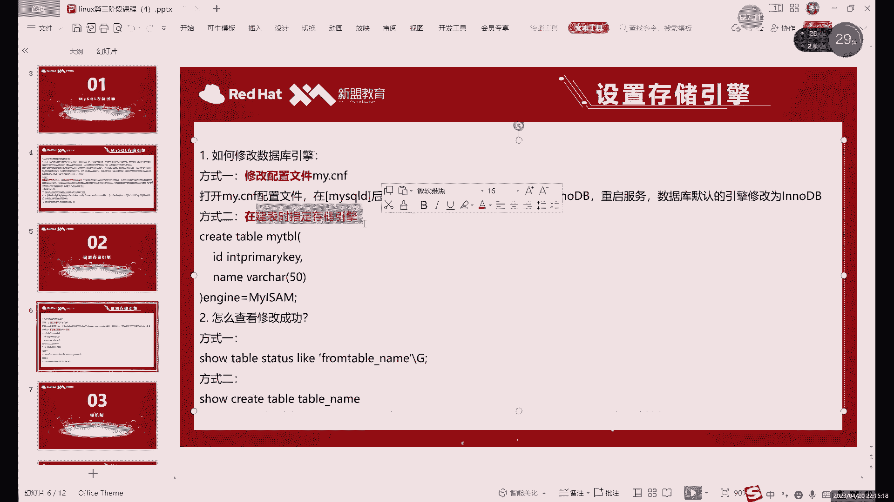

# 零基础入门Linux，红帽认证全套教程！Linux运维工程师的升职加薪宝典！RHCSA+RHCE+中级运维+云计算课程大合集！ - P76：中级运维-15.SELECT多表查询，复制表，破解密码，授权访问，存储引擎 - 广厦千万- - BV1ns4y1r7A2

Oh。下周的课程里面，我就能就会用到。三台数据库的三台以上的数据库，就是大家可以提前装啊可以提前装。

先剧透一下，下周的课程开始，我们就。本周六都少还不用，从下周开始，下周二的课开始。有需要用到三台三台数据库啊。几震多啊几震多。你这个内存硬盘不一定要开很大，你只要开小点也行啊，稍微开小点。

凑误收入也可以。你只要不卡就。因为你如果开大话，可能哎有有有的同学的这个电脑配置不太够，不太够。

啊，这个就是我们一个授权。啊，IP tablesfi其实一样，就是两个数据库而已。😊，嗯，你从这个。没啥区别，只是他俩的策略是默认策略是完全相反的啊，默认策略他们俩完全相反。然后用法障当然也不一样啊。

用法障当然也不一样。嗯，你用一个就行啊，但一定要注意啊，就IP table foreverever用一个啊，就是默认你就默认开一个就行。开两个它的规则它就容易冲突。因为什么？因为他默认是。禁止所有端口。

IPtables是放心所有端口啊，它俩的规则上就默认规则就直接就重复了。所以说你默认只开一个，用的话只开一个，不用就全关了就行。啊，不用看看啊，一盒一G20G硬盘够啊go够你就按装最角化的安装。

然后呢呃编译的时候记得用make面就行了，千万不用m on这样。内存小m放这是编译不了的，编译不了的。直接就报错了，那存内存小的话。CPU小内存小其都会爆错。啊，大家可以下课休息几分钟啊，我们一会继续。

o以。啊，就是授权访问授权访问这个东西呢很有用啊，后边我们也会经常用的啊，还可以多多看一，命令也很简单，但是呢非常常用，这个就真的非常。

尤其我们后面各种各种各种实验都会用这每个实验都会用这个命。

好，我们接下来的话内容是买s的存储引擎啊，这个我们在第一节课就提到过，我们在说这个买so的特点的时候，其实就说过。啊，就说过这个买思lo这个存储引擎的问题。啊，一个合理的存储引擎其实在。其实这个合理呢。

基本上默认就给你选好了。因为我们一般啊就现在买s用的哪个存储引擎呢？就是用这个inteldB的更多一些。啊，因为能利更多一些。也就是我们。目前正在用，目前我们现在一直创建所有的数据库啊，创建所有表格啊。

除了那个全文索引以外呢，其他的全部都是什么，都是这个应动T的重引。啊，因为现在这个系统其实是啊不是说系统吧，就现在这个层引擎其实做的比较好。啊，这功能比较多的啊，功能比较完善的。

然后这里的话我们可以看一下这个啊选择存储引擎的话，其实主要就是什么？就是不同的存储引擎呢，它可能会有不同的这个。索引对吧？以及不同的功能。总体上来说，英doDB的功能总体上来说是最最最好的。

所以说呢现在默认基本上都用这个indoDB啊，英doDB。嗯，还有一种的话就是我们前面演示过的那个。在全文索引的时候，我们不是用了MSMMYISSEM那个啊。这两个同整引擎的话，总体上来说。

各有优势各有优势也各有劣势。但是呢应度DB的优势更多啊，就因度DB的它优势更多一些啊，更多一些。所以说呢嗯就类似于。可以这么去类比。就是我们的win7和win10。win11我还暂时不想说。

因为主要用的还不多啊，就拿win7win10来说，你就可以看成什么？就是可以看成两个不同版本的系统。啊，部分版本系统。其其实从win7升级到Wwin10之后呢，其实也并不是所有东西都都是。都从都是变好。

就大部分都是变好，有大部分都优化过。但是win10它肯定也就是最开始，尤其是最开始的时候，它一开始一开始升级到win10的时候，其实也有很多这个兼容性的体验，也有很多bug，对吧？

一个新的系统一般创建的话都是这样的，就像前。去年去年前年的win11对吧？刚出来的时候，其实也是。一样也不太好用，呃，慢慢它其实慢慢优化的一个过程。比如一开始说来的时候。

其实你就可以把这个我们的存储引擎呢看成我们这个操作系统的不同版本啊，就不同版本操作系统。我们这里的话常用的两个呢就是MSM和B。就是哪两种呢？就是我们在。其实上面的话我们是看了一下那个文件的。

我们看了哪个呢？我们CD到点点杠的data目录下。

然后分级到数据库里面。IBD和FRM这两种格式是谁呢？它就是inowDB的，就是INODB这个格式的从重命。还有一种是哪个呢？刚才其实没有说，就这点。😡，啊，就是MYD为什么MYI。

这两个文件呢是谁呢啊？这两个文件呢就是我们的mySM。SM的格式的话就是这两件。看其实我们大部分都是这个数据库里面基本上都是这个FRMIDIBD这个是谁呢？这个是我们创建那个叫全文索引那表。啊。

这是我们权额索引那表格，然后呢，存储这个。Okay。存储我们这个结构的是MYI啊MYI纯结构。然后我们MYD的话是存这个。数据啊MYD主要存数据。你说什么文件发个完整的。文件。哪个文件？你说这个。

笔记吗？还是说这个PPT。别替。哦。BT没有完整BT我都是。我分了18个V议体，我这个第三阶段一共18个V议。啊，如果是想想想想直接看的话。我客户发给你也行啊，小今看也可以。是。啊。

这个的话英特DB这里的话其实第二种叫ISSM。这两种啊，只要看到文件是这个的FMIBD的就是代表它是应owDB的文格式。然后呢，你看到这个MY开头的就是这个MSM。

现在的话总体上来说用这个其实更多一些啊，用这个其实更多一些。因为什么呢？其实在这个它俩个特性上的话。

啊，这几个这这几页内容大家可以看一看，了解一了就行了啊，主要的话我们就对比一下怎么对比一下这个英伦DB和MSM它俩的一个啊一个优势吧啊优势以及这个特点。就是在这个。在这个我们的下一个那叫。不是下一个。

这个是我们的第一节课里面，我不是说过一个circle语言嘛，对吧？circle语言里面我们介绍了几个呢，我一共介绍了。四种对吧？介绍了4种。这四种对吧？这这这种的话，数据定义语言我们已经讲完了，对吧？

就是他们三个命密。数据操作语言呢就这三个命密。数据权就是数据控制语言呢就是管理权限那三种。还完全那两个plan和rework，对吧？就这两个我们也讲完了，还差一个什么？还差一个叫事物控制语言啊。

就是管理事务的，我们自己没有说，对吧？没有说啊，这个我们估意得下一课啊，估计得下一课才能才能说到啊。不过这个语言呢啊这个语言的话就主要是用来管理我们数据库里面的这个各种事物的。

其实更直观的或者更直直接的来说的话，就是管理我们的。登山改的。That麻也有。啊，这主要是管理我们增山改查。管理我们这个数据操作里啊一个事物。这个事故的话，其实在马思里面是非常重要的一个。啊。

他可以他其实就是。这个具体的话我们会在下节课去讲啊，下节课去讲。然后事物的话就是我们的第四种第四种这个管理语言。这个inow B的话，它是支持的my sum它直接就不支持一种不支持事物。

也就是它这里如果你用myM的引擎的话，它相当于你少了一种 circleical语言的。你的是直接少了一种笔，就只能用前三种，一四种都没有。By。就直接少一种语言。然后从并发性能上的话。

其实呃现在的这个英lowDB啊就现在用的最多的这个呢它呢性能并发性能上，它其实是。

我说呢，基本上是所有同入眼擎里面最好的。啊，基本上所有同学已是最好的我们SM的话稍微差一点啊稍微差一点。然后呢，这个关于还有一个叫约束外间约束。Yeah。外界约束这个大家还记得对吧？

就是我们用来做数据同步的那个约束，特殊的约束类型。它呢也是in伦GB支持mof不支持。啊，那他不支持。啊，以及我们这个intelDB端的缓存也是比较做的比较好啊，缓存也比较多啊，后那比较多。

然后YSM的优势的话其实比较少，其实现在已经非常少。因为现在主要已经用inowDB用的比较多，所以mSM这边它也。哎，基本上也已经无无力回天了，属于是啊它这边多的一些功能的话，也就是全文索引，对吧？

MM这边是比移动DB要多的啊，全文索引这个MM是有的。还有一些什么呢？其实已经不多了，其实已经多就是mM。优势已经不多了，嗯还有什么嘛？就个嗯。Yeah。查询速度上的话，这个其实还行啊，其实。怎么说呢？

就是查询速度上其实还不差啊，就是总体上它的功能是比较少啊，整体的使用其实还是可以用的，用是可以用，只是它的功能少啊，功能会比较少一些。嗯，还有一些就是。

其实这个E优劣势的话，我在笔记里面比较详细的说了一下啊，大家可以了解。因为现在主要的话我们用什么更多呢？用这个应owGB更多一些，也而且也是我们现在买搜默认存储引擎啊啊基本上。myM一些优势呢就只有。

反应速度还可以啊反应速度其实还可以。还有就是这个关于这个。myam中我们是存储的默认存储了这个表的行数啊，就是查询表格的时候，其实啊就是相当于是已经有缓存了啊，不需要进行尺片面扫描。啊。

只要是不需要事物啊，这前提是什么？就是不需要事物的时候呢？而且独到的比较多的情况下呢，m sum其实也是很好的选择。但是呢现在很多情况下这个事物其实很重要。啊，事务其实还是非常重要的。因为这个事物呢。

事物一共是四个特性啊，这个我们就是下一课会具体去说它其实就是管理什么管理我们的这个增产改杀这些命。啊，让我们资源改达命令呢。我们执行起来呢更准确。更安全。啊，就不容易改错。改错也不怕。

只要有我们这个事故的话，改错我们可以立刻回滚。啊，其实非常好用的个事物。啊，我们的下一课会具体说。我们这课的主要还是介绍一下这几个存储引擎。独运行的话，就除了这两个以外呢，其他的其实也有很多啊。

其实也有很多。嗯，其实我们大部分用的呢其实。啊，事故每次都要提交很麻烦。这个其实怎么说呢？这个其实也是保证了你的一个。保证你数据的一个完整性，或者说是你不容易改错嘛。你如果说不容易改错了。对吧你再改。

如果再用up改命令改回来的话，你把一再改做，对吧？所以说呢这个你可以是什么呢？就是改错了，你直接回滚对吧，多方便。对，如果正确的话，你直行commit，命令又不成，对吧？就一个commit而已嘛。

一个提交而已。啊，这里的话。存轴引擎里面的话，其实最常用的就是yellowDD。其次啊就是mySM。其他的话当然还有很多种，现在的话已经用的越来越少了。啊。

当然我现在还可以再介绍一个我们后边会用到的一个特殊的增数运。啊，特殊存引擎叫什么呢？叫这个。黑洞啊叫黑洞，这实存学已经很多啊，存学经很多，最常用就是我们的MSM。那SMM们这里的话就是我默认的输入运行。

基本上大部分的一个场景都可以用。然后ms就是不是inowD啊，inowd是默认。这这个顺序写的就行，你应该把一到D放前边，它现在是默认的啊，用就是使用的是最多的。

macphone它其实是就是上之前版本里面用的比较多，它其实是indoDB的前身。啊，就是如果是读取这个命令比较，不是说读取啊，就是。这个叫。就是读取的命令就是s。啊，Z命如果说比较多的情况下的话。

有很少改数据啊，主要是读数据的情况下呢，mSM其实还是很好的。因为它速速度很快啊，因为它又。他做了很多缓存，就是在关于在读取上。然后呢，还有一些像这个memory，大家了解一下。

memory的话这个是什么？它内存对，它是内存的意思。这个存储引擎的话，它数据不会持久化到磁盘当中啊，适合用于缓存啊临时的数据啊，它这个就不是存储数据啊，它只是一个临时数据啊，做一些临时数据。啊。

像这个黑洞的话，这个我们后面会用。但是它的应用场景呢就它的应用场景非常少，但是但是是会用的。啊，而且很有用。黑用什么意思呢？就是黑洞不是我们正常宇宙里面，黑洞不就是吞噬吞噬所有的东西嘛，是吧。

什么东西都能吞。啊，在我们数据库里面，它要吞什么呢？它就要吞数据。啊，数据库里面我们主要创的就是数据。啊，那肯定有同学有疑问，为什我们数据库存数据的，为什么要吞数据呢？就是因为这个黑洞呢，它其实。

就是用在不需要存数据的情况下呢去用的。所以说呢吞数据倒也无所谓了。就是你什么不需要用数据的时候。啊，不要收集的时候，你可以用黑洞。具体什么时候不用呢？我这里卖个关子。我们大概在哪节课呢？

下周二应该会讲啊，下周二就会讲这个黑洞的意思。怎么用？mys里有黑洞也有，对吧？系统里面我们是那个DV下 now那个文件嘛，对吧？我们这个买sl里面这个black号引擎，m black号存储引擎的。

它就是个黑洞。啊，不个号什么意见。啊，然后像一些CSV啊，这些的话，能存储一些这个简单的一些大量的一些简单数据啊，还能导出一些CSV格式的。啊，像这个。ARCH这个。LCH这个的话是。

它是可以存一些大量的历史数据啊，存一些历史数据。但是呢它只能插入和查询啊，当然这些后边的话基本上用的少一些啊，用的比较少。像这个的话其实。大家看起来是不是很眼熟，对吧？我在哪儿见过呢？

我们在。嗯。他就是系统里面一个数据库。啊，它是里面系统一个数据库。Okay。啊，当然呢它这个其实怎么说呢？现在其实它也已经不算是一个存储引擎了啊。

它主要是用于监控mysql的一个服务器性能和行为的一个工具。啊，就是监控我们的一些性能啊，一些工具。

然还包括什么，还包括我哪个没有说并码种类很多啊，大家这个后边就主要了解就行了。主要的话其实。只要知道这个mM它的一个一些优势就可以。因为mM现在我们是用的最多的一个啊MM其实是用的最多的一个。

那后边这些的话其实。他就大概知道是什么意思，知道它是个引擎就行。哪怕你不记住它什么作用，其实也没没什么事。啊，然后像这个的话是。它这个存储引擎是用来让买scle在不同的物理器上共享数据的啊。

这个的话这个存储引擎是用来共享数据的用的一个存储引擎比较多一些。总体上来说呢，后边这几个。大家混个混个眼熟就行。啊，认识就行。然后最后一个充突情况，它是将等，他是一般是将这个。

它是一般是把它是用来合并my sum表的啊，它这个用来它们的名字和mam一样嘛，它是用来合并mm表的一个存储引。啊，那家还在你聊有什么。和 max这个特点比较像。啊，O点比较像。

比如说主要是用来合并这个提高我们这个提高MSM这个查询效率和管理效率，记不住不用记啊，记不住就不用记了。只是大概介绍一下，你只是需要知道什么，只需要知道MSM这个。不是不是M啊，也行，就是myM。

inowDB和什么呢？和black号这个就可以了。black号我们会会用黑洞，因inow DB是默认的最常用的。然后maxM是前身，它的查音效率比较高，其他的基本上就不用记了啊，大家就不用记。

大家就知道就知道有这个整类就行。啊，应能d备这个是最常用的，它你肯定不能这个绝对不能忘。因为什么呢？因为我们现在每一个表格呢。

对吧我们这每个表格都是移动DB的，你这个就不能这个肯定要记住。啊，这个肯定要记住。然，black号的话黑动呢。看有没有时间演示一下。啊，一会儿有时间，我们可以演示一下黑洞的效果啊，演示一下黑洞效果。😊。

啊，现在的话我们先来修改一下存储引擎，对吧？我一直在说这个存储引擎的问题，但一一直没有说怎么去添加，怎么去修改，对吧？

所以以前的修改其实有好几种方式。首先第一种是改配置文件。

开置文件里边我们是有一个叫defa start engine的一个。

啊，CD点点。YM以 myS my点CNF这个哎不对。

如果我哋。

啊，VMETCETC价的卖点现在。我们这里默认有一个对吧？就是应telGB的默认同讯引擎。啊，我们可以在这里改。啊，这是这个这里就是这是一种修改的方式啊，在这也可以修改。

比如说我们可以给它改成什么呢？改成一个mam。啊，当然呢这里呢其实嗯因为其实现在默认的in当DB用的最多，所以说呢一般情况下呢，这种方式呢就在这里改呢比较少啊，就很少会直接改配置文件。为什么这么说呢？

就是一旦改了配置文件，你后边创建的所有的。这个表格所有的数据库，它都会默认采用这种采用你修改的这个格式。所以说呢一般情况下呢，就就是我们配置文件里面存放的就是最常用的那个。然后呢，不常用的。

但是可能会用到的怎么办呢？我们一般用第二种的修改方式在建表的时候创建存存储引擎。当然在建库的时候也可以创建，但是呢一般很少一个数据库，整个数据库用黑洞啊，整个数据库用MFM也也比较少啊。

就是我们会可能有一些特定的表格的话，需要用到它们，用到一些特殊的存储引擎。我一般怎么改呢？😡，我们一般就是在建表的时候去指定。啊，建表的时候指定。

啊，快包安装的。这个机械项我这也是踏包安装。我也是他不的。这些项。我复制进去的不是不是他默认的，默认默认都没有默认都没有。😡，默认创建铃目录里面都是空的啊，这是这是后后复进去，复制进去的。

比记里不是有这个吗？当然你如果是RPM中，样板中，其实也可以去加，对吧？你把原来那个配置文件给它扔了，直接换这个也也行。可以，这些配置项呢怎么说呢啊。其实很多都是对于我们的这个数据库做的一些优化啊。

下边很多都是对数据库做的一些优化。你可以不用啊可以不用，就是至少你得有这一部分。

就是有clean my circle的这这一部分有这些其实就够了。下边的一些都是一些优化的。

啊，优化一些。然后这里的话就是改这个存储引擎，一般情况下我们就不在这里改了。因为一般配置文件里面我们就放什么放默认的最常用的就放英度DB了。当然你改的话，也可以改成ISM。

也可以改改成by black号，改完之后记得重启。啊，就是改配，只要改配置的电缆，就重启就行了。啊，这个你。没有什么其他方法，就这东西。啊，随便改改完就重启就行了。

我这里就不敢，我直接用第二种方法啊，第一种方法大家知道就可以了。

我们用第二种方法，就这种的话更常用一些。因为什么呢？因为。我们要利利用用一些其他特殊的一些这个存储引擎的时候呢，一般就是在创建表的时候，在安in的后边加上怎么加上我们的这个引擎的后边加上我们的名字就行。

你比如说呢其实我们在这条数据库里。

Show tables。嗯。比如说我们随便看一个。Show create。Class。啊，设可 table，这个就是看我们创建表格时的命。其实我们输入的值一般就输入这部分，下面的都是什么？

下面都是默认的。啊，下面都是默认的。然后呢，这里的话有一个。默认的这个调整引擎对吧？我们其实就改这个东。啊，改这个东西。因为当你创建表格的时候呢，就是create。A。Hi。M上。啊。

就创建一个mM特是引擎的。SM加上括号里边，比如说ID啊NT465后面就随便写了。我们创建好之后呢，我可以看一下。create tablem啊就是my加上IDINT然后后边我们加上一些这个。

后边我们这里加上这个。嗯，这里的话我们就直接加这个吧，直接加上其他几个可以，不用加，就是自增自增约束，不要签啊，我们这里面是是自增约束啊，这个不用加它这里相当于什么它这里标记了什么意思啊？

这个自约束标记的意思是我们现在到期了，该期了，我们这个表里不是123到56了嘛，对吧？下一个就是7下一个插入的时候就是7啊，就这个意思，没什么特殊特殊含义了。嗯，艾en等于。myM啊大小写都行啊。

我们数据库my库呢不。大药是没有没什么关系啊，无所谓的。写用大写用大写小用小写，不用可小小写都可以的，可以。然后后边的话也可以指定做布急，这个就是你防止乱码的防止乱码的。啊，默认不加也行啊。

默认不加也行。然后框建完之后呢，你们可以设create。table加什么呢？加上m这个这个表格。我可以对比一下，对吧？哪不一样呢？分也擎不一样，默认呢只要你配置文件里面写的是什么，它创建的就是。😡，啊。

你配置文件写什么就一个创建，然后这里呢也一样。啊，不这里就不一样，对对这里是我们的手动指定的是什么？那就是。啊，什么时间是什么就是这就是。修改通储引擎的方式啊修改通储引擎的方式。一般情况下。

这个就是比较常用的比较常用的。

当然还有一种呢。有修改通时引擎上的话，其实还有一种。我看一下啊，就是在电表之后更改。这种的话。Yeah。补说呢容易出现一些报错。啊，容易出现报错。嗯，这里的话嗯。就比如说呢如果说。

涉及到那个像全文索引的对吧？像权文索引全文索引的话，这个支持。然后呢，inowDB它不支持那如果说一旦切换过去，对吧？那你这个这个就有问题了，对吧？因为因为因owB它不支持权文索引，就是你切换过去的话。

肯定是对吧？不不不管说我们数据也好啊，跟我们表格的结构也好，肯定都都不对了，对吧？所以说呢这里的话就是这个。电表之后更改呢嗯用的也比较少，就一般就是在电表的时候指定这种是最多的。啊，进本之后呢。

这除非是你能确定什么你里面的数据啊结构呀啊就跟这两个存储引擎之间没有冲突，就可以用aler table加上表格名字，加上我们的存储引擎等于啊你修改默认风命就可以了。啊。啊。

这些存水型基本上默认都是安装的，默认都有啊，默认都有。啊，分钟引擎其实其实不用不用去自动下载啊，不用去不用主动下载啊，下载。Yeah。然后的话这个是。切换存储引擎的方式，然后查看的话。

你可以用s query table，或者说用什么呢s table status。s table show table status这个命令的话，就是查看我们表格的一个整体状态。它这个比较。

具体一些啊，像说c的话，他只是看一下命令，对吧？那这个的话我们呢可以看一下这个。名字什么在卖，对吧？嗯。这个也能看对吧？整储引擎啊也是在上面写着啊，整种引擎在上面写着。修改MSM的话。

就是如果说你这个数据表格数据里面不涉及到一些。嗯，不涉及到一些这个有冲突的东西。啊，就是你如果说一个支持一个不支持，这种的话，你就不要切换了。

如果说你这个数据里边就所有这两这两个这个引擎都是同时是可以支持的那切换倒是没什么问题。没什么问题。咱一般尽量就不要切换了，就是你用什么引擎，你创建表的时候就想好啊，你后边不要随便切换引擎，对吧？

你难免会有一些这个你可能没注意到的，它可能有一些不太兼容啊，或者说这个。有些支持的不太好的这种情况。啊，比如说啊事物日期，对吧？因为my它不支持事物，但其实还好，你如果不用事物的话，其实问题也不大。

但是你切了之后，你就不能用事物了啊。你如果切了my之后，你就不能用事物了，这这是一个问题。所以说呢。尽量就是你创建创建的时候就指定好，后面尽量不要改啊尽量不要改。查件查看的话，这个也可以查看。啊。

然后接下来的话有点时间，我们给大家演示一下那再演示一下黑洞啊。移动机这个很好玩啊吧，伙。哎，创建个黑洞啊，create table。你都。你动re吧。啊，或者动吧。一个个洞。哎，创建一个洞出来。然后呢。

我们给这个表格里边哎整点东西进去。对，存储引擎它其实就是表的格式啊，因为它其实已经聚集到了每一个表上面。就是每个表具体怎么工作呀？啊，以及数据库里面其实也可以也是可以指定成语，就是你就表格啊，数据库呀。

具体怎么工作呀，用什么工作模式呀，对吧？各各种各样。其实这个其实都是。就是它的一个特性啊就是它的一个特性，类似于。I啲。g听过好。ID安。其实这里创建什么其实已经无所谓了。啊。

创现什么其实就已经无所谓了。比如说我来个1。为什么我这么说呢？大家可以一会猜一下黑洞的一个效果，大家可以猜一下黑洞的效果。把那个号。啊，就是黑洞这个单词啊，回来个耗雷。没什么需要注意的。然。

我们DSC来看一下这个表格是不是是不是正常表格啊。哎，他这看起来是没什么问题，对吧？和我们这张创建表是一样的。啊，那我们这个。正常是一样的。看起来好像就是一个人畜无害的表格，对吧？

但其实呢它没你想象的那么简单。啊，我们可以来看一下，比如说嗯。比如说什么呢？我们来看一个。我们先看文件吧。名字叫什么？名字叫号，对吧？🎼ZDd目录下的。算系。你们找一下号。你看啊正常的话。

我们在哎刚才麦对吧？刚才创建的麦大家看到没有？又是MYD和么MYYMMYI好难念这个单词。哎，这个就是我们刚才创建的myM的。啊，以及这个表里面。

这个库里面我就创了两个FM之前的强用缩引和刚才创建的其他的都是印度DB的。对吧然后呢耗的话也是在这耗的话它用的和这个eDB用的这个文件名字一样啊，用的名名字是一样的，也是FRM。啊，H啥大看到没有？

这个就是号那个。但是。不知大家注意到没有？少了一个东西啊。找了个什么呢？我们少了一个。我们少了一个这个什么，少了1个EIBD。把正常的一个。这个叫inowDB的引擎是两个文件组成的对吧？啊。

两个文件组成的。两个文件的话，这里有一个是什么呢？这个是结构对吧？这个是数据，但是我们的黑洞呢大家可以看到没有？还有结构。数据呢数据没了。啊，也就是我们在创建表格时候，其实都会同时创建什么。

同时创建表格，同时创建结构和数据。所以说呢这里呢其实。我，现再看回去啊为什么没有那个IBD的文件呢？就是因为。Insert into values。好。V l u s。

Insert into号 values。一逗号。A吧，随便写一个。对吧能插入对吧？大家看到没有？能插入。没问题。啊是正常的。然后我们看一下文件这边。还是没有。就是我们正常插入了。但是文件里没有。

像其他表格都有对吧？就他没有，为什么呢？就这个就是黑洞特性。哎，你不管怎么插都无所谓，是吧？不管怎么插都没有的。对这黑洞的这个特性。就是不存数据，人家就是不存数据。😡，哎，对这黑洞特性。

对吧那它存在意义是什么呢啊？我就知道大家想问这个。因为有一些特殊情况呢，我们有一些数据库呢，它就是不不需要存数据的。他有些数据库就是不要不需要传述一的。就比如说我们下下节课我们会讲一个什么呢？

我们会讲这个买ci的主从。啊，买入的主从。这组从里边，如果说从库设计比较多的情况下的话，我们可能会用到一个特殊的同库。啊，这个还没有讲过，大家可以先了解一下啊，中间会用一个特殊的同库。

那这个同库呢我们一般用来中转数据。中转数据的话，它不需要存数据。有些特殊地方只要是不需要存数据的数据库呢，都可以用黑洞引去去用。甚至它整个默认的都可以设置成黑洞。

整个整个服务器都不要不要存不需要在数据库里面传数据了。啊，它只中转传递数据。啊，那怎么传递数据呢？它也不是临时的，他就是不要数据，他就是不要数据。😡，那怎么传递数据呢？因为其实网我们买搜cle里边。

除了这个文件以外。😡，还有一个地方是有数据的啊，这个之前没有的和大家说过，就是什么？就是日志。日志。这个主要这个就是我们后边的一个主要内容啊，后边节课会会介绍到一个日志内容。啊，日志是哪个日志呢？

CD点点。啊，是这几个。然后我给你打开给大家看一个给大家看一。我就看一下，我们不就不细讲啊，我们就不细讲把所有杠边幕下的00005。啊，日志里面也会存数据。这这里面也会算数据。啊，就不是放在。

不是放在哪儿呢？不是放在我们的这个。数据库里边，而是呢只是存在一个文件里面。看到没有？大家可能看到这个命令吧，in色的 into号valueEA日志会记录。啊。日志会记录。然后呢，就是。

因为相当于开日日之后的话，相当于是本地存一份，日日存一份，相当于有一个自动的备份。啊，但是呢如果是你是不需要存数据的话，你如果说弄两份数据，其实是有点浪费空间的。所以说只只留一个日志。

不要那个就用黑洞把数据库的数据全部清掉以后，相当于我们就只是整个数据库里面只有留一份日志啊，你留一份日志的话，就用来中转什么，用来中转数据。这个的话我们具体后面去介绍，大家不用do表。不理解没问题啊。

没关系，大家就先知道什么，知道黑洞是个什么玩意儿就行吗？知道黑洞呢它不存数据啊，它不存数据，只是用来干什么呢？只是用来这个。只是用来囤这个。如果做了黑动的一些数据库的话，他就只需要日志了。

就不要不要数据库，就类似于都不需要通过数据库来这些整这些东西。Oh。啊，当然了它还是要有表表格结构的，就黑洞的话，它必须得有结构，就里边的数据就不需要，它只留一个结构，它不是定时删除内容。

它就是不存内容。它就不是它就不存那个，它只是用用了黑洞之后的话，我们数据就只会存在我们的日当中的。就是数据库里边就不会再不会再进数据。啊，一旦整体一旦整体开了黑洞。刚才其实我们只是一个表格开黑洞啊。

其实是可以一个数据库整体开黑洞。整体开黑洞之后呢，它就不会再走数据了。具体的话大家可能现在体会还不太不太这个。不太明显，对吧？我们下下一节课的时候，大家记得提前装好那什么，提前装好数据库啊。

提前至少再再装两台，三台数据库，不然不够用的后边。后边的话我们做这个集群的时候呢，就会用到这个黑洞。啊，大家就可以继就是能体会到这个黑洞的一个真正的一个作用。现在大家其实只知道它不存数据，对吧？那。

其实它真正作用其实就是在不存数据基础上呢，能最大程度的相当于节省一些空间。然后呢，但是呢它的整体的一个功能的话，其实还是。传传地数据啊传地数据啊，用亚麻装。有时间的话，你用源码安装，你把它挂在那里。啊。

你把它挂在那里让它装一下吧，这还是用源码的。样板中他很多东西你后边改来改去很麻烦。是吧你还还还会有各种过错，就是。最好还是6年吧。What。rais缓存。他这个盒着就是缓存还不一样。冇嘢啊。

这个黑洞和反层其实还不一样。它其实它不是缓存，它还是写在硬盘里。你像re，他是只只走内存。原意词的话得只有内存，你要是按照笔记好好做一条命令都别弄错，肯定不会报错的。啊。

前面就是我感觉你就是有点不太不太仔细。说实话就是不太熟际。就经常就容易犯一点点小错误。其实在单运维的，你这个不仔细，其实是一个很大的。很大的问题。对吧有时候一个实验整体的报错，一个环境的报错。

可能就是因为打错了一个单词啊。我写错了个IT什么的。啊，用踏板好用，比样板安装好用。好吧，这个就是我们这个存储引擎的问题。这个black号之后，我们还会具体去用啊。inowDB的话，我们无时无刻都在用。

下节课的话，我们主主要是围绕下节课的这前前一段的话，我们会主要围绕谁呢？主要围绕inowDB的存储引擎。

啊，围绕inowDB存这引听，我们讲的什么呢？讲这个。锁是其中一个锁，其实不是应用DB啊，是。事务啊S的事务这里的话，我们就是一个主要就是存储引擎来干。啊，主要就是我们的应动地的同事也经来负责的。啊。

是我。然，说完这几个说完这两个之后的话，我们接下来就是买se里面一个非常重要的一个部分就是。

