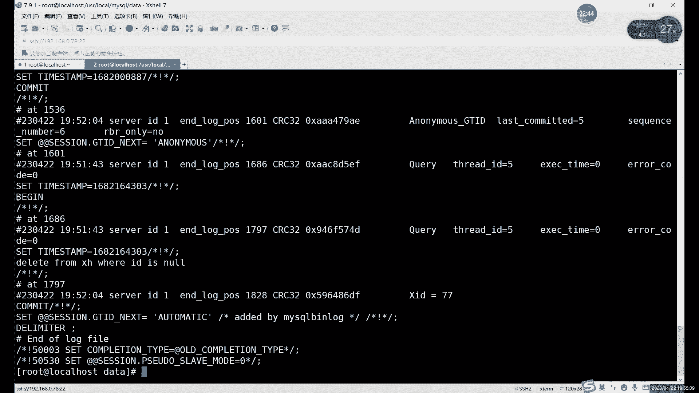
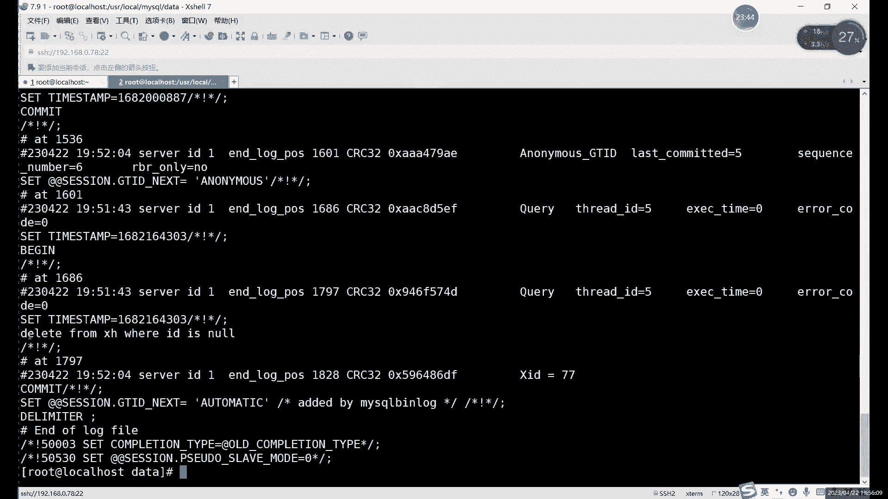
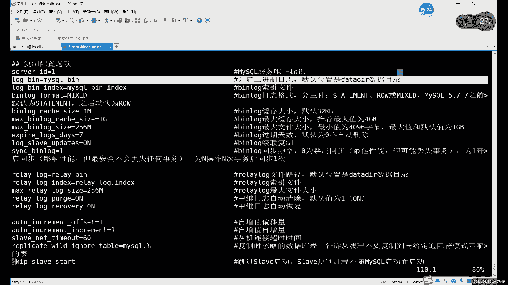
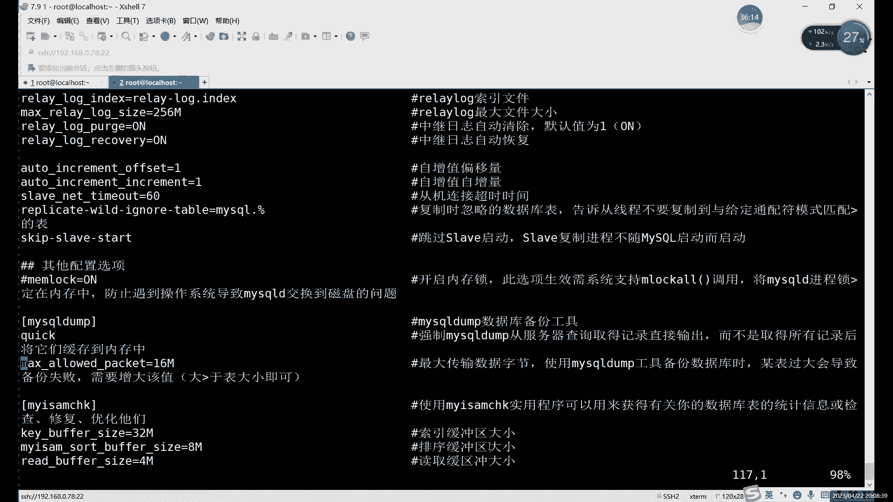
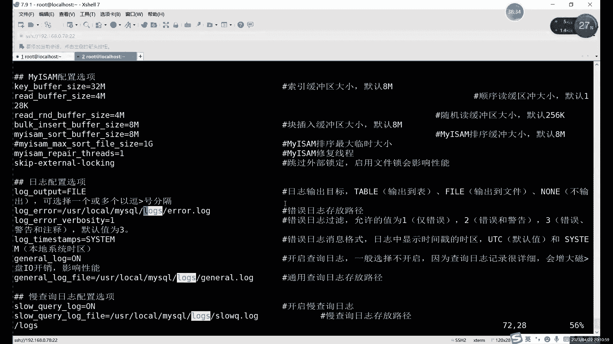
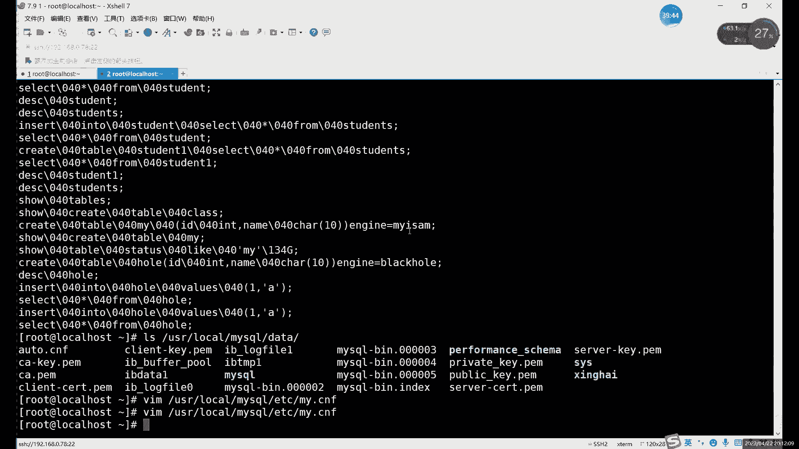
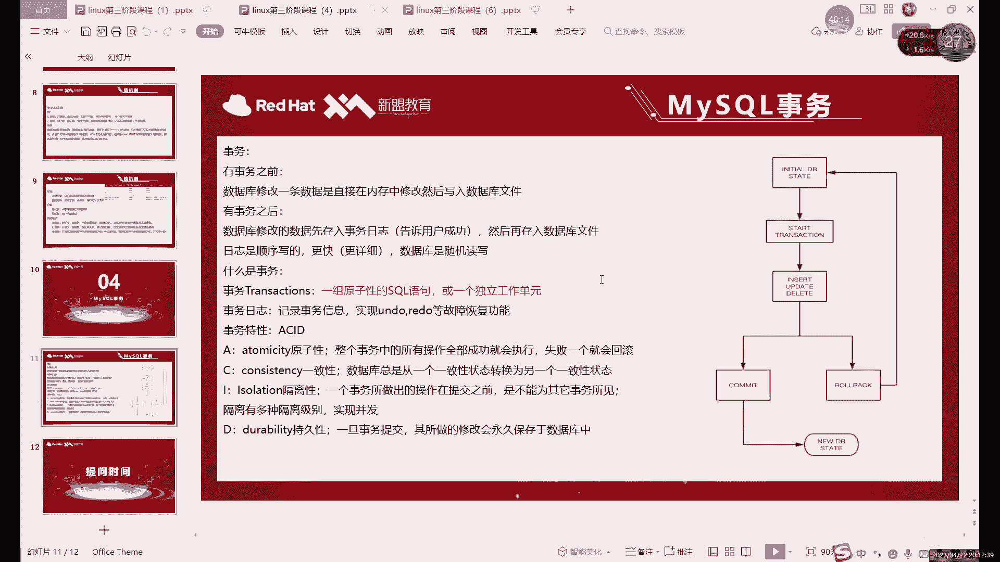

# 零基础入门Linux，红帽认证全套教程！Linux运维工程师的升职加薪宝典！RHCSA+RHCE+中级运维+云计算课程大合集！ - P77：中级运维-16.事务，锁，备份 - 广厦千万- - BV1ns4y1r7A2

好，我们今天的话继续讲my circlecle的内容啊，今天这个内容的话啊也是我们circle语句里的最后一种。之前的话，我们其实在第一节课里边就介绍过，对吧？介绍过circle语句。

有哪几种大家还记得吗？😡，啊，大家可以回想一下我们讲过的几种思路语句，还有前三种是哪些？那大家可以把这个前三种的语句直接打在我们讨论器里边。啊，我们今天讲的是第四种啊。

大家先回顾一下第三种啊前三种不要忘了啊啊，不要说学完第四种，前三种全忘了，这肯定不好，对吧？啊，前三种的话包括什么呢？啊，数据定语言哎，数据操作语言和数据。第三个应该叫权限啊，权限的一个控制。啊。

控制权限的已经。啊，其实。简单来说，其实就几个命理，对吧？我们的数据定义语言的话，包括什么呢？啊，就是管理表格的管理数据库的。创建修改和删除。数据操作语言的话是我们的。有4个。增删改查针对于数据的啊。

就针对我们表格当中的数据增山改查。那我们的第三种就是我们的权限啊，权限这边的话就两个秘密啊就两个秘密。其实。真正来说的话，授予权限其实只有一个命，啊，就是brarack命令，对吧？啊？另一个命令是什么？

另一个命令是取消权限啊，取消权限这是我们的第三种数据控制语言。那今天的话我们把最后一种说了啊，就是我们的事物控制语言。😊，第四种的话就是它要控制的不是数据啊。啊，它控制的是什么？它控制的是有恒的事物。

那今天所说的这个事物它到底是什么？就为什么要控制它呢？对吧？啊，我们先来首先来看一下。😡，啊，事物的一个定义啊，我们首先先了解一下事物是个什么东西。在我们正常啊，大家可以先回想一下。

我们之前执行circlecircle语句，对吧？就执行前三种的时候，对吧？就是执行之后按个封号，就敲完命令之后呢，按个封号再个回车啊，就自动执行了，对吧？啊，就这么执行了。其实我们之前都没有用过事物啊。

之前其实我们的所用的命令里面其实是没有提到过事物这个东西的啊，没有提到过事物这个东西。😊，那15它的作用是什么呢？😡，啊，其实呢在之前我们在修改数据的时候啊，或者说是创建表格的时候也好啊。

修改数据也好呀，其实都是什么？就是在修改数据的时候呢，是直接在内存当中。😊，啊，修改之后呢，就直接写入到数据库文件里了。先是放在内存里面修改，对吧？修改完了之后呢，直接就写入到数据库文件了。

这个是我们之前所做的一些circle语句的一个操作。那这个失5它有什么作用呢？😡，有了事物之后，我们修改的数据呢，哎它先会存入什么？先会存入数据事物治理啊，存入事物治理。然后呢，再存入数据库文件。啊。

再从入数据库文件。啊，数字更快更详细。啊，然后呢这里还有一个很重要的，就是有的事物呢。啊，如果说。和之前有什么不同呢？其实就是么就是一个。控制我的命令，我们事物这里控制的对吧？

事物控制的主要是哪几个命令呢？就是我们的。增删改。啊，增删改主要控制是这三个命，就insert update和 delete。这三个命令因为会对我们的数据啊，就是会有具体来说就是对我们的表格，对吧？

我们这三个数据都可以修改表格里面的一些数据，对吧？啊，就这三个命令的话。有了事物之后。就是我们在修改就执行执行了这三个命令之后呢啊我们如果它是可以看到一个结果。哎，就是如果说这个事务执行的时候。

就是执行了一半。啊，我们是可以看到这个结果的。如果说结果是正确正确的，正常的啊，我们就可以什么可以提交这个事物，然后呢，正再写入到呃就是我们的数据库文件里边。啊，如果说哎中间出现一点问题。

比如说哪个改错了，或者说是哎插入多了。😡，那怎么办呢？那最方便的方方法呢最方便的方式就是什么？回滚。😡，啊，回滚类似于快照了啊，就类似于我们虚拟机里面的快照，可以直接回滚。回滚之后呢。

就恢复到了什么恢复到我们插入数据啊，或者修改数据之前的一些状态。😊，哎，这个就是什么这个就是事物的一个作用，它就很像什么呢？啊？你如果说不看这个名字不太好理解，你就可以理解成什么呢？

可以简单的理解成我们虚拟机里面那个快照。😡，就比较像我们虚拟机的快照。就比如说呢我们现在执行一条命令，对吧？比如说执行一个insert命令吧啊，就执行insert命令。在没有输入之前的话。

我们一执行对吧？它只直接插入到表格里，这个没毛病，对吧？我们之前一直都是这样的insert的，只要你语法正常正确啊，数据类型正确，约束没问题，你就可以正常直接插入了，对吧？那如果说有了事物之后呢。

我们这个insert的命令呢执行之后。😡，啊，我们是可以在什么可以用s名去查看出来的。但是这个时候呢，它还并没有真正写入到我们数据文件里。😡，啊，并没有真正写入到数据库当中。哎。

只有我们手动的把这一个事物提交了之后。啊，就是确认啊，我们这个。就是应该说是确认。执行了这一步命令啊正确。没有错误的时候啊，就没有这个问题的时候。😡，才能什么？才才我们再提交才会写入到我们数据文件里。

这个的话其实就是类似于快照。就比如说我们在相当于你是在做实验之前呢，提前拍了个快照，对吧？哎，拍了快照，你做的时候做实验的时候啊，如果说正常的话，那就无所谓了，对吧？那就一直往下做，没有报错的话。

可以一直往下做。😊，哎，做完之后的话，哎，我们就相当于是正常之后呢，可以再拍一个快照，对吧？可以再拍一个快照。如果说呢哎如果说你做了一半哎，出现错误了，怎么排都排不出来怎么办呢？啊，最好的方法就是什么？

就是回滚到提前我们拍好的快照里边。😊，这样的话我们就相当于直接回到原始的状态了啊，原回到原始状态之后呢，就可以重新开始做啊，重新开始做。就对于我们的数据呢没有任何影响啊，这对于我们虚拟机也没有任何影响。

对吧？这就是快照嘛，对我们这个事务其实也是一样的啊，就类似于我们在执行一个哎，就这这应该要执行我们的增删改查的命令之前，我们提前先拍一个快照。😊，当然查的话是不会影响到我们数据的。

所以说我们这里就没写select，对吧？就是只写了增删改这三个对吧？在执行这三个数据之前呢。哎，如果说出现了一些问题。啊，就是执行在不是不是之前吧，就是拍好快照之后就开始执行这三个命令了，对吧？

这个图片的话其实就是我们事务执行一个过程啊，我就拿这个图片来给大理解，更再说一下啊。首先的话是我们的一个哎默认的状态啊，就在我们执行命令之前的状态，我们可以是类似于先拍一个快照。😊，啊。

如果开启事务的话，当然前提是开启事务，没有事务的话，就所有执行的命令就都啊都一样啊，就执行之后呢立刻生效。有开启事务之后呢。我们首先呢啊在执行链接之前呢，相当于就有一个快照了。啊，有一快照。

然后呢去执行什么呢？去执行增删改这三个里面的任意一个都可以啊，执行两个三个都行啊，就在一个事务里边啊，你可以执行很多个很多个命令。统一执行好之后呢，你去可以去看结果。如果结果正常，哎，符合你的预期。

那就直接用直接提交啊，就comit命令就是提交的意思。啊，com命提交。如果说里边啊有一个和你想的不太一样啊，或者说插入数据插错了。可以怎么样可以怎么样呢？

当然你也可以怎么可以用再用一些delete update update update去更改啊。但如果说修改命令比较多，不太好改的情况下，你可以直接回滚那个ro back就回滚的意思。

相当于直接什么直接回滚快照了。😊，相当于直接回滚拍照。啊正常提交就提交之后呢啊你可以理解成什么。提交之后，我们做完这一个事务之后呢，相当于又拍了一个新的快照。😡，啊，又拍了个新快照。啊。

之前快照就可以了嘛，之前快照就相当于删掉了啊，这些快照就删掉了。如果说执行失败了，那我们就肯定不能删快照的吧，我们先回滚快照，然后再继续执行。哎，就是那么两种情况，就是提交或回滚啊，留在事务这边。😡。

然后呢，事物这里的话。它呢其实是什么呢？它其实是将一组circle语句呢啊绑定在一块儿的。😡，啊，相当于把一组 circle口语句绑定在一块儿。这里的 circle口语句我们主要主要的对象是什呢？

主要对象是第二种啊，数据操作语言。😡，啊，主要主要针对于他们。因为上面这个是跟呃就是定义表格的啊，定义表格结构的，下面这个呢是管理权限的，跟数据都没有什么太大关系。跟数据有关系的，其实是我们第二种语言。

对吧？就是数据操作语言就增删改。啊，查到也不会影响到这个数据。所以说呢我们这个第四种语言呢，它实际上的控制对象是谁呢？控制对象就是第二种数据操作语言。啊，更具体一点就是曾丹改他们三个。

这里的话其实就相当于事物管理他们的话，其实就相当于把一组的。这里的话当然也可以是一个语句，也可以是两个3个啊，这里这个是不限数两个啊。

就比如说你开始开始执行一个事故之后呢啊期间只要你没有提交或者说没有回滚，那么中间执行的所有语句呢，都相当于是绑定在一起。😊，执行完之后呢啊，你可以用什么，可以用sag去查看结果。正常啊，没问题。

我们就可以提交。如果有问题呢，可以直接回滚啊，回滚是非常方便的。啊，也比较像那种比较像VI编辑器里面那个。按U的撤销对吧？啊，每次打开之后呢，我们它其实也默认会有一个默认会有一个原始的文件，对吧？

你可以。执行错了什么命令之后呢，可以用N按U一直撤销。但这和文档其实也一一个道理啊，就是一个道理。对吧就正常我们修改1个PPT只要你不点保存啊，其实都可以这么都可以撤销啊，不保存权限都可以进行撤销。

相当于这里的我们的这个事务执行完成之后呢，commit话就算是保存一下。哎，保存之后呢，相当于又生成了一个新的状态，新的快照。那回滚呢就相当于撤销呗啊，相当于直接一次性撤销了很多步啊。

就中间你执行多少就全部撤销掉。😊，这个就是什么？这个就是我们的事物。的一个特点啊，社会特点命令呢有哪几个呢？啊，其实我们这里的命令的话，其实主要就是管理我们的数据操作语言。它的命令只有哪几个呢？

就是commit和roback。还有一个开启，这里啊开启这里没有写叫begin啊begin开启。就这三个命令没了啊，事故这边呢其实就三个命令。啊，当然也不是说啊。😡，那一定要注意啊，就是事物的话。

默认是我们这有开的对吧？因为大家之前其实执行执行各种命令，其实都没有体会到这个没有体会到，没有用过这种这种方法。啊，这边它默认是没有开启的啊，事物默认是没有开启的。然后呢。事物的特征的话。😡。

其实就像一个快照而一样啊，事物的特征其实你就可以成一快照。啊，就是事务中的所有的操作执行成功之后呢啊就可以执行。啊，失败呢就可以回滚，回滚相当于什么？就是恢复拍照。啊，会快到。然后呢，一致性的话。

这个就是什么？就是。2块照。两个状态，只要你不提交或者不回滚啊，他们相当于是一直在进行一个一直在执行我们的slaag，就是circle语句，对吧？提交之后呢，就进入了一个新的状态。

新的快照回滚呢就回到了刚才原始的快照里面。😊，啊，这个的话就是我们这个事物的一个特点啊，事物呢还有一个就是事物提交的时候呢啊才会写入到我们数据库当中。你不提交，它其实只是暂时呢暂时存在我们的日志里边。

它不会直接它还不会写入到数据库里。你回滚的话，它直接就没了吧，对吧？回滚了就没了，提交了才会真正写入到数据库。😡，还有一个的话就是啊这个的话当然是多个事物的情况，就是一个事物呢啊在进行操作的时候呢。

肯定是不会被其他事物所看的啊，这个是个一个隔离性啊，就可以同时执行多个事务啊，可以同时执行多个事务。因为这个事物呢，其实你同时多个执行，即使你操作的是同样的命运呢。😡，啊，当然这里的话就涉及到什么？

涉及到这个后边我们的锁的问题了啊，这个涉及到锁的问题了。我们后边说完事物之后呢，再去介绍锁啊，对去介绍锁。😊，啊，当然一个。一个数据库里边啊，你同时执行多个。啊，在这多个表格里面操作的话。

其实没有什么太大影响啊。如果说如果是两个事物同时操作一个表格的话，那这个就要分情况啊，这就要看情况了啊，这个具体是锁的问题，我们一会儿再说啊。然后呢，其实默认的话，买搜lo这边的话。

它是所有都是自动提交的。啊，其实也不是没有事物，就是默认呢我们是体会不到事物的。因为什么呢？因为它会自动提交，就是每一个命令就是一个事误。😡，就是mys里边默认每一个命令就是一个失误。啊，它会自动提交。

我们怎么才能让我们自己使用啊，这自己啊，自己开自己关对吧？自己开事5关关事5或者回滚呢？因为默认的话，我们是不支持回滚的啊，默认是没办法回滚，因为什么呢？因为全部都是自动提交了。😡，啊，全部都自动提交。

你不能回滚。所以说呢如果说你想用事物呢，怎么办呢？首先啊我们先关闭自动提交这个功能。哎，关闭自动提交的功能。Yeah。啊，首先的话这个事物呢，其实我们在什么时候看过的是在。

其实在上节课我们在日志里面给大家看一下啊，这个不过不着急，我们一会继续啊，一会儿再再再再细看啊，再细看。我们先进到数据库里面，我们先把这个关掉啊，它是什么呢？它是那个。so啊展示我们什么展示。

自动提交就是自动提交什么？提交是commit，对吧？提交是commit，自动提交就是AUTOcomit。啊，AKAOTO肯定。嗯，然后呢这个。设置的话就是set命令啊，设置用set命令。😡。

下面设置的时候就直接SET。加上什么呢？加上这个。看一下提交的话。自动提交是的话就是一，不是就是零啊，是的话，一就是不是就是零，我们直接就放个零嘛啊，直接换零，这就是关闭自动提交的。什么叫自动提交？

其实就是我们之前不是一直在执行一些像slack呀，对吧？slaack当然就无所谓了。我们换一个换首insert。😊，像insert呀，对吧？upate。delete这些命令的时候呢，每执行一次呢。

它会什么自动给我们提交一次，就相当于自动写入到数据库了。就一一写哎，它会自动给你写入到数据库当中，这个就是自动提交的意思。那么关掉它之后呢。啊，关掉它之后呢，它其实就不会什么，它就是我们执行之后。

它是不会写入到数据库的啊，就默认就不会写入数据库了啊，除非我们按什么呢？啊，不除非我们自己手动输入什么，手动输入commit啊，或者说lo back回滚。😡，啊，我们的命令它会生效。

那首先的话我们先来看什么？首先我们先来看这个。Yeah。我们可以看一个，比如说嗯我们先先进入数据库吧啊，先进入数据库。哎，是又。进到数据库里面之后呢，我们看一下tables。

我们随便操作一个表格就可以啊，随便操作一个表格。表格越创建越多哈啊这个C列表格是吧？😊，就是我们。数据库信息的一个表格。你可以操作哎，可以操作一下。这里的话我们执行一个什么呢？执行一个。

比如说insert是吧啊，但是完整一点的话，应该先写什么，先写这个吧，这个我们就完整一点啊完整一点。就是我们的事物的话，其实一共也就三个命令，对吧？你就尊重一下他，先打一下吧啊，先打一下吧。

毕in开始啊开始。开始一个什么？现在就正式开始一个事务了啊，从命天开始的话，就算是一个正式的事务。然后接下来的话，我们执行什么？执行增生改的任务的时候呢。比如说我们执行一个什么呢啊。

我们可以看到我们有个n，对吧？有n这一行不太顺眼，那我们给它删了吧。啊，我们给它删了delete。from表叫什么XH对吧？表叫SHwhere。嗯，快啲。I not。对吧我们就删掉了。

然后我们可以看一下sck信号 from SH。啊，他就没了，对吧？他就没了。但是呢啊系。如果说我再执行一个叫。ROLLBACKroll back哎，这就命令这个命令就是回滚的意思啊，我们这是一个回滚。

那他又回来了。哎，这个就是事物。就是我们只实际上呢，虽然说大家可以刚才可以看到我们删了之后呢，它没了，对吧？为什么没呢啊，为什么没了呢？就是因为它暂时是什么？它其实暂时呢它也并没有真正从数据库里面删掉。

而是什么呢？而是它只是暂时的写入到了我们事物的日志里边啊，就写入到日志里了。😡，这种低域的命令这个已经写到日志了，但是呢。没有真正的去没有真正的去执行数据库当中的东西啊，没有真正去改数据库。

你就可以理解成什么？我们先是默认先改内存里面的东西了，相当于把我们修改的东西呢放入到内存嘛。😡，然后呢，哎如果说你觉得哎你改的不对啊，如删错了，那你直接什么直接ro back。😡。

啊repect就是回滚的意思。回滚或者说是commit提交这两个命令执行之后呢，就算是什么？就算是一个事务的一个完成了。就这两个命令只要一使用，哎，这就就有就相当于是一个事务已经完成啊。

你像一一个事务已经完成。现在的话就是我们数据库是正常的状态啊，正常的状态，对已经正常的一个状态。就相当于是我们回滚到了什么，回滚到了我们删除之前的那个快照。😡，哎，类似这样。如果说像我们再执行一次啊。

我们执行这个依然还是用什么呢？S删除，对吧？这次我们再删一次，这次删了之后呢，我们其实也不用看了，我们先执行什么呢？commit命令。就是提交。提交我们的这个。事务删掉之后呢，现在他其实还没有真正执行。

😡，啊，只要我们这个没有执行的话，他这个数据其实还是在的。除非怎么呢？除非我们执行comit的提交。提交之后呢，我们可以来看一下。对吧他这个数据就没有了。哎，相当于被我们删掉了。那这个时候呢，它相当于。

啊，当然现在还没有真正又开启事故啊，现在的话相当于是啊你做完一个实验了啊，属于是一个新的状态了。如果说想要再开启事故的话，相当于再给这个这个状态呢再拍一个块照，然后再开始去执行。😊，啊。

这个这个其实事物和快照真的其实确实是其实相似度还是很高的啊，大部分大部分情况下其实都是都是一样的。啊，这个就就是我们的事务。然后事物的话，其实我们昨天在哪呢？不是昨上节课，上节课我们在这个。

日志里其实也看过，对吧？我在这里再连个终端，我们不退出数据库啊。

在连终端，我们来看一下我们的日志。啊，后边的话我们就后边的主要内容的话，我们都会针对于什么？都会围绕我们的日志展开啊，接下来我们都是。包括本节课的下节课，下下节课，下下下节课对每节课我们都会用到日志啊。

日志里已经跑不了了啊，但日志不是我们安装数据库的时候，看密码，那个日志啊不一样。那个日志是我们什么？日那个日志是我们服务的一个日志，里边会存放一些报错信息什么的啊，报错信息什么的。

我们这今天看这个日志的话，它叫什么？它就是存放我们数据的日志啊。嗯，们可以来看一下。嗯。CD我们切换一下目录吧，先。啊，这个日志呢我们是用来。存放我们的数据。它的名字叫什么？它名字叫二进制日制。

为什么要二进制呢？😡，🎼因为你经常ca着他的时候，对吧？不知道还记不记得我上节课看日志那个命令。零0零零零。大家可以回想一下，我上节课看日志的命令是什么。啊，用cat行不行呢啊，或者用lets行不行呢？

或者说more tail这些可不可以呢？其实哎怎么说呢？看是能看，但是呢。刚才也说了，它是一个二进制日志，所以说它这里会乱码啊它这也会乱码。我们正常看买这个离日是方末日志的话有。

我这边乱码的命密已经显示不出来了啊，我们换什么呢？我们直接换mys就看就行了。啊，tell tell没用啊，tell tell和 cat的是一个道理啊，t和 cat是一个道理。默认那几个查看命令。

我们之前讲过的查看命令，就是在第一阶段讲的那几个查看命令其实都没用。啊，就都不能用了，只能用什么值，就是用myscle bin。啊，就专门用来查看我们这个。我们买sq里面的二进日志的一个命令。

然后我们可以看到啊，这个就是这个正常了，对吧？这都是我们先命令。然后我们可以看到哪呢？我们可以看到我们的b电和coming，大家看到没有？😊。

Be竟咩。在日志里的话，它也是有一个什么有一个完整的事物的。包括之前啊，其实之前我们看一下之前有没有命令啊，嗯黑洞对吧？这个是黑洞，大家还记得对吧？上节课的讲过的黑洞。

你那黑洞这里我们执行的时候也有什么呢？也有begin和commit。

那之前其实我们没有，就是说也不是说没有启用事物吧，就是之前用的什么，就是自动提交的事物。😡，自动提交事误，它有什么问题呢？😡，啊，它有一样的特点，就是自动提交事物呢。我们在每执行一次命令之后呢。

它都会自动提掉一个令。也就是不需要我们去执行，就是每一条命令都是一个事误。啊，这样当然其实。这样的话是我没有什么意义了。因为每一次执行的话就自动执行它就自动执行commit了。

啊，这是之前对吧？我们刚才关掉这个。自种提交之后呢，我们执行的是哪个命令呢？命面去哪了啊，delete这里对吧？

我们最定的是delete这个命令。啊，这里的这个命令的话，嗯，比如说我们可以看一下begin开始对吧？也是一样的。我这个begin的话就是我们当时也是自己执行的一个begin命令，对吧？

那其实呢begin命令的话。可以不打出来啊可以不打出来啊，我刚才打出来只是为了啊为了标记一下这是什么？这是我们命令就是我们这个。事物的一个开始。其实这个d命令可以不打。

就是我们在命令行里面可以是不敲这个命令的啊，可以不用敲这个命令。哎，我们这里的话就是din开始之后呢，是改了一下我们的这个删除了一个数据，对吧？删除了空值。然后呢，我们自动又自己又提交了comit。啊。

这个的话就是当然这个是我们的二进制日志，它这里只会记录我们修改过的内容啊，如果说回滚了呢啊它这个日志就不会记录了。😡，啊，他这日志就不会记录了。啊，这个日子的话你就可以理解什么？

就可以理解成我们买scle里边的一个。第上一记录买测个数据的一个日志。啊，只有真正修改了我们的数据呢，它才会记录到这里。那像这里我们根本就没有看到roback，对吧？

为什么没有看到ro back可能回滚呢？是因为回滚之后，它就相当于是回到了上一个状态啊，对吧？回到上一个状态的话，相当于就没改了，没有去修改我们的真正的数据库里边的内容。😡，啊。

所以说呢啊这里的话就是没有roback，就只有什么，只有begin和 commit啊，也就是这个日志里边它写的就只有。😡，啊，只有我们事务里面的两个命令rebu。因为你回滚之后的话，它就相当于是。

没改数据库啊，因为你相当于恢复快照了，对吧？恢复快照的话，相当于你数据就没有变化，没有变化就会不会记录到我们的这个二进制日制里。这个二进制日志的话，它的作用其实就是什么？

就是记录我们mysqcle数据库里面的这个什么数据的一个变动。😡，当然包括什么？包括这个创建表格啊，创建表格它的命令也会记录啊，包括这些创建表格啊。对插入数据啊，修改数据，删除数据。

当然呢这里不包括什么，不包括查找，因为什么？因为查找命令的话，select它不会对我们的数据库。😡，造成什么影响啊啊，他最多就是查找。😡，查找的时候。来，用一下我们这个。用一下我们数据库里面索引对吧？

其实其他的它不会对我们数据边发生任何改变。啊嗯。呃，这个其实就是比较类似于快照，对吧？就是你你让你拍快照，你不好好拍快照，对吧？😡，你装好系统之后拍拍照挺好，对吧？你装好满色之后，你也拍一个位。

对吧拍一块照肯定不会吃亏啊，拍一块照肯定不会吃亏。影视提交的话影视提交的话是可以回滚的啊，影视提交是可以回滚的。那如果说我们执行了什么？执行了我们这个commit命令的话。啊。

你像我刚才不是直接执行了吗啊。😡，如果说像我刚才用的这个显示的commit命令的话，那影视提交就那那就相当于影视提交就不生效了啊，那就必须要用什么，必须要用这个rback命令经回滚了。如果说是。

影视提交之后，它会发生发如果发生了错误或者说异常的话，它会什么？它会自动回滚事物？😡，啊，还会自动回滚失误的。也是说什么？其实你如果说像我们刚才。

我们刚才不是设置了一个set那个什么set呃AUTO commitit这个东西，对吧？你设置了这个东西之后，哎呦。设置这个东西之后。如果你是自动提交的话，对吧？如果自动提交，其实。如果有报错啊。

它相当于是自动回滚了啊，如果没有报错的话，相当于什么？没没有报错的话，就自动相当于进入下一个状态了。😡，那如果说我们是把这个关掉之后呢，我们自己手动去弄的话。主动去弄的话就是。

如呃这个叫commit ro，就完全是你自己控制了。你想让它回滚就回滚，想让它提交就提交啊，也都可以。没有报错也可以回滚啊没有报错也可以回滚。😡，当然你如果是这种自动提交的方式的话，嗯。

那你没有报错的话。因为它是已经提交过了啊，自动提交率已经提交了。如果说像我们这样begin哎，是哪。BEGN像我们这样开启一个事务啊，执行成功了也可以用roback回滚的。刚才我们不其实就是嘛。

刚才我们那个DB成名不就是执行成功了嘛，但是也可以回滚的。啊，这个只要其实你如果要用事物的话，你把那自动提交关掉之后。是否回滚啊，是否提交就是完全是你自你做主了。就是你哪怕你执行十条命令。

你不提交行节呢，也可以，可以可以再滚滚回回滚去吗？啊，回滚的话就变成什么又变成这个恢复恢复一下之前的快照了。😡，对，用事物的话确实更安全一点啊。用事物的话，毕竟是有一个保险嘛，就不管说你删。

尤其是删数据的时候，对吧？尤其你删数据的时候，你开个事5，其实就你随便删对吧？想怎么删怎么删啊，毕竟有回滚这个保障嘛，有时候相当于有个快照了。啊。只要你把这个自动取消一旦关掉。其实你干什么，其实就。

一关掉这个自动自动提交呢，其实你相当于你就是已经有了一个比较哎比较安全的一个快照了。哎，有了快照之后呢，你后边再做什么操作，就就很安全。嗯，安全。嗯，然后的话这里哎，这个是。啊，这个我们是在目录里面。

对吧？在目录里边。嗯，看一下。我们正常的历史命令叫点pa0杠history，对吧？我们mycircle的历历史命令叫点儿my circle点呃点my circle杠 historyistory。啊。

对白是杠回词。哎，但是怎么说呢嗯。再个信号from。后。同样的特点和那个也一样啊，特点和那个也一样。嗯，就是就退出之后呢，它才会记录这个命令。这个这个命令还是我们上节课的命令。啊，只有你退出终端之后呢。

他才会写入到我们这个文件里边。这个和我们那个黑就是系统命令里面黑其实是一样的。啊，和系统里面的黑色其实是一样的。就是你退出之后呢，它都会写入。就是刚才其实我们执行的一些命令，他都没有记录啊。

都是没有记录的，也正常。😡，啊。然，这个的话就是我们那个事物啊，这边就是事物。啊，不管说你执行错了，执行对了，这些都都是什么，都是可以回滚的。啊。嗯，比如说这里的话，其实我们这个事物呢。

其实你执行错了的话，其实它就是怎么说呢？其实执行错了，根本就不会生效。😡，就这个东西。能回滚呢，其实也就是你执行正确之后呢。再去回滚才有用嘛，对吧？你如果执行错了的话，他其实怎么他会报错嘛？报错之后。

其实这个命令就没有生效啊，它这个命令没有生效啊，所以说并不是说报错之后。😡，因为报一般你命令报错之后，它你不会对这个数据库本身造成任何变化啊，因为你的这个命令呢不符合语法，不能改任何东西。

也不能添加任何东西。对吧所以说报错其实这个事物这里我们处理的其实不是报错啊，报错它根本就执行不出来呀，对吧？你这个冒错命题根本就执行不出来。😡，所以我们这里指的错误一般是什么？不是说命令的错误。

而是我们操作上的一些失误。啊，操整的一也是15。嗯，像我们这个。你看啊像我们刚才那个日志，对，这个是历史命令，这个是历史命令。像我们刚才日志是在哪儿呢？我们是数据呃，就是它其实相当于数据嘛。

所以是说是在这个在哪儿也不一定。你像如果是什么呢？如果是。样安装或RPM安装的话，我们这日志一般放在哪儿？一般放在VR下的。🎼lib下边的my circlecle里边啊，一般要放在这个目录。

如果你是原码安装的话，这个就想放哪都可以啊。我们按照我这种方法的话，是在这个目录下，就是在数据目录里边，我们放的日志文件。啊。啊，这个的话就是当然这个也不是说默认就有这个其实是什么？

需要在日志文件里去开启，不是日志就配置文件里开启的哪个配置文件呢？就是ETCR的。user下lo下载mysrcle。啊，这个其实是什么呢？就是默认如果你用样M安装或RPM安装的话，它默认是没有日志的啊。

它默认没有这个日志。需要什么？需要我们自己去开启。啊。嗯，就比如说我们可以看一下这个。

你找一下复制啊复制。啊，就是这个。远程工具会不会有历史命令记入历史命令的？我印象里应该是没有。嗯。应该是没有这个记录历史命运的一个。啊，但是对于数据库操作的这个命令的话，其实我们数据库日志都会记录的。

只是不管你在哪个终端写，我们日志里面都有哎，就是不管你是哪个写的话。😡，不是这卖点CF不不就是。网盘里都有呀。😡，啊，网盘你都有。然后这里的这个的话，我看一下哪些个啊，复制的配置选项。

我们这个二进制制的话是在复制配置选项这里啊。这个话为什么写了复制呢？这个因为是我们后边的关于主动复制的问题。然后呢，开启日志的话就是用这个开启就行了。绕杠宾等于后面这是日志名字，这个日志名字可以自己改。

哪怕你写中文都可以啊。这个日志名字你写中文都行。啊，这个名字随便改的。这就开启二进制制的一个命令。啊，开启之后的话，我们就可以了，它就会每次执行命令啊。只要你一旦执行命令呢。

就会在我们的在我们的data目录下呢生成这种。

他是从这个。这前面是你定义的名字啊，后边是编号啊。我们这个记录就是。修改数据库的些命令啊。主要就是修改数据的对吧？你从创建数据库也好啊，创建表格也好。修改这个什么修改这个插入数据也好，修改数据也好。

其实都会记录。那他唯一不会记录的是什么？唯一不会记录就是slack语句啊，slaack语句是可以不用记录的啊，不记录的。

然后呢，我们可以给这个。这里的话看一下复制配置选项。

你哪去了？嗯。这个是开启啊这个是开启。然后后边的话一些。这个是包括索引文件，后边是一些缓存大小。主要的话其实就是主要是上面这个。啊，说开启这个其实就可以了，其他的不用修改什么内容。

其他的不用修改什么内容。然后的话这里看这个路径的话在。还问你在哪指定？🎼啊，录径在这儿。啊，Data data。数据目录啊数据目录。然后其他的话就是我们主目录的话是mysqcle。

就是myciqcle这个嘛，对吧？然后mysqcle下边的话，包括这个数据目录，对吧？临时目录还有什么？还有日志目录，还有这个配置文件的目录。我们一共是创建了这么4个目录，对吧？对，就是这四个目录。嗯。

然后的话它默认的存放位置在哪？默认存放位置就是这个数据目录啊，就是我们的这个二进制的文件的话，它默认存放就是这个。把数据目录在一起。啊，就跟着数据目录一起走。如果改了数据目录的话，这也就跟着一起改了啊。

跟着一起改了。但他其实呢你说他是日志吧。😡，它也不完全设个日，它其实全名叫二进制制啊，它和我们之前那个日志还不太一样，对吧？那我们之前那最开始看那个日志是在哪？让我看一下。

嗯，搜一下吧，看下lo。然，在这儿。你看这个是。这个这个是我们之前那个什么错误日志，对吧？错误日志的存放路径啊，错误日志的存放路径。😡。

嗯，然后这里的话你想改的话，可以改这个位改这个位置啊。就是如果说这样改这个的话，这个是相当于是。嗯，他这个是什么呢？你可以改前面，你就是把如果说想改路径的话。

可以在这里改默认是默认是data这个数据目录。然后这个是相当于是当前目录啊，这个的话相当于写了一个相对路径。如果说想改的话，在前面加上什么，加上ET加上其他目录的名字就行了。你在这里改。啊。

可以单独存放的话，就改这个就行。就这里的话直接写绝对路径啊，相对路径的话，它就是data这个目录啊，这是相对路径。绝对路径的话，那就是你自己写就行。为什么分开放就全放一块多好呀，全放一块儿好找呀，对吧？

你分开放了。😡，放放太多了，容易忘了。啊，这里的话其实我们所有买所的东西都放在一个目录里。啊，就一公路里面分了好几个不同的嘛，对吧？

嗯。啊，这个你随便自己改就行啊。嗯，这里的话我们接着来继续啊，继续往下看啊嗯。😊。

事物这里的话，它其实就是就是一个作为一个快照啊回滚的一个作用。啊，有一个快照回滚的作用。对你中间不管说执行insert也好，DDT也up也好，其实都是都一样啊。就是这几个命令其实都是一样的效果。

它就是改数据，只要涉及到改数据的问题。啊，我们这个事物这里的话。就可以控制啊，当然前提的话一定要什么？一定要把这个什么呢？

一定要把拿出来在这个。一定要把自动提交给关掉。如果说你自动提交开着的话，那你那你就自根本做不了事务啊，你得把自动提交线关了。关了之后的话，你再去执行啊，再去执行事务的话，就才能执行事务吧。你要这么说。

才能执行事务，你想要提交也好，回滚也好啊，都可以好吧，就是主要注意这个。自动提交，这个一定要先关啊，关了之后再再说其他的啊，先关这个。啊，这个的话就是。啊，咱们这个事物的一个。咱这边事务的一个信息啊。

当然呢啊这里的话，如果说。嗯，比如说我们现在怎么现在是。正常执行的过程中的话，如果说没有提交的话，它其实也会记录到哪儿呢？它也会记录到我们这个。相当是记录到我们这个暂时它会产生一个什么呢？

等于是暂时记录一下正在执行的个事务。比如说呢我们现在。开一个事物，我们再开一个事物。啊，给你再开一个，对吧？再开一之后的话，我们insert。Iner input。嗯，123是吧。啊，我们再插入一个啊。

我们先不着急提交，也不回稳。啊，现在的话其实我们是正在执行一个事务，对吧？啊，正在执行一个事务的话。正在执行一个事务的话，我们可以用什么？可以用这个寿命令去查看啊，可以用寿命令去查看。啊，还是受命令啊。

当然啊但然这个的话其实正在执行事务的话。嗯，可以看一下怎么呢？可以看一下。嗯。我们在第二回画里面再登录一下吧。我们在第第二个里面再登一下。你看我们现在是在第一个里边，我们是开了个事物，对吧？开了个事物。

然后执行一条命令然后我们在第二个命令第二个终端里面再登录一下啊，再登录一下。哎，切换进去之后呢，我们可以看一下什么呢？看一下，比如说。let新 from。然后我们先看一下这边啊。

这个边应该是改改是改成功了。我们先看一下吧dlect。在 from加上呢加上这个XH。对吧这边加上去了对吧？加了6，加了第六个数据库。看到没有？啊，这个就是事物的一个效果嘛。

你看就是你左边这个在执行事务的时候啊，它其实根本就没有提交到数据库里面。因为什么？因为你再连一个你才突然发现哎，没有对吧？你左边那个有边右边这个为啥没有呢？因为它只是暂时呢。😡。

当暂时写入到暂时的是还没有，它还是在内存里面的啊，还没有真正写入到我们的数据文件里。啊，因为现在你在其他终端你是看不到的。啊，看不到的。啊，就比如说我们可以看一下这个嗯。然。

我们可以在这里看一下slect。啊，或者说用瘦其实也行。啊，受我们看一下这个当前。啊，音楼D b。啊，因为什么？因为我们事物只有是inowDB这个支持啊，你就是换另一种my的话，它不支持。

我们可以看一下这里。今讶比较多。我这信息有点太多了，愁绪呢啊总在这儿。在这我看一下哪一部分呢。在这儿。大家可以看到这里，其实我们是有已经产生了一个什么产生了一个锁。看，我们这里只有个锁的。啊。

这个锁的话其实就是跟我们前面就左边那个就这台不是。第一个终端里边那个执行命令是有关系的啊，我们这里其实能看到什么？看到一个组。然后的话这里面太多了，一般这里没什么太大太多信息，我们就用slide看吧。

select我们看一下这个information。嗯。informementcamer这个数据库啊。INO。嗯。这个表格的话是查看事物的表格啊，这个表是查看事物的表格。我也可以看一下这个事物。

我们是大概对吧？就几分钟前创建的嘛，啊后几分钟前创建的。啊，就正在运行的一个。啊，正在运行的一个事务。对吧就是左边这个事物啊，就是左边这个事物。啊，就这里的话就可以看到什么。

看到我们这个运行事务的一个信息啊，查看正段运行事务的信息。😊，啊，这就是什么？这就是我们的这个。关于事物的一个特点吧，你看像左边这个事务在执行的时候呢啊它你在其他的这个终端去查看的时候啊。

它不会有任何信息。啊。啊，这个就是事物的一个特点吧啊事物一个特点。啊，总体上来说呢嗯。其实有了事故的话，就是更主要是更安全一些。啊，就是保证我们这个数据的安全性啊，因为你数据如果说。啊。

比如说这个当然不是命令错了，指的是如果说你命令肯定是正确的啊，也比是说改错一个数据啊，改错一个数据的话。你如我说直接提交啊，就是如果是选自动提交的话，每次改一改错啊，他就直接提交了。啊。

你如果在检在检查的时候呢啊如果说错了很多，你又不好改，改的时候，万一再改错了，对吧？那这个就很危险了。所以说这个提交不是就回滚那就是非常有用啊，回滚快照的一个作用。😊，啊，就是在你每次修改数据的时候呢。

你可以什么呢啊就可以提前开一个什么开一个这个。这个叫。事物啊提前开一个事务啊，就是防止什么呢？防止你修改，就是改改这个数据的时候出现问题啊。出现问题之后呢。你就不要只要你一旦发现改错了。

你就不要再乱改了，就直接回滚就行了。回滚的话就比较靠谱一点，对吧？至少他那里有个快照，那总比你自己去恢复环境肯定要好一些，对吧？这就。😡，哎，这跟你平时做实验也是一样的。万一如果说有一个有一步你做错了。

你可能忘记了啊，忘记是哪一步有问题了。啊，你再重头来排做。可能越排越乱啊，这也是有可能的啊。所以说呢你平时做练习的时候，其实拍拍照是好习惯好习惯。也是这个事物的话，提前改术语的时候，你提前拍个事物。啊。

今天开个15。好吧，这个就是我们这个事物这边的这个一个作用啊，以及用法用法其实很简单，它就是三个命令，be robot back对吧？三个。开启一个事务之后呢，对吧？开启事务之后，你执行就改换数据了。

两后数据检查没问题啊，直接提交。有问题呢啊有问题如果说。😡，还比较好改，也可以稍微改一改啊，可以稍微改一改。如果说已经改的有点错的太离谱的话，那就直接回滚吧啊直接回滚。想查看这个事物提交的方式的话。

是看一下还是用slashSE。嗯，我这里就roll back吧，我这里先把这个先断着啊，先把这个事物先断了啊，rowback回滚。打后款之后我们就把它清掉了，对吧？查看执行方式，看一下side。啊。

不是自来的型号。查看方式的话。啊，是这个。啊，但然这个是事物的一个隔离级别啊，隔离级别。当然也是什么呢？也是我们事物的一个提交方式啊，也是是我们事物的一个提交方式。啊，你就用这个命令看就行了啊嗯。

那如果要改的话，怎么改呢？😡，啊，你可以用什么？可以用。就是在我们买这个里边这个设置的话。设置其实都是一个命令，就是set命令对吧？就是修改你改密码也是set，对吧？我们改各种设置也些set。

像我们刚才改那个自动提交也是set。啊，哎宋交也是在的。像我们这个的话是目前是看pre。Aable，然后read啊，我们这个是可重复读。啊，就在这种隔离级别下面的话，就是事务开始的时候就不会。

不会读取和修改事务中已经提交的这个数据。然后这个的话我们就是我们这个事物啊啊，就是关于事物的问题。

然后呢。说完事物之后呢，我们紧接着说什么，紧接着说这个锁的问题。啊。因为我们刚才不是在执行这个。命令的时候对吧？我们在执行什么命令，就是执行那个。那像比如说左边我们开了一个什么呢？

如果说你左边开了一个终端，啊，正在修改数据。啊，正在修改数据。如果说右边中端再进来。啊，能不能修改数据呢？😡，啊，有锁的情况下呢，我们怕我们就不能修改数据了。

为什么它其实就是保护什么保护我们这个数据的一个安全性嘛？就因为你有一个在修改。另一个如果进来之后的话，你肯定是不能再改的，对吧？你如果再改数据的话。尤其是什么？尤其是你这个像。开的事物嘛。

当然不开事故其实无所谓啊。不开事故的，如果全是自动提交的话，肯定改修改是有先后的。如果说开的事物。😡，如果开了数误的话，你修改啊，其实就类似于一种，就可以就其实就相当于是同时修改的。只要都没有提交的话。

就是同时在修改数。啊，那谁先提交的话，那谁就。那么所如果说先改了的话，可能啊后边的后边身就不能再改了。因为什么？因为你修改之后的话，它真正提提交到这个数据库里边之后呢，它数据又变了啊。

后面肯定可会肯定会出问题。所以说呢我们在这个在一个终端修改数据的时候呢啊在一个终端修改数据的时候，一般的话我们就会有什么就有这个锁的问题。😊，啊，说的问题。我这里的话其实。

它其实就是用于用保护我们数据的啊保护我们数据的呃，所致的话其实也是基于事物这里才说的啊，基于事物来说，为什么要说基于事物呢？啊，原因很简单，因为你正常。嗯，正常执行一个命令的话，比如说iner也好。

对吧？或者说delete也好。一般我们如果说你自动提交的话，你执行它立马就提交了。啊，这就不会一般就不会出现同时修改这种情况。啊，一般就是用了1误之后的啊用了1误之后。两边终端如果是都在修改的话。

那肯定会肯定会多少会出现一些冲突问题。具体是谁冲突谁呢？那这个就得看情况啊，这个就得看情况。所以说呢为了避免这种冲突的这个情况。啊，为了避免这个冲突的情况的话。啊，我们这里就是mys里面我们都会用什么。

都会用这个锁来保证什么？保证我们这个。注于的一个安全性。啊，首先的话我们这里是。啊，比如说呢我们首先先来看啊啊手在这儿啊在这儿。啊，首先的话一般啊常见的就是有什么读锁和斜锁。啊，读走个写作。

走走斜走的话，它是什么？他其实就是。Yeah。首先的话啊读者它是一个共享组啊，它是一个共享组。共享所的话其实就是在什么呢？就是多个事物啊，可以同时什么？同时读取数。啊，可以同时录取数据。啊。

这个锁的设置的话就是什么？他在设置的时候呢，就是。在这个读锁的话就是sllash语句啊，读锁的话就是slash语句so那个其实也不算它也不算三入语句啊。所以说呢我们这读锁的话一般就是s select。

资料语就这里的话，我们首先是什么呢？嗯。这种锁的话其实还好啊，这种锁其实它也不不能说算完全算锁上，为什么呢？因为什么？因为这个它就是。多个读是可以同时进行的。

就是你这个我们这个锁机制呢啊主要是针对于什么呢？😡，啊，针对于这个写的操作，因为你写的操作的话，如果你先修改，那他后修改的命你的话，肯定多半会报错啊，多半就会报错。所以说一般情况下呢就是。啊。

像读左这边的话，它是共享锁啊共享锁。嗯，总体上来说的话就比较啊这个好像比较正常一点啊，就相当于是。这个锁呢其实你设置之后呢，它也不会说有什么。😡，嗯。不会说有什么太大问题，因为什么呢？因为。😡。

读这个操作呢，它不会对我们数据进行很很大的一个修改啊，不会对我们数据进行到大造成影响。所以说呢我们这个读锁呢，它就是一个共享的数啊，共享数什么意思？就是可以有多个啊多个事物同时来运行。啊。

这在读锁上的话，其实多个事物是可以同时运行的。啊，这个不影响。比如说呢我们这里可以先来看一个例子，对吧？首先的话是读锁啊读锁。

