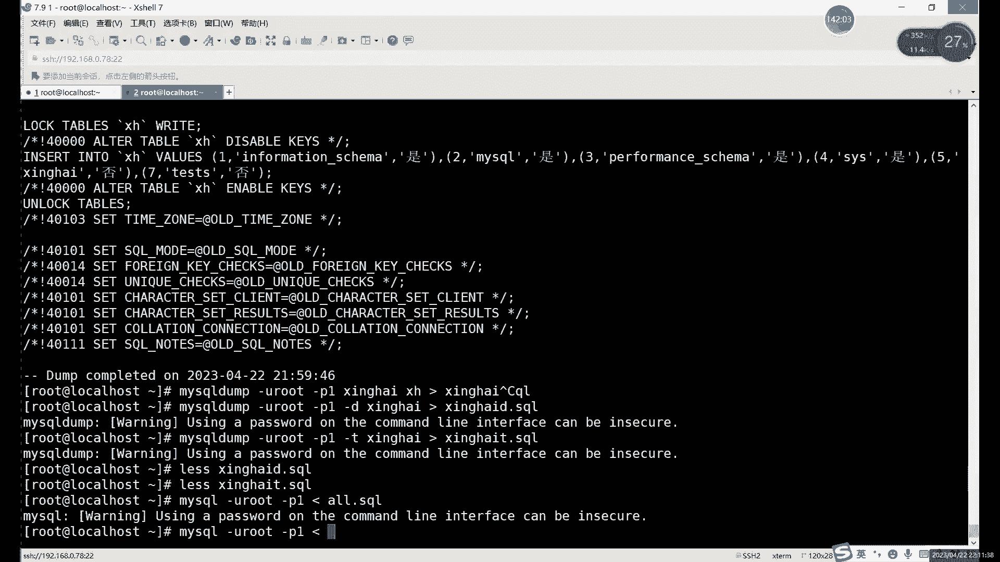

# 零基础入门Linux，红帽认证全套教程！Linux运维工程师的升职加薪宝典！RHCSA+RHCE+中级运维+云计算课程大合集！ - P79：中级运维-18.事务，锁，备份 - 广厦千万- - BV1ns4y1r7A2

啊也这个。好，我们继续往下说啊，就是逻辑备份呢。他其实需要的就是我们的mys dump这个命令。呃，它呢也是我们数据库就mys里面导入导入导出工具，一个比较常用的啊导入导出工具比较常用的一个。啊。

当然主要是导出啊主要是导出。就我们数据导出的一个命令。啊，这个我们之前是跳就是在讲。你有呢说。啊，这两la查询的时候，对吧？查询之前我们把这个跳过了啊。因为这个导出导入呢。

它其实就是类似于什么类似于这个备份和恢复。啊，导入导出其实就类似备忘恢复的这么一个过程。那首先呢备份的话就是导出对吧？导出数据的话，我们买四个d其实就是我们的逻辑备份逻辑备份啊用法的话。

首先第一个导出所有数据库。就是杠大A。啊，刚大A就是最简单的啊就备份所有数据库的一个用法。啊，所有数据库。那这个所有数据库呢。其实我们在导出的时候呢，比如说我们可以看一下啊。他其实导出一个整个的文件啊。

一个大文件。比如说我们可以看看。

He。把这个文件我们先退啊，我们先不要看退不退。也不用退出啊，就是。我们这里是个什么？我们这里是个。我们现在用热备份啊，逻辑备份我们就不退出了，不退出了。啊，我们直接备份。直接备份的话。

就直接用我们的买色故障。啊，买这个字母后边加什么加上杠Uroot。杠屁。加你的密码。啊，在你密码。然后后边呢加上什么，加上杠大A就可以。杠大A指的就是所有数据库啊，它这里代表就是二这个单词嘛。

二这个单词。当然还有一种写法呢就是。全写啊全写怎么写呢？填写的是杠杠2杠dtabase。啊，dta basis这个是全写。给你写全了就这么长对吧？其实没有什么太大必要，就它可以完全用一个一个字母来代替。

就是杠大A，它就代表全部。所以说呢就是杠大杠大A就行了。杠杠澳dabbase databases这个其实很少很少用。因为没什么必要啊，我们就直接用杠大A。啊，告诉他A执行的一个结果。啊。

我们执行之后呢啊我们然后后边加什么呢？后边加上。重定向。重新下把它导入到哪呢？因为什么？因为前面这个呢。😡，其实算什么？其实算是登录到数据库当中，然后呢导出数据。导出到哪儿，具体我们其实还没有指定。

对吧？啊，没有指定怎么办呢？那就是杠后面加上文件名字就行。比如说我就随便写一个吧。这里的话可以写绝对路径，也可以写相对路径啊。你相对路径的话，就相当于你直接备份到这个ro图目录下了。

你想指定某个具体目录的话也可以，对吧？你就后面前面加上绝对路径就行。啊，这个就是什么？这个就是我们的。逻辑备份啊逻辑备份。或者是导出其实都可以啊，这两种这种说法其实是一样的。用买头d命令的导数呢。

其实就是逻辑备份啊就是逻辑备份。好，我们接下来来看什么呢？接下来来看一下这个文件吧，对吧？刚才我说了这个文件里面内容的话，就主要包括什么呢？主要包括的就是。嗯。啊。

主要包括的就是我们的create命令和谁呢？和insert命令。啊，主要是这两个，当然还有其他的。其他的具体是什么呢？我们直接打开看啊，直接打开看。嗯，就比如说我们先来看一下什么呢？先来看一下这个。

这个警告是很常见了，对吧？因为我们把密码打在命令行里面了。你直接隐藏起来就行啊，隐藏起来。如果说就是买scle杠Uroot杠P这样回车的话，就相当于再再他就要再输一次密码。

那这个时候就肯定不会有这个警告了啊，不会有这个警告。嗯。文件啊就在这儿2点circle，我们可以看看它有多大啊。看看他有多大。S杠H啊，直接看一下A。杠L也行。800K。对吧是不是很小？

然后比如说我们再把哪个文件看一下呢？嗯，那个。back up对吧？当时back up这个目录。我甚至可以给白家打个包。我哋大家打波吧。第2杠ZC。大下下边度。啊，这个目录对吧？点儿T2点DZ。啊。

随便打一个哈，随便打个包。这个其实更小一点。啊，这个是一个。啊，这是一个库里面的。这个是整个数据库，这个是整个数据库。总体来说呢，数据库其实备份起来，我们这里数量大家还是很小的啊，数据量还是很小的。

我们其实也就几十个表格而已，对吧？几十个表格。啊，总体上来说呢，其实。魔数量小，所以说看起来不明显。看该不明显。然后这里的话是两个文件，对吧？这这个打包里边那些内容是什么？这个里边它是我们的。

文件每个表里面有俩文件，对吧？这个整体上其实我们整个数据库就是一个文件。把整个数据库放一个文件里面。啊，比如我们可以直接来看一下这个文件吧，这个文件是可以直接ca看的，我们直接换lesss吧。

换less。直接开始看，直接用命令去看的。啊，可以直接看。嗯，然后呢。首先第一个啊它的第一个数据库是什么？第一个数据库就是myscle对吧？myscle。我们就到我们自己创建那个数据库里面看一看。啊。

在这儿。嗯，啊，相当于从这开始，对吧？从这开始，就是我们那个我们自己创建的数据库。我们自己创建数据库的话，我们可以看到啊，就是首先数据库的名字对吧？然后它里边我们记录的命密只有哪些呢？

Greatre base。啊，gre database。第一个命令对吧？great命令。第二个呢，我们还有一个use，就切换到这个数据库里边啊。然，接下来的话是什么呢？接下来就是。

job meaning，然后create me和 insertert meaning。啊，就这三个。你色出去啊，你色在这。为什么这里有个job命令呢？😡，大家可以猜一下，为什么我们这里有do。啊。

到命令之后的话是create和insert质两没问题，对吧？我之前已经说过了，create就是创建一下，创建我们的表结构。然后insert呢是插入我们的数据。你是一个数据嘛啊这个表格音就一个数据。

你看在写数据的时候，注意细节lock先锁，锁完之后呢，再解锁。啊，就是相当于是我们在排入数据的时候，就只是啊允许我们。就是我们本地啊就允允许我们当前自己的这个事务。嗯执行其他的就不允许执行。啊。

咱不允许执行召命令是为什么呢？就是因为我们导出或者说备份的目的是什么呢？啊，就是为了还原嘛，对吧？所以需要的时候要还原，对不对？那需要的时候还原的时候呢。我们肯定在数据库里面，不一定说整个数据库都没了。

就可能就是某一部分数据库误删除了，或者说是就是嗯。丢了几个数据库或者几个文件的一个数据，对吧？大部分的文件都没问题。那你恢复的时候呢。可能如果说不知道具体是哪个数据库出问题了，那你恢复的时候怎么办呢？

啊，你可以这样去把整个文件的恢复了。😡，把这个文件的恢复的过程中的话，如果有数据库的话。创建是肯定会报错的，会冲突的。所以说呢我们就先删掉再创建。这样的话就就避免避免这个报错啊，他肯定不会出现报错。啊。

这个就是为什么也会有这个照明。啊，会有就删除命令。啊，除了这个删除以外的话，就只剩什么，只剩create和inser，没别的了，对吧？啊，所以说呢这个就为什么我们刚才说其实这里面我只存相当只存两个命令。

你是update呀，deelete呀根本不会出现在这个里边。😊，包括那些aler修改也不会，为什么呢？就是你修改之后的话，我们才把你备份出来的。那就一个qui它就可以解决。啊，一个月就可以解决。啊。

这个jo的话就是因为你恢复的时候，如果说它表格是如果说表格是存在的。你这样直接创建，它肯定会报错啊，他直接就报错了。😡，你上边一旦报错的3，我们就没办法执行嘛。所以说呢我们每一个都要先删掉，再创建。

再插入数据。啊，就是为什么先要删除啊，就是为什么先删除原因。其他表格也一样，大家可以看，就每个都是先删除再创建再插入。啊，当然这个没有数据啊，这个没有数据。有几个都很多没有数据啊。

像这个啊唯一性约束这个。都一样啊，先删再创建，再插入。啊。这个就是什么？这就是我们。逻辑备份它备份的文件里面的内容。对吧那那也就是他恢复的时候，其实这个恢复的过程大家肯定也都。能理解了对吧？

恢复其实就很简单嘛，就是删掉创建插入，删掉创建插入，这就是它恢复的一个原理啊，就是先把目录删掉，不是不是先把目录，先把文。对应该说是先把这个。表格删掉，再创建再插入。啊。修改的话，只要你别改坏了啊。

修改就得别改坏了，肯定还是能能用的。😡，啊，你如果说哪改了有问题，哪个格式出问题了，那那肯定就不行。这个文件可不能随便改啊，你你别想别想着改文件啊，这个文件可不能随便改。改了的话，如果只是改数据的话。

那就改了之后，你重新恢复的数据就跟之前就不一样了啊，如果说把结构改的出现了问题，那可能差务的时候就会报错，一报错了，那就直接就中断了啊。我们这个买搜l里边如果同时执行几十条命令的话。

中间有一条报错就不会不会继续执行了。大家注注意这个问题，中间一旦有一条报错就不会继续执行。啊，所以这个不要随便改。啊，这个就是我们这个。逻辑备份啊，当然这个是之前物理备份那个一个数据库啊。

这个是我们的逻辑备份。啊，这是什么？这是一个。整个数据库啊，如果说一个文一想要直销员备份一个数据库怎么办呢？😡，啊，就比如说我们的数据其实只是存放在一个数据库里面的对吧？

系统默认库里面其实没什么太多的重要数据，这主要是系统一些系统设置啊，一些用户权限密码什么的啊，真正的这个业务啊，数据啊，我们一般是放在一个单独数据库里边。这种情况下，我们只要这个单独数据库行成呢。

也可以。就直接加上这个数据库的名称就行了。就比如说怎么备份呢？就是my circlercle。我刚才我们是。对吧码头杠Uroot杠P对吧？杠大A。啊，如果只想要一个数据库。怎么写呢？哎，就是。杠哎。

不不是不是杠，直接加上名字啊。加下数据库的名字。就是某个数据库的名称，就导出某个数据库。啊，直接导入就行。啊，这里一定记得改名字啊，你不改名字。相当于直接给人给之前那个文件覆盖吧。啊。

我们导出导出之后呢，我们可以再看一下。在哪儿呢？名字去哪？啊，在这儿。几 ok对啊。嗯，然后这里的话我们可以看一下。直接还是直接看啊在。啊，或者less这些都都行啊，就是用ca就ca吧。用cat的话。

那就用鼠标滚轮划吧。啊。吧内容是一样的啊，就刚才我们看不也是这个这个数据库嘛啊，内容没问题，对吧？美内容没问题。那这就是什么？这就是导出一个数据库。还有这是什么用法呢？啊，这是一个数据库啊。😡。

你可以是整个库单个数据库或者说是一个表格，对吧？比如说我们想要某个表格怎么导入呢？啊，导出吧，就是怎么备份就是库。之前我们一般不是库点表，对吧？啊，授权也是查看也是。这里比较特殊，因为你加上点之后的话。

它这里。这有点问题，加了点之后，他会以为你是。命呀或者说是其他字符。所以我们这里不能加点，只能是什么空格。有库空格。某个表。没有这个表。那，XA是吧。啊，有这个表啊，相当于只备份了一个业务。哎。

忘记换名字了，忘记换名字的话，那我们ca的时候就。

忘记换名字后果是什么？就是之前备份他没了。啊，这件标证就没了。就只剩下什么？只剩下这一个表格。啊，今天的一到哥。然后你看这里插入数据，其实我们是分好几次插入的对吧？分好几次插入的那其实你最终备份出来。

它就是一条数据，就一个银色就可以解决。😊，啊，可以追加重定项啊可以追加，但你追加的话其实不太好。因为什么？因为一般这里的话我们就是单独的一个表格啊，或者一个库啊，几个库。😊，就全部的库这样去备份。

因为果用追加的话，其实也不太好。我我这里是忘记改名字了，其实这里一般追加其实也不用，对吧？覆盖其实也不用，就是单独一个你备份什么，其其实就是就是什么，就不要尽量不要备份，尽量不要追加或覆盖啊。

而且是忘改名字了。啊。追加也行，追加的话就。啊，如果是说你想备份几个表格的话啊，你可以把这几个备份表格追加到一个文件里也可以啊，可以。但尽量还是分开吧，就尽量还是分开去写啊，分开就写。

你恢复的时候好恢复，对吧？你如果说放在一块的话，恢复恢复起来。可能会有点乱啊，可能会有点乱。

因为你看啊就是每一个它开头都是这一部分。

然后每一个表格之后呢，其实它应该是怎么开始，就是从这里开始。所说追加其实不好，因为追加的话，它这里边这边信息化都会重复啊，信息都会重复。

啊，最好就直接用。就是正常就直接用覆盖这种方法，就是记得改名字啊，刚才始忘记改名字了。之前我备份的已经没了。啊，之前备放那个裤子直接全部给覆盖掉了。啊，这是导出单张表。也可以还有两种导入方式呢。

就是就是更细一点，对吧？你从所有的库到一个库到一个表，还能不能再细呢，可以再细。啊，就是结构或者说是什么呢？结构或者说是这个。数据也能单独导出。哎，结构数据可以单独导出，怎么导呢？S个d杠Uroot。

杠P1，然后呢。加上这个。恢后，然后。加一个杠D。这就是导出结构。名字。啊，尽量名字都要重复，不然话就全部给覆盖掉了，覆盖掉可本来就相当于没备份。啊，这样的话就是他是他是备份整个。这个叫结构。那数据呢？

换一个选项，换成什么？换成杠T。啊，这就是数据，我们回来具体看一下这两个文件啊。嗯 less。嗯。一点对口里边就是什么？里面就是结构。看到没有？就每个就只有create命令。

它其实就相当于把create命令和insert命令分开了。😡，啊，如果只想要把某些结构过滤出来，或者说把某个某个数据，就是把我们一数据部过滤出来的话，就这样去这样去。导出啊，这样去导出。

当地的话就是只要什么，只要结构，就只要create meaning。啊，只要亏的命令。如果是你只想要什么呢？只想要这个数据的话，那就是什么就是这个。杠T一个选项。就只相当于只有什么呢？只有ins色。啊。

大家看到没？就有一字。当然没有的这个没有数据的话，他就没有数据的话，他也嗯这里边也有个啊，他也得写，看他也得写，没有数据也也得写出来。啊，他其实就是把我们的这个正常的一个文件呢分成两部分了。啊。

就比如他其实就是把这一个整个数据库的文件呢分成两部分，一部分呢是结构，一部分是数据啊，这是两个用法。啊。然后这个就是导出对吧？导出或者叫备份。那么还原怎么还原呢？啊，就现在我们是用什么？用的是这个。

逻辑备份对吧？我们现在用的逻辑备份。那逻辑备份之后呢，怎么才能还原？啊，这个问题的话，首先我们先来看。刚才也说了，就是你怎么备份怎么还原，对吧？物理备份呢，你CP过去就CPCP出去就CP回来。😊。

逻辑备份呢，那就什么？那就是。买s个d数据。是不是买特哥带我回来呢？不不是啊，不是这个不是啊。😡，嗯，用的是这个文件，但它命密就不一样了。就mys down，它只是导出的命。他没有导入啊，它有导入功能。

也就它只是备份，那还原怎么办呢？还原的话一般我们会。常用的有两个命令，首先就是mycircle。

啊，首先是买小果。PPT里边有没有写？嗯。

物理逻辑备分好像忘记写在这边。

啊，那我就直接什么，我直接看笔记吧啊，就看笔记。啊，刚才的话是导出啊，说完是导出。导出的命令的话就是一共是这么几个啊，杠A。所有的，然后呢直接加上数据库名字啊，或者当单张表啊，结构什么样。

然后导出结束之后，其实也就是备份嘛啊，备份备份完之后的话，我们接下来说什么就导入。导入的话也就是什么？也就是这个还原了是吧？也就是还原的过程。还原数你的过程的话，其实就是mytld命令不能用。

没用什么用mycircle命令就行。啊，用满4个命令可以直接去还原数据。那这mysqcle令具体怎么用呢？就是mysq杠Uro的大P。和前面的一样啊，也和马克d前面一样。

这里的话就主要还是输入用需要个密码，对吧？因为你没有密码的话，你相当于不能进入到数据库理这些命令。这里的话其实就相当于么相当于是在数据库里面去执行什么的。相当于是在数据库里面执行我们的文件里的那些内容。

对吧？我文件里包括一些什么内容呢？你看像create创建数据库的表命令，对吧？创建表格啊，当然先是删除表格，创建表格插入数据，一共就这四个命令，对吧？四个不同的命令。

它其实就是直接在我们数据库当中执行的。😊，啊，并不是说大家啊也并不是说这个恢复的过程有多么麻烦，就是它其实就是把这个文件里面内容呢复制到它的个命令行里边。从头到尾执行一遍，执行完成之后的话。

其实就已经完成了完成数据恢复了。啊，这就是数据恢复它的一个过程。啊，其实很简单，它没并不是说没没有什么太高深的这个啊，它其实就是复制一下数据。就是把我们整个文件的数据啊从到尾执行一遍啊，这就恢复过去。

然后导入的时候呢。首先第一。啊，导入整个库其实就没什么好注意的，就直接什么呢？直接。用什么用这个买so买杠1root杠P。啊，直接导入就行，对吧？导出的话，我们重进向是大于号，对吧？导入那就小于号呗啊。

导入就小于号。那导入的这个过程的话，其实后面加上文件名字就行。比如说我们这里导一下。

啊，这里直接导入一下。怎么导呢？买克杠Uroot杠P。一然后加上什么呢？小于号就导入嘛。二点Ccle啊，就直接导入了。啊，看它不是立刻执行，它停顿了那么零点几秒，为什么它其实也是需要过程？

我们执行语句它也需要过程。虽然说我们这个文件不大，就几百K，但其实里边的语句已经非常多了。啊，光表格至少都有上百个表格了。啊，每个语句的话就每个表格就至少有两条命令呗啊两条命令。啊，这里的话就是我们。

这里就是我们导入的命令。啊，或者说叫恢复。啊，更准确一点说的话，其实就是什么就是全量的恢复。啊，全量恢复。这种方式呢，为什么说我们嗯。他为什么要用热备份？啊，为什么不能用冷备份呢？

大家可以啊大家可以思考一下，为什么我们逻辑备份的时候，我们一直要要用热备份。啊，物理备分是候我们反正就是用可以用冷的。啊，原因其实很简单。啊，就是什么呢？就是。执行我买s dump也好。

执行买sical也好，你不然不是不知道大家发现没有？就是我们都有这个杠U杠P这一部分，对吧？一就是密码啊，一就是密码，我这个密码比较简单啊，密码比较简单。😡，诶。有这个说明什么？

也说明我们需要进入数据库。啊，就出现了杠U杠P，说明我们是需要进入数据库的。你如果说要能用冷备份。那你怎么进数据库，就我们已经把数据库关掉了，就没法进入了。对吧？没法进入的话，其实我们这里是。😡，啊。

就没办法用这个命令。所以说为什么逻辑备份需要用热备份呢？就是因为冷备份它不好使。它导不出来数据了，对吧？数据库都关了，我们就拿不到数据了。😡，啊，这就是为什么我们逻辑分我们一般是用热备分。啊。

有数据库一定要开的，你不开，数据出不来。那恢复也一样，你数据库不开启的话，我们这个会办法执行买sl杠U杠P的命令，就没办法进入到数据库库当中执行这些数据，对吧？执行这些命令。刚才也说了。

其实恢复的过程呢，其实是把我们日志不是日志，把我们这个文件里的。就是备份文件里的所有的命令执行一次。哎，就这一思的话。肯定要进入数据库才能执行，对吧？所以说我们是需要什么逻辑文论的话，一定要需要这个。

数据库开的啊数据库需要开的。啊，这个的话就是什么？这个是导入。啊，这是导入一个数据库，不是整个数据库导入一个数据库怎么导呢？mysQ杠U。😡，放屁。然后呢啊然后加上什么呢？加上这个。

某个数据库的名字。然后呢，这里需要注意一下就是。导入的时候一定一定要有对应的数据库啊。啊，一定要有对应数据库。有这个数据库的，它才能正常导入啊，它才能这常导入。为什么呢？啊。

因为我们数据库它没有那个没有那个什么。所以这里的话我看啊嗯如果导入。比如我们先删一下。

我刚才备份的是哪个数据库来着？😡，不对，我们备份的库没了，我们再重新备份一次啊，买杠U买个当我们备份一次再删除。刚才那个被覆盖了啊，然后被覆盖掉了，我们得重新备份杠U杠P。文件。你直接覆盖了。啊。

当然这个后缀没有意义啊，大家注意，这后缀没有意义。啊，你不要说看见。点折扣呢只是为了我们方便标识啊，告诉。告诉我们是个什么呢？啊告诉我们这个是。啊，这个是什么呢？这个是这个。是一个数据库文件啊。

它并不是说一定要用这套，一定要用这个格式啊，因为我们并本身没有意义嘛啊本身是没有什么意义的。啊，所以说我们是需要什么呢？我是要看一下这个。嗯。啊，需要看一下这个。一定要注意啊，这是没有意义没有意义。

一切间文件啊一切间文件，而且后缀无异义。然后买这个d杠Uroot杠P1，然后呢加上这个。名字啊。然后直接导入原因。还就是导入。啊，为了更逼真一点呢，我们先把数据库删一下嘛。啊，你给数据库删了吗，要不。

我看一下啊，嗯可以啊，可以删掉。DROB啊DROP删掉数据库啊，db data withDADABSE。啊，这次我们不用RM杠2F啊，那个是三目录的。哎，正规山库应该是这样算。这才是正规三库的命义。

好吧，db database base加上这个。户者名字。对は我得三。完了之后。我恢复啊恢复。买这个杠买这个杠U路的杠P。嗯。为什么报错呢？啊，这是刚才所说的那个，就是我们在导入库的时候呢。需要什么？

需要提前创建一下库的名字。啊，需天上下库的名字。还有这个用用ca不好，用less吧。为什么要提现酷创业库的名字呢？原因很简单。😡，哎，就是什么呢？你看这里。我们导出的这个库，对吧？database。

他们写了这个对吧？那如果说反正可以大问，就是比如说这里问大家一个问题，就是。如果说导入的是表格的话，需不需要提前创建表格呢？啊，那可以思考一下，导入库的时候，我们刚才没有创建库，对吧？

没有对库已经被删了，但导入它报错了。😊，有为什么到错了？因为没有入库。那表格我们在导入的时候需不需要创建呢？啊，这个就。啊，那肯定是不需要的。因为刚才也是已经说了，对吧？照为规定，你创建了。

我也给你删了。所以说呢你这个创不创建其实一样一个道理。为什么库需要创建呢？就是因为大家可以看啊我们这个文件从哪开始，从这开始。你看从这儿到下边，根本就没有如没有create database这个东西。

所以说呢你如果说没有这个库的话。哪儿去了？啊，就是创建这个这个叫什么？创建这个表格的时候。它就属于什么呢？哎，他就属于是no。啊，不是on know。哎，这找不到什么，找不到数据库。😡，啊。

就是类似于你在你进入数据库里边没有切换数据库就开始执行命令啊，就是这么一个状态。所以说呢一定要提前什么呢？提前。😡，创建好视据库啊。我们先创建你。就是my circle，还不是myci。可。

DATABSES。gr database base加上这个。最库的名字，哎，我们重新创建一下，创建好之后呢，哎再来重新的导入。或者说叫恢复吧啊叫回复。就正常了对吧？然后我们再看一看这边环节好了，对吧？

我们stables。啊，又。对吧其实就这个命令。你如果说不不创建数据库的话，那其实就你创建什么东西，它其实就是属于这种这种状态，找不到。😡，哎，找不到。对吧这导入应用全回来了。这个就是什么？

这就是逻辑备份啊，逻辑备份和逻辑。啊，就逻辑变成额恢复吧啊不能说逻辑恢逻辑恢复好别扭啊，有点别扭。😊。

啊，这个就是什么？这就是我们恢复啊恢复这里。然后恢复的话，其第一个首先啊。记得创建库就是导入库的时候，创建库，导入表就无所谓了。因为表我们刚才也说了。啊，他自己会创建啊，就是我们的备份文件里。

他有这个创建步骤，但是这个单个库没有啊，单个库没有。然后我们接下来怎么？接下来是这个实用。另一个命令导入啊，导入命令的话，myscle是一个。还有一种的话，可以在数据库里面去导入，就不一定非要说在哪呢？

啊，不一定非要在这个买。不是不一定要非要在这个。命令行里面去导命令行里面去执行，也可以进入到我们数据库当中。这套数据课当中的话，我们一般用这个s尔斯命令去导入啊s尔命令去导入。

这边的话也需要有一个也有一个操作需要注意的啊，也有个需要注意的。🤧嗯。

你比如首先呢。你再删一次吧。啊，再删一次，就是把这个数据库呢再删掉。我们再模拟一次啊再模拟一次故障letter base啊 filter base。这次删掉之后的话，我们利用什么呢？

我们不在外边用买这个命令去导入啊，我们用在数据库里边，对吧？目前我已经进到里边。嗯。其实呢。type键这补全也不一定不是完全不能用。就能用的非常有限吧，但是在在买to里面。

突然发现st命令是可以补全的哈。😊，然后呢，系统里面几个数据库它也可以补。完就比如说你看又。information那直接补全了。啊，也都也可以补全，就很少，就是能补全面也非常少。你还是别想明，就就。

你们自己打吧。把就是数据库的名字都能补全，就是你use的时候，use这个命令里面，数据库名字都能补全。嗯。啊，都会以补全。然后呢，这个。造成面也能补选。😡，啊，能补全民也很少，就是你不要想了。

大部分你都是不能不能补全的啊。能补宣明令很少，就也没必要去记，不要记这个题，那你没必要啊，没必要。然后呢，我们来看一下这下边的这个sce执行之后呢，然后边加什么呢？啊，后边继续加这个。

🤧哼。目录。啊，账目。

什没意思呢？就是我们在这个数据库里边是可以读取到外部的文件的。啊，我取到外部文件。就比如说呢我们可以看一下这个。啊，不能补全就算了。你本来其实我这里你能补全也就这么两两两三个命令啊，也没必要记啊。

就没必要记啊，不能补全就不能补全嘛。因为大部分命令它确实就不能补。😡，然后呢，我们在里面是可以读取到外部文件，所以说我们可以直接加绝对路径。啊，这叫绝对路径。当然呢，如果说你这样直接写行不行呢？

我比如我们在哪个目录下呢录下的。啊，他这里不能补全啊，求打吧。这个它不是命令行，所以说它肯定不能补全我们的目录，它找不到我的目录在哪呢啊，它是找不到的。😡，啊，所以说呢我们这里是需要什么呢？😡，哎。

我们这里需要我们把这个。打全一点是点circle，对吧？我们店是点circle。然后大家可以看到我们这里出了点什么问题呢？No database select。啊，slect就找不到。😡，就大量的报错。

啊，都是这保持这么多嘛。啊，就基本都找不到。😡，对吧基本都找不到。那怎么办呢？那我们就是只能是什么只能是先。像比如说受DATABSES。受dabversease基本上啊我们数据盘没有，对吧？

我们需要先创建。Qureate table。dtab和DATABSE。创建样本数据库。啊，这里不仅要创建，我们买srcle的命令的话，只要创建就可以了，对吧？啊，如果是什么呢？如果是。

sourceles命令的话，不仅要创建，还有什么，还要进入。😡，啊，要你要先进去进去之后的话，我们再执行什么执行s命令的话，它就可以，对吧？执行source命令它可以。

就相当于直接在我们数据库里面执行create加不对，应该说是jobcre insert，然后joropcre insert这样一个表格是三个命令，一个表格三个命令就这样执行下来。

然后这里加的话是我们绝对路径。😊，啊，家具都入镜哈。😊，嗯，那叫。点时候。啊，就全进来了。啊，这些就只全都OK了，对吧？没问题。😊，我们可以看一下show tables。啊，它就全回来了，对吧？

这个就是什么？这个就是导入或者还原吧，这个就还原这个某个数据库的时候，如果用source命的话，需要注意什么，就需要注意这个。一定要在数据库当中才行啊，这是需要注意的这是第一点啊第一点。

还有一个需要注意的就是导入单个文件时候，导入单入表格的时候吧。导单元表格现在没有啊，我们先先导出一个啊，先导一个出来。比如说呢我们先用还是再用买s个d目先备份啊杠Uroot。杠P1。我们备份一个。

哪一个表格呢？点儿V点SH。啊，备份XH这个表格，然后导出就叫XH吧，第 circle口。啊导出。然入之后的话，我们这里再用安le。s命令去导入啊，你把s命令导入的话，这个其实很简单。

因为它不需要创建表格，也不要管。也不需要管库的事情啊家主要是库存的啊，一定要注意就是。😡，库制的它要存在才行啊，不一定要存在。好吧，就导入的时候库一定要存在，你库没有的话，你没办法导的啊，一定要要。😡。

啊，一定要重新这个。重新导入就行啊，不是不是。重新这个。

就买这个命令的时候呢，这个其实。嗯，怎么说呢？就是那像如果是单个表的话。码头这里倒是没有写。啊，导入表没有影响，导入表的话，只要你保证保证我们的不存在就可以啊，保证不存在就可以。照着这里的话需要什么呢？

需要进入到相应的数据库当中的。

啊，因为什么呢？因为。你就可以完全把我们这个还原的命令就看成你正常打命令。对吧至常你在数据库弹命令啊，无非就是导入啊，不是删除导入。删除创建和导入嘛，对吧？

当然我们自正常执行的就其实就是create加insert。😡，我们恢复的时候就前面就是多了一个照，就是防止重复啊，防止重复，也就防止报错了。所以这里的stores的话也需要进入到我们这个库里边。

当然我们现在是是在的啊，我们现在是在的。😊，比如啊不是2M。赵。😡，table我们删掉XH。啊，上来之后的话，我们再导入。SURC。当然不删行不行呢？不删也可以啊。如果说你是数据库。

就表格里边啊改错了几条数据啊啊，或者说是几条数据比你删除之后呢啊忘记数据具体是什么呢？那这个时候呢就需要什么呢？就需要用这个source。那就可以这样，你可以不删表格的情况下呢，用source去导入啊。

sourcetro下的。这个改个名字叫SH对吧？SH。啊，XS就可以。那然后这来恢付也是一样的。啊后不也是一样嗯。这么多行，为什么这么多行呢？我们这个表格里边。XA数据数据行数不少是吧？数据不少。

我们可以看一下，这次恢复之后呢，我们DICXH对吧？要不还是回还就回来了嘛。SH。啊，就正常。这个就是什么？这个就是我们恢复啊，恢复的话两个两种方法嘛。嗯，就是我们的今验叫。全量备份的。

逻辑备份怎么恢复啊，买srqcle货。sourcece啊，为什么我这里强调全量备份呢？因为什么？因为增量备份是不一样的啊，增量备份是不一样。好，这样辈份的话，今天可能没时间了，我们下周。2对吧？那个2。

啊，我们下周继续啊下周继续这个增量备份。啊，增量备份需要注意什么呢？我先提前给大家介绍一下啊，先介绍一下增量备份，权量备份的话就这么多啊，包括分成备份恢复啊，都用这些命令就可以了啊，就这几个命令。😊。

然后呢，这里需要注意的，我介介绍一下这个关于增量备份的问题，对吧？增量备份的话，我们刚才其实最开始和全量备份差异的在就是讲的时候介绍的时候介绍了这个它的优点就是什么？没有重复数据，备份数据量小。

时间也短，哎，速度也快，就对我们的真正的业务的影响其实非常小，对吧？因为它备份的东西小呀，它只需要备份这个真正的。啊，不是说真正的嘛，就只需要备份这个。嗯。更新的数据吧，可以这么说。

就只需要备份更新的数据啊，他就没必要去备份那些原有的啊，它只备份更新的就可以。它就是文建立在文，就是上一次备份基础上啊，建立在上一次备份基础上呢，去回去进行一个备份术。

但是买s呢当然我们是没有直接的命令啊，就是没有直接的命令做增量备份的。全量备份，我们用买s账目就可以了啊。呃，增量备份呢没有直接的命令。但是呢我所以说我们买sel里面从增量备份怎么做呢？

我们就用二进制日制，对吧？很熟悉，对吧？我们已经很多次提到过它了啊，就是二进制日制。为什么用二进制制呢？而且日志它里面放的是什么？对吧？我们前面已经给大家看过了，它放的是对数据的修改，对吧？创建表格。

哎，对数据的修改。加上什么呢？加上一些像。创建表格对数据的修改，以及我们设置一些系统里边的一些设置啊。这些的话都是都会放在这个二进制志里，也就是什么？也就是除了slash命令以外呢。

其实其他的都会写到这个二进日志里面。不管是是增加还是删除。😡，啊，其实都相当都相当于都可以备份，对吧？啊，我们增量备份的话，它不是说啊如果说有删掉数据怎么办呢？那我们增量备份呢怎么备份呢？😡，啊。

它就是备份一个delete语句啊，它就是备份个删除的语句。啊，这个就是我们买里面资量备份的一种方式，就是通过二进制日制来。啊，从二进制日制来备份，对吧？啊，所以说呢这个其实怎么说呢？嗯，增量备份的话。

总体上来说。备份的话还是很简单，主要是恢复啊，主要是恢复啊，这个的话我们下节课再说。然后你查看表格的话，或查看哪个库的话，做tables不就行。对吧说tables。就是很方便，对吧？啊。

你设tables的，它其实就会你这个表格的话，它相当于给你列出了一个表格嘛，对吧？临时的一个表格tables in。😡，青海对吧？就是在某个库里边啊在某个库里边。啊，或者说什么呢？你不想用这个。

其实也可以用slalect。这个看起来不太正规，对吧？你说tables，我们查看的表格对吧？显示裤子名字感觉是有点奇怪啊，感觉是有点奇怪。啊，也可以用什么，也可以用s database，然后括号。

把你对比一下。对这个简单一些嘛，sotables简单一些。那如果说你表格特别多的话，它可能顶着把你这个名字全给顶级了。所以说呢呃更专业一点的话，就是select加上datab加括号就行。哎。

或者说是看一下啊。Laterterb。啊，这是连是所有数据库，其实查看的话就是slash database就可以了。😊，啊，side database就可以啊，这个就是什么？

这个就是查看什么查看当前所在的数据库。这个命令其实怎么说呢？意也不大，因为什么你想去哪呢？你直接use去就行了呗，对吧？你直接use去就可以。😡，查看的话其实是有点多词语语啊，当然也没问题啊。

查看的话就s database这命啊。昨天的虚拟机软件，你说的是啥虚拟机软件？😡，ESSI吗？啊，那我们今天的内容就这么多啊内容就这么多。啊，下节课的话我们主要就是开始说什么，说增量备份以及增量备份。

说完之后，我们会讲这个主从。子动复制就是买豆的集群。所以说大家提前准备好什么呢？提前准备好这个。123三排吧。单太买这个最好用原码安装啊，最好都用原码安装的。一定要提前准备一下。

要不然下一课那个实实验就没办法做了啊，实验节课时间得得三台啊，得三台。好。这个的话大家今天的话就是这些备份的命令。备命令的话其实。也不是很难，就是挺有好有好多个命令东西，大概有十几个，有十几个命令。

里面还有不同的这个。其没有1几个，也如十几个选项。对吧大大小小加起来是一个选项。啊。主主要就是把备份的时候注意的那几个点看一下啊，笔记里面都有标注，对吧？每一个每一个命令需要注意的。啊。

进到某需要进到库啊，或者说需要创建库啊，这些注意事项啊，这注意事项需要注意一下。好吧，那今天的话内容就这么多啊。山库的时候报错。你重新发一下吧，重新发一下。

