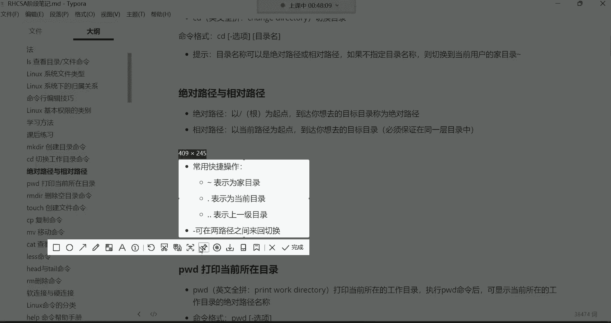
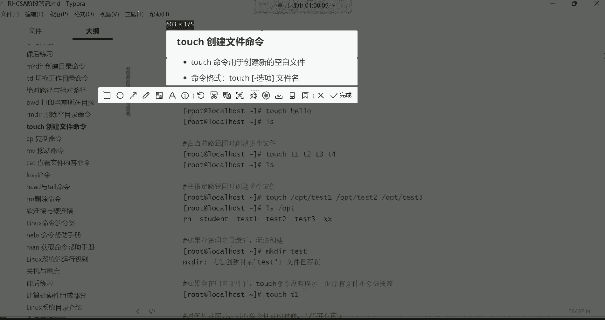

# 零基础入门Linux，红帽认证全套教程！Linux运维工程师的升职加薪宝典！RHCSA+RHCE+中级运维+云计算课程大合集！ - P7：红帽RHCSA-7.mkdir、cd、pwd、rmdir、touch、cp命令学习 - 广厦千万- - BV1ns4y1r7A2

hello hello，大家能听到我这边的声音吗？听到我这边声音的讨论区刷波一开始我们今天的课程。好，没有问题是吧？好，那我们就开始上课。嗯嗯。嗯。今天少了一些人是吧？我看到这个得少了10多号人。

这个十多号人可能是由于是周末的原因，可能是。哎呀，按耐不住自己的这个躁动了是吧，必须得出去溜达溜达，散散心啊，即便是没有女朋友的人呢，他也是闲不住，也得看着看看外边的花花世界啊，花花草草的。

毕竟马上春天就到来了啊，春天到来的话呢呃会看到啥各种各样的花花草草啊，而且还是非常嗯那种。比较性感的是吧，看看别人的女朋友没错。😊，哎呀，夏天来了，又又到了那种什么季节呢？啊，就是嗯思春的季节啊。

你是没有啥看的，是吧哎呀？😊，深圳已经夏天了是吗？没错啊，这个什么呃小丝袜啊，什么这个小什么这个装那个装的呃，是吧？嗯就开始都嗯都上来了。😊。

但是呢我们不用理会这些，我们作为一个什么呢？作为作为一个走在成功路上的一个人，我们不能被这些什么花花草草啊成为我们成功路上的绊脚石。所以呢我们只谈学习，我们不谈爱情啊，什么爱情不爱情的呀嗯。狗屁是吧。

好了，然后昨天呢讲了入门的一些必备概念以及这个LS这条命令啊然后呢简单做一个回顾哈。LS这条命令是用于查看目录下的内容以及目录跟文件的详细属性的。然后这三个选项是最常用的。

大家呢也是一定要给它牢牢的给它记录了。好吧，后期呢在不断的学习的时候呢，你们在干嘛呀，你们在根据自己的需求啊，再去这个。😊，自己去扩展就可以了。但是常用的这三个啊肯定是能够满足我们平时的一个需求了。

OK。😊，然后我们就开始看看这个课后练习哈。这个课后练习呢就是对于我们昨天讲解的内容啊，给大家做一个整体的一个回顾。好吧，第一啊就是命令行啊，我们昨天讲的命令行的格式，如果以每刀作为结尾呢。

就代表这个账号是普通账号。那如果是井号作为结尾呢？嗯井号作为结尾，是不是就是超级管理员呢？😊，O。好，然后请写出linux系统一般的命令格式。那命令格式呢最常见的就是有命令，然后呢有选项，还有参数。

但是呢这只是一般的哈，如果针对于一些比较灵活的命令，或者说我的需求不一样啊，你就得灵活运用它了。O然后第三个，在linux系统下边如何辨别目录与文件啊，如何辨别目录与及其他的文件。

我们主要就是通过什么呢？通过颜色去辨别，白色是文件，蓝色是目录，浅蓝色是链接，然后呢，绿色是可执行的，红色是压缩文件，红色闪动的是链接文件不可用。然后呢，黄色的就是设备文件，众多的设备硬件设备。😊，て？

好，然后第四道题，如何查看一个文件的详细属性，那。LS呢是查看文件的，但是呢杠L这个选项是可以帮我们查看一个文件的详细属性的。好，下边啊如何查看一个目录本身的详细属性。注意啊，现在是看目录本身了。

那就要加这个杠D这个选项啊，杠D是仅看本身啊，然后不不显示目录下的内容。OK但是也不要忘了要结合这个L这个选项。然后第六道题，查看文件详细属性，并且以这种K召G的方式显示文件的大小。那K召G的方式。

其中是不是H这个选项是人性化的显示啊，所以说不要忘了加这个H，但是L也不能少，为什么呢？因为L是显示详细属性的。最后呢有了详细属性才能以这种K召G的方式啊给你显示它的大小啊，第七个题。

如何查看一个文件的I node号。那这是杠I这个选项，这个呢用的比较少，大家注意了解就行。😊，第八题，请写请写出linux下文件和目录的三个归属关系啊，这三个归属关系呢，我们后边也会什么呢？

深入的去讲解。所以现在你就知道一下，有所有者所有组跟其他人啊，这个分别呢首字母啊UGO代啊来表示U就是优色的意思。😊，啊，有就是。优然G是什么呢？G就是group啊，英文里面就是组的意思O呢。😊。

啊就是other其他的意思就是他们的一个首字母哈，你看UGO。好，然后我们再来说啊，第九道题，请写出leux下亚基本权限的表示方法。那基本权限呢三个啊，R就是read啊代表是读取W就是Y的啊。

就是写入X代表是执行啊。这RWX啊代表是一个。基本权限。好，那第十道题啊第十道题命令行以井号作为结尾的表示什么含义。哎，超级管理员好了，那以上就是你看我们这几道题，我们如果说你都能够清楚的能够什么呢？

能够给它做出来。那是不是我们上节课讲的东西，你就基本上也掌握了呀。因为这个题不就是针对于我们上节课讲的内容做了一个整体的一个总结与回顾嘛。好，那接下来我们就开始这个今天的技术讲解啊。

今天就全都是学习命令的。然后呢呃在学习命令的时候呢，也也会不断的去涉及到系统的一些必备概念啊，所以说呢今天理论与实操都是结合着去讲解。那机器呢先给它开机。😊。

啊，把我们这个昨天的虚拟机给它开机，打开以后呢，就不用管了，用这个远程连接工具。

然后连到我们昨天的机器里边啊，90连到我们的这个90机器root用户名，然后密码一回车，然后ctrorl L清个屏。好了。那接下来先来看第一条命令叫做make DIR啊这条命令。

啊，这条命令干什么用的呢？这条命令是创看看。在这哈来看一下。O。

来看一下哈诶。好了。好，make DR这条命令呢英文的全拼叫做make directory，然后呢是用于创建新目录的，创建新的目录。什么意思呢？就。我没有。昨天使用LS命令啊。

可以看系统的根目录下边啊有非常多的目录是吧？那这些目录呢都是这个我们安装好系统之后啊，系统呢它自动给我们创建的。然后里边存储的数据呢也都是系统在运行的过程中啊，所必须啊会用到的一些数据。

但是呢我们在学习过程中或者是在工作中啊，我们需要什么呢？需要自己去创建一些目录啊，存储一些我们。比如说服务器里面的产生的一些数据等等等等。这就这种需求就类似于什么呢？

就是我们平时在windows里边我自己建一个文件夹，然后呢哎存储一些数据。

能列吧。哎，所以这就是创建目录。好，那创建文件夹呢这不用说了哈，windows里边你右击就可以了。这个呢没什么可讲的。😊。

那在ux里边，我们怎么自己去创建一个目录呢？啊，去存储一些数据呢？那make dR干的事就这个事创建新的目录的。然后命令格式呢你看make dR这条命令啊有选项，然后呢选项我是放到中括号里面了。

就是你可以加选项也可以不加选项，是不是？那后面目录的名字我并没有放到中括号里面。就是说你使用这条命令，你后边必须得加这个参数啊，就是你在创建目录。

你得指定这个目录叫什么名字O然后常用的选项有一个叫杠P叫递归创建多个目录啊，一会儿呢我们再来说好吧，那这条命令呢非常的简单，make dR空格啊，直接指定目录的名字，比如说t的回车。😊。

那你看这条命令执行以后，它就没有任何的返回信息是吧？那有没有创建成功呢？我们自己L看一下。😊，啊，可以看到在我们当前的加目录，你看我现在是不是在自己的加目录啊啊，波然号代表是加目录。然后呢。

在自己的加目录下边就有一个蓝色的test。😊，那这个目录就是我们刚刚使用makeDR这条命令啊创建出来的。那由于我在创建这个目录的时候，我并没有指定把这个test目录给它创建在哪一个目录下边。

那默认情况下就是你在哪儿？那这个目录呢就创建在你当前的所在目录。你看我当前在自己的家，那这个目录呢就创建在我的加目录下边了，能列吧。O这是test啊，就make dR命令创建新目录的好。

那这个make d命令呢，也可以同时创建多个目录。比如我现在有个需求，我需要同时创建很多个目录。那make点R空格隔开指定我再创建个t一啊，再空格隔开t2。空格隔开test3空格隔开tt4回车。

看到了吗？是不是？也没有报任何的错误啊，S看一下。好，那现在你看t一一直到t4啊，这四个目录呢就全都创建好了。O这就是什么呢？这就是用于啊可以帮你同时创建多个目录。那这种情况下，我们是怎么回事呢？

是在指定啊是在自己的加目录啊，就是当前目录创建的是吧？那比如说现在我有个需求，我要干嘛呀？我要在OPT目录去创建怎么办呢？那这时候你就得指定它的路径了，怎么指定呢？啊，我先清一下平行，这样makeDR。

空格隔开指定我要在根下的OPT下边。创建一个目录，那斜线作为一个分割符，这根斜线就是用于指定OPT目录下边的。那这时候我在创建的时候，我就可以创建了。比如说创建一个test。你。我们不叫test吧。

我们叫什么呢？叫TE好吧？啊，这个目录名字就叫TEokK回车。然后这时候呢我们LS4打开OPT这个目录回车。😊，那这时候呢。你看在OPT下边是不是有一个目录叫T啊啊。

这种情况下就是指定在某一个目录下边去创建这个目录啊，但是你得指定它的一个路径哈，指定它的路径OK那我如果想在OPT下边同时创建多个呢makeDRR在OPT下边，比如我再创建1个T2。那空格格开。

再指定我在OPT下边创建一个T3空格格还再指定在OPT下面创建一个T4啊，回车。那这时候LS打开OPT。你看它T1到T4就全都创建好了啊，T2到T4这三个目录就全都创建成功了，是不是啊。

这就是也可以哈指定在这个目录啊，同时创建多个目录。但这种情况下，你在创建的时候，你可不要这样，你比如我这样魅DR啊，我在OPT下面创建1个T5，然后空格格开T6T7T8可以吗？回车，它也没有报错。

但没有报错，你发现哈，你再打开OPT的时候，它不太一样，它只有一个什么呢？只有一个T5创建成功了，看到了吗？只有这个T5创建成功了。那别的呢T6T7T8跑哪去了呀。😊。

由于你并没有指定它要创建在哪个目录，所以说它创建在了你当前的所在目录，看到吗？T6T7T8。啊，在你的加目录下面呢，为什么呀？因为他们前面你并没有指定要给它创建在OPT目录，所以说系统呢并没有那么智能。

它能够理解你的真正的含义。所以他只会认为啊，你并没有指定要把T6T7T8创建在哪个目录，那我就给你创建在你的加目录吧啊，你所在哪儿，你当前在那，我就给你创建到哪里吧，能理解吧？所以如果你如果你。

是这种情况的话，比如你并没有在OPT目录里边，然后呢，你还需要在OPT目录同时创建多个目录的话，那每一个目录的前面都要指定什么呢？他的一个。呃，一个完整的路径。啊，这样才可以。能理解吗？

来理解的给我刷个一上来啊，等你们两秒钟反应反应。嗯ん。好，理解是吧。Wu。那接下来呢我们在干嘛呢？那我们下午犯困容易走神是吧？没关系哈，学习永远是枯燥的。对，没有办法，所以有什么时候不枯燥呢？呃。

只有当你这个开工资的时候，你是不枯燥的。当你花钱的时候，你是不枯燥的。但是你在吸收知识的时候，他不会像你看那个什么这个直播的小姐姐给你跳段舞啊，是吧？然后给你。给你穿个丝袜扭一下那种来的提神。

但是没有办法，不？毕竟呢你看别人给你这个扭个腰啊，是不是啊，他毕竟不能给你带来实际的收入啊，只会让你掏腰包给人刷个礼物啥的。所以说呢我们呃想要什么呢？啊，想要获得这种啊更高级的这种这个放纵啊。

我们就得要吃点苦啊吧。😊，这样才可以。所以说犯困的时候怎么办呢？犯困的时候就。哎呀。嗯嗯，我告诉你们告我我告诉你们个方法哈，如果你们要是犯困，你们怎么办？你们啊不用风油精，你们就在讨论区就。😊。

刷点东西啊，刷什么，你刷个一也行，刷个花也行，刷什么都行。总之，你要觉得你犯困了。😡，你就在讨论区打个一，然后呢发出来打个一发出来。哎，你发现哎这种有提神的功效啊，有提神的功效啊。好。行了。

那接下来呢我们就再说说这个杠P这个选项这个选项。因为对于makeDR这条命令哈就本身呢用起来非常简单，就等于说创建一个目录嘛，就跟你在windows里面建个文件夹一样，这没有什么太多可讲的。好。

那接下来呢我们说说这个杠P这个选项。比如我现在有个需求，我想干嘛呀？我想在这个OPT下边71这个目录里边再建一个什么呢？再创建一个目录结构。😊，啊，创建目录要保存，不它自动就保存下来了。

永它自动就是永久保存哈。来看哈，我现在要在这个T目录下边，我创建一个层级结构，什么意思呢？😊，这个层级结构是这样子的啊，首先啊这是一个。啊，我们说说这是1个TE目录。T一哈嗯，然我想在T下边。

我再创建什么呢？再创建一个。比如说这个。叉叉这个目录啊，然后在叉叉这个目录下边，我再创建一个目录啊，比如说这个。创建OO啊OO。我就想创建这么一个层级结构。注意啊。

我这个层级结构是希望创建在T一目录下边啊，创建一个叉叉，在叉叉下面呢再创建一个O哦，这是不是一个层级结构了呀？那这时候呢我们。正常来讲怎么创建呢？你好，我给你演示一下，这样我得指定啊make。😊。

make点R指定在OPT下边的TE下边创建一个叉叉。推车。然后这时候呢我们再打开OPT下边的T1下边看看有没有这个叉叉有是吧？好，那叉叉生成以后呢，我还要干嘛呀？咱们把命令翻上来。

我要在叉叉下边再创建1个OO啊，回车然后这我们再打开什么呢？啊，调用吧哈，调用嗯，ESC加点调用一下回车。那OPT下的T1下的叉叉下边是不是有1个OO啊，没错吧啊，这个目录就创建好了。

那这个目录创建好了之后呢，那你看我是一层一层创建的，没错吧，得先把这个叉叉啊给它创建出来，然后再创建这个OO。是吧那我能不能一条命令给他搞定啊，可不可以呢？😊。

就比如我现在呃想在这个T2目录下边啊创建一个，比如说X1啊，在S1下边再创建一个什么呢？创建一个X2啊吧，在在S2下边创建1个X3，可不可以呢？啊，我们来看看效果哈。

一条命令能不能搞定mDR在OPT下的T2下边创建1个X1。😊，然后呢呃在X一下边，我再创建1个X2，在X下边再创建X3S3下边创建个X4。你发现这就报错了，说我们无法创建目录。那如果这样创建的话。

你得先干嘛呀？先在T2下边把S一给它创建出来，然后再干嘛再再就是你得一层一层去创建哈，你一条命令呢无法干嘛呀，把这么多的层级关系同时创建出来，不允许。啊，主要是这条命令本身呢没有那么强大的功能。

所以这时候你怎么办呢？所以这时候你得加个杠P选项命令翻上来啊啊ctrl A把你的光标移动到最左边，然后往右挪一挪空格杠A啊，杠P杠P的话，它叫什么呢？它叫递归创建多个目录。注意哈。

它这个目录结构就是什么呢？就是可以帮我们在T2下边再创建一个X1，在X1下边啊，就X一里边再创建1个X2，然后在X2里边创建一个X3，所以它这个关系就是能够满足我们刚刚那个需求，哪个需求呢？嗯。

我现在就是啊这个需求就是OPT。下边啊我要来一个什么呀？来在T2里边。可，等会啊。啊，在这个T2里边呢，我来一个层级结构。T2下边给我创建一个X1。K啊这个X1，然后在X一下边呢，再干嘛呀？

再创建一个X2。啊，是这样子的，这X2，然后在S2下边啊，34是这样子的哈这一个层级结构是吧？那回车你看这时候它就并没有报错，为什么并没有报错呢？啊，因为杠P叫做递规创建多个目录。哎。

这个递归可以帮我们做这种需求。如果你不加递归的话，它是没有办法帮你在一个不存在的目录下边去再去创建新的目录的。为什么呢？因为你想想哈，我想创建。这么多个层级结构的目录。

首先X一这个目录它压根就不存在是吧？然后呢，我又想在这个X1这个本身就不存在的目录下边再去创建1个X2。然后我又想在一个本身又不存在的这个X2目录下边，再去创建S3X4。哎呦，这就有些费劲了。

所就无法帮你完成。所以这时候呢这个层级结构如果你真想去做这种事情，杠P可以帮我们达到这个效果。所以这时候我们LS干嘛呀？哎，看OPT下边的T2是不是有个X1啊，但这时候就不要这样看了哈。

我们把光标移动最左侧啊，conttrorl A，然后呢加个杠大R这个选项，杠大R这个选项昨天讲的是什么呀？昨天讲的是递归查看是吧？那回车，那这时候呢他就报递归打开了T2这个目录。

那这时候我们就可以看到它这个层级结构了是吧？你那在这个T2下边有一个什么有一个X1是吧？然后在这个X1下边有个什么呀？有一个X2，然后在这个X2下边有一个什么呀？X3是吧？然后在X3下边有一个X4。

那这个层级结构是不是通过杠P这个选项就给我们创建出来了。哎，这个所谓的叫做递归啊递。那如果你有这种需求的话，你说我就需要这么一个层级结构，那你知道是可以通过杠P这个选项来完成的。😊，好了。

那对于mDR这条命令呢，我们就暂时告一段落啊。对，这就叫做目录数。这个有一个层级结构的目录数。好，那下边呢在创建目录的时候啊，也不光是创建目录哈，以后创建文件的时候注意事项呢，大家知道一下这个目。

不管是目录还是文件啊，它的这个名字。😊，呃，你在创建的时候，除了以这个斜线以外的任意名称你都可以用。为什么呢？你比如说我想创建一个目录，make dR，我想创建一个名字叫斜线可以吗？回车。

你发现无法创建，为什么呀？因为这个斜线是根目录，注意，它是根目录哈，那根目录已经存在了，已经存在的话，你再去重复创建，它不是不是就告诉你这个东西已经存在了呀？啊，不能再重复创建了。

就等于说现在我已经有一个这个同名的这个一个目录，那你再创建它就不允许O吧，那你说那我这样创建不允许，那我这样我makeDR我在OPT下边我创建一个可以吗？比如说来一个这个斜线。😊，啊。

回车也不允许知道吧？也不允许哈，因为他还是认为啊你要干嘛呀？啊，你这这个东西是想创建一个根目录，所以他不允许哈。所以你除了这个斜线以外的名字，你可以任意去创建啊，因为它一是这个跟目录，二是路径分割符啊。

压压这是压根是不允许这样去创建的文件也一样，文件也不允许这样创建。还有名字的话呢啊不管是文件或目录的名字长度不能超过255个字符啊。这个。😊，呃。我们在创建文件跟目录的时候，不会去闲的无聊。

闲得蛋疼去搞这么长的一个名字的是吧？啊，这个注意事项大家知道一下啊，这是make DRR这条命令啊，然后下面是这条命令的众多的什么众多的演示。然后我们再来说这个CD这条命令。

CD。

CD这条命令是干什么用的呢？叫切换目录用的啊，切换工作目录啊。大小写必须区分吧。啊，当然区分大小写了，因为它是严格区分大小写哈。好，那接下来。我们再来说这个CD这条命令哈CD。啊，切换的嗯。

为什么要切换呢？就是我们刚刚在OPT下边，我们创建了很多个目录，是不是啊啊，而且呢在OPT下边在这个T2这个目录里边，我们还创建了很多的层级结构呢？是吧？O好，那现在我想切换到这个X4这个目录里边。

这怎么切换呢？因为我现在是在自己的家目录啊，是吧？我想进到这个S4这个目录里面。那这时候CD命令看好。😊，英文的全拼叫做chan职directy，然后是专门用于帮你切换目录的。然后这条命令格式。

你看CD啊，这条命令你看有点意思，这条命令呢我把选项跟目录名都放到中括号里了，是一个可选的那难道这条命令可以？什么都不加，可以单独使用吗？啊，首先这条命呢确实可以单独使用啊，你回车哎，你看CD回车哎。

CD回车。😊，没什么问题是吧？哎，那也可以这样CD空呃空格指定我要进到OPT下的什么呢？嗯，T2下的X1下的X2下的X3下的X4这个目录回车。哎，你看我是不是已经我你看我当前的所在的这个什么呢？

位置是不是变成S4了呀？😊，哎，切换进来了哈，然后这时候呢切换进来以后，我就已经在了这么长的一个路径下面了啊，非常的深。😊，非常深哈。那这时候我再敲CD注意哈，回车你发现我又回哪儿去了呢？哎，直接。😊。

又回到了自己的家目录，是不是你看小拨浪号代表是自己的家目录，我又回到了自己的家目录了。😊，哎，这就有点意思是吧？你要说CD这条命令呢。是是这样子的。啊，目录名称可以是绝对路径或相对路径。

这句话呢可能不太理解，没关系哈。😊，看后面那句话。看后面这句话，如果不指定目录名称，则切换到当前用户的加目录。啊，也就是说我你甭管在这个系统当中的哪个位置。

你看我已经切刚刚已经切换到这么深的一个目录里边了，是吧？然后我直接敲了1个CD，我就直接干嘛呀啊，直接回家了。是这么回事儿，所以这条命令啊也可以单独去使用它。那下面这句话。

你看目录的名称可以是绝对路径或相对路径，这又是什么意思呢？什么叫做绝对路径，什么又叫做相对路径。那这个我们把下边的这个概念来给大家说清楚。

啊，绝对路径绝对路径跟相对路径。

讲一讲啊，什么叫决对路径呢？啊，这里边我写的也很清晰啊，绝对路径就是以根为起点。那最终呢到达你想去的那个目标目录，我们称之为叫绝对路径。呃，就刚刚这边操作就是属于一个叫绝对路径的一个切换啊。

它是以什么为起点呢？以根目录作为我的起点。然后呢，我经过一层一层一层一层的目录啊，最终达到了我想要去的这个目标目录X4，这就叫做绝对路径。那什么叫做相对路径呢？就是以当前路径为起点。

到达你想去的目标目录。什么叫做当前。比如说我现在还是想进到X4这个目录里面去。但是如果我当前已经在哪呢？我已经在在这个，你看我先切换到OPT如果我现在已经在OPT目录的话，那我就可以干嘛呀，就指定哎。

我以OPT目录。作为我的起点了，就不需要再去指定什么呢？不需要再去指定根作为起点了。因为什么呢？因为本身这个X4这个X4这个目录，它就在OPT的下边，是不是？那我是不是就可以指定以OPT为起点。

然后呢那我就进到干嘛呀？我就先进到我自己的这个目录下边的CD哎，切换到我的T2下边，然后这时候再指定路径分割符。😊，那T2下边有一个X一是吧，然后有个X2X3X4这样。啊，X4啊X4这样是不也可以啊？

哎，那你看跟前面如果做对比的话。这个呢是以根为起点，这个呢就是以当前的OPT目录作为起点，这就是所谓的绝对与相对啊，能听懂吗？听懂的刷个一，听不懂的刷个2，没关系啊，懂就懂不懂就刷2。好。都可以是吧？

嗯，不懂也不丢人哈。如果你不懂的话呢。我会再给你这个解释解释啊，但如果都懂了的话，那以后咱们再进行就是路径切换的时候，你就别犯蒙圈。怎么叫别犯蒙圈呢？比如说你当前你看我们现在回到自己的家。

比如你当前明明是在自己的家目录呢。然后你想切换到这个X4这个目录里边，那你就不要这样啊CAD。X4。很多同学刚开始可能会有这种情况CTX4但是你要明白，这系统可没有那么智能啊。

系统不会觉得你是想进到OPT下边的这个X4这个目录里边，能理解吧？系统只会认为啊你想切换到哪呢？你想切换到你自己家目录下边的这个X4这个目录里边。但是在你的家里边，它又没有这个目录的名字叫X4。

所以他就说没有找到。😊，能列吧，而且你也不能这样CD啊，比如说T2下的IX1下的X2下的X3S4。你这样也不行，为什么呢？因为这个T2本身也没有在你的家目录，它在那儿，他在OPT目录。对。

所以咱们说相对路径啊，必须要保证在同一个。层下边啊。所以这样才能够以相对路径作为起点。

所以这时候呢呃这句话呢可以再补充一下。这种相对路径。你。必须要。保证在同一层。目录中才可以。而这种绝对路径呢，你发现你在哪儿都行，是不是？你甭管是在加目录还是在别的目录，因为以根为起点嘛。

是怎么切换都不会报错的。😡，O。好了，那这是绝对路径相的路径。那讲清楚这个那这CD命令就没有什么太多可说的了哈。你想怎么切换。比如说我现在想切换到你看啊咱们啊我现我现在看根目录哈，打开根目录。

我现在想切换到根下的ETC那就CDETC我现在想切换到根下的OPT啊，那就OPT我想切换到根下的MT，那就MT看到我想切换到根下的。😊。

呃，run啊那就run，我想CD到别的目录啊，s那就s看到吗？阿拉斯。能理解吧，所以想怎么切换就怎么切换，让你直接敲CDCD好，那你就直接回家了。😊，那这条命令呢还有一个呃什么呢？还有很多的快捷操作啊。

快捷操作在这儿呢。😊。

这个快捷操作有点意思哈，我们来看第一个快捷操作啊，这个拨浪号表示为加目录，什么意思呢？比如我现在切换到。😊，OPT下的T2下的X一下的X2下的X3S。我现在在这个路径里边呢。那这然后接下来呢我再切换到。

这样我直接这样啊，CD拨浪号空格波浪号回车。你看我现在在哪了？我现在就回到自己的家了哎，拨浪号不是代表加目录嘛，所以你也可以这样，但是没有必要哈，没有必要这个我们说叫脱裤子放屁啊，多此一举。

咱们就直接CD不不是也直接回家吗？你看把上面这命令调过来哈。😊，啊，cttrol A。把中把光标调到杭首，然后我先切换进去。那这个时候呢我直接敲CD，我不也是回家嘛？所以这个呢啊就没有标了哈。

但你知道一下有这个功能可以，还有一个点啊，这个点儿是什么意思呢？😊，点儿跟点点儿，你看我们LS杠A的时候，你们会发现这个有一个点跟点点是吧？嗯，我们说出这个点儿，它表示的是当前目录。当前目录。

那这个在切换的时候呢，一般用不到。因为你切换的话。我们怎么会有这种需求呢？你看我比如说我现在又这个切合到哪啊啊，我把命令翻上来哈，又在这个S4这个目录里边呢。那你看比如说我现在CD点儿。😊。

你发现我没有任何的变化，是不是啊？我还是在这个S这个目录里边，这代表什么意思呢？就是点儿代表当前路径，就是我要还是啊切换到当前的路径。所以这种没有需求，但一般什么时候会有这种需求呢？就。😊。

比如说我们在执行后期学习这个呃脚本的时候，啊，我们一般会用到这个点儿啊，我们点儿跟杠联合到一起，代表是什么呢？当前。什么意思呢？就是呃后期学习脚本，我要执行这个脚本的话啊，那点杠啊后面跟脚本名啊。

就执行当前路径的这个文件啊，这先知道一下。而且这个点呢也不一定非得是这个在执行的时候可以用。我们后期再学习，比如说拷贝命令啊，拷贝命令、移动命令啊都可以用哈，到时候再讲。

然后下面再说这个点点表示上一级目录啊，这个你看这个点点叫上一级，什么意思呢？我现在是不是在这个X4这个目录里面，我想切换到S3怎么办呢？😊，CD空格点点。你看我当前这个位置变成S3了是吧？

那我还想切换到S3的上一层目录，S2这个目录里面怎么办呢？CD1点点。那我再向网上切换，切换到SECD点点。我再想往上切换CD1点点啊，跑到T2了，是不是啊，我再想往上切换CD1点点OPT了。

我再往上切换CD1点点。😊，啊，跟目录了，我再往上切换。来，我问你们，我应该切换到哪里去了？如果在CD点点呢。😊，啊，比如说上一级目录我应该敲到哪儿去了。嗯。知道吗？啊，再CD点点。切换到哪里去呢？

是切换到自己的家里面去吗？会切换到自己的加盟录吗？呵。😊，嗯。CD点点翻上来CD点点点点点点点点。你发现没什么变化，还是在哪儿啊，还是在这个根目录，是不是为什么呀？为什么不为什么不直接切换到自己家呢？

因为你想想你的家。😡，在哪儿啊？在跟下有个目录叫做root。这儿呢。是不是那超级管理员的加嘛，在根下边有个目录叫root。那你想你现在都已经在根目录下边了，你还能再怎么切换呢？哼还能再怎么往上切换吧。

那根的上一层目录是谁呀？跟的上一层还有目录吗？没有了，所有的目录都在跟下边，是不是？所以你没有办法再往上切换了。

哈所这个一定要搞清楚哈。😊，好。啊，我们打开1个PPT啊，用于呃方便画图。

好。那我们继续哈，然后下边呢还有一个这个小横杠可在两个路径之间来回切换。比如我现在。啊，我现在切换到OPT下的T2下的X1下的X2下的S3S4在这里面呢。

我现在又切换到ETC下的ss confiwork w tape键补齐杠t键补齐啊，我现在又切换到这个路径了，阿拉斯打开一下啊，这个路径呢，后期是我们在修改网卡IP地址的时候啊。

会来到这个路径去找到这个网卡文件啊，那现在比如说啊我现在又想回到哪呢？我现在又想回到这个这个路径。啊，又想回到这个路径。那就候你可以这样。CD空格小杠。回车，你看我现在是不是又回到乱哪了。

是不是这个X这个X4这个路径了呀，没错吧。好，那我现在在CD杠，我现在又回到哪儿了呢？我现在是不是又回到了这个路径了呀，就这个路径。😊，看到，所以这个CD。杠是可以在两个路径之间来回切换的。看到了吧？

啊，来回帮你进行一个快速的切换。如果有这种需求的话呢，大家就啊可以去什么呢？去使用它。以上就是这个CD啊，这些都叫懒人操作啊，所谓的快捷操作都叫懒人操作。

箭头也可以吧。CD杠新讲的那。对，新讲的哈新讲的。O。啊，以上这些叫做快点操作OK。好，那接啊接下来呢我们再来说说这个PWD这条命令。那对于PWD这条命令啊，它是干嘛用的呢？它是这个。

叫做。看看PWD啊，叫做print worker directory，打印当前所在的工作目录。这条命令啊，直接敲直接敲哈。PWD回车。你看他干了什么事儿呢？他就直接把你当前所在的这个路径。😡。

以及前边的一个完整的路径的名字啊，就给你列出来了，给你打印出来了，就显示出来了的意思。看到了吗？所以它可以打印你当前所在的工作目录，你执行PWD命令以后，可显示当前所在的工作目录的一个绝对路径啊。

其实就一个完整的路径的名字了，能理解吧？你比如说我们像前面咱们这个在哪儿，在这个X4这个目录是吧？但是我们这个命令好像只显示这个你当前的目录名字。但如果我想看X4这个目录。它的一个完整的路径。

你就可以这样叫PWD看到了吧？啊，这样就可以了。你看PWD啊，这样就可以了。所以这条命令就没有什么太多可讲的了哈，就是打印当前的所在目录啊，命命令格式也非常简单。那你看现在这三个命令格式。

你看这三条命令makeDRCDPW这玩意儿，你看比如说我现在我们CD先回到自己的家。比如我现在也这样makeDR我在MNT创建一个centOS目录。那我现在我想进到这个目录，我就CD空格干嘛呀？

ESC加点儿。😊。

把上一条命令的参数给它调取过来啊，直接切换进来是不是切换进来了？好，那切换进来以后干嘛呢？我们在PWD推车打印一下我们当前所在的一个完整的。😊，陆静的名字。啊，就创建目录切换路径。

然后呢打印一个目录的完整的名称，这三条命令。

都比较常用是吧？OK。好了，那接下来呢我们再来讲一个不常用的命令啊，叫做remDIR叫删除空目录的。

啊，这个瑞木迪R这条命令啊啊就是用的非常少哈，你看它是删除空目录，什么叫空目录啊？就是你这个目录里面不能有任何的数据。什么意思呢？比如我现在。😡，先把OPT下边的这个T2。以及T2下边的一个什么呢？

L杠大R啊，把min给它调取过来。以及T2下边这个所有的层级结构我都想给它删掉啊，就把T2以及T2这个目录里边的所就这个哈。T2里边的所有都删掉。那这怎么办呢？这时候如果你用蕊木电R的话，你看效果哈。

RMDIR。直接把这个OPT给它调取过来。OPTT2回车。你发现他说删除OPT下的T2失败，为什么呢？因为这个目录啊飞空是吧？目录飞空。也就是说这个目录下边有数据，他不让你删。那怎么办呢？如果我就想把。

😡，T2都给它删掉啊，包括目录下边的所有的东西都给它删除的话，那你如果用re木DR的话，你得先这样。对。蕊木。DR啊，把这个参数给它调取过来哈，调取过来。你得指定T2下的X一下的X2下的S3S。

你得先把这个目录最底层的这个X4给它删掉，那这样它不会报错。然后你在干嘛呢？然后你再。瑞木迪R再把这个。S3给它删掉。然后你再。把这个命令调过来啊，把参数调过来，然后再把这个S2给它删掉，然后再。

这样一层一层的去删，也就是说你在创建的时候，它这个结构是一层一层的是吧？那你删的时候得从下往上。哎，一层一层的去删。对，就是这么麻烦。就这么麻烦，但有的时候比如说我们在这个做一些删除操作的时候。😊。

可能说对于一个目录下边可能会有啊上百个文件啊，甚至上千个文件在同一个这个目录下边。那如果我真的是不想要了。我就想给他删掉。那如果有那么多文件的话，你怎么办呢？那这时候蕊木DRR就不实用不实用啊。

所以我说这条命令呢大家作为了解就行，作为了解就行哈。😊，啊，他只适合删除空的啊，只要是有数据就不能删。那怎么办呢？我们后期会学习一条删除的命令啊，是非常给力的。啊，是在这个位置叫RM啊。

这个呢是后期可以帮你实现这个非常给力的删除操作的哈。就甭管你这个目录下面下边有没有数据，它都能帮你删。😊。

对，这个闪的快啊，这个能把整个系统都给你删掉。😊，好，所以这个re木DR大家最为了解。接下来来说说这个touch这条命令。

Touch。啊，touch。我先清个屏啊，control L清屏。呃，创建文件的命令啊，这条命令用于创建新的空白文件。

啊，新的空白文件什么意思呢？啊，其实就等于说我们在windows里边右击。新建文本文档。就这个操作。啊，建一个空白的文件出来。

然后在这个里边你就得用touch啊，你看我们现在在那PWD打印一下，我们现在在MNT的s透斯目录是吧？好，我想在这个s呃s透S目录下面，我想建一个什么呢？我想建一个文件。那这时候。😊，Touch。

比如说。这个泰斯特。点TAT。好，创建好了LS打开看一下。那是不是这个文件就生成了呀？好，那这条touchmin呢跟make dR它们两个的用法是完全一样的完全一样哈。你看我现在在干嘛。

我想创多创建几个文件啊，比如说test一点TAT。😊，然后t次2。test3test4点TATT成。拉斯，你看是不是也是一条命令，同时创建了多个文件呢？那这时候呢可能很多同学就会纳闷说唉。

创建文件后面补个TIT干什么用啊？😊，没什么用。补不补都行。啊，因为你有没有这个扩展名呢都无所谓。只不过如果你创建这个文件，你后期需要拿到windows里边，让windows能够认识这个文件的话呢。

哎你加个TATT后期你拿到windows里边，那windows也知道了。啊，能能能够认得出来这个文件啊，用记事本可以帮你打开，知道吧？😊，好。那这个就是什么呢？就是创建文件。

然后如果我想在别的目录创建呢，比如说我想在OPT目录去建文件，那你就指定它的一个路径就可以了。touch指定我要在OPT下边，我要创建一个test一空格再指定OPT下边。

test2空格OPT下边test3。回车，那就是再看那个OPT目录回车。看到吗？那ts的123是不是就创建成功了呀？哎，这样就。也是在指定的路径。这是我指定的路径是吧？然后呢，创建多个文件。啊。

出现多个问件。好了，那这条命令呢跟那个makeDR都是非常的简单哈，就没有太多可强调的啊，就是说白了在windows里边不就是建个文件嘛？是不是？那剩下这个文件建到哪个目录，就看你自己的一个需求呗。😊。

你说我想在T3目录去建个文件，那你就touch。在指定它的路径OPT下的T3下的什么呢？比如说叉叉叉叉。就阿拉斯打开OPT下的T3，你就可以看到这个文件了，是不是？

这不就是等于说你在windows里边啊，你在哪个文件夹建的文件。你就进到哪个文件夹里面不就可以了吗？是不是？但是我们这边呢就你只需要指定这个路径就可以了，他就给你创建的这个路径下边。啊，是这么回事儿。

这tauch创建文件的。命令格式呢用法跟那个makeDR都是一模一样的，就没有太多可讲的。那我们再来说这个CP命令CP命令。这个呢在windows里边是什么操作呢？

这个在windows里边啊，就是右击。哈好。复制。

然后我在干嘛呀？比如说我在。跑到某一个文件夹里边。啊，进到我的C盘。然后。比如说跑到用户里边。啊，然后右击。然后呢。粘贴。看到了吗？能看懂这边操作吗？什么叫复制啊？就是右击复制右击粘呃。

就是这什么叫拷背，拷背就是右击复制右击粘贴。😡，对，ctrl C controltrl V是不是？好，给他删掉。删掉。

所以这就叫CP啊，这可不是你们想的那个CP什么很多同学玩游戏，一听啊CP啊，这不搞对象吗？是吧？这可不是搞对象那CP哈这是拷贝的啊，用于你看。😊。

用于复制文件或目录的啊，英文名叫copy file，就拷贝文件的。然后这CP命令在复制时也可以具备修改目录或文件的名字的功能。啊，有时候他除了拷贝以外呢，还可以具备改名。好，来看看这个东西怎么玩。啊。

我现在。想干嘛呢？那现在咱我们当前路径有很多文件，是不是啊啊？我想给它拷贝到哪儿呢？拷贝到我的拷贝到我的加目录去。😊，阿莱斯打开跟新的root，我现在想嗯不行，这个名字有重复的那不行。呃。

看看哈哪个目录啊，那我们现在看看跟下边哪个目录还比较清闲，还没有被我们给什么呢？给这个糟蹋啊，MNT打开。M问题。好，就这个MT吧哈。😊，啊，这个PWD我们当前在哪呢？

我我们当前就在MNT下的s透斯目录是吧？也就说我们现在就在这个s透S目录里面呢。好，那咱们这样吧，咱们看看这个media这个目录吧，好吧，打开跟下的。😊，media这个目录哎，这个目录很很清闲呢。

里边什么都没有啊，那现在我们这样，我要把我这个当前的这个。😊，当前目录下这几个文件。我要给它拷贝到那个根系的media目录，根线的media。这个目录，那现在就co贝命令格式看哈。

CP然后呢先指定原文件或目录，再指定目标目录。那这个时候什么意思呢？什么叫语原啊，先给大家讲清楚，原就是你要拷贝的文件，就叫做语文件。什么叫目标？目标就是你要把这个文件拷贝到哪里，这就是所谓的目标啊。

你的目标那接下来我的语言文件是谁呢？就是test一点TAT我要把它ts一点TAT啊，t键补齐啊，这种东西就补齐了啊。TEST。太词一补齐OK。好，那我现在要把这个文件拷贝到跟下的。media店这个目录。

好，回车。让后阿拉斯打开media。回撤看到了吗？你看说这个文件就直接拷贝过去了。啊，那拷贝过去，我们在L看看我们当前的目录啊，sin透S这个目录，你发现这个test一这个文件仍然还在。是吧这人还在哈。

CP不加杠哈不加杠。😊，呃，这个文件仍然还在，为什么呢？因为拷贝嘛，拷贝也不会导致你的原文件消失。就是说我我刚刚做这个操作，哪个操作啊，就是我把这个文件拷贝到。

某一个文件夹，那这个文件也不会消失，是不是啊啊，拷贝就等于说呃对它做了一个备份。啊，做了一个备份。

啊，就他了他有一个一模一样的副本文件，是这么回事。啊，这是cobe。然后这条命令也可以帮你同时拷贝多个。比如我现在CP指定我要把再把test2空格隔开，test3空格隔开，test4空格隔开t。

点TATT同时拷贝到media目录。ESA加点调取调取调取啊，不行，调取不出来了，那就自己敲吧。米利亚。这个目录回车，然后L拉啊在EIC加点调取过来回车。看到了吗？

那是不是就同时把这些文件都给它拷贝到这个目录下面去了呀？哎，这也可以同时拷贝多个。同时可别多个哈，然后他这个使用的方法，比如说我现在在渗透S目录呢，我现在想干嘛呢？哎，我现在想把OPT目录。😊。

这几个什么T1T2T3T4这个目录也给它拷贝到media目录去，那怎么办呢？哎CP你就得指定。它的一个完整的路径了吧，因为你没有在这个OPT目录啊，所以你就得指定我要拷贝OPT下边的呃。

指定下边的时候得斜线隔开了。那这时候呢哎T1。😊，提议。给他拷贝到哪儿呢？ESC加点。给他调取过来，拷贝到media目录回撤。那这时候你发现他就提示说什么略过目录。什么叫掠过目录啊？😡。

有没有拷贝成功啊？LS啊ESA加点儿。没有拷贝过去。没有拷贝过去啊，看到了吗？还在呢。是不是？不是没在没有在这个命恋目录。为什么呀？注意哈。哎，这个如果我想在。使用CP拷贝目录的时候，要加一个叫做杠R。

杠R是用来拷贝目录的，然后它是包含目录下所有的子目录跟文件，这个也比较好理解。如果我把T2这个目录给它拷贝到这个media这个目录的话，你想想在T2这个目录里边的如果有哪些数据的话。

是不是也跟着一起过去了呀？啊，这个很好理解哈。那这时候你看我们就CP空格杠R指定我把OPT下的T2这个目录拷贝到med目录。回车这时候再打开密调目录。看到了吗？这T2是不是就过去了？那在T2里边的。啊。

被我们给删了是吧啊，如果有的话，是不是也一同给他拷贝过来了呀？啊，这是如果你想拷贝目录，千万不要忘了加一个杠R这个选项。OK刚诉人学姐。好，然后。那我们再来说这个杠P啊。

这个杠P这个选项叫保留语言文件属性不变。什么叫语言文件属性？看啊。我们来拿这个test2这个文件来说吧，我们LS4空格杠L看一下t2这个文件详细属性。呃，我们主要是看他当前的什么呢？

这个文件的最后一次的修改时间吧，看这位置是几点是14点48。没错吧，那现在是几点呢？是14点58分。是吧现在是你们看看你的自己的点是14点58分。好，那我现在要做一个操作，什么操作呢？😡。

我想对于这个文件做一个拷贝啊，其实拷贝就等于备份的意思啊，把这个文件呢。做一个备份，备份到哪里呢？啊，备份到哪里都行。但是我现在想备份的时候，我希望这个文件原先的属性是什么属性？那备份以后呢。

他的属性呢？不要发生改变。这种叫做什么呢？叫做属性不变的。我要对它做一个备份啊，做一个拷贝。那这个怎么样才能实现呢？如果你。就普通的拷贝的话，不加这个杠P选项。我们来看效果哈，我们不加杠P。

我先给它拷贝到哪儿呢？嗯，我先给它拷贝到。😊，OPT下的。我们打开OPT啊，我我得拷贝OPT下的T目录吧。我们看看这个TE目录。里面有个叉叉是吧？好，那就给它拷贝到T下面CP我要把。😊，注意哈。

我现在已经在sS目录里边了，是吧？我现在要把我当前目录下的哪个呢？😊，太2这个文件空格隔开，拷贝到根下的OPT下的T2这个目录。什么都没有加是吧？那L4杠L这时候呢。指定T2下的ts的文件。

看到的详细属性。啊，我清个屏回车。那你看他的时间变成什么呢？变成是当前拷贝的时间了。但是原先那个文件L拉4杠L，我们看t这个。啊，太二的文件，你看它的。就是这是属于原文件哈，在s托S这个目录下边啊。

这是原文件。然后呢，这个在OPT这个T2下边，这个属于就备份文件了是吧？那你看原文件它的时间是什么呢？14点48分。但是我这个做了拷贝以后，它的时间就发生变化了，变成。当前拷贝的那个时间。

这就属于什么呢？叫属性发生变化了。但有的时候我们在做数据备份的时候。我们是不希望这个属性发生改变的。哎，这个文件原先的属性以及它的权限，什么归属关系是什么都不要发生变化。一模一样的给我拷贝过去。

那这个时候我们就得加杠P啊，那这时咱们再来演示的话，我们换个目录OPT下边的TE吧。OPT下的。T1啊，这这里面有个叉叉是吧？好。

那接下来呢我们就这样CP杠P指定我要把当前下的t2这个文件拷贝到OPT下的T1这个目录下边去回车。啊，这时候我们在L4杠L看OPT下的T下的t斯2这个文件。好，你看这是我刚刚加了杠P这个选项。

拷贝过来的文件的属性是什么呢？时间你看都没有发生变化，还是14点48分，是不是跟我这个原文件啊，在sn托S这个目录下边的这个原文件，它的属性是一模一样的呀。没错吧，哎，这就叫什么？

这就叫做保留原文件的属性不变啊，一般在做备份的时候会有这种需求。OK能列了吧，哎，这是杠P。这条命令就是拷贝文件或目录的。那改名怎么改呢？就你在拷贝的时候，你可以这样改。哈哈比如说我现在要拷贝谁呢？

我现在要拷贝这个t1点TATTCP。😊，杠P。保持属性不变拷贝，但改个名。嗯。我要把这个t1点TATT拷贝到OPT下边的那个TE目录下边。叫什么名字呢？叫ABC点TATT回车。

那这时候我们再打开OPT下的TE这个目录，你发现。这个名字就不叫什了么？就不叫什么了呢？不叫test一点TATT了。哎，而是叫。ABC那听一听。所以你在拷贝文件的时候，你想改名的话。

你就在这个你想拷贝的那个目标。目录的后边给他加一个新的名字就可以了。如果你不想改名，那只需要指定我要给它拷贝到哪个目录里边就可以了，后边就什么都不要加，什么都不加，就是什么呢？哎，原先叫什么名字。

拷贝过去以后呢，仍然叫什么名字。那这时候问题来了，我们改了名以后，那属性会不会发生变化呀？T一下的ABC点TATT。😊，啊，ctrorl A。移动下光标杠A没车。啊，sorry不是杠A要。

cttrol A啊，杠L这。啊，只是名字发生变化了，但是别的属性呢也不会发生任何的改变。OK好，这这是他拷贝的时候可以改名。你甭管是拷贝目录还是拷贝文件，想改名都可以改。这是CP啊拷贝命令。

好了，休息一下吧，休息一下。你看我们讲的这些基本命令是不是啊？然后你们如果有什么疑问啊，可以发到讨论区，然后呢休息一会儿。😊。

没。