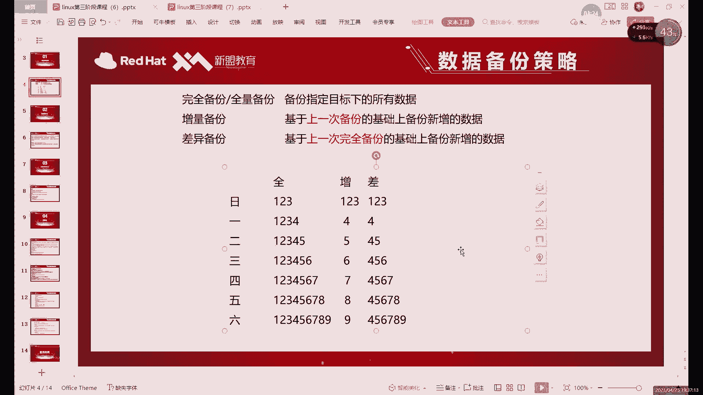
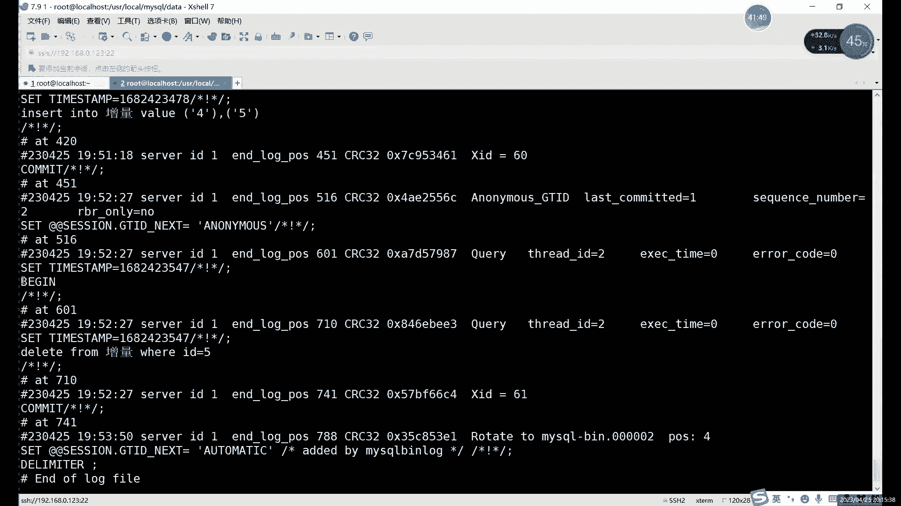
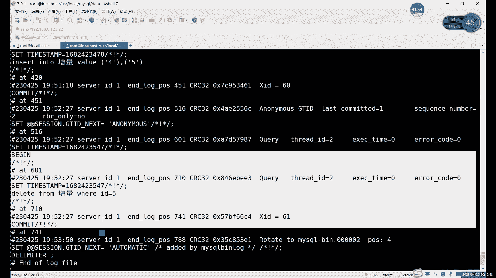
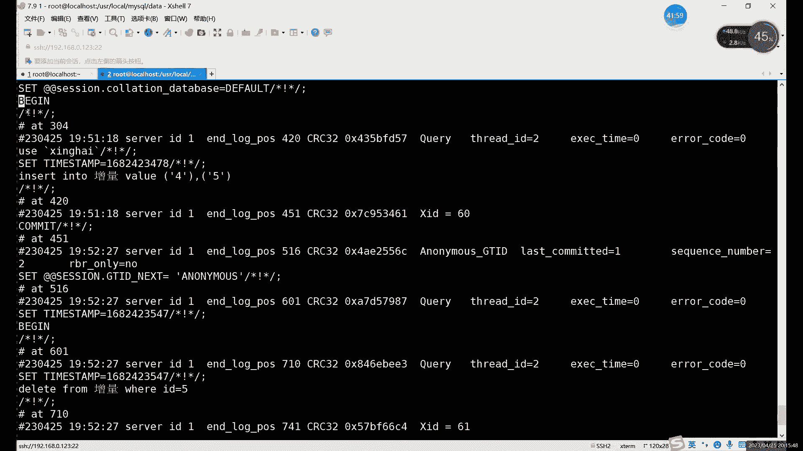
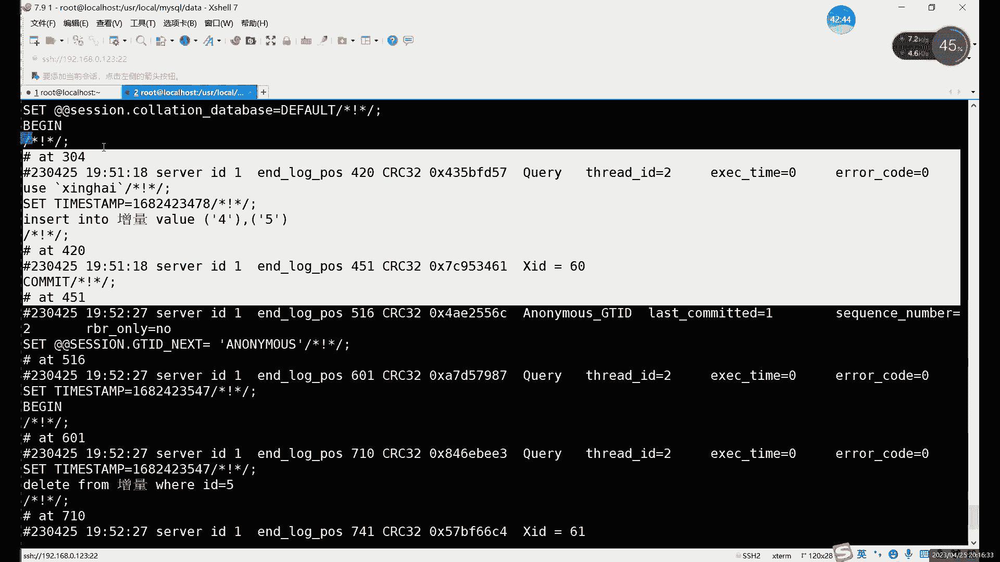
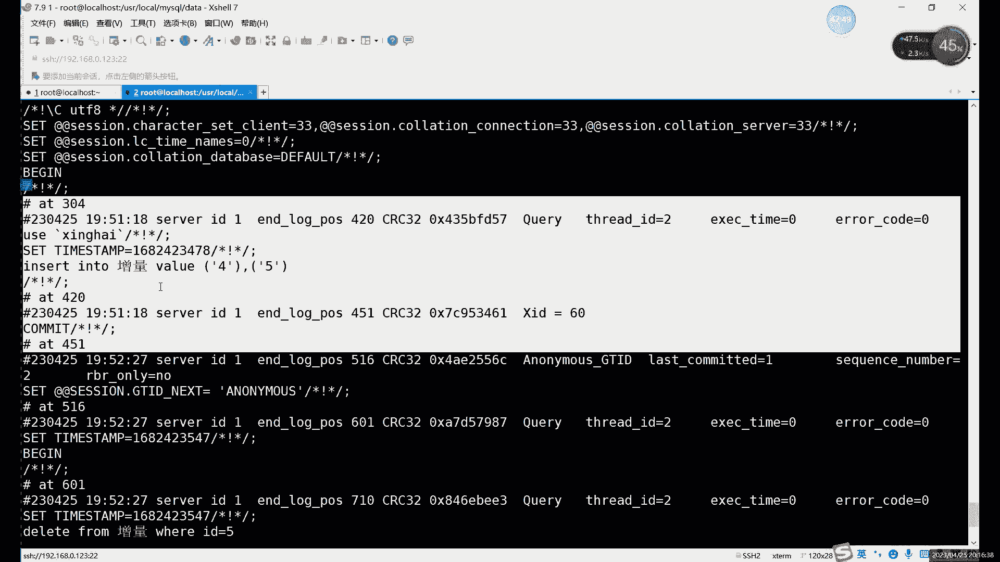
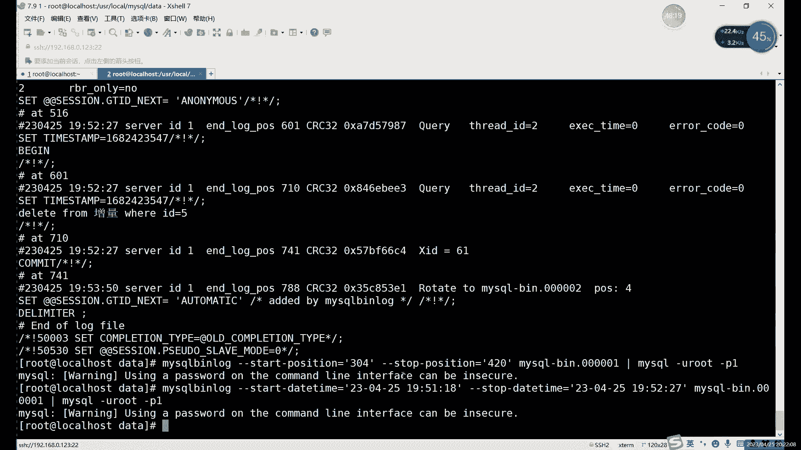

# 零基础入门Linux，红帽认证全套教程！Linux运维工程师的升职加薪宝典！RHCSA+RHCE+中级运维+云计算课程大合集！ - P80：中级运维-19.增量备份，主从复制 - 广厦千万- - BV1ns4y1r7A2

好，我们今天继续来讲这个备份。继续来讲备份。首先呢备份这里的话。第一，我们备份的一个。前几个啊前几种分类的话，其实已经说完了，对吧？就是。全能备份对吧？物理备份啊，逻辑备份这些。

我们接下来的话其实就剩一下最后一个啊，我们主要内容就是增量倍的。增量备份其实就非常重要，为什么？因为前面我们讲的那几种呢，只是一种的备份方式，对吧？那增量备份全量备份呢，它指的就是什么？

这是我们备份数据的一个量。具体备份多少？对吧首先呢增量备份这里呢。我们之前也就是最开始介绍过。增那部分它备份的数据是最少的。哎，就是所有几种备论方式中最少的。啊，因为备份的话，主要是我们只要数据有就行。

对吧？有这个数据就可以。所以说呢不管是全量备份也好，还是差异备份也好，其实都是有一个问题，就是随着时间的增长，他们每天备份的数据会越来越多。那这个肯定不合适，为什么呢？因为备份这个东西啊。啊。

就流其像备份的数据啊，如果说你不出现是什么故障的话，其实你这个备份呢基本上一直用不到，对吧？所以说呢这个备份呢肯定是大于恢复的。😡，啊，就做备份的这个时间肯定是要大于做恢复的时间的，这是肯定的对吧？

这是一定的。那所以说呢主要是啊就恢复上的话，我们就暂且先不说了啊，我们先只做备份。你看如就因为我们每天肯定都是要做备份，对吧这个频率可能啊可能不一样吧啊，可能每天可可能是两天，对吧？可能是几个小时。

10个小时就备份一次，对吧？半天就备份一次都有可能。不管说你的备份频率怎么样，啊，就是每一次在备份的时候呢，你看全折反倒是什么？就是备份的频率越高啊，你全量和差异这里备份的数据越多。

所以说呢啊在备份上的话，我们一般就选择什么呢？选择首先。😡，先做一次全量备份。啊，添做一次全量备份做完之后呢。😡，后边的每次备份比如说一天一次吧，我们也不太短，因为不短不长，就一天一次。啊。

如果说一天一次的话，那就是一天什么一天备份一个啊，每天每天只备份新增的数据啊，每天只备份新增的数据啊，或者说修改的数据。这样的话就能把备份的量呢最大程度就是减减少到最大程度啊。

因为什么你看你这个增量部分备份下来的话，其实就是把所有的备份内容呢加起来。其实我就是我们整个数据库的内容，对吧？所以说它的备份量呢肯定是最小的，对吧？这个肯定是毋庸置疑，对吧？啊？

它的备份量肯定是最小的。😊，然后呢，这个增量备份呢啊那怎么去做呢？😡，啊，因为增加份其实它备份的不仅仅是增加的数据啊，这个这个我们表格里面其实写的只是什么，只是写了一个增加的数据，对吧？啊。

其实它也有可能会有删除，对吧？有可能会有什么，也有可能会有修改。那这些怎么办呢？那这些的话其实我们的这个。😊，在mys里边啊，就是没有直接做增量变分这种工具。😡，啊，也就是说有什么问题呢？

其实就是啊你想做增样备份的时候啊，就是你知道这个概念啊，知道怎么做了。那如果说让你自己去找这些新增的数据啊，是，对吧？或者说修改的数据删除的数据其实很难找。😊，所以说在测库里面。

我们一般做增料文本怎么做呢？我们就用这个日志，对吧？上节课我们其实看过那个日志。😊，对吧上节课看过。

就比如说。嗯，即系。二进制制对吧？名字是二进制制，上节课其实已经提到过了。😡，啊，二进制制的话就是什么？我们会记录我们数据库的里面的一些操作，对吧？它操作包括什么呢？啊，它包括这个。😡，创建表格对吧？

插入数据，删除数据，修改数据。就是只要凡是对我们的数据库做了修改的。哎，只要是对我们数据库里面的数据哎做出了修改，那么就会就会记录到我们的二进制日志当中。

对吧这种啊这个二级日制其实就是我们在增量位分里面最关键的一个东西。因为我们买这里面没有这种备份，就是没有增样备份这种方式。所以说呢这个增量备份呢，我们就是通过什么？通过日志来来做。

明日治理呢其实是它完整的保存什么呢？完整的保存了。我们的所有操作。啊，当然我这里说的是对数据的操作，对修改数据的操作啊，查询数据啊，或者说你看sag的命令啊，或者售命令。

这两种的话其实是不会进入到我们日志里边的，因为什么呢？😡，因为没有改到没有改没有修改数据啊，我们的二级值日志呢记录的只是什么？只是修改数据的一些命令语句，对吧？你没改数据，你只是看了一下，对吧？

我没必要记啊，没必要记录啊，这个没有什么记录的必要，记录的反而浪费空间了。所以说呢记录下来的都是修改的。😡，不管是你增加也好，删除也好，修改也好。😡，啊，这些命令呢其实都是会记录到这个日志当中的。

所以说呢哎这里自然。😊，如果说我们要做这个增量备份的话，其实就是什么？就是其实就是借用什么借用二进制日去做。😡，恢复也一样啊，就是增量备份啊，质量恢复呢啊就是增量备份的恢复。

这两种操作呢其实都是基于谁呢？基于这个日志来做的啊，首先的话要做这个。第一，要开启二进制日志啊，如果大家是用的那种方法做做的源码安装，那肯定是开了的。啊那个肯定是已经开了的。如果说你做的什么？

如果说你做的是EM安装或RPM安装的啊，它默认是没有开的，大家一定要注意啊。如果你用其他这两种方式做的话，没有开，你得去配置文件里去开启一下。啊，配置文件你去开启一下。啊，开启之后呢才能继续做什么？

继续做这个。😊，增量备份啊，就是继续做这个。嗯，就是因为这个其实不管不仅仅是增量备份啊，就二进制其实在我们这个数据库里面是非常重要的。增量备份呢只是其中之一啊只是它的其中一个作用。😊，啊。

只是它其中一个作用，还有些什么作用呢？啊，剩下的作用的话我们啊讲完备份再说啊，讲完备份再说。😊，那首先我们先用这个日志的来做个备份啊，来做个备份。当然这个日志名字大家其实是可以自定义的。

哪怕你写中文都可以。😊，啊，你想写中文其实都都也行。然后呢，我们接下来看一下么。啊，看一下。🤧首先。首先我目前的话，我看一下现在这个数据库看看里面有有有哪些数据啊。7。1是123的IP。没完之后的话。

我们先进入到数据库里边啊，我们看看数据库里边这个数据库应该里边有不少数据吧。嗯，这以我刚一入他。这种报错的话就是报这种报数。基本上有可你重启之后呢，数据库没有开啊，也可能没有做开机自己啊，数据库没有开。

或者说是。一种数据库没有开，另一种的话就可能是和这个mDD给冲突了啊，一般情况下就是这这些情况。嗯，然后这里的话我们看一下受DABSES。切换到这个库里边，我们来看一下stable。嗯嗯表格不多啊。

表格挺多啊啊表格挺多。嗯，这么面这样来看一下吧。做这个。因为这里的数据其还挺多，还挺杂。我们这就这里就重新创建一个表格啊，重新创建一个表格。啊，我们一会做的时候，重新创建一个表格。

我们针对于一个表格来做，这样的话其实好观察一点啊，而且备份也快，对吧？我们就不针对于整个数据库做为备份了，我们就只针对于某一个表格啊，我们做备份。啊首先的话增量备份的第一个第一条件是什么呢？

第一条件是你先做一次全量的。😊，啊，因为你没有这个没有这个对比的对吧？你也不知道你这个机器。如果没有一个全量的对比，你也不知道你该从哪开始做增量，对吧？所以说呢第一次就是所有数据的一个全量备份。

你得有啊。当然我们这里先只做一个表格的啊，这样数据少一点，数据少一点。一会儿好对比一些，好吧，那首先的话。我们先看啊创建。啊，当然这里大家还提前提前看一个命令啊，提前看一个命令，一会儿还要一会要用。

有二进制日志呢，只是只要在我们买开启之后呢，会开启开始记录。啊。日志的话，大家可以看到，就是之前的话，其实我们有好几个日志，对吧？它分了不同的数字啊，323456对吧？都分下去的啊。

就因为它到咱所所示的大小啊，或者说重启了或者说什么，或者说就是我们可以手动执行flash log这种命令，就是什么？它就会重新创建一个新的日志啊，重新创建一个新的日志。

所以说呢我们大家可以看到日志的编号有好几个，对吧？啊，这是因为。😊，一般情况下都是我们重启之后啊，或者说是这个大了所示的大小之后呢，就会创建一个新的日志。手动清的话。

手动创建的话就用这个pllashush log可以创建一个新日志。啊，创一个新日志。定时的备份呢其实不需要我们手动去做啊，定时的备份其实不需要手动去做，怎么办呢？就是什么？

就是定时的执行flash log。电视执行这个命令。啊，执行命执行这个命令之后呢。它就会生成一个新日志。然后之前的日志的话，其实我们就可以什么就可以保存了，对吧？啊，就可以保存之前的日志了。😡。

那这个就什么这个就是自动啊，这个你可以设置自动的。啊，chroown type那个。自动一个任务啊，定时任务。然后这里的话我们首先先看一下啊，日志的话我们就不看了，对吧？其实之前前几课都看过了啊。

大家记记得在配置文件里边用。打开什么？打开我们这打开这个二进制日志，打开二进制日志就可以啊，打开就行。打开之后的话，我们现在先。啊，就是在ETCR的卖雅F那个文件里啊。😊，然后现在的话。

其实我们现在已已经有很多日志了，对吧？我这里再开个终端嘛，在个终端好好打命令一点。😊，啊，我们一个在数据库外边，一个在数据库里边。root123点com。

我们CD切换到这个user下的local里边的my circle data。百分日的话就是这几个啊，现在已经排到几排到7了啊，排到八了。啊，排了很多。嗯，现在的话如果说重新开始做的话啊。

有还有一个命题就是。Reset。啊，后边加上这个master。啊，reset命令的话。啊你 mean。在哪儿在这个数据库里边啊，在数据库里边。RESET。假如下 master这个命令。

这个命令的话可以什么？它可以删除所有的日志。😡，啊，并且是吧并且重新新建一个日志啊，这里的话现在其实前面的日志的话，它里面存的是什么？存就是我们创建这些表格的记录，修改数据的记录。这些没什么重要的啊。

可以删掉。如果大家嫌间太多太乱的话，可以可以先清理一下啊，就是resit master这个命令啊，清理掉之后的话，我们再来看一下。对吧就剩一个了啊，又从一开始了啊，又从一开始从一开始记录。这就是什么？

这就是。二进制日二进制日志啊，这个叫二进制日志。从一开始的话，现在其实它里面是空的对吧？现在面它里面是空的。想做这个单量备份呢？嗯，我们首先先。这样吧，我先创建一个表格。啊，我先装你一个简单的表格。

这表格的话我们增量备份啊，增量备份表格。我们就用一列啊，用一列的话好对比一些啊，我们这insert into。增量。valuealue。比如说我们这里写个什么，比如说就一。你先写个123啊。

先写个123。😊，就当做一个默认数据吧。啊，1235们当中默认数据。那现在的话这个表格里面是有一共有这么三个数据啊。其实现在这个已经记录到哪，已经记入到第一个日志里啊，它已经记入到第一个日志里了。

that from。apple是value是增量。对吧1233个数据啊，我们这里做增量备份的话，我们就不用整个数据库了。总数据库数据太多了，我们就只用一个单个表格来演示啊，单个表格。

你只要备份只要是备份到的全部数据，那就算什么，那就算全量备份。啊，权利备份它不是说针对于整个数据库，它就有权名，而是只要备份的是某一个对象的全部数据就行。就比如说我们现在呢来看一下这个。嗯。

现在当然第一个一个日志我们就以后也不会用它，不会用。因为现在或者你重新刷一下也行啊，或者重新刷新一下。这个他其实无所谓啊其实无所谓。不用第一个，我们可以用后边再用，对吧？Resite。啊。

现在的话我们现在是有一共是我们就备先备份这三个数据吧啊，先备份这个表格。先给这个表格做全员备份啊先给表格做全员备份。首先的话啊全限备份大家还记得命令吗？就上节课讲的我们用什么备份，我们用。啊。

但是全量的你选都可以啊都可以。用物理的也行，用物用逻辑的也行，这个都可以啊都行啊，这个其实没什么太大区别。啊，这第一次全量备份呢。数据由于数据比较多啊。

所以说呢你如果说选择这个物理备份也是可以的啊也是可以的。你们这里还是用什么，还是用逻辑备份吧啊，还是用逻辑备份啊，逻辑备份的话，我们其实。唔系水。买s dump，然后后边加什么呢？

我们这里就只备份一个输入啊，只备份一个。这跟哪个呢？我看一下啊嗯啊分量。有比如说刚才那个增量。对应这个资料，然后呢给它导入到一个文件里面。增亮点sircle啊，也就这里的话，我们就什么就是备份了一个。

单个的一个表格啊，用的是全量备份。那全量备份结束之后的话，我们接下来就可以进行进行增量备份。啊现正量部份。就资料备问呢。我们真正备份的是什么呢？啊？真正备份的是我们的日志文件。

就是我们这次就不用不用导出命令了啊，大家注意也就是你第一次权限备份之后呢，后边呢再去做的话就是。用什么呢？啊，直接用拷贝的命令呢去拷贝谁呢？拷贝日志文件。啊，我们做增量备份，其实就是拷贝日志文件。

就比如说现在的话，其实啊只有一个日志，对吧？只有一个日志，这个到。所以现在里面还没有数据，对吧？里面其然还没有数据。我们现在的话先把什么呢？先把这个。先插入两条命。啊，先插入隐藏命令。

但日志里边有点结果啊，有点信息，对吧？我们呢可以先看一下日志嘛。现在这个日志的话就是my circlercle杠B点0001啊，只有一个日志啊，什么信息还没有。那接下来呢我们怎么去。

做增量啊就首先的话我们先有先得有数据，对吧？不然你的资量备份里面是空的啊，现在当然你也可以做这个可以执行我们这个增量备份的命令。啊，但是你其实不能说质量在这里面就是。哎，这边叫截取这个日志的命令啊。

截取日志的命令。现在节的话，它里面是空的，所有什么意义？对吧？我们查下数据iner into。Y六。嗯。12345。啊，我们拍过来睇面你。然后再来看一下这个文件啊。

就是我们的日志文件还是这个马特克格杠平点000001，对吧？它里面就添加了这两个数据。你这个就是什么？这个就是一个增量备份。我们备份的是谁呢？备份的就是这个。哪去了，就是名字。00001啊。然后呢。

这里的话我们可以再次行调命，就是我们的这个。我们这里只是增加了，对吧？我们再删一条啊我们再删一条。我们把五代删掉。啊，这ele form哪个表格呢？增量对吧？VID等于5。啊，给它删掉，删掉之后的。

我们可以来查看一下，就剩1234了，对吧？那这个里边它既然当然也会记录这样这个命令，下面是插入，对吧？下边是删除。没问题，对吧？啊，两条命令。所以说呢其实其实你不管说你是增加数据也好，删除数据也好。

修改数据也好。其实对于这个日志来说呢啊它都会写进去。😡，所以说这个增量备份啊，这就是为什么啊能做增量备份的原因，对吧？你增加数据其实是好说，对吧？那减少数据呢，那其实还是什么？还是执行一下这个命。😡。

想要做恢复的话，其实就执行这个命令就可以啊。现在的话我们是一个什么？现在是这个。看一下，现在的话是insert into插入了两条，对吧？删了一条。改的话，我们这里也不写了啊，有个有个插入删删除就行了。

😡，改的话，大家如果说想想试的话，也可以再修改一条试试。效果是一样的效果是一样。然后现在的话我们来做一个什么啊，做一个增量备分的操作。资量被动操作的话，其实也没有什么就是。很特别的命令啊。

它就是简单的一个flashush。FLUSH logs啊bush logs。刷新压日志刷新之后呢。生成了1个000002。那么之前所有的操作呢都会。相当于是封装在这个01里面了啊，所有都写在01里面了。

那现在开始的话，我们再执行的命令的话，它就会写到02。啊，它就会写成02。你要备份的话，直接用CPSSCP对吧CR这些命令啊，这这个时候备份肯定是物理备份了，因为它已经变成文件了啊，因为这个日志啊。

或者说我们这个信息数据已经变成了一个文件。所以说呢现在啊那相当于就是物理备份啊，就是物理备份。😊，然后接下来呢。我们可以来看一下，接下来呢。这个相当于就是我们一个备份文件了。啊，你可以拷贝到其他地方啊。

当然你留在这怎也行，也可以，是吧？这相当于一个备份文件。那我们现在的。所有的我们现在在哪，我看一下。哦，我们这个备份文件啊这位置不太好，对吧？全量备份我们在这儿增亮点scle是全量备份。

然后第一次增量备份呢是这个文件。哎，是两个两我们的两个备份文件，哎，现在都到位了啊，到位了。啊，那这个就是资量备份。那备份好之后呢，怎么恢复的？啊，我们接下来给大家演示一下啊，我们现在就直接什么。

直接干掉这个表格。啊，概念这个标格。刚才这个表格呢，它其实是什么？它其实实际上是在把星海这个目录里边的谁呢？增量点F2M和增量点RDB这两个文件呢也删掉了。相在这两个文件呢，其实就相当于什么呢？

相当于把这个。整个表格删掉了，对吧？数据也删掉了，结构也删掉了啊，那恢复的话，我们就得用什么？得用我们全量备份文件，加上增量备份文件来恢复。😊，啊，比如说我们现在来删一下。直接用照命令就可以。啊。

我们来演示一下删除啊，恢复的过程。Gb data。能量。🎼哎，不是这tableable啊 table。啊，drop table然后增量。材料之后的。啊，我们这也不用看，其实这里目录里面文件肯定已经没了。

对吧？比如说你可以用s tables看一下呗。对吧没有那个文件了啊，没有增量那个文件了。有没有那个表格的？那现在呢我们肯定也查也查不到，那怎么恢复呢？😡，对吧现在不存在哎，不存在了。

其着你只要看到这1146，对吧？动t啊就是doesn't exist就是什么？就是不存在了。有可能被你删掉了，有可能你名字打错了，都有可能啊，这个说这个说不好啊，都是有可能的。而。

接下来我们该怎么恢复呢？😡，啊，刚才我们是怎么备份的？我们是先备份了一个全量备份的一个文件，对吧？叫增量点circle。😡，那第二个第二次我们是用什么？我们用f值刷新出来一个日志。😡，啊。

刷出来一个日志。那，刷出来的这个日志的。😡，啊，还有什么作用啊，不是说有有什么作用，就是。😊，刷出来就是这。嗯。翻出来的日志的话，我们就怎么恢复呢？啊，当然就是用my circle。命令导入对吧？

导入命令上节课我们也讲过了。造啊，买thical啊，这些都行。😡，啊，通过这些去导入我们的文件。当然呢我们在恢复的时候也是有过程的啊，且不是说你随便把这个文件恢复过去就行了，这个肯定不行，为什么呢？

因为如果说你把这个恢复文件的顺序弄错了。😡，啊，我们这里其实情况还好，对吧我们只有一个备份的文件。如果说你后面有多个备份文件的时候呢，时间一定要标好啊，或者说你备份的第几次一定要标好。

因为如果说你乱了的话。可能如果全部都是插入数据倒无所谓了，全入插入数据，它无非就是谁先谁后啊，最后插入之后呢。

数据其实是没什么太大影响的那如果说里边一旦涉及到deleteupate update这这两个命令。会出现什么问题呢？啊，就是你在本来应该是先呃插入，然后后边删了，对吧？那你如果说变成先删除。再插入啊。

数据其实还是在的对吧？因为删除呢啊删除它它也不会报错啊，删除原有的嘛，对吧？然后呢，你再相相当于后插入的话，那个数据回来了。😊，所以说这个的什么？这个就你那个顺序很重要，就是我们还原的时候。

顺序一定要搞好啊，搞明白。啊，然后这里的话恢复呢我们再强调一点。恢复的顺序就是增量备份的恢复顺序是第一重要的。第二呢。啊，第二呢就恢复的时候一定要给二次进制日识给关掉。啊，恢复的时候一定要关掉。

为什么要关掉呢？啊，大家可以想一下。啊，大家可以想一下，为什么我们在恢复的时候要把二进制日制给关掉。大家可以思考一下啊，我可以把想法有想法的话可以发出来。这个的话其实嗯怎么说呢？如果说你不太理解的话。

你可以试一下。就是你恢复的时候呢，二进制好像开着。哎，可以不关按开着。对吧他会怎么样呢？我们的恢复过程呢，不管是买s命也好啊，还是source命也好呀，对吧？还是我们的这个。啊。

但是这里这是就这两个命令，对吧？mysoccle和source。😊，导入嘛啊一般导入就是两个命令。那这两个命令呢，它相当于是又给我们的数据库里面又写入了一次。又把命令执行了一次，如果说是日开着。

它相当于又会在日志里再写入一次。哎，相当于一个命令，你相当写了两次，数据量少，其实还好。如果说数据量很大的情况下，那你相当于是又写了一次日志，那这个就很占用空间了，相当于直接给日志数量。

日志的占的空间直接翻倍。对吧就是怕生成新的日志。哎，对，就是避免新生成新日志。所以说呢我们在恢复啊。使候就是恢复这个。我不管说增量备份是体样啊，其实我们上节课的黑复其实一直没有说，对吧？😡，恢复的时候。

不管说你资料备份也好，全量备份也好，就是你恢复的时候尽量什么尽量关掉。😡，啊。关掉二进日志。关掉之后的话。😡，我们在插入数据的时候，它就不为什么，不会再生成，就是不会再记录到日志里了啊。

不会再记录到日志里了。😡，所以说呢我们这里你看啊我们现在删掉了，对吧？删掉了，我们想恢复。😊，恢复的话，我们先我在这边啊。直接编辑一下我们这个文件。文件是在啊加点杠。BT之架的。

my点买Y点CNF哪个选项呢？就是复制选项。啊，为什么这里写复制选项呢？就是因为我们就是讲完备份之后呢，我们会讲主动复制啊，讲主动复制。所以说这里的话我写了个复制选项。因为这是二进制制的话。

其实除了这个备份以外呢，另一个作用就是什么？就就就是作为一个。做一个叫。主从复制啊或者说主从同步的一个关键文件。或者说就是主动复制的核心吧，这里。啊，我们这个二进制其实就是主动负制。我们这里的话就直接。

可以，这里可以直接关掉，这是一种啊这是一种。嗯，这个的话其实这里也可以关啊。如果说你是。啊，不想重理数据库啊，就不想改文件啊，嫌麻烦的话，可以怎么样呢？可以在呃这个。😊，在我们命令行里面啊。

就在买fi的命令行里去关闭。啊，买这个密你行就关闭。啊，这个是这里的话，你你前面添上添加一上井号就可以了啊，我们就不用这个，你还得重计数据库，对吧？那我们用命令行里边的吧。

命令行里边啊临时关闭其实也刚好，对吧？你正好就是临时关闭之后呢，你用完之后再开启就行了。对吧所以说呢这个命令行里的其实临时关闭，你说它有用吗？就有有很多任务，对不是有很多命令，对吧？直接执行的话。

它一般都是临时的临时的。啊，就不是永久的。那我们有没有必要设置成永久，其实也不一定，对吧？像这里的话，我们就根本就没必要设置成永久，对吧？啊，因为你如果说改配置文件话，那相当于是永久设置。

所以说呢我们这里可以直接在哪直接在这个嗯。这个叫什么命令行里边啊，就是myse的命令行里面去指定一下。😊，呃，零的话就是关闭啊，零的话可以关闭，一的话是开启啊，就是set circle log杠兵。

对吧？log杠兵的话，就是我们刚才那什么二进制制制嘛。😊，啊，Crcle我们这是数据库的二进日制等于0，哎，那就关闭了。关掉之后的话，我们接下来就可以了么就是恢复数据。打后一波数据。你可以在外面恢复。

你可以在里面恢复啊，这个随意对吧？你如果说要在外面恢复，怎么恢复呢？😊，我们首先来看啊。嗯，这个日志文字啊，不是日志名字是这个对吧？然后全量备份是这个。那我们一定要先恢复全量备份。哎，就是什么？

就是my circlecle。刚Uro对吧？杠P。后边加什么呢？啊，后边加上我们想要恢复的这个。数据库的一个名称，对吧？我们那个表格叫什么来着？啊，表格这增量对吧？表格热的增量。表格叫增亮，数据库叫。

对我们先把名字写好。就是你要恢复的内容。然后呢啊用小于2，对吧？导出的话是大于号，对吧？导入呢就是小于号，就是这些器或者或者说就是备份还原。😊，备份的话就是大于呃，备份是大于号，对吧？还原是小于号。

直接把这个增量点circle呢哎给咱们整进来。第二次课。啊，我们就恢复到数据库里边。哎，这里的话我看一下my circlecle杠U rootot。他报的是买这个命令错误，看一下。买搜狗。

买4个杠U是杠P。数据库里边的这个。数据库里的增量。这和表删出没关系，这这个是命令格式，命令格式哪有问题？啊，他这里报的是。恢复的时候恢复的时候是什么？就是库点表。库点表的话。啊，恢复某一个表。嗯。

直接用买s跟root杠P。买杠U买杠Uroot杠P，然后后边加上我们加上我们的这个数据库的名称，然后是空格表的名称。然后再导入。格式上没什么问题。他报的是格式有问题，它这里相当于是它显示的什么？

显示的帮助信息嘛。对吧一般显示帮助信息呢，就是告诉我们格式有问题。啊，表明的话。增量点ciircle。嗯。因为还是没有导入啊，导入确实没有导入。增亮点circle的路径看一下。i s。

在那点circle路径，它就是就是么就是咱们这个当前路径下。啊，但当前路径下是有的。对吧这里用我用typeab键都可以补全的，对吧？所以这里也是它是没问题的。路电没问题。导入对吧？你还点声音点。

SO杠U对吧？杠P。导入。哎，这确实有点奇怪呀，这个。难道是写成中文的原因吗？看看啊。啊，那就只能是进mq里面sourcece了，这不有可能是中文的原因啊。一般中文的话，其实中文表格它也是支持的对吧？

我们平时倒是也用中文表格。确实是有可能是中文的中文的原因啊，我们在数据库里边嘛啊在数据库里边用s命令嘛。啊，设什命令也行，也可以。啊，s命的话，这个就是进入到这个数据库里面就行啊。

我们当前是在这个库里面的，所以说呢直接sourcece加上这个啊这里路径好长呀。右er下logo下的my circlerl里边的data，然后是增量。第 circle。啊。

备份的时候直接在这个目录里备份了，所以说这个绝对路径稍稍有点层。啊，我们这source这个命令就行啊，这样也是可以的。啊，这样的话没问题，那应该就是刚才应该是有中文的原因。

所以说呢虽然说表格名字可以为中文，但是呢尽量还是设置成英文英文更好一些吧。那刚才的话它应该是。命里边他报的并不是说其他的问题，他报的是格式上的错误啊，大家对他报的格式上错误，那应该就是中文影响到这个。

语句的具体格式呢啊，我们来看一下啊，这这不这不就恢复了吗？应该是中文的原因啊。所以说直接用其实你恢复的时候用sourcece吧啊，就买最多的命令可能会受到。哎，如果说你的表格，当然如果是英文的话。

一般应该没什么事啊，没什么事。😡，好，我们这里的话看啊，这是现在是123了，对吧？但是我们的数据不对，对吧？我们是现在只是恢复了一个全量备份。啊，我们还没有恢复什么，没有恢复增量的。对吧，没有恢复增量。

所以说现在该怎么办呢？我们现在恢复增量备份。增量备份呢？我们是恢复谁呢？我们说恢复这个00001啊，就恢复这个文件。那这个文件怎么恢复呢？啊，它不是用myciqcle命令啊，也不是用sce命令。

这个它比较特殊，为什么？因为它是个日志啊，大家注意下，它是个日志，它和我们这个文件是不一样的。😡，它是个二进制日值，它是个普通的一个circle的文件啊。

circle语这个文件里面直接放circle语句，所以说它可以直接用，直接随便导入就行了，但是它不行。因为它里边的这些二进制的这个语言呢，数据库他也不认识，咱们也不认识，数据库也不认识。😡，啊。

所以说呢那怎么办呢？我们先把这个翻译成我们正常的语言，怎么翻译呢？还是那个命令mys个。啊，他在要买这个binlock给他这个二进制日志呢，给它翻译成我们正常的语言。😡。

就my circlercle杠冰。00001对吧？先给它翻译一下，我们正常直接执行去看嘛，直接看我们这里不看了啊。我们直己直接执行执行好这个命令之后，相当于它已经变成了一。

也是和这个circle变成同样的这个文件了。然后后边啊当然其实还是加满s命的，只是不能直接加买scle啊，还是用买s杠Uroot杠P就行了。啊，我们需要提前转换一下啊。

也就是帮将我们这个二地制的文件呢转换成我们能看懂的这语句。然后呢。导入就可以了。啊，然后就可以导入了。然后呢，我们再看左边这里。对吧一234他就回来了。啊，这个就是什么？这个就是我们的。

增量备份的恢复啊是1234啊，不是12345，没有55被我们删了啊，是吧？我们在。全部分之后的做的操作是先新增了4和5，又删了5。对吧所以说呢它这里恢复的呢只有一个4是吧？如果说它恢复是4和5。

它其实就不对了。对吧如果是恢复是4和5，说明它只能恢复增加的，它不能恢复删除的。像这里的话，我们既增既能恢复增加，又能恢复删删除，这样的话才能达才算是达到我们这个增量备份的这个目的，对吧？啊。

这个就是增量恢复啊，增量备份的恢复啊，准确来说。😊，好么，这个就是增量备份的恢复。啊，那现在如果说啊这只是。当然这里的话需要注意的是什么？这这个是需要注意的是我们是恢复了一个文件啊，就是一整个文件。啊。

一整个文件。如果说你想要恢复的数据是怎么呢？如果说你确实是想要恢复4和5怎么办呢？😡，也是可以实践的啊，这里当然也可以实现。就什么？就是恢复的时候呢，我们是可以什么可以选择性恢复的。啊，备份没办法。

备份的话，我们是直接备份了几个文件了。所以说呢这个备份它没我没有什么选择啊，但是我们可以选择什么，可以选择恢复的内容。就比如说这个五呢确实是我想删的啊，对吧？确实是我想删的啊，不是不是。😡。

不是我删删啊，这个不是我想删的，我想恢复一下。😡，啊，怎么把45恢复了，而且不删5呢，能不能做到呢是可以的。那，我们可以来看一下，比如说。嗯。删除这个不太现实啊，删除这个嗯，但如果说你想删的话。

其实也理论上也可以删的啊，为什么我说它不现实呢？主要是因为什么它是个二进制文件，你正常我们不用那个ma这个bin，其实我们根本就看不懂那个文件里面是什啊，根本就看不懂的。就是删的话，这个删也有难度。

对吧？删的话删不好，还容易删错所以说呢删除是种是一种可行的方法，你可以去试一次啊，但是我们这里用的不是删除啊，而是选择性恢复。啊，就比如说这里给大家演示一下。我们来选择性恢复。啊。

这个就是我们恢复里边哎比较重要的一个内容，就是我们刚才恢复的是一整个文件。但有些情况下可能不需要恢复这个文件。哎，我们就是想把就是我我们不想删，哎，可能是删错了。嗯，看错了。

我们是想恢复4和5的那这个时候怎么办呢？还是用这个命令啊还是用买这格冰障的恢复还是这个命令。但是我们这次呢用选择性回复。你们先看一下里边内容啊，选择性恢复的话是需要看日志内容的啊。

就是你正常恢复一个文件的话，是直实什么都用看，直接恢复就可以了。如果说真的想要选择性恢复一部分内容的话，是这个不能避免，是肯定是要看文件的啊。你再长你也得看。因你想你要选择性恢复嘛。看这个文件呢。

我们可以看到delete在这个位置，对吧？iner的在这个位置。你相当于什么？它相当于是两个命令，对吧？啊，他相当于是两命。那这两个命令呢。它其实处于我们这个日志里面的不同的位置，对吧？而且呢。

大家注意啊，就是每个运定大家一定要注意这个begin和commit啊，就是事物啊，要注意一下事物。

然后呢，我可以看到insert的语句在这里。

啊，这个是iner，这个是commit啊，不是。硬件到的这个是对头。如果我们只想恢复这一部分。对不要下面笛子行不行呢？可以。怎么办呢？我们指定一个范围。

这范围的话其实是这个日志文件里面已经提前给我们写好了。我们限制呢。啊，当然不是说不是说通过begin和commit设试啊，是通过什么？通过这个艾。😡，啊，通过艾特就设置。艾特它这个算是一个什么？

它这个就是我们标记我们日志的一个位置。啊就用来标记我们的这位置。就比如说呢啊如果说你想恢复的话，就相当于是恢复什么，恢这一段之内的。

啊，两种方式，一种的话是用这个位置就是艾。另一种的话是用什么用时间。

其实每一个艾都对应了时间呢。大家看啊，每一个艾其实都对应了时间。但是呢其实哪种用的更多呢？😡，艾用的更多，为什么呢？因为艾在日志文件里面是独一无二的。😡，但时间不一样。一秒钟能不能插入10条命令呢？

可以。对吧一秒钟是可以执行时项命令。正常我们执行一条那个slash语句circle语句，不是slashcircle语句话，基本上时间基本上都是0。00，对吧？最多也就是0。01。也就是一秒钟。

其实我们可以执行多少？可以执行上百条命你都没什么问题。啊，300条其实都说什么了。😡，啊，至少执行100多条命令没什么问题。对吧？所以说呢在一个日志里边啊，如果说你同一秒钟直接啊。

你就是说你粘贴了100条这个语句，对吧？一秒钟执行了一秒钟能执行100条，这肯定是没问题的。啊，你执行之后呢，如果要恢复选择时间，对吧？那你选择了这个时间，那可能你选择了100条命令。

那这个肯定不不一定是你想要的对吧？你可能只是想要恢复一部分。但你又选了100条，肯定不准确。啊，两种方式嘛，一种是位置，一种时间时间不准确，但是也能用啊，时间不准确，但也可以用更推荐用什么。

更推荐用位置。你看位置独一无二啊位置独一无二。那就比如说你可以恢复啊，比如说你想恢复。😊，啊，你如果想恢复304到420行情呢，我们可以来试一下。那我们可以来试一下这段啊，304到420对吧？

并执行一下。嗯，位置的话，这里它的名字就是英文单词的话就position啊，position位置嘛。然后恢复的时候呢。我们可以用什么买bin，然后加上这个。杠刚star。Compposition。

这个就是未置的单词啊，后面我们还会用到后边我们在讲主从的时候也还会用到啊还会用到positions。你看这个位置的话是。有多少来着？啊，你说是34304对吧？304到420对吧？

我们可以这样杠杠star杠杠star。等于420，这样行不行呢？我们可以来试一下。那哎很多了引号啊，在这。那这就是什么？从304到420恢复。后面还是一样的。党皮。啊，没问题。好，喝不好之后呢。

我们再来看一下，这里是1234了，对吧？1234。123445。123445啊，对，没问题啊。这里的话我们是恢复了4和5。大家注意啊，我们这里是恢复了4和5。为什么是四合5呢？😡，党原因很简单，因为。

320420它中间指定是什么？它指定就是4和5。😡，而且恰好我们又没有什么呢？😡，恰好我们没有那个唯一性约束或者说主件约束。如果有的话，这个命令能不能执行呢？啊，或者这个恢复能不能行呢，它就不能。

因为黑谷的话，它实质上还是执行这个slash circlercle语句的啊，执行这个真增删改这三种circle语句。所以说呢如果说你出一旦冲突了，肯定是它就命运就会报错了。啊，所以说呢这个。

恢复的时候注意啊，千万就是如果说你有主件或者说有维型约束的话，恢恢复的时件要注意，不要数据不要重复了。啊，数据不要重复了。啊，就是你想要恢复哪一段语句的话，你就去找它前后的位置。或者说是前后的时间。

时间能能恢复也行，我们选这俩时间，对吧？十八和哎呦十8和是不是我们得选18和27，因为它这里18的话其实算一个时间啊。就18号27吧。比如说我们在哎择学点。刚才是什么？是？刚才是位置恢复，对吧？

我们再可以换一个么换一个时间恢复。直接恢复的话是start杠d time。电二。TIME啊这 time。第二种的话也是daate time。那中间的话我们换成什么，换成时间，对吧？刚才你就复制一下。

刚才那个时间，然后粘贴下来啊，粘贴下来就行了。然后呢，加个岗啊。呃，加杠，因为什么？因为这个是有格式的，格式的。他这格式就类似于什么？类似于这个。Datime这个那个叫数据类型，对吧？

我们之前说过datime数据类型，按这格式的话，你就按照datime数据类型来写就行。啊，不用写2023，就写个23，其实就行。啊，比如我们这样执行。啊，开始和结束对吧？也是可以的啊。

记着你复制下来之后呢，在这个粘这里加两个杠就行了，就复制。😊。

