# 零基础入门Linux，红帽认证全套教程！Linux运维工程师的升职加薪宝典！RHCSA+RHCE+中级运维+云计算课程大合集！ - P81：中级运维-20.增量备份，主从复制 - 广厦千万- - BV1ns4y1r7A2

这里的时间加两个杠就可以了啊，只要遵循这个detime数据类型的时间，其实就可以。然后这里的话我们可以来看一下。直径之后呢，我们再来看一下这边。啊，同样的还是又多了一什么，又多了一个思误。😡，哎。

这个时间段之内的话，就是执行了这两条命令。哎，所以说的话我们就是什么恢复了这两条啊，恢复这两个数据。😊，这就是start和就是start这应该叫。嗯，开始时间和结束时间啊。

开始位置和结束位置就这两种用法。啊，当然这只写两个了，写了两个，一个开始就结束，能不能只写一个呢？哎，就比如说呢我们页乐是有一个文件嘛，对吧？我们的对象是一个文件啊，这个文件呢肯定是有大小的。😊。

对吧所以说呢其实呢你如果说只是从开始一个位置，机械开始的话，它的它是怎么去执行呢？就是从这个位置呢一直到结束。啊，这样也可以。如果说止写结束呢，那就是从开始遇到这个位置。这应该能理解吧，就是开始的结束。

这两个是可以写一个，也可以写两个的。啊，这个其实。就根据你具体需要恢复的这哪一段数据来看。如果说你只是想恢复中间的一小段的话，那你就前后都要写上。如果说你想要从某个地方开始一直复制到结束。

那就是star。如果说指向恢复到某一部分，那就写一个stop就可以了。啊，如果是日多个日志文件肯定不能做，肯定做不了。因为每个日志文件它的这个位置啊，时间肯定都不一样嘛。啊。

多个日志文店这样肯定是干不能行呃，不干不了的啊。嗯，然后呢这个如果是多个日志文件。指定的话只能分开指定啊，如果是你备份了多个文件的话，大家按照什么，按照顺序去执行。啊，一定要按照顺序执行。

就是恢复的时候，按照顺序恢复。因为一旦会会顺序错了，对吧？顺序错了，刚才也说了，你先删除后插入啊吧，相当于没有删。啊，先删除后插入就没有删嘛。时间点所以说就不不要按时间点来嘛。😡。

所以说建议你不用用时间点了，因为时间点呢。他一秒钟可能会执行很多条命令，对吧？十几条300条其实都行。所以说呢就是。一定要注意什么？一定要注意这个呃用位置吧，就用位置，你不用时间了。

我们这里能用时间是为什么？因为我们执行命令很慢，对吧？每次执行一条命令，哎，执行一条命令的话等几秒，对吧？你看这里就隔了18到27，对吧？我隔了9秒才执行的，这样的话可以。

如果说你同一时间执行了10条命令，你这样恢复其中一条，它时间是做不到的啊，时间是做不到，肯定是做不到的，就只能用什么，只能用位置。就是用艾这两个就行。艾是可以精确定位某一个命令，但是不是时间不一定啊。

时间不一定，时间这个知道就行了，尽量还是用什么用位置。而且我们后边的话还会用到位置的，后边我还会用到位置。我看啊啥时候就是一会儿啊，一会儿就用到下一个内容，我们讲主从的时候，我们就会用到这个位置啊。啊。

用到这个位置。哎，所以说呢这里的话我们就执行什么呢？就是正常。有位置就可以。啊，用为就可以。然后呢，你一般恢复好之后呢，然后再去开什么呢？记得再开一下日志啊。你千万要记得开日志。

就是你执行就是恢复好之后呢，再去开日志。你不开日志的话，你后边。后面你执行的一些数据的，执行这些数据插入一些命的话，就没办法记录了啊，就没办法记录了。因为我们这种方法的话，我们靠的是什么？

这种备对方式就是靠的是日志。想备份就得开日志啊，日志无时无刻就得一直处于打开状态。啊，属于打开状态。这个就是什么？这个就是我们的啊增量备份啊，有恢复的方法。恢复的话，基般上其实就是啊如果说没有特殊要求。

就是出现真的真的是出现故障了。那么你恢复的就是先恢复增全量备份，然后呢按照顺序去恢复增量备份。如果说只是出现了一些误操作。啊，想恢复一点点，就是想恢复一部分数据的话。

其实恢复一部分数据一般就是一般就是出现误操误操作了。它一般不是大量的一个问题。如果是大量的报错的话，就不是如果是服务器出现了故障，那这种情况下的话，我们恢复的时候呢，肯定是一整个文件，整个文件恢复了。

你不可能是恢复一部分，对吧？一般恢复一部分就是你可能是一些操作失误啊，你想要找一下之前的数据，对吧？找一下之前数据。😊，历史命令呢可能不太好找是吧？历史命令虽然我们是有对吧？嘛？所为有历史命令。

那如果说不是这个终端插入的，我们不会记录啊。大家注意历史命令不是我们本终端插入的，是不会记录的。所以说呢我们这里如果说想要恢复的话，你就是得去找什么啊，从日志里去找你想要的。啊，你找到之后呢。

其实也可以不用恢复命令，你把那个命令复制下来，插入去也行啊，这是一种也是一种方法。就是我们这个日志恢就是这这个二进制。你恢复的时候，如果说其实要不操作误操作的话，也可以不用那些买sl那命令。

你直接把那个把那个日志里面东西复制出来，再粘贴进止机也行，也可以。啊，可以按照多个文件的话，可以用cel脚本去执行。但。弄好顺序就行啊，只要注意顺序就可以啊，顺序能确定好的话，可以用下下角。啊。

主要主要是如果说你这个名字就是因为因为涉及到什么，涉及到这个。日志的名字嘛啊日志名字，如果说你下脚本不下脚本里面不太好指定的话。😡，也可以手动去执行，对吧？手动执行你文件也不可能太多，对吧？因为什么呢？

因为这个如果说你长时一般长时间不出问题的话，我们其实也不会一直做什么，大家注意啊。😡，再强调一个就是我们也不可能一直去做增量备分的，就是这个的话一般会有一些周期，对吧？一周两周啊。

一周到两周我们会做一次什么会，每一周一周到两周，我们都会去做一次全量的位份。为什么这样去做呢？就是你如果说一直做增量的话，哪些坏了，你根本就恢复不过来。😊。

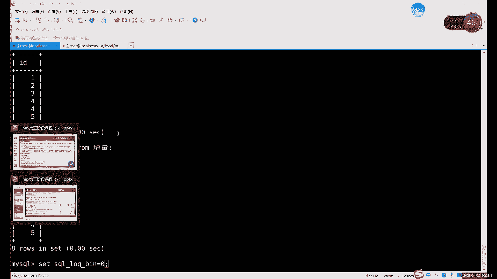

啊，哪天坏了，你就根本就恢复过来。对吧你比如说你一个月前做了个全量备份，然后呢，增量备份了一个月，然后出现了一点问题。你即使是一天做一次增量，那你得恢复30个文件，对吧？所以说这样肯定是不合理的。

我们一般就是你比如说一周，如果说一周做一次增量的话，对吧？你说出了问题，你最多也就恢复几个文件而已啊，很方便嘛。如果文件涉及到太多的话，你用脚本其实容易弄错。😡，啊，弄脚本也可也容易用错。

设置时间不是sel脚本设置啊。对。那个什么文件名字可以用s脚本设置，但是你这个备份的时间不是s脚本，备份的时间是那什么计划任务呀。要这段时间可不是计划下脚本，这是计划任务，对吧？

就是crome type那个计划任务，在计划任务里写个每天几点，对吧？刷新日志。啊，或者说是每天几点刷新日志啊，拷贝日志啊，备份日志是那个计划任务。可以写好命令之后呢。

把下脚本呢放在计划任务里面去电视执行。这个就是我们的增量备份与恢复啊，然后的话下一节课我们就开始讲什么，开始讲这个主从嘛。主从的话，我们还是用什么？还是用二进制值啊。怎么说呢？走不了，哎，走不了。

然后这里的话大家注意要注意，其实GB列的话就是my bin log这个命令啊，m binro这个命令，然后呢。加上这个。开启的位置和关闭就是结束的位置。其他的话倒也没有其他其他没有其他新命令啊。

之前的命令其实我们导入导入的时候已经讲过啊，就是我们上节课讲备份的时候，这个买出个当斧命令也是一样的。啊，命令也是一样的。买scle的主从。买这有的主从的话。不用工不SSASSAH免密不用做啊，不用做。

主从不用做。后边还是会用到的。单纯的主从不用桌明。单纯的主从不用做面。后边讲到高可用的机型的时候，还是需要做的还是需要做的。啊，大家需要注意一下，就是我们接下来呢要说主同同步的话。啊。

当然一开始你两台就够，但是后边的话我们肯定需要三台，对吧？肯定需要三台。有一个很重要的前提就是什么？就是。版本可千万不要。安装版本一定要一样啊，不管说你RPM安装也好，还是亚安装也好。

版本你先保证给我一一样就行啊，一样就行。因为这个。现在5。7版本的话，后边已经出到5。7点40多了。啊，如果用样板装给。用亚麻安装的。用样板装的肯定是40多个版本。那就不能用那版本。啊，装上的话。

你当然你如果用亚麻安装装了40多的版本的话，你原码安装也可以装40多的安装方法是安装方法是一样的啊，装法一样。嗯。克隆不好，也不不不真不建议大家克隆，对吧？这个虚拟机这么说吧，我从来没有克隆过。啊。

为什么没有为什么我我不克隆呢？列这个克隆这个问题啊。有个东西它叫什么？它叫。这个咱们系统里面其实有很多东西都是这有唯一标识图的。你像像这个。像这个什么像。网卡尼个ID。对吧。😊，呃，然后呢卖个地址呢。

对吧？你像这个。很多ID啊啊很多ID它有可能都重都是都是一都一样的。哪都是一样的，一样的话，做时验是会报错的。那不仅仅说是这个实验，那后边有可能其他实验UID1样的话，也会给你报错。

所以说呢这个克隆不太推荐啊，不太推荐我的所有虚拟机，我都是一个一个安装的啊，都是一个一个安装的。我从来没有克隆过。因为这个。克隆怎么说呢？他就克隆你也也就是快点，但是容易报错啊，容易报错。

然后123129128129128。29。然后呢，做之前的话，还有一个就是呃版本相同是一个一个前提。第二前提的话，尽量就是什么呢？就是保持数据一致。保持数据这最好的方法是什么？最好的方法是恢复一些快照。

😊，啊，最好的方法是恢入快到。😊，恢复快照的话。你都恢复到这个刚装好买s狗的时候，其实比较合适。如果没有快照怎么办呢？也也没关系啊，可能有很同学就是没有拍，就买这个快照也也没事啊，这个时候怎么办呢？

就是。😡，一种方法是删掉多余的。另一种方法就是什么？就是。就把你删掉的创把你创建的数据库删掉，或者说这种是一种方法，另一种方法就是。用我们刚讲过的备份和恢复的方法啊，刚才我我们不是刚讲过备份恢复嘛。

对吧？你从这个原第一台备份下来恢复到第二台上。Oh。对吧这也是恢备份和恢复的用法，这就相当于什么？这就相当于手动的同步数据。😡，啊，这就相当于手动同步数据。你你启动一下my circlerl。😡，啊。

启动一下买搜后。嗯，买次我一定要启动啊，你不启动，你怎么连呢？😡，对吧买星一定要启动，在这里恢复一下快照啊，恢复一下快照。😊，我这里恢快照了啊，备份恢复的话，如果说大家啊不想删你的数据啊。

想数据留下来的话，那你就把那个把第一台的啊，你复制下来，你就备份下来，恢复到第二台第三台上，这样也是可以的啊，一定要保证数据是一致的。为什么这么说呢？😊。

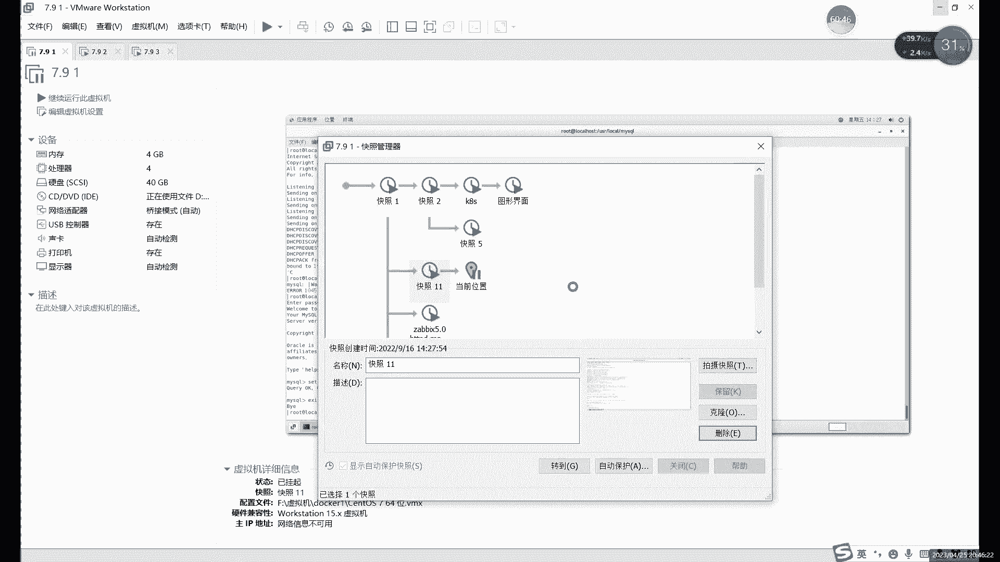

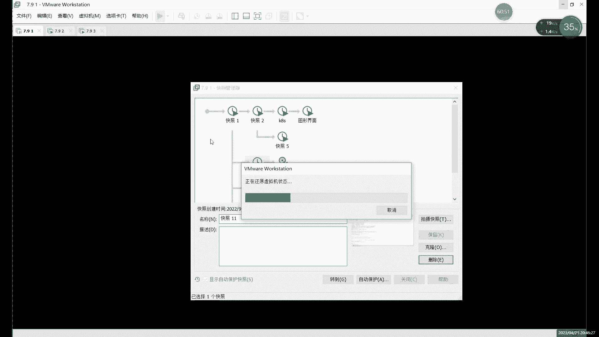

这个主铜同步啊，或者说是主铜复制啊啊，它也是通过我们的二进制制来的。你如果说你第一台和第二台数据它不一样。😡，那你在第一台里边，如果说比如说你说第一台有5个数据库，第二台有4个数据库。

那你如果第一台在操作第一个数据库的时候，同步到第二台，它的所有命令都是会报错的。因为什么？因为它没有那个数据库。😡，所以就也没办法同步啊，这就为什么我要跟大家就保证一定要保证数据一定要一致，数据不一致。

它是没办法同步的。啊，没办法同步的，你要注意这个啊，所以说我这里不是恢复了快照。啊，也相当于这种的话，这种比备份恢复快点啊，比喷复稍微快一点，或就恢复快状嘛。

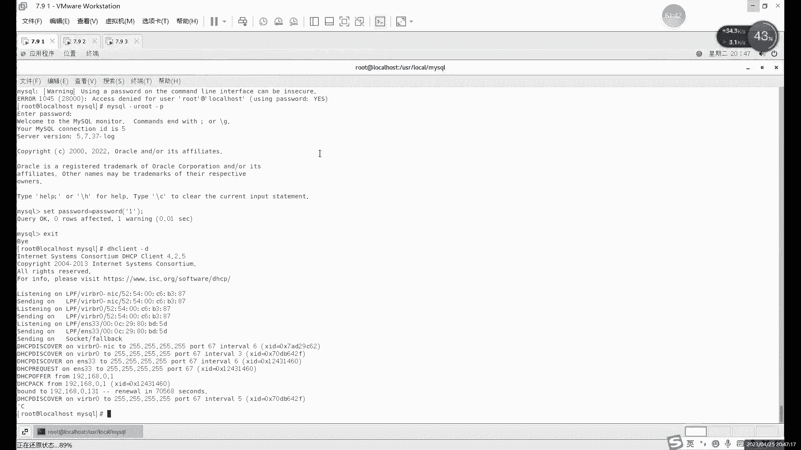

128129131JIP。

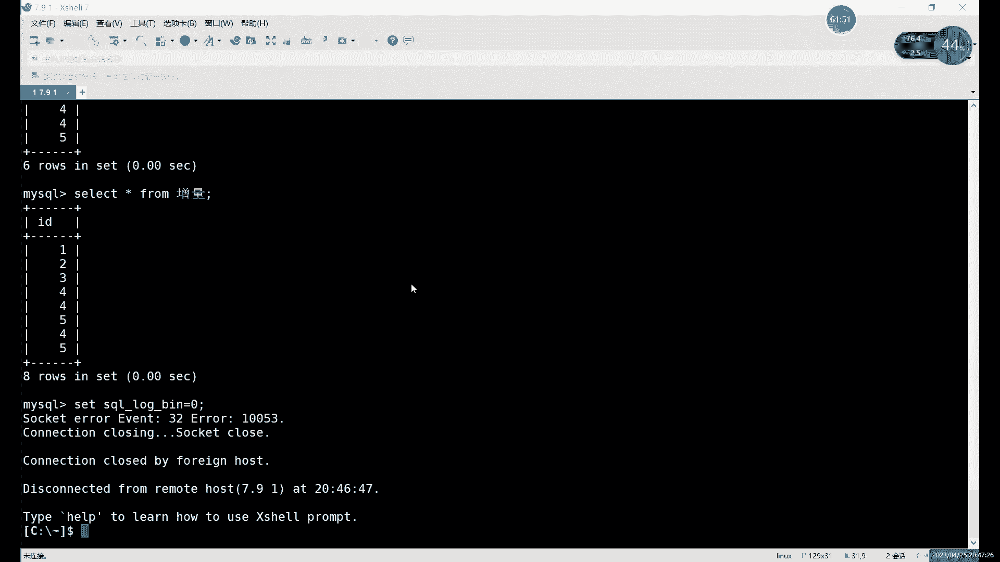

131319是，131129。

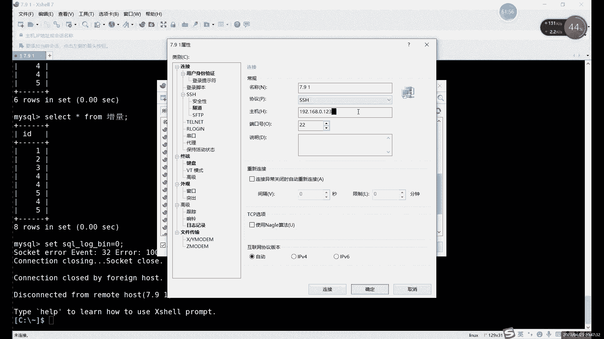

啊，我用。自动获取呢就是完就是单纯的是防单纯的是防止这个IP重合，大家还是用静态的啊，当还是用静态的。我这里就是我不能配静态，我配静态容易冲突。

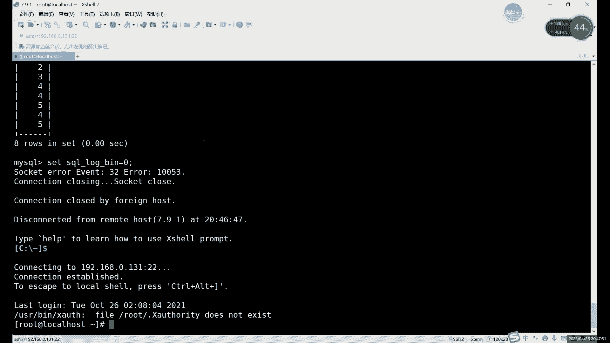

因为。机构里边都是一个网段，都是零网段IP多了，确实容易重复。每次做实验的时候，我就要站着，我要占我要占上我这个wifi的三个网段啊，甚至4个、5个、6个，不然我最多能占到7个网，7个，这不是不是网段。

7个IP啊，我能占7个IP。啊，所以说用DACP的肯定不会冲突，因为它相当于是向这个服务向路由器请求IP嘛，所以说肯定是不会冲突的。如果手动配的话，如果说已经有人用了这个IP那那就。嗯，那你肯定会冲突。

冲突就不能用了。

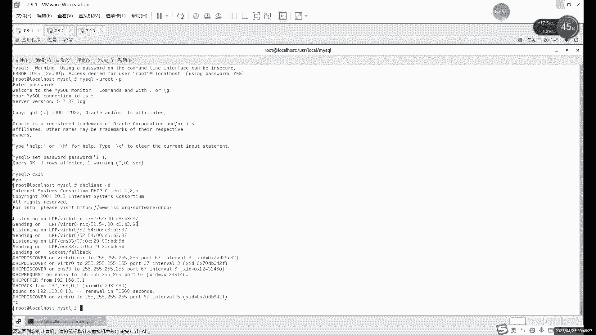

，31131和129对这边129。我就大家如果是在家里的话，很方便，你就配个固定的IP啊，我这里是真确实不能配固定IP。NAT啊，我知道NAT我的电脑NAT和NAT模式水火不容。好在AT时候。

我知道NAT可以配固定，但是我对电脑NAT不好使。我也想用NAT，但是我这个电脑就是NAT。第一天可以，第二天上线就不行。啊，重启一下，有可能可以，有可能还是会报数这个东西。呃。

这个时话第一排我们就要主部吧。啊，主库这个是0点。131。啊，第二台我们就重复。嗯。你这个报错不是没启动，你这个报错是密码。密码问题。你之前怎么处理，你再用再用之前的方法处理就行。

我知道你经常遇到这种问题啊，129。嗯，129的这个缩小一点少一啊值。1615。15啊。啊，这是两台。啊，10。1290。131啊，这是一个主库，一个存库，我们先不着急用三台。

我们先来简简单简单来说一下这个主动复质啊，我们先来说主动复质。对，再免密再进去改密码吧。这个。两台对吧？两台主从这里的话，首先我们先来介绍一下主铜嘛，我们先不着急做啊，我们不着急做实验啊。

这个其实主从这里这个理论还是比较重要的。

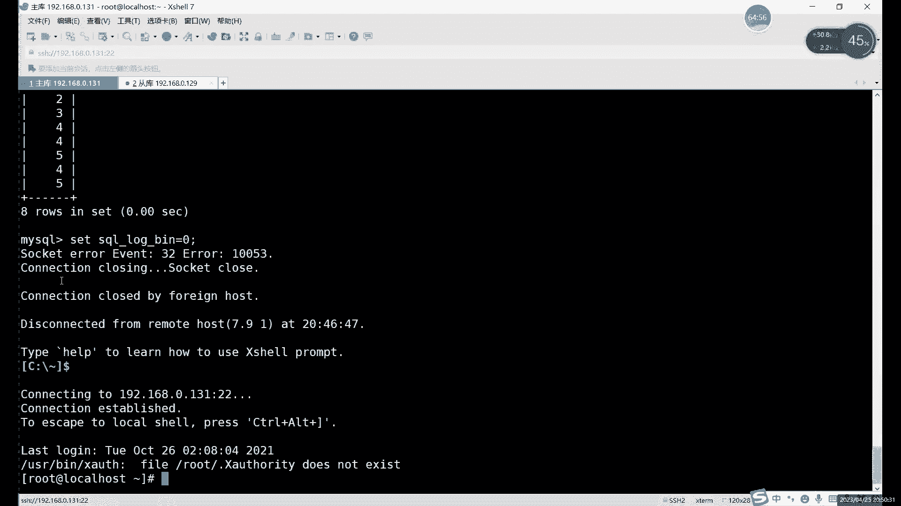

为什么呢？就是呃有一些面试确实偶尔会问到这个什问。就是主从它的原理是什么？就是买搜狗同步数据哎，主动同步它的原理是啥？你即使是不理解，你也得技住啊。😡，啊，这个东西那最好还是先理解啊，最好还是先理解。

理解之后你能描述出来啊，最好能描述出来。首先的话。靠的是什么呢？如果说一句话来概括主虫同步的原理就是二进制日制啊，一句话就是二进制日制。就是我们刚才备份的时候用的。为什么备份的时候用的日志。

我们还这里还能做这个同步呢，对吧？其实道理是一样的。我刚才不是说了嘛，就是。你把第一台的导出再导入，对吧？这算这也算同步嘛，就算手动同步，这就不是我们自动同步了。这个主动同步我们是自动的啊，全自动啊。

不需要我们去操作。然后这里的话这个主龙同步呢啊首先原理对吧？二进制日制。二级支制的话在我们的主从里面，其实是相当于起到一个。桥梁的作用。连接两台什么呢？连接两台数据库。因为什么？因为其实你同步数据。

首先对吧？你得让我们的主库对吧？把数据给到同库，那怎么给他呢？我插入一条命令，给你一条命令吗？啊，这样肯定不太合适。😡，对吧这样其实不太合适。啊，正常我们这个在主动复制里边。

它怎么实现这个两个库的连接呢？就是通过这个二进制日制。前提是一定要开啊一定要开。开了二级制日志之后呢，我们主库执行一条命令，是不是会写入到这个日志里边，对不对啊？我们刚才也看了，我们备份的时候。

其实已经演示了。主库写一条认志就写一条。日志写一条。😡，这个二进制啊，banary就二进制制啊，banary log就二进制日制。二进制制写一条，我们就会同步到哪呢，同步到右边。

当然也不是直接同步给同库啊，直接同步给同铺稍微显得有点草率。我们怎怎么做呢？它是。他这有了数据之后呢，我们是将数据呢给到啊，我们这里有一个。做主铜的话，我们会开一个读写的进程。啊，读取数据读取数据。

写入数据的这个进程。它这个进成之后的话，我们的同库这里读取到我们二进制志之中的新的内容，然后呢写入到自己的终极日志里面啊。这个relaylog的话，终极日志就是存放这个。主库这边的执行命令的信息的啊。

终极日志也是一个日志啊，相当于是把这个二进制日制啊，就是把主库这边的二进制日制里面内容呢写到我们自己的这个哎终极日志里，然后呢执行，然后直接执行到我们的同库里啊，这是同步的过程。啊。

这就是我们同步的过程。所以说二进制制在我们这个里面是非常重要的环节啊，或者说最重要的环节其实也可以。啊，就是我们主库写入到二进制日里边，然后呢，从库呢需要从二进制里面去什么去读取数据。啊，去读取数据。

所以说呢二进制呢其实就是我们主从复制里边这个核心的一个原理。啊，它就是核心。一句话的话就是二进制制。详细来说呢啊那你就至少分三点了嘛啊至少分三分三点。第三点的话。首先第一的话就是主库将自己的改变的记录。

包括什么？包括增删改三种，对吧？写到二进制日志当中。结束之后的话，我们从库呢将二进制日志里边的这个信息呢，就是刚刚执行的命令拷贝到自己的终日日志里，这是第二步。

第三步呢就是我们从库呢从终进日志中获取命令，直接把命令，相当于直接给命令复制到自己的数据库里面就完成。啊这个就是我们二就是我们主动同步。这边的一个过程。啊，主动同步这边的过程。同步好之后的话。

就是我们这边这三步执行完之后，那重库和主库这边的数据就一样了啊就一样了。然后呢，只要重库每执行一个命令，我们重库就主库每执行一次，重库就执行一个，应该叫主库那边写一个命令，我们重复写一个命令。

就相当于就是。你只要这边你你只要这边你一写入，我们重复立马执行。啊，就是主动同步。如同步用到的工具的话啊，或者说用到命令吧，也可以，就是replication啊。

replication的话就是我们这个主要的一个核心啊核心。这里的话是这个什么？是这个。它呢其实就是将我们数据从一台数据库复制到另一台数据库的一个主要的一个内容啊。

replication我们后边命令的话也会用到。啊，命令就是我们执行这个主动复制啊，主动同步这个命令的时候，也会用到这个replication啊replication。总体的步骤就是这个啊。

总体我们的过程的话就是这样的。然后执行起来的话，首先因为注意事项是比较多的。😊，这个话就不像我们前面的几节课，对吧？前面几节课我们其实你想其实执金命令你想怎么执行，怎么执行。只要你与法对，对吧？

你想怎么改怎么改。啊，因为我们只是一些普通的命令嘛啊只是一些命令。但是呢涉及到我们这个主动同步的时候呢，我们不就不能那么草率了啊，我们不能那么草率。主动这边的话呢，因为限制比较多我刚才其实也说了，对吧？

刚才说的其实只是两个点，对吧？两个点需要大家提前准备的两个点，就是一呢就是版本一样，对吧？第二的话就是数据一样，这是其中两个点。因为这个主动互制呢，你看啊，比如说我们正常的话。从它里边复制数据到他这里。

对吧？你的原数据肯定要一样，你不一样的话，只要是有一点它执行了一个多余的数据啊，就就是一个多出来的数据的话，第二个库的话就没办法执行。对吧就像我刚才说的，他5个库，他四个库，那样肯定不能同步啊。

所以说呢前前提前提的话，他们这两个库之间的数据一定要一致。啊，一致之后呢。还有几个条件啊，我们先把条件说完，我们再再做这个主动复制啊，条件一定要提前说好。因为什么？因为后边这个买思购主动同步呢。

大家一定会报错的啊，报错的数量。可能不亚于安装mysl啊，这个报错数量可能不亚于mysql。按照往期今验来说。啊啊买思这边我们一般我我一般讲课是讲九节课啊，现在的话是第。但是第几页来呢？啊。

现在是第七节啊，一般讲九节。啊，多一点可以能讲紧结伴啊。这里的话这个前提的话先大家说一下，对吧？版本一直跟才说了，对吧？另一个就是数据一直也说了，还有还有好几个呢啊还有好几个呢。这做主同同步不了数据呢。

😡，80%的情况都是这个。啊，80%是这个情况。就是你主户重复数据不一致。就是我们这个买头主从啊，我们大家注意啊，就是同步它从什么开始同步呢？就是你主从生效之后呢，你执行的命令它才会同步。

你如果说开始它的命令就不一样，就开始它的数据不一样。😡，就是开始的时候，他他5个库，他四个库，就是这个是没办法同步的。这个需要你手动去同步。这个它因为它这里呢只能同步二进制制之开启之后。

就二进制制连接之后的命。就之前的呢之前的日志内容能不能同步，它不能同步。啊，大家注意就是它只会同步连接好之后的这个就是主从连上之后开始的这些改变的命令，它才会能同步之前的那些数据需要我们手动去啊。

其实一般如果说你做好同步，如果说两y，如果说都是yes了，但是还不能同步的话，一般就是数据不一致的问题。用户权限其实不太影响，因为用户权限虽然说属于这个。啊，优户权限其实不影响。用户权限影响不大。

主要还是这个元术语吧。然后呢，如果不同步以前的不行，为什么呢？因为啊当然除了这个用户的啊，就是买servcle我们里面不是有用户嘛？用户这个不同步，但是也可以，这个不同步也无所谓啊。因为这个。

本来你不同的数据库之间有不同用户也正常，所以说这个可以不同步。但其他的像那些我们自己创建的一些库，对吧？就除了系统里面默认的字库以外呢，其他的库肯定是一定要同步的。你不同步，你一一执行命令就报错了。啊。

一定要同步之前的啊。权限其实影响不大啊，我们这里的话只要满足这6个条件，其实一般就可以啊，基本上我想不出来第七个了权限。没在前提条件里面，权限一般不在前提条件里面。你看这里话版本一致，出数据一致。

我说过了，对吧？然后呢就是开启bin量的，就是主库要开。重户就可以不开啊，不可以不开。那你想开也行啊，想开也可以。不影响啊，就是主库一定要开从库随意啊开启二进制日志。第三的话。

搜索ID这个骚维搜索 IDD是啥呢？😡，这个搜 IDD呢就是我刚才就是说了，你不要克隆，克隆呢这种ID就会重复，这个也是1个ID啊，这个也是1个ID。如果说你把第一个克隆换到第二个，这别说那个网卡啊。

麦克地址那些买scle都不同意。啊，买s我们也是有这个VEID的有很多服务的话它。啊，也不是说很多服务吧，有有一部分服务不能说很多，只有一部分一半有一部分服务的话，它都会有这种ID的限制。

像这个买s他就有。ID呢不能不能一样。妈你要做好第一个，你复制一份，ID肯定是一样的，满足我这里就就会报错，先不用说你系统里面其他的服务了。啊，色 IDD呢一定要不一样，具体是啥呢？

就这个是完全自定义的。1234567，你随便写。啊，只要是一个局域网之内不要重复就行。或者说是呃不能说一个局用，就是一个集群里面，一个买搜的集群里面不要重复就行。啊，注意这个。

第四个的话就是同库能连通主库，这个什么意思呢？就是能访问。

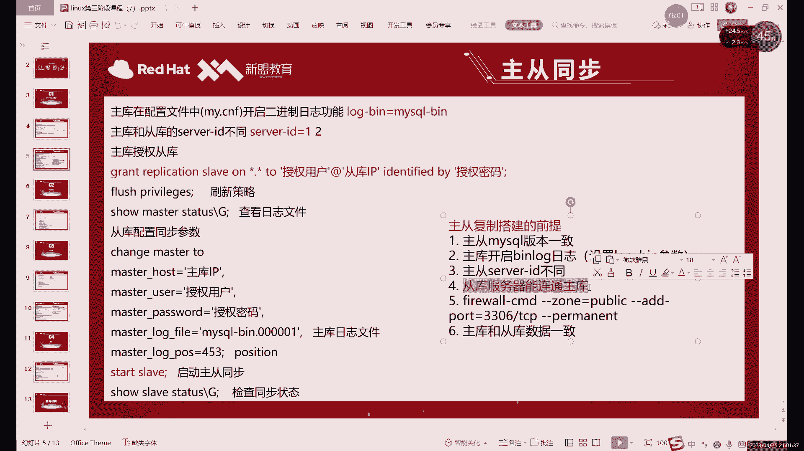

这个就涉及到我们前面讲过的第三种servrcle语句，对吧？大家记得是什么？就是。那个叫。那叫什么来着？授权对授权。就授权我们这里需要做啊，不知道大家还记不记得命啊，授权。就是主户一定要给同户授权。

这是第第四个。第五个的话就是防火墙问题。啊，好想。

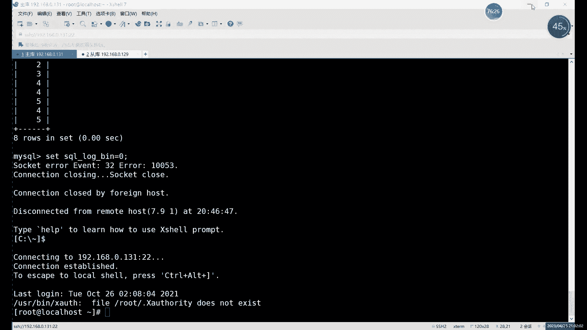

我。偶尔也会报错啊，我作为我做主从也会报错，我一般报错是哪个呢？我一般报错就是这个原因。😡，啊，为什么我把这个把下课的提示的这个符号这里，我会写个光防火墙，因为我老是忘记光防火墙。啊。

这个东西怎么说防火墙这个事儿啊。对吧。房产这个东西。但不是说一定要关啊。😡，关是一种解决方法，另一种方法就是开启336端口，像这种。啊，diable是吧？呃，这不是disable的问题。

是主要是我快照里面。因为我经常输入快照嘛，快照里面没有开。但是我也不能删了快照再重新拍，因为我。最开始的快照生出来好多个快照，你如果删一个的话，其实也没用。所以这个东西的话，我就只能说自己记的很直观吧。

然我老是记不住，所以说我就写在了那个。下课那个提示的那个文档里面，每天看。对吧就基本上还能养成个习惯。哇，这个真真的。我之前讲课的时候也会报错，但是每次每次报错一般就是什么，一般就是防。

其他的基本上没啥事，就是防火墙。防火墙只要我故意不关，他就报错。😡，么呢。也年也是年纪大。你那记性不好，记性不好。啊，就这几个条件，对吧？看起来多，其实也没啥，你就注意好。

只要把这6个条件你确保okK了。那基本上你的主从就已经做好了。啊，因为这些的话其实也就是我们设置的一些命令。你只要把这些全部做好的话，基本上主同学已经做完了。啊。已经做完了。

就是说首先的话我们就来看你们啊，首先我们就开始，我们接下来就开始啊，开始做这个这种。然后呢，这个首先第一版本我们能确保一致吗？肯定是一致的。因为我全部都是原码安装同一个包，所以说这个没问题。第六点。

主库数主库存库数据一致，我这里都是恢复什么呢？我这里都恢复了这个最原始的快照，就是刚装好数据库，对吧？这是刚装好数据库的。每一个都是啊。每个都是刚装好出怀疑我去这等一下。这有点问题啊。会有点问题。

我突然发现。第二个库有点不太对啊，第二个库好像把一个。

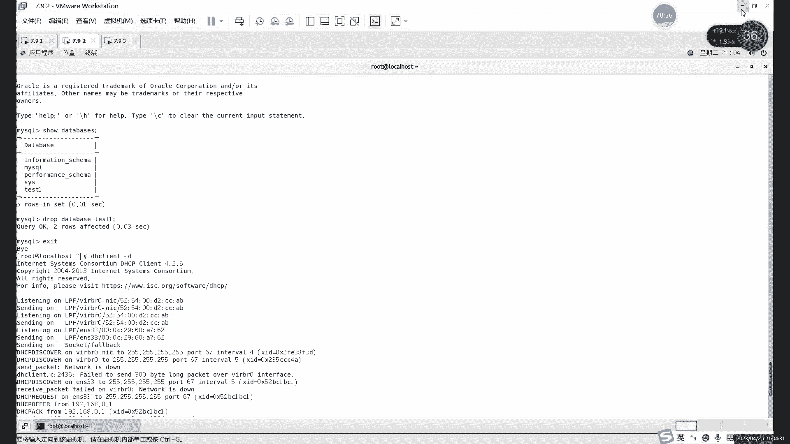

奇怪的东西拍在拍照里。买头杠Uro杠P。啊，没事啊。啊，那应该是删掉之后又拍了有拍照，那没事。啊。其实你看的话主要是看什么，主要看你有没有多余的库啊，因为系统里面库的话，基本上我们不会改的。

所以说呢数据数数据默认是一样的。嗯，系统系统库的话，其实除了。呃，系统库其实除了这个。除了买servbook以外，其他三个不常改买servbook里边，我最多也就改那个user表user嘛。

user那个不同步也行。因为你不同的数据库有不同用户也正常，对吧？你没必要非要把用户的都给同步了。😡，影想同步也行啊，行，想同步倒也可以。这里一般情况下，你没有多余的货就正常就可以了，就可以做主通。啊。

他们四个。其实表格一样，其实就行啊。后边你插什么数据的话，其实也可能后边也能同步了啊也能同步了。啊，现在确保什么确保现在第一条第六条没问题了，对吧？现在我先做第五条，我怕一会儿忘了啊，我先做第五条啊。

😡，我快照里面都是没拍。FIRE。啊，不对，FIRE。啊，关一下。嗯，slink那个其实myscle那个不会关，那个不会拦mycircle的，所以说不关也行的。但是呢你如果说从现在开始养成习惯的话。

其实你关一下也行。因为后边的服务的话，你不关它是会拦的。myscle的话，就是slinks这个的话，他不会拿买scle，但是会拦其他的后边的一些服务。当这个只是临时关闭啊，只是临时关，你要永久关的话。

你改配置文件。来，配置文件就行了。啊，这一步的话其实跟买这的没什么太大关系，因为他。ux不会设不会限制买dego。然后现在1156完成了对吧？那我现在主要就是工作就是做二，其实也有了，对吧？

2我们之前不是做日志嘛，对吧？之前不是日志做备份嘛。做备份的话，其实我们都谜没一开，因为默认就有。所以说第二点呢其实也O了，对吧？也OK了。现在的话我们看第三点。第三点的话就是主从的serv IDD。

这个的话大家一定要改一下啊，因为什么？因为如果说都用都用我那种方法安装的话，尤其是源码安装4法ID它是一样的。他倒也不是克隆的问题，也不是说克隆的问题，是因为那个配置文件里面都是搜索ID等于一。

不知道大家注意过没有。就是复制那里。

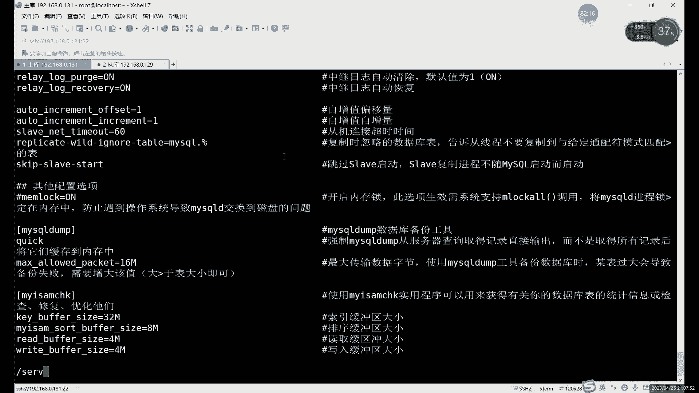

啊，就是复置配置选项，对吧？就是主动复制的意思。在YD等于一对吧？所有的都是。

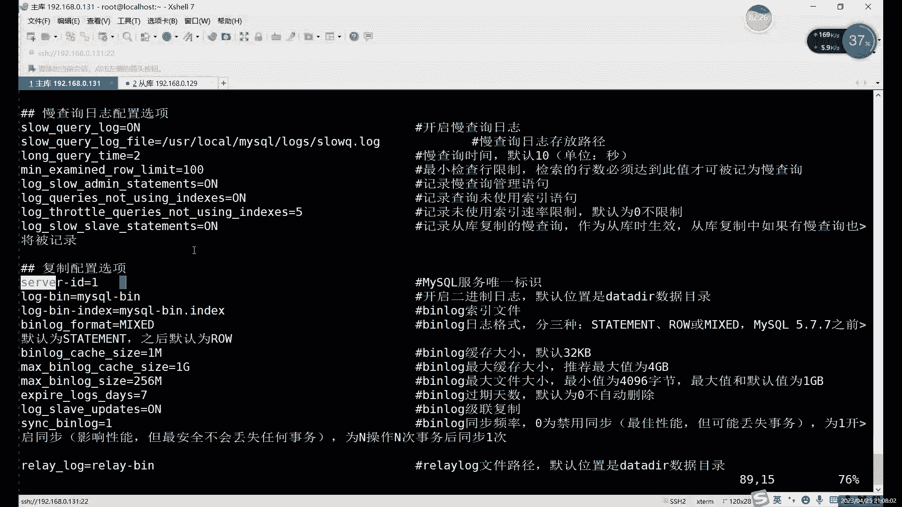

🎼这个东西。你可以在创建的时候改，自己改一下，你创建不改的话，你这里容易出问题啊。user下楼下的买ficle里面的一T自驾的麦3。呃，也是一样。他这联你。啊，定位统因配置文件都一样啊。

配置文件是一个配置文件。所以说注意一下这里啊，比如说这里改成二就行。😊，呃，防火墙不是说一定要关，就是你得放行这个330的端口。不过后边的服务也是一样的。防火墙不一定要关，但是一定要开端口。

你不想开打那么长的开端口命令，那你就官换下。两个选择二选一啊二选一。那这里的话自己要把ID改成不一样的。如果这里一样的话，后边主从复制一定会报错啊一定会报错的。啊，改完之后呢，记得重启一下。

不重启不会生效啊。啊，这边重启一下数据库。统计好之后呢，现在第三点也完成啊，不是第二点啊，第二点也完成。好，接下来是第三点。哎，不是第三点完了。第四点啊第四点从物联通储库。同过联盟主库靠的是什么？

靠的是授权。对吧授权命令大家还记得吗？啊，国re命令对吧？😡，我我我刚刚啥也没说呀，我刚刚说的就是色路 IDD一定要不一样就行啊，色路 ID一定要不一样。😡，这边重启好之后的话，接下来呢就是这个。

第第四步对吧？第四步第四步，这个重库联通主库就授权啊，授权命令写在这儿。啊，防火墙不关也行，防火墙不关的话就换行张口，就是这个命令嘛，不是写在这儿了吗？啊，PT里边有后边可以，这个就是不关方墙的做法。

官方墙就是sstteem。control stock fire。不关的话就这个。然后的话授权这里啊我们可以看一下这个授权的话和我们之前的授权呢嗯怎么说呢？主从的授权的话和刚才授予所有权限其他不一样。哎。

grant replication slaveve对吧？之前我们写的是or，对吧？or的话指的是自有权限啊，我们主动授权的话，它这个名字叫replication，加上slave。啊。

Replication thats live。这个就是那个什么，这个就是主同同步的一个关键词吧。你可以理。啊。然后后边的当然就和之前所说的一样啊，后边和之前说的一样。你看像。layve2。

然后后边呢二后边加上数据库和数据表。这里具体同步哪些呢？😡，一下系统库你其实是可以不同步的。啊，系统库是可以不同步的。这个。不强求，因为系统库里面其实它只是存放的是我们本地这个数据库的一些数据。

所以说呢系统库可以不同步。你只可以说只同步一个什么，可以只同步一个你的数据库。哎，好像说了跟没说似的啊，这个数据库我指的是什么？就是。😊，你后边自己创建的一些库，对吧？

就比如说我应该之前都让大家用自己名字创建的库，对吧？就是这个库。我们可以直接把这一个库写在这里，就是你主动同步的时候，不一定要非要同步整个数据库啊。就是因为系统里边这几个库呢。

它里面放的其实也并不是说就并不是说实际的业务的数据，对吧？它里面放的只是一些系统设置。啊，它里边只放系统设置。所以说呢这里的话大家注意就是。可以指同步我们的真正存放数据的那个库啊，但是现在我们没有。

所以就用新点新了，有的话也可以直接指定啊。我这里现在因为是没有数据库。然后to啊授权用户加上重库的IP重库IP啊，这以大家注意重库的IP不要写locgoho了。之前我们是写locgo host对吧？

locgo后那就是。本地啊允许本地的用户登录了。这里的话我们是授权用户，然后加上同户的IP啊，就允许同户去访问嘛。对吧就是这个，然后后边的话identified by就是授权密码就不用多说了，是吧？

你写什么都行，那，无所谓。然后这里的话这条命令的话。其实就除了前面的replication类我没见过以外，其实前端其实其他的后边大家都已经大家都已经挑过了，对吧啊。嗯。

然后接下来的话我们就来具体的执行一下这个命令啊，大家注意这个命令是在哪执行的？就在。主库上执行啊，从库呢不需要啊同库不需要，因为相当于什么？因为就相当于是主库呢授权给同库，授权给同库访问啊。

当然不在这里准确说不是访问啊，就是。授权给从库去什么呢？去做这个主从，对吧？所以说呢我们这里这个。只需要在哪只需要在主故障执行就可以啊。重库上不用执行啊，重复不用执行。然后这里我看一下嗯有库。

嗯就入库吧。王永强已经关了。防火墙不关的话，不会拦截那个330的端口。就是你这里即使授权了，你防火墙一拦截，你这个授权根本就过不去的啊，授权是过不去的。啊，所以说这里的话我们先授权啊先授权。啊。

方箱关了之后授权啊。呃，大家就是怎么说呢？尽量就是你平时群里发消息的时候可以发图片，你这个上课就不要发图片了，上课图片我可能收不到。上个图片基本都裂开啊，上个图片基本都裂开，你发告错的信息吧。

或者说什么的。fire word意思那让你就是防火墙没开呗，防火墙没开，防火圈没开，你就不用设置策略了。啊，那个策略是防火箱开了的策略。防火墙如果已经关了的话，其实它就不会拦截端口了。那那你就。

那个无所谓啊，那就不用，那就不用设置那个。看我现在是这个同步这个主库，对吧？我们先进入到主库里面去修改这个授权了啊，修改授权。啊，成功就可以嘛，对吧？success就成功了呗，就你设置个策略成功。

就是放行了30端口了嘛，这个不就正确了吗？你如果有不认识的，你可以翻译一下，对吧？你就下载个翻译的软件，对吧？你执行命令，有时候有时候他执行命令的一个返回信息的话，它不一定是报错了，有可能是什么？

它有可能是这个正确的一些信息对吧？正确信息它有可能也会返回。啊，这个就。啊，无奈你这的图片可以重发一下，可以重发一下，我这里看不到啊。Yeah。然后这的话我们先授权，对吧？我们先授权了。Grant。嗯。

今接replication吧。其实呢这个on呢我们之前不是用的all嘛，对吧？之前的al呢其实是所有权限，对吧？那replication属不属于一个权限呢？它也属它只是主从复制的一个权限。

所以说呢这里的话你如果是只是要主同复制的话，那就是recation slaveve。如果说你想要给他所有权限用二也行，因为二的话里面是包括这个组同的权限的。啊，二是包括这个组宗权限。啊。

所以说这个的话就是什么？这个就是嗯这个的话你可以写啊，你不想记这么长的话，也可以写啊。但是用二的话，你相当于授理所有权限啊，就不只只是一个主从了啊，不止一个主从了。

所以说一定要注意这个这个问注意这个问题啊，注意这个问题。😊，Okay。

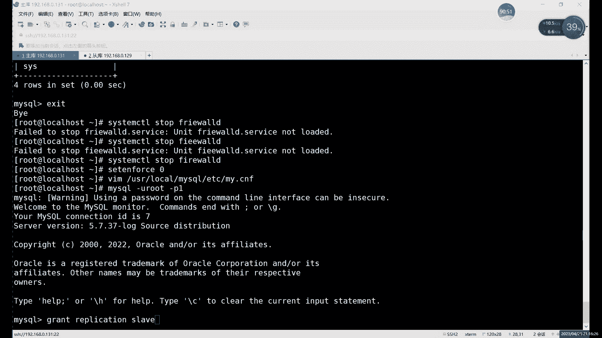

你这写的是啥？做ID一台V一台V2。哦，忽略某个数据库是吧？日志文件名字作为被部添加的内容。

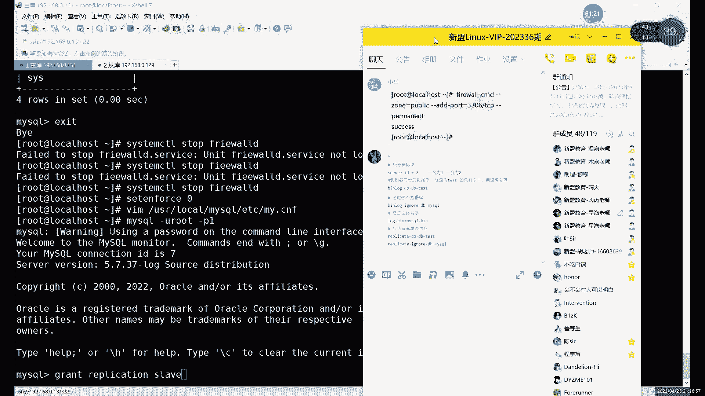

其没必要写这么多啊，如果说你是只是要指定这个某一个库不访问，或者说是呃某些库。访问的话其实没问题啊其实没问题。然后呢，grrant后边我们接继续往下说，对吧？嗯，这里的话可以用二来代替啊。

replication类可以用二来代替。二的话，就包括所有的其实包括这个主从的啊，包括这个主铜的。然后边的话我们就加上具体的啊加上具体的库。然后呢，这个配置这个配置没问题啊，这个配置没问题。嗯。

我看一下。进来的话就是首先就是奥啊。为什么无奈你你刚才发那个配置没有问题啊，配置没问题，就是你指定的时候。其实也不用这么指定，你这样指定其实有点麻烦。😡，如果说只要只要同步优库的话，也可以在这里写。

对吧？test点儿信号。你写配置文件里大家也可以啊。如果是这样写的话也行。啊，当然如果说你只是同步一个库的话，可以写在配置文件里那样写。2点2t点新，对吧？这这就是一个库。当然我现在如果没有库的话。

那就什么就是新点星是吧？我这里因为我这里没有库啊，所以说用星点星嘛。然后呢，to对吧？后后面加上用户名和密码，用户的话其实无所谓啊，你用哪个用户都行啊。用户只要你随便写一个都行，没有都无所谓的。

因为grant我们可以自动创建用户的。然后后边呢加什么？后边加上这个。192。168。0点。129。然后这个0。19的话，就是我们后面这台重复是吧？授予这台重复的权限。

然后identified by就可以了。啊，无所谓，这个其实简单点吧啊一吧。grant reputationplication slave啊1点进 two对吧？这个就是授权的一个权限。这个就是怎么说？

这个是主从的授权啊。帮点少先。出现之后呢，怎么验证呢？很简单，你就是用同复连一下。啊一个分过去连一下。用头库联的话，其实这个主要验证的是什么？验证的一般也不是授权，授权一般没什么问题。

主要咱们验证的是这个。开没开光我墙。因为你因为这个如果说连不上的话，需要先检查防火墙啊，先检查防火墙，再检查授权的语句啊。杠H192。168。0。131。这个命令话就是什么？就远程连接其他数据库。

就是在我们第二台上，如果想连第一台行行，可以，就是my go杠Uroot杠P。这里就是大家注意这里是授权那个密码，也不是说是他原来的密码，就是你授权的是什么就用什么啊，授权的是root用户一的密码。

对吧？那你就写入t一。如果说你这里授权了123，那你就你就得写123，好吧。这里的话我们正常用连接一下啊，能连上大家都可以了，能连上了，能连上那就没问题，可以退了。啊，退出说明什么，说明我们的D。

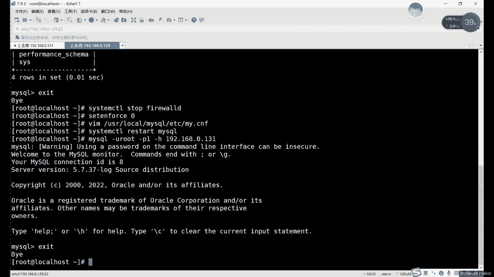

123。4。4。第四条也成功，对吧？那1到6就全部完成了，对吧？完成了。1到6全部完成之后的话，我们就接下来进进入最后一步啊，这个是前提啊，大家注意啊，我1到6只是前提还没完啊还没完。

然后下一步的话我们用什么呢？下一步的话就是最后这个change master to啊，chan master to。然后呢，这里的同库啊，同库配置同步的参数。就这这这几部分啊这几部分。

这一部分总整准比如说就是。完整的来说吧，其实。

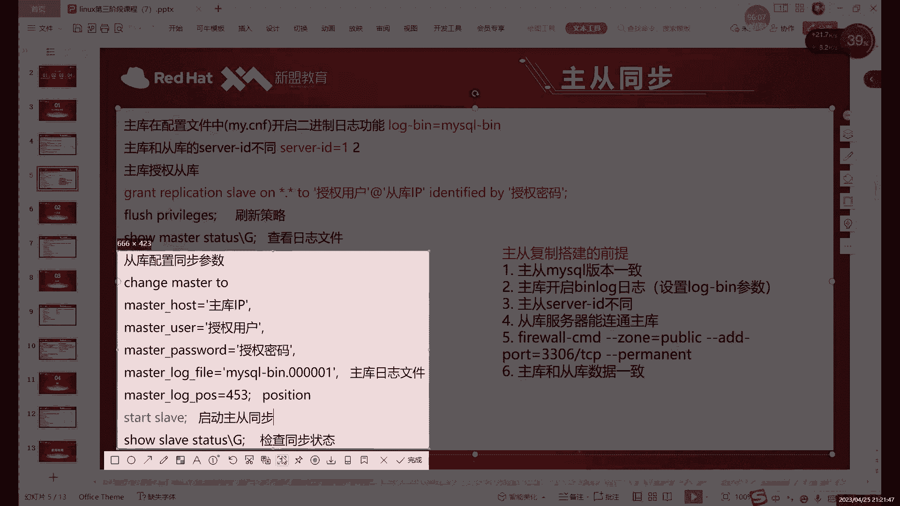

他就是在从库上指定什么，指定主库的一些参数。因为什么？因为首先呢我们这里授权是可以，对吧？就是重户可以连组户了。啊，可以连不够，对吧？可以连也不够啊，最主要还有什么？还需要这个。能够真正访问到什么？

主要是访问到二进制的文件。啊，二进制文件。比如说这里的话，我们首先就是my circlercle杠等一下啊，这里授权我们说过了对吧？刚刚授权啊，授权授过的话。上how masters slave。

啊不 status啊。🎼我们查看一下这个我们当前的这个日志啊，这一个位置。啊，这个s master status就是查看什么？查看我们主库的一个状态。啊，查看我们主户的状态。

相当于是大家也不能说主户状态，就是查看我们当前的就是日志啊，日志的一个位置。哎，准确来说是这样啊，就show master status啊，这个命令的话就是用来看一下我们这个二进制日志现在在哪，对吧？

用的是02的日志，然后位置呢是693，对吧？位置是693，然后呢，这个其实我们一会要用到的啊，用到呢。😊，我们一会儿连接要用啊，我给了把它记一下。啊，把它放在这儿。啊，6个993，然后呢。

我们同库呢怎么去连呢？同库连的话，你先进数据库里边。进去之后呢，直接用chningma指定。指定一下我们这个主库的这边的信息。日志的话不需不需要啊，日志这个不需要resit，因为。啊。

你想一下re想re也行啊，这个这个倒不影响。因为我们这里指定了之后呢，相当于是我们同步呢，从这个位置开始才从同步之前的。不管啊，之前呢还是不管，所以说这个位置呢可以不用resite啊。

这里可以不用resite。你想re也行，reser之后的话，它就是01，然后呢，这个数字会比较小一点，这不影响的啊，这个相当于是我们这个存库从这个位置开始才同步啊，就这个意思。

指定一下同步开始的一个位置吧。对吧我们来看一下这个。啊，这样打的话，只是相当于好看一点啊，好看一点。192点192。168。0。多少呢？131是我们主库的IP啊，这里主库指定主库IP。

然后下一个呢是什么呢？下一个是。host等于用户啊授权用户。我们这里当然用了root。你用其他用户也行。这个授权谁都可以啊，这个不影响。授权这个用户的话，他没有什么，我是不是拿着打错？😡，啊，对。

是的说。HANZ样。什么other two。master host等于。192。168。0。131。master杠user。等于root。下一个是什么？下一个是密码啊。前面都是master开头的。

然后后边下划线，加上你这个对应的这个。信息对吧？密码我们就是一很简单啊很。下一个是。啊，下一个就比较重要了。对我刚才为什么截了个图呢？对吧，就是写这个东西。就是从哪个文件开始同步，从哪个文件开始同步。

然后从这个。哪个位置开始啊，从哪个文件开始，从哪个位置开始。文件名字的话就是买circle，你把那个名字直接写着下，或者你复制也可以啊，000002。数下零一定要够啊，这里名字一定不能错。

这如果你少个零多个零什么的。他也会报错的他也会报错的，就找不到文件了嘛啊，找不到文件。然后最后一个是master杠。呃，不是这个命令，只是方便大家看。啊，不是说输错了这个。挤来的啊，693对吧？

这是一种写法。这种的话只是方便大家区分这几个不同的这个选项，不是选项嘛？几个参数嘛。啊，区分你不同的参数。你正常来说的话，我是我我平时是这样写的。Master。2。OK是这样写的啊。

这个买sego里面你不敲封号，你敲回车，它就会自动换行。但其实呢它还是一行。2是一毫米米。啊，我平时这样写的，然后后边你。往后跟着走就行了。对吧用道号格开跟着走就行了，不不用这样写。

这样写的话只是方便看。整整正常题命就是一整行走下去。就不挑回车的，中间你挨着挨着写就行。😡，中要逗号隔开就可以，注意逗号啊。每个里面每个参数用逗号隔开就可以。最后用工号结尾。啊。

最后一个它这个不是个字符啊，它不是字符。所以说呢。😊，而且他这个还比较。怎么说呢？比较固定一点，它这个甚至不能容易，它这个甚至。一般其实我们的数字也能用引号，对吧？它这里这个数字都不能用引号的。

大注意这个一定不能用引号。最后一个。他其实这里都不能算是数值了。因为数值其实也可以加以啊，这里是比较特殊的一个点啊。前面四个加引号，最后最后是不能加啊不能加。这个就是position啊。

就是我们刚才那个start positionstar position和stoppeposition那个那个那个那个数字嘛啊。啊，你正常会跟紧和跟着往下往下走就行啊。这里的话授权好授权不是授权。

这个也不能不是不能说授权吧。这个叫什么？这个叫。指定一下我们主库的一些参数。那也就相当于这个是相当于是连接的一个选项了。连接命令的话，我们最后是通过startlay来启动的。然后呢提前配置了这些选项。

对吧？提前配置我们是连哪个连谁，对吧？用户密码是什么，连哪个文件对吧？连哪个文件的位置。哎，连哪个文件的位置？都写完之后呢，start4类的情况。但如果说怕打错的话，你就不要这样写，你就横着写啊。

横着写。因为这样打错确实不能改。😡，啊，这打错不能改的。slaveve。启动啊，这就启动主动同步。启动之后呢，怎么看也是否成功了呢？你可以直接去创建点东西验证一下啊。

但其实其实最好的方法就是直接创建东西去验证。因为这个是最准确的。这个s slave status，它其实不准确。🎼啊，它其实不准确，他这里如果说只是写yes的话，它只是能证明什么。

只是证明你这个设置的没啥大问题啊，这些话主要是eror这里如果有报错的话，这里就有error信息啊。你报错的话，你不要说你就直接来问我，你先看一下报错信息是啥啊，这里报错信息，你看完之后。

你给他翻译一下，你其实你就知道你错哪儿了。这里的报道信息很详细的啊，这里报错息是很详很详细的。😡，你就一一旦你主同失败了，你先看这里是写的啥啊，然后两个页子就是成功了。这里成功呢只是什么？只是连接上。

但是呢你不一定代表你能同步啊啊，真正的同步还是要什么？还是要用主库那边创建点东西啊去验证的。但是大部分情况下呢，一般只要是yes都没问题。那些。他也是当然也有例外啊，也有例外，他这个就比较痛苦了。

如果两个叶子还不能同步的话，这种确实比不太好。哎，不太好弄。比如我们这里呢来创建一个库吧啊，cra database base。create database后边加这个。随便写吧。啊，框建好之后，对吧？

sDATABSES。对吧这边就有了一个新的库，对吧？那我们同步之后呢。就同步生成了，对吧？你只要你这边一创建东西，这边一一有啊，有了之后呢，那说明什么，说明主同组同同步呢就肯定百分百完成了。

但是呢如果说是在第一个第一个库里边有的表，第二库里面本身就没有。然后这种情况下，只是你能主动同步。你也只能就同步其他的数据啊，就是最开始如果说有不一样的那你再怎么他也不可能再同步。啊，除非说什么？

除非说你是在第二个表格里面再创建个和前面一样的。啊，这样的话也可以也可以解决。数据库重启之后还能同步吗嗯。重启哪个呢？我重启第一个吧。重新主库啊我重新主的。也从也从。啊。

re start my circle。啊，都重启一下啊，都重启一下。同意之后呢，我们再进到数据库里边啊。然后这边的话，我们直接use这里边我创建个表格吧。P table。然后这边看一下嘛，uss切换到。

嗯。然后呢，我看一下so tables。So。SAT US。slateve。嗯。SAT US。来看一下这边。这边直接断开两个no。状态肯定是挤不开，这个肯定是启动了，启动之后。嗯。看一下start。

我看一start slave。嗯。啊，同新启动之后呢，你再重启一下。就是重新启动一下这个进程。启动也主动同步的进程啊。嗯。像执行点，他这边有重复。啊，这边还是能创建出来。啊，这个你得启动一下什么。

启动一下那个。同意之后需要重新开一下那个什么主动同步这个进程啊，开下这个东西。就可以。他要进行的话，可以继续同步吧。主库那边无所谓，主库那边不用操作，因为主库的话，它相当于是个被动的。啊。

相当于是个被动的一个。被动的状态啊被动状态。我执行命令的话就这些嘛啊就这些，就PPT上面这些嘛，我其实没多执行其他的，就这些嘛。你需要你最好你记得你这是对应的，你去换啊。

不要抄这个这个不要抄我刚才执行命令其实就这几个嘛。啊，grant test和这些。啊，就这几个面没其他的。好，大家可以下课休息几分钟，大家可以。没装好数据库可以装一装。

装好之后可以看一下这组成能不能能不能做成功，对吧？不成功的话，你截图。可以直接把错截截出来看一看啊，留出来看一。但是我不一定能收到啊，因为这个腾讯会议这个。哎，发图片是真的有点做的不太好。啊。

我们接下来的话继续啊继续往下看啊，就是这个最后这里这里再强调一下，就是不能加引号啊，就是它因为它不是字符，也不是数字啊，它只是一个位置，就是我们日志文件里的一个位置，一个比较特殊的一个。

你比较一个特殊的一个存在嘛，它不不也不是数据，对吧？啊，所以说这里是不能加引号的，不能加引号。Okay。然后的话我们继续往下看啊，接下来继续往下看。😊，对吧刚才其实已经连接上，对吧？就两个y。

这边两个叶子就没问题啊，两个叶子就没问题。两页子之后的话，其实这边就可以正常的嘛，可以正常连接了。啊，两边是可以正常连的。啊，连上之后的话，左边不管是执行什么命令，对吧？右边就可以同步执行啊。

右边可以同步执行。啊，唯一问题就是呃主库这边怎么重启都没事啊，就是储库这边重启的话，重启之后的话，它这个。嗯。就在重启数据库的时候。但是这个在重启输入以后，它就没了嘛啊，有很多我们在执行在哪呢？

执行在这个命令行里的命令呢，它都相当于是临时的啊，重启之后它就没了。你需要什么？就是重启之后，你再开启一下啊，开启一下。然，这个的话就是我们my头这边的主从啊，my这边的主从。

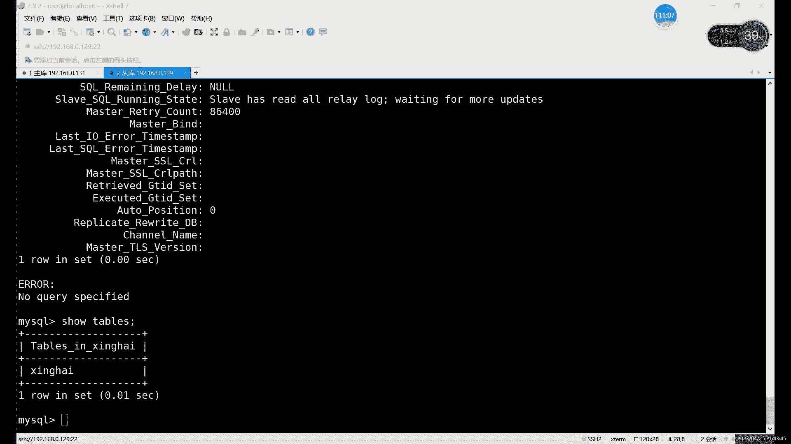

嗯，主从做完之后的话，其实接下来呢我刚才不是说三台嘛，对吧？就是说三台呢啊，正常你一个一组一从的话，两台肯定够，对吧？两台肯定够。接下来的话我们可以说一下怎么说一下这个三台对吧？三台的话，一组多重。

我们这里不延迟了，一组多重就不延示了。因为一组多重的话，它哪唯一的区别就是在授权这里授权这里多授权一个就可以，就多授权1个IP就行了。所以这里我们就不多讲啊。😊，一主多同的话，这个其实。

也和一组一两层是一组一层是一样的。啊，这多个同复字路ID记得还是不要重复就行。然后剩下的话就是在授权这里，授权这里你就可以写啊多个IP就行了啊，多写多写几个IP或者说什么呢？

或者说你直接写一个网段也可以。啊，这里可以直接写一个网网段。Thank。啊，所以说这里的话就是什么？就是我们这个。Yeah。这是一个网段哈，就是比如说可以怎么写的，就写192。168。0。百分号。

它就是一个网段。或者甚至你就再懒一点，你可以直接只写一个百分号，就是存库IP这里可以直接用百分号代替。这是什么意思？就是你只要能拼通就能访问。啊。只要你能拼通，你就能访问。就是这个怎么说呢？

就是肯定没那么安全，但是其实影响也不大。因为除了这个IP以外呢，还有么还有用户密码的授权嘛，对吧？所以这里的话就最简单的可以通过IV直接写一个百分号就可以。百分号在表所有。啊，这个话就是我们的一组一从。

一组多同的话就主要注意一下IP就行。这个我们就不说了，一主一从就不说了。啊，接下来我们来说什么？我们来说黑洞。还大家还记得黑洞吗？啊，我们在做存储引擎的时候，我们一直说了黑洞后面还要用。啊。

后面我们还会用。那就是在我们这个主从这里。从这里的话，我们刚才不是说我自己刚才是跳过了一个什么。😡。

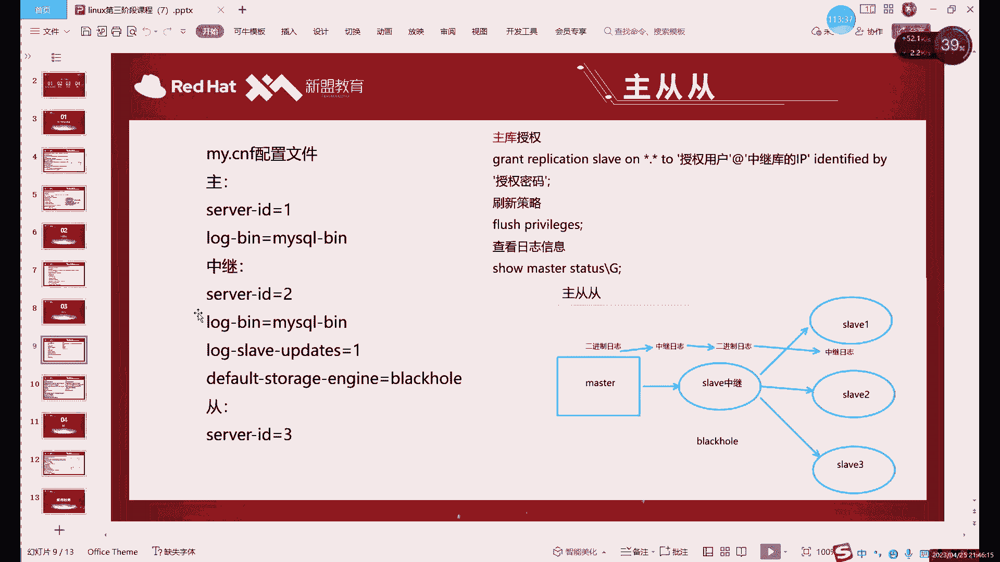