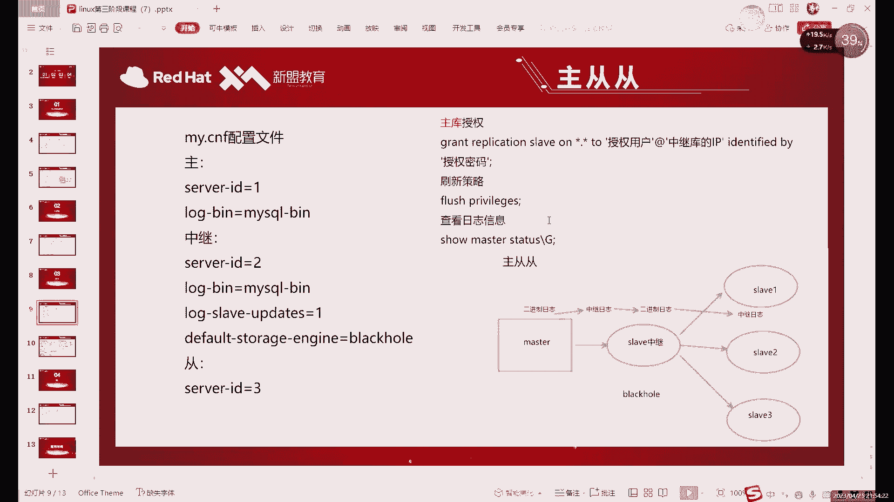
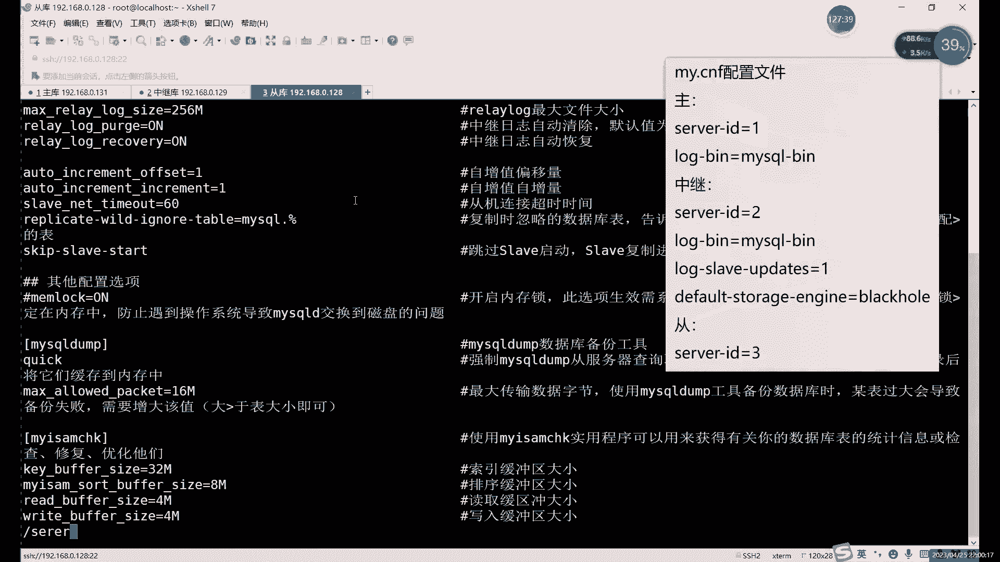

# 零基础入门Linux，红帽认证全套教程！Linux运维工程师的升职加薪宝典！RHCSA+RHCE+中级运维+云计算课程大合集！ - P82：中级运维-21.增量备份，主从复制 - 广厦千万- - BV1ns4y1r7A2

超过那个主地术多层，对吧？艺术多层。一水多同，它其实是有一个问题，就是什么？就是。重库如果越多的话。对于主库这边读写压力是比较大的，因为什么？因为每次主库这边一旦提交一个数据，对吧？

主库这边我每修改一个数据，我们的同库这边呢就会先就要同步一次，对吧？啊，都要有一个进程来啊帮我们去同步。然后接下来的话就是你如果每多一个同库，相当于一个同库的话，就同步一次，对吧？

两个同户那就是同步实质上得向两个同库去发数据。同复越多呢，那发的越多发的越多呢就压力越大，那压力越大就越容易出事儿，对吧？越容易出事儿。所以说呢。我们一般情况下呢。啊，如果说你后边真的有都个重复的话。

我们是需要加什么呢？是需要加这个。一个中继的东西来放在这里。啊，那个中继的作用是什么呢？中继的作用的话，其实就是一个。过渡。或者传递数据。就比如说你看啊如果说像一台存库连上这三个家伙。

一台存库连这三个家伙的话，不是一台主库连这三个缝库。如果他每生成一次数据，就每修改一次数据，要同时向单库据发送发送消息，对吧？那如果说我们换成这种。那其实就相当于什么？相当于我们是一组一从。

对于主客来说呢，我们就是一组一从。啊，就没有那么大的读写的压力。啊，没有那么大的读起压力，这样的话就自然就轻松一些了。啊，读起来力小了就不容易宕机了啊，服务器出故障。宕机的原因一般是什么呢？

除了断电这种啊除了断电这种比比较恶心的以外呢。除了断电这种以外呢，其实最常见的就是资源跑得太满，就容易浪。啊，就比如说你内存也好，CPU也好，硬盘也好，三个里边其实有一个满的。就容易出事。嗯。

有一个版呢就可能只是它一个硬件出入故障。但是大家也知道，对吧？对于夫妻来说，你一个硬件出故障，那整体肯定容易出事啊，硬盘其实还好。硬盘如果做了锐d的话。不致命对吧？就不致命了。但是如果你是内存啊。

或者说CPU出点问题啥的话，那那一要一旦出问题，你整个服务器你就跑不起来了。啊，所以说呢这个其实。你不能让什，不能让一台的这个一台服务器的压力太大。所以说我们这里就用了什么用了一个中继的库来。进行转接。

啊，进转接。呃，一组多重的话，你如果说是像这种写法的话，那确实可以，这样的话也行，但是这样没必要，为什么呢？因为。但也可以啊但是也可以啊，这也是一种这一族同的解决方法啊，就是可以不让一个库压力那么大啊。

是一种解决方法啊就是。和我们这个其实道理是一样的啊道理是一样的，就是只要是不要让主库压力那么大就行。啊，只要不让主库压力太大就行。因为我们这是主从啊，就是我们主从的这个结构里面。主库是负责写的对吧？

写入是负责主库应面负责的。而读取的话，主库也行，存库也可以啊，大家注意啊，这个存库呢不能写数据啊。啊，这里强调也刚才没有说啊，就是主从一旦做了之后呢，主库就不要再写数据了，不是。同库就不要再写数据了。

因为你写了数据的话，其实倒时也不不是很不太影响。但是主要是问题是啥呢？就是。如果你写了数据之后呢，然后主库那边也刚好写了一个跟你类似的，哎，然后容易冲突。对吧冲突是一个问题。第二的话就是你存库写了。

你其实主库也不知道，你写了就自己写的啊，那跟存库没啥关系呃，主库跟没啥关系。所以说从库就做完主图之后，重库就不要再写数据了。😡，啊，不要再写数据了。然后这里的话我们这个中继库的作用是什么？

作用就是我刚才说了起到一个中间过渡引导的作用，对吧？而且我刚才也介绍了这个存储引擎，我们用什么用黑洞。啊，用黑洞。这个黑洞的话，大家特点应该还记得，对吧？就不存数据。对吧黑龙我们之前讲过就不存数据。

不存数据它干什么呢？啊，就只是用来过渡的。啊，黑洞能用的场景很少。这就是其中之一。也是它主要应用的一个场景。啊，这种的话就是。为什么说他为什么这个要用黑洞呢？😡，啊，大家可以想一下。

为什么我们这里给主库做一个过渡的话，为什么要加黑洞能它能不能作为一个正常的数据库呢？其实倒也可以。啊，如果说他作为一个正常的数据库的话。😡，他其实后边还不是面对的什么，面对了三个对吧？

面对了多个什么多个同户。那这种情况下的话，其实和一个主库面对多个同户呢，效果其实也差不太多，对吧？效果其实是一样的那它的压力就会很大。所以说呢你如果说一个主库向多个同户进行同步数据的话。啊。

尤其像这个中继库啊，主库的话呢很容易出问题。中继库的话，这里为了避免，对吧？尽量避免我们这个。硬盘跑的太，硬盘内存对吧？CPU的硬件资源跑太高，那怎么办呢？那我们就是中间这里呢。不存数据。不写数据是吧？

不写数据呢，硬盘这压异就没那么大了，对吧？对不写数据的话，其实就不需要开那么多进程去。啊，去管理这个关于数据的问题。啊，所以说这个就是为了什么，我们这里要用黑洞引擎，哎。

不用我们默认那种引道DB用默认的一刀也不是不行啊。如果你用们之后的话，其实。用了之后的话，其实这个中极户跟没做没啥区别。啊，因为你本来存库本来主库可以直接给他，对吧？你中间加了个中极库。

它其实还速度会更慢一点。对吧那你加中据库的目的是什么？其实就是目的，因为主要是减轻主库的压力啊，而且你本身自己你也不能压力太大，你压力太大的话，你也容易挂。你挂了的话，主风主层就断了。

因为中间这个一断的话，主从同步就直接断掉了。所以这里的话一定我们一定用什么？一定用black号这种黑洞引擎不存复。啊，就是我这里就彻计不要数据了，我只是给你们做一个中转啊。

他这里的读写压力其实基本就没那么多严究，他只是面对于。啊，面对于主户同库之之间一个读写，它这里本身不写任何数据啊。不写任何数据的话，相当于至少。至少读写压力降了50%，差不多啊。

因为少差不多少了50%读写压力。啊，然后这里的话就是什么？这里就是我们的。哎，主主虫虫这个做法。然后中以及中间这个黑洞的问题，对吧？中间这个黑洞。啊。已经提前好好几节课之前就讲过，对吧？

讲过这个黑洞的问题。然后这里的话我们接下来呢就具体来说一下这个啊这个怎么做啊，其实这个做起来也很简单，主要就是中间这个黑洞的问题。😊，啊，主要是和前面不一样，就是中间这个黑洞我们怎么去设置啊。

怎么去设置。就比如说呢我们这里来看一下这个。现在的话我们。你这里虽然说我我图画的多啊，但你做这个实验的话，你三台就够啊。你做这个话，三台就够。所以说这里的话我们就直接怎，我们直接就。

我直接把第三台连上。第三台的话是这个。

128。8。28。

啊，这里有。这里我们就作为什么？作为第三排啊，这单这台的话我们作为重复啊。8。0。128。然后呢，第二台我换个名字啊，第二台我们这里就不叫同复了，准确点的话，它应该叫什么？叫中继。啊，叫中级股。

现在的话其实我们是只是单纯做了们做了他和他的主成，对吧？做了他和他的主从。或者它和它的主从的话，你进来的话，如果要做这个主从从的这种啊，中间的话我们需要换什么？我们中间需要换一种。啊，不一样存储引擎。

也就是我们刚才所说的黑洞。换成飞动之后呢。我们这里相当于就不存数据了啊，就只是用来传递他们之间的数据。啊，首先的话我就得先设置什么？我们在做这个组图之前的话，我们先把什么设置好呢？先把这个。

我们的配置文件修改好，因为配置文件需要修改，我们什么需要修重启数据库。所以说我们这里先把配置文件修改好。配置文件的修改的话，首先第一个主库这边。

啊，需要注意的就是开启二进制日志就好了啊。中继库的话需要干什么呢？需要第一。开启中间开启二进制日志。啊，这里大家注意啊，这就中期库也要开二进制制，为什么呢？因为它是它的二进制制呢。

需要我们的重复去读取嘛，对吧？大家可以看这个图嘛，刚才有没有没有去说这个图，对吧？我们主库的二进制日志同步到重库的中继日志里边，然后呢，然后终期日志更新到啊，直接更新到二进制志。我们这里开了黑洞。

我们就相当于不进啊，不走库了，相当于直接两个日志之间同步中继日志同步到二进制日志。然后二进制日志呢再同步到后边重复的中继日志里。啊，所以说这个他是一定要开这个二进制一制的啊，就中极库一定要开。然后呢。

还要再开一个什么呢？还要再开一个日志的一个更新啊，因为我们不用呃就是我们用黑洞的话，我们是不写入数据的，对吧？不写入数据的话，我们是要中继和二进日之间直接的更新的。啊，相当于直接更新。连系到二进制这里。

啊，这就开始这么一个选项。然后呢，还有一个最重要呢最重要在这儿啊。default star engine就是black号黑洞，把默认从这引擎改成黑洞。哎，这样创建的所有的什么呢？

这样创建的出来的所有这个信息呢都是什么呢？都是这个。相相当于是怎么说呢？就是。不存数据，但它会写入到日志啊，我们不存数据，但是会写入到日志里。这个其实我们在讲存储引擎的时候已经说过啊，可能那天没在是吧？

就是之前存储引擎是给大家演示了，对吧？存储引擎那天我们也看日志了，就是你设制成黑洞的话，我们插数据表格里面是没有的。但是呢日志里面会写啊，日里其是会写的。😊，啊，不管说你有没有中继日志吧。

就是你自己如果说只是单纯的一个数据库，你开了黑洞，你写入数据，它不会显示就不会存储，但是也还还是会写入到日志里的啊，还是会写入到二进制日志的。然后重复的话不需要什么设置啊。

serv IDD不要重复就行啊。这个的话我们其实还是要改一下serv IDD的。因为我默认的话，这个是一啊默认全是一。

第一台不用改啊第一台不用改。第二台呢。

我们需要退出修改一下，具体改内容的话，就就这几个啊，就这几个这个是和我们前面做的主从不太一样的地方啊，主要不太一样，就是我们的冬季库啊，主要中力库从库主库没不用改什么，主库不用改。

直接编辑一下这个。我们的配置文件对吧？这个是我们什么正常的这个。二进制制对吧？更新那个呢，我记得应该也开的。啊，在这儿。啊，bin的它的它准确名字叫什么？它是集联互制啊，什么叫级联互制呢？

它其实其实就是两优质之间的更新。啊，两个日志之间分析。

二的话和一一样啊一个意思。然后的话还有一个。默认存储引擎，它这个在它这个在上边啊在上面。Depart star案。

啊，我们把这改成什么，改成黑洞啊，就不用E能DB了。大写小写都可以啊，来个号。嗯，mydl里边不区分大小写，所以说这个配置文件里面写大写也一样，写小写也一样啊，不来个号黑动。剪完之后保存就可以。

Re start my circle。然后这里的话重启好之后的话，第三排我们给你改一下。啊，接下来也需要改，因为。有时候下来不下得买走去。Oh。Okay。然后这里的话是serv IDD。

啊，重启下吧，豆口这边的话就配置文件的话，基本上就改完了。接下来呢就是什么？就是还是授权啊，还是授权问题。授权的话，其实主库到中地库的授权已刚才已经做过了，对吧？主库到中地库的授权已经做过了。

接下来主要是什么呢？主要是这个。S slave SLAV。嗯。啊，现在两个正常对吧？这边正常了，现在主库和从库呃主库中据库这边连接还是正常啊，这边还是正常的。我们可以来看一下这个黑洞的效果。啊。

我们先来看一下黑洞效果，比如insert into。喂，稍等一下，我看一下嗯。没事，可以创建。颜色的 into我们插入一个。在哪个表呢啊，这个表。比如插入一。对吧插入这边正常插入了SE select。

信号from。对吧有有数据对吧？有数据这边我们可以来看一下啊，us切换过去。from在 from这个呃表格，这个表格有点问题。特别会一点问题。这个表格应该是有的对吧？应该是有的，为什么它有呢？

因为它不是黑洞引擎。啊，大家注意就是存储引擎在创建的时候，就是它并不是说你把配置文件里面的存储引擎改掉，就是你所有的表格都变成一个引擎了，并不是这样，就是它这个存储引擎默认的是什么意思？

就是你在创建表格的时候。它是什么引擎那就是什么引擎，就是配置文件里是什么，它就变成什么了。如果你后天就本来是一全部都是inow的引擎，你改成bl like号，那些inow是不会改的啊，是不会变的。

就是这个的话有数据是正常的。我们这里再创建一个表格啊。Qurytable X H啊。然后呢，我们插入数据。插入。对吧这边还是正常的，我们再来看一下这个。信号pro。啊，这就是空的。啊。

所以说这个的话就是什么呢？这个就是哎呀我们这个黑洞的作用啊，因为这个它是我们创建就改黑洞之前的一个表格，所以说它是inowB的引擎啊，这是正常的。然后它呢就是什么？它就是个黑洞。啊。

他这个这个表是黑糯引擎那个。啊，这个是黑洞引擎的表格。啊，所以说这个的话就是什么？这个就是我们的。黑洞引擎的一个作用是吧？它就不会存。现在的话我们这个是主从啊，主从没问题，对吧？

接下来如果说这个要继续做主从的话。啊，现在数据当然是不一致的，但是是咱们可控范围内的，因为也只创建两表两个表格，不行一会儿我们在右边创建俩表格，效果也是一样的啊，效果是一样的。嗯嗯。

你可以提前在这里创建两表格啊。mycyclcle杠Uroot杠P1。对吧保持数据一致，最好保持数据一致。所以说我这里就手动创建。啊，crery table你也可以备份啊。

所以这里当然备份其实还没有手动创建的快啊。啊，创建好之后呢，再来一个表格啊，tableable。ID对吧，IDINT。嗯。嗯。切换到这个库里边。创建，然后呢插入数据。啊，我这属于我这属于是手动同步数据。

手动同步。二。然后再创建一个。XH。啊，这样的话数据就一致。当然不一致呢，它不影响主从。但是你正常插入数据的时候，它就出就会出点问题啊，会出点问题。好，我们接下来看。

这边的话中间主要其实主要是中间做黑洞啊，其实我们就主同同的话主要就是核心就是中间的是黑洞问题啊黑洞问题。做好之后的话，大家注意就黑洞这里也不要插入数据啊。啊，虽然说你确实不能插入，但是你也不要插入。

为什么呢？因为它算是什么？它也是一个从库呀。它既是同库，又是主库，它插入数据呢，主库那边读不到啊，但是还会同步到呢，还会同步到后面这台存库上。所以说呢这就导致什么感觉好像主库被忽略了，是的对吧？

但是呢又导会这样会导致数据不一致。所以说呢做好主从之后，就做好主从之后的话，中间台中级库呢不要插数据。它因为它既是重复就是主库，它这个位置很特殊，对吧？你插入数据呢，主库又读不到。

但是呢还要传会同步到你的下一级，啊，这个就很恶心，所以说呢这个中级库这边不要不要插入数据啊。本来你插入也看不到，对吧？你还何苦再插入数据，对不对？啊，所以说呢我们这里就看一下什么看一下这个。

接下来就是这两个之间的对吧？这两个之间。这样之间的话，首先我们还是授权，对吧？还是这个授权呃，简单点写的话就可以这样写，不然啊啊。啊，因为二里面是包括所有权限的，包括这个主从。你如果实在懒得写。

你可以这样写。拿关了啊心点行吐。啊，最简单就可以这样写，然后root。啊，再给大家来个简单的就是版分号。对吧这就是什么经简版的？😡，Identified。这就是我们进件版的授权名。够简单的是吧？

把前面这个repiation换成哦，对吧？把这个IP换成百问号。啊，百工号呢代表就是所有。这个当然你不用担心不安全的问题，对吧？你能访问。还有一级root密码呢对吧？还有一级授权密码呢，你不知道密码。

你支持说能访问。你也进不去对吧？你也进不去。啊，或者说你只一个网段的话，怎么写？一个网段就192。168。0。分号，百号代表所有啊买s的通配符和正常link个系统不一样。link个系统里面喷配符是星号。

对吧？我们这里这个是版问号，也不能说不需要吧。其实你看前面我们也用了信号的通配符了。对吧前面这个我们还是用信号的通配服，也是代表所有的意思。这就是这个是百分号也是所有。不能说不一样。

只是把买搜cle这两个都用啊都用。啊，然后这里的话就是正常的这是金钱版的授权名啊，你实在懒得打就样写。但是完整的话，其实这玩意儿这里还是换raification slaveve。因为什么？

二是包括所有权限的啊，R包括所有权限。然后呢新点新呢可以换具体的库。然后呢，百公号呢最好还是换具己的IP啊，用户的话root可以换成其他普通用户。密码呢可以换复杂一点的。啊，因为这个这个是最简单的解法。

啊些复杂一点的话，可以至少能翻一倍啊，至能翻一倍的长度。啊，这就是我们的授权，对吧？授给后边。当然你这样授权呢，其实主库也能访问到它了。这个就涉及到什么？这个是涉及到啊双主的问题，对吧？

双主我们一会儿再说啊，我们先说这个水龙头。啊，我们先说主动从。然后这边的话我们执行好之后的话，我们也要看什么呢？也要看这个受。Master slave。不是 statusSTATQ。

看一下这个啊08的1215啊，好多呀，这个怎西这么多。啊，所以说这里的话是这个什么？这里是这个。多是多应该是可以嫌多的话，可以清一下，不清的也可以用啊，也可以用08的1215啊08115。

然后这里的话嗯。啊，这个之前应该是做过很多操作，后边是删了里面的数据。所以说这里边啊日日子多也正常啊，日日多也正常。然后这个是我们第二个，对吧？这个还是记录一下。那一会儿要用，对吧？

然后接下来呢我们来看什么呢？接下来看这个。你哪儿啊在这。同库哎，最后一个重库连我们的第一台啊，不是连中间这台重力库啊，不连第一台啊。changeCHNNGE啊master two。

master杠host。然后呢，等于。主开IP192。168。0。129啊，中间一台的IP。然后呢，后边写master。我们我这个就不不不竖着写了，我就横着写啊。刚 user。等于。啊，路上。密码。

一对吧。然后下一个是。pamaster对不对，master杠paword啊，pasword写少了。WRD。然后第四个的话就是master杠 log杠 file啊，我们的日志文件的名字。

啊 my circle。钢片。点00哎，不对。零0。000008。啊，这样。然后最后一个的话是master杠log杠 position位置。1这是这是1215是吗？这结了半分啊，1215。啊。

这个地方就是你也可以横着写，横着写，方便什么，方便复制。啊，横是写方面复制。可以复制啊，你是不是写完那种他没办法复制的。然后这里的话我们直接回收就可以啊，回收就可以。啊，这个master直接指定。

之前的不需要清理啊，之前的不用清理，你只要保证。还是那句话主从的话，保证数据一样就行。刚才我不是手动同步，在同步上同步了一下数据嘛啊手动写了一下数据啊，手动写了一下数据。

这个文件啊这个文件它每次都不是固定的吧？你也其实你也不知道它每天具体是啥，你就是show masterslay去看就行。你要同步的时候，就用这个去看，它不一定是哪个，有可能1010以上也有可能，对吧？

这里可能还能还会更多，20002000也有。啊，这个的话这个是这个不是固定的，这个就是看你当时是用的哪个文件，对吧？日志文件是哪个哪个位置。啊，就用show master status可以看就行。

然后这边startlve。启动对吧？启动之后呢，设45看一下状态。Daters。啊，master的这里的话，用master就看什么，就看日志的位置，用slve呢就看什么。

sleve就看这个主动复制的状态啊，就这两个命令。杠G主要是表格太宽了啊，表格太快，显示不下的话，我们就换一种显示方式啊，换一种显示方式。然后这里的话我们可以看一下上边啊两个叶子。啊，那个意思没问题。

对吧？你看它这信息的话，也有主从的信息嘛，是吧连的是129。对吧通过连端口是3306，用户root。然后呢，你看日志的日志名字08，然后1215，下面这个是谁呢？下面是他自己的日志啊。

这个是自己的中继日志啊，自己中记日志的位置。啊，这个话就是什么？这个就是。这个就是我们的。连接成功之后的话，嗯，我可以在主库这边执行一下命令吧。比如说我们插入个数据。比如在XH里面插入个2。对吧。

再插入个3。你看先换到这边。slalect SEELECT select新 from。X h。还是空的对吧？就是黑洞的话，你永远不像不要想数据的问题啊，黑洞就不要想数据。啊，你就即使说你能做主同，但是。

你不用存数据啊你不用存数据。😡，然后第三台的话，我们办呢第三台直接换这个。第三台还是肯定是有的啊，因为第三台是我们正常做嗯主从哪儿去呢？🎼啊，算了我们再打一下吧。slect新 from SH。

对吧23就来了。啊，如果说我刚才不同步数据行不行呢？😡，他肯定过不来数据，为什么呢？因为刚才我同步数据主要做做的最重要的一个是什么？就是创建这个表格，我创建了两个表格，对吧？啊，这两表格的话。

如果说我刚才不创建啊，它这个它这个面积是过不来的啊，因为数据不同步啊，只要是两个y，其实代表什么？代表你的这个。你同步的这个进程没问题了啊，它只是代表同步的进程没问题了。是否能真正同步数据呢？

你还是要看两边的数据是否一样啊，不一样肯定是不能同步的。你看像我这里的话，123。刚才我要是不插入的话，那他如果只创建表格，不插入数据，不插入一那个数据的话，它其实现在就是2和3。还能同步对吧？

能同步它新的数据，但是你同步不了旧的。啊，能同步新的都不能同步旧的这是主同的一个问题，也是需要注意的点，就是你同步之前呢，尽量保持数据一致。不一致，不一定会报错。他可能只是同步不了数据。

那就是不一致的话，可能就同步不过去。啊，他可能那边就是两yes，就是同步过去。啊，这个就是我们这三个。啊，主彤彤这边的一个做法。啊，中级库这边起到的主要作用是什么呢？就是传递日志，对吧？

我们你看我们可以没有，对吧？然后我们出来可以看一下它的一个日志啊。比如说我们看什么呢？看这个。那是叫什么来着？切换到user下logo下的my circlecle里边的dter目录对吧？

切换到dta目录下，我们可以看一下。日的话是08对吧？哎啊，对，08。我都写到08了，是不是？🎼我们看一下908my circle。兵log啊买这个杠兵。点零零零八。让我看一下。对吧。是有的。

就是你不管说你是。你存不存数据，其实不影响你的日志。啊，因为你的命令呢实际上是执行了。执行了之后呢，只是不写入到数据库里。😡，这样能少占用我们的空间，对吧？能少微占用点空间。就是相当于这个。

占因空间小了，对吧？你硬盘压力就不大，硬盘越压力不大，就自然就没有那么容易宕机了啊，没有容易宕机了，也没有容没那么容易卡了啊。像如果说硬盘质量不好的话，其实读写读写的比较频繁的话。

它也不一定不一定会宕机。可能会很卡。就比如说我拿这个。前一段时间那个什么就是。你们有一个服务器里面是有一个机械盘的对吧？有一个机械盘机械盘的话，它有问它问题就是什么？它问题就是慢呗啊，它就慢一点。

慢的时候，然后你复制文件呀，恢复快照的时候呢，就比会比较卡啊。一卡的话就是什么一卡基本上就涉及到了整个系统啊，因为那个什么因为机械盘里面还装了个系统。哎，所以说呢这个。怎么说呢？还是固态盘好啊。

还是硬盘的，还是固态盘好。然后的话就是。读写的话就是不要让硬盘读写太太高啊，硬盘读写如果是太多的话，其实也会导致系统时卡顿啊，也会导致系统的卡顿。然后的话。也不是说只存中期日志吧，哎。

怎么能说只存中期日志？My circlecle bin。relay log啊，relay杠兵。

零零零零七。对吧也是有嘛，这个什么日志？它是中继日志。😡，啊，它是中继日志，就是我们这两人里边是它是有两个日志的，就中继和。中继是它连接主库用来用的是吧？它主库那边写的数据呢，它同步到中继日志里边。

然后中继日志写入再去同步到什么，再去写同步到二进制日志里面，是这样一个顺序。是先有这个中继日志。啊，先有这个中继的，然后中继呢把数据给它整到哪，整到这个二进制这里。啊，是这样。啊，这个就是什么？

这个就是我们这个中继主从虫这边就是中继库的一个主要作用是吧？第一设计黑设置黑洞啊，就我们可以不存数据，我们可以来看一下啊，看一下那个什么。I青海这个目录。啊，我们可以看这个目录。大家发现没有？这。

原那那个表格就是有数据那个表格的，它是有这个IRBD的对吧？F2M是结构，对吧？IBD是什么？IBD是这个。数据嘛对吧？IBD是我们的数据。😡，这个是有的是正常的，对吧？

我们是可以看到什么看到那个IDE的数据呢。

那这另一个表格就是我们刚才那个。哪个表格来着？有点多了啊啊这个XH这个表格，你看它是空的。

对吧它是空的。但其实呢你看我们的日志里面是有的。中季制列也有二进制之间也有，就哪没有呢？我们本地不存，不存数语。啊，你看这里就只有结构。啊，因为DESA其实我们是可以看的。

又切换到这个库里边，然后呢，DESC看一下XH。

对吧结构我们有的，它只是它就是只保留什么，只保留一个结构，哪说。

啊，我们就是只保留结构，就黑洞里边，它只保留结构，不保留数据。

啊。这个就是什么？这个就是我们的这个。

中级库这边的一个特点啊，中级库这边的一个特点作用啊，主要就是长期日质。

啊，就是用中迹呢传给二进制。然后呢，传给二进制之后的话，这个从获的中迹呢再去读什么，再去读我们这个2二进制日制。就比如说我们可以来看一下EXIT我们也来看一下我们的二金终极日志啊嗯在。啊，在这里对吧？

😊，My circle。dlog我们来看一下relay log。人类兵，然后0002。对吧我们数据也是在的，哎，也是这个的话，其实就是一个日志读，一个日志，一个星制读一个日志。那简单来说就是这个图片。

对吧就一个一个传下去。嗯，中继日插入会有记录，对吧？你正常数据库的。二进日志会记录的，我们所有数据库的一个执行的命令呢，二进制日志都会记录。就如果说你在这里随便写一调命令的话，它这里会记录。然后呢。

也能同步，所以说呢就不要在这写了啊，你知道就不要写了啊，我可以给大家演示一下。

知道就不要写了嘛？insert。凝兔。关了。嗯，玩6一吧六一。X H。插入了对吧？插入他也看不到，对吧？插入了他也看不到。但是呢这边就能看到。对1231。对最后这个一就是跟我们刚才插入。啊。

因为他是就相当于是。第一个就是这应该怎么说呢？就是。131这台是129的主库，对吧？129呢它也是128的主。😡，128我们是不直接连131的，它是通过这个中继库连接的。所以说呢中继库这边给了啥。

他就他就写啥，他也不知道到底是谁给他的，他其实根本就不知道他上游还有一个数据库。就对他来说的话，他其实就是只知道哎这个129是他的主库。啊，129是他主库，主库给我东西，我就要写。然后就写上来。啊。

这个就是什么？这个就是就相当于是他这里呢。我可以看一下这边吧。你看一下那个。relay了。看到没有啊？最后一条数据是三，就中制制制是没有的。因为终继制是读它的，而不读我们本身自己的啊。

不读我们自己写入的数据，我们自己写入数据谁来读呢？是二进制制来读，但要分清楚这两个日制的一个作用。

中级知识读其他的二级制来用的。而我们本机的一些操作呢是会写入到只只会写入到二级值值。啊，我们本机操作只会学道而进止，你看这里算是没有的，对吧？但我们再看另一个。

买四个边。啊，那个就08对吧？他就有这条数据。啊，这个就是两个日志的区别，这个大家一定要区分清楚啊。

中级制制呢，它是读二进制用的，它跟本级无。它跟本机的数据没有什么关系。啊。这不能说没关系，就是它这里的其实读到之后呢，它会写入到本级。然后呢，本机执行的所有命令都会写入到二进制。

也中意和二件质是不一样的。嗯，当然你正常情况下吧，它俩其实内容是一样。但是如果说你这个一旦写了点东西。中间日他不知道啊，只有二进制知道。啊，二级制一知道的话，下边的中期自然也就知道啊。

不是下边的中期日志，就是同货的中期日志，他也知道了啊，这个就是它一个传递的过程，就一个日志传一个日志，哎，再传一个日志。这就是我们主从的一个原理吧？主铜原理。就是通过日志来传递消息。啊。

通过日志来看这消息。中继当然是同步数据的啊，中继它其实你不能说把它不同步数据，它同步。

啊，它同步属于。比如说我们ins into。我们不这次不插XH，我们插入星海这个表格。看这边的同库。select信号 from。X H。哎，不是是新台。对吧他同步到了，那他同步到了没有呢。

他肯定同步到了，因为他是个中间商嘛。啊，他就是个中继哎，中间商的。哎，还不赚中间商。但也不是不赚插价哈不赚插件。嗯，又是切换到。这个库里边，然后select。对吧他能同步。不同步的是谁？

就是刚才你看效果看起来不同步，是因为什么？是因为黑洞的原因。啊，有黑洞呢它是同步数据，但是你无法写入。因为黑洞引擎的缘故呢，它无法写入啊，无法写入到文件里。就是本地不保存数据。

只是在只是过一过日志啊不保存数据啊。如果说像这个是这个是我们设置黑洞之前的一个表格，它是eowDB引擎的，我们是正常可以同步数据的。啊，我们是可以正常同步数据的。啊，中继它也同步数据。

如果呢设置成了黑洞之后呢，就不显示数据了啊，不再显示。中体上写的肯定不会同步主库呀，因为什么？因为它是存库呀。大家注意就从库写的都跟主库没有关系。啊，主库又没有主库又没有指定什么。

这个如果说你想要两个之间同步行不行呢？也可以实现这个就涉及到什么？涉及到这个双组的问题了。

只有双组呢就是两个之间呢。A写入数据B能读到B写入数据，A能读到，这种叫双数。但是这种呢没有主从常用，为什么没有主从常用呢？因为双组呢它这里的读解压力其实是比较大的。因为其实你比如说你两个同时写啊。

两个同时写完了。然后你两个又从书愿员要读取彼此的数据啊，要读彼此数据。

啊，当然冲突这个当呃这个当然不会冲突啊，这个冲突是不至于的，因为。如果说你修改相同的数据，比如说同步更新一个数据啊，同步更新一个数据，它顶多就是第二次更新就报错了啊，都不会说重死，他最多是报不错。啊。

然后这里的话这个双主的做法的话和主铜一模一样。只不过是什么呢？就是我们正常刚才是这个图片，对吧？我把这个图片给它翻转了一下，这就是双组。就是一个数据库呢既是主又是从。就是互相为主从。那怎么做呢？

就是主库授权重库。互相授权。然后呢，互相指定。互相指定参数啊，先互相授权，然后互相指定参数，然后就完了。这个就是双主的做法啊，做法很简单，就是做两次主从啊，你就可以理解成做两次主从。

这个这个这个双组的优势是什么？优势就是两个都可以读数据，都可以写数据。啊，都可以对外提供服务。缺点就是什么？缺点就是他们的读写压力比较大。啊，读写压力比较大。所以说一般的话双组当然也有公司用啊。

也有公司用用的没有什么没有这个主铜多啊，肯定是没有用主铜多的。啊，这个双组大家感兴趣可以再去做一下，就是相当于做了两次主从的授权。啊，做了两次主合授权。好吧，这个的话大家下去可以做一下啊。

我这些课章就不讲了啊，课章就不讲了，因为操作是完全一模一样的啊，再再讲一次再写一次其实没什么意义啊，操作是一样的啊，大家对操作是一样的。也相当于是你是像这样嗯。刚才我们是他主，它是从，对吧？你做双主。

就是你再把它当成主，把它当成从再做一遍，那就是双主了。😡，啊，那就双除，那就是谁修改文件，彼此之间都会同步的。啊，这时都都会同步的。

啊，这里需要注意的，其实就。嗯，授权两次怎么说呢？就是ID肯定不一样，对吧？首先ID不一样，然后授权两次的话，分别指彼彼此的IP或者说呢。要懒的话，你就是。嗯，要然的话那你就直接写版工号吧啊。

直接写版工号。然后呢，下边这些的话就是也是互相指啊互相指你互相查看这个之后呢话，两个数据库它这个master文件肯定就是日志文件肯定不一样。啊，这个肯定不可能一样的啊。

这里的话就注意两边的这个日志文件和日志文件位置就行了啊，日志文件的位置就行了。对，这个的话这个缺点其实就是什么？就刷子的缺点，其实就是这个。注于同步上的问题。啊，是同步上的问题。

所以说这个他用的就比稍微少一点，对吧？因为说虽然说它可以说啊理论上是可以，你改我我同步，我改你同步。但是如果说同时修改一个数据的话。就可能会发生数据不一致的问题。啊，就如果一旦数据不一致了。对吧。

所以说呢这个就。其实就不太好弄啊，当然但是解决方法当然也有，但是。你既然有这种，其实主从其实要比双主好。主从其实比双主好对吧？有这种更好的选择，其实根本就没必要什么，没必要做双主。

啊，这双手确实容易倒力啊确实容易倒力。啊，做双组的话，其实你随意吧，你想让谁就两个做双组的话，就是两个数据库，对吧？你你同时就是组和同同时就是组，同时就是从两个角色啊两个角色。这个你也可以在哪做。

在这个也可以做，对吧？他做主他做再做一次，就是他俩的装组。对吧这个其实。对，主从的话，我们下节课就讲读解分离啊，周四就讲读解分离。

对，因为主成的优势就是什么？就是这个组角分离啊。对吧主同它虽然说不能同步数据，就是同不能同步同合主，不能同步数据，但是这个其实没什么影响，对吧？我们有读解问离。他不得读对吧？他不得写。

其实这个要比双主这个机制要好很多啊，比双组机制要好。啊，这就是我们这个主从这边大家下去的话。啊，你当然最好先装好三台数据库，最好你有时间就装三个源码安装的。因为后边的话我们的实验。

你用样码安装它可能会出点问题啊，可能会出点小问题。所以说最好还是用样码安装啊，不是源码安装的三台啊。后边的话呃最多也就三台了，我们也不会做太大的实验。啊，不会多太大时间，三台就够啊，三台台三台就够。

如果说想做大的。大的三台肯定不够，三台肯定不够，至少就三台啊，至少三台。你像这个一主多从，对吧？我们这里就是完全就是主同从，不，不是一主同从这里啊。123对吧，我们都用了三台。啊，那正常的话。

你肯定重复会比稍微比多会稍微多一点。啊，稍微多一点。啊，my cat。就下一课呀下一课的那个什么。这一个读解分离一样，就叫迈开。万一主播断网主播断网了。读到啊，你连不到同步，那肯定数据同步就做不了了。

但是你至少本地还有一个嘛，对吧？备份这个东西啊，其实我们这个玩意儿这个主同同步它也是个备份。我们叫什么？我们叫实时的栽位。啊，实时备份。知时背吧。实时备份不行啊，你自己还有个本地的备份呀。

你你别忘了二进制日志，它自己就算就就是一个备份呀。啊，他就是个备份呀。同步同库没办法给你同步数据了，你还有个日志来帮你帮你就呢，除非你没开日志啊，不日志肯定是开着的，是吧？你做了这个组同了嘛。

对吧你还有个这个日志嘛，你断网了，这个没办法，这个肯定没断网了，没啥解决方法。断网了这这个就已经是属于故障。啊，你这属于故障，这没什么好解好解决的。只有什么？只有你只要祈祷，你断网的时候。

千万别再宕机就行。啊，断往前还好。你就断网别断电就行。啊，断电就走。啊，断电就走。断网其实对数据没什么太大影响。😡，你就别断电就行，断网的话，它最多就不能再就读写暂时就停了嘛啊，读写就暂时停了好，对。

后边就你手动同步就可以嘛，就是备份嘛，对吧？你不是有二级机制的备份嘛？你这同步到这个同步上不就可以嘛，对吧？同步到同步上。备份是相当于我们是上节课不是讲的备份嘛，和这节课讲主动同步。

他其实这俩个它都算备份，一个是本地的备份，一个是相当于连了其他的，让他们做一个实时的备份。啊，这个就相当于双重保险嘛啊，双重保险都得做。你不是说你做了主成之后，不做不做本地备份行不行，那肯定不行，是吧？

就像你断网的情况。对主通肯定要通断了。啊，断电救不了断电咱救不了。哎，断电这种东西。呃，主库如果说主只是主库一个段的话，其实存库这边还可还还还能在，对吧？主存库还能在。断电的话。

整个业务其实你经可能就停了嘛啊也不会有什么。断电经常断经常断电，加UPS啊，经常断电加UPS。啊，直接加UPS就行了。这个加大功率的，加大功率UPS小功率，它撑不了几分钟。

最少至少得买几千块钱那种上万块钱的也也行。UPS其实越贵越好，越贵的话，你穿的时间越长。几千的其实都不太好使，几千的话也扛不了几分钟的。

