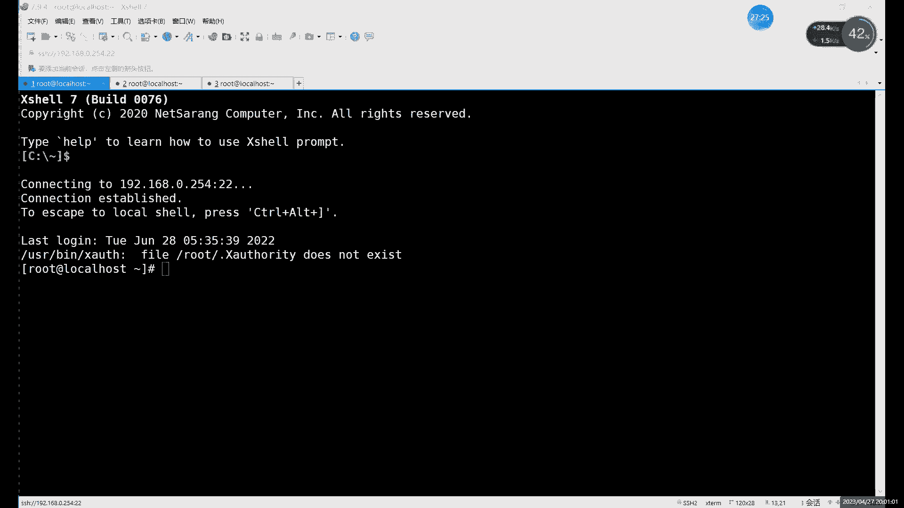

# 零基础入门Linux，红帽认证全套教程！Linux运维工程师的升职加薪宝典！RHCSA+RHCE+中级运维+云计算课程大合集！ - P83：中级运维-22.读写分离 - 广厦千万- - BV1ns4y1r7A2

好，我们今天的内容呢就是这个读解分离。接着上节课的主动复制一起做啊，还就接着上节课的做，为什么要接上一课呢？啊，因为我们的主动就是读解分离呢，它其实是什么呢？可以说是在主从复制基础上啊进一步的进行一个。

相当于是优化吧啊相当于是优化。啊，为什么说是优化呢？就像。我们之前的这个读写分离啊，不是之前这个上节课的主动复制。嗯，可以看一下。好，等上一个主动，我再开个PPT啊。软上一个主动不是这个其实不明显。

我们来看。下面的对吧？就看这个图。这个是我们最后上节课最后做的这个主铜从，对吧？其实我们和中间那个中继没有什么关系。我们主要看什么？我们主要看这个主从之间。这种集群啊就这种搭建的方法的话，其实我们。

重复它的作用是什么呢？它的重库的作用就是。啊，很简单，就是一个。作为同步的作为一个实时的同步啊，这个里边我们的同库其实它其实就是个实时同步。或者说是一个实时的备份。哎，就主库出果出现了意外啊。

那么们存库里边的数据啊还都在哎，存库里边数据都在。那这个时候呢我们还可还可以做什么呢？啊，就可以进行一个。数据的恢复对吧？啊，就把数据恢复到这个主库上。啊，或者说呢主库如果暂时修不好呢。

可以什么可以把这个一个主一个存库呢拿来当一个什么当新的主库来用啊，也是可以的。这个是我们主从复制的这边的一个功能，对吧？就是两点，一点呢就是同步数据。啊，当主库这边出现故障之后呢，数据我们不会丢失啊。

这个的话要比什么？这个其实要比我们上上节课讲的备论要好。为什么要比为什么要为什么这里说比备份好呢？😡，因为大家想是其实之前讲那个备份呢。有个什么问题呢？就是。比如说我们。全量备份这个我们频率就不说了。

全量备份呢频率一周两周，对吧？啊，你定一个时间就可以。增量备份的话，对吧？比如说我们一天一次对吧？一天一次其实频率还行吧，也不算快，也不算不算多也不算少吧啊，一天一次。啊，那大家可以想。

就如果说我们的一天的中间啊出现了故障，那就比如说我中午出现了故障啊，比如说每次我们是半夜备份，对吧？半夜备份比较好一些。半夜备份。备份之后。啊，半面备份之后呢，中午出现了问题啊。

那么上午备份的这些数就上午出现在新的数据，更新的数据啊也好，对吧？修改的数据也好，他有什么问题他就。😡，相当于是你恢复，你也会只能恢复之前那个半夜的备份，对吧？啊。

所以说中间就比如说这半天的时间的这些数据。😊，啊，你找不回来了。啊，半天数据找不来，这个怎么办呢？啊，这个的话就需要什么呢？😡，就需要用到我们这个什么就我们的。我们这个主。主从的一个同步对吧？

有了主从的同步的话，其实我们就可以什么呢？有了一个主动红录啊，其实我们做这个啊相当于是有实时的备份啊实时的备份。哪怕你是一天的中间，对吧？一天中间哎这个。数据库突然出现故障了啊，也不会什么。

也不会说损失太多的故障。哎，不是也不会说损失太多的这个数据。😡，对吧这个就是什么？这个就是主动同步这边的一个优势。啊，但是为什么啊就这个为什么还要说一这个优化的？就关于主动复制的优化内容呢啊。

其实很简单，就是因为。😡，主从这里呢。大家可以看这个图，对吧？其实在这个图里边呢。😡，🤧嗯。😊，嗯，这是在这个图里边，比如说看这个。主库和从库之间。对吧正常我们主库你写入数据，对吧？读取数据。😡。

然后呢，同步给同库里边啊，同步给同库。啊，同步的作用呢，它其实就是一个实时的备份。啊这种情况下肯定有一个问题就是什么呢？就是如果说不出现故障。啊，就假设啊假设不出现故障。如果不出现故障的话。

其实它有个什么问题呢？就是我们可能。这是个从库的，他就一直在备份，然后没有其他的事干，对吧？就只是同步数据。然后呢，压力就全在哪？压力就全在主户这里。啊，就比如说你读写啊，你插出数据，更改数据。

在主库这里执行，对吧？写读取数据呢也在主库这里执行。所有的所有的其实外部的对我们数据库的操作呢，其实还是主库一个人来单。存库呢只是做一个实时备份。这样的话其实有个问题就是啊如果说访问量哎比较大的情况下。

那这一个库呢可能就会容易出现吧，容易出现崩溃。啊，我们之前也说过，就如果说。磁盘这个读写啊读写这个使用率过高的话。啊，其实可能会造成么可能会造成一些啊这个服务的重启呀啊，像一些这个或者说内存高的时候呢。

可能会有一些服务的重启。就比如说买cigo啊，买cyclgo的话，其实如果说你这个服务器啊内存CPU过高的情况下呢啊，CPU使用率过高，内存塞满了啊，肯是肯定会出现什么？肯定会出现自动重启的这现象啊。

自动重启的话，这个相当于是自我一个保护。😊，一个自我保护的机制啊，重启一下的话啊，释放一下进程，对吧？释放一下进程，释放一下这些。CPU内存啊就可以怎么就可以。至少能保证什么保证服务器不当机，对吧？

但是呢可能服务会自己服务会掉啊，可能服务会掉。那这种情况下的话，你自己说服务服务器不宕机的服务啊，服务响应慢啊，或者说服务直接重自动重启了。那这种情况下可能会对也会对我们业务造成很大的影响，对吧？

所以说呢这种情况就是这个主从。😊，问题就是在这个单点这里啊，一个主一个主库压力太大了。那怎么办呢？啊，我们就可以，我们这这里的话就。这一到这个什么这一道这个。读写分离的问题啊，就是对于我们主从的优化。

主从的话优势它就是就是同步数据，对吧？同步备份啊，同步备份数据的能保证数据的安全性。啊，安全性完整性。但是呢就是主库的压力太大。所以说呢我们的优化的优化的方法呢，就是我们今天所说的这个主铜。读解分离啊。

在组从的基础上去做。什么意思？大家可以看啊，就是比如说我们右边这部分还是主筒啊，右边这部分我们其实还是主筒，对吧？我们大家大家一定要先把什么？先把子动做好啊。如果昨天子潼没做好的话。

今天的实验没办法没办法继续做啊。因为今天的实验就是基于主从的基础上。😊。

啊，在主通的技础上去做的。

所以说呢我们今天这个。一定要提前做啊一定要把这个提前做好。然后的话接下来我们看一下，接下来就来看这个。啊，首先的话这个主筒肯定是没问题，对吧？哎，有点问题啊，我们这昨天主筒其实稍微需要调整一下。

昨天我们做的主铜是三台，对吧？但是不是一组两从，我们做的是一个中间是中继的对吧？啊，中间的是中继的。所以说呢这里的话需要什么呢？啊，把这个主筒稍微调整一下。甚至我们可以把什么。

我们可以先把这个IP啊IP都正常，对吧？IP都正常，我们甚至可以先把什么，先把这个就中间给抬上。啊，我们昨天的中级库，对吧？我们昨天有台中级库，我们调整一下，把它变成。变成组主从的吧啊，变成主铜的方式。

啊，其实到这也可以不用调整，我们可以什么就一嘱一从吧啊，就用一嘱一从，其实也可以说也可以做啊也可以做。😡，一组一同，这里再开一个。是。啊，那就一组一统。

啊，你一组掌同学实也可以啊也可以。

啊，我还是用三台，我们就一组一从吧啊，一组一从。然后呢，我们前面加一个什么，一会儿一会儿再说啊，这个不着急啊，然后我们这里的话可以看一下IP是。啊，0。254。这I基本上固定看。这里的话。

首先我们这两台呢已经有一个主筒了，对吧？已经有一个主筒了，是131和129，对吧？我们先连一下这个塔吊。

131和129的。

啊，第二台是129。

然后呢，我再连一台这个254。

嗯。好，我们这里是三台，对吧？是单台。然后呢，其中两台的话，我们就数据库啊，两台是数据库。我们可以看一下。现在这个主动复制状态的话，啊满色杠Uro杠P1。好，当然这边是主库，我们这边什么？这边是同库。

那因为同库这里的话，我们先把什么把那个改回来吧，就是把黑洞改回来吧啊，把黑洞去掉吧啊，VMET最下的这个。不去黑洞的话，我们看不到数据，对吧？不去黑洞，看不到数据。你T下咱麦点看看啊，把这黑洞改回来。

😊，INODB啊印度DB。my circle啊我风写一下。重启之后的话，我们进到数据库里面，我们可以看一下你们看一下这个主成的状态啊。如果是正常的话，我们就接下来继续啊就可以继续往下做了。啊。

就可你两要多。读解分离呢，它其实。它的原理其实很简单啊，就是什么？就是把什么把这个读的操作。分给谁呢？分给从库去干啊，就是让从库去负责什么，负责这个。读的部分，然后呢，主库呢啊负责于写。

相当于是把两种操作给分开了，这样的话就能大大减少什么减少我们组织的个压力，对吧？尤其是你像。其实这个对于数据读写来说的话，很多啊很多情况下呢读的操作可能要比什么可能要比写的操作还要多一些，对吧？

因为什么？因为其实嗯只要涉及到写，它其实前提就得先读一，对吧？你如果读不到的话，你肯定不知道你修改什么是吧？所以说呢这个一般情况下就是。😊，读写操作里面肯定是读是占。这个占的比例相对来说大一点点啊。

相对来说大占的比例大一些。然后这里的话我们看一下这个受。sve。Daters。看一下是不是两个y啊，两个no，那我们先开启一下。资料。啊，开启之后就正常啊，然后现在的话我们可以创建一个随便创建一个表。

看一下现在能否同步啊能否同步。刚才已经把存储引擎改成改成inowDB了，我们就能看到数据了啊，就可以看到数据了。反正看不到也没事，我们可以只是创建一个表来看看，对吧？创建一个表，我们切换到我们的库里边。

然后呢，so看s tables。嗯。啊，就往第一个表里面插入。我觉得第一个表应该是个正常的表吧。DESC。哎，不对，应该是show create table。么呢青海这样看啊。啊。

正常这个是in到DB的引擎，我们可以向这里面插入一点数据，对吧？inse into。颜色 into，然后加上数据库的名称，然后是valueue。啊，这是我们的数据。啊，我们这边插入一个一。

然后我们直接在这边看吧啊，sag啊，先切换库切换到我们这个。同步的这个数据库里边，然后呢sl。信号pro看一下这个这个表格里面有没有插入新的数据啊。121对吧？一是刚刚插入的。对吧一是刚刚插入。

那说明什么？说明没问题了。😡，对吧，兄弟没问题了。这个就是什么？这个就是我们这个。是。啊，这个的话就是我们这个一。

主从对吧？没问题，主从没问题的话，我们接下来做什么做这个读解分离。读解分离的话，首先呢。啊，就是把两种操作给分开，对吧？就是。写呢其实就是增删改这三种命令，对吧？读的话就是slect这个命令。啊。

就是这两这两种操作呢完全分开。由谁来分开呢？就是由我们一个代理部制来分开，对吧？这里为什么我就连了三台，对吧？我这个主从只有他俩主从。😡。

第三台的作用是什么？第三台的作用我们是什么？它是一个代理服务器。啊，它做代理服务器。那这个代理服务器它的。他在我们这个集群里边，其实它起到的作用就是什么？就是。读写分离。哎。

就是把读写这两种操作呢哎分开。把写呢哎就如果说有客户端啊来访问我们这个数据库了，对吧？访问你这个数据库，比如说我想读一条读一条数据，对吧？查看一条数据，那是属于写，对吧？属于写，不是属于读读的话。

就分给什么，分给我们从库。如果是写的操作，对吧？我改数据，改数据就发给什么，发给主库。这两个能不能反过来呢？😡，哎，就是能不能让怎么能不能让这个主库去读同步去写呢？对吧？刚才也说了。

这个读的操作可能会稍微多一些啊，能不能让主库去读呢？啊，大家可以思考一下这个问题啊，就是能不能让从库去写主库去读。现在的话我们是一个组一个虫嘛，对吧？现在我们这个刚刚创建的是一个组。

一个虫和这个土里稍微有一点不一样，对吧？这土里是两个丛。啊，让重库去写的话。当然可以写啊，从库是可以写进去的。但是呢主库读不到。对吧可以写对吧？你从库可以写，但主库读不到。因为什么？

因为我们的这个主从复制啊，它是单向的。啊，主动数者它是单向的。所以说你主库写完数据之后，从库同步对吧？同库就能读。但如果是你这个用从库去读数据。啊，不是然后重回去写数据，写进去了，没问题。😡。

但是读呢要从主库上读。那这种情况下呢。你主库就同步不到数据了，同步不到数据，它永远什么你怎么插入哎，插入是成功的，不会报错。但是呢哎怎么读都读不到。😡，为什么呢？就是因为。主动同步这个关系。啊。

除非说你做个双主啊，那这个就这个就随便了，对吧？做个双主就随便了。正常的话，我们主从对吧？一定是什么？一定是主库负责起，从不负责读。啊，所以说这种的话就是什么？这个就是为什么要把写的操作呢？

都一定要分给主部，这个就是原因啊，其因为主从呢它是单向的过程。啊，他这个单向的过程。把这两种操作分开之后呢啊它其实就什么就是哎一人一半对吧？一人一半。这样的话，怎么这样主库的话。

那边压力就明显就会明显就能小很多。对吧明显小很多。啊，所以说这个的话就是么这个就是我们的。And。啊，这个就是我们这个叫。读解分离的这么一个。啊，过程。就是把这两种分开啊，把这种分开。但是呢在。

具体做之前的话，先强调一个什么，先强调一个用户的问题啊，我们这里是会用到几个用户的对吧？啊，因为涉及到什么涉及到授权问题啊，还是授权。之前在讲授权的时候说过，对吧？

后边做齐群呢啊也一直都会一直涉及到授权问题。就比如这里的授权呢，其实我们是分为三个用户的啊，大家注意，我们这里的授权是三个用户。首先第一个用户的话。😊，啊，这个用户名字其实大家不用在意啊。

这这这这这是个名字啊，大家这三个用户名字可以随便起啊，一样，其实也可以啊，甚至呢就是三个其实一样都可以。这个没有那么严格的规定啊，这个没有那么严格的规定。啊，所以说这个的话是。嗯，像这个是。

第一个啊第一个第一个用户的话是什么？客户端连接代理服务器啊，是需要一个用户的啊，客户端连接代理服务器需要用户。然后呢，这个用户的话。它的作用呢其实就是什么？就是一个登录作用啊，相当于是代理服务器呢。

它不是个数据库啊，大家注意啊，代理服务器我们这里不需要安装数据库啊，让你装也行啊，可以装在数据库上面，但是它其实不需要。😊，啊，它只是通过什么？它这里是通过我们通过用手先通过用户登录到代理服务器之后呢。

然后呢，就可以对什么？其实就已经登录到这个数据库里边了啊，登录到数据库里边了。然后后边呢具体做的两种操作，对吧？读和写啊，就是分别呢是分发给了。里边我们已经提前设置好的哎，主库和重复。然后呢。

这里就涉及到第二个用户，就是我们你客户端呢通过一个用户呢连接到代理服务器了，对吧？连接上来了。然后呢，如果说你想要写的话。啊，或者说想要读的话。肯定要连什么？肯定要去连接我们后端的这些实际的数据库。

对吧？因为你这个代理服务器呢，我们刚才说了，它其实就是什么？它其实就是一个中转的作用啊，中转的作用。没有什么没有这个它里边没有什么数据。啊，就这个代理服务器里面没有数据。

我们是实际上让代理服务器呢哎通过我们再来通过一个授权用户去访问我们的其他几个数据库。啊，我们这里还是要有第二个授权，对吧？那第三个授权呢，这个就已经做过了，对吧？第三个授权已经做过了。

就上节课的这个主从的授权。😊，啊，这就是三个授权制。读解分类里边，我们其实涉及到三种不同的授权啊，或者说是三个不同的用户吧啊三个不同的用户。啊，这个的话就是什么？这个就是我们这个。啊。

这个的话就是我们这个读写分离的一个总的过程啊，三个用户一定要分清楚。那首先的话读写分离我们不是读重复这个我们已经说做完了啊，没做完呢，你先做啊，不要说直接上来就做这个代理服务器，你做完了也没用啊。

做上来也没用，做完你也相当于这个。效果出不来啊，做还其实你效果也出不来，做到直接做到也不会报错啊，等你效果出不来。😡，所以说首先你能确保一定要确保什么？确保我们这个主从复制呢啊能连接上，对吧？

能同步到数据，能普通同步到数据后呢，我们在第三台上呢，我们可以装什么呢？我们去装这个。

代理服务器。而这代理服务器的话。😊，嗯，我们这里通过什么去代理呢？软件的话。啊，我们这里用什么，我们用这个。啊，mad啊，软件的话，我们用mad。但这里的话其实软件有很多啊。

就是带读写分离的这个这个软件呢非常多啊，我们这里的话就主要是以这个。mad为主啊mad为主，还有什么？还有一个叫ammiber啊，还有一个ammiber变形虫。变形虫的话，我们这个后边有时间的话。

我们也可以说啊，有时间也可以说。然后这个的话，我们接下来呢具体的来就来先来先说这个mad啊，我们先说mad。开到这里的话，其实主要就是。啊，包括我们后边它和我们后边这个。我看啊在笔记里面。

笔记里面后边会发给大家这个两种不同的这个读写分离的这个代理服务器啊，两种不同的代理服务器。然后这里的话，首先第一种我们先说mca对吧？先说mad其实myca是ammiber的这个相当于后代啊。

amimiber是先出的。然后后边的话更新换代，更新到了这个myad。他们俩呢就是是有什么？它们俩是有不同点啊，总体上来说呢，mad的总体优势呢啊就是总体优势要就是做毒液分离啊。

做其他的要比mad要要要比ammiber好一些。啊，要比这个变形成好一些。啊，但是呢。如果是仅仅做读液分离的话，只做读液分离的话，其实还是ammibermiber其实还是不错的啊。

mad后边又新增了很多不同的功能啊，有很多新增了很多不同功能。那首先的话我们先来看madmad和miber两个都一样，它俩都是什么呢？都是这个。😊，zavajava写的对吧？

java写的都有一个功能特点，就是什么？就是需要GDK环境。啊，张法写的这个软件其实都需要什么，都需要JD给环境。有了这一环JDK环境的话，我们才能正常运行啊，才能正常运行。

那就比如说我们这里首先来看一下这个myad啊，安装的话，首先先安装JDK1。81。7其实都行，他们至少是吗？至少需要个我看啊。这个是至少需要1。6。麦克这边至少修1。7。啊，也是安装个1。61。7啊。

稍微高一点，1。8也没问题啊，但是不要高太多。这个JDK环境呢就是。嗯，也不能说完全的向下兼容吧，就是。尽量什么尽量和这个他的需求匹配。就是你的这个软件呢，其实java软件其实你安装的时候。

都可以什么都可以提前搜一下他的需需要这个版本是多少啊，需要的版本是多少，就JDK版本版本不匹配的话，其实也不能用。😊，啊，也不能也不是说不能用吧，可能会经常会报错啊，经常会报错。

所以说这里的话首先我们先来看一下这个。软件啊，先来看一下这个软件。就是先安装一下GDK环境。嗯，这里的话我看一下，这个倒是没有提前发哈。看一下。啊，在这儿。好。安装的话其实m a，还有这个第这个环境呢。

其实都很简单。和我们前面的源码安装样码安装其实都不一样啊都不一样。啊，或者说整体上来说，就java软件的安装的话，就更偏向于这个。二进制包对吧？直接就是二进制包的安装。什么意思呢？就是直接解压就能用。

啊，因为有一部分有很多软件的话就是。像java开发的，还有这个go语言开发那些其实。在安装的时候，其实就是过程就稍微简单一些啊，就可以解包就能用啊，解包就能用。啊，这里给大家发一下，怎么发一下这个。

看一下这个包啊。包的话，首先我们是1个JDK的1点。我看下这个一这就个1。8吧啊，就这就是1。8。这K1。8加上这个。my cat，然后呢再加一个米本，对吧？这三个包啊，三个包一起发。然后呢。

其他的话像这个。我就直接发在什么发在我们这个这一期的这个网盘里边了。啊。发现最外边。Yeah。嗯。啊，就这三个包。啊，已经放在这个JDKmad，还am米本的安装包里面，这个链接里了啊一共3个对吧？

一共3个。GDK8U91，我们就安装什么，按照这个安装8的吧，稍微比7高一点也没事。好吧啊，大家可以下载。如果说现在想装的话，可以下载一下。然后我们接下来的话就具体的先来安装什么呢？先在这个第一台上。

对吧？现在就在第一台上，我们先来装什么呢？先来装这个。

我们的这个叫。A这个环境啊，我们现在装AD这个环境，就装这个8U91。

啊，这个包呢100多兆啊，因为什么它这为什么这么大呢？其实就是因为它是已经什么，已经把这些里面的源码内容编译好了。啊，编译好之后呢，直接就打包在就编译好编译并且安装好，然后呢把它打了个包。啊。

然后发布出来了，这种的话就二进制包的安装啊，这种包就叫二进制包的安装。一般呢其实常用的这个安装方法其实就是。下载包之后呢。下载下这个包之后呢，直接解压。啊，直接解压JDK啊，8191。解压的话呢。

如果你不想加杠大C其实也可以啊，不加杠大C也可以直接。夹出来就行。解压好之后的话，如果你后面不加路径的话，就挤压到当前目录啊，解压到当前目录。解压下来之后的话，我们可以看一下IOS啊。

它的名字就叫JDK的1。8啊，0-91啊，它就是一个它就是我们这个1。8版本的这个JDK环境。啊，然后这的话其实就已经算什已经算安装好了。啊，这就已经装好了然，我怎么用呢？啊。

但是不能就不可能是你解压好，解压一下就只能直接能用啊。😡，这肯定不现实，我们要怎么用呢？就是把它。给它配置一个环境面料。啊，就是在我们在安装那个my circleqcle的时候。最后一步对吧？

最后一步我们启动之前的话，我们做了一个什么做了一个配置环境变量。配置环境变量的作用其实很简单，就是。方便执行命令，你不做也行，不做也不影响啊，就是方便执行命令一点。然后呢，这里的话是这个什么？

这里是这个。如果你不做的话，相当于是他找不到。😡，啊，就找不到这个。应该说什么？应该说找不到命令，对吧？找不到这个JDK的环境的路径。啊，这个就是环境变量的一个作用嘛啊，ETCR的profile。啊。

当然我们可以先把这个GD换换个目录，对吧？直接放在root目录下肯定不太好。好，我这里随便创建一个便创建一个文件夹吧。啊，us。嗯，这边创建一个。U此这的java嘛啊首先创建一个。

然后呢把这个直接拷贝过去就行。你就把JDK1。8这个目录。这个得拷贝到哪呢？拷贝到这个像。嗯，我看一下1。8。啊，就整个目录过去吧啊，user下的java。啊。CP杠RP啊。嗯。

我们来看一下这个拷贝过去之后的话，这个就是我们里面的内容啊，就是还得再看一下zava啊JDK。然后这是里边那种但已经什么已经编译好了，已经安装好。啊，已经安装好，最后一步的话就是编辑一下什么。

编辑一下我们的ET的profile就是环境变量文件，对吧？拉到最下面直接写什么，直接写这个。教我们呃这个java的这个JDK的环境就可以对吧？这个的话其实。

这个其实也不用记，对吧？这个环境呢其实是什么呢？这个环境它其实就是这个。主要就是一个目录啊，主要就是目录版本啊，你这个死器也没用，对吧？它其实就是什么？就是我们软件中的目录命令的目录啊。

因为里面还需要修改什么修改。如果你目录变了的话，还需要修改，对吧？还有一种还包括这个啊文件变了，对吧？你版本号不一样的，可正你肯定你有文件名字也不一样啊，这里的话大家可以直接。

啊，复制制道就可以。这个话就是什么？这个就是。环金变量，然后呢，我们sourcece重新加载一下啊，重新加载环金变量，然后呢就可以是吧，相当于可以使用。啊，可以用这个。

比如说我们java杠version，怎么验证环境密码添加成功呢？就是java杠version，就是在任何地方呢执行我们的java命令。啊，能看到我们这个java的版本就可以啊，就JDK版本。对吧1。

8就是刚才我们安装的。嗯。然后的话现接下来的话，我们来看一下我们来看一下这个。my cat啊my catmy cat的话，其实这个。也是个软件包啊，我们先把这个软我找一下软件包哈。

My cat。

6。来看拖进来之后呢，同样也是一样的。杠ZXF。啊麦克。即谢压住佢。点好之后的话，它是一个叫就是micad目录啊，一个叫micad目录。一样的过程，对吧？我们随便。创建一个目录。软件的话。

我们就放在右侧角logo下logo下面吧。创建一下user下漏下的一个。Myad。然后呢，我们CP杠RP。My cat。拷贝到右侧角落下的埋汉里面。啊，随便你创建目路就可以，在哪儿都行啊。

然后呢我们打开一下啊，再开一下ETC发轴，再还得再写一下，为什么呢？刚才那个是。java的一个环节命量，我们还要写什么呢？我们还要写这个像。

my cat有个环境面量。啊，也是一样的，就是路径加什么路径加命令。

啊，软件的路径加上我们的命令路径。然后同样也是拷贝过来。啊，然后呢现在的话其实已经算什么已经都安装好了，对吧？已经安装好了。我看一下这个嗯us侧下logo下的micad，我们切换过去看一下。啊。

这边的话。配置文件是哪呢？配置文件就是我们的c目录啊，c目录就是配置文件。然后呢，B目录的话就是我们的命令啊，比如说你启动的话，可以直接用这冰目录下的命令直接启动。嗯。比如说我们启动命令的话。

我们就可以直接用什么呢？可以直接用这个。屏目录下的这个像我看命令是啊my。Start。啊，这就启动mad对吧？starting啊mad然后查看状态的话就是。换成什么？我看一下啊，状态是。嗯。嗯，看下。

daters啊这个状态的话，这个他能看的内容的话有限。啊，就是只是能看一见什么，只看只是能看一下我们的服务呢正常启动了啊，就正在运行啊，正在运行的话，是面就没问题了。对吧？这个就是安装买ad。

安装好之后的话，其实安装没什么没什么，就是解压对吧？解压写一下环境变量就完了，对吧？最主要就是我们是配置。😡，啊，怎么配置这个读解分离？这里的话这个文件呢。不管是我们现在讲这mad也好。

还是一会儿要后边要说的这个变形虫也好，其实他们都有一个共同特点，就是什么？就是我们这个。这个叫。文件的话，我们一般就是改两个文件啊，就不是说一个配置文件就完事了，是改两个配置文件。

LOS我们来看一下啊LOSBcom目录嘛啊对抗目录。目的话就是我们的一些配置文件啊，这里的话最主要的是我找一下。一个是我们的这个。设置数据库的啊cammer点XML。另一个呢是什么？

另一个是server啊，另一个是server点叉M是这个。啊，这两个文件啊，我们就是只改这两个文件。里面主要设置些什么呢？其实就主要设置一些啊用户啊，对吧？关于授权这些内容啊。啊，像这些。

当然呢我刚才也说了，就是这里的话，首先我们刚才也说了，就是三个用户，对吧？我们这里至少需要三个用户。那这三个用户的话在哪设置呢？我们是需要切换到啊，不是切换到，就是编辑这个编辑server这个文件。嗯。

抗控录下的ser点tML啊，编辑这个文件这个文件里面有什么？这个文件里面有这个。嗯。我们关于用户密码的设置啊，也就是我们所说的第一个用户。刚才我们说了就是第一个用户，我们首先是登录谁呢？登录我们的。

这个叫。代理服务器。啊，就是首先你先设置哎设置一个条件啊，主要其实就是设置用户密码，就是允许什么允许我们的。客户端啊或者其他的用户呢去登录。啊，这里的话首先设置第一个用户啊，第二个用户第三个用户的话。

我们那个。

像这里对吧？这个用户我们已经设置完了啊，所以说这里的话我们就没有什么这个就不用管它了啊，已经用完了，用的是root用户，对吧？我们用的root。然后呢，中间这个用户其实我们还没有设置啊，就是谁呢？

就是我们的客户端去访问谁访问谁呢？而不是客户端嘛，就是代理服务器访问我们的这个数据库也需要用户，对吧？啊这个用户的话，我们两个都需要设置，因为什么？因为你写操作呢要访问主库，对吧？读操作呢访问的是同库。

就两个都要访问，所以说两个的授权呢啊，就都要让就是相当于是这个。😊，叫我们的主服务器啊，主从这两个服务器呢都需要什么，都需要设置权限，允许我们代理服务器登录。

啊，允许在来服务器登录，并且查看啊查看写入啊这些命令。所以说呢我们首先啊我们先把用户全全全全搞定，对吧？第三个现在已经搞定了，还差第一个第二个。那第二个呢就是我们还是之前的命令，对吧？brant。啊。

心点心透，对吧？你们直接就简单一点。root at，然后呢这里用。嗯。嗯。啊，你怕写错的话，最简单就这样。😡，啊，这是最最简单的写吧。啊，你如果说怕写错。

你啊容易如果说容易写多写这all呀、兔啊这些连接的词呀。你就是记一个短一点的对吧？你记个短一点的这样好啊，这样方便一点，对吧？这是最短的写法啊，这是最短的写法。智能密码我也能短一点，对吧？一。

对吧不然的啊心点心吐。用户加IP对吧？IP最短的就是百分号。啊，然后我们这里的话就可以授权。啊，允许相当于这里一旦授权的话，就是所有的用户的其实都只要你能拼通，只要你能拼通他的，其实都能连到数据库。

然后这是一个对吧？然后第二个的话设置都是一样的啊，我们直接复制就可以了。那是一样的这个。授权啊一样的授权授权之后呢，我们接下来就可以什么就可以哎搞第三个用户了，对吧？啊，不是第一第一用户。

第三个的话就是主从的对吧？第二个呢是我们这个。代理服务器访问数据库的用户啊，第一个呢就是我们的用户。唉，客户端访问我们代理服务器的VI哎，我们编辑一下看户一下serv点插面我们进来来看啊。

来找一下什么呢？找一下这个我们修改用户的地方。修改用户在哪改呢？我们直接看CD啊，不是CDCD我们搜索啊我们搜索。搜索一下这个。看一下搜索什么好。嗯。原来那个是叫。BLPERTY在这里重复的有点多啊。

重复的有点多。嗯。这后大家直接搜，哎，搜这个不太好，我看搜哪个好。嗯。嗯。So default。啊，得报这个好。或者说呢。我觉得其实不做也行。哦，对，这个其实不用搜啊，大家不用搜索。

也不用是记什么行数啊，就是直接拉到末尾就行啊，直接一个大G，直接到末尾就可以啊。到末尾的话，这里我们有什么？我们有这个啊就是我们的用户密码的设置啊用户密码的设置。啊，首先的话用户这里呢你名字可以随便改。

你不用root也行啊，想用root也可以。这个的话就是我们登录我们的myad，就是登录myad用户。对吧登录麦开的用户。爬索尔对吧？123456，其实我们这些都可以不用改的。😊，啊，你想改的话。

可以换其他的，其实都可以不用改。啊，用这默认的行行呢可以。啊，可以用默认。对不对。对定。啊，这里就是什么？这里就是我们这个。第一个用户的设置啊，这里的话主要就是改可以改用户名啊，可以改密码这些。啊。

你可以随意改。然后这里的话就是我们这个啊第一个用户的位置啊第一个用户的位置。然后这里需要注意的是需要记一个东西，就是这个数据库啊，数据库叫tGB。这个是什么？这个什么意思呢？这个叫说入虚拟数据库的意思。

啊，这个是虚拟数据库。也就是我们实际上客户端啊或者用户连接到我们这个。啊，只接说是连接到我们的。你到我们代理服务器上，首先能看到的数据库呢只有什么？只有这个tDB。啊，现在于创建一个虚拟数据库。啊。

这个的话相当于掩盖了后边这个数据库的一个名字啊。对。啊，这就是第一个用户啊，这就是设置第一个用户的地方。那第二个用户呢啊在哪设置呢？我们直接保存退出啊，是第二个我们也设置好了，对吧？刚刚授权的嘛，对吧？

刚刚授权，所以三个用户都设置好了。我们就可以接下来就可以具体配置什么，具体配置这个读写分离的一些设置。就是第二个文件啊，s叫叉ML就数据库的配置。

进来之后呢。总体上来说呢，要改的东西其实挺多的，大家一定要注意啊一定要注意。这里的话你哪怕改改错一个单词啊，或者改错一个字母都不行啊，改错一个字母都不行。😡，啊，改错一个字母呢，服务重启就会报错啊。

所以说这里的一定要注意啊一定要注意。首先第一个数据库的名称。啊，第一个数据库名称。是什么呢？就是我们刚才在第一个文件里面写的那个啊登录的数据库名称保持一致就可以啊，一要保持一致。然后呢。

接下来的是什么呢？接下来呢就可以看什么呢？名称看完之后呢啊就是我们的这个。还有一这里其实对应的名称其实挺多的，蛮多的啊。这里是第一个对应上个文件。然后呢。

接下来后面还有个名字叫什么叫data node啊，data node。下边的话也有这战斗啊，但是大家可以看这个名字呢稍微有点不太一样啊，稍微有点区别，对吧？这里的话需要我们改一下啊，这里我们需要改一下。

就是把这个 data那呢改掉。那就把前面的删掉啊，我们还是对上n。好了这两个名字也是对应的啊，注意啊，这两个名字也对应。😊，然后中间这段的话其实没什么太大作用，我们是可以注释的，可以注释。

这个文件啊叉ML格式的文件。怎么入制呢？😡，和我们前面的不一样。我们正常用的文件井号注释就可以，对吧？叉M格式的文件注释呢，大家可以参照一下他们这里啊。

看这叫原文件就什么用用这个括号感叹号杠杠啊来做这个注释的符号。比说这里的话我们来写一下这个。诶。我刚才没有复制到。对吧加上这么一段，然后呢再可以看后面报错了，为什么报错了？因为我们这个一个完整的注释呢。

一定要包括前面和后面。啊，一定要包括这个括号。所以说呢这里我们再把后边也复制一下。包括在哪呢？包括在这个table到这table这里就可以。啊其他听我咗。啊，这样的话相当于把这段注释了。啊。

在就是这里这个文件里面注射的方法就是感叹号。啊，括号改叹号，然后杠杠后边结尾呢是杠杠括号啊这么一个结构，这就是tm格式里面注释的方法啊，tm格式注释的方法。然后我们接下来看什么呢？接下来看一下这个。啊。

接下来看什么？接下来看这个test。它的BB这里没什么问题啊，它的BB这里没什么问题。然后呢，这里改了之后啊，把这里注释掉。就这之后的话，下边呢就是什么就是我们具体查询信息啊。

就是我们data load，就是我们数据节点的信息。这个的话其实我们只有什么？其实只有一个啊，其实只只留一个就可以，后边呢都可以删掉。啊，只留一个就OK。啊，太多了也没用。

然后后面的话下面这一部分的话就是什么就是我们的图节分离的配置。这里的话注意啊，含有对应的关系啊，不要说到这就划松了。这个tDB的和上个文件对应，对吧？这个DB和这个DB要一样。

然后这里还有这叫hosse，这叫hose是谁呢？和下面这个也要也要一样。然后呢，这里这个dter base啊，这个就比较重要了。😡，这个是什么？这个就是我们同步的数据库。啊，这个就是我们同步的数据库。

😡，没声音了吗？只能耳机又坏了，大家现在听着有声音吗？有的话刷波一啊有的话刷波一。有是吧。有，那你得退出去重呃重。反正手打也没啥用，那就重新进一下吧。啊，重新定一下。约定。对。啊，没声音。

重新进进一下就可以。对吧这里这贝值么？这个就比较重要了啊，这个我们需要改它是什么？就是我刚才不是说了，我们test呢，它是一个虚拟的数据库啊，也就是我们用户连上之后呢，我们不让他看到我们真实数据库。

对吧？第一下不让我们看，不让他看出真实数据库，让他看到一个虚拟的那这里话就是我们要写写真实的数据库的名称。😊。

啊，应该是名字是这个对吧？啊，这个数据库一定要存在啊，这个数据库必须得存在。你不存在的话，后边就会报错。😡，啊，大家注意啊，这里的话就是一要存在，就是这个我们这的话就指定我们主写分离的一个数据库。啊。

针对是哪个数据库来进行读业分析？对。然后下边的话这个就是什么？这个就是dataho这里啊和这里对应。下边的话就是我们的主从这里的主要配置啊，不是不主，就是主解分离的主要配置。读解分离的配置的话。

首先啊最大最小连接这个你这个可以不用改啊，这个就不用改。然后后边这个balance的话就是什么？就是我们的。🤧Okay。balance呢就是我们这个负载均衡啊，balance就负载均衡。嗯，这个其实。

不载因，其实我们这里还应暂时。嗯，其实暂暂时也用不到啊，暂时也用不到。哎，不过呢这这里需要改一下啊，这里需要改一下，就是负载聚能和读页分为两个设置。这里的话它有很多种不同的类型。

就是balance这里零的话它是关闭的啊，临时关闭的。所以说默认呢啊默认就是它这里是不开读液分离的。然后负载进程的话。负载均衡这里的话，首先一共它是分成。三种啊，除了零以外啊除了零以外。

零的话就是关闭啊，零就关闭。然后呢，还还有三种的话，就123啊三种123。一的话就是我们主库啊，大家注意就是一的话。如果你选一。啊，一的话这种作业分离的话，它是什么？它是。哎，这里有没有写嗯。

啊，在这一的话就是我们的所有的一个。主库和从库呢都什么？都是一起，就是平均分配啊，就所有的独特度段都平均分这种的话就是什么意？这个这个的话就不是它没有完全分离啊，这个一的话它是没有完全分离。

它的意思是什么？就是。我们的所有读操作呢啊这个和这个图特例图里面换成当然还不一样啊，如果是选择一的话，就balance那里选择一，但是读的操作呢，写的操作还是全部由这个同户，就是主户来完成。读呢。

一人一半。啊，读的话一人一半。写的话就全部由这个主库来了，也就主库的含做读写，然后呢。同户这边的话只做一个读。所以这种的话，你说他读也分嘛，其实分了一部分，对吧？分了一部分，但是没有完全分组。啊。

没有完全分组。这种的话就相当于是从库有事干了。但是呢。

啊，还还不是。读解分离不是很彻底啊，不读解分离不是很彻底。然后呢，balance2的话，这种的话就是所有的读操作呢。😡，随机的在right后呃后read和read上面分发。啊，什么叫随机呢？就是。嗯。

这里的话其实都不是负载均衡了啊，就随机发啊就随机发。啊，这种的话也不彻底对吧？那也不是也不是彻底的自主解分离。那第三第四就是这个叫三的啊，0123嘛，三的话它是什么？这的话就正常的啊，这是正常的。😊。

比如说我们所有读请求呢分发到我们这个readreadread host里边。啊，就发给我们的重库。主库的部分的压力。啊，这部分蓝牙里。啊，这里的话就什么？这里就是我们这个。读写分离是需要注意的啊。

读解分离需要注意的。balance啊balance零的话就默认它不开启。不开启的话，其实你如果说。用这个。myad话其实没什么太大作用啊，就它就是这个代理。如果说你不开启读解分离的话。

它就是个代理作用就没什么太大意义。所以说呢我们这里肯定一般不会选0啊，不会选0。1123的话，三是最纯粹最彻底的读解分离。一号呢都是相当于是分了一部分啊，给到独库呃，给到存库。

把独子操作分了一部分给存户。还有一部分的话还是留在主库这里。所以说的话更纯粹一点，读业更离的话，我们就用什么？我们用三啊，我们就用三。把零改成三就行。好，下边的这个。啊。

switch type的话这个是唉switch type你等一下。啊，所以这还有在后边啊，在后边。然后这个是关于这个毒液分离的啊，还有一个什么？还有一个叫。切换的啊，还有一个叫切换的。

它这个也可以起到一个监控作用啊，就是主它可以监控主库的一个状态。啊，你可以进行一个自动切换。如果说你一个主库挂掉话啊，就是我们这个。主从里边主库挂掉的话，我们可以什么可以直接给存库切换切换过来。啊。

就可以给重库切换成主库。啊，继续执行这个独的操作啊，继续独执行独的操作。呃，负一是这里负一是不自动进换，然后一的话是自动进换。啊，一化中心化后边两种的话其实也都是。就不切换就是负一啊，切换就是一。

这个的话其实啊知道这个就可以啊，知道这两个就可以了。然后呢，后边我看前面还有哪个需要改。你个。那我给。啊，对我们的这个数据库的这个引擎，这里啊，driver。这样的话这个我们不能用这种GDBC的啊。

我们换成什么？我们换成这个。我把这个换成这个我们换成 native就可以啊，换成native。嗯，哎呀嗯应该是。然后边这个其实你负一和一，其实怎么说呢？其实这里这个。如果说你写负一的话。

它就不会自动切换了。如果你主不挂的话，就不会自动切换啊，不会自动切换。所以说这还是正常写一吧啊，还是写一吧。😡。

啊，这个的话就是主从就读写分离的设置。读写分离设置好之后的话，下面还有一个就是什么？还有一个就是读写的一个问题。啊，这里的话他并没有说谁是主谁是从，而是谁呢？而是他他说的是谁是谁负责写，是负责读。

但是我们知道啊负责写的只能有什么，只能有主库。所以说这里的话就是readite host就是主库read host就是读啊，读的 host就是我们的从库。啊，这里怎么写呢？它首先它默认只有读角。

这默认只有写的，就默认只有一台数据库。😡，啊，默认轴一台。然后呢，这里的话。我们需要改的是什么呢？需要改的是这个叫。user这里不用改，对吧？user这里不用改，因为userroot对吧？

然后root密码是多少来着？嗯，看一下密码。问一下密码是多少。嗯嗯。毫米表是一。啊，所以他让你就是。主库出现故障之后，它会切换，就主库出出现故障之后的话，会把存库切换上去。嗯。

这里的话啊就密码我改成一吧啊，改成一。没有么。啊，密码是一啊，用户的root。然后呢前面的IP的话，我们就要改成什么？改成这个主库的IP。

