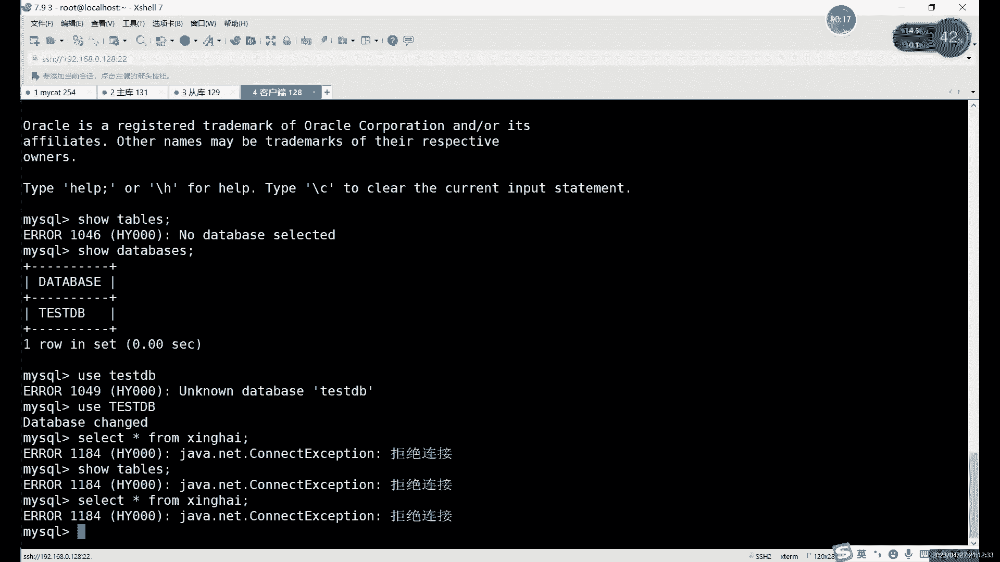
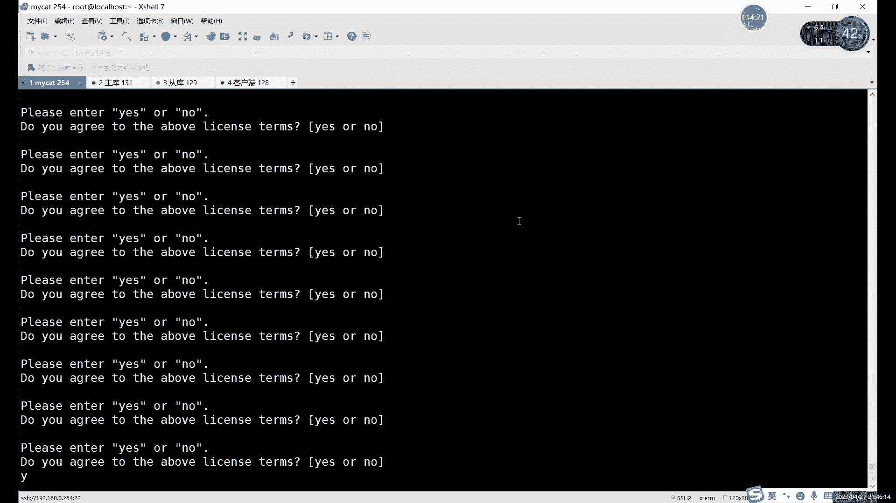

# 零基础入门Linux，红帽认证全套教程！Linux运维工程师的升职加薪宝典！RHCSA+RHCE+中级运维+云计算课程大合集！ - P84：中级运维-23.读写分离 - 广厦千万- - BV1ns4y1r7A2

192。168。0。没。131。啊，主库IP冒号端口啊3306。啊，这个就是什么？这个就是第一个啊，第一个主库啊，默认没有写从，对吧？没有没有写读读怎么写？读的话，大家注意啊就是。一定要添加在哪呢？

一定要添加在这里。啊，添到这个位置。就添加到这个right host里边，就这里不是rightite嘛，对吧？这是rightite前前面是括号，后面的括号。😡，啊，前面那括号后边括号。

然后这里的话中间用什么？中间用readd host。啊，联接方式。啊，你说这里是吧，不能用，这个不能用JDBC的JDBC的话，重启会报错啊，得完 negative。嗯。然后read host这里的话。

我们用什么？我们用这个正常的话盒上面写着按照上面写就可以，对吧？readd host。首先第一个hosse这个名字名字其实这个不重要啊，这个其实也不是主机名啊，它就是代表一个。

你们是你可以把这个写成什么就可以写成主户重户这样啊，写成主户重户这样，这个无所谓的。啊，后s一类无疑。然后呢，后边的URL这个是这个必须要写对啊，这个必须要写对，就是我们的哦，对，这里还有GDBC是吧？

好，你看到这里。这里的话其实简单写URL直接怎么行呢。😡，前面都删了就行。啊，不要写这不能写连JDBC的。因为JDBC刚才我们不是刚把这个JDBC改了嘛，对吧？然后这里的话是192。168点。

0点这个是129。

冒号3306。对吧然后呢user后边就一样啊，后面就是什么？就是我们的。😡，数据库授权的。总觉这里少了个括号。啊，至少的问ID引号啊。嗯。然，最后一个是pasword。没。啊，这样的话就可以了。

然后最后再加一个什么？最后结尾呢再收一个再来一个括号。啊，是要有始有终啊要有始有终。你前面啊用readd host开头，后边就用用readd host结尾。啊，前面怎么开始，后面怎么结尾啊，相当于。

这里的话其实就是什么？就是在my开里边的话，其实就是相当于是让每一个同库呢，就是属于它它都有自己的一个主库。啊。你相当于什么呢？相当于是这个。一个这里的话其实相当于一组一组数据库，对吧？分为读个写。

然后这里上面设置策略的话，其实就针对于他们进行设置，对吧？比如说这个balancebalance3对吧？它俩呢。就是把读解分开，然后呢，switcht这里的话就是什么？就是主库挂掉的话。

可以让什么让储库可以临时顶上来啊，临时顶上来。这个就是什么？这个就是我们的。啊，这个就是我们这个毒液分离的这个配置啊，配置怎么说呢？能修改地方比较多。大家做的时候呢。仔细看笔记啊，仔细看笔记。因为。

你错一个单词，错一个字母，它就没办法重启啊，他没办法重启。啊，这里的话我们可以直接连接啊啊，就可以重启之后呢，连接来看一下，看一下效果。

啊，这个就是配置啊，这些就是配置啊，配置之后的话，我们一会儿。啊，一会儿再重启一下，然后连上之后，我们看看效果啊看看效果。好，我们这里的话就。马上啊这退出文件，然后重启一下我们的这个麦ad，刚启动其实。

命令其实都差不多，对吧？那无非就是star stop。啊reister这些。啊，比如说我们可以看一下。有没有restar命令啊？有restar restartstar的话就是它先停止，然后再启动啊。

你看先stop，然后再star。那其实就你你只分开执行两个命令也是一样的啊，分开执行两个命令也是一样的。然后呢，我们接下来的话就是。启动之后是吧现在呢虽然说它没有报错，对吧？你看一个stop，然后呢。

start还是started对吧？还是started，但其实呢它不一定启动了。啊，他们因为没有什么没有没报star的，对吧？它只有stop，就是已经关闭，但是它没有报已经启动。

所以说我们要看一下这个状态对不对啊，怎么看状态就是t。SKATUS啊daters啊，is running那就没问题了。啊，是置已 runningning的话，这里的话就就相当于是mad已经启动了啊。

已经启动了。啊，如果说。没启动的话，它一般就是报存的，我们先给它关了吧，我们先给它关一下。大家可以我给大家看一下，没启动，它是报什啊，就是先stop。然后呢，再看看ts啊。

就是is not running。就是如果说大家啊修改这个文件报错了啊，我们看状态的话，它是什么呢？就是is not running。😊，就是你做完之后呢，你重启好之后呢，不要急着去连接。

因为连接它因为它这里是看不出对错的就是看不出是否正常的啊，这个是一个问有一是一个缺点啊，但是影响不大。在这里的话就是它已已经starting啊，已经已经启动的话，再用什么，再用这个看一下。

如果是runing的话就没问题。如果是not running的话，就说明什么呢？说明我们的这个配置文件有问题啊，就修改有问题。格式一般没什么事啊，就是只要你这个格式一般我们按照定位是按照它改的嘛。

主要就是内容里边。😡，哪内容里边可能是有有几个单词错了呀，或者是什么的，这个没有识别到啊。这些东西啊你需要什么？需要重新再需要改配置文件啊，需要改配置文件。然后这里的话就是。查看这个我看。

🎼查看日志的话，如果说你错了的话，用还是这个命令啊。我看是日志，那个是cl。哎，也不能叫坑。嗯，就这个应该叫什么来着？CON。S o l e。啊，是conser，对是coner恐惧啊也是coner防止。

是conle。然后这里的话就是我们正常启动啊，正常启动。啊，如果说你正常的话，那就什么就是my cat server start start up successful就成功启动。啊。

当然这还有个日志log现那my点log。如果说。如果说错了的话啊，就是如果说你这个有报错。怎么办呢？啊？有报错的话，你就。嗯，其实这个命令其实就能他这个命令的话，如果有错的话，他给你会给你显示。

也不需要看值啊，这个也没必要看制，就这个命令就完全就给你显示出来了。看诉瓦基方能给你完全显示。啊，一般就会提示你哪部分有问题啊，你就去修看注意一下那边啊有哪个字母啊，或者说单词打错了。啊。

或者没有忘记修改了这些。啊，这块就是什么？这个就是。喂，等一下看一下。成功启动。哦，对，现在我们还没有启动，我就说这三组为什么不动啊，我们先起一下啊，先启一下restar先启动。启动之后呢。

我们再看一下conl这个命令。啊，启动之后呢，它执行的话就什么就是意思？already running你经已经准备好启动啊，已经行好准备好运运行了，可以这么说。啊，这块有什么，这就是我们的。啊。

重启成功了，重启成功，接下来就我们就可以来验证了。验证的话大家注意啊。😊，我们需要什么呢？我们需要一个后户端来连接。啊，后端是谁呢？其实无所谓啊。主要是客户端必须要有一个特质，就是你必须要有买这个命令。

没有买这个命令的话，我们没办法连啊，你验证的时候需要连一下。然后这里怎么连呢？首先的话。你这个myad自己肯定是不能连，因为它这里我没有装手，没有装mycycll啊。

没装mycycll这个这个这个虚拟机，然后面两个都是有对吧？可以验证。对吧但是总总感觉用。内部的去验证对吧？不是感觉感觉不是很好，对吧？你可以什么，你可以在。😊。

啊，我就说怎么内存这么高，我开了4台。

啊，我们看一下这个128的，我们把128也连上。

我们用128来测试，对吧？因为128的话，它是一个数据库，这个时据是个数据库。

对吧这台的话我们是什么呢？这台是个。My head。嗯讲。0。128啊，这是麦ad的128。这个是主户的。诶对。254啊131。这名字写错了。这是什么？这个是。啊我是。这台是同库。129。啊。

最后一台我们是可以当做什么？当做客户端，或者说是就客户端吧啊，客户端。128。啊，扣端18，这个话我们是有满足命令啊，有满足命令，我们就可以进行连接。然后大家注意在连接的时候呢，我们怎么去连呢？

首先呢啊我们。

回顾一下刚才说的那三个用户。用哪个用户连呢？就是用最开始的第一个用户，就是我们的。s点叉ML里面指定用户是谁的？root用户对吧？密码是123456对吧？密码是123456。

和我们后边两个密码是不一样的。后边有两个密码的话，我们授权的时候都是一对吧？啊，这是一个这是一个区别啊，一定要注意。如果说大家实在是区分不开哪个用户的话，其实有一个简单方法，就是所有用户三个用户呢。

用户密码都一致就行了。啊，用户码都一致。但这样肯定不太好看，这样肯定是不太好的，就是最能能分清楚，还是可以设置不同的用户，名字也可以不一样，密码也可以不一样。对吧？我们这里的话就是。

第四台。嗯，就在我看一下，嗯，这里设置的话就是。用户那个root，然后是。root和123456对吧？然后我们这里直接用my circlercle。杠1root啊，对，有一个东西还没给他没给大家看。

就是第三个这个如果你正常启动的话。单口号是那个。Macstar。嗯，那 start。嗯。我。这句话是等我会来起己来的。啊，过滤一个杂。嗯。购了一个java，我看看那本号是哪个啊。

3306是我们的数据库啊，另一个是啊对，8066。啊，8006是我们的这个。my cat这个端口号啊，8006，然后呢，这个3306是买社个数据库的。大家可以看到这里其实已经什么已经电力连接了。

等你重启好之后的话，它这里就是我们的这个叫代理服务器呢，会主动去连这几台数据库。啊，他不是说用互联访问的时候，他在连，它已经提前连好了，对吧？因为你如果线连的话，耽误时间呀，对吧？

所以说我们是提前连接好的。😊，啊，今天联也好的这个用户呢哎怎么说呢？也也不用建立啊，其实不用建立。😊，像数据库里边那那两个用户的话，其实在gra命使用的时候就自动创建了。那像这个的话。

其实也不是他们其实。只用来登录的一个用户啊，他们其实呢根本。在系统里面肯定不是对吧？root用户密码不是这个1236456，对吧？它就是一个用来登录的用户。啊，只是用来登录的用户。也就是除了什么。

除了micad这里以外呢，其他地方就根本就不能用。😡，啊，就专门就是相当于是mad这里的专属的一个登录用户啊，你可以这样理解，不需要创建不需要创建。对吧你看我们这个root。肯定不是入制用户，为什么？

因为入ose用户密码这他也不对，对吧？所以说呢这个其实啊你也可以理成一个虚拟的用户吧啊，历成一个虚拟的用户。嗯。啊，这个登录的话，登录就是8066端口啊，806端口。你不能登3306啊。

千万不能登3306。因为什么？因为我们这个micad这边其实没有数据库，它是没有336个端口的这330个端口是谁呢？就是131的对吧？129的。😡，就这两台的。啊，因为我们的主从不是。

就因为我们的配置文件里面不是指定读解分离嘛，对吧？读解分离的话是有这两台的这个信息的。啊，多业分离有这两台信息，所以说呢它这自动连接上了，是吧？从我们这个0。54就是本机嘛连接到我们这个3306上面。

啊，这个话就是什么？这个就是我们这个。啊，这个就是我们的这个。这边有客户端口号，主要给大家看逗口号啊，8066啊。为啥看通口号呢？主要这边就是Mso杠U root杠P123456。然后是。

杠HIP是192。168点。0。1。啊，0。254对吧？0。254，然后呢再加一个杠大P。为什么这里又加了一个呢？因为如果说默认啊就是买这个用户，就是买这个命令，其实默认他登录的它有默认值吧。啊。

就什么就是。户密码是必须写的，后边的杠H，它默认是谁呀？默认是本地啊，所以说你不写的话，就是默认登录本地了。😡，啊，所以这里杠H接写IP，然后杠大P的话，这个命码这个是端口号的意思啊，默认是谁呢？

默认3306，你不写，它就按3306走。所以这里的话我们得加上直接加上8066这个端口号，你不能去连数据库啊，我们是连的谁的，连的是。😊，mad这个软件啊，这个代理服务器。

而且呢这个mad那台上它没有330U端口啊，它就没有336端口没有服务吧，不能说没有端口，就是366端口上没有服务，你访问它也访问不进去。😊，再说这里的话，我们直接执行。嗯，执行的话。报错什么？

报错是连不上0。254，对吧？为啥连不上呢啊。

为啥连不上呢，因为这个。刚恢复快照啊，没关方向墙。哎，还是冒险的问题。这两个应该这他们三应该关了嘛，上节课就关了，对吧？那应该就可以。八分啦。保宝强这家伙怎么说呢？嗯。坏事做尽啊，就很多怎么说呢？

很多这个服务就很多你做实验报错，其实经常防经常就就是防火墙的问题。但你这里。放行端口行不行呢？你放行端口这里大家注意了，你放行的不是3306啊，这你放行3006都没有用啊，我们该放哪端口。

我得放8066。😡，所以为什么一直会经常会强调端口号的这个问题？就是如果说在不过不能关防火墙情况下呢，就只能什么只能选择放心端口的这些做法。啊放心端口呢，那你至少知道这个端口是什么，对吧？

你mysrcle默认3306，对吧？my cat这个是8066。啊，806个端口。啊，这个就是什么？这就是我们的。啊多谢问你。因为读解问题这里的话，其实我们已经怎么已经连接到。😡，啊。

其实算是已经连接到。就我们来看一下这个IOS。N不能啊，受DATABSES吧，来看一下。啊，入库呢叫testDB。😊，对吧是我们指定的那个虚拟数据库。啊，就不是对连接上来是我们虚拟数据库。然后呢。

我们来看一下什么，来看一下这个。里边的数据好吧，来看下这个虚拟数据库里面的数据又是。DSTDB啊，切到paDB里面。啊，千万个进进去，然后s tables。啊，就显示出我们的表格了。啊。

当然呢这个虚拟的。怎么说呢？你说它有隐藏的作用吗？有，但是不多，因为你什么？因为你切换到这个数据库之后呢，你切换到这个数据库里面之后呢，你会发现。啊，你会发现这里tables in。青海对吧？

是我真实的那个数据库的名字。所以说这里的话其实它只是就是。😊，虚拟怎么说呢？这个虚拟只是。首次登录的啊首次登录界面。啊，这次登录界面的话啊，设置了一个虚拟的这个名字啊，设置了一个虚拟的名字。

这个你设置什么都可以啊，这个教程都行啊，主要是它的配置文件里面一定要指定好指定好这个真实的数据库名字，真实的数据库名字就肯定不能错。而且呢它一定要存在。大家注意。

如果配置文件里指定这个真实数据库名字是一定要存在的。你不存在的话，重启是也会报错的啊，重启也会报错的。因为买my cat连接的时候，它是。就是mad重启的时候，它相当于读取了重新读取数据库里面所有内容。

而就是文件，不是数据很容易读取配置文件里所有内容。配置文件里主要包括就是我们读写分类的一些设置，对吧？读写分类设置里边就有什么，就有这些数据库的信息，它要测试什么？他要测试这数库能不能连上连不上的话。

它也会给你报错啊，那么麦ad就不启动啊，这个是啊，这个是也是一个问题，那家一定要注意啊，就是。😊，mad里面写的那个数据库的名字呢，一定要什么？一定要存在啊一定要存在。这个就是什么？这个就是。啊。

这个就是我们的这个。读解分离这里啊验证的话，我们接下来看什么接下来的话看一下这个。我们随便写点数据对吧？随便写点数据。这个是主库，这是重户对吧？这个主库就是重户，我们也可以写数据啊。写数据的话，比如说。

正常你这样正常读写数据的话，其实是什么？其实看不出什么效果啊，其实是看不出什么效果的啊吧就比如说你我们s the新 from。看一下表格，刚才我们插入数据库之后，它应该是121，对吧？啊。

数据肯定没问题。啊，读的话是同重复读的，但我们其实看不出来啊，日语其实暂时还也看不出来。那我们插入一个数据呢，insert into。哎，他入在。嗯。他有哪个位置呢？们插入在1212随便写一个嘛。啊。

随便写一个插入之后呢，我们再来看一下，对吧？1212就可以正常插入。就我们客户端登录上去之后呢啊正常写入读取都没问题，对吧？都没问题。哎，只是这里暂时我们看不出来它到底是从哪儿读的对吧？啊，那怎么办呢？

我们很简单，其实。啊，其实很简单这个事情。只需要什么呢？只需要停止主动复制就好。啊，我们可以先暂时呢把主动复制给停掉。哎，什么意思呢？因为为什么这里我们看不出效果呢？

就因为虽然说它的读取和写入呢是分开的，但是呢因为有这个主动同步哎，有主动复制。我们看不出来这个读解分离的效果。😡，啊，看不出来这个效果，那怎么办呢？我们可以我可以先把这个暂时的关掉。把什么三暂时关。

就把杜杰跟离线暂时呃，不是把主动复制暂时关掉啊，把主动复制暂时关掉。哎。嗯。关的话就是st啊。😡，slave。停止了之后呢，哎呦等一下。啊，这执行错了啊。啊，准确说不应该是在这个地啊，应该是在这个。

系啦。🎼在这个第二个第二个tops live。嗯。🎼啊，停止。停止之后的话，我们先来看一下s slaveve。对吧可以变成no了。现在就主动复制已经关掉了，对吧？关掉之后的话，我们来看一下这边。😊，啊。

正常的读取数据依然没有问题啊，现在我们再插入一次啊，我们再插入一次。嗯，就比如说在这儿。Insert input。再来插入2另外我们再读取。哎，就是什么？就是。没有了对吧，为什么没有了呢？

因为我们把主动复制给关了。😡，读取是从从库据读取，写入呢是写在主库里，对吧？所以说我们的写入没有报错，但是呢没有信息，为什么呢？就是因为主动复制档关掉了啊，临时关掉之后呢，我们就没有数数据了。啊。

这边就是重复不用看啊，我们看主库这边，主库这边是可以看到数据的。我们比如说slect新。在听pro加上这个。🎼对吧12122对吧，又多了个2。啊，为什么多了个尔呢？哎，这就是什么？这就是我们的这个。😡。

关掉这个关掉主动复制的些这这个作用。所以说这个的话就能看出来就能看出来我们的读液分这一个效果，对吧？写的话这是往我们主库里写读呢从从库去读。slashing from。那就只剩1212。啊。

这个就是什么？这就是我们的主铜复制毒液分离对吧？读液分离的效果啊，主要是看毒液分离的效果。啊，能能这样能做到这样的话，就说明什么说明我们的毒液分离就成功了啊，就说明我们毒液分离成功了。啊。

然后的话啊这个我们自然还再把它启动啊，就启动吧start之类。啊，star之类只要启动就可以了啊。启动之后的话，我们会接着同步的。然后这个的话是什么？这个就是我们的这个读解分离这边的一个配置啊。

主要还是mad啊mad读解分离配置。啊，如果说要在这个当然我们这里是设置的什么，我们只是写了一个库，对吧？写了一个库。如果想要写多个库呢，需要在配置文件里面这么写啊。

就VI编辑一下com下的scamer没较插，还是这个还是这个目录啊，不是还是这个文件。啊，不用那个文件，那个server文件的话，只是写一下用户密密码。那个用用户密码的话，随便指定啊随便指定。嗯。

主要就是。直定之后呢。嗯，我们在登录的时候用到登录的时候才会用到那用户，我觉得只在那里在一个地方去用啊，其他地方根本就用不到它也不属于什么系统用户啊，不属于什么这个管理员啊。

它其实你可以看出是一个虚拟虚拟的一个可以看成一个授权用户吧。啊，可以看成一个授权用户。他那root呢他不能算是管理员，对吧？因为你你如果就用那个密码能不能登roT用户呢，他就登不上。啊，他就是登不上。

正常我们的录密码还是啊还是你自己设置的啊，跟那个无关啊跟那个无关。然后这里如果说想要弄多个数据库，也就同步多个数据库的话。

在哪呢？大家我们可以找到什么，找到数据库这部分就行。啊，找到数据库这部分。你看我们这里其实有好多个不同的标签，对吧？你看有这个data load呀，对吧？data host。

然后还有什么还有scamer对吧？这些就各种各样不同的标签。这些标签的话，其实每个标签是对应不同的数据嘛，对吧？每个标签对应不同的数据。嗯。😊，啊，就比如说呢在这个嗯。

那我们数据库制在哪呢？

最上面。最上面这个什么？最上面总体上来说，它是一个什么？它这个就是定义一个数据节点啊，这个只是定义一个数据节点。然后呢，虚拟数据库的名字是这个啊，这是虚拟数据库的名字。然后呢，定义多个的话是。

在这个这里对吧？数据库名字是在这儿。啊，这个是我们数据库的名字。啊，所以说你如果说想要定义什么，就要定义就是添加，不用说添加了，就是给多个库做读解分离的话啊，在这个相当于是在这个叫mad里边。

它其实就是做读页分离。它是针对于什么？它是针对一个库一个库去做的。然后呢，一库一库去做的话，还包括什么包括这个像。嗯，有不同的这个什么有不同的这个主库存库是吧？有不同的主库存库的设置，就是下面这部分。

啊，我们设置这个不不同的数据库的话，就在这啊在这儿。没听清。啊，这个的话就是。正常的话，这里的话其实我们。啊，但是还这样看看还有一个没说对吧，switch type这里。所以这type这里的话是那个叫。

切换的问题啊切换的问题。切换这个东西的话，其实就是什么？就是把重库关掉啊，不是把主库关掉啊，把主库关掉。那就比如我们关一下吧，toptop。不要我不是我不我买这个。啊，关一下。啊，这里关掉了。

关掉之后的话，我们就可以什么呢？关掉之后呢，我们就可以。看一下这边的一个效果，我们先退出来啊，说出再进一下啊，是出来再定一下。呃，比如说我们现在。嗯，啊刚才应该再看一下那个数据的啊。

其实这其实也没关系啊，没关系。这里的话我们再定一次啊，就是mys杠root杠P这些的其实不用变，对吧？因为我们连接的还是什么呢？就是你其实你主库挂，对吧？但是其实我们也不知道，对吧？也不知道。啊。

也不知道。然后后边的话我们把这个。嗯。还是继续进这个数据，大家可以看到没有任何影响。😡，对吧没有任何影响，就是我们进的是哪呢？我们进的其实是我们的这个代理服务器对吧？进的是myca。

所以说对于这个我们用户就客户端访问来说呢，其实没有什么变化，对吧？啊，没有什么变化。啊，这也是什么？这也是这个mad的一个优势啊，mad的优势就是你的主库挂了之后呢，哎就是你的访问其实不受太大影响。啊。

其实当然。如果正常查看的话，确实也没啥关系，对吧？因为我们读的是从哪呢？读的话是从重复去读，对吧？啊，读是从重复去读，所以说呢这些段没什么太大关系啊没什么太大关系。嗯啊，所以说这里的这个。

你给来看一下这个现在的。你接下来还执行刚才的命令。🎼tables啊，没有选择数据库对吧？use啊，或者先看一下数据库吧，DATABSE其实它没有什么变化，对吧？我们切换到这个testB里边。再次击励。

test地V。啊，我们的命运呢我说我们命运其实没什么大要写。但是数据它有大小写。啊，这个表格的名字其实它其实是可以看成数字的，因为它不属于命令啊，命令我们不区分大小写。这个表格其实还是区分的。

就是我们数据还是区分大小写的。啊。然后这里的话我们可以看一下。嗯，直接查询吧，然后再查询一下。Fide from。这边拒绝连接。来个主席。Show tables。没以。我刚才选的是我看一下。

刚才在配置文件里，我们指定的是。balance3，然后呢是switch type一。这里怎么也不应该拒绝连接呀？看一下这里的话我们选择一是什么意思？一的话就是这个。一的话是可以进行主动切换啊。

就是我们关掉这个组织后啊，会给自动切换。会自动电换。这就是有点奇怪，我看下balance，这里三没问题，对吧？这个是我们的主同，就是这个是毒液分离的设置。切换的话，负一是不切换，对吧？一是切换的。

一的切换这里。这台我们本数据库台就关掉了，这个还是正常可以访问的。切换数据库之后，你看设dabb其实还可以，对吧？哎，这怎么有点奇怪。设dbase可以的。然后呢，切换数据库也可以。啊。

但这个dabbase其实属于什么？它其实。也可以看作是。代理服务器上面啊，也可以他到代理服务器上。我们刚才那次重启的话，其实之前它设计协助。这里确实有点奇怪哈。嗯。它这里报的就是什么？

就是那个那个java的连接，它其实是跟什么有关，跟我们这个。这个其实和我们刚才那个跟。谁有点关系，就是和。我们那个叫什么啊，myad对吧？和myad其实有关系。

你看这是因为它这里报错报露成报露和java有关的对吧？java有关的报错。然版本嘛然版本点。看啊之前做的。

我看一下之前做的时候，我用的是哪个版本了。上次。埋凯的怎么复制涂解分离。用的软件包是。mad aber1。8上次用的其实就是这个软件包。

这个没啥问题啊。啊，对，就软件包版本确实就GDK版本的话，它不能太就是尽量是和要求的一样啊，尽量和要求的一样，不能太高。因为太高的话，其实它没有它这个账里面也没有说向下兼容这个问题。所以说太高的话。

它肯定是不能用。但是这里的话其实1。8之前用的就是1。8的，我刚我记得该。嗯。黄墙肯定都关了，这里都能防到。这其实有点奇怪。

嗯。一的话它还是自动行吧，我们必须换一个其他的试。

放个2呗。我重启一下。restar重启一下。

对，它这里已经连接不到什么，连接不到131，对吧？大家可以看到就只能连到这个129。只能连个129。

人能量129的话。常这边访问。嗯。就续连接了，我们退一下。Use test。比密。做个 table。没有数据。好家伙，这报错还是。不好思意思，每次都不一样啊。1184没有付。我不行把这个现再启动了。嗯。

先把主库现在启动啊，这个其实。嗯。不数据这种报错还是可为自见。没。这句话我不行把先把这个先启动啊，先启动。然完之后其实也肯定是正常的，肯正常。到 tables。嗯。这里呢我们不经把主库给关。

重户给关了嘛，只关重户其实是可以。我按道理来说，这个。哦，对，我们这个什么应该是切换了这个。我们这先把这个我们可以把同库关，把同关的话，其实这个可以。城管肯定是可以的，因为。啊。

其实主库同复相当于它是一组一组嘛，主一组，然后呢。把同户关了，这个的话，其实是可以正常正常读的。就你把同步关了的话，其实主库这边。读写其实都能用啊读写都能用。因为主要连的话，其实还是连的是主够。

要连的还是主。同户本来不可能本来很有工作呀，同户这边。刚才不是读解分离组已经验证验证成功了嘛，所以说同复这边其实肯定是正常。12CD我们退出来退出来。然后这边接进端口就只剩什么，只剩下131了，对吧？

只剩131了，129就不监听了。然后这边我们再连一下。又t。D。go tables这下应该是正常的对吧？这下是正常的。然后读写的话，这次。这下读写的话其实都应该是什么？大家都应该是在这个主库上啊。

都应该在主库上。因为从库现在已经挂掉啊，就是挂同库，其实直接挂同库不影响啊直接挂同库不影响。然后我看一下这个这边的这个文件。还有一个文件，它其实是。抗复目下的哎，不对，这个抗复目下的ro。

还有一个文件啊，这个文件里边的话我看一下。

饿死文件。

嗯。Greater host。没有这个吗？

嗯。嗯。啊，这个的话就是。切换这里的话，看啊主库。同步挂角其实不影响同步挂角不影响主户这边的一个运行啊，不影响主户的运行。主户挂掉的话，这边应该还是要什么，还是要设置一个策略啊，还是要设置策略。

就只是在配置文件里指定其实还不够。啊，只在配置文件里面指引的不够。啊，这个的话就是这个的话就是我们这个读解分离这里啊，读解分离这里。嗯。麦凯德其实也不是一个主要作用，不是一个主要做这个。

我们那个高可用的一个软件啊，不是主要做高可用的一个软件。嗯，高可用的这个集群的话，我们在下一节课会讲啊，高可用集我们现在下节课会讲。然后这一课的话，我们主要还是说什么，还是说读液分离的问题啊。

这节课我们还是主要说读液分离的问题。啊，这里读下问题就。啊，已经是可以正常使用啊，对对分离是正常，没问题，也就是。存户负责什么？存户负责读，然后呢，主户负责写。然后呢。

相当于是重库呢能给我们主库分担出很多的这个分担很多的压力，对吧？分担很多压力。那这个就是什么？这个就是我们的这个。嗯。读解分离这里的作用啊读解分离的作用。然后的话这个是mycast的这个读液分离啊。

my读液分离。还有一个是ammi啊ammiber amiber的话，它其实做的更早一些啊，它它其实就是mic的一个前身，就是mic是在NU的基础上升级的啊，它是在ammi基础上升级之后的啊升级之后。

Okay。然后呢，这里的话我们接下来来看一下怎么，接下来就来看一下这个变形虫啊，miber。怎么说呢？它其实和原理上，其实和这个什么原理上和myad是一样的。啊，就原理上是一致的啊，不同点是在哪呢？

不同点实际是这个。嗯，其实my cat就是啊不是米本变形虫这个呢。编同的话是做的非常早啊，它主要就是对什么？主要就是对我们的这个数据户集做一个主从啊，做主从的这个。做水同的配置啊做水同的配置。然后呢。

这个。它和这个my cat的一个读解分离的。配置是不太一样的啊，就和配置不太一样。就比如说呢我们在macad里面其实是。相当于把什么呢？相当于把这个主库和存库分组了，对吧？我们从复这写在主库里边呢。啊。

就是从复制写在主库里面的。而像这个mic就是像meber的话，这个其实。嗯。嗯，的话，它其实什么？它其实是把这个。所有的这个主库和所有的存库呢啊分成了两部分。啊，分成两部分，什么意思呢？就是。

主库的就是。啊vi本变形虫的话是给主库分配一个什么呢？

这个PPT里面没写啊，大家不用直接可以可以可可以看笔记啊，miber呢它是给什么？它相当于是给我们所有的主库呢。分了一个分分了一部分。相当于是把什么？就是把我们这个。他不是说把多的请求嘛，就是。嗯。

就是把所有的这个任务吧。啊，也不能说是任为其实也不对。准确来说的话。就是这样。啊，mememe里边的话，其实是把两把从库和主库呢分成两部分。对他俩之间就没关系了。啊，就是当然它主动复制还是有关系的。

除了是主动复制以外就没有任何关系了。和这个mad不太一样，对吧？mad之前的话，其实是我们是什么呢？就是一个主库里边。不是当时是怎么写的，我看看啊。对吧一个主库里边我是包含什么？包含了同步的。

对包含了重复里面也可以什么，也可以包含多个重复。啊，就一个主库里面相当于是和一个和几个同户弄成了一组。然后说如果说想要如果有多个从多个主库的话，怎么办呢啊。这个和两边就不太一样，就这里画条线分开啊。

myad这边的话，它是如果有多个主库的话。啊，如果有多个主库的话，就是每个主库的话，它要它都是分成一组的，一个主库一组。然后里边呢自己呢去。分配同库同户可以是一个，可以是两个啊，可以是一个可以是两个。

啊，就像这样。然后呢，像这个。啊米本变形虫这边的话，它是它怎么怎么做这个毒液分离呢？就是。比如说其实呢数量的话，比如说我们就是两个组四个同吧啊两个组四个同，我们其实这边是这样。就是左边呢我分成了两个柱。

然后右边呢分成4个从。啊，这个就是他俩的一个区别。其他地方就没什么太大的不一样的地方，就是这两就是这在这个地方。myad的话它是什么？就是把主从啊，就是把每个主分别带一对啊分别带一对。

如果说有三个组的话，是要需要再开一个再开一组的。啊，有三第三个组的话，要再开一组。然后像这个编译虫这边的话，就是组合从完全分开了。这边呢就是完全这边就只负责什么，这边就只负责这个写的操作，对吧？

这边只负责写的操作，全部由这些主来完成。接从的话就负责读。这么做的好处是什么呢？这么做的好处是。meber这边的这个负载均衡其实做的还是还是可以的啊，就这这样写的话，你其实负载均衡比较好做啊，为什么呢？

就是你组的负载均衡，就比如说。我们一共有100条数据，对吧？有100条插入的，比如说这个inser命令吧，100条insert命令的话，我们这边就可以什么？就是你50条对吧？给你分50条。

给我分50条这样去分啊。这样的话它其实做这个负载均分比较好做？你像读这边也是100条slide语句是吧？一人25条。啊，这样的话，每一个同库它的压力呢，每一个主库也好啊，同库也好啊，压力就没有那么大。

然后像这边的这个负载的话，它其实。我说呀。啊，它里面甚至还有什么，还有随机分，对吧？大家我刚才不是在说那个。balance的时候对吧？那个balance就是mi配置文件里面balance。

其实就是那个关于负载均衡的问题。啊，关于负产经的问题。他这边其实还有什么，还有随机分啊，还有随机分，还有主库也一起参与什么，一起参与这个平均分啊，所以说它里这里边其实有很多就是。怎么说呢？

他这边其实很多就是死飞机的种啊，飞机走的就是每一个从库。就比如说拿读操作来说吧。啊，就比如我们还是选刚才那个banlan3，因为banlan12的话，这个实在是banlan12的话。

主库这边还要负责读啊，所以说主库压力加主库压力还是比较大。啊，能最大程度减轻储库压力的话，其实就是什么？就是用balance3嘛。balance3的话就是读写完全分开。读写分开的话。读写是分开了对吧？

这边主只负责写啊，他们只负责读。这边负责读的时候呢。啊它还没不能设置，不能设置这个像avier这边的这个负载均衡，它是一个随机状态啊，它是这个随机状态。所以说这里的话其实这个负载的话这个。

月本其实更好做一些啊，做的更好一些。啊，在负载上，因为什么？因为你看这里它的分组呢，它就是完全把主从分开了。像myad这边的话，它其实就是主从是在一体的，相当于主从是一体的。啊，主动是一体的。

有一个植啊，至少带一个呃，不是不能说至少带一个吧。其实mi里边你只有如果只有一个数据库，其实也是可以的啊，不是，就是mad这边只有一个数据库也行。啊，就一个主妇自己一组。然后呢，至少是带一个从啊。

一个组至少带一个从。啊，相当于是他为什么这样分呢？其实myad是这样考虑的，并不是说mad不不是说micad不好啊，就是它的负载做的确实没有这个好。那，为什么他要这样做呢？啊，明知道不好。

为什么要这样做呢？就是把主从分组呢？其实这个主要是为了什么呢？啊，这个就是主要为了这个。主动切换啊，这个主要为了主动切换，这样你分开组的话。啊，不管是从挂了也好啊，主挂理也好的话，就更方便切换一些。

你像这边的话，如果说。啊，不能说，如果说吧，这边就没有这个切换功能啊，就是mibermiber缺点是吧？miber它没有切换功能。就是主从之间的。没办法，今况。啊，你没办法自动切换。啊。

这个就是它一个缺点，手动切换大家都可以切啊啊，手动切的话，你就做个主筒也可以切换。啊，这边这边是ameber这个缺点。啊，总体上来说的话。my cat的优势是什么？mad的话优势是它有自自动切换的功能。

而这个米ber尔这个变形虫这边的话，它的优势是什么？就是负载啊，它的优势负载方键做的比较好一些。当然了，这个高可用的这个什么自动切换呢？我们要一般还是用什么？一般还是用这个我们下节课讲的这个。MA啊。

还如我下节课讲的MACA更多一些啊，用这个更多一些。啊，所以说我们接下来的话就来具体说一下这个变缘虫这边啊。总体上配置不配置的话，这边要简单一些，就是ammi配置稍微简单一点。

因为这个ipad这边因为配置文件太长啊，配置文件太长，修改东西实在太多了啊，修改东西实在太多啊。amil这边的话就主要就是。😊，它里面的配置就像我这个图里面画的。😡，啊，几个组呢写在一块，对吧？

几个铜写在一块。那就可以了。啊，这个就是什么？这个就是meber这边的这个特点。总体上来说呢。嗯，如果只是单纯的做这个读解分离的话，更推荐什么？更推荐本。啊，如果说哎呦啊啊点没了啊。如果说呢。

如果说除了这个主从。就是除除了读解分离以外吧啊除了读解分离以外呢啊你还要考虑其他的一些功能。就比如说这些。买呃就是买s的一些优化内容啊，分固分表这些啊。

这miber是没有这些功能的那就什么更推荐这个myca一些啊，更推myca一些。这个是两软件一个选择吧，其实都可以啊都可以。啊，接下来的话我们。具体说一下么，具体说一下这ammiber。啊。

安装也是一样的。JDK啊。然后这个JDV它的要求是1。6的啊，它这个是1。6的版本。比它呢稍微小一点啊，这也就能看出来什么。就是嗯他的时代他的时间要比他早一些，对吧？他他要求是1。7，他要求是1。6嘛。

对吧？他这个其实。这说明这个meber它其实就是就是比micad。更早一些啊更早一批的一个软件。啊，好了大家可以。下课休息几分钟，我们一会儿回来呢，继续讲这个amimeber啊，继续讲ammeber。

这个的话总体上安装上来是吧，其实和m是一样的。啊，就是换个换个GDK版本啊，换DDK版本。我看一下1。81。6。1。8高了两个版本。啊，更稳一些的话，我们还是什么？还是用1。6吧啊，用这个1。8的话。

高良本本的话，这个声说不好。你好啊。这边的部署的话。首先的话就是这个。DDK环境对吧？我们就换一下环境嘛啊，就把这个八换成6。然后的话我们这里就。看一下0。254对吧？0。254，我直接会快照。嗯。

都快到比删除快点，对吧？删除的话也得删。下好几个文件，还得把这这个环境变量里面那些也删掉，我们自就直接恢复拍照啊，恢复拍照了。这个快不快的再重新连接一下，然后我们把这个1。6的那个包呢。拖进去啊。1。

6。Yeah。

对。啊，这里的话我找一下那个包啊，这DK1。6的话。ADK1。6。

啊，就直接拖进来这个包的话。

啊，怎么说呢？这个包的安装其实。更简单一点啊更简单一点。嗯，不过这个的话和刚才那个压缩包还是有点区别的。这个包的话是。他是怎么安装呢？他是把这个。直接执行一下我们这个。JDK6JDK1。6的这个。啊。

一点一点兵这个结尾的话，它是一一般就是执行文件啊。执行之后的话，它是相当于执行了一个安装的脚本啊，这里类似于执行安装的脚本啊，我们这里可以安装一下。

那首先的话它得有什么？你要执行的话，必须要有什么，要有执行权限。所以说呢要加上X。啊，下个S。给执行权限之后的话，我们点杠我们直接执行一下JDK。柳由。然后呢。拉到这个最下边啊最下面。嗯。啊。

拉到下面之后呢，输入ys啊，这里的话你回车打多了啊。😊。

