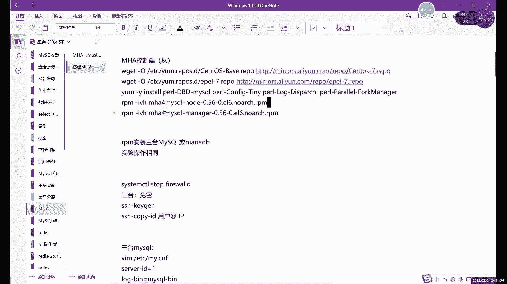

# 零基础入门Linux，红帽认证全套教程！Linux运维工程师的升职加薪宝典！RHCSA+RHCE+中级运维+云计算课程大合集！ - P86：中级运维-25.MHA高可用，视图 - 广厦千万- - BV1ns4y1r7A2

好，我们今天的话继续来讲关于mycircle的这个机群问题，对吧？啊，上节课的话我们最后讲的什么？最后讲的是读写分离，对吧？之前也讲过主从。啊，这两种啊处理基因的方式的话，其实第一个对吧？主从的话。

我们最开始讲它是为什么呢？啊，其实就是一个什么就是一个。知得备份。啊，就单纯的主从的话，它其实只有什么？只有实时备份的功能啊，只有实时备份的功能。啊，加上什么呢？就加上这个。读写分离之后呢啊其实是什么？

其实就是我们的存库呢，可以给什么？可以给我们主库呢去分担很多压力，对吧？分担很多这个读写上的压力，对吧？比如说我们就去把什么把读的操作全部交给从库，写的操作呢交给主库，这样的话能减轻什么？

减轻我们整个集群的一个压力。那么整个集群出现宕机的这种情况的话，概率就比较小了，对吧？啊，这是读写和离意这方面的主要作用。那今天我们讲的这个呢，它叫高可用。啊。

这个也是我们集群里边啊最重要的一个什么最重要的一个。需要解决的问题。因为什么？因为我们集群里面其实有已经有很多台，对吧？就比如说拿我们马来说，很多台数据库。对吧很多台数据库。那这么多台数据库呢。

如果说哎某一台呢。啊，由于客观原因。啊，可能是因为什么？可能是因为硬件的问题。啊，也有可能是因为我们哎就处理请请求量，哎，就是用户请求量太高了。啊，并发跟不上。啊，出现了，这相当于是。访问量太大啊。

出现了宕机啊，不管是什么原因吧啊，或者说一些客观的啊断电也好啊，像这些。啊，断电也好，像断网也好，这种这种故这种不可预测的这种故障之后，对吧？啊，难免的会出现一些偶尔会出现宕机啊。

或者说是啊如果是网络断了的话，可能也会出现。用户就连接不上了，对吧？啊，出现这种情况。那，出现这种情况，如果是如果全部整个集群出现了问题，那这个没办法那，如果只是一台啊，就是我们集群当中一台出现了故障。

怎么才能让我们正集群正常继续运行啊，就不影响整个集群啊，就一台故障了，不影响整个集群。那这个时候就需要什么？需要我们高可用。按这样的软件来做。啊，这样的软件当然其实和读解功力也一样啊，软件其实。啊。

不不只有一个对吧？这个是我我们今天讲的是这个MACA是买cycl里面一个比较常用的一个高可动的一个软件啊，高可动的一个软件。它的一个主要功能呢，其实就是什么？就是我们的mysql的高可用环境下，做什么。

做故障切换啊，以及主动复制的。那么这个软件的话其实就是什么就是。主要就是来做关于mycil的啊，当然可以也可以做mDB。其实也就这俩数据库了。啊，比较专一一点啊，这个软件比较专一。

他就主要是做这两个数据库的一个。故障切换啊以及主动复制的。当然主动复制的话，其实嗯怎么说呢？其实跟这个MHA呢关系不太大啊，主要它的功能是什么呢？它主要功能还是故障切换。哎，故障情况。

主从复制的话是我们自己做的啊，我们自己做的这个主铜的话也是一个前提条件。就是你做这个MAC之前的话，首先先做好一个主从。至少是一组两从，就是这个MHA的话，至少需要一组两重才可以做啊。

一组一从的话不行啊，必须得一组两从。那再多的话也可以，就至少是一株两葱。啊，这个是MACC的一个前提条件啊，就做主从的特位置做这个故障切换的前提条件。啊，在切换过程中的话，它的切换速度呢。😊。

加速度的话其实很快的啊，一般大概是0到30秒，是30秒是有点多。基本上。按我平时这个故障测试的来看的话，基本上0到10秒。0到10秒基本上就能完全可故障消化啊，也是非常快。😡，然后呢。

在这个故障切换的过程中呢啊数据的一致性的话，它是通过怎么什么去保证的呢？这个这个其实跟谁有关系呢？跟我们的主动复制有关。啊，跟主动复制有关系。啊，我们这里其实就是通过这个主动复制啊。

主库从库复制了主库的数据，对吧？啊，实时都在复制主库的数据啊，如果说有一个数据库，比如说主库吧，一般其实就是我们高可用的话，其实就是主要针对于谁呢？就针对于主库或者说主服务器出现故障之后的。

我们进行一个切换。从服务器出现故障，其实影响嘛，其实影响不大，对吧？对整个业务其实稍微有点影响，对吧？但影响不大，整个业务呢是可以正常运行的对吧？就比如说因为我们的从库呢主要就是负责读，对吧？

负责同步数据。少一台呢啊其实就是这么少一台其实。😡，也可以继续用啊，就是另一台的哎，这个同库呢可能压力变变得比较大了。但是整个集群呢还是正常运行的。但是呢如果说你是主库挂了的话啊。

我们的高可用的其实主要还是针对于主库主副器。因为主务器你提供的是写对吧？提供的是写入的操作。😡，尤于像我们之前做的啊，对吧？一组两从，你读物挂了，读能继续读，对吧？这个没问题，那这写怎么办呢？

没办法写了。那这个时候呢这个故障切换呢其实就是什么？就是将一台同库。😡，啊，切换成什么？切换成主库来用。啊，你要从库相换成主库。然后呢，剩余的其他同步呢，我们。现在就将这个新的主库啊，就是相当于是主从。

相当于给这个新的主库再做一次主从。当然呢不用我们去做啊，这个是自动去做自动替换。这里这个自动切换的话，其实或者说故障切换吧啊。第一的话就是如果主库故障了，将一个存库切换成主库。

然后其他的存库呢哎就将这个新的库呢作为什么作为主库来用啊，就相当于再给这个主库做一次主动复制，再去复制这个主库的数据啊，这个是故障切换的一个全过程，并不是说仅仅仅是简简单单只切换一些主库，对吧？

它包括这个主动复制，也一块帮忙去做了个迁移啊，简单的做了个迁移。你这个就是故障切换的一个作用功能吧。然后呢，这个我们今天要讲这个软件，它叫什么？它叫MAC。啊，其实就是。全写比较长，对吧？

你平时就就记住MACMMAC就行了。那全写就是什么？就是master就主嘛，对吧？hi就是高啊va就是可用的高可用嘛，对吧？这个人呢就是他全身，他全身叫合和高可用。啊，主库主服器的导口用。啊。

为什么重复器没必要呢？其实因为重复器不管一般情况下，集群里面重复器一定是比主副器多的对吧？所以说呢。尤其是像至至少我们肯定一个集群里面，这个尤其像你这个MHA。啊，你如果没有一组两从，其实不能做啊。

就重服务器肯定是要比主服务器要多。所以说呢重服务器偶尔挂个一台锁，一台两台呢。啊，当然如果是一组两层的话，最多只能挂一台啊，最多只能挂一台啊，挂个一台呢不影响整体。

所以说呢我们这个高可功能主要还是针对于主库的啊，我们这高可硬行主主要针对于主库。然后这些组成的话，其实我们是有两部分组成的，就是这个软件。啊，这个里这个里的话其实类似于什么？它类似于一个。

这个软件它类似于一个它有一个小小的监控功能吧啊它也不是主不是主要做监控的软件。但是呢一般情况下呢做这个。故障切换啊对吧？主存切换的一些软件呢，其实都是有监控功能的。什么意思呢？

就是我们这里一共是分为两部分，就是我们的MH其实是分为两部分的。一个呢它叫什么？一个叫node数据节点，一个叫manager的管理节点。就是我们总总体这样的故障相换呢是由谁来控制呢？由man者来控制。

啊，那node呢就是我们的数据节点。那什么意思呢？就是我们的数据库。啊，这些node的话其实就是一个一个的数据库。就正常在我们一个买搜集群里边，你有几个数据库的话，我们一般就会部署几个的。

部署几个node节点。就是运行在每台买四个服务器上，不管你是主还是从颜，不管你是主也好，从也好啊，都一样。都可以做什么？都可以做这个。不是不是不是都可以做吧，应该是都必须得安装这个。

都必须要安装这个MHA nodeode。啊，这个软件。安装好之后呢话，它其实就相当于客户端了。啊，你把它可以把它简单看成一个客户端。那服务端或者说控制到是谁呢？就是这个maner。😡。

meer节点的话可以什么？它就可一般是单独部署在一台独立服务器上。啊，或者呢也倒也可以部署在数据库里边。但是一般这样其实不太好啊，一般情况下就是单独部署在一台独立的服务器上。用来什么？

它就是用来管理我们整个的。买是的集群。这里的话管理的话，它其实就是什么？它其实就是直接去管理这些node节点，对吧？因为我们每台数据库上我们都是装了一个node，对吧？啊，装了一个node之后的话。

它其实就是通过maner节点和node节点之间的一个通信。来确保啊或者说来检测我们的数据库是否正常运行了。如果是正常运行状态的话，那就没事，无事发生，对吧？相当于无无事发生。

那如果说哎某一台数据库发生故障。嗯，主要还是这里主要还是说主库啊，这里还主要说主库。如果说主库发生了故障。啊，它检测到连接不到主库了啊，这个时候呢啊它就会将剩余的存库里面啊。

它会从剩余存库里边啊拿一个存库出来啊，作为我们新的主库。啊，这个具体拿谁呢？这个一般啊如果说没有设置的情况下呢，就是默认情况下，他会拿有最新数据的这个存库。啊，如果说你提前设置了谁成为主。

谁谁不不能成为主的话，这个因为我们这个manage这里是可以设置的。如果提前设置的话，就是你设置好的那个数据库当成主。啊，没有设置的话，就是用最新数据的啊，有最新数据这个同步的作为新的主。啊。

为什么要以最新数据的重库，要有最新数据的重库作为新的组呢？是吧？那肯定是你数据肯定最新最多的话，你肯定同步的。你做这个主动同步肯定做的是最好的，对吧？反应最快。

所以说呢你作为让这个数据最多的最新的这个重库作为新的主肯定是最合适的。这样的话能避免什么？避免。数据的丢失啊，就用最新的这个数据嘛啊用最新的数据。啊。

这个就是什么这个就是我们MMAC这边两个组成部分node和mind这两个的话其实是两个分开的包啊，就是我们挨在安装的时候是分开去装的，就是在买scle上边呢，就是在我们数据库上。对啊我们这是这里的话。

还是用什么，还是用一触两从，对吧？之前用上节课那个其实就可以。啊，还是用上节课那个就这两重呃，最好还是恢复一下快照啊，当然不恢复也行，不恢复的话其实嗯。😊，你把那些创建那些库可以先删一删。

或者说呢统一一下也可以。啊，就是你如果说上节课那一主两从还是正常的情况下，没有做其他太多的改动的话，其实还可以直接用啊啊是可以直接用。就是你上节课的一嘱两重。啊，如果说其中有一个数据不太一样了。

你一定要保证什么？一定要保证这个。这三台数据库之间数据保持一致啊，数据保持一致，不一致的话，后边同步还是会出点问题。啊，影响不太大，就是。同步数据的时候。

slave就是show slaveve status啊，那个状态看起来是没问题，对吧？是两个yes，但是你同步注去，如果说你少了个表格啊，少了库什么的话，这些。你就同步不到数据了，对吧？

所以说呢提前统一一下几个数据库之间的数据，确保一组两从正常上就可以接着做这个MACA了。啊，确保。诶。然后呢，这里的话我们看一下。一周两层。一周两重的话，我这里好像不小不小心恢复来快照。

我自己在网像恢复快照。想一想啊。啊，这里的话最好是什么呢？最好像是。四台啊，这还是四台之后。一台呢主库对吧？两台同库啊，一台主库两台同库，然后剩下一台做什么？剩下一台是我们做管理节点。

那三台的我们就装一下这个node节点就行。然后呢，管理节点的话，这两个软件都要装。按照管理节点的话，自己要装一个node，再装一个manageer啊，再装一个maner。Okay。啊，所以说这里的话。

😊，这里的话这个。看一下。比如两从。完了，我恢复拍照。主层这里有灰快照，那我这里就快快点部署一下吧，我这里好像没有，应该没有那个一组两层的这个快照，我看一下。没有的话，这里就快点做一下啊，快点做一下。

然后呢。

做之前的话最好是什么？最好。第一的话，大家记得啊，一定要记得这一步啊，放防火墙好吧。这第一步。就四台的话，你不管是你后边不管做什么实验，对吧？你恢复快照也好啊，就是不管是做什么也好，最好第一步就是什么。

第一步就是恢复快照，呸，不是回复，就是把防火墙关了啊。如果你不关防火墙的话，这个东西怎么说呢？😊，他总会在最关键的时候就给你报错。啊，因为如果说就是这一个叫。几台虚拟机之间不连接的话。

其实关不关防火墙没什么太大影响。一旦出现了，如果说要连接了，就比如说我们的这个重复制。对吧一定要一旦要要连了，其实。防火墙就给你拦截了啊，就给你拦截了。然后这里的话后边两台的话，我们把这个。

改一下啊改一下配置文件。응。嗯，我看ETCR的卖点真在。我把啲大铲。复制选项这里我们改一下数字就行了啊，只要不一样就可以。啊，把一改成2，然后重启一下就可以。其他的没什么需要修改的。

就是我们正常做主虫ET下的啊user下logo下的myservgo。你睇。嗯。这台是没有恢复快照呢。0。25啊。这来是2，那这来是3。这台的话我们就作为什么？这这台没有什么？没有这个。哎。

这是哪台没有恢复。142143。142这台的话是主库，那我们这台就我先把名字写一下吧，不然这四台就分不清楚啊。嗯，142。这台的话是同库143。

144。

啊，这台144。诶。嗯，哦，关于这个我们的这个数据库的一个高可用的话，其实工具很多啊，工具是很多的MAA只是其中一个。啊，这是其中一个，像还有什么，还有这个sla也可以用，对吧？像这个。

就是这个MH买s的话，其实它。买这个应该自己也是有一个这个高可用的一个软件的啊，也是有一个高可用软件。就是这个的话，就不管说你是做读写分离也好，做主从也是做这个。高可用也好，其实软件都不止一个啊。

软件不止一个，具体用哪个呢？这个其实。如果你能定的话，就看你习惯。如果你定不了的话，那你就只能现学。看。有时候这种东西只能是这个的话，我们就用管理节点啊，NAJER啊，这个也不一定由得你啊。

这个254啊，慢一点，这个我们就管理节点管理节点的话不需要装数据库啊，和我们上节课那个主解跟你一样，就是代理服务器也好啊，就管理节点也好，其实都可以不用装什么，都可以。不用装这个。嗯。

不用装这个叫什么嗯数据库啊，这只需要装什么，只需要装这个。node节点和mage节点就可以了。我这里看一下啊这三个方向险防护墙，我们这次这台的。编辑一下。嗯。这个是二这个要成二是吧？啊。

刚才顺序有点不太对。就改个3。同时先买sgo，然后这边里边改个2吧。第一个我们就默认让它是一就行了。啊，E天呃user下只要三个不一样就可以。找到我们的复制选项就改改一下ID。统启之后的话。

我们就直接进到哪，直接进到数据库里面，我们直接授权就行。然后这里的授权的话，大家注意一下，这里首先。我们这里授权我们就就做全一点吧啊，不仅仅只是单做主从的授权。好吧，我们这里就就相当于是。

主从和这个MH一起说了啊，就主从需要注意的和MHA需要注意的，我们一起说。首先的话，主从的授权的话，可能就是主库允许后边两个从库访问，对吧？那MH的授权的话，因为我们的控制节点在哪在这个位置，对吧？啊。

在这个位置，它是控制节点。在这个MAC里边的话，我们控制点需要能访问到后边的几台数据库，对吧？这个肯定能理解，你不能访问的话，肯定也不能做这个切换嘛。

所以说呢所来就是managage节点肯定要全部都能访问这些数据库。所以说呢授权啊就是所有的数据库都需要给这个。有么有控制电去授权。所以说呢其实。如果大家想偷懒，那其实最简单的视权方法就是。嗯。

啊run啊嗯这样授权就行。对这样的话肯定偷懒嘛会简单一点。啊，这样的话其实就。🤧怎么说呢？嗯。Oh。处以所有权限，包括访问权限，包括这个主从的权限都在里边，对吧？就相当于一次性授权。

如果你想分开授权的话，哎也不反对啊，也可以啊，那样的话你得多打几条命令。如果像一条一条命令解决我们这个MACA里边的这个授权的话，那就是grant心点耳钉啊，处谁呢？可这不重要，对吧？

因为你如果这里要写的话，其实准确来说你得写。如果分IP去写的话，你要写3个IP是吧？分IP群，你要去写3个IP。所以说这里的话我们一般就是。简想简单点写就写。对吧root at什么啊，加上我们这个。

所有的这个。相当于允许所有访问了啊，允许足有访问。密码这里的话，我看一下密码。简单点就行啊。这的话就相当于什么？就相当于是既允许主同的主从的授权，也允许谁呢？也允许我们的控制界限的授权。

所以说呢这个授权呢其实我们可以让后边两个数据库也一起执行。😊，啊，因为后边两个数据库也需要授权的，因为控制节点需要访问到我们这个所有的数据库啊，所以说所有数据库都需要授权。啊，这个是最简单的。

如果说你想准确一点的话，其实就是写谁呢？就写我们控制节点的IP就行了。啊，就在同库里面授权的话，就写控制自己的IP。对吧这就是三个什么三个授权。授权之后的话，接着其实就是。嗯。

Show master status。看一下什么，看一下我们的日志的一个位置就行了。然后后边两台同库我们就直接连接啊，直接连就行嗯。买02的678对吧？And matter。然后我们第一个是。

master host。192。168。0。142啊，90。142的主库。然后第二个是master的user，用户是root。第三个是密码， passwordword对吧？是我们就就简单授权了个一。

对吧？然后第四个是master杠log杠fi，就是日志的名字嗯。02对吧？02。两两零领。02。最后一个是master。杠log杠position就是位置。从哪具体从哪个位置开始复制，对吧？

我们是678啊这个位置。要乘8字数，然后两边库两边的这个。团购是一样的啊，一一会儿复制一下就行了。然后start slave。So slave status。嗯。有报错。这报错的话。

日志名字文日志名字的文不是日志文件的名字写错了，我看一下啊。买首狗讲。哦，杠杠是中间的杠，不是下划线啊。啊，如果说大家这个做主动出现了出现报错之后的话，最好是什么？最好是首先第一个先stop类。

就是你先停掉你的。SLAVE先停掉，停止之后呢，再写一次这个千加蛙啊，这里下划线写在下面。应该是中间啊，中间那岗不是下划线，然后你复制一下。复制一下，把这个杠改过来就行。刚才打的是啥来着？

但这没有显示权。我们启动一下，看看状态吧。我复制过来的话，它这就显示了一半啊。嗯。啊，没问题，梁yes。我们再直接复制到这边啊，也一样。把这个杠改一下就行。然后start slave啊就可以。嗯。

对吧两个线都页词验证的话，我们不验证的啊，因为我们的数据肯定数据是一样的啊，两个页词之后呢，只要你默认的数据一样，那你主从肯定是可以成功的啊，主从肯定可以成功。然后这里的话就是一组两从。啊。

之下我们这个数据库这里的主从没问题了啊，但是呢先要退出来啊，就是我们因为我们还是主要要做这个MHA就是而且MAC的配置呢不在数据库里边啊，大家注意就是MAC的配置不在数据库里。😊，啊，不在数据库里面。

系。

然后这里的话我们来看一下什么呢。接来做的话，首先刚才也说了，就是每一个节点呢都需要什么？都需要这个安装这个MH node这个软件啊，就每一台都要装。就是你不管是主库也好还是从库也好。啊，都可以。

然后这里的话我们可以看一下这个。看一下软件的话嗯。软件的话可以的给大家先发一下啊，这个就我看在网盘上。

我正常做的话，你三。三台分别分别都把那个包拖拖进去就行了啊，把三台分别都拖进去就可以。系就。啊，这两个。啊，就这两个包。

这两个的话就是直接是RPM吧，大家可以直接，但是它有几个依赖关系啊，有几个依赖关系需要我们提前装一下啊，用样板安装一下就行了。然，这里的话，你提前把这几个包拖进来就可以。一个是maner。

一个是node，你看清楚就行啊，两个包啊。啊，一个是manger，一个node。你如果是控制节点的话，两包都拖一就可以。如果是管理节点的话，只拖一个就行啊，不是，就是我们的node节点就拖一个就行。

就拖这个。就说这个note就可以啊，就有这个就行了。只装这一个包就可以。关进来之后的话，其实依赖专停的话，这个其实嗯。

这个的话笔记里面有写，大家可以直接复制一下啊，这个可以直接复制啊，依赖关系的话在。电脑现在有点卡，打开笔记打开笔记都稍微有点。哎，都不带动啊，在这儿。依赖关系吧，其实包括。两部分吧啊包括两部分。

一个是n节点的依赖。n节点依赖其实很少就一个啊，主要更多的其实是这个managage节点节点依赖稍微多一点啊，稍微多一点。然后这里的话我们可以看一下。啊，首先安装这个首先一主就是主从做好之后。

你可以什么可以来装这个什么可以来装这个。node节点和manger节点安装都很简单，就是直接用RPM装这个包就可以，就需要提前安装一下这几个依赖关系。如果你不提前装的话，你RPM安装的时候。

它就会报错啊，这也其实就是RPM安装的一个缺点吧啊，RPM安装它不会自己自动解决依赖，不会自动解决依赖关系啊，需要我们手动去安装啊，用什么具体安装方式的话，其实。你直接用样码安装就可以啊。因为呢其实。

直接样么装的话，其实样么仓库里面没谁没有的啊，样么仓库里面其实没有。😡，啊，笔记是吧？笔记。我总感觉你应该是有的。啊，我看你应该是有。嗯，睇下电知。安白王鹏君。笔记的话。找一下。啊，再样。啊。

笔记的话也发在网盘上。大家如果说要跟着一起做的话，可以。接下来再。都很小啊，其实其实笔记要比安装包要大。你大家可以看安装包就几0K啊，这个软件的话其实很小，因为它的功能的话只有一个，它就只是做高可用的。

它，没有其他的功能。所以说呢软件还是比较小的啊，软件还是比较小。😊，啊，小一点的话也方便啊，也方便安装。这里的话我们首先你看先是什么？我们先安装一下这个，当后这个呢其实。

我看啊三台那就一起装一下吧。啊如果说你同时几台虚拟机都做同样的操作的话。可以用这个左上用这个工具栏里边的这个发送键入到发送键。啊，就是这个一起输入的意思啊，就是一起输入的意思。

这一块你一个输入到其他三台都一起跟着做啊，就一起跟着做了。嗯，啊，这个的话是。嗯。不用一个一个去执行命令，稍微方便一点。然后这里的话装好之后呢，接下来呢note节点四个都要装啊。

大家注意有note节点的话，四台都要装，所以说呢你就一起装就行了。

你四台一起啊，也不是说单台买sgo就，因为什么？因为我们的这个。manage节点的话也需要note节点这个软件啊，所以说一起安装就可以了，直接执行这个两条命令。一个是安装note节点的依赖关系。

一个是用RPM包啊，就用RPM命令直接去装这个包就可以。

啊，就四台一起执行啊，节省点时间嘛。啊，当然呢。And。在一起装，因为这个软件包其实不是很大啊，就是依赖关系也不是很大。所以说呢安装速度也很快啊，那么快。然后呢，这里的话高可用为什么我们说MHA呢？

就之前上节课我们不是说上节课我们不是讲的my cat这个读写分离嘛，对吧？但是我其实也说了，对吧？它其实能做这个主动切换方向操作，但是呢我一般不会用，就是这个my cat的这个。如果发生故障的话，其实。

他可以做，但是他的缺点呢比较大，就是呢他的这个。故障故障转移啊，或者说这个故障切换的时间花的时间比较长。有可能还会出现一些像失败超时的问题。做是可以做的，但是没有这个MAC效果好。

所以说呢一般情况下我们做这种高可用的话，很少用白ad。啊，它有这个功能，但是我们一般用的少啊，像这个。MHA啊主 paper啊这些用的稍微多一些啊，用的稍微多一些。啊，这里的话就装好了，然后呢。

你再来个回车，你确保一起都穿好了再再回车。不然的话。唉，RPM哦，对，笔记里边的话，我那个。包的这个名字是旧版本啊。嗯。🎼你这个包的话是之前那个是sdows6的。6版本。这个我们是sows8。

不是sote7版本啊。啊，安装的很快，因为这个包特别小啊，包特别小。RPM杠IVH。嗯。Yeah。短这几个包。不太一样啊，不是环境不太一样。我们后边这几台再再执行一次啊，再执行一下。啊。

因为这边它多了多了一个manage节点那个包，所以说呢他在答命令的时候其实不太一样。好吧，这个的话就已经什么就三台里边的。然后这里的话我们再关掉就行了啊，就每一台后备三台数据库的话。

都已经装好这个MHA啊，已经装好这个node节点。不需要什么配置啊，不需要什么配置，就只安装好就行了。接下来的话主要内容的话还是主要在前面啊在我们的控制级别里面操作。然后接下来的话。

装好这个none节点之后呢，下一步是什么？下一步是装manage节点啊，他们三就不用管了，就只要在这里装就行了啊，就是下面这个步骤。mage节点的话，这个依赖稍微多一点啊，就直接用这个。

复制这个就可以了，其实也不用记啊，这些东西依赖关系，其实这种东西没必要记啊。然后安装好这个依赖之后呢，再去安装这个maner这个。

再去安装man的这个。软件啊，卖的软件。

然后在它安装的过程中的话，我们再继续说一下我们的MHA需要注意的地方。就是除了这个主从以外，就一主两从，这个是第一个这是其中一个前提条件。第二个前提条件呢。

对么我们是要让我们的manager能访问到其他三台主库哎，这上台数据库吧啊，访问到其他三台数据库。

对吧那刚才我们做了一个什么呢？刚才其实已经做了一个授权了，对吧？三台数据库都给我们的这个man几点授权了。啊，都已经授过权了。数据库层面的话已经能访问了。但是呢。如果要做组铜的话。

其实或者说是要做这个图切换啊，故障切换的话，其实除了这个数据库的授权以外呢，还需要什么？还需要能正常访问，就是用SSH能连接。啊，连接上去要执行命令嘛，对吧？连接执行一些自自动切换的命令。

所以说呢我们这里需要什么？需要这个SSH。能直接免密登录。啊，但是现在的话，你正常SSH连的话，肯定是能连的，是吧？因为防火墙也关了，但是其实呢关防火墙也不影响SSH对吧？

因为你正常我每次不都是连了他跳之后才关防火墙嘛，就是防火墙默认它不会拦截这个22端口的。但是呢这个。😊，你正常直接SSH的话，大家可以看一下就是。啊，待会我们先把这个manage点先安装上啊。

MHA的manage节点啊，先装上，装上之后的话，我们可以用FS来试一下，对吧？root at。到92。168。0。142都随便连一个。大家可以看到，首先让你输入一个y，这个其实不重要，对吧？

输入个yes嘛，这个其实然后下一步还让你输个密码。对吧就正常的话，你想要。远程登录一个这个叫什么？这个叫。远程的路台设备，不管你讯机也好啊，还是真实的物理服务器也好啊。用SSAH去连接的话。

它都需要让你输密码，对吧？啊，就是你这个想要连接对应的用户的密码，这里不一定root，你连其他用户就是其他用户的密码。😡，对吧这个其实就是啊你正常连的话没问题，你知道密码是可以连的。

但是呢如果说出现了故障的话，manr这边他不知道密码。呃他不知道密码怎么办呢？😡，那这个时候需要我们今天做这个免密登录。啊，每密登录它就是SSH的免密登录啊，作用的话常简单。

就是让什么就是让我们的这台managager能够。直接执行这条命令的时候呢。不用输入密码，也不用输那些yes什么的，确认什么的，只要一输入这个命令，一回车就能连上后边这里台。

啊这个的话就是需要这个也是一个闲置条件，就是直接用SSV就可以直接连接，不需要密码，就是免密登录。啊，这个时候我们也是需要去去填机建配置的一个东西。啊，怎么配置呢？其实四排之间免密登录其实很简单，对吧？

啊，这个其实。

还是这个啊用发送键输入到所有绘话，这个其实非常快。啊，其实这个其实用起来非常方便。

啊，就输入这个之后呢，你在其中一台上打命令，你相当于是在四台里面全部执行了，你只需要打一次的话，其实免密就做完了，对吧？免密的话，其实就是SSH。🎼KY杠。SHSSH杠KY。嗯。🎼哦，对，SSH。

直接先获取一下我们自己的一个密钥。或者说生成一下我们这个。SSH的密钥这里的话它就是写一些路径啊，配置也些什么样，其实不用管它直接全部回车就行了，可以直接用默认的。啊，也可以直接用默认的。

这些的话你可以可以全部回收就行啊，它这里就已经生成密钥了啊，已经生成密钥了。然后呢，直接用什么，直接用SSH杠copy直接拷贝就行了。啊，拷贝到哪呢？直接拷贝到我们对应的几台。192。168。0。

254。啊，第一次拷贝的时候呢，我们是需要输入这个密码的。就是你这里输入过一次之后呢，后边就不用再输密码了。就后边就的话你就可以自动连接了啊，可以直接直接连接了。首先的话第一台我们要写自己。😊，啊。

这里也是比较特殊的一点，就是我们这个。一定要记得写自己啊，就是做明明的时候，MAC这里的话不写自己也不行。啊，也是也不行。然后这里的话，yes。然后呢，写密码就行。对吧这是一台。然后呢，0。142。啊。

这是唉等一下啊，这里输入的什么直接输入密码，对吧？刚才已经说过yes。

这里的话你如果不想打这么多次呢，其实。

也可以用个循环，但是循环的话，你得确保你的密码一样才行啊。然后这里的话这个。四台的话都已经做好了么，这里一台敲完的话，其实后边四台也跟着一起，后边三台也一起跟着做了。

所以说呢你就只需要在一台上面写就行了。然后现在的话你验证其实很简单啊，或者说甚至你一会儿用MH去验证也可以。但这里期间你如果说不放心的话，可以直接用SSroot，然后你随便写一个对吧？0。14144。

啊，随便随便选一个，你回说。啊，就直接连上了对吧？直接连上了。验证一下的话，你就直接看一下这个网卡。

一二三3。对吧0。144吧。这个的话其实就做完美密之后的话，就可以达到这种效果。就是你SSroot at什么什么的时候，就直接就它就直接就连上了，不需要输密码，也不用输那些页子什么的。

这个就是这个就是免密啊就。刚才那么做完之后呢，其实就这几台之间都可以互相连接啊，都可以互相连接。能连上的话，这里就可以什么？就是其实主要还是确保这个manag者能连上其他题材。

这样的话方便执行一些命令啊，执行一些操作。啊，连上之后的话，包括我们刚才的主图已经也已经做完了。其实就是前期条件的话，基本上已经做好了。

当然记得帮防火墙啊，这个已经关掉了。明密登录做好了，对吧？主从也做好了。接下来其实就是什么？就是接下来其实就是这个。关于我们的MHA的个配置。MAC的话，首先刚才我们已经装好了这个manage节点。

对吧？啊，我们其实主要的配置呢也只需要在哪呢？只需要在。

这己做就行了，其他三台呢不用管了。他们只要装好客户端就行了。哎，有那个节点能让我们去监控就OK啊，其他的操作全部都在第一台上做就行。

然后这个的话就是什么？这个就是managage节点这边的话，我们需要做什么呢？其实就是安装好之后呢。主要还是直接编辑配置文件就行啊，主要的配置的话就是在配置文件里面。嗯，不需要在命令行里面执行什么命令。

只要直接修改一下我的主配置文件就行。啊，主要的步骤的话就修改配置文件。然后首先的话我们第一个啊，这里的话其实它有一个默认的配置文件。当然你如果说想自己创建一个也行，对吧？比如说这里按照笔记里面的话。

我们这里就是自己是创建了1个MH的配置文件。啊，随便创建一个就行，然后直接编辑里面内容就可以。然后这里的内容主要包括什么呢？我们一会儿先复制过去吧，我们先复制到那边我们。一个一个说啊。

我们一个一解释这边的配置文件里的内容。

你可在的MHA随便写一题创建一个目录就可以。ATCR的MACA里面的卖点CF。啊，或者CF这些这个名字其实怎么说呢？没那么重要啊没那么重要。然后呢，把这个复制过来之后呢，名字就叫MHA嘛。

卖点3F这个一般就是买so狗的配置文件。复制过来之后呢。这些人的话我们都是需要改的啊，具体怎么改的时间我们先一个一来看啊，一个来看这里的话其实我们涉及到了。😊，一个两个用户。嗯。短接的说的话。

其实不能说一个两个3个。这里应该叫三个用户啊三个用户。啊，首先的话这里呢这个名字的话，我们需要改一下，我们这个不叫MHA我们的授权用户是谁呢？我们授权用户是这个。root对吧？我们授权的是root。

所以说这里我们改成root。啊，大家当然也可以按照笔记里面这个用户。当然你授权的时候，就只要授这个用户用户就行。因为笔记里有记得这个授权的命密的话，授权就是MHA用户。这一块就是你授权的是哪个用户呢？

就用哪个用户的名字就可以啊，下边的授权密码啊，我们刚才的授权的话是root密码是一。啊。然后第三个这个的话是什么呢？第三个是SSH，其实它这前面也标的很明显了，对吧？SSH的用户。

其实就是我们刚才做免密登录那用户。啊，是谁就写谁就行了，这里不需要写密码啊，为什么呢？因为我们的密码已经写过了，就在免密登录的时候，做免密的时候，就已经把密码写上去了。😡，啊。

所以说呢这里的话其实我们不需要加什么，不需要加这个密码啊啊不需要加密码。啊，所以说这里的话其实就是什么？这里我们直接把这个什么呢？把这个。SSH的用户写在这里就可以啊，不用写密码。然后呢。

接下来第三个用户呢。2而。EPLreplication的缩写啊，replication缩写也就是我们主从啊，这里就是我们主从的用户，这个就是主库给重复授权的。这个其实我们刚才为了方便啊。

就是我们授权全部都是用应用。所以说这里的话，其实我们这两个相当于是一样的。啊，这两个其实相当于一样。那正常的话，其实这两个可以授权不同的用户啊，是可以的啊，可以授权不用不同的用户。

就上面的话是数据库授权给 manager访问的。下面这个是主从复制的用户啊，就主从复制授权的用户。这两个用户都不一样。当然我们现在呢因为刚才的授权我们都用的root，同一用的root密码也一样。

所以说我们这里就都改成root一就行。如果不一样的话，注意一下这两个用户区分开啊，上边是数据库给manager的授权。而replication的话就是主从复制之间的那个授权用户。啊。

可以使什么用户其实都可以。只要这个用户能登录啊。就是我们在创建买servle这个用户的时候，其实他不让他登录啊。你如果说想要让他作为登录用户的话，你得让他。

你得先把那个什么把那个禁止登录那个权限给给不是权限吧，就是把他的那个。下ll改成能够正常登录的用户就可以，就是把买搜改成一个普通用户就可以正常登录。现在的话其实他其实是作为一个系统用户啊，系统用户。

随便其实这个用户都可以，就是这里这里的话其实就是授权用户。对吧上面第一个和第三个都是授权用户，对吧？中间这个是什么？中间这个是免密，就是SI是免密登录的用户。这用户是谁都无所谓啊，只要这用户能正常登录。

能正常使用就可以。啊，我们这里为了省事全用入。啊，你可以用其他普通用户也是OK的。啊，这里因为没有什么不需要什么太多的权限，所以说普通用户也是也没问题啊，也没问题。然后呢，下面这个pin。

进这里它是什么意思呢？啊，他这个就是心跳检测的意思。心跳检测的话，其实就是简单来说。就是用来做我们的manage和note几点之间连接的啊，检测之间连接的一的话代表什么？一代表一秒。

一秒心跳点测指的就是什么？就是一秒连接一次。啊，一秒连接一次。如果说哎出现连接不连接不到的情况呢啊，就开始了么就开始。就他就可以开始准备什么，可以开始准备这个进行主通的切换啊。

连接不到那就可以轻行主动切换了。这个就是这个主动切换的一个。啊，关键的地方啊很关键的地方，这里的话最好就设置一秒就行了啊，不要设太长，太长的话会影响什么，不会影响这个切换时间的。啊，这里一定要注意。

如果说你设置时间太长，如果你设置10秒。那么可能你主库宕机之后呢，10秒之后才发现啊，这个时候其实就预计期就有点晚了，已经有点晚了。因为你主动切换其实也是需要几秒钟的时间的。所以说的话从我们。

发现连不上开始，对吧？到切换的话，其实。最好是什么？最好就是一秒，就是你一旦一旦发现连不上了，就开始准备进行主动切换。啊，切换几秒钟的话，然后的话我们的存库才能变成这个正常变成主库。啊。

所以说这里尽量就是一秒就可以啊，信跳检测一秒。然后下面这个的话就是什么？就是我们的。这个整确来说，其实就是我们这个主要切换的一个。关键点。刚才那个是时间，对吧？刚才那个是检测时间，一秒连接一次。

连不上呢，就开始准备进行主动切换。啊，谁来进行主动切换呢？😡，那，肯定不是我们呀，对吧？因为它是自动的这个就是一个切换的脚本啊。这脚本的话在笔记里面有啊在笔记里边有。脚本比较长。

我们其实需要修改的地方其实也很少啊，其实其实主要修改地方也很少。我一会儿修改完这个配置文件之后的话，我们来看一下那个脚本啊，看下再看一下那个脚本。然后这里的话。我们可以来看一下这个。

这就是那个定义的脚本的路径。一会儿的话把脚本写在这个位置就可以，这个可以随便改了。就是你脚本放在哪，这里就写哪个位置行。然后呢，下边是工作目录。对工作目录的话，一般我们RPM安装的默认都是VR。

VR目录对吧？你像如果是RPMI中的myscle其实也是VR下的lave下的mysqcle啊，像这里的话，其实这路入机构进的话，可以随便定啊。然后这个是日志文件啊，这两个红色目录日志文件这两个呢。

其实也没啥太大用处啊，用处不大啊，主要的话是这两个。比较关键啊，就是连接的心跳检测啊，心跳周期吧，可以说是心跳检测的周期，以及我们这个脚本文件的位置。然后下边这个就是比较重要的信息啊。

就是我们的几台数据库的信息。啊，你的数据库信息。这里主要的话，首先你把这三个名字都3个IP吧，就是hosse name我就改成你自己的IP。当然呢，如果写想写主机名的话也行啊，但是我这里主机名没有改。

所以说我这里就写IP了啊，你想写主机名的话也可以啊，也是可以。那这个的话就0。11142，对吧？第二台143。第三台的话是144。啊，这就是什么就把IP改一下。

然后下边的话SSre这个就是SS连接的端口。对吧用户的话，上面我们统一指定了。其实大家可以看就是上面这个server default就是默认的这个server。啊，就是所有的这个note节点。默认的。

也可以理解成理解也可以理解成一个全局配置。上面这部分的话是全局配置。然后从这个serv e2开始呢，这其实就相当于什么？相当于这个单独的每一台不同的数据库之间的一个配置。啊。

上面的话就所有数据库都统一的对吧？你的用户的话是root，对吧？啊，连接用户的话是SSD的话，也是root。主通用户呢也是root，然后的话这个啊当然从这开始的话，其实这个。

这三个的话是在我们当前本地的配置，本地的这个路径啊，跟其他数据库没关系。然后呢，下面这几个就是什么？下面这几个就是。连接端口是22，通过哪用户连呢？就通过我们这个入制用户啊。

通过入制用户呢去连我们的SSH通过22端口。如果说你这个哎某一台的这个虚拟机啊，或者说是服务器啊，你这个端口啊，SS端口它不是22。啊，如果不是22的话，这里需要改一下基本。但一般情况下。

你不改的情况下，都写22就行了。啊，一般也不用改，然后下面这个的话就比较重要了啊，就master B DIR啊directy。就是我们主库的bin浪什么意思？二进制日志对吧？二进制日志的一个。目录。

二进制之目录在哪呢？其实就是我们的这个数据目录，对吧？就是我们的数据目录。所以说呢这个要看你自自己具体的是用哪种方式安装，以及什么呢？以及用的是。安装在哪个路径下了吧啊，因为是原码安装的，对吧？

还是推荐在用原码安装，所以说这个路径呢你是可以自己定的，也不一定和我一样，对吧？不一定和我一样。这种方式的话是在RPM的路径下啊，RPM安装是这个路径。如果你是原码安装的话，是你要换一下路径啊。

具体路径的话，你就要看你自己装的。如果是跟我方法一样的话，那就是这个路径啊，右侧下的mysel下面的data目录。那这个就是帮我们数据目录的。也是我们的二进制文件和配置。啊，就是这个目录。

源码安装你可以自己定啊，也不一定非要不是不源码，不是源码，它不是死路子。刚才这个路径才是死路径，就是RPM当中的一定是这里。啊，这个没得商量，他一定是这原码装这个不一定啊，这得看你自己怎么装的。

你可以自己换目录的，不一定非要死安装在这一个目录下。这里为什么要写这个二进制的二进制文件的路径？然或者二进制日制的路径。这个这些前面已经跟大家说过了，对吧？二进制文件的路径。二进式文件我用的很多，对吧？

你看从这个备份开始，到我们主从，到读解分离啊，到这个MHA啊，每次每天都在用这个。啊，因为它确实很重要。这里的话其实是二进制就这个日志的话，其实就是记录我们的数据嘛，对吧？

就是记录我们这个数据库里的数据。这里写了这个路径的目的，其实就是为了什么呢？😡，为了在主动切换的时候。😡，能让新的存库能连接到这个新的主，就是让其他的存库能连连能连接到这个新主库的一个二进制的日志文件。

哎，所以写了这么路径，对吧？因为我们前面讲过主从复制的关键就在于这个二进制日志。如果没有二进制日的话，主从肯定是不成功的对吧？肯定是no啊，肯定不可能是两个y，所以说这里也是一样的啊。

你得指定好你的日志文件的位置才行。啊，你得让其他的同户知道你的日志文件在哪，哎，知道你的二进制文件在哪儿才能正常的进行一个切换啊，才能正常切换。然后下面这两个的话就是。一个额外的设置。

就是我刚才说的就是在进行主动切换的时候呢，首先先考虑的是我们的配置里的内容，就是我们主库是谁，主库是第一个对吧？主户是第一个。然后呢，如果说主步出现了故障。对吧现在剩两个库了，对吧？

serv2和serv3对不对？两个同库。😊，啊，两个同步。我这里写了两个不同的这个配置，一个是呢一个是能成为主。啊，这个是能成为。这个是不能吹。啊，一的话表示都是嘛，对吧？这就可以成为主题。

可以进行这个主从的切换，就写了个一，那不能进行主动切换呢，就写no master。啊，no这个就是什么？这个就是。不让你进行主动切换。那如果说啊看到这个配置文件的话，那manin就暂行切换的时候呢。

就直接把什么就把直接把第二台做成这个主户了。啊，第三台的话。因为它这里写了什么，我们配置里面写了个no match，就不让它成为主，那我们就可以认为它就依然还是存库。然后呢。

他相当于是给这个新的主库呢作为做一个什么作为一个。因为它它依然是同户，对吧？它变成主了，那就是他俩之间还要做一次主从。那这个主同的话，因为我们这里也指定了这个路径了，而且我们也允许什么也允许免名登录了。

所以说这些操作呢全部都是谁呢？都是我们的。MHA帮我们去做，哎，就自动做了一个组成。那这个就是。MAC这边的一个配置。嗯，我看有还需要改些什么。嗯，这些的话大家主要还是注意这些IP把IP的话。

按照你自己IP改啊，千万不要就直接复制笔记里面的。😊，啊，我每次还要每次都得改一下，因为那个笔记是。第一次啊那比例是第一次做这个。我第一次做这个。组同的1个IP，因为每一次呢因为我用的是自动获取的。

所以每次的IP它基本上都不一样。就是我也笔记里面我也做不出一个固定的IP啊，所以说每次我这里也得改。

这句话你看142143144。对吧就。