# 零基础入门Linux，红帽认证全套教程！Linux运维工程师的升职加薪宝典！RHCSA+RHCE+中级运维+云计算课程大合集！ - P88：中级运维-27.MHA高可用，视图 - 广厦千万- - BV1ns4y1r7A2

这段的名字有点麻烦，那我们换一个换一个语句吧。哦嗯。我们换一个，比如说。Okay。嗯，student排个序或者说是。三个组什么的对吧？其实都行。嗯，比如说ID。性别。啊，这边等于F的同学，对吧？

然后排个序。啊，这排用成绩排序吧。对我们就随便写个语句啊随便写个语句。这样的话我们就简单给几位同学排了个序，对吧？几的几位同学简单排了个序。啊大家去创建视图的时候呢，不要让这个视图里边的这个所有的列呢。

名字有冲突就行。比如说我们这里还是就就student吧。As select。我就把刚才那个复制一下。啊这样是创建成功了。那这个我们这一个这一块的话，其实这个表它也是不存在的对吧？

它也并不存在于我们数据库理，它只是我们数据的一个排列组合。啊，用了alder的一个排列组合。但是呢我们创建了好这个视图之后呢。我们其实就可以用什么s形 from。这样来看。啊。你创建好视图。

其实就是刚才为什么说了，你这个slide句越长，视图越有优势的。就是你你后边不管说你有做好两行三行的side语句。我们这里其实一个视图名字就可以解决。就是我们只要创建好视图之后呢。

不管说你后边的内容有多么长。我们直接sllashing from加上视符的名字，你就可以看出我们这个你想要的这个表格的一个啊，或者说你想要的这个过滤的信息，对吧？这个表格呢我们不存在这个表格是不存在。

其实我们使用这个slashing from student的时候，它其实就是什么它其实是调用了我数据库当中的什么呢？调用了数据库当中的这个还是又再次因为我们数据库里面，它存的是什么？存的就是这个语句。

存的就是我们视图的创建信息。你调用这个视图名字的时候，它就会相当于在执行一次这个s句啊，对于数据库来说是没什么区别的啊，甚至还多了一步啊，但是我们对于我们来说查询的话更方便一些啊。

尤其是查询一些比较长的啊，比较常用的，而且是s句比较长的一些，你就可以什么给它起个别名，对吧？相当于给起给这个。这个结果相当于是给他起了个别名。啊。

或者说呢就是给这个我们查询用side查询出的一个哎表格的内容起了一个点名。啊，这个就是视图的一个最主要的作用，对吧？就是一个快捷方式的作用。然后当然我刚才说了，快捷方式，它记录的只是这个side语句啊。

它并不记录这个数据内容啊，也就是什么？也就是数据在变的时候，就是如果说我们哎表格里面数据变了。那么视图它也会跟着变。比如说我们来给大家看一下，我们这个视图里面过滤条件是F和乘绩，对吧？

比如我这里再插入一条ins条件tto。Students。那我们的ID1234567891011。对吧11，然后是名字。然后是班级ID。啊，把你加一数字啊。123。性别的话啊，如果说要显示出来的话。

还得用F啊，还是得用F。啊，最后个成绩，比如说写个100。啊，我们可以查出这么条数据。查询之后呢，我们再来slash新 from student来看一下。对吧新插入的数据就显示出来了。

也就是它呢它不是保存这个数结果，它是保存这个语句啊，这个应该还好理。因为我们创建的时候，它就是用这个creit you，然后加上as。哎，根据这个语句来创建的这么一个视图。

所以说呢它保存的其实是语句跟数据无关。就哪怕你把这个表格就是把这个如果你把四字表格数据全删了的话，那它查询的结果就变成空值了也是一样的一个意思。就是你删除呢也会跟着删。增加的话也是跟着会这跟着增加的。

这个也就是快捷方式嘛。啊，快捷方式软链接啊，软链接嘛，就是你原原文件怎么编，那我们链接文件呢，你是跟着怎么编的。啊，原文件删除了，链接文件也就失效了，对吧？那这个就是。啊，他就和软件器比较类似。

然后呢它的但是呢它和表格真正的表格又不一样，对吧？啊，具体有哪些区别呢？我们可简单说一下啊，简单一下说一下这些区别。你看它其实。怎么说呢？你看其实我执行这个语句啊。

如果我不说它是个如果说我不说它是一个视图的话，其实你看起来它就是个表格，对吧？啊，没问题，它就是个表格。啊，这个其实但是它和普通的表格还是有区别的。就是表面上看来的话，它其实看起来就是一个。啊。

看起来就是个表格，甚至我们s tables时也可以看到它。啊，瘦 table也能看到的。但是呢他其实呢。里边他其实其实没数。啊，它里边其实真正它没有什么数据。And。说tableables的话。

显准确显示的信息呢就是说完视图了，它其实显示的信息主要就是包括表格加上视图，两部分内容都会显示啊，两部分内容都会显示。然后这里的话我们可以来看一下它俩的一个区别吧啊，就看一下这个表啊和我们的视图的区别。

啊，表和系统的区别。Yeah。比如说呢我看一下大家直接看下面这部分吧啊，先看下面这部分，视图和表的区别。首先的话视图呢，它其实就算是一样虚拟表格啊，虚拟表格它不直接存数据。他就是一个查询语句。啊。

就四lash几句。那这说的话就是一个s拉语句的一个。当然是给斯莱雨起了一个别名嘛，刚才也说了。这这是第一对吧？第二呢就是纯数据的是基本表，就是我们的就是这个应该说是视图的原表格，是吧？

刚才我们原表格是谁呢？原表格students，对吧？我们刚才插入数据器实也是在stuuddents里面插的。真在纯数据的是原表格。啊，真正存数据的是原表格。啊视图的话，它其实不存储数据啊。

视图是不存放数据的这是。一个需要注意的点。啊。你不要说它是用flag语句能看到一些东西，对吧？啊，能看见到一些东西。那其实它里面其实没有数据啊。然后呢，接下来我们看一下这个第三点，对吧？

视图呢是可以把什么？它其实是可以把多张表内容结合在一起的。就像我们刚才刚才其实是一个意外啊，刚才其实是个意外，主要是什么呢？主要是这个class表格那两个那个名字啊，有点别扭。我如果说想弄两个表格的话。

我看看如果把这两个名字改一下也行。预四。就等能C吧。阿特。tableable对我们可以用out命令去改一下怎么呢？改一下那个。啊，起个原名也行，或者把原表跟名字也改一起，可以，这两种方法都行啊。

都可以用。比如说呢用如果用alt命令的话，其实就是alt table加上class。嗯，我直接用change吧。现在改一下这个列的名字。趁着我们把那个。你叫什么来着？你名字叫ID对吧？ID。

ID后边我们加上这个。C杠ID吧啊C杠ID。哎，等一下，刚才那两个。原来的数据类型应该就是我看数据类型。IDINT啊有个自增约束是吧啊，自增的话倒也无所谓，其实我们也用不到，就IDINT和。

nameVAR吧。啊，还就这个吧。开啲 I t。还有一个是内幕。aler table加上我们表格名字是class。啊，altter拿错了。LTER。啊aler命，然后再把内幕也改一下也行。你唔解之讲死。

啊，改完之后其实就可以正常一起用啊。比如说那么还执行一下上面那个。select from from啊指行这个命理。呃，class点。C杠ID。啊，就这样的，这样名字不一样的话，就是可以直接创建了，对吧？

你看这里的话其实是什么？这个我们是把两个表格的内容合在一起的对吧？那这个也是势图的一个优势。啊，是在它可以在相当于是把一个两个表格的内容，或者三甚至三个表格内容呢合在一起。啊，作为一个新的表格。啊。

就可以把多个表格里面的内容过滤出来呢，作为一个新的表格，这也是视图的一个功能吧。优势啊。就比如说我们可以看一下。啊，create with you加上就比如说这 studentdent。嗯。

就ent in会吧。有点长了，长长就长点吧as。对吧这相当于是把两个表格就合成一个表格。啊，这也是视图的一个优势slect啊，正常我们想看这两个表格的一起信息，一起看这两个表格信息的时候。

就slecting from。Didt。明放就行。但我这里名字起的稍微有点长，可以再短一点啊，可以再短一点。啊，这样就可以。对吧这也是视图的一个优势，就是。把这个表格内容合在一起。啊。

把多个表格内容合在一起。啊，这也是视图的一个特点啊，基本表肯定是做不到的。因为气鹏表一个就是一个，对吧？你想同时看的话，那就得多点查询嘛，对吧？我们其实这个视图就可以把多表查询的一些语句，对吧？

因为多点查询一般都比较长啊，一般其实多表查询都比较长的语句啊，其实查的东西再简单。因为你涉及到两个表了啊，一些限制条件啊什么的加起来的话就比较长，所以说你可以设置成什么设置成一个视图来看啊。

就比较方便一些。😊，然后呢，接下来接下来的话，还有这个啊这关键的问题就是。视图的一个缺点。啊，就是这个约束的问题，基本表我们是有约束的对吧？那视图它没有视图呢。

它只是简单的记录一下我们这个查询出来的数据。啊，不是记术函件数，就简单记录一下我们这个语句。它不会真正的去记录这个哎我们原表格的一些这个约束啊，对吧？像一些这个数据类型啊啊。

数据类型啊这样肯定这肯定是有的。他不会记录一些像约束啊，这个索引啊，那些复杂的消息啊，就复杂的内容。啊，这个是。是就是这个就是我们这个视图的一个缺点嘛。但是它主要内容或者主要工作，它本来就是什么。

本来就是记一下这些常用的一些。哎，就常用的像这个啊常用的一些查询结果嘛，对吧？所以说呢这个其实没有呢，也不影响啊，不影响什么太太多这个内容。啊，这个就是视图的一个。

是图这边的一个和表格的一个区别吧啊和表一个区别。然后呢，它的虽然说视图呢，我刚才也说了，它虽然说只是记录一个。语句对吧？但是它是也是暂此旁存储的啊，它也是在此旁存储。表格的话我们占的是表结构，对吧？

表数据这些视图的话，我们占用的是什么？就是定义语句，就是定义语句的话是不个是很短，对吧？就一条语句，但是你多少还要占你的空间啊，多少还是占你的空间的，但是要比一个正常表格啊，要占的空间要少很多了啊。

要比一个正常空间少很多。😊，Yeah。是。然后这个是这个是一个问题啊这个是一个问题。然后呢，下边这个你看啊这里视图。基本表对吧？怎么存储。然后呢，接下来的话，这个是比较重要的一个问题。

就是试图的创建和删除的话，是不会影响到基本表的对吧？你快捷方式，你管不管它怎么变啊，你不会影响到什么，不会影响到原表格，对吧？啊，不会影响到原数据。然后呢，基本表的数据修改呢会影响到这个视图，对吧？

刚才我们已经演示过了，对吧？你我们在刚才在这个表格里边插入一条新的数据。对吧插入一个新的张三的数据，我们的视图里面I立刻就收到了啊，收到之后呢，我们就可以正常显示，对吧？因为其实我们查就是视图查找。

它查找的还是原表格，所以说原表格是只要数据变了啊，和这个视图里面相关的，它就会变。如果说你这里插到插一条这什么插一条这个性别是M的。对吧因为我们的视图的话，性别等于是F限制的是F，对吧？

如果你插入一条M的数据。会不会影响到视图呢？啊，它其实不会影响到视图。那因为视图里边我们这个有限制条件，那就是F性性别是F才能显示，对吧？你添加了个M的是不会对视图进行造成影响的。啊。

不会导时度带成太大影响。那其实呢表格是已经变了，只不过查找的时候呢，哎没有这个消息。啊，没有这个消息。然后呢，最后一条哎最后一条的话啊，可能理解上就是可能。啊，可能是。大家不一定能直接理解。

就是这个对于视图的增加改查会同步到基本表。啊，这个其实就是什么？这个其实就是。嗯，一个双向的同步吧。这个视图的话，其实嗯它不仅仅是基本表的修改，会影响到视图。就是如果说对视图进行了这个登删改的操作的话。

也会影响到基本表的。就视图的话，因为视图呢大家一定要注意啊，就是视图。他是怎么来的？对吧视图的数据全部是基本表来的。😡，你如果说你要对这个视图进行增强改查的话，它在实质上哎在根本上它修改的还是什么呢？

它修改的还是这个基本表。就是你改视图对吧？等你改视图是改视图。😡，就是改视图的时候呢，因为视图里面数据全部都是视图自己没有数据。你一旦要进行这个insert啊。

ga deleteelete这些操作的时候呢，它其实改的还是谁呢？他其实改的还是这个基本表。啊，他改的还是基本表。Yeah。所以说这个的话其实啊可能大家这个的话就怎么说呢？就。给大演示一下嘛啊。

给家演示一下，其实就能明白啊就是这个增改改他呢，因为它视图本身没有数据。啊，视图它本身没有数据。所以说呢你增常改啥，它改的根本就不是视图。😡，啊，你可以对视图进行这个insert update节的命令。

但是呢你改完之后呢。怎么说呢？跟视图其实一点关系都没有。啊，跟视图没什么关系。主要就是什么？主要就是针对于这个。比如说ins into。哎，我看一下啊，比如说呢我们像改这个do这个吧，你字 to。啊。

 studentdent。valueue那你们这里有哪几个数据，我看一下啊。啊，还是IDnameclass IDD性别和成绩，对吧？嗯。如果添加一个像。1112从12开始的对吧？从12开始的。有12。

呃，第二个是名字，对吧？第二个是名字。第三个是什么来着？啊，class IDD。我这个还是F吧，因为不是F的话，视图你看不到，对吧？不是F视图看不到。然后下一个是最后一个是重绩。这个我们是插入的谁？

我们向像视图里面插入。啊，我没有插入students studentsdents表格，students表格这个是原表啊，在哪？在这儿它是原表，对吧？我们的视图名字是这个啊，这个我们视图的名字。

你看正常插入没问题啊，他也没报错。😡，对吧正常的话也是跟我们正常执行插入命令是一样的返馈结果啊，有一行添加了一行信息啊，添加了一行新内容。然后我们可以看一下这个。Select。

信号from studentdent。对吧啊加进来了1112对吧？刚才差不多是12。没问题，对吧？没问题。可以正常插入。然后呢，我们再来看一下students这里。对吧十二也过来了。原因其实很简单。

就是我刚才说的那句话，就是你只要知道。视图是个什么玩意儿就行了。赤图呢它是个虚的东西，虚拟的东西。他没有数据。他只是一个命。所以说呢对视图的操作其实还是归根到底，还是修改的人是谁呢？

修改的还是我们的原表格。啊。修改的还是原表格，你看像这里你看我们插入的试实图没问题，对吧？事实图。还入之后呢。其实还是在原表格式里写的。啊，还是在原言表格里去写。因为视图它本身是是没有没有数据的啊。

视图是本身是没有数据。Great。啊，这个就是什么？这个就是我们的这个。那，这个就是我们这个视图的这个特点啊，视图这个特点。嗯，总体上来说的话，它其实啊你看起来正常的话，如果你不执行具体的一个查看命令。

只是简单的stables啊，或者说用s命令来查看啊。其实没什么差别，对吧？哪怕你是用DESC来看呢，其实也是比如说我们DESC看。看一下这个sdent啊。对吧这个是我们正常看表格结构的对吧？

这个是我们的sdents原表格。那视图呢。你正常来看呢，其实也正常，对吧？其实就是你不对比原表，其实你看不出来区别对吧？区别就是在这儿就视图呢，它不能它没有那些约束什么的。啊，不是说约束吧。

就是不能说约束，就是不能有这个。😊，像主建啊。啊，不能有这些这个索引吧，可以说是索引。啊，或者说是一些特殊的约束啊，飞空这个可以有啊，就除了飞空以外呢，其他的他这边没有办没有办法那个什么。没有办法这个。

复制啊，就它呢其实因为它就是个虚拟表格，它它其实连表结构呢。这个其实就可以说它是可以勉强说它是是它的表结构啊，但其实实质上呢，其实也不能完全说是啊，不能完全百分百14。

然后比如说我们这里来看一下这个那正常我们看视图怎么看呢？啊，我们用寿命令。啊，寿命力去看DSC的话，这个它不太具体，它只最多只能看一下这些约束什么的。从约束上呢。

其实你说这样写一个表格可以写这样写一个表格可以呀啊，可以写这样的表格，对吧？所以说你这样呢不能判断它是视图，至少我们判断视图的方式是什么呢？就是这个寿命力。

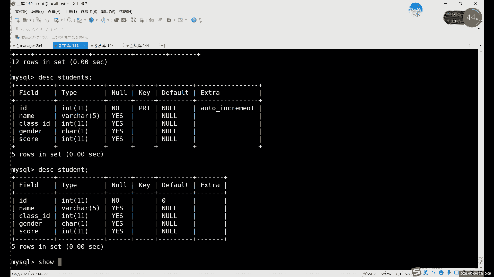

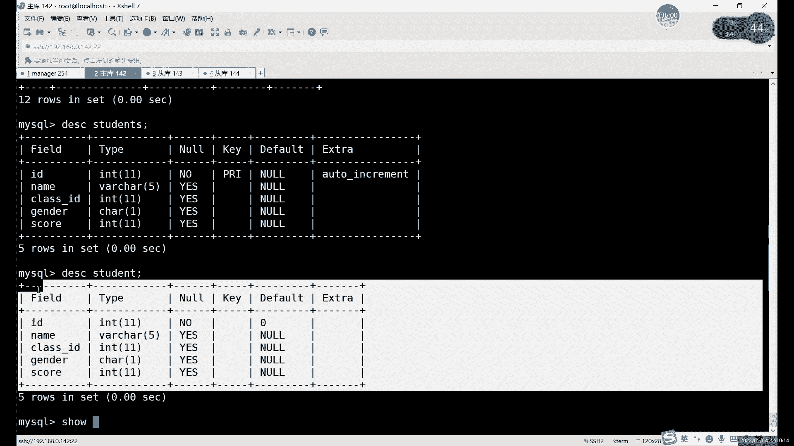

啊，那是tables也没用，tables它看起来和表格也是一样的。所以我正常判断一个视图是否为视图，有一个表格，是否为视图的一个方法呢就是。用查看s加上什么呢？

tables啊不是加table statusters。啊，用用s table来看，你看正常的一个s table的话，其实我们student。啊，Stdent。students吧，对吧？sdents的话。

这个是我们的原表格，你看啊。你看有正常的引擎啊，对吧？有正常的一些时间啊，字符集啊等等这些内容。啊，它是有信息的啊，如果说换成什么？换成我们的这个图的话，我们可以看一下，这分辨是不是非常简单。

你一回车就出完事了。😊，啊，只要你用s tables看啊，什么内容都没有，那它就是什么呢？那他就是试图。啊，他在最终最后的描述这里，他自己也写到了啊，他就是个视图。这个就是什么？这个就是分辨视图的方法。

那么正常的命令，它其实看不出视图的啊，必须得用什么，必须得用我们这个受。show table，然后seers like这个命令来看啊。这个就是看视图的一个分辨视图的方法啊分辨视图的方法。呃。

总体上来说呢，这个视图的话其实。管理上的话，其实删除就是创建的话，create对吧？啊，删除就是job那修改呢。啊，修改这个命令。Oh。可还是用这个什么函是aler也是一样的，和我们这张表格是一样的。

就是create auto和db三个命令，对吧？就是你这张表格怎么改，你试图怎么改就行了。就是它呢其实和表格很像，只是呢因为一它没有数据。二呢它也没有这些像这些表格的一些最正常的一些格式，是吧？

这个是视图的一个特点。啊，因为它只是简单的保存一个链接啊，它只只只是简单保存链接的。He。嗯，然后这里的话这个。视图的话，它其实因为它在表格里面，它其实是没有他没有这个。实质上的一个。

你比如说我看这里退出看一下吧。IOSus想如下载mycircle里面的data目录。你CD吧，D过去。AD到我们的目录下，我们看一下。嗯。大家可以看到，我们就是其实就是没有数据。啊。

他其实没有说你看class FRM和IVD对吧？students这里FRMIVD你看这两个是视图，它就只有什么，只有FRM。啊，它就只有FRM，就它是只有一个定义的这个。嗯，只有一个定义的文件。

还是结构文件。啊，它就只有一个结构文件。也就是你在导出这个视图的数据的时候呢，其实嗯怎么说呢？和正常导出其实也其实也一样啊，就是和正常导出表格其实是一样的，就是它是没有数据的，大家注意它是没有数据的。

恢复的方法的话，其实就是嗯可以重新create。啊，恢复制度可以重新create，或者说呢呃正常导导出正常导入其实也可以的啊，正常导入也可以。然后这个的话就是视图的一些特点。

然后视图除了这个快捷方式以外，它还有自己一些特殊的用法。😊。

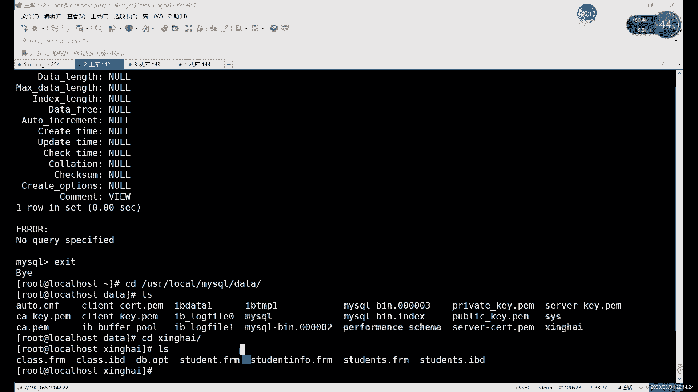

啊，就比如说我们可以看一下啊，大家这个视图的这几个。特点大家知道就行了啊，还有一个就是什么呢？嗯。视图呢不能是修改，不能修改什么呢？不能修改这几种啊，有几种比较特殊的。嗯，就是像。

其实它其他地方和增值表其实是一样的，它就是不能修改整的，不能修改，像那些有这个。啊，比较特殊的一些像。啊，函数分组排序啊，像这个联合查询啊，就是这个联合查询多表查询这些。啊。

他不能强制修改这些里面的数据啊，不能修改这些数据，其他的其实还是正正常可以用的啊，正常可以用的。然后视图的话，这个特点的话其实其实就这么多。然后呢，下边的话删除创建的话，这些其实和正常表格一样啊。

和正常表格是一样的，就是creit。啊，或者说是rerere这里的话其实就是可以改。可以修改我们视图里面的一些内容。啊，被以修改里面是不是一些内容。或者用aler都可以啊。

就create replace和aler都行。然后呢，这个更新数据的话就是update，对吧？和我们正常这个表格是一样的一致的啊，insert也好啊，delete也好都行啊，都可以。

然后删除视图的话就用的是db命令。啊，就用照本给你。照命令的话，当然你可以这判断呢，其实大家知道一下就是有判视图这里呢可以直接删除啊。就如果说你删除视图不存在的话，会报错的。

所以说呢啊你如果擅长删除的话，可以加上ifacces，就是不存在，不会就是。不能再会警告一下啊不能再会警告一下。然后试图话还剩下最后一个用法，就是。啊。

当然这个是show table的s table的用show table的信息啊。然后这里我们看一下什么看一下这个创建视图这里啊，创建视图这里其实我们刚才只是什么呢？只是。用create为U。

然后ad创建了一个对吧？创建视图里头还有一个特殊用法呢啊就是视图呢是可以限制什么呢？可以限制插入的一些数据的对吧？刚才我们其实创建视图，就是你想插入什么数据都可以。啊，想插入什么数据都可以。

只要你不违反什么，不违反我们原表格里边的一些这个内容就行了啊，其他的没有什么太大太多要求。啊，当然呢我们试图自己也可以限制用什么。

就用这个位置check option来限制一个什么限制一下我们插入数据的一个范围啊，插入入数据的范围。可以用这个位置che个op来限制啊。啊，怎么限制呢？其实就是。那比如说呢正常的话，像我们刚才这个。

试图在插入数据的时候，它有什么限制呢？其实就是。比如说给大家看一下这个。

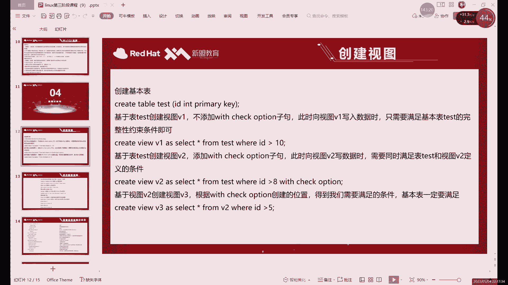

刚才这里啊。嗯，是服是student还是用tudent和tudent其实两个吧。Students。哦，我们退出来了。那这里我们是有约束，对吧？有一个主件约束啊，或者说不能叫主件嘛。

这里准确的说是要自增约束啊，自增约束。那你他也是主键啊，他既着智能又是主键。这两个相当于它都有啊，同时有。然后有这个约束的话，我们可以验证一个什么呢？就是比如说呢我们可以在视图里面插入什么呢？大家注意。

就是试图在创建啊，或者插入的时候一定要遵循一个原则就是。你 third into。valueue啊student啊，就是我们往视图里面插入内容。插入数据的时候呢。

大家注意就是比如说呢你现在我们的123456789101112到12了，对吧？啊，现在那个李四是12是吧，我们可以再插入一次。然后就直接找到这个，这个是我们之前插入那条数据嘛，对吧？正在插入里四。

但是呢我们这个。啊，DSC。student这里呢其实我们是。它的约束只有一个飞空，对吧？它只有一个飞空，哎，默认是0。其他的没有什么太多的需要注意的对吧？然后我们这里呢把这insert的语句粘贴下来。

我们看执行一下吧。他这里报了什么错呢？哎，他报了12啊，违反了什么违反了我们的组件约束。😡，啊，这个也是什么？这个也是我们视图的一个特点，就是视图在修改数据的时候，一定要注意什么呢？

不能什么不能违反原表格的一个限制。主要包括什么呢？主要其实就包括主件约束啊、唯一性约束呀啊主要包括括这些。啊，因为这些如果插入的时候，你违反了是为什么是不会报错的对吧？啊，它是会报错的。

所以说呢就不能违反不能违反这些约束。啊，这个什么这个是啊试图在修改数据啊的一个需要注意的点。因为还是那句话，就是它的数据来源于基本表，它在修改数据的时候，其实相当于在修改基本表。啊。

它相当于在修改BT表有，所以说你不能违反基录表的一些设置。啊，不能违反基本描述。啊，这个就是视图的另一个特点啊。这是默认的啊，这是默认特点啊默认特点还有一个可以添加的特点是什么呢？

就比如说给大家接下来看一下这个最后一个特殊的一个特点吧。就是这个。

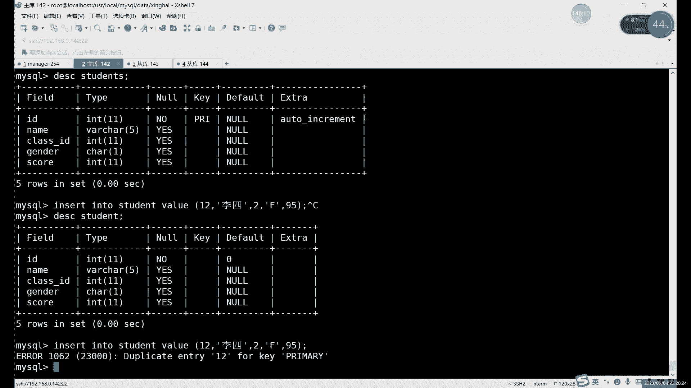

为置 checkck个option。就正常我们的限制条件只有其实其实只有谁呢？只有我们的原表格里面的那些约束是我们的限制条件，对吧？虽然说我们的视图本身没已经没有那些约束了啊，因为它不能复制那些约束。

所以说呢它本身没有了，但是呢啊它还需要遵守一些默认的。那其实呢本身啊我们视图本身是没有限制。啊，视图本身的话，其实你只要不违反什么，不违反原有那些约束。你想怎么插入怎么插入，对吧？啊。

你就插入那些不属于你范围内的，其实也无所谓啊，不影响。

比如说你像你看我们这里。正常插入一个F的对方，刚才一直插的F。如果说我现在插一个。拍一个M的。听不听了呢？嗯也是可以的对吧？也是可以，你看能正常插入。然后呢，我们可以来看一下select信号 form。

接等在这里，我们可以看一下。啊，哎123，我刚才插的是1啊，13对吧？插的13没有对吧？没有。啊，原表是有。啊就是你虽然说呢刚才插入的这个不在我们的范围之内，对吧？这个M呢不在我们的这个视图里面。

但是呢。都是还是那句话，还是插入到的是原表，原表里面有了对吧？原表里面有了。那这个就是什么？它本身其实只要你不违反这个已有的约束。就比如说我们这里其实只有一个约束，就是自增约束。其实自增约束不算约束。

其实自增约束它只是一个特殊功能。更准确的来是，我们的约束应该叫主件约束啊，主件约束只要不维权主件约束都可以什么都可以正当插入。啊，就是可和我们视图这里的限制范围。你看我们视图这里当时限制的是谁呢？嗯。

视图当时限制的是那个叫。等于F对吧？等于F的啊，跟这个是没有关系的啊，跟这个是没有关系的。

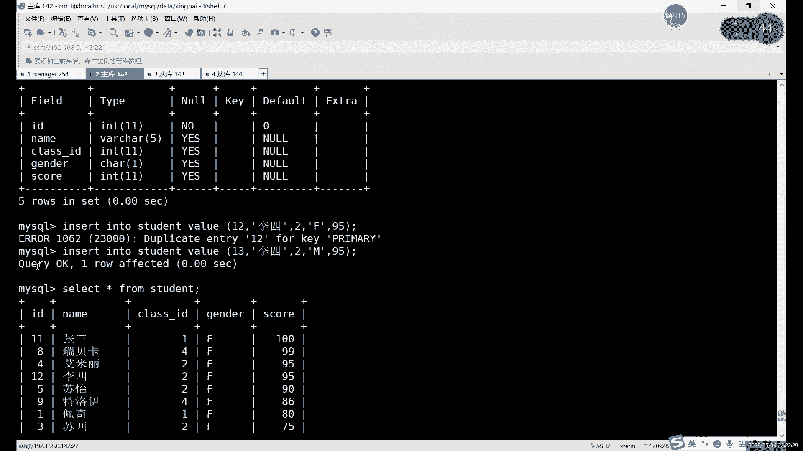

然后呢，我们这里来再来看一下我们这个位置 check option的功能就是什么？就是。如果说我们在创建视图的时候，添加了这个位 checkck often啊。一旦添加了的话。

我们这个条件呢就比较什么比较苛刻一点了。啊，就比如说呢。嗯，看比如说我们现在。可以添加一下吗？可以添加一下这个一个新的什么？其添加一个新的这个。视图吧啊添加一个新的视图。比如说我们就叫它什么。

就叫它这个。C段题一。

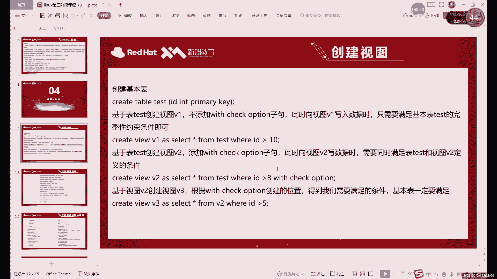

啊，然后这次呢我们用这个为 checkck option来创建。啊，我们上面那个创建视图的命令在呢，我们再复制一下吧。哦。Great with you。对吧这个是多表你。单表那个在哪儿呢？啊，在这对吧？

这个时候我们当时创建了一个视图的一个命令，我们给它复制下来，我们再创建一次。这次我们创建一个新的。呃，Stdent一，然后呢，我们在后边加上这个。在整个语句结束之后呢，我们再加一啊再加withs。

W IT check option。啊，我们加这么一条。电常创建哎，没问题这个。table就是tudent一创建出来了啊。对吧是正常的，没问题，对吧？然后呢，我往这个查看一下吧。select信号。

From student。查询的结果的话，其实和刚才的s段是一样的啊，因为限制条件是一样的。然后这次的话我们给这个s一里面插入的内容，我们来看一下insert into。这叫什么来着？

inert insert嗯。student一啊依然呢还是原有表格里面的数据呢不能违法，所以说我们这以改成14，对吧？顺到14了，就121314，对吧你得从14开始插，对把这样这一插入。啊。

我们可以来执行执行一下。啊，他队里暴露什么错呢？😡，啊，它这里报错的话，跟我们主键就没有关系了啊。你像正常的话，其实表格里面，如果是你原表里面想插入这条数据有问题啊，没问题。因为我们现在十四还没有。

对吧？现在是1到13了，十4是可以正常插入的。这个报错其实就是什么？就是check option failed啊，就检测我们这个。限制条件哎错误了。我们限制条件是什么呢？啊，我们限制条件就是。😡。

哪儿的是吧啊，在这儿。这个被aset operation它检查的是什么呢啊？t一般就检查意思嘛，对吧？检查的意思，它检查的是什么呢？检查就是后边这部分。😡，他检查的就是这个。啊，当然和分组没有关。

就和排序无关啊，我们条件其实就一个就检查它。啊，为了 check个op作用，其实就是检查一下我们这个视图里边这个限制条件。啊，视图中的限制条件呢，我们是否符合？如果是符合的话，哎，我们就正常。

可以正常插入对吧？可以正常插入。如果说不符合呢，我们就什么就报错，就报这个check option的问题。比如说我们现在换一个正常的，比如说你换成10。嗯，不对，我们看一下，换成F，这里换成F。

那这F其实就符合条件。对吧你看可以正常插入，你换成M就不行，对吧？这个其实就是嗯视图之类的一个限制条件。但正常如果说你现在如果说像这个原表里面插入行行呢，我们可以来看一下insert into啊。

students我们再换那个原表了啊，这次换原表了。现在。😊，你们改一下这个数字就行了，改成15啊，改成15。没问题，对吧？原表是可以查的，就是我们这个限制未check option值限制谁呢？

限制我们视图啊，不限制原表，它就是它就是一个快捷方式，就是它能耐再大，它也只能限制自己啊，它不能说限制一下，它不可能限制到这个我们的原表格的啊，它不可能限制到原表格上啊，这个就是视图的一个特点啊。

以及它的一个用法吧。就除了。限制我们这个。啊，这个叫除了我们限制这个表格之外呢。啊，除了限制我们这个。嗯，就是我们经常插入数据啊，或者更改数据的时候，就是在视图里面更改数据的时候。

除了遵循我们的原表格的约束以外呢，还需要遵循我们。啊，with check就是我们加上with check option这里这条。

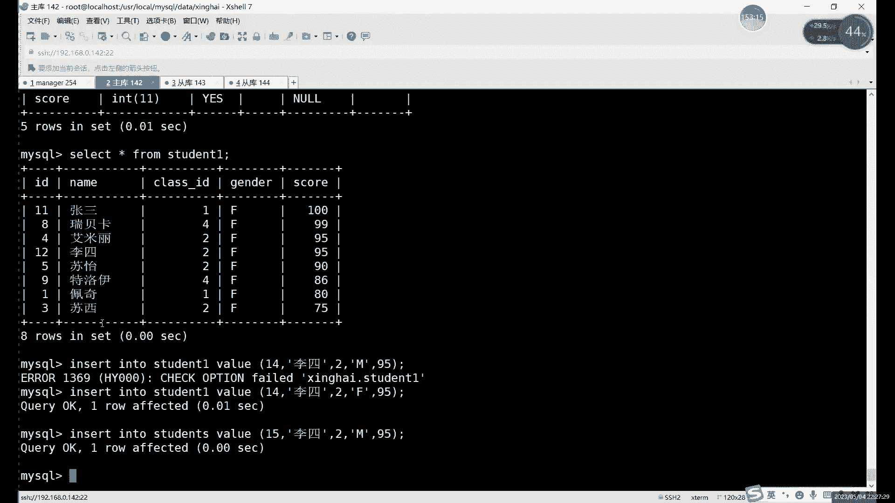

这里的这个约束条件。啊，就是你前面限制什么，你就需要遵循什么啊，这里的话，比如说大家如果想练习的话，可以按照这个PPT里面这个项目。嗯，这个是之前啊之前我用这个数字也说过啊，用数字也举个例子。啊。

这次的话我们直接用了一个s论词表格。用数字的话，这个其实你可以用这个其实也比较好啊，比较好玩。这个你可以限制什么限制一个数字的范围，就是在。表格里面插入数据啊，就只插入数字。啊。

你看你通过这个位op也好啊，就通过我们这个限制条件也好，就可以限制么限制我们这个。他物的这个数字啊的一个大小。啊，限制插入数字的大小。不加规的cheop的，它其实就是什么？就是你。

只需要遵循我们这个原有表格的条件就行了。加上之后呢啊既要遵循原有的，又要遵循谁呢，又要遵循这个with check with check option这里这个。

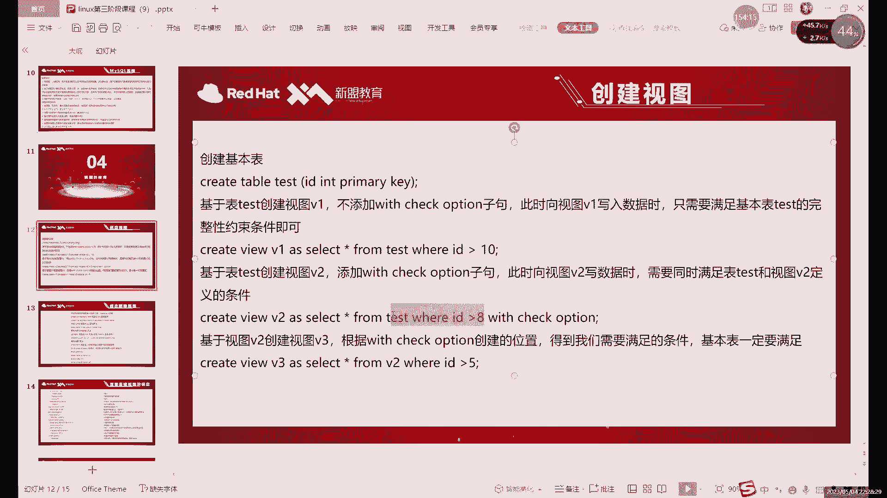

条件啊，就比如说这和其实和我们这里是一样一个意思。这个PPT面是用数字去演示。我们这里是用这个where尔的限制条件去演示。也是用威尔，这里我们是用这个性别嘛，F和M来限制啊，也是一个道理的对吧？

这里其实就是啊下个off这里的用吧啊。

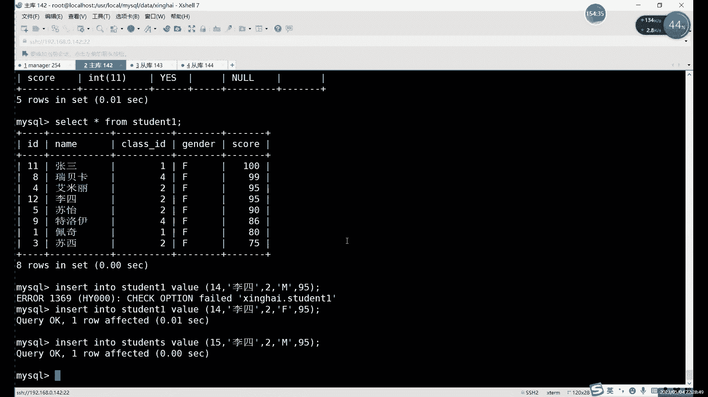

当，还有两个其实为了拆考我们这里，为了拆个op这里细分的话，其实还有两个大家如果说感兴趣的话，下去可以了解一下，就是这个。😊，那 check个op它其实不是一个用法，它其实有两个的。啊。

为了拆与op是其中一个，另一个的话叫。With the check local of。啊，稍微就更长一点啊，不是一为为置local check。啊，更长一点，两个的区别其实就是什么呢？就是。嗯。

如果说我们这个。哪次我看一下这个我写的那之前那条在。啊，在这儿。就是位置check option呢，其实它全写是这样的tsk啊，还还有还有tk。也如with check。cade，然后开top。

这个是它的全写。正常的话我们写写这么短就行了。它这个呢其实就是更新视图的时候，或者说插入插入也好啊，更新也好，删除也好，其实都有更新视图的时候需要满足所有视图和表的条件。啊，这个是为了che个op。嗯。

加如果是换成logo的话，就是logo代表本地意思嘛，对吧？这个其实就是我们在更新视图的时候，只要满足我们的基本表和我们的当前视图就可以了。啊，这个local check option的话。

它限制条件更少一点啊。如果是这个正常的普通的为 check option的话。一旦加上它就要满足所有的视图啊，什么意思呢？就是什么叫所有视图呢？这个大家是感兴趣，可以下编。呃，下去可以自己先练一下啊。

下节课不行，我们可以先说一下这个。就我们视图也是可以创建视图的。啊，我们可以在视图的基础上去创建视图。因为视图我们前面也讲过了，对吧？我们是一个什么呢？我们是。我么是一个虚拟表，对吧？虚拟表它也是表呀。

对吧我们在买s目录里边，数据目录里边。啊，我们是由什么呢？我们是有两部分。啊，我们是有两部分。啊，两部分的话分为什么呢？其实就是本正常的话，我们一个表格是结构和数据嘛，对吧？

我们的视图的话它只有结构了啊，它只有结构，没有数据。但是他其实也算是一个表格嘛。所以说呢。可以在视图的基础上去创建视图啊，这个今天可能没时间，我们可以下一课说一下啊。

下一课可以先说一下这关于这个视图的问题。啊，就是我可以可以创建系图的。啊，这个当然呢呃用的肯定没有说只创建一一般情况下，大部分情况下，我们只需要创建一个视图就可以了啊。但是如果说你想创建多个的话。

其实也是可以的。因为视图它毕竟也算这一个表，对吧？它也算这一个表，它其实也有数据。只不过它的数据是来源于谁，来源于我们的原表格的。所以说我们可以在视图的基础上也可以进行查询。

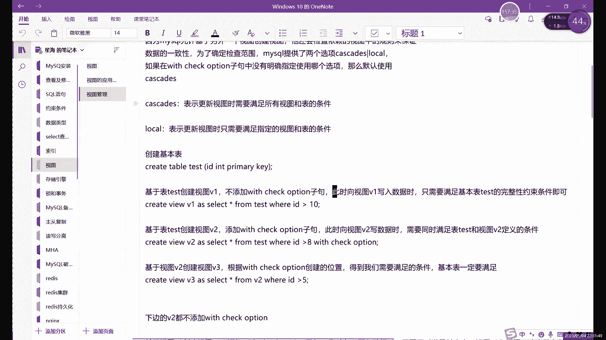

对吧你看其实从我刚才执行这个sag语句，大家其实能看出来，能执行saging from，它其实就能执行一些复杂的语句。啊，他能执行就简单的，就你自自然能执行。啊，这个就是什么？这个就是视图的一个特点吧。

它其实也算是表格啊，也算是表格，好吧，啊，这个就是什么？这个就是我们的。啊，视图这边的内容，我们下一课的话可以先来说一些关于视图。

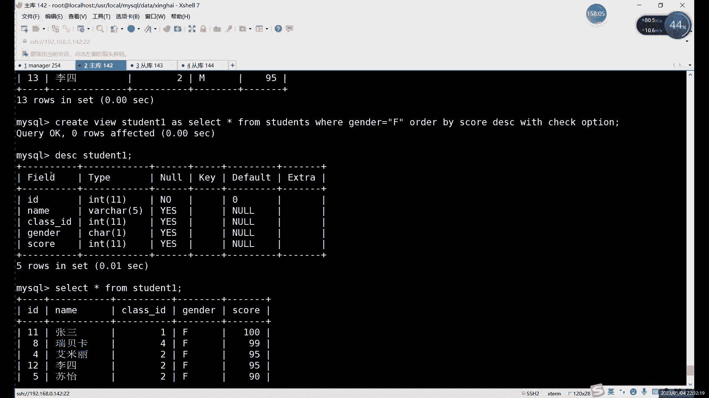

就是这个为了che个op更具体的一些吧。因为它这里其实是分为两个的啊，准确的啊来是分为两个的。啊，大家可以下去说可以先练一练，这个笔记也会发给大家啊，也会发给大家。试图这个这两个的话，大家可以。嗯。

其实创多创建几个视图，其实就能理解这两，就是为了cheake option的一个含义了啊。如果是有什么问题的话，可以啊可以问啊。

我下节课的话可以会可以先讲一下这个位置 check option这个限制吧啊讲一下这个限制条件。好吧啊，那今天的话呢我们内容啊就这么多。那，下期的话把这个。MHA先做一下，对吧？MHA先做一下啊。

做的时候一定要注意啊，就尽量就用四台吧，用四台吧。三台呢。三台因为其实有这个。关于门尔DB livess和这个买serv的问题啊，就是和也是有冲突的对吧？之前就开始装的时候也说过是有冲突的。

所以说呢最好还是用用4台去装三台数据库，对吧？一台。一台这个控制端啊一台控制端。然后视图这里的话啊大家可以先看着笔记先练一练啊，有什么不明的可以。啊，可以在群里问也好啊，可以私聊问也行，好吧。

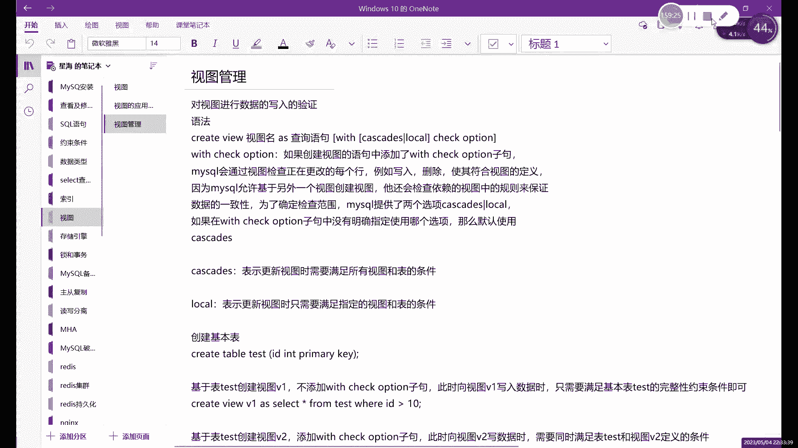