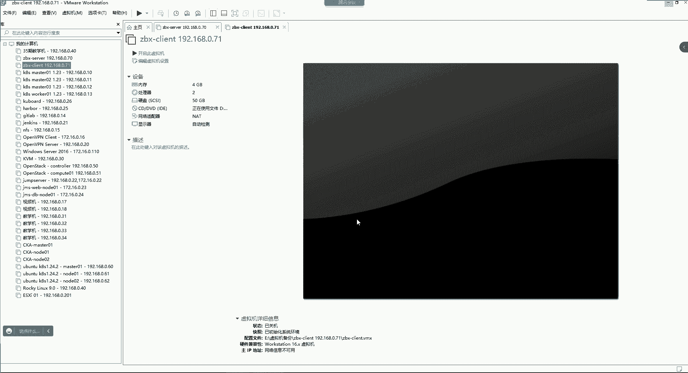
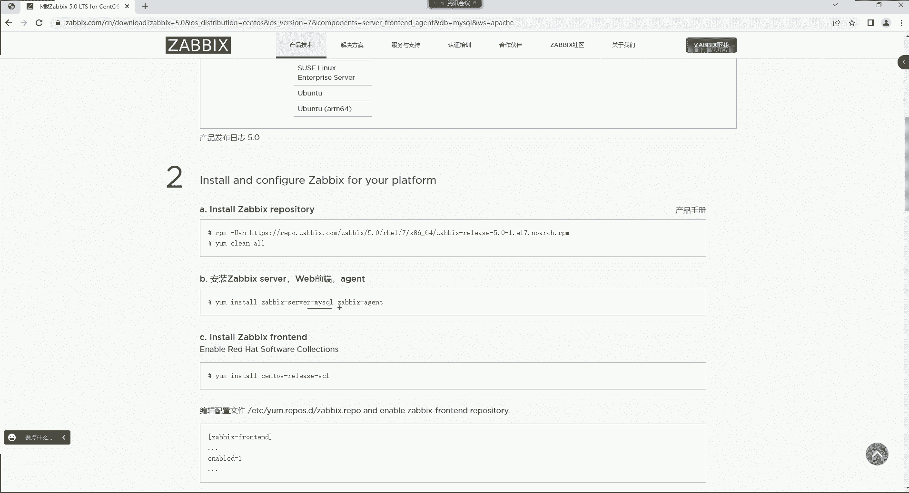
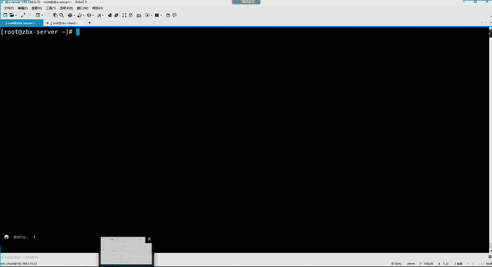
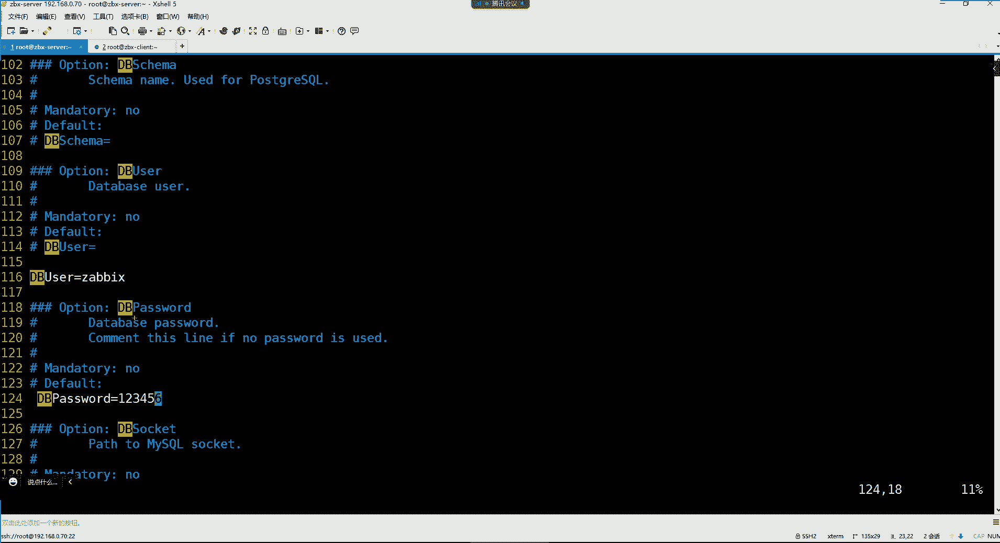

# 零基础入门Linux，红帽认证全套教程！Linux运维工程师的升职加薪宝典！RHCSA+RHCE+中级运维+云计算课程大合集！ - P89：Zabbix监控-1.zabbix介绍、zabbix安装及配置、访问web界面 - 广厦千万- - BV1ns4y1r7A2

咱们今天的课程好，都没有问题是吧？行。这又开始了我们的这个新的一个班次了。然后我看看这个人哈，这人不是特别多。是不是好些兄弟都已经是阳了，在家里面休息呀嗯。呃，然后还有一些同学是上一个班级的。

然后又重新来这个复习了一遍是吧？呃，有多少个同学是上一个班级复习的，给我刷个6，我看看啊嗯。一个。两个。三个。就仨是吧。啊，还行，那有多少个同学是这个第一次。学的呀啊就第一次这个从四阶段开始哈，刷一。

好，可以啊。行。这么多是吧？可以可以啊。呃，这倒是应该从第三个阶段学过来的。嗯，那我们这个第四个阶段的课程呢会比这个第三阶段的课程啊要有难度系数。呃，但是呢我们这里边也会频繁用到第三阶段的内容。

所以呢呃前三个阶段的基础哈，大家还是要什么呢？要多多的去复习复习，看一看，有时间就看一看。因为三阶段还是很关键哈啊三三阶段没有听是吧，听着老想睡觉是吧？哎呀，那也不行啊，是吧？我们这也是为了学技术啊。

我们也不能是。怎么说呢？这个。觉得这个。这老师不合我胃口，我就不听了，是不是啊？这不行哈，我们还是得以学技术为主。回头看了也没记住啊。😊，是不是我们这个三阶段跟四阶段之间，这个时间拉的有点长啊。

应该是得隔了一个月了吧。呃，主要是四阶段内容多啊，所以我们这个时间会比第三阶段要长啊，所以就导致很多兄弟呢前三个阶段学完之后呢，跟第四阶段呢中间隔了两个月是吧？😊，哎呦，那好像也差不多，确实啊就是。

4因为这个四级的内容这个多，而且呢还复杂啊，所以时间比较长一些。没关系，那我们这个班也差不多啊也差不多。出去还是找不到工作是吧？呃，那不会哈，只要你好好学，只要你这个在面试的时候。

这个能够把我们学过的东西都能够给人家回答上来，这就不是什么问题哈。这行业里边你们要记住一个问题。你们一定要记住，这行业里面没有那么多大佬，也没有那么多呃这个经验非常丰富的人。如果有的话，那也是在少数啊。

还有一个就是什么呢？还有一个就是大家在找工作的时候，你也不是所有的企业。他都需要那种非常牛逼的人的，你知道吗？就是有些企业他就喜欢什么？就喜欢这种这个就是有技术，然后呢，没有经验，然后呢，薪资呢低点啊。

他愿意去培养你啊，就是有些企业是需要这去是需要我们这种这个行业里边的一些小白的哈，所以大家也不要灰心嘛。😊，是吧什么东西你尝试啊，你不尝试不行。😊，m。是吧哎不是所有的公司面试都很深奥的。你记住哈。

就是这些面试申奥的这些公司，他们的要求高。但是他们的这个给你的这个各个方面，这个福利待遇他肯定也不差呀，是吧？😊，对，咱们发车吧，是吧，早点结束，早点陪女友是吧？你看这这还是比较务实一些的对哈。😊。

哎呀，咱开始吧。

开始。好久不见了是吧？这山姆小子确实啊，那咱们就开始我们的第一节课哈，我们我们这个嗯。😊，我们这个jabb估计得讲这个五六节课吧，还差不多得讲小一个月的时间，因为内容比较多一些，但是得看情况哈。

看我们的课程进度啊，我们先先先讲这个jab。那jabi呢也是在这个头段时间也是木木老师给大家发了我的上一个班的录屏。那有的同学也复习了，但有的同学没有复习是吧？没关系，我们还是从零基础开始讲。😊，呃。

jabe斯呢它是什么？它是一个监控啊，就是我们这个为什么要学习这个监控啊？啊，我们来了解一下基本概念哈。首先。😊，对于一个监控系统来讲，在企业架构当中，它肯定不是什么新的技术。

但是呢却是一个必不可少的重要的组成部分。所谓无监控不运维是吧？那为什么无监控不运维啊，因为这个你想想哈，我们在公司里边，我们公司的服务器。还有我们公司服务器里边跑的那些这个应用程序。

比如说N这 my circle他 cat等。那么这些应用程序我们要不要去知道它的一个运行的状态呀。比如说如果你们公司的这个N这不能被用户访问了。那这时候我们怎么样才能够获取到通知呢？

首先你怎么知道它不能被用户访问了，或者说这个服务关闭了呢？那首先得需要有一个监控系统帮助我们去监控。它的一个运行状态是吧？然后当这个服务呢处于关闭的时候呢，我们希望这个监控系统能够帮助我们去报警啊。

所以这就是我们为什么说这个监控在企业架构当中是必不可少的重要组成部分。啊，因为监控系统可以帮助我们公司里的运维开发测试等相关的技术人员去发现服务器出现的问题。并且呢及时的给你发送通知啊。

那对于一个监控软件来讲，我们先给大家说说它应该具备的功能都有哪些哈。那第一个功能呢叫做指标数据的采集啊，或者叫指标数据的抓取。😊，那什么叫做指标啊？这是一个专业词汇是吧？其是指标这个东西呢。😊。

它指的是一个类是一个大类哈。比如我要监控我服务器的健康状态，或者说监控我服务器的运行状态。呃，监控我的这个服务器的内存。😊，那这个内存呢我们就可以称之为是一个监控指标。

呃监控服务器的CPU那这CPU我们也可以称之为是一个监控指标。所以这个监控指标哈，就是你监控什么，那我们都可以称之为是指标啊啊可以监控网络设备哈升级的话呢，我们这个呃如果有时间也给大家讲啊。

然后对于这个。😊，另外一个功能呢叫做指标的数据存储。像指标数据存储，我们为什么要去存储这个指标数据呢？就是比如说我想看一看我的这个。往期的历史数据。

比如我想看我一个礼拜之前的这个服务器的这个CPU内存、磁盘、网络等。那我们是不是得需要把这个指标数据存下来，然后你才能去看它的这个历史数据啊。呃，不同的可以哈可以，它可以支持分布式。

所以这就是一个监控软件，应该具备数据存储的能力。那第三个功能呢叫做指标数据的可视化。这个数据可视化就是一个好的监控软件，它会给你配备一个外部界面。然后呢我们去访问它的这个web界面的时候。

我们在它的web界面，大多数的配置可以鼠标点点点。其实jab这方面做的就挺好的哈。呃，首先呢它的界面呢是可以把它的语言改成中文，还有就是大部分的功能，百分之七八十的功能吧。

我们都可以去通过这个鼠标点点点来完成。所以这就降低了我们的学习成本了。😊，就不会觉得这东西特别难。你不像有的那个一些软件，上且全部都是英文，看也看不懂，感觉呢就如同读天书一样啊，ja贝不会出现这种情况。

然后第四个功能呢就是故障的告警功能。像故障告警功能，这个不用过多介绍吧。你一个监控软件，如果发现我们服务器出现故障的时候，它能够给你及时及时的发送这种报警通知。啊。

那javis呢它也是这个支持很多个这种这个报警的接口，比如说邮件，还有这个企业微信，还有钉钉，还有短信，这些呢也都具备。所以这以上就是我们所说的呃一个好的监控软件，它应该具备这四大功能啊。

然后这四大功能里面呢其实已经囊括了什么呢？囊括了我们所说的叫做黑盒监控和白盒监控。呃，黑盒监控与白盒监控其实就是指的就是这四大功能。你比如说像白盒监控。白盒监控。

它指的是指标数据的采集和这个指标数据的存储啊，其实说白了就是一个监控的功能。这我们称为叫白盒监控。而黑盒监控呢，黑盒监控就是这个故障的报警功能。就是这个监控软件它会基于一些自己的那种探针。

比如像HTTP的探针，或者说像TCP的这种探针去探测这个指标。啊，当这个指标，比如说它达到了一定的阈值的时候，那么这个黑盒监控就触发了。触发之后呢，就给你发送这个报警通知。

所以这四大功能里面就已经囊括了黑盒与。联盒监控了。好，那下边呢我们再给大家讲讲这个监控对象。监控对象就是我们应该对什么去监控啊啊，那这里边有系统层的监控呃。

系统层监控系统层的监控里面包括比如我服务器里面的CPU还有我的内存磁盘以及进程以及内核相关的这些监控，这属于系统层监控，啊，网络设备呢，网络设备里面包含比如说我们的这个路由器交换机。

因为jab是通过这个SNMP这个协议。😊，去可以监控网络设备的。你只要把网络设备里面的那个SNLP给它一打开，然后ja4只要能够访问它就可以监控它了。比如监控我这个网络设备的这个。

流量它的一些这个本身的比如说监控它的内存CPU这些负载量等等等等哈，这些都可以监控。然还有就是服务软件的监控了。那服务软件监控里边。

比如说如果我们公司里面会用到像什么卡夫卡rabbit mQ等等等等哈呃或者说rock mQ这些的话，我们都可以这个监控的啊，课程里面有卡夫卡这俩MQ嘛，呃课程里面有这个卡夫卡啊。

但是后边的话呢没有以前呢以前我准备讲这个以前准备讲这个rabbit mQ，但是这个怎么说呢？呃rabbit mQ的话，它这个在消息队列里边啊，其实没有卡夫卡应用的广泛啊，所以我还是决定讲这个卡夫卡。😊。

所以我们这期是有这个卡夫卡的卡夫卡和这个zoookeeper。然后还有就是web服务器的一些监控呢，比如说N这tcaapp帕奇，以及像dockerkerpennet，这些呢是属于服务软件的监控啊。

但是像docker跟科pennet呢，我们一般不会使用这个jaice去监控的，因为它不合适。那剩下的就是这个数据库相关的应用的监控了。比如说像mycyclcle ra等啊，如果用存储的话呢。

我们可以去也把这个存储给在监控上。所以以上就是我们所说的这个什么呢？监控对象。那这些监控对象是我们公司用到什么，我们就去监控什么呀啊，那还有就是业务层监控。其实业务层监控，这里面我们要通过什么呢？

要通过这个日志收集。那就是对他的这个日志进行监控，那这个就不适合用jabi了，用什么呢？用这个我们后边学的这个ELK。EK的话呢，它是可以针对于这个服务的日志进行一个监控的。你比如说呃我们可以监控。

如果我们公司是做这个网站的，你甭管是做什么网站的哈，我们都可以去监控。比如说我们每天的这个网站的登录的数量以及网站的注册数量，网站的订单数量，网站的支付数量，或者说这些用户是通过什么操作系统来登录的。

我的这个网站，比如到底是安卓系统啊，还是苹果系统啊，或者这个用户是从哪个国家哪个城市来这个访问的我的这个网站，以及我这个网站哪个页面的点击数量是最高的等等等等。这些呢啊是属于业务层的监控了。

而且现在做大数据分析，是不是都得需要这种这个数据啊啊，所以这都很重要哈。但是我们这个不用这个ja来完成哈。因为只不过我们给大家介绍是监控对象啊，你像下面这种业务层的监控呢。

我们就可以通过日志啊来这个进行。😊，监控了日志系统。然后下面是给大家列举了一些在linux系统下边常用的监控命令。那这些命令我就不给大家演示了，大家感兴趣可以下去试一试。

以及哪些这个工具系统里面是不自带的，大家可以自己去安装啊，然后自己去尝试尝试哈。如果感兴趣的话，但是呢我们一旦有了监控系统的话，我们就不用去手动去执行这些命令了。😊，好。

然后下边呢是对针对于这个常用的监控软件的一个介绍。这个常用的监控软件。首先我们给大家讲讲这个在行业里边已经过时的这些老牌的监控软件。

比如说像这个neggosnegoos就是一个现在已经在行业里面已经看不到它了。它本身呢是只能做这种实时的数据监控。实时的数据监控就是它监控的数据呢会在这个内存里边会这个暂停啊，或者说暂留一段时间吧。

但是这个数但是这个数据最终没有办法保留下来，就说白了。嗯。他没有配备数据库。没有配备数据库的话呢，就是你这个数据存不下来，存不下来。后续你说我想去这个看看我的历史数据，那你根本就看不到。

因为它没有历史数据啊，它压根就没给你存下来。你如果想看我一个礼拜之前的这个一些历史数据没有啊，而ca的话呢。😊，这个老牌的监控软件现在在行业里面也淘汰了，它最初的诞生主要是应用在机房啊，但是机器的机哈。

机房做流量方面的监控。比如监控我这个机房里的这个带宽入口流量，出口流量有没有丢包，有没有网络延迟？😊，啊，这是开ity，但是它的外部界面不是特别友好啊。然后还有一个是哎嗯还有一个就是它的致命缺点。

它本身是不具备报警功能的。你想想一个监控软件没有报警功能，那这就感觉这个监控软件不完美是吧？你光监控，但是呢最终。😊，出现问题，我不知道。😡，是不是很尴尬呀啊，就非常尴尬哈。😊，嗯。

SNLP采集算不算监控算啊算哈，然后还有是这个gan格利亚，gan格利亚这个监控软件，它跟开个ty他们两个都类似啊，致命缺点本身不具备报警功能。你要想让他报警也行，你得去找他的第三方的。😊，报警插件。

但是呢你还要考虑这个报警插件这个和这个ky之间的一个兼容性问题。所以就导致这些监控软件，其实怎么说呢？不完美。😡，所以现在在行业里面已经几乎看不到他们了。

然后还有一个比较冷门的这是小米公司自研的一个open feel。也是一个开源的一个监控软件。但是呢由于比较冷门，而且呢很多的中间件也不支持监控。比如像HTTPDtime cat这些它都监控不了。

所以就导致open field呢呃在行业里边呢啊用的不多啊，所以我们就作为了解就可以哈。😊，那jabi呢，这也是我们主要要学习的一个监控系统。2012年诞生的一款分布式的监控系统。

这个分布式可能大家不是很了解是吧？我跟你们讲哈，就是这个比如说我们公司的服务器啊，它在全国不同的地区，比如说在黑龙江。在辽宁在吉林啊，各个地区都有我们公司的服务器。那么我们想干嘛呢？

想把这些服务器都给它监控上，可不可以呢？可以。那这时候呢像这种分布式的监控就能够实现这个功能。因为你想想分布式是什么意思呢？首先你的服务器是不是就分布在不同的区域啊，那你分散在不同的区域。

而且我还需要监控的话，那么ja也可以帮你实现这个分布式的监控的功能啊，那就说白了就是跨区域的去帮你监控。然后它的功能就非常的完善。例如数据的存储，数据的可视化以及故障的告警功能等，它都具备。

那么它目前主要应用在像传统的物理机，还有虚拟机、路由器交换机等领域的一个非常不错的一个监控系统。就是说白了哈ja它主要擅长的监控是什么呢？就是这些这个硬件设备啊，以及那些传统的应用程序。

你传统的应用程序，甭管是部署在物理机上面，还是部署在讯机里边。那ja比斯呢它都非常适合去监控这些。而现在好多企业都已经用什么呢？都已经用容器了。那么对于容器的监控呢，扎比斯其实它就并不是特别的合适。

所以这时候我们就得选择什么呢？选择这个perme优斯。这个perme斯呢它是2016年对，十年了哈。对呃这个perme优斯呢是2016年新崛起的一款监控系统。但是它的诞生也比较早。

它也是2012年诞生的，跟这个扎ps斯是同一年。但是呢呃由于这个容器技术是从这个2014年在行业里面才火起来的，所以就导致呢这个普me优斯呢。😊，他的这个崛起啊，或者说流行起来就比较晚。呃。

是是从这个2016年才开始流行起来的，但是它的功能也非常完善。比如像数据存储、数据可视化以及这种故障的告警功能等哈，它也都具备。但是它目前主要应用在对容器领域的一个监控。好，那我们现在学学哪个呢？

我们学这两个。😊，一个是jabi，一个是prome斯。那prome斯呢我们在讲容器的时候再给大家讲啊，然后我们先给大家讲讲这个jabi。那我们给前面给大家介绍这些都是这些开源免费的监控软件。

当然啊你像这些开源免费的都有它的企业版。就是如果说你用它的免费版的时候，可能说这个由于这个功能无法满足你们的需求啊。😊，那你可以选择它的企业版本啊，因为毕竟任何的开源项目，人家真的不是说来做慈善的。

我就直接开发一个软件，大家都免费用吧。我所有的功能你们都可以白嫖。😡，那你想那人家喝西北风去了，是不是啊？所以像这些开源的呃这些这个软件哈，它都有它的企业版本。

那么它的企业版本对于对比于它的这个开源版本来讲，就是功能呢会更加的完善，而且官方也给你提供这种技术支持。😊，那如果说我们觉得这些这个国外的这些产品，我们用的不不习惯的话。

那大家可以选择我们国内的就国产的这些监控系统。你比如像什么监控宝啊，博瑞啊等等等等哈。这些呢？大家可以去百度搜一下，搜什么呢？就搜国产的。😊，监控软件。然后在这里边你可以看一下什么这个像这种是吧。

这是博瑞的。博瑞，然后。

下边是有他的一些介绍。划不动了哈。

什么客户案例看了吗？然后下边的话什么这个什么快速享要器嗯，这是他的一些介绍哈。你得看他的这个产品。😊。

点它的产品看了吗？什么这个一体化的智能可观测平台，应用性能监控，真实用户体验监控，巴拉巴拉的一大堆的网络性能监控、基础设施监控。呃，反正这些的话呢呃都能够帮你来实现。然后这是他的客户，看了吗？

这就属于国产的了。但是用这个国产，它的好处是什么呢？就是。😡，什么东西呢？你都能够看的清晰明了，因为它这个国产的嘛，汉化的就非常好，几乎都是中文的啊，这个是属于国产的哈。

但是如果我们公司里边那老板铁公鸡一毛不拔是吧？我们就喜欢用这些开源免费的那怎么办，那没办法是吧？那我们就得去学习这些开源免费的技术了。😊，啊，所以这些付费的话，我们就不过多介绍了哈。

然后对于ja克斯的话呢呃如果我们想了解他，我们可以去他的官方，这是他的一个官方地址。😊，是javis点com。

好我来看一下啊，嗯，它这是中文的，看到吗？直接就带有CN的哈，这是中文的官方网站。然后你可以点它的产品手册。😊，呃，我们先嗯先看他的首页吧。看他的主页哈。你看他说这是一个全方位的一个监控。

可以帮你监控网络、服务器、云平台、应用程序各种服务。

然后下面的话呢，告诉你，这是一个百分百的企业级的监控解决方案，无线扩展、分布式监控、安全可靠、高可用、足够灵活等等等等的。然后也可以他说与您正在使用的其他的这些软件去结合着。

呃，然后这是针对于他的，比如说全球的技术支持。他有相关的认证的这种哈呃你可以考他的这个认证，看了吗？然后还有他的这种这个嗯还有一些公开课，但是他公开课讲的话，你肯定听不懂。

都是老外老外上去给你滴里嘟噜的给你讲一通，你发现嗯。😊，听起来觉得哎倍儿高大上是吧？但是你发现这。就感觉自己啥也没明白是吧？就这样啊，所以你还不如听我跟你讲。😊，然后你要你要想看他的这个产品手册的话呢。

这里面我们可以先看它的这个在产品技术里边可以看到它相关的版本。这里边有生命周期和发布政策，知道吗？然后在这个里边呢，可以看到它的这个当前的这个正在支持的版本哈。因为jabs斯版本分为两种类型。

它下面有介绍，看到吗？他说每一年半ja将会发布什么呢？发布版本。第一个版本就是它的ja based斯的LTSLTS是属于这种长期支持的版本。长期支持，但并不是一直都支持啊。

他说呃这个LTS版本在5年内可以为ja斯用户提供支持服务。那么这5年包括三年的全面支持以及两年的最低限度的支持。😊，这个比较好理解吧啊，全面支持就是你什么各种问题呢啊，我们这个都会你提供相应的解决方案。

而最低限度呢就只限部分功能。如果出现问题，我才给你提供解决方案，能理了吧。然后还有一种是标准版本。这个标准版本呢是。这个总共是。多久的支持服务呢？是有6个月内可以为扎斯用户提供支持。

然后再加上一个月的额外的最低的限度支持，就总共加起是7个月。看了吧？那也就是说对于这个这两个版本，我们在选择的时候，我们肯定会选择哪种啊这种LTS的版本是吧？毕竟出现问题，官方给你提供补丁，你自己。😊。

你不然你自己你肯定解决不了啊啊，然后现在我们可以在这看到它当前现有的支持的版本，有这个jabs4。0的。但这4。0的话，你看是。2018年的10月。10月1号发布的。然后到这个全面支持。

一直到2021年的10月31号，然后最低限度支持到2023年的10月31号。也就是这4。0的话，到明年10月份的时候，是不是我们就用不了了呀啊。那我们现在如果用的话，可以选择哪个呢？可以选择它的5。

0和它的6。0的这种LTS版本。呃，如果是5。0的话，你看它是2020年的这是这是这是这个4月份。啊，3月份。啊，5月份啊sorry啊，这5月份这是2020年的。😊，5月份5月12号发布的。

然后到这个2025年的5月末的时候结束技术支持。也就是说如果我们选择这个5。0的话，我们呃就从明年开始算的话，你最起码你还能用个两年时间的啊。而6。0的话呢，这个就。怎么说呢？比较新了。

是2022年的时候发布的是吧？2022年的2月份发布的。呃。到2027年的2月份2月28号结束支持，但6。0是不是比较新呢？而且这6。0啊，我曾经也看了哈，我看了一下。6。0的话是它有要求。

就是你的操作系统啊。你比如说如果你是用这个s头S的话。那么他得要求你的sths得是8版本的，但是synths社区版的。但是如果是森S社区版的8是不是已经不维护了呀？所以你只能选择它的那个。

stri的8版本，但是stri8版本。对于我们来讲，你想它是一个滚动版的。😡，滚动板的话，那对于红帽来讲，那这不就一个小白鼠吗，是不是啊？😡，所以这个滚动版是属于一个小白鼠的测试版本。

那么企业不可能选择这个stri的呀。啊，所以这个6。0的话呢，对于我们来讲就比较尴尬啊，我们这个后续只能再看了。只能在看哈，所以我们现在没有办法选择6。0的版本。😊，行，这是他的一个版本。

那我们现在最好的选择是不是还是这个5。0的呀？😊，啊，毕竟从它的发布。再到现在已经有了两年的时间了，所以这个呃也是经过了大规模的测试，肯定都是没有问题的啊。所以我们用这个5。0版本，现在还是比较不错的。

呃，然后接下来呢我们来看看它的这个文档，这里边有5。0的中文文档。然后中文文档里面呢可以看到这里边有很多的官方给的这个技术文档哈，但是非常的官方啊，官方啥意思啊？官方就是不说人话，对于你来讲你就看不懂。

但是呢呃我们没关系是吧？我不就是你们的翻译官嘛，我们现在如果想安装的话，大家看到了吗？第四步里边有一个安装然后安装的话，这里边你可以选择从这个比如说源码安从二进制安从容器安从外部界面安，但是外部界面。

这没有尝试过哈。😊，但是这三种的话呢，我们这个选择这个从二进制安就可以了。这个的话呢对于我们来讲还是比较不错的。原版安太麻烦了，而且有很多的这个功能，你还得自己去自定义，就倍儿麻烦。而从二进制按的话呢。

我们就省事了呀，所有功能都有。😊，然后我们选择这个我们的这个s托S系统，这是它的一个官方的一个文档。那么官方文档的话呢，在这里边哈。二进制和原宝包区别是啥？区别就是原码包，你可以自定义啊。

你可以自定义它的安装路径，自定义安装什么功能。😡，但是呢你刚开始你对其实对于一个japs来讲哈，你不用去源码去安装它，没有必要，为啥呢？因为可能说你刚开始你都不了解它，你你也不知道哪些功能。

你后续能不能用得上啊，是不是啊？所以我们选择二进制的话，就所有功能都有就可以了。😊，哎。然后这里边是这个有个安装说明，看到吗？在安装注意事项里面，这有个安装说明。

然后这下边他告诉我们整体我们需要做的事情。这哈咱们点到安装说明里边。😊，呃，这就是我们先选择我们的平台。呃，这个平台里面呢包含什么呢？包含你要安装的版本。然后包含这个那我们先选择呗，我要按5。0的。

然后我的操作系统是re的。然后是几呢路由7，然后这里边看我们要安装的这个服务包含jabs server端jaice前端以及jabs agentent啊，这个我们一会儿再说。

然后jabs呢它需要数据库在这里边哈，这个因为它支持数据持久化。他会把监控到的数据呢给你保留下来。那最终呢它有两种数据库可以让我们选择一个是my circle，一个是post grace这两种数据库。

那对于这两种数据库，我们肯定是my circlecle是我们最熟悉的是吧？但my circlecle由于怎么说呢？也是这个现在逐渐的被商业化了，所以最终我们可以选择用这个marri亚DB。😊。

用merDB去代替这个myscle啊，其实官方也推荐我们去这个使用这个mer亚DB啊，对它会存储在这个数据库里边监控的数据哈。然后它也需要一个web server。

这个web server最终呢是我们要访问它的这个web界面的。然后你可以使用阿帕奇，也可以使用NDS来做它的web服务器。但这种的话呢，我们推荐大家选择用阿帕奇哈，为什么用阿帕奇呢？因为这个。😊。

这里面没有啊有stoS是吧？那就s透S啊啊，我以为没有s透S呢。😊，然后我们来说一下，就为什么非得选呃为什么说这个建议大家选择阿帕奇。😊，你们前面学这个NGS的时候。

是不是这个老师会告诉你说这个NGS它的特点就是承受高并发是吧？但是我跟你讲啊，就是这个后续这个你甭管是选择阿帕奇，还是选择NGS啊。后面他得连谁呢？去连这个PSP去。为什么连PP呢？

因为这个ja的所有的那个we部界面都是用PP语言写的。所以后续呢他们得去通过PP才能够解析它的外部界面。比如说后续呢他们都得去访问PP。那么访问POP的话，如果是阿帕奇访问POP阿帕奇。

原生就自带访问POP的核心模块，你不用做任何的配置。但如果你要选择NGS呢，那么NS你想连PP必须得去修改它的配置文件。你不改的话，它连不上去，所以这就比较麻烦。能理了吧。而且对于这个它的外部服务来讲。

我们对于一个监控系统，是我们在企业里边搭建之后呢，谁访问呢？这不又不是给用户访问是吧？这不就是给我们公司自己的一些运维，或者说我们公司的工作人员去访问这个它的这个外部界面嘛，是吧？看相关的监控数据嘛？

所以这里面其不会涉及到什么高并发。😊，所以这里面就不需要考虑要不要高并发了。啊，所以就选择阿帕奇。是最省事的。哎，行。然后这平台选择好了之后呢，我们下面就开始安装安装，咱就别按照官方文档去安了。

因为官方文档我看前段时间它有更新。有所更新哈呃有所更新的话啊也可以。那我们按照官方的安也可以哈。呃，不按照按的话呢，也也可以啊，到底是按还是不按呢？咱是按照官方文档按还是按照笔记啊。

你们觉得哪个更适合你们一些呀？😊，啊，我这笔记里面也有哈。😊，嗯。是按笔记是按笔记安，还是按照官方安呢？你们觉得按笔记是吧，按文档啊，按笔记吧，是吧，按笔记吧。对哈。嗯。那咱就按照笔记安了哈。

这样的话呢，我们这个所有的安装步骤啊也都是非常的流畅的。😊，那第一步我们要安的话，我们就得去先去安装它的这个5。0的那个仓库嗯。对，都有结合也可以哈。第一步它也是我们可以过一遍哈。官方呢。

它也是让你先去install ja的reory，就是去安装它的5。0的仓库。😊，就主要是让我们去下载1个RPM包，然后这个包会给你提供一个仓库。所以这个地址呢我们在笔记里面就有。

但是我们今天的环境哈，这是我在上课之前呢，提前安装好的两台虚拟机。😊。

这两台虚拟机的话呢，我先连接一下哈，6。0可以监控KS吗？😊。

6。0可以监控KPS，但是呢不合适哈。😊。

哎。不合适，我这边我先新建一个绘画哈连。呃，这个绘画是叫做ja杠。Soer。地址是192。168。0。70。但这个地址你们是不是如果你们自己有自己的这个已经现成的这个虚拟机，是不是就用现成就可以了呀啊。

所以我这个地址是这个地址哈，但我们的网段都是同一个网段的吧。然后连一下哈。De server。用户名。记住它，下次我就不用再输入了。密码呢，我这里面都是一也记住它确定。好，凉上来了。啊，这是一个机器。

然后还有一个机器。再新建一个绘画。这个机型呢我们当做被控主机，叫做jab。港。Clt。那这个地址是192。168点0点71。IP地址哈。这是一个是jaice server，这个我重新改一下名哈。

重面名一下，后面加个地址是192。168。0。70。然，再连一下这个ja client。Root。密码一。然后这机器呢我们得需要对它的环境做一些初始化哈那我们这个环境初始化的话呢。

这里边提前用脚本初始化吧，别去这个啥了。😊。

别去手动了，手动太麻烦了。所以这脚本的话呢，这是我提前准备好的，也是提前写好的一个配置系统的一个脚本。

我们把这脚本呢给它拖到这两个机器上边。啊，但我这机器很很显然是没有这个相关命令是吧？脚本。我到时候会发到我们的这个今天的这个录屏里边哈。

传一下哈，我们点这个新建文件传输。把这脚本找一下。拖过去。

呃，再给这个机器也传一下。

直接用这个叉FTP去传吧。这脚板两台机器啊，把这脚板给它传过去。传过来之后呢，我们这个脚本哈。😊。

我们可以打开看一下这脚本里面的内容哈。😊，呃，可以啊，7。9也一样都一样。然后我这机器里面连个VM都没有是吧？那我们就VI吧。好，这脚本呢会干什么事呢？

这脚本会帮我们关闭系统里面的防火墙和IClinux，然后帮我们去创建阿里的仓库，并把我们的服务器的时区呢帮我们去自动同步一下。然后又针对于系统的打开文件的数量。😊，又设了一下啊，都是这个6535。

然后又对于系统的一些内核呢做了相关的优化，然后又对swap分区呢做了一些优化。然后下面呢这是安装了一些常用的工具，这些哈就是这个就是我们对系统环境做一个初始化的脚本。然后保存退出哈。

我们就执行一下这脚本哈，我们用bsh执行一下。😊，然后这个机型呢也执行一下哈，这脚本下课再发给你们哈呃不用提。😊，让他先执行着吧，然后我们一会儿还得把这个主机名改一下。😡。

呃，那我们得先这样哈，我们得先去。

这是我们的31期的哈。😊，这是我们的这个2022。第31期的。这个高级运维班，后续我会把咱们所有的课程的录屏和笔记呢上传到这个里边。然后在这里边呢我们会我们是先讲的是这个jab。

所以我们的第一节课就是这个。Ja贝斯。企业的。分布式监控。然后在这里面呢，我们会。有这个录屏。还有这个笔记。还有我们相关的课程的资料。好，那我这个脚本啊，我就我到时候我就会直接上传到哪儿呢？

上传到我们的这个。直接上传到这个31期的这个文件夹里边。待时候我会把我到时候会给你们发链接哈。这个脚本。课后的话呢，我我我这个把相关的录屏和笔记上传之后，给你们发链接，你们到时候自己下载OK吧。

。那这系统环境现在已经配好了。好，两台机器都O了哈。那OK之后的话呢，我们这样哈主机名改一下哈，我们这两台机器呢。😊，这个机器的IP地址是多少来着？我看一眼啊。是192。168。0。70呃。

但这个机器我们给拍个快照吧。我们这样先给它关机，环境初始化配好之后啊，拍快照。后续的话呢，万一我们用着用着，你给它玩坏了，是不是啊恢复一下呀？在我们这边。

呃，选择这个。快照拍摄一个第一个快照就叫什么呢？叫做。嗯。以。初始化。系统环境。拍拍照。然后这机现在也一样。拍照。拍摄。名字也是叫以。初始化。系统环境。

OK吧，然后再开机。😊，然后再给大家，哎你们是不是都是从我这个。😡，是不是都是我从我这个前两个阶段。这个然后这个一直学过来，就是是不是从我的零基础新班学过来的呀？是吗？有多少人试啊？试的话，先刷一。

不是的刷2哈，是从我的这个零基础新班。来的刷一哈，不是的话不是的话，刷2哈。啊，那如果都是从我的零基础新班过来的话。是不是啊哎那是不是我们的所有系统环境都是没有图形界面啊？没没错吧。啊，全到了是吧？

所以我们那个所有的环境哈都不带图形界面哈。因为特别是后期我们的所有实验也比较吃内存。你要安装图形界面的话，可能你的内存都不够用，知道吧？😊，对，不要图行界面哈。然后我们重新连一下这两个机器。有。

自己笔本都没有同像街妹啊，这么狠吗？😊，这有点狠啊。😊，连一下哈。这个。诶。有那个も。我这是不是改错名了呀？啊，等会儿哈。删掉啊。啊，这是。这是。Jaet server， ja client。密码是一。

对啊，我们这个用不上图形界面啊，用图形界面干嘛呀？他这字体有点小哈这个。把这个字体调一下啊。18。是吧可以吧，这这自己可以是吧，然后改名。😊，让他叫。ja斯杠s。然后退出一下。然后再重新连一下。

让这个名字生效。啊，这个的话呢。让他叫jabi杠。烂的。也退出也重新连一下。好。那接下来呢我们就安装哈。😊，现在搜的环境已经有了，你看一下他有没有这个鸭么仓库。

亚么reple list的是不是直接就是阿里仓库28000多个包啊。这机器也一样，ymre的。啊，也都OK了，时间也都是对的，看一下。啊，都是CST的。我们这个。东八区的标准时间。好，接下来。

把这个软件包先下载一下。我们现在做的操作在了一个。😊，扎辫的so上面先去做哈。😊，但是这个这个仓库啊，我们在cllan也要去执行一下哈。😊。

然后接下来呢我们就可以在jaice server上面去安装相关的包，安装哪些包呢？安装两个包，一个是这个ja server杠my circle，一个是这个jaice杠 agentent。那官方的话呢。

这也是让我们安装两个包，看到吗？这两个包一个是是什么呢？一个是提供监控的。提供监控的就是这个jab server杠mysq。因为我们前面在选择这个数据库的时候。

是不是选择的是my circlecle类型的数据库啊，所以这时候呢哎它这个包就是专门针对于mysqcle数据库的一个服务端的一个软件。然后后面这个jabi a站的这个包呢，是作为它的客户端程序。

客户端程序是干嘛的呢？客户端程序就是给你提供指标采集的。呃，等一下啊，我找一下啊。呃，我的那个。这儿哈指标采集。指标采集我们这里边。哈哈。😊，我这里面原先也是有图，看了吗？就是在这里面呢。

你比如说我现在想要去通过这个ja server，它给你提供监控服务是吧？然后那监控服务我我们要安装的包是这个ja server杠myl。那这个jabs agent呢，它是什么呢？它是提供数据采集的。

那如果我们想要去。监控自己本机的话，我们也得去安装这个ja agent。而后后而后续你比如我想通过这个ja server去监控另外一台机器呢，那么监控另外一台机器。

你只要在另外一个机器安装它这个japs agent就可以了。啊，这就是帮你采集这个主机里的指标的知道了吧？啊，它专门做这种数据采集的哈。但是我们现在在这个监控主机上边，这两个包都要安。😊。

这两个包。好，然后我们注意啊，有了仓库之后，我们可以这样2RPM杠QL，你看一下那个包名叫什么来着？是不是叫做这个jab杠release啊？你看一下这个包，它给我们安装了哪些文件。你看他在我们系统里面。

这这些是软件包的签名文件了，就是密钥签名，这个就我们不用管。然后首主要是它在我们的E仓库路径，你看给我们安装了一个什么呢？叫做jabs点repo啊，就跟你把它的仓库文件给你放在你的这个仓库路径了。

啊后这是ja本身的这个一个存放它的这个GPL开源许可协议的一个目录和它的一个协议文件。那对我们来讲也用不上。所以我们这里边唯一能用得上就是ETC。你么的reporterD下边的这个。他的这个仓库文件。

所以我们现在就直接把这两个包哈给它安装一下。这安装也比较快。

安装完之后，我们干嘛呢？安装完之后这个。他让我们去安装japs的前端，看到吗？他说inst到扎 for tenderer，这是它的这个前端相关的仓库。这里边我也有在这哈。

那我这个笔记里边啊其实这边可以给它删掉了，为什么呢？因为我这个可选配置是什么？就是如果官方仓库无法连接，我们可将仓库改成清华大学的，但是没有必要，官方仓库就没有不能连的时候，好吧？啊，所以第二步的话呢。

我们就这样。我们去下载这个stoOS的SCL仓库。SCL仓库里面是提供jaPS4前端，这是它的这个前端。前端所需的一些这个软件包。所以他让我们安装的是这个。

安装好了是吧？是两个包，一个是ja agent，一个是ja servermy。好，安装完了之后，我们这边。安装它的前端的仓库啊，安装好了之后呢。

它也会哈在我们的ETCEM reportD下边看给我们这个生成很多这种SCL的这种仓库文件啊，这里面就是我们有一会儿安装前端所用到的包。😊。

那接下来干嘛呢？接下来我们要去启动这个jaaxs前端仓库，也是在官方文档里边，他让我们去编辑这个文件去。哪个文件呢？是不是他的仓库文件呢？就是这个jabs的 rippo啊。

然后让我们去把它的这个jabs for tenderder这个库给它enable等于一，就是给它启用起来。因为这位置如果等于零，这个仓库是不是就没有启用啊？所以我们现在要去。

打开。他的这个。仓库文件。然后把它的这个for tenderer默认以内等于0是吧，要给它改成一吗？删掉吧。是吧删掉默认不就启用了吗？所以删掉就可以了哈，然后保存退出。😊。

保存退出之后呢，我们他让我们安装哪些包呢？安装这个一个是japs斯杠web杠mycyclcle，一个是japs斯杠阿帕奇的这两个包很显然，一个是它去连接myscle的，一个是连接阿帕奇的。

所以我们就把这两个包。在笔记里面有哈。😊，呃，这两个包。安装一下。

然后。一会儿的话呢，我们要去安装数据库。因为官方呢它这个位置并没有告诉我们怎么去安装my circleqcle数据库，所以呢我们要自己手动去安装那个man亚DB去。然后我们要进到数据库里面之后哈。

你看他告诉我们了哈，你进到数据库，你要去执行这几条circle语句去。😊，好，那我们一会儿要把这个麦亚DB给它安装一下。

啊，这边这两个包已经安装好了，前端的包，然后接下来把这个玛DB给它安装一下。迈尔DB杠ser这个包。下贝斯不自带麦C口裤啊，这部分自己这我们得自己安。😡，自己安哈。

你看官方文档，它是不是都已经。这个。没有告诉你怎么安呢，因为他也不知道你到底是用myCl还是用麦亚DB。所以这里面他就并没有告诉你怎么去安。😡，所以这个环节呢我们要按照笔记走哈，自己去手动。😊。

这个哈我们。这哈加一个备注哈，就是首先。在官方文档他。并没有提供安装。数据库的。那些这个什么呢？部分。所以自己手动安装。

安装好了之后，我们把这个美雅DB给它起来。😊，呃瑞ta。然后。麦尔迪B。好，起来了是吧？那起来之后呢，我们。看他的状态哈。OK了，然后再给它设置成随机自起，以内部一下。O这就可以了哈。那可以之后呢。

我们。😊，接下来呢就可以进到数据库里边。因为官方他不是让我们进到数据库里面去执行这几条思扣命令吗？那这几条搜后命令第一个。😊。

这哈。呃，练ux4不是自带M尔DB吗？不用啊，直接按就可以。

就是我们就用它linux，它不会自动帮你把麦雅DB安装上，但是它的仓库里面有那个包，所以你需要我们要手动安。如果已经安装过，你就不用再安了。如果安装过的话，就不用再安哈。哎。然后我们这样哈。

我们这个进到数据库里面，但是我们并没有给这个数据库设密码是吧？那就不用设了。如果你们想设，你们是不是可以。😊，自己。用这个。My circles cur in。Pa审。嗯。

instlation这个命令去对数据库做一个初始化呀啊，当然我们就无所谓了哈，我们就不做了。😊。

然后我们进到数据库之后呢，他让我们去执行这几条circle命令。第一条命令让我们create database，创建一个japs的仓库。因为这个库是后续干嘛呢？要去存储。

它的所有的监控的数据的会存储在这个库里边。所以这是它的库名，然后字符集呢要设置成UTF8。因为它有些数据是中文的，所以要支持中文。所以这是第一条circle语句。

我们执行一下，然后你受。Data base。是不是看到了有一个酷啊加b。

然后接下来呢再去创建一个可以访问数据库的用户，并设置密码。那用户名呢，官方这里边也是让你设置成叫jabiix的用户。密码的话，我们自己定义1个123456就可以了。啊，这是第二条命令，创建个用户。

并设置个密码。

好。那用户有吗？S。右色字段host的字段from从my circlecle库下的右色表查一下。是不是看到有一个用户叫做jabi了呀啊，可以从本地登录。

然后接下来呢授权。这个用户现在没有权限哈，在这个数据库里边，所以我们现在要去干嘛呢？要去把这个用户。😊，然后对这个库进行一个点星的授权。受所有权限。做了一个授权。

啊，授权也OK了。那授权做完之后呢。但是这个库是不是空的呀？😡，我们就是你看我们右色到那个扎克斯库的时候，你受。tableables这里面啥都没有是吧？那你什么都没有，这个数据怎么存呢？😡。

所以我们要退出数据库干嘛呢？导表。

戴呢他是给我们准备了表了，然后我们只要把这个表给它导进去就可以了。这个表在哪儿呢？这个表是我们在前面安装这个。😊。

jaic杠s杠。刚my circle这个包的时候哎。啊，我们在安装这个包的时候，这个包的话他给我们提供的。你看一下啊，我们RPMQL看一下。呃。

在这里面呢就有一个叫做create点儿cicle点GZ的这么一个压缩包。那么这个压缩包里面存储的就是它的这个数据库里面的那个表结构啊，就诸多的表文件。你要把这个压缩包给它导到这个数据库里边怎么导啊？

呃它是一个点GZ的，我们是不是得用。ZK，然后去看这个压缩包里的内容啊。啊，然后接下来呢在管道给这个my circlecle指定以这个javis用户的身份，他的密码是123456。然后导到哪个库呢？

导到我们前边创建的这个jabs库里边。好，走你。再往里面倒边。好，导完了导完之后，我们是不是还得进到数据库里面看一看呢？我们以这个jaice用户的身份去登录一下，密码123456。好。

然后我们这个右色道。詹克斯库里边。然么这时候在受。tableables看一下，这里边是不是就看到表了呀？哎，后续他搜有的监控数据啊就会往这。的库下的这些表里面存。但是哪个表是干嘛的呢？

我们现在先不用去设计它，我们就退出就可以了，看到表就可以了哈。😊，行呃，现在有表之后呢，我们现在这个还要去在javis服务器上边哎，这已经做了哈，我们还要为jaice服务器配置怎么去连接数据库。😊。

我们前面在数据库里边已经是创建了用户了。那这个用户最终你还得什么呢？还得去在jaice的配置文件里边，在jab server的配置文件里面去指定这个用户的信息。不然jaice server。😊。

他也不知道这个用户。好。呃，不是P2P哈，那么jaice的配置文件在哪儿呢？我们可以2RPMQL跟上这个ja4杠。

Ser my。它的主配置文件在这儿。在ETC下边有一个jaic的目录。然后在这个目录里边的话呢，有一个叫jaic server点com，这就是它的主配文件。ETC。詹不斯目录。好了吗？在这个里边哈。

这个就是它的主配置文件。那这个文件是谁的呢？是它的这个agent的配置文件。😊，都在这同一个目录下边。好。那么我们现在。就去改的是这个文件，所以我们要指定。扎B下划线。S弱点康复。然后在这文件里面。

我们要改什么呢？我们要去直些载这里面搜一个大写的DB。大写的DB啊，然后回车。😊，呃，然后我们往下快速定位一下哈。NNNNN。😊，啊，看到了吗？这是多少行呢？这是没有被注视的这行啊。看一下1百行。

你看这10百行，这儿有一个DB name，这个DB name是什么呢？就是我们前面在数据库里边。

创建的这个库。

是用于存储数据的。所以在这个ja server里边，你想想他在读他的这个配置文件的时候，他是不是得知道他往哪个库里边去存数据啊。所以。到时候呢他就往叫这个名字的库里面去存它的监控数据去。然后下面还有。

还有什么呢？还有这个DBU色看到吗？这DBU色也等于jab。那这个DBU色是什么呢？就是我们前面在数据库里边create优色创建的这个用户叫jab。

也就说最终呢他得以这个用户的身份去登录数据库，然后往这个库里面去存数据。那么这个用户的密码官方也不知道你设置的是多少。没错吧，那用户名是不是都是一致的呀？所以这个密码呢，你要在下边。

在哪儿呢？你看这儿有一个叫DBpas word，看到吗？你要把这个注释给它删掉，然后接着呢把它密码写在这儿123。456。就是设置一下这个用户的密码。

就可以了。行，那官方也是官方他也是告诉你看了吗？你要去为ja server配置，怎么去访问数据库，让你改的是哪个文件，然后找到DBpa word，改它的密码。😊。

那这文件我们就改完了，改完以后我们就可以退出了。呃，退出之后呢，我们接下来干嘛呢？我们接下来要去配置时区。😊。

为PP配置时区，因为PP最终他也不知道你当前在哪儿，所以我们要把它时区给它指定一下。那改哪个文件呢就改这个。路径下的文件。路径比较长啊。

然后一个叫ja点com的，打开之后呢，看到了吗？在最下边看到这行了吗？是一个分号开头，是一个注释，把注释删掉，这是PP的注释啊，PP注释都是以分号开头的。然后把后边的这个都给它删掉。

然后改时区时区就是ASIA代表亚洲城市呢，我们指定。😊，上海大家注意这个上海。和这个亚洲前面都是大写的，首字母是大写哈，你别搞错了。😊，行，然后保存退出。

那保存退出之后，我们下边就完事儿了。就可以去启动服务并设置服务随机自起了。那总共会启动哪些服务呢？会启动jaice server。会启动japs agentent，还要启动阿帕奇，还要启动PP。

就请这四个服务。然后并且设置他随意自起。

好，可以了。那起来之后呢，我们看一下它端口啊。😊，好呃，它的端口的话呢，ja server的端口。是10051的端口，然后japsA这头的端口呢。是这个10050的端口，在这里边哈。

这是10050的端口好。那，这就是服务之间都是通过端口进行相互的访问。所以这端口呢我们了解一下就可以哈。😊。

也不用去修改它好了，那到此为止，我们这个ja就配完了。配完之后呢，我们对于这个ja server的一些服务参数哈，我们这个位置呢来了解一下呃，这个服务的端口刚刚刚介绍完是吧？

然后ja的主配置文件是在ETC目录下边，然后呢叫ja点。然后ja a的主配置文件呢也在同一个目录下边，只不过呢名字不一样，A的配置文件叫ja a点。然后还有一个。😊，这个路径啊是企业微信报警脚本的路径。

这我们现在用不上，而且企业微信现在jabs支持的也不友好了啊，主要不是jabs支持不友好，是企业微信。现在呃由于版本更新，现在。😊，做不出来效果。然后还有一个路径就是这个自定义监控的一个路径。

然后我们前面再看到它的这个ETC扎的时候，这里面看到有一个它的ja的A点D。

是不是有一个叫jabs agent点D的目录啊，这里面后续我们可以做自定义监控。那web知道啥意思吗？很显然了吧。啊，就是存存储它的一个web服务器的一个文件啊，是PP的，它不用管不用管。

这个我们用不上。然后它的日志文件是在这个va的log下边有一个javis目录。

好。这里边就是。有一个ja斯的目录，这目录里面是存储它的日志文件。啊，两个一个是服务端的日志文件，一个是客户端的配置文件啊，后续有需要再看吧。先知道一下。行，这就是服务相关的参数了。

然后我们接着接下来要干嘛呢？我们接下着来要去访问jab web界面哈，访问外部界面的话呢，这里边默认是HTTP，然后跟上你的服务端的IP，然后后面呢它的这个路径哈，有一个jab。

所以你要加上它的这个二级目录。😊。

那我们就去访问一下，在这儿。我们的地址是192。168。0。70，然后跟上。加b。好，就来到这个页面了。呃，不用启动服务嘛，启动了呀，服务已经启了哈。😊，然后这个。看好，这一个欢迎页儿。

那我们就不用管了，下一步。然后这个页面的话呢，是检测PP的。相关的参数呃，但是PP参数默认官方已经给你配好了，所以这肯定都是OK的，看到吗？一片率。是吧。这种比较幸福的颜色。

有的时候这绿色不一定是不吉祥是吧？有的时候我们就需需要它绿，看到吗？都是OK的哈那包括我们前面指定的这个时区，看到吗？😊，也是OK的。然后下一步这位置哈，然后接下来呢你要去配置数据库的连接了。Yeah。

那数据库的连接哈，这里边我们的数据库类型是my circlel类型的那就算是men俩DB，它也是mycil类型的。然后我们的数据库服务器呢是我们的本机。😊。

我们是不是就在jaice server上面去安装的数据库啊，但如果是实际工作中呃，你可以把这个数据库给它分开，你可以单独去准备一个数据库服务器。然后呢。

你在jaice server的配置文件里面指定它访问这个哪个数据库就可以了。能理解了吧。但你在授权的时候，你得授权用户可以从所有地址登录，不然他也登录不过去。啊，因为这个如果你监控的主机数量比较多的话。

那可能说ja server压力比较大。他就就要去监控，要往这个，然后本身这里面还有数据库服务啊，可能说压力会。这个什么呢？到时候你可能会导致你访问jabs的时候，感觉查询数据特别的卡。啊。

但是这得建立在你一定规模的情况下哈。😊，然后。这啊。那数据库的端口端口的话呢，这里边3306。然后。datbase name就是你的库名，往哪个库里面存数据啊，往这个jas库里边存。

然后us色就是你的用户名，这是登录数据库的用户叫jas。那么密码是多少呢？我们设置的是123。4料。好，然后下一步。然后这个是ja server的一些配置了，但这配置的话也也不用改。

你看ja server的主机ja server的端口啊，要不要给你的这个ja server取个名字啊，这想取就取，不想取无所谓了啊，这不是必天项哈，这以就不取了，下一步。😊，啊。

这针对我们所有的配置做了一个回顾。啊，如果没有问题，我们就继续下一步哈。然后他会把我们前面所有的配置保存在了你系统的这个路径下的这个文件里边。

就是他的那个web的那个目录里面有一个jabscom点POP的文件。

这个在ETC。jaB，然后web里边看到吗？它给你生成了一个叫。ja co点PP的文件啊，因为这个就是PP的配置文件嘛。然后这个文件的话呢，你如果想看的话，你可以看一下这里面的内容哈。

mysl还没有开启远程登录，都是通过本地登录啊。但如果你的数据库跟你的ja思路分开的话，你就得开启远程登录了，不然它是不是无法登录啊？😊，那这边的话呢，这就是我们前面在数据库里面的一些配置。

你看我们的数据库类型看到吗？type数据库类型，serverver，你的数据库主机，你的数据库的端口，你的库名，你的用户名，你的用户密码，然后下边。😊，这是。我们ja本 server的配置看到吗？

我们的ja server是在本机，然后端口，然后并没有给它取名。可以有。所以其他东西呢就不用做任何的，就是你知道一下啊，就后续如果你的数据库，比如说给它迁移出去了，那是不是信息得改一改呀？😡，啊。

就改这文件。当然我们现在什么都不用动哈。😊，Yeah。呃，那接下来呢我们就刷新吧，flash一下，然后现在开始登录。那登录的话，它用户名是什么呢？用户名是dmin。😊。

但是这A呀一定是大写的我的命哈，然后密码呢密码是小写的javi。😊，就上面那个ja，当时是小写的。然后他问你的这个信息要不要保留30天，就你的用户名密码要不要保留30天，我们不用。登录就可以了。好。

然后我们就来到了这个界面二来。来到这界面之后，你看这界面是英文的。我们看不太懂是吧，这非常不友好啊，那咋办呢？😊，那我们就。给他改一改哎，左呃这可以翻译不，这不用翻译不用翻译哈。

左下角有一个你的个人资料。😊，看到吗？你的用户的基本资料里边。就这小人儿哈点进来点进来之后呢，你看它这里边有一个语言，语言默认是什么呢？是不是。english啊，你要给它改成chinese。改成中文的。

然后你再选择update更新。哎，就可以了。看了吧，那这时候你能不能看懂？😡，它所有的配置都在左边，这是它的侧边栏。然后现在你可以看到这个ja斯服务器端正在运行着呢，这是你的主机和你的端口。

然后它现在正在监控的主机数量多少个一个，然后模板数量多少个，这是它的监控模板，然后多少个监控项，多少个触发器。呃，用户数量多少个好了吗？啊，字能看懂啥作用不懂是吧？这样，但是我们得慢慢学嘛。

所以你看现在就几乎就是把这个东西给它部署出来了。😊。

啊，到这为止就可以了。