# 零基础入门Linux，红帽认证全套教程！Linux运维工程师的升职加薪宝典！RHCSA+RHCE+中级运维+云计算课程大合集！ - P90：Zabbix监控-2.zabbix添加被控主机、创建模板、创建监控项、解决中文乱码 - 广厦千万- - BV1ns4y1r7A2

好，各位呃，都回来了吗？回来的话刷个一，我们继续开始啊。都困了是吧，这这听着伤感情歌还困呢。😮，这一看就是。没什么感情经历的人是吧？没有感情经历的人，对这种东西确实是不是特别敏感。

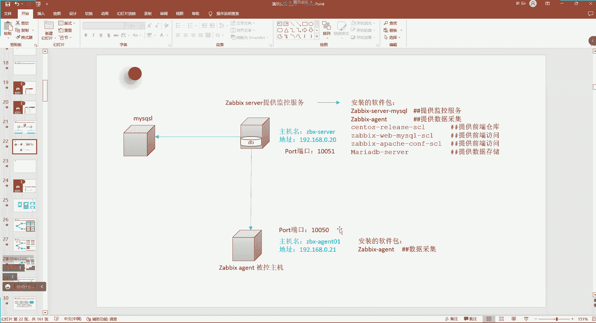

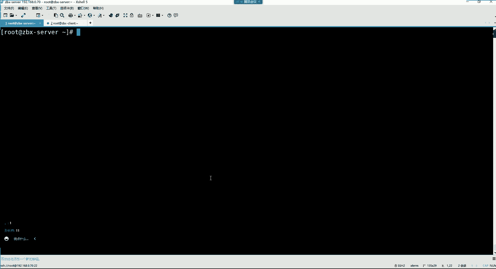

你像我们这些被感情伤害过的人哈，听这歌就。怎么说呢？内心就会有很多的波澜。好，我们来开始啊。我们接下来开始这个讲讲这个web界面怎么用。啊，有一些这个个性化的设置。对，有有感情哈。

跟花式就是左边的侧呃这个侧面栏就我们所有的配置，你点的话，它就缩回去了，看到吗？你比如说你把鼠标拿拿出来的时候，你点知道吗？那就是那个。😡，就什么呢？就这个这属于什么呢？属于一种这个偏好设置哈。

如果你觉得这种东西，你看着它比较碍眼的话，你就可以给它缩回去。然后再一点的话呢，哎它就一直在这里边呆着了。然后如果你想让它消失也行，点这个消失了但消失的话，我们又看不到了，是吧？那咋办？

点这个汉堡图标一点这个汉堡图标的话就出来了，但你鼠标一点它就没了啊，所以这比较麻烦，那我们就不设了哈，不设置了。然后还有就是说我们在我们的用户设置里边。😊，在这儿的话呢，你可以去更改你的主题在这哈。

看一眼俄罗斯美女是吧？我觉得也是这主题里面呢，你可以看到有蓝色的，你更新哎这个。😊，默认的是吧，还有。

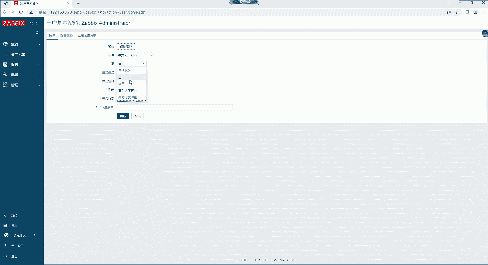

暗色更新啊，就成这个颜色确实比较暗了哈，这比较适合夜间去看。

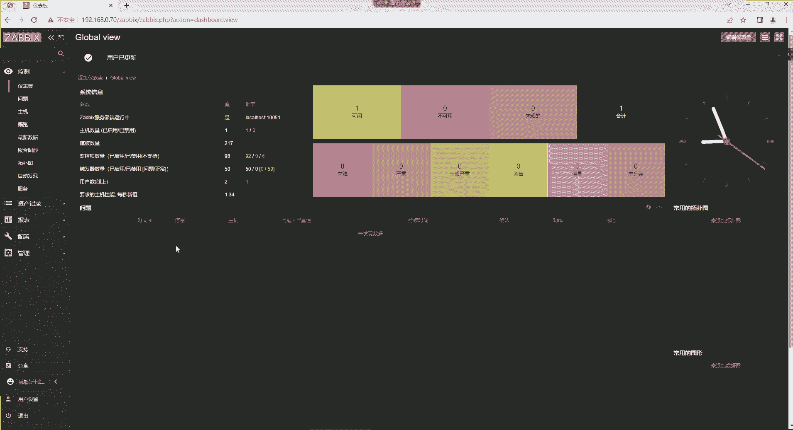

还可以看什么呢？还可以调，比如说高对比的。

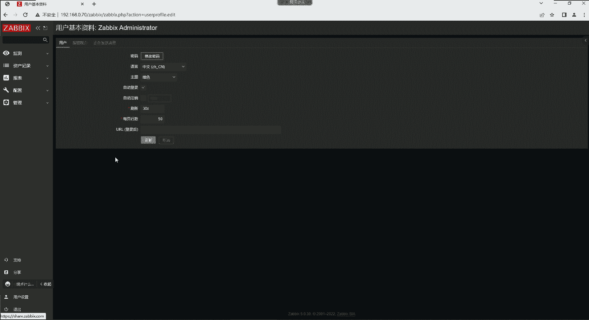

就成这样子，但这样特别丑是吧？😡，然后。暗色。

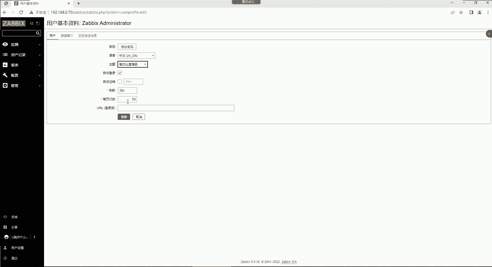

这更丑了啊，这不行。所以我们还是用这个吧，系统默认的吧啊，行，这是一些偏好设置哈对，就这个颜色就挺好的。😊。

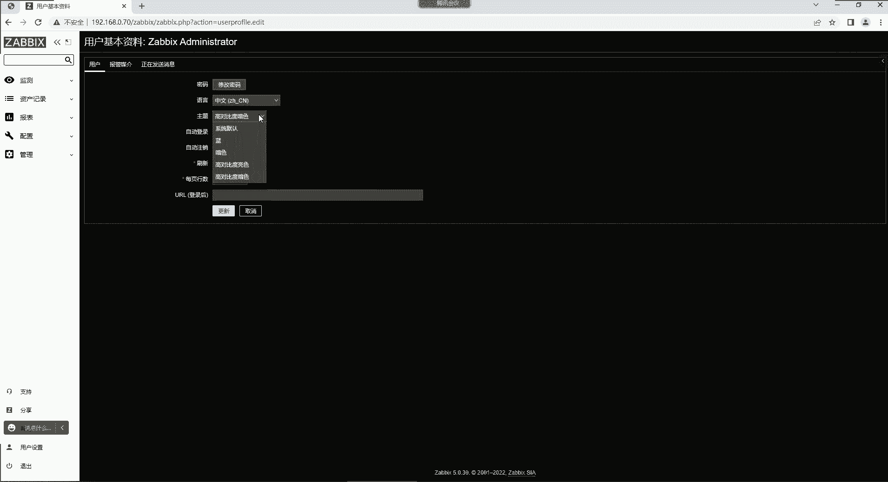

呃，让我们来到这个界面之后啊，我们现在要干嘛呢？语言也。设置了。那么现在有个问题摆在我面前，就是ad的min的密码。这个呃的密密码是不是默认都是这个jab啊？那你想想那这个密码如果。

这个你一直用这个初始密码，是不是别人都可以去访问了呀，是不就不合理了呀？所以注意啊，我们要去修改我的密密码去。那么对于这个密码，它没有长度和复杂度的要求，我们按照具体情况设置就可以了。

也是在它的这个在这里边，用户设置里边看到吗？你可以点修改密码啊。然后我们那密码给它改成一。😊，一。更新。😊，好，然后你下次你比如说我们现在先退出左下角哈，我们先退出去。😊，退税之后，我们再。登录的时候。

用户名还是admin，但是密码呢变成一了，然后这个信息呢给它取消掉哈，登录好，看到吗？这是怎么去更改addmin的密码去。然后下面还有这个创建用户。😊，呃，为什么要创建用户呢？首先你要知道哈就是这个。

😊，我们除了这个我的min超级管理员以外。我们还可以去创建一些普通的用户，去给你们公司的其他员工去使用。因为ad的min的这个账号呢，它是具备管理权限的。比如说可以在配置里边去什么呢？去进行管理。

忘了ad的密码就得去改他的数据库了。就得去修改他的数据库哈，但是非常的麻烦了哈。😊，然后在这里边哈，我们如果是希望我们公司里的其他人也可以登录的话，我们可以在他的这个。😊，啊。

是在这个管理里边有一个用户看到吗？这里边默认是不是只有一个addmin呢？啊，还有一个gues，那么这个gas我们没有用过是吧？啊，那这个是jabbi，他给我们提供的一个普通账号，那么就不用管了啊。

你看它的类型是一个用户的，而这min呢是超级管理员啊，那我们现在还想建一个，比如说我们公司还有一个张三这张三他也想登录，那咋办呢？啊，我们就给他建个用户去。但在建用户之前，我们先去添加一个组。

为什么要添加组呢？因为这个jab他并没有单独。😊，为用户设置主机的管理权，就是你单独创建一个用户没有意义。这个用户他也是没有任何权限的。因为他所有的权限都是通过组进行统一分配，就是你得先建一个组。

然后再把用户呢加到组里边，然后再去对这个组进行权限的分配就可以了啊。所以我们这里边可以在他这个用户群组这儿，我们先去。可以看到这里面已经有很多组了是吧，但都是它自带的，我们的用不上。

我们自己去在右边创建一个用户群组。这组名你比如说呃我们这个让它叫做运维组啊，或者运维团队都可以哈。然后接下来呢你就可以给他去分配这个给组分配权限。😊，啊，我们先去把这个组名先设置一下啊，比如旧让叫。

怎么呢？可以起中文哈，这里边我们就让它叫唉。😊，就是呢叫运维。然后呢，这个组它具备什么权限呢？在这个里边有个权限。然后这里面的话呢，我们可以这个。找找什么呢？找这个组可以对于哪个组具备权限。

比如说我们让他对这个linux server这个组可以具备权限的话，我们就把这个组给它勾选上然后让还让他具备这个如果你想让他对这个ja server也具备权限的话，你也可以勾选啊。

那么我们就不让他去对这个ja server有一定权限，或者说。不勾选了哈，我们就让他只对这一个组具备权限。😊，然后我们选择一下，那对这个组具备什么权限呢？到底是读写呀，还是只读啊，还是拒绝呀？

我们可以让它具备只读。就是说白了，我们后续在这个组内，我们比如说添加主机的时候，那么。我们刚刚建的那个运维组，是可以查看这个这个组内的主机的一些基本信息的啊，他这个意思是什么意思？

你看我们刚刚不是建了一个运维组吗？是吧？那运维组，我们后续往里面添加用户。但是我们主机后续往哪个组里面放呢？我们可以给它放在这个这个组里边，叫做linux。server组里边。好，那么这个运维组里边。

比如我后续往里面增加了一个叫张三的。那张三后续的话呢，他。如果想要去看这个组内的主机的话，我们要去对他的这个所在的组进行授权啊，你让他具备读权限，那么张三就可以去看这个组内的主机了，它是这么回事。啊。

所以我们这个勾选上权限之后，选择给它添加上去。你一定要点下面的小号，这个小的添加才可以啊。啊后最后呢我们再选择添加就可以了。好，在这里边有一个运维组好了吗？然后那这个组有了之后，我们这个。

下边再去创建这个用户去啊啊，用户名这里边比如说我们可以用这个拼音哈，也可以用中文。然后创建账号之后呢，给他选择这个账号属于哪个组，然后再给这账号设置一个密码就可以了。在用户，然后选择右边的创建用户。

然后别名，我们就让他叫张三。拼音吧，用拼音来表示哈，然后张三属于哪个组啊，我们找到刚刚的这个运维组给它加进去。然后那张三登录这个ja维斯这个web的时候，密码是11就可以了。

然后他的语言我们直接给它改成中文，就他登录之后就是中文了。主题的话，我们就不用给他改了哈，然后添加好，那这个用户我们就添加好了，叫张三。😊，好，你看它的类型就是普通用户，因为这里面只能有一个超级管理员。

然后接下来我们再开一个浏览器，然后我们再去访问的这个jaice server。192。168点0点。70跟上这个。页面好，那这时候登录的时候，是不是就得用这个张三去登录了呀？然后张三密码是一。

这个也给它取消掉登录。那张三就登录上了，但你看张三跟这个管理员他的区别是什么呢？张三可以看到这个监测的这个配置栏，也可以看到资产列表，也可以看到报表是吧？但是你发现管理员里边是什么呢？

管理员里边是不是有什么资产记录，还有配置和管理呀。你发现张三是不是就。看不到这些，因为他是普通用户嘛，所以他没有这些权限。好，那张三登录之后。他想看他。这个比如说他能看的那些主机，他可以点这个主机。

在监测里面点主机。好，那张三现在。一台主机都没有看到，为什么呢？因为我们现在还没有添加主机呢，是不是啊啊，所以我们这个张三，我们只要能够验证它成功登录就可以了。哎，这就是我们怎么去创建这个普通用户。

给我们公司里边的其他人去使用。😊，知了吧？然后接下来咱们就来说说怎么去添加一个监控主机。呃，jabe对主机的监控非常灵活，可以是物理机，可以是网络设备，可以是虚拟机，也可以是应用。

那么我们提前准备好一台linux主机，并安装好jabeA镇的这个客户端程序就可以了。这个客户端程序的话呢，我们这个前面已经是配备好了它的仓库了，在这个主机里边是吧？😊。

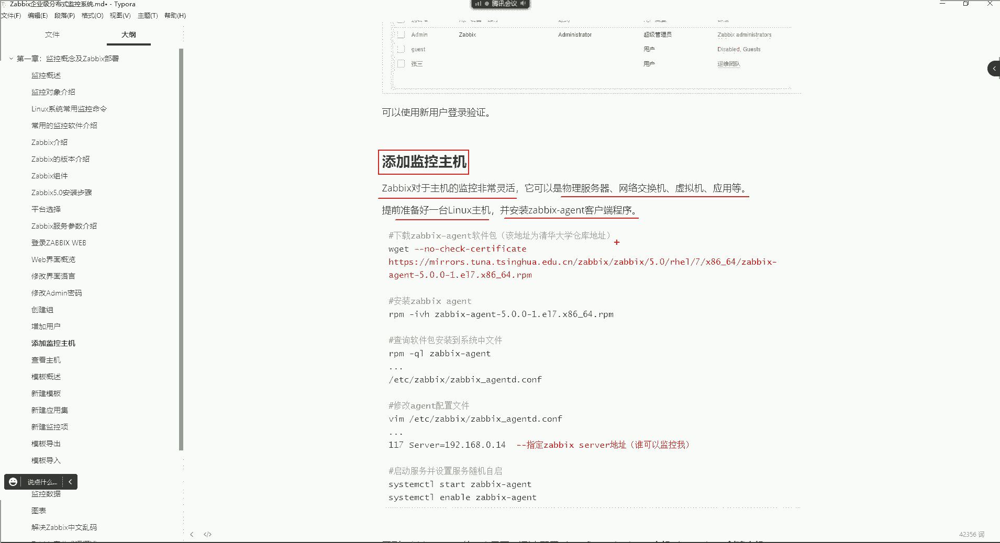

那有了仓库之后，我们这样y list，我想安装一个ja杠。Aent这个包。是不是有这个jabs agent呀？好，那而且是版本也是5。0的，那么们就直接ym杠外inst。扎PS杠Aent。就可以了。

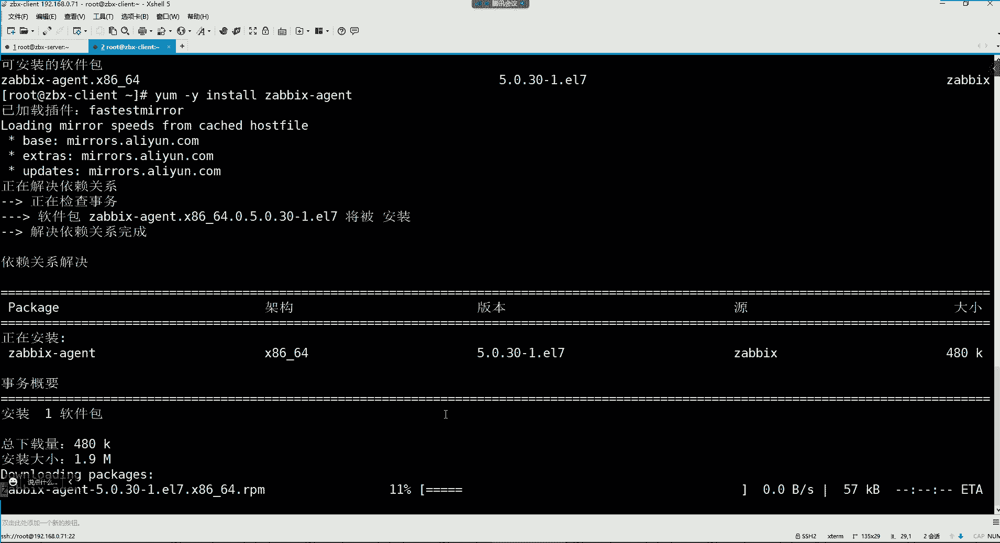

但如果你这个主机没有配ja菲斯仓库怎么办呢？如果没有配，你可以直接从清华大学去下载它的这个5。0的包。知道吧。

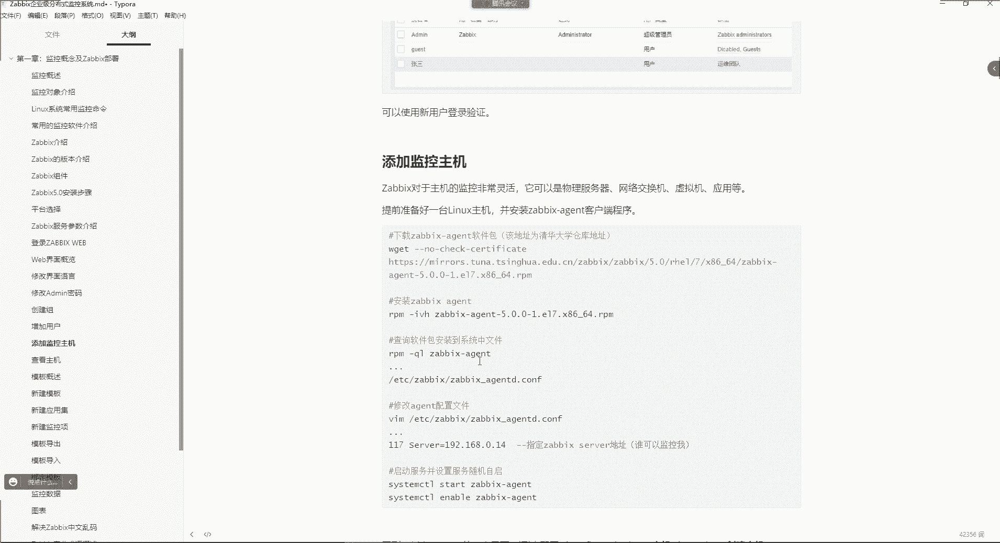

然后用RPM或者亚么安都可以。但是我们这边是不是前前期已经是。

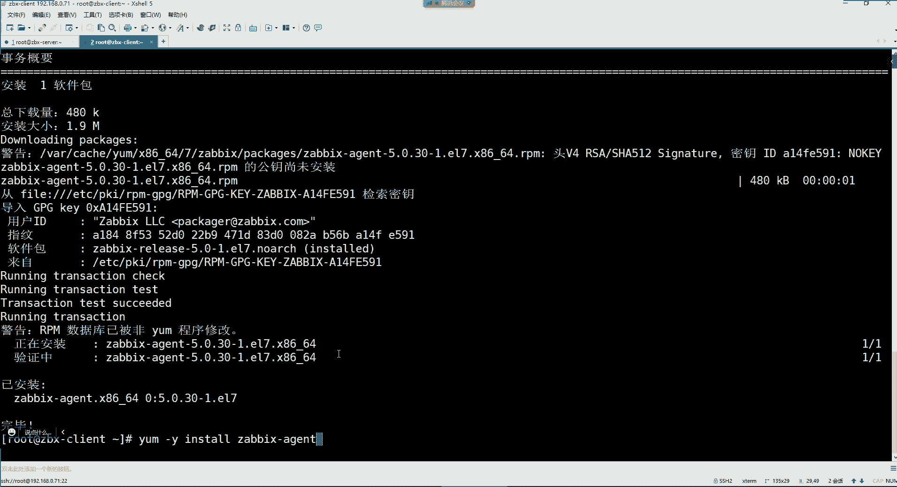

就第一步，咱们把它的仓库咱们给它下载下来。是不是啊这是这个下载。加贝克斯的。官方仓库。啊，然后呢去安装安装，我们用y么安。

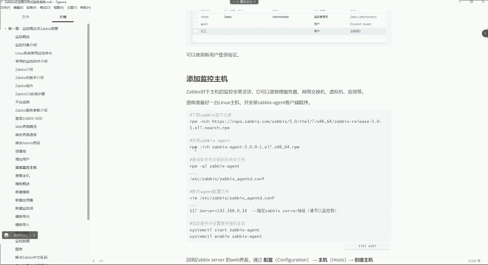

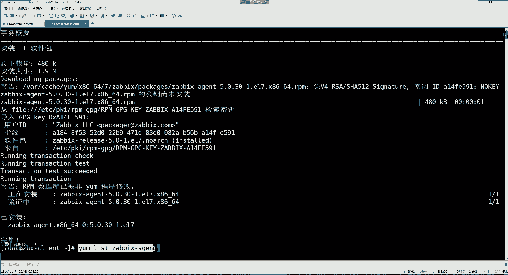

好，这就可以了。那安装完之后呢，你看我们这个主机。

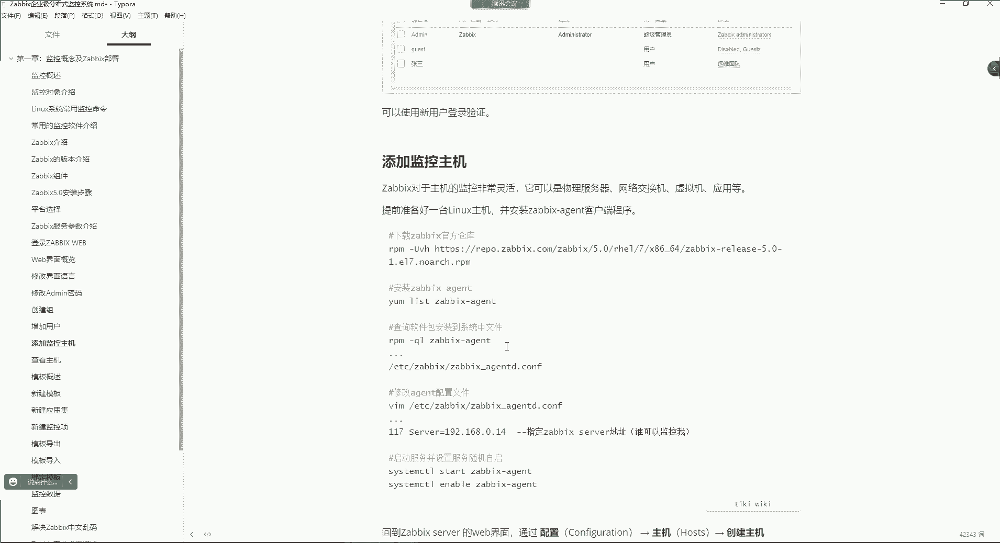

你如果想看一下这个A站的给你安装了哪些文件，你可以用RPM杠QL跟上。jab杠agent，然后看一下呃，可以看到哈呃其他的呢都不是特别重要。我们主要是找它的主配置文件也是在这儿。

在ETCjabi这个目录里边有一个叫做jabiA镇的点com。我们可以打开ETC。ja这目录看到吗？这是它的主配置文件，这是自定义监控的路径。好，那我们现在要做的事儿是什么？是改它的主配置文件去。

为什么呢？因为呀看哈。😊。

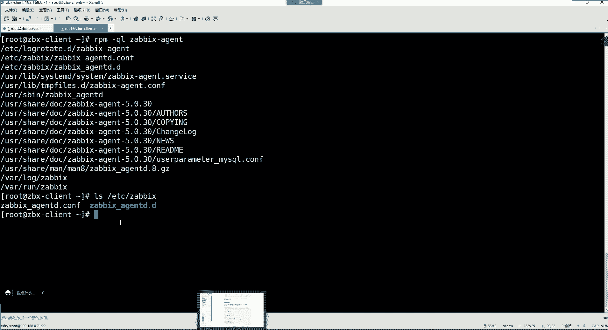

呃，我们要修改它的配置文件，我们要去定义。扎贝克斯。server的。这个地址。什么意思呢？就是最终我们想让这个ja能够监控我的话，那我得在这个配置文件里面来指定ja throw的主机地址。

就是用于定义谁可以监控我这个主机。

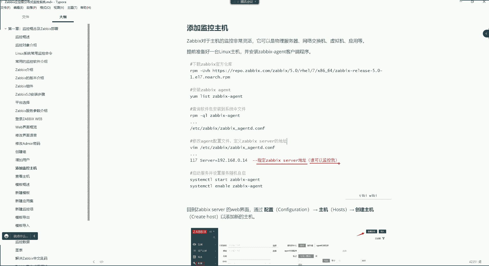

然后我们要把它的配置文件先给它打开。第二，康复。啊，然后在这里面大家搜一个serverer，然后是大写的S哈。😊，Ser。好，然后在多少行呢看到了吗？😊，就这儿哈。这是。多少行啊？117行把这个127。

0。0。1给它干掉，然后改成谁呢？改成ja server的地址。我们ja server地址是。192。168。0。70放过来就可以了。这位置是用于定义谁可以监控我的那是不是只有这个机器可以监控我呀？

因为这个机器是监控端嘛，然后保存退出。那么们现在就可以把这个A证的服务给它起来了。😊，好，然后看一下服务的状态。running了然后端口的话呢也起来了杠NTLP。

可以看到这里面是不是有1个10050端口啊，然后是jabi的Aent进程啊，然后给它设置成随机自起，这边以内部一下。好，可以了。那对于这个A的配置呢，我们就完事儿了。😊。

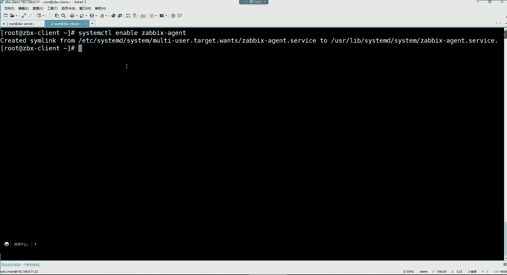

到此为止就结束了哈。然后接下来呢我们就可以回到ja serve的 web部界面。我们通过配置主机，然后创建主机来把这个主机给它添加到我的这个监控里面来。然后这个如果大家是用英文的话呢，这是英文的配置项。

😊，啊，但然我们应该没有用英文的吧。Yeah。所以我们在这儿哈在配置，然后主机在这里边，我们一是可以看到当前这个ja server监控的主机数量。啊，当是我们现在只有谁呢？只有这个一个这一个是谁呀？

这一个是不是他自己呀？😡，这是这哈，看这个是不是他自己的127。0。0。1这个端口啊，就说白了他现在是自己也在监控自己哈啊，这些呢我们就先不管它，我们直接在右边选择创建一个主机。😊，点这个呃。

然后呢这个就是添加我们的一个主机。那我们的这个主机。

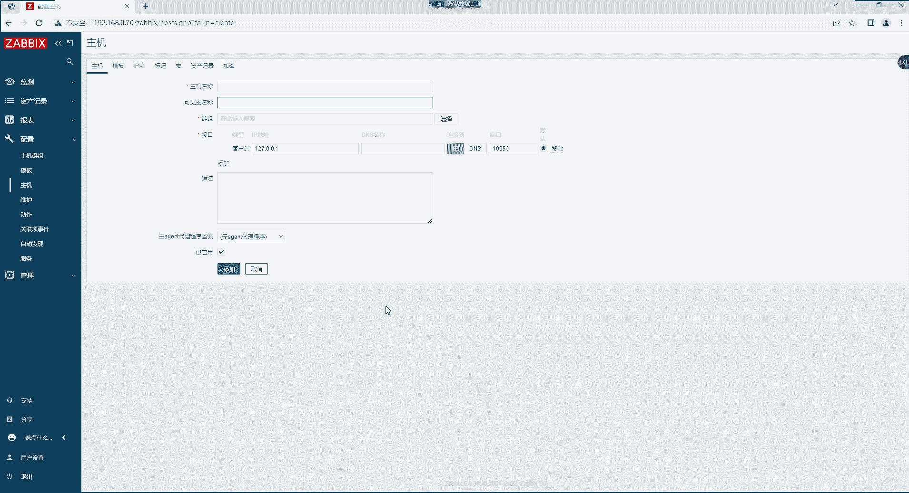

呃，我们添加的时候，这里边哈呃你可以把它的IP地址给它写进去，这样我们又好区分这个主机，主机名称。😊。

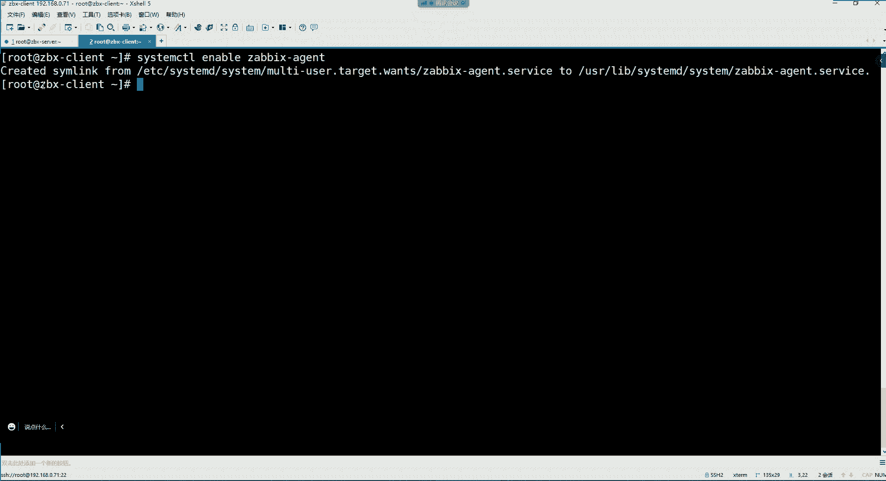

我们旧账的是192。168。0点。71。好，可不可以可以哈？然后可见名称在这里面注意啊，在这个javis这个web界面里面，所有带星标的都是必填项，没有带星标的可选项。所以像什么可见名称，我们就不用添。

😊，啊，你如果填的话也行，逐进名称随意。所以哈但是它这个主机名称的话不支持中文。不支持中文啊。好，但可见名称支持中文。那么我们这位置课见名称就不用写了，你详写也行。比如说。我们的。门户网站。可以吗？

可以吧。详写也行啊。然后群组的话呢，每个主机必须属于一个组。所以我们要把这个主机加到一个组里边，这组你可以在这直接随便写一个，它会帮你创建。但是我们呢这个主机是lininux主机是吧？

我们在选择里边就直接使用它给我们提供的默认的组，就这个叫lininux server组就可以了。就是把我所有的linux服务器放在这个组里边。好，勾选一下，然后点选择。

然后接口接口就是你这个主机的IP地址是多少，那这是它的IP是吧？所以我们把这个127给它换掉，192。168。0。71。那端口默认就是10050，我们也没有办法通过DNS名称去解析它。

所以就直接写IP就可以了。然后选择添加。Yeah。那这时候我们可以看到这个主机呢是门户网站，然后这是它的。接口。看了吗？那这个我看不到他的地址了呀，然后我们再点进去哈，这样咱们把这个。😊。

们呃把这个IP再给它放在这个位置。行吧。然后后边来个门户网站更新。这样能看懂了吧？是吧，或者说中间我们给它加个横杠行吗？😊，这样。杠门户网站。是吧更新。好。可以和认证配合上，比如证书。嗯。

在安全你要不是你要是哪方面证书是吧，我不太好理解你的这意思哈。😊，呃，这时候我们的这个主机现在已经是添加好了。那添加好之后，你发现它有没有什么问题呢？但是这主机现在谁可以看呢？😊。

我们把这个主页加到哪个组里面了呀，是不是加到这个linux server这个组里面了呀？啊，加到这个组之后，张三是不是我们前面再给他配置权限的时候？在这个用户群组这儿，我们对这个运维啊，我们再改个名哈。

叫运维呃，运维组吧。这个运维组里面这个权限是不是它就对这个leux server这个组有一个读的权限呢？而在这个组里面是不是有一个用户叫张三呢？啊，你看张三。在这个运维组里边，而运维组的话呢。

我们是赋予了他对这个组内主机具备读权限。那么张三能不能看到这个组内主机呢？我们试一下哈，张三这边哎看到了吧？😊，你发现是不是张三在这边也能够看到了呀？好。也能够看到了哈。所以就是为什么要去。😊。

创建这个用户现在能够理解了吧啊，不同的用户，你可以让他去对不同组内的主机具备不同的权限。那么张三也只能看啊，但是这个主机我们现在什么都没配呀。就是对于这个主机来讲哈，我们在配置主机这。

你发现它跟这个jat server好像差点意思，差点什么意思呢？你看啊jat server这有什么有什么应用集。16个监控像，115个触发器图形。是不是看到了呀？好，那我们现在也可以在监测这，然后主机。

因为我们是管理员的，管理员你可以看到所有的整个平台的监控主机。然后在这里边呢，我们是你看因为在监测里面是只能看，但是不能修改，而在配置里边是既能看又能改，知道吧？啊，那我们来到这个监测里边。

我们在看这个ja server的时候，我比如说我想看它的这个监控数据，你可以点它的咨询数据。😊，好，点这个资源数据的时候，那在这里边你可以看到它这里边有什么呢？有针对CPU的17个监控项啊。

然后这个位置呢我们称之为叫应用集。注意哈，这个大写的CPU就是一个应用集。什么叫应用集呢？就是一个集合，或者说就是针对于下边这些监控项做了一个分类。我这些监控项都是针对CPU去监控的。

那么我们就把这监控项都放到一个集合里面。所以这个东西叫应用集。😊，而利用级呢，你可以给它合并起来啊，那这还有针对磁盘的监控，看到吗？😊，有6个监控项。然后还有针对于这个文件系统的，看到吗？有4个监控项。

但这个文件系统是不是有两个，一个是根分区的文件系统，一个是putt分区的文件系统啊。😊，啊，然后还有一些常规的监控有9个啊，比如说我们主机的进程数量看到吗？总共的进程数量啊，这个系统的启动时间啊。

我的主机本地时间以及我的主机名是吧？是不是也都能看得到啊，包括我系统的一些描述，看到吗？我的主机，我的内核这些包括我现在当前正在运行的进程数量也能看得到，是吧？好。

然后这个呢是针对我们的这个网卡的ENS32网卡有9个监控项啊，这里边包括这个比如它的这个入口流量，看到吗？这是它的入口流量啊，然后当然这是入口流量正确的流量，这是入口流量错误的。因为这里有个er是吧？

错误的。呃，这个是这个接口类型啊，接口类型但是没有，其实它是以太网的。然后这是我的接口的状态，属于up状态。然后这是我的出口流量，看到吗？然后这是我出口流量的错误的数据包。还有什么呢？

还有这个针对jaserv的。😊，这是。option system啊，这ja server的版本啊，这不是这jaso主机的内核版本好了吗？所以你看到了吗？这里边是不是有一些这个什么呢这么多的监控像啊啊。

但是我们再回到主机，你看我们刚刚添加的这个主机有吗？😊，你发现他好像。我们点首先你看它的可用性这个位置，你看它可用性这个位置，你发现好像就。并不是绿色的。没有变绿。是吧。这就。是一种不好的现象。没绿。

是吧这不绿也不行，其实你不绿。😊，不绿就证明他其实没有获取到这个主机的监控。知道吧？所以他就才没绿。所以我们你点最新数据的时候，你发现啥也没有。因为他没有获取到监控啊。啊，那为什么没有后期的监控呢？

我们来到配置主机这儿。因为啊我们这个主机它没有监控模板。你看人家这个主机有什么呢？有模板看到吗？这是它的监控模板。好，那么我们这个主机没有监控模板呢，所以咋办呢？点到这个主机里边。点进来之后呢。

你看其实在这里面有一个模板的配置，你点进来。点进来之后，它这里边ja server有很多的模板，我们点选择。然后再点这个选择，然后这里边有针对于这个不同的模板。比如说针对于你看。针对dab的对。

127是本机哈，还有针对网络的，针对系统的，看到吗？针对一些存储的。😊，好，那我们现在就如果想看所有模板呢。呃，IP多少个就监控多少个嘛？呃，不是这你得配哈，它不是IP多少个就监控多少个，你得配。

你想让他监控哪个，你得往你得往里面添加。😊，那我们现在点那个time later，就是可以看所有模板。呃，这里面你可以看到它有针对于网络设备的，你看cisco的斯科的，针对rabbitMQ的。

针对阿帕奇的。看到吗？这是这个阿帕奇的这个jabe斯 agent的，看到吗？针对阿帕奇卡夫卡的。阿帕奇t cat的啊sep存储的dcker的dlecttic search的ETCD的FTP的。好了吗？

啊，针对java的这个GMS的进程的监控，hadoop的Hprocy是吧？非常多吧，这么多模板。那这么多模板对于我们来讲，我们现在用哪个呀？😊，我们可以找一个通用的系统模板在下边。呃。

它这里边有很多针对于OS啊，就是我们的操作系统监控的模板。你看你发现还有windows的呢，看到吗？比如说它也可以监控windows。啊，那我们监控的是不是linux啊，那我们得选择linux。😊。

好了吗？那我们选择linux哪个模板呢？这里边你看有一个叫做。😊，呃，template OS Linuxux by ja agent。这个模板就是专门针对于我们这个系统的Aent监控的一个模板。

而这个阿呢阿这是后续我们再说，这是一个主动监控模板啊，现在用不上。所以我们现在选的话选这个第一就这个哈。😊，所以勾选一下，然后点选择。模板选择之后选更新。好，那我现在就给这个主机添加了一个监控模板。

那么模板里面会有什么呢？会有应用及监控像触发器图形之类的。好，但是他现在到底有没有获取到它的数据啊？好，那我们这时候还得什么呢？还得在这个监测主机。看他有没有变绿。啊，但这个变率也并没有那么快啊。

就是你虽然说把它的模板选了之后，它也它大约也得等一分钟左右获取到这个主机的监控指标的时候，这个位置才能变绿。所以我们这大约还得等个一分钟左右吧。啊，变绿了是吧？哎，这是我们比较期待的。

然后再点最新数据啊，那么这时候你看那这个主机是不是也可以看到有17个监控像啊？😊，啊，这里面也可以看到CPU里边的，比如说CPU的。😊，第个。EMAVG1分钟负载，5分钟负载。

15分钟负载是不是都能看到啊？一些常规监控。比如说我系统的进程的，但是现在还没有获取到数据是吧？因为它这里面你可以看到他什么时间去什么呢？去获取的这个。😊，监控指标，然后这个指标当前的值是多少？

但是我们现在是不是哎出来了是吧？这是他这个时间段获取的这个指标。然后哎。下面的话呢也可以看到有针对我主机内存的内存的监控。available我的总内存。是吧3。48G，然后我的总内存的百分比。好。然后。

剩下就是我的s的这两个是针对swa的。😊，这这是我的总内存哈。这是我的可用内存。然后。也没啥了，这里边。发现大多数看不太懂吧。😡，是不是看不太懂啊。😡，其实对于这个监控下来讲哈。

其实我们可以不用它自带的这个模板。😊，因为这个模板真的不是特别的好用，而且有很多的监控像，其实我们都并不关心你像什么CPU什么nice time。😊，什么软中断时间。什么CPU的。

系统的什么time是吧？用户的time就是系统的进程，使用CPU的。一些这个。资源以及我们的用户进程使用CPU资源，这些对于我们来讲有意义吗？没啥意义，是不是我们其实关心的CPU有哪些，是不是这这仨。

😊，155的平均负载量。是吧。是不是关心我的CPU核心数量？😊，几个核心，我的CPU当前的这三个负载，这是我们比较关心的，其他的看不太懂。😊，这有啥用啊？是不是？屁用没有。要他干嘛？十吧。

不用它自带的模板了，再配置主机。点进去找到模板，把这模板给它。注意啊，要点这个取消链接并清理数据，你要点你要光点取消链接，模板不用了，但数据还在知道吧？所以点取消链接，然后把他的那数据都给它清空。

然后更新。好，那这时候怎么办？我们要自己自创一个监控模板，可以不？所以这里边模板是什么呢？啊，那jabe他为用户提供了很多开箱即用的模板，但是大多数模板都不能开箱即用，因为跟你的系统不匹配。

我们可以在配置模板里面看，我们前面已经看过了是吧？你看在这里面也有模板，这么多模板，但是没有几个能够符合我们需求的。哎。那么这个它的模板分类哈有针对网络设备的，有针对HTTP的。

还有这个一些这个服务器的一些硬件的，比如什么。😊，温度啊、电压、电源状态的，还有针对于java程序的，还有这个针对于数据库的，还有jabs agent的监控的模板分类还是。这个蛮毒的。

但是它除了上述的这些模板之外，还有很多社区模板，但是这些也没有办法直接用。这是他社区地址，你可以自己去找找，但是大多数也不能直接开箱即用。😡，所以我们可以先自己先了解一下我们怎么去自建一个模板。

来按照自己的需求去。什么呢？去使用好，所以我们这儿新建模板的时候，看这个模板，首先它可以对监控像、触发器、图形等进行归类。就是你想监控一个主机。那我们得首先要监控项，监控项最终是获取指标的。

但是镜像必须要放在什么呢？放在你的模板里边。😡，你模板里面有监控像了，然后你把一个模板链接给一个主机，那么主机就会继承这个模板里面的所有功能。好，所以接下来我们就要去在配置模板，自己创建一个模板去。

右上角看到吗？配置模板，然后这儿创建一个模板。啊，那这个模板名字我们让它叫什么呢？我们让它叫。莲纽斯OS。可以吧。针对系统的一些监控。Mornet。叫linuxOSmon可以吧，linux系统的监控。

然后群组这个模板我们给它放在哪个组里边，我们也给它放在linux server组里边。然后选择一下模板也得放在一个组里边啊。你看因为它这里边星号嘛。好，然后添加。模板就创建好了。

叫linux OSmon。那这个模板里边啥都没有啊。是吧你看人家模板里面都有什么应用集监控像触发器是吧？我们这里边啥也没有咋办？所以接下来我们在模板里面新建一个应用集。应用集。

前面是候我们给大介绍了应用集，你可以理解成给监控项做了一个分组。我们可以将相同类型的监控项给它放在同一个集合里边。😊，啊，所以我们要在模板里边，我要给这个模板。去创建一个应用集的话，那我就点这个应用集。

点的。然后这个模板里面现在没有应用集，如果有的话，它就显示了，我们可以右边先点择啊选择创建应用集。那名字呢，比如说我现在呃创建一个什么应用集啊？呃，创建1个CPU1分钟负载。啊，或者说呃这不是啊。

我们先创建一个，我看这英文级叫CPU的平均负载吧，这可以取中文不，我们试试哈CPU的。😊，平均负载。不要。添加。可以是吧，没有问题。然后那这应集有了，我们再回到模板里边。

现在这里面是不是发现有一个应用级了呀啊，但是这没有监控像。是吧。那么我们现在要干嘛呢？要去点监控项，给它创建监控项去。啊，所以下边。这个对于监控像，监控像就是jabs中获取数据的基础。

没有监控像就没有数据。那么这个精控像我们怎么建呢？这边我们要去给监构像取名，在这哈取名，然后选择你这个监录像给谁用，就选择你的ja的类型。然后再选择你金融箱里的键值，然后再指定我这个主机接口。呃。然后。

我们先来试一下哈。我们先创建监控像，那在这里边哈在里边主机接口，我看这里面有主机接口吗？没有啊，像这个监控像没有接口哈，这截图是不是截错了呀？😊，没有接口哈。首先呢名称。

比如说我现在要创建1个CPUE分钟负载的监控像。😊，我知它叫CPU，然后。一分钟。的。平均。负载量这个可以取中文。好，然后那类型类型我们这个监控项要监控的是什么类型啊？是不是ja斯的客户端呢？

就是它的那个agent呀，所以默认就是客户端类型，客户端就是它的agent键址怎么写呀？😊，哎，这个键职不太好写。这键职不能瞎写。😡，在选择里边可以找一找。呃，这里边有很多的这个现成的建职。

以及每个兼职是干嘛用的？这键值是ja克斯内置的，他通过这个键值就可以直接获取到这些监控项的指标。那么我们现在要找的是CPU的是吧？呃，而且是CPU负载的那这里边。这呢CPU这是CPU负载，看到吗？

我们勾选一下，但是这个你如果这样写的话，你这个它只是一个什么呢？只是一个大体的一个基本框架。这里边你还要改怎么改呀？你看这是获取CPU负载的一个键值。但是这里边到底是一分钟还是5分钟还是15分钟呢？

所以我们这可以参考一下，我们再开一个页面，我们找在主机找到ja server。点它的监控像。在它的这个监控箱里面，咱们可以看这个CPU点这个CPU然后我们找到它的这个CPU的EAVG就是E这个看到吗？

一分钟的负载，你看它的一分钟负载里面这是什么呢？前面这名字是一样的，但是呢后面就是allAVJE，这就代表一分钟负载，你也可以点进去详细看。😊，看了吗？所以这个你可以把它的参考复制一下，放在我们这儿。

或你也可以自己写也行。哦，然后后边，但是你写容易出错呀。啊，你要把将。尖角号也给它删掉。哦，然后。这个AVJE这代表一分钟的所有负载。是吧。好，那我们就写完了。讲了哈。

然后那它的信息类型就是最终我获取到了这个CPU的这个指标之后，这个指标它是什么类型的呀？这个你得选。😊，它是数字啊还是浮点呢，还是字符啊，还是文本日志啊？那它应该是浮点的，就是这种小数类型的。

是不是啊CPU嘛，它可能有小数啊。好，然后单位没有是吧，更新间隔一分钟啊，EM是一分钟，那我们这也是就不用动了是吧？就是他一分钟的获取一次这个指标的数据去。好，然后这个历史数据保留时长在这里边呃。

有这个它这里边是保留多久？7天，你看它历史数据保留7天，那我们这边也是7天。改成7，然后趋势数据。这个趋势数据跟历史数据的话呢，他们两个都是什么？都是我的指标数据。但是历史数据它保留的会更加的。什么呢？

更加的详细一些。呃，这个位置啊我们建议大家就是对于它的历史数据保留时长。你可以把它的时间缩短一些。因为历史数据就是比如说我一分钟获取一次我的这个。这个什么呢？我的这个CPU的指标。

那么你看它一分钟也会把这个指标写入到你的数据库里边。也就是说。你的数据库一分钟就会多一条CPU的数据。那这一天下来，你的这个数据库里面会堆多会多多少条数据库啊，哎不是会多多少条这个CPU的这个指标啊。

是不是就是一天下来一分钟一次一分钟一次啊。😊，啊，就一分钟就会写入一条数据。呃，但是这个数据呢我们保留的天数，如果是7天的话呢，就是他隔7天会帮你删。会把你删掉哈。那么这个后续你说把你把数据删掉。

我怎么看呢？比如说我想看我一个月之前的，但是你只保留7天，是不是啊，我肯定看不到一个月之前的呀，那没关系。😊，趋势图。趋势图它是什么呢？它是一个时间段。他在给你保留的时候。默认应该是一个小时。

这一个小时的时间里边，我的CPU的这个负载量。我给你写到数据库里边。一个小时给你写一次，一个小时给你写一次。那么这样的话呢，它会比较节约你数据库的资源。它不会像前面这种一分钟就是一分钟写一次。然后呢。

这数据一直留着。所以这种你就记住趋势数据可以保留的时间久一点，保留多久呢？它里面是一年是吧，365天嘛，地代表天。所以对这两种类型的数据呢，我们就是。历史数据保留7天，趋的数据保留一年。

后续你想看我这个这个比如说一年之内的历史数据都可以看。然，其他的话呢，我们把这个监控像放在哪个级里边呢？放在这个CPU这个平均负载量里边。这个情下属于这个应用级。而其他的就不用动了。好，然后选择添加。

让我们来回到我们模回到我们这个模板里面哈。那我们现在看我们这个模板的时候，这里边多了一个监控项啊，那么这个监控项有值吗？😊，我们也不知道是吧，那咋办？我们要把这模板给主机绑定一下，看看它能不能获取到。

不就可以了吗？是吧所以我们在主机，然后再找到我们这个主机，然后在模板里边把我们刚刚的那个模板给它。找到。呃，直接找到我们那个组吧。找linux4serv的一个组。啊，这个组里边就是我们这个模板。

然后选择。更新一下。好，那更新一下之后。我们一会儿得看它可用性这位置得变绿哈，那我们就直接来到监测主机。得等得等他一分钟啊。但是这个你像这种基础监控，是不是你可以去参考ja server呀？没错吧。

你参考它，你觉得哪些监控信号是我们。能够用得上的到底是CPU的呀，还是磁盘的，还是你的跟文件系统，还是你的bo文件系统，还是一些常规的呀，网卡的呀。😊，这些内存的。你只要能够用得上的。

你是不是都可以去参考，一个一个给它做出来呀？😡，好。获取到了吗？好，我们再回到配置主机。Out。模板然后点到我们这个监控箱里边。这个监控箱你可以看到它现在是已启用的状态。没有问题是吧？

在这面可以看看它的状态。那我们这边应该能够获取到数据了。哎，变绿了是吧，变绿之后，我们这边再点它的资源数据呢。😊，是不是获取到了呀，是不是这是他的应用集的名字啊后应用集下边有一个监控项。😊。

然后什么时间去取得这个监控像里的值呢？是这个时间段。然后当前它的一分钟负载是0。

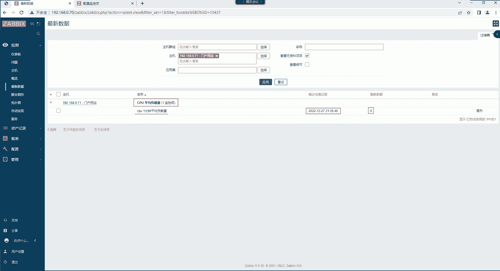

因为没有负载嘛，那主机确实啥，因为我们这个因为我们这个主机确实啥也没干。😡，是吧。但是不是没有问题呀，这边能够获取得到是吧？那由此可见，我们做个监控像。😊。

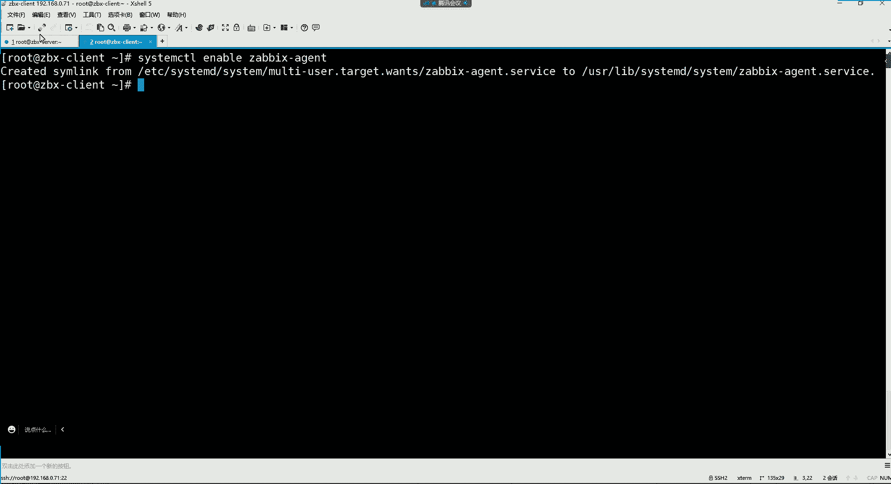

哎，可以哈，你你想让它显示百分比也可以哈。😊，哎。哎，显示百分比是吗？😡，不行，显示不了哈显示不了。那如果我们是想要自己做的话。那这个时候我们就得再继续去写吧。配置。模板再去写一个监控项是吧？

这里边有一个我们再去创建一个，但这是不是比较麻烦了呀？比如说我再写一个C呃CPU的。这个5。分钟负载。亮。类型也是客户端兼值，但这键值我们是不是自己可以改成5了呀？没错吧。这不就5分钟的吗？

然后数字类型浮点更新间隔一分钟。历史数据7天。放在这个集合里边。是吧。然后。添加一下。这是CPU。啊，这名字是吧，我们再把这名字改下，5分钟负载量，把平均去掉吧。更新一下。让这名字有一定规律哈。

然后再来一个。😊，这是。CP。15分钟。负载量兼职。是不是加个15就可以了呀，加个一。然后也是浮典类型的。历史数据。7天。放在这个应用机里边。那我这个5分钟。也是浮点是吧？没错。好，那接下来。呃。

我们再去。看一下我们的这个主机。看看多没多出来这三个镜控线啊。因为因为CPU的值里边。是有小数点啊。所以这得是浮点类型哈，你要整数，这就获取不到了，知道吧？😊，是不是也5分钟也获取到了呀。

那15分钟呢一会儿也没有问题了吧。😊，你得等，因为我们刚添加，其实它并没有那么快。啊，那如果我们还想添加呢，比如我想添加内存怎么办？模板。建个应用机。是吧比如说我的内存利用率。添加。

然后这里面没有监控像是吧？哎，对，0。01就是1%。这不是。CPU这个数你看起来不简单吗？😡，0。01就是百分。之一，如果是0。10呢，就是。哎，我这写反了啊，就是1%。如果是0。10呢，就是。10%。

是吧如果是1。0呢。就是E核心。一核心的CPU。百分百了。1。0哈，如果是1。5呢。就是。150了。但是一个核心百分百，另外一个核心呢50%。150%。但以此类推，如果是2。0呢。

就是两个核心的CPU都处于百分百。知道道吧，但是你服务器里边，你CPU核心一般都是是。服务器的CPU核心多。十6核心32核心。是吧。很普遍的。很普遍哈。对。一就等于一核心的CPU百分百，它是那样子。

然后如果想添加内存，我们点监控箱，然后创建一个监控箱。那内存比如说这是我的总内存。建职怎么写参考是吧，我们就自己不会写，但是我们可以参考，你点到我们这个jaet server。

主机ja server入的监控箱里边找到它的memory，找到它的内存。然后看它的总内存。这是不是它的总内存呢？他的键址怎么写的，是不是这个？是不是？兼职。写到这里边。那内存的数。就是数字了，无正负。

好那这边。数字无正负，然后但是内内存的单位，你看它是B。看到吗？所以这你也得给它写上B。更新间隔一啊一分钟。历史数据保留7天。7天。然后属于哪个应用级里边呢？属于这个内存利用率。这个应用机里面添加。好。

然后我们这边再模板。回到我们的这个监控箱里边。几个了，是不是多了一个总内存了呀？好，那最终能够获取到数据吗？监测主机。最新数据。反正CPU这个肯定是没有问题了，是不是啊？😊，内存的话呢，我们还得等一等。

但你想看它这个图形，你点图形。看到吗？这图形这位置你看它这有线儿。这个线儿现在是载什么？是载。零这个位置就说我当前CPU负载量是0。零没有负担。那没有负载不行啊，我们怎么办？让他。😊。

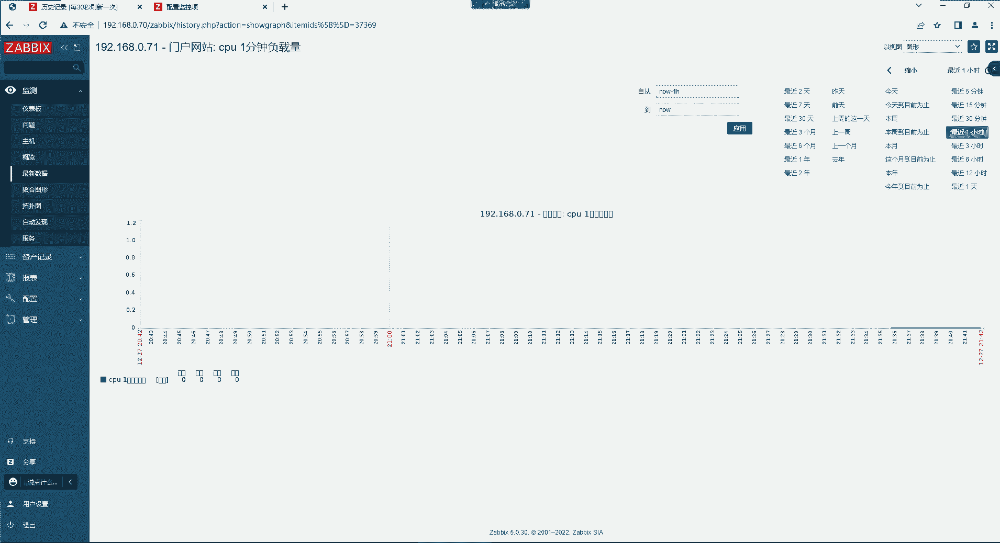

忙碌一下吧，我们这边。写个vivo循环。然后。我们ele一个hello。加贝。然后这边我们再开一个终端。我们这边呢用这个top看一下。他的CPU如果一会儿忙碌起来了。看那个线儿会不会发生变化，看已经0。

67了吧。好，那这边。

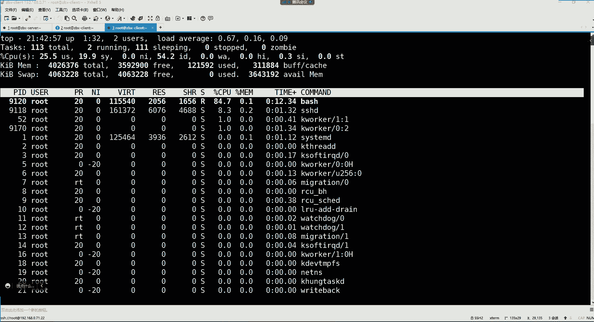

但是他并没那么快哈。😊，是不是起来了，你看这个线儿，当然我们现在看的是，因为它上面有时间，你看到吗？我们现在看的是最近一小时的。😊，这个。1小时内的数据，我们可以点最近5分钟的。

最近5分钟的你可以看到是。从当前这个时间段往前推5分钟。比是说在这5分钟范围内，我的这个CPU的一分钟负载量，就是每一分钟你看。😊，就是这到这儿不是一分钟吗？就我这一分钟范围内我的CPU负载量。😊。

他处于什么状态？啊，每一分钟看到吗？我的负载量处什么状态？那我当前我这CPU这个线在哪儿？在这儿0。4。0。4就是。这个。40%。现在是40%是吧，它在这儿哈。😊。

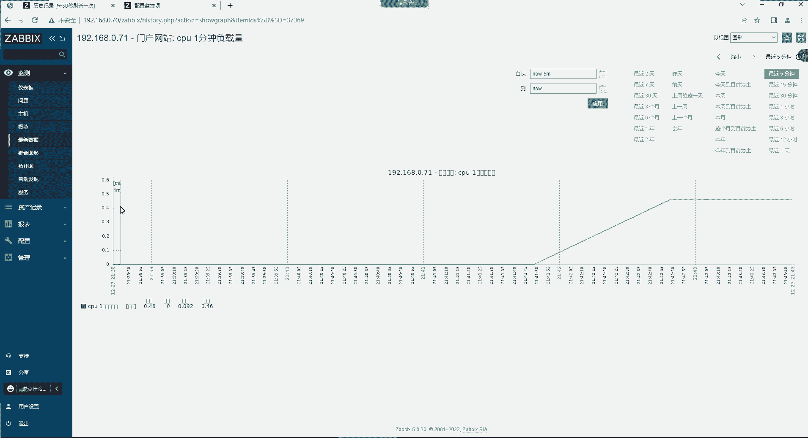

40%。但是不是能够看到啊？但是他得一分钟获取一次，我这已经一你看已经是1。88了，但是他呢其实。

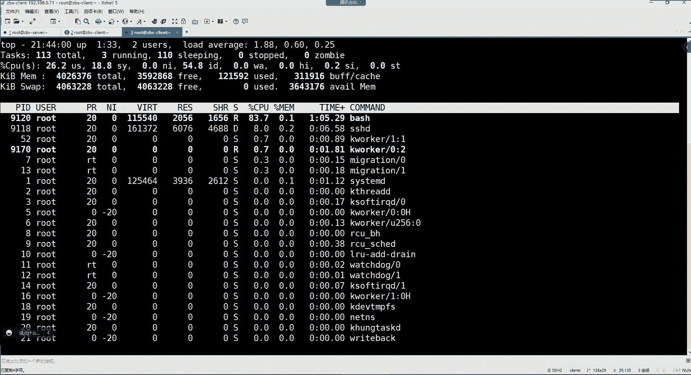

他得再隔一分钟才能去取值哈。所以你看这是不是已经1。5了呀，是不是啊其实不是1。5，应该是1。8了，在这儿应该在这儿。

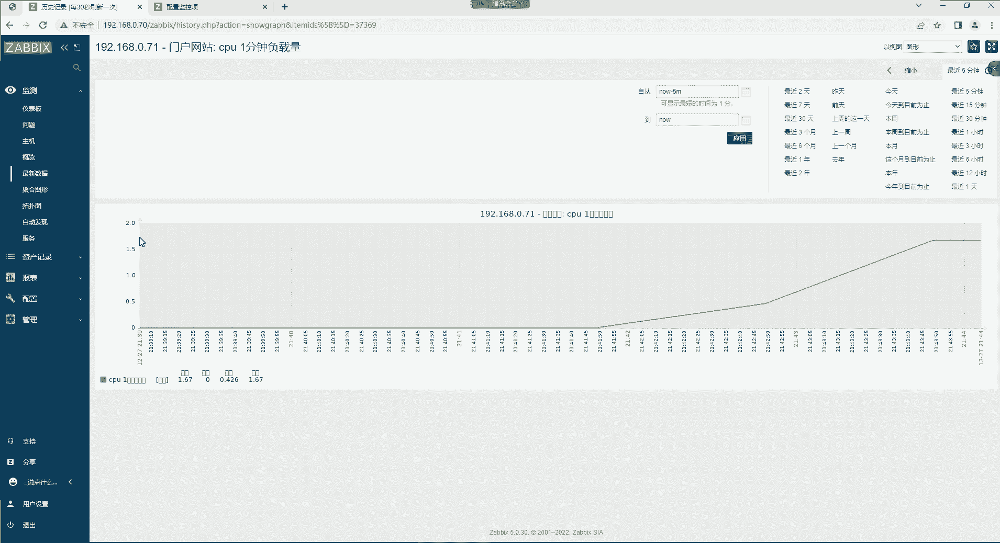

没毛病吧，一点毛病都没有吧。好，我们取消哈。😊，验证一下就可以了哈。

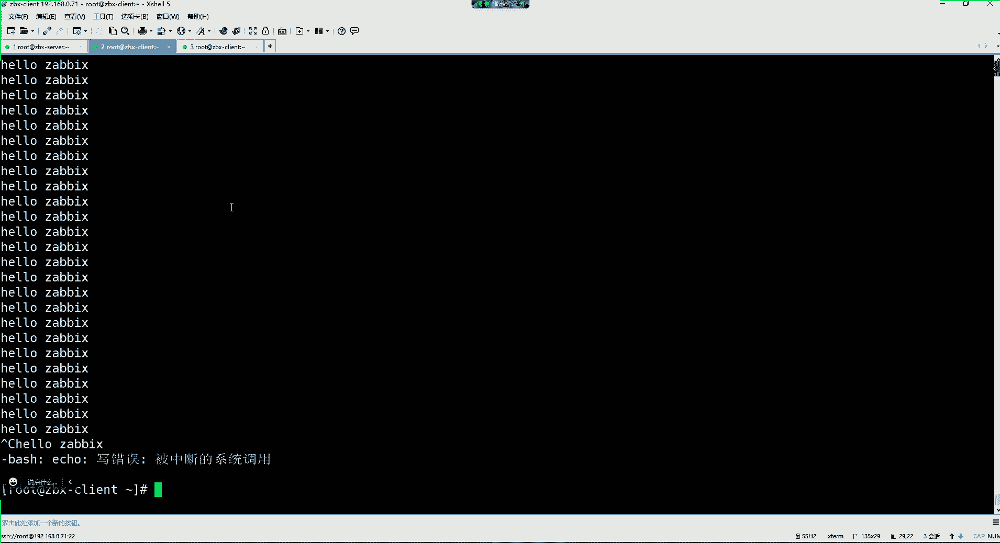

验证一下就可以。是不是还是蛮准的呀？因为他一分钟取一次值嘛，行。呃，然后这儿看图形，那哎我们再回来哈回来。😊，哎，内存总内存。获取到了吗？我这主机总内存3。84。是不是没有问题呀？好。

那如果你还想写其他的监控项，是不是就以此类推，你就参考我们这个ja server它的这个监控项，然后自己手动去写，可不可以？😊，是不可以。所以这我就不带领你们写了，行吧？

因为我这提前已经是花了点时间写好了一个了，所以我们可以拿过来用一用。我们在主机。把这个模板。咱先给它取消掉，取消链接并清理哈，更新一下。我这有一个现成的。😡，现成模板我们可以干嘛？我们可以给它导入。

注意哈，就是模板，你写好之后，你可以导出来。😊，但是我们可以导入。怎么导呢？在这儿。在模板这里边，如果你想导入的话，你点这个。如果你想导出的话，你比如说我想把哪个模板导出来，我想把这个。呃。

随便导一个吧，比如我想把这模板给它导出来，你选择导出。看到吗？它就变成一个文件了，是一个叉ML格式的文件。😊，看到吗？这就是一个叉ML格式的文件导出来了。然后那导出来之后，我想再给它导进去怎么办呢？

那我们就不导这个了，我们把它删掉哈。😊，我倒另外一个。我们这时候看哈右上角我选择我导入一个模板，然后选择文件。那我给你们找一个。我们的这个。这里边有一个。这个是jabislinux OSexport。

呃，这个我们把名字给他啊，行，就让它叫ex啊export吧。一个就是指标采集器的意思。好，那么现在我们把这模板选择一下，然后选择打开。😊，然后选择导入，那这里边一些规则默认就可以了。

比是群组也默认什么模板什么的，这些全部都默认，监控项也默认触发器什么都默认，我选择导入。😊，好，如果它提示成功导入的话，我们再回到我们的配置模板里边。

看到这里边是不是也有一个模板叫做lin monitor啊。这是我刚刚导进来的，而下面这模板是我们自己建的，里面有4个监控像是不要了勾选。😊，下边有删除，这儿有删除，你可以不要给它删掉，确定。好。

然后我们这个模板里面有多少个呢？我们点进去看一看啊，嗯等会儿不能这样看有。😊，好，那这个模板里面它是有6个应用级，我们点应用级，哪6个呢？有CPU的内存的常规监控文件系统、磁盘网卡。

然后每个应用集里面呢，你看有这些监控性。总共加到一块堆的话。是22个监控项。那么这22经箱都是我按照我前面那个方法，自己参考了这个jab server那个模板。都是自己写的。

然后我可以把这个模板给它跟这个主机绑定一下，找到这个主机，主机找到它。然后在模板里边。选择一下那个模板，我也啊就就这个啊，我因为我也是给它放到这个linux server这个组里边了。选择，然后更新。

好，但这也得等，然后可以再监测，然后主机。这里边等一等，还得等它变绿。普变率不行，这位置啊。嗯。哎。ja就是鼠标点点点，你们有没有发现？😡，是吧其实你发现你如果鼠标点点点的话。

它是不是总比你在这个命令行里面去敲这些。😡。

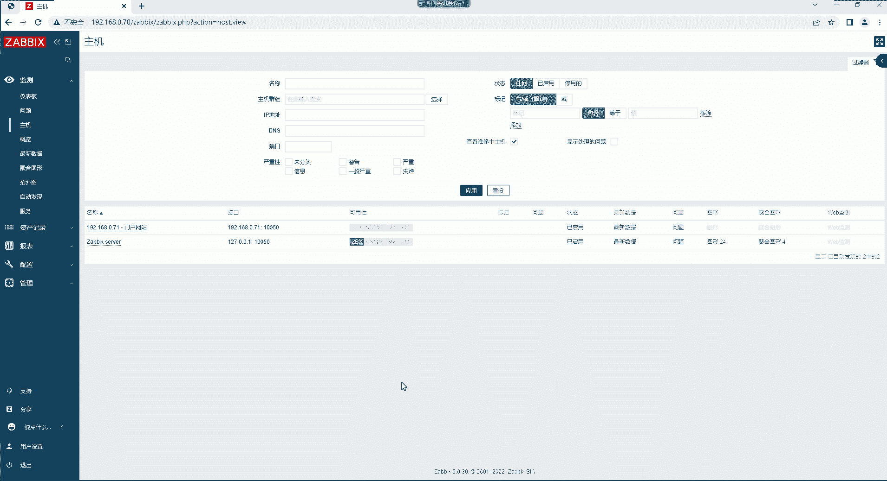

这个。不适合人类去记忆的这些命令要强的多呀。没错吧。毕竟你鼠标点点点，而且你还看得懂啊。😡，你要枪命令呢，你要敲命令，你发现。

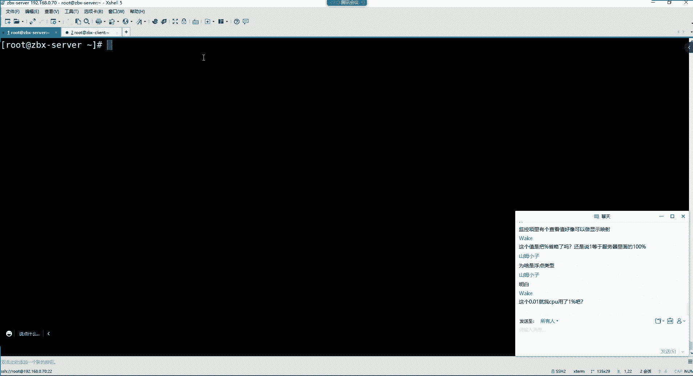

记不住是吧，命令多。绿了是吧，绿了之后，我们点最新数据。在这里面大家可以看到这里面有。CPU的4个监控像。一分钟负载的5分钟负载的15分钟负载的CPU的核心数，但是还没有取到值是吧？然后内存的3个。

总内存剩余内存，剩余内存百分比，这是不是都是我们比较关注的呀？😡，你想对内存来讲，我关注什么sp吗？😡，不关注我我关注什么buer缓存，开始缓存吗？不关注是吧？啊。

所以我就关注我的总内存和我的剩余内存就可以了。我总内存这些我剩余内存也这些当前百分比剩余的，是不是可以呗。然后常规监控里面有什么呢？有我。😡，已登录系统的用户数量，我系统正在运行的进程数量。

系统启动时间，系统的一些描述系统本地时间啊，还有我的这个文件系统，这里面有根分区的，看到吗？但是没有不的分区，不的分区有必要去监控的吗？你不的分区你都不用，是不是你监控它干嘛呀？

你不然他也往你数据库里面写数据，有必要吗？你没有必要。😡，获取到值了是吧？然后。还有啥呢？网卡网卡，我的哪个网网卡，但是这网卡名是不是你想怎么写就怎么写呀。😡，无非不就是一个名字嘛。

后续你在他这个配置模板。在这里边，在监控箱里边，我们找他网卡，就是后续最终你每一个监控线的话。你接口名字叫什么无所谓，知道吧？你后续你换个服务器，你说后网卡名不叫这名字呢，改呀。

把这里面ES32给它改掉就可以了，其他的都一样。知道吧？诶。然后再回到监测。主机。最新数据。值出来了，是不是？对别人用在导入，就我这模包我给你们，你们也可以直接用的。😡，就这模板我到时候发给你们。

你们到时候拿过去直接用。😡，知道吧。所以这就是为什么要做模板的导出和导入呢？就是这样子。啊，所以这种东西，然后这个张三也可以在这看，张三也可以看他的最近数据，看到吗？你比如说我们就是对于张三来讲。

他就是什么呢？就是运维。那么对于张三，你是不是也需要他能够看到这个主机的一些可用性啊，一些这个指标啊，是吧？张三是不是也可以看。没毛病吧。行，那张三我就退了，这号我们后续不用了。我们就用。

因为我们得用otmin哈，张三没有权限。😊，然后这是模板的导出和模板的导入，模板绑定是不是也知道了呀？因为我们这个你想让他用哪个模板，是不是就在这个。找到你的主机，然后把模板给它绑定一下就可以了。好。

😊，呃，然后图表图表的话呢，就是当这个监控像运行一段时间以后，我们可以通过图形看。那我们是不是也看到它的图它的图形了？比如说我现要看它的CPU点图形。是不是有他的CPU啊，但他的CPU现在有个问题。

什么问题呢？你发现这乱码。😊，乱码。这小框框是啥呀？你以为真是小框框吗？😡，不是。它是中文乱码了。那么这个中文乱码怎么解决呢？这中文乱码非常简单。就是在哪个路径呢？在它的这个路径。

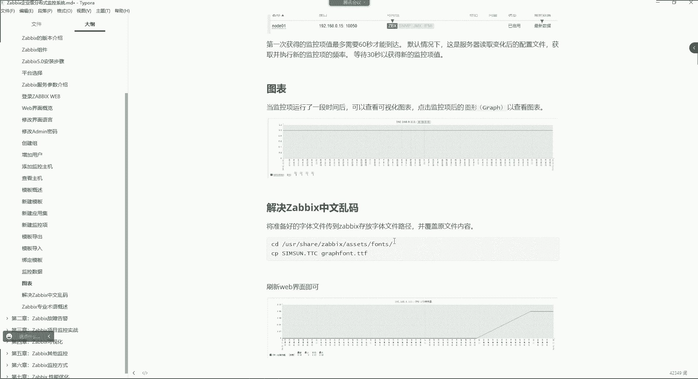

在ja server这个主机哈，这个路径。呃，这个路径不用记，因为我们这个也就是。只会跟这个路径打一次交道。后续呢就不会再去进到这个路径了。但是这个路径里边有一个文件，这是这个哎。

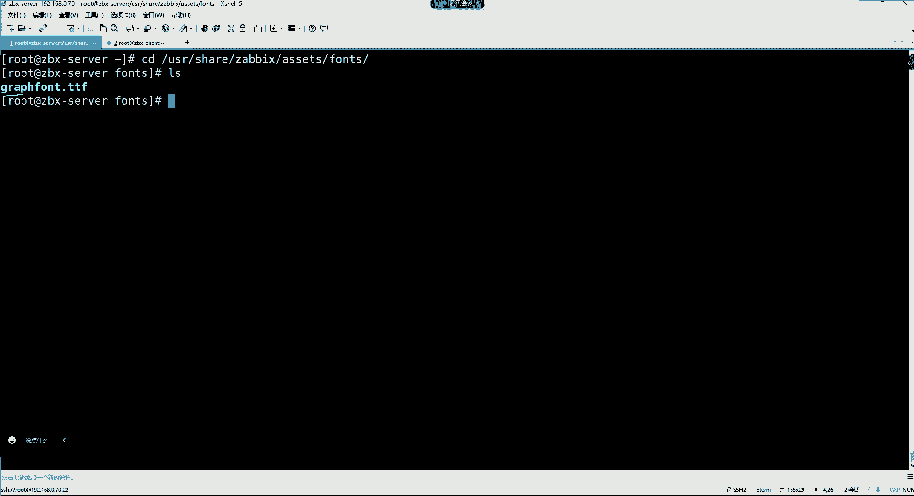

jab默认的字体就是它的这个web界面的这个字体。

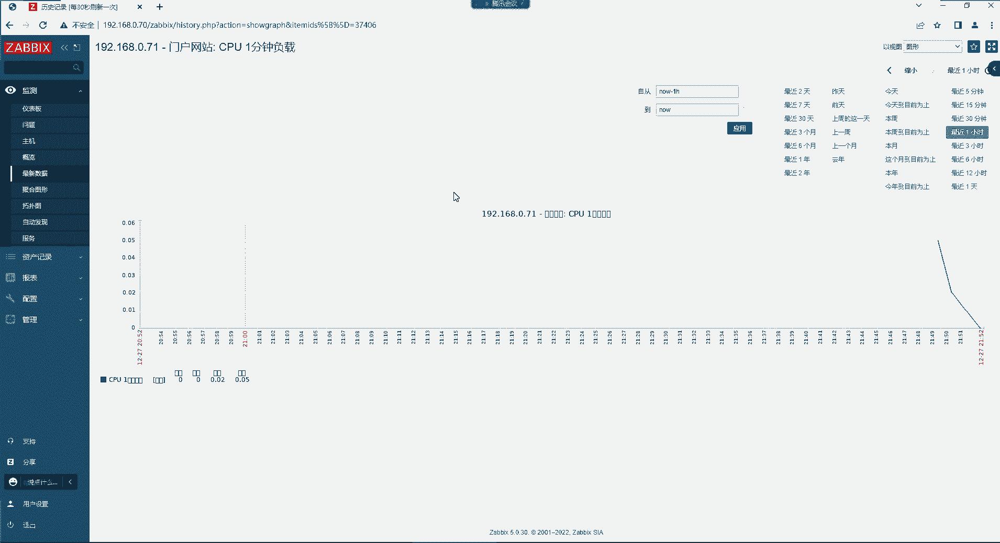

那么这个字体文件默认对中文的支持部分就会出现乱码。所以我们只要把这个文件的内容给它替换一下就可以了。我们怎么替换呢？我们在windows里面随便找一个字体文件。

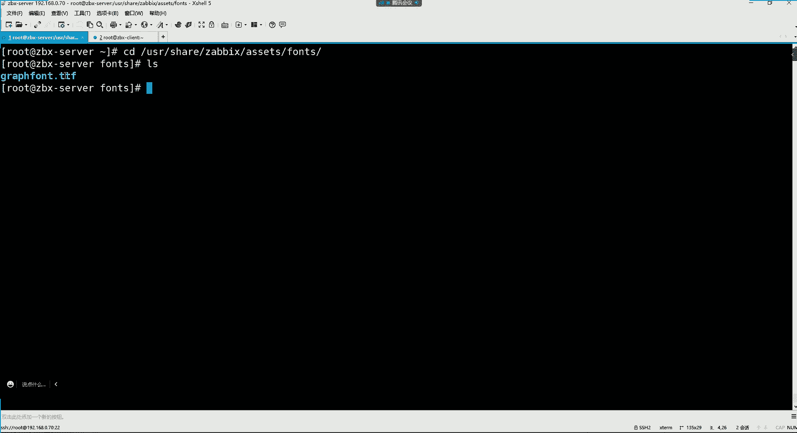

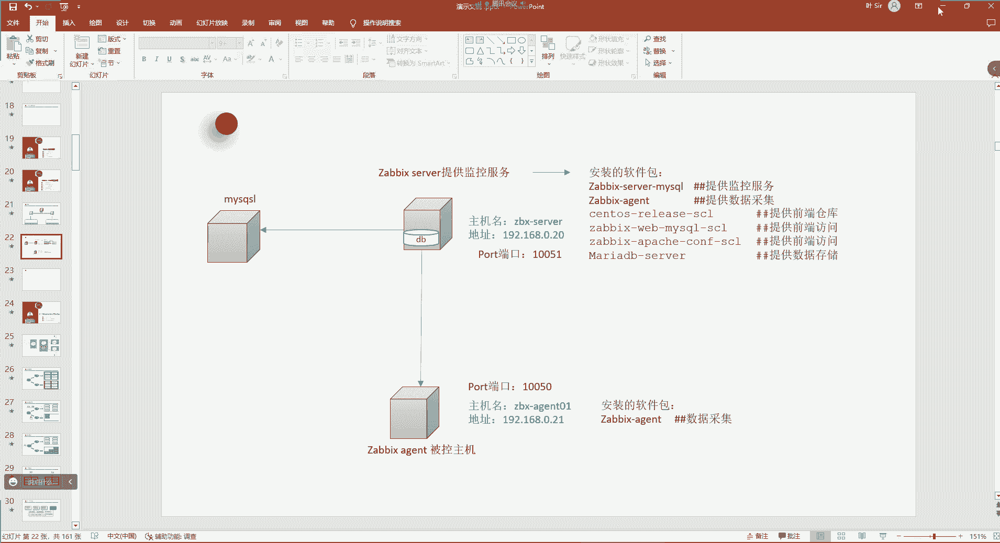

我们的windows。C盘。windows文件夹。然后有一个看到吗？这是不是一个字体的图标啊，点到这个文件夹里面。😊，点进来之后，你随便找一个你觉得比较不错的字体文件。比如我觉得。新宋体比较不错。

那我们就把这个新宋体给它拖到这个路径来。

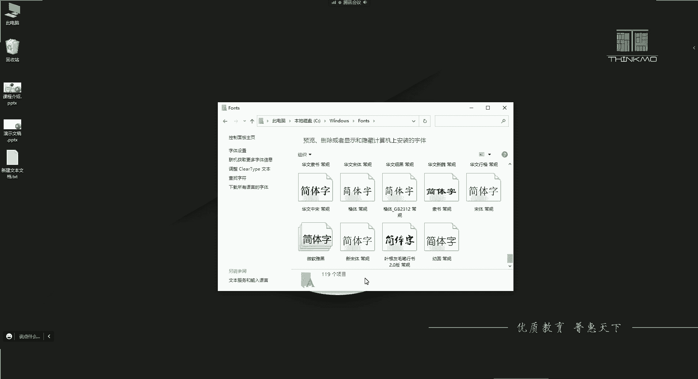

走你。好。那拖进来之后，我就把这个文件里的注意呀，我是把文件里的内容覆盖掉，不是把文件名覆盖，你要注意。文件名只能是这个文件名，因为jab它识别字体文件的时候，它只能去找叫这个名字的字体文件的。

所以我们现在要把这个文件里的内容给它覆盖到这个默认的字体文件里面。所以我们这就CP指定我们刚刚的这个文件。然后拷贝到它默认的这个字体文件里边。覆盖吗？Y覆盖。好，那这时候我们再刷新这个界面的时候。

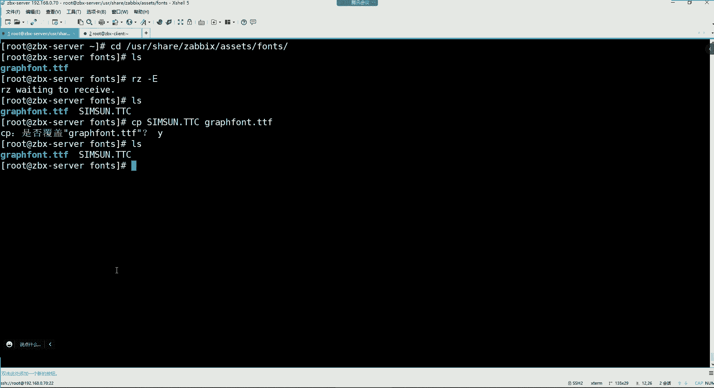

好，看到了吗？是不是就不会出现中文落码了呀？😡，哪个主机，哪个监控像，这里边也是看到吗？最新的值最小的值平均的值最大的值。当然这也是在这5分这也是在这5分钟范围内哈，可以看到最新的值是多少，最小的值。

平均值最大值。😊，因为这个时间可以啊，这是最近一小时的啊。😊，呃，因为它这个值最终你想看。它的哪个时间段的数据，这里边你都可以看嘛。你比如我想看我本周的，它就显示本周的。我想看我的上一周的。

我想看我最近三个月的。去年的最近一年的两年的。他都可以。给你看。啊，因为他数据不是存到数据库里面了吗？好，所以这就是怎么解决它的乱码的一个情况。呃，然后下面还有一些扎布斯专业术语。

专业术语没有什么太多可介绍的。😊，这个。太官方了，真的哈，我觉得这个特别的官方哈，咱们就不要它了。没有什么意义。没什么意义啊。删掉。发算。行，然后嗯。如何调jabs API？呃。

你你想你想调它的哪个API，你想干嘛呀？关键是你得。你要调A片的话，这个我跟你讲，那我也没咋调过。😊，ふ。😊，主要是没有什么太大的需求啊。😡，好，然后我们这个休息一下。通过API创建情况下。

没搞过啊是吧？这没搞过哈。一小时了。

