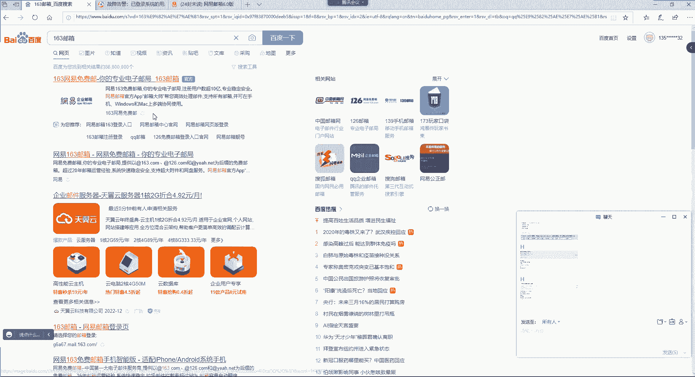
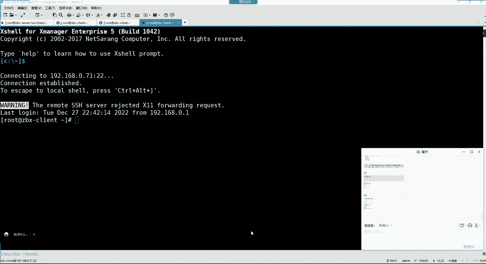

# 零基础入门Linux，红帽认证全套教程！Linux运维工程师的升职加薪宝典！RHCSA+RHCE+中级运维+云计算课程大合集！ - P91：Zabbix监控-3.zabbix故障报警 - 广厦千万- - BV1ns4y1r7A2

需不需python是吧？呃，python的话后续有录屏发给大家，大家想学可以去看一看，是这个就是第三阶段的这个星海老师讲的，我也不知道大家能不能听习惯哈。呃，感兴趣可以看一看，到时候可以发给大家啊。

然后那个。如果你要想调jabs的API哈，这个怎么说呢？嗯。你得去这个。问问这个扎斯的。官方，你说我想调调这个API。呃，但是这个问官方的话，可能得咋说呢？得得得给点钱啊，就他可能会教你怎么调。

但是可能得需要点技术支持的费用。或者你从网上搜一搜，看看有没有方法啊。但是我就并没有调过，所以我就。呃，没有办法告诉你。呃，呵。那算了是吧，听不太懂吗？是吧？然后我们来说说这个jabs斯报警哈。

jabe斯具备灵活的故障告警功能，允许用户几乎为任何的监控像啊，这个不能说呃这个为任何的啊，行，就为任何的监控项。去配置像电子邮件呢、短信呢、微信、钉钉等报警。呃，这样管理员就可以快速想服务器的问题。

如果我们想配报警，我们这首先得这样。呃，对我们的邮件有个要求。比如说如果我是QQ邮箱的话，那这里边你得先登录一下，做一些配置。呃，我用我的其他的账号哈。如果你是QQ邮箱的话，你要在你的设置里边。

把他的这个。啊，是。账号。在如果是QQ邮箱，在在他的这个设置账号里边，把这些都给它打开。就是这个收发邮件的协议都给它开启，看了吗？我这就属于开启状态了哈。你如果不开启的话。

你没有办法去通过第三方的这种这个工具去收邮件。能裂了吧。好，然后如果是这个什么呢？如果是163油箱呢？如果是163油箱的话。呃。163也一样，在你的设置里边，然后有一个它的协议看到了吗？

这些都是收邮件或发邮件的协议。你要把你的这个这两个协议都给它开启，这样才可以。因为他告诉你了，你看到吗？这些服务能够让你在本地客户端上收发邮件。好。就是你甭管是这个通过什么方式。

他可以都可以帮你设用件发药键，把这两个功能打开哈，打开之后的话呢，我们这边。😊，就可以在管理，然后有一个报警媒介类型里边去选择报警的方式了。在管理，然后这儿有个报警媒介类型。

在这里面大家可以看到有它的邮件报警，看到吗？这是电子邮件报警。然后下边呢是它的。SMS短信报警。然后剩下的话呢，其他的话防止文件外传不不不哈，那跟扎布斯没啥关系。扎布斯只是监控而已。

他没有办法限制你文件外传。😊，呃，限制限制文件外传，你就得限制用户的权限了。然后在这个里边哈就是那个。😊，这web hook是针对于应用程序的。就是他可以这个跟汽他程序之间。

通过这种这个比如说UIL的方式去给程序去发报警。但这个我们也暂时。用不上嗯。然后这个我们先选的这个email邮件报警，第一个就行。第一个哈。😊，然后。点进来。呃，点进来之后呢。

首先你看这里边我们要选择的内容都有哪些呢？首先名称就是email不用改类型就是电子邮件的。然后SMTP服务器这个你用谁家的服务器发邮件？这是定义你的发件服务器是谁家的，你可以是用QQ加的。

也可以是用163加的服务器。那我这里边比如我用163的那我就指定SMTP，然后点儿163点com端口端口是25。啊，这个如果你不走他的这种这个。😊，LTS那种加密的这种数据传输方式的话。

就默认就是25端口。那如果你是QQ的呢，你就把这个163换成。QQ的就可以了啊，我这里边我用163的这个他们家的服务器，然后SMTPhello这个hello的话呢，它是会向自己的服务器发送好了包。

这个呢你就让他写成这个他自己家的域名，就可以了。163点com然后SMTP电邮，这是你自己的这个163的账号，到时候呢他会用你的账号去发这封邮件。😊，那我的账号我得写上去。是这个艾特。163点儿COM。

然后开启这种LTS嘛，我们就不开启了哈啊TLS不开启。然后下面的话呢，我们要在这个认证这位置，用户名密码这啊，你要写什么呢？😊，这个用户名称写你自己的邮箱账号，那邮箱账号。

你比如说我是网易的那我的账号就是我的。这个。前边这部分，这是我的邮箱账号。因为后边是他的这个后缀名嘛，所前面是你的账号名。啊，然后密码这密码是什么密码呢？一定要注意哈，这个密码是你的邮箱授权码。😊。

所以你的邮箱一定要什么呢？一定要去。这个。去提前生成你的授权码在这位置。QQ也一样，如果你是QQ的话，你就。在邮箱授权码。嗯。他的收钱码是在哪儿呢？在常规里面吗？账户。嗯。哎，他的授权码在哪儿啊？

这儿呢哈如果是QQ的话，就在这儿你生成一个授权码就可以了啊。到时候呢他得通过授权码哈去使用你这个账号。😊，然后那我这授权码我就写一下啊。好，那就可以了，我们就选择更新。好，那我们这个更新之后。

我们消息就在这儿。😊，看了吗？这是我指定我要用谁家的服务器去发邮件，然后这是我的邮箱账号。那么可以测试一下，在这点个测试哈呃，收件人收件人我可以用我的自己的QQ邮箱。😊，我们在我的收信里面。

我现在是不是没有邮件呢？那我们可以在这儿看看他能不能够往这个账号里面发邮件是。932687791艾特QQ点。com主题啊，然后测试。他说。测试成功了。测试通功是什么意思呢？我们看能不能收到哈。

是不来了一个呀？😊，这就是你看来自ja比斯的测试消息。就最终的话呢，我们这个配置是没有问题的，就是ja比斯现在可以。😊，通过我们前面的配置去发消息了，发送这个邮件了。那这位置我们就配好了。

然后配好之后的话呢，我们要去添加触发器。这个充话器是干嘛的呢？就是我们前面做的那个监控项只能用于收集数据。那当监控项收集了数据之后，如果我们需要去这个。自动评估收到的数据，我们则需要定义触发器。

其实说白了就是你想配置报警的话。触发器是干嘛的呢？😡，我们把前面这部分给删掉哈。触化器是什么呢？触发器会根据我们监控项的异常状态。监控像的异常状态去触发这个报警，而不需要我们直接在ja前端进行查看了。

就是有问题，它就是通知你了，其实就是一个通知的功能啊，怎么配？我们想给哪个监控项去配置触发器，你就在你的这个配置主机，点击你的那个监控项。对。然后点击它的。啊，点它的这个触发器哈，我们现在要配置主机。

哎。我们点这个触发器哈，在触发器里边，我们选择创建一个触化器。我们现在是不是什么都没有啊，选择创建好名称。比如说我现在创建一个什么呢？我们前面那个监控项里面都有什么呢？我们看一下哈监测最新数据。😊，呃。

我们来一个。非常明显的，比如说已登录系统的用户数量。比如说我当前这系统如果超过多少个用户登录的话，就给我触发这个监控线的报警，可以不？是不可以，或者说我的CPU负载量达到多少了，你就给我出外报警。😊。

或者说我的内存。我的内存是剩余多少的时候，你给我出发这报警。是不可以好，那我么先来这个以登录系统用户数量，那么还是回到我们的配置主机。找到我们的触发器，然后选择创建一个触发器名字我们就让它叫。

这个什么呢？出发信名字哈呃叫做乙。登录系统的用户。数量。的一个。嗯，他这里边用让不让用这种杠呢？触化器。好。然后那这个。严重性严重性你可以想选就选，不选不选也无所谓哈。然后我们选择警告吧，是吧？那到达。

😊，多少的时候算是一个就这个触发器才会被触发呀。你要添加它的表达式，点添加。然后给哪个监控项用啊，触发器最终得绑定到一个监控像上边。所以我们选择。找到我们的这个。呃。以登录系统用户数量这个监控项。

我就把我这个触发器给这个监控项去使用。好，那么现在在功能里面这个位置。我们要选择就是它的值。到底是一个最新的值？还是它的最大的值，还是它的最小的值。或者说是它的这个平均值。AV这是代表平均。

这些是这几个是比较常用的哈。😊，呃，像这种的话呢，一般哈如果是一些这个，比如说。像什么CPU之类的。触发器我们就可以配置这种这个平均值。你比如说CPU的这种这个值，它肯定是不稳定的。

可能说你这个系统在处理某些数据的时候，CPU呢就突然间飙到80%了。好，那可能说你这个数据或者说你这个任务处理完了之后呢，它就下来了，下来到20%了。那可能说它的这个值从80%到20%中间的一个涨幅。

可能也就没超过一分钟。那这种我们就不能让它是这种属于这种last最新的值，为什么呢？如果是最新值的话，是不是它涨到80%的时候，就给你发个消息啊，触发器一触发给你发消息。好，你收到一个告警。

我的CPU负载量达到80%了。但是呢。😊，这一分钟还没到呢，你的CPU又降下来了，那降下来我们也让他给我发送一个告警的恢复。😊，然后他又给你发个消息说你的这个这个CPU啊，它的负载量又恢复正常了。😊。

那如果你的CPU频繁是处于这种状态，怎么办呢？😡，是不是就不合理了呀？😡，一会儿收到一个消息，一会儿又恢复了，一会儿收到一个消息，一会儿又恢复了。那你可能你这一天啊净收到这些。😊，无用的消息了，是不是？

😡，对，这消息没有用啊。所以像这种候你可以配着你装，比如说十0分钟，如果这个10分钟范围内。你的CPU一直处于80%的时候。这个触发器才会被触发。这样是不是就比较合理一些呀？因为你都一直处于这个80%。

😡，那肯定是这服务器确实是忙碌了是吧？一直处于忙碌状态，或者15分钟、20分钟都可以是吧？所以这种适合用这种这个AVG啊平均值。但是如果我们呢比如说我服务器宕机了。你的服务器宕机的话。

你可以用这种平均值吗？你比如我服务器宕宕机5分钟的时候再给我发。发给我发个报警。这是不是就不合理了呀？你服务器都宕机了，你就得马上收到告警消息啊。😡，是不是哎，所以。你像比如说你的服的状态的报警。

适合配置这种最新的纸。状态嘛到底是运行的还是关闭的，是不是啊好，那我们登录系统用户数量，是不是也可以用这种最新值啊？😊，那这种就不会涉涉及到什么周期内吧。😡，啊，所以我们就默认就选择last就可以了。

就最新的值，最新值达到多少的时候呢？下边你可以在结果里面选择，比如说大于多少或者说小于多少等于多少。😊，大于多少小于多少，大于等于小于等于我们选择多少？比如大于多少呢？大于二的时候，我们实验嘛是吧？

你只要是我这个服务器里面有超过两个用户登录。😡，触发器就触发。是不可以。间隔间隔不用选了。间哥就是。这个。中间会有一个。多少秒的间隔无所谓，不用选。最新值嘛最新值就是一旦达到这个条件的时候就触发。好。

插入。可以了吧，你看最终呢它自动把你生成了一个。什么呢？生成了一个表达式，这表达式这个值后续你可以自己改这个数不是固定的，你可以直接在这里面改的。以后运中央给它调整成10。你就调知道吧？那我就2。

比就说我这个触发器就是当前我的系统用户数量如果一旦大于二的时候，这属于一个警告型的告警。可以吧？好，那其他的我们就不用管了，添加。😊，但现在它的是值是正常的吧。😡，好。

那这是一个触发已登录系统用户数量的一个触发器，触发器就添加好了，添加好了之后。你如果想测试触发器的话，我们这边可以直接。

在这个主机。去多开两个窗口不就行了吗？你开仨窗口，是不是用户数量就上来了呀？你开纱窗口，我们护一下。当前有几个用户在登录，是不是有三个用户啊，那是不是就已经是超出了我们的定义的那个条件了呀？😊。

那这时候我们。想看他有没有被触罚，你可以直接在监测问题这儿。这可以等，或者说直接在它仪表板里边。仪表板里边也有这个问题的小模块。如果触发的话，它也会显示在这个仪表板里边的这个问题的这个小模块里边。

但是我们那个监控像得一分钟取一次值哈。你看我们前面配的监控像。😊，配置主机。呃，找到我们的这个接呃找到我们接录像，然后找到我们的这个。已登录系统用户数量的情况下，你看他的时间间隔多久多久更新一次啊。

是不是？它的更新间隔是一分钟更新一次啊。没错吧，历史记录保留7天，趋势数据保留一年。没错吧，好，然后这个监控项上面有一个触发器，看到吗？一个触发器。然后我们回到监测仪表板。触发了吧。

是不是这个问题被触发了呀？哪个触发器呢？是以登录系统用户数量这个触发器被触发了。

没有问题吧。好，那我们再把这个终端给它退掉。把这两个再给他退掉。

好，那退掉之后呢，我们这边触发器是ok了。然后接下来。呃，我们要去干嘛呢？我们要去在这儿。😊，散热触发器。呃，我这里边是。系统用户数量过多。然后再练习添加1个CPU的触发器，那么再添加一个吧是吧？

比如我现在再添加一个。😊，配置主机。触发器。创建一个，比如说我们再来1个CPU的。一分钟。负载量的一个。触发器。然后。属于警告类型的表达式。找到我们那个一分钟负载的监控像。然后那这个值我们用用什么呢？

这不能用最新了吧，平均。是吧AVG。那平均你看这里边他就得让你写一个时间了，这必须的吧。好了吧，那这个时间。我。应该怎么写呢？我们写多少才算是。合适呢，我看啊一分钟负载。呃。就。一。M吧，行吧。

一分钟嘛，是不是啊？因为它是个时间嘛，就是你看。在一分钟范围内。我的这个。因为你看他这个周期你得给他一个周期，就是平均就是一分钟范围内。然后我的这个。值比如说大于多少呢？我们就小点0点。0。呃。

0点多少呢？0。10吧，成吧。10%。这也很简单，我们一会儿通过一个vi循环，就能够让它达到10%。这是不就5事？限制了他的在这一分钟范围内。平均一分钟嘛，如果我的CPU都是处于这个状态的话。

触发器就会被触发。那如果你的时间，你说我希望啊。😡，时间放长点，5分钟，那就5M。也就是说，在这平均5分钟范围内，我的CPU一直处于0。10的时候，触发器才会被触发。但是我们这5分钟时间太长。

我们等不了。是吧就EM。是不是啊？嗯，插入。可以了。平均一分钟。如果达到如果一直处于0。10的话，好，那么就被出发。这属于一个警告型的告警。添加。O吧。😊，哎，好，然后那接来呢咱们就去。😊。

那这个CPU的要不要测一下呀，也测一下。V尔循环。度I口一个。Hello。扎冰。但是得等一分钟啊是吧？所以说其实现在已经满足条件了哈。😊。

但是。也得等一分钟。那我们就继续往下走。接下来呢我们要去新建一个动作。动作是什么呢？触发器触发器只是给监控像定义一个条件而已。注意，就是说我现在已经给我的监控项已经设置了一个条件了。

但是这个条件一旦达到的时候，我应该干什么事儿啊？所以这个动作是什么呢？就是为了。😡，帮你去建立一个报警。你触发器一旦达到的时候，我就去执行什么动作。所以在配置动作里边我们去创建一个动作。

配置这里面有个动作看到吧？那这里面有个默认动作，但是它的状态属于停用的，我们自己建一个创建个动作动作名字，我的第一个动作叫做这个以。登录系统的用户。数量的一个。动作。啊，其实你啊行。这这一个动作。

或者说这个报警动作吧。行吧。给哪个触发器？去什么呢？使用的一个动作。所以这里面你要在条件里面添加，找到你的。触发器这里面要选择触发器哈，然后触发器等于什么呢？选择等于谁。

等于这个已登录系统用户数量的一个触发器。选择上就说白了我这个动作给谁用。给哪个触发器用，是不是给这个触发器用啊，这个触化器一旦被触发，我就执行这个动作。😡，然后添加。就可以了。然后在操作里边这个里边。

啊哈呃默认操作步骤持续1小时。什么意思呢？就是如果我的这个触发器。一个小时范围内一直属于被触发的状态，他就给你发消息。那么下一次什么时候再发呢？再隔一个小时。

所以这个小时就是它这个动作的一个持续时间间隔，一个小时执行一次，一个小时执行一次。只要你这个触发器一直处于被触发的时候，我就每隔一个小时给你执行一次。啊，那么这个需要改吗？

如果你觉得你如果你觉得太频繁的话，你就改。你可以比如说110分钟1分钟10分钟可以。啊，但我们就。呃。10M吧。什么。M。10分钟持续一次。然后那这个操作这里边我们点添加。这里边干嘛呢？就最终你的操。

最最终你的这个动作到底干什么事儿啊？😡，是吧所以。我干什么事儿啊，我发消息。那这里面除了发消息以外，还可以执行远程命令啊，但是我们不用执行远程命令，就发消息嘛，我们就报警嘛。好，那接下来。😊，呃。这个。

首先发给谁？发给哪个用户和组，这里面他说你必须得选择一个用户或组，我们添加一个添加谁呢？添加一个jamisstratter。那这个组最终其实。怎么说呢？并不能够真正决定这个消息发给谁。

所以这个只是你要随便勾选一个才行。选择好了之后，用户就不用选了，二选一就行。然后接下来。仅发送给什么，你到底是仅发送给邮件呢，还是发送给其他的方式啊？因为他有很很多种报警媒介是吧？那我们就。😊，邮件吧。

好吧。仅通过邮件发送啊，那消息内容怎么定义呢？我们勾选一下我要自定义我的消息内容。😡，那这个。就得用官方的这个。消息模板了啊，下面是扎克斯内置的用户自定义的报警消息的模板。告警消息的模板。

那这个模板就是用于指定我在告警的时候，我怎么发消息。那首先呢它这里面会这样。这里边有故障告警。就是他会以这种方式。作为它的邮件主题，啊后这里边是具体的详细的内容。比如哪个主机产生的告警。

这个主机的地址是多少，哪个监控项，当前的值，当前的等级，什么时间的告警？好，那么这个。复制。放在这个里边。然后。在这儿。好，就可以了。ADD。添加好了。呃，添加好了之，当他的这个告警发生的时候。

我们去发消息，那高警恢复了呢，它这里面还有恢复操作。看了吗？我们点加我们点了一个恢复，恢复的时候也给我发消息，发给哪个组也随便选一个。😊，好，然后。这儿也是。不用就用我的用我的就可以啊，这模板通用的。

😡，面膜很通用的哈。步骤里的2-1是啥意思？一会儿再说吧，行吧。然后自定义消息内容，这恢复的时候，我们就得用恢复的模板了哈，告诉别人，这是一个故障恢复的一个邮件主题。然后这里面是邮件内容。😊。

邮件内容里面也是哪个主机，哪个告警持续了多久，什么时间恢复的当前的状态，当前的值。主题。添加。这里边是不是。有一个步骤啊，这步骤什么？这个1-1。什么意思呢？就是。他这个步骤默认是10分钟。

是不是啊发一次。那这个位置。是真的10分钟发一次吗？你可以在这调在这10分钟范围内。你可以。这个步骤持续几次。如果你是定义持持续一次，他就发一次。如果你定义两次，他就发两次。知道吧。那如果你是零的。

那就一直发。就这110分钟内一直发消息，但是这很显然不合理。是不是啊？不合理哈。对，就不用动，这边是不用动哈，就十0分钟发一次，10分钟发一次是不是挺很合理的呀？😊，好。最后点添加。

然后我们回到看看看我们的这个。CPU触发了吗？一分钟负载量触发器被触发了吧。

CPU现在都标多少了，都2。57了是吧？那赶紧取消掉。

是不是啊CPU1分钟负载量的一个触发器被触发了。😊。

然后那我们这边。

Yeah。那接下来干嘛呢？接下来我们就。这个动作也有了，接下还差一个收件人哈。😊，那么。启我们的动作启用了是吧？好。呃，但是这是以登录系统用户数量的报警。那是不是还有一个呀CPU的呀？CPU。

但是我们是只有这一分钟平均负载的是吧？那咱们就来测试呗，无所谓哈。😊，一分钟。平均。负载量。到一个。报警动作。啊，给我们的那个触发器绑定一下。这里面配置也一样，但是就比较麻烦一些。10M。发消息。

然后选择邮件，当然你所有也行。如果你有多个报警媒件，你就选所有自定义消息。主题。还是这个。哎，这是故障恢复的。这是故障告警的。添加。恢复。发消息。发给这个图这个组。有件。内容。故障恢复了。这是主题。

内容。添加好。这是两个动作是吧？正好是我们就两个触发器。然后我们给他都配备了一个相应的动作，也启用了。那接下来我们就去做最后一步，干嘛呢？指定这个消息最终发给谁。呃。

我们要定义外界的收件人在用户设置里边。用户声置里面这有个报警媒介，看到吗？在报警媒介里面添加收件人了。那这里边我们要选择什么呢？选择email。😊，让收件人来把你们的邮箱可以发给我。

甭管是QQ的还是163的都可以哈。我先把我的邮箱放进去哈。😊，然后。唉。这位置看一下哈。就是什么时间去发。1-7就是代表。一周7天，然后全天24小时都会给这个邮箱发消息。然后甭管是什么。

类型的报警消息都发给这个。账号。添加。好，他的过来了。没有。好，三个是吧，更新。那么更新之后呢，我们就得去验证了吧。但我们这个CPU一直怎么被CPU一直怎么被触发着呢？

是不我这个值定义的有点问题。

0。08。那这个消息应该消掉了好。行，那接下来咱们就去验证吧，是吧？😊，一切准备就绪。我们现在。就先来验证第一个，再开一个终端。

三个终端三个终端，第一个触发器就会被触罚吧。

配ger。主机。是不是啊？第一个就是以登录系统用户数量的触发器就会被触罚。然后CPU的话呢，我们这边也直接就让它忙碌起来。😊。

这边才0。04的不行，咱们把这脚本再让它。

跑起来。好。然后后续你想看他有没有给你发消息，在报表里边。报表里面有一个什么叫做动作日志，动作日志就是给动作去记录它的。日志的。你配了动作，这动作有没有执行，最终你看它的动作日志。执行了吗？发消息了吗？

CPU1分钟负载发了。是不是发过去了吧，显示已送达。发送给谁了，发送给我了，也发送给你俩了。是不是啊？好。哎。有吗？是不过来了？看看内容内容能看懂吗？我这边已经收到两封邮件了。这两封一个是CPU的。

一个是已登录系统用户数量的。CPU就是看哪个主机的告警。是吧192。18。0。71这个门户网站。啊，他的地址是多少？然后它的CPU1分钟负载现在达到了多少了。

但是这是一个它的告警等级是一个warning，是一个警告是吧？什么时间产生的告警，这时间准不？是不准？然后另外一个呢。另外一个是我们已登录系统的用户数量的报警是吧？也是这个主机，当前取值是三。

也是一个warning。但是ID号随机取的无所谓了。是不是啊都一样是吧？一样。哎，那告警产生的时候是我们收到了呀。那咱们这边这样，我们把这个。😊。

什么呢？把这个报警先给它让它消除掉，咱们把这个终端都给它退掉。退掉哈。啊，退掉之后，这个告警一会儿是不就没了呀。那没了之后，他还能给我们发消息吗？

肯定也会。是吧所以我们一会儿就得等着他的告警恢复的。什么呢？这个邮件了。但是我们在收到告警的时候，这个问题就是这个告警等级我们有点看不太懂。是不是？咋办？也可以调。呃，这儿有一个。呃。

叫做自定义触发器的严重性。怎怎么定义呢？在管理一般有个出发器设置。管理一般。然后在界面式置下拉，这里边有一个叫做触发器设置。在这儿。这里边你看默认情况下。我们的警告是一个 warning宁。知道吧？

是个 warningning哈，我们把这个东西都给它改成前面的中文。比如这个就是未分类。😊，未分类，这就是信息。这就是警告。这就是。一般严重，这就是。严重，别给我搞什么英文的，看不懂。这就是。在呢？

更新。更新就可以了。好，更新完之后。我们的问题是不是没了呀？

啊，还有一个一分钟负载还在是吧？一分钟负载没消吗？0。25那确实消不了是吧？00。25它会确实不行。

0。25不够啊，得是。

最起码得是0。10它才能消啊。所以我们这边把top结束掉，top泡也不要吃资源。

或者说后续我们把这值调一调。呃，然后在。呃，我这儿收到一封邮件了哈，收件箱里面这是哪个告警恢复了呀？😊，以登录系统用户数量告警。是不是啊他这个告警名称不应该叫啊，行，就触发器吧，是吧。

就这个触发器触发的嘛，可以哈。然后。你看是不是这告警持续了多久，持续了两分钟是吧，什么时间恢复的也没毛病吧。当前状态O当前取值一没毛病是吧？呃，然后我们那个告警还没来CPU的。

因为CCPU这告警它没消掉哈。😊，还没消，那我们就可以把它的这个配置。触化器。把这值可以给它调一调啊，这值0。10，确实有点0。30吧。30可以吧，30%是吧？30%这值肯定是。没啥问题的。

仪表板里边刷新，一会儿就没了。一会儿就没了哈，然后一会我们就收到这些。但是不行，我们再验证一下，最终我们这个呃触发器严重性，咱们再去让它触发个告警哈。😊。

再复制一个。再复制一个。

看看最终我们收到的这个告警消息的时候，这个位置有没有变成中纹的。是不是啊？你看那CPU告警没了，CPU告警没了，我们收到消息了吗？😊，来了是吧。是不是？这是一个哎。主机怎么落码了呢？

这是1个CPU1分钟负载，这是一个故障恢复的倒警。

他这主机地址怎么乱了呢？你们都乱了吗？你们也乱了是吧？😡。

主机。触化器。这怎么乱码了呢？嘿很诡异，是不是啊？😊。

没关系哈，我们再让他触发一下吧。😊，出发一下。哎。再去执行一下这。这个脚本哈。

好，一会儿试试啊，那个还乱码呢。又收到一封邮件是吧，是登录用户数量的。哎，可以吧？是不是变成中文的了？😡。

你们的变了吗？是不是也变成中文的了？

你冇见话。啊，就别告什么英文的是吧？看不懂。

那么也得让它变成中文的。CPU呢CCPU触发了吗？

0。92了，那也触发了，应该。监测仪表板。

那这告警我们让他恢复一下。这个终端可以退一个啊。

CPU的。CPU也触发了是吧？那CPU触发的话，我们这边。收信。来了CPU的。是不是也变成中文的了呀，是不是也没有乱码啊，是不是啊哎没有乱码，然后那个故障恢复呢也来了。😊，看到了吗？也来了哈。

所以你看我们这个配置的没有毛病吧，是不是啊没有病，CPU呢也让它停掉。😊。

好，都没毛病。

是吧对。都变成什么了呢？哎都变成中文的了。

这样的话你们的工就是你们的领导收到邮件的时候，他就很开心。😊，他为什么开心呢？他能看得懂，知道吧？看是不是？😡，他能看得懂哈。行了，这就可以了。是吧。所以我们这个告警的话就这样。

然后这个还有一个审计功能，审计功能的话呢，这在里面我们其实用的并不多在这个。报表里面有个审计，审计就是我们这个做了哪些事情，它里面会记录审计嘛。就是我们在这个平台里面做过的一些更改，它都会帮我们记录。

你看我们自己创建了触发器，创建了动作，看到吗？创建了报警媒介类型，创建了应用集，创建了模板，这些它都会有所记录的，以及你创建了哪些呃你做了哪些事情，它里面都记录了呢？看到吗？这就是审计功能。呃，然后。

这里面啥也没有。对有用的就是动作日志和审计审计台嘛，你可以看。到底是谁在这个平台上面做了哪些事情，可以看，剩下就没啥了。仪表板里边。

CPU还没恢复吗？

哎呦，还是0。43的是吧，还没恢复呢。难怪我还没收到这封邮件呢。因为它没有恢复是吧？反正他肯定也是没有问题了，那我就不管它了，关掉吧。😡。

这这就可以了。微信报警我们现在讲不了，为什么呢？以前能讲。😊。

以前可以讲哈，但是现在讲不了了。因为微信报警啊，现在有一个问题。😊，它需要一个。企业的可信域名。所以我们现在没有办法讲微信报怨，但是但是其实说白了有邮件就可以了，邮件才是真正的通用的。

企业微信并不是通用的报警。知道吧？啊，所以我们就配个邮件就可以了哈。但是我这里面确实是有这个企业微信的详细的配置，但是你现在配你也配不出来，为啥呢？😊，因为你配到最后的时候，你发现他跟你要企业可信域名。

这就。不行了。就搞不出来了。现在。啊，哎。所以我们就这个企业微信就不讲了，邮件就可以了，足够你们用了哈。好，那今天呢咱们就讲这么多吧，行吗？各位，然后这个我们下节课继续。

我们礼拜四再继续讲jabs的项目监控。项目监控里面呢我们会部署一个l的架构，然后再上线一个论坛的项目，然后再做下边的一系列的。比如说呃这个自定义N监控PP监控readis监控mycle监控。好。行，那。

今天就讲这么多，一会儿呢我们给大家去上传这个录屏，上传笔记，一会儿再给大家发链接。好吧，大家看有没有什么问题啊？

哎，我总觉得这字字体好像有点大，你们觉得字体大吗？😊，嗯。这字己大吗？还是正好啊，我我一般哈，我习惯用这个16号字体。😡，16号字体小吗？😡，啊，不大是吗？116号怎么样呢？嗯。😊，16号小吗？

小了点是吧？太小的不行啊。也没有人喜欢小的，是不是啊？谁喜欢小的呀？关机。

对，是是不是太小太小了不行啊，这玩意儿行，那我们就。😊。

讲个字儿吧。对吧今天就讲那么多，那大家看有没有什么问题？呃，没有问题的话，我们就刷个666，我们就下课了啊，时间也不早了是吧？时间不早了，录屏停掉了啊。😊。

