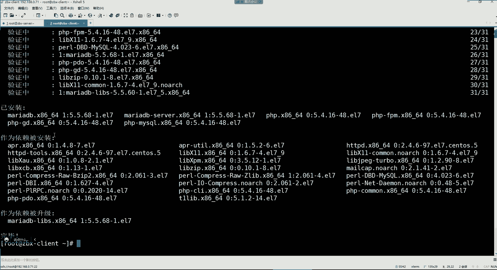
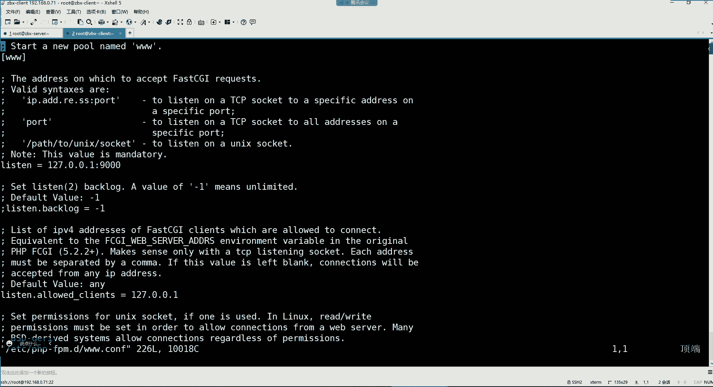
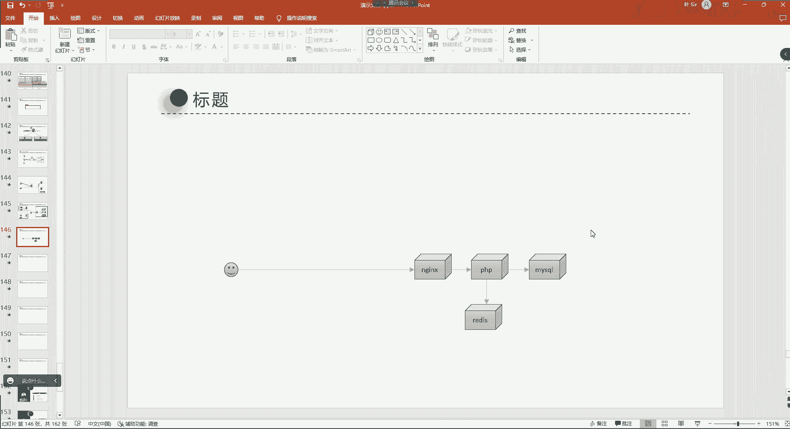

# 零基础入门Linux，红帽认证全套教程！Linux运维工程师的升职加薪宝典！RHCSA+RHCE+中级运维+云计算课程大合集！ - P92：Zabbix监控-4.zabbix监控LNMP架构 - 广厦千万- - BV1ns4y1r7A2

开始了啊。好，那上节课呢我们这个两个机器哈，我们都我这已经是开机了。然后这个我们看下它的状态哈，看看服务是否都是正常运行的。

看一下它这两个端口就可以了，一个是10050，一个是10051。然后这个克兰的这个机器呢。就是只有1个10050那个端口。好，那没有问题，然后我们再去访问一下。

访问192。168。0。71，后面跟上一个。Jaics。好，错了是吧，是70。然后用户名or的 me。密码一登录。好。也都没有问题，是不是啊？录屏开了吗？开了啊开了。好。

那这个我们再看看我们上节课那个主机的状态也都没有问题，然后也可以看到都是可用的。然后最新数据里面呢也能够看到它的这个数据，这就可以了哈。然后我们上节课配的这个报警，那配报警呢，我们这个简单回顾一下哈。

就是我想给哪一哪一台主机，然后想给它配报警的话，那首先呢我们要在这个主机的这个触发器这个位置去给它创建相应的触发器。😊，然后这个触发器呢，你在创建的时候，它最终呢要跟你的监控像啊去做一个绑定。

因为最终你这个触发器给哪个监控项去触发它的这个阈值，所以做一个相互绑定。那绑定之后呢，我们在这个动作里边就是去创建这种报警动作了。然后报警动作呢再跟这个触发器去做一个绑定。也就是说它们之的关系。

也比较好梳理了，我想配合报警，那是不是第一步我们得先有这个监控像啊，然后监控像呢最终呢它能够取值，监控像是不是取值的呀？啊，它是取值的。然后取到值之后呢，我想对这个值呢去设置一个报警的条件。

所以呢这个触发器它最终的功能是什么呢？就是。为这个监控像去定义一个。条件好，那有了这个条件之后呢，我们这边。当他条件达到的时候，我们就要去干嘛呢？就要去给他去创建一个动作，也不能说条件达到创建动作吧。

就是我要就给他创建一个动作。而这个动作呢，最终你可以是发送这个报警消息。没错吧，这是不是就是我们上节课做报警配置的这几个环节呀？好。

那接下来呢咱们这节课呢要给大家讲的是这个javi斯的项目监控。呃，项目监控呢我们今天给大家来一个非常典型的一个lamp架构，就是这个LNMP的架构，呃，这个架构你们在第三个阶段应该都学过吧。

LNMP的架构是吧？还记得吗？记得呃，刷1个6。都学了吧。嗯，LNMP加构哈没有学吗？啊。😮，LNLP加构没有学吗？啊。😮，是不是都学了？啊，肯定的哈。那第三阶段讲的不就是这些东西吗？练就是操作系统。

😡，是不是然后NDS的外部服务。😊，my circlel的数据库。学的不就是这些东西吗？然后最后呢最终呢还有1个PP。但PP虽然说不是这个我们这边主要内容，但是我们也会用到这个PP是不是啊？

这不是我的吗？😡。

是不是这不是我以前的PPT吗？这怎么还把这个图给截过来了？😡，是吧。对，这是我以前讲的啊。😊，啊，你学的就是我以前的那一套是吧？啊，可以也可以哈，差不了太多。😊，行。

然后我们本章呢要学习部署一套LNMP的架构，并上线一个论坛的项目。然后最终呢通过res给这个论坛提供缓存的加速服务。然后呢我们再对这个论坛做网站的访问统计。

然后最后呢再通过jaic去监控这些LNLP的架构。你看这就是一个呃比较典型的一个项目的架构监控的那首先我们这个实际的步骤呢，我们会涉及到要部署这个LNMP。

然后再去把我们的这个论坛的项目给它放到我们的这个LNLP里边，就让它跑起来。然后接下来呢我们再去给这个LN呃再给我们这个项目呢去部署一个readdis，去提供缓存。这样的话呢可以提高用户的访问速度。

然后剩下呢就是对我们这个论坛做一个网站的数据统计。这个统计就是我们要统计哪些信息呢？在网站数据统计里面，它主要要获取的信息，包括网站的IP的数量。就是你最终我们去访问一个网站的时候。

那我们得知道这个访问者的IP地址是多少。那对于这个IP呢比较好理解是吧？1个IP其实指的就一个电脑嘛。然后我还要去统计这个网站的UVUV是什么呢？UV就是指的是。浏览网站的1际用户。好。

那你想想我们这1个IP地址，可能说不一定是只有一个人去访问这同一个网站吧。没错吧，可能说你用你们家的电脑，比如访问了什么呢？访问了这个淘宝去买东西了。是吧淘宝点com。

那么你媳妇儿可能说他也用你们家的这同一个电脑也访问了淘宝了。那你想想，那对于这个网站来讲，那他在统计这个IP的时候，他会统计几个呀，是不是统计1个IP呀？没错吧。但这个数据最终真实吗？

IP数量肯定是真实的，但是。我们其实想获取的也不完全是IP的数量。你想想这是人家的一个。淘宝的一个网站平台。淘宝点com啊，然后你呢用你们家的电脑去访问这个淘宝的时候。

那你们家电脑肯定是会有1个IP地址。你去访问啊。那这个访问的时候，可能说是你自己用你们家的电脑访问的。然后你们家的这个比如说IP地址是这个1。1。1。1。那对于这个淘宝来讲。

它是不是就会获取到你这个IP地址啊，就知道这个1。1。1。1的这个地址访问过我这个服务器一次啊，那但是这个电脑呢，它这个访问的时候，可能说第一次是你登录你们家的电脑访问的。那第二次呢。

可能说是你媳妇儿啊，或者你们家的其他的人又用你这同一个电脑又去访问了一次淘宝。那总共是访问了多少次啊？总共还多少次呢？两次是不是啊？总共就两次呗，你访问一次，你媳妇儿访问一次。

那最终淘宝他只获取到了1个IP地址。那最终用户数量有几个，他获取不到。没错吧。哎，所以我们对于一个网站来讲，我们还要获取什么呢？我们还要获取这个实际的用户的访问数量。你只有获取到实际的用户访问数量。

这个数据我们才算是能够去对我的网站做一个评估，评估什么呢？评估我这个网站到底这一天下来有多少个人访问。是不是啊哎，这个数才算是能够衡量一个网站的一个什么呢？就是访问数量。没错吧啊，所以这叫UV。

因为UV的话呢，它可以更加精准的了解实际有多少个人来访问过我。那还有一个更加精准的叫做PV。这叫网站的PV的PV呢及页面的浏览量，这个页面浏览量是什么意思呢？你看对于一个淘宝的这个网站来讲。

它这里边会有很多的页面，比如这是一个页面。好，然后这又是一个页面。都是页面是吧？非常多的页面。好，那你访问淘宝的时候，你最终你是不是还得去看某一个页面呢？比如你访问的是这个页面。😊，而你媳妇儿呢。

他访问的是这个页面，你们两个看的东西不一样是吧？你比较喜欢看一些。比较情趣的东西是吧？你媳妇喜欢看一些，比如说化妆品，什么包啊。是吧裙子啊。是不是啊啊，那访问的页面不一样。

那么最终我们是不是也可以去什么呢？去评估一下，对于我这个网站平台来讲，到底哪个页面大家访问的次数最多。那是不是就证明大家对这个页面里的产品感兴趣啊？😊，没错吧，所以这种叫什么呢？就叫做网站的PV。

PV就是页面的浏览量。啊，而这个PV呢，它从某种程度上就能够成为投资者，衡量一个商业的网站的一个。数据您想想，如果说我们想在你的网站里边去。这个干嘛呢？去投放一些广告。好，那么我们投放广告。

我得知道你这个网站。一天下来有多少个人访问呢？是不是哪个页面大家点击率比较高，我们把这个广告给你。投放到这某一个页面上面，你在浏览的时候呢，叭下给你弹一个广告出来，是不是啊？所以说呢其实真正啊。

就是对你想了解一个网站，它的这个受欢迎程度的话，或者它有没有商业价值的话，我们记住呢就可以通过这三个指标，网站的IP网站的UV还有网站的PV这三个指标去衡量这东西就像什么呢？就像电视的收视率一样。好。

那接下来呃这里边我也我也是有一个总结哈，你们下去自己看吧。然后那接下来呢我们就先把这个l架构给它部署出来吧。当然这个网站的数据统计呢，我们呃可以用这种专业的统计工具啊，也可以通过什么呢？

也可以通过日志收集工具。😊，也可以实现这些比如说网站的IP网站的UV网站的PV的这些统计啊，这种方法还是蛮多的哈。让我们今天先带领大家了解一下我们怎么通过这种这个专业的网站数据统计工具。

怎么来做这个事情。😊，啊，然后我们先把这个l架构给它部署一下吧。那我们这边就是要载这个哪个主机呢？我们要去在我们的。Jaics gun client。这个客户端主机去部署这个l架构。

那lve架构里面所需要的包呢，就这些需要用的。我们用这个麦雅DB作为我们的数据库，这是我们要安装的两个数据库相关的软件，还有PP和PPFPM，还有PP连麦cicle的，以及PP相关的依赖啊。

那这些包的话呢，我们要载我们的这个主机哈，javis client这个主机去安装一下。

我们今天的任务只要是能够把我们的第三章讲完，我们就算是大功告成啊，我们这个今天怎么着也得讲完哈，不讲完。到时候。讲一半留到下节课讲。就不是特别好。

主机。你看我们现在这个主机才说白了总共这么点监控性，是不是很显然不符合需求啊？所以我们今天还要给它增加很多个监控模板啊，就针对于LNLP的这些监控模板。😊。

好，安装完了。那安装完了之后呢，现在就有了这个LNLP相关的包了。有了这包之后呢，咱们先把这个数据库先去改一下，把它的这个ETC卖点CNF我要去把这个文件。

给他增加一个字符级，就是让他支持这个中文。

因为后续我们有可能往这个数据库里面存一些中文的一些这个什么呢？一些内容。所以这里面呢要让它支持中文。因为我们的论因为我们的论坛的数据就是有中文的。好，这是第一步。

然后第二步呢我们就把这个麦雅DB给它起来就可以了。这数据库的话呢，我们就基本上就改这一个文件就OK了。

没亚迪B。我们也不用给他设入密码。😡，当然你想设也可以哈，那我们就不设了。😊，让它变成随机自体的状态。好，然后我们来看一下它的端口。啊，3306是不是已经是起来了呀？这是myscle的进程。

然后接下来呢我们这边就要去修改PRP相关的配置文件了。第一个呢要修改这个PP杠FPM点D下面有个3W点com的配置文件。

ETCPP杠FPM点B下边，这里边有个3W点儿com这个文件里边我们要改哪些东西呢？这个里边我们第一步要去开启啊，先把这个。

P2P的这个。用户名。先给它改掉吧。

我们找什么呢？找这个优色，左下角哈搜这个优色看到了吗？在这搜一个优色啊，然后一直往下定位。好，这儿呢在多少行呢？看一下哈。在39行左右看到吗？你看这个优色现在是等于什么呢？等于阿帕奇，因为最终PP。😊。

他的什么呢？就是最终就是他跟阿帕奇之间呢，他们如果是如果你部署的这个架构是这个。这个LAMP的架构的话。那么这个文件你不用改，因为默认呢这里面的用户就是阿帕奇。当然我们现在要部署的是什么呢？

是LNMP的架构。是不是啊？所以我们现在要把他这个用户改成NGS的用户好，这里边。哎。然后把这个删掉，改成NDS这个组的话也给它删掉，改成。NDS好，然后还有一个还有一个是什么？

就是它的这个状态页面是PM，然后好像是点儿。Staters。在这呢，121行这。注意啊，把这个PP的注释删掉。删掉之后呢，我们这是P2P的状态页面。因为我们后续要监控PP。

所以我得能够获取到它的这个相关的状态。那这个状态页面呢，后续会跟这个NDS的状态页面名字冲突。所以我们要把这个stators前面加一个PHP下划线stators就可以了。就后续呢我们想看PP的状态页面。

我们就去。访问这个路径。好，然后保存退出，这是我们要改的三个配置，就改这三个配置就可以了哈。然后接来呢我们再去给PP指定一个时区，因为它的时区呢现在跟我们这个时区它不匹配。

所以改的是ETC下边的PP点NI这个文件。😊。

然后在里面搜什么，搜了一个date。哎，这儿呢。这是多少行呢？看一下哈，这是在这个878行，就第一个把这个注释也给它删掉，然，是date点time zone。我们要把这个后面给它改成什么呢？

亚洲上海就是ASIA城市呢。上海就可以了。这个里边就改一个市区就行，别的就不用动了，保存退出啊。然后接下来我们我们这个PP的配置就完事了。然后接下来我们就去部啊这个部署NGS。

因为我们前面是不是安装了my circlecle安装了PP，但是并没有安装NGS啊，所以咱们呢就是先这个安照官方的那个仓库，我们这边啊是这个。

通过这个NDS的官方的这个仓库去安装。他的软件包。然后并开启NGS的。状态页面。那这个呢是这个NDS的官方仓库下边这一部分啊，然后我们现在呢就去给它创建一个仓库文件去。

在ETCE点reporterD我们编写一个NS点。

Pipple。然后把这个内容呢给它放进去。

这个地址你们应该都知道怎么找吧，是不是在NGS的官方啊，是不是？😡。

这地址不就是在。应该都比较熟悉吧。N加4点。Po娃记。然后这里边有个文档，文档里面就是安装NS，然后这是它的包。然后选择我们对应的reo操作系统。然后在这里面是不是就他告诉你你怎么去配着他的仓库啊？

然后这个是不是就是我们配的他的table的这个仓库地址啊？没错吧。我不就是只复制他的这个stable的仓库地址吗？然后放到我们这个文件里面了，一模一样的。

一样的哈。好嗯。是不是不是不是就这么找的呀？😡，好，然后接下来呢我们就保存退出。那保保存退出之后，我们就安装N键S。我这里面安装的版本是1。22。0的啊，也是一个目前最新的稳定版。

安装一下。安装完了。那么。是这个1。2版本吧啊，没有问题是吧？安装完了之后呢，我们接下来要去修改NGS那个。

配的文件。对啊，扎斯的仓库地址，咱们不就是下载了他的这个官方提供的那个仓库包不就有了吗？

哎。那接下来呢我们就去在这个NDS。那个什么呢？他的那个。他的那个。叫做这个虚拟web主机的路径，是在ETCN9S下边，然后有一个com复点D。

就这个哈这个com复点D里边呢就是定义它的虚拟web主机的。然后这里面有个默认的default点 co，这里这是官方提供的一个文件。default。而这个文件的话呢，呃我们得需要改改起来比较麻烦。

因为它里面大多数不是注释嘛，你可以。😊，过滤一下。你把它的这个比如说注释给它排除掉。把井号注射给它排掉，然后再把空行给它排掉。然后你看一下这个文件，是不是其实真正有效的数据也就这么点啊，你去掉注释。

去掉空行是不是就这么多东西啊。好，但这东西呢我们也不要，我们就把这文件先备份一下CP。😊，把这个文件还是放在它的这个同样的路径，我们备份一个。叫点儿bi。好，然后我们再看一下ETCNDS康复点D。啊。

这就是我们对它的这个default点com这个文件啊做了一个备份。然后接下来呢，那它的这个default点com文件我们就不要了，这里的东西就不要了哈，直接给它。😊，追压为空。

好好后看一下这个文件空了是吧？那空了之后呢，我们再打开这个文件。

我们把我们这个我给大家配好的这些哈给它放进去。这里面都有什么呢？这里面就是我们是开启了1个NS的状态页面。😊，这是NDS的状态页面。然后这个剩下呢就是。配置NS去连接PP的。

然后在那边指定这个我们的网页跟目录。然后其他呢又是给这个PP的状态页面又开启了，知了吗？这位置是什么呢？这位置是这个属于。开启了PP的状态页面。P时配准的页面，这是开启NGS状态页面，然后这是配置。

对不哈是配置NS怎么去连接PP。好，我们就把这一堆东西啊这个。😊。

什么都不用改，就给它放里面就可以了。这位置。😊，复制。好，粘贴到这里边就可以了。然后我们就保存退出。那保存退出之后呢，我们就可以把这个NS这个服务给它起来了。但是还有PPPP我们没有起前面。

所以这边直接把这两个服务给它起来。

NS还有这个PP杠FPM。然后起来之后看一下他们两个的端口哈。😊，这两个端口这个N加4是80，然后可以看到现在是已经起来了。还有就是P1PP1P的话呢，它的端口是9000okK完事。好。

然后这两幅不要忘了给它设成随机自起哈这边。😊。

你内bel一下，这就可以了。然后接下来呢我们就去访问一下我们开启的那两个状态页面。那这两个状态页面你注意哈，你看PP的状态页面路径是什么呢？是不是？😊，PP死tters啊，那NS的状态页面呢。

是不是就直接就是死tters啊？所以我们前面是不是为什么要把PP的状态页面，前面要加个PP呢？😊，就是因为我们这个位置。他们两个页面名字不能发生冲突。所以就为什么前面要改POP哈，然后去访问一下我这边。

输入我们这个机器的地址71，然后跟上先访问NDS的状态页面。好，那我们现在是不是已经看到了NDS的。状态页面的内容了呀，这里面说有什么active connection，就是当前活跃的连接数量啊。

包括下面还有很多，这我们一会儿再说行吧？先不用管它，然后我们再访问那个PP的那前面加1个PP。😊，下划线4K的。然后这是什么呢？这是这个PP的状态页面。那这里面现在代表什么含义，我们也一会儿再说，对吧？

反正现在是能够访问到了，没毛病吧，好。😊，那防那之后呢，我们现在得测试一下这个NGS跟P2P就说白了测试一下NGS。与PP之间的连接。之间的连接。那怎么测呢？我们就随便去这个路径，我们去写一个文件去。

写一个它的这个测试文件哈，在它的这个页面下边。在这个usshare NS，然后有个Ht mail这个里边。我们呢就编辑一个，让它叫PHP。info点PP文件。配出音。然后把下边这段儿。

PLP的这个什么呢？信息啊，这是输出POP本身的信息的，给它放进去，比较简单哈。😊。

这个你在访问的时候，他会给你显示PP的信息。那这个页面我们现在配好之后，我们是不是可以访问一下呀？这个页面是不是我放在NGS的网页目录了呀，放在这个路径下边了。

那我们现在是不是就可以去跟上这个页面名字去访问一下呀？完那这边咱们换一个叫做PP info点PP。😊。

哎，看到这PP信息了吧，这就可以了。行，那这个位置我们。😊，可以就是经过你现在是访问谁呢？你现在是访问NGS，但是呢NGS它能够什么呢？能够把你的请求转给PP，所以你才能够看到这些内容，知道了吧？好。

所以证明现在。😊，我们的这个NDS与POP之间的连接是成功的。那么最终呢你想想我的架构。我的架构最终是不是还要涉及到一个my circlel数据库啊？因为我们这里边最终哈。哎，这是我的1个NS服务器。

N你S。然后呢。虽然我们都是把这些服务放在同一个机器哈，但是没关系啊，我们就给大家去列举一下。然后这是我的POP啊，你也可以给它放在单独的服务器嘛。😊，嗯，这是我的PP。然后呢，我们还有一个数据库。

这个数据库呢是mycyclcle。是吧好，那最终我们的效果是什么呢？就是用户他访问谁呀？用户最终是不是访问NGS。啊，用户是访问这个NGS。然后呢，但是最终呢这个页面。

在NGS上面的页面呢都是PUP语言。写的。所以最终呢NGS呢他也要去找PP去帮帮助他去解析它的这些PP代码。啊，所以这POP呢是1个PP的解释器啊，但是POP呢解释器的时候，在解释这个自己代码的时候。

可能说有些数据得需要去什么呢？😊，从数据库里边去调取，也说P2P最终还要去连数据库去。知道吧？他是这么回事儿。是这么回事哈。😊，呃，所以所以我们现在要测试的是什么呢？是这个PP它能不能够连接数据库去。

而我们前面测试的是NGS能不能连能不能连PHP现在是PP能不能连数据库，只要它们之间连通性都没有问题。那最终你的项目就可以部署在这个NGS里边了。然后我们可以访问NS就可以看到这个页面了，能列了吧。好。

所以现在测试这是PP和my circlecle之间的连接，那我们就去写一个页面去，还是在这个路径哈。然后我们把这个文件换成my circle点什么呢？😊。

这个HTM啊，不是这是一个PP的代码，所以还得是my circlecle点PP。也是写在NGS的网页目录。好，然后那这里边呢是。

把这段给它放进去。

这段是什么呢？这段就是POP去访问数据库的一段代码。呃，然后你看啊连谁的连谁的数据库啊。连自己本机的数据库，然后用哪个用户登录数据库啊，用root这个账号连数据库去。然后那root密码是多少啊？

这部分是代表是root密码的。但是我们并没有给这个root设置过密码。有时候我们这个数据库root没有密码。😡，是吧。我们不就直接安装不就起伏了吗，所以它没有密码，所以没有密码，我们这边子就是空了。

就不加密码。如果它能够连接成功，它就会给我们艾le一个success。如果连接失败呢，如果连接失败，这就告诉你这是。到时他会给你输入一个arrow。如果是失败的话哈。好，行，那保存退出。

然后我们来看一下这个路径哈。看一下这个Hmail这个目录。对，怎么VNM了呢？S哈。看一下。这里面是my circle点PP的个文件。然后接下来我们这边。

要再测试那个my circle。点儿PP。好，看到这4个s了吧。如果是此个s就证明现在这个PP它也能够访问到mysq数据库了。那你看我们现在这个架构是不是就是OK了呀？没有任何问题了哈。

就是每个服务之间都能够相互访了，都能够相互的访问了。好，能够相互访问之后，我们接下来。😊，这个开始把我们的项目给它放到我们的这个NGS网页目录上边。啊，那这个项目呢也是我这儿提前就给大家散的好的一个。

在。🎼啊，这在这里边哈，这有个叫做这个底四cas。这是一个社区论坛项目。论坛知道吧？就是这个类似于知乎啊，类似于知乎的这样的一个。平台啊可以在里边发点八卦之类的哈。😊，然后这个项目的话呢。

我们给它传上去哈，这项目是哪儿的呀？这项目是我们一会儿可以看一下哈，一会儿你安装的时候，他会告诉你。😊。

我们先把这个项目给它放在我们的这个NGS的网页默录取。所以我们得先CD到U4。Share H里边。嗯。然后把这个discus，那这里边的这个东西我们还要吗？😡，正常来讲，是不是这些什么。😡。

测试的东西是不是就没有必要留了呀？😡，包括什么index点T mail。是不是啊？呃，就给它删掉吧，清空一下哈。没有必要留。然后直接把这个项目给它放在这个目录。好，然后这个是一个zper包。

你得给它解压一下。😊，好，我这边没有onz的命令。安装一下。按说之后我们再去给他解压。然后截完之后呢，它这里面多出一些目录哈，它的这个项目在哪儿呢？在它的这个upload里边。😊。

你看它这里边就有它的这个什么呢？项目的页面了。然后我们现在就要把这里面的所有东西给它直接移动到我们的这个AT呃HTL这个网页根目录里面来，用户直接访问就可以了。😊，呃。

所以现在MV把uple load里边的所有移动到我的当前目录。啊，然后看一下移过来了是吧？那移过来之后呢，看一下这个目录的归属哈，这些都是root，你发现了吗？那root是不是不具备。😊，嗯。

如果这些文件的归属关系都是root，那是不是NGS对这些项目文件就没有写权限了呀？所以这不行哈，得把这些权限给它改成NGS才可以。不然NGS。😊，没有写的权限，那你这个访问的时候。

就可能会出会出现有些文件权限不足的这么一个情况。所以陈志欧呢。🤧呃。杠大R。把我们当前的这个。所有者改成NS4，所有组改成N加S4是针对当前目录下的所有。然后再看一下。这样就可以了，看到吗？

就是这些项目文件的归属关系都是NGS这个用户。行。

那这部做完了之后呢，我们就。这个来去访问吧，这个位置哈那访问的话呢，我们这边。😊，这个机器啊，因为它本身呢我们就是直接可以访问它的IP。开车看到了吗？

我们现在就已经来到了这个discus这个向导安装向导页面了。🎼这就是它的一个安装页面。然后他告诉我们说，这个东西是一个北京康盛创新科技有限公司开发的什么呢？呃，这是一个。看到吗？

叫做社社区论坛的一个平台。这是他一些介绍哈，但这种东西我们需要了解他吗？我们不需要吧，我们不就是为了拿它做一个演示嘛？就是我们这儿就假设开发他们的项目，现在让你发布到你这个NDS里边。

你是不是就把这个项目拿到NDS之后，把这个项目给他。😊，放到我们的NGS的那个网页目录一解压，然后测试一下不就可以了吗？是不是？所以我们这项目最终怎么用，跟我们没啥关系，是吧？你工作中也不可能用它呀。

😊，所以咱们这边就完全是为了测试哈。而这样我们点我同意。😊，然后下边呢他也是。这儿也都是。绿色对勾是吧，也都有权限。好，那接下来我们就再下一步。下一步，然后选择那这步我们选择全新安装，然后下一步。好。

那到这儿的话呢，因为这个最终啊这个论坛呢他会把它的这个数据呢存到数据库里边。所以我们这边要去安配置数据库安装是不是已经安装好了呀？但是我们这个数据库还没配。所以这个指定数据库服务器的时候。

我们这个数据库服务器都是在本机。所以一般呢就是local host，然后数据库名这个名对嘛？这个名不对，我们数据库里面压根也没这东西是吧？包括用户什么密码这些都不对是吧？所以我们现在要干嘛呢？😊。

我们现在是不是得进到数据库里边呢？😊，进到数据库之后。这里边。是不是只有我们默认的初始的资格库啊，所以我们要给它创建一个库去。Greatreate。Database。我们让他叫。这个。

discus这是库名哈。穿一个裤。就不看了哈。那接下来我们还得有一个用户，因为他这里面你看第一呢得需要一个库名存储它的数据。那这是我们建好的这个库叫discus。😊。

放在这儿。库名。

那用户名呢用户名，我们这边让他使用root用户访问吗？不让我们给他再授权一个用户。我们直接。用这个grant给它授权grant授权一个所有权限，然后on给。哪个库呢？这个库下的。所有表点星所有表。

然后吐给哪个用户呢？吐给一个叫。discus用户，这个用户是不是就直接给他创建出来了呀，然后允许他。😊，从。local host本机登录。密码。I don't fired by。

这个密码呢我们给它设置成123456。是不可以了，然后。Select。看一下优色字段，hose的字段from从这个my circle库下的右色表看一下。那有一个用户也叫discus，然后从本机登录。

那我们这个用户名是不是也有了呀，叫discus。

不不让他用root用户啊，那他密码是多少，密码是不是123456啊，那他的表的前缀就不用改了啊，然后系统里面邮箱这些我们就不用设置了。接下来我们就给这个管理员设个密码。密码的话呢。

就是我们在登录这个论坛的时候。😊，是使用这个我的密管理员账号登录的那密码呢，我们来123456，这密码是不是就？随便定义啊，无所谓嘛。然后重复密码，123456管理员邮箱。我也不设置了。下一步。

他现在干嘛呢？是不是在给你往数据库里边导表啊？😡，所以我们这时候右侧的这个。这个库里边，然后我们受。黑bo是不是他的表就进来了呀？😊，后续他的这个论坛里的这个数据呢，就会往他的这个表里面存了啊。

那这个数据库我们也配好了，我们也可以退出了。那退出之后呢，我们。

接下来就部署好这个位置我们就已经部署好了，部署完之后，我们就去访问点这个哈。然后它里面可以看到吗？一些这个什么相关的教程，使用教程啊，开发教程啊等等等，巴拉巴拉的，我那我们不关心哈。😊，访问好。

那我现在就来到这个论坛了。来到论坛之后，我们这边。😊，这个是不是得。呃，是不是得登录一下，你才能够去什么呢？才能够去使用这个论坛呢。好，所以我们这边用户名。呃，当然我们也可以注册是吧？

当是我们就不注册了啊，我们就直接admin。密码的话呢就123456登录。然后输个验证码EM4G。登录。这是我们用addmin登录的是吧？那我们用addmin登录之后，我们这边这个也可以发个帖是吧？在。

😊，消息。这消息吗？还有我的帖子，这儿是吧？我们来一个发帖。帖子嘛是吧，我们用这个。摸认模块发新帖，随便写个内容。比如说。这是。怎么呢？一个。随便吧，是不是啊一个热门话题。热门话题。

就直接写话题就可是不是也行，比如说。单身。30年。手速。会。变快吗？写面巴拉巴拉的随便写点东西是吧？你可以写啊，我认为是吧。😊，我认为咔咔咔咔咔开始写是不是我觉得咔咔咔咔咔咔咔开始写是不是然后我建议。

咔咔咔咔咔咔咔开始写是不是？然后最后这来个验证码。😊，验证码是多少来着？是C勾。9P。发帖。是不是啊哎，你看这不是一个单身30年，手速会变快吗？大家是不是可以在这儿探讨一下呀，是不可以回复他呀。

巴拉巴拉的。😊，这不就一个论坛嘛，是吧？这消息这东西就像知乎一样，这玩意。😊，那我们只是在一个自己的内网环境下面测试就无所谓了哈。😊，然后接下来我们干嘛呢？把这个论坛步署好之后啊。

我们要去这儿要部署res。我们要通过reis给这个论坛提供缓存服务，就是让大家在访问这个论坛的时候呢，速度会变快一些。所以这边咱们还要在我们这个机器里面部署这个redis。

好，那就直接ym杠外in死套。Readiness。也不管他的版本了。

就给它安装上就可以。安装上之后呢，我们这边呃。这个reice后续让谁访问呢？我们现在你看又加了一个服务是吧？😊，又加了一个readdis。那么这个reds后续谁去连接它呀？啊。

你说我们知道PRP是可以连麦cicle的那最终reice谁去连呢？😊，是吧。这应该是让谁去连的？网页面儿。就是res里的数据，谁去给用户去什么呢？去。取数据呀。是按颜色吗？N你是能连。NS有连数据库的。

那种配置吗？嗯。😊，N加4是不是连不了数据库啊？😡，是吧你想连数据库不都得代码去访问数据库吗？😡，你好你你想访数据库得通过代码去访问哈，所以最终是PP去访问reis哈。😊，这些基础知识是不是啊？哎。

所以最终的话呢还得是P而P去访问redis数据库。通过PP代码去连reis去。你想用户想看什么数据，最终不得通过PP解析嘛。那你PP的这些这个你你想想，那你PP数据从哪来呀？😡。

是不是啊最终不得从数据库里面获取吗？所以这里边哈我们要去配置什么呢？你得。😊，能够让PP能够连redice才行。但是P2P连redice这里边得需要安装一个包。叫PRP杠PECL杠readdis这个包。

这个包里面会有什么呢？会有这个PP连readdis的模块。所以我们先把这个包给它安装一下。

就是他是这么回事。

他们这个关系呢就是他得先去redis里面去找数据。如果redis里面有的话，那就直接返回了。如果redis里面没有的话，他再去找my circlecle。他是这样子的。能理了吧。

如果ready里边有就不去找mycyclcle了。没有的话，再去找mycyclcle。

然后。这个包安完了是吧？安完以后，我们这边。这样哈这个用这个。

是哪个命令来的？

PP杠M。一会儿有办法写进去的哈，PP杠M。这些都是PUP的模块，当然我们要找哪个模块呢？我们要去这样。rap找一个叫做redis的模块。那么其实还有一个模块呢叫my circlecle。看到了吗？

这POP想连麦cicle是有模块的。PP响连reis呢也有模块。所以我们刚刚按那个包的时候，就是为了要这个模块。

那有了模块之后，我们这边来到我们的这个论坛上边。我们在哪呢？在这个管理中心这儿。然后输入管理员密码管理中心嘛，那需要管理员权限嘛，那么输入管理员密码。来到管理中心之后，我们干嘛呢？它是有个全局。

在全局里边有一个性能优化。然后在性能优化里边有一个内存优化。好，那么现在在内存优化里边，它说启用内存优化功能将会大幅提升程序的性能和服务器的负载。看了吗？那么他支持的这些。

内存数据库像redisma catch这些。那这些我们都没见过。这都没见过哈，但你像什么reis慢 cat是不是在行里面用的比较广泛一些呀？😊，是不是啊？但这些他现在支持吗？是不是都不支持啊。

你甭管他想连谁，是不是这里面都不支持啊，所以咋办？所以现在连不上去，所以PP现在没有，虽然说有模块，但是他不知道redis这个服务器的地址是多少。没错吧，你想想他怎么知道redis这个地址是多少啊？😡。

那万一你给reis斯设个密码呢，他是不是也不知道reis的数据库密码啊？😡，哎，这么接来。😊，要去干嘛呢？要去改这个论坛的配置文件。当然这个的话呢，我们就不用去特别记它。

因为这种东西对于我们来讲是不是意义不大呀？我们就是完全不就是为了给大家模拟一下。就是在企业里面你部署项目的时候，这个项目最终你怎么部署嘛，是吧？怎么把这项目跑在我们这个。😊。

平台上面嘛啊。那么我们现在要找到这个discus的count复目录啊，就在它的这个网页跟目录下面有一个com复目录。在这个confi里面。

config里边有一个它自己的global的去跟PP之间的全局配置。我们现在打开的就这个文件。Sure。康复下边的。Confi哥。global点PP的文件。然后在这个文件里边，你看它是连谁呢？

有连DB的，就连数据库的。是不是我们指定了我们的数据库主席是谁？我们的哪个库，然后我们数据库的这个密码是多少，是不是啊？你看用户名是多少？😊，然后那下边这部分是什么呢？你看这就是配置memory的。

配置它的内存的了。那配置内存的话，这里边有连reis的。还要连mmca的。所以我们现在要配哪段呢？我们要配连readdis的这一部分是吧？所以我们要在这个。😊，哪儿呢？在这儿。

在这个readdis server这一行，要指定readdis的主机地址才行，不然他是不是也不知道readdis。它的IP是多少啊，所以这里边指定我们的reis不是安装在本机了嘛，所以就127。0。0。

1就可以了。那么们的redis也没有设置过密码。如果你设置过密码，你要在这儿叫require pass这个位置。要指定一下你这个数据库的。密码是多少？但是我们并没有设置哈，所以就不用指了。😊。

然后保存退出就可以了。那这就完事了，这位置就是能够让PP能够找到这个reis这个服务。那这边我们配好之后呢，咱们再把这个regs重新给它启动一下就可以了。

然后再看一下它的灯口。这是6379也没毛病是吧？那配完之后呢，我们这边再刷新一下，它刚刚是不是还是显示不支持啊，再刷新一下。😊。

再来到全局。性能优化内存优化。有。选举新能优化。服务器优化内存优化。哎，这怎么还还不支持呢？怎么慢呢？有点慢啊。刷新一下。全局。性能优化内存优化。

诶。等会儿啊。我们没有配错吧。这是reis。127。0。0。1。

呃，我们没我们没有改过POP哈。没有改过PP，所以这PP。啊，这一步我们忘重启了，这步得重启一下啊，我们只安包，但是没有重启。

是吧对，这步忘了哈。重启一下。

再刷新一下。全局。性能优化。内存优化。哎，你看这儿。是不是他说支持了呀，这里面都看到什么呢？内存清理了是吧？那内存清理就证明现在已经有数据写入到reis了呀。那我们怎么看呢？😊。

readies杠CRI直接连，然后。casease星儿。看数据哎，你们看到数据了吗？是不是数据已经写入到我们这个res库里边来了呀？😡，没错吧。也要写下来了。好，那写了就可以了。😊，就不用管了。

所以说这一步的话呢，我们就能够让我们的这个项目。

能够给我啊就是能够让res给我们的这个项目去提供一个加速的功能。有它的数据存到raice缓存里面就可以了。啊，但是这个时候你后续你对于redice怎么配，这在企业里面一般都有要求是吧？

但是我们这个实验的效果是不是给大家已经演示出来了呀？1个LNMP的架构，再加上一个readdis给我们的项目去提供缓存服务，是不是到此为止就OK了呀？😊，没错吧，好，但是还有一步我们要配一下什么呢？

就是我们的网站的数据统计。😊，网站数据统计，我们前面不是说过要统计什么这个。访问者的一些信息嘛，是不是啊？网站的访问量。然后等等等等。比如说用户访问的最高的时段，就是什么时间这个用户。呃。

就是什么时间我这个网站。用户量最多，然后我的哪个页面。被大家点击的次数越多，然后停留的时间是多久，用户使用什么样的搜索引擎？然后用户通过什么样的关键词找到我的这个网站。就是从哪儿来的是吧，从哪儿进来的。

以及这个用户的所在的国家地区使用的浏览器是什么浏览器等等等等。包括比如说时段访问量的统计分析。就是哪一个时间段。😡，放量比较高，哪一个身段放量比较低？嗯。还有说这叫日段访量统计分析。

就是在这一天里边哪一个。时间段啊，上午啊下午啊还是晚上啊。这个我们都可以通过这种东西来完成。那这种东西的话呢。呃，就是网站统计，它可以为网站收集用户信息。然后呢，提高和改进我网站的建设具有重要意义。

这很明显就是你最起码你网站搭建出来，你得知道这一天下来有多少人访问是不是啊？所以我们可以用种网站统计。那网上统计这个工具的话呢，国内的有很多，比如什么CNZZ啊。

51I51IA百度统计腾讯统计站长统计51y等等等等，非常多。你比如说我们去随便搜一个。😊，搜这个百度统计。看到吗？这是百度总计。我在找。站长同意。还有什么火山引情啊，这就是什吧，这是看一下。

这里面可以看到。什么呢？这这是。有没有一些这种直观的让我们一眼就能够看应用场景吧。

呃，私域流量运营。

呃，有没有什么让我们一眼就能够感觉这东西特别的。直观的。产品功能呢。这网站现在做的怎么都这样呢？百度统计呢？看看。客户数据平台，然后。在这里边。什么在线零售行业的什么香包服饰、消费电子这这些哈。然后。

洞察业务数据。有没有图啊？这是他的图吧。看看。这里边什么。诶。我刚刚看到好像看到什么。不是。什么用户的搜索意图是吧？就是你想查什么东西。啊，听看了吗？这是。这个访问的流经此处等等等等，是吧？在那边。

有吗？右上角。那这得需要你输入这些信息的。算了吧。那我们就不管了吧，行吧，哎，看这个图怎么样哈。😊，咱们看他这个图。图放不大，能不能清晰点，看看啊。あ。来源类型。外部链接。这就不是很清晰，是不是啊？

不是很清晰哈。算了吧。啊，他这比较清晰是吧？你看。他这是这个。注册了是不是啊啊可以哈。😊，这里面是不是可以看到，比如说这个。当然这个在流量分析里面也有很多的哈。😊，啊，没注册，就是就写个信息。

是不是就写个信息就能看到这些东西吧。😊，你看比如说这个今天。浏览量PV多少个UV多少个IP多少个看到吗？然后这些呢平均访问时长，然后昨天看到吗？多少个PV多少个UV多少个IP是不是不是这些都能看得到啊？

然后来源啊从哪儿来的？然后当前的实时访客多少个？哎，你打开为什么我打开就不行呢？😡，为什么我打开它就得跟我。😡，哦。为什么刚刚他非得跟我要这个啥呢？你看啊那接下来你看在他的这个什么实时访客里边。

是不是他会给你绘图啊啊，最近30分钟的访问情况。😊，看了吗？这里边可以看到蓝色的是有多少个用户是吧？对这是有多少个UV，多少个PV。然后下面的话呢可以看到这些是它的来源是吧？从宁波呀、深圳呢。

然后从哪个页面过来的，然后它的IP是多少？然后它的访问时长是正在访问呢，还是访问了多少次啊，啊吧，然后这是这是什么呢？访问页面的。访问了多少个页面，这是哈。😊，这还是蛮不错的，是不是啊？

然后什么趋势分析。趋势分析里面，这里边就是哪个时间段。这가能啊。这是应该是哪一个时间段吧，这是024。你看这是一个时间点，看到吗？18点到18点59分的时候，这是一个趋势图嘛，有多少个PV在访问。啊。

然后下边也但是这个的话你得花钱。你想想人家开发这么一个工具，你想用的话。这就不是说能光上你白漂的东西了，所以你想用你就得。😡，咨询一下了吗？或呃，你就去。咨询一下，你说我问问你你们家这东西如果用的话。

多少钱？能列了吧，但这些东西对于企业来讲，是不是他的真真的是需要这些东西啊？你看包括什么年龄分布都有，看到吗？😡，普遍。这个人他的年纪是多大的？哎呦。这个东西厉害了。你发现这东西就是。说白了哈。

这就是一种什么呢？数据分析的一个工具了。你发现你看你访问的时候，他能连你的年龄他都能分析的出来。😊，年龄怎么知道的是。这个你龄不是不是很清楚哈，可能说这对网站来讲，你在注册的时候。

你可以你可能得需要实名注册。😊，对你一实名的话，他就能够获取到你的真实年纪了。😊，那你了吧。反正手段多了去了，你要知道。是吧包括你看。直接访问的还是用百度访问的，还是用什么360搜索引擎搜狗。

是不是都能看得到吧，这到底是新访客还是老访客？😊，这玩意儿还是。挺厉害的。是吧大数据监控啊，你发现这种东西。所以你说这种东西。有的时候你发现你要去，比如说你去抖音。😡，啊。

不是你比如说你去这什么京东啊、淘宝啊，你去搜点，比如说想搜点你想买的东西的时候，你发现一会儿啊，你再去访问其他网易的时候，叭下给你弹一个广告，就跟你搜索非常类似的。😡，这么一个广告，哎。

你们有没有相同的这些场景？是不是有？呵。😊，比如你经常去淘湾，你说我要去看一些什么是吧少儿不宜的一些这个。😊，是不是啊？什么那个。那些东西。什么充气娃娃之类的，是不是啊？哎，这种类似的商品你发现哎。

可能你在访问某个网站的时候，叭就给你弹出一个类似的广告，是不是啊给你推荐。😊，呃，这个确实是大数据比较杀手哈，因为它能分析你呀，你看你的数据，你访个网站，他能把你这些东西都给你获取得到。😊，还有什么呀？

转化情况。哇塞。看了吗？转化。就是有多少个人直接在我的页面。😡，被转化了。就是直接在我的页面就付款了，那种能理解了吧？😡，是吧你看总共多少个UV转化了多少次，转化率是。能达到多少？是不是很厉害？

这太厉害了。那如果有一天你们。比如说。要是干点坏事的话。这个你要是去网上一搜，你比如说你走在大街上，你看人家。小姑娘。是吧长得特别漂亮，你就是去撩人家裙子。你就是做做一些猥琐的行为是吧？那。

可能说后续你去网上搜索搜索相关的信息的时候，你都能被人给分析到，知道吧？警察破案现在都可以什么呢？通过这些信息去什么呢？就看你只要是你这个人通过百度，比如搜索一些，比如说我今天下午啊就是这个搜索一些。

比如说如果是。他这个什么那个非礼小姑娘。然后摸呃撩撩人家裙子，摸人家屁股，一般被抓到以后。😡，会有什么结果？好，那这个警察通过你这个搜索记录，好，就能够可能说就能够定位你。是不是啊？你还要像那些。

最近就是说这个。头段时间不是说这个谁，那个李易峰不是被抓嫖娼了吗？是不是啊？你想想他怎么才能被抓呀？😡，不就是被大数据给分析了吗？😡，他是被大水给分析了，然后被警察给抓住了，知道吧？哎。

你要你一个女孩子，你没事儿。😡，啊，是吗？朝鲜群主举报的呀啊，还有一些就是直接那些这个什么那个。😊，女孩子。比如说一般在。晚上的时候啊，什么10点11点112点的时候。总去收到人家的微信转账。

什么288。399是吧，599。998。1000啊。等等等等。这些数字的时候，那你要天天这样收，是不是？😡，也能够抓到你啊，为什么呢？因为你天天这个点收款，那很显然就不对。😡，没错吧。是不？

那对于警察破案来讲是不是就非常有帮助啊啊，但然我们这些其实对于我们来讲哈。😊，对于我们来讲，我们只是分析我们的网站嘛，是吧？这个就不会涉及到什么这个那一类的了哈。但是确实人人家是有方法的。😊。

这个方法你微信转账，那微信肯定得有记录啊。😡，是不是啊微信你想人家微信系统可能没有这种数据分析吗？😡，可能没有统一吗？那肯定有哈。对，下次你们长点记性哈。你们如果要是干这种事儿。😊，别发什么。😡。

288399的是吧？这容易被人给分析的到哈。好，那我们也部署吧，是吧，我们自己部署一个marmo。😊，呃，mar的话呢，这边部署起来也相对来讲比较麻烦一些。那我们就这边稍作休息一下吧，我们稍作休息回来。

咱们再去部署这个东西，行吧？😊，诶。停一下吧，这一晃也是一个小时过去了。😊，这时间过得还是蛮快的。所以还是少干坏事儿。这年头我跟你讲，你干坏事儿。你真的是人家如果想分析，你真的是逃不过去的。

