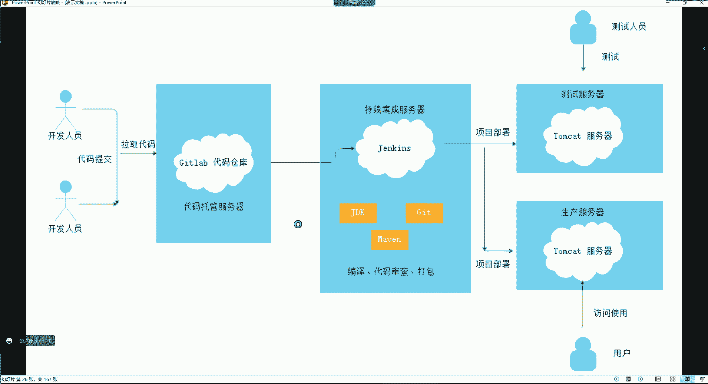

# 零基础入门Linux，红帽认证全套教程！Linux运维工程师的升职加薪宝典！RHCSA+RHCE+中级运维+云计算课程大合集！ - P93：DevOps-1.DevOps与CICD概念、GitHub基本应用 - 广厦千万- - BV1ns4y1r7A2

好。嗯。我到时候给你们把笔记里边。把那个主动监控给你们增加到笔记里面哈。好久没有做了。呃，接下来这我们那个jabs讲完之后啊，我们这机器是不是用不上了呀，这机器就得给它关掉吧。

呃，给他恢复嗯，算了，就给它先关掉吧。我后续还得用一用。

关机。嗯。啊，他说我这个机器啊碎片有点多是吧？让我清理一下。在磁盘，然后碎片整理。

再也用不上。

呃，我们接下来讲什么呢？

讲这个哈。声音有时卡是吗？我这网今天不是特别好啊，因为我今天这个网线断了。

连不上网线了，我今天用的是wifi。

不是不是啊。不是你们那边的问题。是我今天那个网线断了。

接下来讲这个。讲这个哈，基于getla加jakins的dbs。

我们要讲CID了。然后。Hao。咱们先。来看一看一些基本概念哈。

我们这个接下来讲的这个内容呢是一个在企业里边非常非常。这个常见的一个技术就是这个CACD。但是在讲CI之前呢，我们还要去涉及的一呃还会涉及到一个什么呢？近些年来非常热门的一个词汇，叫做这个dopbs。

呃，dbox我们得先讲讲它的起源哈，这个词儿肯定不陌生是吧？但是这个东西到底是代表什么东西呢？我们可以先读一下，呃，随着互联网给我们人类的生活带来了极大的便利，提升了生产力，提供了众多的娱乐的项目。

改善了人们的生活。😊，那这个我们还是非常的深有感触的是吧？你看我们现在的生活，我们的衣食住行现在是不是已经是离不开这些软件了呀？你这个点外卖，你得通过软件点是吧？打游戏，那不也是用软件去玩这些游戏嘛？

或者说呢我们这个网上充值，比如说你甭管是充。😊，话费还是充网费还是充水费、电费、燃气费。那这些东西是不是都得通过什么呢？通过这个网络来实现了呀？

所以你说这个互联网现在确实给我们的生活带来非常大的便利了啊，不出什么出门打车呀，网上购票啊等等等等的哈。😊，啊，还有这种什么聊天是吧，这些都是通过软件来实现的。😊，对，各种小姐直播软件也算嘛。

那当然了呀啊各种直播的软件是不是啊？😊，和你这个聊天的那些软件都是哈。所以所以这个目前计算机软件就是现在的社会当中一个非常赚钱的产品之一。那确实是因为你看那些这个知名的互联网企业，百度、阿里、腾讯。😊。

京东美团字节跳动。你说他们靠什么起家呀，其实不都是靠有了一个软件之后。😡，然后这个软件被大家应用之后，它不就起家了吗？所以这就是现在的一个网络时代嘛，靠软件起家。嗯。可以看一天是吧，改变了你的生活方式。

那确实是啊，没错，是不是啊？那你说你在这个空虚寂寞冷的时候，你怎么解决呀，是吧？上网啊，看看那些小姐姐给你扭个腰跳个舞的，是不是啊？😊，其实。这些也都是通过网络来给我们什么呢？带来的这些快乐。

那么对于一个软件，它从零开始到最终交付，就是我们用户使用软件从开发到我们用户使用，这里边呢会经历很多个阶段。所以我们接下来呢要了解一下一款软件的什么呢？开发流程。现在这个企业里边啊。

当然不是所有企业都有这种什么呢？软件开发工程师或者软件测试工程师和软件运维工程师，这得分企业知道吧？有的企业呢他们是只有这种软件开发工程师和软件测试工程师，而有的企业呢是只有软件运维工程师。

但是呢没有开发和测试。所以这个就得看什么呢？看不同的企业了。因为有些企业他就专门去什么呢？专门去研发软件的，然后把这个软件干嘛呢？你如果要用的话，我就租给你，你能理解了吧？然后你就用呗。

那么你在那你想想这个对于这种软件开发公司，他们会用到这种软件运维吗？哎，其实。呃，正常来讲呢。那有，但是呢特别少。只有哪些公司会需要大量的运维呢？就是那些。我用你们家这个软件之后。

我这个软件最终在企业里边部署在服务器之后，这个包括软件以及服务器后续的维护工作。那这个呢是需要软件运维工程师去负责的。啊，所以你看像这种不是所有公司都有这三大部门的哈。呃，但是我们得先说一下。

这个对于一个大多数企业来讲。你比如说软件开发工程师，他的工作是什么呢？他的工作呢就会涉及到前期的软件的规划。前期的软件规划就是我们想开发一个软件。那这个软件最终我面向的是哪一类人群啊？到底是这个是不是？

因为毕竟嘛现在这个娱乐方式非常的多。那你一个软件面向的是哪一类人群呢？😊，所以他得做前其实这个前期会有市场调研的这公司里面会有市场部。市场部的话呢，他们会。去做市场调研。去调研一下现在的人们的需求是吧？

然后呢再去调研一下在这个需求里边有没有这个我的一些什么呢？发展的空间。啊，如果有这个空间的话，那么我要在这个什么呢？在这个领域。我要能够提供哪些功能，大家是所需要的。所以你看近些年来。

随着单身的人群越来越多的话，你发现。哪类的软件比较多一些呢？一是直播平台。二呢就是交友平台，是不是？交友平台还是非常多的。所以这个的话呢就是它是有前期的一个市场调研的。调研之后呢，我们觉得好这个领域呢。

我们可以去什么呢去开发一个产品啊。对。然后呢，那只要是我们前期做完市场调研了，我们确定好这个项目我们可以做的话，接下来呢就开始去规划，就是开发团队根据需求。根据需求去。制定软件的开发计划。好。

那当然这个制定软件开发计划里边会包含的流程也比较多。比如说我开发这个软件，我到底用什么样的语言去开发什么样的编程语言去开发。还有我这个软件，最终呢它里边呃这个会比如说用什么样的数据库啊。

包括我的数据库的架构是什什么样的一个架构，用什么样的web服务器软件。用什么样的负载均衡，它是怎么呢？都得做前期的规划。这就是什么呢？我们所说的前期规划哈。😊，对，这都是属于云计算内容。

那规划好了之后呢，那接下来呢就开始去写代码了。😊，就是根据规划去编写功能代码。因为最终你所有的功能不都得通过代码来完成嘛，所以开发就开始写代码。噼里啪啦的录代码。好，那写完代码之后呢。

这里面会涉到一个构建。它这个构建是什么意思呢？其实构建呢就是让这个代码可以在系统中运行的一个过程。你想想我这个软件开发，我这个所有的功能写完以后，最终我这个软件是不得看看各个方面有没有问题，有没有漏洞。

能不能够正常的运行。所以构建的话呢，其实就是。让我这个软件能够在系统里边去运行起来，你只有运行起来之后，接下来是不是才能对软件做测试啊？那么有的公司呢会有专门的软件测试工程师。

一些小企业可能没有软件测试，小企业可能说就只有开发工程师。😊，开发的话呢。他自己写，然后自己测。就测试一下我的这个东西，各个方面有没有bug，有没有漏洞。啊，当然这个测试呢，它也分为很多种类型的测试。

比如说。呃，一些这个性能性测试，功能性测试。如果是性能性测试呢，一般这个测试工程师得需要懂点开发。他得要知道这个什么呢？他得了解这个一些编程的知识，才能去什么呢？对这个代码做性能方面的测试。

而且还要了解数据库。因为最终你测试无非不就是呃要针对于代码，然后再针对数据库之间的一个。各个方面的一个测试，最终代码要连数据库。那还有一类就是功能性测试了。像功能性测试其实就是比较简单一些。

你比如说我开发一个软件，那么我这个软件里面的各个功能能否正常去使用？是道吧。那这个时候。一般像这种功能性测试呢，有些公司会去找一些。比如说刚毕业的那些，或者说还没有毕业的那些女大学生。啊。

一般他们喜欢找女的。就像那个。像什么来着？像头像头段时间比较上，就是头段时间上这个上了热门的那个中铁三局是吧？哎，就是招聘要求比较什么呢？比较高一些。得身得身材好的那种啊，而且还得是什么刚毕业的。

年轻漂亮的那种。😀呵呵。😊，为啥呢？但是一般这种这个功能性测试啊，都喜欢刚毕业的是吧？对，一般像这种功能性测试，一般它主要是因为它不需要你会什么编程的知识，只要是什么呢？

这个软件最终比如各个方面大多数就是比如说我如果我这个软件有一个充值的功能。那么这个钱充进去了。😊，你最终。比如说充个VIP，人家充个VIP，那你这个人家充完钱之后，这个VIP到底有没有？😡，什么呢？

最终有没有把这个VIP真正的让人家什么呢？成为这个VIP用户。还有这个钱充完以后，有没有到达我们的这个实际的账户上边，这这就属于功能性测试了。哪里比如我比如我这个软件有一个聊天功能，那么你聊天。

你输入完你的内容之后，这个内容能不能够正常的发送出去？😡，这些。对，这都属于功能性测试。所以这种是不就不需要什么编程的之基础了呀。所以一般就找那些。😊，刚毕业的或者说还没有毕业的大学生去干这种事儿。

为啥呢？因为一般价格比较便宜一些，特别是那些实习生，实习生一个月公司，如果要是招聘这种实习生的话，一月给不了多少钱，能给多少钱呢？看着还舒服是吧？而且还给不了多少钱。这可真的是我们说这就属于白嫖了。

是不是啊？😊，因为你像那种实习生到公司里面去。上班的话。公司。这个政府还有补贴呢，一般像一个大学生。政府得就是如果实习阶段哈，政府一般得补贴个将近2000块钱呢。所以一般实习生的工资低。

其实就等于白用了。我跟你讲，一个月给实习生开3000块钱。然后政府呢再给这个企业。补贴将近2000块钱，他就等于说一个月花了1000多块钱，找了一个人在这儿帮他去干活，而且还得是那种年轻漂亮的。

他还得看着顺眼的那种。是吧所以这种功能性测试，一般好多企业。真的属于白漂啊，白漂这些大学生。😊，在这个测试环节跟我们没关系是吧？我们也不关心他，反正最终我们。也飘不到是吧？😀Yeah。😊。

因为他也不跟你打交道，就算有问题，他也是跟开发进行对接。😊，啊，跟这些老色批们，他们一天就喜欢这些年轻的女大学生们，他们头发一天都熬成地中海发型，他们也喜欢这种女大学生们，那没办法是吧？😊。

都喜欢刚毕业的。谁让我们啊这么专一呢？然后接下来呢测试环节如果经过层层测试没有问题的话，就开始轮到软件运维了，你也喜欢是吧？啊，我都比较喜欢是吧？😊，软件运维工程师干嘛呢嗯。白天顾着跟妹子聊天晚。

加班是吧？这个就不是很了解了哈，但估计闲不着啊吧？😊，呃，软件运维工程师干嘛的呢？运维工程师就是当测试工程师，如果说各个方面都测试没有问题了，他会把这个最终的代码发布给运维。运维呢要把这个代码呢部署在。

生产环境。所以这里边的运维就是涉及到环境的部署。比如我生产环境的服务器里边需要一个什么样的环境？这些的话呢。都得由这个运维工程师去负责了。然后剩下的后续软件运行起来之后。

后续的一个服务器的维护以及这个整体的一个平台的维护，也都是由这个运维工程师去负责的。然后最后这个软件在我的生产环境跑起来之后，那在这里边你们还要注意啊，最终我们怎么使用这些软件呢？

其实还得一个公司的市场部把这个软件的APP。给他发布到。😡，各大的。应用商店。然后我们去应用商店里面去下载它这个软件，你就可以使用它的这个软件了。能理解了吧？它是这么回事。

不然你说我你这个软件在服务器里面是运行起来了，那人家怎么访问呢？😊，现在都是手机时代，手机时代大家都得需要1个APP。所以到时候呢它这个APP放到应用商店之后。

我们就可以去下载这个APP你打开APP就等于说。😊，就访问这个服务器了。他是这么回事儿。是吧开发猥琐是吧？运维也很猥琐，你也别说也也也也不一定是开发猥琐。这种东西分人是吧？你猥不猥琐。

他跟你干什么岗位可能没啥太大关系。😊，是吧。😊，对我们就是负责运维这部分，我们就是维护服务器。😊，你像你。你想想人家的这个代码跑在你的跑在服务器里边以后。

后续你说随着用户不断的去使用你们家的这个这个软件。那你想想比如说产生的数据，你是不是得备份？后续比如说。这个你这个软件一旦研发出来之后，你软件后续难道就不管了吗？你软件上线之后。

那你软件后续难道就不升级了吗？😡，是不是啊？你不也得需要升级吗？😡，所以说呢我们这个软件上线之后啊，在公司里面肯定会难免会遇到什么呢？后续的。软件的升级，或者说新的代码的发布等工作。啊，环境部署也对。

现在可能就不需要你们去部署了哈。因为你们现在到公司里面很少能够。😊，呃，什么呢？遇到这种一个项目从零开始的。这种机遇了，基本上就是维护一个现成的平台了。所以这个后续的话呢，你们可能遇到的最多的是什么呢？

就是开发它这个软件开发出来之后，它还要干嘛呢？不断的往这个软件里面去不断的去增加功能，升级新的版本。所以这个后续的一些工作的话呢，就得需要运维去配合开发去做了。那掉了吧。啊，听不见了吗？有声音哈。

其他同学都OK吗？O吗？我这边声音没有问题啊。😊，OK刷一哈。啊，刚刚是有点卡是吧？现在好了是吧？行，对，带bos看起来就很高大上哈。😊，呃，那么如果我们在公司里面真的是经常的去对软件做升级。

或者说新的版本的发布的话，那每次如果我们通过手工的方式去进行的话，其实现在可能无法满足公司的这种什么呢？叫做自动化运维的需求。注意哈。自动化运动的需求就来了。自动化运维需求要要满足什么呢？

要满足我们公司的这种什么呢？就是。敏捷开发的步伐。软件啊竞软件行业竞争非常激烈。你要知道。就是你们家可能说在这行业里边有一个自己的产品。比如说叫美团。那别人家在这个行业里面也有一个相同的产品。

比如叫饿了么，那他们两个是啥竞争对手是吧？你竞争对手的话，你想想，如果说人家美团。😊，美团的美团的这个软件今天增加了一个功能。比如说什么功能呢？呃，来一个比如说刷脸支付的功能。叫刷脸支付哈。

那么如果你的饿了么，你们家仍然现在还在使用什么呢？手动的输入密码去进行支付的话，你想想是不是很显然，你们家的这个软件对于用户体验上来讲，就没有人家美团高大上。是吧没错吧。又或者说。人家美团。

又增加了一个新的功能，什么功能呢？比如说。我增加了一个。滑动解锁的验证码。用户感觉哎倍儿方便是吧？但是你饿了吗？你现在仍然使用什么呢？那种手动输入的什么那些歪7扭8的那些字母。😡，去进行一个验证的话。

那是不是很显然，你的这个软件就。非常的low啊。是不是啊？所以像这种的话，软件行业竞争非常激烈。所以。公司里面的开发节奏是非常快的。你要知道。开发的行业内卷是非常严重。

所以你要知道在这行业里面都有一个岗位，可能你们都没听说过。叫做什么呢？程序员。鼓励式。有人听过吗？咱没有听过这岗位吧，看看。😊，这岗位是什么呢？挺多的是吧？这岗位主要的职责是什么？就是。你先看这图片吧。

是吧啊，第一阶段我就说了是吧？第一阶段我就说过是吧啊，你看这图片吧，是吧？😊，就是在程序员内心焦躁的时候，坐在旁边给他加油鼓劲的妹子。啊要求。长相清新，声线甜美，微笑常在人见人爱。嗱。

可能说不求你肤白貌美大长腿。😡，但是呢啊。一定要什么呢？一定要善于倾听，是不是啊？所以在这里边就是。😊，这就是这么一个岗位，这岗位。你可以看一看嘛，是吧嗯。一个个小黑丝，你看这种。这。就这腿。是吧。

摸不摸的，先不说，就这腿往那儿一摆。😡，是吧。成功幸服是什么意思？这里边有点内涵，是吧？😊，咱说就是是吧，你看这小裙子这。是吧。还有这种，你看这。是吧这家伙四个是吧，四个伺候一个。

这哥们儿可能是这哥们可能是得是主管主管级别以上的了。不然怎么可能有这么好的待遇啊，是不是小员工能给你配4个吗？小员工可能就得一V1了。像这种是吧，你喜欢什么风格的，我喜欢穿旗袍的。好，那是吧？

我今天就穿旗袍。Right。是不是啊？😊，我喜欢穿什么呢？那种。什么。哎，这种比如说喜欢这种什么这个。不同风格类型的，你看到吗？都能满足你。这就是。看你的钱到不到位了是吧？你说我就喜欢。😊，黑丝是吧。

那你看这。你看这是不是啊这小黑丝，这一上来，这还能这还能写代码吗？啊，这你看我的天哪。我的天哪，是不是是不各位你看到了吗？😡，熬成这样了。熬成这样了。都不回家，是不是啊天天就是要在公司里边写代码。

都熬成这样了，他也他也不想回家呀，回家干嘛呀，是不是啊这回家哪有在公司里边加班舒服啊。😊，所以。这。你要知道程序员行业内卷就已经卷到这种地步了，就就得给你是吧？给你配鼓励是他鼓励你。当你确实真的是。

比如说在你内心焦躁的时候，没有思路的时候，这小鼓励师上去给你揉个肩，是不是啊？捏捏腿。胃口水啥的这我觉得那瞬间灵感可能就上来了是吧？原先可能说我们的项目得需要一个月。预期是一个月是吧。

但是呢由于这公司待遇比较好，那么咱们可能10天就把这项目给他拿下了，是吧？10天拿下的话。那咱们就超预期完成我们的工作是吧？这不比你是不是啊？😡，不比你这个什么吗？不比你天天在公司里面熬夜加班。

还没有效率要强嘛。所以这都是我们说这玩意儿得男女搭配，最最归归根结底，就是男女搭配，这很重要，知道吧？行了，我们也不说这些了，反正跟我也跟我们也没啥关系。因为这行业里面他没有运维鼓励师，知道吧？没有哈。

😊，哎，所以我们就不关注这些了，我们只能看别人吧。😊，然后对于这个dbox来讲呢，其实就是什么呢？呃。😊，其实就是一种什么？一种流程叫做dbox。那么这个流程。对于这个。看看啊，咱们先了解一下啊。😊。

带boxs近些年来作为一个热门的概念。对，频频出现在各大社区。😊，和很多人的文章当中备受行业大咖的追捧。有人说它是一个工具。也有人说他是一个思想，也有人说他是一种哲学，那么它到底是什么呢？它是看哈。

首先这个d box是两个单词的缩写。D一V的话呢是叫做。Develop permit。然后OPS呢是operation这两个词的缩写简称叫dopbs，代表是开发和运维。那么维基百科它是这样定义的。

怎么定义呢？他说dops这组过程方法与系统的统称，用于促进开发技术运营和质量保障团队。质量保障团队就是什么呢？呃，我们简称叫QA啊，就是检测你这个产品质量的。然后。各个部门之间能够更好的沟通协奏与整合。

对于这种东西，我们也其实也不是特别明白他说的是啥是吧？反正就是有些抽象。但是呢dops它不是一个特定的软件，也不是一个工具，也不是一个平台，我们可以把它理解成是一种思想，或者说是一个目标。

我们可以把它列成是一个目标吧。因为最终任何的思想不也是为了达到一个目标嘛？是不是啊？好，那么这个目标呢，它最终就是希望开发和运维部门之间更好的沟通协作。因为你要知道。在早些年的时候啊，也可以说一种境界。

在早些年的时候，开发和运维这两个部门之间，我们都称之为是什么呢？叫做相爱相杀的两个部门，怎么相爱相杀呀？就是开发写代码，运维呢把它的代码。在生产环境部署的时候。就会出现什么呢？出现各种各样的问题。

比如说。这个环境跟他的代码不匹配。导致他的代码在我的这个生产环境无法运行。那这时候呢运维呢，他就得去找开发说这个代码呢在生产环境啊出现一些bug，出现一些问题。没有办法的，正常的什么呢？这个运行。

那这时候开发的话呢。他。怎么说呢？他这时候呢，他也不承认他代码有问题，他也会跟这个运维说这个代码呀，我们前面呢都经过测试了。呃，各个方面都没有问题。但是为什么到生产环境，你部署的时候就出现这种情况了呢？

那么这不是我代码的问题，这是你运维部署的问题，这跟我没关系。😡，能裂了吧，所以这时候呢就开始相互甩锅。那早些年运维，那在公司里边那都叫啥叫背锅侠。就是背锅的。代码。😡，在环境里边跑不起来。

就是你运维能力有问题。好。所以这早期呢这两个部门啊就是相爱相杀。😊，啊，但这相爱相杀我们说的意思也不是说这开发抢你女朋友，或者说你是不是？也不是这意思哈，就是。😊，哎呀，看谁看谁都不顺眼。

毕竟嘛相互甩锅是吧？其实我我觉得这种问题。😡，可能也跟抢女朋友也差不多了，是不是？那这这所以说呢这个dop呢，其实他就是希望什么呢？就是希望啊在公司里边这两个部门之间能够干嘛呢？

更好的去相互的沟通一下啊，教教怎么甩锅呃，这个怎么说呢？呃，甩锅这个事儿呢？交不了哎呀这确实没有办法交哈，这得看具体情况啊。咱们不能说这个问题，如果真是你的问题，你就瞎甩是吧是？嗯，对。

这种东西一是靠天赋，二咱得看具体情况哈。😊，这种东西呢就是希望运维和开发。😊，或者说我们可以这样去说，就是只要是参与了我们公司这个项目的各个部门，甭管是开发呀还是质保啊，还是测试还是运维之间。

只要是咱们都参与了这个项目，我们之间就干嘛呢？更好的去沟通协作。来提高咱们的一个什么呢？一个。工作效率。知道吧。好。哎。所以呢。这个dops其实它最终的目标是什么呢？它的目标就是。呃，在公司里边。

运维人员。会在项目的开发期间介入到开发的过程当中，了解开发人员使用的系统架构和它的一些技术路线。就说白了。了解整个产品。用什么编程语言？然后这个产品的一个里边用到了依赖于哪些技术？用什么数据库等等等等。

各个方面跟什么环境更加匹配一些。就是了解整个的一个什么呢？一个技术路线。从而他要去定制一个合适的运维方案。你最终你像你这个代码还得在我的生产环境，我还得去给你部署环境。所以我得有一个更好的一个什么呢？

一个运维方案呢。好，了解。那当开发人员，比如说他开发工作完成以后，那运维是不是要去环境部署啊？所以开发也要在运维的环境部署中要去参与。它的环境部署给运维提供一些。比如说我这个产品的一些部署的策略。

和优化的建议。比如说。应该比如说我们部署一个java的。这么一个什么呢？一个项目。那么。就假设啊假设我我们的这个项目当初在开发的时候，比如就针对于java的JDK哪个版本更匹配一些。哎。

他给你提供一些建议。比如说我们这里边最适合的用的是java的JDK11的版本。那么他给你提个建议，总比你自己在那瞎部署，是不是要强的多呀？😡，没错吧啊。所以这里边呢就是相互的沟通，相互的合作。

从而来提高咱们的一个什么呢？一个效率。这样大家就。怎么说呢？你看我也顺眼了，我看你也顺眼了。😡，也不会出现这种相互甩锅的情况了。所以这是我们所说的dbox。所以dbox它是什么呢？它是一个目标。

目标就是各个部门之间更好的去沟通，更好的去合作。知道了吧。好，那么下边的话呢是在整个这个dbox生态圈里边，我们可以。这个使用的这些有平台呀、工具呀、软件呢。当然这里面的东西非常多。

因为这张图里面它是从一个软件是一个软件从无到有的整个阶段，从开发到后续的测试再到运维，整个阶段里边能够用到的这些各种各样的软件平台和工具。所以这个dboxs呢，他这个思想已经贯穿了。整个的这种什么呢？

软件产业了，知道了吧？所以说了半天，他啥也不是。😡，但是呢又感觉输了很多。是不是啊？所以他就是一个目标。你就把它列成是一个目标就行了。包括我们前面学习的这个ja，你们看到了吗？

jas也是符合这个dop思想的。好。包括安ible这种批量运维工具，也是符合dbox思想的一个工具。好，那下边呢还有一些概念叫做持续集成与持续交付的概念。这个呢指的就是公司里面的一个具体的流程了。

就是软件从开发到后续的上线的一个流程，我们称之为叫做。持续集成和持续交付。因为dboxs他啥也不是。它就是一个说白了就是一个思想，或者是一个目标，或者是一个概念。而这个持续集成与持续交付呢。

就是我们在公司里边具体的工作流程。什么叫做持续集成呢？持续集成中文叫持续集成，英文呢叫做。Continue。Integration。简称CI翻译过来就是持续集成的意思。呃，这个垂技中它指的是频繁的。

或者说多次的。去提交代码，然后为软件增加新的功能来满足用户的需求。像这种呢，其实它主要指的是开发。你要知道啊我这一个软件研发出来之后，那用户的需求不断增加，我不得不断往软件里面增加功能吗？先到王者荣耀。

今天来个皮肤，明天来个皮肤的，是不是啊？😡，后天增加个人物，这不都是用户的需求不断增加是吧？那我也得不断往软件里面增加功能啊，是不是啊？所以这就是我们所说叫集成啊，不断的给软件增加功能，这叫集成。

那什么叫做持续交付呢？持续交付。我们简称叫CD。Continue delay。翻译过来就是持续交付的意思。持续交付它指的是在持续集成的基础上。你看前面我就是不断的我给软件增加功能嘛。啊。

那不断给软件增加功能，我这个功能要不要测试一下呀？😊，是不是得需要测试啊，你不能直接把这个功能就放在我的生产环境服务器，就让用户去使用吧。万一你这功能有bug呢，是吧？那肯定不行啊，所以持续交付呢。

它就是在前面的持续集成的基础上，将集成后的代码。我要放在一个更贴近于真实的运行环境中。这个环境我们称为叫做类生产环境进行一个测试。😊，如果你的代码测试以后没有问题的话，我们再继续的手动的把这个代码。

部署在生产环境的服务器里边，让用户去使用。知道了吧？所以持续交付呢，这里面会涉及到一个什么呢？一个测试。和手动哺乳到生产环境，这两个环节这叫持续交付。就是把你的代码拿过来测试。

然后再手动的放在我的生产环境服务器。😊，那还有一个叫做持续部署的CD持续部署的CD呢就是叫continue deployment。翻译过来就是持续部署。持续部署就是在前面持续交付的基础上。

我们把整个比如说代码集成过来以后，我是不是需要测试啊，我要自动测试好，那代码测试完以后，如果没有问题，我是不是要给它部署在生产环境呢？但是我要把这个手动部署换成。😊。

自动化就是我让我的这个流程变得自动化，这就是我们所说的。CI和CD。知道了。所以这个才是现在公司里面的一个工作流程。好，那接下来这个流程。持续是什么意思呢？其实就是加速的反复的不断的这样一直下去。

是不是？这不就是持续的意思吗？😡，所以这就是我们所说的持续集成与持续交付。我不断的说白了，我就不断的去提交新代码。然后呢，我不断的对代码进行测试。😊，然后我再把这个代码呢不断的部署在我的生产环境。

这个过程一直这样持续下去。好，那接下来。持续集成的第一步就是开发人员要将这个代码提交到仓库啊，那么这个仓库。这里边在业界非常有名的一个叫做get hubub，一个叫做get lab。

这是目前主流的代码托管平台了，因为他们只支持get作为一个唯一的版本库的格式去托管项目，所以故名叫get hub或给他来了。但是这个get的话呢是一个版本控制系统。

我们可以使用get去往仓库里边提交代码，或者说从仓库里面拉取代码。或者你可以把这个get理解成这个工具。就是提交代码的一个工具。但这工具一般谁用的？这工具开发用。我们不用哈，你们要注意啊。

这工具我们不用运维不用。因为这个最终啊你要知道。

你看哈看这个图你就知道了，这里边有开发。然后这是我的生产环境服务器。那开发它写好的这一堆代码，是不是最终得放在生产环境服务器，让用户去使用啊？那么。这里边就会涉及到什么呢？就会涉及到开发人员他的代码。

要提交到我们公司内部的一个代码仓库。那么他把代码调到仓库的这个用的工具，就可以使用这个gatet这个工具。知道了吧？所以这工具是开发用的，提交代码用的，或者说拉取代码用的。都可以。好。

那当这个代码放到这个仓库以后，这个仓库呢我们叫做代码托管服务器。那接下来呢。这个公司里面还有它的集成服务器，这个集成服务器呢可以用jakins来做。那么集成服务器干嘛呢？它主要就是干嘛呢？

来到这个仓库里边，把这个开发提交的的这个代码拉取到我的集成服务器。我要对这个代码做后续的编译审查打包。这个我们统称叫做构建。知道吧。这一系列做完之后，代码。就可以干嘛呢？可以发布到我们的测试环境。

在测试环境呢，对代码做一个测试。如果没有问题，再把代码发布到生产环境，让用户去访问。他是这么一个流程。所以这个流程。我们会用到什么呢？叫做代码仓库。那么这个代码仓库呢，在这个行业里边。

get hub和get lab呢，它们两个呢有区别。get help呢这是它的一个地址啊。😊，ge hub呢它面前的是一个开源项目的一个代码托管平台。翻不过去。呃，防爆区得翻墙了这边哈。可以了吗？

可以了是吧，这就是这个get hub。呃，这里面呢。对于我们用的不多，这这地球以前还能转一转呢。😡，这个主要是开发用的多一些，对于运维来讲呢，这个我们用的不多。

这地球还能转一转，我记着啊是吧？挺不错的是吧？在这个里边呢有我们这个开源领域，几乎所有的。源代码都在这个getar里面存着呢。所以这get hubub呢它是一个什么呢？是一个面向于开源项目的一个。

公开的。代码托管平台就是好多的开业项目把它的代码放在这个平台上面，大家呢都可以去访问。比如说。呃，我们前面学的这个jab。你搜一下。看到了吗？这是javis的。叫做源代码仓库。

因为jaax它本身不也是开源的一个软件吗？那么它的这个源代码在哪儿啊？我们想下载它的源码，你从哪下载呀？你可以来到getar去搜jab。然后第一个就是它的这个官方仓库。然后在这个里边就是它的。

项目的源代码了。SRC里边。就是它的源代码，你看这里边还有构源的一些。还有java的。在里边。因为毕竟他也需要去监控扎宝项目嘛，所以。它的源码里边也有一些java的源码。好，这就是jabe斯的源码仓库。

那还有哪些有名的呢？比如说我跟你们说一个。

包括我们系统内核。两6个事。linin的内核你在这里面也能够看得到。你看啊第一个托瓦兹。0就4。是不是这个linux内核，就是这哥们儿。就是这哥们儿。他是创始人呢，是不是啊他是创始人哈。

然后那它的这个内核源代码就也托管到了这个get hub上面了，看到吗？这里面都是它的源码，但是这源码对我们来讲有意义吗？没有意义，运维看不懂。😊，但是这些源码对于比如说有些人如果说呃一些搞开发的。

他们想要去自己去开发一个产品。比如说他们想自己开发一个。

监控平台。那么他想开发一个金融平台，这终这时候你以为他会从头到尾去。从零开始去开发吗？不会。比如说他可以去参考参考jab。他看看jabs的源码。看看詹克斯。这个源代码。参考参考别人的东西。

然后呢再结合一下自己的需求。就可以了。所以这东西不是给运维看的，是给开发看的。能理解了。

因为你因维看也看不懂啊。所以这就是ge hub。但是我如果我们如果后续你想用这个平台的话，你可以注册一个账号，这里面点注册。

这是注册账号。啊。weever come to get号吧，这里边需要你输入一个邮箱地址，看到吗？你的邮箱地址。

呃，如果你们注册的话呢，它流程是这样子的。在这里边呢得需要你输入一个邮箱账号，但注意啊这个邮箱账号的话呢，一定是一个可用的邮箱账号。因为最终他要往你的邮箱账号里面去发一封邮件。

你只有把那个邮件的验证码输入之后，你才能够把这个账号注册成功。然后再去输入你的账号密码，再输入你的账号名称。然后再指定。发送邮件，然后邮件给你发过来之后，你给他返回一个邮件里面会包含一个这个验证码。

你把验证码输入进去，账号就注册成功了。😊，我有一个账号，我这里面有哈。呃，我直接登录哈。哎，这是我的一个账号，看了吗？这是我的密码。好久以前注册的了。登录一下。他给我的，你看他现在给我的邮件发了一封。

他现在给我邮箱发了一封邮件哈。我去看一下哎。这个邮箱是这种东西我也是。不经常用这东西，因为我们很少用这种东西，而且用这东西你也不一定。😡，你也不一定非得去注册账号去那那累啊。啊。

他是给我的那个QQ邮箱发了一封邮件，我得登录一下QQ邮箱啊。这还得需要一个验证码。358776是。8776。哎呦，你看我们前面这这个报警是吧，一会儿都给它删掉。把这个码。到时候你在注册的时候。

他也会给你发这么一个码，你把这码到时候得输入输入输入进去。😡，他得验证一下，这就可以了，这就登录上了，看到吧？😊，那登录出来之后的话呢，我先把这邮箱删一删哈，这里面怎么这么多呀？我们登录上了之后。

这东西怎么用哈？呃，这是我曾经见过的一个仓库。因为它是一个代码仓库，就帮你托管代码的。我现在把这里我把这给它删掉啊。😊，我设置。

Like a delete repository。输入一个输入我这个仓库名。

删掉他。好。嗯。点那小猫头鹰。然后看哈，就是如果你们首次注册，你们就看到的是也是这个页面。你们看到这页面之后，就是后续如果你们是有这种需求的话，但这步你们不一定做。😊，因这个我们其实几乎用不上。

我给你们演示一下就可以了哈。你们看看效果。就如果你们后续想在这个get help那边，比如说想去托管一些自己的项目啊，你可以在里边createory建个仓库。😊，仓库名字呢叫啥都行。前面是你的账号名。

这个位置。这是我的账号名，看到吗？然后这个的话呢，仓库名，你比如说。叫hello。无所谓哈。让描述。无所谓，比如说这就是一个什么呢？我的第一个。Git。Har边。仓库。如果是公共的呢。

大家就都可以访问了。如果是private私有的呢，就是。只能你自己看别人反问不了了，所以我们就创建个public公共的。然后创建。那么这仓库就创建好了，看到了吗？就这么简单。然后仓库创建好了之后呢。

他给你。啊，这是你的仓库的访问地址，可以通过HTTPS方式访问，也可以通过SSH方式访问。但如果你通过SSH方式访问的话，你是不是得需要一台lininux系统啊？

因为只有lininux系统才能够通过SSH方式访问哈。😊，那如果你不是linux系统呢，你就得用HTTP的这种方式往外。然后下边呢，他告诉你，这里边应该怎么做，看到吗？可以你创建一个仓库。啊。

然后他告诉你这个命令看到吗？呃。那这个仓库有了之后，我们接下来要干嘛呢？要去往这个仓库里边去上传一些。代码。😡，上传代码，它这里边有命令，你看到吗？😡，他这命令是直接让你添加一个readme的文件。

那这无所谓啊，我们就。呃，可以这样，我们看看啊，我简单给你们操作一下啊，我点一下我这个仓库哈。找的第一个仓库，公共的。Hello。这仓库里边，我现在如果想上传代码。那我得需要一个linux主机。

需要linux主机的话，咱们还得开一个机器给你们演示一波吧，演示完这波咱们今天也差不多了。我们开个机器啊，这个机器名字叫ge吧。这机器你们后续也是看了吗？😊，都是恢复到初始环境就行了。

我只是改个名而已哈。我这个机器只是名字不一样而已啊，名字就叫get hub啊，名字叫get lab。😊。

然后我这个机器我打开之后啊。我先往上我我先往上面上传代码。😊。

连一下啊。

嗯，地址是192。168。0。14。192的18。0。14。这个。看看啊，你们其实用不上的这这操作。咱先改个名儿。我们让它叫gatet lab。再重连一下。O。那现在呢我现在比如说我们找一个项目。

我这里边有一个项目。这项目这有一个抽奖的一个压缩包，我给它拖进来哈。好。那这个压缩包呢，我现在。这个给它解压一下。但这个命令呢，我们这个后续再说好吧，后续咱们针对get命令呢，我们有简单的。

你些什么呢？怎么安装get工具，怎么去使用使用get工具，怎么推送项目？这里面有一些命令，但是我们后面再讲行吧。

咱们先把这个压压缩包给它解压，它是一个这块包啊，我们得安装一个。on zip的工具。没有这工寓啊。

前面创建仓库了，当然啊如果我们这个设置SSH的话呢，这里边有点麻烦。所以我们就不用SSH方式访问了，这位置。如果是SSH，你还得去添加密钥去。

解一下。夹之后呢，生成一个目录，看到吧？我们进到这个目录里面啊，这个目录里面有一些项目文件。这些项目文件呢我要给它推送到我这个仓库里边。现在不是在我本机嘛，是吧？😡。

用HTTPS吗？可以。可以哈。就是。

你到时候输入用户名和密码就可以了。😡，然后在这儿的话呢，我们是。要把我的那个。

本地链目录啊了通过这个命令，先去这样，我们得先安装一个get在这里边哈，得安装一个get工具。你想往上推的话，它需要get工具才能推，是一个开源的分布式的版本控制系统。

get工具是里纳斯托瓦斯为了帮助管理linux内核而开发的一个开放源代码的版本控制软件。这我们用不上，你不用去了解它，好吧，我就直接用亚把get给它安装一下。😊。

Yeah没。好。安装完了之后呢，就是我们使用get啊，它得需要用户认证。所以我们这边呢要去使用这两条命令。

创建一个get用户，再给用户呢设置一个邮箱。还就说这两个命令哈，那我这里边已经是。😊。

准备好了。这个就是gatet。comppic这个命令，然后呢。通过杠杠global指定一个用户名，这个用户名字叫yer，这名字叫什么无所谓啊，自定义的这个名字可以自定义，前面格式是固定的。😊。

就是说白了创建一个全局用户。

然后用户有了之后的话呢，我们再给这用户设个邮箱。

这是用户的邮箱。啊，useremail用户的邮箱。这邮箱也是随便写哈，无所谓。因你每后续你每次往这个仓库里面上传代码，他就以这个用户的身份。😊，去上传。

然后下边呢我们这边就上传，上传之前得先去。这样嗯这步的话我们做不做都行哈。设置一下也行。在这位置呢，我们要去这样配置一个get的一个。字体的颜色。

这一步的话呢也做一下吧，因为不然你使用git，你字体也没有颜色啊。

拍之后的话呢，我们这边。嗯，看这儿哈，我们推送项目。嗯，推动项目的话呢，这一步我们用不上哈。我们把这个。初始化。初始化为。初始化。目录为get本定仓库，这个你要在你的目录里边执行一个getinit命令。

但是这个我记得后面好像还有个点儿呢吧啊，没有点儿。

就我们直接你看我现在是不是要把这个目录里边所有项目上传上去啊，那就直接这样get IIT。回车，那当前这个目录呢就变成一个get的版本库了。变成版本库之后，我现在要把我这个什么呢？😊。

把我当前目录里面的内容，因为get使用的时候，它这个分为什么呢？分为工作目录、暂存区和本地仓库。啊，那么这个过程我们不用管，你就记住呃，你们在做的时候，在这个里边呢，我们首先。嗯。哎，前面有是吧？

那么这不就这样。不需要这一步了。首先的话呢，我们要将工作目录的项目文件提交到暂存区，使用getAPP点的命令。

点代表当前目录的所有get ADD点儿飞车。

贴了暂存区之后的话呢，这个暂存区呢其实它在这个里边是一个文件。是一个index的索引文件。就是现在你的这个刚刚提交的那些东西，在你的暂存区域里面呢。然后我现在要把我暂存区里的东西呢。给他。

提交到我的本地仓库。所以要用这个命定get permitmit杠M指定你的提交说明。

这步的话我们就直接这样用gatet。it杠M提交说明随便写。比如说这是我的这个什么呢？一个。

这样这转。转嗯。转盘抽奖的一个。前端页面。回车好。

那么现在这个文件就到达我本地的仓库了，但是本地仓库不行，你要把这东西推送到远程，我们要推送到get hub是吧？那这时候我们用这个命令，就是我们得先用get re AD把我们的这个远程仓库给它添到本地。

那命令呢就这个。他已经注意啊，这个命令大家不能复制我的，你们复制我的没有用。因为最终呢在这里面看他告诉你了，你这个远程仓库的地址。😡，以及名称看到了吧？所以我们这边要使用这个命令。Ctrorl C。

复制。把这命令在本地执行一下，就是把远程仓库先给他干嘛呢？添到本地。调到本地之后的话，我们这边。

再使用他给我们准备好的这命令叫做get push。再把我本地的这些内容。上传到这个远程仓库里面就orange。因为我们前面是已经把这个远程仓库的地址添加到本地，在本地叫做orange了这个名字。

所以我现在只要把我本地的项目指定，我给它铺到我的orange里边面，就等于说铺制到远程仓库了。那么。

我们这里面这个名字换一下。换成master。或者说奥吧。所有。把本地所有项目都给它铺置到这个。仓库里边。回托。当然这里面得需要认证。嗯，你看us name，就是你用你在访问这个仓库的时候。

也得需要输入用户名。那么这用户名就是我们这个仓库里边的这我自己的用户名。

看到吗？这是我的这个用户名。是这个名字吧。

输入一下列名哈。是吧。密码这个密码我得看一看啊，这也是好久没有用了。嗯，密码是。好像不对。好像不对啊。如果这种方式不行，我们就得通过SSH的方式。但是我觉得应该是没有问题哈，看看。给他号边的。啊。

密码错了，不是不是我密码错了。用户名。用户名哈。他。这个。密码等会儿啊。对吧。哎，难道也不对吗？是我的邮箱，我试试啊。艾 QQ。好们。太，离谱了离谱了哈。😊，那我们就用ISSH方式吧，确实没有办法。

那如果你用SSH方式的话，你得把那个远程仓给它删掉，用get remind把远程仓给它列出来。

Get。妈的，把这个orange给它删掉。Get。Remont， remove。这里面有个删除远程仓库的命令啊。仓库名称叫做orange。好，吃到之后再看还有吗？

没了是吧，没了之后呢，我们这边。😊，选择用这个。点进来之后呢。选择SSH方式，把这个仓库给它下载下来。

哎，但是不是这命令哈，他下面已经给你准备好了命令了，看到吗？这个get remote aD。😊。

你看发现这种前面就没有HTTPS了，看到吗？直接用get。😊，听日。ゲータ。remond是不是又有了呀？有了之后呢，我们如果是SSH的话，我们得生成一个妙对SSH杠。黑朕回车回车。

然后呃接下来呢咱们要把公钥给它上传上去。

上传到这儿。设置ss里面。这里边有一个。SSH并且GPTK。

把原有的给删掉。

我们再去干嘛呢？😊，你有1个ISSH的K。点这个。那这里边的内容就是把我们这个公钥。

root下的点SSH下的。IDRRC点pub把这个内容给它放进去。这是我们的本机的公钥。

放进去。好，放进去之后，我们这时候就可以去用SSH免密的方式往上推了。那命令的话呢也是在你的仓库里边。

点进去。啊，还还是用这个命令get push。

到后面加一个凹就行。

走你。输入个y子。诶。呃，什么无法推送。引用引用到。

别换al了，不是别用al了，用这个must。啊，ma斯这个分支。推送上去了吗？百分百是吧，推上去了。

在这儿刷新一下。啊，看到这些文件了吗？是不是啊？转盘抽奖的前端页面就给它推上了。后期你们想下载。给你们个地址。你们可以直接干嘛呢？呃，如果是通过HTTB方式呢。你们这儿也可以直接去。下载。

但是你们先不用管这个，可能说你们不太会使用这个get工具是吧？所以我这个位置就跟你们演示了一下什么呢？get hub如果你们想要去自己注册仓库。😊，呃，是这个CSS的哈，CSSS的的CSS的。呃。

如果你们想要去在这里边去注册账号，创建仓库，想网上上传代码，你们可以用我这种方式。用这种方式就可以了，OK吧。然后这get命令呢，我们下节课在讲get lab的时候。

我们会用我们下边到时候再去说这个命令行吧？因为现在我只是给你们演示一下get号，因为它不是我们的重点，所以我就没有必要去详细讲它，好吧。我们的重点是在什么呢？在这个get lab这。

我们主要是讲getit lab。所以这今天的话呢，我们就。但是你得知道这东西。怎么用是吧，怎么往里面上传代码。😊，想朱平就停掉吧。

