# 零基础入门Linux，红帽认证全套教程！Linux运维工程师的升职加薪宝典！RHCSA+RHCE+中级运维+云计算课程大合集！ - P94：DevOps-2.GitLab快速入门 - 广厦千万- - BV1ns4y1r7A2

声音吗？听到声音的兄弟讨论区刷个一，开始咱们今天的课程。又到了我们大家都非常喜爱的学习时间了，是吧？啊，最近呢也是买了个扩展屏，知道吗？买了个扩展屏哈，这聊天记录我就放到扩展屏里面了。

我可以一直关注一下。这以前没有扩展屏啊，感觉特别不方便啊，看看聊天记录还得放旁边，特别扭。上了一个档次了。对哈，明显就感觉是不太一样了，是不是啊？所以我们说这干啥的话呢，这设备是不是得到位啊。

大出血是吧？呃，也不算大出血呗，就几百块钱。但是呢确实是能够怎么说呢？感受是不太一样的哈。😊，所以你们学习我建议大家，你们也买个扩展屏，就你们买个扩展屏之后，你看你自己的电脑干嘛呀，你自己电脑学习是吧？

你比如说你敲命令啊。😊，看笔记啥的都可以，或者说你就这个自己的电脑，你就专门去敲命令去用，然后你搞个扩展屏干嘛呢？放笔记，你把你的笔记放在扩展屏里边。然后呢，你敲命令的时候，你记不住笔记的时候。

你就看看右边的这个笔记，这边就边敲了，是不是这效率不就直接提升上，不就直直接提升上来了吗？😡，呃，14寸笔记本是吧，14寸笔记本也可以配个扩展屏，配个小的那种也没啥问题。非常的nice哈。😊。

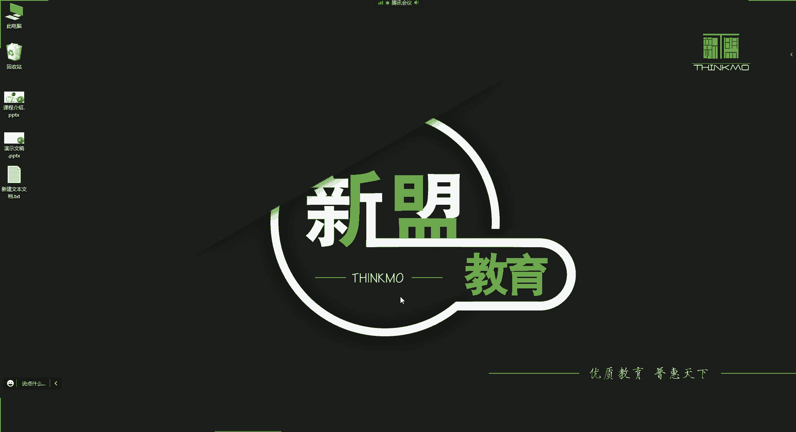

好了，那咱们就开始我们这个上节课讲到了哪里了呢？我们讲到了这个一些前面的基本概念是吧？基本概念讲完之后呢，我们又给大家讲了这个get hub的一些使用。😊。

但是呢上节课呢讲只是带领大家感受一下这东西怎么用哈。然后我们这节课才算是真正开启了我们这个什么呢？呃基于get lab加jas的一个dops的内容。然后我们先把我上节课的那个机器，我先连一下。

我上节课那个机器我是。😊。

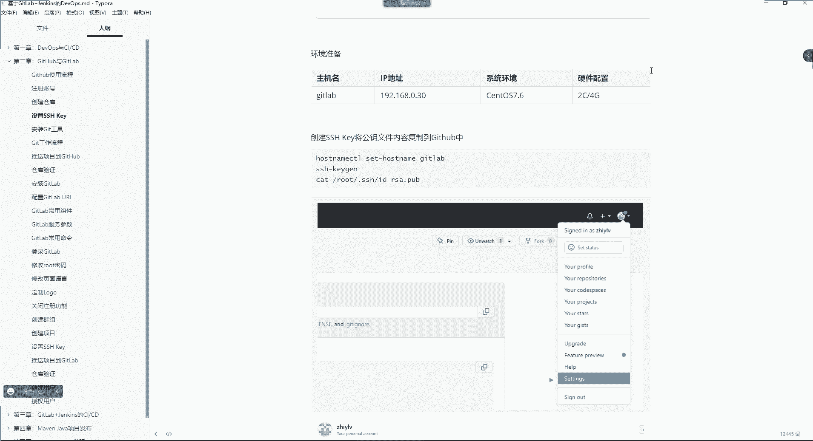

呃，上次讲公开课的时候用了一下，然后这个机器的这环境的话好像还原了一下。呃，那个地址是。192。168。0。14。好。你看这个名字。我们上次是不是改了呀？啊，然后我们今天这个看哈。

咱们今天这个实验环境就得用到虚拟机了。😊。

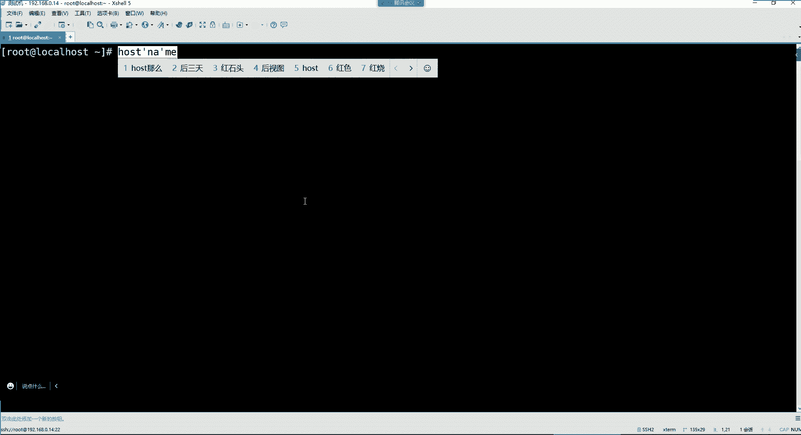

我们这虚拟技能准备一个。呃，然后这个主机名的话呢，我们就让它叫get live。这IP地址呢大家可以自定义。因为我这里面用的是192。168。0。30是吧？但是你们其实无所谓哈，我们用哪个都无所谓。😊。

IP地址，然后系统呢还有这个硬件环境。和谐数量。两核心CPU加上4G的内存。然后再加上那个50个G的磁盘。我们一直都是这么一套环境是吧？然后主机名呢，咱们改一改。这个位置啊，上次上次是。

我们一会要开始讲这部分内容。

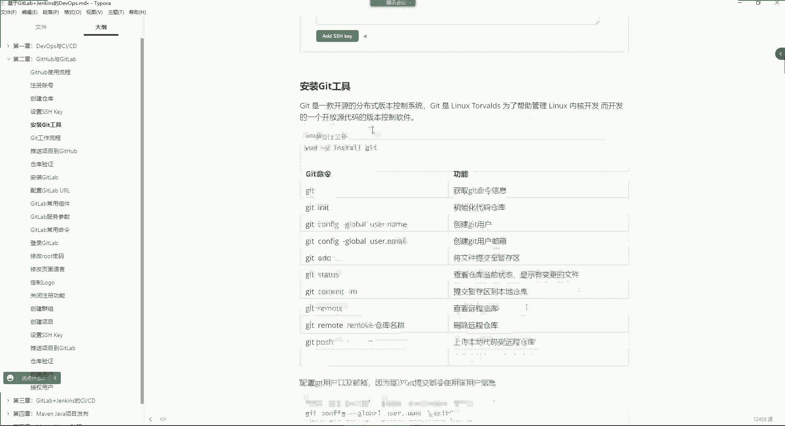

get live，然后退出再重新登录一下。重连一下行。

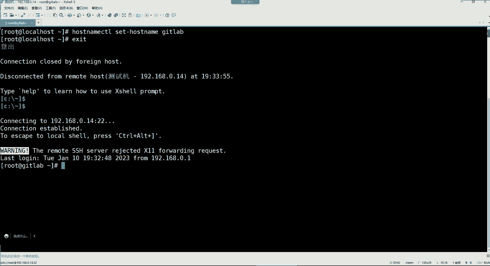

然后呢，我们首先呢要先带领大家去熟悉一个工具，这个工具呢叫做get工具。然后我们先给它安装一下哈，这东西呢在我们的这个y园里面就直接有这个东西，我们可以直接给它安装一下，用这个y杠Y。😊。

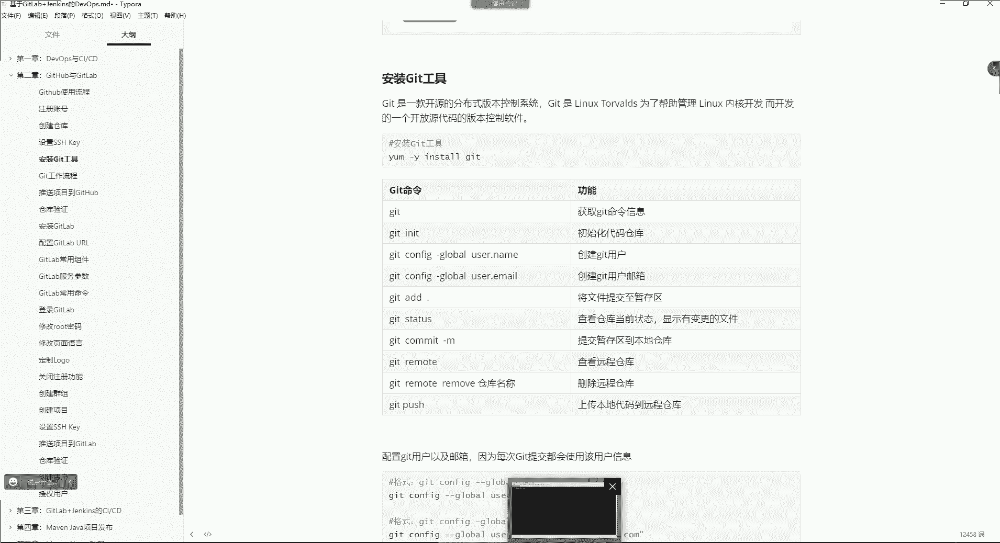

インスタ。

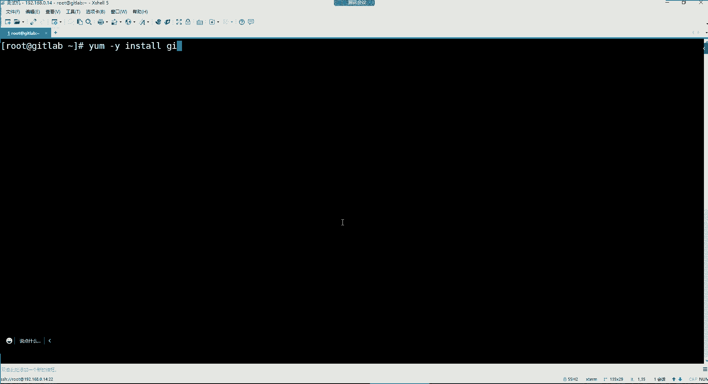

ge。然后让他先安着，然后咱们先介绍一下这个东西哈。😊，get工具是什么呢？get它是一款开源的分布式的版本控制系统。这个我们运维呢用的比较少啊，或者说我们运维几乎也用不到这东西。

但是呢开发用这个东西呢是比较什么呢比较多一些的。因为他们要去用这个东西呢，比如说要推送自己的代码。都得用这个get工具，拉起代码也也可以用这个get工具啊。然后get工具是这个李纳斯托瓦斯。

他为了管理帮助管理自己的linux斯的内核。开发而开发的一个开放源代码的一个版本控制软件。咱们先说这个get是它这个一些介绍哈，这个我曾经收藏过一篇文章。呃，在我这个里边有一个哎。怎么被我给删了呢？

是在这里面吗？没有是吧。等会儿啊，我们来搜一下。gate工具的诞生。うん。get工具。咱们看看啊。看怎么介绍的。嗯，这个介绍的也并不是很全面。然后。看看这个哈。天后给他再整。嗯。这个也并不是很全面。

看看这个简短的哈。嗯。海が。给他是一个。我曾经收藏过一篇文章，那个文章写的还是非常的。详细的包括他什么背景啊、历史啊。都有介绍，这里边也不是。看看知乎吧。看知乎怎么样哈。知乎也并不是很详细。算了吧。

那咱们就简单介绍介绍吧，是吧？😡，嗯。哎，这个也不对。get工具。介绍呢。行，就看看这个吧，是吧，get是什么工具。每次提交或保存状态时。え？真的是啥哈，这个被我给删了，现在找还找不到了。

我就简单跟你们介绍这个东西哈，get这个工具呢，它是专门。😊，帮助开发人员去。比如说我们在企业里边，在企业内部呢，我们说这个CICD的这个工作流程啊，它是这样子的。这样。就是我们在企业内部呢。

我们会有这种私有的代码仓库。我们前面给大家讲的那个ge，它是一个专门用于什么呢？托管一些开源项目的一个代码仓库。但是开源项目呢，他也不怕被别人给什么呢？不怕别人被别人给这个比如说这个抄袭啊。

或者说偷窥啊等等等等的。因为人家那个东西开源出来，我就是说白了就是让大家免费去看的，是不是啊？你要有能力，你就干嘛呢？你就抄袭，你就二次开发，这都无所谓的。但是我们在企业内部，你比如说这企业里边。

他在开发一个软件的时候，他可不是为了把这个软件开发出来之后，把自己的代码放到这个公共的代码仓库里边，让大家可以免费去白嫖，免费去抄袭，是不是啊？所以在企业内部呢，我们在开发一个程序的时候。

我们是为了靠这个程序挣钱。所以呢我这个代码呢肯定不可能放在一个公共的一个仓库里面，让大家都可以去抄袭的。😊，所以我们在企业内部呢，我们要自己搭建一个get lab。

这个get lab呢我们前面也是说过是吧，就是一个代码托管仓库。😊，然后他呢主要是在企业内部用，我们在企业里边呢开发人员在开发这个程序的时候，他们写好的代码呢，他要把这个代码给他提交，提交到哪里呢？

要给他提交到这个仓库里边。那么他在提交到仓库的时候，他得有一个工具，往上提交才可以，是不是啊？所以就用的是这个get这个工具。这个工具的话就可以帮助开发，把它的代码给它提交到这个代码仓库里边。

然后我们后续呢这个也会部署这个。😊，集成服务器。那这个集成服务器的话呢，它也要用到这个get这个工具干嘛呢？他要通过get啊来到仓库里边，把这个代码可以给它拉取到本地。拉取到本地之后。

因为这个东西呢主要就是我们用就是用它拉取代码的。拉取到本地之后呢，我们要对代码做一些，比如在集成服务器里面要对码，要呃对它这个代码做一些编译审查打包之类的。这个我们统称叫做构建啊，就是这个bud的意思。

build对代码做一个构建。构建完了之后呢，这个代码我们要发布出去，但是发布也不用get了，通过集成服务器呢就可以给它发布到测试环境，或者说呢给它发布到这个生产环境都可以。所以这就是get工具哈。

那对于get工具呢，我们既然是学习呢，我们也得了解了解它的一些用法是吧？好，我们想要使用get首先你把这个东西下载下来之后啊，这get的要求就是呃每一个使用get的这个人。😊，都要去干嘛呢？

都要去创建一个get的用户和设置一个这个用户的邮箱。因为呀在企业里边，你比如说这个开发这个人叫张三，那么张三他自己写好的代码，他要把代码是不是要给他提交到这个仓库里面去啊？那他贴到仓库。

那你想要后续那公司里边的那些什么开发主管呢。他们在审查这个开发人员代码的时候，他是不是得知道这代码是谁提交上来的呀？😡，因为到代码仓库这个里边之后呢，还得由这个开发人员去对他的代码做一个什么呢？

做后续的一些这个审查的工作，看看你的代码符不符合规范。啊，所以你每次提交代码的时候，我得知道这代码是谁写的。然后你谁提交上来的。所以我们在使用get的时候呢，他都要求啊，你必须得先什么呢？

先设置一个账号。然后你每次提交这个代码的时候呢，要以这个账号的身份去提交。这样我就知道这个代码是谁提交过来的，能列了吧。所以这是使用get的一个前提，必须得去干嘛呢？设置用户和这个用户的邮箱。

然后这命令的话呢，我们就通过这个get confi global。😊，us色点name后面跟上一个用户名就可以了。我们这个。把这个命令拿过来。但是他这是两个杠，我这里面怎么变成一个杠一个杠了呀？

两个杠哈这个。看到吗？这个用户名呢，你怎么叫都行，因为毕竟是你这个自己去设置的，所以这就无所谓了。我们把get安装完了之后哈，我们就直接在这儿设置一个使用get的账号。这个账号我们就知它叫什么呢？

就让它叫比如说。😊。

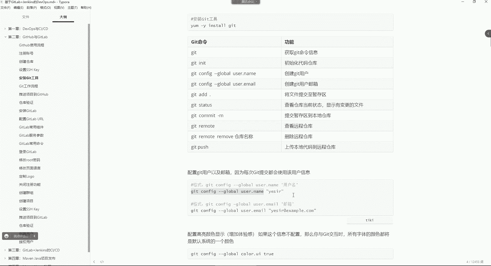

Yes， sir。可以吧啊，设置完用户以后呢，你还要去设置个邮箱，就是你要把这个优色点name幕换成U色点儿。呃。email是是吧，email。email然后邮箱的话呢，我们这边也随便设置一个哈。

比如说要yer艾特QQ点com啊，设置好了。设置好了之后的话呢，我们这边为了使用get的时候，能够更加的体验感更好一些，我们可以去配置这个命令的颜色。

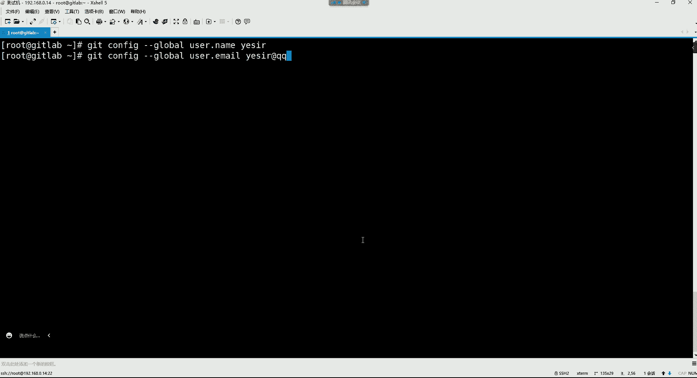

如果你不配置的话，你在使用get命令的时候，你所有的字体都将是系统统一的白色。我们这里面不都是白色的嘛，是吧？那么就没有任何的颜色显示了。所以我们为了这个东西呢使用起来更加的。

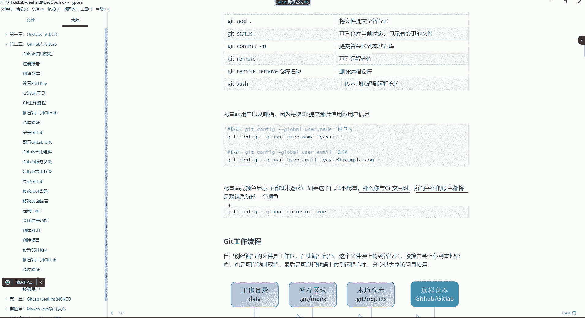

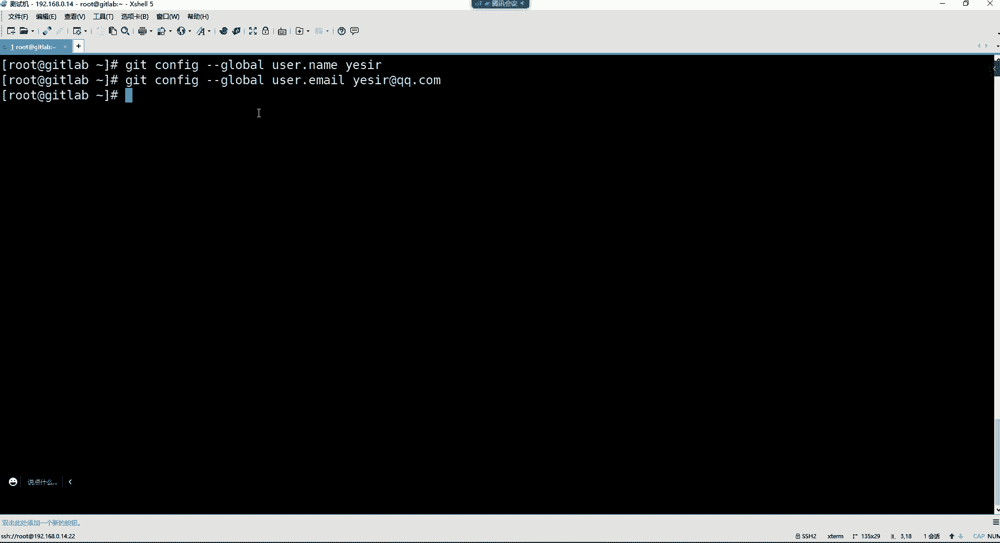

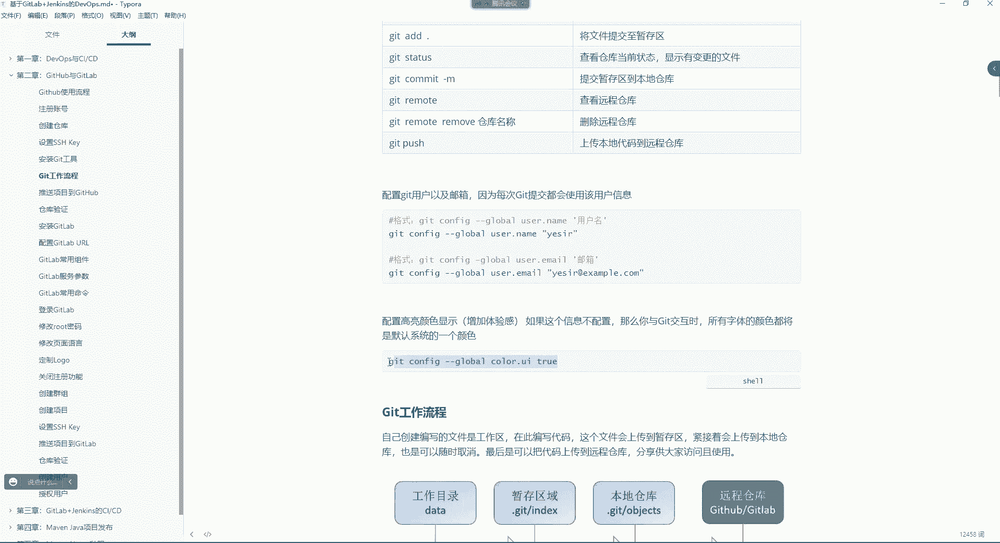

体验感更好一些呢，也是设置个字体的颜色啊。OK但是你看我们是不是全局设置啊，杠杠glogo。这个全局设置就针对于整个系统都生效了。你在这个系统的任何一个这个目录里边，你想提交代码。

那你都可以使用这个用户的身份。

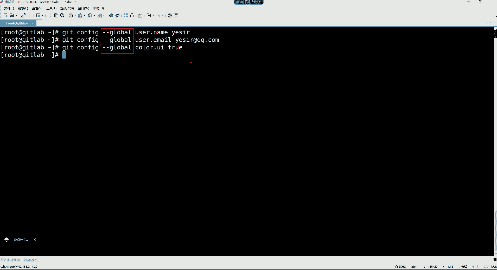

所以这是全局用户。针对整个系统都生效的那这个我们设置完之后呢，咱们就带领大家了解一下这个get的一个工作流程。ge呢我们在用的时候呢，它是这个分为这个工作目录和这个暂存区域，还有这个本地仓库。

还有这个远程仓库这么几个概念。

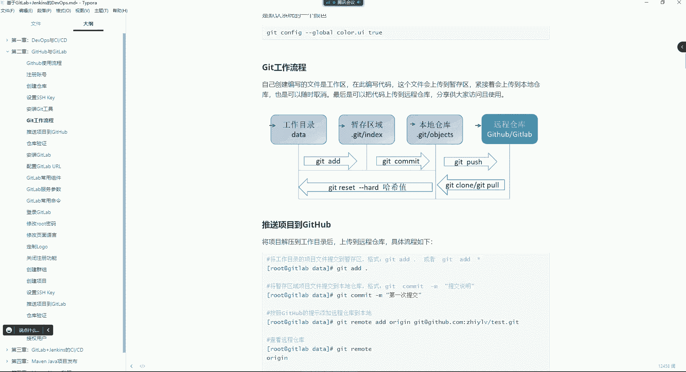

那这几个概念呢，我们先怎么说呢？咱们比如说我现在建一个目录哈。😊，makeDR我建一个，我们在哪儿建呢？我就在我的加目录建一个吧。嗯，在我的家目建一个data目录。好，建建完这个目录之后呢。

我在CD到这个目录里边。好，这个目录里边我就可以存储我的这个项目代码。😊。

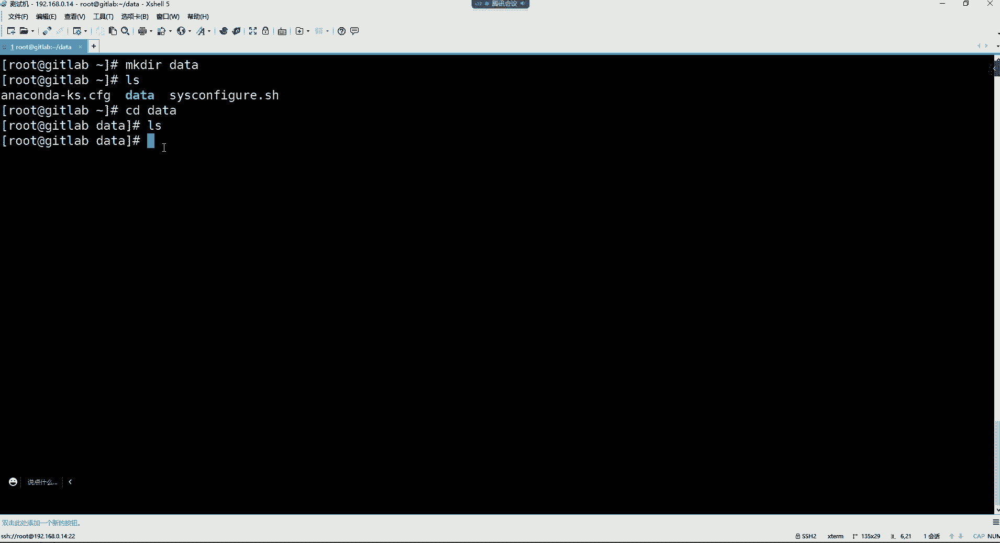

然后我们上节课是不是给大家用到了一个项目啊，就是一个抽奖的这个项目是吧？咱们把这东西给它拖进去啊。

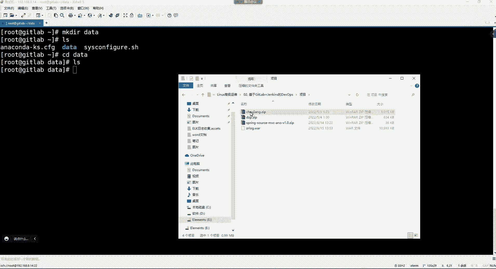

脱下来之后呢，我们给它解压一下，当是我这里面也没有解压工具。安装一个当z。然后我们现在解压。用onz把这个抽奖点ZIP给它解压一下。好。那夹之后呢，它就多出了一个目录。多出了目录之后呢。

这目录里面是什么呢？这个目录里边就是项目文件啊，然后们把这个项目文件给它移出来。把这个路径下的所有东西都给它移动到当前目录。然后再把原先那个压缩包给它移走。给它移动到我的root幕后去。没有了吧。

然后再把这个空目录给它删掉。我们刚刚是不是这个目录里的东西都移出来了呀，所以他就不要了删掉。这里面只保留了我的这个这个这些什么这些这个前端页面。这个前端页面就是一个抽奖的前端页面，这是用HTM。

和这个什么呢？和这个。这是这个一个是点GS结尾的点GS结尾就是java的这个什么呢？一个动态页面啊，我们后续在访问的时候呢，因为它是可以动的，所以呢这是由java来实现的，就是结合着是HTL加。

HTM再加上。java。编写了一个前端的一个抽奖页面。好，那我们这个一会儿访问再说，好吧，我现在有了这些项目之后，这项目是不是都在我的当前的date目录啊，是吧？好，那这个当前的这个date目录。

我们就称之为什么呢？😊。

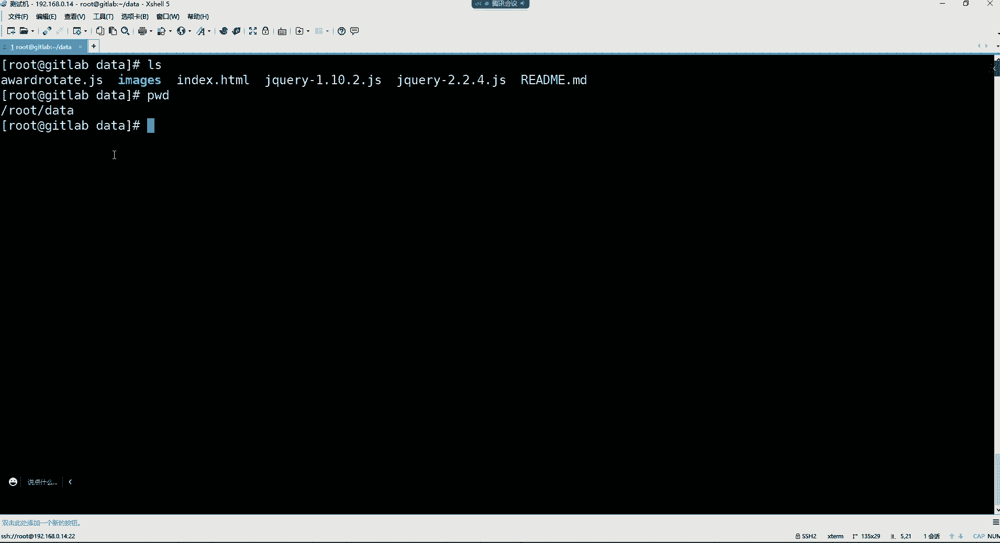

我现在是把我的项目放在这个里边了是吧？那我现在如果想把我当前目录一下的这个项目给它提交上去。我首先要这样。你好，嗯，就是我当前的这个目录的项目文件，我贴到我这个暂存区，这是暂存区域是吧？好。

那这个data目录作为什么呢？作为我当前的工作目录。

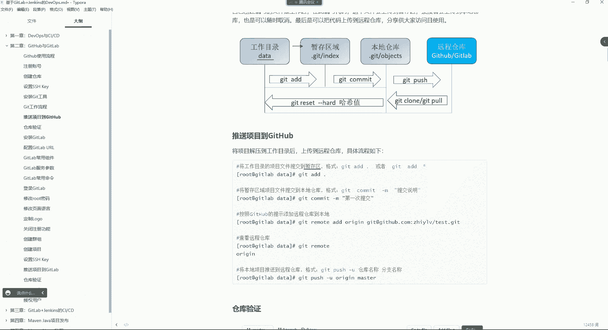

就是你工作的地方，我们称为叫工作目录。但是这工作目录现在还没有变成一个版本库，你得通过get INIT。回车好，那么你看他就把我当前的这个什么呢？把我当前的这个daate里边有一个点gate。

给它初始化成了一个什么呢？一个get的版本库了。好，那么现在对于date这个date这个目录大家。

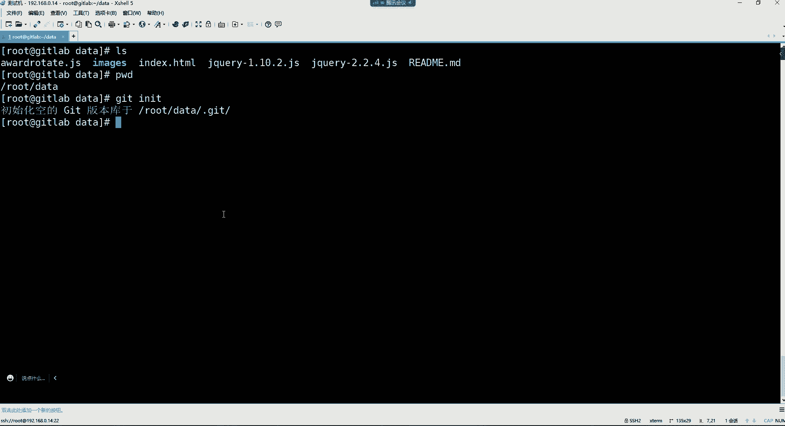

首先要知道它叫做工作目录。就是我们说白了工作的地方好。然后那我工作工里里面，我是不是放了一些项目文件呢？那我这项目文件我最终要放在哪儿呢？放在我的远程仓库去是吧？但是远程仓库我们现在还没有部署。

那没关系。我们先这样我们先这个说一下这个暂存区这个概念。暂存区呢是我们在使用这个get的时候，这里边不是有一个隐藏目录吗？

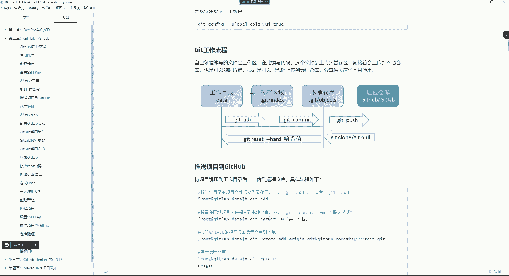

我们可以用LS杠A看哈，你要这接LS，你看不到，你看不到那个点get看到吧？你得LS杠A。😊，然，这里面是不是一个点get的隐藏目录啊，然后我们可以打开这个点ge的隐藏目录，这里边就是什么呢？

就是作为get的本地的仓库所用到的一些数据。然后在在这里边呢有一个object，这个后续的话呢会存会存储我们本地的这些项目文件的这么一个目录啊，所以我们现在也要使用get之前。

当前目录已经变成一个这个什么呢？变成一个。

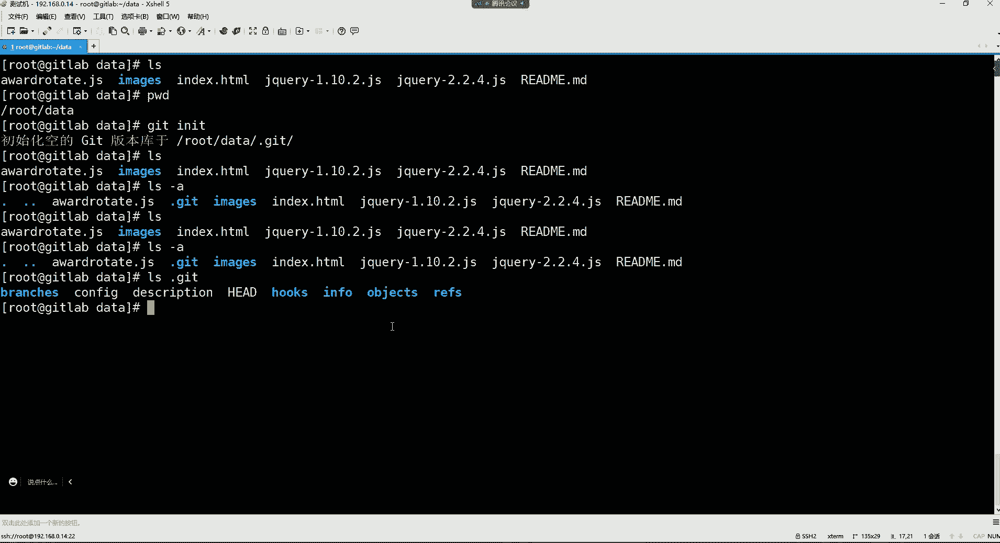

get版本库的话，我现在就可以使用这个命令，将我工作目录的项目文件提交到我的这个get的暂存区。这个概念呢大家不用去过多去研究它，这是在使用get的一个流程。

就是你想把你目录下面的这些所有的文件给它提交到本地仓库，再提交到远程仓库的话，这个流程必须要做。第一步呢它有个暂存区的一个概念。这个暂存区，最终呢就是一个舍不得。

就是你在这个点get下面有一个叫index的这么一个文件。但是如果你现在看的话，你看不到。

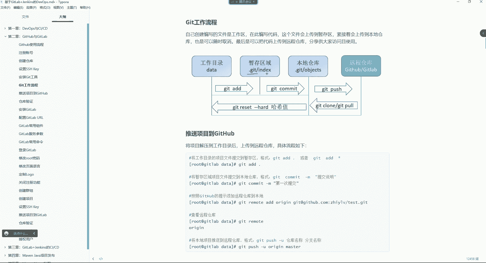

你看我们刚刚是不是已经打开了这个点get这个目录了呀，但是你发现这里面有那个叫。😊，index的文件嘛并没有是吧？那什么时候才会有呢？就是你使用这个gatet，然后ADD。

ADD呢就是把我当前工作目录的这些项目文件。这是我们的工作目录里面的这些数据是吧？我要把这个东西给它先放到gateate的暂存区域。那是我要把当前目录所有文件都放进去是吧？那我就得用直接用点就可以了。

点儿代表当前路径下的所有回车。但你直行以后，你发现它没有任何的什么的，没有那任何的输出是吧？啊，但是你得看怎么看呢？用这个命令。

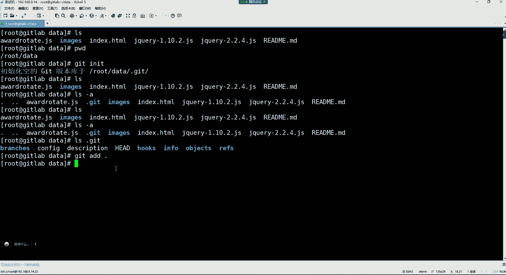

呃，有一个叫做gatet status， status是可以查看我仓库当前的一个状态，看看有没有这个变更的文件。

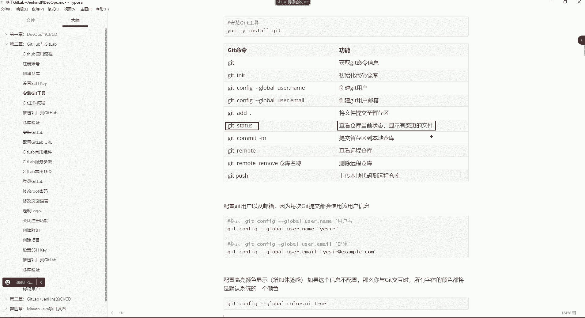

就这样。用get。Statators。有吗？注意啊，他现在看的是什么呢？是这个。暂存区下边的这些文件，现在这文件都在暂存区呢哈，但是在暂存区不行。有了暂存区的话呢，你再看这个我们当前点ge目录的时候。

这里面是不是就多了一个叫index的索引文件了呀。好，比如说现在你所有的那些这个项目文件都被记录到这个索引文件里面了。那光记录是不行的。我们现在还得提交，所以我们接下来要得就得用这个命令。😊。

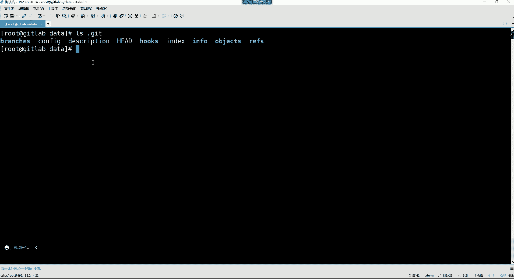

用gatet commit杠M这个呢就是提交我暂存区域的那些数据到我的本地仓库去。本地仓库是谁呢？就是在我们刚刚的那个gate里边有一个叫object这么一个目录。这是作为get的本地仓库。

可以存储你的项目文件。

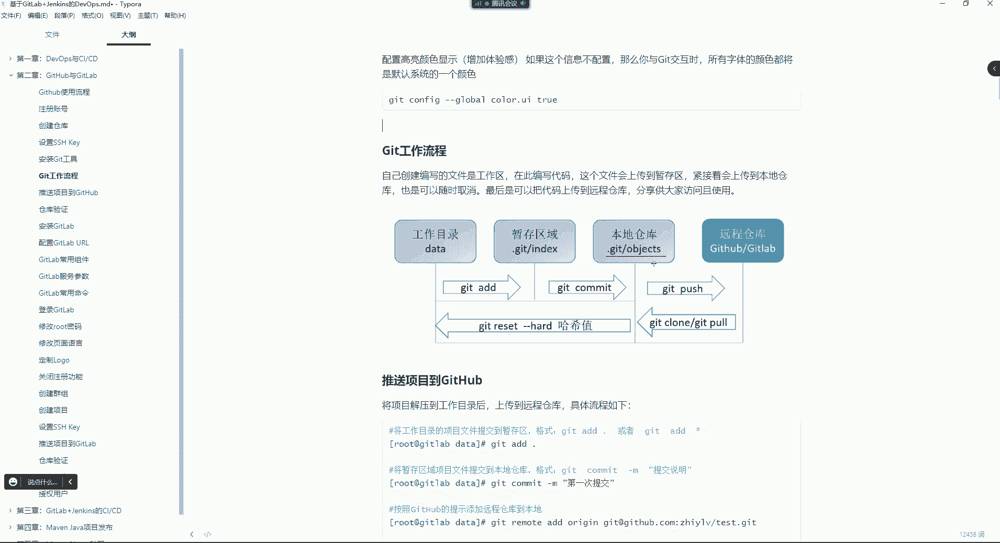

好，然后我们就可以这样get，然后。it杠M，你可以加一些这什么呢？就是提交的一些这个。

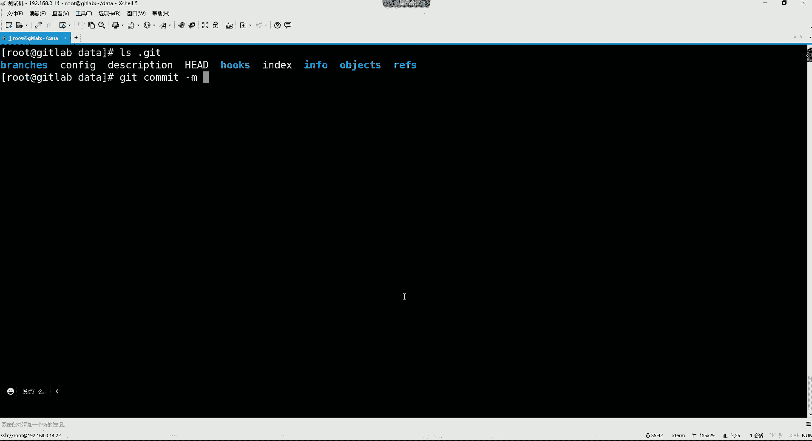

它里面杠M是可以指定一些什么呢？可以指定一些你提交的一些信息。😊。

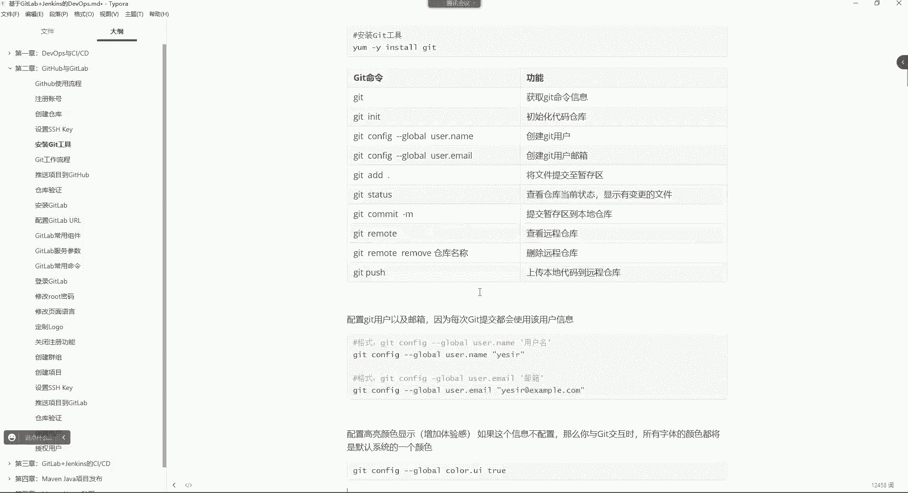

你比如说我提交的这些东西是什么呢？就是我的嗯。前端的。抽奖页面。然后回车。看看下面有输出是不是啊有了输出之后，就证明我现在把我这个暂存区里边的。

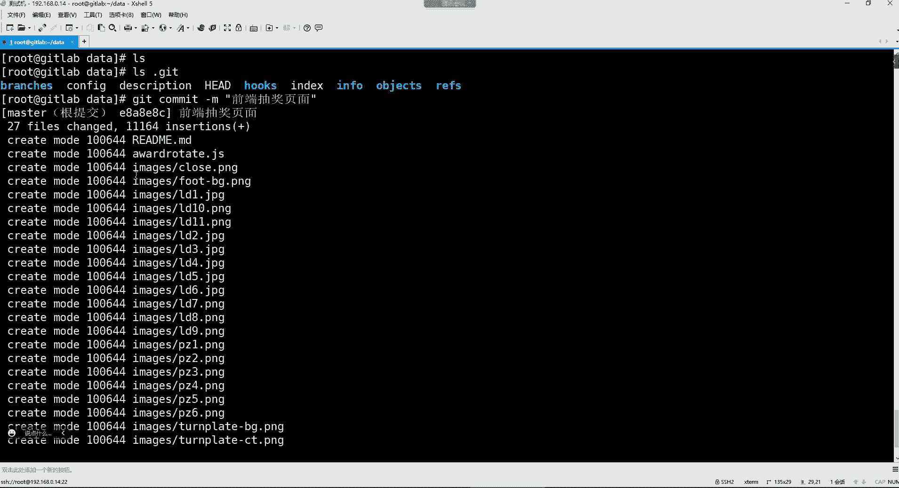

那些东西已经提交到了本地的这个object这个目录里边了。比如说现在这个东西已经到达你的本地仓库了，那到达本地仓库，其实放到本地没有任何的意义，为什么呢？就像我们在这个图里边。

开发人员他想使用gatet，把代码放在这个远程仓库的时候。那他得先把代码放在自己的本地仓库，然后呢，最终呢再把本地仓库里的代码给他提交到远程去。得走这个过程，这过程得走。好。

然后接下来呢我们想提到远程仓库，我们现在有远程仓库吗？我们并没有远程仓库是吧？所以我们现在要去自己部署一个远程仓库去。😊，所以我们要去安装这个get lab。呃，我们安装get lab的话呢。哎呦，有。

这地址是对的是吧？我把前面这删掉哈。😊，把这个。环境准备也给它删掉哈。好。那我们前面这些东西。我前面这东西就就是简单给大家做一个了解内容吧，行吧，这东西啊我们到时候就给它删掉吧，没有什么意义哈。

其实一直到这儿留不留都无所谓的。😊，然后接下来呢我们就来说说这个这个get lab这个。代码的托管平台，它对比于gethar呢，它更适合在团队的内部使用。然后我们部署的话呢，就是这我们的IP地址。

因为我用的也是这个地址，然后这是ge lab的一个官方地址。我们看能不能访问一下他这个地址呢在国外。不一定能够防得过去。啊，也还可以啊。呃，但是呢翻译不了。因为我们现在这个谷歌浏览器。已经。

如果你使用不翻墙的话，现在谷歌浏览器根本就翻译不了。我们用的是国内版的，翻译不了哈。所以它这东西呢，对于官方文档的话呢，我们看不看其实关系也并不是很大。😊，了解一下吧，是吧，这是他的官方。

然后他有自己的文档在这个位置。然后如果有需要的话，大家可以去看看文档去。当然也都是没有汉化。当是我这个东西呢，我们就是也不需要去参考它的文档。我们就说这个东西怎么用软件包从哪下载呢？呃，对于这个。

get lab它的版本也是分为这什么呢？这个CE社区版本和这个E的企业版本这两种类型。这两种类型呢，我们用的是它的这个社区版本。企业版本肯定是收费的，但是呢收费归收费哈，功能肯定比这个社区版本要全一些。

而且呢官方也会给你提供技术支持的但对于我们来讲呢，无所谓，我们是用不上是吧？所以我们想要下载这个ge lab这个包啊，下载它的CE版本，我们去清华大学下载。你想下载它企业版本，这里边清华大学也有。😊。

我们可以去来到这个清华大学。然后在这儿搜他的这个。Get lab。啊，看到了吗？是不是有一个get lab杠C的社区版本呢？然后这个呢就是它的企业版本，这个是叫做集成框架版本。它的这个集成框架版本。😊。

到底是收费的还是免费的呀？没有用过这个版本哈。呃，是。免费的吗？自己本地大家呃。不是ge他把杠runner。啊，是这个版本的话。啊，这也是一个开源的啊，用于运行pa plan作业。

那就和他的这个C版本差不多了。那无所谓吧，我就仍然选择这个C的哈，这也是一个免费的。😊。

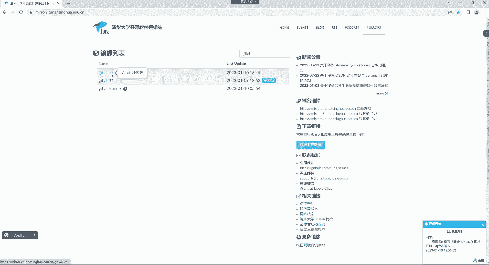

点进来之后呢，我们是s toS的操作系统。那咱们就选择这个y这个文件夹里边。那如果你要是用的别的系统呢，你比如说用的是deban的呢，用的是欧班图的呢。那是不是就去对应的文件夹里面找它的包就可以了呀啊。

然后我们选择这个ym点进去。

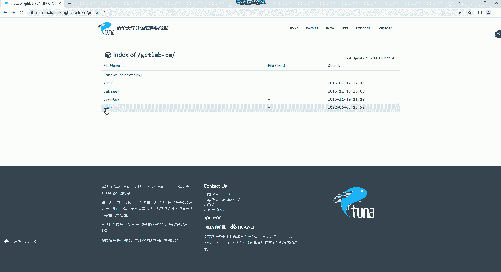

然后再点到那个117这个文件夹里边。好，这就是我们当前看到的可以使用的这些版本，看到了吗？是不是非常多呀？然后我用的是哪个版本呢？我用的是这个。是这个14。1。0的这个版本，也非常新。

我们可以看下这14。1。0的在哪儿呢？在。在这儿呢看到吗？这14。1点。1。0的这版本是吧，这是2这是2021年7月份的一个。发布的一个版本也很新了哈。现但是现在最新的是这个15。7的版本。

跟咱们差了一个版本无所谓哈。😊，我们就选择用这个14。1。0的这个版本就可以。这包我已经下载好了，这个包挺大的这包。800多兆，你看这个包哈。它这里边可不是说只有一个软件啊。

它这里面是有好多个软件都放在这一个包里面的，然后总共加息你看到了吗？是不是就800多兆啊，那一个软件包不可能有这么大的。所以我们把这东西给它传进去。

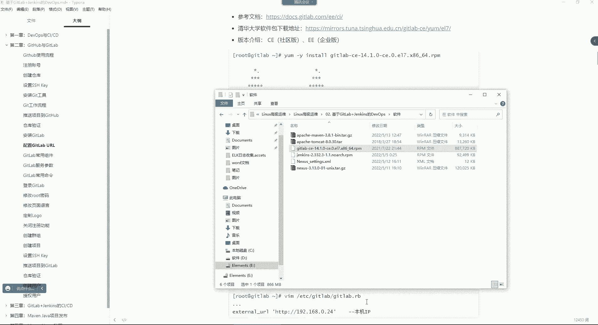

800多兆传的话，我们得用这个这个叉FTP传。找到我们这个包。软件。给他来吧，给他拖过去。这样传还算快点呢。如果你要是直接用那个。

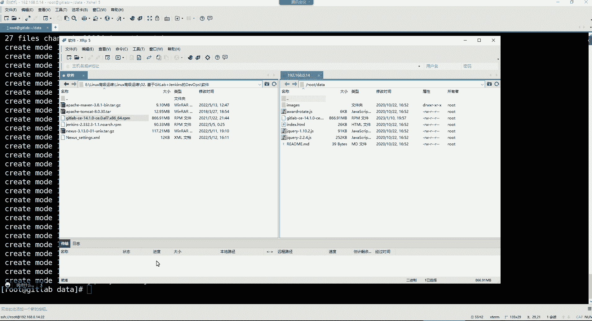

命令行的那个LRCZ那包更慢。但这边我拖到这儿了是吧，给他移走哈，把这个。😊，给t他 lab这个包给它移动到我的root下面。然后接下来我们就可以直接给它安装上，用样么安就可以，它有依赖。

但是呢我们不用管。啊，安装。

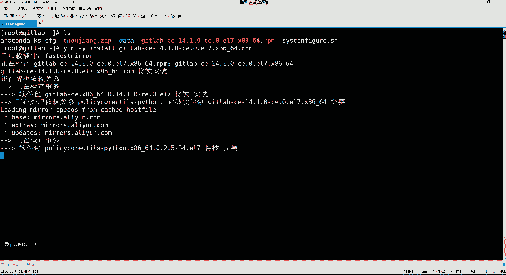

这个安装的话呢有点慢。所以我们就得等。

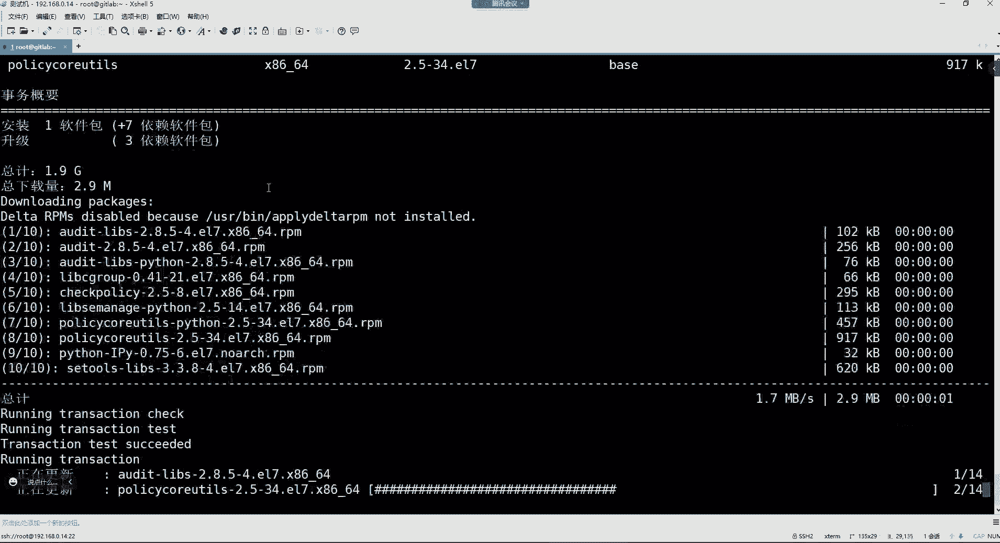

等等哈。然后我们一会儿的话呢，再把这个仓库安装完了之后呢，咱们再去。把前面的这个命令呢。其实这命令就没啥了，就这几条命令我们几乎几乎已经都用了是吧？这个get unit是初始化代码仓库的。

要初始化我本地的目录为一个代码仓库。然后这两个命令呢就是创建一个用户和设置一个用户邮箱。然后ge a点呢，就是将我当前路径下所有文件提交到我的这个get的暂存区。然后当你的这个文件在暂存区之中候。

你想看的话，你可以通过这个gatet statuss去看你这个仓库的暂存区的一些。数据。然后看完之后的话呢，你可以把你暂存区里的文件呢给它提交到你的这个本地的get仓库。提到本地仓库之后呢。

我们接下来就要去涉及到这个远程仓库的这条命令的一些使用了。比如说查看远程仓库啊，删除远程仓库啊，上传本地代码到远程仓库啊，通过这些命令。给他板安装完以后呢，它就会出现这么一个图标，就是一个小狐狸头。

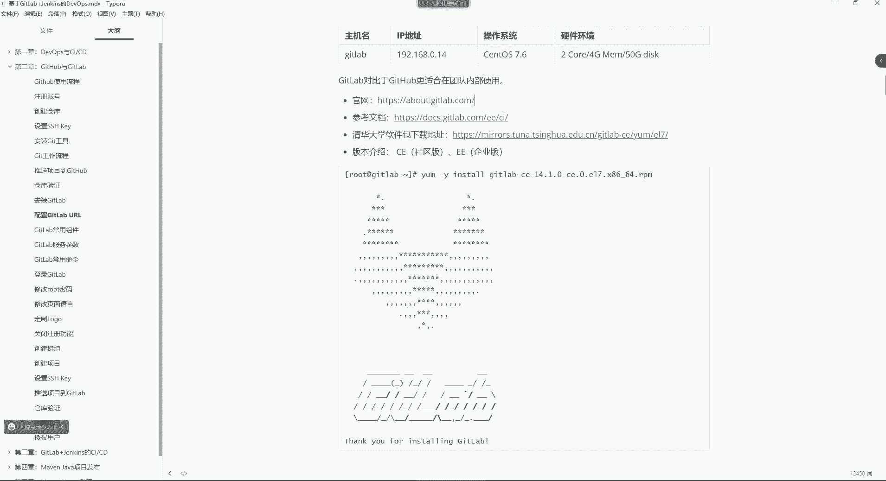

安装完了是吧啊，安装完了之后，我们来看一下，你看它上面是不是就出现一个小狐狸头啊，然后下面这是。😊，一个get lab。然后这儿他说这个感谢你安装get lab安装完之后呢。

它下边有一些这个提示告诉我们怎么做哈，我们翻译一下。😊。

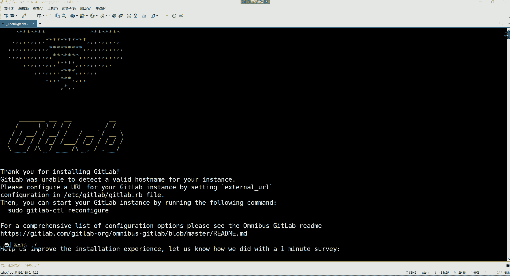

一会翻一下哈。

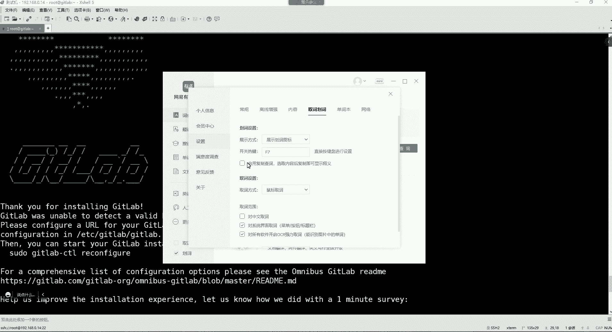

来看这儿哈。然他说什么呢？他说。get lab现在无法检测到实力的有效主机名。什么意思呢？就是我们后续呢要通过这种外b界面的方式去访问这个gittalab。

那你访问gi他lab是不是你得需要一个UIL的地址啊？所以他现在呢并不知道你当前这个主机的这个UIL地址是多少，所以他现在让你去设置。怎么设呢？他说现在请通过设计设置你的get lab实例。

然后你给他配置一个URL地址去。后续呢我们要访问，然后这时他告诉我们去配哪一部分配这个externalUL。那哪个文件可以配呢？它这里面告诉你了，看到吗？你要去改的，就是它的这个文件。

这是它的主配置文件。所以我们现在就是要把它的这个文件给它打开。

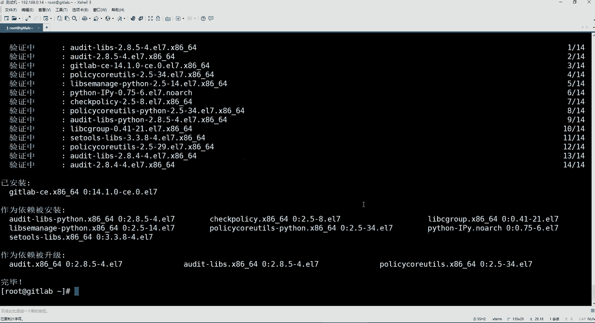

VM。啊，把这个文件打开。

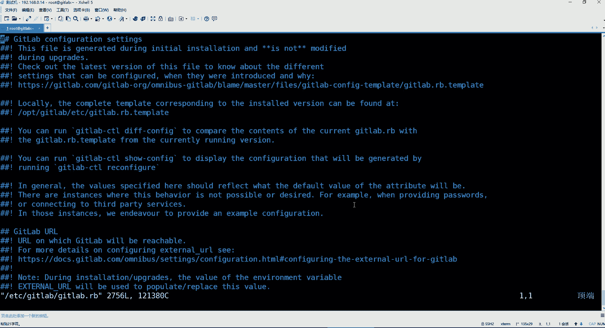

打开之后啊。我们往下翻一翻哈，找那个external uL是不是在这儿呢呀？好，就把这个里面的，它这里面默认叫get lab点ex点com把它删掉。😊。

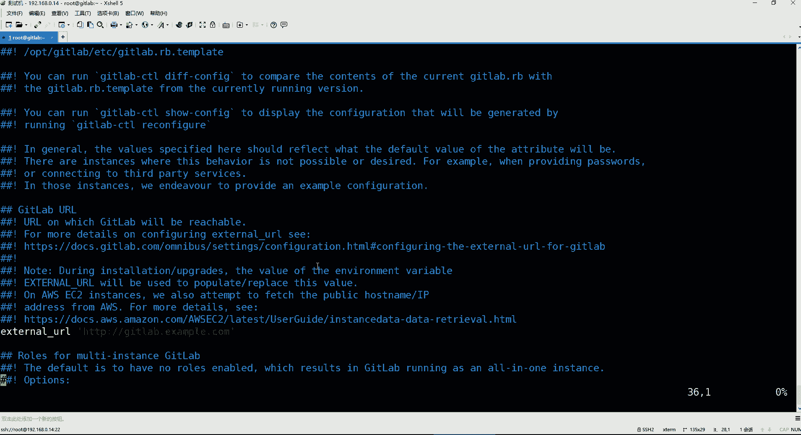

删掉删掉之后呢，我们可以自己写个IP。192点就把我们的本地IP写上去就可以。或者说你自己做个本地解析，你写一个，你自己解析个域名也可以。😊，能理解吧？所以这都这个看你自己的一个个人习惯了。

你习惯用域名去访问，你就自己配个解析，不习惯用域名访问的，你就直接用IP也行。😊，啊，但公司里面可能会用域名是吧？那我们也来个域名吧。不那叫we点儿getla点儿com。可以不可以，你配什么都行。

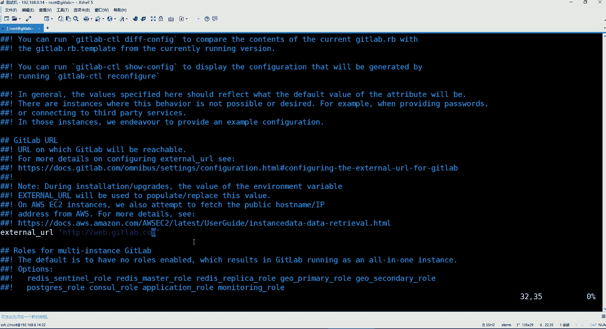

但是你配完之后，这边你是不是得在windows里边做一个解析去啊？Windows。C盘的C32里边。然后找这个。Driver， ET C host。

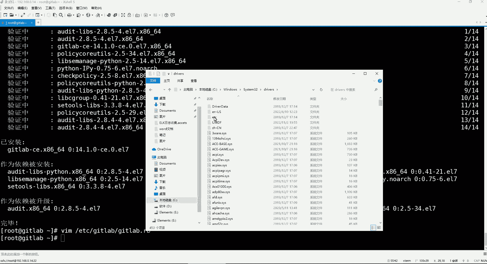

我们编辑这个文件。编辑完了之后呢，咱们是不是就在这里面，在最后我们加一个。😊，192点168点0点14。匹配的域名呢是web点儿gatet lab点儿com是不是就可以了呀？然后保存。

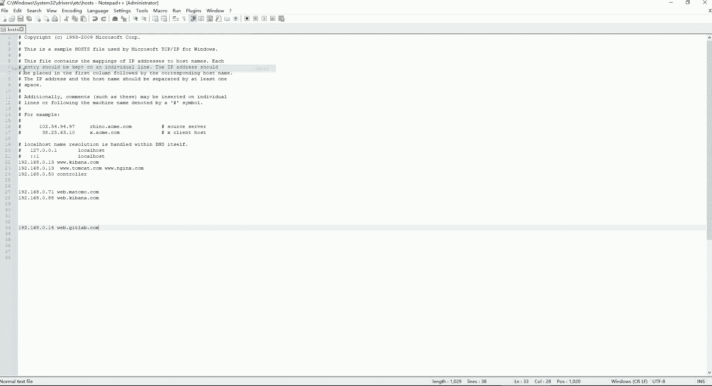

行。这个配完之后呢，我们配完它这个域名解析哈，我们接下来他让你他告诉你怎么做了，好了吗？看这儿，他说然后你就可以通过运行以下的命令，启动你的get lab实力了。哪个命令呢？让你使用这个命令。😊。

使用这个哈，那你就把这命令拿过来执行一下。😊，他就开始帮你启动get他 lab。

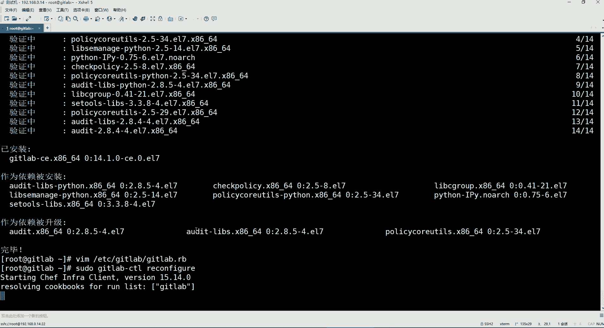

但这个过程还是比较浪费时间的。然后趁着这种功夫呢，咱们来了解了解ge lab的一些组件哈。这个组件呢我们就除除了他的自己核心的组件呢以外呢，我们有几个是我们比较熟悉的，比如NGS。😊。

在go lab里面呢，它会通过NGS提供它的外部服务的功能。就是我们最终要访问它的这个we部界面去，所以它的外b界面是通过NGS。来运行的。然后还有他自己本身的这些核心程序。这个呢我们就不说了。

然后我们再来说说他的这个数据库，因为它也需要用到数据库去存储它的自己的一些数据。包括我们的这个呃项目数据啊，什么都会放到他的数据库里边。

而它的数据库呢默认用的是这个posts gray circle这个数据库。存储它的数据这个了解一下哈，然后还他也会用到readds去缓存它的一些相关的数据。啊，其他都是他自己的核心程序。

这个呢我们一般就不用去管它了。然后下面这个还有就是一些服务参数。服务参数的话呢，我们是通过这种y的方式安装的。然后它的相关的路径，比如说这些应用的代码和相关的依赖程序会放在OPT的get labb里边。

啊，当然这种的话，我我们一般也不用去改变它。是他自己的本身的一些这个依赖的东西都会放在这个OPD的git lab里边。然后后续如果你的OPD里面，如果你发现有一些什么跟get lab相关的东西，别删。

因为我们习惯没事呢，这个OPT我们拿于拿来用做一些实验，是不是啊啊？但是到了这些服务的这个阶段的话，大家没事就不要去删OPT目录了，也不要去拿OPT目录去做什么相关的实验了。

因为包括后续我们在学容器的时候，在学习这个。😊，dork的时候，你要知道你安装完docker以后，dock的一些数据也会存储在OPT下边。所以后续的OPD目录你不要瞎动了。

然后它的自己的相关的配置文件呢是放在ETC的get labb里边了，就包括我们刚刚配的文件也在那儿，然后它的主配文件是叫做get labb点RB。

然后它的这个各个组件产生的日志呢是在r的 log直接有一个get level目录。这里边这些组件每个组件都有自己的日志文件，包括NGS啊，还有这个PG circlercle啊，都会放在这个路径下边。😊。

呃，然后这个。库的默认存储目录的话，这个的话呢就是我们后续呢要在这个get lab里面，要在这个get lab里面去建仓库。仓库里面我可以去存储一些代码。那么呢它这个仓库呢对应在这个系统的位置。

就是在这个位置。这个路径下边好。然后备份文件这个生成的目录呢。在va下有个OPD有个ge lab。这个的话呢我们一般接触的比较少一些。啊，包括像什么N键S配置文件，我们一般都不用去动它。因为这种东西呢。

它所有东西都已经给你配好了哈，所以你就简单了解一下就行。我这里边其实后续呢也很少去跟这些相关的文件去打交道。😊，知道一下它的服务参数。然后它的服务命令的话呢，这里边呃启动服的话呢。

我们直接用这个get lab杠 controltrlstar是启动它全部的服务。因为一个get lab服务非常多哈，123456788个服务。所以后续你想启动它所有服务的话呢。

你就可以这样通过直接就把所有服务起来了。想重启所有服务呢，就是reta，然后想关闭所有服务呢，就stop。😊，但是后续你说我想如如果我只想关闭某一个服务呢，那你后边跟上服务名。

你比如说我像我想关闭NGS，那你就get lab杠 controltrl stop NDS就可以了。这种是只关闭某一个服务。但这种呢比较少见一些。😊，然后这个其他的话呢也就没啥了。

后续想卸载就用这个命令。on install这是卸载给他来吧，但是它数据并不会删除哈。就包括他的什么呢？他的这个。自己的这个嗯库的默认的存储存储目录里面有一些数据。并不会删掉。如果你想删的话。

你再加上这个命令。删除所有数据，重新开始。但是这种几乎用不上哈，我们不可能去删它啊，所以这个东西就作为了解就行。😊，呃，其实我们是通过这种方式部署的。其实如果后续你通过容器部署呢。

如果你后续你通过容器布署这些命令，你都不用记。你后续你是控制容器，你记这些东西干嘛呀？后续你如果是通过docker部署，你只要需要通过docker start启动get lab就可以了。你想关闭服务呢。

你就dockertopge lab就可以了，能列了吧。所以这东西看你怎么部署。而且而现在好多企业也比较习惯用这个容器的方式去部署这个东西。好。知道一下哈，所以这命运呢我们其实这个了解了解。😊。

你得知道我们这个安装一个服务是吧，它的服务的相关参数，服务的常命令都有哪些呀？

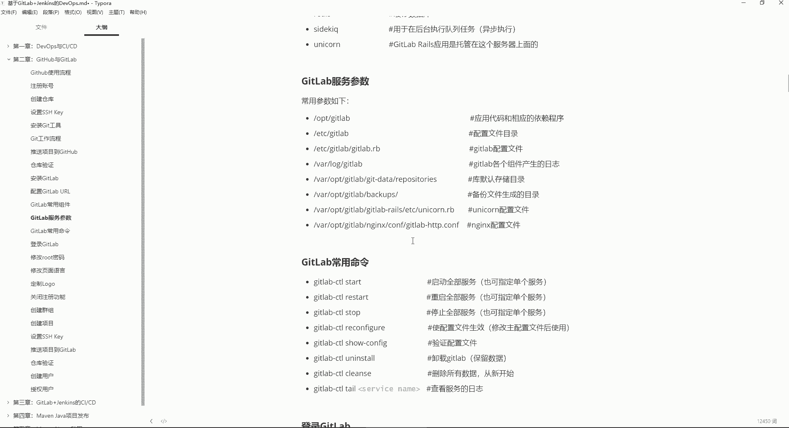

配好了吗？配好了是吧？那配好之后的话呢，我们这边可以用这个它有一个get lab control，应该有个tats。

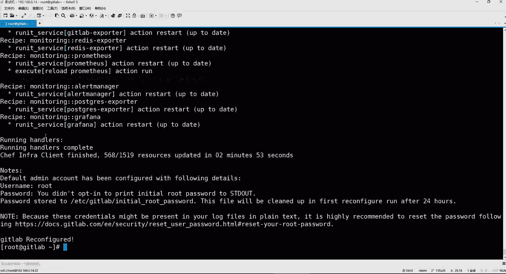

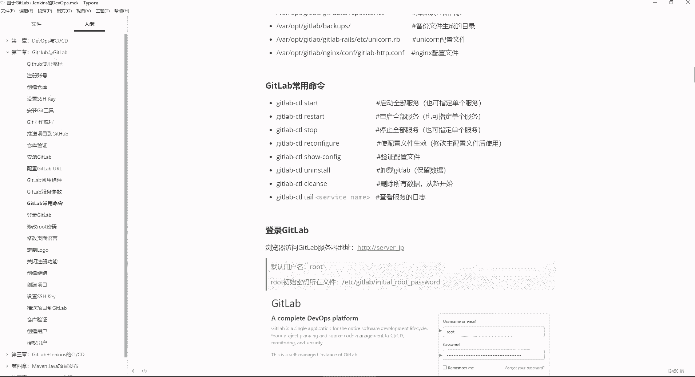

Gate lab杠。Control。Tters。stus是可以看它的所有的服务的。你看它这里面这个服务非常多，是吧？如果你看到都是这种。running的这些这个什么呢？输出的话。

就证明这服务现在都属于运行的状态。你就不用动了。服务都已经跑起来了吧，服务跑起来之后，我们现在要访问，访问的话呢，在这儿应该怎么访问呢？我们前面说配个域名啊，配个域名之后哈。

我们要去访问那个域名去在我们的这个浏览器这位置。😊。

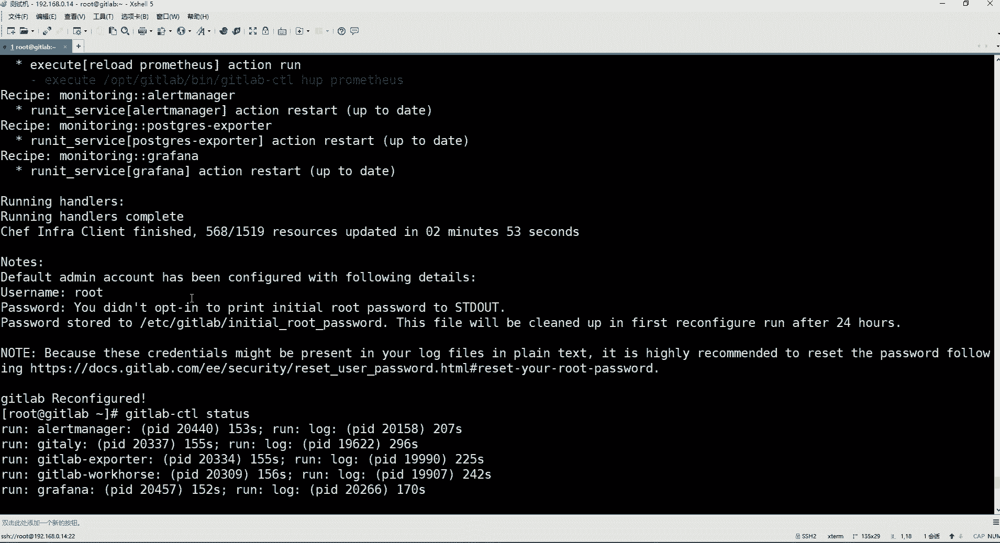

跟上web点儿get lab点儿com。它默认端口就是80，就是NGS那个80哈。然后我们现在就来到了这个它的这个外部界面了。来到这个界面之后，我们这里边得需要输入用户名，你才能登录上去。

那么这个用户名我们应该。😊。

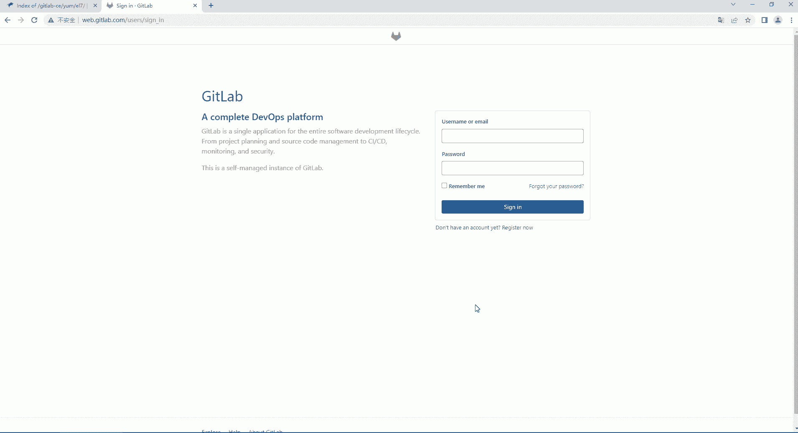

用哪一个用户登录啊？所以呢你在安装的时候，他已经告诉你了，在这儿看了吗？它的这个user name是root。root呢是作为这个get lab的一个超级管理员的一个用户啊。

是外是登录web界面的一个超级管理员。😊，那用户的密码呢？😡，它是首次的话，你是首次安装，他把密码给你放在了这个文件里面了，看到吗？所以我们要先去把它这个密码先给它查出来。这文件总共。就一行。

当然我说的是没有被注释的就一行啊，看到吗？就这行没有被注释，然后这就是root的密码。所以我们现在要把这个密码还给它复制一下，然后放在这个位置。

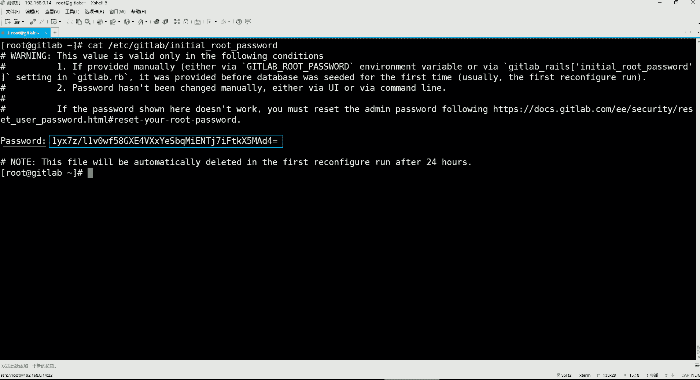

用户名就是。Root。登录就可以了。那登录上来之后呢，我们现在看看这界面也都是英文的。看不太懂是吧，没关系。像他这种啊支持中文。所以呢我们用这个东西呢，也不用考虑说看不懂难学这些问题。你看右上角。

这是你的个人资料。在你的个人资料里面，你可以看到你当前是以哪个用户在登录，是不是啊？然后呢，他这有一个什么有一个这个偏好设置。你点这个偏号设置之后，你在这呢下拉。下来之后，这里面它有一个。

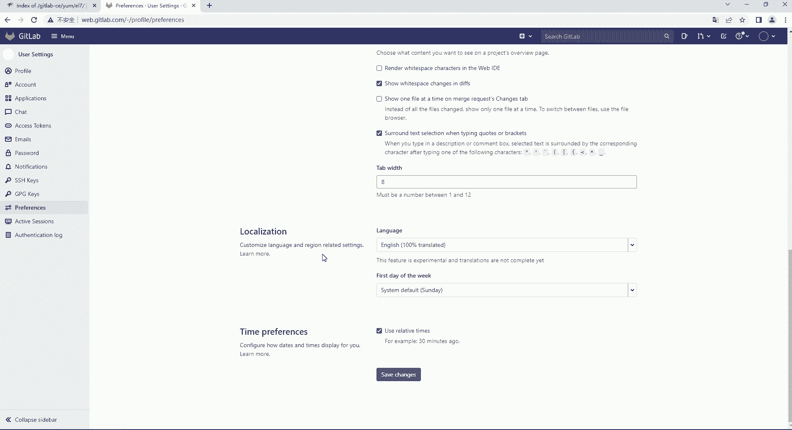

就在这儿哈，你看有。