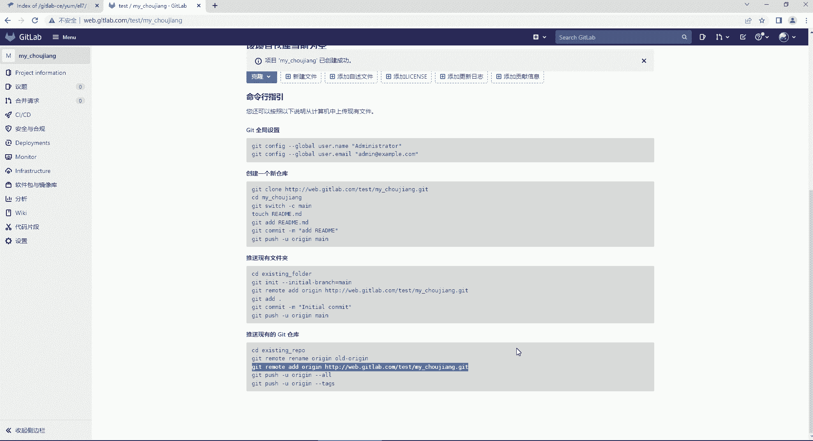
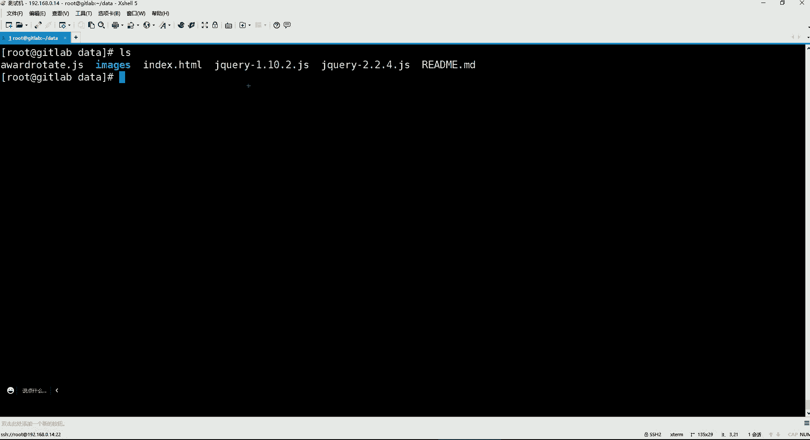

# 零基础入门Linux，红帽认证全套教程！Linux运维工程师的升职加薪宝典！RHCSA+RHCE+中级运维+云计算课程大合集！ - P95：DevOps-3.GitLab快速入门 - 广厦千万- - BV1ns4y1r7A2

一个语言，这个语言默认是谁呢？呃，默认是什么语言呢？是english是英文的。所以我们要把这个语言给它调整为简体中文。看到了吧？然后这简典中文呢是67%的部分是简体中文。

那要说其实还不算不不能算是百分百的简典中文哈。然后我们就C我趁至保存这个更改就行了。保存更改之后，你要刷新一下这个页面才行。这样的话能看懂了吗？😊，这是不是就突然间感觉特别亲切了呀，是吧？

这些什么用户资料啊、账号啊、应用啊，这些巴拉巴拉的一堆是吧，都能看懂了。😊，然后呢，我们接下来可以在这里边。干嘛呢？呃，咱们先去建个仓库去吧。这东西不见仓库的话，我们前面。讲到了一半卡住了。

是不是啊在我们讲这个get的时候。我们现在是不是要把我们本地仓库的那些项目给它推送到远程仓库去啊？所以咱们呢就。这个先建原，但是先建原程仓库不行，为啥呢？因为我们这边还没有去更改这个root的密码。

这是默认的管理员的密码是吧？那你说如果你下次登录呢，那咋办呢？😡，那这密码。你还能记得住吗？你肯定记不住是吧？😡，而且那你说那我记不住我再来这个文件看看不就行了吗？但是你要注意哈。😊，我们再翻一下。

他这文件里面它是有介绍的。呃。我记得他是。在哪个位置是有一个介绍哈。密码没有手动修改。这儿呢看到吗？他他告诉你，他说什么呢？他说这个该文件将在24小时后。第一次重新配置时自动删除。

说白了就是你下次再想找这个文件，你就找不到了。也就说这密码你就用不了了。所以我们上呢上来之后啊，大家先把这密码给它改掉。😊。

呃，也是在你的个人资料里边，你看到吗？这是偏号设置是吧？上边就是密码，你点这个哈，然后这里面呢它需要你输入当前的密码。😊。

当前密码就是这个。

这个哈把这个呢给它放上去。当前的密码，然后下边呢再设置新密码。这个新密码呢，我们这里边比如说我123。123。保存。可以吗？爆红了是吧，他说你密码太短了，最短为8个字符。

所以呢你这里边你是不是得满足他的要求啊，我们就1234567。

啊，我们这是当前密码哈，咱们就12345678了。😊。

反正我们也是实验环境，也别搞太复杂。然后新密码12345678，确认12345678，可以吧？保存。它不验证复杂度，它只验证长度够长就行啊。Root。密码12345678。登录。这样就可以了。好。行。

那我们登了这之后，咱们先去干嘛？咱先去建一个仓库吧，咱们先把这个get命令呢先给它用一用，好吧。😊，怎么建仓库呢？在这儿有个menu看到了吗？这就是菜单。然后呢，菜单里边呢有一个addmin，这是管理。

在这个管理里边，我可以看到。他有新建项目，还有新建群组，还有新建用户。白了吗？我们可以来说一说啊，就是这个项目不用说项目就是一个项目仓库，就是可以帮我们去存储什么呢？存储代码的一个地方。

你可以在里面建一个仓库，然后呢把代码给它上传到这个仓库里面去，这叫。😊，项目好，这里面存储的一个代码。然后这个用户是什么意思呢？这用户嗯这个也不用过多解释。我们前面在学习这个jab的时候。

你们应该也都也都知道jabb它分为min，这是超级管理员，是不是啊？但是呢你除了超级管理，除了这个超级管理员以外，如果我们公司里面，比如说还有像什么张三李四，他们也需要去登录到这个什么呢？

这个平台上面的话，那你是不是也要给他们去见用户啊，所以这个用户呢就是可以用来登录到这个get lab上边的一个账号。😊，好。而这个新建群组是什么意思？新建群组就是呃。我们可以。在这里边呢先建个组。

比如这个组名，我们让它叫。这个什么呢？让它叫test组啊，然后后续的话呢，你可以干嘛呢？你可以建一个项目。比如我在里面我建一个项目，而这项目呢你可以选择它属于哪一个组。你可以把这个项目给他什么呢？

选择属于这个test的组里面的一个项目。好，那属于这个组之后，那这个组内的项目谁可以看呢？你后续你就可以干嘛呢？比如建一个张三。然后呢，你把张三也加入到这个组里边，那么张三就可以去看到这个组内的项目了。

所以这个组呢其实就是可以把这个项目和用户放在同一个组内进行一个管理。好，所以我们上来一页应该先见的一个是群组这个东西点这个好，这个群组名称我们叫什么都行。比如我们叫常它叫test组，可以吧？test。

然后这个群组的UILUIL呢这很显然就是什么呢？就是我们这个访问地址，后边呢跟上你的这个组名了。好，那就是这个访问地址。然后呢，我们这个群组描述你想写就写，不想写就算了。比如说这这个这是一个嗯测试项目。

测试项目的组。好，然后这个群组这个头像要不要选择一下？如果你想选就选，随便找一图片。后续的话呢，这个组呢也有一个头像，或者说你来一个，比如说这个组里面我放的是什么项目？哎，你随便搞哈，这个无所谓。

你就就来个小企鹅。然后那你这个组的可见级别，它是里面分为私有的和这个内部的和这个公开的这三种类型。对于这个私有的话呢，他这边也是有所介绍。他说啊群组及其项目只由成员查看啥意思呢？我现在有个组叫test。

是吧然后呢，比如说我现在又创建了一个项目，我把这个项目呢也是这个什么呢？放到了这个组里边了，这是我的项目。😊，好，那么。我这里边呢我然后我又建个账号，我这个账号呢叫张三。好，那么接下来你看哈。

如果张三属于t的组，项目也属于t的组，那么注意张三就可以查看到这个test的组内的这个项目了，能列解了吧。啊，所以就是这组内项目只有成员可以看。那比如李四呢，如果李四我没有给他加入到我这个组里边呢。

那李四就看不到这个组内的项目。就这个意思。那如果是内部的呢。如果是内部，他说除了外部用户以外，任何登录的用户均可以查看该组合。任何内部项目。如果你这个组是一个内部的话。

就说白了如果李四这个人他能够登录到我们的这个get lab这个web界面上面来。他就能够看你这个组内项目，他不分这个这个人到底是不是属于组内成员。他是这个意思，只要能登录我就能看。

所以我们这个组呢就看需求，按照需求啊去设置它的可见级别。如果你说我这个组呢，就是只有我这个组里的东西只能用组内成员看，你就让它变成私有就行了。还有另外一种类型呢，这是适合什么呢？适合一些这个开源项目。

就是你看任何的这个什么呢？就是在没有任何身份验证的情况下都可以看。就说白了你都不需要登录到我这个get lab上面来，你就可以通过一个地址。😊，就我给你一个什么呢？我就给你一个这个地址。

你就可以直接访问我这个什么呢？访问我这个仓库了，就根据这地址就可以直接访问，能理了吧。但这地址你得能够被外王访问才行啊，所以这公开的是不是就。😡，不太合适呀。所以默认呢，我们就让它是私有的。好吧。

就不动了。然后这个允许创建项目，允许创建子群组。OK吧，可以吧，谁允许创建项目，谁允许创建子群组啊啊，开发者加维护者。开发者加维护者允许创建项目，谁允许创建子群组呢？维护者可以创建子群组。

那这个是在get lab里边的一些这个用户的身份。这个的话呢也不只有这两种哈。😊，呃，还还有一个禁止，但是我们呢这个到时候再介绍行吧，这位置就默认就行，先不用管，然后我们就直接选择创建这个群组。

那创建好了之后的话呢，我们可以直接将用户加入到群组。但是我们这个一会儿再加，因为我们现在还没有见用户是吧？好，有了组之后呢，我们再点这个项目。我们还是点这个点管理中心吧，然后在管理中心里边呢。

我们现在往下拉，这里边我可以看到是不是有一个群组叫做test的呀。好，然后呢。现在在这个ge lab呃在这个get lab上面有一个项目，是他默认提供的一个项目。但是这东西呢无所谓，里面啥都没有。

然后用户的话呢，现在只有一个admisstrar，这是管理员，就是root啊。然后我们现在要去新建一个项目去点这个。点这个哈好，然后这里边你可以选择我到底是创建一个空白的项目啊。

还是导入一个现成的项目啊，还是从模板创建呢？这个模板的话呢，这里面你得有现成的模板才行。但是这种一般用的不多。如果导入的话呢，这里边你比如说我在哪呢？我在我的get有一个项目仓库，比如在get，假设哈。

😊，假设假设说我在getta号边有一个仓库，然后我那仓库里的项目，我想给它导入到我的自己的这个仓库里面，你可以选择这个兜。然后到时候你把这个地址指对了，他就能给你导进来，能列了吧。

但是这种我们是不是都用不上了？😊，这个地方我们也返不过去了是吧？啊，知道家这个功能哈，我们呢就选择这个我们自己创建一个空白的项目，然后点进去。😊，好，然后项目名称随便取。😊，这个叫什么都无所谓了。

我们都能叫什么呢？比如说。😡，买。抽奖的项目可以吧。一个抽奖项目。呃，然后呢我们这个项目的UYL地址UYL地址的话呢，这里边注意哈，就是别人想访问你这个项目的时候，通过这地址通过这个地址能访得到吗？

那么这里边。😊，你要把这位置给它换成t。就说白了我这个项目呢最终是放在这个test的这个组里边。然后呢，你通过这个地址就可以访得到了。所以后面是指定我们说的这个。项目的一个访问地址。

但是这个地址呢是我这个地址后边加上一个组，项目在这个组里边好了吗？好呃，下边呢就是描述描述无所谓了。比如这是一个。这是一个叫做幸运的。转盘。抽奖的。项目。然后。目前处于测试阶段。

这东西就想怎么写就怎么写是吧？然后可见级别的话，这里边也是你的项目到底是私有的还是内部的还是公开的。那么这里边。😊，我们呢也是私有的，就说白了。要么呢我明确授权谁可以看，要么呢我就是直接什么呢？

这个项目在我这个组里边是不是啊？然后那组内成员可以看。所以我要让他变成私有的，不是说谁想看谁就能看的好。然后选择新建项目。好，这项目名字叫买抽奖是吧？然后这个项目有了之后，注意啊。

你看我们现在就等于说我已经有了一个仓库了。就等于我们现在在这个get lab，在ge lab上面，咱们建了一个仓库，仓库名字呢叫做。买抽奖。建了这么一个仓库啊，这仓库有了之后。

我们是不是要把这个代码给它贴到我们这个仓库里面去啊？因为现在这个仓库是空的嘛，所以大家现在看到的这部分哈。😊，你们就觉得非常眼熟，怎么眼熟呢？这个命令指引是不是我们上节课在讲get hub的时候。

大家也看到这个东西了呀，命令行的指引是吧？这里边呢也是他这他应该他告诉你，你应该先去做这一步。😊，get的全局设置，设置个用户名。设这个用户的邮箱，然后你可以选择创建一个新的仓库。

也可以选择推送现有文件夹，也可以选择推送现有的get仓库。那这个呢其实对我们来讲无所谓，因为这个是开发的事，他自己想怎么用就怎么用，是吧是？而我们呢就用这个推送一个现有的get仓库就可以了。

因为我们说本地已经有一个仓库了呀，咱们比如说在这个data目录里边嘛，是吧？😊。

data里边data里边呢，我们这里边就。已经是自己在本地有一个get仓库了，我们的项目是不是都在这个ge下的这个object呀？😊，是不是都在这里边呢？但这里边你现在已经是看不出来了哈，看不出来了。

😊，那也不用管。不用管这些东西，现在项目在我的本地，我现在要把我本地的这个仓库里的那些项目给他推送到这个远程仓库去。

咱本把本地这个目录里的这些东西给它推送到远程去。那推送到远程呢，我们用这个命令去推。但是你在推之前注意啊，你要什么呢？你要按照。😡，甭管是get hub还是get lab的提示，要添加远程仓库到本地来。

所以在这里面我们应该先去干嘛呢？我们是不是前面这些命令都已经用过了呀，包括什么get AD呀，get permit是不是都用过了呀？好，那么接下来你要我们是不是选择推送下有的get仓库啊。

我们应该通过这条命令。😊，这个命令哈叫做get re AD这个是什么意思？就是将远程仓库添加到本地。他已经把我们的远程仓库地址给我们列出来了，好了吗？已经列出来了哈。然后他这里边你在推推的时候呢。

我们这个是默认是这样子的，是给我们准备好这个是HTDP的地址。😊，啊，我们这个无所谓。反正呢工作中也不用你推，我们就这种东西呢就前面这两个命子，你不用管，这个是什么？它是一个改名的命令，看到吗？

get re rename。😡，把orange给它改成叫old orangerange。但是我们本地压根儿没有一个叫做orange的仓库，你可以先用这命令看一下，用这个gatet。

remont看一下有吗？没有是吧，要get remount这条命令呢，它是可以查看我们的这个本地远程仓库的。查看。本机的远程仓库。什么叫本机的远程仓库啊？😡。

就是我们如果说比如说我现在想把我的代码提交到我们这个什么呢？提交到这个位置，到我们的这个get lab里边。😡，你得先把这个get lab上边的那个远程仓库，得先给它添加到你的本地去，知道吧？

先添到本地，然后呢在本地上传你的项目，就等于说上传到就等于推送到远程仓库了。所以我们现在要做的事儿是这个事儿就是。😊，把这个get remote aD这个命令拿过来执行一下。

在这儿好像拿过来。就在我们的当前的data目录里边执行这条命令。😊，因为你当前的这个仓库是不是就在da下边呢？所以我现在就是要干嘛呢？就是要把这个远程的这个仓库给它添加到我的本地的这个data目录里边。

回车添加完了之后，你再去这样。Remon。G。remon是不是看到咱本地有一个叫做orange的这么一个仓库啊，注意。其实这个名字叫啥无所谓。我们就让他叫这个名字哈，无所谓的，你想改也行。

你让他叫ABC也行。😡，啊，就叫这个名字，这个名字其实对应的就是什么？就是我们在get lab上面的这个远程的这个仓库地址。😊，能理了吧。所以我们现在就可以这样通过get push，然后杠。有。呃。

杠U的话呢，指定。我要推送我本地仓库的。哪一个分支的？这个项目到这个orrange这个仓库里边。啊，当然我们得先写这个杠U是指定你的这个远程库名的，指定这个orange。这是指定远程仓库库名。

然后再指定推送哪些项目，我们可以直接杠杠哦。杠杠澳代表所有就是把我本地所有的这项目都给它推送到这个orange这个仓库里面去试试哈。啊，这好像不行。

是是刚刚凹吗？是杠杠O啊，它get pusher杠Uorange杠杠O。

没毛病吧，我的命俩。per杠杠哦。说不行好，如果不行，就换一个叫做。

マタ。用ms的看可不可以哈。这ma是什么意思？ma是分支名称。而且是这个ma斯呢在这个。在这个get里边，我们称之为叫做主分值。

是他无法解析这个地址是吧？那我们换一个哈，我换一个mat，我试试哈。😊，可以吗？哎，也不行，也不能解析呀。😡，我们本地没有配解析。是吧。ETC的。后实的是。这有点麻烦了是吧？192。168。

0这解析跟这个解析跟8斯好像也没有什么太大关系，是吧？点0点14。web点儿gatet labb点儿com。我们再试试哈，我记着奥是可以的哈，走你。😊，还是可以是吧。对我们这个忘看忘做这一步了，是吧？

好，然后这个你想想哈，你要把本地的代码推送到远程的话，这里边得需要一个us name，就是它得需要一个账号才能登录到这个地址上边。因为我们这个本身不就是一个需要用户认证的一个什么呢这么一个外b界面嘛？

所以你用哪个用户去推这个用户的话，你得指定能够登录到这个仓库里面的一个用户哈，那我们现在在这个get lab里面有几个用户啊，是不是只有一个呀root。😊。

是吧所以我们这边就指定用root这个用户。登录好，然后呢root密码呢是12345678。上去了吗？上去了是吧？好，那上去之后，我们这边就完事儿了。我们这边就直接在这儿看哈刷新一下。😊。

是不是就可以了呀？没错吧。你看这里边，你看现在这个仓库你刷新的时候，你是不是就看到这里边的这些什么呢？😡，文件了呀。

而这些文件最终是不是就我们是在我的这个。本地就在我这个本机里面给他推上去的呀。😡，没错吧。

所以这就是我们怎么模拟了一个开发，把它的项目给它。上传到了这个代码仓库的这么一个过程。那这个过程呢，其实大家你工作中肯定用不上这东西，工作中这东西也不是运维用的呀。这是开发用的东西啊。

但是我们作为实验环境是吧？😡，我得给大家这个讲这东西到底怎么用。所以熟悉那两道命令就可以了哈。好，现在代码已经到达了这个远程仓库了。那他到达远程仓库之后啊，我们这个仓库现在就完事了。😊。

我们接下来开始要干嘛呢？我们开始去部署这个集成服务器。我们要通过节能服务器来到仓库，我们要拉取这个服务器里的代码。给他拉过来，然后呢对代码做后续的这一些处理工作。所以接下呢我们要用到这个Jkins。

在这儿哈。黑在这儿哈，看这个jakins。呃，Jen斯的话呢，它首先就是。java语言开发的一款开源的CID软件，用于自动化各种任务，包括项目的拉取、项目的构建以及项目的部署等功能。

然后这是他的一个中文的官方地址。这个呢我们都能看懂。这在这儿啊。好。啊，这是他的一个介绍，他说构建伟大无所不能。这个子是一个开源的CID软件领导者。提供超过1000个插件来支持构建部署自动化。

来满足你的任何的项目需求。然后下面呢也是对他做了一个介绍。他说这是一个持续集成和持续交付的一个什么呢一个。项目。或者说一个平台吧。他说可以作为简单的CICI服务器。然后这个安装起来也比较简单。

这个词是一个基于java独立的一个程序，可以立即运行，并且呢。也不区分你的操作系统，看到吗？windows ，m OSlinux都可以，然后配置也比较简单。我们在用它的时候呢。

就可以通过其网页的界面轻松的设置和配置了。就是你通过它的外部界面也是点点点插件。其实JN的核心功能就在都在它的插件里面，它总共给你提供1000多个插件。这个插件的话呢，几乎可以完成你的所有工作了。😊。

或者满足你的需求，扩展还有分布式功能，这些呢也都具备下文就没啥啊。然后下载它的包呢，也不用从官方下载。来到清华大学，在清华大学里面呢，我们搜这个jakins这个包。看到吗？这里面也有这个包。

用java编写的一个持续集成的框架。然，我们点进来。点了之后呢，它这里边也是针对不同的系统哈，都给你提供了不同的包。你看这里边有什么ded的。😊，有open suicide的，还有红帽的系统的是吧？

然后还包括windows的这里边。那我们用的话呢，我们要选择这两个哈redhead和这个redhead杠stable的。他这两个呢一个是什么呢？一个是这en斯的版本啊，在这儿。

ja它的版本也是分为两种类型，一个是LTS的这个LTS我们前面在讲这个ja的时候，我们应该都知道LTS它代表是长期支持版本是吧？然后这个jas呢它这个每三个月会更新一个LTS版本。

这个版本呢就是在工作中可以用啊，还有一个是它的普通版。普通版呢是每周更新一次，这个更新比较激进了，所以呢我们这个工这个如果是工作中呢肯定不会去用这种普通版本，因为这里面会有很多的这个功能啊都不稳定。

所以适合开发人员去测试的时候去使用这些普通版本，因为更新的快呀，好多新功能都在这个里面的。😊，好，然后下载的话呢，来到清华大学之后，我们这边就找这个什么呢？

找redhead杠table这个里边哈点进来点来之后呢，你只要能够看到的版本，也都是他现在正在支持的版本。😊，好，那我们现在如果用的话，这个我一直用的是哪个版本呢？用的是这个2。332。3这个版本。

这个2。332。3也是我经过很多个版本的测试，我最终才选择这个版本的。因为这个好多个版本的，你看你比如说如果你选择这个2。361，它有可能什么呢？

它有可能跟这个你的这个我们一会儿安装的这个JTK啊不太匹配。因为我们安装的JDK是哪个是哪个JDK呢？是这个ja宝的那个。Open JDK。不是这个oracle的DDK。所以呢像jaens呢。

它跟这个openDK很多的这这些东西呢匹配的匹配度不是特别好。所以就会导致这根字你安装完以后呢，服务起不来。所以经过我很多遍测试呢，我发现这个2。332。

3-1这个版本哈就是比较就是我们用open gDK的话呢，也是没有任何问题的。😊，所以大家这个也跟我用这一个版本就可以了。你是在这里面是2。332。3，看到吧？是吧2。32。3是不是也比较新呢？

是这个2022年5月份的一个版本。好，然后这版本的话呢，这个包我也下载好了，在这儿。在这儿。这个这个版本，然后咱们给它放进去。

这个包就比较小了，因为这里面就一个包。

哎，我们还得准备一个机器哈。😊，那这个机器呢我们连一下。我这个地址是192。168。0。21，看到吗？这里面哈主机名，我们让它叫jakins，地址呢是这个地址，当是你们就自定义吧哈，然后操作系统什么的。

😊。

连一下。21。这个。名字呢先给他改一下。在看。退出再登录一下。好，然后把这包给它放进去。J个部署也比较简单，你只要把java环境给它配好就可以了。但这java环境安装起来不要浪费时间。

我们安装两个包，一个是它的这个functionson confi格这个包，这是jakins的外部界面的字体的软件。另外一个就是这个open gDK了，把两个包我们安装一下啊。

好。但这个openGVK安装起来可能会比较浪费时间一些啊。😊，你们前面学这个他们 cat的时候。这个JDK是干嘛的，应该都不过生吧。是不是？嗯，有不知道这个JDK它的作用的吗？嗯，有吗？应该没有吧。

都没有是吧？对哈。java的。呃。对它是一个其实JDK它的这个JDK准确来说是一个开发的一个是一个开发的一个工具型。JDK它不算是java的环境哈，这个JDK呢它叫做这个java的开发工具箱。

开发工具箱。如果我们是只跑这个java程序的话，你比如说我们我们要运行一个tca。你要运行他们看的话呢，其实它里它这里面主要用的是叫做GRE。GRE呢它才是这个运行这个扎宝的。一个什么呢？一个环境。

但是这个GRE呢最终。这RE在哪放着呢？GRE呢它也是。什么呢？也是。集成到了这个JDK里边了。还这么回事啊，所以我们为什么要安装JDK呢？就是因为。GRE在GBK里边呢。

我们需要GRE这个环境去运行java的程序。他是这么回事哈。好，这两个安装完了是吧？安装完了之后呢，我们接下来就可以安装这个jaX这包了。用RPM按就可以了。这样能快吧。安装完了之后呢，直接给它起来。

😊，Startt。服务名就叫jakinson。这起伏的话呢。可能有点慢，因为java程序启动的确实都比较慢一些。我们后续。呃，只要是学习一些跟java相关的这些程序，你就不用去好奇，你说哎。

这怎么还没有起来呢？这都是属于正常现象。起来了是吧，起来之后呢，我们可以看一下我们当前服务的端口哈，这里面肯定会有一个java的进程的管道给grabjava进程。😊，是不是看到一个java进程啊。

然后8080。所以这x呢它运行之后呢，是会起1个8080端口，然后给它设置成随机自起哈。😊，Enable。jakins好，然后我们现在要访问他8080去在这边。

呃，jaagons的话。2。168点0点。点0点21吧是吧，8080。好。这是jaens的 web部界面。来到这个界面之后呢。

首先呢我们他说呃为了确保管理员安全的安装jaens密码已经写入到日志文件里面了。😊，该文件在这儿呢，我们要把这个文件。复制儿。

然来到我们的这个系统里边。

等会啊把这个复制功能给它取消一下啊。用不太上。

放这儿好。

放一边吧。没事，翻译翻译译。把这文件拿过来看一下啊，这是这个密码，你要把这密码放在这儿哈。

然后点继续就可以了。然后我们一会儿要安装它的插件，安装插件的时候，我们就可以休息一下，它这插件安装起来也比较慢。就像这个官方前面所介绍的说这个jagens呢，它本身就是功能呢是基于插件来完成的。

通过插件哈。所以这个jas呢他做这种持续集成的一个流程呢，就是首先开发人员把代码调到仓库。然后呢，这个呢作为一个集成的工具，使用get。到仓库拉取代码，到他的集成服务器里边。

然后再配合GDKmeeven等完成代码的编译测试审查打包等工作。然后最后呢这个呢再把生成的这个java的那些炸包和腕包分发到测试服务器或生产服务器。然后测试人员或者用户就可以去访问这个应用了。

就像我们前面在这个图里面说的是就是流程，开发把代码放到仓库，到仓库之后呢，集成服务器来到仓库，把代码给他拉取到自己的本地。对代码呢做这些处理工作。处理完了之后呢，可以给他发布到测试环境。测试环境。

测试之后没有问题，再把这东西发布到生产环境。用户呢就可以访问生产环境的服务器。😊，它是这么一个流程。好，来看这一步哈。这一步的话呢就是我们要自定义jaen的插件了。

因为jax呢所有功能都通过插件来完成的。它本身功能很弱的。然后我们现在要做的事，就是你到底是安装它J社区推荐的插件，还是自己选择合适的插件？😊，2个。那这个我们很显然，我们的最好选择是什么呢？

社区推荐的。是吧你用它社区推荐的插件，很显然就是常用的肯定都在里边。如果你要是自己选择，可能你都不知道哪些东西是你用的，哪些东西是你用不上的，没错吧，所以就左边点这个。就可以了。然后这时候呢。

他开始帮我们去安装插件。这个插件呢是要从这个他的自己的这个插件仓库里面去安装。安装完了之后呢，他要把这个插件呢放在本地的va的libb，这个是一个pl。首先我们先说一下这个这个目录吧。

我们把这个jack安装完以后呢，我们本地会有个用户叫做jakins。jakins那个服务就是以这个用户的身份在运行。然后这个jas用户的加目录在哪呢？我们看一下。😊，过滤这个jakins。

从那个ETC的passWD文件过滤一下。你看它的加目录就在这儿，在va下的lab有一个jakins的目录，这是它的加目录哈。然后我们可以打开va的lab下的dkins。

你看它的加目录里面会有一个plugs这个目录。然后在这个里面呢，就是它存储插件的一个位置了。这里边都是它的插件。但是这些差价的话呢。现在也都是正在下载着呢。

你看不都在这下载着呢吗，是吧？😡，所以我们可以趁着这种功夫呢等一等。下完以后呢，我们就创建用户。

把录屏停一下。