# 零基础入门Linux，红帽认证全套教程！Linux运维工程师的升职加薪宝典！RHCSA+RHCE+中级运维+云计算课程大合集！ - P99：Docker-2.docker容器部署 - 广厦千万- - BV1ns4y1r7A2

好。都回来了吗？各位。我们就开始了啊。

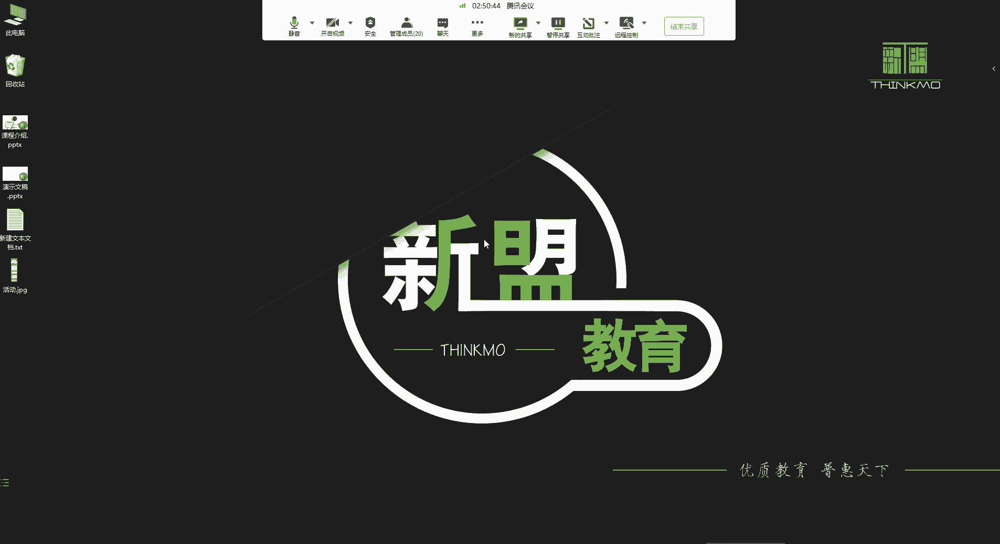

对，机器是不是已经安装好了呀？人生的努力的意义就是为了高调嘛。其实我跟你讲，这很正常啊，就是你要知道这个其实我们这个。生命还是非常短暂的是吧？该高调的时候就得高调，是吧？其实我。

你要是说这个对于我们这个男人来讲，其实就特别不容易。你像我要是平时跟你们聊一些这个题外话题的话，你就比如说。

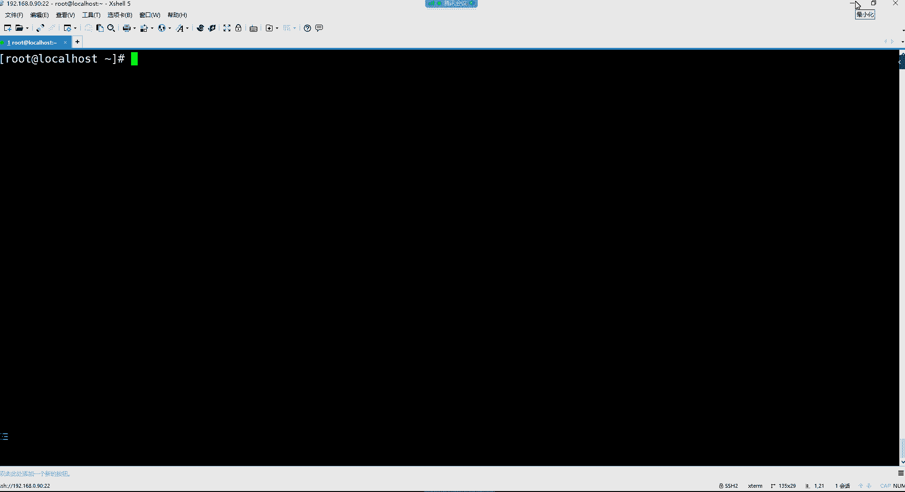

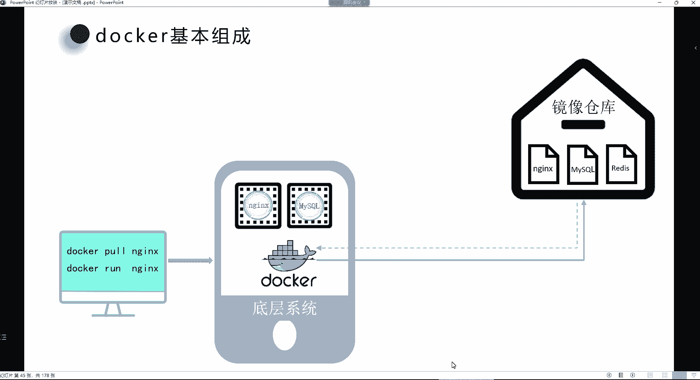

对我们男人来讲。我就跟你们聊一个最感兴趣的话题啥呢？钱。钱这个东西。你就比如说当我们每个人都知道这个钱是个好东西是吧？但是我们这个在追求这个钱的时候，其实你说我们追求的是这个钱的本身吗？其实并不是是吧。

为什么呢？因为钱其实它只是一种什么呢？只是一种工具而已。然后我们通过这个工具，它能够给我们带来什么东西呢？比如说。人际关系。还有呢。就是这个我们的这个亲情，或者说友情，或者说爱情。

包括你的事业以及你的社会地位。还有我们的这个自我。享受等等等等，是不是？其实这才是我们所需要追求的东西。还有什么呢？那些。哇塞女孩儿。啊，这才是我们真正想要追求的，是不是啊，无非不就是这些嘛。

所以我们所以当我们这些人对于钱的欲望。😊，其实。就是对于我们所。不具备的这些东西的一种欲望，包括你喜欢的女孩子，是不是？你想想你没房子，没车子，你狗屁都没有。

连一个正儿八经的工作都没有人家凭什么跟你在一起啊，不就是这么回事吗？😡，你连想都不敢想。😡，有人说，那我有钱又能怎么样是吧？有钱我可能也买不到真正的爱情。但是你再回过头来，你再仔细思考一下呢。

你比如说你比如说你一个月挣3000块钱和你一个月挣3万块钱。😡，你这两个级别。你其实你碰到的女孩子他都不一样，知道吧？你碰到的女孩子不一样，就等于说你遇到的爱情它是不一样的。

你说你一月挣3000跟你月挣3万，你结婚的底气他能一样吗？是吧？你说如果你月挣3万块钱，你找一个月挣3000的。那它是不是得像哈巴狗一样？天天贴着你啊。你说啥就是啥，然后你说今天我累了。😡。

给我打给我打杯洗脚水，给我捏捏脚，给我洗洗脚。😡，是不是他得像哈波狗一样得伺候着你啊。但如果你要1月挣3000，人家一月挣3万呢，你不得像哈波狗一样要伺候人家吗？这不就这么回事吗？

所以我说很大程度上就是你的收入直接是影响你的自偶标准，影响你的什么呢？你的这个。😡，爱情的。是吧所以说钱买不到真正的爱情，但是他能够给你。遇到爱情的底气。没错吧。你也等得起呀。😡，啊。

你说我现在不想结婚，我就不结呗是吧？我想再玩几年，那我也玩得起。但如果你没钱呢？😡，那你发现你就将就了，哎呦这个小姑娘哎呀，行啊，会过日子是吧？什么长得好看不好看的呀，关了灯都一样。

你是不是就容易将就了呀？就等于说你说我明明就很爱吃红烧肉，但是呢我发现自己兜里没那么多钱，我发现这路边的煎饼果子啊也行，能吃饱，是不是啊？这不就是对付了嘛？所以我们说我们努力学习，提升自己。

不就是为了让自己变得更好嘛？是吧？让我们有选择的权利是吧？你搞对象的时候是吧？你这个能够有选择的权利是吧？你想遇到优秀的人，你有等的资本等等等等，不都一样吗？😊，对，就是这么回事。

这就是我们所说为什么我要追追求这个爱情啊，不是为什么我要追求这个钱啊，就这样哈。😊，哎。说多了都是一肚子心酸的。最后的哇塞女孩是吧，那当然了，那哇塞女孩你给不了人家想的生活。

那最终不都变成别人的女朋友了吗？是不是？😊，可以拿钱换爱情了。呃，当然可以了，你要知道你想想。😊，咱别的不说，你说。😡，这个社会上有很多的例子都告诉我们，你比如刘强东跟奶茶妹妹。

你以为你以为奶你以为那奶茶妹妹真喜欢刘强东吗？啊，那刘强东比奶茶妹妹大多少岁呀？你以为奶茶妹妹她不喜欢那些青梅竹马的那些小哥哥们吗？她也喜欢。😡，是不是？你以为那个。你以为那个谁呀。

那个你以为赵本山他的媳妇儿，人家曾经是超模啊，人家超模为啥会喜欢一个糟老头子呀？😡，啊，是因为他缺少父爱吗？那不是啊。是不是人家缺少的是啥？人家缺少的是金钱嘛。😊，所以这。对于我们来讲。

啥才是我们最终想要追求的呀？兄弟们不就是这些东西嘛，是不是就这东西？所以我们人一辈子就得男人是吧，就得奋斗努力嘛。你到年底的时候，你会你你一到年底过年的时候，你会有种感受。😡，什么感受呢？你发现啊。

从小到大没有没有他既没有活成自这个自己父母期待的样子，也没有活成自己喜欢的样子。😡，是吧更没活成别人喜欢的样子。最后呢活成了大家都讨厌的样子是吧？别人看见你都嫌弃你啊，你的父母看见你也嫌弃你。

包括你自己在面对你自己的时候，你发现你也嫌弃你自己，那咋办？😊，那就是努力奋斗呗是吧？我们每个人的幸福都是得靠自己努力奋斗啊。😊，就这么个事儿。哎。但就怕活不成自己喜欢的样子，是不是这就怎么说呢？

没什么意义了。😊，好。哎呀，最最终还是努力奋斗吧，我们还是得学习呀啊学习的话呢。哎呦，我的笔记呢？哎，我这笔记怎么啊？这啊哎这医药其实正常来讲，我们应该讲医药K的。但是EK这个课程我现在还没有背完。

所以我们得把它放一放。我们我我们我是准备在讲完K8S之后，我们再讲这个ELK。这样的话呢呃。EK内容呢我也准备完了。然后还有就是我们在这个讲完ELK之后的话呢，还有一个针对于K8S的这个ELK的日收集。

所正好是能够连贯的去给它学下来。所以咱们先讲这个刀口容器。讲刀口容器。

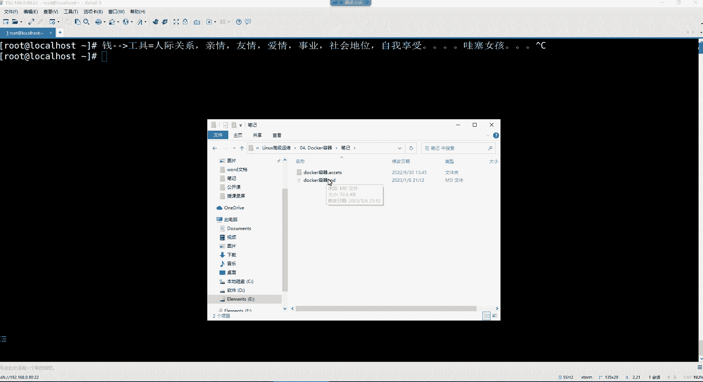

来吧。前面这基本概念就没有什么太多可介绍的了吧。那如果说我们想要去这个。下面还有一个容器的应用场景。容器的应用场景，这里边首先容器非常适合持续集成和持续交付的一个工作流程。

这里边我们前面刚讲完持续集成和持续交付，是不是啊？那它这东西怎么用呢？就是你那开发人员在本地编写代码，并且使用docker，把自己的代码呢给它封装成镜像，然他把这个镜像呢。

可以这个到时候呢给它推送到测试环境。并使用刀刻。封装成。真相。封装成镜像之后呢，再然后接下来呢再把这个镜像。风装镜像。这儿哈。放上镜像，然后最终呢把这个镜像。推送到测试环境。并且执行自动或手动测试。

这步应该能理解吧。就是说在这个如果是在这个容。企业的容器的CSD里面的话，我们就是这样用。这是我们的代宝，我们的代码投稿平台。这是get lab。那开发的话呢，他在推送这个代码的时候注意。

他他可以直接推送自己的源码。把自己的源码推送到这个get lab上边。然后呢，这个源码到get lab之后呢，我们这个jakins服务器。J服务器呢把它这个原码给它拉取到我们的本地来。拉取代码。

这这一步呢就是拉取源码了。拉取源码到我们的jax的本地。好，那把源码拉到本地之后干嘛呀？构建呗，是不是？但是注意。这个构建里边是可以直接干嘛呢？把这个源码给它。通过刀cker。给它构建成。性象文件。

就直接把原码给它通过J个字给它构建成镜像文件了。好，那构建成镜像文件之后，那这个东西干嘛呢？这个东西再拿到。我们公司的这个。测试环境去。对这个镜像里的这些代码或者说程序做一个测试。如果测试没有问题。这。

接下来就可以把这个东西呢给它拿到生产环境去部署了。这位置。测试环境。然后呢，这是。生产环境。20块钱。能理了吧，就最终的话呢，CACD这个过程就是从哪到哪儿叫CAI呢？呃，从。推送代码到拉取代码。

你要对代码做构建，这叫CI。😡，然后呢，把代码发布出去，甭管是发布到测试环境，还是发布到生产环境，这步叫CD。啊，这步都属叫CD了。因为现在生产环境都是以进都是以这种容器的方式去运行他们的程序。

就这么回事儿。这是容器在这个呃CID这个领域哈，它的一个应用场景。所以在这边呢，我也是给大家写了。这部分就是推送到测试环境，然后并执行自动的测试或手动测试。然后如果发现这个镜像里面有问题的话，干嘛呀？

他们在干嘛呢？对这个代码做修复嘛，然后再重新部署呗，是不是？如果你代码有问题，最终你看比如我在测试环境发现代码有问题了咋办？直接把镜像给你打回到你这个，或者说直接把你的这个。把你的这个问题。反回给开发。

然后开发呢再去修改，修改完了以后呢，再去提交，然后再拉取再测试。如果最终没有问题呢，再拿到生产环境去部署。他是这么回事儿。在这儿哈。测试完成以后，再将修补的程序推用到生产环境。啊。

这就像将更新的镜像听用到生产环境一样简单。因为我们最终呢都是把这个镜像给它听用到生产环境的。啊，这就是容器。现在在企业里面一个应用场景。那么对于这个dork的话呢，这里面有很多的这个资源汇总。

包括dork的官方dork的官方博客，dork的官方文档，dork的这个。仓库以及云平台的文档，docker的这个镜像仓库。其实这种这种镜像的文件库。其实这个我们用的并不是很多哈，这玩意儿没啥用。

这东西。呃，像什么do客的云平台文档啊，还有这个这后续有需要的话可以参考一下doker号官方仓库源代码仓库有意义吗？对于我们来讲没什么意义。源代码仓库对于我们来讲，你想你又看不懂，是不是？呃。

发布版本的历史有什么意义吗？好像也没什么意义是吧？常见问题这个可以保留一下，有什么问题后续可以去看一看。远端应用API我们又不搞开发的，我们用这东西用不上。所以最终的话呢对于我们来讲就是这些。

是我们能够这个用得上的这些资源。然后这个下面还有一个问题，就是kerbonnet，我们简称叫K8S，为什么会放进这个docker？呃，放进do克的话呢，这里边呃这个还是要给大家讲一下啊，你们要知道。

有多少兄弟听过KPSS这个技术的，先给我刷个一，没听过的刷2哈。现在哈听过KPSS这个技术的刷也没听过的刷2这个问题。😊，得先给大家讲一讲。听过KPSS吗？都没听过K8啊。😡，啊，有人听过。

几个人听过就一个人听过呀。😡，听过这个词儿是吧，那那这个东西不那这个东西不适合放在放在今天讲了。如果你们没听过这东西，我就不适合这个东西不太适合放在今天讲了啊，为什么呢？

因为你如果你们连KPS都不知道的话，讲这东西没什么意义。😊，我们最后最后再讲，最后讲完KPSS的时候，再说这个东西吧，好吧。然后咱们对这个do刻的版本呢，我们说一下do客版本呢是现在分为两种版本。

第一种呢是。CE的版本叫做community edition，这叫社区版本。社区版本就是免费的。然后呢，还有一个是意义版本，意义版本就是这个收费的。就是它这两个版本就像我们学习那个系统一样。

顺头S就是免费的。然后红包的那个red hat呢就是收费的。就是他们的他们之间的一个区别。知道吧免费版本呢就是所有功能都免费，但是呢没有官方的技术支持，遇到问题自己解决。

收费版本呢就是所有就是几乎是不能说几乎吧就是。功能呢要比免费版本的要多。然后呢，你遇到问题呢，可以找官方去帮你解决，这就是他们真的差异。但是呢你得给钱，人收费的哈。这就是CE和E的一个区别。

那我们学习很显然，我们就用这个免费版本就可以了。其实它的收费版本都是给谁准备的呀？收费版本都是给企业准备的。好多企业都会选择它的收费版本。像这种东西，像这种收，其实像任何的现在这个软件行业。

你不要觉得开源。就。这个非常非常的好啊，你要知道，其实好多好多软件是打着开源的这个幌子，但是呢。开源的版本里面功能非常有限。你想你在企业里面很多需求，在免费版本里面是根本就不提供的。

所以最终你只能无奈的去选择它收费版本。知道吧？就像我们平时你去你下载一个爱奇艺，你下载一个爱奇艺的时候，你发现爱奇艺本身你用的时候肯定是不收费是吧？但是你发现你想看某些。某些这个什么呢？

那些这个什么电影啊，电视剧的时候。😊，他不让你看。你咋办？他得让你充会员是吧？你不充会员人就不让你看，而且你用免费的，你看哪怕你看那些免费的东西，那广告巴拉巴拉一大堆。😡，是不是其实同一个道理。

能理解吧。但是免费对于我们来讲，学习没有广告啊，这这这里面哪有广告啊。😊，我们就就是这个呃学它的一个使用就可以了啊，然后这是它的官方的一个安装文档。那这不是它的官方文档吗？

然后这里边你可以选择这个用安装在什么系统里边。

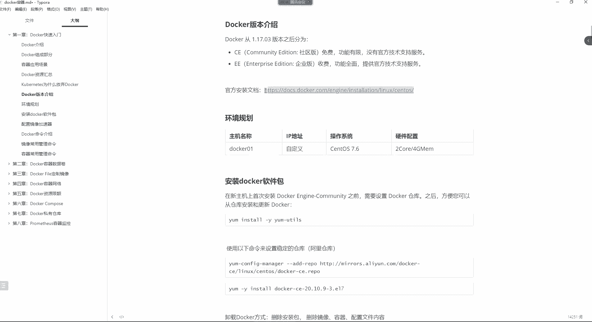

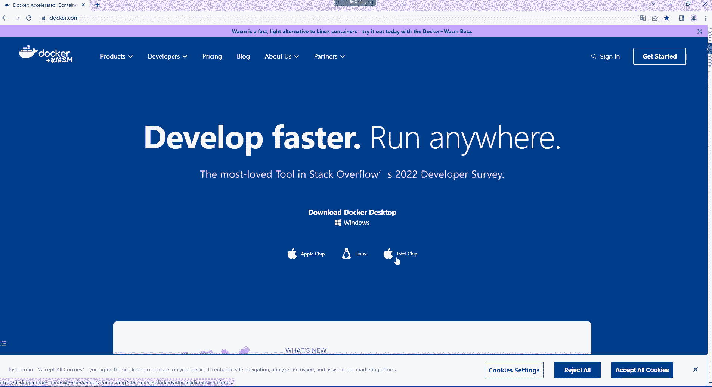

嗯。这是乌班图，得半斐多啊。0是。渗透S呢。诶。这儿docker引擎，然后我们要再安装安装sin头S。好，这是它的文档。这次安装文档哈。😊，然后在它这个安装文档里面嗯。可以看一下，非常简单啊。

就这么几步。但是前面它有一些介绍。😊，呃，他这个介绍是不是我看一下啊。告诉你，现在当前刀客可以安装的版本都有哪些。百度文档下载也手费是吧？没错哈。😊，就这里面告诉你了，圣陶斯7可以用。

然后圣陶斯8的stri版本，就那个滚动版本可以用。然后圣陶斯9的stri版本也可以用。就是你，但是如果你说我有一个s特S6系统呢。四核S6就不能用了呀，它不支持了。😡，看到吗？然后如果我们想安装第一步。

他告诉你，你可以先去y remove移除相关的docker软件包。但这步得建立在你已经安装过的时候，你想卸载，你可以执行这个命令。但是我们压根连安都没安呢，我们这是不是就多余了呀，就不用管了。

然后下边安装安装的话呢，这里边嗯，他给你提供了三种安装方式，看到吗？第一步是什么呢？告诉你，你要去set up docker reposory，就设置一个docker的仓库去安装。第二步是什么呀？

int menuu手动安装。手动安装。那其实就是你。不能通过仓库安装，把它的相关的包给他一一个一个下载下来，然后一个一个通过RPM命令去安装。然后还有一个是什么呢？这个叫ss通通过脚板安装。

反正这三种安装方式。但是这种方式的话呢，是怎么说呢？就是我们如果是安的话。肯定会选择最。简单方便的通过仓库去安装是吧？你用亚么一键安装多省事啊，也是他推荐的嘛，所以他下面就是告诉你。

你怎么去set up设置一个dork的仓库。你设到客仓库这里，他告诉你第一步要安装一个叫做E这个EMUT这么一个包。那我们就把这包来先安装一下呗。

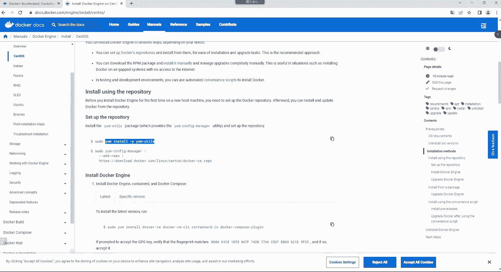

咱们的系统里面，我们先。嗯，改个名吧。Hose name， C L杠。set后 name让它叫docker，行吧。然后退出再重新登录一下。咱们安装的话，今天就差不多了，再讲多讲不了了。😊，改完名之后。

我们安装第一步，先把这包给安装一下。我们不是这个阿里的仓库吗？

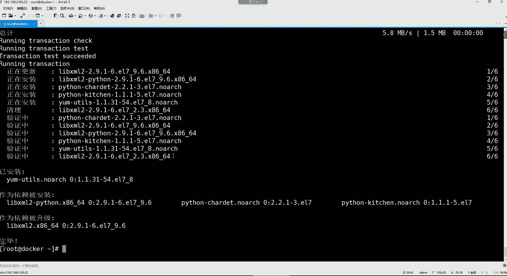

把这包安装完以后，第二步，他告诉你了干嘛呢？你通过ym configurefi manager，就为什么要先安装这么一个包呢？他说告诉你了。

他说这个包这个包帮你提供一个ym configurefi manager这么一个什么呢？一个程序。你通过这个程序可以去set up，设置它的官方仓库。

所以我们后续就可以通过y confi manager去通过杠杠ADDreple把它的官方仓库给它下载下来。它的仓库文件叫做docker杠C点reple。所以你就把这个命令拿过来复制，然后执行。

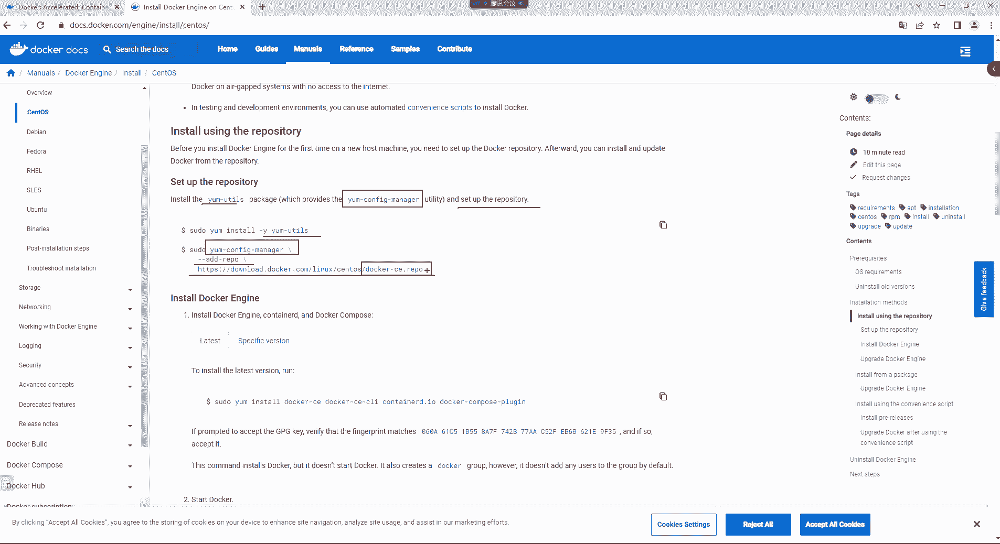

好，完事了。然后来看一下，在我们的ETCEM这 reportD前面是不是有一个叫做doker C点repo的这么一个仓库文件呢？啊，有了这个文件之后，我们就可以安装do号了呀。安装do号非常简单。

它下面告诉你怎么安了。😊。

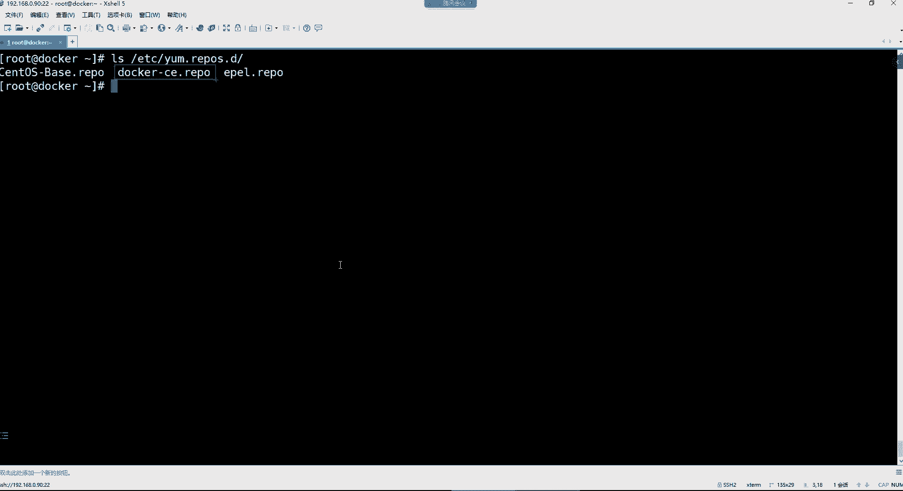

哎，这儿呢哈看到吗？安装这么几个包。😊，那你就把这个包给他拿过来。其实这些有些多，你像什么？其实我们只需要去安装一个dork C就行了。

什么doker C杠CLIcontainerDIOdocker comp plugin这些东西都用不上。😊。

这些东西后续会作为do C的所有的依赖包都自动安装上了。所以我们就直接在这儿。就这样。压我。Insall。Doker杠CE。然后杠外。安就行了，就安照这一个包就行。然后他们依赖呢都会自动安装。

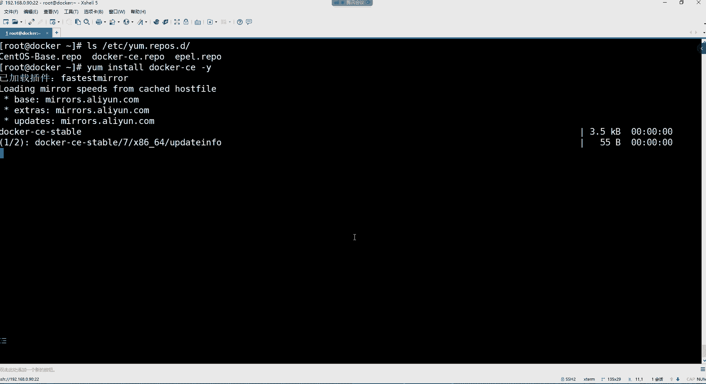

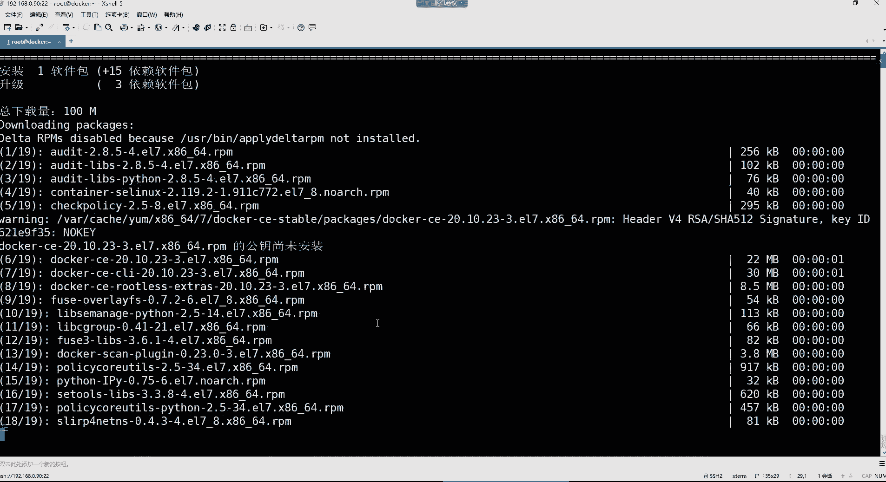

你看是不是看到有什么do客杠C杠CUI呀，是不是有这个依赖？然后我安装的大盒版本是20。10。23的。还有什么呢？嗯，还有什么cont地点IO是不是都看到了呀？😮。

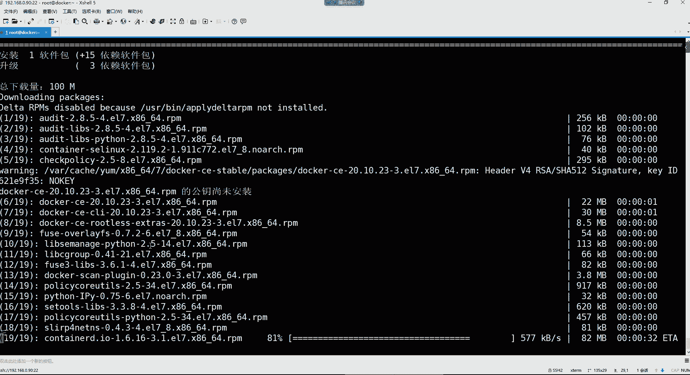

是不是container地点I呦是不是都作为它的依赖，自动帮你安装上了呀，还有什么呃do杠compos plugin。😊。

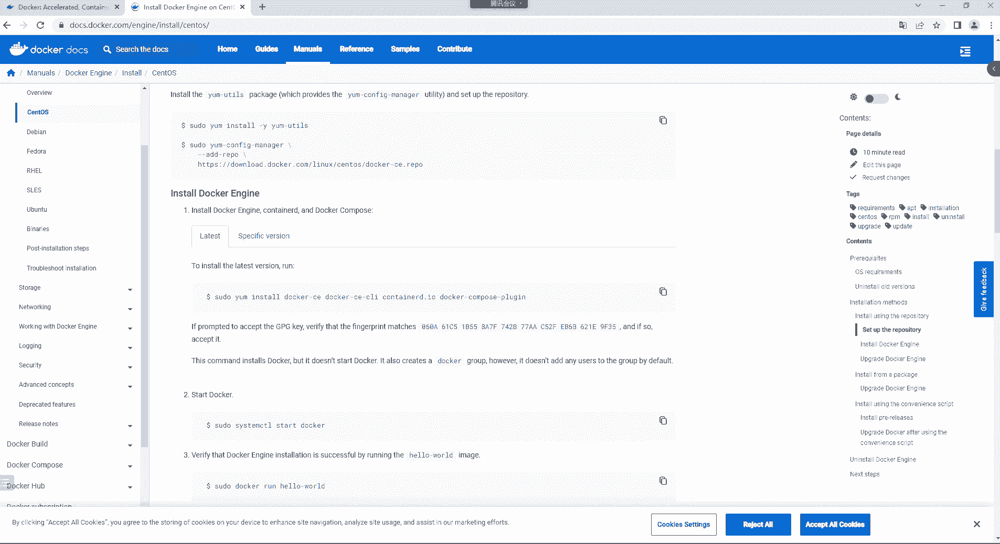

一会儿都会自动帮你安装上的。是不是是不是有那个呀？拉根但不是杠C的是吧，但是。一会儿肯定会有的。所以你按装一个doC就可以了。所以这个安装的话，跟我笔记里面不太一样哈。你看我笔记里面怎么安的。

我笔记里边第一步也是安装了它的这个依赖包。然后呢，但是我用的仓库是阿里仓库，所以我是通过亚 confi managerage添加的是。😊。

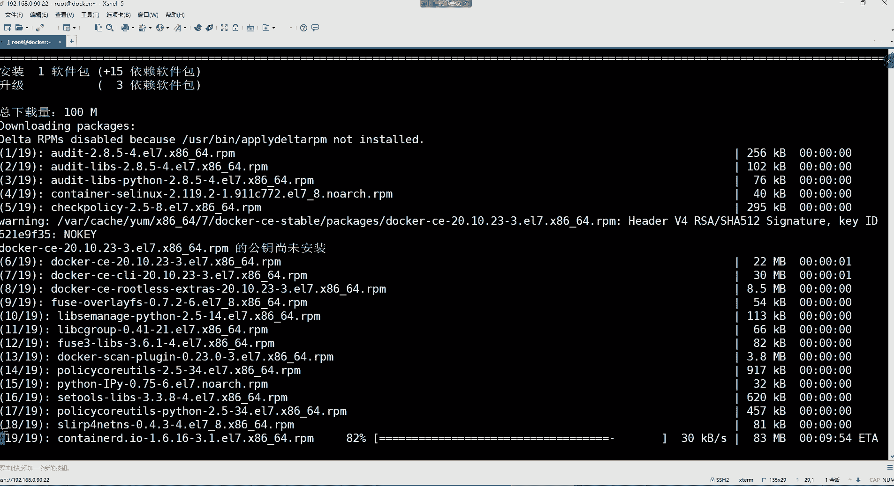

Mirrors阿里云的一个docker C的一个仓库，然后通过阿里云的那个仓库安装到docker。只不过就是从阿里云下载速度会稍微快一点呗。然后后续卸载的话呢，就是通过y目 remove幕把刀和C卸掉。

再把它的这个工作目录给它删掉就可以了。

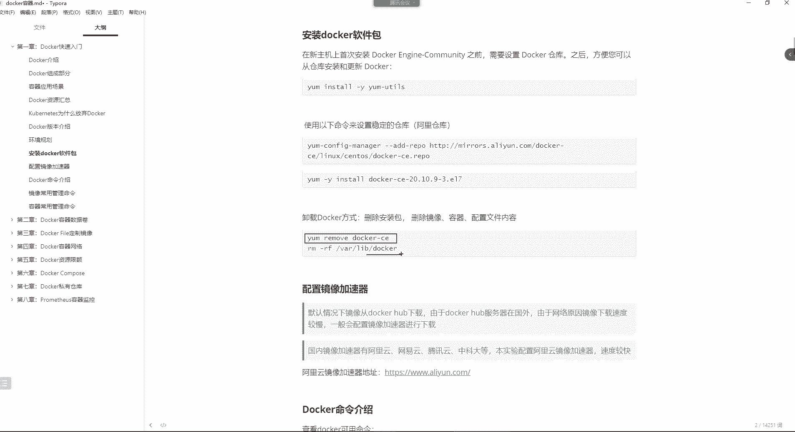

这就直接把刀给它卸掉了。这是do的安装。

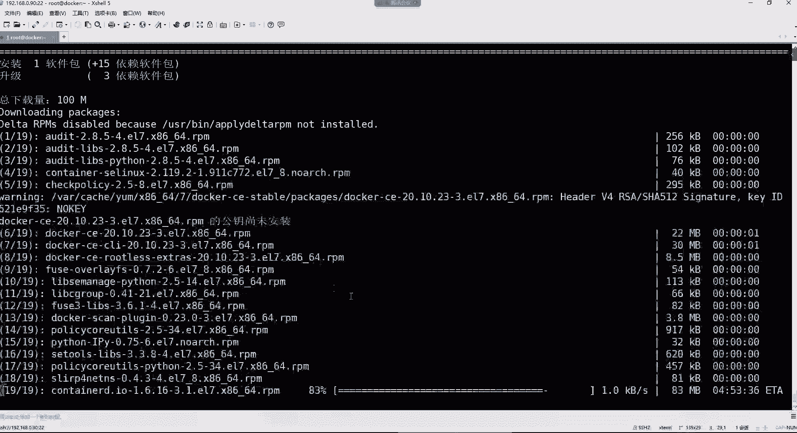

这么慢呢是吧？咱们今天也就是这样了，也就是安装完docker以后就差不多了。😊。

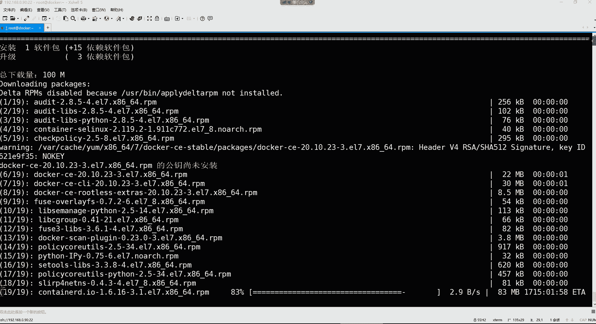

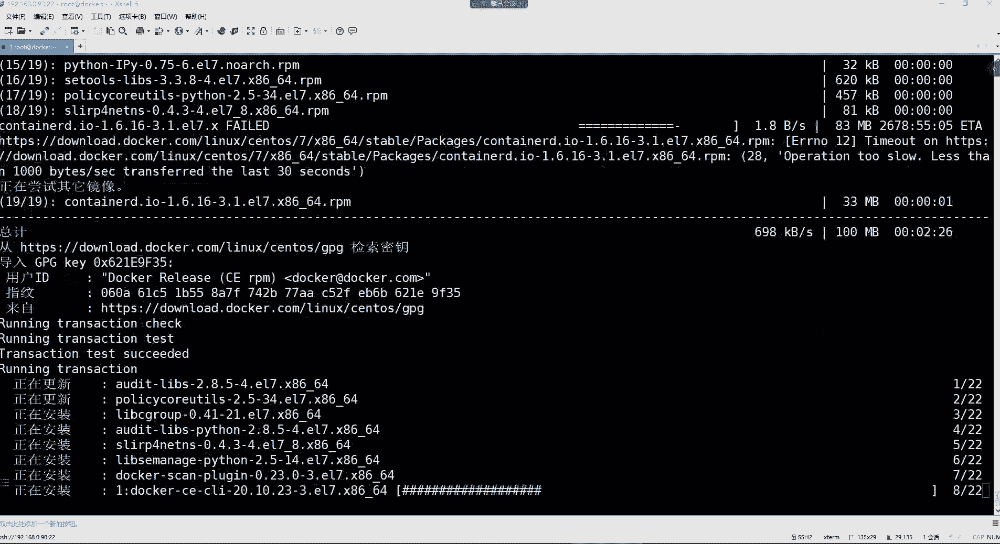

好，完事儿安装完了吧。安装完了之后，我们接来要干嘛呢？

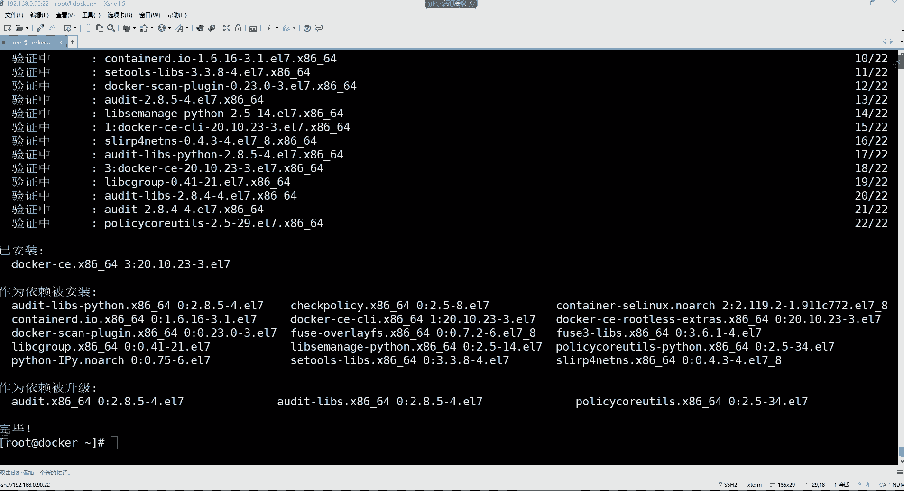

进下来哈这文档就用不上了，因为这文档就是安装文档哈，要针对不同系统的安装文档用不上了，关掉吧。😊。

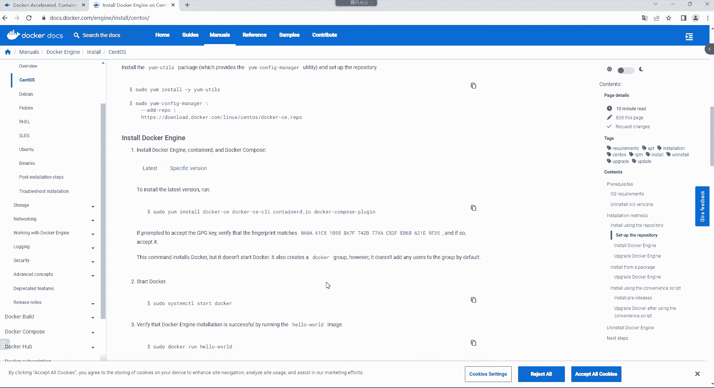

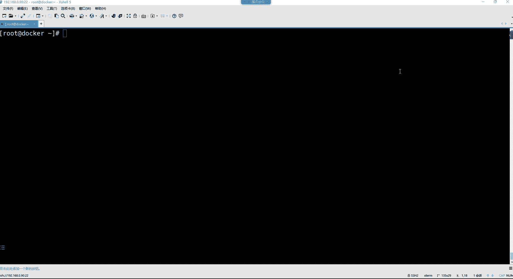

安装完了之后，我们接下来要嗯。把这一步配了吧，配完之后，咱们再去这个剩下内容就留在下节课讲吧，配个加速器。为什么要配合加速器呢？首先你要知道我们默认情况下，我们下载镜像的时候，就在我们这个图里边。

我们想用docker，最终要干嘛下载镜像。😊，在这儿在。在这儿。啊，我们想要去使用容器，前提是得需要镜像文件。没有镜像文件的话。那你就没有办法去使用那个容器了。好，那么镜像从哪下载呢？

镜像默认情况下从单括号边。从docker这个官方仓库去下载，而这个官方仓库的服务器又放在国外，所以你下载速度就非常非常的慢呢？所以咋办呢？我们一般就搞个加速器，这加速器其实可有可无的，不是必须的。

你你们知道吗？就是我们如果真的是下载的镜像非常多，而且频率比较频繁的话，而且也会用到那些官方仓库的话，你就搞个加速器，如果用不上的话，这步可以不做，不是必须的啊。所以如果我们配加速器的话呢。

我们可以用国内的什么阿里的网易的腾讯的，这里面我就用阿里云就行了。😊，登录到阿里云上边。登录。然后控制台。在控制台里边。直接在这搜搜什么呢？叫做。容器镜像。然后下面看到有荣心降服了吗？

在这哈点进来点进来之后，这里有什么制品中心，制品中心这里边。😊，我们并没有用过。因为这种东西我们运维一一般用不上，在镜像工具里边有一个镜镜的镜像加速器的，看到吧？这个我们用得上哈。

选择好我们对应的系统s托S。😊，看到这地址了吗？每个账号都有一个地址。你们的账号跟我们的地址你们的账号也有一个自己的地址，跟我们的地址都不一样的哈。然后这地址怎么用呢？下边他已经告诉你了。😊。

你只要把这一堆命令拿过来。

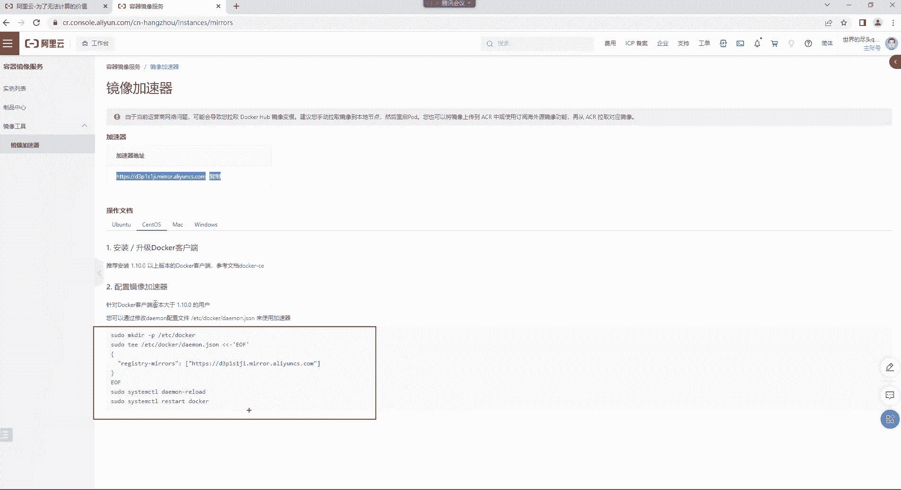

复制。来到你的机器里面执行一下就可以了。就实这这命令是什么呢？就是帮你创建一个目录。然后呢，在这个目录下面呢，帮你去创建一个叫demer点这次的文件。然后接下来接下来呢，把这个仓库的地址看到吗？

仓库的地址。😊，就是你的那个仓库地址，这个地址就跟我们这个这个地址是完全一样的。然后呢，这个地址最终给你放写入到这个文件里面了。因为它是一个jason格式嘛，写进来之后呢。

帮我们把这个demerreload的重新启动一下。demerreload就是呃。😊，针对于我们这个s system controll管理的所有的系统服务的配置文件做了一个重新加载。

当然也就包括这个文件了，就重新加载了一下这个文件，让我们这个系统能够识别这个文件。然后接下来又把给它启动起来了。那这时候我们就只需要干嘛呢？

只需要去看一下这个文件ETC下的demer点jason是不是就有一行jason的字符串啊，这里面就是你的仓库地址。然后接下来呢你看下do有没有起来。tus docker是不是变成runing的了呀。

这就可以了。但是我们得让它变成随意子喜啊。😊，Enable。

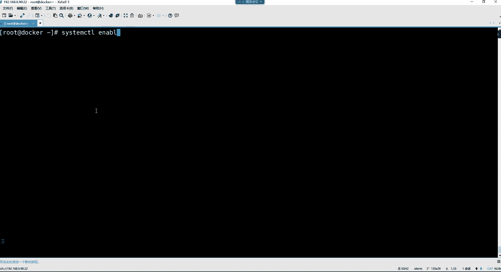

Doer。这样就可以了。好，那下节课咱们开始学习docker的命令。好吧，各位。咱们今天呢就是对docker的一个基本的概念，以及docker的安装以及镜像加速器的配置。我们给它准备完了以后。

下节课没有理论了啊。如果卸载了，到时候重新安装，那加速器还用重新配置吗？呃。你把刀盒卸了，他的目录也没了，所以得重新配。

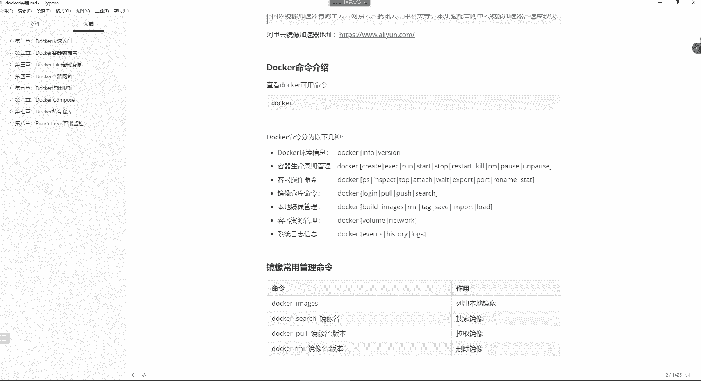

反正你就看看那个文件在不在吧，反正你把刀上卸了，那文件可定就没了。到时候如果没了，就重新再配一下，无所谓，这种东西不是什么重要的内容。😡，嗯。好了，今天就这么多，行吗，各位。😊。

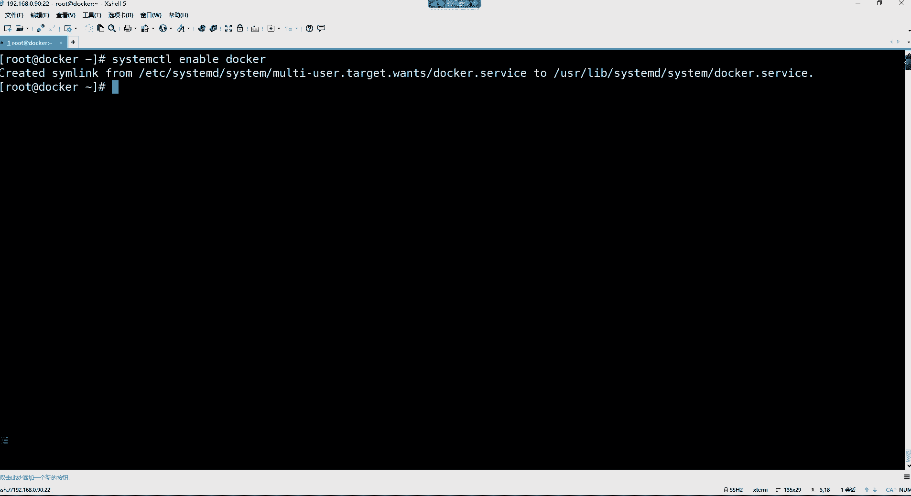