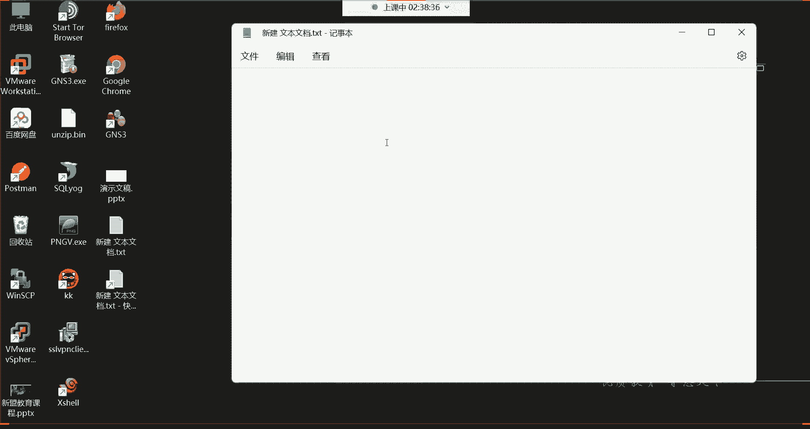
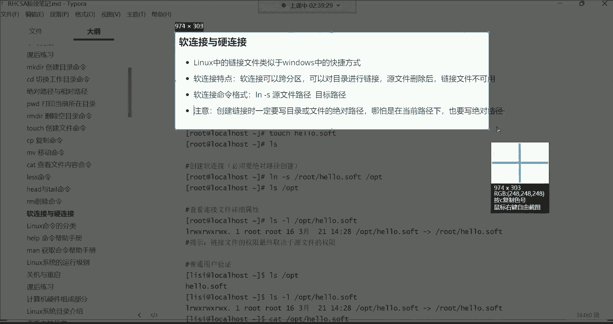
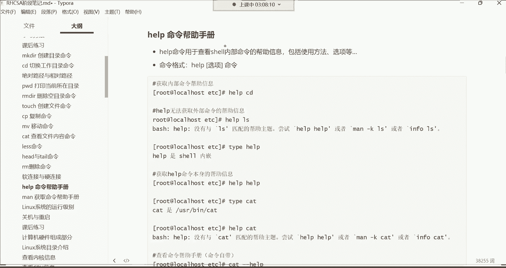

# 零基础入门Linux，红帽认证全套教程！Linux运维工程师的升职加薪宝典！RHCSA+RHCE+中级运维+云计算课程大合集！ - P9：红帽RHCSA-9.软链接与硬连接、获取命令帮助、系统运行级别、关机与重启 - 广厦千万- - BV1ns4y1r7A2

hello hello hello都回来了吗？😊，呃，回来的话刷波一，我们继续发车。好。接下来呢我们来讲讲这个软链接与这个硬链接哈呃什么叫软链接？什么叫硬链接？我们前边呢在给大家讲基本概念的时候。

我们涉及了一个什么呢？啊，不是基本概念是。在讲这个阿拉斯命令的时候，我们在讲这个。这儿哈叫辨别目录与文件方法的时候，这里面有一个什么呢？叫做浅蓝色的链接文件。啊。

那这个链接文件就是我接下来要给大家讲解的啊，这个软链接跟硬链接了。那什么是链接文件？我相信你们现在心里已经清楚了，就是windows里的快捷方式，是不是啊？那在windows里面。

我们想创建一个快捷方式，这非常的简单，右击。

啊，然后更多选项。比如说这里面一个叫创建快捷方式。好，那这个快捷方式就出来了。那快捷方式的特点是什么呢？就这两个文件之间，比如说我往这个语言文件注意哈。😊。

这个是不是它的原文件，这个是不是我们基于原文件创建的链接呀？好，那我现在往原文件里面给我写句话啊，你好。😊。

然后呢，保存。OK然后我们看看这个链接文件。

哎，你看也同步了是吧？好，那我往链接文件里边。😊，再写句话嗯，林女是。

然后保存。好，那再看原文件。哎，你发现也同步了是不是啊？啊，所以这就是所谓的什么呢？所谓的。😊，快捷方式啊，只不过我们叫链接文件而已啊，特点是什么？要相互同步，是不是？哎，只要你文件里面有的。

我这个呢也给你同步过来。然后你那个文件里面有的呢，我也同步过来。好，那了解了这个它的特点了。那接下来。

我们来说一说在linux下边这个链接文件啊，软链接语硬链接啊，这有一些区别，一软一硬是吧？

好，那咱们呢先干嘛呢？咱们先说说这个。软连接。在linux系统当中，链接文件就类似于windows的快捷方式。那软链接的特点是什么呀？软链接可以跨分区啊，什么叫跨分区？

呃，就是。不同分区之间啊，比如说我有一个文件，这个文件呢我是在我的电脑里边的哪个分区呢？啊，在我的C盘，比如说哈在C盘。😊。

比如说这个文件呢，我给它放到我的C盘里边，给它拖到这个C盘。好。看到这儿，然后呢。我再把他的这个快捷方式放到哪儿，放到我的E盘。啊，随便拖啊，拖到这个E盘里边。啊，可以。嗯，这叫什么呀？

这个就叫做跨分区了。知道吧就是这原文件跟它的那个什么呢？跟它的那个链接文件并没有在同一个分区里边啊，是在不同的分区的，这就叫做跨分区。😊，OK能听懂是吧？而软链接呢是可以实现这种跨分区的啊。

我给你删掉哈，给它删掉，没有用。😊，算了。windows里边也给它删掉，没有用。

就是给你们演示一下效果。OK这就叫做跨分区。

因为这种很常见的数据备份嘛，是不是？你比如说我我你比如说我们在做数据备份的时候，那windows，比如说我想把我C盘里的一些数据，一些重要数据备份到我的其他的盘里边，这是不是很常见的事情啊？

啊，所以说这win这个linux4里边的也一样啊。如果说你想做一些数据的备份与同步的话，那这个。

软链接呢是可以帮你实现这个功能的啊，跨分区啊去做一个什么呢？做一个软链接。

啊，这是第一个。第二个呢可以对目录进行链接，就是那个文件夹哈，也可以让你去创建这一个链接。其实这就很好理解了。你看我们现在在根下边看的这些。😊，浅蓝色的这不都是文件夹吗？不都是目录吗？

是吧啊目录也可以进行链接。给目录来一个快捷方式啊，那特点是什么？原文件删除以后，链接文件不可用。原文件删了以后，链接文件不能用。

就实这个很好理解哈，因为它毕竟是一个快捷方式。😊，这是快捷方式哈，真正对应的语文件是帮我们带来功能的。你看拿这个火狐浏览器来讲。😊。

你想想，如果我直接把这个。f focus啊这个应用程序文件，如果我给它删掉的话，那我问一下你们，你们觉得这个快捷方式它还有意义吗？肯定没有意义了，是不是？因为你原文件删了嘛。😡。

而且而原文件是真正给我们带来功能的这个程序文件。是不是？所以说你比如你一删链接文件就失效了哈，就无用了啊，这是软链接特点。那怎么创建这种软链接呢？

软接我们就非常的简单命令格式用LN杠S。这个命令去创建。我们打开OPT看一下。我们把OPT给它清空一下啊，OPT下的星好，删除OPT下的所有OPT清空了。接下来呢我们在自己的加目录啊，我们不在自己的呃。

我们进到OPT吧CD到OPT然后呢。再看一下别的目录啊，然后再拿这个media目录看一下。迷两目录。把medium目录也给它清空一下。星O。看一下media目录。好，也没了。好。

那现在我在OPT建个文件，touch一个hello点儿。sofft啊就是软的意思。呃，那这个文件创建好了之后呢。😊，我们来按照这个格式去创建哈，看LN杠杠S先指定原文件，原文件hello点儿sofft。

好，给它链接到哪里呢？给它链接到根下的。mediaium目录取OK链接过去哈，然后阿拉斯看这个med目录。呃，不是，是名字哈，随便取的啊，hello点oft随便取的。不是格式。Yeah。好。

那现在你们来看。你们来看哈。嗯，这个。文件呢？他就是。不太一样啊，我们阿拉斯杠L看media下的。media下的这个hello点soft，你发现它是一直在闪闪闪是吧？这个闪是什么意思呢？

这个闪我前面就讲过说是链接文件不可用。链接文件不可用。不能用失效了。或者说是有故障的文件。那原因是什么？原因呢？原因在下边这有个注意啊。就是我们在创建链接的时候，一定要写它的一个绝对路径。

不管是目录还是文件，都要写绝对路径。哪怕你在当前路径也要写它的绝对路径。你看我刚刚在创建的时候，我LN杠S。直接以当前路径就指定了这个文件名，然后给它链接到media目录是吧？

但是我并没有指定它的绝对路径。并没有指定OPT。是吧因为它在OPT下面嘛，我并没有指定它的绝对路径，所以就会导致这种链接文件不可用的一个。问题。那对于这种情况，那这个你就得给它删掉了，没什么用了。

删掉media。下边的那个什么呢hello点so。然后我再把这个文件给你们删吧，这。可能说你们我们改个名吧，MV要把hello点oft干嘛呢？给它改成叫。Hello， soft。不加点。

不然你们会觉得这是一个扩展名是吧？啊语原路径改名。啊就是改个名。把这个路径下的文件还是放在这个路径啊，只不过名字叫hello点ofhelloof。打开。

那现在呢我在LN杠S指定OPT下的helloof链接到。Media。这个目录回车，这时候再打开media。哎，这就没有任何问题了，看到了吗？这个颜色就对了，浅蓝色了是吧？链接文件。哎。

这是没有任何问题的。O。好。

啊，链接文件不可用。昨天没听课是吧？呃。昨天讲的时候呢，这里面有一个叫做辨别目录与文件的方法，这里面有一个叫红色闪动文件啊，表示链接文件不可用，看到了吗？刚刚我们看的不就是闪了，是不是啊？

那就是你的这个链接文件创建的不对啊，所以它才会一直闪闪闪。在这儿。

好了，那比较简单是吧，这种软链接。然后对于这个软链接的特点呢，就是以后我往这个它的原文件里边，就往这个hellooft这个原文件里面写内容的话，那链接文件也会同步啊，我往链接文件里面写内容。

原文件呢也会同步。O。是这么回事。然后对于这个链接的权限的话呢，我再给大家啊简单的说一下什么权限呢？我们阿拉4杠L看这个hello点sofft它的权限。是这样一个权限，死有者能读能写。所属组呢是只读。

其他人也是只读。啊，总共是9个权限位是吧？啊，最左侧这三个是所有者的权限，中间这三个是所出组的权限，右边这三个是其他人的权限啊，分别是对应的是这个嗯我们系统里面的这个不同类型的用户的一个权限。啊。

这是原文件。我们再看那个链接文件，LS杠L看。media下边的那个。链接文件，你看它的权限跟原文件不一样。搜者。读写执行。是吧。所有组呢读写执行。啊，其他人呢读写执行，也就是说。对于这个链接文件来讲。

你看他这个。权限好像有些大，那也是这个文件在系统当，任何用户都能够对它进行什么呢？里边的内容，比如进行增删改查，没有任何问题的。因为权限在这摆着呢嘛，读写执行。但是你们。

不要去被这个链接文件的权限所迷惑。为什么呢？因为最终啊这个链接文件的权限是还是要什么呢？要参考原文件的。参考原文件原文件是什么权限？那链接文件它真正的权限。就是原文件的权限。啊，所以这个大家知道一下。

好。行，这是针对于权限的一个解释哈。然后以后呢，他的。特点就是什么呢？就是只要是我把内容写到这个hellooft这个原文件里面了，那这个谁呢？那那那个那个链接文件也同步。

你看我给你们来个操作哈CP我把ETC下的。FStable这个文件里的内容干嘛，我给他。拷贝到我当前的这个hellooft。这个文件里面去。是否覆盖Y。啊，这时候呢我们再看。

hello点of这里边就有内容了，看到了吗？是不是这里面是不是有数据了呀？好，这里面有数据以后，那这个时候我们再看。😊，media下边的那个什么呢那个链接文件。啊，用ca看哎。

你发现是不是也同步过去了呀？没错，就同步过去了哈。😊，所以那以后我再把内容写到链接文件里面呢。😡，那他的那个原文件也同步啊，因为他们是一个相互同步的机制。好，那下边咱们验证这个功能，哪个功能呢？

原文件删了。啊，我们如果把语言文件删掉以后，看看这个链接文件到底还能不能用。那第一。我们语言文件是这个RM杠2F把helloof删掉。回车。没了。好，那再看。media，你发现这个文件又不对了。

看它的详细信息杠L。你看又开闪了是吧。对，又有问题了，失效了。链接文件不可用了，就是。为什么呢？因为什么呀？因为语言文件没了。😡，原文件被你给删了。能列吧。但是对于这种对于这种。软链接它的特点。

那你要是把这个链接删掉，原文件是不会受到影响的，知道吧？原文件是不会受到影响的。你比如我们再演示一下，咱们再把这个给它删掉，把media下的这个给它删掉哈。然后呢，我们再的OPT再touch一个。

Hello， soft。好，创建好了之后呢，LN杠SOPT下的hellooft链接到。眯掉小边。O。然后链接过去以后呢。我们还是拷贝把比如说。ETC下的。

渗透S releasease这个文件里的内容拷贝到。OPT下的hellooft文件里面要不要覆盖Y这个所谓的覆盖，就是把原先的文件里的内容给它拷贝过来。好，那现在。

我们可以看到这个文件里边ca OPT下的。对hellooft这里边有一行是不是啊？这么们系统的版本。那接下来呢我们就再cate。media下边那个helloof是不是也同步过去了呀？好。

那现在我把这个链接文件给它删掉。我把media下面这个链接给它删掉，我们看看原言文件会受影响吗？media下的那个hello soft。没了啊，再看me。目录没了吧，空了，但是我的原文件。

不会受到任何的影响的。看里边还是有这个数据。能列吧，所以说你看他都对里，你不能删原文件，删原文件链接就失效。但你链接删掉以后，原文件不不受影响。

这很好理解，就等于说你如果把这个快捷方式删掉以后，那是不是原原文件不会受到影响啊？

啊，就是。软链接还有对目录进行链接。比如说我现在有一个文件夹啊，我也希望干嘛呢？创建个链接makeDR创建一个test目录。然后呢，我LN杠S指定OPT下的test链接到。media目录看 media。

啊，也一样。一样哈。那以后比如说我进到这个test这个目录里边，比如说我建个文件，建一个什么呢？呃，hello。好，那这时候那泰斯目录多个hello，那你再看那个。media目录他也读个什么呢？

太色里边。哎，他也多个hello。这都是相互同步。O。然后跨分区啊，跨分区的话呢，这个给大家演示一下，我先敲悄命令啊，DF杠H。这是看我们当前系统当中的一个分区啊，不不这样看，就这样看。

啊看在我这个系统当中啊，你看现在有两个分区，一个是SDEDA1，一个是SDA2啊，这两个分区。而这两个分区呢分别呃SDA2呢是呃是被根分区所使用的一个空间。SDAE呢是被boot这个目录所使用的一个。

空间也就是说你看啊我们现在根目录下边的所有数据。跟目录下面搜出据。当然。抛去这个bo目录以外。抛去bo以外，用的都是什么呢？SDA2这个分区去存储的数据。然后这个bo目录是用什么呢？

是用SDA一这个分区存储的数据。那如果说我现在想干嘛呀？我现在想把我根目录下边的某一个文件给它链接到bo目录，这就等于说跨了分区了。就等于说我这把SDA2的分区里的文件给它放到SDA一这个分区里面。

看看可不可以，这就是所谓的跨分区。啊，那现在我们就来演示一下。拿什么来说呢？还是拿这个helloLN杠SOPT下的hello链。嗯。CD别点啊，先退回去。last啊。

就这样LN杠SOPT下的helloof链接到根下的bo回车。然后看那个不同目录。打开不同目录。看了，没有任何问题，是不是啊？这有个叫hellooft啊，给它链接过来了。OK啊，这是软链接特点，是不是啊？

你看都给你们演示了，怎么跨分区，怎么对目录进行链接，原文件删除以后，链接文件就不能用了啊，以及命种格式注意事项完了说清楚以后呢，那紧接着我们就得来说说硬链接啊，它不太一样。😊。

这个硬链接呀。你看它首先跟软跟软链接完全相反，硬链接不能跨分区。诶。软链你可以跨是吧？好，那硬链接也不能对目录进行链接，而软链接可以。还有原文件删除以后，链接文件仍然可用，而软链接不行。

软链接原文件一删，链接文件不能用了。嘿，你看它们俩完全就是相反的。哎，那这个时候。你说我这个硬链接特点是什么呀？反正都是相互同步啊，数据会给你同步的那这时候我们再建个文件，我们toash一个hello。

号的。硬的意思。那现在呢我要对它创建一个硬链接，那我现在就LN命令格式，你看LN没有那个杠S了原文件路径目标路径。那LNOPT下的。hello浩的。给它链接到。

我先给他链接到马上给他先给他链接他跟一下他不同目录。先跨分区看看回车。直接就告诉你了。😡，无效的跨设备链接就是不允许你跨设备，不允许你跨分区，是不是啊不可以跨分区吧？那第二个不可以对目录进行链接。

那现在比如说我LN，我想把泰斯目录。是。OPT下的太词目录链接到。哪里呢？MT。那告诉你了，不允许将硬链接指向目录。啊，这第二个也不行是吧？第3个。原文件删除链接仍然可用。那现在咱们创建一个正常的。

我现在LN指定把OPT下的hello heart的这个文件链接到media下边。哎，这个成功了，pl拉打开media回车。你发现不一样。怎么不一样呢？软链接硬看LN杠SOPT下的。Hello。

soft连接到media目录。打开迷带葫录。你看软链接，首先颜色是不一样的。硬链接呢你发现。这怎么颜色跟普通文件没什么区别？是不是啊你看它的原文件。😡，就是一个普通文件嘛，在这儿呢吗？😡。

是不是原文件啊，这是做的链接文件一样。真的没什么区别。😡，而且你看啊我现在再给你们来来个操作。不亮。我呢再把这个原文件里边呢增加点内容。我CP我再把那个ETC下的。后，hot name这个文件。

给它拷贝到我当前的那个hello哈的这个文件里边。啊，输入Y啊，看这个hello how这个文件。你看这里面就有我当前的主机名了，是吧？好，那硬链接那个文件呢？😊，肯定是肯定是同步过去了。

直接cutmedia下边的那个。Hello， hard的。你看同步过去了吧。好，那现在我把原文件删掉，我们现在删原文件，看看链接文件会不会失效RM杠。F删除hello heart原文件删了。好了。

原文件被我给删了吧。好，那再看谁呢？再看media下边的那个链接文件，你发现哎仍然可以正常去打开的。是不是？这没有任何问题。那你说这硬链接。这他干的事儿是什么事儿啊？啊，可以改名可以改名哈。我跟你讲哈。

这硬链接就等于说你是对这个文件做了一个这个操作CP。放批。而且是保持属性不变的。把OPT下的那个。Hello。号的这文件给他放到了哪呢？mediadia下面。这就是硬连接，就等于说你干的是这个事儿。

知道吧。因为硬链接在。什么呢？就是它在进行链接的时候，它也是保持属性不变的给你链接过去的。这个就原文件是什么属性，链接文件仍然是什么属性，属性不变。但是他跟这个CP杠P。拷贝的操作还是略有一些差别。

那真正具体的差别就是你这种拷贝它不会相互同步。你比如说现在。这是一个文件，我要把这个文件干嘛？通过CP命令来拷贝到。另外一个位置啊，就等于说对他做了一个一模一样的备份，是不是啊？好。

那不会相互同步是什么意思呢？比如说我后期这文件里面又增加了一些内容。又增加了一些内容哈，那这个备份文件是不会自动给它同步过来的。而这种硬链接呢，虽然说也是类似于这种拷贝操作。哎，把这文件干嘛呢？

给你再来一个副本啊，放到其他的路径。但是硬链接就是只要是你的原文件里边增加数据了，哎，我也干嘛呀，我也给你自动同步到我的这个链接文件里面去。是这么回事，所以上边的这个就属于CP。杠P拷贝。

而下边这个呢就是。LN硬链接，然后它有一个同步的机制啊，是这么回事。能听懂吗？那听懂的给我刷个一，听不懂的刷个2。没有问题是吧？这就是软硬链接啊，王先生没听懂是吧？没听懂，多听两遍吧。没听懂。

多听两遍啊，哪里不懂，自己去多自己去实。你把这个你不懂的地方呢，你去实践一下。你自己看到效果，你就懂了。但是我觉得这种东西没有啥不好理解的。你你唯一不好理解的，你可能会说你说老师我为什么会需要这种链接？

😡，嗯，这这可能是你们所所迷惑的地方。为什么会需要这种链接？就是因为。呃，在windows里边它需要快捷方式。而linux里面呢，它需要链接。啊，它的本质是一样的。对备份啊，实时备份，相互同步实时备份。

就是就是这意思。这就所谓的硬面接。嗯。好。那。接下来呢呃软链接跟硬链接我们说清楚了，是不是啊啊，说清楚了之后呢，我们下边。

这个位置呢就大家需要了解的了哈。😊，嗯。那linux的 mini分类，还有帮助手册运行级别。这些呢是需要了解的。呃，不需要你着重去掌握的。呃，包括命令分类，简单的了解一下就行。在linux这个系统下边。

命令呢分为内部命令和这个外部命令。什么叫内部命令呢？就是我们这个有一个叫bittch解释器。自带的一些基本的管理命令。啊，就是我们常见的啊当然非常少哈，可以说是非常非常的少，这你都不用去管它。😊。

然后还有一个叫外部命呢，就是有这个我我们这个自己额外安装的。啊，其实我觉得这这个位置完全大家没有必要去研究它哈，为什么呢？因为这个。一点意义都没有。一点意义都没有哈。一点意义都没有。因为什么呢？

因为你甭管是什么命令，最终呢。我们都得去学习它啊，都得通过他去管理这个系统，是不是啊，所以你没有必要去研究什么内部与外部了，而且这个内部命令非常非常的少，大多数都是什么呢？都是那些。外部命令啊。

像我们前面学的，我给你们讲解了什么LS。LStouch CPMV kit这些都属于外部命令。外部的这外部密令怎么来的呢？就是。😡，那个葛怒啊葛怒那个组织，人家不是软件基金会吗？就是我们平时用的这些面令。

都是葛度组织他们研发出来的。所以你像我第一天给大家讲的时候，我就说为什么linux这个全名叫做gnu后边再加一个linux呢？那是因为。linux斯只是一个系统的核心。呃，它只是一个系统的核心而已。

那一个系统你想想那它的组成部分非常的多，这玩意就你怎么去理解这句话呢？这玩意就像一个汽车一样。😡，你像一个完整的汽车，它光有发动机可以吗？😡，那也就是说这光一个计算机，它光有一个内核可以吗？它不可以。

😡，是不是？哎，所以说李纳斯这个人他研究出来的就类似于这个汽车里的最重要的一个部位。发动机。😡，啊，就计算机的一个内核。知道吧？但是你想想那你一个汽车的外围的一些部件，你什么这个什么玻璃呀，什么这个。

😡，什么各种设施，周边的什么设施哈等等等等哎。你这么去理解吧，90%都是葛怒组织的。所以李纳斯他搞一个就类似于搞一个搞了一个发动机，是不是啊？然后呢，他就想干嘛呢？

他就想把这个呃让别人可能说不知道梗斗组织啊，所以后来人家就说哎呀，你说。😡，你就搞你就研究一个系统内核。但是呢你说你这个内核之上，你90%的东西都是我研究出来的。😡，那怎么办呢？那你得加上我的名字。😡。

所以这叫葛怒斯。而我们现在用的大部分命令都是格诺这个组织研究出来的。😡，能理解吧。这么回事儿。好，所以说你甭管什么内部命令还是外部命令，总之。咱们学就完事了，是不是啊？所以刚刚那一部分呢。

你没有必要去管它。那下面这一步呢也是大家作为了解的，叫做命令帮助手册。这个帮助手册是干什么用的呢？帮助手册就是看哈。我们在系统当中呢呃有有的时候呢可能会。比如说我前面给大家讲解的这么多命令。

可能你们会纳闷儿，你说老师怎么就知道这个命令会有这些选项啊，是吧？比如说像前前面这个L这条命令啊。怎么就知道有这么多选项呢？每就是。每一个命令它都有自己的一个文档啊，叫做这个帮助文档。因为什么呢？

因为这个命令来讲，它研究出来以后啊，比人想学习它这条命令的使用。你得看他的什么呢？他的帮助手册。所以说呢在这个系统里面就有很多的帮助手册啊，可以帮我们去干嘛去查这个命令的帮助。

那其中help呢用的是最少的。最少的用于查看呃，像一些什么呢？就是极为少数的命令的一个办路。当然我这里面写的一个叫内部命令是吧？你不用管什么内部外部。你比如说我现在在我先切换到自己的家哈。

你比如我我现在在用LS的时候，我发现啊这个LS命令我。😊。

嗯。我想看看他具体的。功能都有哪些？你可以这样。Help。奥莱莱斯。回撤，你发现哎。他并没有给你显示他的帮助是吧？为什么呢？他说你可以尝试这个什么呢？用什么慢。啊。

或者infoL对慢杠KL或者infoL。但是最好用的是什么呢？叫做。大部分命令都有一个自己的一个什么呢一个帮助手册，叫杠杠。Harper。这是一个常选项。注意哈，这是一个命令的常选项。

这个长选项可以帮你打开它的一个帮助手册。所以回车。哎，这时候你看哈。他就给你什么呢？显示出来了，就是对于这个LS这条命令。首先它的用法啊LS，然后选项文件看到了吗？然后具体是干什么用的。

然后下边啊以及我这条命令支持的选项什么杠A杠B杠C看到了吗？杠D之类的。哎，这就是你那包括杠A，我相信你们应该都认识了吧。我们前面讲过叫不隐藏任何一点开始的项目，就就是把隐藏的内容也给你显示出来，是吧？

你看这个。下边。这个时候就是对LS这个命令呢，它的一个完整的帮助了。看了吗？非常多，你发现啊L这个命令它选项这么多呀。没错，他选项非常多，他恨不得就是把这个26个英文字母。都变成这条命令的选项。

但是呢选项虽然多，我们常用的呢也不可能说全都用得上。啊，这就是命令本身的帮助手册。还有你看这个爱莱斯命令属于哪个组织啊，属于葛怒组织的，是不是？好。唉。这就是命令本身会自带一些帮助文档。

你比如说我们前前面学的那个k杠杠 however。这就是把ca的这个什么呢帮助信息给我们列出来了，告诉你这个命令，它的用法啊，以及它的选项。其中有个杠N。是吧对输出的所有行进行一个编号。看到了吧？

还有像前面学的touch杠杠。However。对，这就是什么？这叫命令的帮助啊命令帮助。但是有的时候在企业当中呢，这个可企业服务器不是中文系统，是英文系统，企业服务器啊，所以你们是不会看到这些中文的。

在企业服务器里面。都是英文的。所以如果你的英文不好，你发现这个帮助对于你来讲其实也没什么太大的意义。

是吧还有什么呢？还有像那个。😊，除了这个hel以外，我们说这个杠杠 help吧。补个杠杠哈，要命令帮助手册。刚来号。我补个杠杠。用于查看。系统中。命令的帮助信息，包括使用方法、命令格式。命令。

然后呢杠杠海。下面就就记这个杠杠号不就可以，知道吧？O。好，然后下边呢。这儿还有一个慢。这个慢慢的话呢，它也是用来查看系统当中命令的帮助信息的。包括什么使用方法呀，但是慢的会更加详细一些。

看慢会给你举一些例子，就是这条命令啊怎么用啊，给你举个例子。

你可以这样用，就是比欧慢LS。看到了吗？哎，这个信息呢比刚刚获取的还要什么的还要多，包括什么命令的选项。然后下边。你发现这就看不懂了吧，是不是？这几乎就看不明白了哈。

是不是你看这这个内容比前面那个呃杠杠号获取的还要多一些，是不是？😊，对那边。那这个L拉4这里面并没有给大家举一些什么例子。如果有的话呢，他就呃告诉你了，这里面并没有什么例子哈。

只是告诉你这个命令的大部分选项啊，每个选项具体的功能，你看这种选项啊，具体呢这是它帮你完成的功能我告诉你这个杠H的选项啊，它定的长选项是这个长选项，其实每个短选项都会对应一个长选项知道吧？

对你用短选项也行，用长选项也行，只不过长选项不太适合我们去记忆嘛。😊，好，比如杠I，你看杠I它的长选项就是杠杠I node。显示i don号。所以说对于这种帮助的话呢。除了这个还有什么。

还有这个像什么info之类的哈。😊。

这个。音付都不用说了，那已经是一个非常。啊，算是老掉牙的一种帮助了，怎么玩的呢？

叫infoL也行。看了吗？这里面它给你显示出来的就不是这个命令的具体的什么选项啊，极其少啊，它显示的选项包括命令的用法非常的少。主要是显示这个比如说这个I机定命令嗯。

它的一个比如说呃是属于哪一个组织研发的，然后以及当前它的版本是多少版本的，啊，反正呢它不太适合去看命令的帮助，知道吧？这是早期的时候哈非常非常古老的一个帮助信息了，所以你都不用去管它。

所以如果你们真想获取帮助的话呢。

你可以选择使用这种什么呢？使用这个man，也可以选择使用这个杠 help。但是杠ha。相对来讲用的偏多一些。相对来讲偏多一些哈，但是我也不太建议大家再去这样看，为什么呢？因为。

英文的大部分看不懂。你就比如说拿L这个命令来说。

我觉得你有那功夫，你还不如去百度百度了。😡，是吧。你比如说啊L莱S。这个命令啊我记不太清了。嗯，然后那这时候你还不如你说你去百度搜一搜LS命令用法。或者说LS。常用的选项。功能。哎，这时候你看看。

这百度里面给你找到的东西，那应该是比较是符合我们中国人的一个什么呢一个这个学习的方法。当然透彻了呀。透彻哈，你看如果你去百度的话，你发现这就。包括短选项以及对应的长选项。呃。

你看这里边是不是比你自己去获取帮助要强的多呀？没错吧。你去看看吧，你看几个常用的选项。啊，你去百度去搜，这里边都是是不是？啊，所以我觉得你如果想获取一个命令的帮助的话，你还不如自己去百度了。

所以为什么说这个位置是大家注意了解即可呢？因为你大多数你都看不懂。而且老外你像这种东西是老外写的这些东西。

嗯，其实大多数不太适合人类去理解的。不适合人类去理解哈。

所以这个对于命令的帮助呢，我建议建议大家呢就是能百度就百度啊。别看他本本身的官方的解释，毕竟太官方了。不适合我们去理解。啊，然后这个对慢的有一些快捷操作，这个快捷操作我前面都讲过了，什么时候讲的呢？

在讲lessice的时候讲过。😊，因为慢。你用慢去获取一个命令的帮助的话。他就是等于用lesss帮你打开了那个帮助手册。知吧。好了，然后下面还有关于这个系统的运行级别啊，运行级别的话呢。

这个给大家说一说哈这个运行级别有7个啊，对于我们这个系统来讲，有7个运行级别。😊。

这7个运行级别不需要我们做任何的改动哈。然后我们说说这个不同的运行级别，然后呢，它主要的应用场景不太一样。然后那lin这个系统它的默认是在一个标准的级别上边。那哪个是标准级别的？我们先来说啊，第一个。

零级别零级别就是所有的进程都被终止，机器呢有序的停止，然后关机时。系统就是零级别，也就是说零级别就是你的系统关机的。知道吧。哼呵有会关机了。😊，所以说我们机器如果一关机，它就处于这个零级别了。然后嗯。

那一级别呢叫单用户模式。这个锁的单用户模式啊，后面给你们一个通俗的解释啊，就是。管理员呢在进行系统维护的时候。你可以把你的系统改成这种叫单用户模式。因为一旦变成单用户模式了。什么叫单呢？😡。

就只有超级管理员才能登录系统。别的账号都无法登录。知道吧？而且系统里所有的服务也都处于一个什么呢？关闭状态。那怎么切换呢？

这个命令。叫INIT。这哈。叫切换系统的运行级别啊INIT这个N就跟上具体的数字就可以了。那接下来呢那我们来演示一下。

比如我现在想切换成这个一级别。INIT空格一回撤。那现在我这个系统就属于一级别。那我的终端就掉了，你们看我这个终端现在已经已经不好用了哈。😡，为什么呢？呃，因为所有的程序注意哈。

一级别是系统里所有的服务都关闭了。包括我们远程连接的时候，有一个叫SSHD的这个程序，它也是处于一个关闭状态。那如果这个程序一关闭，我们就没有办法通过这种工具去远程连接这个系统。所以我的终端就掉退出了。

那这是怎么办呢？这时候你必须得通过你的机器去登录了，看到了吗？哎，通过真机这样才能够登录。这时候呢输入。啊，这只这时候你只需要输入密码就行了，默认就是以root的身份再什么呢？再登录。

因为单用户嘛普通账号是无法登录的，所以这时候输入一回车啊，你看我现在就上来了。

能看清楚吧？看这是不是root现在登录在这个系统当中呢啊，那别的账号现在是无法登录的。

好，那你说我怎么知道现在这个级别就是一这个一级别的单用户模式呢？还有一条命令叫做。

叫run level。run level是查看。当前系统的运行级别的。所以我们来敲一下这条命令。

，在这瞧。ron。拉我回车。那你看我我们当前的级别。

这个位置哈三空格一，哎，这是什么意思呢？这个三就是你。这个系统。钢材的级别是三级别。然后呢，这个一呢就是现在的级别是一级别，就代表是从三级别又切换到了一级别，知道吧？OK。

那接下来我们再来说这个二级别，二级别叫多用户模式。那多用户模式呢正常来讲就允许呃不同的用户来登录系统了。我们切换一下。然后就INIT空格2回车。啊，那这时候呢你看你就可以正常输入用谁登录了啊。

我用root登录用户名。密码回车，而单用户模式呢，你是没有办法去指定用户的，只能用root。不然它就不叫单用户了。而多用户呢，你看啊你可以指定我到底用谁登录是吧？啊，那这时候你看这个单用户模式呢。

这种多用户模式呢。这个系统是处于一个叫半正常的状态。什么叫半正常呢？就是。网络文件系统NFS这个东西呢。并没有启动。什么叫NFS这个网络文件系统，就是类似于windows那个。网上邻居似的啊。

他是一个做数据共享的。啊，做数据共享的哈。O。那这时候我们再敲一个。Rg。来，我会车，那你看我现在就又变成三级别了是吧？啊，从一级别切换到了这个三级别OK那这时候呢我就可以远程连接了，为什么呢？

因为它除了NFS以外，那别的程序都是正常启动的，所以这时候我又可以远程登录了root一。

密码回车啊，清个屏。那这些时候我就可以又通过远程终端去操控它。

好了，那我们再来说这个三级别啊，叫完全多用户模式，它也有这种NFS的功能。这个NFS我们后边也会讲。到底干什么用的？好了，然后他这种的话呢嗯。就属于我们的一个标准的运雄级别了。但是呢是命令行模式的。

注意哈，什么叫命令行模式啊？就是没有图形化界面的一个模式。

就这样的模式叫做就叫做命令行模式，看到了吗？没有图形化界面。没有图形界面。那还有一个标准级别是五级别啊，但四级别并没有被使用哈。那五级别的话呢是。

登录后啊进入一个带GUI的图形化界面。这个五级别也是一个标准的级别。那我们来切换一下，看能切换过去吗？INIT空格。看这边能不能看到图形。

能看到图形吗？你发现唉，这也没有图形啊，为什么呢？因为我们在安装系统的时候，你没有。安装带图形化的系统是不是啊？所以如果说。你在安装系统的时候，你的系统不带图形，你切换也没用。能理解吧，切换也无法切换。

那如果你在安我们在安装系统的时候，哎，我这个系统有图形。那你是可以切换成图形界面的。啊是这么回事。但是呢甭管是三还是5，都是属于叫标准的运行级别。能理解吧？那还有一个运行级别6叫正常系统正常关闭并重启。

其实这就是重启。重启系统啊，那个时候呢就属于六级别。但是我们说说那默认情况下，我们这个系统处于哪一个级别呀？默认情况下呀。😡。

啊，默认情况下，我们。呃，打开一个文件。啊，打开一个文件，哪个文件呢？

嗯，有一个这个叫ETC下的。eit table文件，这就是系统运行级别的一个文件。

啊，我们啊不行ca哈，我们没有学过VMKETC下的INIT table。这个文件回车打开打开以后呢，在这里边。😊，我来给大家解释解释啊，这里面我笔记里面写了。😊。

你就看这两行就行了。

我们系统呢它永远会处于一个标准的运行级别。啊，在这两个。这两个都属于标准的运行级别，要么就是三，要么呢就是五级别。啊，这都属于标准的运行级别。那默认是哪个级别啊，到底是三还是5啊？呃。

如果说我们安装系统的时候，并没有安装图形化界面的那默认肯定是三级别。如果你是安装了图形化界面的，那默认就是五级别，但是呢哪种都可以。知道吧。你可以通过这条命令去看一下。叫做什么叫做。

这个叫system control，ge default。拿过来复制粘贴回车。三级别看到了吗？我们当前系统默认是属于这个。三级别一模一样的。看到了吧。三级别哈。这是什么呢？这叫或ge，就是查看的意思啊。

查看default是默认的意思，查看默认级别，默认就是3。那后期想设置的话呢，可以通过这条命令去设置。设置哈。但是你我们现在设置没用，为什么呢？因为我们现在如果你想设置的话，我们没有图形是吧？

那这个是五级别图形级别。但是呢你设置也没用，你没有图形化。设置也没用，那就候你再看的话呢，你看这个运行级别就变成五级别了，是不是五级别了。但是你没有图形，你设置成五级别也没有任何的意义。啊。

你说我这样给他设置回来呢？啊，那就把这个级别换成三的这个单词就行了。Ctrol W。删掉然，放上来OK现在又变成再看一下。获取一下啊，现在又变成。这个三级别。能列吧三级点。

所以说这个运行级别呢我们不需要做任何的改动，你只需要知道就行。

OK然后下边呢还有一个这个关机与重启。那这个比较简单，通过命令行的方式呢，我们怎么关机啊，怎么重启。那关机的命令来看一下哈，你发现这关机命令怎么这么多呢？没错啊，init0。

首先就是把我们的运行级别给它改成0，咱们系统就关机了。第二个呢啊这个命令也可以立刻关机啊，像s down也可以立刻关机。而沙档呢你后边嗯你如果指定十啊。😊，杠M10。嗯，这样杠H10就是10分钟后关机。

但是呢我们对于这个。关机的话呢，我们喜欢用这个叫power off啊power off。所以我这里面给你们这个写了啊，就记这个记这个哈。嗯，这个笔记能共享吗？共享啊当然共享了呀。

这笔记我不都传给你们了吗？但是我今天还会把笔记再更新一下，因为我们删了一些没有标的东西。😡，所以到时候呢我再把笔页重新更新一下。在百在我们的课程的网盘里边哈，在链接里边。然后这个重启的话呢。

你们就记这个rebootreboot。😊，重启机器。O。下边呢就只需要了解即可哈，你不需要去记它。

好，啊这是关机与重启。那我现在如果想关机的话，我就这样。他给我回车啊，终端就掉了。终端一掉的话，那机器这边就开始关机。

哎，关了看到了吗？是不是哼又关机了。OK然后这就是我们今天给大家讲解的这些基础点。嗯，从这儿开始啊，这周得好好练习了，是不是？因为你看我们这个命令。这些入门的时候必备的常用的管理命令。

那这个你你们得掌握。然后在这里边我跟你讲哈。这一部分是你们只需要了解的内容。只需要了解的内容哈了解即可。然后。别的内容呢像命令啊，什么对目录的管理啊，文件的管理啊，然后这个也是作为了解的。啊。

只需要知道就行，不需要去掌握它。那，剩下呢就。得多多练习了。多多练习吧哈。O。没关系哈，这种东西不需要去特别熟练的给它记住，就先用到哪儿啊。复习就可以了。好了，那录屏呢我们就停掉了。

然后你们看看有没有什么问题啊，有问题的话，大家可以发出来，OK吧。😊。

