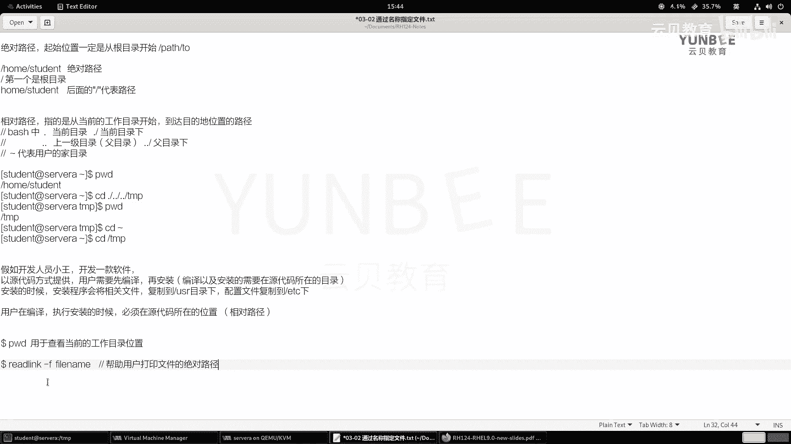
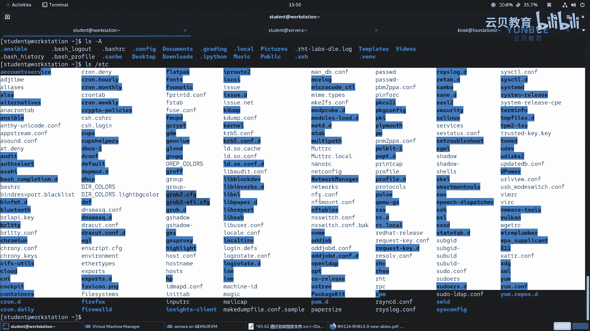
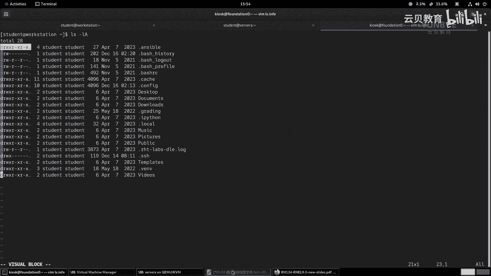

# 零基础入门Linux，红帽认证全套教程！RHCE9认证实战 RH124课程 - P10：03.2 通过名称指定文件 - 云贝教育 - BV1Ns2gY8EVU

好，那么接着呢我们来学习第二节。那么通过名称来指定文件啊。OK那么在正式的开之前呢，我们先看一张图片啊，先一张图片。那么这张图片的话呢是介绍了那如何呢去描述我们的这个文件浏览器的视图啊。

那么左边的这张图的话呢，一般是啊我们在设计啊桌面版的这种linux啊这个操作系统的时候呢，那么打开啊我们的这个文件啊，就fis这样一个文件浏览器的时候呢，那么所呈现的视图啊。

那这个图片呢一般在你像特别是在早期的real6啊，real7的时候呢，那么这个目录结构呢非常的明显啊。那现在的话呢啊它的这个视图呢，可能没有像我们图片上的这种啊逻辑更加的清晰啊。

但是呢依旧不呃依旧那个什么呢？依旧啊能够体现出来。比如说我们的这个啊你看我们的这个啊。那么现在新的re19呢，它的这个目录结构呢，最上面是导航栏啊是导航栏。然后呢呃下面呢是我们的啊根目录里面的资料啊。

一个资料。然后呢，我们可以进去去浏览啊，这这样一个结构OK那么早期的时候呢，导航栏在左边啊，左边啊，然后依次呢去展开啊。那那么大家可以回顾一下我们的windows的啊操作系统。那么在浏览文件的时候呢。

可以在左侧的导航栏进行一个筛选啊。OK那么右边的这种视图的话呢，一般出现在哪里呢？出现在我们在这个做设计的时候。哎，设计的时候，就说我们就类似于什么要画这个拓扑啊之类的时候啊。

那么我们一般是自上而下的这种视图啊，然后你像我们第一啊第一章对吧？第一小节啊，第一小节里面给大家介绍我们linux的文件系统目录数结构的时候，那么其实那个图片啊，就是右边的这张图O好，那么这两张图片呢。

无论是哪种方法呢，都能够清晰的来描述啊，我们的这个整个啊目录数的结构啊，以及视图啊。好，那么呃接下来呢我们给大家介绍一下什么是绝对路径和相对路径啊。那么所谓绝对路径呢指的是一个完全限定的名称。

OK就意味着那么你说的这个位置呢，肯定是在整个文件系统当中是绝对的是唯一的啊是唯一的。那么如何呢去表达呢？那么它的最明显的特点呢？就是。我们的绝对路径啊一定是从根目录开始的。OK好，那么。啊。

一定是从开始根开始的啊，那么绝对路径。那么他的啊最啊起始位置。啊，一定啊是这个从啊根目录。开始的那就是什么结构呢？就是这种啊哎 pass啊to什么呀啊，其他的位置啊这样一个结构啊。那么举个例子啊。

比如说我们写一个home下面的student，那么这个路径呢就是一个绝对路径。啊，绝对路径。那么注意了，那这里面的第一个啊斜杠，那么第一个。那么是根目录。那么后面的啊后面的这个斜杠啊，后面的。

那这个斜杠代表的是路径的意思啊。啊，代表是路径OK这个地方大家呢要啊知道OK。那么另外一种呢，路径的话呢，我们称之为是相对路径啊相对路径。那么所谓相对路径呢指的是相对于当前用户所在的工作目录。啊。

工作目录啊，然后呢啊产生了一条路径。那么举个例子，那么我们现在呀在哪里呢？我们通过PWD命令呢？可以看到我们当前所在的位置啊，是在home studentdent目录当中。

那么假如说呢我通过啊CD命令呢是可以切换我们所在的位置的。那么CD到哪里呢？我想CD到跟目录下的tamp跟目录下tamp。那么相对，那么既然跟那么我首先是在home下的sdent，对吧？

我要想去啊tamp，我们就把自己呢啊比喻成一个小人啊，然后呢，这里的路径啊就是一个什么呀？一个地图啊，一个地图，那么我现在呢想从这个home下的student这个位置呢，来到跟目录下的tamp。

okK那么我们的路径呢就是先啊这个从home啊，从这个slink位置呢来到home下面。然后从home下面呢，再来到哪里根目录，再从根目录呢来到哪里呢？来到这个tamp目录。

那么所以说呢是首先啊CD到哪里呢？CD的homehome的话呢，相对于我们当前的位置而言是上一级目录。那么上一级目录呢，我们可以使用b shell里面的两个句点来表示。OK那么起点呢是当前位置。

当前位置呢在我们的be shell里面是一个句点啊，一个句点啊，当前目录的。啊，上一级啊上一集呢是哪里的？是home了吧？啊，home了啊，home了home接着home的上一级。是根啊根末下的TMP。

我们来看看位置对不对。哎，往然后呢走个PWD。哎，那么我们就来到了太谱了。OK好，那么我们回到原来的加目录当中，还有一种方法呢，就是CD直接跟上一个路径。那么这种方法呢就是一个什么呀？绝对路径了啊。

前面是相对路径。

好，我们把这个笔记呢来记一下啊。那么相对路径。啊，相对路径好，我写在上面吧，写在这里。好，相对路径啊，那么指的是。啊，指的是从当前的位置开始，当前啊从当前的工作目录开始啊，然后呢到达什么呀？到达。

到达门目的地。目的地啊，位置的一个路径。OK那么在我们的这个里面啊，那么在getch shell当中。啊，那么第二斜杠啊代表的是。啊，点代表是当前位置啊，当前的目录。那么点斜杠呢就是当前的目录下。

OK那么除此之外，还有什么呀？两个据点。啊，代表的是上一级目录。也叫父目录。O。啊，也叫父母录。那么那么两个据点加上一个斜项代表的是。什么呀？父目录下对吧？哎，父目录下。OK那么这样的话呢。

我们就能够很容易理解了啊。那么这里的波浪号呢代表的是用户的加目录。啊，加目录。OK那么这里呢给大家描述了两种路径的表达方式。那么需要我们注意的是，那么无论是绝对路径，还有相对路径呢。

既然出现了这两种的名称，那么都是有实际性的作用的啊，没有说啊绝对路径好还是相对路径好。那么我们给大家举个例子。那么假如说。假如啊那么假如呢我们有一个开发人员小王。啊。

小王okK那么小王的话呢开发了一款软件。那么这个软件呢，它是以源代码的方式来提供的。那么用户呢要想去使用，那么用户啊那么需要先干嘛呀？需要先去啊配置啊，用户需要先。啊，编译啊再安装。啊，在安装。

那么在编译和安装的时候呢，在编译啊以及安装的时候呢，需要。在什么呀？源代码。所在的目录。OK那么安装的时候呢安装的时候呢，那么我们的安装程序。啊，会将这个相关的。文件啊，然后呢复制到哪里呢？

复制到USR目录当中啊，目录下啊，那么配置文件啊，它的配置文件呢会复制到哪里呢？会复制到我们的根的太TETC下。那么这个时候那么那么这个小王啊，那么这个小王呢在设计的时候呢，就应该干嘛呀？定义用户。

那么或者说我们在用的时候吧，对吧？那么就意味着那么用户在编译啊，还有执行什么呀，安装的时候。必须在哪里呀？必须在这个源代码。源代码。所在的位置为什么呀？因为它在编译和安装的时候，那么它会。

找到当前目录下的一些源代码信息。那么用到就是什么呀？相对路径。那么最终在安装的时候，那么它要分散在根目录下的不同位置呀。因为安装的时候，他没有办法去验证用户到底在哪里。但是呢为了保证安装之后。

任何用户安装呢都能够正常执行。因此，它的安装的路径呢一定要走什么呀？绝对路径。OK这是给大家举了一个简单的小例子啊。好，那么在使用导航的时候呢，我们有三个命令啊。

PWD呢我们前面呢已经给大家啊介绍过了啊，那么PWD呢，那么用于。啊，查看啊当前的。啊，当前的啊工作目录位置。OK那么顺便呢给大家介绍一个命令，叫read link。啊，杠F后面跟上一个文件的名称。

OK那么这个命令呢可以帮助我们干嘛呀？帮助用户啊帮助用户呢打印啊打印文件的绝对。路径。

OK那么给大家举个例子。那么比如说呢我们就在t里面啊，我们L一下，那这里的文件蛮多的那么比如说我们这个以IHD为例，那么走一个read link。杠F2HT。啊，那么你会发现他会把这个绝路径打印出来。

那么如果是一个目录呢，也可以的啊。比如说我们就想看一看啊这个这个目录它的一个路径。那么他会把目录的绝对路径呢打印出来。OK这个呢大家呢可以下去呢使用一用啊，这个我觉得用的频率蛮高的啊蛮高的一个命令。

好好，那么接着呢第二个命令是什么呢？我们是PPT上面的第二个命令啊叫做CDCD呢其实就是change directory的英文缩写。

CD啊，用来更改啊工作目录。啊，工作目录啊，那么用法很简单啊，CD呢后面直接跟上什么呀？你要切换的目录呢就可以了啊，无论是相对路径还是绝对路径。那么在使用的时候呢，有一个小技巧啊。

那么就是第一个呢就是什么呀？就是这个CD波浪号代表的是切换。到啊自己啊自己的家目录。那么其中这里的波浪号。可以干嘛呀？可以省略。OK可以省略不写，为什么呢？因为你在CD的时候呢，如果没有指定路径。

那么对于啊这个命令而言，他就不知道去哪里了。那么不去不知道去哪里。那么最好的办法就是回到家里面。啊，回到家里面，所以说CD啊直接执行呢就相当于回到了加目录啊。然后还有呢就是一个命令呢。

叫什么CD短的横线。那么代表的是啊这个切换到什么呀？上一次啊访问的目录啊，或者最近一次访问的目录都可以。啊，一个短的横线啊短的横线O。好，然后呢接着我们来详细的说一下这个I。

那么L的话呢是用于啊打印啊我们这个文目录下文件的列表。那么我们啊是用来列出啊okK。列出啊目录下什么呀啊的文件。

那你可以直接执行，不需要不需要加任何的选项，那么就能够执行。那么除此之外啊，那么除此之外呢，我们在使用这个L命令的时候呀，我们还有一些其他的选项啊，我这里呢去杠杠help一下，我们来看一看啊。

那么这里有一个非常非常重要的选项给大家介绍介绍。比如说A。那么A的话呢，代表的是打印啊打印我们所有的目录下的内容，包括以句点开头的。

杠A啊，打印所有的文件。啊，所有的文件啊，包括。OK以谁呀？以句点开头的文件。好，那么句点开头是干嘛用的呢？注意了，那么在我们的linkux当中。当中，那么隐藏的文件啊隐藏的文件都是以据点开头的。

啊，开头的OK那么我们这个左边的终端啊，我们来走一个命令L一下。那么你可以看到这里呢有几个目录，对吧？我们加个选项杠A。你会发现啊这里就增加了一些额外的内容了。比如说我们的当前目录的符号。

OK上一节目录的符号OK还有一些隐藏的目录，比如说这里的dear enible啊，dear batchsh historyory dar batchsh log out dearear batchsh profile。

等等啊。那么这些文件呢之所以隐藏起来的目的呢是为了什么呀？保护这些目录啊。那么一般来说啊，那么这些目录都是比较重要的。

文件是吧比较重要。哎，不希望啊不希望啊用户呢这个啊。这个什么呀，这个就是比较容易的去管理啊，这个容易要加上引号啊。对吧比如说我们误操作呀之类的。那么这是我们说的这个LA啊杠A啊，那么还有一个选项呢。

叫什么呢？叫大写字母A。

那么大写字母A和小写字母A呢是一样的效果，但是不同在于它不会列出一个句点和两个句点的符号，也就是说它不会打印。当前目录和副目录的这样一个符号。啊，这是它的区别啊区别OK这是大写字母A啊。

啊，和谁呀和。我们的杠A类似，但是呢但是不打印谁呀，不打印我们一个据点啊和我们的两个据点。啊，和两个据点OK。嗯，然后继续往下我们来看一下啊，那么找一找啊，找一找D。

那么D的话呢代表的是只查看目录本身啊，因为L命令默认情况下呢是查看目录下的文件啊，文件。所以说呢如果我们只想看目录的话呢，可以使用D。

啊，目录。那么我们举个例子啊举个例子，比如说我在我在这里啊，我走1个L。

L谁呢？ETC你看它会把这个ETC下面的子目录和文件呢全部列出来。但是呢我不想看这么多，对吧？哎，我呢只想看谁呀，杠D。

哎，只想看杠D，那么它就不会罗列出来了，那就是它的作用啊。但是我们很少单独的去杠D啊，还会和其他选项呢一起去使用。

OK好，那么我们接着继续啊继续。那么下一个符号选项呢是。

谁呢？我们找一找啊，这里面有一个。哦，这个空格太多了啊，我重新往下倒着找一下啊。嗯。这里面有一个杠I杠I呢是I的打印我们的文件的一个索引编号啊，杠I。

就是我们所谓的i note啊。

G。杠L哎杠L呢我们用的非常频率非常高啊，那么会生一个长的什么呀？列出的格式杠L。那么所以说我们杠L一般理解为是什么呀？详细信息。

好，那么这个杠L呢，我这里呢给大家详细的来介绍一下。

L杠L2。啊。那么罗列出来的资料呢非常的丰富啊，因为这里面目前还没有文件啊，那么我再复制个文，我加个什么呀，加个打写字母A吧，好吧，LA。那这样去看会更丰富一点啊，更丰富一点。

啊，这是呃。列出来的内容啊，那么在这个内容当中呃，那么我们给大家分个类啊，那么首先你像。你像哪里呢？

呃，我这边啊换一种方式给大家描述吧。啊，是这样的啊，大家看我的选落位置啊。好。呃，那么被我选中的位置呢，这一这这一列啊，这一列啊背有阴影的部分的这一列呢，我们就称之为是啊第一列好吧，第一列。

那么第一列的里面啊，那么包含的信息呢是什么呢？包含的是我们的文件类型。那文件类型OK。呃，因为这个地方我没有办法去。在笔记当中以图片的方式来显示啊，所以说。啊，可能看起来没有那么清晰啊。那么第一列啊。

那么那么因为因为这个L的话呢，其实严格来说呢是几列啊，你看第一列啊。第二列第三列第四列。啊，然后第五列。啊，然后第六例。还有第七列，那么第一大列里面呢又分成了若干部分啊，我就给它区分一下吧。好吧。

这是第一列里面的第一个位置，好吧啊，1-1好了啊，1-1。

Okay。呃，我前面。我以这个为例吧。啊。以这个为例，那么这个地方啊。这是第一列好吧，第一列。哎。然后呢，这个二呢是第二列。字儿不够宽呀啊一。喂。12。啊好，再往前呢再往后呢。

这个第一个student呢是几是3。啊，然后再往后第二个student呢是4。啊，这个数字六呢是五的位置。后面的日期呢是六的位置。再往后呢，是这个videos呢是7的位置。啊，来这样子来做一个。指定吧。

好，那么第一列。好，第一列的第一列的这个第一个符号，那第一列的第一个符号，那么就是什么呀？这里的D。啊，和我们的什么呀，这个看到的这个短的横线的位置。啊，位置。那么这个位置呢代表的什么呢？

代表的是我们的文件类型。啊，文件类型。该位置。代表的是文件。类型，那么常见的有哪些呢？比如说。杠代表的是常规文件。啊，常用文件OK或我们就把它理解为文件就可以了，不用加常规啊，理解为普通的文件。

那么D呢代表的是。代表的是我们的目录。OK这两个呢在前面的输出的当中呢，我们都能够看得到啊。好，然后呢接着呢我们找一个什么呢？找一个B啊，B呢代表的是快设备。那就是我们平常所谓的磁盘啊磁盘。

那这个呢在哪里看呢？我们走一个命令啊，在这边吧啊在这边啊走一个啊L杠L谁呢？DV。

我们来看一眼。啊，那么找一个。V开头的IVDA那这个是我们的磁盘啊，你看B开头的block。那么剩下的你像这种。HTDY啊开头的是C开头的。那么C开头的呢是什么呀？是我们的字符设备啊。

啊，自我设备我们将来还能会遇到带L的，代表的是链接。啊，这个链接呢是软链接啊软链接。那么我们可以去哪里看呢？

我们去这个L杠L啊，这个ETC下的谁呀？B这个目录啊，这个目录加个D啊，因为是目录本身，你看这个目录，它实际上真正的目录是跟目录下的user bin。你看它前面有一个L。R一个L。

啊，还有一种呢就是带有什么呀？带有这个P的。啊，P的是管道啊管道。管道的话。

哎呦，还不一定能看能够看得见的啊，我们去找一找吧，一般。管道呢可能会在pro当中。啊，比如说我们随便找一个目录，352吧。352有没有权限，我提个权啊。CD的pro随便找一个目录啊。14。713。啊。

FD。L杠L看看有没有。呃，这里面虽然有一个，但是它是套节字啊，套节字。嗯。不太好找啊，因为这个文件。都是隐藏在某些位置的啊，运运行起来呢才有没有运行的话呢，是看不到的那这个我们就暂时不去找了啊。

那么P是管道，还有一种呢是S。

S呢就是scket的文件啊。啊，扫给的文件。好，这是第一个位置。然后呢，接着往后啊，那么这里的。RW啊R杠X杠RX那这个位置。那么这个位置呢是1-2啊，到几啊？到1杠。十啊一杠1234。

5678910那位置啊就是我们的这个这个位置，那么代表的是。权限位。啊，权位具体什么意思呢？我们后期呢再给大家介绍啊。那么1-11的位置，那就是这里的个据点的位置。那么这个位置呢。

我们目前呢同样也不详细的介绍。那么大家只需要记得啊和我们的Ilinux以及谁呀？ACL严格来说呢，就是和Slinux有关啊有关。好，那么接着第二个位置呢。

第二个位置呢代表的是啊这个文件的啊这个链接的数量。那这个链接呢指的是硬链接啊，硬链接。那硬链接okK。好，第三个位置呢是文件的什么呀？所有者。啊，文件的所有者。那么第四列的位置呢是文件的所属组啊。好。

第五个位第五列的位置呢是文件的大小。那么这个大小呢，单位是字节啊，默认是字节。Okay。那么第六个位置呢是文件的文件的访问时间。那时间啊。OK最后一个第七列。第七列代表的是我们的文件名啊。

文件名OK那么这就是我们的。啊，这个IS杠L所输出的信息啊信息。OK那这个地方严格来说应该是。嗯，修改时间啊啊修改时间。我们给他。严谨一点。

好，那么除此之外呢，它还有些其他的选项，我们再看一下啊，叫什么呢？这个根的话呢，杠N的话呢是只列出什么呀啊，用户这个文件的所有的所属所属所属有呃所有者啊和所属组的ID啊。呃，往下还有什么内容啊。

还有这个杠R杠R代表的是反向啊，一般用来排序的啊，反向啊，刚带的字母R呢是递归。啊递归啊，S呢是打印我们文件的大小，它是以块作为单位的啊，注意了，这是以块为单位的啊那么如果你想看文件的实际大小呢。

你可以加上一个选项呢，叫H。哎哎曲曲在上面吧。找一找啊H。小矮区啊，人类可读的。那么它会帮助我们把单位呢直接转换成这个常见的单位。啊，常见的单位O一般会和LS一起去用啊去用。

OK这是给大家说了几个最常用的选项啊，大家选项啊。

好，那么这是我们的这一小节的所有的内容。