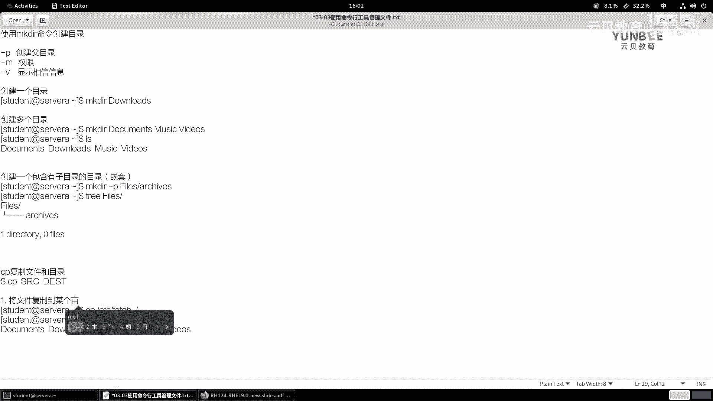

# 零基础入门Linux，红帽认证全套教程！RHCE9认证实战 RH124课程 - P11：03.3 使用命令行工具管理文件-理论 - 云贝教育 - BV1Ns2gY8EVU

第三节啊使用命令行工具呢来管理文件啊。那么在这一小节当中呢，我们学习的命令啊啊基本上呢都啊包含在了我们的这个目录当中啊，比如说啊和创建目录相关的，我们会用到MKDR。

那么复制相关的命令呢是用CP命令O移动呢是MV，我们一般读为move啊，删除文件的话呢是2M啊，如果是空目录，删除的是空目录呢，我们也可以使用IMDR啊，那么具体的这些命令该如何使用呢。

我们来接下来看第二页的PPT。OK那么首先呢我们来介绍呢如何呢去创建目录啊，命令呢叫MKDIR。好，那么使用MKDR啊，那么命令呢来创建目录。那么在使用这个命令的时候呢。

呃这个在不同的linux发向版当中啊啊可能会有一点点的差异啊，就选项的这块差异。那么但是它的主要内容是没有任何区别的啊。比如说我们会用到一个选项呢，叫杠P。啊。

杠P那这个P的意思呢代表的是啊创建父目录啊父目录。OK创建副目录呃，还有一个选项呢叫什么呢？叫杠M。啊，杠M，那么这个M的意思呢代表的是modode啊，我们翻译过来呢叫权限啊OK。权限啊。

就是啊他的几个，哎，还有一个呢叫什么杠V啊，V呢就是来详显示详细的信息。啊还有一个呢叫杠I啊，杠I代表的是啊交互啊交互啊，询问一下啊，要不要去删除啊。那如果你忘记掉这几个命令呢。

我们可以使用make啊DR杠杠help来打印它的帮助啊，打印它的帮助啊。那么这里呢我们看到的主要是这个杠M啊，杠M啊杠P啊杠M你看modode啊权限，那么设置啊一个文件的一个权限啊。

类似于我们在这个将来后面的第几张啊呃，大概是在第呃。

第七章的时候啊，我们会学习到一个命令的叫CHMODOK。啊，然后呢，P呢就是parents啊parents。那如果你在创建啊多个目录的时候，那这个目录之间呢是属于是递归的关系啊。

那么它的副目录如果不存在呢，就会被创建OK啊，V像信息啊OK。

好，那么我们的这个命令是没有杠I的啊，我把这个刚I呢给去掉啊。好，那么接着呢我来给大家演示一下。那么假如说啊我现在呢先远程到我们的啊这个思路A啊，思维A节点。

那么sA节点里面加目录呢是空的啊，什么都没有。那现现在呢假如说我要想创建一个一个目录，那么命令呢就是make dR空格啊。如果没有任何特殊的要求的话呢。

那么你就啊直接在命令后面跟上你的目录所在的位置呢就可以了。那现在呢我要在当前的目录当中啊去创建一个down。哎，download，那么回车呢就可以了。哎，这是创建一个目录啊。

创建一个目录makedown。

创建一个目录。那如果我想创建多个目录呢？那么如果我想像创建多个目录，那么我们的命令呢就是这样一个效果。那么make dR后面跟上你要创建的目录名称。

啊，然后哎这样的一个结构啊。啊，啊回车就可以了。那么我们来看一下，那么本地呢就会增加一些什么呀？多个目录啊，多个目录。

啊，这创建多个目录命令。那如果呢创建的目录呢，创建一个什么呀啊，包含有什么呀，子目录啊，子目录的目录OK那么就意味着是嵌套的功能啊，就嵌套。也要递归啊要递归。那么我们的命令呢就需要使用一个什么指令啊？

我们暂时先不执行啊，我们先这个啊直接写一个命令叫什么呀makeDR，比如我写一个啊fis。

啊，那么fa里面比如说写个ARCHIVES我们看一看它会提示我们什么消息，然会报错啊。他说这个呃没有办法去创建这样的一个目录，因为没有找到对应的文件或者目录他他这里说的啊文件目录是谁呢？其实指的是谁呢？

他就是我们在执行这个命令的时候呢，就是我们的shall呢，他认为我们我们啊期望在fas这个目录下面啊去创建这个啊这个archives啊这个单词写错了啊。啊。

archies他希望我们去啊就是他认为我们就创建的就是他啊archies。但是呢呃又发现fas这个目录呢不存在啊就会报错。那么因此呢，如果遇到这种情况怎么办，我们就加一个选项P即可啊，P即可。那么。

也就意味着我们在执行这个命令的时候呢，他先尝试在fiels下面创建这个目录，发现。这个什么呀fas不存在。那么他就会先去创建谁呀？副目录啊，然后再创建它的子目录。OK这样的话呢。

我们的这个目录啊就出现了。O就出现了。指他们之间的一个啊递归的关系啊递归的关系。OK好，这是我们目前学习的啊。那么杠M呢我们暂时呢先啊不介绍啊，我们后面学习到权限管理的时候呢，再给大家演示啊。

那么V啊只是显示的一个信息啊，你可以在任何的MKDR里面呢去跟上一个选项V啊，看上一个V。

好，这是makeDR的命令。那么接下来呢我们来说复制文件和目录啊，复制文件和目录。那么它的命令呢叫CP。啊，叫CPOK那么CP啊用来复制文件。或目录。和目录吧因为它都支持啊，用CP命令。那么它的语法呢。

简单来说呢，就CP啊CP然后呢，这个fa啊这个什么呀SRC啊SRC语原嘛，对吧？语原啊，然后呢，目的地那就是DEST目的地啊DDAD那假如说呢我在。

我的终端当中啊终端当中，那么我只有一个这样的命令啊，叫做什么呢？啊，叫做这个哦，现在还没有文件是吧？那么我就那个CP分啊，CPP谁呢？ETC下的FSTAB。那我复制这个文件到哪里呢？到当前目录下面啊。

我就加上一个点斜杠好了。啊，那么我们来看一下，那么本地呢就存在一个这样的文件啊，那么这里的ETC下的啊FS table报呢就是一个原文件。那么呃后面的这个据点加斜杠呢代表是一个目录啊。

当前的位置啊当前的位置。

那如果啊那么这个这个例子呢，代表的是将什么呀文件。复制到某个目录下。啊，某个目录。

哎，这是第一种用法。第二种用法。那如果我直接这样执行呢，CPFStable，然后写个什么newFStable。那么我们在执行这个命令的时候呢，我们并没有指定任何的位置，也意味着这个文件是在什么呀？

在当前的目录下方的那这个就是复制一个文件到新的文件名，对吧？那你也可以理解为是什么呀？备份吧啊备份啊，都可以这样理解，在当前目录下复制文件。

啊，也可以用于用于什么呀，复制目录啊。在当前的位置。复制文件啊，其实你也可以理解为后面有没有目录，有啊，谁呀，底上斜杠嘛。对吧，第二写杠当前目录下的newFST。OK好，这是这种用法啊用法。好。

那么接着呢我们来说第三种啊第三种情况。第三种呢就是啊复制什么呀，目录。啊，复制目录。那么举举个例子啊举个例子，我们在复制之前呢，我们暂时先把我们的fas。

啊，我们把这个FS table呢放在fas当中啊，那么就是CP啊FSTAB到fas。好，然后呢我们的fas当中啊就存在了一个新的文件。那么这个时候呢，我们如果去直接复制这个这个什么呀fis的话。

我们看能不能把它复制到这个啊文档当中。那么会提示什么呀？他说没有指定杠R会忽略目录fis啊，因为你在复制的时候呢，他要想复制过去，他首先要把这个目录下的稳。文件要复制进去。因为你只附这个目录。

这个目录里面是有数据的啊，就好像举个例子啊，就好像哎让你搬一个箱子。那么这个箱子当中呢，还有其他的文件啊，它这个地方呢就很傻瓜。就说你你帮我把这个箱子啊搬到哪里吧。

那么我们按照正当理解是不是代表的是把这个箱子还有箱子里的文件一起搬到哪里啊，对吧？但是他不是这样认为他认为呢只是啊这个搬这个箱子，那发现箱子里面有文件，他就不知道怎么办了啊。

不知道哎我要不要把这个文件一起带过去呢，他不知道怎么办。所以说呢对于我们而言，那么我们要加一个选项杠R就可以把这个目录和目录里的文件啊复制到目标的目录当中啊，目录只能复制在目录里面啊。

文件的话呢可以在本地也可以啊也可以这个啊在其他的目录下方ok这是复制目录啊复制目录。那么除此之外呢，我们的这个CP命令啊，还有一些其他长的选项给大家来举例出来，我们用hel来打印一下。

O那么在这个CP当中啊啊那么这里比如说有个杠A杠A的话呢代表的是杠DR和什么呀啊，这个啊pre all啊，那么我们要看一看这个D和R代表什么意思的。那么D代表的是什么呀？和类似于什么呀？

类似于no啊 differenceence啊和这个pre links啊，就是那么呃仅仅保留什么呀？链接啊，然后呢这个R呢大写字母R呢代和小写字母R是一样的，代表的是递归啊。

所以说呢这个A呢一般我们可以理解为是复制文件的时候呢啊会复制它的什么呀？你看这里保留所有嘛，保留所有啊，那么就意味着它会复制什么呀？复制这个文件的时候，他把文件本身的所有属性啊也都复制过去。

你可以理解为是100%的复制啊，100%的复制。那么你像我们前面的这种复制呢，你可以理解为只是把文件的内容哎复制过去了。因为文件本身还是其他的特性啊，比如说所有者所属组权限等等啊。

那么加个A就可以实现这样一个特性啊，选项啊CP杠A，你可以理解为什么呀？这个是归档的意思，对吧？啊，归档。

啊，轨档你可以理解为什么呀啊，这个100%的。复制什么呀，复制文件，因为它会保留什么呀？啊，保留文件的什么权限呀啊属性啊。啊，属性啊啊这个等信息OK。啊，CP杠A。那如果你不想复制的这么多信息量。

那么还有一些其他的选项。比如说这里提到的。

啊，什么呢？比如说我们平常用到的这个小写字母P。哎，小小字母P小小字母P呢代表的是保留保留什么呢？保留它的权限所有者和时间出。啊，这是默认的值啊，OK杠P。

啊CP啊，杠P代表的是复制10。啊，保留谁呀，保留他的。

OK权限所有者和时间戳。

啊，所有权吧，我们把理解为啊所有权，还有时间戳。OK实验出，那么A要比P要更丰富啊更丰富啊。好，然后呢，CP杠大的字母R或者是什么呀，或者是CP杠R都代表的是递归啊，递归。啊，就这么多啊就这么多。好。

那么除此之外呢，CP还有一个非常重要的命令呢呃一个选项啊叫CP杠I啊，杠I代表是交互啊，什么意思呢？就是说啊这个地方要注意了，就说我们的CP命令。在复制文件啊复制的时候吧，那么是具有风险的。

OK什么意思呢？就是说啊那么如果啊如果啊这个目标位置。目标位置存在和无和原文件。和原文件相同的文件。会什么呀？覆盖啊会覆盖这个啊目标文件内容。那么大家想一想，这样是非常危险的对吧？非常危险的。

所以说呢我们可以使用结合杠I选项，那么杠I可以帮助我们。啊，询问用户啊询问用户。是否什么呀覆盖？啊，会询问我们啊，那这样的话呢，就可以增加一个保险。OK好，这是第二个命令啊。

接着第三个命令呢叫移动文件和目录。那么这个命令的用法呢最为简单啊，MV后面跟上你要移动的文件名或者是目录名就可以了。然后呢把它指定到另外一个位置啊，指定一个位置。那么在移动一个文件或目录的时候。

如果原文件的位置和目标文件的位置都在相同的目录下，那么我们可以理解为是什么呀？重命名啊，重命名。OKMV啊MV。移动什么呀，文件或目录。OK那么move这个命令啊，那么默认就支持什么呀？

在移动的同时会保留啊这个文件的这个各种属性信息啊，OK它的用法SRC到什么呀目的地啊，OK那么我们同样举个例子啊。

在我们的目录下方呀，这里比如说有这个什么呀，有个newFS啊。啊，table我们给它重命名一下。好吧，咱们放在fis下面啊，回车L。那你会发现我们当前目录下方就不再有newFS table包了。

因为去哪里了呢？因文为去fi要目录当中了。

啊，就这一个例子啊，就足够了啊，因为这个命令没有任何特殊的用法。那么同样那么他有一个选项呢是杠I啊，代表的是交互。那么他呢在使用的时候和CP是一样的啊，那么就是和CP什面类似。啊和CP。啊，一样。

避免什么呀覆盖啊同名的文件啊，同名的文件OK。啊，说及同名了。那么我们要注意的是在我们linux当中啊，那么我们是严格区分大小写的。啊，这个地方大家要知道一下啊。好。呃，这是MV的命令。

那么第三个啊说完了，第四个命令呢叫RM。RMRM呢是一个删除文件的命令。啊，删除文件或目录啊。那么首先呢他这个命令呢有一个选项呢叫II交互。还交互，那么和CP也是一样啊，和CP1样。

但是呢这个交互呢在这里你又不能说是为了覆盖了，而是什么呀？在删除之前啊，询问啊，这个用户进行什么呀确认。OK好，那么RM呢它有一个选项呢叫R，代表是递归。啊，地归。那么一般用于什么呀？

用于删除目录时使用。还有选项呢叫杠FF呢代表是强制不再什么呀询问啊，会什么呀？覆盖啊会覆盖。肛癌的什么呀，这种交互特性。那你都强制了，你刚才是要询问呀，对吧？那么。然后呢，在这个我们红包里面啊。

那么你像我们的root用户啊，在删除一个文件的时候呢，那么默认情况下，你在执行的IM相当于IM杠I。而普通用户呢在执行RM的时候呢，它只是RM。因为RM本身就不会询问，就相当于加了F的选项。

OK那么所以说那么这个地方注意啊，就是IM本身。命令本身在是啊。本身啊在删除文件时。啊，就是不询问的。OK那么。这是一个特的一个注意事项啊注意事项。因此我们在删除的时候呢，特别要注意啊，IM删除文件啊。

并非将文件移动到什么呀？回收站。那么又意味着一旦删除啊，一旦删除。一旦删除啊，那么要想。恢复啊恢复被删除的文件，那么需要什么呀？需要专业的。数据恢复软件。哎，才可以。所以说大家一定要小心啊一定要小心。

那一定要小心使用。OK好，那么现在呢我们举个例子，那么现在啊目录下面有一个FS table，我就可以IMFS table，你要不加询问就立马就消失了。

啊，不加询问就立马就消失了。那么假说呢我们来到菲尔斯墓当中。我现在要想删除FS table加个I。那么这个时候他就询问我呀要不要删除，如果同意的输个Y，不同意的输个N。按，文件就没有删除。

那么这种方法可以啊这个降低我们这个误删的一个可能性。啊，可能性啊，这个地方大家一定要注意啊要注意。

好，那么如果我想删除的是一个目录呢，我回到家目录，我想删除的是fiels这个目录RM，那么fis回车看到没有？是没有办法删除的。那么我可以加一个谁呀？R。加R的话呢，就可以删掉了。啊，就可以删掉了。

啊就消失了啊就消失了啊RM杠R删除目录。

啊，是强制删除。

OK这样一个作用啊。所以说呢以前大家总是开玩笑说那个哎我们不能够使用RM什么杠RF。删除谁呀，跟目录。啊，这样的话风险很高的。其实后来呢呃这个linux在呃这个开发过程当中啊，也意识到一个这样的问题。

那么所以说呢它就这个保护了我们的根目录啊，当我们使用RM杠2F删除目录的时候呢，它会告诉我们它是什么危险的啊，危险的。当然除非你在使用一个选项，什么选项啊，就是这个no per serve什么呀。

这个root不需要保留根目录。那这个命令一回撤下去，我告诉你，整个根目录呢就会被删除掉。只要能够被删的就会被删除掉。所以这个非常非常非常的危险的一个命令OK。

啊，非常危险的一个命令啊。那么除此之外呢，还有一个命令也是非常危险的。就是我们呃后面会学习到什么呀，会学习到一些这个呃符号。啊，一些符号。OK那么比如说我这里写个通位符星号。啊。

那么但是呢我前面有没有使用什么呀noprosive route，那么这样个命令一旦回撤下去呢，它虽然不会把根给删掉，但是呢会把根目录下所有可用于删除的文件呢干嘛呀？全部删除掉。

那么它的风险呢和前面刚刚的这个解图的命令啊，没有任何的啊这个区分。你你不能说哪个风险高，哪个风险低啊，那么这两个命令任何一个啊，都可以啊这个使你受到应有的惩罚。O那么这个惩罚的话呢。

不仅仅体现在你的啊职这个职那个你的职位上面，可能和你的年终奖啊相关，甚至啊如果你删除的这个数据非常非常重要，正恰好没有备份的话。

OK那么你还可能会面临什么呀？牢狱之灾。那么所以说大家一定要注意删除文件的删除数据的时候，大家一定要三思而后行啊，并且要养成什么呀？经常备份的这个习惯啊。OK同样啊高频度的一个警告啊警告啊。

大家一定要小心啊，一定要小心OK。嗯，然后呢，如果我们想更保险一点的话怎么办呢？对吧？那么给大家个建议，就是说啊对于文件啊，对于文件，那么建议大家呢就使用什么呀啊，使用MV。RMV来替代什么呀？RM。

IRM你比如说举个例子，比如说呢我要删除一个什么呀文件。啊，RM啊一个。一个一个重要的什么呀文件。那么我可以用哪个命替开呀？那么替换，那么你可以这样来替换，叫什么呀？叫做RM啊。

这个这这个换成什么MV啊AMPO是吧？POR。你可能创建一个目录，比如说这个目录叫TRAASH好吧，然后下面呢叫AMPORTANT。啊，清音T哎，后面跟上一个什么呀？啊，你后面跟上一个时间来结尾，对吧？

比如说呢这个文件我本来是计划什么呀啊，这个金天山的，比如说2023年啊，这个这个啊12月18号是吧？几点几分啊，比如写个啊16点19分，哎，你这样啊，一回车对吧？哎。

那么将来呢你就可以根据后面的时间戳来还原这个数据。对吧当你确定的确不要了，你再来到这个目录里面去删除。那这个目录啊，我只是举个例子啊，我们环境当中是不存在的那你可以专门弄一个目录，然后来存放你啊想删除。

但是啊又不确定后面要不要用的文件啊替换。还有呢就是可以去互联网上啊去查找类似于这种什么有种有些软件，什么CRM。啊，类类这种这种类似的什么呀，这种脚本啊来替代RM命令。啊，RM也是很很有可可能的啊。

呃我记得45年前吧，我记得在ge的 hub上还是哪里来着啊，我我就遇到了一个类似的命令，然后它的作用呢，就是我们在删除的时候啊，它哪怕你是字符界面啊，它会在你的加目录里面创建一个隐藏的啊。

这个回收站的一个目录。那么你删除第一次删除这个文件的时候呀，那么它会自动的利用MV命令，将你这个文件移动到什么呀？你的这个加目录的一个隐藏的回收站里面。然后当你确定啊你说我真的不要了。

那你来到这个回收站里面干嘛呀？再次执行第二步的RM命令。就可以完完整整删除掉了啊，但是呢这个脚本之前没有保留啊，后来就再也找不到了。嗯，在网上再找到这种类似于C方RM命令都是干嘛呀？写个配置文件啊。

然后呢啊里面定义个清单啊，这个清单呢就是说比如说哎我这个文件重要，我把它写上去你在RM删除的时候，它死活删不掉啊，就被保护了没有办法被删除啊，是中国通过这种方式来实现的啊。哎呀，这个挺可惜的啊。

以前那个命令，我觉得特别好啊，特别好一个脚本啊。OK那如果是目录的话呢，怎么保护呢？如果是目录，那么我们可以使用啊这个RMDR呢来替代。为什么呢？因为RM啊DR呢仅删除什么呀？仅删除我们的空目录。啊。

仅行删除我们的空目录。也就意味着，如果我们的目录当中啊，然后存在这个文件的话啊，那么他就会干嘛呀，就会这个。呃，跳过啊跳过。那么我们举个例子啊，比如说。

啊，举个举个例子。啊，我们就拿这个文档来说吧。那文档当中有有有有子目录吧，子目录当中呢有子文件。那么们2MDR啊do词。删不掉的。也删不掉的啊。哎，那么因为为什么？因为它里面有文件啊有文件。

那这个时候呢，你只能够什么呀，先去确定啊，比如说哎这个啊这里面这个目录里面呀有一个FS table，那这个文件我确实不想要了，先删掉哎删掉。然后呢，你这个时候呢再检查检查这个目录里面有没有有没有文件。

如果没有了，那我们就可以使用什么呀？RM。DR去删除啊这个目录了。那么我们来看一下。啊，里面没有了那，你说那我我其实本意上是既删除这个目录，也删除fis，同时也删除谁呀？这个文档这个目录。

那么你可以加上一个什么呀？删除副目录啊，就删除副目录的。同时删除它目录下的子目录。那么这个命令要写去要把这个路径啊写全啊，也是可以的啊，也是可以的OK好，这是我们给大家的就是一些建议啊，就是。

再删除也好啊，哪怕你不是删除，你利用的是什么CP命令啊，FV命令啊，你都要小心翼翼啊，千万不要说为了着急啊做做错的事情OK。好，那么这个地方哎。删除某个目录。那么杠P呢代表的是删除目录。

同时删除目录的同时啊，删除什么呀？副目录。啊，父目录。好，这是我们给大家介绍的这些啊命令啊，虽然简单啊，但是呢都会有一些潜在的风险。

