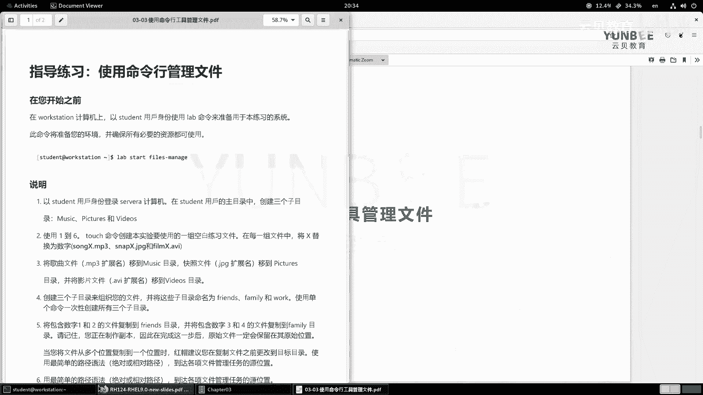
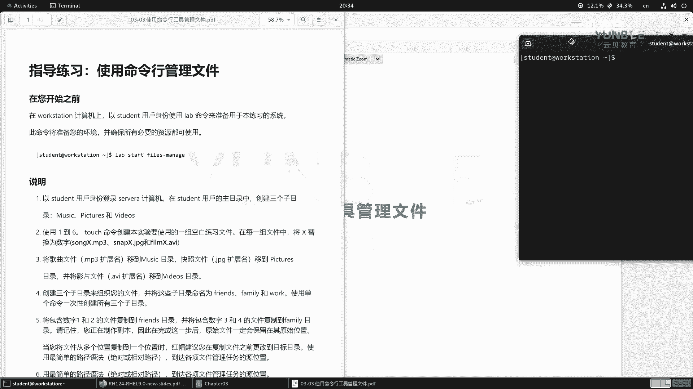
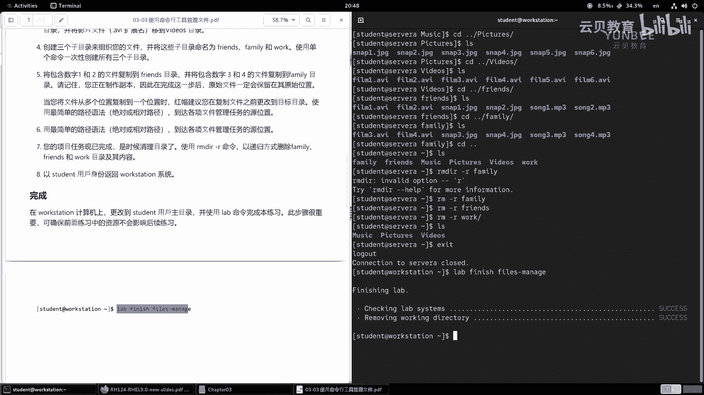
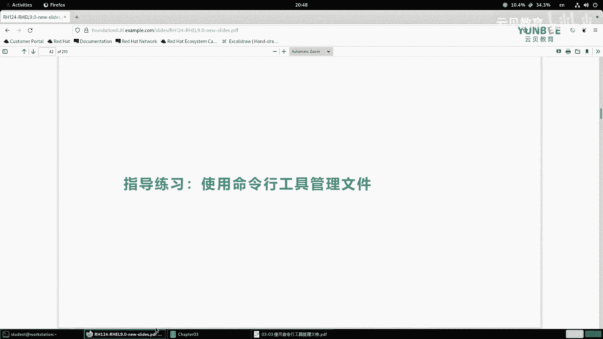

# 零基础入门Linux，红帽认证全套教程！RHCE9认证实战 RH124课程 - P12：03.4 使用命令行工具管理文件-实验 - 云贝教育 - BV1Ns2gY8EVU

那么接下来呢为大家来演示一下啊，那么我们这一小节的一个课后实验啊，那么使用命令行工具呢来管理文件。好，那么首先呢我们来看我们的题目，然后我们打开一个终端，那么这个终端我们可以呃拖放这个窗口啊。

然后呢让它一个分屏。

好，那么这个实验的话呢，要求我们首先啊登录到我们的这个word station上面。那么这个实验呢我们完全使用命令行呢就可以啊，命令行不需要打开啊work station的这个图形化界面。啊，好。

那么首先我们以student用户的身份呢来执行我们的lab命令。那么我现在啊已经成功的登录在了我们的word station，然后来执行我们的这个lab指令。Lb， start。Fs。Mageage。

好，那么执行完毕之后，那么我们来看要求啊，那么第一步。那么以student用户的身份呢来登录到s A。然后呢，在呃student用户的主目录啊。

也就是加目录当中创建三个子目录music picturestures和videos。好，那么我们直接呢来登录到sorry A。啊，L看一下啊。OK那么这个是这三个目录呢，是我们啊上课演示的时候的啊。

我们现在呢给它删除掉啊。把拆着掉。啊，现在很干净了啊，那么我们来创建这个目录。那么首先我们走一个make点MUSIC。啊，创建一个了。那如果你想看细节呢，你就加个V啊。

pictures PICTU啊RES啊，make DR杠VVI。啊，DEOS videos啊三个目录呢就出现了。好，第二步呢使用1到6。

那么touch命令O那么touch命令呢可以用来创建新的空白文件啊，另外一个作用呢就是更新时间戳啊，更新时间戳O啊，那么更新时间戳呢，这个功能呢给大家来介绍一下，我们举个例子吧。

比如说在t下面有非常多的文件啊，其中你看这里的RC logo，对吧？它是12月18号。呃，2点42分，那么现在的时间呢是啊这个7点36分，那么我们可以用touch命令啊，跟上一个已存在的文件啊，回车啊。

权限的问题啊。呃，权限不足。那么我就先提个全啊，让大家看一下效果。那么接着呢我们再来去看看这个时间啊。那你会发现呢这个时间呢就更新到现在了。OK也可以更新到现在啊啊，这是它一个作用啊。好。

那么我们现在呢用touch呢来创建一些文件啊，touch。什么呢？1到6啊，那么1到6分别是song开头的MP3啊，snap开头的图片和film开头的视频。啊，送啊，那么一啊送2。

因为我们现在呃有些这个扩展名的快捷方法呢还没有学习啊。所以说我们的这个命令啊在执行的时候呢，相对来说啊比较繁琐一点。啊，送2点MP3。送。3点儿。MP3。啊，送。4。MP3。还有送啊。点MP3。啊。

然后。然后送6点MP。啊，这是song的文件。然后呢，我们接着呢再来创建什么呀？snap的文件啊，SNAP1点啊GPG。Sle2。第二GPG。啊，sap3点。GPG。然后SNAP2啊，这个三了4啊点儿。

GPG啊，snap5点GPG。sn6点GEPG。啊，这是我们的图片啊图片好，接着呢我们的视频文件啊。啊，就是模拟的这些文件，其实都是空的对吧？都是空的啊，这个主要是。假装啊是一些什么图片呀啊。

这个视频呐啊这种音乐音频文件呀啊。好，那么他只能film。FILMR1点AVI。film2。AVI。啊，film3点AVI。fem4点AVI。Fm。5R点AVI还有个 film。6点AVI。好。

那么这些文件呢被我们创建完毕。那么第三步，那么将歌曲文件就是以MP3呢作为扩展名的，那么移动到music目录啊，然后快照文件呢移动到pictures，那么我们就在啊这些目录里面啊，那么。

咱们CD到哪里呢？啊，首先来到music目录。啊，然后呢我们move啊 movevemove什么呢？move复目录下面的。啊，MP3的扩展名啊，那么就是s啊1点MP3。啊，然后以及上级目录的s2。

MP3。啊。Song。3点MP3。还有上级目录的。Song。4点MP3。还有送5点2MP3。啊。Song。6。点MP3，那么把它移动到当前的目录下啊回车。那么LOS看一下。

那么当前目录啊就多了很多个文件啊。然后接着CD两个据点返回到上一节啊，那么看一下啊，少了什么呀，音乐的然后呢，接着呢我们要把图片移动到pictures。啊，移动到pictures。

那么我就CD的啊pictures，还有刚才的命令啊，move啊，上个目录里面的snap一点GPG上级目录的snap2点GPG啊，上一个目录的什么呀？snap3点GPG。那么在这里呢。

我们使用了tableboard的快捷键啊，可以提高我们的效率。啊，张一记的啊snap5点GBG。I有 snapap6。就完事了。当前目录啊当前目录。那这个当前目录甚至呢你都又写个句点就可以了。啊。

句点就可以了啊，回车啊，L能看到我们移动过来的文件。好，CD2个据点返回到上一级。啊，那么只剩一下什么呀？视频文件了。好，那么按照同样的方法呀，我们先切换到视频目录当中啊啊清理一下屏幕啊。好。

那么接着呢我们再使用move啊MV负目录下的film1点AVI啊，film2点AVI还有film3点AVI还有film4点AVI还有film5点AVI。啊，还有film6点AVI啊，一直到当前的目录啊。

回车。啊，搞定啊，好的好，然后呢接着啊接着那么第四步第四步呢要求我们创建三个子目录呢来组织文件。那么将这些文件分别命名为fancefamily和work使用单个命令，一次性创建所有的三个子目录。

那么这个三个子目录没有设位置。那么我们就把它理解为什么呀？理解为我们的这个加目录下面啊，那么返回到上一级。在这里好，make DR啊。

那么这三个目录呢分别是fance FRIEN啊 FRIENDS还有个family FA。啊，FAMILYWOK啊，回车那么看一下，那么11一口气呢，我们就创建了什么呀？三个目录啊，三个目录好呃。

然后呢第五步干嘛呢？第五步要求我们啊将这个包含有数字一和二的文件复制到fr目录啊，咱们这个要一个一个来啊，一和2的复制到france目录。那么就意味着啊是复制啊，那就CP我们加个V吧。

这样能看到一些细节啊。那么分别呢有这个歌曲啊，music下面的song点一点文件啊，music下面的song2。点啊，然后接着图片啊，图片的话呢是pictures下面的snap一。啊。

然后pictures下面的snap2，还有视频videos下的film一啊，videos的film2。啊，把它移动在哪里呢？fance啊fance好，移动过去了啊，移动过去了。好。

接着呢我们啊这次呢就是将啊包含有数字什么呀，三和四的文件复制到family。啊，family ok那么接着啊那么还提醒我们是制作的副本啊，完成之后呀，原始文件还在原来的位置。

那么我们用CP呢就就说明是没问题的啊。好，music下面的song加3啊，还有music下面的 songong什么呀啊，这个4。啊，还有这个pictures下面的snap2。啊。

pictures下面的啊这个n。哦，不对啊，不是2啊，是3对吧？哎3啊，还有step4嗯啊，还有video里面的film3啊，vide里面的film4。把它移动在我们的family目录下。检查一下啊。

我们的对不对？fends。全部是一和二的啊，然后呢，这个family全部是三和四的啊，三和四的啊。嗯，然后他又提醒我们，当将文件存多位置复制到一个文件时呢，建议我们呃在复制之前呀先更改到目标位置。

使用最简单的路径啊，他要让我们用绝对或相对路径，对吧？我们这里呢并没有移动，我们直接使用了什么呀？相对路径啊，我们没有移动进去啊？OK然后第六步啊使用最简单的路径语法。

那么到达各项文件管理任务的语原位置啊，那么其实呃其实的话呢，他就是让我们去哪里呢？去到这个。呃，原来文件的位置，比如说这个这个呃音乐啊直接相对路径。拿进来了啊，然后123456啊。好。

然后呢接着去图片里面，那那我们用相对路径。对吧啊，123456，还有什么呀视频里面。啊，哎还有这个fance里面。啊，还有这个family里面。相对路径啊，全部是相对路径。好，接着呢项目完成之后呀。

清理目录，使用IMDR以递归的方式删除family friends和work。啊，和workO那么我们先返回到上一集啊，然后呢走个命令啊，RM啊RM什么呀，DIR。DIR啊删除杠R删除family。

Our family。啊，OK删除。哦，这个地方啊sorry这个地方我是啊抄错了啊，我没有更改，应该是RM啊杠R的方式啊，RM杠R啊，没有DR啊，ORM杠R啊，family。啊，还有这个RM什么呀。

杠R啊，france。那2M杠R work后面这个斜线要不要都行啊，不影响的那不影响的。好，然后呢我们再退回啊，回到我们的。这个over station，然后检查一下我们的这个执行的步骤呀。

是否是正确的，结果是否符合它的要求。那么我们就执行一个lab finish files manage命令啊，lab。那finish啊 fails。F I。L， yes杠 M， A， N A G。

检查一下啊。好，那么成功的结束了。那么我们的这个实验啊就到此为止。

