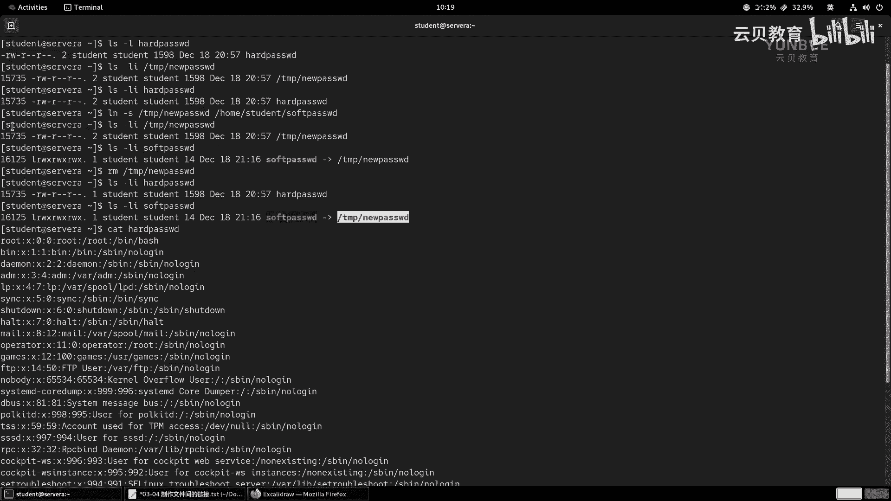

# 零基础入门Linux，红帽认证全套教程！RHCE9认证实战 RH124课程 - P13：03.5 制作文件间的链接 - 云贝教育 - BV1Ns2gY8EVU

啊，第四节呢是给大家介绍如何制作文件之间的一个链接啊，那么文件的链接呢我们分为两种，一种呢叫硬链接，一种呢叫软链接啊。那么其中软链接呢又称之为是符号链接。啊，链接呢有两种。OK分别为什么硬链接。啊。

另外一种呢叫软链接。其实我们标准的称法呢叫为符号链接啊，符号链接。然后呢，另其位叫软链接。那么软链接很容易理解，我们就把它理解为谁呀？理解为windows当中的快捷方式啊，快捷方式。

O那么在正式的了解什么是硬链接和软链接之前呀，那么我们首先把这里的啊所谓提到的什么链接到底是干嘛的？我们先举个例子啊。那么要想明白呢，我们首先要给大家普及一点点这个数据存放在我们文件系统当中的一个模式。

OK那么一块新的磁盘是不能够直接存放数据的啊，一块新的磁盘。是无法存放数据的。啊，就没有办法直接存放数据。那么在本地的磁盘当中，我们一般是干嘛呀？先将我们的这个磁盘呢创建一个分区。啊，分区。

那么接着呢是将这个分区呀进行格式化。那么这个所谓的格式化呢，也就意味着我们用另外一种专业的说法呢，叫做制作什么呀，文件系统。那制作文件系统OK当我们在制作文件系统的时候呢，那么这个文件系统里面呀。

被啊被初始化一个呃两个区域。那两个区域，那么第一个区域呢叫原数据的区域。啊，原数据原数据里面我们称为make data啊，m data。那么原数据序当中存放的是什么呀？啊，是一个iode。哎。

里面目前我们关心的就是I know是一个索引啊，是一个什么呀索引编号。那么另外一个区域呢叫什么呀？叫数据的区域。啊，数据那么数据呢是block啊，快啊快。啊。

为什么我们前面给大家介绍我们的磁盘文件叫快文件，对吧？哎，就是它的这个本质啊，里面都是各种各样的快啊，快啊，那么用于存放数据。啊，每个块大小都是固定的啊，比如说四兆哎。

四兆OK那么将啊一个文件啊存放于啊这个文件系统中的时候呢。那么会干嘛呀啊，会给这个文件呀分配一个什么呀，一个i know。啊，分配一个i know，然后呢啊去查看啊，然后呢将什么呀，然后将数据。

那那么写入什么呀，I know对应的什么呀？对应的block。OK对应的block是这样一个过程啊。那么我们画一张图，那么大概呢是这个样子。那么比如说我们有一块磁盘。啊，然后呢给它进行格式化。

那么格式化的时候呢，就分成两个区域啊，两个区域。啊，那么左边的这个区域呢，就是我们的原数据区域啊，叫me data。啊，然后呢右边的这个区域呢是我们的数据。啊，出据。

那么数据里面是大大小小各种各样的什么呀block啊block。啊，大小都是一样的啊，都是一样的，各种各样的block。O然后呢和它对应的关系呢，前面还有不同的什么呀？i know。啊I know。啊。

I know的。啊，我们给他画的。即系。呃，尽量的。准确一点啊，哎，我们这样画，那么再接着一个iode。啊，那么他们之间呢是存在有一个映射的关系的啊，映射关系的。映射关系啊就这样出现了。

那么将我们这时候呢，我们存放一个文件啊，这个文件呢假如呢就叫做fill一。非要一。那么我们的文件系统呢会查看啊哪一个block，还有Iode是空着的，没有被分配。那么它就会建立一个什么呀这样的一个关系。

啊，建立一个这样的关系。那么这个时后呢，我们的数据呢就干嘛呀？哎数据呢就这个它们之间的一个关系呀就达成了啊，这那么这样的一条呢就是一个链路啊，一个链路啊，一个数据的链路O那么要想查看一个文件对应的索引。

那么我们的命令呢，可以使用如下的命令。我们先看看我们的加目入当中是否有文件，如果没有呢，我们就尝试复制一个文件过来啊，CP啊CP那么ETC下面的PASSWD啊，然后复制到。

我们附到哪里呢？附制到t里面吧啊，那么叫做new啊PASSWD。那么这个时候呢，我们走个命令啊，LS杠LI啊，这个L呢你可以用，也可以不用啊，后面跟上一个文件啊。那么你像我们在执行命令的时候。

如果想快速的啊这个引用上一个命令的参数的话呢，我们可以在我们的be shell当中啊，使用EIC按键再摁个句点啊，不是个组合，是先后的顺序，先摁ESC。释放掉再按一下句点就能够。

快速的把上一个命令的参数调用在我们当前的事要当中。然后回车。那么在呃输出的结果当中，那么最左边呢有一个编号呢叫15735。那么这个15735呢，就是我们的这个文件的什么呀？索引啊，索引I know。

啊，i know ok啊，那么这个15375对应的文件名啊，有了，或者文件名对应的呃，这个io也有了。然后呢，这个io呢对应的哪个block啊，block，那么就能够看到具体的一个块。

OK那么我们给大家介绍一个命令啊，介绍一个命令。那么叫什么呢？叫做STAT。那么这个命令呢可以来查询我们文件的一个啊一些信息，原信息，那么STT type下面的new pass。那么这个时候呢。

我们来看一下，你看它的文件名文件的大小啊，那么所占用的块呢几个块也是8个块啊，每个块大小呢是4096字节啊，它属于常规文件。那么所在的设备呢有个设备的编号啊，设备的编号。

然后I know呢是15735啊，15735。那么link呢是一个，那么这个link的一啊是一，那么指的是硬链接的数量。那么这个一呢也是对应了我们IOS杠L里面的啊这个地方。

啊，这个地方的数值啊，他们是一一对应的啊一一对应的okK啊，这个文件我们可以通过这种方法呢去查看啊去查看。

OK那么所以说我们图片上的这样一个蓝色的这条一条线呢，就是一个什么呀？就是一个硬链接啊，是一个硬链接。OK好，那么我们这里呢可以标识一下，那么是一个什么呀？hard link。啊har的 link。啊。

OK那么黄色的线呢是啊还什么呀，还没有使用的，好吧，还没有使用的。啊，not use好吧，还未使用的啊一条线路。我们把这个呃外面的这个框呀改成。黑色的。黑色的好。呃，这是里面的两个数据啊，那么两个数据。

那么接下来我们来看我们的PPT啊。那么如果想创建一个新的应链接的话呢，那么指的是通过命令啊啊，对我们的这个文件啊文件，然后呢啊它对应的io呢干嘛呀？再创建一个新的文件名啊，新的文件名。那么反过来说呢。

就是说我们创建的这个链接的文件名啊，和原来的文件长得不一样。但是呢这两个不同的文件名，它们之间所映射的i know呢是同一个io，那么也就意味着他们映射了同一个数据框。那么这就是一个新的硬链接。

硬链接OK好，那么我们以图片上面的这个为例，那么就相当于干嘛呀？相当于呀我在这里啊，然后又创建了一个文件。那又创了一个文件叫fi几啊，fall2。那么这个菲2呢，它映射的谁呢？

映射的是前面的这个iode啊，那么我这边要用蓝色的线了啊，蓝色的线哎，那么它映射的是谁呀？映射的是这里。OK他映射的是这里。那么这里的F2的这个蓝色的线呢，就是一个硬链接啊，硬链接OK好。

那么接着呢我们来说说什么是符号链接或者叫软链接。那么所谓符号链接呢，指的是我们在我们的文件系统当中啊，文件系统当中。那么创建了一个新的文件名啊，那么这个新的文件名啊，它指向了一个新的iode。

那么这个新的iode呢对应了一个新的数据块儿，但是这个数据块里面存放的不是啊原数据的数据啊，它放的什么呀？它放的是啊真正就原始数据的文件名。啊，文件名啊，就说我们去访问的这个你新创建的这个文件的时候呀。

它其实查找的是原来的文件的名称。然后再根据原来的名称啊，检索文件系统里面的这个文件名，然后去找对应的数据块啊。好，那么如果想用图片的方式来理解呢？哎，那么就是理解为我们创建了一个谁呀，fill3啊。

fill3。那么fa3，我们用红色的呢来描述啊，是一个软链接。啊，非13。那么这个fi3啊对应的是我们的原来的这个i know啊，i know我们把这个往下挪一挪，哎，这样画图呢看起来更加的清晰一点。

OK好，那么我们就把这条线啊给它拿出来啊。啊，是红色的。那么这条线呢因为有数据了啊，就有这个变成红色的了。那么这个block里面存放的什么数据呀？存放的是这个fi一，哎，存放的是fi一的文件名。哎。

那么这个时候呢，我们如果呀要想去查找啊这个看读取fi3，那么我们的文件系统啊就去查找fill3对应的什么呀I know，然后呢再去找这个I know的时候呢。

去发现哦对应的block里面存放了一个文件名叫fill一。啊，那么这个时候呢，他就干嘛呀？开始啊去查找啊，我们的文件系统当中叫做文件一的文件。啊，文件一的一个这样的文件。啊，这样的一个关系啊。

那么这样的一个链路呢就是一个什么呀？就是一个啊这个符号链接啊，符号链接OK啊，这一个关系啊，那么ok那么所谓的。好，那么前面的这个例子啊，那么就相当于什么呀啊，是一个硬链接啊。啊。

那么接着创所谓的创建应链接呢，就代表的是创建了。啊，创建了一个什么呀，一个新的文件名。但是呢这个文件。使用的是什么呀？使用的是圆。那原。啊，数据文件名的什么呀？I knowok那么所谓创建符号链接。

那么代表的是创建了一个新的文件名。啊，文件名，然后呢并分配了。分配了什么呀？一个新的I know。那么既然是分配新i note就意味着会分配一个什么呀？分配一个新的。分配新的block。来存放数据啊。

那么那么这个block当中。啊，这个block当中啊存放的呢不是新文件名的数据，而是什么呀？原。啊，原啊文件文原数据吧，原数据文件的名称。啊，哎，是这样一个关系啊是这样关系。那么我们可以举个例子啊。

举个例子，假如说呢我现在呀。哎，我现在呢这个意外呢获得了一个什么呀藏宝图。啊，藏宝图。那么这个藏宝图A吧，藏宝图A呢告诉我啊，告诉我什么呢？他说了这个在啊在这个啊一棵树下，比如说某某棵啊某棵苹果树。

苹果树下呢有一个什么呀？啊有个盒子。啊，有个盒子okK那么盒子里面有个什么呀？盒子里面呀有金币，好吧。有金币。啊，有金币，那么那么就意味着我那么这个地方啊。那么书递一个盒子盒子里面有金币。

那么那么这样的话呢，就意味着你打开了这个藏宝图，A，是不是就能能就能够得到这个金币，对吧？哎，那么这是一个直接关系，你你就按照藏宝图里面说的地方，你直接来到这个苹果树下这个盒子，那么这个盒子里面啊。

哎我们就盒子A吧。那么这个盒子A里面就有个金币。那那么还有个藏宝图B。OK藏宝图壁。那么藏宝图B呢说了在这个哎某个什么呀，这个苹果树下。有个盒子B。哎，一个盒子B，但是但是呢这个。他说哎。

那么得到什么呀，得到这个盒子B。啊，说这个盒子B呀啊盒子啊B啊中有宝藏。OK。有保障。但是呢这个你拿到这个盒子币之后呢，里面什么呀，什么都没有。但是有一个东西啊，盒子B。那当中呢没有金币。啊，没有金币。

但是呢有个有个纸条，好吧，有个纸条。那么这个纸条上写呀，纸条上说了。啊，这条上说了这个啊这个这个什么呀，这个在数的什么呀？啊，在这个数啊叫正南方OK正南方啊，那么100步啊100步。的位置啊。

那么啊向下什么呀？挖啊向下挖这个1米okK1米深。啊，然后呢那有有什么呀，有金币。好吧，有金币O那么这里的盒子A啊盒子A。啊，盒子A，那么就是什么呀？那么就是应该说藏宝图吧，哎，藏宝图。A和盒子A。

盒子A的关系啊以及金币吧，以及金币，那么就是一个什么呀？就是一个啊硬链接。啊，那么下面的这个呢例子当中啊，那么藏宝图B。okK藏宝图。啊，参宝图B。和盒子B。啊，以及纸条，那么就是一个什么关系啊？

就是一个。只是一个符号链接。啊，是一个符号链接的关系啊，因为纸条并不是金币啊，你需要通过这个纸条呢才能够啊拿到真正的金币啊这样一个关系啊。好，那么该如何去制作呢？好，那么我来看一下这个命令的用法。啊。

用法啊，那么要想创建一个链接，那么我们的命令呢叫LN。OKLN呢就是link的英文缩写LINK啊。呃在以前的linux方译版当中啊，我们还会遇到这个LINK的命令。那么现在的话呢应该是不存在了啊。

我们来看一下有没有。

啊，哎还存在啊还存在OK你看创建一个什么样一个链接啊，还有啊还有OK。啊，这个命令其实啊也是可以的啊，但是我们不这样用啊，我们会呆mon专门的用LN啊LNOK。

LN啊跟上一个什么呀啊原文件啊，然后呢后面跟上你的这个目标文件名称啊，创建硬链接啊，那么在创建硬链接的时候呢，有一个注意事项呢，就是最重要的事情呢，就是啊在创建啊。创建硬链接。的时候。

那么注意不支持什么呀？不支持跨什么呀，我们的文件系统，为什么呀？因为不同的文件系统里面啊有不同的iode，对吧？每个io呢都有自己对应的block，所以你不支持跨文件系统。那么那么我们的命令呢。

举个例子啊，举个例子，O那么LN谁呀？t下面的new fS啊，passWD然后放在home啊 studentdent加目录里面，好吧，咱们起名叫什么呀？har hard什么呀？PASSWD。

那么这个时候呢，我们来观察一下啊，L杠I吧，杠L吧，type下的new pass W D，还有加目录下面的这个hardpa WD。咱们观察一下，那么和以前的比较而言。

你会发现我们的这个这里的啊link的数量是不是变成2了。变成二了，对吧？然后呢，我们加上一个什么呀，加上一个I啊，我们来看一下这两个呃这个文件它们之间还有什么区别啊。

那么你会发现他们的i know呢也是相同的。那么也就意味着你在访问hardpassword或者直接访问什么呀？type下的password是不是相同的呀？对不对？相同的路径啊，相同的方法。

那么唯一的区别呢就是说名文件名什么呀不一样而已啊，除此之外没有任何的区别啊，这就是我们的应链接。

啊，硬链接O好，那么接着呢来创建软链接。那么创建软链接的命令呢就是中前面加一个选项呢叫SS呢是英文符号的缩写啊，SYMBOL啊，哎这个sble啊，这样一个符号啊。

那么同样后面的用法就是原文件跟上目目的地文件啊，那么我们同样来举个例子啊，比如说我们走一个LN啊ETCt下面的newpaWD那么我们前面加上一个选项啊，杠S。

那么我们的目标文件呢在student下面啊，那么起名叫做link吧，起名叫soft吧。哎，然后呢PASSWD。OK那么同样我们来快观察一下，这次呢直接使用LI啊，type下的new pass WD。

因为发现我们的这个文件名呢，它的hardlink部分啊并没有发生任何的变化，还是2啊，然后呢接着呢我们来查看我们的soft pass wD。因为发现它的链接是几啊，是一。

然后它的I know的值呢是新的一个值162125和原来没有任何关系。并且呢。在我们的这个文件名，它指向了一个文件，叫什么呀？叫tamp下的new passWD。啊， new怕的。

那么这个是我们创建什么呀？创建软链接啊。OK那么软链接的话呢是支持什么呀？跨文件系统的。所以说呢我们在日常的使用过程当中啊，创建这个软链接的场景要比创建硬链接的场景呢比较多啊。

但是呢我们呃对一个重要的文件创建多个硬链接，却可以防止什么呀？误删其中某一个，因为你删除任何一个文件啊，又假如我们有两个硬链接，对吧？你删除任何一个文件都没有问题的。因为我们在删除一个文件的时候呢。

其实相当于干嘛呀？相当于把它的这个。这个文件名和Iode之间的一个映射关系给它破坏掉了，对吧？啊，数据呢并没有消失。但是呢我们另外一个链接是不是还存在。所以说这个数据还能读取到啊，那反过来。

那如果啊如果我把这个原文件删掉了啊，删掉了，那么这个链接呢就破坏掉了。哎，那么对于软链接而言啊，它就去找这个非一啊，非一还在不在，不在了，那么就会提示我们目标丢失啊，目标丢失啊，我们来感受一下啊啊。

那么RM。

那RM。tap下面的new password D，这个时候我们LI一下我们的hard password，你会发现我们的硬链接的数量变成一了啊，然后呢这个软链接呢。啊。

你会发现啊它就会后面的这个地方变成红色的啊，在以前老的版本里面啊，那么这个地方还会闪烁。啊，闪烁那么意思呢就是目标丢失了。好，我们来看一看啊，你看读取hard pass wD是能够读取到数据的。

如果我们读取这个soft password呢，就会提示找不到文件或目录。是soft password找没有了吗？不是的，是software对应的文件名没有了啊，没有了，所以会出现一个这样的问题啊。

出现一个这样的问题OK。

检验删除什么呀？原数据文件。啊，然后呢查看啊我们的链接是吧，是否产生影响。啊，是否存在影响。好，那么除此之外呢，还有些其他的区别。那么我呢啊放在了一个表格当中啊，那么我们来总结性的看一下啊。

那么软链接类似于windows当中的快捷方式啊，那么而硬链接呢？啊，我们左边的吧，好吧，那么软链接又称为是符号链接啊，那么链接当中的任何一个文件发生改变呢，都会同步到其他的文件。

就是说你直接修改原文件也好，修改你的软链接的文件名的名称也好。那么最终呢都是同步在了原文件的数据当中。那么第四条呢是软链接，可以支持跨文件系统，并且呢软链接呀还可以指向什么呀？文件以及目录。哎。

它支持目录的啊。那么第六个呢就是那么我们的这个软链接里面的这个iode呀和原始文件的iode是不一致的。包括权限也不一致。因为它这个全新的啊，全新的一个文件，你可以这样理解。

OK那么我们的软链接只记录原始文件的路径啊，或者叫文件名，不记录什么呀？原始文件的内容啊。那么这里提到一个路径啊，就意味着无论是创建软链接还是硬链接，我们在创建的时候，如果是在同一个目录下。

那么你用相对路径的方式呢来定义呢就可以了。如果在不同的目录里面，一定要使用绝对路径啊，这个地方大家要注意。好，那么第八条呢就是如果原始文件被移除，那么我们的软链接啊就会失效啊。

那么用法呢就是LN杠S跟上原始文件啊，这个链接文件名就可以了。那么我们的软链接那么标识里面会有个杠L一个L啊。

将来我们会学习到一个find命令啊啊可以利用这个命令来查找啊啊也可以通过什么s links跟上目录来查找失效的软链接啊，软链接。看看某个目录当中是否存在一个这样的软链接。那么比如说我们的这套这个里面啊。

我们可以来剪一次。比如说SYMBOL啊SY。

啊，linkux当前目录。那么就能够呃发现我们的这个啊文件的一个关系是存在有缺陷的啊有缺陷的。

好，那么硬链接呢硬链接呢它本质上是原始文件的一个镜像副本啊，就是相当于一模一样啊，只是文件名不一样而已。就像在镜子当中看到的自己啊OK啊，哪都一样啊，哪都一样。

OK那么接着呢第二个呢就是我们的硬链接是没有别名的你硬链接就叫硬链接啊，但是我们一般就link嘛啊link啊，就是指的就是硬链接了。OK那么那么对于硬联级而言。

同样你修改任何一个文件名都是和原数据是一样的。因为这两个对吧？都是指向同一个什么呀block，对吧？O。好，第四步呢就是不能跨文件系统啊，然后我们的硬链接呢只能指向什么呀文件，为什么呢？

因为其实目录这个东西呀，严格意义上来说并不存在。并不存在OK那么是为了让我们便于什么呀组织文件而出现的一个概念。所以说我们的这个目录啊，你创建完这个目录之后，你会发现。

那我们来看一下这个目录啊，LID。你发现啊这个目录的话呢，它就直接有两个link了，看到没有啊，有两个link啊。

O这个地方注知道就行了。O然后第六个呢就是我们的原始的io和硬链接的io它们之间的关系呢都是相同的啊。哎，我们的硬链接记录的原始文件的内容就是原始的io呀，原始的i block呀。

OK第八个呢就是原文件哪怕被删除掉，我们的链接也不受影响啊，命令LN就可以了啊。然后硬链接没有任何的标记啊，如果我不告诉你是个硬链接，你根本看不出来。那么你要想判断的方法呢，只有通过谁呀？

通过这里的link的数量来判断。如果是文件是一个二的话，它就是有硬链接目录不存在硬链接这个概念啊，它只有一条，你不能创建新的硬链接，它只有这一条链接。

OK如果是文件，那么这个地方是二的话，那么它一定存在一个创建的硬链接啊硬链接。

呃，OK那么硬链接不存在失效，那数据有有就是有没有就没有啊，没有就没有OK。好，那么这个是我们如何去创建硬链接和软链接的所有内容。

