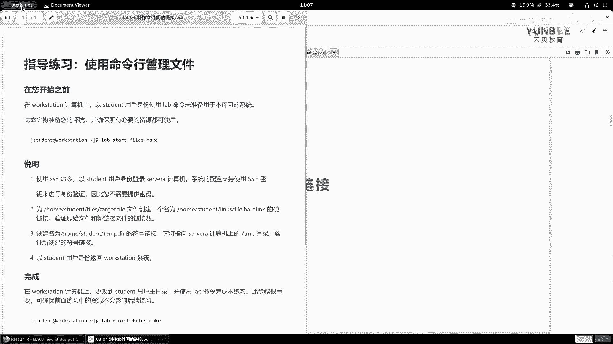
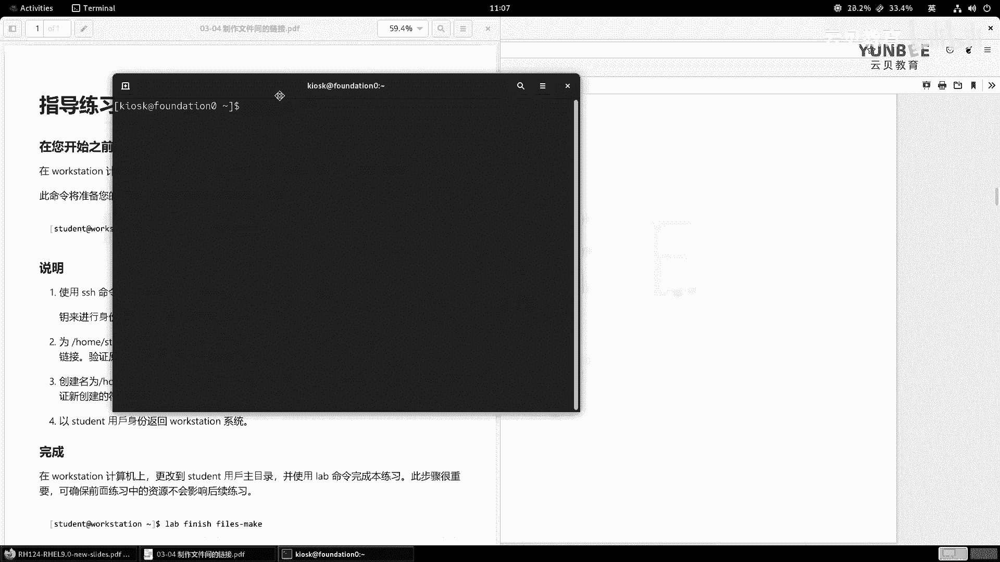
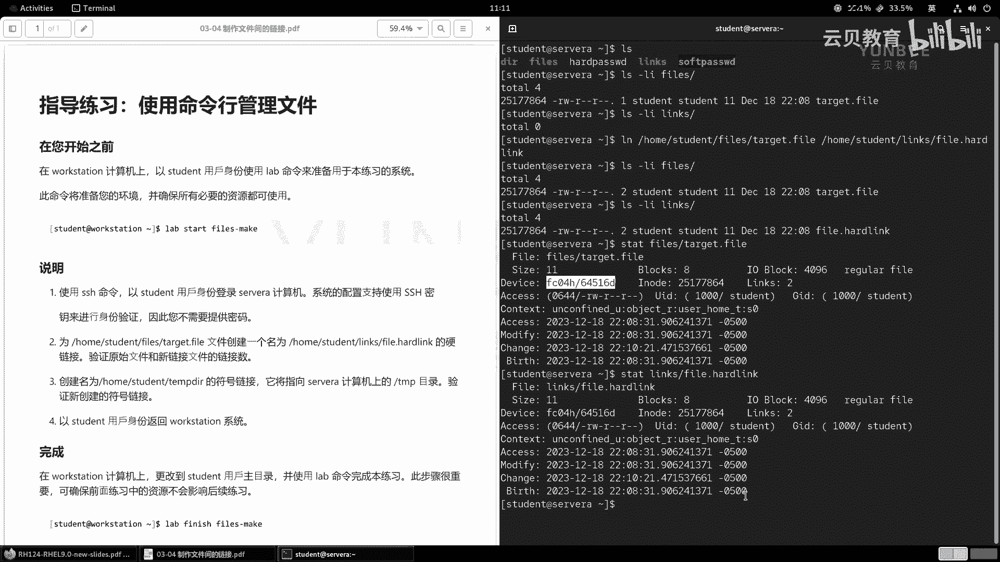
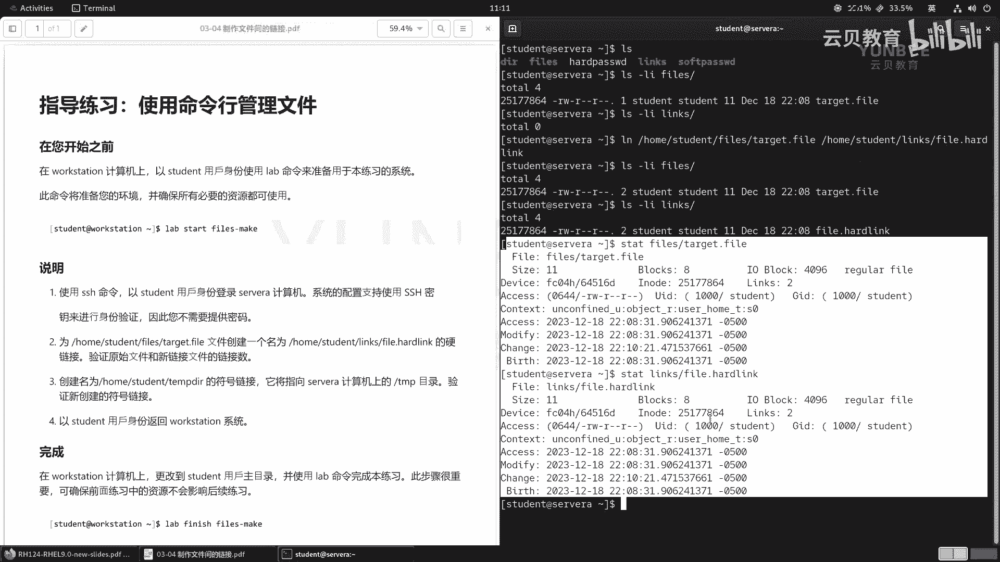
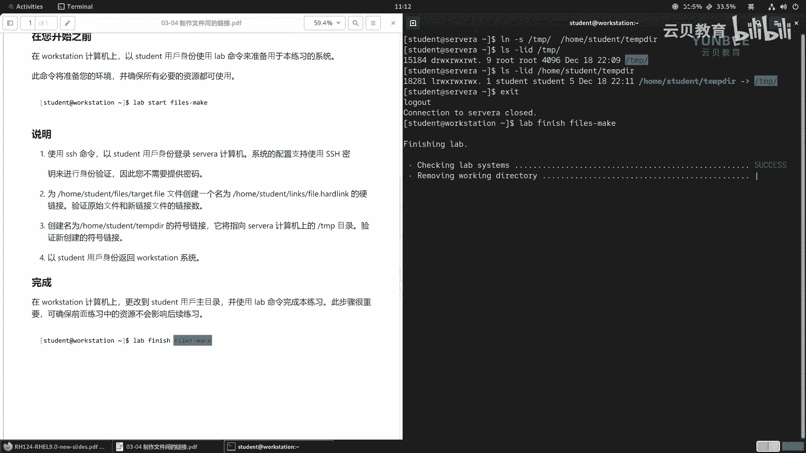

# 零基础入门Linux，红帽认证全套教程！RHCE9认证实战 RH124课程 - P14：03.6 制作文件间的链接-实验 - 云贝教育 - BV1Ns2gY8EVU

那么接下来呢带着大家呢来演示一个实验啊，用来巩固我们刚刚学习的理论知识啊，那么实验呢是制作文件间的链接。OK好，那现在呢我已经打开了我们的练习题啊，那么按照之前的方法呢，我们可以拖动我们的这个窗口啊。

向屏幕的左边啊，然后呢一个分屏。然后呢，接着呢我们再打开一个终端。

啊，这个终端呢，我们就拿着它鼠标往右往右啊去滑动，然后呢进行一个分屏。

OK好，那么我们来看要求。那么首先我们登录到over station上面，然后呢注意用户呢一定要是student用户。好，那么登录成功之后呢，我们来执行一个lab命令啊。

lab start files make。好，那么脚本执行完毕之后呢啊我们来看说明。那么第一步使用SSH命令，以student用户的身份呢来登录到servA的计算机啊，SSH啊ser A。好。

那么这个时候呢我们的系统啊给我们配好了SSH的密钥，做设份验证，我们是不需要输入密码的。那么第二步呢。

为home student files下面有一个tge点 file创建一个名称为home studentdent links fell点 hardlink的硬链接。

然后呢验证原始文件和新链接文件的连接数。那么这个时候呢，我们先清理一下屏幕啊，L看一下目录当中啊，是否存在啊这个fas的一个目录。OK好。

那么接着呢我们啊使用L4杠LI来看fas下面啊存在一个tge点fi啊，里面呢有一个文件啊，那么它的硬链接的数量呢是一啊，然后呢它的I know的编号呢是25177864。

那么我们接着呢来检查一下我们的links当中是否存在啊，为空。好，接着呢我们开始创建硬链接啊，那么因为跨了不同的目录，那么我们建议呢使用绝对路径啊，硬链接link原文件home啊，student。

下面的fas里面的tge点 file目标为home student，下面的links，然后名字呢叫fell点儿啊，har啊，linkO回车。

那然后呢接着我们来检查一下啊这个原文件的链接数量呢变成了几压2啊变成了2。那么新的文目录下面呢增加了一个fe点 hard linkO那么链接数呢也是2，它们之间是相互的嘛。哎。

然后呢按的值没有发生变化啊发生变化。其实我们前面给大家介是介绍的这个SDAT命令啊，也可以帮助我们去啊查看这些信息啊，做一个比对。OK那么你会发现啊他们的。I know的是相同的设备呀。

你看都是在相同的位置啊，都是在相同的位置。那么包括它的时间戳都是一模一样的啊，两者之间除了文件名啊，位置这两个不一样之外，哪里都是一模一样的啊，一模一样的O。

好，接着呢我们来看第三步，那么创建一个名是home studentdent tab啊，这个DR的符号链接啊，那么将它指向s a计算机上的t目录，验证新创建的符号链接啊，那么目名称LN杠S。根目录下的t。

那么指向的是home student啊TM。啊，TM啊P啊DIR回车，我们来验证一下啊LID好吧，那么是t。啊，那么接着呢我们再来验证一下home student type点。啊，那么你会发现啊他们。

都是不一样的哎都是不一样的。但是呢我们的链接却指向了跟目录下的tamp。那么执行完毕之后，第四步呢，使用student用户呢来返回到我们的word station。at word station啊。

已经返回了啊。然后呢，最后呢再整一个lab脚本lab finish files make啊，那么这个时候我们其实可以用我们前面的命令啊，用这个对吧？啊，lab啊快速的调出来这个命令。

然后呢把这个start呀换成谁呀finish。然后呢来清理这样的一个工作。

ok好，那么这个实验呢我们就结束了。